<!-- page 1 -->

# KINH TẾ THƯƠNG MẠI ĐẠI CƯƠNG

# GENERAL TRADE ECONOMICS

### NHÓM BIÊN SOẠN: TS. Dương Hoàng [VERIFY_OCR: hoàng/hoàn — check PDF trang 1] Anh, TS. Vũ ThịHồng Phượng, Ths. Nguyễn Minh Phương,

Ths. Thái Thu Hương, TS. Lê Như Quỳnh, Ths. Đặng Hoàng [VERIFY_OCR: hoàng/hoàn — check PDF trang 1] Anh,

Ths. Nguyễn ThịNguyệt, TS. Lê Nguyễn Diệu Anh, TS. Hà Xuân Bình,

Ths. Lê Trọng Nghĩa, Ths. Phạm Hà Phương, Ths. Lê Trang Nhung

### BỘ MÔN QUẢN LÝ KINH TẾ

<!-- page 2 -->

## HƯỚNG DẪN HỌC TẬP HỌC PHẦN

### Nội dung giảng dạy

### của học phần Chuẩn đầu ra học phần

02
03
04
01
05

### Mục tiêu học phần Đánh giá học phần Tài liệu tham khảo

2

<!-- page 3 -->

## MỤC TIÊU CỦA HỌC PHẦN

Học phần cung cấp cho người học các kiến thức cơ bản về
những vấn đềkinh tếthương mại theo tiếp cận vĩ [VERIFY_OCR: vĩ/vi — check PDF trang 3] mô. Các kiến
thức nền tảng này là cơ sởgiúp người học vận dụng nghiên cứu
những vấn đềkinh tếthương mại của Việt Nam và các nước.

3

<!-- page 4 -->

## CHUẨN ĐẦU RA CỦA HỌC PHẦN

Nhớvà mô tảđược những thuật ngữkinh tếthương mại

cơ bản, bao gồm thương mại dịch vụ; cung cầu hàng
hóa, dựtrữhàng hóa, chi phí lưu thông… trong thương
mại hàng hóa; hội nhập thương mại; nguồn lực và hiệu
quảkinh tếthương mại.

Nhận biết và giải thích được những vấn đềkinh tế

thương mại trong thực tiễn;
Cập nhật [VERIFY_OCR: nhật/nhặt — check PDF trang 4] kiến thức mới vềkinh tếthương mại.

Tác phong chuyên nghiệp;
Tổng hợp thông tin, diễn đạt và tranh luận (cá nhân,

nhóm) trong phân tích các vấn đềkinh tếthương mại
trong thực tiễn.

# CLO

# CLO

## 03

## 02

## 01

# CLO

4

<!-- page 5 -->

## ĐÁNH GIÁ HỌC PHẦN

ĐIỂM THI
KẾT THÚC
HỌC PHẦN

ĐIỂM
KIỂM TRA

ĐIỂM
CHUYÊN CẦN

Trọng số 0.2

Trọng số 0.2

Trọng số 0.6

5

<!-- page 6 -->

## ĐÁNH GIÁ HỌC PHẦN

| Thành phần đánh giá | Trọng số | Bài đánh giá | Trọng số con | Rubric | Liên quan đến CĐR của học phần | Hướng dẫn đánh giá |
|---|---|---|---|---|---|---|
| 1. Điểm chuyên cần (Đ ) 1 | 0,2 | Chuyên cần | 1 | R1 | CLO3 | GV đánh giá dựa trên số lượng video bài học mà người học đã xem được thống kê trên hệ thống LMS của Trường và ý thức học tập của người học. |
| 2. Điểm kiểm tra (Đ ) 2 | 0,2 | Bài kiểm tra | 1 | R2 | CLO1, CLO2, CLO3 | Trích xuất từ điểm bài kiểm tra trên hệ thống LMS. |
| 3. Điểm thi kết thúc học phần (Đ ) 3 | 0,6 | Bài thi cuối kỳ: Thi trắc nghiệm trên máy tính | 1 | R3 | CLO1, CLO2, CLO3 | Điểm bài thi được chấm bởi hệ thống thi trắc nghiệm của Trường. |

Điểm học phần là tổng các điểm thành phần của học phần nhân với trọng số tương ứng, theo công thức:

Đhp = ĐiKi

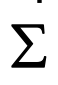

6

<!-- page 7 -->

## ĐÁNH GIÁ HỌC PHẦN

| Thành phần đánh giá | Tiêu chí [VERIFY_OCR: chí/chỉ — check PDF trang 7] đánh giá | Mức độ đạt chuẩn quy định |  |  |  |  |
|---|---|---|---|---|---|---|
|  |  | Mức F (0 điểm) | Mức D đến D+ (4,0-5,4 điểm) | Mức C đến C+ (5,5-6,9 điểm) | Mức B đến B+ (7,0-8,4 điểm) | Mức A (8,5-10 điểm) |
| R1 | Tự học trên hệ thống | Số lượng video chưa xem > 40% tổng số video của học phần | Số lượng video chưa xem từ trên 30% đến 40% tổng số video của học phần | Số lượng video chưa xem từ trên 20% đến 30% tổng số video của học phần | Số lượng video chưa xem từ trên 10% đến 20% tổng số video của học phần | Số lượng video chưa xem ≤ 10% tổng số video của học phần |
|  | Ý thức học tập | Sự chuyên cần và ý thức học tập của người học được đánh giá căn cứ vào mức độ tự học trên hệ thống, kết hợp với đánh giá sự tương tác (nếu có) của người học trong quá trình học tập học phần. Trường hợp người học không tuân thủ theo điều hành của GV, tùy theo mức độ vi phạm, GV xem xét quyết định việc hạ điểm chuyên cần. |  |  |  |  |
| R2 | Mức độ hoàn thành theo đáp án | Điểm bài kiểm tra trên trích xuất hệ thống LMS |  |  |  |  |
| R3 | Mức độ lựa chọn đúng đáp án | Máy tính tự động chấm điểm thi kết thúc học phần trên phần mềm thi trắc nghiệm của Trường |  |  |  |  |

7

<!-- page 8 -->

## NỘI DUNG GIẢNG DẠY CỦA HỌC PHẦN

CHƯƠNG 1: ĐỐI TƯỢNG, NỘI DUNG VÀ PHƯƠNG PHÁP NGHIÊN CỨU MÔN HỌC

CHƯƠNG 2: BẢN CHẤT VÀ CHỨC NĂNG CỦA THƯƠNG MẠI

CHƯƠNG 3: NHỮNG TÁC ĐỘNG CỦA THƯƠNG MẠI

CHƯƠNG 4: THƯƠNG MẠI HÀNG HÓA

CHƯƠNG 5: THƯƠNG MẠI DỊCH VỤ

CHƯƠNG 6: LỢI THẾ SO SÁNH VÀ HỘI NHẬP KINH TẾ THƯƠNG MẠI

CHƯƠNG 7: NGUỒN LỰC VÀ HIỆU QUẢ KINH TẾ THƯƠNG MẠI

8

<!-- page 9 -->

## TÀI LIỆU THAM KHẢO

| TT | Tên tác giả | Năm XB | Tên sách, giáo trình, tên bài báo, văn bản | NXB, tên tạp chí/nơi ban hành VB |
|---|---|---|---|---|
| Giáo trình chính |  |  |  |  |
| 1 | Hà Văn Sự | 2015 | Giáo trình kinh tế thương mại đại cương | NXB Thống kê |
| Sách giáo trình, sách tham khảo |  |  |  |  |
| 2 | Bùi Xuân Lưu | 2006 | Giáo trình Kinh tế ngoại thương | NXB Lao động xã hội |
| 3 | Thân Danh Phúc | 2015 | Giáo trình Quản lý nhà nước về thương mại | NXB Thống kê |
| 4 | A. Mattoo | 2002 | Development, Trade and the WTO | The World Bank |
| 5 | Thomas A.Pugel | 2016 | International Economics | New York: McGraw-Hill Education |
| Các website, phần mềm... |  |  |  |  |
| http://www.moit.gov.vn |  |  |  |  |
| http://www.statista.com |  |  |  |  |

9

<!-- page 10 -->

# CHƯƠNG 1.

# ĐỐI TƯỢNG, NỘI DUNG

# VÀ PHƯƠNG PHÁP NGHIÊN CỨU MÔN HỌC

<!-- page 11 -->

### CHƯƠNG 1. ĐỐI TƯỢNG, NỘI DUNG VÀ PHƯƠNG PHÁP NGHIÊN CỨU MÔN HỌC

Đối tượng và nội dung
nghiên cứu của môn học

1.1

Phương pháp nghiên

1.2

cứu của môn học

Vị trí của môn học

1.3

11

<!-- page 12 -->

## 1.1. ĐỐI TƯỢNG VÀ NỘI DUNG NGHIÊN CỨU MÔN HỌC

Đối tượng nghiên cứu
Nội dung nghiên cứu

12

<!-- page 13 -->

## 1.1. ĐỐI TƯỢNG VÀ NỘI DUNG NGHIÊN CỨU MÔN HỌC

Những nguyên lý kinh tế căn
bản phát triển thương mại mà

Các mối quan hệ kinh tế
diễn ra trong lĩnh vực trao
đổi, lưu thông hàng hóa và

điều kiện các nguồn lực phát
triển có hạn trong khi nhu cầu

cung ứng dịch vụ

là vô hạn

### Đối tượng nghiên cứu

Xu hướng phát triển kinh tế thương mại hàng hóa và dịch

vụ, các điều kiện về thị trường, môi trường thương mại…

trong mối quan hệ biện chứng với những tác động, điều
tiết của hệ thống các quy luật kinh tế trong điều kiện nền

kinh tế thị trường

13

<!-- page 14 -->

## 1.1. ĐỐI TƯỢNG VÀ NỘI DUNG NGHIÊN CỨU MÔN HỌC

## Nội dung nghiên cứu

Cơ sở, quá trình hình thành và phát triển của trao
đổi, bản chất kinh tế và chức năng của thương mại

Những tác động của thương mại ở các phương
diện và góc độ đến sự phát triển của một quốc gia
hay địa phương, đặc biệt là về kinh tế

Các nội dung được nghiên cứu
trong điều kiện nền KTTT và bối
cảnh toàn cầu hóa, hội nhập kinh

Các vấn đề cơ bản về kinh tế thương mại
hàng hóa và thương mại dịch vụ

tế quốc tế và có định hướng vào

điều kiện của Việt Nam

Nghiên cứu nguồn lực và hiệu quả kinh tế của thương
mại, đồng thời nghiên cứu việc sử dụng nguồn lực và
phát triển thương mại theo hướng bền vững

Lợi thế so sánh và hội nhập, phát triển kinh tế
thương mại quốc tế của quốc gia

14

<!-- page 15 -->

## 1.2. PHƯƠNG PHÁP NGHIÊN CỨU CỦA MÔN HỌC

###  Phương pháp luận: phương pháp luận duy vật biện chứng.

###  Phương pháp nghiên cứu chung:

Phương pháp phi thực nghiệm

Phương pháp thực nghiệm

###  Phương pháp nghiên cứu cụ thể:

Phương pháp so sánh

Phương pháp cân đối

Phương pháp toán kinh tế

15

<!-- page 16 -->

## 1.3. VỊ TRÍ CỦA MÔN HỌC

Cung cấp kiến thức tổng quan vềnhững vấn đềcủa
kinh tếthương mại, làm nền tảng cho việc tiếp cận
những kiến thức chuyên ngành vềkinh tếvà quản lý
thương mại

Học phần thuộc khối kiến thức cơ sởngành, trình độ
đại học của các chuyên ngành được giảng dạy tại
Trường ĐH Thương mại

16

<!-- page 17 -->

# CHƯƠNG 2.

# BẢN CHẤT VÀ CHỨC NĂNG CỦA THƯƠNG MẠI

<!-- page 18 -->

## TÌNH HUỐNG KHỞI ĐỘNG BÀI

Hôm nay, chủnhật, gia đình anh A có khách từquê lên chơi. Nhà vẫn còn nhiều đồ
nên vợanh A giao cho anh A ra chợmua thêm một con gà và ít hoa quả. Anh A cầm
tiền ra chợThành Công mua đồ. Anh vào hàng gà của bà B mua 1 con gà mía nặng
2kg với giá 145 nghìn đồng. Mua xong, anh sang hàng hoa quảcủa cô C mua táo.
Sau khi trảgiá, anh quyết định mua 3kg táo Gala New Zealand và đưa cho chủsạp
hàng 147 nghìn đồng. Cô bán hàng đóng táo vào giỏvà đưa cho anh A cầm về.

### Câu hỏi:

Các hoạt động của anh A, bà B, cô C trong ví dụtrên có phải là thương mại?

Chức năng của thương mại được thực hiện như thếnào trong ví dụtrên?

18

<!-- page 19 -->

## MỤC TIÊU CỦA CHƯƠNG

• Làm rõ điều kiện (cơ sở) ra đời của trao đổi, các
hình thức phát triển của trao đổi và sựra đời của
thương mại
• Nghiên cứu bản chất kinh tếcủa phạm trù thương
mại qua các góc độtiếp cận
• Nghiên cứu chức năng của thương mại

Giới thiệu bản chất và chức

năng thương mại theo các

góc độ tiếp cận

19

<!-- page 20 -->

## CẤU TRÚC NỘI DUNG CỦA CHƯƠNG

Cơ sở ra đời và phát triển

2.1

của thương mại

Bản chất kinh tế và
phân loại thương mại

2.2

Các chức năng của

thương mại

2.3

20

<!-- page 21 -->

## 2.1. CƠ SỞ RA ĐỜI VÀ PHÁT TRIỂN CỦA THƯƠNG MẠI

2.1.1. Cơ sở ra đời của trao đổi

2.1.2. Quá trình phát triển của trao đổi và sự ra đời của thương mại

21

<!-- page 22 -->

## 2.1.1. CƠ SỞ RA ĐỜI CỦA TRAO ĐỔI

### a. Hàng hóa - Đối tượng của hoạt động trao đổi

Sản phẩm của lao động, thỏa mãn nhu cầu

con người
Là đối tượng của hoạt động trao đổi

Hàng hóa (hữu hình)
Dịch vụ

### Hàng hóa

2 thuộc tính:
Giá trị  Được thực hiện trong lưu thông
Giá trị sử dụng Được thực hiện trong tiêu

dùng

22

<!-- page 23 -->

## 2.1.1. CƠ SỞ RA ĐỜI CỦA TRAO ĐỔI

### b. Cơ sở ra đời của trao đổi

Sự xuất hiện của phân công lao động xã hội

Cơ sở ra

đời của
trao đổi

Sự tách biệt tương đối về mặt kinh tế của

những người sản xuất

23

<!-- page 24 -->

Thương mại có ra đời ngay khi có

2 điều kiện đã nêu không?

24

<!-- page 25 -->

## 2.1.2. QUÁ TRÌNH PHÁT TRIỂN CỦA TRAO

## ĐỔI VÀ SỰ RA ĐỜI CỦA THƯƠNG MẠI

Trao đổi hàng hóa trực tiếp

Lưu thông hàng hóa

Thương mại

25

<!-- page 26 -->

## 2.1.2. QUÁ TRÌNH PHÁT TRIỂN CỦA TRAO

## ĐỔI VÀ SỰ RA ĐỜI CỦA THƯƠNG MẠI

### a. Hình thái trao đổi hàng hóa trực tiếp

Trao đổi hàng hóa trực tiếp là trao đổi hàng hóa hiện vật giữa những người sản xuất

dưới hình thức trao đổi hàng lấy hàng, không có sựtham gia của bất kỳtrung gian nào

Công thức trao đổi

## H – H’

Góp phần thỏa mãn nhu cầu trao đổi sản phẩm giữa những người sản xuất và thúc đẩy

sựphát triển của xã hội loài người

26

<!-- page 27 -->

## 2.1.2. QUÁ TRÌNH PHÁT TRIỂN CỦA TRAO

## ĐỔI VÀ SỰ RA ĐỜI CỦA THƯƠNG MẠI

### b. Hình thái lưu thông hàng hóa

Lưu thông hàng hóa là hình thái phát triển của trao đổi hàng hóa, là hình thái trao đổi hàng

hóa thông qua môi giới của tiền tệ.

Công thức trao đổi

## H - T - H’

Lưu thông hàng hóa khắc phục được hạn chếcủa trao đổi hàng hóa trực tiếp, mởrộng phạm

vi [VERIFY_OCR: vi/vĩ — check PDF trang 27] và không gian trao đổi. Tuy nhiên, cũng tạo ra sựtách rời quá trình mua bán (cảvềkhông

gian và thời gian), bắt đầu làm nảy sinh mầm mống khủng hoảng sản xuất và tiêu thụ.

27

<!-- page 28 -->

## 2.1.2. QUÁ TRÌNH PHÁT TRIỂN CỦA TRAO

## ĐỔI VÀ SỰ RA ĐỜI CỦA THƯƠNG MẠI

### c. Sự xuất hiện của thương gia và sự ra đời, phát triển của thương mại

Trao đổi dưới hình thái thương mại, gọi tắt là thương mại là hình thái phát triển cao nhất của

trao đổi, xuất hiện khi lưu thông hàng hóa tách ra khỏi sản xuất và trởthành hoạt động độc lập,

do một bộphận lao động xã hội được chuyên môn hóa (đó là các thương gia) đảm nhận.

Công thức trao đổi

T - H - T', trong đó T’ = T + ∆T

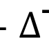

Hoạt động thương mại: bắt đầu bằng hành vi mua T-H, kết thúc bằng hành vi bán H-T’

Mục đích hoạt động thương mại: lợi nhuận

28

<!-- page 29 -->

## 2.1.2. QUÁ TRÌNH PHÁT TRIỂN CỦA TRAO

## ĐỔI VÀ SỰ RA ĐỜI CỦA THƯƠNG MẠI

### c. Sự xuất hiện của thương gia và sự ra đời, phát triển của thương mại (tiếp)

Sựxuất hiện của hoạt động thương mại gắn liền với sựxuất hiện của thương gia.

Hoạt động thương mại lúc đầu chỉgiới hạn chủyếu trong lĩnh vực trao đổi các sản phẩm hữu hình

(TMHH), sau đó được mởrộng sang các sản phẩm vô hình (TMDV).

Ngành thương mại ra đời và phát triển là kết quảtất yếu của sựphát triển trao đổi và PCLĐXH.

Trong lĩnh vực thương mại, ngoài ngành phân phối là ngành chuyên cung cấp các dịch vụmua bán

hàng hóa hữu hình gồm bán buôn và bán lẻ, còn có các ngành TMDV chuyên đảm nhận việc cung

ứng dịch vụcho thịtrường vì mục đích lợi nhuận

29

<!-- page 30 -->

## 2.2. BẢN CHẤT KINH TẾ VÀ PHÂN LOẠI THƯƠNG MẠI

2.2.1. Bản chất kinh tế của thương mại

2.2.2. Phân loại thương mại

30

<!-- page 31 -->

## 2.2.1. BẢN CHẤT KINH TẾ CỦA THƯƠNG MẠI

Tiếp cận thương mại với tư cách là một

hoạt động kinh tế

Các góc độ

Tiếp cận thương mại với tư cách là một

Bản chất kinh tế

tiếp cận

khâu của quá trình tái sản xuất xã hội

của thương mại

Tiếp cận thương mại với tư cách là một

ngành kinh tế

31

<!-- page 32 -->

## 2.2.1. BẢN CHẤT KINH TẾ CỦA THƯƠNG MẠI

### a. Tiếp cận thương mại với tư cách là một hoạt động kinh tế

Thương mại là một trong những hoạt động kinh tế cơ bản và rất phổ biến trong nền kinh tế thị trường

Đặc trưng:

Công thức chung của hoạt động thương mại: T - H - T’

Mọi hoạt động thương mại đều bắt đầu bằng hành vi mua (T-H) và kết thúc bằng hành vi bán (H-T’)

Mục đích: lợi nhuận

Đối tượng: hàng hóa, dịch vụ

Chủ thể: người bán (người sản xuất hàng hóa, người cung ứng dịch vụ, thương gia), người mua

(người sản xuất, thương gia và người tiêu dùng), trung gian thương mại (môi giới, đại lý [VERIFY_OCR: lý/ly — check PDF trang 32] thương

mại...)

Điều kiện môi trường: kinh tế, xã hội, luật pháp, chính trị và môi trường vật chất cụ thể

32

<!-- page 33 -->

## 2.2.1. BẢN CHẤT KINH TẾ CỦA THƯƠNG MẠI

### a. Tiếp cận thương mại với tư cách là một hoạt động kinh tế (tiếp)

Hoạt động thương mại là một quá trình bao gồm các hoạt động cơ bản (mua, bán) và

hoạt động hỗ trợ cho các hoạt động mua bán gọi là dịch vụ thương mại.

Hoạt động thương mại được tiến hành theo nguyên tắc

Tự nguyện

Tự thỏa thuận

Cùng có lợi

33

<!-- page 34 -->

## 2.2.1. BẢN CHẤT KINH TẾ CỦA THƯƠNG MẠI

### b. Tiếp cận thương mại với tư cách là một khâu của quá trình tái sản xuất xã hội

4 khâu của quá trình tái sản xuất xã hội

Sản xuất – Phân phối – Trao đổi – Tiêu dùng

Thương mại

Vị trí: trung gian

Vai trò: cầu nối

Lưu ý

Giai đoạn trước chủnghĩa tư bản, lưu thông chưa chi phối được sản xuất mà coi sản xuất như một tiền

đềcó sẵn của lưu thông, khi đó lưu thông hàng hóa chưa trởthành một khâu của quá trình tái sản xuất

Giai đoạn sau, với nhiệm vụquan trọng là thực hiện tái sản xuất sản phẩm nhanh chóng trong điều kiện

thịtrường không ngừng mởrộng và cạnh tranh quyết liệt, thương mại đã thực sựtrởthành một khâu

không thểthiếu phục vụcho sản xuất.

34

<!-- page 35 -->

## 2.2.1. BẢN CHẤT KINH TẾ CỦA THƯƠNG MẠI

### c. Tiếp cận thương mại với tư cách là một ngành kinh tế

Cơ sởxem xét thương mại là một ngành kinh tế: phân công lao động xã hội.

Chức năng của ngành: Tổchức lưu thông hàng hóa và cung ứng các dịch vụcho xã hội

thông qua việc thực hiện mua bán nhằm sinh lợi.

Ngành thương mại được xếp vào khu vực dịch vụ.

35

<!-- page 36 -->

## 2.2.1. BẢN CHẤT KINH TẾ CỦA THƯƠNG MẠI

Thương mại là tổng thể các hiện tượng, các hoạt động và các

quan hệ kinh tế gắn liền và phát sinh cùng với trao đổi hàng

hóa và cung ứng dịch vụ nhằm mục đích lợi nhuận

36

<!-- page 37 -->

## CÂU HỎI TƯƠNG TÁC

### Ý nghĩa nghiên cứu các

### cách tiếp cận thương mại?

37

<!-- page 38 -->

## 2.2.2. PHÂN LOẠI THƯƠNG MẠI

### Mức độ tham

### Đặc điểm và tính chất của

### Đặc điểm của

### Kỹ thuật giao

### Phạm vi [VERIFY_OCR: vi/vĩ — check PDF trang 38] hoạt động

### gia vào quá trình tự do hóa

### quá trình lưu

### dịch

### sản phẩm

### thông

### thương mại

### trong quá trình TSXXH

Thương mại
truyền thống

Thương mại

Thương mại

TMBB

nội địa

tự do

TMHH

Thương mại

Thương mại

Thương mại

TMBL

điện tử

quốc tế

có bảo hộ

TMDV

38

<!-- page 39 -->

## 2.2.2. PHÂN LOẠI THƯƠNG MẠI

### a. Theo phạm vi [VERIFY_OCR: vi/vĩ — check PDF trang 39] hoạt động

Phản ánh quan hệTM của các chủthểkinh tếcủa một quốc gia với các hoạt

động TM vềcơ bản diễn ra trong phạm vi [VERIFY_OCR: vi/vĩ — check PDF trang 39] biên giới của một quốc gia.
Chủyếu chịu sựquản lý [VERIFY_OCR: lý/ly — check PDF trang 39] và điều tiết của nhà nước
Chia cụthểthành: TM thành thị; TM nông thôn; TM các vùng đặc biệt

Thương mại

nội địa

Phản ánh những mối quan hệkinh tếTM giữa các chủthểkinh tếcủa các quốc

gia với nhau
Tuân thủnhững luật lệvà thông lệbuôn bán toàn cầu, khu vực và các hiệp định

Thương mại

quốc tế

TM ký kết giữa các quốc gia.
Diễn ra ởphạm vi [VERIFY_OCR: vi/vĩ — check PDF trang 39] toàn cầu, khu vực hoặc TM song phương

TM nội địa, TMQT được thực hiện theo những hình thức có thểkhông hoàn toàn giống nhau.

Trong điều kiện môi trường và các quan hệquốc tếhiện nay việc phân biệt TM nội địa và

TMQT mang tính tương đối

39

<!-- page 40 -->

## 2.2.2. PHÂN LOẠI THƯƠNG MẠI

### b. Theo đặc điểm của quá trình lưu thông

Phản ánh quan hệkinh tếthương mại giữa nhà sản xuất, nhà sản xuất với

thương gia, thương gia với thương gia.
Khi hoàn thành các hoạt động mua bán buôn, hàng hóa vẫn chưa kết thúc quá

Thương mại

bán buôn

trình lưu thông.
Chủyếu diễn ra trong lĩnh vực buôn bán các sản phẩm hữu hình.
Chủthểhoạt động TMBB là những nhà sản xuất, thương gia

Phản ánh quan hệbuôn bán hàng hóa và dịch vụgiữa nhà sản xuất, nhà cung

cấp dịch vụ, thương gia với những người tiêu dùng cuối cùng.
Khi hoàn thành hoạt động mua, bán lẻ, hàng hóa kết thúc quá trình lưu thông và

Thương mại

bán lẻ

đi vào lĩnh vực tiêu dùng.

Sựphân biệt giữa thương mại bán buôn và thương mại bán lẻchủyếu ởsựkhác biệt

theo các khâu trong quá trình lưu thông của sản phẩm và mối quan hệcủa các chủthể.

40

<!-- page 41 -->

## 2.2.2. PHÂN LOẠI THƯƠNG MẠI

### c. Theo đặc điểm và tính chất của sản phẩm trong quá trình tái sản xuất xã hội

Thương mại

Thương mại

hàng hóa

dịch vụ

Phân biệt TMHH và TMDV chủyếu dựa trên sựkhác

biệt vềđối tượng của hoạt động trao đổi, mua bán

41

<!-- page 42 -->

## 2.2.2. PHÂN LOẠI THƯƠNG MẠI

### d. Theo kỹ thuật giao dịch

Thương mại
truyền thống

Thương mại

điện tử

Phân biệt giữa thương mại truyền thống và TMĐT dựa trên sựkhác biệt vềcác phương

thức mua bán trong thương mại.

Thương mại truyền thống và TMĐT cùng song song tồn tại dù kinh tếthịtrường và

thương mại thếgiới không ngừng mởrộng và phát triển

42

<!-- page 43 -->

## 2.2.2. PHÂN LOẠI THƯƠNG MẠI

### e. Theo mức độ tham gia vào quá trình tự do hóa thương mại

Áp dụng trong một sốlĩnh vực nhạy cảm đểbảo vệlợi ích

Thương mại

quốc gia hoặc bảo vệsản xuất trong nước
Biện pháp sửdụng: thuếquan, biện pháp phi thuếquan

có bảo hộ

Thểhiện ởviệc xóa bỏ, giảm thiểu hàng rào thuếquan, dỡ

Thương mại

bỏhàng rào phi thuếquan
Diễn ra ởnhiều cấp độvà hình thức khác nhau

tự do

43

<!-- page 44 -->

## CÂU HỎI TƯƠNG TÁC

Ý nghĩa của các cách phân loại thương

mại trong nghiên cứu và quản lý nhà

nước vềthương mại?

44

<!-- page 45 -->

## 2.3 CÁC CHỨC NĂNG CỦA THƯƠNG MẠI

2.3.1. Chức năng chung của thương mại

2.3.2. Các chức năng cụ thể của thương mại

45

<!-- page 46 -->

## 2.3.1. CHỨC NĂNG CHUNG CỦA THƯƠNG MẠI

Cơ sở hình hành: Sự phát triển của lực lượng sản xuất và phân công lao động xã hội

Trong mọi hình thái kinh tế - xã hội còn tồn tại sản xuất và lưu thông hàng hóa thì chức năng

chung của thương mại là thực hiện lưu thông hàng hóa và cung ứng dịch vụ thông qua mua

bán bằng tiền.

46

<!-- page 47 -->

## 2.3.1. CHỨC NĂNG CHUNG CỦA THƯƠNG MẠI (tiếp)

HOẠT ĐỘNG KINH TẾ

Chức năng thực hiện việc mua bán, cung ứng hàng

hóa và các dịch vụbằng tiền

NGÀNH KINH TẾ

Chức năng tổchức lưu thông hàng hóa và cung ứng

dịch vụthông qua mua bán, gắn sản xuất với thị

trường, nhằm thỏa mãn nhu cầu thịtrường vềhàng

hóa và dịch vụvới chi phí thấp nhất.

## KHÂU CỦA TÁI SẢN XUẤT

### Chức năng chung của TM

Chức năng thực hiện cầu nối giữa sản xuất với tiêu dùng

thông qua trao đổi

47

<!-- page 48 -->

### CÂU HỎI TƯƠNG TÁC

Nhiệm vụ ngành

Chức năng ngành

thương mại

thương mại

48

<!-- page 49 -->

## 2.3.2. CÁC CHỨC NĂNG CỤ THỂ CỦA THƯƠNG MẠI

a. Các chức năng cụ thể của thương mại hàng hóa

b. Những đặc thù của các chức năng thương mại trong thương mại dịch vụ

49

<!-- page 50 -->

## 2.3.2. CÁC CHỨC NĂNG CỤ THỂ CỦA THƯƠNG MẠI

a.
Các chức năng cụ thể của thương mại hàng hóa

Chức năng thay đổi hình thái giá trị của thương mại

Nội dung

Thay đổi hình thái giá trị từ tiền sang hàng, và ngược lại từ hàng sang tiền thông qua hành vi mua (T

- H) và hành vi bán (H – T).

Chuyển đổi quyền sở hữu về hàng hóa và tiền tệ từ người mua sang người bán, và ngược lại.

Các hoạt động thương mại thực hiện chức năng

Mua hàng, bán hàng,

Xúc tiến thương mại, tiếp thị, quảng cáo

...

Ý nghĩa:

Nhờ chức năng thay đổi hình thái giá trị của thương mại, người bán đạt được mục đích lợi nhuận,

người mua có được các giá trị sử dụng để thỏa mãn nhu cầu tiêu dùng.

50

<!-- page 51 -->

## 2.3.2. CÁC CHỨC NĂNG CỤ THỂ CỦA THƯƠNG MẠI

a.
Các chức năng cụ thể của thương mại hàng hóa

Chức năng phân phối hàng hóa của thương mại

Nội dung

Thương mại thực hiện chức năng tổ chức quá trình phân phối hàng hóa, đưa sản phẩm từ sản xuất ra

thị trường và tiếp tục hoạt động sản xuất trong lĩnh vực lưu thông

Các hoạt động thương mại thực hiện chức năng

• Hoạt động vận chuyển và các dịch vụ có liên quan đến vận tải

• Hoạt động giữ gìn, bảo quản hàng hóa

• Hoạt động phân loại, chọn lọc, đóng gói, bao bì, gia công, chế biến…

Ý nghĩa:

Nhờ chức năng phân phối hàng hóa của thương mại, thương mại tiếp tục thực hiện chức năng thay đổi

hình thái giá trị.

Giải quyết mâu thuân sản xuất - tiêu dùng, cung - cầu trong điều kiện sản xuất hàng hóa.

1. Các hoạt động thương mại thực hiện chức năng phân phối hàng hóa là các hoạt động mang tính sản [VERIFY_OCR: sản/sàn — check PDF trang 51]

xuất, diễn ra trong khâu lưu thông
2. Hoạt động thương mại trong trường hợp này trực tiếp góp phần tạo ra thu nhập quốc dân

51

<!-- page 52 -->

## 2.3.2. CÁC CHỨC NĂNG CỤ THỂ CỦA THƯƠNG MẠI (tiếp)

### Việc nghiên cứu các chức năng của thương mại có ý nghĩa cả về lý luận và thực tiễn.

Đểquá trình lưu thông hàng hóa diễn ra thông suốt, hiệu quảcần đảm bảo sựthông suốt của các dòng vận

động (hàng, tiền, thông tin, quyền sởhữu)

Tổchức hợp lý quá trình lưu thông sẽgiảm thiểu được hư phí phát sinh trong quá trình luu thông

Nhận thức lại vềchức năng thương mại trong xã hội hiện đại do:

Nhu cầu và đòi hỏi của người tiêu dùng vềchất lượng, sựtiện dụng, thời gian

Cạnh tranh trên thịtrường

Toàn cầu hóa và tựdo hóa thương mại sâu rộng

Vai trò gia tăng của khâu phân phối trong chuỗi giá trị

Sựphát triển của KH-KT tác động đến hoạt động vận chuyển, giao dịch thương mại

52

<!-- page 53 -->

## 2.3.2. CÁC CHỨC NĂNG CỤ THỂ CỦA THƯƠNG MẠI

b. Những đặc thù của các chức năng thương mại trong lĩnh vực dịch vụ

Các đặc tính riêng biệt của dịch vụnhư tính vô hình, quá trình sản xuất, lưu thông, tiêu dùng đồng thời

quyết định đặc thù chức năng thương mại trong lĩnh vực dịch vụ:

Trong thương mại dịch vụ, chức năng sản xuất, lưu thông và tổchức tiêu dùng sản phẩm dịch vụ

thường diễn ra đồng thời ởcùng một không gian, thời gian.

Với chức năng thay đổi hình thái giá trị, không có sựchuyển dịch quyền sởhữu dịch vụtừngười

bán sang người mua.

Với chức năng phân phối, việc thực hiện vận chuyển, bảo quản, dựtrữ, phân loại, chọn lọc, đóng

gói… thường không xảy ra.

Sựphát triển của KH-KT đưa đến những thay đổi trong nhận thức vềchức năng thương mại
trong lĩnh vực dịch vụ

53

<!-- page 54 -->

## CÂU HỎI ÔN TẬP

Câu 1.

Phân tích bản chất kinh tếcủa thương mại thông qua các tiếp cận: Là một hoạt động kinh tế, là
một

khâu của quá trình tái sản xuất, và là một ngành kinh tế? Ý nghĩa của nghiên cứu bản chất kinh tếcủa

thương mại dưới các góc độtiếp cận này trong quản lý nhà nước vềthương mại?

Câu 2.

Trình bày các cách phân loại thương mại? Ý nghĩa của các cách phân loại này trong nghiên cứu và

quản lý nhà nước vềthương mại?

Câu 3.

Trình bày chức năng chung của thương mại? Phân biệt chức năng của thương mại với tư cách là một

hoạt động kinh tế, một khâu của quá trình tái sản xuất và một ngành kinh tế?

Câu 4.

Phân tích các chức năng cụthểcủa thương mại trong lĩnh vực thương mại hàng hóa? Những biểu

hiện đặc thù của chức năng thương mại trong lĩnh vực thương mại dịch vụ?

54

<!-- page 55 -->

## TỔNG KẾT BÀI HỌC

1. Cơ sởra đời của trao đổi: sựxuất hiện của phân công lao động xã hội, sựtách biệt tương đối vềmặt

kinh tếcủa những người sản xuất.

2. Các nấc thang phát triển từthấp đến cao của trao đổi: trao đổi hàng hóa trực tiếp, lưu thông hàng hóa,

thương mại. Lưu thông hàng hóa ra đời đã phủđịnh trao đổi hàng hóa trực tiếp, song thương mại ra

đời không đưa đến sựphủđịnh lưu thông mà trái lại nó làm cho lưu thông hàng hóa phát triển ởmột

trình độcao hơn.

3. Bản chất kinh tếchung của thương mại là tổng thểcác hiện tượng, các hoạt động và các quan hệkinh

tếgắn liền và phát sinh cùng với trao đổi hàng hóa và cung ứng dịch vụnhằm mục đích lợi nhuận.

4. Thương mại có thểđược phân loại dựa trên nhiều tiêu chí [VERIFY_OCR: chí/chỉ — check PDF trang 55]: theo phạm vi [VERIFY_OCR: vi/vĩ — check PDF trang 55] hoạt động, theo các khâu/đặc

điểm của quá trình lưu thông, theo đặc điểm và tính chất của sản phẩm trong quá trình tái sản xuất xã

hội, theo kỹthuật giao dịch, theo mức độtham gia vào quá trình tựdo hóa thương mại. Các phân loại

thương mại này chỉmang tính tương đối, song có ý nghĩa cảvềlý luận và thực tiễn.

55

<!-- page 56 -->

## TỔNG KẾT BÀI HỌC (tiếp)

5. Trong mọi hình thái kinh tế- xã hội còn tồn tại sản xuất và lưu thông hàng hóa, chức năng chung

của thương mại là thực hiện lưu thông hàng hóa và cung ứng dịch vụthông qua mua bán bằng tiền.

6. Các nhóm chức năng cụthểcủa thương mại hàng hóa: chức năng thay đổi hình thái giá trị, chức

năng phân phối hàng hóa của thương mại.

7. Do đặc tính riêng biệt của dịch vụ: Tính vô hình; sản xuất, lưu thông và tiêu dùng đồng thời... nên

trong thương mại dịch vụ, chức năng sản xuất, lưu thông và tổchức tiêu dùng các sản phẩm dịch vụ

thường diễn ra đồng thời ởcùng một không gian và trong cùng một thời gian.

56

<!-- page 57 -->

## GIẢI THÍCH THUẬT NGỮ


Hàng hóa


Dịch vụ


Trao đổi hàng hóa trực tiếp


Lưu thông hàng hóa


Thương mại


Chức năng thương mại


Thương mại hàng hóa


Thương mại dịch vụ

57

<!-- page 58 -->

# CHƯƠNG 3

# NHỮNG TÁC ĐỘNG CỦA THƯƠNG MẠI

<!-- page 59 -->

## TÌNH HUỐNG KHỞI ĐỘNG BÀI

Thực trạng ô nhiễm môi trường nước hiện nay ởViệt Nam và trên thếgiới rất đáng báo động. Cụthể:
Vấn đềô nhiễm môi trường nước trên thếgiới hiện nay không chỉxảy ra ởđới ôn hòa, mà còn có trên

đới nóng, đới lạnh, tức là bao trùm khắp các châu lục. Theo báo cáo ô nhiễm môi trường nước của
UNEP, có tới 60% dòng sông của châu Á – Âu – Phi bịô nhiễm sinh vật và ô nhiễm hữu cơ.
Tình trạng ô nhiễm môi trường nước ởViệt Nam cũng không chỉxảy ra ởnông thôn, mà ô nhiễm môi

trường nước ởThành phốHà Nội và Thành phốHồChí Minh, các tỉnh lân cận cũng rất nghiêm trọng. Ví
dụdẫn chứng vềô nhiễm môi trường nước ởnước ta hiện nay tại Thành phốHà Nội và Thành phốHồ
Chí Minh:

Tại Thành phốHà Nội: Khoảng 350 – 400 nghìn m3 nước thải và hơn 1.000m3 rác thải xảra mỗi

ngày, nhưng chỉ10% được xửlý, sốcòn lại xảtrực tiếp vào sông ngòi gây ô nhiễm nước khiến cá
chết hàng loạt ởHồTây, mức độô nhiễm rộng khắp 6 quận (Ba Đình, Hoàn [VERIFY_OCR: hoàn/hoàng — check PDF trang 59] Kiếm, Đống Đa, Hai Bà
Trưng, Cầu Giấy, Tây Hồ).
Tại Thành phốHồChí Minh: Ô nhiễm môi trường nước điển hình nhất là ởcụm công nghiệp Thanh

Lương, có tới khoảng 500.000m3 nước thải/ngày từcác nhà máy bột giặt, giấy, nhuộm.
Những sốliệu vềô nhiễm môi trường nước được dẫn chứng ởtrên sẽkhông ngừng gia tăng mỗi ngày

nếu chúng ta không nhanh chóng xác định nguyên nhân và có biện pháp giảm thiểu
Nguồn:
https://dangcongsan.vn/xay-dung-xa-hoi-an-toan-truoc-thien-tai/nguyen-nhan-giai-phap-khac-phuc-
tinh-trang-o-nhiem-moi-truong-nuoc-594443.html

59

<!-- page 60 -->

## MỤC TIÊU CỦA CHƯƠNG

Nghiên cứu và làm rõ những những
tác động về mặt kinh tế, xã hội và môi

Làm rõ những cơ sở luận nghiên cứu

tác động của thương mại

trường của thương mại.

60

<!-- page 61 -->

## CẤU TRÚC NỘI DUNG CỦA CHƯƠNG

# 3.2

# 3.4

### Những tác động

### Những tác động

### Những tác động

### Cơ sở luận và phân loại tác động của

### về kinh tế của

### về môi trường của thương mại

### về xã hội của

### thương mại

### thương mại

### thương mại

# 3.1

# 3.3

61

<!-- page 62 -->

## 3.1. CƠ SỞ LUẬN VÀ PHÂN LOẠI TÁC ĐỘNG CỦA THƯƠNG MẠI

3.1.1. Cơ sở luận nghiên cứu tác động của thương mại

3.1.2. Phân loại tác động của thương mại

62

<!-- page 63 -->

## 3.1.1. CƠ SỞ LUẬN NGHIÊN CỨU TÁC ĐỘNG CỦA THƯƠNG MẠI

### Xem xét thương mại là một hoạt động kinh tế

Thương mại là một hoạt động cơ bản và phổbiến trong nền kinh tếthịtrường

Thương mại phản ánh mối quan hệkinh tếcủa các chủthểtham gia mua, bán với sựchi phối

của cơ chếthịtrường

Bất kỳchủthểnào tham gia vào hoạt động mua, bán trên thịtrường đều chịu tác động của

thương mại

Tác động của thương mại rất đa dạng, linh hoạt, nhanh nhạy song phức tạp, nhiều chiều, chứa

đựng rất nhiều yếu tốtựphát và nhiều khi gây lãng phí.

63

<!-- page 64 -->

## 3.1.1. CƠ SỞ LUẬN NGHIÊN CỨU TÁC ĐỘNG CỦA THƯƠNG MẠI

### Xem xét thương mại là một ngành kinh tế


Thương mại là một ngành quan trọng của nền kinh tế, có phạm vi [VERIFY_OCR: vi/vĩ — check PDF trang 64] hoạt động rộng lớn, chi phối

phần lớn mọi lĩnh vực, mọi khâu của nền kinh tế, có mối quan hệchặt chẽvà tương tác qua lại

với tất cảcác ngành khác của nền kinh tế.


Thương mại cung cấp các dịch vụđầu vào cho nền kinh tếvà đa dạng dịch vụphục vụnhu

cầu đời sống của mọi cá nhân và cộng đồng trong xã hội Thương mại tác động đến lĩnh

vực sản xuất và cảcác lĩnh vực, các mặt khác nhau của đời sống xã hội.

64

<!-- page 65 -->

## 3.1.1. CƠ SỞ LUẬN NGHIÊN CỨU TÁC ĐỘNG CỦA THƯƠNG MẠI

### Xem xét thương mại là một khâu (khâu trao đổi) của quá trình tái sản xuất xã hội


Trong mối quan hệcủa sản xuất và tiêu dùng: Thương mại là khâu trung gian, có vai trò cầu nối:

o Thương mại chịu sựchi phối của sản xuất, tiêu dùng

o Thương mại trực tiếp tác động làm thay đổi quy mô, cơ cấu và sựphát triển của sản xuất, tiêu

dùng xã hội.


Trong mối quan hệvới khâu phân phối:

o Thương mại trực tiếp tác động đến khâu phân phối

o Thông qua khâu phân phối, thương mại gián tiếp tác động tới quy mô, cơ cấu và sựphát triển

của sản xuất và tiêu dùng.

65

<!-- page 66 -->

## 3.1.1. CƠ SỞ LUẬN NGHIÊN CỨU TÁC ĐỘNG CỦA THƯƠNG MẠI

### Lưu ý

Nghiên cứu tác động của thương mại dưới góc độnào cũng đều phải xuất phát từ

quan điểm xem xét thương mại là một hệthống. Đó là hệthống được hợp bởi hệ
thông cung và hệthống cầu của thịtrường và mởvới môi trường bên ngoài gồm môi
trường kinh tế, văn hóa, chính trị, xã hội luật pháp, công nghệvà môi trường tự
nhiên.
Thương mại vừa chịu sựchi phối vừa tác động trởlại các môi trường kinh tế, văn

hóa, chính trị, xã hội luật pháp, công nghệvà môi trường tựnhiên theo cảhai hướng
tích cực và tiêu cực tới những môi trường

66

<!-- page 67 -->

## 3.1.2. PHÂN LOẠI TÁC ĐỘNG CỦA THƯƠNG MẠI

Theo xu hướng

Theo phạm vi [VERIFY_OCR: vi/vĩ — check PDF trang 67]

Theo lĩnh vực

Tiêu chí [VERIFY_OCR: chí/chỉ — check PDF trang 67] khác

Tích cực

Rộng

Kinh tế

Tiêu cực

Hẹp

Xã hội

Môi trường

67

<!-- page 68 -->

## 3.1.2. PHÂN LOẠI TÁC ĐỘNG CỦA THƯƠNG MẠI

### Phân loại theo xu hướng ảnh hưởng của tác động

### Tác động tích cực: Là tác động mà kết quảảnh hưởng của nó có thểlà những lợi ích hoặc

tạo ra sựthúc đẩy vận động của các quá trình kinh tế- xã hội theo chiều hướng tiến bộ

### Tác động tiêu cực: Là tác động mà kết quảmang lại là những tổn thất (vềvật chất hay tinh

thần) hay tạo ra xu hướng kìm hãm, đẩy lùi sựvận động của các quá trình kinh tế- xã hội

### Lưu ý:

Hoạt động xuất khẩu cũng có tác động tiêu cực,

Hành vi buôn lậu cũng có thểđem lại tác động tích cực

68

<!-- page 69 -->

## 3.1.2. PHÂN LOẠI TÁC ĐỘNG CỦA THƯƠNG MẠI

### Phân loại theo phạm vi [VERIFY_OCR: vi/vĩ — check PDF trang 69] ảnh hưởng

### Những tác động diễn ra ởphạm vi [VERIFY_OCR: vi/vĩ — check PDF trang 69] hẹp:

Là những tác động chỉảnh hưởng đến một hoặc một sốbộphận, đối tượng

Thường ảnh hưởng đến đối tượng có những đặc thù vềtrình độphát triển hoặc lĩnh vực, ngành

nghềkinh doanh…

### Những tác động diễn ra ởphạm vi [VERIFY_OCR: vi/vĩ — check PDF trang 69] rộng

Là những tác động ảnh hưởng đến đại bộphận các chủthểtrong nền kinh tế, có thểdiễn ra ở

phạm vi [VERIFY_OCR: vi/vĩ — check PDF trang 69] quốc gia, khu vực, toàn cầu

Thường thu hút sựquan tâm của nhiều đối tượng, gây ra những hậu quảphức tạp và khó lường

cần có sựphối hợp trong quản lý

69

<!-- page 70 -->

## 3.1.2. PHÂN LOẠI TÁC ĐỘNG CỦA THƯƠNG MẠI

### Phân loại theo lĩnh vực tác động


Những tác động vềkinh tế: ảnh hưởng đến quy mô, tốc độvà hiệu quảtăng trưởng, cơ cấu kinh
tế, hoạt động đầu tư và hội nhập kinh tếquốc tế, các cân đối kinh tếvĩ mô


Những tác động vềxã hội: ảnh hưởng tới chính trị; quá trình thực hiện đường lối, chính sách; hệ
thống luật pháp; yếu tốdân cư, hôn nhân và tổchức gia đình; mức sống và lối sống, phong tục,
tập quán, hệthống giá trịtrong xã hội...


Những tác động vềmôi trường: ảnh hưởng của tới môi trường sống (khí hậu, nguồn nước,
khoáng sản, hệđộng - thực vật...), các yếu tốhạtầng (giao thông vận tải; hệthống thông tin,
truyền thông...).

Lưu ý:
Trong hoạt động thương mại hay quản lý thương mại đều phải xem xét tác động của thương mại
đến 3 phương diện kinh tế, xã hội, môi trường và mối quan hệgiữa chúng

70

<!-- page 71 -->

## 3.1.2. PHÂN LOẠI TÁC ĐỘNG CỦA THƯƠNG MẠI

### Tiêu chí [VERIFY_OCR: chí/chỉ — check PDF trang 71] phân loại khác


Theo tính chất tác động

Tác động trực tiếp: Là tác động được tạo ra bởi sựảnh hưởng trực tiếp của thương mại đến các đối

tượng tiếp nhận.

Tác động gián tiếp: Là những tác động có tính chất lan tỏa: kết quảtác động của thương mại đến đối

tượng này tiếp tục ảnh hưởng đến đối tượng khác.


Theo khả năng đo lường

Tác động đo lường được: Là tác động mà kết quảmang lại có thểlượng hóa được

Tác động không đo lường được: Là tác động mà kết quảmang lại không thểhoặc rất khó lượng hoá,

chỉcó thểcảm nhận được bằng cảm giác.


Theo mức độ khắc phục/sửa chữa

Tác động (mà hậu quả) khắc phục được: Là tác động mà trong một khoảng thời gian và với mức chi

phí, công sức… có thểkhắc phục được hậu quảdo nó đểlại.

Tác động (mà hậu quả) không khắc phục được: Là tác động mà hậu quảnó đểlại không thểkhắc

phục hoặc phải tốn nhiều thời gian, chi phí, công sức… mới có thểkhắc phục.
71

<!-- page 72 -->

## 3.2. NHỮNG TÁC ĐỘNG VỀ KINH TẾ CỦA THƯƠNG MẠI

Thương mại đối với những
vấn đề kinh tế khác

## 3.2.4

Thương
mại
đối
với
tăng trưởng kinh tế

Tác động về kinh tế

## 3.2.3

## 3.2.1

của thương mại

Thương mại đối với cán
cân thanh toán quốc tế

Thương mại đối với vấn

## 3.2.2

đề chuyển dịch cơ cấu

kinh tế

72

<!-- page 73 -->

## 3.2.1. THƯƠNG MẠI ĐỐI VỚI TĂNG TRƯỞNG KINH TẾ

Trực tiếp đóng góp lớn vào GDP/GDP bình quân đầu người hoặc GNP/GNP bình quân đầu người

Gián tiếp tác động tới việc gia tăng GDP của các ngành kinh tếkhác, qua đó đóng góp lớn vào

GDP/GDP bình quân đầu người hoặc GNP/GNP bình quân đầu người.

Thúc đẩy sản xuất phát triển (cung ứng đầu vào, tiêu thụđầu ra)

Cải thiện sức cạnh tranh, nâng cao năng suất lao động, hiệu quảsản xuất kinh doanh của doanh

nghiệp

Kích cầu tiêu dùng, tạo tính ổn định kinh tếlâu dài

Thúc đẩy hội nhập kinh tếquốc tế; hợp tác, phân công lao động và phân bổnguồn lực kinh tếở

phạm vi [VERIFY_OCR: vi/vĩ — check PDF trang 73] quốc tế

73

<!-- page 74 -->

## 3.2.2. THƯƠNG MẠI ĐỐI VỚI VẤN ĐỂ CHUYỂN DỊCH CƠ CẤU KINH TẾ

### Thương mại làm thay đổi cơ cấu kinh tếtheo thành phần kinh tế, theo ngành và theo

### lãnh thổ:

Đa dạng hóa các thành phần kinh tếvà thay đổi vịtrí, vai trò của từng thành phần đó, qua đó hình

thành cơ cấu ngày càng phù hợp với sựphát triển kinh tế- xã hội

Thúc đẩy sựra đời của ngành kinh tếmới; tạo ra sựthay đổi vềsốlượng, cơ cấu, vịtrí, tính chất

của các ngành cũng như mối quan hệtrong nội bộcơ cấu ngành theo hướng kích thích các ngành

kinh tếcó lợi thếso sánh và tiềm năng xuất khẩu, tăng tỷtrọng ngành công nghiệp và dịch vụ

Thúc đẩy mạnh mẽchuyên môn hóa sản xuất và phân công lao động xã hội theo chiều sâu.

Tạo ra sựbiến đổi cơ cấu lãnh thổcủa nền kinh tếtheo hướng làm xuất hiện các vùng kinh tếtrọng

điểm, các vùng kinh tếđặc biệt, làm thay đổi cơ cấu kinh tếthành thịvà nông thôn, kích thích phát

triển kinh tếcác vùng núi, vùng sâu, vùng xa, vùng biên giới và hải đảo.

74

<!-- page 75 -->

## 3.2.3. THƯƠNG MẠI ĐỐI VỚI CÁN CÂN THANH TOÁN QUỐC TẾ


Góp phần làm tăng dựtrữngoại tệ, tạo nguồn tài chính cho sựphát triển kinh tế


Đẩy mạnh xuất khẩu hàng hóa, dịch vụnhằm tăng nguồn thu vềngoại tệđểbù đắp nhu

cầu nhập khẩu, gia tăng sức mạnh cho hệthống tài chính của quốc gia, bù đắp vềthâm

hụt ngoại tệdo những nhu cầu khác hoặc tăng cường dựtrữquốc gia.


Quyết định trạng thái của cán cân thanh toán: thặng dư, thâm hụt hay cân bằng.

75

<!-- page 76 -->

## 3.2.4. THƯƠNG MẠI ĐỐI VỚI NHỮNG VẤN ĐỀ KINH TẾ KHÁC

### Đối với quá trình mởcửa và hội nhập kinh tếquốc tế:


Thương mại thúc đẩy hội nhập kinh tếngày càng sâu rộng của mỗi quốc gia.


Thương mại thúc đẩy các vùng của một quốc gia, các quốc gia được giao thương với

nhau trên cơ sởcác bên đều có lợi.

### Đối với quá trình phân công lao động quốc tế:


Thương mại tác động đến phân công lao động của từng quốc gia và giữa các quốc gia


Mỗi quốc gia khai thác lợi thếso sánh trong thương mại quốc tếđểhình thành nên

những ngành, lĩnh vực và sản phẩm sản xuất có hiệu quảhơn, giúp nâng cao hiệu quả

kinh tế, tiết kiệm chi phí.

76

<!-- page 77 -->

## 3.3. NHỮNG TÁC ĐỘNG VỀ XÃ HỘI CỦA THƯƠNG MẠI

Tác động của thương mại
đến các vấn đề xã hội khác

## 3.3.4

Tác động của thương mại
đến các vấn đềvăn hóa

Tác động về xã hội

## 3.3.3

## 3.3.1

của thương mại

Tác động của thương mại
đến các vấn đề chính trị

## 3.3.2

Tác động của thương mại

đến các vấn đề luật pháp

77

<!-- page 78 -->

## 3.3.1. TÁC ĐỘNG CỦA THƯƠNG MẠI ĐẾN CÁC VẤN ĐỀ VĂN HÓA


Thương mại tác động rất lớn đến văn hóa của từng cá thể, cộng đồng và mỗi quốc gia


Tác động của bản thân hoạt động thương mại hàng hoá và thương mại dịch vụ: Các yếu tốvăn
hóa mang bản sắc riêng của từng địa phương/quốc gia chứa đựng trong bản thân mỗi hàng
hoá, dịch vụvà các hoạt động tiếp thị, xúc tiến thương mại, giao dịch mua bán nên thông qua
hoạt động thương mại (mua - bán, trao đổi hàng hoá, cung ứng dịch vụ) sẽlàm thay đổi lớn
những yếu tốvăn hoá như tôn giáo, phong tục, tập quán, đạo đức, niềm tin của của mỗi cá thể
và toàn xã hội.


Trong quá trình hội nhập quốc tế: Các quốc gia có thểtiếp nhận văn hóa của các dân tộc, các
quốc gia khác trên thếgiới; tiếp nhận hoặc bổsung mới nhiều yếu tốvăn hóa tích cực, đào thải
bớt một sốyếu tốvăn hóa lạc hậu, lỗi thời làm cho văn hóa của từng dân tộc, từng quốc gia và
văn hóa chung của toàn nhân loại trởnên đa dạng hơn, tiến bộhơn.

Lưu ý:
Tác động của thương mại bao gồm cảmặt tích cực, giúp văn hoá đa dạng, tiến bộhơn và cảmặt
tiêu cực gây ảnh hưởng xấu đến truyền thống, bản sắc văn hoá của quốc gia, dân tộc một cách
trực tiếp hoặc gián tiếp và ởcác mức độkhác nhau.

78

<!-- page 79 -->

## 3.3.2. TÁC ĐỘNG CỦA THƯƠNG MẠI ĐẾN CÁC VẤN ĐỀ LUẬT PHÁP


Quá trình phát triển của thương mại sẽđặt ra yêu cầu cho việc điều chỉnh, bổsung, hoàn thiện hệ

thống luật pháp cho phù hợp theo hướng thuận lợi cho phát triển thương mại


Sựphát triển của các mối quan hệthương mại giữa các quốc gia sẽhình thành nên một hệthống

đa dạng những định chế, luật lệthương mại mới ởphạm vi [VERIFY_OCR: vi/vĩ — check PDF trang 79] toàn cầu, khu vực cũng như đối với

các quốc gia.


Định chế, luật lệthương mại mới chính là cơ sởđểđiều chỉnh những mối quan hệthương mại

ngày càng đa dạng và phát triển mạnh mẽtrong thời đại ngày nay.

79

<!-- page 80 -->

## 3.3.3. TÁC ĐỘNG CỦA THƯƠNG MẠI ĐẾN CÁC VẤN ĐỀ CHÍNH TRỊ


Thương mại hỗtrợtài chính cho sựvững mạnh của thểchếchính trị


Thương mại là yếu tốquan trọng đem lại sựthịnh vượng kinh tếcho các quốc gia, các

khu vực kinh tế, từđó tác động quan trọng đến sựổn định chính trịthếgiới và khu vực.


Thương mại là nhân tốquan trọng tác động liên kết lợi ích của các quốc gia nên thương

mại phát triển sẽmang lại những lợi ích to lớn cho sựchung sống hoà bình giữa các

quốc gia có thểchếchính trịkhác nhau, thậm chí [VERIFY_OCR: chí/chỉ — check PDF trang 80] đối lập nhau.


Với bản chất vì mục tiêu lợi nhuận và luôn đi cùng với cạnh tranh khốc liệt, không khoan

nhượng giữa các quốc gia nên thương mại cũng là nguyên nhân trực tiếp hoặc sâu xa

của nhiều mâu thuẫn và xung đột chính trị.

80

<!-- page 81 -->

## 3.3.4. TÁC ĐỘNG CỦA THƯƠNG MẠI ĐẾN CÁC VẤN ĐỀ XÃ HỘI KHÁC


Tạo nhiều việc làm cho xã hội trực tiếp nhờsựphát triển của thương mại hàng hoá, thương mại

dịch vụvà gián tiếp thông qua tác động lan toảcủa thương mại đối với các ngành kinh tếkhác.


Nâng cao chất lượng cuộc sống của dân cư


Thay đổi quy mô, cơ cấu, tốc độ tăng dân sốvà mật độ phân bố dân cư


Rút ngắn hoặc làm gia tăng khoảng cách phát triển kinh tế- xã hội giữa các vùng trong một quốc

gia và giữa các quốc gia, các khu vực trên thếgiới; đưa đến những mâu thuẫn, bất ổn vềchính trị,

thậm chí [VERIFY_OCR: chí/chỉ — check PDF trang 81] gây ra những xung đột và các cuộc chiến tranh giữa các dân tộc, các quốc gia.

81

<!-- page 82 -->

## 3.4. NHỮNG TÁC ĐỘNG VỀ MÔI TRƯỜNG CỦA THƯƠNG MẠI

3.4.1. Tác động của thương mại đến tài nguyên thiên nhiên

3.4.2. Tác động của thương mại đến vấn đề rác thải và ô nhiễm môi trường sinh thái

82

<!-- page 83 -->

## 3.4.1. TÁC ĐỘNG CỦA THƯƠNG MẠI ĐẾN TÀI NGUYÊN THIÊN NHIÊN


Sựphát triển thương mại làm gia tăng việc sửdụng các nguồn tài nguyên làm yếu tốđầu vào của

các ngành sản xuất và tạo ra các yếu tốhạtầng kinh tế- kỹthuật, mạng lưới các ngành dịch vụ

phục vụvà hỗtrợlưu thông hàng hóa, cung ứng dịch vụ.


Phát triển thương mại thiếu sựkiểm soát và can thiệp của các chính phủcó thểdẫn đến việc khai

thác cạn kiệt các tài nguyên thiên nhiên vốn có hạn ởmỗi quốc gia và trên phạm vi [VERIFY_OCR: vi/vĩ — check PDF trang 83] toàn cầu, ảnh

hưởng xấu đến mục tiêu phát triển bền vững.


Một sốquốc gia đang phát triển chạy theo mục tiêu tăng trưởng thương mại vềquy mô với việc

thực thi chính sách đẩy mạnh xuất khẩu khoáng sản, nguyên liệu thô, khai thác tựphát các tài

nguyên thiên nhiên đang đưa đến nguy cơ tàn phá nhanh chóng các nguồn tài nguyên của đất

nước và làm nảy sinh các vấn đềnan giải cho sựphát triển trong tương lai.

83

<!-- page 84 -->

### 3.4.2. TÁC ĐỘNG CỦA THƯƠNG MẠI ĐẾN VẤN ĐỀ RÁC THẢI

### VÀ Ô NHIỄM MÔI TRƯỜNG SINH THÁI


Tác động tích cực


Tác động tiêu cực

84

<!-- page 85 -->

### 3.4.2. TÁC ĐỘNG CỦA THƯƠNG MẠI ĐẾN VẤN ĐỀ RÁC THẢI

### VÀ Ô NHIỄM MÔI TRƯỜNG SINH THÁI

### Tác động tích cực

Cam kết thương mại song phương và đa phương với nhận thức phát triển vềbảo vệmôi

trường đã trởthành những nguyên tắc cho các quốc gia định hướng sản xuất và cung ứng

hàng hóa, dịch vụtheo hướng:


Thân thiện và bảo vệmôi trường


Không gây cạn kiệt tài nguyên thiên nhiên


Không gây tuyệt chủng, mất cân bằng hệđộng thực vật, sinh thái…


…

85

<!-- page 86 -->

### 3.4.2. TÁC ĐỘNG CỦA THƯƠNG MẠI ĐẾN VẤN ĐỀ RÁC THẢI

### VÀ Ô NHIỄM MÔI TRƯỜNG SINH THÁI

### Tác động tiêu cực


Nhiều quốc gia đang phát triển có nguy cơ thành bãi rác thải công nghiệp, ảnh hưởng

rất nặng nềvà lâu dài đến môi trường do nhập khẩu máy móc, thiết bị, công nghệlạc

hậu, rác thải công nghiệp từcác nước phát triển


Hệquảnguy hiểm đối với môi trường sống từviệc nhập khẩu các loại động, thực vật,

côn trùng ngoại lai, sửdụng những loại bao bì khó tiêu hủy…


Ô nhiễm các nguồn nước, không khí, đất đai; phá vỡcân bằng hệsinh thái, đưa đến sự

hủy diệt nhiều loại động thực vật do khai thác tài nguyên thiên nhiên phục vụmục đích

thương mại một cách tựphát, không có kếhoạch, thiếu sựkiểm soát

86

<!-- page 87 -->

## CÂU HỎI TƯƠNG TÁC

### Ý nghĩa của việc nghiên cứu những tác động của thương mại

Thương mại tác động đến kinh tế, xã hội, môi trường theo 2 hướng (tích cực và

tiêu cực) Doanh nghiệp và Nhà nước phải phát huy mặt tích cực, hạn chếmặt

tiêu cực; điều hành nền kinh tếbằng cả2 “bàn tay”.

Đối với doanh nghiệp: Giúp doanh nghiệp quản lý hoạt động thương mại một

cách hiệu quảnhằm thực hiện được mục tiêu kinh doanh

Đối với Nhà nước: Giúp Nhà nước có quan điểm, định hướng và giải pháp

quản lý nhà nước vềthương mại một cách đúng đắn nhất, góp phần đảm

bảo hiệu quảkinh tế- xã hội của thương mại và đáp ứng đòi hỏi của sựphát

triển kinh tếbền vững.

87

<!-- page 88 -->

## CÂU HỎI ÔN TẬP

Câu 1.

Trình bày các phân loại tác động của thương mại? Ý nghĩa của từng phân loại tác động của thương mại

trong hoạch định chính sách phát triển thương mại?

Câu 2.

Phân tích những tác động vềkinh tếcủa thương mại? Liên hệvấn đềnày với thực tiễn ởViệt Nam hiện

nay?

Câu 3.

Phân tích những tác động vềxã hội của thương mại? Liên hệvấn đềnày với thực tiễn ởViệt Nam hiện

nay?

Câu 4.

Phân tích những tác động vềmôi trường của thương mại? Liên hệvấn đềnày với thực tiễn ởViệt Nam

hiện nay?

Câu 5.

Trình bày khái quát những tác động của thương mại và những yêu cầu đặt ra đối với phát triển thương

mại bền vững ởViệt Nam hiện nay?

88

<!-- page 89 -->

## CASE STUDY

Hiện nay, việc nhập khẩu phếliệu (nhựa, giấy…) làm nguyên liệu sản xuất còn phổbiến đối với các
doanh nghiệp. Tuy vậy, đây là mặt hàng tiềm ẩn nhiều rủi ro, ảnh hưởng xấu đến môi trường sống. Đểsiết
chặt việc việc nhập khẩu phếliệu, Luật Bảo vệMôi trường năm 2020 đã quy định cụthểnội dung chính liên
quan đến vấn đềbảo vệmôi trường trong nhập khẩu phếliệu từnước ngoài.

Theo đó tại Điều 71, Luật Bảo vệmôi trường năm 2020 quy định phếliệu nhập khẩu từnước ngoài vào
Việt Nam phải đáp ứng quy chuẩn kỹthuật môi trường và thuộc Danh mục phếliệu được phép nhập khẩu từ
nước ngoài làm nguyên liệu sản xuất do Thủtướng Chính phủban hành.

Tổchức, cá nhân chỉđược nhập khẩu phếliệu từnước ngoài làm nguyên liệu sản xuất cho cơ sởsản
xuất của mình và phải đáp ứng các yêu cầu vềbảo vệmôi trường sau đây: Có cơ sởsản xuất với công nghệ,
thiết bịtái chế, tái sửdụng, kho, bãi dành riêng cho việc tập kết phếliệu đáp ứng yêu cầu vềbảo vệmôi
trường; có phương án xửlý tạp chất đi kèm phù hợp với phếliệu nhập khẩu; Có giấy phép môi trường; Ký
quỹbảo vệmôi trường theo quy định tại Điều 137 của Luật Bảo vệmôi trường năm 2020 trước thời điểm phế
liệu được dỡxuống cảng đối với trường hợp nhập khẩu qua cửa khẩu đường biển hoặc trước thời điểm nhập
khẩu vào Việt Nam đối với các trường hợp khác; Có văn bản cam kết vềviệc tái xuất hoặc xửlý phếliệu trong
trường hợp phếliệu nhập khẩu không đáp ứng yêu cầu vềbảo vệmôi trường.

89

<!-- page 90 -->

## CASE STUDY (tiếp)

Tiếp đó, ngày 10/01/2022, Chính phủban hành Nghịđịnh số08/2022/NĐ-CP quy định chi tiết một số
điều của Luật Bảo vệMôi trường. Các yêu cầu vềbảo vệmôi trường và trách nhiệm của tổchức, cá nhân
nhập khẩu phếliệu từnước ngoài làm nguyên liệu sản xuất được quy định tại Điều 45

https://binhphuoc.gov.vn/vi [VERIFY_OCR: vi/vĩ — check PDF trang 90]/bqlkkt/moi-truong/bao-ve-moi-truong-trong-nhap-khau-phe-lieu-tu-nuoc-
ngoai-241.html

Câu hỏi:

1. Hãy phân tích thực trạng nhập khẩu phế liệu của nước ta thời gian gần đây.
2. Hãy bình luận ý kiến cho rằng “Việc nhập khẩu phếliệu của Việt Nam gây ảnh hưởng xấu đến môi

trường sống”.
3. Anh/chịhãy cho biết một sốvăn bản pháp lý điều chỉnh vấn đềnghiên cứu trong tình huống trên ởViệt

Nam hiện nay. Chính phủViệt Nam cần làm gì trước tình trạng nhập khẩu phếliệu đang ngày càng gia
tăng, tác động tiêu cực đến môi trường?

90

<!-- page 91 -->

## TỔNG KẾT BÀI HỌC

1. Cơ sởluận nghiên cứu tác động của thương mại: Xem xét thương mại là một hoạt động kinh tế,

một khâu của quá trình tái sản xuất xã hội và một ngành kinh tế.

2. Thương mại có các loại tác động: tác động tích cực - tác động tiêu cực; tác động diễn ra ởphạm vi [VERIFY_OCR: vi/vĩ — check PDF trang 91]

hẹp - tác động diễn ra ởphạm vi [VERIFY_OCR: vi/vĩ — check PDF trang 91] rộng; tác động vềkinh tế- tác động vềxã hội - tác động vềmôi

trường; tác động trực tiếp - tác động gián tiếp; tác động đo lường được - tác động không đo lường

được; tác động mà hậu quảkhắc phục được - tác động mà hậu quảkhông khắc phục được.

3. Những tác động vềkinh tếcủa thương mại gồm: tác động đối với tăng trưởng kinh tế, đối với vấn

đềchuyển dịch cơ cấu kinh tế, đối với cán cân thanh toán quốc tếvà đối với những vấn đềkinh tếkhác

(như vấn đềmởcửa - hội nhập kinh tếquốc tế, phân công lao động quốc tế…)

4. Những tác động vềxã hội của thương mại gồm tác động đến các vấn đề: văn hóa, luật pháp, chính

trịvà các vấn đềxã hội khác (như vấn đềviệc làm, chất lượng cuộc sống của dân cư…)

5. Những tác động vềmôi trường của thương mại gồm tác động đối với tài nguyên thiên nhiên và đối

với vấn đềrác thải, ô nhiễm môi trường sinh thái.

91

<!-- page 92 -->

## GIẢI THÍCH THUẬT NGỮ


Thương mại


Tác động của thương mại


Tác động vềkinh tế


Tác động vềxã hội


Tác động vềmôi trường


Phát triển thương mại bền vững

92

<!-- page 93 -->

# CHƯƠNG 4.

# THƯƠNG MẠI HÀNG HÓA

<!-- page 94 -->

## TÌNH HUỐNG KHỞI ĐỘNG BÀI

Mạng lưới thương mại không ngừng mởrộng

Mạng lưới bán lẻtruyền thống và hiện đại tiếp tục “phủsóng” trên các địa bàn, đáp ứng sựgia tăng cảvềquy
mô và trình độphát triển, nhu cầu mua sắm của các tầng lớp dân cư. Cảnước hiện có 1.163 siêu
thịvà 250 trung tâm thương mại, với các thương hiệu mạnh đến từcác nước như: Lotte, Central Group,
TCCGroup, Aeon, CircleK, KMart, Auchan, Family Mart,... Toàn quốc đã thiết lập trên 100 điểm bán hàng cố
định “Tựhào hàng Việt Nam” tại 61 địa phương. Có 8.581 chợtruyền thống (61 chợđầu mối) cùng gần 1,4
triệu cửa hàng tạp hóa đang duy trì hoạt động. Kênh bán lẻtruyền thống đã có những thay đổi mạnh mẽ
(thanh toán điện tử, kết hợp cảbán hàng trực tuyến (online) với trực tiếp (offline)); tiếp cận xu hướng hiện đại
từtrưng bày, giới thiệu hàng hóa, kết nối phản ánh người tiêu dùng với nhà sản xuất.

Thương mại điện tửtrởthành “đột phá khẩu”

Với 53% dân sốtham gia mua bán trực tuyến, thịtrường thương mại điện tử(TMĐT) Việt Nam năm 2020 tăng
trưởng 18% (năm 2019 là 25%), đạt 11,8 tỷUSD. Năm 2021, tăng 10,2% so với năm 2020, đạt 13 tỷUSD. Lần
đầu tiên, mua sắm hàng hóa qua TMĐT đã trởthành phương thức phân phối chủyếu, phát huy hiệu quả, góp
phần duy trì chuỗi cung ứng và chuỗi lưu thông. Cũng lần đầu tiên, “Gian hàng quốc gia Việt Nam” - nơi tập
hợp các sản phẩm tiêu biểu của Việt Nam được tổchức, xây dựng trên sàn [VERIFY_OCR: sàn/sản — check PDF trang 94] TMĐT JD.com, do Việt Nam chủ
trì triển khai qua phương thức TMĐT xuyên biên giới.

https://www.tapchicongsan.org.vn/web/guest/kinh-te/-/2018/825648/phat-trien-thuong-mai-trong-boi-canh-moi---thuc-tien%2C-van-de-va-giai-
phap.aspx

94

<!-- page 95 -->

## MỤC TIÊU CỦA CHƯƠNG

• Giới thiệu cho người học hiểu rõ bản chất, các phương thức mua bán, cung cầu, dựtrữvà chi
phí lưu thông trong thương mại hàng hóa

1

• Giúp người học nhận biết các chỉtiêu phản ánh kết quảhoạt động và xu hướng phát triển
hàng hóa

2

• Giúp người học vận dụng nghiên cứu những quan hệkinh tếphát sinh và sựvận động của
chúng trong lĩnh vực thương mại hàng hóa

3

95

<!-- page 96 -->

## CẤU TRÚC NỘI DUNG CỦA CHƯƠNG

Bản chất và các phương
thức mua bán chủ yếu trong
thương mại hàng hóa

4.1

Cung, cầu về hàng
hóa và dự trữ trong
lưu thông

4.2

Kết quả hoạt động và xu
hướng phát triển của
thương mại hàng hóa

4.3

96

<!-- page 97 -->

## 4.1. BẢN CHẤT VÀ CÁC PHƯƠNG THỨC MUA BÁN CHỦ YẾU

## TRONG THƯƠNG MẠI HÀNG HÓA

4.1.1. Bản chất của thương mại hàng hóa

4.1.2. Những đặc điểm cơ bản của thương mại hàng hóa

4.1.3. Các phương thức mua bán chủ yếu trong thương mại hàng hóa

97

<!-- page 98 -->

## 4.1.1. BẢN CHẤT CỦA THƯƠNG MẠI HÀNG HÓA

### a. Khái niệm thương mại hàng hóa

Thương mại hàng hoá là lĩnh vực trao đổi hàng hoá hữu hình,
bao gồm tổng thểcác hoạt động mua bán hàng hoá và các hoạt
động hỗtrợcủa các chủthểkinh tếnhằm thúc đẩy quá trình trao
đổi đó diễn ra theo mục tiêu đã xác định.

98

<!-- page 99 -->

## 4.1.1. BẢN CHẤT CỦA THƯƠNG MẠI HÀNG HÓA

### b. Phân loại thương mại hàng hóa

• Thương mại hàng sản xuất (TLSX)
• Thương mại hàng tiêu dùng (TLTD)
Theo công dụng hàng hóa

• Thương mại hàng lương thực, thực phẩm
• Thương mại hàng phi lương thực thực phẩm
Theo đặc điểm của hàng hóa

• Thương mại hàng hóa bán buôn
• Thương mại hàng hóa bán lẻ
Theo các khâu hay đặc điểm lưu
thông hàng hóa

• Thương mại hàng hóa trong nước
• Thương mại hàng hóa xuất nhập khẩu
Theo phạm vi [VERIFY_OCR: vi/vĩ — check PDF trang 99] trao đổi

• Thương mại hàng hóa bảo hộ
• Thương mại hàng hóa tựdo
Theo mức độtham gia quá trình tự
do hóa thương mại

99

<!-- page 100 -->

## 4.1.2. NHỮNG ĐẶC ĐIỂM CƠ BẢN CỦA THƯƠNG MẠI HÀNG HÓA

a
• Đặc điểm về đối tượng trao đổi

b
• Đặc điểm về chủ thể và chức năng trao đổi

c
• Tính thống nhất và độc lập giữa các khâu của quá trình lưu thông

d
• Đặc điểm về phương thức trao đổi mua bán

e
• Đặc điểm về thị trường và môi trường thể chế

100

<!-- page 101 -->

## 4.1.2. NHỮNG ĐẶC ĐIỂM CƠ BẢN CỦA THƯƠNG MẠI HÀNG HÓA

### a. Đặc điểm về đối tượng trao đổi

- Có thểkiểm định sốlượng và chất lượng hàng hóa bằng cảm quan, sửdụng các phương

tiện kỹthuật hoặc phân tích các chỉtiêu kỹthuật

- Có nguồn gốc, xuất xứ, chỉdẫn địa lý cụthể, đa dạng, phong phú và có khảnăng được

tiêu chuẩn hóa

- Chất lượng ổn định

### Ý nghĩa nghiên cứu trong kinh doanh và trong quản lý nhà nước?

101

<!-- page 102 -->

## 4.1.2. NHỮNG ĐẶC ĐIỂM CƠ BẢN CỦA THƯƠNG MẠI HÀNG HÓA

### b. Đặc điểm về chủ thể và chức năng trao đổi

Đảm nhiệm chức năng

sản xuất

### Người sản

### xuất

Đảm nhiệm chức năng
trao đổi hàng hóa thông
qua 2 nhóm hoạt động
chính:
+ Hoạt động mua bán
+ Hoạt động hoàn thiện
sản phẩm, vận chuyển,
kho hàng

### Chủ thể

### trao đổi

Đảm nhiệm chức

### dùng Thương

### Người tiêu

năng tiêu dùng

### nhân

Trong thương mại hàng hóa, các chức năng sản xuất, tiêu dùng và

trao đổi hàng hóa độc lập và tách rời với nhau

<!-- page 103 -->

## 4.1.2. NHỮNG ĐẶC ĐIỂM CƠ BẢN CỦA THƯƠNG MẠI HÀNG HÓA

### c. Tính thống nhất và độc lập giữa các khâu của quá trình lưu thông

4 khâu của quá trình lưu

thông hàng hóa

MUA

BÁN

VẬN CHUYỂN

KHO HÀNG

Thống nhất:
Đểđưa được hàng hóa

Độc lập, tách rời:
Do mâu thuẫn vềlợi ích

từSX đến TD

<!-- page 104 -->

## 4.1.2. NHỮNG ĐẶC ĐIỂM CƠ BẢN CỦA THƯƠNG MẠI HÀNG HÓA

### d. Đặc điểm vềphương thức trao đổi mua bán

- Phương thức trao đổi đều bao gồm 2 yếu tốvật chất rõ ràng là hàng và tiền

- Các phương thức trao đổi mua bán hàng hóa đa dạng nhưng đều có đặc điểm chung là

hàng hóa trao đổi được giới thiệu, quảng cáo… bằng các phương tiện thểhiện hình ảnh

hoặc mô tảsản phẩm khác nhau

<!-- page 105 -->

## 4.1.2. NHỮNG ĐẶC ĐIỂM CƠ BẢN CỦA THƯƠNG MẠI HÀNG HÓA

### e. Đặc điểm vềthịtrường và môi trường thểchế

Môi trường vật

• Cơ sởvật chất, khoa học công nghệ, máy móc
thiết bị, hạtầng,…

chất

Môi trường phi

• Hành lang pháp lý, pháp luật, cam kết trong
phạm vi [VERIFY_OCR: vi/vĩ — check PDF trang 105] khu vực và quốc tế,…

vật chất

<!-- page 106 -->

### 4.1.3. CÁC PHƯƠNG THỨC MUA BÁN CHỦ YẾU TRONG THƯƠNG MẠI HÀNG HÓA

### a. Khái niệm về phương thức mua bán trong thương mại hàng hóa

Phương thức mua bán là cách thức mua bán hàng hóa mà
các chủthểlựa chọn trong quá trình thực hiện các giao dịch
thương mại hoặc trao đổi trên thịtrường

Có nhiều phương thức mua bán trong thương mại hàng
hóa, mỗi phương thức có đặc điểm riêng và các hình thức
trao đổi mua bán cụthể

106

<!-- page 107 -->

### 4.1.3. CÁC PHƯƠNG THỨC MUA BÁN CHỦ YẾU TRONG THƯƠNG MẠI HÀNG HÓA

### b. Các phương thức mua bán hàng hóa chủyếu

(1) Phương thức mua bán buôn và mua bán lẻ

(2) Phương thức mua bán trực tiếp và qua trung gian

(3) Phương thức mua bán qua đại lý [VERIFY_OCR: lý/ly — check PDF trang 107] và môi giới

(4) Phương thức mua bán truyền thống và thương mại điện tử

(5) Phương thức mua bán thanh toán ngay và mua bán chịu

(6) Phương thức gia công thương mại

<!-- page 108 -->

### 4.1.3. CÁC PHƯƠNG THỨC MUA BÁN CHỦ YẾU TRONG THƯƠNG MẠI HÀNG HÓA

### (1) Phương thức mua bán buôn và mua bán lẻ

| Tiêu chí [VERIFY_OCR: chí/chỉ — check PDF trang 108] | Mua bán buôn | Mua bán lẻ |
|---|---|---|
| Khái niệm | Bán hàng hóa cho những người trung gian để họ tiếp tục chuyển bán hoặc bán cho người sản xuất để tiếp tục quá trình tạo ra sản phẩm rồi đưa trở lại lưu thông | Là bán hàng hóa trực tiếp cho người tiêu dùng cuối cùng |
| Đặc điểm | - Hàng hóa vẫn ở trong khâu lưu thông - Giá trị hàng hóa được thực hiện 1 phần lớn - Hàng hóa được bán với các mức giá bán buôn - Quy mô, khối lượng hàng hóa lớn - Hình thức: qua kho và chuyển thẳng | - Hàng hóa rời khỏi lưu thông đi vào tiêu dùng - Giá trị hàng hóa được thực hiện toàn bộ - Hàng hóa được bán với các mức giá bán lẻ - Quy mô, khối lượng ít, chủng loại hàng hóa đa dạng - Hình thức đa dạng: chợ, siêu thị, cửa hàng… |

<!-- page 109 -->

### 4.1.3. CÁC PHƯƠNG THỨC MUA BÁN CHỦ YẾU TRONG THƯƠNG MẠI HÀNG HÓA

### (2) Phương thức mua bán trực tiếp và qua trung gian

| Mua bán trực tiếp | Mua bán qua trung gian |
|---|---|
| Là mua bán không có sự xuất hiện của người thứ ba | Là mua bán có sự xuất hiện của người thứ ba (trung gian thương mại) |
| Ưu điểm của mua bán trực tiếp là tiếp cận được trực tiếp với người tiêu dùng, thỏa mãn nhu cầu tiêu dùng tốt hơn, lợi nhuận không bị chia sẻ, hạn chế được cạnh tranh không lành mạnh | Ưu điểm của mua bán qua trung gian là người trung gian am hiểu thị trường, có thông tin, giảm thiểu được rủi ro trung gian như người quảng cáo sản phẩm, hợp lý hóa được vấn đề vận chuyển |
| Nhược điểm là đòi hỏi yêu cầu về vốn, lao động, mạng lưới phân phối lớn, áp dụng trong trường hợp khi có đủ nguồn lực và phụ thuộc vào tính chất mặt hàng. | Nhược điểm là việc sử dụng nhiều trung gian có thể khiến cho lợi nhuận bị chia sẻ, quản lý lưu thông hàng hóa gặp khó khăn; khi trung gian có thế lực nhất định gây khó khăn cho sản xuất, chỉ [VERIFY_OCR: chỉ/chí — check PDF trang 109] áp dụng trong một số trường hợp: mới gia nhập thị trường, điều kiện mua bán và tính chất của từng mặt hàng. |

<!-- page 110 -->

### 4.1.3. CÁC PHƯƠNG THỨC MUA BÁN CHỦ YẾU TRONG THƯƠNG MẠI HÀNG HÓA

### (3) Phương thức mua bán qua đại lý [VERIFY_OCR: lý/ly — check PDF trang 110] và môi giới

| Mua bán qua đại lý [VERIFY_OCR: lý/ly — check PDF trang 110] | Mua bán qua môi giới |
|---|---|
| Là hình thức bán hàng hóa thông qua thương nhân làm đại lý [VERIFY_OCR: lý/ly — check PDF trang 110] mua bán hàng hóa | Là hình thức bán hàng hóa thông qua trung gian thương mại – môi giới |
| Bán hộ hàng hóa cho người sản xuất | Giáp nối thông tin |
| Không có quyền sở hữu hàng hóa, không phải bỏ vốn kinh doanh, không phải chịu rủi ro | Không có quyền sở hữu hàng hóa, không phải bỏ vốn kinh doanh, không phải chịu rủi ro |
| Nhận hoa hồng từ một phía: người sản xuất | Nhận hoa hồng từ hai phía: người sản xuất và người tiêu dùng |
| Áp dụng với những hàng hóa có quy mô lớn, tính chuyên môn hóa cao, đồng nhất và được tiêu chuẩn hóa | Áp dụng trong trường hợp người bán và người mua không biết nhau hoặc do khả năng tiếp cận, giao dịch trực tiếp bị hạn chế |

<!-- page 111 -->

### 4.1.3. CÁC PHƯƠNG THỨC MUA BÁN CHỦ YẾU TRONG THƯƠNG MẠI HÀNG HÓA

### (4) Phương thức mua bán truyền thống và thương mại điện tử

### Phương thức mua bán truyền thống: Người bán và người mua phải tiếp xúc trực tiếp tại

một địa điểm nhất định để thực hiện các giao dịch thương mại và thanh toán.

### Phương thức mua bán thương mại điện tử: Các hoạt động giao dịch mua bán hàng hóa

được thực hiện chủyếu thông qua phương tiện truyền thông số(điện thoại, internet…)

<!-- page 112 -->

### 4.1.3. CÁC PHƯƠNG THỨC MUA BÁN CHỦ YẾU TRONG THƯƠNG MẠI HÀNG HÓA

### (5) Phương thức mua bán thanh toán ngay và mua bán chịu

### Mua bán thanh toán ngay: có thể áp dụng cho toàn bộ lô hàng, cho cả hợp đồng (trả tiền một

lần) hoặc giao hàng đến đâu thanh toán đến đó.

### Mua bán chịu hay thanh toán trảchậm: áp dụng trong trường hợp bên bán giao hàng trước,

bên mua thanh toán sau, hoặc thanh toán trong một khoảng thời gian sau giao hàng theo thỏa

thuận của hai bên.

<!-- page 113 -->

### 4.1.3. CÁC PHƯƠNG THỨC MUA BÁN CHỦ YẾU TRONG THƯƠNG MẠI HÀNG HÓA

### (6) Phương thức gia công thương mại

Hình thức phổ biến:

Xuất nguyên liệu, thu hồi thành phẩm

Mua nguyên liệu, bán thành phẩm

<!-- page 114 -->

### 4.1.3. CÁC PHƯƠNG THỨC MUA BÁN CHỦ YẾU TRONG THƯƠNG MẠI HÀNG HÓA

### c. Các phương thức mua bán trong thương mại quốc tế

Xuất (nhập) khẩu trực tiếp

Đại lý [VERIFY_OCR: lý/ly — check PDF trang 114] xuất (nhập) khẩu

Gia công xuất khẩu

Tạm nhập tái xuất

Buôn bán đối lưu

Xuất nhập khẩu tại chỗ

Các phương thức khác: đấu giá, đấu thầu, mua bán
tại các sở giao dịch…

<!-- page 115 -->

## 4.2. CUNG, CẦU VỀ HÀNG HÓA VÀ DỰ TRỮ TRONG LƯU THÔNG

4.2.1. Cung, cầu về hàng hóa

4.2.2. Dự trữ trong lưu thông

4.2.3. Chi phí lưu thông hàng hóa

<!-- page 116 -->

## 4.2.1. CUNG, CẦU VỀ HÀNG HÓA

### a. Cầu vềhàng hóa (nhu cầu có khảnăng thanh toán)

+ Nhu cầu có khảnăng
thanh toán, quỹmua hàng
hóa và sức mua có mối
quan hệtỉlệthuận.

Nhu cầu có

Quỹmua

khảnăng
thanh toán

+ Giá cảtỉlệnghịch với
sức mua và nhu cầu có
khảnăng thanh toán.

Sức mua

Cầu vềhàng hóa

<!-- page 117 -->

## 4.2.1. CUNG, CẦU VỀ HÀNG HÓA

### a. Cầu vềhàng hóa (nhu cầu có khảnăng thanh toán)

Các yếu tốảnh hưởng tới nhu cầu có khảnăng thanh toán hàng hóa

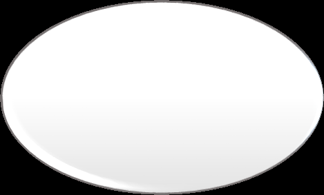

Nhu cầu nói

chung

Thu nhập,
hướng sử

Giá cả, xu
hướng cạnh

dụng thu
nhập của
dân cư, xã

tranh, hạ
tầng thương

Nhu cầu có

mại

hội

khả năng
thanh toán

Chính sách

Sản xuất,
cung ứng

điều tiết vĩ [VERIFY_OCR: vĩ/vi — check PDF trang 117]
mô của nhà

hàng hóa

nước

<!-- page 118 -->

## 4.2.1. CUNG, CẦU VỀ HÀNG HÓA

### b. Cung vềhàng hóa (cung ứng hàng hóa)

Khái niệm: cung ứng hàng hóa là tổng trị giá và cơ cấu hàng hóa hiện có và sẽ có bán trên thị
trường để đáp ứng nhu cầu có khả năng thanh toán trong một khoảng thời gian nhất định.

Cung ứng hàng hóa bao gồm: hàng hóa là thành phẩm đã kết thúc quá trình sản xuất và những
sản phẩm còn dở dang sẽ được hoàn tất để đưa vào lưu thông

Cung ứng hàng hóa biểu hiện ở cả tổng trị giá và cơ cấu lượng hàng cung ứng trên thị trường

<!-- page 119 -->

## 4.2.1. CUNG, CẦU VỀ HÀNG HÓA

### b. Cung vềhàng hóa (cung ứng hàng hóa)

Các yếu tốảnh hưởng đến cung ứng hàng hóa

### Các yếu tố thuộc vềsản

### xuất trong

### nước

### Chính sách điều tiết, biện

### Các yếu tố ảnh hưởng

### pháp kiểm soát và quản

### Đặc điểm nguồn hàng

### đến cung ứng hàng

### lý [VERIFY_OCR: lý/ly — check PDF trang 119] của nhà

### hóa

### nước

### Yếu tốthị

### trường

<!-- page 120 -->

## 4.2.1. CUNG, CẦU VỀ HÀNG HÓA

### c. Quan hệcung – cầu vềhàng hóa

Trạng thái

cân bằng

Hai trạng thái trên diễn ra là do cơ chếhoạt động của quy luật cung cầu, quy luật giá trịvà cạnh tranh.

<!-- page 121 -->

## 4.2.1. CUNG, CẦU VỀ HÀNG HÓA

### c. Quan hệcung – cầu vềhàng hóa

Biểu hiện tương tác giữa các quy luật giá trị, cung cầu và cạnh tranh trên thịtrường hàng hóa:

+ Tương tác của cung cầu đối với giá:

cung > cầu: giá giảm
cung < cầu: giá tăng
cung = cầu: giá cả= giá trị

+ Tương tác của giá đến cung cầu, cạnh tranh:

giá tăng => cầu giảm, cung tăng; cạnh tranh bên cung tăng
giá giảm => cầu tăng, cung giảm; cạnh tranh bên cầu tăng
giá ổn định => cung, cầu ổn định

+ Cạnh tranh diễn ra ởbên cung (do cung > cầu) => giảm giá bán

+ Cạnh tranh diễn ra ởbên cầu (do cung < cầu) => tăng giá mua

<!-- page 122 -->

## 4.2.2. DỰ TRỮ TRONG LƯU THÔNG

### a. Khái niệm và sựcần thiết của dựtrữtrong lưu thông

Dựtrữsản phẩm

trong xã hội

Dựtrữtrong lưu

Dựtrữtrong sản xuất

Dựtrữtrong tiêu dùng

thông

Khái niệm: dựtrữtrong lưu thông là một hình thái dựtrữsản phẩm xã hội bao gồm toàn bộ

hàng hóa cần thiết đang vận động trong các khâu khác nhau của quá trình lưu thông. Đó là

những hàng hóa đã thoát khỏi quá trình sản xuất nhưng chưa đi vào lĩnh vực tiêu dùng.

<!-- page 123 -->

## 4.2.2. DỰ TRỮ TRONG LƯU THÔNG

### a. Khái niệm và sựcần thiết của dựtrữtrong lưu thông

Đảm bảo cho lưu thông hàng hóa diễn ra liên tục, thông suốt

Yêu cầu xử lý mâu thuẫn giữa sản xuất và tiêu dùng

Sự cần thiết của dự

trữ trong lưu thông

Nắm bắt, khai thác các cơ hội thị trường và giảm thiểu các

nguy cơ rủi ro

Vai trò của dữ trữ trong các công cụ, chính sách điều tiết vĩ [VERIFY_OCR: vĩ/vi — check PDF trang 123]

mô của Chính phủ

<!-- page 124 -->

## 4.2.2. DỰ TRỮ TRONG LƯU THÔNG

### b. Phân loại dựtrữtrong lưu thông

• Dự trữ hàng sản xuất
• Dự trữ hàng tiêu dùng
Theo công dụng của hàng hóa

• Dự trữ thường xuyên
• Dự trữ thời vụ
• Dự trữ bảo hiểm
Theo mục đích sửdụng

• Theo quy mô: dự trữ thấp nhất, cao nhất và bình quân.
• Theo thời gian: dự trữ đầu kỳ, cuối kỳ.
• Theo hình thức biểu hiện: dựtrữhiện vật, trịgiá dựtrữvà thời
gian
• Theo quá trình vận động của hàng hóa: dựtrữtrong các kho
hàng, đang trên đường đi, gửi bán hoặc quảng cáo tại các hội
chợthương mại.

Các phân loại khác

<!-- page 125 -->

## 4.2.2. DỰ TRỮ TRONG LƯU THÔNG

### c. Các yếu tốảnh hưởng tới dựtrữtrong lưu thông

Hệ thống hạ
tầng kỹ thuật

Cơ chế, chính
sách quản lý của

Sản xuất

nhà nước

Mạng lưới
thương mại và

Yếu tố ảnh
hưởng tới dự

Thị trường

hệ thống phân

trữ trong lưu

phối

thông

<!-- page 126 -->

## 4.2.3. CHI PHÍ LƯU THÔNG HÀNG HÓA

### a. Khái niệm, phân loại chi phí lưu thông hàng hóa


Khái niệm: Chi phí lưu thông là biểu hiện bằng tiền của toàn bộhao phí vềlao động sống và lao

động vật hoá bỏra trong quá trình lưu thông hàng hóa trên cảthịtrường trong và ngoài nước.

## Hao phí biểu hiện bằng tiền

## Chi phí

## Chi phí về

## vềlao động sống

## lao động

## vật hóa

<!-- page 127 -->

## 4.2.3. CHI PHÍ LƯU THÔNG HÀNG HÓA

### a. Khái niệm, phân loại chi phí lưu thông hàng hóa

• Chi phí vật chất vềhao mòn tài sản, vật tư, nguyên liệu
• Chi phí vềsức lao động; chi phí khác
Theo đặc điểm chi phí

• Chi phí lưu thông thuần túy
• Chi phí tiếp tục sx trong lưu thông
Theo hao phí gắn với thực hiện

các chức năng của thương mại

• Chi phí bất biến
• Chi phí khảbiến
Theo tính chất chi phí

• Chi phí nhất thời
• Chi phí thường xuyên
Theo tính thời gian

<!-- page 128 -->

## 4.2.3. CHI PHÍ LƯU THÔNG HÀNG HÓA

### b. Ý nghĩa hạthấp tỷsuất chi phí lưu thông hàng hóa

Tỷsuất chi phí lưu thông trong nền kinh tếphản ánh quan hệso sánh giữa tổng sốtiền chi phí lưu thông

hàng hóa và kết quảtổng trịgiá hay tổng mức lưu chuyển hàng hóa bán lẻxã hội đạt được của quá trình

lưu thông đó.

Ý nghĩa của hạ thấp tỷ suất chi phí lưu thông

Giảm chi phí tái sản [VERIFY_OCR: sản/sàn — check PDF trang 128]

Nâng cao hiệu quả
thương mại và sức

Tiết kiệm chi phí thời

xuất và vốn đầu tư
vào lĩnh vực lưu thông

gian và tiền bạc

cạnh tranh

<!-- page 129 -->

## 4.2.3. CHI PHÍ LƯU THÔNG HÀNG HÓA

### c. Các yếu tốảnh hưởng đến chi phí lưu thông hàng hóa

Dự trữ hàng

Công tác
quản trị kinh

hóa và thời

gian lưu

doanh

thông

Hạ tầng kinh tế, kỹ

Quy mô và
cơ cấu hàng
hóa lưu thông

thuật và cơ chế

tác động của
QLNN về TM

Yếu tốảnh
hưởng tới chi

Các yếu tố

Giá cả hàng

khác như
điều kiện tự

hoá và giá
phí dịch vụ.

phí lưu thông

hàng hóa

nhiên

<!-- page 130 -->

## 4.3. KẾT QUẢ HOẠT ĐỘNG VÀ XU HƯỚNG PHÁT TRIỂN CỦA THƯƠNG MẠI HÀNG HÓA

### 4.3.1. Kết quảhoạt động thương mại hàng hóa

### a. Khái niệm kết quảhoạt động thương mại hàng hóa

## Kết quảhoạt động thương mại là toàn bộkết quảhoạt động trao đổi, mua bán

## hàng hóa, dịch vụcủa các chủthểkinh tếtrên thịtrường trong một khoảng thời gian

## xác định.

Ý nghĩa của nghiên cứu kết quảhoạt động thương mại hàng hóa:

+ Đánh giá mức độmởcủa thịtrường, cạnh tranh và hội nhập kinh tếquốc tế

+ Đánh giá trình độ, năng lực quản lý của nhà nước

<!-- page 131 -->

## 4.3. KẾT QUẢ HOẠT ĐỘNG VÀ XU HƯỚNG PHÁT TRIỂN CỦA THƯƠNG MẠI HÀNG HÓA

### 4.3.1. Kết quảhoạt động thương mại hàng hóa

### b. Một sốchỉtiêu phản ánh kết quảhoạt động thương mại hàng hóa

Tổng mức

bản lẻ
hàng hóa

Tổng giá trị

Một sốchỉ

xuất khẩu,
nhập khẩu

tiêu khác

Chỉtiêu
phản ánh

hàng hóa

kết quả
hoạt động

TMHH

Mặt hàng
xuất khẩu,
nhập khẩu

Cán cân
thương mại

hàng hóa

Xuất khẩu,

nhập khẩu

hàng hóa

theo khu

vực thị
trường

<!-- page 132 -->

## 4.3. KẾT QUẢ HOẠT ĐỘNG VÀ XU HƯỚNG PHÁT TRIỂN CỦA THƯƠNG MẠI HÀNG HÓA

### 4.3.2. Xu hướng phát triển của thương mại hàng hóa

Cơ
cấu
thương
mại hàng hóa thay
đổi
theo
hướng
tích cực, đa dạng
phong phú, nâng
cao
chất
lượng,
tính hiệu quảvà
cạnh
tranh,
đáp
ứng kịp thời
và
ngày càng tốt hơn
nhu cầu của thị
trường.

Kết
quả
thương
mại
hàng
hóa
ngày
càng
tăng
lên cảvềquy mô
và
tốc
độ
tăng
trưởng trên cảthị
trường
trong
nước
và
nước
ngoài,
tác
động
tích cực đến mở
cửa nền kinh tế

Hàng
hóa
lưu
thông
trên
thị
trường ngày càng
được tiêu chuẩn
hóa, có nhãn hiệu
bao
bì,
ký
mã [VERIFY_OCR: mã/mả — check PDF trang 132]
hiệu,
chỉ
dẫn
nguồn
gốc
xuất
xứ
rõ
ràng
đáp
ứng theo yêu cầu
của hội nhập.

Hạ
tầng
thương
mại
ngày
càng
được hoàn thiện
theo hướng hiện
đại

Hàng
giả,
hàng
nhái
lưu
thông,
trao đổi trên
thị
trường
vẫn
tiếp
tục gia tăng

<!-- page 133 -->

## CÂU HỎI ÔN TẬP

Câu 1.
Phân tích đặc điểm của thương mại hàng hóa? Ý nghĩa nhận thức vấn đềnày trong phát triển và quản lý nhà
nước vềthương mại?
Câu 2.
Trình bày các phương thức mua bán chủyếu trong thương mại hàng hóa? Xu hướng phát triển của các
phương thức mua bán trong thương mại hàng hóa?
Câu 3.
Phân tích các nhân tốảnh hưởng đến quan hệcung - cầu hàng hóa trên thịtrường? Vai trò và chính sách của
nhà nước trong điều tiết quan hệcung - cầu hàng hóa trên thịtrường?
Câu 4.
Phân tích sựcần thiết và các nhân tốảnh hưởng đến dựtrữhàng hóa? Ý nghĩa nhận thức vấn đềnày trong
quản lý nhà nước và nâng cao hiệu quảkinh tếcủa thương mại?
Câu 5.
Phân tích bản chất và các chỉtiêu phản ánh kết quảhoạt động thương mại trong lĩnh vực thương mại hàng
hóa? Liên hệthực tiễn các chỉtiêu này trong phát triển thương mại hàng hóa ởnước ta hiện nay?
Câu 6.
Phân tích những xu hướng phát triển của thương mại hàng hóa? Ý nghĩa nhận thức vấn đềnày trong phát triển
và quản lý nhà nước vềthương mại?

133

<!-- page 134 -->

## CASE STUDY

Trong những năm gần đây, thịtrường thương mại điện tửViệt Nam (TMĐT) ngày càng được mở
rộng và hiện đã trởthành phương thức kinh doanh phổbiến được doanh nghiệp, người dân biết đến. Sự
đa dạng vềmô hình hoạt động, vềđối tượng tham gia, vềquy trình hoạt động và chuỗi cung ứng hàng
hóa, dịch vụvới sựhỗtrợcủa hạtầng Internet và ứng dụng công nghệhiện đại đã đưa TMĐT trởthành
trụcột quan trọng trong tiến trình phát triển kinh tếsốcủa quốc gia.

Mặc dù gặp những ảnh hưởng tiêu cực trong năm 2020 do đại dịch COVID-19, thương mại điện tử
Việt Nam vẫn có những bước tăng tốc mạnh mẽ, trởthành một trong những thịtrường TMĐT tăng
trưởng nhanh nhất trong khu vực Đông Nam Á. Theo Sách trắng Thương mại điện tửViệt Nam, năm
2020, tốc độtăng trưởng của TMĐT đạt mức 18%, quy mô đạt 11,8 tỷUSD và là nước duy nhất ởĐông
Nam Á có tăng trưởng TMĐT 2 con số. Theo tính toán của các tập đoàn lớn thếgiới như Google,
Temasek và Bain&Company, nhiều khảnăng quy mô của nền kinh tếsốViệt Nam sẽvượt ngưỡng 52 tỷ
USD và giữvịtrí thứ3 trong khu vực ASEAN vào năm 2025.

134

<!-- page 135 -->

## CASE STUDY (tiếp)

Trong bối cảnh dịch bệnh COVID-19, thịtrường TMĐT càng trởnên sôi động hơn và việc ứng dụng
công nghệsố, xây dựng kênh phân phối mới đang trởthành một phương án hữu hiệu cho các doanh
nghiệp Việt Nam vượt qua khó khăn mang đến cơ hội mới từnhu cầu mới phát sinh của thịtrường. Thói
quen mua hàng của người tiêu dùng Việt Nam tại thịtrường nội địa cũng dần dịch chuyển từmua hàng
truyền thống sang hình thức mua hàng online thông qua phương tiện điện tử. Kết quảđiều tra, khảo sát
của BộCông Thương cho thấy, tính đến năm 2020, Việt Nam có 49,3 triệu người tham gia mua sắm trực
tuyến (sốliệu này năm 2016 mới chỉghi nhận 32,7 triệu người).

https://dangcongsan.vn/kinh-te-va-hoi-nhap/thuong-mai-dien-tu-tro-thanh-xu-huong-tat-yeu-
598414.html

Câu hỏi:

1. Anh/chịhãy cho biết những vai trò của thương mại điện tử.
2. Anh/chịhãy phân tích thực trạng phát triển thương mại điện tửcủa nước ta thời gian gần đây.
3. Nêu nhận định của anh/chịvềxu hướng phát triển thương mại điện tửnước ta thời gian tới.

135

<!-- page 136 -->

## TỔNG KẾT BÀI HỌC

1. TMHH là lĩnh vực trao đổi hàng hoá hữu hình, bao gồm tổng thểcác hoạt động mua bán hàng hoá và các

hoạt động hỗtrợcủa các chủthểkinh tếnhằm thúc đẩy quá trình trao đổi đó diễn ra theo mục tiêu đã xác
định.
2. Đặc điểm cơ bản của TMHH được xem xét trên các khía cạnh: đối tượng trao đổi, chủthểvà chức năng trao

đổi, tính thống nhất và độc lập giữa các khâu của quá trình lưu thông, phương thức trao đổi, đặc điểm vềthị
trường và môi trường thểchế
3. Phương thức mua bán là cách thức mua bán hàng hóa mà các chủthểlựa chọn trong quá trình thực hiện

các giao dịch thương mại hoặc trao đổi trên thịtrường. Có nhiều phương thức mua bán trong thương mại
hàng hóa, mỗi phương thức có đặc điểm riêng và các hình thức trao đổi mua bán cụthể
4. Nhu cầu có khảnăng thanh toán vềhàng hóa là bộphận của nhu cầu nói chung, là nhu cầu vềhàng hóa bị

giới hạn bởi khảnăng thanh toán bằng tiền hoặc tài sản [VERIFY_OCR: sản/sàn — check PDF trang 136] thanh toán khác của dân cư và xã hội
5. Dựtrữtrong lưu thông là một hình thái dựtrữsản phẩm xã hội bao gồm toàn bộhàng hóa cần thiết đang

vận động trong các khâu khác nhau của quá trình lưu thông. Đó là những hàng hóa đã thoát khỏi quá trình
sản xuất nhưng chưa đi vào lĩnh vực tiêu dùng.
6. Chi phí lưu thông là biểu hiện bằng tiền của toàn bộhao phí vềlao động sống và lao động vật hoá bỏra

trong quá trình lưu thông hàng hóa trên cảthịtrường trong và ngoài nước
7. Kết quảhoạt động thương mại là toàn bộkết quảhoạt động trao đổi, mua bán hàng hóa, dịch vụcủa các chủ

thểkinh tếtrên thịtrường trong một khoảng thời gian xác định.
136

<!-- page 137 -->

## GIẢI THÍCH THUẬT NGỮ

Thương mại điện tử


Thương mại hàng hoá


Nhu cầu có khả năng thanh toán


Lưu thông hàng hoá


Quỹ mua hàng hóa


Dự trữhàng hoá


Sức mua


Phương thức mua bán


Chi phí lưu thông hàng hóa


Mua bán buôn


Cung hàng hóa


Mua bán lẻ


Gia công thương mại


Mua bán qua môi giới


Buôn bán đối lưu


Đại lý [VERIFY_OCR: lý/ly — check PDF trang 137]


Kết quả hoạt động thương mại


Mua bán trực tiếp


Mua bán qua trung gian

137

<!-- page 138 -->

# CHƯƠNG 5.

# THƯƠNG MẠI DỊCH VỤ

<!-- page 139 -->

## TÌNH HUỐNG KHỞI ĐỘNG BÀI

Sốliệu công bốngày 29/3/2023 bởi Tổng cục Thống kê cho thấy, các hoạt động thương mại và dịch vụdiễn
ra sôi động trong 3 tháng đầu năm 2023.

Khách quốc tếđến nước ta gấp gần 30 lần cùng kỳnăm trước. Trong đó, hoạt động vận tải duy trì đà tăng
trưởng tích cực cảvềvận tải hành khách và hàng hóa. Cụthể, vận tải hành khách quý I/2023 đạt 1.114,7
triệu lượt khách vận chuyển, tăng 28,8% so với cùng kỳnăm trước (cùng kỳnăm 2022 giảm 10,7%), và luân
chuyển đạt 63,7 tỷlượt khách, tăng 66,5% (cùng kỳnăm trước giảm 7,2%). Vận tải hàng hóa trong quý đạt
549,8 triệu tấn, tăng 16,2% so với cùng kỳnăm trước (cùng kỳnăm 2022 tăng 2%) và luân chuyển 117,4 tỷ
tấn, tăng 21,9% (cùng kỳnăm trước tăng 11,1%).

Sốlượt khách quốc tếđến Việt Nam cũng tăng mạnh, phản ánh hiệu quảcủa chính sách mởcửa từngày
15/3/2022 sau đại dịch Covid-19, cũng như việc thúc đẩy xúc tiến, quảng bá du lịch Việt Nam tới các nước
trên thếgiới và kích cầu nội địa trong thời gian qua. Khách quốc tếđến Việt Nam tháng 3/2023 ước đạt 895,4
nghìn lượt người, giảm 4% so với tháng trước và gấp 21,5 lần cùng kỳnăm trước. Tính chung quý I/2023,
khách quốc tếđến nước ta ước đạt hơn 2.699,5 nghìn lượt người, gấp 29,7 lần cùng kỳnăm trước và bằng
60% so với cùng kỳnăm 2019 - năm chưa xảy ra dịch Covid-19. Trong đó, khách đến bằng đường hàng
không đạt 2.423,9 nghìn lượt người, chiếm 89,8% lượng khách quốc tếđến Việt Nam và gấp 29,4 lần cùng kỳ
năm trước; bằng đường bộđạt 241,9 nghìn lượt người, chiếm 9% và gấp 28 lần; bằng đường biển đạt 33,7
nghìn lượt người, chiếm 1,2% và gấp 936,3 lần.

Nguồn: https://nhandan.vn/hoat-dong-thuong-mai-va-dich-vu-dien-ra-soi-dong-trong-quy-i2023-post745256.html

139

<!-- page 140 -->

## MỤC TIÊU CỦA CHƯƠNG

Giới thiệu những nội dung
cơ bản thểhiện tính đặc thù

• Bản chất và đặc điểm của Thương mại dịch vụ
• Vai trò của Thương mại dịch vụ
• Các phương thức cung ứng của Thương mại dịch vụ
• Các xu hướng phát triển của Thương mại dịch vụ

và khác biệt của Thương

mại dịch vụ.

140

<!-- page 141 -->

## CẤU TRÚC NỘI DUNG CỦA CHƯƠNG

5.1

Bản chất và vai trò của Thương mại dịch vụ

5.2

Các phương thức cung ứng trong Thương mại dịch vụ

5.3

Những đặc điểm có tính đặc thù của Thương mại dịch vụ

5.4

Xu hướng phát triển của Thương mại dịch vụ

141

<!-- page 142 -->

## 5.1. BẢN CHẤT VÀ VAI TRÒ CỦA THƯƠNG MẠI DỊCH VỤ

5.1.1.Khái niệm và phân loại Thương mại dịch vụ

5.1.2. Vai trò của Thương mại dịch vụ

142

<!-- page 143 -->

## 5.1.1. KHÁI NIỆM VÀ PHÂN LOẠI THƯƠNG MẠI DỊCH VỤ

### a. Khái niệm thương mại dịch vụ

Dịch vụ

Dịch vụlà các hoạt động lao động mang tính xã hội, tạo ra các sản phẩm không
tồn tại dưới hình thái vật thể, không dẫn đến việc chuyển quyền sởhữu, nhằm
thỏa mãn kịp thời các nhu cầu sản xuất và đời sống sinh hoạt của con người.

Đặc điểm của dịch vụ:
Dịch vụlà “ sản phẩm lao động”
Dịch vụlà sản phẩm vô hình

143

<!-- page 144 -->

## 5.1.1. KHÁI NIỆM VÀ PHÂN LOẠI THƯƠNG MẠI DỊCH VỤ

### a. Khái niệm thương mại dịch vụ

Thương mại dịch vụ- Trade in services.

Theo

Thương mại dịch vụlà sựtrao đổi vềdịch
vụgiữa các cá nhân , tổchức vì mục đích
Thương mại

đối
tượng
trao đổi

Theo tiếp

Thương mại dịch vụlà cung cấp
dịch vụtrong bất cứlĩnh vực nào có
liên quan đến Thương mại

cận của
Hiệp định

GATS
của WTO

Thương mại dịch vụlà việc cung cấp
dịch vụtheo các điều kiện Thương
mại
cho
người
khác,
thông
qua
Thương mại xuyên biên giới hay
thông qua hiện diện Thương mại.

Theo
Walter
Goode,

144

<!-- page 145 -->

## 5.1.1. KHÁI NIỆM VÀ PHÂN LOẠI THƯƠNG MẠI DỊCH VỤ

### a. Khái niệm thương mại dịch vụ

Thương mại dịch vụ- Trade in services.

Thương mại dịch vụlà toàn bộnhững hoạt động trao đổi,
cung ứng dịch vụtrên thịtrường nhằm mục tiêu thu lợi nhuận

145

<!-- page 146 -->

## 5.1.1. KHÁI NIỆM VÀ PHÂN LOẠI THƯƠNG MẠI DỊCH VỤ

### b. Phân loại thương mại dịch vụ

Phân ngành dịch vụđược đưa ra trong hiệp định GATS của WTO

3. Dịch vụxây
dựng và các dịch

2. Dịch vụbưu
chính viễn thông,

1. Dịch vụkinh

4. Dịch vụphân

vụkỹ thuật liên

doanh

phối

thông tin liên lạc

quan

8. Các dịch vụxã

5. Dịch vụgiáo dục
6. Dịch vụmôi

trường
7. Dịch vụtài chính

hội và liên quan

đến y tế

9. Các dịch vụdu
lịch và dịch vụliên

10. Các dịch vụvăn

hóa và giải trí
11. Dịch vụvận tải
12. Các dịch vụ

khác

quan đến lữhành

146

<!-- page 147 -->

## 5.1.1. KHÁI NIỆM VÀ PHÂN LOẠI THƯƠNG MẠI DỊCH VỤ

### b. Phân loại thương mại dịch vụ

Phân ngành dịch vụđược đưa ra trong hiệp định GATS của WTO

1. Dịch vụkinh doanh

Dịch vụmáy
tính và các dịch

Dịch vụnghiên

Dịch vụcho
thuê không qua

Các dịch vụ

Các dịch vụ
chuyên ngành,

Dịch vụbất

cứu và triển

kinh doanh

động sản [VERIFY_OCR: sản/sàn — check PDF trang 147]

vụliên quan

khai (R&D)

môi giới

khác

dịch vụnghề

nghiệp

147

<!-- page 148 -->

## 5.1.1. KHÁI NIỆM VÀ PHÂN LOẠI THƯƠNG MẠI DỊCH VỤ

### b. Phân loại thương mại dịch vụ

Phân ngành dịch vụđược đưa ra trong hiệp định GATS của WTO

Dịch vụbưu điện

2. Dịch vụbưu chính viễn thông,

Dịch vụbáo chí [VERIFY_OCR: chí/chỉ — check PDF trang 148]

thông tin liên lạc

Dịch vụviễn thông,

điện thoại tiếng…

Dịch vụnghe nhìn

Các dịch vụtruyền

thông khác.

148

<!-- page 149 -->

## 5.1.1. KHÁI NIỆM VÀ PHÂN LOẠI THƯƠNG MẠI DỊCH VỤ

### b. Phân loại thương mại dịch vụ

Phân ngành dịch vụđược đưa ra trong hiệp định GATS của WTO

Dịch vụđại lý [VERIFY_OCR: lý/ly — check PDF trang 149] hoa hồng

Dịch vụbán buôn

4. Dịch vụphân phối

Dịch vụbán lẻ

Dịch vụcấp phép kinh doanh

Dịch vụphân phối khác

149

<!-- page 150 -->

## 5.1.1. KHÁI NIỆM VÀ PHÂN LOẠI THƯƠNG MẠI DỊCH VỤ

### b. Phân loại thương mại dịch vụ

Theo mục tiêu của dịch vụ:

Nhóm dịch vụphân phối : dịch vụvận chuyển, lưu kho…

Nhóm dịch vụsản xuất: dịch vụngân hàng, dịch vụtài chính….

Nhóm dịch vụxã hội: dịch vụsức khỏe, y tế…

Nhóm dịch vụcá nhân: dịch vụsửa chữa, dịch vụnhà hàng

150

<!-- page 151 -->

## 5.1.2. VAI TRÒ CỦA THƯƠNG MẠI DỊCH VỤ

### Vai trò kinh tếcủa Thương mại dịch vụ

Thương mại dịch vụthúc đẩy tăng trưởng kinh tế, đóng góp vào GDP/GNP
của nền kinh tếcác quốc gia

Thương mại dịch vụthúc đẩy phân công lao động và chuyển dịch cơ cấu
kinh tế

Thương mại dịch vụtăng cường hội nhập khu vực và quốc tế, cải thiện cán
cân Thương mại của các quốc gia.

151

<!-- page 152 -->

## 5.1.2. VAI TRÒ CỦA THƯƠNG MẠI DỊCH VỤ

### Vai trò xã hội của Thương mại dịch vụ

Thương mại dịch vụgiúp tạo ra công ăn việc làm cho xã hội

Thương mại dịch vụgiúp nâng cao chất lượng cuộc sống của con người.

152

<!-- page 153 -->

## 5.2. CÁC PHƯƠNG THỨC CUNG ỨNG TRONG THƯƠNG MẠI DỊCH VỤ

### 5.2.1. Các phương thức cung ứng trong Thương mại dịch vụnói chung

Phương thức cung cấp mà chỉcó sựdi chuyển của
dịch vụ

Phương thức cung ứng dịch vụdiễn ra tại nơi nhà
cung ứng

Phương thức cung ứng dịch vụdiễn ra tại nơi
người tiêu dùng

Phương thức cung ứng diễn ra tại địa điểm thứba

153

<!-- page 154 -->

## 5.2. CÁC PHƯƠNG THỨC CUNG ỨNG TRONG THƯƠNG MẠI DỊCH VỤ

### 5.2.2. Các phương thức cung ứng trong Thương mại dịch vụquốc tế:

Cung cấp dịch vụqua biên giới – Cross border.

Tiêu dùng dịch vụở nước ngoài – Consumption Abroad

Hiện diện Thương mại – Commercial Presence

Hiện diện của thể nhân – Presence of Natural Person

154

<!-- page 155 -->

## 5.3. NHỮNG ĐẶC ĐIỂM CÓ TÍNH ĐẶC THÙ CỦA THƯƠNG MẠI DỊCH VỤ

### 5.3.1. Đặc điểm vềđối tượng trao đổi, cung ứng trong Thương mại dịch vụ

Dịch vụmang tính vô hình

Dịch vụlà những thứmà khi đem bán không thểrơi vào chân của bạn.

Không thểxác định được chất lượng dịch vụbằng các tiêu chuẩn lượng hóa.

### 5.3.2. Đặc điểm của quá trình sản xuất, lưu thông và tiêu dùng dịch vụ

Sản xuất – lưu thông – tiêu dùng không thểtách rời vềmặt không gian và thời gian

Dịch vụkhông dựtrữhay lưu kho.

Cung ứng dịch vụtrên thịtrường thường sẽkhông thểđồng loạt và không có bán buôn trong dịch vụ.

### 5.3.3. Đặc điểm vềchủthểtrao đổi trong Thương mại dịch vụ

Người bán (nhà cung ứng): bất kỳcá nhân, tổchức tiến hành cung ứng dịch vụtrên thịtrường.

Người mua (người tiêu dùng): bất kỳcá nhân, tổchức tiến hành cung ứng dịch vụtrên thị

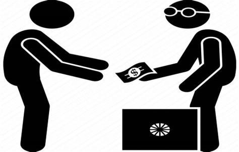

trường.

155

<!-- page 156 -->

### 5.3. NHỮNG ĐẶC ĐIỂM CÓ TÍNH ĐẶC THÙ CỦA THƯƠNG MẠI DỊCH VỤ (tiếp)

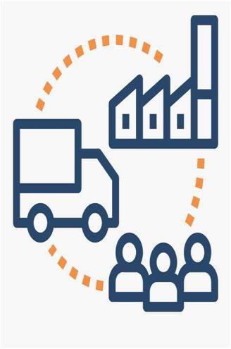

### 5.3.4. Đặc điểm vềcung dịch vụtrên thịtrường

Tính cứng và khảnăng khó điều hòa của cung trên thịtrường dịch vụ

Tính liên ngành và đa dạng trong cung ứng dịch vụtrên thịtrường

Tính nhạy cảm và khó kiểm soát đối với các hoạt động cung ứng dịch vụtrên thịtrường.

### 5.3.5. Đặc điểm về cầu dịch vụ trên thị trường

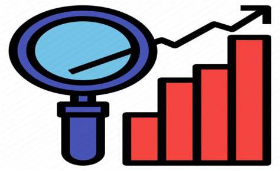

Tính không ổn định của cầu

Tính co giãn của cầu với thu nhập

5.3.6. Đặc điểm về quan hệ cung cầu, cạnh tranh và giá cả trên thị trường dịch vụ

Mâu thuẫn về tính cứng của cung và tính không ổn định của cầu

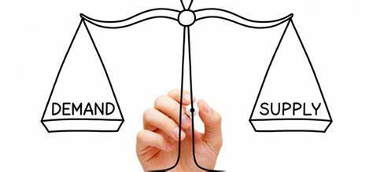

156

<!-- page 157 -->

### 5.3. NHỮNG ĐẶC ĐIỂM CÓ TÍNH ĐẶC THÙ CỦA THƯƠNG MẠI DỊCH VỤ (tiếp)

### 5.3.7. Đặc điểm dễtạo ra những rào cản cho quá trình tựdo hóa Thương mại

Chức năng và vịtrí của một sốngành dịch vụkhiến trởthành đối tượng chịu sựchi

phối độc quyền của Nhà nước

Rào cản trong Thương mại dịch vụlà vô hình

157

<!-- page 158 -->

## 5.4. XU HƯỚNG PHÁT TRIỂN CỦA THƯƠNG MẠI DỊCH VỤ

5.4.1. Xu hướng tăng nhanh quy mô và chiếm tỷ trọng ngày càng cao trong cơ cấu thương mại các quốc gia

Nhu cầu thỏa mãn những đòi hỏi về chất lượng cuộc sống của con người cũng tăng lên
Các lĩnh vực dịch vụ có xu hướng ngày càng được thương mại hóa
TMDV sẽ có quy mô và chiếm tỷ trọng ngày càng cao trong TMQT của mỗi quốc gia và toàn cầu.

5.4.2. Xu hướng ngày càng gia tăng tỷ trọng những loại dịch vụ sử dụng hàm lượng tri thức công nghệ cao

Xu hướng này bắt nguồn từ quá trình toàn cầu hóa
Sự phát triển của nền kinh tế tri thức trong thời đại hiện nay

5.4.3. Xu hướng thay đổi phương thức cung ứng dịch vụ

Cung ứng dịch vụ theo phương thức chỉ có sự di chuyển của dịch vụ sẽ có thể thay thế các phương thức cung

ứng dịch vụ truyền thống
Phương thức cung ứng dịch vụ qua biên giới có xu hướng gia tăng và thay thế các phương thức khác
Do sự phát triển của KH-KT mà dịch vụ có tính chất hàng hóa nhiều hơn trong các quan hệ thương mại

5.4.4. Xu hướng phát triển TMDV quốc tế

• TMDV trở thành đối tượng được chú trọng mở rộng và tạo điều kiện thuận lợi do những lợi ích từ tự do hóa
TMDV
• Xu hướng khu vực hóa và toàn cầu hóa trong TMDV
• Xu hướng bảo hệ trong TMDV giữa các quốc gia
158

<!-- page 159 -->

## CÂU HỎI ÔN TẬP

Câu 1.

Phân tích những đặc điểm có tính đặc thù của thương mại dịch vụ? Ý nghĩa nhận thức vấn đềnày
trong phát triển và quản lý nhà nước vềthương mại?

Câu 2.

Trình bày các phương thức cung ứng trong thương mại dịch vụ? Xu hướng phát triển của các phương
thức và ý nghĩa trong phát triển và quản lý nhà nước vềthương mại?

Câu 3.

Phân tích các xu hướng phát triển của thương mại dịch vụ? Liên hệthực tiễn ởViệt Nam và ý nghĩa
của việc nhận thức vấn đềnày trong quản lý nhà nước vềthương mại?

Câu 4.

Phân tích bản chất và vai trò kinh tế- xã hội của thương mại dịch vụ? Liên hệvấn đềnày trong thực
tiễn ởnước ta hiện nay?

159

<!-- page 160 -->

## CASE STUDY

Giai đoạn khó khăn chưa từng có của ngành du lịch toàn cầu
Tổchức Du lịch Thếgiới (UNWTO) cho biết, năm 2021, đại dịch COVID-19 dựkiến sẽgây thiệt hại cho nền kinh tếtoàn
cầu khoảng 2,4 nghìn tỷUSD do sựsụp đổcủa ngành du lịch quốc tế. Trong sốđó, các nước có mức giảm GDP do sụt
giảm ngành du lịch vì đại dịch COVID-19 cao nhất thếgiới là ThổNhĩ Kỳ(-9,1%), Ecuador (-9%), Nam Phi (-8,1%),
Ireland (-5,9%)…

Trước đó, vào tháng 7/2020, Hội nghịLiên hợp quốc vềThương mại và Phát triển (UNCTAD) cũng đã dựbáo thời gian
du lịch quốc tếđình trệsẽkéo dài từ4-12 tháng, khiến nền kinh tếtoàn cầu thiệt hại từ1,2-3,3 nghìn tỷUSD. Song trên
thực tế, ngành du lịch bịảnh hưởng trong thời gian kéo dài hơn, con sốthiệt hại còn cao hơn rất nhiều, bởi đại dịch
chưa biết đến khi nào mới kết thúc.

Theo Báo cáo của Liên hiệp quốc, lượng khách du lịch quốc tếđã giảm khoảng 1 tỉlượt, tương đương giảm 73% trong
năm 2020, trong khi trong quý đầu tiên của năm 2021, mức giảm đã là 88%. Các khu vực bịảnh hưởng nhiều nhất là
Đông Bắc Á, Đông Nam Á, Châu Đại Dương, Bắc Phi và Nam Á; trong khi những khu vực bịảnh hưởng ít hơn là Bắc
Mỹ, Tây Âu và Caribe.

Mới đây, Tổchức Lao động Quốc tế(ILO) đã thực hiện đánh giá vềtác động của đại dịch COVID-19 đối với việc làm
trong ngành du lịch ởchâu Á và Thái Bình Dương. Báo cáo đưa ra ngày 18/11 của ILO cho biết, Philippines, Việt Nam,
Thái Lan, Brunei và Mông Cổđã ghi nhận 1/3 sốviệc làm mất đi trong do dịch COVID-19 là thuộc ngành du lịch. Báo cáo
khẳng định, mức tổn thất việc làm trong các ngành liên quan đến du lịch trong năm 2020 cao hơn gấp 4 lần so với các
ngành khác.

Trước những ảnh hưởng của dịch bệnh, UNCTAD cho rằng, sựphục hồi của ngành du lịch phụthuộc phần lớn vào việc
tiêm vaccine COVID-19 trên toàn cầu. Theo Quyền Tổng thư ký UNCTAD Isabelle Durant: "Thếgiới cần nỗlực tiêm
chủng toàn cầu đểbảo vệngười lao động, giảm thiểu các tác động tiêu cực tới xã hội và ngành du lịch nhận được
những quyết định mang tính chiến lược".

160

<!-- page 161 -->

## CASE STUDY (tiếp)

Xu hướng du lịch thời đại dịch
Nếu như trước đại dịch, khách du lịch chỉcần “xách ba lô [VERIFY_OCR: lô/lỗ — check PDF trang 161] lên và đi” bất kểđiểm đến là ởtrong nước hay ởnước
ngoài, thì hiện nay, khách du lịch cần trải qua các thủtục kiểm tra y tế. Theo đó, giấy chứng nhận tiêm vaccine,
khẩu trang… sẽlà những vật dụng không thểthiếu mà khách du lịch cần mang theo trong một thời gian dài, khi
mà dịch bệnh vẫn diễn biến phức tạp.

Du lịch không chạm – xu hướng tất yếu đểhạn chếsựtiếp xúc, ngăn ngừa dịch bệnh. Từnhững khuyến cáo của
cơ quan y tế, du lịch không chạm trởthành xu hướng hot hiện nay và trong tương lai không xa. Không chạm khi
đi du lịch không chỉlà hạn chếtiếp xúc giữa người với người, giữa con người với các vật dụng, bềmặt mà còn là
trải nghiệm du lịch với các thiết bịvà công nghệtựđộng hóa. Trước đây, các loại giấy tờthông hành được trao
tay khi làm thủtục, kiểm tra, kiểm soát... Điều này khiến mọi người phải xếp hàng chờđợi và gia tăng nguy cơ
lây nhiễm. Nhưng với du lịch thời COVID-19, mọi quy trình tại quầy làm thủtục, quầy lễtân sẽđược tựđộng
hóa. Trên máy bay, tại các điểm đến du lịch, tại các nhà hàng, khách sạn cũng ứng dụng nhiều thiết bịkhông
chạm hiện đại như vòi nước cảm ứng; cửa đóng/mởtựđộng… Tất cảsẽgiúp hoạt động du lịch trởnên an toàn
và tiện lợi hơn rất nhiều.

Du lịch chăm sóc sức khỏe lên ngôi. Đây là dịch vụdu lịch thiên vềnghỉdưỡng, thư giãn, làm đẹp và chăm sóc
sức khỏe. Khi đi du lịch, du khách có thểtham gia các khóa ngồi thiền, tập yoga, dưỡng sinh, tắm khoáng nóng...
đểphục hồi thểchất và tái tạo tinh thần. Du khách cũng sẽcó xu hướng tìm đến những vùng đất hoang sơ;
những nơi có tính chất cô lập, như vùng nông thôn yên tĩnh, vùng núi cao, những hòn đảo hay bãi biển chưa
được khai thác du lịch. Những địa điểm này không chỉmang tới sựyên tĩnh đểnghỉngơi mà còn mang đến sự
an tâm do giảm nguy cơ lây lan dịch bệnh. Theo dựbáo của Tổchức du lịch thếgiới (UNWTO), du lịch gắn với
sức khỏe sẽtăng trưởng mạnh mẽthời hậu COVID-19. Theo Global Wellness Institute (GWI), loại hình du lịch
này có thểchạm mức doanh thu 919 tỷUSD vào năm 2022.

161

<!-- page 162 -->

## CASE STUDY (tiếp)

Làm việc kết hợp nghỉdưỡng là loại hình được nhiều người lựa chọn trong bối cảnh xu hướng làm việc từxa
trởnên phổbiến. Năm 2021 đã chứng kiến ngày càng nhiều người sẽlàm việc ởnhững hòn đảo thay vì ở
nhà. Hội đồng Du lịch và Lữhành Thếgiới cho rằng, sẽcó khoảng 34% khách du lịch cân nhắc đặt chỗở
một điểm đến khác đểởlại làm việc, trong khi 43% sẽsẵn sàng cách ly nếu họcó thểlàm việc từxa. Các
phòng nghỉsẽđược thiết kếnhư các văn phòng tại nhà nhằm thu hút làn sóng “du mục kỹthuật số” (digital
nomads) mới này.

Du lịch nội địa và gần nhà là xu hướng nổi bật trong bối cảnh việc đi lại giữa các nước vẫn có nhiều quy định
khắt khe. Theo UNWTO, trong năm 2021, tín hiệu tích cực vềdu lịch nội địa đang diễn ra ởnhiều thịtrường,
với việc người dân có xu hướng đi du lịch gần địa điểm cư trú. Sựlên ngôi của du lịch nội địa sẽthúc đẩy
nhu cầu vềcác hoạt động ngoài trời, gần gũi với thiên thiên và du lịch nông thôn. Các chuyên gia cũng đề
cập tới sựnổi lên của xu hướng “du lịch chậm” và du lịch cộng đồng, hướng tới những trải nghiệm chân thực,
trách nhiệm và bền vững.

https://dangcongsan.vn/kinh-te/du-lich-the-gioi-da-thay-doi-nhu-the-nao-de-thich-ung-voi-dai-dich-597566.html

Câu hỏi:

1. Trong TMDV, dịch vụdu lịch được cung cấp theo các phương thức nào? Sựphát triển của công nghệcó tác

động như thếnào đến sựthay đổi phương thức cung ứng trong dịch vụdu lịch?

2. Dịch bệnh Covid-19 có tác động như thếnào đến hoạt động du lịch thếgiới? Sựthay đổi trong cung ứng dịch

vụđáp ứng nhu cầu người tiêu dùng dịch vụdu lịch trong bối cảnh đại dịch như thếnào? Là quốc gia chịu tác

động của đại dịch, chính phủViệt Nam đã thực thi các giải pháp gì đểphục hồi và phát triển dịch vụdu lịch?

162

<!-- page 163 -->

## TỔNG KẾT BÀI HỌC

1. Thương mại dịch vụlà toàn bộnhững hoạt động trao đổi, cung ứng dịch vụtrên thịtrường nhằm mục tiêu

thu lợi nhuận

2. Theo phân ngành dịch vụcủa Hiệp định chung vềthương mại dịch vụcủa WTO, lĩnh vực dịch vụđược chia

thành 12 ngành và 155 phân ngành. Các ngành chính gồm: dịch vụkinh doanh, dịch vụbưu chính viễn

thông, dịch vụxây dựng và các dịch vụkỹthuật liên quan, dịch vụphân phối, dịch vụgiáo dục, dịch vụmôi

trường, dịch vụtài chính, dịch vụxã hội và liên quan đến y tế, dịch vụdu lịch và dịch vụliên quan đến lữ

hành, các dịch vụvăn hóa và giải trí, dịch vụvận tải, các dịch vụkhác

3. Trong thương mại dịch vụquốc tế, dịch vụđược cung cấp theo 4 phương thức: cung cấp qua biên giới, tiêu

dùng nước ngoài, hiện diện thương mại, hiện diện thểnhân.

4. Thương mại dịch vụcó những điểm khác biệt so với thương mại hàng hóa, thểhiện ởcác khía cạnh: đối

tượng trao đổi và cung ứng; quá trình sản xuất, lưu thông và tiêu dùng dịch vụ; chủthểtrao đổi; đặc điểm

vềcung, cầu và quan hệcung – cầu, cạnh tranh và giá cảtrên thịtrường dịch vụ; đặc điểm dễtạo ra các

rào cản trong quá trình tựdo hóa thương mại.

5.
Thương mại dịch vụngày càng thểhiện rõ vai trò trong sựphát triển kinh tế- xã hội của các quốc gia.

Trong thương mại quốc tê, các xu hướng phát triển của thương mại dịch vụgồm: gia tăng vềquy mô và

chiếm tỷtrọng cao trong cơ cấu thương mại các quốc gia; gia tăng các dịch vụsửdụng tri thức, công nghệ

cao; thay đổi phương thức cung ứng…
163

<!-- page 164 -->

## GIẢI THÍCH THUẬT NGỮ


Thương mại dịch vụ


GATS


Cung cấp qua biên giới


Tiêu dùng nước ngoài


Hiện diện thương mại


Hiện diện thể nhân

164

<!-- page 165 -->

# CHƯƠNG 6.

# LỢI THẾ SO SÁNH VÀ HỘI NHẬP KINH TẾ THƯƠNG MẠI

<!-- page 166 -->

## TÌNH HUỐNG KHỞI ĐỘNG BÀI

RCEP được 10 thành viên của Hiệp hội các quốc gia Đông Nam Á (ASEAN) và sáu đối tác đã có hiệp định thương mại
tựdo (FTA) với ASEAN là Trung Quốc, Hàn Quốc, Nhật Bản, Australia, New Zealand và Ấn Độbắt đầu đàm phán ngày
9/5/2013. Đến tháng 11/2019, các nước thành viên đã cơ bản hoàn tất đàm phán văn kiện RCEP, trừẤn Độđã tuyên
bốrút khỏi Hiệp định. Ngày 15/11/2020, 15 nước thành viên tham gia đàm phán RCEP đã ký kết Hiệp định này. Ngày
2/11/2021, sáu nước ASEAN gồm Brunei, Campuchia, Lào, Singapore, Thailand và Việt Nam, cùng bốn nước đối tác là
Trung Quốc, Nhật Bản, Australia và New Zealand phê chuẩn RCEP, đủđiều kiện đểHiệp định chính thức có hiệu lực từ
ngày 1/1/2022 với các nước này. Tiếp đó, RCEP lần lượt đã có hiệu lực với Hàn Quốc từngày 1/2/2022, có hiệu lực với
Malaysia từngày 18/3/2022. Theo Asean.org, ngày 2/1/2023, RCEP chính thức bắt đầu có hiệu lực đối với quốc gia
thứ13 là Indonesia.
...
Xét vềquy mô, RCEP hiện là FTA lớn nhất toàn cầu khi bao trùm một khu vực thịtrường khổng lồvới 15 quốc gia,
chiếm khoảng một phần ba dân sốthếgiới và một phần ba GDP toàn cầu. Vềnội dung, RCEP được xây dựng trên nền
tảng các FTA riêng lẻđã có giữa ASEAN với từng đối tác Trung Quốc, Hàn Quốc, Nhật Bản, Australia và New Zealand,
còn gọi là các FTA ASEAN+. Với 20 chương và các phụlục, cùng nhiều cam kết cao hơn các FTA ASEAN+, RCEP
được đánh giá là mang tính bao trùm khi bổsung nhiều lĩnh vực mới mà các FTA trước đó chưa có hoặc có quy định
không đáng kểnhư thương mại điện tử, mua sắm công, cạnh tranh, sởhữu trí tuệ…
Theo: https://nhandan.vn/dong-luc-phuc-hoi-tang-truong-tu-rcep-post734192.html

Câu hỏi:

Từkhi thực hiện đường lối mởcửa sau 1986, Việt Nam đã đàm phán/ký và thực thi bao nhiêu FTA?
RCEP có được xem là FTA thếhệmới?
Hội nhập thương mại khu vực và quốc tếđem lại lợi ích gì cho Việt Nam?

166

<!-- page 167 -->

## MỤC TIÊU CỦA CHƯƠNG

• Nắm được nội dung cơ bản của một sốlý thuyết vềlợi thế
trong thương mại quốc tế
• Thấy được bản chất, tính tất yếu khách quan và xu hướng
của quá trình toàn cầu hóa, tựdo hóa vềkinh tếvà
thương mại
• Nghiên cứu vềsựra đời và phát triển của WTO, qua đó
hiểu được mục tiêu và nội dung cơ bản của một sốhiệp
định trong WTO
• Chỉra sựcần thiết, bản chất và các hình thức (cấp độ) hội
nhập kinh tếthương mại

Giới thiệu cho người học một số
vấn đề cơ bản về lợi thế so sánh

trong thương mại quốc tế và hội

nhập kinh tế thương mại

167

<!-- page 168 -->

## CẤU TRÚC NỘI DUNG CỦA CHƯƠNG

Những lý thuyết về lợi thế so sánh

trong thương mại

6.1

Toàn cầu hóa và sự ra đời

6.2

của WTO

Hội nhập kinh tế thương mại

6.3

168

<!-- page 169 -->

## 6.1. NHỮNG LÝ THUYẾT VỀ LỢI THẾ SO SÁNH TRONG THƯƠNG MẠI

Lý thuyết lợi thế tuyệt đối
(Adam Smith)

Lý thuyết lợi thế so sánh
(David Ricardo)

Lý thuyết sự ưu đãi nhân tố sản xuất
(Heckscher – Ohlin)

Một số lý thuyết thương mại quốc tế hiện đại

169

<!-- page 170 -->

## 6.1.1. LÝ THUYẾT LỢI THẾ TUYỆT ĐỐI (ADAM SMITH)

Adam Smith: Nghiên cứu vềbản chất và nguyên nhân giàu có của các dân tộc

(1776) cho rằng

Nhìn tổng thể, "bàn tay vô hình" của thịtrường tựdo chứkhông phải chính phủsẽquyết

định quy mô, phạm vi [VERIFY_OCR: vi/vĩ — check PDF trang 170] của hoạt động kinh tế.

Mỗi quốc gia nên chuyên môn hóa sản xuất những sản phẩm mà họcó lợi thếtuyệt đối

sau đó bán những hàng hóa này sang quốc gia khác đểđổi lấy các sản phẩm nước

ngoài sản xuất hiệu quảhơn.

Với thương mại tựdo, một quốc gia có thểthu được lợi ích nhờchuyên môn hóa

trong các hoạt động kinh tếmà ởđó quốc gia có lợi thếtuyệt đối.

Giảđịnh có sựcân bằng lợi thếtuyệt đối giữa các quốc gia

170

<!-- page 171 -->

## 6.1.1. LÝ THUYẾT LỢI THẾ TUYỆT ĐỐI (ADAM SMITH) (tiếp)

Hạn chếcủa lý thuyết:

Thất bại trong việc lý giải thương mại tựdo vẫn có thểcó lợi với hai quốc gia trong

trường hợp một quốc gia có thểcó lợi thếsản xuất tất cảhàng hóa.

Quốc gia không có lợi thếtuyệt đối không thu được lợi ích từthương mại tựdo.

Giảđịnh thương mại chỉliên quan đến 2 bên và 2 hàng hóa trong khi các giao dịch

thương mại quốc tếcó thểphức tạp hơn nhiều.

Không trảlời được câu hỏi “Điều gì xảy ra nếu quốc gia bất lợi trong sản xuất mọi thứ?”

171

<!-- page 172 -->

## 6.1.2. LÝ THUYẾT LỢI THẾ SO SÁNH (DAVID RICARDO)

David Ricardo, trong Những nguyên lý của kinh tếchính trịvà thuế(1817) cho rằng:

Mọi nước đều có thểcó lợi khi tham gia vào thương mại quốc tếngay cảkhi nước đó

không có lợi thếtuyệt đối.

Nguồn gốc thương mại bắt nguồn từsựkhác biệt vềchi phí so sánh.

Mỗi quốc gia nên chuyên môn hóa sản xuất và xuất khẩu các sản phẩm mà quốc gia

có lợi thếso sánh và nhập khẩu các sản phẩm mà quốc gia bất lợi nhất (vềmặt chi

phí tương đối).

172

<!-- page 173 -->

## 6.1.2. LÝ THUYẾT LỢI THẾ SO SÁNH (DAVID RICARDO) (tiếp)

Hạn chếcủa lý thuyết (từcác giảđịnh của mô hình):

Giảđịnh có sựcạnh tranh hoàn hảo.

Năng suất lao động không đổi trong sản xuất các sản phẩm và ởcảhai quốc gia (hàm ý

hiệu suất không đổi theo quy mô).

Lao động có thểtựdo di chuyển giữa các khu vực nhưng không thểgiữa các quốc gia.

Không có sựđổi mới công nghệởbất kỳnền kinh tếnào.

Không có rào cản trong thương mại

173

<!-- page 174 -->

## 6.1.3. LÝ THUYẾT ƯU ĐÃI NHÂN TỐ SẢN XUẤT (HECKSHER - OHLIN)

Hecksher và Ohlin cho rằng:

Lợi thếso sánh phát sinh từsựkhác biệt trong ưu đãi nhân tốsản xuất của quốc gia.

Mức giá cảtương đối có sựkhác biệt bởi:


Các quốc gia có sựưu đãi đầu vào các nhân tốsản xuất khác nhau


Hàng hóa khác nhau đòi hỏi đầu vào nhân tốsản xuất có mức thâm dụng khác nhau.

Định lý [VERIFY_OCR: lý/ly — check PDF trang 174] Hecksher-Ohlin

Một quốc gia sẽchuyên môn hóa sản xuất và xuất khẩu những hàng hóa mà việc sản xuất chúng có thểthâm

dụng nhân tốdồi dào tương đối của quốc gia, ngược lại sẽnhập khẩu những hàng hóa mà việc sản xuất

chúng có thểthâm dụng nhân tốkhan hiếm tương đối của quốc gia.

Định lý [VERIFY_OCR: lý/ly — check PDF trang 174] cân bằng giá cảyếu tốsản xuất

Thương mại tựdo sẽcó xu hướng làm cân bằng giá cảcác yếu tốsản xuất giữa các quốc gia, cảvềsốtương

đối và tuyệt đối, và nếu hai quốc gia tiếp tục sản xuất cảhai mặt hàng - tức là thực hiện chuyên môn hóa

không hoàn toàn, thì giá cảcác yếu tốsản xuất sẽthực sựtrởnên cân bằng.

174

<!-- page 175 -->

### 6.1.3. LÝ THUYẾT ƯU ĐÃI NHÂN TỐ SẢN XUẤT (HECKSHER - OHLIN) (tiếp)

Một sốhạn chếcủa lý thuyết:

Lý thuyết cho rằng quốc gia nên xuất khẩu sản phẩm thâm dụng yếu tốmà quốc gia dư thừa tương

đối và nhập khẩu sản phẩm thâm dụng yếu tốmà quốc gia đó khan hiếm tương đối. Tuy nhiên, thực

tếkhông phải lúc nào cũng như vậy. Ví dụnhư trường hợp của Mỹ, xuất khẩu hàng hóa sửdụng ít

vốn hơn hàng hóa nhập khẩu. Điều này cũng còn được biết đến là Nghịch lý [VERIFY_OCR: lý/ly — check PDF trang 175] Leontief.

Lý thuyết của Heckscher – Ohlin giới hạn xem xét giao thương quốc tếtrong một phạm vi [VERIFY_OCR: vi/vĩ — check PDF trang 175] hẹp với

chỉ2 quốc gia, 2 sản phẩm cuối cùng và 2 yếu tố

Không đềcập đến sựkhác biệt vềchất lượng lao động giữa các quốc gia

Công nghệsản xuất giữa các nước trên thực tếkhông giống nhau

Chưa tính đến các rào cản thương mại như chi phí vận chuyển, thuếquan, hạn ngạch…

175

<!-- page 176 -->

## 6.1.4. MỘT SỐ LÝ THUYẾT THƯƠNG MẠI QUỐC TẾ HIỆN ĐẠI

a. Lý thuyết vòng đời sản phẩm

b. Lý thuyết thương mại mới

c. Lý thuyết lợi thế cạnh tranh

176

<!-- page 177 -->

## 6.1.4. MỘT SỐ LÝ THUYẾT THƯƠNG MẠI QUỐC TẾ HIỆN ĐẠI

a.
Lý thuyết vòng đời sản phẩm
Raymond Vernon đưa ra vào năm 1966
Khác biệt với các lý thuyết thương mại trước:

Tập trung vào sản phẩm, thay vì vào tỷlệnhân tố
Ít nhấn mạnh hơn đến chi phí so sánh
Nhấn mạnh đến ảnh hưởng của công nghệđến chi phí sản xuất (sựđổi mới, ảnh hưởng của

tính kinh tếtheo quy mô).
Lý giải đầu tư quốc tế
Cho rằng

Phần lớn sản phẩm mới được phát triển và bán đầu tiên ởthịtrường Mỹ.
Sựgiàu có và quy mô thịtrường Mỹthúc đẩy các công ty Mỹphát triển sản phẩm mới cho người

tiêu dùng.
Chi phí nhân công cao ởMỹthúc đẩy các công ty Mỹphát triển những ý tưởng vềcác quy trình

sản xuất tiết kiệm chi phí.
Qua thời gian, nhu cầu gia tăng ởcác nước khác, và giá cảtrởnên cạnh tranh hơn.

177

<!-- page 178 -->

## 6.1.4. MỘT SỐ LÝ THUYẾT THƯƠNG MẠI QUỐC TẾ HIỆN ĐẠI

### a. Lý thuyết vòng đời sản phẩm (tiếp)

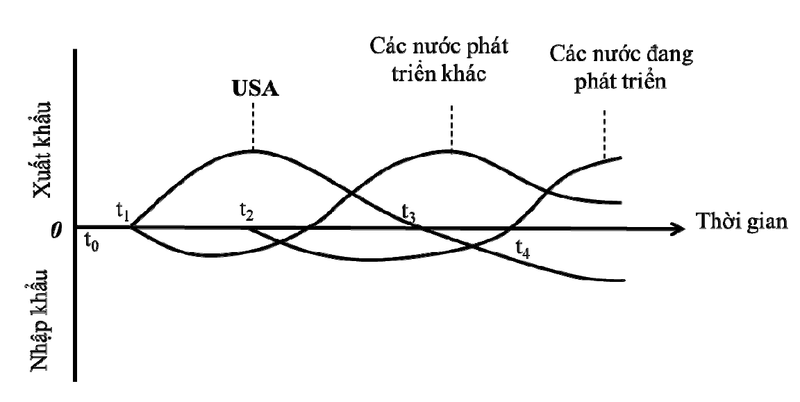

Hình. Vòng đời sản phẩm và thương mại quốc tế

178

<!-- page 179 -->

## 6.1.4. MỘT SỐ LÝ THUYẾT THƯƠNG MẠI QUỐC TẾ HIỆN ĐẠI

a.  Lý thuyết vòng đời sản phẩm (tiếp)
Hàm ý thương mại

Giải thích quá trình hoạt động sản xuất hàng hóa dịch chuyển từnước này sang nước khác khi

sản phẩm phát triển trong chu kỳsống của nó.
Sựthay đổi dạng thức thương mại là do sựdịch chuyển địa điểm sản xuất vì vậy quốc gia có lợi

thếso sánh có thểthay đổi
Giải thích đầu tư quốc tế- nhận thức sựdi chuyển của vốn (sựdi chuyển của nhân tố) giữa các

quốc gia
Hạn chế

Phù hợp nhất với các sản phẩm (được phát triển) dựa trên công nghệ
Một số sản phẩm không dễ xác định được giai đoạn bão hòa
Phù hợp nhất với các sản phẩm được sản xuất hàng loạt.
Lý thuyết Vòng đời sản phẩm trong thế kỷ 21

Về mặt lịch sử, đây là một lý thuyết đúng
Hiện tại, lý thuyết này mang hơi hướng vị chủng và lỗi thời

179

<!-- page 180 -->

### 6.1.4. MỘT SỐ LÝ THUYẾT THƯƠNG MẠI QUỐC TẾ HIỆN ĐẠI

b. Lý thuyết thương mại mới

Các học giả: Dixit, Norman, Lancaster, Krugman, Helpman, Ethier… trong những năm 70 và 80

của thếkỷXX
Nội dung

Có thểthu được lợi ích từchuyên môn hóa và tính kinh tếtheo quy mô,
Những người đầu tiên gia nhập thịtrường có thểtạo ra rào cản gia nhập cho những người khác
Chính phủcó thểcó vai trò hỗtrợcác nhà sản xuất trong nước.
Hàm ý thương mại

Xác định được một yếu tốquan trọng của lợi thếso sánh – tính kinh tếtheo quy mô
Các quốc gia vẫn có thểcó lợi khi tham gia thương mại ngay cảkhi quốc gia không có sựkhác

biệt vềưu đãi nguồn lực và công nghệ
Một quốc gia có thểcó ưu thếtrong xuất khẩu một hàng hóa đơn giản chỉvì quốc gia đó có đủ

may mắn khi có 1 hay nhiều doanh nghiệp nằm trong sốnhững người đầu tiên sản xuất ra
hàng hóa đó
Lợi thếngười đi trước của doanh nghiệp có được từmay mắn, tinh thần doanh nghiệp, sựđổi

mới…

180

<!-- page 181 -->

## 6.1.4. MỘT SỐ LÝ THUYẾT THƯƠNG MẠI QUỐC TẾ HIỆN ĐẠI

c. Lý thuyết lợi thế cạnh tranh (Michael Porter)

Theo Porter, lợi thế cạnh tranh bắt nguồn từ:

Điều kiện về nhân tố sản xuất,

Điều kiện về cầu,

Chiến lược và đối thủ,

Các ngành công nghiệp phụ trợ và có liên quan

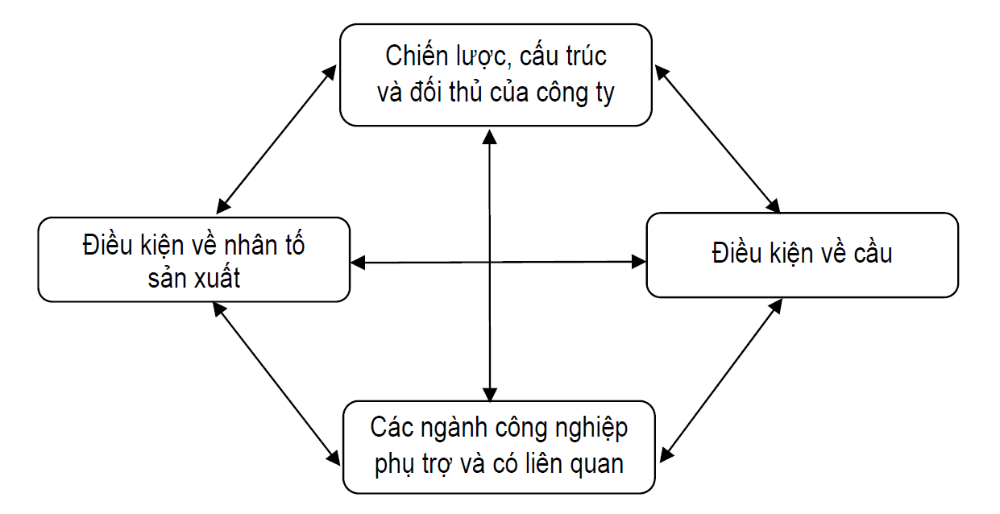

Bổ sung thêm: cơ hội và chính phủ

Hình. Mô hình kim cương của M. Porter

181

<!-- page 182 -->

## CÂU HỎI TƯƠNG TÁC

Ý nghĩa nghiên cứu các lý thuyết

vềlợi thếtrong thương mại?

182

<!-- page 183 -->

## 6.2. TOÀN CẦU HÓA VÀ SỰ RA ĐỜI CỦA WTO

Bản chất và xu hướng toàn cầu hóa thương mại

Sự ra đời và các hiệp định thương mại cơ bản của WTO

183

<!-- page 184 -->

## 6.2.1. BẢN CHẤT VÀ XU HƯỚNG TOÀN CẦU HÓA THƯƠNG MẠI

a.
Bản chất toàn cầu hóa kinh tếthương mại
Toàn cầu hóa là xu thếtất yếu khách quan, bắt đầu từcuối thếkỷXIX
Động lực của toàn cầu hóa: sựphát triển của KH-KT, sựdỡbỏcác rào cản thương mại, đầu tư
Biểu hiện:

Lực lượng sản xuất, phân công lao động phát triển mạnh mẽ, sản xuất của mỗi nước vượt ra khỏi

phạm vi [VERIFY_OCR: vi/vĩ — check PDF trang 184] lãnh thổbiên giới quốc gia và mởrộng ra toàn thếgiới
Các luồng giao lưu quốc tếvềthương mại, đầu tư, vốn, công nghệ, lao động… gia tăng mạnh mẽ, với

quy mô, tốc độngày một lớn hơn, tựdo hơn.
Các thịtrường có tính thống nhất ởcác khu vực và toàn cầu từng bước được tạo lập và phát triển,

song song với việc hình thành các định chếvà cơ chếđiều chỉnh các mối quan hệkinh tếquốc tế.
Toàn cầu hóa kinh tếthương mại là gia tăng sựvận động của các yếu tốsản xuất, vốn, kỹthuật nhằm

phân bổtối ưu các nguồn lực trên phạm vi [VERIFY_OCR: vi/vĩ — check PDF trang 184] toàn cầu, là gia tăng nhanh chóng các hoạt động kinh tếvượt
qua mọi biên giới quốc gia, khu vực và sựphụthuộc lẫn nhau giữa các nền kinh tếtrên thếgiới cũng như
sựxuất hiện của một loạt cơ cấu tổchức liên kết nhằm quản lý mạng lưới ngày càng mởrộng của các
hoạt động kinh tếvà giao dịch thương mại quốc tế.

184

<!-- page 185 -->

## 6.2.1. BẢN CHẤT VÀ XU HƯỚNG TOÀN CẦU HÓA THƯƠNG MẠI (tiếp)

b.
Tính tất yếu khách quan của toàn cầu hóa kinh tếthương mại


Toàn cầu hóa là xu thếtất yếu khách quan


Bản chất khách quan của toàn cầu hóa kinh tế, thương mại được quy định bởi tính tất yếu khách

quan của quá trình quốc tếhóa kinh tế.

Xuất hiện từxa xưa với biểu hiện sơ khai là "con đường tơ lụa" từchâu Á sang châu Âu

Phát kiến địa lý TK XVI và sựchuyển tiếp của loài người từthời đại nông nghiệp lên công nghiệp TK

XVIII nền kinh tếdần mang tính toàn cầu

Lực lượng sản xuất phát triển, với vai trò then chốt của khoa học công nghệthúc đẩy sản xuất phát

triển cảchiều rộng và chiều sâu; các luồng thương mại, đầu tư, di chuyển nguồn lực (vốn, lao

động…) vượt ra khỏi biên giới quốc gia, hàng rào ngăn cách bởi địa giới hành chính bịxóa nhòa 

quá trình quốc tếhóa kinh tếbước sang giai đoạn mới - thời kỳtoàn cầu hóa nền kinh tếthếgiới.

185

<!-- page 186 -->

## 6.2.1. BẢN CHẤT VÀ XU HƯỚNG TOÀN CẦU HÓA THƯƠNG MẠI (tiếp)

c. Nhân tốthúc đẩy và xu hướng phát triển của toàn cầu hóa kinh tếthương mại

Động lực của toàn cầu hóa:

Sựphát triển của KH-KT

Sựdỡbỏcác rào cản thương mại, đầu tư

Xu hướng:

Cách mạng khoa học kỹthuật và công nghệtiếp tục là nhân tốquan trọng thúc đẩy toàn cầu hóa

kinh tếthương mại.

Các công ty xuyên quốc gia, các định chếtài chính, thương mại quốc tếtiếp tục là các nhân tố

chính, có vai trò thúc đẩy toàn cầu hóa kinh tếthương mại.

Sựgia tăng cảvềquy mô và tốc độcủa các luồng hàng hóa - dịch vụvà đầu tư nước ngoài.

Xu hướng đa cực trong toàn cầu hóa và vai trò nổi lên của các nước đang phát triển.

Liên kết, hợp tác khu vực diễn ra song song với toàn cầu hóa kinh tếthương mại.

186

<!-- page 187 -->

## 6.2.2. SỰ RA ĐỜI VÀ CÁC HIỆP ĐỊNH THƯƠNG MẠI CƠ BẢN CỦA WTO

a. Sự ra đời của WTO

b. Mục tiêu và các nguyên tắc cơ bản của WTO

c. Các hiệp định thương mại cơ bản của WTO

187

<!-- page 188 -->

## 6.2.2. SỰ RA ĐỜI VÀ CÁC HIỆP ĐỊNH THƯƠNG MẠI CƠ BẢN CỦA WTO

### a. Sựra đời của WTO  WTO (World Trade Organization) – Tổchức thương mại thếgiới

Thành lập: 1.1.1995

Trụsở: Geneva (Thụy Sĩ [VERIFY_OCR: sĩ/sỉ — check PDF trang 188])

Tổng giám đốc: Ngozi Okonjo-Iweala

Ban thư ký: 623 người

Thành viên: 164 (tính đến 5.2023)

Tỷtrọng thương mại toàn cầu: 98%

Ngân sách cho năm 2022: 197 triệu Francs Thụy Sĩ

Quan sát viên: 25

188

<!-- page 189 -->

## 6.2.2. SỰ RA ĐỜI VÀ CÁC HIỆP ĐỊNH THƯƠNG MẠI CƠ BẢN CỦA WTO

a.
Sựra đời của WTO (tiếp)
WTO (World Trade Organization) – Tổchức thương mại thếgiới
Lịch sửhình thành

Thực tiễn thương mại thếgiới giữa những năm chiến tranh

Định chế“Bretton Woods” 1944 – World Bank, IMF

Hiến chương Havana và Tổchức thương mại quốc tếITO

GATT 1948 – Hiệp định chung vềthuếquan và thương mại

8 vòng đàm phán: Geneva (1947), Annecy (1949), Torquay (1951), Geneva (1956), Dillon (1960-1961),
Kennedy (1964-1967), Tokyo (1973-1979), Uruguay (1986-1993)
Vòng Uruguay 1986-1994

Thuếquan và hàng rào phi thuếquan
Nông nghiệp và dệt may
Dịch vụvà quyền sởhữu trí tuệ
Củng cốhệthống giải quyết tranh chấp
Hình thành WTO

189

<!-- page 190 -->

## 6.2.2. SỰ RA ĐỜI VÀ CÁC HIỆP ĐỊNH THƯƠNG MẠI CƠ BẢN CỦA WTO

### b. Mục tiêu và các nguyên tắc cơ bản của WTO

Mục tiêu
của WTO

Thúc đẩy tăng trưởng TMHH và TMDV trên thế giới, phục vụ cho sự phát triển ổn định, bền vững và bảo vệ
môi trường;

Thúc đẩy sựphát triển các thểchếthịtrường, giải quyết các bất đồng và tranh chấp thương mại giữa các
thành viên trong khuôn khổhệthống thương mại đa phương, phù hợp với các nguyên tắc cơ bản của công
pháp quốc tế; bảo đảm cho các nước đang phát triển và đặc biệt là các nước kém phát triển nhất được thụ
hưởng những lợi ích thực sựtừsựtăng trưởng của TMQT, phù hợp với nhu cầu phát triển kinh tếcủa các
nước này và khuyến khích các nước này ngày càng hội nhập sâu rộng hơn vào nền kinh tếthếgiới;

Nâng cao mức sống, tạo công ăn việc làm cho người dân các nước thành viên, bảo đảm các quyền và tiêu
chuẩn lao động tối thiểu được tôn trọng.

190

<!-- page 191 -->

## 6.2.2. SỰ RA ĐỜI VÀ CÁC HIỆP ĐỊNH THƯƠNG MẠI CƠ BẢN CỦA WTO

### b. Mục tiêu và các nguyên tắc cơ bản của WTO (tiếp)

Thương mại
không phân biệt

Điều kiện đặc biệt
dành cho các nước

đang phát triển
Cạnh tranh

đối xử

công bằng

### 01 02 03 04 05 5 nguyên tắc cơ bản

của WTO

Thương mại
ngày càng tự do

Minh bạch

hơn thông qua

đàm phán

<!-- page 192 -->

## 6.2.2. SỰ RA ĐỜI VÀ CÁC HIỆP ĐỊNH THƯƠNG MẠI CƠ BẢN CỦA WTO

### c. Các hiệp định thương mại cơ bản của WTO

Hiệp định chung vềTMDV
Mởcửa thịtrường dịch vụđểkích thích
cạnh tranh nhằm tạo ra nhiều dịch vụsẵn
sàng hơn, rẻhơn, chất lượng hoàn hảo
hơn nhằm thỏa mãn các nhu cầu sản xuất
- kinh doanh và nâng cao mức sống cho
con người

Hiệp định chung vềTMHH
Xây dựng và đềra các nguyên tắc đa
phương vềTMHH nhằm tạo ra một
hệthống TM tựdo và thông thoáng

GATT

GATS

Hiệp định vềcác khía cạnh liên quan
đến thương mại của Quyền SHTT
Đưa ra các tiêu chuẩn tối thiểu đểbảo
hộcác quyền SHTT trong các lĩnh vực
bản quyền, nhãn hiệu hàng hóa, kiểu
dáng công nghiệp, thiết kếbốtrí mạch
tích hợp, thông tin bí mật

TRIMs
Hiệp định vềcác biện pháp đầu tư liên
quan đến thương mại
Xóa bỏcác biện pháp đầu tư gây cản trở
đến thương mại.

TRIPS

192

<!-- page 193 -->

## 6.3. HỘI NHẬP KINH TẾ THƯƠNG MẠI

Bản chất và các hình thức hội nhập kinh tế thương mại

Hội nhập kinh tế thương mại của các nước đang phát triển

193

<!-- page 194 -->

## 6.3.1. BẢN CHẤT VÀ CÁC HÌNH THỨC HỘI NHẬP KINH TẾ THƯƠNG MẠI

a. Tính tất yếu khách quan của hội nhập kinh tếthương mại

b. Bản chất và nội dung của hội nhập kinh tếthương mại

c. Các hình thức hội nhập kinh tếthương mại

194

<!-- page 195 -->

## 6.3.1. BẢN CHẤT VÀ CÁC HÌNH THỨC HỘI NHẬP KINH TẾ THƯƠNG MẠI

a.
Tính tất yếu khách quan của hội nhập kinh tếthương mại

Nhu cầu trong quá trình phát triển của toàn cầu hóa

- Quá trình toàn cầu hóa đưa đến:

Lực lượng sản xuất, phân công lao động phát triển mạnh mẽ, sản xuất của mỗi nước vượt ra khỏi

phạm vi [VERIFY_OCR: vi/vĩ — check PDF trang 195] lãnh thổbiên giới quốc gia và mởrộng ra toàn thếgiới

Các luồng giao lưu quốc tếvềthương mại, đầu tư, vốn, công nghệ, lao động… gia tăng mạnh mẽ,

với quy mô, tốc độngày một lớn hơn, tựdo hơn.

Các thịtrường có tính thống nhất ởcác khu vực và toàn cầu từng bước được tạo lập và phát triển,

song song với việc hình thành các định chếvà cơ chếđiều chỉnh các mối quan hệkinh tếquốc tế.

- Sựphát triển của KH-KT, sựdỡbỏcác rào cản thương mại, đầu tư (những động lực của toàn cầu hóa)

góp phần tạo ra những liên kết chặt chẽgiữa các quốc gia.

- Liên kết, hợp tác giữa các quốc gia đểgiải quyết các vấn đềmang tính toàn cầu.

Toàn cầu hóa là sựliên kết (và do đó) dẫn đến phụthuộc lẫn nhau giữa các quốc gia
Tham gia vào quá trình toàn cầu hóa chính là thực hiện hội nhập kinh tếthương mại
195

<!-- page 196 -->

## 6.3.1. BẢN CHẤT VÀ CÁC HÌNH THỨC HỘI NHẬP KINH TẾ THƯƠNG MẠI

### b. Bản chất và nội dung của hội nhập kinh tếthương mại

Quá trình chủđộng gắn
kết thịtrường, TM của
một nước với thịtrường,
TM khu vực và toàn cầu
qua các nỗlực tựdo hóa
TM và mởcửa thịtrường
trên
các
cấp
độ
đơn
phương,
song
phương,
đa phương và khu vực.
BẢN CHẤT

- Đàm phán, ký kết và tham gia
vào các tổchức, liên kết kinh tế
TM khu vực và toàn cầu, cùng
các thành viên đàm phán, xây
dựng luật chơi chung và thực
hiện các quy định, cam kết với
thành viên của các tổchức và
liên kết đó;
- Tiến hành các bước đi cần
thiết nhằm cải cách, điều chỉnh
chếđộTM trong nước và các
lĩnh vực khác có liên quan nhằm
đáp ứng thực hiện cam kết hội
nhập kinh tếTM.

NỘI DUNG

HỘI NHẬP

KINH TẾ
THƯƠNG MẠI

196

<!-- page 197 -->

## 6.3.1. BẢN CHẤT VÀ CÁC HÌNH THỨC HỘI NHẬP KINH TẾ THƯƠNG MẠI

c. Các hình thức hội nhập kinh tếthương mại

5 hình thức hội nhập

kinh tế thương mại

197

<!-- page 198 -->

### 6.3.2. HỘI NHẬP KINH TẾ THƯƠNG MẠI CỦA CÁC NƯỚC ĐANG PHÁT TRIỂN

Lý do

Lợi ích

Nhu cầu nội tại

Thay đổi, cải

trong quá trình
phát triển
Tránh “bị gạt ra

cách
trong
nước
trước
sức
ép
hội
nhập

Thực tiễn
Gia tăng sốlượng RTA
Gia tăng liên kết tiểu khu

lề” trong xu thế
TCH và hội nhập

Mục đích

vực, các hiệp định song
phương giữa các nước
ĐPT
Trởngại trong hội nhập:

Thúc đẩy tăng

trưởng và phát
triển kinh tế
Thực hiện công

khác
biệt
trong
định
hướng chính sách, chính
trị, quan điểm về“chủ
nghĩa dân tộc”, xung đột
khu vực, yếu kém về
CSHT…

nghiệp hóa
Giảm đói nghèo

198

<!-- page 199 -->

## CÂU HỎI ÔN TẬP

Câu 1.

Nội dung cơ bản của các lý thuyết vềlợi thếso sánh trong thương mại quốc tế. Liên hệlợi thếcủa

Việt Nam trong thương mại quốc tếvới một mặt hàng/ngành hàng cụthể?

Câu 2.

Khái quát quá trình hội nhập thương mại khu vực và quốc tế của Việt Nam?

Câu 3.

Phân tích đặc trưng của các hình thức liên kết, hội nhập kinh tếthương mại khu vực?

199

<!-- page 200 -->

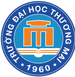

## CASE STUDY

Theo BộCông thương, năm 2021, tổng giá trịTMHH giữa Việt Nam và EU đạt 56,8 tỷUSD, bao gồm 39,9 tỷ
USD giá trịXK của Việt Nam, tăng 13,5% so với cùng kỳnăm 2020 và 16,9 tỷUSD giá trịNK của Việt Nam, tăng
15,5% so với cùng kỳnăm 2020, thặng dư TM là 23 tỷUSD. Trong năm 2022, Việt Nam đạt thặng dư TM từEU
khoảng 31,8 tỷUSD, XK đạt 47,1 tỷUSD - tăng 17,4%; NK đạt 15,3 tỷUSD - giảm 9,4%. Theo ước tính sơ bộ,
trong tháng 1/2023, Việt Nam XK hàng hóa sang EU đạt 3 tỷUSD và NK 1,2 tỷUSD, xuất siêu 1,8 tỷUSD.
“Việt Nam đạt thặng dư TM đáng kểvới EU. Đây là một chỉsốmạnh mẽcho thấy sựphục hồi kinh tếcủa Việt
Nam sau đại dịch và TM song phương Việt Nam - EU đang tăng trưởng”, Công ty Tư vấn Dezan Shira &
Associates cho biết.
Theo Phái đoàn Liên minh châu Âu tại Việt Nam, đối với các thương nhân Việt Nam, lợi ích từkhi EVFTA có hiệu
lực còn cao hơn. Vềmặt thịtrường, EVFTA cho phép các nhà XK Việt Nam tiếp cận hơn 450 triệu người tiêu
dùng châu Âu có thu nhập khảdụng cao nhất thếgiới. Kểtừkhi EVFTA có hiệu lực, khoảng 85,6% sốdòng thuế
đã được xóa bỏhoàn toàn cho hàng hóa Việt Nam. Tỷlệnày chiếm 70,3% tổng kim ngạch XK của Việt Nam
sang EU. Việc xóa bỏdần thuếNK như vậy đã tạo điều kiện cho sựgia tăng 20%/năm của XK Việt Nam sang
EU. Đáng chú ý, theo BộCông thương, năm 2021, XK của Việt Nam sang EU sửdụng chứng nhận xuất xứhàng
hóa theo hình thức EUR.1 đạt 7,8 tỷUSD, đồng nghĩa với việc nhiều doanh nghiệp Việt Nam đã tận dụng cơ hội
cắt giảm thuếquan trong EVFTA.
Trung tâm WTO và Hội nhập thuộc Liên đoàn Thương mại và Công nghiệp Việt Nam (VCCI) cũng cho biết, trong
2 năm đầu thực thi EVFTA, kim ngạch XK của Việt Nam từ27 thành viên EU đạt bình quân 41,7 tỷUSD/năm
200

<!-- page 201 -->

## CASE STUDY (tiếp)

cao hơn 24% so với con sốtrung bình 33,5 tỷUSD giai đoạn 2016-2019. Điều này có nghĩa là nhiều nhà XK tại
Việt Nam đã được hưởng lợi từviệc giảm thuếtừEVFTA. Theo khảo sát của VCCI vềtác động của EVFTA đối
với các doanh nghiệp XK Việt Nam, khoảng 40% doanh nghiệp cho biết họđã tận dụng tốt một sốlợi ích - trong
đó có lợi ích XK EVFTA mang lại. Điều này phản ánh Việt Nam đã chứng kiến một sốcải thiện trong XK sang thị
trường EU trong hơn hai năm qua. “Việc bãi bỏthuếquan song phương và thuếXK, cùng với việc cắt giảm các
hàng rào phi thuếquan ảnh hưởng đến trao đổi hàng hóa và dịch vụxuyên biên giới, dựkiến sẽthúc đẩy TM
song phương một cách đáng kể. Lợi nhuận XK ước tính đạt 8 tỷeuro (8,3 tỷUSD) vào năm 2035 đối với các công
ty EU, trong khi XK của Việt Nam sang EU dựkiến sẽtăng 15 tỷeuro (15,6 tỷUSD)”, ông Aliberti cho biết.
Vào tháng 9/2022, ông Bernd Lange, Chủtịch Ủy ban Thương mại quốc tế(INTA) của Nghịviện châu Âu (EP) đã
đến Việt Nam lần thứtư trong vòng 3 năm qua, nhằm đánh giá việc triển khai EVFTA của Việt Nam. Ông khẳng
định, Việt Nam là một trong những đối tác quan trọng của EU tại khu vực và EP luôn ủng hộtăng cường hợp tác
hai bên trên tất cảcác lĩnh vực, nhất là trong bối cảnh EU đang triển khai nhiều chính sách hướng vềkhu vực Ấn
ĐộDương - Thái Bình Dương, trong đó có Việt Nam. “EP, bao gồm INTA, sẽtiếp tục hỗtrợViệt Nam thực hiện
các cam kết trong EVFTA cũng như mởrộng hợp tác trong lĩnh vực phát triển bền vững. EVFTA là nền tảng vững
chắc đểthúc đẩy hợp tác TM và đầu tư giữa EU và Việt Nam trong hiện tại và tương lai. Hiệp định đã có tác động
tích cực đến cảEU và Việt Nam, với dòng vốn đầu tư và TM lớn hơn được ghi nhận”, ông Lange nói.
...
Theo Dezan Shira & Associates, TM và đầu tư giữa Việt Nam và EU được dựbáo sẽđạt tầm cao mới khi EU kiên
định thực hiện cam kết cắt giảm dòng thuếđối với nhiều loại hàng hóa và mặt hàng của Việt Nam trong 3-7 năm
tới. Các nhà đầu tư trong các ngành nên tận dụng tối đa lợi thếvềthuếquan theo EVFTA đểmởrộng hoạt động
kinh doanh và XK từViệt Nam sang EU.
201

<!-- page 202 -->

## CASE STUDY (tiếp)

“Tiềm năng đang trải rộng đối với nhiều ngành, bao gồm XK cà phê và hạt điều sang EU. Hiện 80% điều và cà
phê XK là sản phẩm thô do các nhà sản xuất Việt Nam vẫn chưa tạo ra các sản phẩm chếbiến phù hợp nhất với
thịhiếu của EU. Quan trọng nhất là ngành viễn thông và điện tửkhi nhu cầu của EU đối với chất bán dẫn và linh
kiện tăng cao trong bối cảnh thiếu hụt đầu vào toàn cầu”, Dezan Shira & Associates cho biết.
Ngân hàng thếgiới (WB) ước tính, chỉcần được hưởng mức cắt giảm thuếquan như đã thỏa thuận, EVFTA có
thểthúc đẩy GDP và XK của Việt Nam tăng lần lượt 2,4% và 12% vào năm 2030, đồng thời giúp thêm 100.000-
800.000 người thoát nghèo vào năm 2030.
…
Tuy nhiên, theo WB, Việt Nam có thểhưởng lợi nhiều hơn từcác hiệp định TM thếhệtiếp theo như EVFTA và
CPTPP, nếu thúc đẩy một chương trình nghịsựtoàn diện vềcải cách kinh tếvà thểchếđểtạo thuận lợi cho tuân
thủcác hiệp định phi thuếquan. Những cải cách như vậy sẽdẫn đến một “cú hích năng suất”, làm tăng GDP
thêm 6,8% so với kịch bản cơ sởvào năm 2030. WB đã nhấn mạnh nhu cầu của Việt Nam trong việc nâng cao
năng lực đểxửlý một sốvấn đềchính, bao gồm quy tắc xuất xứ, tiêu chuẩn vệsinh động vật, thực vật và giải
quyết tranh chấp giữa nhà đầu tư và Nhà nước.

https://baodautu.vn/evfta-tao-xung-luc-moi-cho-thuong-mai-va-dau-tu-viet-nam--eu-d183049.html

Câu hỏi:
1. Tính đến thời điểm tháng 4 năm 2023, Việt Nam đã đàm phán/ký và thực thi bao nhiêu hiệp

định thương mại tự do?
2. Tại sao có thể coi EVFTA là hiệp định thương mại tự do thế hệ mới?
3. Những lợi ích EVFTA đem lại là gì? Để tận dụng khai thác EVFTA, Việt Nam cần làm gì?

202

<!-- page 203 -->

## TỔNG KẾT BÀI HỌC

1. Phát triển TMQT dựa vào lợi thếlà tất yếu khách quan trong quá trình tồn tại và phát triển của mỗi quốc gia.

Các lý thuyết vềlợi thếtuyệt đối của Adam Smith, lợi thếso sánh của David Ricardo, lý thuyết vềsựưu đãi

nhân tốsản xuất của Hecksher-Ohlin, lý thuyết vòng đời sản phẩm của Vernon… đều lý giải nguồn gốc và

những lợi ích của TMQT với những ưu và hạn chếriêng.

2. TCH kinh tếthương mại (TM) là gia tăng sựvận động của các yếu tốsản xuất, vốn, kỹthuật nhằm phân bổ

tối ưu các nguồn lực trên phạm vi [VERIFY_OCR: vi/vĩ — check PDF trang 203] toàn cầu, làm gia tăng nhanh chóng các hoạt động kinh tếvượt qua mọi

biên giới quốc gia, khu vực và sựphụthuộc lẫn nhau giữa các nền kinh tếtrên thếgiới cũng như sựxuất

hiện của một loạt cơ cấu tổchức liên kết nhằm quản lý mạng lưới ngày càng mởrộng của các hoạt động

kinh tếvà giao dịch TMQT.

3. WTO là kết quảcủa Vòng đàm phán Uruguay và là định chếđiều chỉnh các quan hệTMQT với các nguyên

tắc cơ bản: TM không phân biệt đối xử, TM tựdo hơn thông qua đàm phán, minh bạch, cạnh tranh công

bằng, điều kiện đặc biệt dành cho các nước đang phát triển. Các hiệp định cơ bản của WTO gồm: GATT,

GATS, TRIPS, TRIMs.

4. Hội nhập TMQT là quá trình chủđộng gắn kết thịtrường, TM của một nước với thịtrường, TM khu vực và

toàn cầu qua các nỗlực tựdo hóa TM và mởcửa thịtrường trên các cấp độđơn phương, song phương, đa

phương và khu vực. Hội nhập TMQT diễn ra theo các cấp độtừthấp đến cao: khu vực mậu dịch tựdo, liên

minh thuếquan, thịtrường chung, liên minh kinh tếvà hợp nhất kinh tếtoàn diện.
203

<!-- page 204 -->

## GIẢI THÍCH THUẬT NGỮ


Lợi thế tuyệt đối


GATS


Lợi thế so sánh


TRIPS


Vòng đời sản phẩm


TRIMs


Lợi thế cạnh tranh


Đãi ngộ tối huệ quốc


Lợi thế người đi trước


Đối xử quốc gia


Toàn cầu hóa


Khu vực mậu dịch tự do


Hội nhập kinh tế thương mại


Liên minh thuế quan


Tổ chức thương mại thế giới


Thị trường chung


GATT


Liên minh kinh tế

204

<!-- page 205 -->

# CHƯƠNG 7.

# NGUỒN LỰC VÀ HIỆU QUẢ KINH TẾ THƯƠNG MẠI

<!-- page 206 -->

## TÌNH HUỐNG KHỞI ĐỘNG BÀI

Trong bối cảnh hội nhập như hiện nay, chất lượng nguồn nhân lực là yếu tốquan trọng phản ánh sựphát

triển kinh tế, xã hội nói chung và sựphát triển trong lĩnh vực công nghiệp, thương mại nói riêng. Nguồn

nhân lực cần phát triển theo cảchiều rộng và chiều sâu bao gồm sựphát triển vềsốlượng, cơ cấu, trình

độnhằm phát huy tối đa khảnăng lao động phục vụcho ngành Công thương trong bối cảnh hiện nay.

Nguồn nhân lực là nguồn lực mang tính quyết định trong sựphát triển trên cảlĩnh vực công nghiệp và

thương mại của một quốc gia. Nguồn nhân lực cần phải đào tạo, bồi dưỡng nhằm nâng cao trình độ, kỹ

năng, từđó lợi ích do nguồn nhân lực tạo ra có thểđạt được những giá trịrất lớn. Cần đánh giá thực trạng

nhu cầu vềsốlượng, cơ cấu, trình độnguồn nhân lực đểcó giải pháp nhằm đào tạo, bồi dưỡng nguồn

nhân lực phục vụcho lĩnh vực công nghiệp và thương mại. Trong những năm qua, Nhà nước đã ban hành

nhiều chính sách nhằm phát triển nguồn nhân lực, đóng góp ngày càng hiệu quảcho phát triển kinh tếđất

nước và quá trình hội nhập kinh tếquốc tếđang diễn ra mạnh mẽ.

Nguồn:
https://vioit.org.vn/vn/chien-luoc-chinh-sach/phat-trien-nguon-nhan-luc-trong-nganh-cong-thuong-

4716.4050.html

Câu hỏi:
Nguồn nhân lực thương mại có vai trò như thế nào với sự phát triển của ngành thương mại?
Những yêu cầu nào đặt ra cho sự phát triển nguồn nhân lực thương mại ở Việt Nam hiện nay?

206

<!-- page 207 -->

## MỤC TIÊU CỦA CHƯƠNG

Tìm hiểu bản chất và vai trò nguồn lực phát triển thương
mại; bản chất, vai trò, cấu thành và chính sách phát triển
một sốnguồn lực chủyếu trong thương mại;

Giới thiệu bản chất, phương pháp và các chỉtiêu đánh giá
hiệu quảkinh tếthương mại; cơ sởvà những giải pháp có
tính định hướng nâng cao hiệu quảkinh tếthương mại;

Phân tích các chỉtiêu và nguyên tắc khai thác và sửdụng
nguồn lực thương mại theo hướng phát triển bền vững.

207

<!-- page 208 -->

## CẤU TRÚC NỘI DUNG CỦA CHƯƠNG

Nguồn lực thương mại

7.1

Hiệu quả kinh tế thương mại

7.2

Khai thác và sử dụng nguồn lực
thương mại theo hướng phát triển

7.3

bền vững

208

<!-- page 209 -->

## 7.1. NGUỒN LỰC THƯƠNG MẠI

7.1.1. Khái niệm và phân loại nguồn lực thương mại

7.1.2. Vai trò của nguồn lực đối với sự phát triển thương mại

7.1.3. Nguồn lực lao động phát triển thương mại

7.1.4. Nguồn lực tài chính phát triển thương mại

7.1.5. Cở sở hạ tầng và cơ sở vật chất kỹ thuật phát triển thương mại

209

<!-- page 210 -->

## 7.1.1. KHÁI NIỆM VÀ PHÂN LOẠI NGUỒN LỰC THƯƠNG MẠI

a. Khái niệm nguồn lực thương mại

Trong nền kinh tếthịtrường, nguồn lực được quan niệm là toàn bộcác điều kiện có khảnăng

huy động đểthực hiện cho mục đích nhất định nào đó.

Nguồn lực thương mại là tổng thểcác điều kiện tựnhiên và kinh tế- xã hội có khảnăng huy

động và sửdụng đểthực hiện mục đích tổchức và phát triển lưu thông hàng hoá, cung ứng

dịch vụtrên thịtrường.

210

<!-- page 211 -->

## 7.1.1. KHÁI NIỆM VÀ PHÂN LOẠI NGUỒN LỰC THƯƠNG MẠI

a. Khái niệm nguồn lực thương mại

Những vấn đềcơ bản cần lưu ý khi đánh giá các nguồn lực thương mại:

Phải chú ý cảsốlượng và chất lượng các nguồn lực, đặc biệt là chất lượng các nguồn lực. Thực

tế, chất lượng nguồn lực tốt sẽlàm tăng thêm sốlượng của nó.

Phải kết hợp xem xét các nguồn lực cảởtrạng thái tĩnh và trạng thái động. Trong đó, phải chỉrõ

động thái, hướng phát triển của từng nguồn lực nhằm khai thác, quản lý và sửdụng có hiệu quả

các nguồn lực này.

Phải chú ý đến tổng lượng, cơ cấu, ảnh hưởng và hiệu quảcủa các nguồn lực này đến hoạt động

thương mại, cũng như mối quan hệlẫn nhau giữa các yếu tốtrong hệthống nguồn lực.

211

<!-- page 212 -->

## 7.1.1. KHÁI NIỆM VÀ PHÂN LOẠI NGUỒN LỰC THƯƠNG MẠI

b. Phân loại nguồn lực thương mại

Theo phạm vi [VERIFY_OCR: vi/vĩ — check PDF trang 212] huy động: Nguồn lực bên trong và nguồn lực bên ngoài

Theo quy mô nghiên cứu: Nguồn lực quốc gia và nguồn lực địa phương

Theo hình thái biểu hiện: Nguồn lực vật chất và nguồn lực phi vật chất

Theo khả năng huy động: Nguồn lực hiện hữu và nguồn lực tiềm ẩn

Theo yếu tố cấu thành: Nhân lực, vật lực và tài lực

212

<!-- page 213 -->

## 7.1.1. KHÁI NIỆM VÀ PHÂN LOẠI NGUỒN LỰC THƯƠNG MẠI

b. Phân loại nguồn lực thương mại

Theo phạm vi [VERIFY_OCR: vi/vĩ — check PDF trang 213] huy động

Nguồn lực bên trong:

Biểu hiện tiềm lực của một quốc gia đối với sựphát triển của thương mại

Bao gồm: Nguồn lực lao động, cơ sởhạtầng, cơ sởvật chất kỹthuật, hệthống tài sản [VERIFY_OCR: sản/sàn — check PDF trang 213] quốc

gia, vịtrí địa lý, hệthống chính sách phát triển kinh tế, thương mại quốc gia...

Nguồn lực bên ngoài:

Vịtrí quan trọng trong xu thếkhu vực hoá và toàn cầu hoá kinh tếvà thương mại

Trong các nguồn lực bên ngoài, nguồn lực tài chính, nguồn lực khoa học - công nghệvà

nguồn lực con người có ý nghĩa tạo ra sựphát triển nhảy vọt, đột phá cho thương mại của

những quốc gia đang phát triển như Việt Nam

213

<!-- page 214 -->

## 7.1.1. KHÁI NIỆM VÀ PHÂN LOẠI NGUỒN LỰC THƯƠNG MẠI

b. Phân loại nguồn lực thương mại

Theo quy mô nghiên cứu

•
Nguồn lực của quốc gia.

Gồm toàn bộnguồn lực bên trong và bên ngoài của toàn bộnền kinh tế- xã hội có khảnăng

khai thác, sửdụng vào mục đích phát triển thương mại,

Phản ánh tiềm lực, khảnăng cạnh tranh vĩ [VERIFY_OCR: vĩ/vi — check PDF trang 214] mô và phát triển thương mại của một quốc gia.

•
Nguồn lực của địa phương.

Là một bộphận của nguồn lực quốc gia được xem xét trong phạm vi [VERIFY_OCR: vi/vĩ — check PDF trang 214] một tỉnh, một thành phố

hoặc một khu vực địa lý nhất định.

Thường gắn liền với những lợi thếso sánh mà từng địa phương có khảnăng khai thác cho phát

triển thương mại, trước hết là những điều kiện vềđịa lý [VERIFY_OCR: lý/ly — check PDF trang 214], cơ sởhạtầng, trình độphát triển kinh

tế.

214

<!-- page 215 -->

## 7.1.1. KHÁI NIỆM VÀ PHÂN LOẠI NGUỒN LỰC THƯƠNG MẠI

b. Phân loại nguồn lực thương mại

### Theo hình thái biểu hiện

Nguồn lực vật chất

Là nguồn lực có hình thái hữu hình
Bao gồm: Các tài sản [VERIFY_OCR: sản/sàn — check PDF trang 215] lưu động (hàng hóa vật tư, tiền vốn và các tài sản [VERIFY_OCR: sản/sàn — check PDF trang 215] tài chính khác);

Các tài sản [VERIFY_OCR: sản/sàn — check PDF trang 215] cốđịnh (đất đai, hệthống giao thông, bến cảng, nhà cửa làm kho hàng, cửa
hàng, cửa hiệu, trung tâm thương mại, các trang thiết bị, công nghệkinh doanh phục vụ
trong các khâu mua bán, các phương tiện vận chuyển và các công trình kiến trúc khác);
Lực lượng lao động hoạt động trong lĩnh vực thương mại (bao gồm cảlao động làm việc
trong các cơ sởkinh doanh thương mại và các cơ quan quản lý nhà nước vềthương mại…
Nguồn lực phi vật chất.

Còn gọi là nguồn lực vô hình
Bao gồm: Hệthống thông tin thịtrường và thương mại, các chính sách phát triển kinh tế

và thương mại, trình độnguồn nhân lực, quan hệthương mại quốc tế, uy tín thương mại
quốc gia, hệthống giá trịvà văn hóa, tinh thần doanh nhân...

215

<!-- page 216 -->

## 7.1.1. KHÁI NIỆM VÀ PHÂN LOẠI NGUỒN LỰC THƯƠNG MẠI

b. Phân loại nguồn lực thương mại

### Theo khả năng huy động

Nguồn lực hiện hữu: Những điều kiện hiện tại đang được sửdụng cho mục đích phát triển

thương mại đều được xem là nguồn lực hiện hữu.

Nguồn lực tiềm ẩn:

Nguồn lực tiềm ẩn chứa đựng những yếu tốtiềm năng.

Nguồn lực tiềm ẩn chỉtrởthành hiện hữu khi có những nỗlực nhất định của con người.

Ởtầm vĩ [VERIFY_OCR: vĩ/vi — check PDF trang 216] mô, những nỗlực này thểhiện thông qua hệthống cơ chế, chính sách của nhà

nước trong quản lý, khai thác và sửdụng các nguồn lực thương mại.

216

<!-- page 217 -->

## 7.1.1. KHÁI NIỆM VÀ PHÂN LOẠI NGUỒN LỰC THƯƠNG MẠI

b. Phân loại nguồn lực thương mại

### Theo yếu tố cấu thành

Nguồn lực thương mại bao gồm các nguồn: Nhân lực, vật lực và tài lực;
Cụ thể:

1) Nguồn lực tự nhiên;
2) Nguồn lực lao động;
3) Nguồn lực tài chính;
4) Cơ sở hạ tầng và cơ sở vật chất kỹ thuật;
5) Nguồn lực thông tin...

217

<!-- page 218 -->

## 7.1.2. VAI TRÒ CỦA NGUỒN LỰC ĐỐI VỚI SỰ PHÁT TRIỂN THƯƠNG MẠI

Qui mô, cơ cấu và chất lượng của các nguồn lực sẽ quyết định đến

qui mô, cơ cấu và hiệu quả của lĩnh vực thương mại.

Số lượng và chất lượng nguồn lực được sử dụng trong thương mại

còn ảnh hưởng tới khả năng cạnh tranh của sản phẩm, cạnh tranh

của bất cứ hoạt động kinh tế cụ thể nào trong nền kinh tế.

Các nguồn lực sẽ quyết định đến khả năng CNH, HĐH thương mại,
trước hết là các nguồn lực về cơ sở hạ tầng, cơ sở vật chất kỹ thuật,

tài chính, lao động, thông tin.

Các nguồn lực thương mại có vai trò quan trọng đối với quá trình hội

nhập thương mại quốc tế.

218

<!-- page 219 -->

## 7.1.3. NGUỒN LỰC LAO ĐỘNG PHÁT TRIỂN THƯƠNG MẠI

### a. Khái niệm về nguồn lực lao động

Nguồn lực lao động là trình độlành nghề, kiến thức và năng lực của con người

hiện có hoặc tiềm năng có thểsửdụng đểphát triển thương mại.

3 bộphận cấu thành:

Bộphận QLNN vềTM

Các cơ sởsựnghiệp phục vụcho TM

Các doanh nghiệp thực hiện các hoạt động TM trên thịtrường

219

<!-- page 220 -->

## 7.1.3. NGUỒN LỰC LAO ĐỘNG PHÁT TRIỂN THƯƠNG MẠI

### b. Vai trò của nguồn lực lao động thương mại

Nguồn lực lao động còn có vai trò đặc biệt đối với việc tạo ra những sản phẩm có chất

lượng và có khảnăng cạnh tranh cao trên thịtrường trong nước và quốc tế.

Nguồn lực lao động có ảnh hưởng quan trọng đến thực hiện mục tiêu CNH, HĐH đất nước

và từng bước đưa thương mại nói riêng và nền kinh tếnói chung hội nhập có hiệu quảvào

nền kinh tếkhu vực và thếgiới.

Trong thực tế, lực lượng lao động luôn là yếu tốnăng động nhất, nó quyết định đến chất

lượng hoạch định các chính sách, khảnăng phối hợp các yếu tốkhác của mọi quá trình

hoạt động kinh tế.

220

<!-- page 221 -->

## 7.1.3. NGUỒN LỰC LAO ĐỘNG PHÁT TRIỂN THƯƠNG MẠI

c. Yếu tố cấu thành nguồn lực lao động thương mại

Sốlượng của nguồn lực lao động được xem xét thông qua chỉtiêu qui mô và tốc độtăng

nguồn lực lao động

Vềchất lượng, nguồn lực lao động được xem xét trên các mặt: Sức khoẻ, trình độvăn

hoá, trình độchuyên môn, năng lực phẩm chất...

221

<!-- page 222 -->

## 7.1.3. NGUỒN LỰC LAO ĐỘNG PHÁT TRIỂN THƯƠNG MẠI

d. Phát triển nguồn lực lao động thương mại

Điều tiết quá trình tái sản xuất dân sốvà kếhoạch hoá gia đình nhằm giảm nhịp độtăng

quy mô dân số, làm tăng chất lượng dân sốvà nguồn lực lao động.

Tác động đến quá trình trưởng thành, phát triển và hoà nhập của đội ngũ lao động đểđáp

ứng yêu cầu phát triển thương mại

Tạo môi trường làm việc và đãi ngộthoảđáng cho người lao động

Phát triển thịtrường sức lao động. Giá cảsức lao động sẽlà yếu tốquan trọng điều tiết

phân công lao động xã hội, điều chỉnh cung - cầu thịtrường sức lao động.

222

<!-- page 223 -->

## 7.1.4. NGUỒN LỰC TÀI CHÍNH PHÁT TRIỂN THƯƠNG MẠI

### a. Khái niệm nguồn lực tài chính thương mại

Nguồn lực tài chính thương mại là khảnăng vềvốn tiền tệ, nó đại diện cho một

lượng giá trị, một thếnăng vềsức mua nhất định có thểkhai thác đểtiến hành

các hoạt động thương mại.

Các nguồn hình thành:

Từngân sách nhà nước

Từdân cư và doanh nghiệp

Từhệthống ngân hàng TM

Nguồn lực tài chính đối ngoại

223

<!-- page 224 -->

## 7.1.4. NGUỒN LỰC TÀI CHÍNH PHÁT TRIỂN THƯƠNG MẠI

b. Vai trò của nguồn lực tài chính thương mại

Nguồn lực tài chính luôn thểhiện một khảnăng vềsức mua nhất định.

Nguồn lực tài chính chi phối khảnăng tiếp nhận và ứng dụng những tiến bộkhoa học công

nghệ, là tiền đềthực hiện mục tiêu CNH, HĐH thương mại.

Nguồn lực tài chính nhà nước trong lĩnh vực thương mại nếu vững mạnh còn có ý nghĩa đặc

biệt, quyết định khảnăng điều tiết, quản lý hoạt động thương mại, ổn định thịtrường, thực hiện

có hiệu quảcác chức năng và nhiệm vụkhác của nhà nước trong lĩnh vực lưu thông hàng hoá

và cung ứng dịch vụ.

224

<!-- page 225 -->

## 7.1.4. NGUỒN LỰC TÀI CHÍNH PHÁT TRIỂN THƯƠNG MẠI

c. Phát triển nguồn lực tài chính thương mại

1) Tăng cường khảnăng khai thác các nguồn lực tài chính trong nước và ngoài

nước. Trong đó, nguồn lực tài chính trong nước là quyết định, nguồn lực tài

chính từbên ngoài là quan trọng.

2) Hình thành và phát triển hệthống các loại thịtrường tài chính.

3) Nâng cao hiệu quảsửdụng các nguồn lực tài chính đã huy động được ở

trong nước và từnước ngoài.

4) Xây dựng hệthống thông tin, phân tích, kiểm tra, kiểm soát tài chính. Tài

chính là một lĩnh vực rất nhạy cảm và ngày càng phức tạp.

225

<!-- page 226 -->

## 7.1.5. CƠ SỞ HẠ TẦNG VÀ CƠ SỞ VẬT CHẤT KỸ THUẬT PHÁT TRIỂN THƯƠNG MẠI

### a. Khái niệm cơ sởhạtầng và cơ sởkỹthuật phát triển thương mại

Cơ sởhạtầng là tổng thểcác điều kiện vềCSVC kỹthuật, các công trình, các phương tiện tồn

tại trên lãnh thổnhất định được dùng làm điều kiện sinh hoạt nói chung, đảm bảo sựvận hành

liên tục, thông suốt các luồng của cải vật chất, các luồng thông tin và dịch vụnhằm đáp ứng

nhu cầu có tính phổbiến của sản xuất và đời sống.

Cơ sởvật chất kỹthuật thương mại bao gồm các công trình kiến trúc sửdụng làm nơi bán

hàng, cung ứng dịch vụ, bảo quản, giữgìn hàng hoá, các phương tiện vận chuyển, các trang

thiết bịdụng cụphục vụkinh doanh và một sốtư liệu lao động khác.

226

<!-- page 227 -->

## 7.1.5. CƠ SỞ HẠ TẦNG VÀ CƠ SỞ VẬT CHẤT KỸ THUẬT PHÁT TRIỂN THƯƠNG MẠI

### b. Vai trò cơ sởhạtầng và cơ sởvật chất kỹthuật thương mại

Là nguồn lực vật chất quan trọng đểthực hiện lưu chuyển hàng hoá, cung ứng dịch vụtrong nền

kinh tế. Qui mô và chất lượng các điều kiện cơ sởhạtầng và cơ sởvật chất kỹthuật quyết định

đến qui mô, năng suất, chất lượng và trình độhoạt động của thương mại.

Góp phần cải thiện điều kiện làm việc cho người lao động trong lĩnh vực thương mại, nâng cao

chất lượng và hiệu quảphục vụngười tiêu dùng, thúc đẩy các dòng vận động của hàng hoá cũng

như dòng vận động của tiền tệ, thông tin... trong quá trình lưu thông hàng hoá và cung ứng dịch vụ.

Có ảnh hưởng quan trọng đến mục tiêu CNH, HĐH thương mại, nâng cao khảnăng cạnh tranh và

hội nhập của thương mại nước ta trên thịtrường khu vực và thếgiới.

227

<!-- page 228 -->

## 7.1.5. CƠ SỞ HẠ TẦNG VÀ CƠ SỞ VẬT CHẤT KỸ THUẬT PHÁT TRIỂN THƯƠNG MẠI

### c. Yếu tốcấu thành cơ sởhạtầng và cơ sởvật chất kỹthuật thương mại

Cơ sởhạtầng phát triển thương mại, bao gồm:

Nhóm cơ sởhạtầng kỹthuật, bao gồm: Hệthống điện, hệthống thoát nước, hệthống giao

thông, bến cảng, hệthống bưu chính viễn thông, ngân hàng và các bất động sản [VERIFY_OCR: sản/sàn — check PDF trang 228] khác.

Nhóm cơ sởhạtầng xã hội, bao gồm: Các cơ sởgiáo dục đào tạo, các công viên, các cơ sở

nghỉngơi giải trí chung, bệnh viện, công trình vệsinh môi trường, các căn cứbảo vệan ninh,

quốc phòng... Trong đó, hệthống giao thông, bến cảng, các phương tiện vận chuyển, hệ

thống bưu chính viễn thông, ngân hàng... là những điều kiện cơ sởhạtầng quan trọng, có ảnh

hưởng trực tiếp đến hiệu quảcác hoạt động thương mại diễn ra trên thịtrường

228

<!-- page 229 -->

## 7.1.5. CƠ SỞ HẠ TẦNG VÀ CƠ SỞ VẬT CHẤT KỸ THUẬT PHÁT TRIỂN THƯƠNG MẠI

### c. Yếu tốcấu thành cơ sởhạtầng và cơ sởvật chất kỹthuật thương mại

Cơ sởvật chất kỹthuật thương mại, bao gồm:

Các công trình kiến trúc sửdụng làm nơi bán hàng, cung ứng dịch vụ, bảo quản giữgìn

giá trịsửdụng của hàng hoá.

Các phương tiện vận chuyển phục vụtrong lưu thông hàng hoá hay cung ứng dịch vụ, bao

gồm các loại phương tiện vận chuyển bằng đường bộ, đường thuỷ, đường sắt và đường

hàng không.

Các trang thiết bị, dụng cụphục vụlưu thông hàng hoá, cung ứng dịch vụ.

229

<!-- page 230 -->

## 7.1.5. CƠ SỞ HẠ TẦNG VÀ CƠ SỞ VẬT CHẤT KỸ THUẬT PHÁT TRIỂN THƯƠNG MẠI

### d. Phát triển cơ sởhạtầng và cơ sởvật chất kỹthuật thương mại

1) Tăng cường và hoàn thiện qui hoạch cơ sởhạtầng phục vụphát triển kinh tế- xã hội, từng

bước tạo ra sựphù hợp và phục vụcó hiệu quảnền kinh tếvà phát triển thương mại.

2) Tăng cường khai thác nguồn vốn trong nước và quốc tếcho đầu tư phát triển cơ sởhạtầng và

cơ sởvật chất kỹthuật thương mại.

3) Chú trọng phát triển mạng lưới thương mại trên các thịtrường, đặc biệt là thịtrường nông thôn

nhằm thúc đẩy sựphát triển của kinh tếhàng hoá. Đồng thời, đẩy mạnh phát triển hệthống

trung tâm thương mại, siêu thị, hệthống kho vận... tại các thành phốvà đô thị, đây là xu thếphù

hợp với trình độphát triển của nền kinh tế.

230

<!-- page 231 -->

## 7.2. HIỆU QUẢ KINH TẾ THƯƠNG MẠI

7.2.1. Bản chất và phân loại hiệu quảkinh tếthương mại

7.2.2.
Phương pháp và hệthống chỉtiêu xác định hiệu quảkinh tế
của thương mại

7.2.3. Nâng cao hiệu quảhoạt động kinh tếthương mại

231

<!-- page 232 -->

## 7.2.1. HIỆU QUẢ KINH TẾ THƯƠNG MẠI

### a. Bản chất của hiệu quảkinh tế thương mại

Hiệu quảthương mại khác kết quảthương mại

Hiệu quảkinh tếthương mại là một phạm trù kinh tếphản ánh trình độsửdụng lao động trong

lĩnh vực thương mại hoặc các nguồn lực (nhân lực, vật lực, tài lực) đểđạt được các kết quảkinh

tếdo thương mại đem lại cao nhất với chi phí lao động xã hội hoặc các nguồn lực sửdụng ít

nhất.

Hiệu quảxã hội của thương mại phản ánh mức độảnh hưởng của các kết quảđạt được trong

thương mại đến xã hội và môi trường.

232

<!-- page 233 -->

## 7.2.1. HIỆU QUẢ KINH TẾ THƯƠNG MẠI

### b. Phân loại hiệu quảkinh tếthương mại

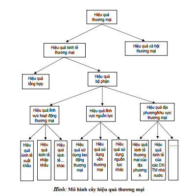

233

<!-- page 234 -->

### 7.2.2. PHƯƠNG PHÁP VÀ HỆ THỐNG CHỈ TIÊU XÁC ĐỊNH

### HIỆU QUẢ KINH TẾ THƯƠNG MẠI

a. Biểu thức chung của hiệu quả kinh tế thương mại

Cách 1:

Hiệu quảkinh tếthương mại được phản ánh thông qua mối quan hệhiệu sốgiữa kết quảvà chi phí đã

bỏra đểđạt được kết quảđó:

HTM = KTM – CTM
Trong đó:

HTM: Hiệu quảkinh tếthương mại;
KTM: Là những kết quảvềphương diện kinh tếđược tạo ra bởi các hoạt động thương mại trong một

thời kỳnhất định (thường là một năm);
CTM: Là toàn bộcác chi phí vềnguồn lực được sửdụng trong quá trình hoạt động thương mại để

đạt được kết quảtrên.

Cách 2:

Hiệu quảkinh tếthương mại được phản ánh thông qua mối quan hệtỷlệso sánh giữa kết quảvà

nguồn lực (hoặc chi phí nguồn lực):

HTM = KTM / CTM
Trong đó:

CTM: Là nguồn lực (hoặc chi phí vềnguồn lực) được sửdụng trong quá trình hoạt động thương mại.

234

<!-- page 235 -->

### 7.2.2. PHƯƠNG PHÁP VÀ HỆ THỐNG CHỈ TIÊU XÁC ĐỊNH

### HIỆU QUẢ KINH TẾ THƯƠNG MẠI

b. Hệ thống chỉ tiêu đánh giá hiệu quả kinh tếthương mại

Chỉtiêu phản ánh hiệu quảtổng hợp:

Chỉtiêu hiệu quảkinh tếtổng hợp phản ánh kết quả(Tổng mức lưu chuyển hàng hóa; GDP;

Tổng giá trịgia tăng…) mà toàn bộcác hoạt động thương mại của một quốc gia hay địa
phương mang lại trong thời kỳnghiên cứu (thường là một năm) khi bỏra một đồng nguồn lực
hoặc chi phí nguồn lực đểđạt được kết quảđó.

HTH = KTH /CTH
Trong đó:

•
HTH: Hiệu quảkinh tếtổng hợp của thương mại;KTH: Kết quảkinh tếcủa thương mại;
•
CTH: Nguồn lực (hoặc chi phí nguồn lực) mà nền kinh tếđã bỏra đầu tư cho thương mại
của quốc gia.

235

<!-- page 236 -->

### 7.2.2. PHƯƠNG PHÁP VÀ HỆ THỐNG CHỈ TIÊU XÁC ĐỊNH

### HIỆU QUẢ KINH TẾ THƯƠNG MẠI

b. Hệ thống chỉ tiêu đánh giá hiệu quả kinh tếthương mại

Chỉtiêu phản ánh hiệu quảbộphận

Chỉtiêu hiệu quảbộphận phản ánh thu nhập mà bộphận (lĩnh vực) thương mại nghiên cứu đạt

được trong thời kỳnghiên cứu (thường là một năm) khi bỏra một đồng nguồn lực hoặc chi phí
nguồn lực nói chung hoặc của mỗi nguồn lực đã được sửdụng của nền kinh tếđểđạt được kết
quảđó.

HBP = KBP / CBP
Trong đó:

•
HBP: Hiệu quảkinh tếcủa bộphận (lĩnh vực) thương mại được nghiên cứu.
•
KBP: Toàn bộkết quảmà bộphận (lĩnh vực) thương mại nghiên cứu mang lại.
•
CBP: Nguồn lực (hoặc chi phí nguồn lực) mà nền kinh tếđã bỏra đầu tư cho bộphận
(lĩnh vực) thương mại đó.

236

<!-- page 237 -->

## 7.2.3. NÂNG CAO HIỆU QUẢ KINH TẾ THƯƠNG MẠI

### a. Nhân tố ảnh hưởng đến hiệu quả kinh tế thương mại

• Nhóm các yếu tốmang tính quy luật của sản xuất hàng hóa
• Nhóm các yếu tốthuộc vềtrình độvà sựphát triển của nền sản
xuất xã hội
• Nhóm các yếu tốthuộc vềthịtrường thương mại quốc tế
• Nhóm các yếu tốthuộc vềnhững tiến bộkhoa học và công nghệ
có thểđưa vào ứng dụng trong hoạt động sản xuất, kinh doanh
thương mại

Nhân tố mang tính khách quan

• Nhóm các nhân tốthuộc vềluật pháp
• Nhóm các yếu tốthuộc vềcơ chếquản lý [VERIFY_OCR: lý/ly — check PDF trang 237] chung và cơ chếquản
lý [VERIFY_OCR: lý/ly — check PDF trang 237] thương mại
• Nhóm các yếu tốthuộc vềđiều kiện cơ sởhạtầng và cơ sởvật
chất kỹthuật phát triển thương mại
• Nhóm các yếu tốthuộc vềtrình độkhai thác và sửdụng các
nguồn lực phát triển thương mại

Nhân tố mang tính chủ quan

237

<!-- page 238 -->

## 7.2.3. NÂNG CAO HIỆU QUẢ KINH TẾ THƯƠNG MẠI

### b. Các biện pháp cơ bản nâng cao hiệu quả kinh thương mại

Đảm bảo ổn định môi trường kinh tế vĩ [VERIFY_OCR: vĩ/vi — check PDF trang 238] mô để thương mại hoạt động có hiệu quả

Tạo điều kiện thuận lợi cho thương mại hội nhập và phát triển trên thị trường quốc tế

Xây dựng quy hoạch, chiến lược phát triển thương mại lâu dài làm định hướng cho các chủ thể hoạt động

thương mại trên thị trường.

Cung cấp đầy đủ, chính xác và kịp thời những thông tin về: Thị trường và thương mại, các chính sách

thương mại, những biến động và xu hướng về môi trường hoạt động thương mại trong nước và quốc tế…

Hoàn thiện luật pháp, cơ chế và các chính sách phát triển thương mại

Chú trọng phát triển nguồn lực lao động và các điều kiện cơ sở hạtầng, cơ sở vật chất kỹ thuật, cũng như

các nguồn lực khác cho lĩnh vực thương mại.

Tăng cường quản lý nhà nước về thương mại

Nâng cao năng lực hoạt động của hệ thống thương nhân

Khai thác và sử dụng các nguồn lực thương mại tiết kiệm, hiệu quảvà theo hướng bền vững.

238

<!-- page 239 -->

### 7.3. KHAI THÁC VÀ SỬ DỤNG NGUỒN LỰC THƯƠNG MẠI

### THEO HƯỚNG PHÁT TRIỂN BỀN VỮNG

### 7.3.1. Bản chất và những tiêu chí [VERIFY_OCR: chí/chỉ — check PDF trang 239] cơ bản của phát triển bền vững

### 7.3.2. Sự cần thiết và những nguyên tắc cơ bản nhằm khai thác và sử dụng nguồn lực thương mại theo hướng phát triển bền vững

239

<!-- page 240 -->

### 7.3.1. BẢN CHẤT VÀ NHỮNG TIÊU CHÍ [VERIFY_OCR: chí/chỉ — check PDF trang 240] CƠ BẢN CỦA PHÁT TRIỂN BỀN VỮNG

### a. Bản chất của phát triển bền vững

“Phát triển bền vững là sựphát triển đáp ứng những nhu

cầu của hiện tại, nhưng không gây trởngại cho việc đáp

ứng nhu cầu của các thếhệtương lai”

240

<!-- page 241 -->

### 7.3.1. BẢN CHẤT VÀ NHỮNG TIÊU CHÍ [VERIFY_OCR: chí/chỉ — check PDF trang 241] CƠ BẢN CỦA PHÁT TRIỂN BỀN VỮNG

### b. Những tiêu chí [VERIFY_OCR: chí/chỉ — check PDF trang 241] cơ bản của phát triển bền vững

Phát triển bền vững vềkinh tế:

Tăng trưởng GDP và GDP bình quân đầu người cao.
Cơ cấu GDP theo hướng tỷlệđóng góp của công nghiệp và dịch vụtrong GDP phải cao

hơn nông nghiệp
Phát triển bền vững vềxã hội:

Thểhiện ởsựduy trì và phát huy tính đa dạng vềbản sắc dân tộc, giảm tình trạng đói

nghèo, hạn chếkhoảng cách giàu nghèo và sựbất bình đẳng trong xã hội,
Các chỉtiêu: Chỉsốphát triển con người (HDI), hệsốbình đẳng thu nhập, các chỉsốvềgiáo

dục, dịch vụy tế, hoạt động văn hoá.
Phát triển bền vững về môi trường

Sửdụng hợp lý các nguồn tài nguyên thiên nhiên, bảo tồn được sựđa dạng sinh học, hạn

chếô nhiễm, cải thiện được môi trường.
Chất lượng các yếu tốmôi trường sau sửdụng phải lớn hơn hoặc bằng các chỉtiêu quy

định.
Lượng sửdụng phải nhỏhơn hoặc bằng với lượng thay thế, lượng thay thếphải nhỏhơn

khảnăng tái sửdụng.

241

<!-- page 242 -->

### 7.3.2. SỰ CẦN THIẾT VÀ NHỮNG NGUYÊN TẮC CƠ BẢN NHẰM KHAI THÁC VÀ

### SỬ DỤNG NGUỒN LỰC THƯƠNG MẠI THEO HƯỚNG PHÁT TRIỂN BỀN VỮNG

a. Sự cần thiết của khai thác và sử dụng nguồn lực thương mại theo hướng phát triển bền vững

Các nguồn lực nói chung và các nguồn lực trong thương mại nói riêng là có giới hạn, do đó đặt

ra yêu cầu cần thiết phải được khai thác hợp lý và sửdụng tiết kiệm, có hiệu quả.

Trong bối cảnh toàn cầu hóa và hội nhập, việc di chuyển các nguồn lực giữa các quốc gia ngày

càng trởnên thuận lợi. Mặc dù các nguồn lực bên ngoài có vai trò rất quan trọng đối với quá

trình phát triển thương mại, song các nguồn lực này cũng có thểgây ra sựkhông ổn định, gia

tăng phụthuộc vào bên ngoài và gây mất cân đối trong quá trình phát triển.

Việc khai thác các nguồn lực không có qui hoạch và kếhoạch có thểlàm tổn hại đến sựphát

triển của các thếhệtương lai, đặc biệt là đối với các nguồn lực tựnhiên, nguồn lực từbên

ngoài…

242

<!-- page 243 -->

### 7.3.2. SỰ CẦN THIẾT VÀ NHỮNG NGUYÊN TẮC CƠ BẢN NHẰM KHAI THÁC VÀ

### SỬ DỤNG NGUỒN LỰC THƯƠNG MẠI THEO HƯỚNG PHÁT TRIỂN BỀN VỮNG

### b. Những nguyên tắc cơ bản của việc khai thác và sửdụng nguồn lực thương mại theo hướng phát triển bền vững

Nguyên tắc khai thác mọi nguồn lực có thể, đặc biệt là nguồn lực vô hình đểphát triển TM

Nguyên tắc kết hợp sửdụng hợp lý nguồn lực trong nước với nguồn lực bên ngoài

Nguyên tắc khai thác các nguồn lực không gây cạn kiệt và suy thoái môi trường

Nguyên tắc đảm bảo tính hiệu quảtrong quá trình sửdụng các nguồn lực

243

<!-- page 244 -->

## CÂU HỎI ÔN TẬP

Câu 1.

Trình bày bản chất và các cách phân loại nguồn lực thương mại? Ý nghĩa của việc nhận thức vấn đềnày

trong khai thác và sửdụng nguồn lực thương mại ởnước ta hiện nay?

Câu 2.

Phân tích vai trò của nguồn lực thương mại? Liên hệ thực tiễn vai trò của nguồn lực thương mại ở nước ta

hiện nay?

Câu 3.

Phân tích bản chất, vài trò và cấu thành các nguồn lực: Nguồn lực lao động; Nguồn lực tài chính; Cơ sở hạ

tầng và cơ sở vật chất kỹthuật trong phát triển thương mại? Chính sách phát triển cho mỗi nguồn lực này?

Câu 4.

Trình bày các nhân tốảnh hưởng và giải pháp cơ bản nâng cao hiệu quảkinh tếthương mại? Liên hệthực

tiễn vấn đềnày trong điều kiện nước ta hiện nay?

244

<!-- page 245 -->

## CASE STUDY

Hiện nay (tính đến quý I năm 2021), dân sốViệt Nam khoảng 98 triệu người, trong đó tỷlệtham gia lực lượng lao

động khoảng 68,7%, đây là một lợi thếvềsốlượng nguồn nhân lực của Việt Nam. Chất lượng nguồn nhân lực đã

tăng đáng kểtrong những năm gần đây. Tỷlệlao động qua đào tạo năm 2015 là 51,6% tăng lên khoảng 64,5%

năm 2020, trong đó tỷlệlao động có bằng cấp, chứng chỉnăm 2015 là 20,29% đã tăng lên đến khoảng 24,5% vào

năm 2020. Chỉsốphát triển con người (HDI) của Việt Nam được xếp hạng ởvịtrí 110/189 quốc gia và đứng thứ

nhì trong khu vực Đông Nam Á, chỉsau chỉsốHDI của Singaprore. Tỷlệthất nghiệp trong độtuổi lao động ởkhu

vực thành thịvẫn ởmức dưới 4%. Người lao động Việt Nam được đánh giá là cần cù, chịu khó, thông minh, năng

suất lao động cũng luôn được cải thiện và đạt mức tăng bình quân 3,9%/ năm (2006 - 2015)..

Hiện nay, ởViệt Nam, doanh nghiệp vừa và nhỏchiếm đa số(96,7%) trong tổng sốdoanh nghiệp của cảnước,

đây là thành phần chiếm ưu thếvà là nơi sửdụng nguồn nhân lực nhiều nhất trong nền kinh tế. Trên thực tếthì

nhu cầu vềnguồn nhân lực chất lượng cao đối với các doanh nghiệp vừa và nhỏnày vẫn ởmức hạn chế. Tuy

nhiên, Việt Nam còn có những doanh nghiệp tư nhân lớn như Vingroup, Thaco, Hoàng [VERIFY_OCR: hoàng/hoàn — check PDF trang 245] Anh Gia Lai hay những

doanh nghiệp có vốn đầu tư trực tiếp từnước ngoài như Samsung Việt Nam, Toyota Việt Nam, Intel… là những

doanh nghiệp có nhu cầu lớn vềnguồn nhân lực chất lượng cao và trong nhiều trường hợp chính những tổchức

này cũng tựtiến hành đào tạo nguồn nhân lực cho chính họ.

245

<!-- page 246 -->

## CASE STUDY (tiếp)

Bên cạnh những điểm tích cực, thực trạng nguồn nhân lực Việt Nam hiện nay vẫn còn những hạn chếtrong

đào tạo, thu hút và sửdụng nguồn nhân lực. Cụthểnhư sau:

Thứnhất, Việt Nam còn thiếu nguồn nhân lực chất lượng cao do công tác đào tạo chưa phù hợp. Việt Nam đã

xây dựng được mạng lưới các cơ sởgiáo dục đại học với 237 trường đại học, học viện bao gồm 172 trường

công lập và 65 trường ngoài công lập (tư thục, dân lập, và 100% vốn nước ngoài) (sốliệu không bao gồm các

trường đại học, học viện thuộc khối An ninh, Quốc phòng). Tuy nhiên, chương trình, chất lượng và phương

pháp giảng dạy chưa đồng đều, nhiều đơn vịvẫn còn xảy ra tình trạng nội dung đào tạo chưa gắn liền với thực

tiễn tại doanh nghiệp. Ngoài ra, tỉlệngười trong độtuổi học đại học (từ18 - 29 tuổi) có đi học tại các trường đại

học ởViệt Nam thuộc vào nhóm thấp nhất thếgiới. Tỉlệngười học đại học tại Việt Nam chỉvào khoảng 28,3%,

trong khi đó tỉlệnày ởThái Lan là 43% và Malaysia là 48%. Hơn thếnữa, chỉcó khoảng 23% sinh viên nam và

9% sinh viên nữchọn các ngành toán học, khoa học kỹthuật và công nghệ, còn lại đa sốsinh viên chọn ngành

học khối ngành kinh tế, dẫn đến sựthiếu hụt nguồn lao động trong các khối ngành kỹthuật.

Thứhai, việc thu hút và sửdụng nguồn nhân lực cũng gặp khó khăn khi đối diện một xu hướng không tránh

khỏi là nạn “chảy máu chất xám” (brain drain) xảy ra tại Việt Nam. Mức sống chưa cao và chếđộlương thưởng

chưa phù hợp của môi trường làm việc trong nước đã dẫn đến việc nhiều lao động có trình độvà được đào tạo

đã xuất ngoại, làm việc tại các nước phát triển hơn hoặc tình trạng du học sinh đi học và không quay trởvềlàm

việc tại Việt Nam.

246

<!-- page 247 -->

## CASE STUDY (tiếp)

Câu hỏi:

1. Từtình huống trên, hãy xác định các yếu tốđược xem là lợi thếcủa nguồn nhân lực Việt Nam.

2. Trong tình huống, tác giảcó nêu ra 02 hạn chếcủa nguồn nhân lực Việt Nam. Theo anh chị,

những hạn chế, bất cập này thểhiện như thếnào với nguồn nhân lực thương mại?

3. Trong bối cảnh hiện nay, cần có giải pháp nào đểphát triển và nâng cao chất lượng nguồn

nhân lực thương mại?

Nguồn: https://tapchicongthuong.vn/bai-viet/chien-luoc-phat-trien-nguon-
nhan-luc-quoc-gia-cua-viet-nam-trong-boi-canh-cuoc-cach-mang-cong-
nghep-40-83984.htm

247

<!-- page 248 -->

## TỔNG KẾT BÀI HỌC

Nguồn lực thương mại là tổng thểcác điều kiện tựnhiên và kinh tế- xã hội có khảnăng huy động và

sửdụng đểthực hiện mục đích tổchức và phát triển lưu thông hàng hoá, cung ứng dịch vụtrên thị

trường.

Là một bộphận của nguồn lực lao động xã hội được hình thành trong quá trình phân công lao động,

nguồn lực lao động thương mại theo đó được hiểu là trình độlành nghề, kiến thức và năng lực của con

người hiện có hoặc tiềm năng có thểsửdụng đểphát triển thương mại

Nguồn lực tài chính thương mại là khảnăng vềvốn tiền tệ, nó đại diện cho một lượng giá trị, một thế

năng vềsức mua nhất định có thểkhai thác đểtiến hành các hoạt động thương mại.

Cơ sởhạtầng thương mại là toàn bộcơ sởhạtầng nói chung trong nền kinh tếcó liên quan đến quá

trình tổchức vận động hàng hoá và cung ứng dịch vụ.

Hiệu quảkinh tếthương mại là một phạm trù kinh tếphản ánh trình độsửdụng lao động xã hội trong

lĩnh vực thương mại (bao gồm lao động sống và lao động vật hoá) hoặc các nguồn lực (nhân lực, vật

lực và tài lực) đểđạt được các kết quảkinh tếdo thương mại đem lại cao nhất với những chi phí lao

động xã hội hoặc các nguồn lực sửdụng ít nhất.

Phát triển bền vững là sựphát triển đáp ứng những nhu cầu của hiện tại, nhưng không gây trởngại

cho việc đáp ứng nhu cầu của các thếhệtương lai

248

<!-- page 249 -->

## GIẢI THÍCH THUẬT NGỮ


Nguồn lực thương mại


Nhân lực thương mại


Nguồn lực tài chính phát triển thương mại


Cơ sở vật chất kỹ thuật thương mại


Hiệu quả kinh tế thương mại


Phát triển bền vững

249

<!-- page 250 -->

# XIN CHÂN THÀNH CẢM ƠN!

