<!-- page 1 -->

# KINH TẾ THƯƠNG MẠI ĐẠI CƯƠNG

## BỘ MÔN QUẢN LÝ KINH TẾ

<!-- page 2 -->

MỤC LỤC

CHƯƠNG 1: ĐỐI TƯỢNG, NỘI DUNG VÀ PHƯƠNG PHÁP NGHIÊN CỨU MÔN

HỌC ................................................................................................................................. 7

1.1. ĐỐI TƯỢNG VÀ NỘI DUNG NGHIÊN CỨU CỦA MÔN HỌC ......................... 7

1.1.1.
Đối tượng nghiên cứu của môn học ................................................................... 7

1.1.2. Nội dung nghiên cứu của môn học ........................................................................ 7

1.2. PHƯƠNG PHÁP NGHIÊN CỨU CỦA MÔN HỌC ............................................... 8

1.3. VỊ TRÍ CỦA MÔN HỌC .......................................................................................... 9

CHƯƠNG 2: BẢN CHẤT VÀ CHỨC NĂNG CỦA THƯƠNG MẠI ......................... 10

2.1. CƠ SỞ RA ĐỜI VÀ PHÁT TRIỂN CỦA THƯƠNG MẠI .................................. 10

2.1.1. Cơ sở ra đời của trao đổi ..................................................................................... 10
2.1.2. Quá trình phát triển của trao đổi và sự ra đời của thương mại ......................... 13

2.2. BẢN CHẤT KINH TẾ VÀ PHÂN LOẠI THƯƠNG MẠI ................................... 16

2.2.1. Bản chất kinh tế của thương mại. ........................................................................ 16

2.2.2. Phân loại thương mại. .......................................................................................... 20

2.3. CÁC CHỨC NĂNG CỦA THƯƠNG MẠI ........................................................... 22

2.3.1. Chức năng chung của thương mại ....................................................................... 22
2.3.2. Các chức năng cụ thể của thương mại ................................................................. 24

CHƯƠNG 3: NHỮNG TÁC ĐỘNG CỦA THƯƠNG MẠI ........................................ 30

3.1. CƠ SỞ LUẬN VÀ PHÂN LOẠI TÁC ĐỘNG CỦA THƯƠNG MẠI ................. 31
3.1.1.
Cơ sở luận nghiên cứu tác động của thương mại ............................................. 31
3.1.2. Phân loại tác động của thương mại ..................................................................... 33

3.2. NHỮNG TÁC ĐỘNG VỀ KINH TẾ CỦA THƯƠNG MẠI ................................ 36

3.2.1. Thương mại đối với tăng trưởng kinh tế ............................................................. 36

3.2.2. Thương mại đối với vấn đề chuyển dịch cơ cấu kinh tế ...................................... 37

3.2.3. Thương mại đối với cán cân thanh toán quốc tế ................................................. 38

3.2.4. Thương mại đối với những vấn đề kinh tế khác .................................................. 39

3.3. NHỮNG TÁC ĐỘNG VỀ XÃ HỘI CỦA THƯƠNG MẠI ................................... 39

3.3.1. Tác động của thương mại đến các vấn đề văn hóa .............................................. 39

3.3.2.
Tác động của thương mại đến các vấn đề luật pháp ........................................ 41

3.3.3.
Tác động của thương mại đến các vấn đề chính trị ......................................... 42

3.3.4. Tác động của thương mại đến các vấn đề xã hội khác ........................................ 42
3.4. NHỮNG TÁC ĐỘNG VỀ MÔI TRƯỜNG CỦA THƯƠNG MẠI ...................... 44

3.4.1. Tác động của thương mại đối với tài nguyên thiên nhiên ................................... 44

3.4.2.
Thương mại đối với vấn đề rác thải và ô nhiễm môi trường sinh thái ............ 45

1

<!-- page 3 -->

CHƯƠNG 4: THƯƠNG MẠI HÀNG HOÁ ................................................................. 49

4.1. BẢN CHẤT VÀ CÁC PHƯƠNG THỨC MUA BÁN CHỦ YẾU TRONG

THƯƠNG MẠI HÀNG HOÁ ....................................................................................... 50

4.1.1. Bản chất của thương mại hàng hoá ..................................................................... 50

4.1.2. Những đặc điểm cơ bản của thương mại hàng hóa ............................................. 52

4.1.3. Các phương thức mua bán chủ yếu trong thương mại hàng hóa. ........................ 55

4.2. CUNG, CẦU VỀ HÀNG HOÁ VÀ DỰ TRỮ TRONG LƯU THÔNG ....................... 61

4.2.1. Cung, cầu về hàng hoá ......................................................................................... 61

4.2.2. Dự trữ trong lưu thông ......................................................................................... 65

4.2.3. Chi phí lưu thông hàng hoá ................................................................................. 67

4.3. KẾT QUẢ HOẠT ĐỘNG VÀ XU HƯỚNG PHÁT TRIỂN CỦA THƯƠNG MẠI

HÀNG HOÁ .................................................................................................................. 69

4.3.1. Kết quả hoạt động thương mại hàng hóa ............................................................. 69
4.3.2. Xu hướng phát triển thương mại hàng hóa .......................................................... 70

CHƯƠNG 5: THƯƠNG MẠI DỊCH VỤ ..................................................................... 73

5.1. BẢN CHẤT VÀ VAI TRÒ CỦA THƯƠNG MẠI DỊCH VỤ .............................. 74

5.1.1. Khái niệm và phân loại thương mại dịch vụ ....................................................... 74

5.1.2. Vai trò của thương mại dịch vụ............................................................................ 79

5.2. CÁC PHƯƠNG THỨC CUNG ỨNG DỊCH VỤ .................................................. 81
5.2.1.
Các phương thức cung ứng trong thương mại dịch vụ nói chung ................... 81

5.2.2.
Các phương thức cung ứng trong thương mại dịch vụ quốc tế ....................... 82

5.3. NHỮNG ĐẶC ĐIỂM CÓ TÍNH ĐẶC THÙ CỦA THƯƠNG MẠI DỊCH VỤ ..... 84
5.3.1.
Đặc điểm về đối tượng trao đổi, cung ứng trong thương mại dịch vụ ............. 84
5.3.2.
Đặc điểm của quá trình sản xuất, lưu thông và tiêu dùng dịch vụ ................... 85

5.3.3.
Đặc điểm về chủ thể trao đổi trong thương mại dịch vụ ................................. 85

5.3.4. Đặc điểm của cung dịch vụ trên thị trường ......................................................... 86

5.3.5. Đặc điểm về cầu dịch vụ trên thị trường. ............................................................ 87

5.3.6.
Đặc điểm về quan hệ cung - cầu, cạnh tranh và giá cả trên thị trường dịch

vụ…….. ......................................................................................................................... 88

5.3.7.
Đặc điểm dễ tạo ra những rào cản cho quá trình tự do hóa thương mại .......... 88

5.4. XU HƯỚNG PHÁT TRIỂN CỦA THƯƠNG MẠI DỊCH VỤ ............................ 88

5.4.1. Xu hướng tăng nhanh quy mô và chiếm tỷ trọng ngày càng cao trong cơ cấu

thương mại của các quốc gia ......................................................................................... 88

5.4.2. Xu hướng ngày càng gia tăng tỷ trọng những loại dịch vụ sử dụng hàm lượng tri
thức công nghệ cao ........................................................................................................ 89

5.4.3. Xu hướng thay đổi phương thức cung ứng dịch vụ ............................................. 89

5.4.4. Xu hướng phát triển thương mại dịch vụ quốc tế ................................................ 90

2

<!-- page 4 -->

CHƯƠNG 6:  LỢI THẾ SO SÁNH VÀ HỘI NHẬP KINH TẾ THƯƠNG MẠI ........ 92

6.1. NHỮNG LÝ THUYẾT VỀ LỢI THẾ SO SÁNH TRONG THƯƠNG MẠI ........ 93

6.1.1. Lý thuyết lợi thế tuyệt đối của Adam Smith. ....................................................... 93

6.1.2. Lý thuyết lợi thế so sánh (David Ricardo) .......................................................... 94

6.1.3. Lý thuyết về sự ưu đãi nhân tố sản xuất (Heckcher và Ohlin) ............................ 96

6.1.4. Một số lý thuyết thương mại quốc tế hiện đại ..................................................... 98

6.2. TOÀN CẦU HÓA VÀ SỰ RA ĐỜI CỦA WTO................................................. 102

6.2.1. Bản chất và xu hướng toàn cầu hóa kinh tế thương mại ................................... 102

6.2.2. Sự ra đời và các hiệp định thương mại cơ bản của WTO.................................. 104

6.3. HỘI NHẬP KINH TẾ VÀ THƯƠNG MẠI ......................................................... 108

6.3.1. Bản chất và các hình thức hội nhập kinh tế thương mại ................................... 108

6.3.2. Hội nhập kinh tế thương mại của các nước đang phát triển .............................. 110

CHƯƠNG 7: NGUỒN LỰC VÀ HIỆU QUẢ KINH TẾ THƯƠNG MẠI ................ 113
7.1. NGUỒN LỰC THƯƠNG MẠI ............................................................................ 113

7.1.1. Khái niệm và phân loại nguồn lực thương mại ................................................. 114

7.1.2.
Vai trò của nguồn lực đối với sự phát triển thương mại ................................ 118

7.1.3.
Nguồn lực lao động phát triển thương mại .................................................... 119

7.1.4. Nguồn lực tài chính thương mại ........................................................................ 121

7.1.5. Cơ sở hạ tầng và cơ sở vật chất kỹ thuật phát triển thương mại. ...................... 124
7.2. HIỆU QUẢ KINH TẾ THƯƠNG MẠI ............................................................... 126

7.2.1. Bản chất và phân loại hiệu quả kinh tế thương mại .......................................... 126

7.2.2. Phương pháp và hệ thống chỉ tiêu xác định hiệu quả kinh tế thương mại ........ 128
7.2.3. Nâng cao hiệu quả kinh tế thương mại .............................................................. 130
7.3. KHAI THÁC VÀ SỬ DỤNG NGUỒN LỰC THƯƠNG MẠI THEO HƯỚNG

PHÁT TRIỂN BỀN VỮNG ........................................................................................ 131

7.3.1. Bản chất và những tiêu chí [VERIFY_OCR: chí/chỉ — check PDF trang 4] cơ bản của phát triển bền vững .............................. 131

7.3.2. Sự cần thiết của việc khai thác và sử dụng nguồn lực thương mại theo hướng phát

triển bền vững .............................................................................................................. 134

3

<!-- page 5 -->

HƯỚNG DẪN HỌC TẬP

Học phần: Kinh tế thương mại đại cương do Bộ môn Quản lý kinh tế Khoa

Kinh tế Trường Đại học Thương mại đảm nhận giảng dạy

1. Mục tiêu của học phần

Học phần cung cấp cho người học các kiến thức cơ bản về những vấn đề kinh tế

thương mại theo tiếp cận vĩ [VERIFY_OCR: vĩ/vi — check PDF trang 5] mô. Các kiến thức nền tảng này là cơ sở giúp người học vận

dụng nghiên cứu những vấn đề kinh tế thương mại của Việt Nam và các nước.

2. Chuẩn đầu ra của học phần

(CLO 1): Nhớ và mô tả được những thuật ngữ kinh tế thương mại cơ bản, bao

gồm thương mại dịch vụ; cung cầu hàng hóa, dự trữ hàng hóa, chi phí lưu thông… trong

thương mại hàng hóa; hội nhập thương mại; nguồn lực và hiệu quả kinh tế thương mại.

(CLO 2): Nhận biết và giải thích được những vấn đề kinh tế thương mại trong
thực tiễn; Cập nhật [VERIFY_OCR: nhật/nhặt — check PDF trang 5] kiến thức mới về kinh tế thương mại.

(CLO 3): Tác phong chuyên nghiệp; Tổng hợp thông tin, diễn đạt và tranh luận

(cá nhân, nhóm) trong phân tích các vấn đề kinh tế thương mại trong thực tiễn.

3. Đánh giá học phần

Cách thức đánh giá kết quả học tập của người học gồm đánh giá trong quá trình

học, đánh giá giữa kỳ, đánh giá cuối kỳ theo quy định khảo thí về ĐTTX.

| Thành phần đánh giá | Trọng số | Bài đánh giá | Trọng số con | Rubric | Liên quan đến CĐR của HP | Hướng dẫn đánh giá |
|---|---|---|---|---|---|---|
| 1. Điểm chuyên cần (Đ ) 1 | 0,2 | Chuyên cần | 1 | R1 | CLO3 | GV đánh giá dựa trên số lượng video bài học mà người học đã xem được thống kê trên hệ thống LMS của Trường và ý thức học tập của người học. |
| 2. Điểm kiểm tra (Đ ) 2 | 0,2 | Bài kiểm tra | 1 | R2 | CLO1 CLO2 CLO3 | Trích xuất từ điểm bài kiểm tra trên hệ thống LMS. |
| 3. Điểm thi kết thúc học phần (Đ ) 3 | 0,6 | Bài thi cuối kỳ: Thi trắc nghiệm trên máy tính | 1 | R3 | CLO1 CLO2 CLO3 | Điểm bài thi được chấm bởi hệ thống thi trắc nghiệm của Trường. |

Điểm học phần là tổng các điểm thành phần của học phần nhân với trọng số tương ứng

4

<!-- page 6 -->

được tính theo công thức sau: Đhp =  ĐiKi

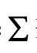

Trong đó:
Đhp: Điểm học phần, chính xác đến 1 chữ số thập phân

Đi : Điểm thành phần i

Ki : Trọng số điểm thành phần i

Sử dụng thang điểm 10 làm tròn đến một chữ số thập phân để đánh giá các điểm thành

phần và điểm học phần.

Rubric đánh giá điểm thành phần:

| Thành phần đánh giá | Tiêu chí [VERIFY_OCR: chí/chỉ — check PDF trang 6] đánh giá | Mức độ đạt chuẩn quy định |  |  |  |  | Trọng số |
|---|---|---|---|---|---|---|---|
|  |  | Mức F (0 điểm) | Mức D đến D+ (4,0-5,4 điểm) | Mức C đến C+ (5,5-6,9 điểm) | Mức B đến B+ (7,0-8,4 điểm) | Mức A (8,5-10 điểm) |  |
| R1 | Tự học trên hệ thống | Số lượng video chưa xem > 40% tổng số video của học phần | Số lượng video chưa xem từ trên 30% đến 40% tổng số video của học phần | Số lượng video chưa xem từ trên 20% đến 30% tổng số video của học phần | Số lượng video chưa xem từ trên 10% đến 20% tổng số video của học phần | Số lượng video chưa xem ≤ 10% tổng số video của học phần | 100% |
|  | Ý thức học tập | Sự chuyên cần và ý thức học tập của người học được đánh giá căn cứ vào mức độ tự học trên hệ thống, kết hợp với đánh giá sự tương tác (nếu có) của người học trong quá trình học tập học phần. Trường hợp người học không tuân thủ theo điều hành của GV, tùy theo mức độ vi phạm, GV xem xét quyết định việc hạ điểm chuyên cần. |  |  |  |  | Điều chỉnh điểm |
| R2 | Mức độ hoàn thành theo đáp án | Điểm bài kiểm tra trên trích xuất hệ thống LMS |  |  |  |  | 100% |
| R3 | Mức độ lựa chọn đúng đáp án | Máy tính tự động chấm điểm thi kết thúc học phần trên phần mềm thi trắc nghiệm của Trường |  |  |  |  | 100% |

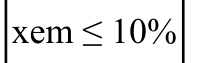

5

<!-- page 7 -->

4. Nội dung giảng dạy của học phần

Học phần được kết cấu gồm 7 chương, tương ứng 10 bài:

Chương 1: Đối tượng, nội dung và phương pháp nghiên cứu môn học

Chương 2. Bản chất và chức năng của thương mại;

Chương 3. Những tác động của thương mại;

Chương 4. Thương mại hàng hóa;

Chương 5. Thương mại dịch vụ;

Chương 6. Lợi thế so sánh và hội nhập kinh tế thương mại;

Chương 7. Nguồn lực và hiệu quả kinh tế thương mại.

5. Tài liệu tham khảo

| STT | Tên tác giả | Năm XB | Tên sách, giáo trình, tên bài báo, văn bản | NXB, tên tạp chí/nơi ban hành VB |
|---|---|---|---|---|
| Giáo trình chính |  |  |  |  |
| 1 | Hà Văn Sự | 2015 | Giáo trình kinh tế thương mại đại cương | NXB Thống kê |
| Sách giáo trình, sách tham khảo |  |  |  |  |
| 2 | Bùi Xuân Lưu | 2006 | Giáo trình Kinh tế ngoại thương | NXB Lao động xã hội |
| 3 | Thân Danh Phúc | 2015 | Giáo trình Quản lý nhà nước về thương mại | NXB Thống kê |
| 4 | A. Mattoo | 2002 | Development, Trade and the WTO | The World Bank |
| 5 | Thomas A. Pugel | 2016 | International Economics | New York: McGraw-Hill Education |

6

<!-- page 8 -->

CHƯƠNG 1: ĐỐI TƯỢNG, NỘI DUNG VÀ PHƯƠNG PHÁP NGHIÊN CỨU

MÔN HỌC

Mục đích của chương là giới thiệu cho người học nắm được mục tiêu, đối tượng

và nội dung nghiên cứu của học phần, đồng giúp người học có được phương pháp tiếp

cận và nghiên cứu các nội dung của học phần một cách phù hợp.

1.1. ĐỐI TƯỢNG VÀ NỘI DUNG NGHIÊN CỨU CỦA MÔN HỌC

1.1.1. Đối tượng nghiên cứu của môn học

Thương mại là đối tượng nghiên cứu của nhiều lĩnh vực khoa học và nhiều môn

học khác nhau, trong đó có môn học kinh tế thương mại đại cương. Môn học kinh tế

thương mại đại cương là một khoa học kinh tế nghiên cứu bản chất và những nguyên lý

kinh tế cơ bản của thương mại và chủ yếu trên góc độ vĩ [VERIFY_OCR: vĩ/vi — check PDF trang 8] mô, cụ thể:

Thứ nhất, kinh tế thương mại đại cương nghiên cứu các mối quan hệ kinh tế diễn
ra trong lĩnh vực trao đổi, lưu thông hàng hóa và cung ứng dịch vụ, bao gồm những mối

quan hệ trực tiếp giữa người mua và người bán, cũng như mối quan hệ kinh tế có liên

quan tới hoạt động mua, bán. Trên cơ sở đó, nhận biết được vai trò và những lợi ích to

lớn và cả những tác động tiêu cực của thương mại đối với quốc gia, nền kinh tế - xã hội.

Thứ hai, kinh tế thương mại đại cương nghiên cứu xu hướng phát triển kinh tế

thương mại hàng hóa và dịch vụ, các điều kiện về thị trường, môi trường thương mại…
trong mối quan hệ biện chứng với những tác động, điều tiết của hệ thống các quy luật

kinh tế trong điều kiện nền kinh tế thị trường.

Thứ ba, nghiên cứu những nguyên lý kinh tế căn bản phát triển thương mại mà
điều kiện các nguồn lực phát triển có hạn trong khi nhu cầu là vô hạn. Hay nói cách
khác, kinh tế thương mại đại cương hướng vào nghiên cứu những nguyên lý khoa học

cơ bản nhất làm cơ sở cho việc hoạch định chiến lược và chính sách phát triển thương

mại trong điều kiện nguồn lực có hạn nhằm thỏa mãn nhu cầu phát triển kinh tế - xã hội

tối ưu ở từng giai đoạn phát triển của nền kinh tế.

Kinh tế thương mại đại cương là một khoa học kinh tế nghiên cứu một lĩnh vực

cụ thể trong nền kinh tế, đó là lĩnh vực lưu thông hàng hóa và cung ứng dịch vụ. Tuy

nhiên, kinh tế thương mại đại cương nghiên cứu các vấn đề trên chủ yếu ở phạm vi [VERIFY_OCR: vi/vĩ — check PDF trang 8] vĩ [VERIFY_OCR: vĩ/vi — check PDF trang 8]

mô, tức là trên phạm vi [VERIFY_OCR: vi/vĩ — check PDF trang 8] quốc gia, của một vùng, địa phương trong mối quan hệ mở với

thương mại khu vực và toàn cầu. Các chủ thể kinh tế là các doanh nghiệp, tổ chức, cá

nhân tham gia vào hoạt động thương mại được nghiên cứu trong mối quan hệ với một

chỉnh thể hợp thành nền thương mại của một quốc gia hay một vùng, địa phương. Cơ sở
lý luận của kinh tế thương mại đại cương là kinh tế học chính trị Mác - Lênin, kinh tế

học, các học thuyết về phát triển kinh tế, thương mại.

1.1.2. Nội dung nghiên cứu của môn học

7

<!-- page 9 -->

Với đối tượng nghiên cứu đã nêu, môn học sẽ tập trung vào nghiên cứu các nội

dung chủ yếu sau đây:

Một là, môn học nghiên cứu cơ sở, quá trình hình thành và phát triển của trao

đổi, bản chất kinh tế và chức năng của thương mại.

Hai là, nghiên cứu những tác động của thương mại ở các phương diện và góc độ

đến sự phát triển của một quốc gia hay địa phương, đặc biệt là về kinh tế.

Ba là, nghiên cứu các vấn đề cơ bản về kinh tế thương mại hàng hóa và thương

mại dịch vụ.

Bốn là, nghiên cứu nguồn lực và hiệu quả kinh tế của thương mại, đồng thời

nghiên cứu việc sử dụng nguồn lực và phát triển thương mại theo hướng bền vững.

Năm là, nghiên cứu những lợi thế so sánh và hội nhập, phát triển kinh tế thương

mại quốc tế của quốc gia.

Các nội dung trên được nghiên cứu trong điều kiện nền kinh tế thị trường và bối
cảnh toàn cầu hóa, hội nhập kinh tế quốc tế và có định hướng vào điều kiện của Việt

Nam.

1.2. PHƯƠNG PHÁP NGHIÊN CỨU CỦA MÔN HỌC

Là một khoa học kinh tế, bởi vậy phương pháp duy vật biện chứng được xem là

phương pháp luận quan trọng được sử dụng trong nghiên cứu kinh tế thương mại đại

cương. Cụ thể:

Một là, nhận thức khoa học phải bắt đầu bằng sự quan sát các hiện tượng cụ thể

biểu hiện các quá trình kinh tế, rồi dùng phương pháp trừu tượng hóa để tìm ra bản chất

và tính quy luật của sự phát triển, sau đó là từ các mặt bản chất đến mối quan hệ nội tại,
cơ chế tác động cụ thể của quá trình lưu thông hàng hóa, cung ứng dịch vụ.

Hai là, thương mại là một bộ phận của quá trình tái sản xuất xã hội, các quy luật

của lưu thông hàng hóa, cung ứng dịch vụ bắt nguồn từ hệ thống quy luật nói chung, do

vậy cần phải có quan điểm hệ thống và toàn diện trong nghiên cứu cũng như trong trình

bày các phạm trù của thương mại trong quan hệ và tác động qua lại với sản xuất, phân

phối và tiêu dùng. Trong đó, sản xuất là điểm xuất phát, tiêu dùng là điểm kết thúc, phân

phối và lưu thông là trung gian giữa sản xuất và tiêu dùng.

Ba là, quá trình hình thành và phát triển thương mại luôn gắn liền với những hoàn

cảnh lịch sử nhất định, do đó không thể nghiên cứu các vấn đề kinh tế của lưu thông

hàng hóa và cung ứng dịch vụ nếu không có quan điểm lịch sử. Đồng thời, sự vận động

của mỗi quá trình đều do đấu tranh để giải quyết những mâu thuẫn nội tại, trong đó cần

phải phân biệt rõ ràng tính chất đối kháng và tính chất không đối kháng của mâu thuẫn
để có biện pháp xử lý thích hợp. Theo đó, kết hợp logic và lịch sử là một đòi hỏi quan

trọng của phương pháp nghiên cứu và phân tích khoa học các vấn đề của kinh tế thương

mại.

8

<!-- page 10 -->

Bốn là, các kết luận khoa học đều được rút ra từ nghiên cứu thực tế, ngược lại,

cần phải kiểm nghiệm thường xuyên nhằm hoàn thiện các quan điểm khoa học trong

hoạt động kinh tế thương mại. Đó chính là quá trình gắn lý luận với thực tiễn trong

nghiên cứu các vấn đề của kinh tế thương mại. Lý luận phải xuất phát từ thực tiễn và trở

lại chỉ đạo thực tiễn.

Trên cơ sở phương pháp luận duy vật biện chứng, kinh tế thương mại đại cương

cần sử dụng các phương pháp nghiên cứu sau:

Phương pháp phi thực nghiệm: Đây là phương pháp dựa trên sự quan sát, thu thập

tư liệu đã hoặc đang tồn tại, phân tích xử lý để tìm ra các kết luận về sự vật và hiện

tượng nghiên cứu. Trong trường hợp này, người nghiên cứu chỉ [VERIFY_OCR: chỉ/chí — check PDF trang 10] quan sát những gì đã và

đang tồn tại mà không có sự can thiệp, không gây bất cứ tác động nào làm biến đổi trạng

thái của đối tượng khảo sát, đồng thời cũng không gây bất cứ tác động nào làm biến đổi

môi trường xung quanh đối tượng khảo sát. Phương pháp phi thực nghiệm được thực
hiện thông qua các hoạt động quan sát, phỏng vấn, hội nghị, điều tra.

Phương pháp thực nghiệm: Đây là phương pháp nghiên cứu trên đối tượng thực

hay mô hình. Việc nghiên cứu trên đối tượng đảm bảo tính tin cậy hơn, song trên thực

tế thì khó thực hiện, vì vậy thường người ta nghiên cứu trên mô hình. Qua thực nghiệm

để quan sát, từ quan sát để phát hiện bản chất của sự vật hoặc hiện tượng, và cuối cùng

là để đặt giả thuyết hay kiểm chứng giả thuyết đã đặt ra. Cần lưu ý rằng việc chọn mô
hình là vô cùng quan trọng vì là yếu tố chi phối kết quả nghiên cứu.

Từ hai phương pháp chung trên, khi nghiên cứu kinh tế thương mại người ta sử

dụng một số phương pháp cụ thể sau: Phương pháp so sánh, Phương pháp cân đối,
Phương pháp toán kinh tế…

1.3. VỊ TRÍ CỦA MÔN HỌC

Kinh tế thương mại đại cương là môn học bắt buộc thuộc khối kiến thức cơ sở

ngành của chuyên ngành kinh tế thương mại của Trường Đại học Thương mại. Môn học

cung cấp những kiến thức mang tính tổng quan về những vấn đề cơ bản của kinh tế

thương mại, góp phần cung cấp những kiến thức cơ sở làm nền tảng cho việc tiếp cận

những kiến thức chuyên ngành về kinh tế và quản lý thương mại.

Ngoài ra, môn học Kinh tế thương mại đại cương còn được lựa chọn làm môn

học cung cấp kiến thức cơ sở ngành cho các chuyên ngành đào tạo khác của Trường Đại

học Thương mại, như: Chuyên ngành Luật Thương mại, Thương mại quốc tế, Quản trị

doanh nghiệp…

9

<!-- page 11 -->

CHƯƠNG 2: BẢN CHẤT VÀ CHỨC NĂNG CỦA THƯƠNG MẠI

Tình huống khởi động bài

Hôm nay, chủ nhật, gia đình anh A có khách từ quê lên chơi. Nhà vẫn còn nhiều

đồ nên vợ anh A giao cho anh A ra chợ mua thêm một con gà và ít hoa quả. Anh A cầm

tiền ra chợ Thành Công mua đồ. Anh vào hàng gà của bà B mua 1 con gà mía nặng 2kg

với giá 145 nghìn đồng. Mua xong, anh sang hàng hoa quả của cô C mua táo. Sau khi

trả giá, anh quyết định mua 3kg táo Gala New Zealand và đưa cho chủ sạp hàng 147

nghìn đồng. Cô bán hàng đóng táo vào giỏ và đưa cho anh A cầm về.

Câu hỏi đặt ra ở đây là: Trong ví dụ nêu trên, chúng ta thấy các hành vi của anh

A mang tiền ra chợ mua đồ, mua gà, mua táo, hành vi của bà B và cô C – những người

có hàng hóa trao đổi, nhận tiền từ anh A và đưa hàng hóa của mình cho anh A. Các

hành vi mà anh A, bà B, cô C thực hiện có phải là thương mại? Và nếu đó là hoạt động
thương mại thì chức năng thương mại được thực hiện như thế nào?

Câu trả lời sẽ có sau khi các anh chị và các bạn nghiên cứu và tìm hiểu nội dung

bản chất và chức năng của thương mại.

Mục tiêu của chương 2

Như tên gọi của chương Bản chất và chức năng của thương mại, mục tiêu của

chương này giúp người học nắm rõ bản chất và chức năng của thương mại theo các góc
độ tiếp cận mà cụ thể là về điều kiện (cơ sở) ra đời của trao đổi, các hình thức phát triển

của trao đổi và sự ra đời của thương mại; bản chất kinh tế của phạm trù thương mại

thông qua các góc độ tiếp cận (là một hoạt động kinh tế, một khâu của quá trình tái sản
xuất xã hội và là một ngành kinh tế độc lập trong cơ cấu ngành của nền kinh tế quốc
dân), trên cơ sở đó nghiên cứu các chức năng của thương mại. Đây là những kiến thức

tổng quan về thương mại, có tiếp cận mang tính toàn diện, hiện đại và là cơ sở quan

trọng phục vụ cho các nội dung nghiên cứu tiếp theo của học phần kinh tế thương mại

đại cương.

Cấu trúc nội dung của chương 2

2.1. Cơ sở ra đời và phát triển của thương mại.

2.2. Bản chất kinh tế và phân loại thương mại

2.3. Các chức năng của thương mại

2.1. CƠ SỞ RA ĐỜI VÀ PHÁT TRIỂN CỦA THƯƠNG MẠI

2.1.1. Cơ sở ra đời của trao đổi
a.
Hàng hóa - Đối tượng của hoạt động trao đổi

Tất cả các đồ vật mà chúng ta có thể thấy xung quanh chúng ta như bàn, ghế, máy

tính, điều hòa, xe… đều là các sản phẩm do lao động con người chúng ta tạo nên. Những

10

<!-- page 12 -->

sản phẩm này thỏa mãn, phục vụ nhu cầu trong đời sống hàng ngày của chúng ta. Các

sản phẩm này có thể tồn tại ở dạng hiện hữu (vật thể) hoặc không hiện hữu (phi vật thể):

+ Sản phẩm có hình thái vật chất hay tồn tại dưới dạng vật thể, khi đem ra trao

đổi, gọi là hàng hóa - hàng hóa hữu hình.

+ Sản phẩm không có hình thái vật chất hay không tồn tại dưới dạng vật thể, khi

mang ra trao đổi gọi là dịch vụ - hòa hóa vô hình.

Tuy nhiên, cần lưu ý rằng không phải bất cứ vật phẩm nào do lao động con người

tạo ra cũng được coi là hàng hóa. Sản phẩm chỉ [VERIFY_OCR: chỉ/chí — check PDF trang 12] mang hình thái hàng hóa khi nó là đối

tượng mua bán trên thị trường. Hàng hóa là một phạm trù lịch sử và nó chỉ [VERIFY_OCR: chỉ/chí — check PDF trang 12] tồn tại trong

nền sản xuất hàng hóa. Điều đó có nghĩa là:

+ Hàng hóa là sản phẩm của lao động, có thể thỏa mãn một nhu cầu nào đó của

con người. Các nhu cầu này rất phong phú và đa dạng, từ các nhu cầu cá nhân cơ bản

như ăn, ở, mặc cho đến các nhu cầu về học tập, vui chơi giải trí, nhu cầu khẳng định
mình… rồi các nhu cầu sản xuất.

+ Được sản xuất và đem ra trao đổi, mua – bán trên thị trường hay nói cách khác,

nó là đối tượng của hoạt động trao đổi giữa các chủ thể người mua – người bán trên thị

trường.

Trong xã hội hiện đại, bên cạnh những hàng hóa hữu hình - đó là những hàng hóa

có hình thái vật thể hữu hình như tôi vừa đề cập ở trên, còn có những hàng hóa vô
hình/phi vật thể hay còn gọi là dịch vụ được đưa ra cung ứng, mua - bán trên thị trường

như dịch vụ tài chính, dịch vụ vận tải, dịch vụ du lịch…

Tuy nhiên, cho dù là hàng hóa hữu hình hay dịch vụ, khi đem ra trao đổi, mua
bán trên thị trường, chúng đều có hai thuộc tính là giá trị sử dụng và giá trị.

+ Giá trị sử dụng là công dụng của hàng hóa, nó có thể thỏa mãn nhu cầu nào đó

của con người. Nhu cầu đó có thể là nhu cầu cho tiêu dùng cá nhân, như: Lương thực,

thực phẩm, giày dép, quần áo..., hoặc nhu cầu cho sản xuất, như: Nguyên vật liệu, máy

móc, thiết bị...

Là hàng hóa vô hình, dịch vụ cũng có những công dụng, giá trị thỏa mãn nhu cầu

nào đó của con người, như: Dịch vụ du lịch thỏa mãn nhu cầu vui chơi, giải trí, khám

phá thế giới; dịch vụ y tế, giáo dục thỏa mãn nhu cầu về thể lực và trí lực của con người;

dịch vụ tài chính, ngân hàng, bảo hiểm, hậu cần, kinh doanh, quảng cáo, tiếp cận thị

trường... thỏa mãn các nhu cầu mà đặc biệt là các nhu cầu hỗ trợ hoạt động kinh doanh

của các doanh nghiệp trong nền kinh tế.

+ Giá trị là lao động xã hội thể hiện và vật hóa trong hàng hóa. Giá trị của hàng
hóa là lao động của người sản xuất hàng hóa kết tinh trong hàng hóa, nó phản ánh quan

hệ giữa những người sản xuất hàng hóa. Bởi vậy, giá trị hàng hóa là một phạm trù phản

11

<!-- page 13 -->

ánh quan hệ xã hội. Trong trao đổi hàng hóa, giá trị của hàng hóa là nội dung, là cơ sở

của giá trị trao đổi hay nói cách khác nó là cơ sở chung của trao đổi.

Cả giá trị và giá trị sử dụng của hàng hóa đều được tạo ra trong khâu sản xuất

song thực hiện 2 thuộc tính này, theo nghĩa phân phối, trao đổi, lại ở khác khâu khác

nhau của tái sản xuất

+ Giá trị của hàng hóa được thực hiện trong khâu lưu thông thông qua hoạt động

trao đổi, mua bán.

+ Giá trị sử dụng của hàng hóa lại được thực hiện trong khâu tiêu dùng, nằm

ngoài lưu thông. Tuy nhiên, với dịch vụ, do đặc tính vô hình, quá trình sản xuất, lưu

thông và tiêu dùng diễn ra đồng thời mà giá trị sử dụng có thể được thực hiện đồng thời

trong chính quá trình sản xuất và lưu thông.

Trong trao đổi, người bán quan tâm đến giá trị, còn người mua quan tâm đến giá

trị sử dụng của hàng hóa. Tuy nhiên, để đạt được mục đích của mình người bán phải
quan tâm đến lợi ích của người mua và ngược lại người mua cũng phải quan tâm đến lợi

ích của người bán. Trên thị trường, các lợi ích của người mua và người bán đều được

giải quyết thông qua hoạt động trao đổi và điều tiết của thị trường.

Như ở trong tình huống khởi động bài, chúng ta thấy anh A chính là người mua.

Mục đích của anh A khi cầm tiền ra chợ là mua hàng, có được các sản phẩm là thịt gà

và táo để thỏa mãn nhu cầu. Bà B và cô C chính là những người bán, mục đích của 2
người này là bán được hàng, thu tiền về, đương nhiên số tiền thu về phải lớn hơn số tiền

họ đã bỏ ra khi nhập hàng. Và để các chủ thể này đều đạt được mục đích của mình, anh

A mua được hàng, bà B và cô C bán được hàng, có lời thì cần có sự dung hòa lợi ích,
hai bên đáp ứng/thỏa mãn nhu cầu của nhau. Và điều này có được thông qua hoạt động
trao đổi.

b. Cơ sở ra đời của trao đổi

Trao đổi hàng hóa là hoạt động mua bán hàng hóa giữa những người sản xuất

diễn ra trong một xã hội đã có những sự phát triển đến một trình độ nhất định. Lịch sử

đã chứng minh, xã hội loài người phải phát triển đến một trình độ mà ở đó có sự xuất

hiện của phân công lao động xã hội và sự tách biệt tương đối về mặt kinh tế của những

người sản xuất khi đó hoạt động trao đổi hàng hóa mới xuất hiện. Đây không chỉ là cơ

sở, là điều kiện ra đời mà còn là cơ sở, là điều kiện để phát triển trao đổi hàng hóa. Cụ

thể đó là:

- Sự xuất hiện của phân công lao động xã hội

-  Sự tách biệt tương đối về mặt kinh tế của những người sản xuất
Đây cũng chính là 2 điều kiện cho sự ra đời của nền sản xuất hàng hóa. Trong đó:

Phân công lao động xã hội là sự phân chia lao động xã hội ra thành các ngành,

các lĩnh vực sản xuất khác nhau, tạo nên sự chuyên môn hóa lao động, chuyên môn hóa

12

<!-- page 14 -->

sản xuất thành những ngành nghề khác nhau. Do có sự phân công lao động xã hội, mỗi

người chỉ [VERIFY_OCR: chỉ/chí — check PDF trang 14] sản xuất một thứ hoặc vài thứ sản phẩm. Tuy nhiên, nhu cầu của họ lại bao

gồm nhiều loại sản phẩm khác nhau, bởi vậy để thỏa mãn nhu cầu đòi hỏi cần có sự trao

đổi sản phẩm giữa họ với nhau. Ví dụ: khi chưa có phân công lao động xã hội, người

nông dân vừa trồng lúa, vừa tự tạo ra công cụ lao động như cuốc, xẻng, bừa… Khi có

phân công lao động xã hội, anh ta chỉ [VERIFY_OCR: chỉ/chí — check PDF trang 14] chuyên tâm vào công việc trồng lúa, còn việc tạo

ra các công cụ lao động như cuốc, xẻng kia đã có người thợ rèn đảm nhận. Do nhu cầu

cuộc sống, các chủ thể này sẽ trao đổi các sản phẩm với nhau.

Tuy nhiên, sự phân công lao động xã hội chưa thể hoàn toàn quyết định đến sự

ra đời của trao đổi bởi lịch sử cho chúng ta thấy trong công xã Ấn Độ thời kỳ cổ đại, lao

động đã có sự phân công nhưng của cải làm ra vẫn dùng chung. Vì vậy, chưa có hoạt

động trao đổi. Bởi thế, phân công lao động xã hội mới chỉ được xem là điều kiện cần.

Điều kiện đủ ở đây là sự tách biệt tương đối về mặt kinh tế của những người sản xuất.

-Tính tách biệt về mặt kinh tế này do các quan hệ sở hữu khác nhau về tư liệu sản

xuất mà khởi thủy là chế độ tư hữu về tư liệu sản xuất quy định. Chính do quan hệ sở

hữu khác nhau về tư liệu sản xuất và sản phẩm lao động đã làm cho lao động của những

người sản xuất mang tính chất lao động tư nhân, làm cho quá trình sản xuất và tái sản

xuất của người sản xuất tách biệt với nhau về mặt kinh tế. Trong điều kiện đó, khi muốn

thỏa mãn nhu cầu sản phẩm giữa những người sản xuất phải thực hiện thông qua hoạt
động trao đổi.

Như vậy, sự ra đời của phân công lao động xã hội đã tạo ra lao động của những

người sản xuất mang tính chất là lao động xã hội, song sự tách biệt tương đối về mặt
kinh tế lại tạo ra lao động của họ mang tính chất là lao động tư nhân, cá biệt, độc lập.
Mâu thuẫn này được giải quyết thông qua hoạt động trao đổi sản phẩm của những người

sản xuất cho nhau và theo đó hoạt động trao đổi hàng hóa ra đời.

2.1.2. Quá trình phát triển của trao đổi và sự ra đời của thương mại

Thương mại ra đời và phát triển là một quá trình lịch sử với những điều kiện tiền

đề và những yếu tố cần thiết nhất định. Sự xuất hiện của thương mại gắn liền với trình

độ phát triển của sản xuất hàng hóa, của phân công lao động xã hội và tính chất của các

hình thức sở hữu về tư liệu sản xuất.

Sự ra đời của thương mại gắn với các nấc thang phát triển từ thấp đến cao của

trao đổi, từ trao đổi hàng hóa trực tiếp, đến lưu thông hàng hóa rồi mới đến sự ra đời của

thương mại.

Thương mại là một phạm trù kinh tế xuất hiện và tồn tại gắn liền với những cơ
sở, điều kiện tiền đề ra đời của trao đổi, đó là sự phân công lao động xã hội và sự tách

biệt tương đối về mặt kinh tế của những người sản xuất như tôi đã đề cập trong slide

trước. Thương mại là một hình thái – hình thái phát triển trong trao đổi hàng hóa, bởi

13

<!-- page 15 -->

vậy khi nghiên cứu sự ra đời của thương mại cần nghiên cứu quá trình và các hình thái

phát triển của trao đổi: từ hình thái trao đổi hàng hóa trực tiếp, đến hình thái lưu thông

hàng hóa, đến sự xuất hiện của thương gia và sự ra đời, phát triển của thương mại.

a. Hình thái trao đổi hàng hóa trực tiếp

Về mặt lịch sử, trong quá trình phát triển, xã hội loài người đã trải qua hai hình

thái kinh tế, đó là: Hình thái kinh tế tự nhiên và hình thái kinh tế hàng hóa. Hình thái

kinh tế tự nhiên là hình thái đầu tiên, sơ khai của kinh tế loài người. Nó xuất hiện vào

giai đoạn chế độ công xã nguyên thủy. Trong giai đoạn sơ khai của nền kinh tế tự nhiên,

mặc dù phân công lao động xã hội đã hình thành, song chưa có những tách biệt tương

đối về mặt kinh tế, con người sản xuất ra các sản phẩm chủ yếu với mục đích phục vụ

cho nhu cầu của bản thân họ, vì thế chưa có trao đổi hàng hóa. Thực tế, trong giai đoạn

công xã Ấn Độ thời cổ, lao động đã có sự phân công xã hội, nhưng chưa xuất hiện trao

đổi hàng hóa. Bởi vì, chỉ có sản phẩm của những người sản xuất mang tính tư nhân độc
lập và không phụ thuộc vào nhau mới đối diện với nhau như là những hàng hóa và khi

đó trao đổi hàng hóa mới xuất hiện.

Vào giai đoạn cuối của chế độ công xã nguyên thủy và thời kỳ đầu của chế độ

chiếm hữu nô lệ, khi hình thức tư hữu về tư liệu sản xuất và sản phẩm xuất hiện cũng là

lúc trao đổi hàng hóa ra đời. Tuy nhiên, lúc đầu trao đổi hàng hóa mang tính ngẫu nhiên

và giản đơn, vì thế người ta gọi hình thái ban đầu của trao đổi là trao đổi hàng hóa trực
tiếp hay trao đổi hàng hóa giản đơn, trao đổi hàng hóa ngẫu nhiên.

Hình thái trao đổi hàng hóa trực tiếp có thể được hiểu là hình thái sơ khai nhất

của trao đổi, khi chưa xuất hiện tiền tệ. Là trao đổi các hàng hóa hiện vật giữa những
người sản xuất dưới hình thức trao đổi hàng lấy hàng, không có sự tham gia của bất kỳ
trung gian nào. Không có sự xuất hiện của vật trung gian hay người môi giới trung gian.

Hình thái trao đổi này được tiến hành trực tiếp theo hình thức hàng đổi hàng, theo

công thức chung là: H – H’.

Hình thái trao đổi hàng hóa trực tiếp ra đời không những đã góp phần thỏa mãn

nhu cầu trao đổi sản phẩm giữa những người sản xuất mà còn có vai trò quan trọng trong

thúc đẩy sự phát triển của xã hội loài người, trong đó phải nói đến sự thúc đẩy phân công

lao động xã hội.

b. Hình thái lưu thông hàng hóa

Hình thái trao đổi hàng hóa trực tiếp có những giới hạn về phạm vi [VERIFY_OCR: vi/vĩ — check PDF trang 15] không gian

và điều kiện trao đổi. Bởi vậy, khi xã hội loài người phát triển mà đặc biệt là sự phát

triển của phân công lao động xã hội thì hình thái trao đổi hàng hóa trực tiếp không còn
đáp ứng được nhu cầu trao đổi hàng hóa của xã hội loài người. Trong điều kiện đó, cùng

với sự ra đời của tiền tệ với tư cách là hàng hóa trung gian, trao đổi hàng hóa trực tiếp

được thay thế bằng hình thái trao đổi cao hơn đó là lưu thông hàng hóa. Lưu thông hàng

14

<!-- page 16 -->

hóa là hình thái phát triển của trao đổi hàng hóa, là hình thái trao đổi hàng hóa thông

qua môi giới của tiền tệ.

Công thức chung của lưu thông hàng hóa là: H – T – H’

Lưu thông hàng hóa ra đời đã mở ra kỷ nguyên mới cho hoạt động trao đổi hàng

hóa, nó khắc phục được những hạn chế của trao đổi hàng hóa trực tiếp. Đó là phạm vi [VERIFY_OCR: vi/vĩ — check PDF trang 16]

hoạt động trao đổi được mở rộng, điều kiện trao đổi và khả năng thỏa mãn nhu cầu về

hàng hóa cả về không gian, thời gian, số lượng thuận tiện hơn.

Tuy nhiên, Lưu thông hàng hóa ra đời đã tạo ra sự tách rời quá trình mua và bán

cả về không gian (người ta có thể mua ở nơi này, bán ở nơi khác), về thời gian (có thể

bán ở thời điểm này, mua ở thời điểm khác) và về số lượng (có thể bán nhiều lần, mua

một lần hoặc ngược lại)… Do sự tách rời quá trình mua, bán này mà trong hình thái lưu

thông hàng hóa đã xuất hiện mầm mống của mâu thuẫn giữa cung và cầu, giữa sản xuất

và tiêu dùng. Bởi vậy, bắt đầu từ đây nảy sinh mầm mống của khủng hoảng sản xuất và
tiêu thụ.

c. Sự xuất hiện của thương gia và sự ra đời, phát triển của  thương mại

Với sự phát triển ngày càng cao của phân công lao động xã hội, để đáp ứng tốt

hơn nhu cầu trao đổi có tính chuyên nghiệp và nâng cao hiệu quả lao động xã hội mà

một bộ phận lao động trong xã hội đã được tách ra khỏi sản xuất chuyên làm nhiệm vụ

mua rồi lại bán nhằm mục đích kiếm lời. Bộ phận lao động này được gọi là những thương
gia. Hoạt động kinh tế của những thương gia thông qua mua bán để kiếm lời chính là

hoạt động thương mại.

Có thể hiểu trao đổi dưới hình thái thương mại, gọi tắt là thương mại là hình thái
phát triển cao nhất của trao đổi, xuất hiện khi lưu thông hàng hóa tách ra khỏi sản xuất
và trở thành hoạt động độc lập, do một bộ phận lao động xã hội được chuyên môn hóa

(đó là các thương gia) đảm nhận.

Hoạt động thương mại thể hiện qua công thức: T - H - T', trong đó T’ = T + ∆T

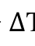

Khác với trao đổi hàng hóa trực tiếp và lưu thông hàng hóa, hoạt động thương
mại bắt đầu bằng tiền với hành vi mua và kết thúc cũng bằng tiền với hành vi bán. Mục

đích của hoạt động thương mại không phải là giá trị sử dụng mà là giá trị, cụ thể là nhằm

thu lợi nhuận.

Như vậy, sự xuất hiện của hoạt động thương mại gắn liền với sự xuất hiện của

thương gia. Về lịch sử, những thương gia xuất hiện vào cuối chế độ công xã nguyên

thủy và đầu chế độ phong kiến.

Những hoạt động thương mại lúc đầu chỉ [VERIFY_OCR: chỉ/chí — check PDF trang 16] giới hạn chủ yếu trong lĩnh vực trao đổi

các sản phẩm hữu hình (thương mại hàng hóa), sau đó được mở rộng sang các sản phẩm

vô hình (thương mại dịch vụ). Trong nền kinh tế hiện đại, thương mại còn liên quan rất

chặt chẽ với các hoạt động đầu tư và sở hữu trí tuệ.

15

<!-- page 17 -->

Những thương gia ngày càng đông đảo trong xã hội như là kết quả tất yếu của

quá trình phân công lao động xã hội ngày càng mở rộng và chuyên sâu.

Ngành thương mại ra đời và phát triển như là kết quả tất yếu của sự phát triển

trao đổi và phân công lao động xã hội. Trong lịch sử phát triển, xã hội loài người đã trải

qua 3 cuộc cách mạng trong phân công lao động xã hội. Phân công lao động lần thứ nhất

là việc tách chăn nuôi ra khỏi trồng trọt. Quá trình này đã thúc đẩy sự phát triển của trao

đổi hàng hóa, và tiền tệ xuất hiện trong giai đoạn này. Phân công lao động lần thứ hai là

quá trình tách thủ công nghiệp khỏi nông nghiệp, sản xuất hàng hóa hình thành. Phân

công lao động lần thứ ba với việc tách riêng chức năng tiêu thụ khỏi chức năng sản xuất

và theo đó đã làm xuất hiện một ngành kinh tế chuyên làm chức năng trao đổi, mua bán

nhằm mục đích kiếm lời trong nền kinh tế - đó là ngành thương mại.

Phân công lao động xã hội vẫn tiếp tục phát triển và tạo ra nhiều ngành kinh tế

mới. Trong lĩnh vực thương mại, ngoài ngành phân phối là ngành chuyên cung cấp các
dịch vụ mua bán hàng hóa hữu hình gồm bán buôn và bán lẻ, còn có các ngành thương

mại dịch vụ chuyên đảm nhận việc cung ứng dịch vụ cho thị trường vì mục đích lợi

nhuận (theo phân loại của WTO, ngay trong lĩnh vực thương mại dịch vụ lại được phân

thành 12 ngành, trong đó có 155 tiểu ngành dịch vụ khác nhau).

Trong lịch sử phát triển của xã hội loài người, thương mại ra đời vừa là một tiến

bộ của lịch sử, một nấc thang phát triển của trao đổi hàng hóa, vừa là điều kiện thúc đẩy
sự phát triển của sản xuất hàng hóa. Sản xuất hàng hóa và lưu thông hàng hóa là hai yếu

tố cơ bản hợp thành kinh tế hàng hóa. Kinh tế hàng hóa tất nhiên sản sinh và hình thành

thị trường.

Vì thế, nói tới thương mại, nói đến kinh tế hàng hóa, không thể tách rời phạm trù
thị trường và kinh tế thị trường. Bởi vậy, kinh tế hàng hóa và kinh tế thị trường, hay

thương mại và thị trường là những phạm trù, những mặt không thể tách rời nhau của

cùng một hiện tượng trong nền kinh tế còn tồn tại những điều kiện của trao đổi hàng

hóa.

2.2. BẢN CHẤT KINH TẾ VÀ PHÂN LOẠI THƯƠNG MẠI

2.2.1. Bản chất kinh tế của thương mại.

Bản chất kinh tế của thương mại được xem xét và nghiên cứu thông qua

nhiều cách tiếp cận khác nhau. Trong giáo trình này, bản chất kinh tế của thương

mại được rút ra từ ba cách tiếp cận, đó là: Thương mại với tư cách là một hoạt

động kinh tế, là một khâu của quá trình tái sản xuất xã hội và với tư cách là một

ngành kinh tế quốc dân, cụ thể:

a. Tiếp cận thương mại với tư cách là một hoạt động kinh tế

Nếu xem xét dưới góc độ một hoạt động kinh tế thì thương mại là một trong

những hoạt động kinh tế cơ bản và rất phổ biến trong nền kinh tế thị trường. Vậy có

16

<!-- page 18 -->

những hoạt động nào được xem là các hoạt động kinh tế cơ bản và phổ biến trong nền

kinh tế thị trường? Chúng ta có thể kể đến ở đây như:

+ Hoạt động sản xuất: kết hợp các yếu tố sản xuất gồm nguyên liệu, công cụ, sức

lao động để biến các yếu tố sản xuất thành sản phẩm, thỏa mãn nhu cầu. Đây là hoạt

động kinh tế cơ bản bởi nếu không có sản xuất thì cũng sẽ không có tiêu dùng.

+ Hoạt động tiêu dùng: nếu sản xuất kết hợp các yếu tố sản xuất để tạo ra sản

phẩm, tạo ra của cải thì tiêu cùng chính là “đập phá sản phẩm” để thỏa mãn nhu cầu.

Đây cũng là hoạt động kinh tế cơ bản vì sở dĩ có hoạt động này mới có sản xuất.

+ Trong nền kinh tế hàng hóa, kinh tế thị trường, còn có các hoạt động trao đổi.

Về phương diện xã hội, những hoạt động này không làm gia tăng thêm của cải cho xã

hội nhưng lại rất cần thiết cho xã hội, và hoạt động thương mại (thay đổi hình thái giá

trị tiền- hàng, hàng - tiền) trong trường hợp này thuộc về phạm trù các hoạt động trao

đổi của xã hội.

Là hoạt động kinh tế, công thức của hoạt động thương mại: T - H - T'. Từ công

thức, có thể thấy mọi hoạt động thương mại đều bắt đầu bằng hành vi mua và kết thúc

bằng hành vi bán. Mua là tiền đề của bán, bán là kết thúc của hoạt động thương mại.

Khi kết thúc hoạt động thương mại, các chủ thể sẽ đạt được mục đích của mình. Ở đây:

Trong hành vi mua (T-H), người ta chuyển đổi hình thái giá trị của hàng hóa từ hình thái

tiền tệ sang hình thái hiện vật và cùng với quá trình này là sự chuyển đổi về sở hữu,
người mua đổi quyền sở hữu tiền tệ để có được quyền sở hữu hàng hóa. Nhờ vậy mà có

được quyền sử dụng sản phẩm cho việc thỏa mãn nhu cầu. Trong hành vi bán hàng (H-

T’), quá trình diễn ra hoàn toàn ngược lại.

+ Đối tượng mua bán của các hoạt động thương mại là hàng hóa và dịch vụ.
+ Mục đích của hoạt động thương mại là nhằm tìm kiếm lợi nhuận.

+ Chủ thể của hoạt động thương mại gồm những người bán (người sản xuất hàng

hóa, người cung ứng dịch vụ, thương gia) và những người mua (người sản xuất, thương

gia và người tiêu dùng). Bên cạnh đó, tham gia vào hoạt động thương mại còn có một

số chủ thể khác, là các trung gian thương mại, như: Những người môi giới, đại lý [VERIFY_OCR: lý/ly — check PDF trang 18] thương

mại...

+ Hoạt động thương mại xảy ra trong khâu lưu thông, trên thị trường với những

điều kiện kinh tế, xã hội, luật pháp, chính trị và môi trường vật chất cụ thể.

Hoạt động thương mại là một quá trình bao gồm các hoạt động cơ bản là mua và

bán. Ngoài các hoạt động cơ bản còn có các hoạt động hỗ trợ cho các hoạt động mua

bán, người ta gọi chung các hoạt động này là dịch vụ thương mại. Chúng ta hiểu dịch
vụ thương mại bao gồm tất cả những hoạt động thương mại ngoài hoạt động thương mại

cơ bản (hoạt động mua và bán), chúng phát sinh gắn liền với hoạt động mua bán, hỗ trợ

cho hoạt động mua bán được thực hiện nhanh chóng và có hiệu quả. Đương nhiên, trong

17

<!-- page 19 -->

cả trao đổi mua bán hàng hóa và cung ứng dịch vụ, chúng ta đều cần có các dịch vụ

thương mại.

Ví dụ: khi ông A xuất khẩu 1 container vải thiều sang Nhật Bản, ông A có thể sử

dụng các dịch vụ vận tải, dịch vụ bảo hiểm cho lô hàng xuất khẩu đó, ông A cũng cần

có những tư vấn pháp lý cần thiết khi có những vấn đề phát sinh trong quá trình xuất

khẩu. Các dịch vụ mà ông A sử dụng (bảo hiểm, vận tải, tư vấn pháp lý) đó được gọi là

các dịch vụ thương mại, chúng hỗ trợ và phục vụ cho một hoạt động thương mại cơ bản,

hoạt động bán hàng hay xuất khẩu của ông A trong trường hợp này.

Tương tự như vậy, doanh nghiệp của ông B kinh doanh dịch vụ bảo hiểm. Để mọi

người biết đến và sử dụng dịch vụ mà doanh nghiệp của ông B cung cấp, doanh nghiệp

bảo hiểm của ông B có thể sử dụng dịch vụ quảng cáo. Dịch vụ quảng cáo trong trường

hợp này là dịch vụ thương mại, nó hỗ trợ cho hoạt động cung ứng/bán dịch vụ bảo hiểm

của doanh nghiệp của ông B.

Hoạt động thương mại được tiến hành theo nguyên tắc tự nguyện, tự thỏa thuận

và cùng có lợi. Vì thế, quá trình mua bán vừa là quá trình cạnh tranh, vừa là quá trình

hợp tác giữa người bán và người mua. Thông qua các hoạt động thương mại, người bán

đạt được giá trị nhằm mục đích lợi nhuận, người mua có được giá trị sử dụng để thỏa

mãn các nhu cầu tiêu dùng khác nhau. Chính nhờ hoạt động thương mại mà sản xuất và

tiêu dùng được nối liền với nhau, thúc đẩy lẫn nhau trong điều kiện của kinh tế hàng
hóa.

b. Tiếp cận thương mại với tư cách là một khâu của quá trình tái sản xuất xã

hội

Quá trình tái sản xuất xã hội gồm bốn khâu cơ bản, đó là: Sản xuất - Phân phối -
Trao đổi và Tiêu dùng. Bốn khâu này có quan hệ mật thiết và tác động qua lại với nhau,

trong đó mối quan hệ giữa sản xuất và tiêu dùng là mối quan hệ cơ bản nhất. Với từng

khâu của quá trình tái sản xuất:

Sản xuất là gốc, là cơ sở, là tiền đề, đóng vai trò quyết định.

Tiêu dùng là động lực, là mục đích của sản xuất

Phân phối, trao đổi là những khâu trung gian, tác động mạnh mẽ, thúc đẩy sản

xuất và tiêu dùng phát triển.

Là hình thái phát triển của trao đổi và lưu thông hàng hóa, thương mại được coi

là một khâu cơ bản và quan trọng của quá trình tái sản xuất, đó là khâu trao đổi - khâu

trung gian giữa sản xuất và tiêu dùng. Trong điều kiện sản xuất và lưu thông hàng hóa

ngày một phát triển, hàng hóa được tạo ra trong khâu sản xuất, sau đó được chuyển sang
khâu lưu thông qua các giai đoạn khác nhau của khâu lưu thông: Mua, vận chuyển, dự

trữ, bán... Kết thúc khâu lưu thông, hàng hóa sẽ được chuyển sang lĩnh vực tiêu dùng.

18

<!-- page 20 -->

Tuy nhiên, giai đoạn trước chủ nghĩa tư bản, thương mại còn tồn tại độc lập với

sản xuất, do thương mại vận động theo công thức T – H – T’, còn sản xuất vẫn chủ yếu

hướng vào giá trị sử dụng. Lúc này lưu thông chưa chi phối được sản xuất mà coi sản

xuất như một tiền đề có sẵn của lưu thông, bởi vì thường chỉ có những sản phẩm dư thừa

mới trở thành hàng hóa. Bởi vậy, khi đó lưu thông hàng hóa chưa trở thành một khâu

của quá trình tái sản xuất và cũng vì thế lợi nhuận thương mại chủ yếu là do mua rẻ, bán

đắt từ những người sản xuất và tiêu dùng mà có. Sau này, với nhiệm vụ quan trọng là

thực hiện tái sản xuất sản phẩm nhanh chóng trong điều kiện thị trường không ngừng

mở rộng và cạnh tranh quyết liệt thì thương mại đã thực sự trở thành một khâu không

thể thiếu phục vụ cho sản xuất. Sự có mặt của thương mại không những đem lại lợi ích

cho khâu sản xuất và các thương nhân mà còn cho toàn xã hội.

Như vậy, có thể nói trong xã hội ngày nay với tư cách là một khâu của quá trình

tái sản xuất, thương mại trở thành cầu nối tích cực giữa các khâu trong quá trình tái sản
xuất, đặc biệt là giữa sản xuất và tiêu dùng, là phương tiện mở rộng giao lưu kinh tế giữa

các quốc gia, khu vực. Đối với mỗi nền kinh tế, thương mại phát triển, lưu thông hàng

hóa thông suốt là biểu hiện của sự phát triển kinh tế lành mạnh, thịnh vượng.

c. Tiếp cận thương mại với tư cách là một ngành kinh tế

Cơ sở để xem xét thương mại là một ngành kinh tế là phân công lao động xã hội.

Trong lịch sử phát triển, xã hội loài người đã trải qua 3 cuộc cách mạng trong
phân công lao động xã hội. Phân công lao động lần thứ nhất là việc tách chăn nuôi ra

khỏi trồng trọt. Quá trình này đã thúc đẩy sự phát triển của trao đổi hàng hóa, và tiền tệ

xuất hiện trong giai đoạn này. Phân công lao động lần thứ hai là quá trình tách thủ công
nghiệp khỏi nông nghiệp, sản xuất hàng hóa hình thành. Phân công lao động lần thứ ba
với việc tách riêng chức năng tiêu thụ khỏi chức năng sản xuất và theo đó đã làm xuất

hiện một ngành kinh tế chuyên làm chức năng trao đổi, mua bán nhằm mục đích kiếm

lời trong nền kinh tế - đó là ngành thương mại.

Với tư cách là ngành kinh tế độc lập, ngành thương mại có vốn, có 1 lực lượng

lao động, 1 hệ thống cơ sở vật chất kỹ thuật để thực hiện chức năng tổ chức lưu thông

hàng hóa và cung ứng các dịch vụ cho xã hội thông qua việc thực hiện mua bán nhằm

sinh lợi.

Ngày nay, ngành thương mại được xếp vào khu vực dịch vụ. Trong khu vực dịch

vụ, ngoài thương mại, còn có nhiều ngành khác. Theo phân loại của WTO, lĩnh vực dịch

vụ được chia thành 12 ngành và 155 phân ngành khác nhau.

Như vậy, nghiên cứu thương mại dưới 3 góc độ: thương mại là một hoạt động
kinh tế, một khâu của quá trình tái sản xuất xã hội, là một ngành kinh tế của nền kinh tế

quốc dân. Mỗi cách tiếp tiếp cận cho chúng ta 1 cách nhìn về thương mại, tuy nhiên,

trong cả 3 góc độ tiếp cận, chúng ta đều nhận thấy đặc trưng chung nhất của thương mại

19

<!-- page 21 -->

là buôn bán, trao đổi hàng hóa và cung ứng dịch vụ gắn với tiền tệ và nhằm mục đích

lợi nhuận. Bởi vậy, có thể rút ra bản chất kinh tế của thương mại là tổng thể các hiện

tượng, các hoạt động và các quan hệ kinh tế gắn liền và phát sinh cùng với trao đổi

hàng hóa và cung ứng dịch vụ nhằm mục đích lợi nhuận.

2.2.2. Phân loại thương mại.

Có nhiều tiêu chí [VERIFY_OCR: chí/chỉ — check PDF trang 21] để phân loại thương mại. Trong học phần kinh tế thương mại

đại cương, sử dụng 5 tiêu chí [VERIFY_OCR: chí/chỉ — check PDF trang 21] cơ bản để phân loại thương mại: căn cứ vào phạm vi [VERIFY_OCR: vi/vĩ — check PDF trang 21] hoạt

động thương mại, căn cứ theo các khâu/đặc điểm của quá trình lưu thông, căn cứ vào

đặc điểm và tính chất của sản phẩm trong quá trình tái sản xuất xã hội, căn cứ vào kỹ

thuật giao dịch và căn cứ theo mức độ tham gia vào quá trình tự do hóa thương mại.

a. Theo phạm vi [VERIFY_OCR: vi/vĩ — check PDF trang 21] hoạt động thương mại

Theo phạm vi [VERIFY_OCR: vi/vĩ — check PDF trang 21] hoạt động, người ta phân loại thương mại thành 2 bộ phận: Thương

mại nội địa và thương mại quốc tế.

+ Thương mại nội địa hay còn gọi là nội thương/thương mại trong nước phản ánh

những quan hệ thương mại của các chủ thể kinh tế của một quốc gia. Các hoạt động

thương mại nội địa về cơ bản diễn ra trong phạm vi [VERIFY_OCR: vi/vĩ — check PDF trang 21] biên giới của một quốc gia. Các hoạt

động thương mại nội địa diễn ra chủ yếu chịu sự quản lý và điều tiết của nhà nước. Bởi

vậy, các quan hệ kinh tế diễn ra giữa các chủ thể tham gia vào hoạt động thương mại nội

địa vừa thể hiện quan hệ mang tính thị trường, song lại vừa phản ánh những chủ trương
và chính sách của nhà nước. Thương mại nội địa có thể được phân thành: Thương mại

thành thị; Thương mại nông thôn; Thương mại biên giới, hải đảo; Thương mại vùng sâu,

vùng xa...

+ Thương mại quốc tế hay còn gọi là ngoại thương, bao gồm việc mua bán hàng
hóa và dịch vụ qua biên giới quốc gia có thể ở phạm vi [VERIFY_OCR: vi/vĩ — check PDF trang 21] toàn cầu, phạm vi [VERIFY_OCR: vi/vĩ — check PDF trang 21] khu vực hoặc

thương mại song phương giữa hai quốc gia. Thương mại quốc tế phản ánh những mối

quan hệ kinh tế thương mại giữa các chủ thể kinh tế của các quốc gia với nhau. Chúng

tuân thủ những luật lệ và những thông lệ buôn bán toàn cầu, khu vực và các hiệp định

thương mại ký kết song phương giữa các quốc gia. Trong hoạt động ngoại thương, xuất

khẩu là việc bán hàng hóa và dịch vụ cho nước ngoài và nhập khẩu là việc mua hàng

hóa và dịch vụ của nước ngoài.

Thương mại nội địa diễn ra trên thị trường nội địa, ngoại thương là hoạt động

thương mại diễn ra trên thị trường quốc tế. Vì vậy, thương mại nội địa và ngoại thương

được thực hiện theo những hình thức và phương pháp có thể không hoàn toàn giống

nhau.

Tuy nhiên, cần lưu ý rằng, quá trình tự do hóa thương mại toàn cầu ngày càng

diễn ra sâu rộng, các định chế thương mại cũng ngày càng trở nên thống nhất và được

áp dụng cho mọi quốc gia, bởi vậy việc phân biệt thương mại nội địa và thương mại

20

<!-- page 22 -->

quốc tế theo đó cũng mang tính chất tương đối, đồng thời hai bộ phận này ngày càng thể

hiện mối quan hệ chặt chẽ với nhau hoặc bổ sung và thúc đẩy nhau phát triển.

b. Theo các khâu/đặc điểm của quá trình lưu thông.

Theo các khâu/đặc điểm của quá trình lưu thông, thương mại được phân thành 2

loại: Thương mại bán buôn và thương mại bán lẻ.

+ Thương mại bán buôn phản ánh các mối quan hệ kinh tế thương mại giữa những

nhà sản xuất, giữa nhà sản xuất với thương gia và giữa những người thương gia với

nhau. Khi hoàn thành các hoạt động mua bán buôn, hàng hóa vẫn chưa kết thúc quá trình

lưu thông mà chúng còn nằm lại trong khâu sản xuất để sau khi kết thúc sản xuất lại tiếp

tục quay trở lại lưu thông hoặc vẫn nằm trong lưu thông để chờ bán đến tay người tiêu

dùng cuối cùng. Thương mại bán buôn chủ yếu diễn ra trong lĩnh vực buôn bán các sản

phẩm hữu hình với các chủ thể của hoạt động thương mại bán buôn là những nhà sản

xuất và các thương gia.

+ Trong khi đó, thương mại bán lẻ phản ánh mối quan hệ buôn bán hàng hóa và

các dịch vụ giữa những nhà sản xuất, nhà cung ứng dịch vụ hoặc các thương gia với bên

kia là những người tiêu dùng cuối cùng. Khi hoàn thành các hoạt động mua, bán lẻ hàng

hóa sẽ kết thúc quá trình lưu thông và đi vào lĩnh vực tiêu dùng để thỏa mãn những nhu

cầu khác nhau của xã hội.

Lưu ý, sự phân biệt giữa thương mại bán buôn và thương mại bán lẻ chủ yếu ở
sự khác biệt theo các khâu trong quá trình lưu thông của sản phẩm và mối quan hệ của

các chủ thể. Bất kỳ mối quan hệ thương mại nào mà một bên có sự tham gia của người

tiêu dùng cuối cùng thì quan hệ thương mại đó thuộc về thương mại bán lẻ.

c. Theo đặc điểm và tính chất của sản phẩm trong quá trình tái  sản xuất
xã hội

Theo tiêu chí [VERIFY_OCR: chí/chỉ — check PDF trang 22] này, thương mại được phân thành: Thương mại hàng hóa và thương

mại dịch vụ.

Ở đây, cần lưu ý, thương mại hàng hóa và thương mại dịch vụ là những khái niệm

phân biệt với nhau chủ yếu dựa vào sự khác biệt về đối tượng của hoạt động trao đổi,

mua bán trong thương mại. Nếu thương mại hàng hóa về cơ bản là trao đổi các sản phẩm

"hữu hình" thì thương mại dịch vụ là lĩnh vực trao đổi, mua bán các sản phẩm "vô hình".

d. Theo kỹ thuật giao dịch.

Trong một vài thập kỷ gần đây, với sự ra đời và phát triển của nền kinh tế số hóa

mà ngoài kỹ thuật trao đổi, buôn bán truyền thống đã xuất hiện việc trao đổi, buôn bán

thông qua các phương tiện kỹ thuật số. Chính sự tham gia của các phương tiện kỹ thuật
số đã đưa đến xu thế và loại hình thương mại mới - đó là thương mại điện tử.

Lưu ý rằng sự phân biệt giữa hai khái niệm này dựa trên sự khác biệt về các

phương thức mua bán trong thương mại. Trong đó, các phương thức mua bán trong

21

<!-- page 23 -->

thương mại truyền thống được thực hiện trong môi trường tự nhiên, những người tham

gia vào hoạt động mua, bán thường tiếp xúc trực tiếp với nhau trên thị trường dưới nhiều

hình thức khác nhau. Họ gặp gỡ trực tiếp, tiến hành các giao dịch mua bán ở các chợ,

siêu thị, trung tâm thương mại, hội chợ triển lãm...

Ngược lại, thương mại điện tử là một phương thức trao đổi mua bán bằng các

phương tiện truyền thông kỹ thuật trong môi trường điện tử. Thương mại điện tử chỉ [VERIFY_OCR: chỉ/chí — check PDF trang 23]

xuất hiện trong xã hội hiện đại. Hiện nay, thương mại điện tử đang phát triển rất nhanh

chóng trên toàn thế giới và đó là xu hướng phát triển tất yếu, là yếu tố hợp thành của

nền kinh tế số.

Mặc dù thương mại điện tử sẽ trở thành phương thức thương mại phổ biến trong

xã hội hiện đại, tuy nhiên thương mại truyền thống vẫn giữ nguyên giá trị về kinh tế và

văn hóa. Nó vẫn tồn tại song song cùng với thương mại điện tử mặc dù kinh tế thị trường

và thương mại thế giới không ngừng mở rộng và phát triển.

e. Theo mức độ tham gia vào quá trình tự do hóa thương mại

Khi xem xét thương mại trong bối cảnh tham gia vào quá trình tự do hóa thương

mại khu vực và toàn cầu, người ta phân thương mại thành 2 loại, đó là: Thương mại có

bảo hộ và thương mại tự do hóa.

+ Thương mại có bảo hộ thường được các quốc gia áp dụng trong một số lĩnh

vực nhạy cảm để bảo vệ các lợi ích quốc gia hoặc để bảo vệ sản xuất trong nước, nhất
là đối với những ngành công nghiệp, dịch vụ non trẻ, mới hình thành. Các biện pháp

thường được sử dụng trong thương mại bảo hộ là thuế quan và các biện pháp phi thuế

quan. Các biện pháp phi thuế quan được sử dụng trong chính sách bảo hộ thương mại
bao gồm: Các biện pháp hành chính, hạn ngạch, giấy phép, các quy định kỹ thuật, các
tiêu chuẩn môi trường... Đồng thời, việc bảo hộ thương mại của quốc gia còn được áp

dụng thông qua các chính sách ưu đãi đối với sản xuất trong nước.

+ Thương mại tự do hóa được thể hiện qua việc xóa bỏ và giảm thiểu hàng rào

thuế quan, dỡ bỏ các hàng rào phi thuế quan, bảo đảm quyền tự do kinh doanh cho các

thương nhân, tạo điều kiện thuận lợi cho hàng hóa trong nước và quốc tế lưu thông thông

suốt. Thương mại tự do hóa có nhiều cấp độ và hình thức khác nhau.

Cần thấy rằng, việc thực hiện bảo hộ và tự do hóa trong thương mại của các quốc

gia vừa có tính mâu thuẫn, vừa có tính thống nhất với nhau. Trên thực tế, mặc dù nhận

thức được những lợi ích to lớn của tự do hóa thương mại nhưng không có quốc gia nào

thực hiện một cách tự do thương mại với bên ngoài một cách hoàn toàn mà ở mức độ

nhất định, quốc gia vẫn thực hiện bảo hộ thương mại. Bảo hộ để hội nhập thương mại
có hiệu quả và bền vững hơn, bảo hộ để tiếp tục mở cửa, tự do thương mại nhiều hơn.

2.3. CÁC CHỨC NĂNG CỦA THƯƠNG MẠI

2.3.1. Chức năng chung của thương mại

22

<!-- page 24 -->

Chức năng của thương mại là một phạm trù khách quan, được hình thành trên cơ

sở sự phát triển của lực lượng sản xuất và trình độ phân công lao động xã hội.

+ Phân công lao động xã hội làm thay đổi mục đích của nền sản xuất, từ kinh tế

tự nhiên, sản xuất tự cấp tự túc lên kinh tế hàng hóa, sản xuất hàng hóa. Sự phát triển

của phân công lao động xã hội cũng giúp tạo ra nhiều ngành nghề mới trong xã hội,

trong đó có thương mại.

+ Sự phát triển của lực lượng sản xuất đòi hỏi một bộ phận lao động xã hội tách

ra khỏi sản xuất, họ có vốn, có cơ sở vật chất… để đảm nhiệm công việc lưu thông hàng

hóa.

Như vậy, sự phát triển của lực lượng sản xuất và phân công lao động xã hội cho

phép chúng ta nhận ra rằng, từ khi thương mại ra đời cho đến nay, chức năng nguyên

thủy, chức năng chung của thương mại là mua và bán, hay chức năng thuần túy của

thương mại là mua để bán. Và cho dù thương mại đã từng tồn tại trong nhiều hình thái
kinh tế - xã hội khác nhau. Bản chất kinh tế - xã hội của các hình thái kinh tế - xã hội

này mặc dù có sự khác nhau nhưng chức năng của thương mại là không thay đổi.

Chức năng của thương mại được hình thành từ 2 điều kiện trên nên chức năng

thương mại mang tính khách quan, tức là không tùy thuộc ý muốn chủ quan của con

người. Và vì là khách quan nên chúng ta chỉ có thể nhận thức và vận dụng các chức năng

của thương mại chứ không thể tùy tiện áp đặt hoặc thay đổi các chức năng đó. Nếu
chúng ta nhận thức đúng, vận dụng đúng sẽ giúp thúc đẩy sự phát triển của lưu thông

hàng hóa, của thương mại, thúc đẩy sự phát triển của nền kinh tế. Nếu chúng ta nhận

thức sai, vận dụng sai, hoặc cố áp đặt những cái chủ quan của chúng ta vào trong đó sẽ
dẫn đến sự kìm hãm, đưa đến sự ách tắc trong lưu thông, sự khủng hoảng trong nền kinh
tế.

Trong mọi hình thái kinh tế - xã hội còn tồn tại sản xuất và lưu thông hàng hóa

thì chức năng chung của thương mại là thực hiện lưu thông hàng hóa và cung ứng dịch

vụ thông qua mua bán bằng tiền.

Khi nghiên cứu về bản chất kinh tế của thương mại, có đề cập đến 3 góc độ tiếp

cận thương mại: thương mại là hoạt động kinh tế, thương mại là một ngành kinh tế độc

lập và thương mại là 1 khâu tái sản xuất. Vì vậy, trong trường hợp này, cũng cần phân

biệt chức năng thương mại với các tư cách là một hoạt động kinh tế, một khâu của tái

sản xuất và một ngành kinh tế, cụ thể:

+ Nếu xem xét thương mại với tư cách là một hoạt động kinh tế thì thương mại

có chức năng thực hiện việc mua bán, cung ứng hàng hóa và các dịch vụ bằng tiền.

+ Nếu xem xét thương mại là một khâu của quá trình tái sản xuất xã hội thì thương

mại có chức năng thực hiện cầu nối giữa sản xuất với tiêu dùng thông qua trao đổi, đảm

bảo thực hiện tái sản xuất nhanh chóng, hiệu quả trong điều kiện của kinh tế hàng hóa.

23

<!-- page 25 -->

+ Nếu xem xét thương mại là một ngành kinh tế thì thương mại thực hiện chức

năng tổ chức lưu thông hàng hóa và cung ứng dịch vụ thông qua mua bán để gắn liền

sản xuất với thị trường trong và ngoài nước nhằm thỏa mãn nhu cầu thị trường về hàng

hóa và dịch vụ với chi phí thấp nhất.

Khi xem xét chức năng thương mại với tư cách một ngành kinh tế, cần lưu ý chức

năng của ngành thương mại là một phạm trù phản ánh đặc trưng cơ bản của ngành

thương mại mà qua đó phân biệt ngành thương mại với các ngành kinh tế khác. Vì vậy,

cần phân biệt hai phạm trù chức năng và nhiệm vụ của ngành thương mại.

Chức năng thương mại được hình thành trên cơ sở sự phát triển của lực lượng

sản xuất và phân công lao động xã hội. Vì vậy, chức năng thương mại là một phạm trù

mang tính khách quan. Ngược lại, nhiệm vụ là một phạm trù mang tính chủ quan. Nhiệm

vụ của ngành thương mại có thể thay đổi tùy thuộc vào đòi hỏi của từng giai đoạn lịch

sử.

Thông thường, cơ sở để xác định nhiệm vụ của ngành thương mại được căn cứ

trước hết vào chức năng của ngành thương mại. Đây là yếu tố sẽ quyết định đặc thù của

thương mại khác với các ngành khác.

Ngoài ra, chúng ta còn căn cứ vào đặc điểm kinh tế - xã hội phản ánh trình độ

phát triển, căn cứ vào mục tiêu hay nhiệm vụ phát triển của nền kinh tế - xã hội. Cuối

cùng, sự phát triển càn đặt trong bối cảnh môi trường, trong và ngoài nước, vì vậy nhiệm
vụ ngành thương mại còn được xác định dựa trên bối cảnh kinh tế, thị trường khu vực

và thế giới. Vì vậy, chúng ta có thể dễ dàng nhận thấy các xu hướng hiện nay như toàn

cầu hóa và hội nhập quốc tế, cách mạng công nghiệp 4.0 hay thực tiễn chiến tranh thương
mại, cạnh tranh địa chính trị toàn cầu… đều có ảnh hưởng đến việc xác định các nhiệm
vụ của ngành thương mại Việt Nam.

2.3.2. Các chức năng cụ thể của thương mại

a. Các chức năng cụ thể của thương mại hàng hóa

Trong chức năng cụ thể của thương mại, có 2 nhóm chức năng cụ thể của thương

mại hàng hóa là chức năng thay đổi hình thái giá trị và chức năng phân phối hàng hóa.

Chúng ta cũng sẽ chỉ ra một số biểu hiện đặc thù của chức năng thương mại trong thương

mại dịch vụ.

+ Chức năng thay đổi hình thái giá trị của

Với chức năng này, thương mại làm thay đổi hình thái giá trị từ tiền sang hàng,

và ngược lại từ hàng sang tiền thông qua hành vi mua (T - H) và hành vi bán (H – T).

Đây còn được gọi là chức năng lưu thông thuần túy của thương mại.

Cùng với việc thay đổi hình thái giá trị là quá trình chuyển đổi quyền sở hữu về

hàng hóa và tiền tệ. Quyền sở hữu tiền tệ được chuyển từ người mua sang người bán, và

ngược lại quyền sở hữu hàng hóa được chuyển từ người bán sang người mua.

24

<!-- page 26 -->

Để thực hiện được chức năng này, thương mại phải tiến hành hàng loạt những

hoạt động gắn với việc thay đổi hình thái giá trị và chuyển đổi quyền sở hữu, như: Mua

hàng, bán hàng, xúc tiến thương mại, tiếp thị, quảng cáo... Về lý thuyết, các hành vi

thương mại như chúng ta vừa đề cập khi thực hiện chức năng này không tạo ra giá trị

mới, không làm tăng giá trị sử dụng của hàng hóa song nó rất cần thiết và có ích cho xã

hội.

Nhờ chức năng thay đổi hình thái giá trị của thương mại mà người bán đạt được

mục đích của mình là giá trị nhằm tìm kiếm lợi nhuận, người mua có được các giá trị sử

dụng để thỏa mãn nhu cầu tiêu dùng khác nhau của mình.

+ Chức năng phân phối hàng hoá

Sản xuất và tiêu dùng thường không ăn khớp với nhau. Sự không ăn khớp này có

thể xảy ra ở các phương diện: sự không ăn khớp về không gian, sự không ăn khớp về

thời gian, sự không ăn khớp về số lượng, chủng loại...

+ Sự không ăn khớp về không gian thể hiện ở việc sản xuất ở địa điểm này, tiêu

dùng ở địa điểm khác, sản xuất tập trung nhưng tiêu dùng phân tán và ngược lại... Ví

dụ: Các sản phẩm công nghiệp tiêu dùng thường được sản xuất ở khu công nghiệp ven

các đô thị, thành phố lớn song tiêu dùng các sản phẩm này thì lại có thể trên phạm vi [VERIFY_OCR: vi/vĩ — check PDF trang 26] cả

nước. Hay sản xuất lúa gạo ở Việt Nam thường tập trung ở một số vùng có lợi thế về thổ

nhưỡng, khí hậu như đồng bằng sông Hồng, đồng bằng sông Cửu Long song tiêu dùng
lại ở trên cả thị trường nội địa.

+ Sự không ăn khớp về thời gian thể hiện ở việc sản xuất quanh năm, tiêu dùng

thời vụ hoặc sản xuất thời vụ nhưng tiêu dùng quanh năm. Ví dụ, nhu cầu tiêu dùng một
số sản phẩm có thể chỉ [VERIFY_OCR: chỉ/chí — check PDF trang 26] trong các dịp lễ, tết… song sản xuất các sản phẩm này có thể
quanh năm. Trong một số trường hợp, sự không ăn khớp về thời gian có thể được thể

hiện ở khía cạnh việc vận chuyển mang tính thời vụ.

Vì vậy, để khắc phục sự không ăn khớp giữa sản xuất và tiêu dùng về không gian,

thời gian, quy mô, cơ cấu, cần thiết phải có hoạt động phân phối để đưa sản phẩm từ sản

xuất đến tiêu dùng một cách hợp lý. Trong nền kinh tế hàng hóa, hoạt động phân phối

này được thực hiện thông qua thương mại.

Thương mại thực hiện chức năng tổ chức quá trình phân phối hàng hóa nhằm đưa

hàng hóa từ lĩnh vực sản xuất đến thị trường và tiếp tục hoạt động sản xuất trong lĩnh

vực lưu thông. Chức năng phân phối hàng hóa của thương mại trong trường hợp này

được thực hiện thông qua hàng loạt những hoạt động khác nhau, cụ thể:

+ Hoạt động vận chuyển nhằm đưa hàng hóa từ nơi sản xuất đến người tiêu dùng
và những dịch vụ có liên quan đến vận tải, như: Làm các thủ tục vận tải, giao nhận hàng

hóa...

+ Hoạt động giữ gìn, bảo quản hàng hóa. Những hoạt động này nhằm bảo vệ giá

25

<!-- page 27 -->

trị sử dụng của hàng hóa về số lượng, chất lượng trong quá trình vận chuyển, cũng như

lưu kho phát sinh do sự không ăn khớp giữa sản xuất và đòi hỏi của thị trường về không

gian và thời gian.

Lưu ý rằng gìn giữ ở đây là gìn giữ các giá trị sử dụng để phục vụ cho nhu cầu

tiêu dùng sau này. Và với mỗi hàng hóa, do đặc điểm thương phẩm học là khác nhau

nên yêu cầu về các điều kiện và phương tiện dự trữ, bảo quản là khác nhau. Chúng ta

không thể dự trữ hàng đông lạnh (cua, cá, mực…) nếu như không có nhà kho với hệ

thống làm mát, trữ đông. Nếu không đảm bảo điều kiện này thì sản phẩm sau này đưa

ra thị trường cùng sẽ không thể tiêu thụ được.

+ Các hoạt động phân loại, chọn lọc, đóng gói, bao bì, gia công, chế biến… làm

hoàn thiện và làm cho giá trị sử dụng của hàng hóa thích ứng với nhu cầu người tiêu

dùng.

Trong hoạt động này cũng cần lưu ý đến 2 thuật ngữ “mặt hàng sản xuất” và “mặt
hàng thương mại”. Trong đa số các trường hợp, mặt hàng sản xuất và mặt hàng thương

mại là giống nhau. Tuy nhiên, sản xuất sẽ tạo ra các mặt hàng sản xuất, còn người tiêu

dùng sẽ nhắm đến các mặt hàng thương mại. Vì vậy, thông qua hệ thống mạng lưới

thương mại bán buôn, bán lẻ, người ta sẽ thực hiện các hoạt động chia nhỏ, bao gói, gia

công gia cố… để tạo thành các mặt hàng thương mại, đáp ứng nhu cầu của người tiêu

dùng.

Về mặt ý nghĩa, nhờ có chức năng này, thương mại có thể tiếp tục thực hiện chức

năng thay đổi hình thái giá trị, thực hiện giá trị hàng hóa mà chúng ta đã đề cập ở video

clip trước. Việc thực hiện chức năng tổ chức phân phối hàng hóa của thương mại cũng
góp phần đảm bảo việc đưa các sản phẩm từ sản xuất đến với thị trường, đáp ứng nhu
cầu người tiêu dùng về số lượng, cơ cấu, thời gian và không gian với chi phí thấp nhất.

Qua đó, góp phần giải quyết những mâu thuẫn vốn có giữa cung và cầu, giữa sản xuất

và tiêu dùng trong điều kiện kinh tế hàng hóa.

Lưu ý, trong chức năng thay đổi hình thái giá trị mà chúng ta đã nghiên cứu ở

video clip trước, khi thực hiện chức năng này, thương mại sẽ thực hiện các hoạt động

như mua bán hàng hóa, hoạt động quảng cáo, xúc tiến thương mại, hoạt động kế toán sổ

sách mua bán hàng hóa… Đây là các hoạt động không mang tính sản xuất. Tuy nhiên,

trong nhóm chức năng phân phối hàng hóa, với các hoạt động như được liệt kê trên màn

hình như vận chuyển, dự trữ, phân loại, đóng gói… Đây là các hoạt động mang tính sản

xuất. Các hoạt động sản xuất này không diễn ra trong sản xuất mà xảy ra trong khâu lưu

thông, gắn với quá trình vận động của hàng hóa từ sản xuất đến tiêu dùng và được thực
hiện bởi ngành thương mại. Khi thực hiện chức năng phân phối này, thương mại đã thực

hiện bảo vệ và hoàn thiện giá trị sử dụng, đồng thời góp phần làm tăng giá trị hàng hóa.

Hoạt động thương mại xét về góc độ này đã trực tiếp góp phần tạo ra thu nhập quốc dân.

26

<!-- page 28 -->

Bởi vậy, chức năng này còn được gọi là chức năng tiếp tục sản xuất trong lưu thông của

thương mại.

Việc nghiên cứu các chức năng của thương mại có ý nghĩa cả về lý luận và thực

tiễn.

Qua nghiên cứu, một mặt chỉ ra rằng để quá trình lưu thông hàng hóa diễn ra

thông suốt, hiệu quả cần đảm bảo sự thông suốt của các dòng vận động, đó là dòng vận

động của hàng hóa, tiền tệ, thông tin và quyền sở hữu. Mặt khác, các chức năng của

thương mại vốn diễn ra đồng thời và có mối quan hệ biện chứng với nhau, việc tách

bạch trong nghiên cứu là để thấy bản chất kinh tế và vai trò của từng chức năng trong

quá trình lưu thông hàng hóa. Theo đó, nếu quá trình lưu thông hàng hóa được tổ chức

hợp lý sẽ giảm thiểu được những hư phí phát sinh trong quá trình lưu thông.

Trong xã hội hiện đại, hàng loạt yếu tố mới tác động và chi phối tới hoạt động

lưu thông hàng hóa, đó là:

+ Nhu cầu và đòi hỏi của con người đối với thương mại ngày càng cao về chất

lượng phục vụ, về sự tiện lợi và tiết kiệm thời gian;

+ Cạnh tranh trên thị trường trong tiêu thụ hàng hóa ngày càng gay gắt;

+ Toàn cầu hóa và tự do hóa thương mại diễn ra ngày càng mạnh mẽ và sâu rộng;

+ Vai trò của khâu phân phối hàng hóa ngày càng trở nên quan trọng trong chuỗi

giá trị hàng hóa;

+ Sự phát triển mạnh mẽ của khoa học, kỹ thuật cho phép công tác vận chuyển

hàng hóa, giao dịch thương mại có những tiến bộ vượt trội về không gian, thời gian, chi

phí…

Vì vậy, các chức năng của thương mại cần được nhận thức và vận dụng phù hợp
với điều kiện của xã hội hiện đại. Theo đó, việc tổ chức các hoạt động thương mại phải

được tiếp cận và áp dụng những tiến bộ khoa học, kỹ thuật hiện đại, phù hợp với xu

hướng phát triển thương mại toàn cầu. Bên cạnh đó, cần nâng cao chất lượng phục vụ

trước, trong và sau bán, tổ chức tiêu dùng để cạnh tranh và đáp ứng nhu cầu ngày càng

cao của người tiêu dùng trong và ngoài nước, cũng như kiểm soát và tham gia tích cực

vào chuỗi giá trị của hàng hóa.

b. Những đặc thù của các chức năng thương mại trong lĩnh vực dịch vụ

Do những đặc tính riêng biệt của dịch vụ: Tính vô hình; sản xuất, lưu thông và

tiêu dùng đồng thời... nên các chức năng của thương mại trong lĩnh vực dịch vụ cũng có

sự biểu hiện đặc thù so với trong thương mại hàng hóa. Cụ thể:

+ Trong thương mại dịch vụ, chức năng sản xuất, lưu thông và tổ chức tiêu dùng
các sản phẩm dịch vụ thường diễn ra đồng thời. Nghĩa là, trong thương mại dịch vụ, các

nhà cung ứng dịch vụ không chỉ thuần túy thực hiện việc mua bán (như trong thương

mại hàng hóa) mà nó còn đồng thời thực hiện chức năng sản xuất ra các dịch vụ và tổ

27

<!-- page 29 -->

chức cả quá trình tiêu dùng các dịch vụ đó cho khách hàng. Các chức năng này về cơ

bản được thực hiện đồng thời ở cùng một không gian và trong cùng một thời gian.

+ Với chức năng thay đổi hình thái giá trị, trong thương mại dịch vụ mặc dù diễn

ra quá trình chuyển quyền sở hữu tiền tệ từ người mua sang người bán, song không có

sự chuyển quyền sở hữu dịch vụ từ người bán sang người mua. Đây chính là đặc thù

được quy định bởi đặc điểm dịch vụ không tách rời khỏi người sản xuất ra chúng.

+ Về chức năng phân phối, do dịch vụ thường khó có khả năng vận tải, bảo quản,

dự trữ... Bởi vậy, trong thương mại dịch vụ việc thực hiện vận chuyển, bảo quản, dự trữ,

phân loại, chọn lọc, đóng gói… thường không xảy ra. Theo đó, trong thương mại dịch

vụ khả năng điều hòa cung - cầu, lợi ích của các chủ thể tham gia trên thị trường dịch

vụ khi không có sự ăn khớp là rất khó khăn.

Tuy nhiên, với sự phát triển mạnh mẽ của khoa học, kỹ thuật, đặc biệt là sự ra đời

và phát triển của thương mại điện tử thì một số khác biệt này cũng có thể thay đổi, ví
dụ: Khả năng vận chuyển dịch vụ qua hệ thống kỹ thuật truyền thông số, khả năng dự

trữ một số loại dịch vụ…

Câu hỏi ôn tập chương 2

Câu 1. Phân tích bản chất kinh tế của thương mại thông qua các tiếp cận: Là một

hoạt động kinh tế, là một khâu của quá trình tái sản xuất, và là một ngành kinh tế? Ý

nghĩa của nghiên cứu bản chất kinh tế của thương mại dưới các góc độ tiếp cận này
trong quản lý nhà nước về thương mại?

Câu 2. Trình bày các cách phân loại thương mại? Ý nghĩa của các cách phân loại

này trong nghiên cứu và quản lý nhà nước về thương mại?

Câu 3. Trình bày chức năng chung của thương mại? Phân biệt chức năng của
thương mại với tư cách là một hoạt động kinh tế, một khâu của quá trình tái sản xuất và

một ngành kinh tế?

Câu 4. Phân tích các chức năng cụ thể của thương mại trong lĩnh vực thương mại

hàng hóa? Những biểu hiện đặc thù của chức năng thương mại trong lĩnh vực thương

mại dịch vụ?

Tổng kết chương 2

1. Các nấc thang phát triển từ thấp đến cao của trao đổi: trao đổi hàng hóa trực

tiếp, lưu thông hàng hóa, thương mại. Lưu thông hàng hóa ra đời đã phủ định trao đổi

hàng hóa trực tiếp, song thương mại ra đời không đưa đến sự phủ định lưu thông mà trái

lại nó làm cho lưu thông hàng hóa phát triển ở một trình độ cao hơn.Bản chất kinh tế
chung của thương mại là tổng thể các hiện tượng, các hoạt động và các quan hệ kinh tế

gắn liền và phát sinh cùng với trao đổi hàng hóa và cung ứng dịch vụ nhằm mục đích

lợi nhuận.

28

<!-- page 30 -->

2. Thương mại có thể được phân loại dựa trên nhiều tiêu chí [VERIFY_OCR: chí/chỉ — check PDF trang 30]: theo phạm vi [VERIFY_OCR: vi/vĩ — check PDF trang 30] hoạt

động, theo các khâu/đặc điểm của quá trình lưu thông, theo đặc điểm và tính chất của

sản phẩm trong quá trình tái sản xuất xã hội, theo kỹ thuật giao dịch, theo mức độ tham

gia vào quá trình tự do hóa thương mại. Các phân loại thương mại này chỉ [VERIFY_OCR: chỉ/chí — check PDF trang 30] mang tính

tương đối, song có ý nghĩa cả về lý luận và thực tiễn.

3. Trong mọi hình thái kinh tế - xã hội còn tồn tại sản xuất và lưu thông hàng hóa,

chức năng chung của thương mại là thực hiện lưu thông hàng hóa và cung ứng dịch vụ

thông qua mua bán bằng tiền.

4. Các nhóm chức năng cụ thể của thương mại hàng hóa: chức năng thay đổi hình

thái giá trị, chức năng phân phối hàng hóa của thương mại.

5. Do đặc tính riêng biệt của dịch vụ: Tính vô hình; sản xuất, lưu thông và tiêu

dùng đồng thời... nên trong thương mại dịch vụ, chức năng sản xuất, lưu thông và tổ

chức tiêu dùng các sản phẩm dịch vụ thường diễn ra đồng thời ở cùng một không gian
và trong cùng một thời gian.

Một số thuật ngữ

1. Hàng hóa

2. Dịch vụ

3. Trao đổi hàng hóa trực tiếp
4.  Lưu thông hàng hóa

5.  Thương mại

6.  Chức năng thương mại
7. Thương mại hàng hóa
8.  Thương mại dịch vụ.

29

<!-- page 31 -->

CHƯƠNG 3: NHỮNG TÁC ĐỘNG CỦA THƯƠNG MẠI

Tình huống khởi động bài

Trên trang web Đảng Cộng Sản tháng 10 năm 2021 có đăng bài “Nguyên nhân,

giải pháp khắc phục tình trạng ô nhiễm môi trường nước”, trong đó có đưa thông tin:

Thực trạng ô nhiễm môi trường nước hiện nay ở Việt Nam và trên thế giới rất

đáng báo động. Cụ thể:

Vấn đề ô nhiễm môi trường nước trên thế giới hiện nay không chỉ xảy ra ở đới

ôn hòa, mà còn có trên đới nóng, đới lạnh, tức là bao trùm khắp các châu lục. Theo báo

cáo ô nhiễm môi trường nước của UNEP, có tới 60% dòng sông của châu Á – Âu – Phi

bị ô nhiễm sinh vật và ô nhiễm hữu cơ.

Tình trạng ô nhiễm môi trường nước ở Việt Nam cũng không chỉ xảy ra ở nông

thôn mà ở Thành phố Hà Nội và Thành phố Hồ Chí Minh, các tỉnh lân cận cũng rất
nghiêm trọng.

Tại Thành phố Hà Nội: Khoảng 350 - 400 nghìn m3 nước thải và hơn 1.000m3

rác thải xả ra mỗi ngày, nhưng chỉ [VERIFY_OCR: chỉ/chí — check PDF trang 31] 10% được xử lý, số còn lại xả trực tiếp vào sông ngòi

gây ô nhiễm nước khiến cá chết hàng loạt ở Hồ Tây, mức độ ô nhiễm rộng khắp 6 quận

(Ba Đình, Hoàn [VERIFY_OCR: hoàn/hoàng — check PDF trang 31] Kiếm, Đống Đa, Hai Bà Trưng, Cầu Giấy, Tây Hồ).

Tại Thành phố Hồ Chí Minh: Ô nhiễm môi trường nước điển hình nhất là ở cụm
công nghiệp Thanh Lương, có tới khoảng 500.000m3 nước thải/ngày từ các nhà máy

bột giặt, giấy, nhuộm.

Các số liệu này cho thấy vấn đề ô nhiễm ngày càng nghiêm trọng cùng với sự
phát triển của các hoạt động sản xuất, thương mại. Vậy cần làm gì để giải quyết vấn đề
trên? Để phát triển bền vững thương mại, vai trò của Nhà nước là gì?

Câu trả lời sẽ có sau khi nghiên cứu nội dung chương 3.

Mục tiêu của chương 3

Sau khi nghiên cứu chương 3 giúp người học nắm được một số cơ sở luận nghiên

cứu tác động của thương mại, từ đó, có thể vận dụng trong nghiên cứu và làm rõ tác

động về kinh tế, xã hội và môi trường của thương mại.

Cấu trúc nội dung chương 3

3.1. Cơ sở luận và phân loại tác động của thương mại

3.2. Những tác động về kinh tế của thương mại

3.3. Những tác động về xã hội của thương mại

3.4. Những tác động về môi trường của thương mại

30

<!-- page 32 -->

3.1. CƠ SỞ LUẬN VÀ PHÂN LOẠI TÁC ĐỘNG CỦA THƯƠNG MẠI

3.1.1. Cơ sở luận nghiên cứu tác động của thương mại

Khi tìm hiểu bản chất của thương mại chúng ta cũng đã tiếp cận thương mại dưới

3 góc độ khác nhau, đó là với tư cách một hoạt động kinh tế, một khâu của tái sản xuất

xã hội và một ngành kinh tế. Đó cũng chính là cách tiếp cận khi nghiên cứu những tác

động của thương mại.

Thứ nhất, khi xem xét thương mại là một hoạt động kinh tế

Do trong nền kinh tế thị trường, hàng hoá sản xuất ra để bán và được bán chủ yếu

thông qua hoạt động thương mại, mọi hoạt động kinh tế đều gắn với hoạt động thương

mại nên có thể nói thương mại là hoạt động kinh tế cơ bản và phổ biến của nền kinh tế

thị trường.

Nói đến thương mại là nói đến hoạt động trao đổi của các chủ thể gồm người

mua và người bán hàng hoá, dịch vụ, trong đó người bán có thể là nhà sản xuất hoặc
thương gia… và người mua có thể là chính phủ, các tổ chức xã hội, doanh nghiệp, hộ

gia đình hoặc các cá nhân…. Nhưng cho dù họ là ai, với vai trò gì thì một khi đã tham

gia vào hoạt động mua bán trên thị trường đều chịu tác động của thương mại, thương

mại phản ánh mối quan hệ kinh tế của các chủ thể tham gia mua, bán.

Và điều đáng lưu ý là trong nên kinh tế thị trường, việc trao đổi, mua bán được

thực hiện theo sự dẫn dắt của “bàn tay vô hình” là cơ chế thị trường với sự vận động của
các quy luật kinh tế như quy luật giá trị, quy luật cung cầu, quy luật cạnh tranh... Điều

đó cũng có nghĩa tác động của thương mại cũng bị chi phối bởi cơ chế tự điều tiết.

Chính vì vừa phản ánh quan hệ sản xuất của vô số chủ thể mua bán trên thị trường
với đủ các vai trò khác nhau, vừa chịu sự chi phối bởi cơ chế tự điều tiết nên tác động
của thương mại rất đa dạng, linh hoạt, nhanh nhạy song cũng rất phức tạp, nhiều chiều,

chứa đựng rất nhiều yếu tố tự phát và nhiều khi gây lãng phí. Thậm chí [VERIFY_OCR: chí/chỉ — check PDF trang 32] với cùng một

hoạt động thương mại nhưng xu hướng tác động của nó lại rất khác nhau giữa người bán

và người mua; hoặc cùng là người mua nhưng xu hướng tác động khác nhau giữa vai trò

là thương gia và người tiêu dùng hoặc cùng là người bán nhưng xu hướng tác động khác

nhau giữa vai trò là thương gia và người sản xuất; hoặc cùng là thương gia nhưng xu

hướng tác động khác nhau giữa vai trò là nhà bán buôn và nhà bán lẻ…

Thứ hai, khi xem xét thương mại là một ngành kinh tế.

Nền kinh tế bao gồm ba khu vực là công nghiệp, nông nghiệp và dịch vụ. Thương

mại là một trong những ngành thuộc khu vực dịch vụ. Tuy nhiên, thương mại hàng hóa

hay ngành phân phối trong khu vực dịch vụ có phạm vi [VERIFY_OCR: vi/vĩ — check PDF trang 32] hoạt động rộng lớn, chi phối
phần lớn mọi lĩnh vực, mọi khâu của nền kinh tế. Ngành dịch vụ phân phối đóng vai trò

như hệ thống tuần hoàn của nền kinh tế. Nó thực hiện chức năng cung cấp các yếu tố

đầu vào, đồng thời đảm nhận việc tiêu thụ tất cả các sản phẩm đầu ra của sản xuất. Ngoài

31

<!-- page 33 -->

ra, ngành phân phối cũng thực hiện chức năng truyền tải các thông tin từ sản xuất tới thị

trường và ngược lại từ thị trường tới sản xuất. Với chức năng này, ngành phân phối có

mối quan hệ chặt chẽ và tương tác qua lại với tất cả các ngành khác của nền kinh tế.

Thương mại theo nghĩa rộng bao gồm tất cả các ngành dịch vụ cung ứng dịch vụ

thông qua thị trường với mục đích lợi nhuận (trong đó có ngành dịch vụ phân phối),

chúng không chỉ cung cấp các dịch vụ đầu vào cho nền kinh tế mà còn cung cấp cả

những dịch vụ đa dạng phục vụ nhu cầu đời sống của mọi cá nhân và cộng đồng trong

xã hội. Bởi vậy, tác động của thương mại không chỉ nằm trong khuôn khổ lĩnh vực sản

xuất của cải vật chất của nền kinh tế mà vượt ra khỏi lĩnh vực sản xuất, tác động tới hầu

hết các khía cạnh của tiêu dùng xã hội, hay nói cách khác thương mại có thể tạo ra ảnh

hưởng tới tất cả các lĩnh vực, các mặt khác nhau của đời sống xã hội.

Thứ ba, khi xem xét thương mại là một khâu (khâu trao đổi) của quá trình tái sản

xuất xã hội.

Quá trình tái sản xuất xã hội bao gồm 4 khâu: Sản xuất - phân phối - trao đổi

- tiêu dùng. Và khi nghiên cứu bản chất của thương mại (ở chương 2), chúng ta đã chỉ

rõ thương mại chính là khâu trao đổi trong 4 khâu trên. Chính vì vậy:

Nếu xét mối quan hệ với sản xuất và tiêu dùng của quá trình tái sản xuất xã hội

thì thương mại cùng với phân phối, chính là các khâu trung gian, giữ vai trò cầu nối giữa

hai đầu mút này. Trong nền kinh tế thị trường, sản xuất và tiêu dùng không thể kết nối
với nhau nếu không có thương mại do đó một mặt thương mại chịu sự chi phối của sản

xuất và tiêu dùng, mặt khác nó cũng trực tiếp tác động ngược trở lại làm thay đổi quy

mô, cơ cấu cũng như sự phát triển của sản xuất và tiêu dùng xã hội.

Nếu xét mối quan hệ với khâu phân phối của quá trình tái sản xuất xã hội thì
thương mại cũng trực tiếp tác động qua lại với khâu phân phối để rồi thông qua đó lại

gián tiếp tác động làm thay đổi quy mô, cơ cấu cũng như sự phát triển của sản xuất và

tiêu dùng xã hội.

Có một vài lưu ý khi tìm hiểu nội dung cơ sở luận nghiên cứu tác động của thương

mại.

Khi nghiên cứu tác động của thương mại, dù dưới góc độ là hoạt động kinh tế, là

ngành kinh tế hay một khâu của quá trình tái sản xuất xã hội, chúng ta cũng đều phải

xuất phát từ quan điểm xem xét thương mại là một hệ thống. Đó là hệ thống được hình

thành bởi hai hệ thống con là cung và cầu. Các hệ thống con này hoạt động và liên hệ

với nhau qua hoạt động của đại diện cho 2 cực trên của thị trường là người mua và người

bán với đặc thù là vừa có sự hợp tác lại vừa có sự cạnh tranh với nhau để giành lợi ích.

Do thương mại không phải là hệ thống khép kín mà là một hệ thống mở với bên

ngoài nên trong quá trình phát triển, thương mại vừa chịu sự chi phối của các môi trường

kinh tế, văn hóa, chính trị, xã hội luật pháp, công nghệ và cả môi trường tự nhiên theo

32

<!-- page 34 -->

hướng hấp thu các yếu tố cần thiết làm thúc đẩy hoặc kìm hãm sự phát triển thương mại

đồng thời chính thương mại cũng tác động ngược trở lại theo cả hai hướng tích cực và

tiêu cực tới những môi trường đó.

3.1.2. Phân loại tác động của thương mại

Phân loại tác động của thương mại để nhận dạng và thấy rõ tính chất, mức độ,

phạm vi [VERIFY_OCR: vi/vĩ — check PDF trang 34], đối tượng tác động của chúng, trên cơ sở đó giúp các chủ thể kinh tế có thể lựa

chọn ứng xử phù hợp khi thực hiện các hoạt động kinh tế trên thị trường; đồng thời giúp

các cơ quan quản lý có thể có những quyết định đúng đắn, chính xác trong hoạch định

chính sách thương mại ở tầm vĩ [VERIFY_OCR: vĩ/vi — check PDF trang 34] mô… nhằm góp phần phát triển kinh tế theo hướng bền

vững.

a. Theo xu hướng ảnh hưởng của tác động

Theo tiêu chí [VERIFY_OCR: chí/chỉ — check PDF trang 34] này, tác động của thương mại được chia thành 2 loại là: Tác động

tích cực và tác động tiêu cực, trong đó:

- Tác động tích cực của thương mại là những tác động do thương mại đem lại

mà kết quả ảnh hưởng của nó có thể là những lợi ích (vật chất hoặc tinh thần) hoặc tạo

ra sự thúc đẩy vận động của các quá trình kinh tế - xã hội theo chiều hướng tiến bộ.

Ngược lại:

- Tác động tiêu cực của của thương mại là những tác động do thương mại gây

ra mà kết quả mang lại là những tổn thất (về vật chất hay tinh thần) hay tạo ra xu hướng
kìm hãm, đẩy lùi sự vận động của các quá trình kinh tế - xã hội.

- Ví dụ về tác động tích cực: Xuất khẩu hàng hóa là 1 trong những hoạt động

thương mại quan trọng. Hoat động này càng phát triển có thể sẽ càng mang lại nhiều
những lợi ích vật chất như:

+ Tăng thu ngoại tệ cho nền kinh tế, lợi nhuận cho doanh nghiệp xuất khẩu, thu

nhập cho những người lao động.

+ Thúc đẩy chuyển dịch cơ cấu kinh tế theo hướng phát triển các ngành sản xuất

có lợi thế so sánh của quốc gia

+ Thúc đẩy các doanh nghiệp đưa khoa học công nghệ vào sản xuất kinh doanh,

cải tiến nâng cao chất lượng sản phẩm, hạ giá thành, nâng cao sức cạnh tranh sản phẩm

trên thị trường quốc tế...

- Ví dụ về tác động tiêu cực: Trong các hoạt động thương mại, hành vi buôn lậu

sẽ gây ra những tác động tiêu cực như:

- Làm thất thu cho Nhà nước;

- Gây tổn thất cho các doanh nghiệp làm ăn chân chính;
- Gây thiệt hại về vật chất; tâm lý, sức khoẻ, thậm chí [VERIFY_OCR: chí/chỉ — check PDF trang 34] cả tính mạng cho người

tiêu dùng…

33

<!-- page 35 -->

Tuy nhiên cũng cần lưu ý rằng trong thực tế, chúng ta khó tìm thấy một hoạt động

thương mại hay một chính sách thương mại chỉ [VERIFY_OCR: chỉ/chí — check PDF trang 35] đơn thuần mang tính tiêu cực hoặc tích

cực mà thông thường tác động của thương mại chứa đựng cả hai mặt tích cực và tiêu

cực. Chẳng hạn bên cạnh tác động tích cực nói trên thì trong một số trường hợp, hoạt

động xuất khẩu cũng có thể làm cạn kiệt tài nguyên, gia tăng phụ thuộc vào thị trường

nước ngoài… hoặc bên cạnh những tác động tiêu cực kể trên, ở góc độ khác, buôn lậu

có thể giúp một số người tiêu dùng thu nhập thấp mua được hàng hoá họ cần do hàng

buôn lậu đa phần có giá rẻ hơn (tất nhiên là so với tác động tiêu cực thì tác động dạng

này là không đáng kể. Chính vì lẽ đó mà ở mọi thời kỳ và với mọi quốc gia, Chính phủ

đều kiên quyết thực hiện chính sách chống buôn lậu).

b. Theo phạm vi [VERIFY_OCR: vi/vĩ — check PDF trang 35] ảnh hưởng.

Theo tiêu chí [VERIFY_OCR: chí/chỉ — check PDF trang 35] này, tác động của thương mại được chia thành 2 loại là: tác động

diễn ra ở phạm vi [VERIFY_OCR: vi/vĩ — check PDF trang 35] hẹp và tác động diễn ra ở phạm vi [VERIFY_OCR: vi/vĩ — check PDF trang 35] rộng. Trong đó:

- Tác động diễn ra ở phạm vi [VERIFY_OCR: vi/vĩ — check PDF trang 35] hẹp là những tác động có thể chỉ [VERIFY_OCR: chỉ/chí — check PDF trang 35] ảnh hưởng đến

một hoặc một số bộ phận, đối tượng trong nền kinh tế - xã hội (một bộ phận người tiêu

dùng, doanh nghiệp; một số địa phương…). Thường những tác động này có ảnh hưởng

đến đối tượng có những đặc thù về trình độ phát triển hoặc đặc thù về lĩnh vực, ngành

nghề kinh doanh…

- Tác động diễn ra ở phạm vi [VERIFY_OCR: vi/vĩ — check PDF trang 35] rộng là những tác động mà ảnh hưởng của nó có
thể liên quan đến đại bộ phận các chủ thể trong nền kinh tế, có thể diễn ra ở phạm vi [VERIFY_OCR: vi/vĩ — check PDF trang 35]

quốc gia, thậm chí [VERIFY_OCR: chí/chỉ — check PDF trang 35] trên phạm vi [VERIFY_OCR: vi/vĩ — check PDF trang 35] toàn cầu hoặc một khu vực kinh tế (ASEAN, EU…).

Thường những tác động này sẽ thu hút sự quan tâm của nhiều đối tượng và gây ra những
hậu quả phức tạp và khó lường, do đó cần có sự phối hợp trong việc hoạch định chính
sách và phối hợp hoạt động quản lý ở phạm vi [VERIFY_OCR: vi/vĩ — check PDF trang 35] quốc gia hoặc nhiều quốc gia trong một

khu vực, thậm chí [VERIFY_OCR: chí/chỉ — check PDF trang 35] có khi cần tới sự phối hợp quản lý và kiểm soát ở phạm vi [VERIFY_OCR: vi/vĩ — check PDF trang 35] toàn cầu.

- Ví dụ tác động diễn ra ở phạm vi [VERIFY_OCR: vi/vĩ — check PDF trang 35] hẹp: Việc mở thêm một siêu thị tại một huyện

nào đó cũng chỉ [VERIFY_OCR: chỉ/chí — check PDF trang 35] ảnh hưởng đến tình hình kinh doanh của một số doanh nghiệp sản xuất,

doanh nghiệp bán lẻ hay việc thỏa mãn nhu cầu mua sắm của người dân… trong huyện

và một vài huyện lân cận.

- Ví dụ tác động diễn ra ở phạm vi [VERIFY_OCR: vi/vĩ — check PDF trang 35] rộng: Dịch bệnh từ gia súc, gia cầm, dịch bò

điên... có thể lây lan nhanh chóng từ vùng này qua vùng khác trong một quốc gia hoặc

từ quốc gia này sang quốc gia khác và trở thành đại dịch thông qua con đường buôn bán

thương mại quốc tế.

c. Theo lĩnh vực tác động
Theo tiêu chí [VERIFY_OCR: chí/chỉ — check PDF trang 35] này, tác động của thương mại được chia thành 3 loại, đó là: Tác

động về kinh tế, tác động về xã hội và tác động về môi trường. Trong đó:

34

<!-- page 36 -->

- Tác động về kinh tế: là những tác động mà ảnh hưởng của nó làm thay đổi quy

mô, tốc độ và hiệu quả tăng trưởng kinh tế, sự thay đổi cơ cấu kinh tế, hoạt động đầu tư

và hội nhập kinh tế quốc tế, các cân đối kinh tế vĩ [VERIFY_OCR: vĩ/vi — check PDF trang 36] mô trong nền kinh tế quốc dân.

- Tác động về xã hội: là những tác động mà ảnh hưởng tới sự ổn định chính trị

quốc gia; việc thực hiện đường lối, chính sách của Nhà nước, hệ thống luật pháp của

quốc gia; yếu tố dân cư, hôn nhân và tổ chức gia đình, mức sống và lối sống, phong tục,

tập quán, hệ thống giá trị trong xã hội...

- Tác động về môi trường: là những tác động làm thay đổi môi trường sống, bao

gồm các các yếu tố tự nhiên như khí hậu, nguồn nước, khoáng sản, hệ thực vật, động

vật...và các yếu tố hạ tầng như hạ tầng giao thông vận tải, thông tin, truyền thông...

Phát triển bền vững ngày càng trở thành vấn đề quan trọng và trở thành mối quan

tâm của tất cả các quốc gia trên thế giới cũng như của mọi địa phương, doanh nghiệp,

cá nhân… Vì thế trong hoạch định các chiến lược và chính sách phát triển thương mại
của các quốc gia, cũng như việc tiến hành các hoạt động thương mại của các doanh

nghiệp cần chú trọng xem xét tác động thương mại trên cả 3 phương diện kinh tế, xã hội

và môi trường cùng mối liên hệ chặt chẽ giữa 3 loại tác động trên nhằm hướng tới sự

phát triển bền vững.

d. Một số cách phân loại khác

Ngoài ba cách phân loại tác động của thương mại nói trên chúng ta còn có thể
phân loại theo các tiêu chí [VERIFY_OCR: chí/chỉ — check PDF trang 36] khác:

Theo tính chất tác động

Theo tiêu chí [VERIFY_OCR: chí/chỉ — check PDF trang 36] này, tác động của thương mại bao gồm tác động trực tiếp và gián
tiếp. Trong đó:

- Tác động trực tiếp: Là tác động được tạo ra bởi sự ảnh hưởng trực tiếp của

thương mại đến các đối tượng tiếp nhận.

- Tác động gián tiếp: Là những tác động có tính chất lan tỏa: kết quả tác động

của thương mại đến đối tượng này tiếp tục ảnh hưởng đến đối tượng khác.

Có thể nhận diện rõ hơn các loại tác động này thông qua việc xem xét hai ví dụ

sau:

- Ví dụ về tác động trực tiếp: Hoạt động xuất khẩu cà phê trực tiếp tạo ra doanh

thu ngoại tệ cho chính doanh nghiệp xuất khẩu đó.

- Ví dụ về tác động gián tiếp: hoạt động xuất khẩu cà phê phát triển sẽ thúc đẩy

sự phát triển của các doanh nghiệp thuộc các ngành khác như vận tải, viễn thông, điện,

nước... từ đó gián tiếp tạo thu nhập cho các chủ thể kinh tế thuộc các doanh nghiệp này.
Những chủ thể của những khoản thu này lại tiếp tục quá trình chi tiêu tương tự. Cứ như

vậy, khoản thu nhập ngoại tệ ban đầu do xuất khẩu cà phê lan tỏa vào nền kinh tế ở

những cấp độ và mức độ khác nhau.

35

<!-- page 37 -->

Theo khả năng đo lường:

Với tiêu chí [VERIFY_OCR: chí/chỉ — check PDF trang 37] này, tác động của thương mại gồm hai loại: tác động thương mại mà

kết quả của nó có thể đo lường được và tác động thương mại mà kết quả của nó không

đo lường được. Trong đó:

- Tác động đo lường được: Là tác động mà kết quả mang lại có thể lượng hóa

(cân - đo - đong - đếm bằng các đại lượng đo lường) được. Còn:

Tác động không đo lường được: Là tác động mà kết quả mang lại không thể hoặc

rất khó lượng hoá (cân - đo - đong - đếm bằng các đại lượng đo lường) được mà chỉ có

thể cảm nhận được bằng cảm giác.

Có thể phân biệt khá rõ hai loại tác động trên thông qua hai ví dụ:

- Ví dụ về tác động đo lường được: Đóng góp của hoạt động xuất khẩu vào GDP

của quốc gia hoặc GRDP của địa phương là tác động đo lường được;

Ví dụ về tác động không đo lường được: hội nhập thương mại quốc tế làm gia
tăng sự du nhập văn hoá ngoại lai xa lạ là tác động không đo lường được.

Theo mức độ khắc phục, sửa chữa:

Theo tiêu chí [VERIFY_OCR: chí/chỉ — check PDF trang 37] này, tác động của thương mại gồm hai loại: tác động mà hậu quả

khắc phục được và tác động mà hậu quả không khắc phục được. Trong đó:

- Tác động khắc phục được là tác động mà trong một khoảng thời gian và với

mức chi phí, công sức… vừa phải đã có thể khắc phục được hậu quả do nó để lại. Còn

- Tác động không khắc phục được là tác động mà hậu quả nó để lại không thể

khắc phục hoặc phải tốn rất nhiều thời gian, chi phí, công sức… mới có thể khắc phục.

- Ví dụ về tác động khắc phục được: Việc quá tập trung vào thị trường xuất khẩu
nào đó khiến cho cơ cấu xuất khẩu không phù hợp có thể khắc phục bằng việc mở rộng
hoặc thâm nhập sâu hơn các thị trường xuất khẩu khác để cải thiện cơ cấu xuất khẩu

(theo thị trường).

- Ví dụ về tác động không khắc phục được: Nạn buôn lậu ngà voi, săn bắt động

vật hoang dã để lấy lông, da, sừng… đã dẫn đến sự tuyệt chủng nhiều loài động vật quý

hiếm được ghi trong sách đỏ.

3.2. NHỮNG TÁC ĐỘNG VỀ KINH TẾ CỦA THƯƠNG MẠI

3.2.1. Thương mại đối với tăng trưởng kinh tế

Trước hết cần phải hiểu tăng trưởng kinh tế là sự tăng thêm về quy mô, sản lượng

sản phẩm hàng hóa, dịch vụ trong một thời kỳ nhất định (thường là một năm). Tiêu chí [VERIFY_OCR: chí/chỉ — check PDF trang 37]

này phản ánh sự thay đổi về lượng của nền kinh tế theo hướng tích cực. Nó được thể

hiện bằng các chỉ tiêu tổng sản phẩm trong nước (GDP) hoặc thu nhập bình quân đầu
người và tổng sản phẩm quốc dân (GNP) hoặc sản phẩm quốc nội tính trên đầu người.

Một mặt kinh tế phát triển là tiền đề để mở rộng tiêu thụ trong nước, nâng cao

năng lực xuất khẩu hàng hóa và dịch vụ, từ đó tạo điều kiện cần  thiết và cơ bản cho

36

<!-- page 38 -->

sự phát triển thương mại. Mặt khác, sự phát triển thương mại có thể tác động ngược trở

lại thúc đẩy hoặc kìm hãm tăng trưởng kinh tế của một quốc gia. Điều đó được thể hiện

qua các tác động cụ thể:

- Với tư cách là một ngành kinh tế quan trọng, thương mại trực tiếp đóng góp rất

lớn vào GDP/GDP bình quân đầu người hoặc GNP/GNP bình quân đầu người. Ở quốc

gia phát triển như Mỹ và các nước Châu Âu, tỷ lệ đóng góp của các ngành dịch vụ vào

thu nhập quốc dân lên đến 70 - 80% GDP, ở Việt Nam (tính đến năm 2022), tỷ lệ này

đạt khoảng 41,33%.

- Thương mại gián tiếp tác động tới việc gia tăng GDP của các ngành kinh tế

khác, qua đó đóng góp lớn vào GDP/GDP bình quân đầu người hoặc GNP/GNP bình

quân đầu người.

- Thúc đẩy sản xuất phát triển: thông qua việc cung ứng các yếu tố đầu vào cho

sản xuất đúng, đủ và kịp thời với giá cả hợp lý, đồng thời đảm bảo tiêu thụ sản phẩm
đầu ra cho sản xuất một cách nhanh chóng, ổn định và giá cả tốt, thương mại sẽ tác động

đến năng suất, hiệu quả của sản xuất, gia tăng sản lượng hàng hóa.

- Giúp các doanh nghiệp tiếp cận thuận lợi với trình độ công nghệ hiện đại, cải

thiện năng lực cạnh tranh, nâng cao năng suất lao động và hiệu quả kinh doanh;

- Góp phần tạo ra tính ổn định cho phát triển kinh tế trong thời gian dài; tăng khả

năng tiêu dùng của một quốc gia, tăng hiệu quả chung của nền kinh tế.

- Thúc đẩy hội nhập kinh tế quốc tế; hợp tác, phân công lao động và phân bổ

nguồn lực kinh tế ở phạm vi [VERIFY_OCR: vi/vĩ — check PDF trang 38] quốc tế.

3.2.2. Thương mại đối với vấn đề chuyển dịch cơ cấu kinh tế
Cơ cấu kinh tế được hiểu là một tổng thể các bộ phận hợp thành với vị trí, tỷ
trọng tương ứng của mỗi bộ phận và mối quan hệ tương tác giữa các bộ phận ấy trong

quá trình phát triển kinh tế - xã hội. Cơ cấu kinh tế phản ánh quan hệ  tỷ lệ cả về mặt

lượng, mặt chất của các yếu tố hợp thành của nền kinh tế và chủ yếu gồm cơ cấu kinh

tế theo thành phần kinh tế, cơ cấu theo ngành/lĩnh vực kinh tế và cơ cấu theo vùng lãnh

thổ. Theo đó, thương mại tác động làm thay đổi cả 3 cơ cấu nói trên. Cụ thể:

Về cơ cấu theo thành phần kinh tế

Sự phát triển thương mại có thể tác động làm thay đổi cơ cấu kinh tế theo hướng

đa dạng hóa các thành phần kinh tế, hình thành cơ cấu thành phần kinh tế ngày càng phù

hợp (thương mại tác động từng bước xóa bỏ sự độc quyền và địa vị thống trị của thành

phần kinh tế nhà nước và tập thể, đồng thời gia tăng vai trò và tỷ trọng của các thành

phần kinh tế tư nhân, kinh tế có vốn đầu tư nước ngoài ở nước ta là một ví dụ điển hình
cho sự tác động này).

Về cơ cấu theo ngành/lĩnh vực kinh tế

37

<!-- page 39 -->

- Sự phát triển thương mại thúc đẩy sự ra đời của ngành kinh tế mới; tạo ra sự

thay đổi về số lượng, cơ cấu của các ngành; tỷ trọng, vị trí, tính chất của mỗi ngành cũng

như mối quan hệ trong nội bộ cơ cấu ngành theo hướng kích thích các ngành kinh tế có

lợi thế so sánh và tiềm năng xuất khẩu, tăng tỷ trọng ngành công nghiệp và dịch vụ.

- Sự phát triển thương mại cũng tác động mạnh mẽ tới quá trình chuyên môn hóa

sản xuất và phân công lao động xã hội theo chiều sâu. Quá trình này tạo ra các ngành

kinh tế mới và làm thay đổi số lượng các ngành  kinh tế, chuyển dịch cơ  cấu kinh tế

theo xu hướng giảm tỷ trọng ngành nông, lâm, ngư nghiệp; tăng tỷ trọng các ngành dịch

vụ và công nghiệp, biến đổi cơ cấu ngành kinh tế theo xu hướng dịch chuyển dần sang

cơ cấu  dịch vụ - công nghiệp - nông nghiệp.

Về cơ cấu theo vùng lãnh thổ

Thương mại phát triển có thể tác động làm biến đổi cơ cấu lãnh thổ của nền kinh

tế theo hướng làm xuất hiện các vùng kinh tế trọng điểm, các vùng kinh tế đặc biệt, làm
thay đổi cơ cấu kinh tế thành thị và nông thôn, kích thích phát triển kinh tế các vùng núi,

vùng sâu, vùng xa, vùng biên giới và hải đảo.

3.2.3. Thương mại đối với cán cân thanh toán quốc tế

Cán cân thanh toán quốc tế là bản báo cáo tổng hợp ghi chép   những giao dịch

kinh tế của một quốc gia với phần còn lại của thế  giới trong một thời kỳ nhất định,

còn cán cân thương mại là một mục trong tài khoản vãng lai của cán cân  thanh toán
quốc tế và là một bộ phận quan trọng của cán cân thanh toán quốc gia. Nhìn vào cán cân

thương mại sẽ thấy được sự thay đổi trong xuất khẩu và nhập khẩu của một quốc gia

trong một khoảng thời gian nhất định và mức chênh lệch giữa chúng, biết được cán cân
thặng dư hay thâm hụt.

Đối với cán cân thanh toán quốc gia, sự tác động của thương mại thể hiện ở những

khía cạnh sau:

Thứ nhất: Thương mại quốc tế là một nhân tố quan trọng góp phần làm tăng

dự trữ ngoại tệ của một quốc gia, qua đó cải thiện cán cân thanh toán và tạo nguồn tài

chính cho sự phát triển kinh tế. Tác động này đặc biệt ý nghĩa đối với những nền kinh

tế đang phát triển.

Thư hai: Thông thường chính sách của các quốc gia đều cố gắng khai thác tối đa

các lợi thế so sánh của đất nước mình nhằm đẩy mạnh xuất khẩu không chỉ hàng hóa

mà cả các dịch vụ trên cả thị trường quốc tế và xuất khẩu tại chỗ nhằm tăng nguồn thu

về ngoại tệ. Với nguồn ngoại tệ này, thương mại có thể bù đắp được những nhu cầu

nhập khẩu, đồng thời gia tăng sức mạnh cho hệ thống tài chính của quốc gia. Và nếu
thặng dư thì nguồn ngoại tệ dư thừa có thể bù đắp về thâm hụt ngoại tệ do những nhu

cầu khác hoặc tăng cường dự trữ quốc gia.

38

<!-- page 40 -->

Thứ 3: Thương mại có thể quyết định trạng thái của cán cân thanh toán vì nó có

thể làm cán cân thanh toán thặng dư, thâm hụt hoặc cân bằng. Nhìn chung, biểu hiện

tình trạng phát triển kinh tế tốt là cán cân thương mại ở trạng thái cân bằng.

3.2.4. Thương mại đối với những vấn đề kinh tế khác

Ngoài những tác động nói trên, thương mại còn có những tác động về kinh tế

khác, như: Thúc đẩy quá trình mở cửa và hội nhập kinh tế quốc tế, thúc đẩy sự tham

gia vào phân công lao động quốc tế... Cụ thể là:

Đối với quá trình mở cửa và hội nhập kinh tế quốc tế:

Toàn cầu hóa và hội nhập kinh tế quốc tế với mục đích chính là  thực hiện

tự do hóa thương mại thông qua việc xóa bỏ các hàng rào thuế quan và phi thuế quan

tạo điều kiện cho hàng hóa, dịch vụ được giao lưu tự do giữa các nước nhằm tiến tới

một thị trường thế giới thống nhất.

- Mở cửa và hội nhập kinh tế quốc tế là một đòi hỏi tất yếu khách quan. Và hội
nhập kinh tế quốc tế được bắt đầu từ hội nhập về thương mại (tiếp đó mới là hội nhập

về vốn và sản xuất kinh doanh); hội nhập kinh tế không thể bỏ qua của sự phát triển và

hội nhập về thương mại do đó có thể nói thương mại chính là yếu tố quan trọng thúc đẩy

hội nhập kinh tế ngày càng sâu, rộng của mỗi quốc gia. Và

- Thông qua các hoạt động thương mại trong nước và quốc tế sẽ giúp cho các

vùng của một quốc gia cũng như các quốc gia được giao thương với nhau trên nền
tảng các bên đều có  lợi.

Đối với quá trình phân công lao động quốc tế

Trước hết cần phải khẳng định: Trong quá trình hội nhập kinh tế quốc tế, tác động
của thương mại đến phân công lao động không chỉ ở phạm vi [VERIFY_OCR: vi/vĩ — check PDF trang 40] từng quốc gia mà ảnh
hưởng tới quá trình phân công lại lao động sâu hơn giữa các quốc gia trong phạm vi [VERIFY_OCR: vi/vĩ — check PDF trang 40] toàn

cầu và các khu vực của nền kinh tế thế giới.

Đối với mỗi quốc gia, cơ sở của những tác động này là việc khai thác lợi thế so

sánh trong thương mại để hình thành nên những ngành, lĩnh vực và sản phẩm sản xuất

có hiệu quả hơn khi tham gia vào thị trường khu vực và thế giới, giúp các quốc gia nâng

cao hiệu quả kinh tế, tiết kiệm chi phí và tránh những lãng phí không cần thiết.

3.3. NHỮNG TÁC ĐỘNG VỀ XÃ HỘI CỦA THƯƠNG MẠI

Thuật ngữ "xã hội" có thể hiểu bao gồm các khía cạnh: Văn hóa, chính trị,

luật pháp và các yếu tố xã hội khác. Bởi vậy, tác động về xã hội của thương mại

cũng được nghiên cứu bao gồm:

3.3.1. Tác động của thương mại đến các vấn đề văn hóa
Thông thường nói đến tác động của thương mại, người ta sẽ liên hệ ngay đến

những tác động về kinh tế mà ít khi nghĩ tới những tác động về văn hóa. Nhưng thực tế,

giữa thương mại và có mối quan hệ rất mật thiết: Một mặt, các yếu tố văn hóa chi phối

39

<!-- page 41 -->

các hoạt động thương mại của mọi cá thể, địa phương và từng quốc gia đồng thời sự

phát triển thương mại cũng có tác động ảnh hưởng rất lớn đến văn hóa của từng cá thể,

cộng đồng và mỗi quốc gia ở những mức độ rất khác nhau. Điều đó thể hiện rất rõ qua:

- Thứ nhất, tác động của bản thân hoạt động thương mại hàng hoá và thương

mại dịch vụ

+ Xét về thương mại hàng hoá: Sự phát triển các mối quan hệ trao đổi, mua bán

hàng hóa trong thương mại hàng hóa không chỉ đơn thuần là sự trao đổi các yếu tố vật

chất thông thường mà nó còn hàm chứa trong đó và đi liền với nó là những yếu tố cũng

như các quan hệ mang tính văn hóa. Bản thân mỗi hàng hóa cụ thể đều chứa đựng trong

đó những yếu tố văn hóa. Những yếu tố này thể hiện ngay trên bao bì, hướng dẫn sử

dụng… hay chính từ những nguyên liệu, vật liệu chế tạo, công nghệ sản xuất...ra hàng

hoá đó. Những yếu tố này mang đậm bản sắc riêng của từng địa phương, từng quốc gia.

Ngoài ra, các yếu tố văn hóa còn chứa đựng trong các thông tin, hình ảnh quảng cáo,
thông qua các hoạt động tiếp thị, hoạt động xúc tiến thương mại, cũng như thông qua

các hoạt động giao dịch mua bán của con người trên thị trường.

+ Xét về thương mại dịch vụ: Ảnh hưởng của thương mại tới văn hóa còn xảy ra

trực tiếp, mạnh mẽ và ở phạm vi [VERIFY_OCR: vi/vĩ — check PDF trang 41] rộng hơn rất nhiều so với thương mại hàng hóa, đặc

biệt là trong các ngành như: Du lịch, dịch vụ ăn uống, dịch vụ giáo dục, các lĩnh vực

dịch vụ giải trí… Thông qua các hoạt động thương mại này, các yếu tố văn hóa chứa
đựng trong các hàng hóa và các dịch vụ, hàng ngày, hàng giờ trực tiếp hoặc gián tiếp tác

động tới văn hóa, tôn giáo, phong tục tập quán, phong cách sống, đạo đức, niềm tin, hệ

thống giá trị… của mỗi cá thể và toàn xã hội ở những mức độ khác nhau.

Tóm lại: Các yếu tố văn hóa mang bản sắc riêng của từng địa phương/quốc gia
chứa đựng trong bản thân mỗi hàng hoá, dịch vụ và các hoạt động tiếp thị, xúc tiến

thương mại, giao dịch mua bán nên thông qua hoạt động thương mại làm thay đổi lớn

những yếu tố văn hoá như tôn giáo, phong tục, tập quán, đạo đức, niềm tin của của mỗi

cá thể và toàn xã hội.

- Thứ hai, tác động của quá trình hội nhập thương mại quốc tế:

Ngày nay, quá trình hội nhập thương mại quốc tế đang diễn ra mạnh mẽ cả về

chiều rộng lẫn chiều sâu thì phạm vi [VERIFY_OCR: vi/vĩ — check PDF trang 41] ảnh hưởng và cường độ tác động của thương mại

tới văn hóa cũng gia tăng rất nhanh chóng giữa các quốc gia và trên phạm vi [VERIFY_OCR: vi/vĩ — check PDF trang 41] toàn cầu.

Thông qua thương mại những yếu tố văn hóa riêng biệt của một địa phương, một quốc

gia, một dân tộc, thậm chí [VERIFY_OCR: chí/chỉ — check PDF trang 41] một bộ tộc nhỏ cũng có thể được giới thiệu và phổ biến rộng

rãi ở nhiều địa phương, nhiều quốc gia khác. Ngược lại, mỗi quốc gia nhờ con đường
thương mại cũng có thể tiếp nhận văn hóa của các dân tộc, các quốc gia khác trên thế

giới thông qua buôn bán quốc tế.

Sự giao thoa văn hóa thông qua con đường thương mại có thể dẫn tới việc tiếp

40

<!-- page 42 -->

nhận hoặc bổ sung mới nhiều yếu tố văn hóa tích cực, đào thải bớt một số yếu tố văn

hóa lạc hậu, lỗi thời làm cho văn hóa của từng dân tộc, từng quốc gia và văn hóa chung

của toàn nhân loại trở nên đa dạng hơn, tiến bộ hơn.

Tóm lại, thông qua hội nhập thương mại quốc tế, các quốc gia có thể tiếp nhận

văn hóa của các dân tộc, các quốc gia khác trên thế giới; tiếp nhận hoặc bổ sung mới

nhiều yếu tố văn hóa tích cực, đào thải bớt một số yếu tố văn hóa lạc hậu, lỗi thời làm

cho văn hóa của từng dân tộc, từng quốc gia và văn hóa chung của toàn nhân loại trở

nên đa dạng hơn, tiến bộ hơn.

Tuy nhiên, cần lưu ý rằng tác động của thương mại về văn hóa không phải luôn

mang tính tích cực. Thông qua con đường thương mại nhiều yếu tố văn hóa "độc hại"

cũng lây lan từ quốc gia này sang quốc gia khác, làm băng hoại nền văn hóa truyền

thống và mất đi bản sắc văn hóa riêng của các dân tộc. Những tác động tiêu cực này

không loại trừ bất kỳ quốc gia nào. Các dân tộc nhỏ, các nước đang phát triển cần đặc
biệt lưu ý vấn đề này trong việc mở cửa hội nhập thương mại với thế giới.

Tóm lại, tác động của thương mại bao gồm cả mặt tích cực, giúp văn hoá đa dạng,

tiến bộ hơn và cả mặt tiêu cực gây ảnh hưởng xấu đến truyền thống, bản sắc văn hoá của

quốc gia, dân tộc một cách trực tiếp hoặc gián tiếp và ở các mức độ khác nhau.

3.3.2. Tác động của thương mại đến các vấn đề luật pháp

- Cũng như tất cả các hoạt động kinh tế khác, các hoạt động thương mại bao giờ
cũng diễn ra trong môi trường luật pháp và thể chế nhất định. Do đó đương nhiên nó

chịu sự chi phối của yếu tố luật pháp. Điều đáng nói ở đây là chiều ngược lại: Do các

hoạt động thương mại trên thị trường phản ánh hàng loạt quan hệ về kinh tế, xã hội phức
tạp, đan xen và chi phối lẫn nhau nên việc điều chỉnh hài hòa, hợp lý và kịp thời các
quan hệ nói trên là điều kiện cần thiết và bắt buộc để đảm bảo sự phát triển bền vững

thương mại nói riêng, nền kinh tế - xã hội nói chung. Điều đó đã đặt ra yêu cầu phải có

hệ thống các văn bản luật pháp về thương mại phù hợp. Thương mại càng phát triển

càng tác động mạnh mẽ trở lại tới luật pháp, có thể làm thay đổi và điều chỉnh yếu tố

này theo hướng thuận lợi cho thương mại phát triển. Nói tóm lại, quá trình phát triển của

thương mại sẽ đặt ra yêu cầu cho việc điều chỉnh, bổ sung, hoàn thiện hệ thống luật pháp

cho phù hợp theo hướng thuận lợi cho hoạt động thương mại.

- Tác động của thương mại tới luật pháp cũng có thể nhận thấy rất rõ trong quá

trình hội nhập kinh tế và thương mại quốc tế: Sự phát triển của các mối quan hệ thương

mại giữa các quốc gia, quan hệ thương mại giữa các quốc gia trong từng khu vực kinh

tế và ở phạm vi [VERIFY_OCR: vi/vĩ — check PDF trang 42] toàn cầu đang hình thành nên một hệ thống đa dạng những định chế,
những luật lệ thương mại mới ở phạm vi [VERIFY_OCR: vi/vĩ — check PDF trang 42] toàn cầu, khu vực cũng như đối với các quốc

gia.

41

<!-- page 43 -->

- Với những lý do nói trên, rõ ràng hệ thống luật pháp của các quốc gia, các định

chế, luật lệ quốc tế về thương mại này được xây dựng và ngày càng hoàn thiện vừa là

kết quả của sự tác động bởi thương mại, vừa là cơ sở để điều chỉnh những mối quan hệ

thương mại ngày càng đa dạng và phát triển mạnh mẽ trong thời đại ngày nay.

3.3.3. Tác động của thương mại đến các vấn đề chính trị

- Lý luận và thực tiễn đều đã chứng minh giữa kinh tế và chính trị có mối quan

hệ biện chứng với nhau. Điều đó cũng có nghĩa mối quan hệ giữa thương mại và chính

trị là mối quan hệ hệ hết sức chặt chẽ. Điều này thể hiện rất rõ qua sự tác động qua tại:

Một mặt, thể chế chính trị tạo ra những mối quan hệ giúp cho thương mại phát triển

thuận lợi; sự ổn định chính trị tạo ra môi trường thuận lợi cho các hoạt động kinh doanh,

đảm bảo an toàn về đầu tư, về quyền sở hữu các tài sản [VERIFY_OCR: sản/sàn — check PDF trang 43]... nên thúc đẩy thương mại phát

triển. Mặt khác, thương mại phát triển cũng sẽ hỗ trợ tài chính cho sự vững mạnh của

thể chế chính trị và ngược lại.

- Sự phát triển thịnh vượng của thương mại là yếu tố quan trọng đưa lại sự thịnh

vượng kinh tế cho các quốc gia, các khu vực kinh tế. Do vậy, đây là yếu tố tác động

quan trọng đến sự ổn định chính trị. Hay nói một cách khác: Thương mại là yếu tố quan

trọng đem lại sự thịnh vượng kinh tế cho các quốc gia, các khu vực kinh tế, từ đó tác

động quan trọng đến sự ổn định chính trị thế giới và khu vực.

- Hội nhập kinh tế thương mại quốc tế là quá trình mở rộng giao lưu thương mại
(yếu tố quan trọng trong giao lưu kinh tế) giữa nhiều quốc gia với các chế độ chính trị

khác nhau - thậm chí [VERIFY_OCR: chí/chỉ — check PDF trang 43] đối lập nhau, do đó thương mại được coi là một nhân tố quan trọng

tác động liên kết lợi ích của các quốc gia. Thương mại phát triển sẽ mang lại những lợi
ích to lớn cho sự chung sống hoà bình giữa các quốc gia đó.

- Đó là những tác động tích cực của thương mại đối với yếu tố chính trị, khẳng

định vai trò là nhân tố tạo nên sự ổn định chính trị thế giới và khu vực của thương mại.

Tuy nhiên, thương mại cũng có thể tác động theo hướng tiêu cực đối với chính trị. Điều

này cũng rất dễ lý giải: do bản chất của thương mại là vì lợi nhuận và điều đó luôn đi

cùng với cạnh tranh khốc liệt, không khoan nhượng giữa các quốc gia. Đó chính là

nguyên nhân trực tiếp hoặc sâu xa của không ít mâu thuẫn và xung đột chính trị.

3.3.4. Tác động của thương mại đến các vấn đề xã hội khác

Thứ nhất, đối với vấn đề việc làm: Thương mại tạo nhiều việc làm cho xã hội

trực tiếp nhờ sự phát triển của thương mại hàng hoá, thương mại dịch vụ và gián tiếp

thông qua tác động lan toả của thương mại đối với các ngành kinh tế khác.

Thương mại là lĩnh vực tạo ra nhiều việc làm cho nền kinh tế. Những việc làm
mà lĩnh vực thương mại hàng hóa tạo ra trước hết ở các doanh nghiệp bán buôn, bán lẻ

là những doanh nghiệp liên quan trực tiếp tới các hoạt động mua bán, xuất nhập khẩu

hàng hóa. Hơn nữa, dưới ảnh hưởng lan tỏa, thương mại hàng hóa tiếp tục tạo ra nhiều

42

<!-- page 44 -->

công ăn việc làm mới trong những ngành và các lĩnh vực khác liên quan của nền kinh

tế. Bên cạnh đó, so với thương mại hàng hóa, lĩnh vực thương mại dịch vụ còn tạo ra

nhiều công ăn việc làm hơn bởi nó có đặc điểm là sử dụng nhiều lao động sống (khó

thay thế bằng máy móc cơ giới hoặc tự động hóa so với các ngành thuộc lĩnh vực sản

xuất vật chất khác) và là lĩnh vực rộng lớn, đa dạng, ngày càng mở rộng.

Thứ hai, đối với chất lượng cuộc sống: Thương mại tác động mạnh mẽ đến việc

nâng cao chất lượng cuộc sống của dân cư. Điều này thể hiện rất rõ thông qua chức năng

cung cấp hàng hoá và cung ứng dịch vụ của thương mại. Cụ thể là (1)Thương mại vốn

là hoạt động của thương gia - tầng lớp thứ ba trong xã hội chuyên làm chức năng đưa

hàng hoá từ nơi sản xuất đến người tiêu dùng cuối cùng đúng thời gian, không gian, số

lượng và chủng loại theo yêu cầu, qua đó giúp ổn định và nâng cao mức sống vật chất

cho dân cư; (2) Các ngành thương mại dịch vụ (như viễn thông, phân phối, vận tải, chăm

sóc trẻ, giúp việc gia đình…) giúp dân cư tiết kiệm thời gian, tiện lợi trong sinh hoạt
đồng thời các ngành dịch vụ khác (như giáo dục, du lịch, giải trí, thể dục thể thao, y tế,

bảo vệ môi trường…) cung cấp các dịch vụ ngày càng đa dạng và chất lượng cao giúp

tạo điều kiện thuận lợi nhất để dân cư nâng cao dân trí, sức khoẻ, tinh thần…

Thứ ba, đối với các vấn đề dân số: Thương mại góp phần làm thay đổi quy mô,

cơ cấu, tốc độ tăng dân số và mật độ phân bố dân cư. Điều đó thể hiện ở chỗ: Sự phát

triển, sự thịnh vượng của thương mại thường đi liền với sự hấp dẫn về công ăn việc làm,
về thu nhập cao, cũng như về mức sống và chất lượng sống. Những nhân tố này tạo ra

sức hút mạnh mẽ và là nguyên nhân của những cuộc di chuyển cơ học dân cư. Điều đó

dẫn tới sự biến đổi quy mô, cơ cấu, cũng như mật độ phân bố dân cư của các vùng trong
một quốc gia. Đồng thời, với quá trình này là sự biến đổi cơ cấu dân cư về dân tộc,
chủng tộc, tôn giáo. Và hệ quả tất yếu mang lại là sự thay đổi các yếu tố xã hội khác

như: phong tục, tập quán văn hóa, tín ngưỡng, hôn nhân và tổ chức gia đình… của một

địa phương hoặc một quốc gia trong một thời kỳ nhất định.

Thứ tư, đối với các vấn đề xã hội khác Một cách chung nhất, trong từng trường

hợp cụ thể, thương mại có thể tác động làm rút ngắn dần nhưng cũng có thể làm gia tăng

khoảng cách phát triển kinh tế - xã hội giữa các vùng trong một quốc gia và giữa các

quốc gia, các khu vực trên thế giới; đưa đến những mâu thuẫn, bất ổn về chính trị, thậm

chí [VERIFY_OCR: chí/chỉ — check PDF trang 44] gây ra những xung đột và các cuộc chiến tranh giữa các dân tộc, các quốc gia. Cụ

thể:

Thương mại có thể tác động làm rút ngắn dần khoảng cách phát triển kinh tế là

do phát triển thương mại hàng hóa sẽ thúc đẩy sự giao lưu hàng hóa giữa các vùng, thúc
đẩy chuyên môn hóa và tập trung hóa sản xuất, hình thành những vùng kinh tế phát triển,

vùng kinh tế trọng điểm, thúc đẩy phát triển kinh tế các vùng sâu, vùng xa đồng thời

43

<!-- page 45 -->

phát triển các ngành dịch vụ vận tải, viễn thông, ngân hàng, tài chính… cũng giúp  thúc

đẩy phát triển kinh tế các vùng lạc hậu, vùng sâu, vùng xa.

Thương mại có thể tác động làm rút ngắn dần khoảng cách phát triển xã hội là do

sự phát triển các ngành dịch vụ y tế, giáo dục, giải trí, du lịch… giúp giảm bớt khoảng

cách phát triển giữa thành thị và nông thôn, giữa miền xuôi và miền ngược về phương

diện xã hội.

Thương mại giúp rút ngắn khoảng cách phát triển kinh tế - xã hội giữa giữa các

quốc gia, và các khu vực trên thế giới là do hội nhập thương mại quốc tế tạo cơ hội về

phát triển thị trường và cơ hội tiếp cận với các nguồn lực kinh tế từ các quốc gia khác

để phát triển kinh tế đồng thời thúc đẩy hội nhập sâu hơn về văn hóa, thể thao, giáo

dục…

Thương mại cũng có thể dẫn đến gia tăng khoảng cách phát triển kinh tế - xã hội

giữa các vùng trong một quốc gia và giữa các quốc gia, các khu vực trên thế giới; đưa
đến những mâu thuẫn, bất ổn về chính trị, thậm chí [VERIFY_OCR: chí/chỉ — check PDF trang 45] gây ra những xung đột và các cuộc

chiến tranh là do trong trường hợp nếu thiếu sự can thiệp và kiểm soát vĩ [VERIFY_OCR: vĩ/vi — check PDF trang 45] mô của nhà

nước, phân phối của cải thông qua thương mại trong nền kinh tế thị trường diễn ra dưới

sự tác động tự phát và chứa đựng nhiều rủi ro có thể đưa đến sự bất bình đẳng và phân

hóa giàu nghèo giữa các tầng lớp trong xã hội, giữa các vùng, các quốc gia, khu vực.

Nguyên nhân này cùng với cạnh tranh chiếm lĩnh thị trường, chiếm đoạt các nguồn tài
nguyên thiên nhiên sẽ rất dễ đưa đến những mâu thuẫn, bất ổn về chính trị, thậm chí [VERIFY_OCR: chí/chỉ — check PDF trang 45] sự

can thiệp chủ quyền giữa các quốc gia còn có thể là nguy cơ gây ra những xung đột và

các cuộc chiến tranh giữa các dân tộc, các quốc gia.

3.4. NHỮNG TÁC ĐỘNG VỀ MÔI TRƯỜNG CỦA THƯƠNG MẠI
Thương mại cũng như bất kỳ hoạt động kinh tế nào đều diễn ra trong một môi

trường tự nhiên và sinh thái cụ thể nên chắc chắn sẽ chịu sự ảnh hưởng của các yếu tố

môi trường tự nhiên (gồm vị trí địa lý, địa hình, tài nguyên thiên nhiên, hệ động thực

vật, khí hậu…) đó, làm thúc đẩy hay kìm hãm sự phát triển thương mại. Ngược lại các

hoạt động thương mại cũng tác động trở lại rất mạnh mẽ tới môi trường tự nhiên.

3.4.1. Tác động của thương mại đối với tài nguyên thiên nhiên

Nói đến tài nguyên tức là nói đến tất cả các nguồn lực của tự nhiên bao gồm đất

đai, không khí, nguồn nước, các loại năng lượng, khoáng sản trong lòng đất, hệ động

thực vật… do tự nhiên ban tặng mà con người có thể khai thác và sử dụng để thỏa mãn

những nhu cầu của mình. Thương mại tác động mạnh mẽ đến tài nguyên thiên nhiên

được biểu hiện:

Thứ nhất: do tài nguyên thiên nhiên là yếu tố không thể thiếu đối với quá trình

sản xuất hàng hóa và dịch vụ nhằm cung ứng cho thị trường với mục đích thương mại

nên khi quy mô sản xuất hàng hóa và dịch vụ ngày càng mở rộng, cơ cấu sản xuất càng

44

<!-- page 46 -->

đa dạng thì đòi hỏi con người phải khai thác một khối lượng ngày càng lớn và chủng

loại ngày càng đa dạng các loại tài nguyên thiên nhiên. Điều đó cũng có nghĩa: sự phát

triển thương mại sẽ làm gia tăng việc sử dụng các nguồn tài nguyên dưới vai trò là yếu

tố đầu vào của các ngành sản xuất. Không những thế, nó còn làm gia tăng việc sử dụng

các nguồn tài nguyên này vào việc tạo ra các yếu tố hạ tầng kinh tế - kỹ thuật như phát

triển giao thông vận tải, hạ tầng thông tin, mạng lưới các ngành dịch vụ phục vụ và hỗ

trợ lưu thông hàng hóa, cung ứng dịch vụ của nền kinh tế.

Thứ hai, tài nguyên thiên nhiên có đặc điểm là phân bố không đều nên mỗi quốc

gia có sự sở hữu khối lượng và chủng loài tài nguyên không giống nhau, tạo nên các lợi

thế so sánh khác nhau trong thương mại mà các quốc gia sẽ tận dụng để phát triển thương

mại quốc tế. Mỗi quốc gia sẽ có định hướng, giải pháp khai thác lợi thế khác nhau nhưng

có một điều chắc chắn là nếu phát triển thương mại quá phụ thuộc vào nguồn tài nguyên

thiên nhiên và thiếu sự can thiệp, kiểm soát của các chính phủ sẽ dẫn đến việc khai thác
cạn kiệt các tài nguyên thiên nhiên vốn hữu hạn ở mỗi quốc gia cũng như trên phạm vi [VERIFY_OCR: vi/vĩ — check PDF trang 46]

toàn cầu, từ đó ảnh hưởng xấu đến mục tiêu phát triển bền vững.

Thứ ba, tình trạng chạy theo mục tiêu tăng trưởng quy mô thương mại mà thực

thi chính sách đẩy mạnh xuất khẩu khoáng sản, nguyên liệu thô, chưa qua chế biến, khai

thác tự phát các tài nguyên thiên nhiên ở không ít quốc gia đang phát triển đã khiến

nguồn tài nguyên thiên nhiên của họ bị tàn phá nhanh chóng cũng như nảy sinh các vấn
đề nan giải cho sự phát triển trong tương lai. Đó chính là bài học đắt giá trong vấn đề

nhận thức về tác động của thương mại đối với tài nguyên thiên nhiên nói riêng và môi

trường tự nhiên nói chung, để từ đó việc khai thác tài nguyên với mục đích thương mại
phải được thực hiện hợp lý, gắn với mục tiêu phát triển bền vững ở mỗi quốc gia.

3.4.2. Thương mại đối với vấn đề rác thải và ô nhiễm môi trường sinh thái

Nhắc đến mối quan hệ giữa thương mại với vấn đề đề rác thải và ô nhiễm môi

trường sinh thái thì chắc hẳn ai cũng cho rằng thương mại sẽ có tác động tiêu cực, tức

là làm tăng lượng rác thải và là một trong số những nguyên nhân gây ô nhiễm môi trường

sinh thái. Nhưng thực tế, thương mại phát triển cũng có thể đem đến những lợi ích như

giảm tác động tiêu cực và góp phần bảo vệ môi trường. Chính vì vậy, nghiên cứu tác

động của thương mại đối với vấn đề rác thải và ô nhiễm môi trường sinh thái cần thiết

phải xem xét cả tác động tích cực và tác động tiêu cực.

Về tác động tích cực

Cùng với sự phát triển của xã hội loài người thì nhận thức của con người đối với

môi trường và chất lượng môi trường sống đã từng bước được coi trọng. Đặc biệt, nhận
thức phát triển thương mại với bảo vệ môi trường đã được thể hiện ở nhiều cam kết

thương mại song phương và đa phương, trở thành những nguyên tắc cho các quốc gia

định hướng sản xuất và cung ứng hàng hóa, dịch vụ thân thiện và bảo vệ môi trường.

45

<!-- page 47 -->

Đó là những quy định ngày càng được mở rộng đối với hàng hóa sản xuất cung ứng ra

thị trường hoặc xuất khẩu phải đảm bảo không được gây cạn kiệt tài nguyên thiên nhiên,

ảnh hưởng xấu đến môi trường, là tác nhân đưa đến sự tuyệt chủng, mất cân bằng hệ

động thực vật, sinh thái…

Hay nói một cách khác: Cam kết thương mại song phương và đa phương với nhận

thức phát triển về bảo vệ môi trường đã trở thành những nguyên tắc cho các quốc gia

định hướng sản xuất và cung ứng hàng hóa, dịch vụ theo hướng:

Một là: Thân thiện và bảo vệ môi trường

Hai là: Không gây cạn kiệt tài nguyên thiên nhiên và

Ba là: Không gây tuyệt chủng, mất cân bằng hệ động thực vật, sinh thái…

Những quy định này là cơ sở góp phần hạn chế những tác động tiêu cực của

thương mại đến môi trường, đặc biệt là đối với các quốc gia đang phát triển khi nền kinh

tế của họ dựa vào sản xuất và xuất khẩu hàng hóa thâm dụng tài nguyên thiên nhiên là
chủ yếu.

Về tác động tiêu cực

Đối với vấn đề rác thải: Thực tế sự phát triển thương mại quá nhanh và tự phát

ở nhiều quốc gia, đặc biệt là các quốc gia đang phát triển là nguyên nhân làm nảy sinh

nhiều vấn đề môi trường, như vấn đề rác thải, ô nhiễm và mất cân bằng môi trường sinh

thái... Đó là việc nhập khẩu các máy móc, thiết bị, công nghệ lạc hậu, rác thải công
nghiệp từ các nước phát triển đang biến nhiều quốc gia đang phát triển thành những bãi

rác thải công nghiệp mà ảnh hưởng môi trường của nó là rất nặng nề và lâu dài. Hay

việc nhập khẩu các loại động, thực vật, côn trùng ngoại lai, việc sử dụng những loại bao
bì khó tiêu hủy trong thương mại… đang đưa đến những tác động và hệ quả nguy hiểm
của thương mại đối với môi trường sống của con người. Tóm lại, tác động tiêu cực của

thương mại đối với vấn đề rác thải thể hiện ở 2 khía cạnh:

Một là: Nhiều quốc gia đang phát triển có nguy cơ thành bãi rác thải công nghiệp,

ảnh hưởng rất nặng nề và lâu dài đến môi trường do nhập khẩu máy móc, thiết bị, công

nghệ lạc hậu, rác thải công nghiệp từ các nước phát triển. Và

Hai là: Hệ quả nguy hiểm đối với môi trường sống từ việc nhập khẩu các loại

động, thực vật, côn trùng ngoại lai, sử dụng những loại bao bì khó tiêu hủy…

Đối với vấn đề ô nhiễm môi trường sinh thái: Phát triển kinh tế vì mục đích

thương mại làm gia tăng sự khai thác tài nguyên thiên nhiên. Việc khai thác tài nguyên

thiên nhiên không có kế hoạch, thiếu sự kiểm soát có thể đưa đến nhiều hậu quả về môi

trường, như: Ô nhiễm các nguồn nước, ô nhiễm không khí, đất đai, phá vỡ cân bằng hệ
sinh thái, đưa đến sự hủy diệt nhiều loại động thực vật.

Việc nghiên cứu tác động của thương mại có ý nghĩa rất lớn đối với cả doanh

nghiệp và Nhà nước:

46

<!-- page 48 -->

- Giúp doanh nghiệp quản lý hoạt động thương mại một cách hiệu quả nhằm thực

hiện đc mục tiêu kinh doanh. Và:

- Giúp Nhà nước có quan điểm, định hướng và giải pháp quản lý nhà nước về

thương mại một cách đúng đắn nhất, góp phần đảm bảo hiệu quả kinh tế - xã hội của

thương mại và đáp ứng đòi hỏi của sự phát triển kinh tế bền vững.

Câu hỏi ôn tập chương 3

Câu 1. Trình bày các phân loại tác động của thương mại? Ý nghĩa của từng phân

loại tác động của thương mại trong hoạch định chính sách phát triển thương mại?

Câu 2. Phân tích những tác động về kinh tế của thương mại. Liên hệ vấn đề này

với thực tiễn ở của Việt Nam hiện nay?

Câu 3. Phân tích những tác động về xã hội của thương mại. Liên hệ vấn đề này

với thực tiễn ở của Việt Nam hiện nay?

Câu 4. Phân tích những tác động về môi trường của thương mại. Liên hệ vấn đề

này với thực tiễn ở của Việt Nam hiện nay?

Câu 5. Trình bày khái quát những tác động của thương mại và những yêu cầu đặt

ra đối với phát triển thương mại bền vững ở Việt Nam hiện nay?

Tổng kết chương 3
Cơ sở luận và phân loại tác động của thương mại

Những lý luận làm cơ sở, căn cứ để chỉ ra những tác động của thương mại: nghiên

cứu tác động với tư cách là một hoạt động kinh tế, một khâu của quá trình tái sản xuất
xã hội và một ngành kinh tế.

Phân loại tác động của thương mại: Hai là căn cứ vào các tiêu thức như xu hướng

ảnh hưởng, phạm vi [VERIFY_OCR: vi/vĩ — check PDF trang 48] ảnh hưởng, lĩnh vực tác động để tương ứng chia tác động thương

mại thành: tác động tích cực - tác động tiêu cực; tác động diễn ra ở phạm vi [VERIFY_OCR: vi/vĩ — check PDF trang 48] hẹp - tác

động diễn ra ở phạm vi [VERIFY_OCR: vi/vĩ — check PDF trang 48] rộng; tác động về kinh tế - tác động về xã hội - tác động về môi

trường. Ngoài ra với một số tiêu thức khác, có thể chia tác động của thương mại thành:

tác động trực tiếp - tác động gián tiếp; tác động đo lường được - tác động không đo

lường được; tác động mà hậu quả khắc phục được - tác động mà hậu quả không khắc

phục được.

Những tác động về kinh tế của thương mại: những tác động của thương mại đối

với: tăng trưởng kinh tế, chuyển dịch cơ cấu kinh tế, cán cân thanh toán quốc tế và những

vấn đề kinh tế khác (như vấn đề mở cửa - hội nhập kinh tế quốc tế, phân công lao động
quốc tế…)

Những tác động về xã hội của thương mại: tác động của thương mại đến các

vấn đề: văn hóa, luật pháp, chính trị và các vấn đề xã hội khác như vấn đề việc làm, chất

47

<!-- page 49 -->

lượng cuộc sống của dân cư…

Những tác động về môi trường của thương mại: tác động của thương mại đến

hai nhóm: tài nguyên thiên nhiên và vấn đề rác thải, ô nhiễm môi trường sinh thái.

Một số thuật ngữ

1. Thương mại,

2. Tác động của thương mại,

3. Tác động về kinh tế

4. Tác động về xã hội

5. Tác động về môi trường

6. Phát triển thương mại bền vững,

48

<!-- page 50 -->

CHƯƠNG 4: THƯƠNG MẠI HÀNG HOÁ

Tình huống khởi động bài

Mạng lưới thương mại không ngừng mở rộng

Mạng lưới bán lẻ truyền thống và hiện đại tiếp tục “phủ sóng” trên các địa bàn,

đáp ứng sự gia tăng cả về quy mô và trình độ phát triển, nhu cầu mua sắm của các tầng

lớp dân cư. Cả nước hiện có 1.163 siêu thị và 250 trung tâm thương mại, với các thương

hiệu mạnh đến từ các nước như: Lotte, Central Group, TCC Group, Aeon, CircleK,

KMart, Auchan, Family Mart,... Toàn quốc đã thiết lập trên 100 điểm bán hàng cố định

“Tự hào hàng Việt Nam” tại 61 địa phương. Có 8.581 chợ truyền thống (61 chợ đầu

mối) cùng gần 1,4 triệu cửa hàng tạp hóa đang duy trì hoạt động. Kênh bán lẻ truyền

thống đã có những thay đổi mạnh mẽ (thanh toán điện tử, kết hợp cả bán hàng trực tuyến

(online) với trực tiếp (offline)); tiếp cận xu hướng hiện đại từ trưng bày, giới thiệu hàng
hóa, kết nối phản ánh người tiêu dùng với nhà sản xuất.

Thương mại điện tử trở thành “đột phá khẩu”

Với 53% dân số tham gia mua bán trực tuyến, thị trường thương mại điện tử Việt

Nam năm 2020 tăng trưởng 18% (năm 2019 là 25%), đạt 11,8 tỷ USD. Năm 2021, tăng

10,2% so với năm 2020, đạt 13 tỷ USD. Lần đầu tiên, mua sắm hàng hóa qua TMĐT đã

trở thành phương thức phân phối chủ yếu, phát huy hiệu quả, góp phần duy trì chuỗi
cung ứng và chuỗi lưu thông. Cũng lần đầu tiên, “Gian hàng quốc gia Việt Nam” - nơi

tập hợp các sản phẩm tiêu biểu của Việt Nam được tổ chức, xây dựng trên sàn [VERIFY_OCR: sàn/sản — check PDF trang 50] TMĐT

JD.com, do Việt Nam chủ trì triển khai qua phương thức TMĐT xuyên biên giới.

Từ thông tin trên, ta thấy, thương mại hàng hóa ở Việt Nam đã có bước phát triển
vượt bậc, đáp ứng nhu cầu của các chủ thể. Nhiều phương thức mua bán mới cũng xuất

hiện. Vậy thương mại hàng hóa là gì? Có những điểm khác biệt gì trong phương thức

trao đổi, nếu so sánh với thương mại dịch vụ?

Câu trả lời sẽ có sau khi nghiên cứu nội dụng của chương.

Mục tiêu của chương 4

Chương Thương mại hàng hóa, giúp người học hiểu rõ bản chất, các phương thức

mua bán, cung cầu, dự trữ và chi phí lưu thông trong thương mại hàng hóa; nhận biết

các chỉ tiêu phản ánh kết quả hoạt động và xu hướng phát triển hàng hóa và vận dụng

nghiên cứu những quan hệ kinh tế phát sinh và sự vận động của chúng trong lĩnh vực

thương mại hàng hóa. Đây là những kiến thức tổng quan về thương mại hàng hóa, có

tiếp cận mang tính toàn diện, hiện đại và là cơ sở để so sánh với thương mại dịch vụ ở
chương 5 và phục vụ cho các nội dung nghiên cứu tiếp theo của học phần kinh tế thương

mại đại cương.

49

<!-- page 51 -->

Cấu trúc nội dung của chương 4

4.1. Bản chất và các phương thức mua bán chủ yếu trong thương mại hàng hóa.

4.2. Cung, cầu về hàng hóa và dự trữ trong lưu thông.

4.3. Kết quả hoạt động và xu hướng phát triển của thương mại hàng hóa

4.1. BẢN CHẤT VÀ CÁC PHƯƠNG THỨC MUA BÁN CHỦ YẾU

TRONG THƯƠNG MẠI HÀNG HOÁ

4.1.1. Bản chất của thương mại hàng hoá

a. Khái niệm về thương mại hàng hóa.

Thương mại hàng hóa là một lĩnh vực cụ thể của thương mại nên về cơ bản thương

mại hàng hóa vẫn mang đầy đủ bản chất của thương mại, đó là hoạt động trao đổi và

nhằm mục đích lợi nhuận. Từ bài học trước có thể đưa khái niệm về thương mại hàng

hóa như sau: Thương mại hàng hoá là lĩnh vực trao đổi hàng hoá hữu hình (bao gồm
tổng thể các hoạt động mua bán hàng hóa và các hoạt động hỗ trợ của các chủ thể kinh

tế) nhằm mục tiêu lợi nhuận.

Theo đó, sự khác biệt của thương mại hàng hóa với thương mại dịch vụ đó là đối

tượng trao đổi của thương mại hàng hóa là các hàng hóa hữu hình. Hàng hóa hữu hình

ở đây có thể được hiểu chung là những sản phẩm có thể nhìn thấy được, có thể cầm,

nắm, sờ, ngửi, phân loại, chia nhỏ… (ví dụ: sách, bút, máy tính…).

b. Phân loại thương mại hàng hóa

Việc nghiên cứu các cách phân loại thương mại hàng hóa có ý nghĩa quan trọng.

Trên tầm vĩ [VERIFY_OCR: vĩ/vi — check PDF trang 51] mô, việc phân loại này giúp cho việc xây dựng các quy định về chính sách,
khung khổ pháp lý để hướng dẫn và điều tiết các hoạt động trao đổi mua bán hàng hóa
cụ thể ở phạm vi [VERIFY_OCR: vi/vĩ — check PDF trang 51] từng quốc gia, từng khu vực và toàn cầu. Ở tầm vi [VERIFY_OCR: vi/vĩ — check PDF trang 51] mô, các chủ thể kinh

doanh đầu tư và sử dụng các nguồn lực trong lĩnh vực thương mại hàng hóa phù hợp với

môi trường thể chế.

Theo đó, có 5 tiêu chí [VERIFY_OCR: chí/chỉ — check PDF trang 51] chủ yếu phân loại thương mại hàng hóa sau đây:

+ Thứ nhất, theo công dụng của hàng hóa: thương mại hàng hóa được chia thành

hai bộ phận:

- Thương mại hàng hóa sản xuất (hay tư liệu sản xuất): bao gồm các quan hệ trao

đổi hàng hóa là các yếu tố đầu vào của sản xuất như: vật tư, nguyên liệu, máy móc, thiết

bị, phụ tùng…

- Thương mại hàng hóa tiêu dùng (hay tư liệu tiêu dùng): bao gồm các quan hệ

trao đổi mua bán hàng hóa là các tư liệu tiêu dùng nhằm đáp ứng nhu cầu đời sống sinh
hoạt vật chất của con người và tái sản xuất sức lao động. Ví dụ: bánh mỳ, bút, sách,

vở…

50

<!-- page 52 -->

+ Thứ hai, theo đặc điểm của hàng hóa: thương mại hàng hóa được phân thành

hai bộ phận là:

- Thương mại hàng lương thực - thực phẩm: bao gồm các quan hệ trao đổi hàng

hóa là các sản phẩm hàng hoá do các ngành nông nghiệp, thuỷ sản [VERIFY_OCR: sản/sàn — check PDF trang 52] sản xuất ra nhằm đáp

ứng nhu cầu đầu vào của sản xuất, chế biến công nghiệp và nhu cầu ăn, uống nhằm tái

tạo sức lao động, nâng cao đời sống vật chất của con người, xã hội. Ví dụ các sản phẩm

từ nông nghiệp hoặc thủy sản như gạo, ngô, khoai, cá, tôm…

- Thương mại hàng phi lương thực thực phẩm: bao gồm các quan hệ trao đổi hàng

hóa là các sản phẩm do các ngành công nghiệp tạo ra nhằm đáp ứng nhu cầu sản xuất

(vật tư, thiết bị máy móc, phụ tùng...) và nhu cầu hàng công nghiệp tiêu dùng của dân

cư, xã hội. Ví dụ các sản phẩm từ công nghiệp như vật tư, máy móc, bàn, ghế, bảng,

máy tính…

+ Thứ ba, theo các khâu hay đặc điểm của lưu thông hàng hóa, thương mại hàng
hóa được chia thành hai bộ phận là:

- Thương mại hàng hoá bán buôn: Đây là lĩnh vực phản ánh quan hệ trao đổi mua

bán buôn hàng hoá giữa các nhà sản xuất với sản xuất, sản xuất với thương nhân hoặc

nội bộ thương nhân. Hoạt động bán buôn hàng hoá diễn ra ở thị trường bán buôn, chủ

yếu ở các chợ đầu mối, các sàn [VERIFY_OCR: sàn/sản — check PDF trang 52] giao dịch, các trung gian thương mại, trung tâm bán

buôn trong nước và quốc tế.

- Thương mại hàng hoá bán lẻ: phản ánh quan hệ trao đổi mua bán trực tiếp về

hàng hoá giữa những người sản xuất hoặc thương nhân với người tiêu dùng cuối cùng.

Hoạt động mua bán lẻ hàng hoá diễn ra trên thị trường bán lẻ, chủ yếu ở các chợ dân
sinh, cửa hàng chuyên doanh, bách hoá tổng hợp, các siêu thị, trung tâm thương mại,
các cửa hàng tiện ích...

+ Thứ tư, theo phạm vi [VERIFY_OCR: vi/vĩ — check PDF trang 52] trao đổi/ hoạt động của thương mại hàng hóa, thương

mại hàng hóa được phân chia thành hai bộ phận:

- Thương mại hàng hóa trong nước: phản ánh quan hệ trao đổi mua bán hàng hóa

giữa các chủ thể thương mại trên thị trường nội địa.

- Thương mại hàng hóa xuất nhập khẩu: phản ánh các quan hệ trao đổi ngoại

thương

+ Thứ năm, theo mức độ tham gia quá trình tự do hóa thương mại hay liên quan

đến mức độ điều tiết, can thiệp của nhà nước vào lĩnh vực ngoại thương, thương mại

hàng hóa của một quốc gia được chia thành: thương mại hàng hóa bảo hộ và thương mại

hàng hóa tự do.

- Thương mại hàng hóa có bảo hộ: là trao đổi buôn bán hàng hóa trong trường

hợp có hàng rào bảo hộ thông qua thuế quan, trợ cấp hoặc các biện pháp phi thuế quan,

51

<!-- page 53 -->

sự nâng đỡ của chính phủ nhằm cản trở hàng hóa nhập khẩu khi thâm nhập vào thị

trường quốc nội.

Trên thực tế, để bảo hộ sản phẩm trong nước và chống hành vi bán phá giá từ

Việt Nam, hàng loạt quốc gia đã áp dụng hàng loạt thuế lên các mặt hàng của Việt Nam

như thuế chống bán phá giá, thuế quan tự vệ, thuế chống trợ cấp. Trong năm 2018, Bộ

Thương mại Mỹ đã áp dụng thuế đối với mặt hàng cá tra Việt Nam lên 3,87 USD/kg cá

tra. Không riêng về mặt hàng cá tra, theo báo cáo của Bộ Công Thương (2018), hàng

loạt mặt hàng Việt Nam xuất khẩu bị đánh thuế cao bao gồm: nhôm, gỗ, lâm sản, túi dệt

LWS, thép, pin năng lượng, máy giặt,... Canada cũng áp dụng thuế lên hàng loạt sản

phẩm xuất khẩu của Việt Nam như ống thép hàn carbon. Trong khi đó, khối Liên minh

châu Âu (EU) lại áp thuế lên các mặt hàng như xe tay nâng, thép... của Việt Nam. Các

mặt hàng kim loại và chế phẩm kim loại của Việt Nam cũng bị đánh thuế cao tại thị

trường các nước EU, Canada, Thổ Nhĩ Kỳ, Ấn Độ, Thái Lan, Malaysia, Brazil....

Mặt khác, Việt Nam cũng sử dụng nhiều biện pháp để bảo hộ thương mại cho

những mặt hàng của mình, cụ thể phải nói đến việc bảo hộ ngành sản xuất ô tô của Việt

Nam. Nhiều chính sách được ban hành như chính sách thuế nhập khẩu, thuế tiêu thụ đặc

biệt, thuế giá trị gia tăng cùng các điều kiện kiểm tra về hàng rào kỹ thuật đối với xe

nhập khẩu lâu nay đều theo hướng hỗ trợ ngành sản xuất ô tô trong nước, giúp phát triển

công nghiệp ô tô trong nước và giúp doanh nghiệp tạo nên những thương hiệu ô tô đủ
sức cạnh tranh với các hãng xe trên thế giới, ít nhất là ở thị trường nội địa.

Thương mại hàng hóa tự do (hay thương mại không có bảo hộ): là trao đổi buôn

bán hàng hóa có rất ít hoặc không gặp trở ngại nào về rào cản thương mại, tạo thuận lợi
cho thương mại của 2 bên được tự do, mở rộng và phát triển. Thương mại tự do thường
gắn liền với sự mở cửa về thị trường hàng hóa trong quá trình hội nhập.

Ngày nay, việc hội nhập quốc tế đặc biệt là tự do hóa thương mại đang là xu

hướng chung của các quốc gia trong đó có Việt Nam. Gần đây, Việt Nam đã tham gia

sâu hơn vào tự do hóa thương mại thông qua các hiệp định thương mại tự do thế hệ mới

như: CPTPP, EVFTA… Đây là những FTA có cam kết sâu rộng và toàn diện, bao hàm

cam kết về tự do thương mại hàng hóa và dịch vụ như: mức độ cam kết sâu nhất (cắt

giảm thuế gần như về 0 theo lộ trình); có cơ chế thực thi chặt chẽ, bao hàm cả những

lĩnh vực được coi là “phi truyền thống” như: Lao động, môi trường, doanh nghiệp nhà

nước, mua sắm chính phủ, minh bạch hóa, cơ chế giải quyết tranh chấp về đầu tư… Do

đó, xu hướng hiện nay là phát triển thương mại hàng hóa tự do, tuy nhiên, trên thực tế,

các nước trên thế giới đều áp dụng linh hoạt cả thương mại bảo hộ và thương mại hàng
hóa tự do tùy theo mục đích và chiến lược phát triển kinh tế - chính trị của họ.

4.1.2. Những đặc điểm cơ bản của thương mại hàng hóa

a. Đặc điểm về đối tượng trao đổi.

52

<!-- page 54 -->

Đối tượng trao đổi của thương mại hàng hóa tồn tại dưới dạng vật thể, định hình

(hay còn gọi là hữu hình), như quyển sách, cái bút, máy tính,… nên có những đặc điểm

cơ bản như:

+ Thứ nhất, có thể kiểm định số lượng và chất lượng hàng hóa bằng cảm quan

(cầm, nắm…), sử dụng phương tiện kỹ thuật (cân, đo, đong, đếm…), hoặc phân tích các

chỉ tiêu kỹ thuật.

+ Thứ hai, có nguồn gốc, xuất xứ, chỉ dẫn địa lý cụ thể, đa dạng, phong phú…

+ Thứ ba, chất lượng ổn định, có tính đồng nhất. Đây cũng là điểm khác biệt của

thương mại hàng hóa và thương mại dịch vụ. Ví dụ: việc sản xuất hàng hóa chẳng hạn

như sản xuất ô tô, thì qua những dây chuyền sản xuất, lắp đặt những chiếc ô tô cùng

dòng với nhau sẽ được sản xuất hàng loạt giống nhau về cả hình thức và chất lượng. Tuy

nhiên đối với dịch vụ, cùng là dịch vụ cắt tóc ở tại một không gian, địa điểm giống nhau,

người cung cấp dịch vụ như nhau nhưng có thể cho ra các sản phẩm dịch vụ không giống
nhau.

Việc nghiên cứu đặc điểm về đối tượng trao đổi có những ý nghĩa nhất định trong

kinh doanh và quản lý, cụ thể như:

- Trong kinh doanh:

+ Dễ dàng tư vấn và giới thiệu sản phẩm

+ Ít rủi ro hơn (do hàng hóa hữu hình tồn tại dưới dạng vật thể nên có thể dự trữ
được

+ Ảnh hưởng đến việc lựa chọn phương thức trao đổi và vận chuyển, giao nhận

hàng hóa của các doanh nghiệp

- Trong quản lý nhà nước:
+ Dễ dàng quản lý, nhận biết và kiểm tra sản phẩm thông qua thông tin các nhãn

hàng hóa lưu thông trên thị trường

+ Tác động đến các quy định, chính sách, luật pháp của Nhà nước (chủ yếu là

dùng công cụ thuế quan điều này phân biệt với dịch vụ do phần lớn các sản phẩm của

dịch vụ là vô hình nên rất khó quy chuẩn và tiêu chuẩn hóa, khó đo lường và đánh giá

chất lượng nên phải sử dụng công cụ phi thuế quan)

b. Đặc điểm về chủ thể và chức năng trao đổi

Chủ thể trao đổi chính trong thương mại hàng hóa gồm người mua và người bán

trong đó người bán gồm nhà sản xuất, thương nhân, trung gian thương mại; người mua

gồm nhà sản xuất, thương nhân và người tiêu dùng cuối cùng. Và người bán, người mua

ở đây có thể là một cá nhân, hay tổ chức, doanh nghiệp, hộ gia đình…

Về chức năng của trao đổi, trong thương mại hàng hóa, vì đối tượng trao đổi của

thương mại hàng hóa là hàng hóa hữu hình nên sản xuất, tiêu dùng và lưu thông không

nhất thiết phải xảy ra cùng một lúc mà có thể tách rời, độc lập với nhau (do sự lệch nhau

53

<!-- page 55 -->

về không gian, thời gian, chất lượng, số lượng sản phẩm). Điều này khác biệt với thương

mại dịch vụ, vì trong thương mại dịch vụ thì sản xuất và tiêu dùng diễn ra đồng thời nên

lưu thông dịch vụ không thể tách rời khỏi sản xuất và tiêu dùng.

Trong thương mại hàng hóa: để hàng hóa đi từ sản xuất và đến được tiêu dùng

thì hoạt động lưu thông ở đây đảm nhiệm chức năng thực hiện dịch vụ phân phối thông

qua các hoạt động như:

+ Hoạt động mua bán: nhằm thay đổi hình thái từ hàng sang tiền, từ tiền sang

hàng và thực hiện giá trị của hàng hóa. Và

+ Hoạt động vận chuyển, kho hàng…: nhằm đưa hàng hóa đến nơi tiêu dùng.

c. Tính thống nhất và độc lập giữa các khâu của quá trình lưu thông

Quá trình lưu thông hàng hóa bao gồm 4 khâu: mua, bán, vận chuyển và kho

hàng. Trong thương mại hàng hóa, 4 khâu này vừa có tính thống nhất vừa có mâu thuẫn

thể hiện sự độc lập, tách rời (tương đối) giữa các khâu đó:

- Tính thống nhất thể hiện ở chỗ: quá trình mua bán hàng hóa phải luôn gắn liền

với quá trình vận chuyển và hoạt động kho hàng, dự trữ để cùng hướng đến mục tiêu

chung là đưa được hàng hóa từ sản xuất đến tiêu dùng  do đó lưu thông diễn ra liên

tục và thông suốt.

- Sự độc lập tách rời thể hiện ở chỗ:

+ Có sự tách rời tương đối hoặc không ăn khớp giữa lưu chuyển và giao nhận,
kho vận;

+ Mua và bán cũng có biểu hiện độc lập, tách rời: Mua nhưng chưa bán, bán rồi

nhưng chưa tiếp tục mua…

Suy cho cùng, sự độc lập tách rời giữa các khâu trong lưu thông là do mâu thuẫn
về lợi ích giữa các khâu: người mua thì muốn mua rẻ, người bán thì muốn bán đắt, người

vận chuyển thì muốn tiết kiệm chi phí còn người dự trữ cũng muốn có chi phí dự trữ tối

ưu nhất.

Tuy nhiên, nếu như mâu thuẫn cứ diễn ra thì sẽ khâu lưu thông sẽ không thể diễn

ra được thông suốt. Nhưng trên thực tế, giữa các khâu và các chủ thể trong lưu thông

luôn luôn chịu tác động của những quy luật khách quan (quy luật cung - cầu, quy luật

giá trị, quy luật cạnh tranh).

d. Đặc điểm về phương thức trao đổi mua bán

- Trong thương mại hàng hóa, phương thức trao đổi đều bao gồm 2 yếu tố vật

chất rõ ràng là hàng và tiền (hàng thì liên quan đến cung còn tiền thì liên quan đến cầu).

Mặt khác trong thương mại hàng hóa cũng cần phải có người thực hiện nghiệp vụ giao
hàng và thanh toán.

- Các phương thức trao đổi mua bán hàng hóa đa dạng nhưng đều có đặc điểm

chung là hàng hóa trao đổi được giới thiệu, quảng cáo… bằng các phương tiện thể hiện

54

<!-- page 56 -->

hình ảnh hoặc mô tả sản phẩm khác nhau  người mua có thể thấy trước, cảm nhận

hoặc dùng thử để kiểm tra chất lượng sản phẩm trước khi mua hàng nhưng không thể

tác động thay đổi chất lượng sản phẩm. Điều này cũng phân biệt với thương mại dịch

vụ, do sản phẩm dịch vụ và người cung ứng thường không tách rời nhau nên người tiêu

dùng có khả năng tham gia trực tiếp vào hoạt động cung ứng là thay đổi ngay quyết định

của người cung ứng để cái thiện chất lượng dịch vụ.

e. Đặc điểm về thị trường và môi trường thể chế

Môi trường của hoạt động thương mại hàng hóa được chia thành 2 loại:

- Môi trường vật chất (hay còn gọi là thị trường): gắn liền với môi trường về cơ

sở vật chất, khoa học công nghệ, máy móc thiết bị, hạ tầng, cách thức vận chuyển, dự

trữ (logistic).

- Môi trường thể chế: là hành lang pháp lý, pháp luật, cam kết trong phạm vi [VERIFY_OCR: vi/vĩ — check PDF trang 56] khu

vực, quốc tế, cơ cấu tổ chức bộ máy nhà nước quản lý thương mại (hải quan, thuế,…),
quản lý thị trường… môi trường thể chế vừa tạo điều kiện thuận lợi vừa tạo ra những

ràng buộc cho sự phát triển của thương mại hàng hóa.

4.1.3. Các phương thức mua bán chủ yếu trong thương mại hàng hóa.

a. Khái niệm về phương thức mua bán trong thương mại hàng hóa.

+ Là cách thức mua bán hàng hóa mà các chủ thể lựa chọn trong quá trình thực

hiện giao dịch thương mại hoặc trao đổi trên thị trường

+ Mang tính ổn định, bền vững

+ Mỗi phương thức có thể biểu hiện dưới nhiều hình thức khác nhau

+ Khác với phương thức: hình thức có tính bền vững ít hơn, tính chung ít hơn
Ví dụ như: Mua bán chịu là một phương thức và mua trả góp là 1 hình thức của
phương thức đó.

Việc nghiên cứu về phương thức mua bán trong thương mại hàng hóa có nhiều ý

nghĩa như:

+ Đối với nhà kinh doanh: nghiên cứu về các phương thức mua bán trong TMHH

để vận dụng các phương thức mua bán hoặc xuất nhập khẩu phù hợp với từng loại hàng

hóa, điều kiện kinh doanh của doanh nghiệp và hoàn cảnh cụ thể của môi trường thương

mại.

+ Đối với nhà nước: nghiên cứu để có chính sách khuyến khích phát triển các

phương thức kinh doanh tiến bộ, đa dạng, tạo thuận lợi về hành lang pháp lý cho doanh

nghiệp sử dụng các phương thức đó mà không gặp trở ngại, rủi ro trong chính sách

thương mại, đồng thời bảo vệ quyền lợi chính đáng của người bán, người mua và nhà
sản xuất, người tiêu dùng.

b. Các phương thức mua bán hàng hoá chủ yếu

55

<!-- page 57 -->

- Phương thức mua bán buôn và mua bán lẻ: Dấu hiệu nhận biết đâu là giao dịch

bán buôn và đâu là giao dịch bán lẻ là gì? Người ta có thể dựa vào đặc điểm cơ bản như

số lượng, giá cả, phương thức thanh toán để phân biệt giữa bán buôn và bán lẻ. Tuy

nhiên, dấu hiệu cơ bản nhất để nhận diện hai phương thức này chính là: sự xuất hiện của

người tiêu dùng cuối cùng. Người tiêu dùng cuối cùng được hiểu là người mua hàng hóa

về để sử dụng. Trong giao dịch nào nếu thấy xuất hiện người tiêu dùng cuối cùng, chúng

ta có thể khẳng định đó là giao dịch bán lẻ và ngược lại, nếu không thấy xuất hiện người

tiêu dùng cuối cùng thì đó là giao dịch bán buôn. Vậy bán buôn  thực chất là gì, bán lẻ

thực chất là gì?

Phương thức mua bán buôn: Bán hàng hóa cho những người trung gian để họ tiếp

tục chuyển bán hoặc bán cho người sản xuất để tiếp tục quá trình tạo ra sản phẩm rồi

đưa trở lại lưu thông. Đặc điểm của mua bán buôn là:

+ Hàng hóa vẫn ở trong khâu lưu thông
+ Giá trị của hàng hóa được thực hiện 1 phần lớn

+ Giá bán buôn thường thấp hơn so với giá bán lẻ

+ Quy mô, khối lượng hàng hóa lớn hơn so với bán lẻ

+ Thanh toán chủ yếu qua ngân hàng và sử dụng các chứng từ thanh toán, không

hoặc ít dùng tiền mặt

+ Hình thức: không đa dạng, chủ yếu bán buôn qua kho và chuyển thẳng.
Trong đó, Phương thức bán buôn hàng hoá qua kho là phương thức bán buôn

hàng hoá mà hàng hóa phải được xuất từ kho bảo quản của doanh nghiệp. Bán buôn

hàng hoá qua kho có thể thực hiện dưới hai hình thức.

Bán buôn hàng hoá qua kho theo hình thức giao hàng trực tiếp là hình thức
mà bên mua cử đại diện đến kho của doanh nghiệp thương mại để nhận hàng. Doanh

nghiệp thương mại xuất kho hàng hoá giao trực tiếp cho đại diện bên mua. Sau khi đại

diện bên mua nhận đủ hàng, thanh toán tiền hoặc chấp nhận nợ, hàng hoá được xác định

là tiêu thụ.

Bán buôn hàng hoá qua kho theo hình thức chuyển hàng là hình thức theo đó căn

cứ vào hợp đồng kinh tế đã ký kết hoặc theo đơn đặt hàng, doanh nghiệp thương mại

xuất kho hàng hoá, dùng phương tiện vận tải của mình hoặc đi thuê ngoài, chuyển hàng

đến kho của bên mua hoặc một địa điểm nào đó bên mua quy định trong hợp đồng. Hàng

hoá vẫn thuộc quyền sở hữu của doanh nghiệp thương mại cho đến khi bên mua kiểm

nhận, thanh toán hoặc chấp nhận thanh toán thì số hàng chuyển giao mới được coi là

tiêu thụ.

Chi phí vận chuyển do doanh nghiệp thương mại chịu hay bên mua chịu là do sự

thỏa thuận từ trước giữa hai bên. Nếu doanh nghiệp thương mại chịu chi phí vận chuyển,

56

<!-- page 58 -->

sẽ được ghi vào chi phí bán hàng. Nếu bên mua chịu chi phí vận chuyển, sẽ phải thu tiền

của bên mua.

Phương thức bán buôn hàng hoá vận chuyển thẳng là hình thức doanh nghiệp

thương mại sau khi mua hàng, nhận hàng mua, không đưa về nhập kho mà chuyển bán

thẳng cho bên mua. Phương thức này có thể thực hiện theo hai hình thức:

Bán buôn hàng hoá vận chuyển thẳng theo hình thức giao hàng trực tiếp hay còn

gọi là hình thức giao tay ba là hình thức mà doanh nghiệp thương mại sau khi mua hàng,

giao trực tiếp cho đại diện của bên mua tại kho người bán. Sau khi đại diện bên mua ký

nhận đủ hàng, bên mua đã thanh toán tiền hàng hoặc chấp nhận nợ, hàng hoá được xác

nhận là tiêu thụ.

Bán buôn hàng hoá vận chuyển thẳng theo hình thức chuyển hàng là hình thức

mà doanh nghiệp thương mại sau khi mua hàng, nhận hàng mua, dùng phương tiện vận

tải của mình hoặc thuê ngoài vận chuyển hàng đến giao cho bên mua ở địa điểm đã được
thỏa thuận. Hàng hoá chuyển bán trong trường hợp này vẫn thuộc quyền sở hữu của

doanh nghiệp thương mại. Khi nhận được tiền của bên mua thanh toán hoặc giấy báo

của bên mua đã nhận được hàng và chấp nhận thanh toán thì hàng hoá chuyển đi mới

được xác định là tiêu thụ.

Phương thức mua bán lẻ: được hiểu là bán hàng hóa trực tiếp cho người tiêu dùng

cuối cùng. Đặc điểm của phương thức mua bán lẻ là:

+ Hàng hóa rời khỏi lưu thông đi vào tiêu dùng

+ Giá trị của hàng hóa được thực hiện toàn bộ

+ Giá hàng hóa là giá bán lẻ
+ Quy mô, khối lượng ít, chủng loại hàng hóa đa dạng hơn
+ Hình thức: đa dạng hơn: bán lẻ qua điện thoại, ở chợ, siêu thị, cửa hàng…

- Phương thức mua bán trực tiếp hoặc qua trung gian:

+ Phương thức trao đổi, mua bán trực tiếp là mua bán không có sự xuất hiện của

người thứ ba. Ưu điểm của mua bán trực tiếp là tiếp cận được trực tiếp với người tiêu

dùng, thỏa mãn nhu cầu tiêu dùng tốt hơn, lợi nhuận không bị chia sẻ, hạn chế được

cạnh tranh không lành mạnh. Nhược điểm là đòi hỏi yêu cầu về vốn, lao động, mạng

lưới phân phối lớn, áp dụng trong trường hợp khi có đủ nguồn lực và phụ thuộc vào tính

chất mặt hàng.

+ Phương thức trao đổi, mua bán qua trung gian là mua bán có sự xuất hiện của

người thứ ba (trung gian thương mại): môi giới, ủy thác, đại lý [VERIFY_OCR: lý/ly — check PDF trang 58]… Ưu điểm của mua bán

qua trung gian là người trung gian am hiểu thị trường, có thông tin, giảm thiểu được rủi
ro…

Tuy nhiên nhược điểm là việc sử dụng trung gian có thể khiến cho lợi nhuận bị

chia sẻ, quản lý lưu thông hàng hóa gặp khó khăn, người bán không nắm được thông tin

57

<!-- page 59 -->

thị trường do bị gián đoạn vì không thường xuyên tiếp xúc với người mua hàng cuối

cùng; khi trung gian có thế lực nhất định có thể gây khó khăn cho sản xuất; trong một

số trường hợp nếu người mua, người bán lựa chọn người thứ 3 không đúng, có thể gây

ra những tổn thất lớn do bị lừa đảo (ví dụ như mua nhà đặt cọc qua môi giới, môi giới

ôm tiền chạy trốn gây thiệt hại nghiêm trọng cho người mua). Vì thế, mua bán qua trung

gian chỉ [VERIFY_OCR: chỉ/chí — check PDF trang 59] áp dụng trong một số trường hợp: mới gia nhập thị trường, tùy thuộc vào điều

kiện mua bán và tính chất của từng mặt hàng…

- Phương thức mua bán qua đại lý [VERIFY_OCR: lý/ly — check PDF trang 59] và môi giới:

+ Mua bán qua đại lý [VERIFY_OCR: lý/ly — check PDF trang 59] là mua bán hàng hóa thông qua thương nhân làm đại lý [VERIFY_OCR: lý/ly — check PDF trang 59] mua

bán hàng hóa. Đại lý [VERIFY_OCR: lý/ly — check PDF trang 59] là người đại diện mua, bán hoặc xuất, nhập khẩu hàng hóa cho

người khác (người ủy thác). Đặc điểm của mua bán qua đại lý [VERIFY_OCR: lý/ly — check PDF trang 59] là:

Bán hộ hàng hóa cho người sản xuất

Đại lý [VERIFY_OCR: lý/ly — check PDF trang 59] không có quyền sở hữu hàng hóa, không phải bỏ vốn kinh doanh, không
phải chịu rủi ro

Nhận hoa hồng từ 1 phía: người sản xuất

Hàng hóa được áp dụng thường có quy mô lớn, tinh chuyên môn hóa cao, đồng

nhất và được tiêu chuẩn hóa (ví dụ: ô tô, xe máy, mỹ phẩm….)

+ Mua bán qua môi giới là mua bán thông qua trung gian thương mại - môi giới.

Đặc điểm của mua bán qua môi giới là:

Kết nối thông tin do người bán và người mua không biết nhau hoặc do khả năng

tiếp cận, giao dịch trực tiếp bị hạn chế hoặc không có năng lực thực hiện.

Người môi giới cũng không có quyền sở hữu hàng hóa, không phải bỏ vốn kinh
doanh, không phải chịu rủi ro

Người môi giới được nhận hoa hồng từ 2 phía: người sản xuất và người tiêu dùng.

- Phương thức mua bán truyền thống và thương mại điện tử.

- Mua bán truyền thống mang tính phổ biến gắn với lịch sử lâu đời của thương

mại. Đặc điểm của phương thức trao đổi này là yếu tố con người và văn hoá mang tính

nổi trội, rất được coi trọng. Người bán và người mua phải tiếp xúc trực tiếp tại một địa

điểm nhất định để thực hiện các giao dịch thương mại và thanh toán. Các quan hệ trao

đổi diễn ra tại các loại hình thương mại như: Chợ, cửa hàng, cửa hiệu, sàn [VERIFY_OCR: sàn/sản — check PDF trang 59] giao dịch...

và có thể có hoặc không có thỏa thuận theo hợp đồng. Người mua và người bán tận dụng

cơ hội về văn hoá trong giao tiếp và thực hiện các nghiệp vụ trao đổi cần thiết, thỏa

thuận mua bán và thanh toán tiền – hàng nhằm đạt mục tiêu. Các yếu tố công nghệ kinh

doanh, thiết bị kỹ thuật mang tính hỗ trợ không phải là đặc điểm nổi bật trong phương
thức mua bán truyền thống. Tuy nhiên, ngày nay những phương tiện tiên tiến cũng được

các chủ thể kinh doanh thương mại đưa vào phương thức mua bán truyền thống nhằm

58

<!-- page 60 -->

khai thác tính ưu việt của nó, nâng cao năng suất lao động, hiệu quả kinh tế và sức cạnh

tranh.

- Thương mại điện tử là phương thức mua bán hiện đại, các hoạt động giao dịch

mua bán hàng hóa được thực hiện chủ yếu thông qua các phương tiện truyền thông số

(điện thoại, telex, fax, truyền hình, internet).

Trên thực tế, phương thức thương mại điện tử có thể được thực hiện khép kín từ

khâu đầu đến khâu cuối cùng, nhưng cũng có thể kết hợp với các giao dịch của phương

thức thương mại truyền thống, chẳng hạn: Tìm kiếm thông tin, đặt hàng qua mạng nhưng

giao hàng và thanh toán thì người mua trả tiền trực tiếp cho người bán hoặc người được

uỷ quyền.

Việc lựa chọn các hình thức cụ thể của phương thức thương mại điện tử tuỳ thuộc

vào trình độ phát triển của công nghệ và hạ tầng viễn thông, thói quen của chủ thể kinh

doanh và người tiêu dùng, cũng như các chính sách của nhà nước.

- Phương thức mua bán thanh toán ngay và mua bán chịu (là thanh toán chậm):

+ Mua bán thanh toán ngay có thể áp dụng cho toàn bộ lô hàng, cho cả hợp đồng

(trả tiền một lần) hoặc giao hàng đến đâu thanh toán đến đó.

+ Mua bán chịu hay thanh toán trả chậm áp dụng trong trường hợp bên bán giao

hàng trước, bên mua thanh toán sau, hoặc thanh toán trong một khoảng thời gian sau

giao hàng theo thỏa thuận của hai bên.

Ngoài hai phương thức trên, theo kỹ thuật thanh toán còn có mua bán theo hình

thức đặt cọc, mua bán trả góp (hay còn gọi là trả dần). Đặt cọc là hình thức bên mua đặt

trước một số tiền nhất định cho bên bán về số lượng hàng hoá muốn mua theo thỏa thuận
để chắc chắn có thể thực hiện được đơn hàng hoặc hợp đồng đã ký kết. Mua bán trả góp
có đặc điểm, người mua trả tiền ra nhiều lần, nhiều đợt đối với hàng hoá đã mua. Mỗi

phương thức trên đều áp dụng đối với các hàng hoá, điều kiện mua bán cụ thể của hai

bên trong các giao dịch thương mại.

- Phương thức gia công thương mại

Do đặc điểm của hàng hoá và tính hiệu quả của phân công lao động giữa sản xuất

và thương mại nên hình thành một cách khách quan phương thức gia công thương mại.

Thực chất của phương thức này bao gồm cả hoạt động mang tính chất sản xuất và phi

sản xuất vật chất. Nhà thương mại không mua hàng về để bán mà tham gia vào các hoạt

động chế tạo sản phẩm theo ý tưởng và yêu cầu của nhà sản xuất. "Đầu vào và đầu ra"

của sản phẩm do bên sản xuất chi phối, quyết định. Gia công thương mại là phương thức

áp dụng cho cả trường hợp trao đổi hàng hoá trong nước và quốc tế (gia công xuất khẩu)

Phương thức gia công thương mại gồm các hình thức phổ biến sau:

+ Thứ nhất, xuất nguyên liệu, thu hồi thành phẩm là phương thức bên đặt gia

công cung cấp toàn bộ nguyên (phụ) liệu cùng các yếu tố đầu vào khác (thiết bị, máy

59

<!-- page 61 -->

móc, thiết kế kiểu dáng sản phẩm), bên nhận gia công tiến hành sản xuất, chế biến, lắp

ráp sản phẩm theo yêu cầu của bên đặt gia công.

+ Thứ hai, mua nguyên liệu, bán thành phẩm là phương thức bên nhận gia công

đảm nhận một phần nguyên (phụ) liệu, tổ chức sản xuất, gia công, chế biến hàng hóa

sau đó bán cho bên nhận gia công theo hợp đồng.

Trong hai hình thức trên, hình thức thứ hai (mua nguyên liệu, bán thành phẩm)

có lợi hơn cho bên nhận gia công do bên nhận gia công sẽ được chủ động hơn và vì thế

có thể thu được lợi nhuận nhiều hơn.

Ngoài các phương thức trên, trong thương mại quốc tế có những phương thức

mua bán phổ biến như sau:

- Xuất (nhập) khẩu trực tiếp: là phương thức mua bán mà bên bán và bên mua có

trụ sở kinh doanh đặt ở các quốc gia khác nhau, trực tiếp quan hệ giao dịch và mua bán

hàng hóa.

Phương thức này tương đối phổ biến trong TMQT, được thực hiện trên nguyên

tắc tự nguyện dựa trên hợp đồng xuất (nhập) khẩu.

- Đại lý [VERIFY_OCR: lý/ly — check PDF trang 61] xuất (nhập) khẩu: là hình thức cụ thể của phương thức xuất (nhập) khẩu

qua trung gian, trong đó người giao đại lý [VERIFY_OCR: lý/ly — check PDF trang 61] ủy thác cho thương nhân làm đại lý [VERIFY_OCR: lý/ly — check PDF trang 61] xuất

(nhập) khẩu hàng hóa.

- Gia công xuất khẩu: là phương thức trao đổi mà bên nhận gia công là bên trong
nước tiếp nhận hoặc nhập vật tư, nguyên phụ liệu do bên đặt gia công giao cho hoặc

bán, cùng bản vẽ thiết kế và tiến hành lắp ráp, chế tạo sản phẩm theo yêu cầu kỹ thuật

đã được quy định trước sau đó giao hàng hoặc xuất lại hàng hóa cho bên đặt gia công.
Ví dụ: trong lĩnh vực dệt may, da giày, điện tử…

- Tạm nhập tái xuất: là việc hàng hóa được đưa từ nước ngoài hoặc từ các khu

vực đặc biệt nằm trên lãnh thổ Việt Nam được coi là khu vực hải quan riêng theo quy

định của pháp luật vào Việt Nam, có làm thủ tục nhập khẩu vào Việt Nam và làm thủ

tục xuất nhập khẩu chính hàng hóa đó ra khỏi Việt Nam.

- Buôn bán đối lưu: hay còn gọi là hình thức xuất nhập khẩu liên kết là phương

thức giao dịch trong đó xuất khẩu kết hợp chặt chẽ với nhập khẩu, người bán đồng thời

là người mua, lượng hàng trao đổi với nhau, có giá trị tương đương. Ở đây mục đích của

xuất khẩu không phải nhằm thu ngoại tệ, mà thu về một hàng hóa khác có giá trị tương

đương. Yêu cầu cơ bản của giao dịch thương mại là sự cân bằng (về mặt hàng, giá, tổng

trị giá, điều kiện giao hàng).

Các hình thức buôn bán đối lưu chủ yếu là hàng đổi hàng, trao đổi bù trừ, giao
dịch bồi hoàn [VERIFY_OCR: hoàn/hoàng — check PDF trang 61]…

- Xuất nhập khẩu tại chỗ: là phương thức trao đổi mua bán giữa hai bên trong

nước và nước ngoài nhưng các giao dịch thương mại lại diễn ra tại lãnh thổ của một bên

60

<!-- page 62 -->

trong nước hoặc nước ngoài thông qua hiện diện thương mại (pháp nhân) và thể nhân.

- Đấu giá hàng hóa: là phương thức mà hàng hóa được tổ chức bán công khai tại

một địa điểm nhất định, những người mua được xem trước hàng hóa, tự do cạnh tranh

về giá và cuối cùng hàng hóa được bán cho người mua trả giá cao nhất.

Đấu giá cũng có rất nhiều hình thức cụ thể, chúng ta có thể thấy 2 hình thức khá

phổ biến của đấu giá quốc tế, phân loại theo hình thức đặt giá, đó là đấu giá lên và đấu

giá xuống.

- Đấu thầu hàng hóa dịch vụ: là phương thức mà người mua công bố các điều

kiện mua hàng để người bán báo giá cả và các điều kiện trả tiền, sau đó người mua sẽ

chọn mua của người báo giá rẻ nhất và điều kiện về tín dụng, giao hàng phù hợp hơn cả

so với mà người mua đã đưa ra. Ví dụ như: mua sắm vật tư, thiết bị và thi công công

trình…

4.2. CUNG, CẦU VỀ HÀNG HOÁ VÀ DỰ TRỮ TRONG LƯU THÔNG
Thương mại hàng hoá có quan hệ chặt chẽ và chịu sự tác động qua  lại với thị

trường hàng hoá. Nhưng cần phân biệt nội hàm thương mại và thị trường hàng hoá đúng

đắn mới thấy được bản chất và mối quan hệ của chúng. Nếu thương mại hàng hoá có

nội hàm cơ bản cần nghiên cứu là mua, bán, vận chuyển và kho hàng, thì đối với thị

trường hàng hoá cần nghiên cứu cung, cầu hàng hoá, giá cả và cạnh tranh. Giới hạn

nghiên cứu của chương chỉ [VERIFY_OCR: chỉ/chí — check PDF trang 62] tập trung vào nghiên cứu cung, cầu hàng hóa và dự trữ trong
lưu thông.

4.2.1. Cung, cầu về hàng hoá

a, Cầu về hàng hoá (nhu cầu có khả năng thanh toán)
- Khái niệm nhu cầu có khả năng thanh toán, quỹ mua và sức mua hàng
hoá

+ Cầu là số lượng hàng hóa hay dịch vụ mà người mua sẵn sàng mua và có khả

năng mua ở các mức giá khác nhau trong một thời gian nhất định.

+ Nhu cầu có khả năng thanh toán là một bộ phận của nhu cầu nói chung. Đó là

nhu cầu về hàng hóa bị giới hạn bởi khả năng thanh toán bằng tiền hay các tài sản [VERIFY_OCR: sản/sàn — check PDF trang 62] thanh

toán của dân cư và xã hội. Nhu cầu có khả năng thanh toán thể hiện ở tổng số và cơ cấu

hàng hóa mà xã hội và dân cư đòi hỏi thị trường phải thỏa mãn trong một khoảng thời

gian nhất định.

+ Quỹ mua hàng hóa là bộ phận thu nhập bằng tiền của dân cư và xã hội dùng để

mua hàng hay thanh toán hàng hóa.

+ Sức mua hàng hóa là khối lượng hàng hóa thực tế mà người tiêu dùng nhận
được khi sử dụng quỹ mua để thanh toán tiền hàng trong điều kiện giá cả xác định.

Giữa nhu cầu có khả năng thanh toán, quỹ mua và sức mua trên thị trường có

quan hệ tỷ lệ thuận. Giá cả hàng hóa tỷ lệ nghịch với sức mua và nhu cầu có khả năng

61

<!-- page 63 -->

thanh toán về hàng hóa.

- Các yếu tố ảnh hưởng đến nhu cầu có khả năng thanh toán

Căn cứ vào tương tác của các lực lượng thị trường và chính sách của nhà nước,

các yếu tố ảnh hưởng đến nhu cầu có khả năng thanh toán về hàng hóa được chia thành

5 nhóm yếu tố chính:

+ Nhóm yếu tố thuộc về nhu cầu nói chung: ví dụ: thói quen, sở thích, thị hiếu,

tập quán, tâm lý tiêu dùng, sự thay đổi của môi trường tự nhiên, thời tiết, khí hậu, ô

nhiễm, dân số…

+ Nhóm yếu tố về thu nhập và hướng dẫn sử dụng thu nhập của dân cư, xã hội:

thu nhập tăng thì thường nhu cầu có khả năng thanh toán sẽ tăng và cơ cấu nhu cầu cũng

thay đổi theo hướng sử dụng hàng phi lương thực, thực phẩm hơn (theo tháp nhu cầu

của Maslow). Tuy nhiên, ảnh hưởng của thu nhập tới nhu cầu phụ thuộc vào bản chất

của hàng hóa đang được xem xét. Nếu một hàng hóa cụ thể là một hàng hóa bình thường,
thì sự gia tăng thu nhập sẽ dẫn đến tăng nhu cầu của nó, trong khi thu nhập giảm sẽ làm

giảm cầu. Nhưng đối với hàng hóa thuộc mức kém, thu nhập tăng sẽ làm giảm nhu cầu

và ngược lại giảm thu nhập dẫn đến tăng cầu.

Về hướng sử dụng thu nhập, nếu dân cư có xu hướng tiết kiệm ít hơn thì nhu cầu

có khả năng thanh toán tăng lên.

+ Nhóm yếu tố về sản xuất, cung ứng hàng hóa: hàng hóa sản xuất có chất lượng
tốt, đa dạng chủng loại và được cung ứng ổn định sẽ tác động tích cực làm tăng cầu thị

trường về hàng hóa.

+ Nhóm yếu tố về giá cả, xu hướng cạnh tranh, hạ tầng thương mại:
Giá cả hàng hóa tăng thường sẽ tác động làm giảm cầu về hàng hóa. Sản phẩm
hoặc hàng hóa thay thế trong kinh tế là một sản phẩm hoặc dịch vụ mà người tiêu dùng

thấy giống hoặc tương tự với sản phẩm khác. Việc tăng giá với sản phẩm thay thế sẽ dẫn

đến sự gia tăng nhu cầu đối với một mặt hàng nhất định và ngược lại.

Hàng hoá bổ sung là một loại hàng hóa hoặc dịch vụ được sử dụng cùng với một

hàng hóa hoặc dịch vụ khác. Thông thường, hàng hóa bổ sung có ít hoặc không có giá

trị khi được tiêu thụ một mình, nhưng khi kết hợp với một hàng hóa hoặc dịch vụ khác,

nó làm tăng thêm giá trị chung của sản phẩm. Việc tăng giá hàng hóa bổ sung dẫn đến

giảm nhu cầu đối với hàng hóa nhất định và ngược lại.

Các xu hướng cạnh tranh bên cầu, bên cung hoặc giữa cung và cầu đều có sự tác

động đến nhu cầu thị trường về hàng hóa đó.

Hạ tầng của thị trường như quy mô, cơ cấu và chất lượng mà phù hợp, tiện lợi
cũng sẽ kích thích nhu cầu mua sắm hàng hóa của người tiêu dùng tăng lên. Kết cấu hạ

tầng thương mại được hiểu là tổng thể những công trình đặc trưng cho hoạt động của

ngành thương mại, đảm bảo cho hoạt động lưu thông hàng hóa và dịch vụ được diễn ra

62

<!-- page 64 -->

một cách đồng bộ, an toàn, thuận tiện, nhanh chóng, hiệu quả và những công trình liên

ngành đảm bảo cho hoạt động đồng bộ của toàn hệ thống.

+ Nhóm yếu tố thuộc chính sách điều tiết vĩ [VERIFY_OCR: vĩ/vi — check PDF trang 64] mô của Nhà nước như chính sách

của chính phủ có thể điều tiết cung, cầu và mối quan hệ đó, cũng như giá cả. Xu hướng

tác động từ chính sách vĩ [VERIFY_OCR: vĩ/vi — check PDF trang 64] mô của chính phủ là nhằm kích cung hoặc kích cầu và cải thiện

mối quan hệ đó, bình ổn giá cả để đáp ứng tốt hơn các mục tiêu phát triển kinh tế, xã hội

của đất nước.

b. Cung hàng hóa (cung ứng hàng hóa)

- Khái niệm cung hàng hóa

Theo kinh tế học, cung là là biểu thị lượng hàng hóa hay dịch vụ mà người bán

có khả năng bán và sẵn sàng bán ở các mức giá khác nhau trong một khoảng thời gian

nhất định. Đặc trưng của cung là bao gồm 2 yếu tố cơ bản là ý muốn sẵn sàng bán và

khả năng bán.

Vậy trong thương mại hàng hóa, cung hàng hóa là tổng trị giá và cơ cấu hàng hóa

hiện có và sẽ có bán trên thị trường để đáp ứng nhu cầu có khả năng thanh toán trong

một khoảng thời gian nhất định.

Cung ứng hàng hóa bao gồm những hàng hóa là các thành phẩm đã kết thúc quá

trình sản xuất (hiện có trên thị trường) và những bán thành phẩm sẽ được hoàn tất quá

trình sản xuất để đưa vào lưu thông (sẽ có trên thị trường).

Cung ứng hàng hóa thể hiện ở cả tổng giá trị và lượng hàng hóa đưa ra thị trường

từ các nguồn hàng khác nhau nhằm đáp ứng nhu cầu có khả năng thanh toán của dân cư

và xã hội trong một khoảng thời gian xác định.

- Các yếu ảnh hưởng đến cung ứng hàng hóa
+ Các yếu tố thuộc về sản xuất trong nước: bao gồm các yếu tố năng lực sản xuất

(phụ thuộc vào quy mô vốn, nhân lực, công suất, thiết bị máy móc, dây chuyền và trình

độ công nghệ), công tác nghiên cứu và triển khai phát triển sản phẩm, vòng đời sản

phẩm.

Công tác nghiên cứu và phát triển sản phẩm được thể hiện ở việc nghiên cứu sáng

tạo ra sản phẩm mới, phân tích thị trường. Làm tốt hoạt động này sẽ thúc đẩy sản xuất

phát triển, gia tăng cung ứng hàng hóa trên thị trường.

Vòng đời của sản phẩm cũng tác động nhiều đến việc cung ứng hàng hóa. Cụ thể,

vòng đời sản phẩm càng ngắn thì sức ép về sự sáng tạo, đổi mới sản phẩm càng cao và

thúc đây gia tăng tốc độ, tần suất cung ứng hàng hóa trên thị trường càng lớn. Trong

marketing, vòng đời sản phẩm là quy trình của sản phẩm, bắt đầu từ lúc lên ý tưởng cho
đến khi bị đào thải khỏi thị trường. Doanh nghiệp quản lý sản phẩm dựa vào vòng đời

của sản phẩm. Một sản phẩm không nhất thiết phải có đầy đủ các giai đoạn. Vòng đời

của sản phẩm có thể kéo dài và tiếp tục phát triển dài hạn. Ví dụ: sữa, đồ tiêu dùng,…

63

<!-- page 65 -->

Vòng đời một sản phẩm bao gồm 4 giai đoạn: giới thiệu sản phẩm, giai đoạn tăng trưởng,

giai đoạn bão hòa, giai đoạn suy thoái.

+ Đặc điểm của nguồn hàng: Nguồn hàng có quy mô lớn, cơ cấu chủng loại phong

phú, chất lượng tốt, khoảng cách địa lý hợp, điều kiện cung ứng ổn định, thuận lợi sẽ có

tác động tích cực đến việc cung ứng hàng hóa. Ngoài ra, năng lực, uy tín của các nhà

cung cấp nước ngoài và yếu tố xuất khẩu cũng ảnh hưởng tới hoạt động cung ứng đối

với các hàng hóa nhập khẩu để lưu thông trên thị trường nội địa.

+ Yếu tố về thị trường: giá cả hàng hóa và các sản phẩm thay thế, những thay đổi

của nhu cầu, tình hình cạnh tranh trong nước và quốc tế, tự do hóa hay bảo hộ thương

mại… có thể ảnh hưởng đến quy mô và cơ cấu hàng hóa trên thị trường.

+ Các chính sách điều tiết, biện pháp kiểm soát và quản lý của nhà nước: chính

sách quy hoạch khu công nghiệp, khu kinh tế mở, vùng kinh tế nông nghiệp, chính sách

thị trường đầu tư, tài chính, các biện pháp kiểm soát bằng kỹ thuật… sẽ đều tác động
đến hoạt động cung ứng hàng hóa.

c. Quan hệ cung - cầu về hàng hóa, vấn đề dự trữ trong lưu thông và chi phí

lưu thông hàng hóa.

Quan hệ cung, cầu về hàng hóa là mối quan hệ giữa người bán và người mua

nhưng được phản ánh thông qua thị trường và gắn liền với các hoạt động trao đổi trong

lĩnh vực thương mại hàng hóa.

Sự vận động của quan hệ cung - cầu thể hiện ở hai trạng thái:

- Trạng thái cân bằng: Cân bằng cung - cầu khi cung ăn khớp với cầu về các mặt:

Tổng trị giá, về cơ cấu, về chất lượng hàng hoá, về giá cả, về không gian và thời gian.
Tuy nhiên, không nên hiểu cân bằng cung cầu về mặt tuyệt đối, ngang bằng, mà theo
một quan hệ tỷ lệ xác định. Trên thực tế, không thể có được sự cân bằng cung cầu tuyệt

đối, vì không thể đáp ứng được sự cân bằng trên tất cả các khía cạnh về lượng và giá trị,

về chất lượng và giá cả, theo thời gian và địa điểm giữa cung và cầu. Thường chỉ [VERIFY_OCR: chỉ/chí — check PDF trang 65] ngẫu

nhiên quan hệ cung - cầu đạt được sự ăn khớp nào đó trên một trong các khía cạnh như

đã nêu trên.

- Trạng thái mất cân bằng: Mất cân bằng cung cầu thể hiện qua hai xu hướng:

(1) Cung vượt quá cầu và (2) Cung không theo kịp cầu. Thực tiễn lịch sử hoạt động của

thị trường đã chỉ ra rằng, mất cân đối quan hệ cung - cầu là trạng thái tương đối phổ

biến, có tính thường xuyên. Tuy nhiên, sự biến động lớn của cung cầu là nguyên nhân

tạo nên những "cú sốc" từ thị trường, điều này có thể gây nên những rủi ro, thậm chí [VERIFY_OCR: chí/chỉ — check PDF trang 65] để

lại hậu quả nặng nề, lâu dài đối với nền kinh tế - xã hội và an ninh của quốc gia.

Hai trạng thái trên diễn ra là dựa vào cơ chế hoạt động của quy luật cung cầu,

quy luật giá trị và cạnh tranh.

- Biểu hiện tương tác giữa các quy luật giá trị, cung cầu và cạnh tranh trên thị

64

<!-- page 66 -->

trường hàng hóa

+ Thứ nhất, tương tác của cung cầu đối với giá: Cung vượt cầu làm cho giá cả

thị trường giảm xuống, cung không theo kịp cầu giá cả sẽ tăng lên, trường hợp cung cầu

ăn khớp, cân đối, giá cả trở về "điểm cân bằng" và ở đó giá cả được bán theo đúng giá

trị của hàng hóa.

+ Thứ hai, tương tác của giá đến cung cầu: Giá tăng kích thích tăng cung, nhưng

hạn chế cầu, ngược lại giá giảm sẽ kích cầu nhưng không kích cung, mà làm giảm cung.

Giá cả ổn định, dao động ít quanh "điểm cân bằng" sẽ giúp ổn định thị trường và các

quan hệ cung - cầu.

Quy luật cạnh tranh với quy luật giá trị và cung cầu. Quy luật cạnh tranh giải

thích các hiện tượng cạnh tranh giữa nội bộ bên bán, bên mua hoặc giữa bên bán và bên

mua diễn ra trên thị trường vừa tác động đến cung cầu, vừa tác động đến giá cả. Sự

tương tác giữa các quy luật trên được thể hiện ở chỗ: Nếu cạnh tranh diễn ra ở bên cung
(do dư cung so với cầu) thường dẫn đến giảm giá bán, cạnh tranh ở bên cầu (do cung

không kịp cầu) sẽ làm tăng giá mua, cạnh tranh giữa bên bán và bên mua cùng với tương

tác của quan hệ cung cầu làm giá dịch chuyển về "điểm cân bằng" thị trường. Như vậy,

cạnh tranh làm thay đổi giá cả theo các xu hướng khác nhau (cao hơn, thấp hơn hoặc

tiếp cận mức giá ở "điểm cân bằng"), cạnh tranh có khả năng kích cung, kích cầu thị

trường. Mặt khác, giá cả cũng tác động trở lại đối với cạnh tranh: Nếu giảm giá thường
thúc đẩy cạnh tranh hơn, kích cầu và thu hút khách hàng, tăng giá thì ngược lại. Cung

cầu ổn định thường ít tác động đến cạnh tranh và ngược lại.

Các quy luật tương tác qua lại, liên tục với nhau trên thị trường biểu hiện qua tác
động của các quan hệ cung - cầu, giá cả và cạnh tranh. Hiện tượng phổ biến là cung cầu
tách rời nhau, giá cả vận động xoay quanh giá trị (điểm cân bằng thị trường), cạnh tranh

luôn diễn ra giữa các bên tham gia thị trường.

4.2.2. Dự trữ trong lưu thông

a. Khái niệm và sự cần thiết của dự trữ trong lưu thông

- Khái niệm dự trữ trong lưu thông

Dự trữ trong lưu thông (hay dự trữ hàng hóa) là một hình thái dự trữ sản phẩm

xã hội, bao gồm toàn bộ hàng hóa đã kết thúc quá trình sản xuất, đang vận động trong

lưu thông nhưng chưa đi tới lĩnh vực tiêu dùng.

Ở đây cần phân biệt dự trữ hàng hóa với hàng hóa tồn kho: trong khi dự trữ hàng

hóa bao gồm toàn bộ hàng hóa đã kết thúc trong quá trình sản xuất, đang vận động trong

lưu thông nhưng chưa đi tới lĩnh vực tiêu dùng thì hàng tồn kho bao gồm cả hàng chưa
bán hoặc chờ bán và hàng bán chậm hoặc không bán được.

- Sự cần thiết của dự trữ trong lưu thông

Sự cần thiết của dự trữ trong lưu thông được thể hiện ở việc:

65

<!-- page 67 -->

+ Đảm bảo cho lưu thông hàng hóa diễn ra liên tục, thông suốt

+ Xử lý mâu thuẫn giữa sản xuất và tiêu dùng

+ Nắm bắt, khai thác các cơ hội thị trường và giảm thiểu các nguy cơ rủi ro

+Vai trò của dự trữ trong các công cụ, chính sách điều tiết vĩ [VERIFY_OCR: vĩ/vi — check PDF trang 67] mô của Chính phủ

b. Phân loại dự trữ trong lưu thông

- Theo công dụng của hàng hóa: dự trữ trong lưu thông bao gồm:

+ Dự trữ hàng hóa sản xuất: ví dụ: nguyên, nhiên vật liệu, máy móc, thiết bị, phụ

tùng, công nghệ…

+ Dự trữ hàng hóa tiêu dùng: ví dụ: lương thực, thực phẩm, quần áo, đồ ăn…

- Theo mục đích sử dụng:

+ Dự trữ thường xuyên bao gồm toàn bộ những hàng hóa thường xuyên phải bán

trên thị trường. Ví dụ: xăng dầu, phân bón, sắt thép, lương thực, thực phẩm…

+ Dự trữ thời vụ là những hàng hóa được hình thành vào thời vụ của sản xuất và
tiêu dùng nhằm tận dụng tối đa các cơ hội trong mua, bán hàng hóa hoặc khắc phục tính

thời vụ của sản xuất và tiêu dùng. Ví dụ: nông sản, thủy sản trong mùa thu hoạch… Dự

trữ thời vụ bắt đầu từ khi kết thúc thời vụ trước (hoặc bắt đầu vào thời kì thu hoạch). Dự

trữ thời vụ thường đạt mức tối đa khi hết vụ thu hoạch hoặc bắt đầu vào thời vụ tiêu

dùng.

Đối với dự trữ thời vụ thì trong đó đã bao gồm cả dự trữ thường xuyên và dự trữ
bảo hiểm. Dự trữ thời vụ là lượng dự trữ để đáp ứng yêu cầu tiêu dùng khẩn trương và

cao hơn bình thường nên doanh nghiệp thường rất căng thẳng về vốn cho dự trữ thời

vụ.

+ Dự trữ bảo hiểm: Dự trữ bảo hiểm là lực lượng hàng hóa dự trữ để phòng trường
hợp khi nhập hàng không bảo đảm đủ về số lượng, không đủ về chất lượng và đối tác vi

phạm về thời gian nhập hàng (nhập chậm)...

Dự trữ bảo hiểm là lượng dự trữ để đáp ứng nhu cầu bán hàng liên tục mà nguồn

hàng không thực hiện đúng kế hoạch vì các lí do khác nhau, là lượng vừa đủ để khắc

phục những nguyên nhân xảy ra thiếu hụt đối với dự trữ thường xuyên.

Nếu dự trữ bảo hiểm quá ít sẽ không giúp khắc phục hậu quả, nhưng nếu dự trữ

bảo hiểm nhiều quá sẽ thừa không cần thiết.

+ Dự trữ chuẩn bị: Đối với những loại hàng hóa khi nhập hàng về doanh nghiệp

phải có thời gian chuẩn bị mới bán được hàng thì còn phải tính thêm dự trữ chuẩn bị. Dự

trữ chuẩn bị thực sự cần thiết đối với những mặt hàng sau khi nhập kho cần phải trải qua

các khâu phân loại, làm đồng bộ, sơ chế và chuẩn bị cho phù hợp với nhu cầu của khách
hàng.

- Các phân loại khác (theo quy mô, thời gian, hình thức biểu hiện, sự vận động

của dự trữ)

66

<!-- page 68 -->

Theo quy mô gồm dự trữ thấp nhất, cao nhất và bình quân. Theo thời gian gồm

có dự trữ đầu kỳ, cuối kỳ. Theo hình thức biểu hiện có dự trữ hiện vật, trị giá dự trữ và

thời gian (số ngày) dự trữ hàng hóa. Theo quá trình vận động gồm hàng hóa dự trữ trong

các kho hàng, hàng hóa đang đi trên đường đi, hàng gửi bán hoặc quảng cáo tại các hội

chợ thương mại.

d. Các yếu tố ảnh hưởng đến dự trữ trong lưu thông

Dự trữ trong lưu thông chịu ảnh hưởng của nhiều yếu tố, dưới đây là những nhóm

yếu tố chủ yếu:

- Các yếu tố thuộc về sản xuất, như: Quy mô, cơ cấu, trình độ, tính chất và sự

phân bố sản xuất. Mỗi yếu tố cũng như tất cả các yếu tố trong nhóm này đều có tác động

khác nhau đến quá trình tổ chức dự trữ hàng hoá. Chẳng hạn như quy mô sản xuất lớn,

sản xuất tập trung thì sẽ giảm được thời gian và chi phí gom hàng, sử dụng phương tiện

vận chuyển hàng hoá hợp lý hơn. Trình độ chuyên môn hoá sản xuất cao, hàng hoá dự
trữ với chất lượng đồng đều, ổn định, không mất nhiều thời gian hoàn chỉnh sản phẩm

thì khả năng bán hàng và đổi mới dự trữ nhanh hơn...

- Các yếu tố về hệ thống hạ tầng kỹ thuật, như: Giao thông, điện năng, thông tin,

ngân hàng. Hệ thống các tuyến đường và phương tiện vận tải trên từng tuyến (thể hiện

ở số lượng, chất lượng, cơ cấu, sự phân bố, khả năng áp dụng vận chuyển đa phương

thức) cùng với các dịch vụ logistics khác đều có ảnh hưởng rõ rệt đến vận tải, giao nhận
và hoạt động kho hàng cũng như tình hình dự trữ hàng hoá. Ngoài ra, dự trữ hàng hoá

và hoạt động cung ứng còn chịu ảnh hưởng của hạ tầng kỹ thuật khác như điện năng,

thông tin, ngân hàng...

- Các yếu tố thuộc về mạng lưới thương mại và hệ thống phân phối: Hàng hóa
phải được vận chuyển đến mạng lưới thương mại và hệ thống bán buôn bán lẻ để phân

phối cho người tiêu dùng. Do vậy, dự trữ trong lưu thông nhiều hay ít, thời gian nhanh

hay chậm cũng phụ thuộc vào quy mô, cơ cấu, chất lượng cơ sở vật chất, phương tiện

kỹ thuật, thiết bị công nghệ và sự phân bố, liên kết của mạng lưới thương mại, các kênh

của hệ thống phân phối hàng hoá.

- Các yếu tố về thị trường, như: Quan hệ cung - cầu, sự thay đổi của giá cả hàng

hoá, mức độ cạnh tranh đều tác động đến quy mô, tốc độ, cơ cấu hàng hóa dự trữ trong

lưu thông.

- Cơ chế, chính sách quản lý của nhà nước đối với hàng hóa lưu thông trên thị

trường có thể ảnh hưởng đến dự trữ hàng hoá hoặc là ở kho thành phẩm của nhà sản

xuất, mạng lưới bán buôn, bán lẻ và kho hàng của nhà thương mại hoặc hàng đang vận
chuyển trên đường.

4.2.3. Chi phí lưu thông hàng hoá

a. Khái niệm, phân loại chi phí lưu thông hàng hoá

67

<!-- page 69 -->

- Khái niệm chi phí lưu thông hàng hoá:

Chi phí lưu thông là là chi phí lao động xã hội cần thiết thể hiện bằng tiền trong

lĩnh vực lưu thông nhằm chuyển đưa hàng hóa từ nơi sản xuất (mua hàng) đến nơi tiêu

dùng (hay nơi bán hàng). Bao gồm: chi phí vận tải, bốc dỡ hàng hóa; chi phí bảo quản,

thu mua, tiêu thụ (bán hàng); chi phí hao hụt hàng hóa và chi phí quản trị kinh doanh

của doanh nghiệp thương mại.

Chi phí lưu thông hàng hóa trong nền kinh tế là biểu hiện bằng tiền của hao phí

về lao động sống và lao động vật hóa bỏ ra trong quá trình lưu thông hàng hóa trên cả

thị trường trong và ngoài nước.

Chi phí lao động sống ở đây bao gồm tiền công lao động và các khoản bảo hiểm

và chi phí hỗ trợ khác.

Chi phí lao động vật hóa bao gồm khấu hao tài sản [VERIFY_OCR: sản/sàn — check PDF trang 69], phương tiện kinh doanh ở

các khâu mua bán, vận chuyển và kho hàng.

- Phân loại chi phí lưu thông hàng hóa

Có những tiêu chí [VERIFY_OCR: chí/chỉ — check PDF trang 69] phân loại chi phí lưu thông hàng hóa như sau:

+ Theo đặc điểm chi phí: chi phí lưu thông hàng hóa bao gồm chi phí vật chất về

hao mòn tài sản, vật tư, nguyên liệu…; chi phí về sức lao động; chi phí khác (hao hụt,

tổn thất tài sản [VERIFY_OCR: sản/sàn — check PDF trang 69]).

+ Theo hao phí gắn với thực hiện các chức năng của thương mại: chi phí lưu
thông hàng hóa bao gồm: chi phí lưu thông thuần túy (quảng cáo, mua bán hàng hóa…);

chi phí tiếp tục sản xuất trong lưu thông (vận chuyển, đóng gói, bao bì…).

+ Theo tính chất chi phí: chi phí lưu thông hàng hóa bao gồm chi phí bất biến,
chi phí khả biến.

+ Theo tính thời gian: chi phí lưu thông hàng hóa bao gồm chi phí nhất thời và

chi phí thường xuyên.

b. Ý nghĩa của việc hạ thấp tỷ suất chi phí lưu thông hàng hóa

Tỷ suất chi phí lưu thông hàng hóa = tổng số tiền chi phí lưu thông hàng hóa/

tổng trị giá (hay tổng mức lưu chuyển hàng hóa) x 100%. Vì thế, ý nghĩa của hạ thấp tỷ

suất chi phí lưu thông là:

- Giảm chi phí tái sản xuất và vốn đầu tư vào lĩnh vực lưu thông dành vốn cho các

lĩnh vực khác trong nền kinh tế.

- Nâng cao tính hiệu quả, sức cạnh tranh trên các cấp độ: sản phẩm hàng hóa, doanh

nghiệp và nền kinh tế.

- Tiết kiệm thời gian và chi phí của người tiêu dùng, của xã hội trong việc mua sắm
hàng hóa và tự tổ chức tiêu dùng.

c. Các yếu tố ảnh hưởng tới chi phí lưu thông hàng hóa

68

<!-- page 70 -->

Chi phí lưu thông hàng hoá trong nền kinh tế chịu ảnh hưởng của các yếu tố chủ

yếu sau:

- Quy mô và cơ cấu hàng hoá lưu thông. Quy mô hàng hoá trao đổi trên thị trường

tăng lên sẽ làm tăng số tiền chi phí lưu thông. Tuy nhiên, sự tăng lên chi phí lưu thông

hợp lý vẫn làm giảm tỷ lệ chi phí so với kết quả lưu chuyển hàng hoá. Mỗi nhóm hàng,

loại hàng hoá có đặc điểm kinh doanh khác nhau, đòi hỏi hao phí tài sản vật chất, phương

tiện kỹ thuật và sức lao động bỏ ra trong qua trình lưu thông cũng khác nhau. Do vậy,

cơ cấu hàng hoá lưu thông ảnh hưởng tới cả quy mô, cơ cấu và tỷ suất chi phí lưu thông.

- Dự trữ hàng hoá và thời gian lưu thông. Dự trữ hàng hoá càng lớn thời gian lưu

thông càng kéo dài thì chi phí lưu thông hàng hoá càng tăng và ngược lại. Dự trữ hàng

hoá không hợp lý sẽ gây lãng phí tiền vốn đầu tư vào lĩnh vực thương mại và để lại tổn

thất thu nhập cho các doanh nghiệp.

- Giá hàng hoá và giá phí dịch vụ. Tỷ suất chi phí lưu thông hàng hoá có quan hệ
tỷ lệ thuận với giá cả hàng hoá và tỷ lệ nghịch với giá phí, cước dịch vụ. Chỉ số giá cả

hàng hoá tăng làm tỷ suất chi phí lưu thông giảm, chỉ số giá cước, phí dịch vụ tăng làm

tăng số tiền chi phí, do vậy cũng làm tỷ suất chi phí lưu thông hàng hoá tăng lên. Chỉ số

giá hàng hoá, giá cước, phí dịch vụ giảm thì tác động đến tỷ suất chi phí lưu thông và

ngược lại.

- Công tác quản trị kinh doanh. Áp dụng phương pháp quản lý doanh nghiệp khoa
học, các phương thức mua bán, vận chuyển, giao nhận hàng hoá và thanh toán hợp lý sẽ

thúc đẩy chu chuyển hàng hoá nhanh, tiết kiệm được thời gian và chi phí lưu thông cho

cả doanh nghiệp và tiêu dùng xã hội.

- Hạ tầng kinh tế, kỹ thuật và cơ chế tác động của quản lý nhà nước về thương
mại. Chất lượng đường sá giao thông, phương tiện vận chuyển, mạng lưới thương mại,

kho hàng, các dịch vụ điện năng, thông tin, ngân hàng, hải quan... ảnh hưởng trực tiếp

tới tốc độ lưu chuyển hànghóa và chi phí lưu thông hàng hoá của nền kinh tế.

Cơ chế tác động định hướng, điều tiết, kiểm soát hợp lý hoạt động trao đổi hàng

hoá, sự vận hành các thị trường hàng hoá, dịch vụ cũng ảnh hưởng tới quy mô, cơ cấu

chi phí và tính hiệu quả của toàn bộ lĩnh vực thương mại hàng hoá.

Ngoài ra còn có các yếu tố khác cũng ảnh hưởng đến chi phí lưu thông như: Yếu

tố điều kiện tự nhiên, tính chất lý hóa của hàng hóa...

4.3. KẾT QUẢ HOẠT ĐỘNG VÀ XU HƯỚNG PHÁT TRIỂN CỦA
THƯƠNG MẠI HÀNG HOÁ

4.3.1. Kết quả hoạt động thương mại hàng hóa

a, Khái niệm kết quả hoạt động thương mại hàng hóa

69

<!-- page 71 -->

Trên tầm vĩ [VERIFY_OCR: vĩ/vi — check PDF trang 71] mô, kết quả hoạt động thương mại hàng hóa là toàn bộ kết quả hoạt

động trao đổi, mua bán trong lĩnh vực thương mại hàng hóa của các chủ thế kinh tế trên

thị trường trong một khoảng thời gian xác định (tháng, quý, năm).

Ý nghĩa của nghiên cứu kết quả hoạt động thương mại hàng hóa là:

+ Đánh giá mức độ mở của thị trường, cạnh tranh và hội nhập kinh tế quốc tế

+ Đánh giá trình độ, năng lực quản lý của nhà nước

b. Một số chỉ tiêu phản ánh kết quả hoạt động thương mại hàng hóa.

- Tổng mức bán lẻ hàng hóa: phản ánh kết quả trao đổi mua bán hàng hóa trên

thị trường nội địa dưới hình thái giá trị trong khoảng thời gian xác định (tháng, quý,

năm)

- Tổng giá trị xuất khẩu, nhập khẩu hàng hóa: tổng giá trị xuất khẩu phản ánh

kết quả bán hàng hóa trong nước cho nước ngoài dưới hình thái giá trị, còn tổng giá trị

nhập khẩu phản ánh kết quả nhập khẩu theo tháng, quý, năm.

- Mặt hàng xuất khẩu, nhập khẩu: được xác định theo số liệu thống kê về danh

mục mặt hàng chủ yếu hoặc danh mục hàng hóa xuất, nhập khẩu, nước/ vùng lãnh thổ

cuối cùng hàng đến, hàng trong nước/ hàng tái xuất, nước/ vùng lãnh thổ xuất xứ.

- Xuất khẩu, nhập khẩu hàng hóa theo khu vực thị trường (châu lục, nước, vùng

lãnh thổ).

- Cán cân thương mại hàng hóa: chỉ tiêu cho thấy mức độ cải thiện cán cân
thương mại và tác động đến cán cân thanh toán của quốc gia trong một thời kỳ nhất định.

Ngoài ra còn một số chỉ tiêu khác ở Việt Nam: tỷ trọng giá trị nhóm hàng xuất

khẩu (qua chế biện, khoáng sản), tỷ trọng giá trị nhập khẩu hàng tư liệu sản xuất trong
tổng giá trị nhập khẩu hàng hóa, tỷ trọng giá trị xuất khẩu, nhập khẩu hàng hóa so với
tổng sản phẩm trong nước.

4.3.2. Xu hướng phát triển thương mại hàng hóa

- Thứ nhất, kết quả thương mại hàng hóa ngày càng tăng lên cả về quy mô và tốc

độ tăng trưởng trên cả thị trường trong nước và nước ngoài, tác động tích cực đến mở

cửa nền kinh tế.

- Thứ hai, cơ cấu thương mại hàng hóa thay đổi theo hướng tích cực, đa dạng

phong phú, nâng cao chất lượng, tính hiệu quả và cạnh tranh, đáp ứng kịp thời và ngày

càng tốt hơn nhu cầu của thị trường.

- Thứ ba, hàng hóa lưu thông trên thị trường ngày càng được tiêu chuẩn hóa, có

nhãn hiệu bao bì, ký mã [VERIFY_OCR: mã/mả — check PDF trang 71] hiệu, chỉ dẫn nguồn gốc xuất xứ rõ ràng đáp ứng theo yêu cầu

của hội nhập.

- Thứ tư, hạ tầng thương mại ngày càng được hoàn thiện theo hướng hiện đại,

loại hình thương mại tiến bộ phát triển nhanh, nhiều hình thức kinh doanh mới hình

thành và văn minh thương mại được chú trọng, nâng cao.

70

<!-- page 72 -->

- Thứ năm, hàng giả, hàng nhái lưu thông, trao đổi trên thị trường vẫn tiếp tục gia

tăng.

Hàng giả, hàng nhái, hàng kém chất lượng có những biểu hiện như đa dạng về

mẫu mã [VERIFY_OCR: mã/mả — check PDF trang 72], “linh động” về giá cả và đặc biệt nguy hiểm hơn là còn phong phú cả về chủng

loại. Sự nguy hiểm thể hiện ở chỗ, bên cạnh việc gây thiệt hại về kinh tế cho “khổ chủ”,

nó còn gây ảnh hưởng nghiêm trọng đến sức khỏe của người tiêu dùng. Điển hình là đồ

ăn, đồ uống, thuốc chữa bệnh...giả, kém chất lượng khiến bệnh tật thi nhau “nẩy nở”,

phát triển trong cơ thể những “thượng đế” nhẹ dạ, kém hiểu biết và ham rẻ.

Hầu hết các hãng có uy tín, có thương hiệu, được người tiêu dùng ưa chuộng đều

có nguy cơ bị làm giả, làm nhái hàng hóa. Xét về góc độ kinh tế, hàng giả, hàng nhái

gây ảnh hưởng rất lớn đến lợi nhuận của những doanh nghiệp sản xuất, kinh doanh chân

chính. Tác động tiêu cực đầu tiên là hành vi nêu trên làm mất uy tín của những doanh

nghiệp có sản phẩm bị làm giả, khiến người tiêu dùng hiểu lầm, dẫn đến việc quay lưng
lại với sản phẩm. Mặt khác, vì có lợi thế về giá cả so với với hàng “xịn” mà hàng giả,

hàng nhái khiến những mặt hàng chính hãng, có nguồn gốc xuất xứ rõ ràng lâm vào tình

trạng ế ẩm, suy giảm doanh thu.

Câu hỏi ôn tập chương 4

Câu 1. Phân tích đặc điểm của thương mại hàng hóa? Ý nghĩa nhận thức vấn đề
này trong phát triển và quản lý nhà nước về thương mại?

Câu 2. Trình bày các phương thức mua bán chủ yếu trong thương mại hàng hóa?

Xu hướng phát triển của các phương thức mua bán trong thương mại hàng hóa

Câu 3. Phân tích bản chất và các chỉ tiêu phản ánh kết quả hoạt động thương mại
trong lĩnh vực thương mại hàng hóa? Liên hệ thực tiễn các chỉ tiêu này trong phát triển

thương mại hàng hóa ở nước ta hiện nay?

Tổng kết chương 4

Ở nội dung thứ nhất - “Bản chất và các phương thức mua bán chủ yếu trong

thương mại hàng hóa có ba vấn đề: Bản chất của thương mại hàng hóa, những đặc điểm

cơ bản của thương mại hàng hóa và các phương thức mua bán chủ yếu Trong đó:

- Về bản chất của thương mại hàng hóa, chúng ta đã nắm được thương mại hàng

hoá là lĩnh vực trao đổi hàng hoá hữu hình, bao gồm tổng thể các hoạt động mua bán

hàng hoá và các hoạt động hỗ trợ của các chủ thể kinh tế nhằm thúc đẩy quá trình trao

đổi đó diễn ra theo mục tiêu đã xác định.

- Về đặc điểm của thương mại hàng hoá: Thương mại hàng hoá hoàn toàn khác
biệt so với thương mại dịch vụ (mà chúng ta sẽ được nghiên cứu ở chương 5) ở các đặc

điểm về đối tượng, chủ thể và chức năng, phương thức và điều kiện trao đổi.

71

<!-- page 73 -->

- Về các phương thức mua bán chủ yếu: Hiện nay, trong thương mại hàng hoá có

các phương thức: mua bán buôn và mua bán lẻ; mua bán trực tiếp và qua trung gian;

mua bán qua đại lý [VERIFY_OCR: lý/ly — check PDF trang 73] và môi giới; mua bán truyền thống và thương mại điện tử; mua bán

thanh toán ngay và mua bán chịu; phương thức gia công thương mại. Và nếu xét riêng

trong lĩnh vực xuất nhập khẩu thì có các phương thức chủ yếu: xuất nhập khẩu trực tiếp,

đại lý [VERIFY_OCR: lý/ly — check PDF trang 73] xuất nhập khẩu, gia công xuất khẩu, tạm nhập tái xuất, buôn bán đối lưu; xuất

nhập khẩu tại chỗ, đấu giá và đấu thầu quốc tế, mua bán qua sở giao dịch.

Ở nội dung thứ hai - Cung, cầu về hàng hóa và dự trữ trong lưu thông: Trong

nội dung này, đã làm rõ nội hàm của các thuật ngữ như nhu cầu có khả năng thanh toán,

cung ứng hàng hóa, dự trữ hàng hóa, chi phí lưu thông hàng hóa.

Ở nội dung thứ ba - Kết quả hoạt động và xu hướng phát triển của thương mại

hàng hóa, đã đưa ra khái niệm kết quả hoạt động thương mại và sự phản ánh kết quả

hoạt động thương mại hàng hóa thông qua một số chỉ tiêu như: tổng mức bản lẻ hàng
hóa; tổng giá trị xuất khẩu, nhập khẩu hàng hóa; mặt hàng xuất khẩu, nhập khẩu; xuất

khẩu, nhập khẩu hàng hóa theo khu vực thị trường; cán cân thương mại hàng hóa và một

số chỉ tiêu khác. Đồng thời, tôi cũng đã trình bày cho các anh chị và các bạn 5 xu hướng

phát triển của thương mại hàng hóa.

Một số thuật ngữ
1. Thương mại hàng hoá

2. Lưu thông hàng hoá

3. Dự trữ hàng hoá
4. Phương thức mua bán
5. Mua bán buôn

6. Mua bán lẻ

7. Mua bán qua môi giới, đại lý [VERIFY_OCR: lý/ly — check PDF trang 73]

8. Mua bán trực tiếp

9. Mua bán qua trung gian

10. Thương mại điện tử

11. Nhu cầu có khả năng thanh toán

12.  Quỹ mua hàng hóa

13.  Sức mua

14.  Chi phí lưu thông hàng hóa

15. Cung hàng hóa
16.  Gia công thương mại

17.  Mua bán đối lưu

18.  Kết quả hoạt động thương mại

72

<!-- page 74 -->

CHƯƠNG 5: THƯƠNG MẠI DỊCH VỤ

Tình huống khởi động bài

Trong bài đăng trên trang Nhân dân điện tử ngày 8 tháng 5 năm 2023 với tiêu đề

“Hoạt động thương mại và dịch vụ diễn ra sôi động trong Quý 1 năm 2023”, có đoạn:

Số liệu công bố ngày 29/3/2023 bởi Tổng cục Thống kê cho thấy, các hoạt động

thương mại và dịch vụ diễn ra sôi động trong 3 tháng đầu năm 2023.

Khách quốc tế đến nước ta gấp gần 30 lần cùng kỳ năm trước. Trong đó, hoạt

động vận tải duy trì đà tăng trưởng tích cực cả về vận tải hành khách và hàng hóa. Cụ

thể, vận tải hành khách quý I/2023 đạt 1.114,7 triệu lượt khách vận chuyển, tăng 28,8%

so với cùng kỳ năm trước (cùng kỳ năm 2022 giảm 10,7%), và luân chuyển đạt 63,7 tỷ

lượt khách, tăng 66,5% (cùng kỳ năm trước giảm 7,2%). Vận tải hàng hóa trong quý đạt

549,8 triệu tấn, tăng 16,2% so với cùng kỳ năm trước (cùng kỳ năm 2022 tăng 2%) và
luân chuyển 117,4 tỷ tấn, tăng 21,9% (cùng kỳ năm trước tăng 11,1%).

Số lượt khách quốc tế đến Việt Nam cũng tăng mạnh, phản ánh hiệu quả của

chính sách mở cửa từ ngày 15/3/2022 sau đại dịch Covid-19, cũng như việc thúc đẩy

xúc tiến, quảng bá du lịch Việt Nam tới các nước trên thế giới và kích cầu nội địa trong

thời gian qua. Khách quốc tế đến Việt Nam tháng 3/2023 ước đạt 895,4 nghìn lượt người,

giảm 4% so với tháng trước và gấp 21,5 lần cùng kỳ năm trước. Tính chung quý I/2023,
khách quốc tế đến nước ta ước đạt hơn 2.699,5 nghìn lượt người, gấp 29,7 lần cùng kỳ

năm trước và bằng 60% so với cùng kỳ năm 2019 - năm chưa xảy ra dịch Covid-19.

Trong đó, khách đến bằng đường hàng không đạt 2.423,9 nghìn lượt người, chiếm 89,8%
lượng khách quốc tế đến Việt Nam và gấp 29,4 lần cùng kỳ năm trước; bằng đường bộ
đạt 241,9 nghìn lượt người, chiếm 9% và gấp 28 lần; bằng đường biển đạt 33,7 nghìn

lượt người, chiếm 1,2% và gấp 936,3 lần.

Những thông tin này nói đến sự phục hồi và phát triển của các hoạt động thương

mại hàng hóa và dịch vụ. Rõ ràng, các con số tăng trưởng, đặc biệt về dịch vụ, thể hiện

qua các ngành dịch vụ vận tải, du lịch là những tín hiệu tốt cho sự phục hồi của nền kinh

tế.

Tuy nhiên, đây vẫn còn là điểm nghẽn cho sự phục hồi và phát triển của du lịch

Việt Nam. Vai trò của dịch vụ du lịch với phát triển kinh tế xã hội ở Việt Nam là gì?

Trong bối cảnh sau dịch bệnh Covid-19, xu hướng phát triển của dịch vụ du lịch là gì?

Câu trả lời sẽ có sau khi nghiên cứu và tìm hiểu những nội dung cơ bản thể hiện

tính đặc thù và khác biệt của thương mại dịch vụ.

Mục tiêu của chương 5

73

<!-- page 75 -->

Chương này giúp người học nắm được những nội dung cơ bản thể hiện tính đặc

thù và khác biệt của thương mại dịch vụ, cụ thể: nắm rõ bản chất, những đặc điểm có

tính đặc thù của của thương mại dịch vụ, từ đó để thấy được vai trò của thương mại dịch

vụ, những phương thức cung ứng khác biệt trong thương mại dịch vụ và những xu hướng

phát triển của thương mại dịch vụ.

Cấu trúc nội dung của chương 5

5.1. Bản chất và vai trò của thương mại dịch vụ.

5.2. Các phương thức cung ứng trong thương mại dịch vụ.

5.3. Những đặc điểm có tính đặc thù của thương mại dịch vụ.

5.4. Những xu hướng phát triển của thương mại dịch vụ.

5.1. BẢN CHẤT VÀ VAI TRÒ CỦA THƯƠNG MẠI DỊCH VỤ

5.1.1. Khái niệm và phân loại thương mại dịch vụ
a. Khái niệm thương mại dịch vụ

- Khái niệm về dịch vụ.

Cũng giống như các phạm trù kinh tế khác, có rất nhiều khái niệm về dịch vụ, ví

dụ như:

- Dịch vụ là sản phẩm xuất hiện đồng thời giữa người sản xuất và người tiêu

dùng, không phải là sản phẩm hiện hữu

- Dịch vụ là nhu cầu vô hình…

Ở đây, những khái niệm này chỉ [VERIFY_OCR: chỉ/chí — check PDF trang 75] đưa ra những mặt khác nhau của dịch vụ. Tuy

nhiên, khái niệm dựa trên tính chất của dịch vụ cà khái niệm có thể chuyển tải được
những nội dung cơ bản và đầy đủ nhất của dịch vụ.

Dịch vụ là kết quả của hoạt động tương tác giữa nhà cung ứng với khách hàng.

Thông qua công cụ lao động, người lao động sẽ tác động đến đối tượng lao động để tạo

ra sản phẩm thỏa mãn nhu cầu. Trong quá trình cung ứng dịch vụ, nhà cung ứng sẽ tương

tác với khách hàng hoặc tài sản [VERIFY_OCR: sản/sàn — check PDF trang 75] của khách hàng nhưng không có quá trình chuyển quyền

sở hữu tài sản [VERIFY_OCR: sản/sàn — check PDF trang 75] đó.

Như vậy, dịch vụ là hàng hóa đặc biệt có giá trị và giá trị sử dụng.

- Giá trị của dịch vụ là lao động sáng tạo kết tinh ở sản phẩm nhưng không nhìn

thấy được mà chỉ có thể “cảm nhận” được hàng hóa đó.

- Giá trị sử dụng là sự thỏa mãn, sự hài lòng của khách hàng khi được cung cấp

dịch vụ. Ví dụ: Dịch vụ thẩm mỹ, thỏa mãn nhu cầu làm đẹp cho các bạn nữ. Các dịch

vụ tẩy nốt ruồi, cắt mí, nâng mũi, gọt cằm… sẽ đem đến sự hài lòng của các khách hàng
nữ sau quá trình tiêu dùng dịch vụ khi thỏa mãn và đáp ứng đúng nhu cầu làm đẹp của

họ.

74

<!-- page 76 -->

Dịch vụ cũng là một hoạt động chứa đựng các yếu tố vật chất và phi vật chất,

trong đó:

- Yếu tố vật chất bao gồm: công cụ, máy móc, nguyên liệu đầu vào …

- Yếu tố phi vật chất gồm: kỹ năng kỹ xảo của người cung ứng, những hiểu biết,

bầu không khí, tâm lý của nhà cung ứng….

Ví dụ như giảng viên đang giảng bài cho hệ đào tạo từ xa: trong trường hợp này,

có cả các yếu tố vật chất như máy tính, các cuốn bài giảng, giáo trình, tài liệu tham khảo

và phi vật chất như các kỹ năng, kinh nghiệm tích luỹ được qua thời gian giảng dạy, sự

thoải mái trong một bầu không khí thân thiện… thì mặc dù không phải cả hai bên đều

nhìn thấy được mặt nhau nhưng có thể tiếp xúc qua không gian số và qua giọng nói của

tôi với các anh chị.

Về mặt lý thuyết, khác với hàng hóa là sản phẩm hữu hình, dịch vụ là sản phẩm

vô hình hay phi vật thể, không hiện hữu nhưng có thể cung cấp cho khách hàng các lợi
ích về cả vật chất lẫn tinh thần.

Như vậy về bản chất, có thể hiểu Dịch vụ là các hoạt động lao động mang tính

xã hội, tạo ra các sản phẩm không tồn tại dưới hình thái vật thể, không dẫn đến việc

chuyển quyền sở hữu, nhằm thỏa mãn kịp thời các nhu cầu sản xuất và đời sống sinh

hoạt của con người.

- Khái niệm thương mại dịch vụ
Nền kinh tế phát triển mạnh mẽ đã biến dịch vụ trở thành bộ phận hữu cơ không

thể thiếu được. Sự đóng góp của dịch vụ thông qua tổng sản phẩm quốc dân GDP ngày

càng tăng đáng kể. Chính vì điều đó mà dịch vụ đã trở thành đối tượng của hoạt động
thương mại. Đã có rất nhiều khái niệm được đưa ra dựa trên những góc tiếp cận khác
nhau:

Nếu theo góc tiếp cận xem dịch vụ là đối tượng trao đổi, thì thương mại dịch vụ

là sự trao đổi về dịch vụ giữa các cá nhân, tổ chức vì mục đích thương mại. Rất nhiều

nhà nghiên cứu đã sử dụng đặc trưng này để phân biệt sự khác nhau giữa thương mại

hàng hóa và thương mại dịch vụ. Nếu đối tượng trao đổi của thương mại hàng hóa là

sản phẩm hữu hình được gọi là hàng hóa, thì trong thương mại dịch vụ, đối tượng trao

đổi chính là sản phẩm vô hình được gọi là dịch vụ

Hiệp định chung về thương mại dịch vụ (GATS) của tổ chức thương mại thế giới

(WTO) đã đưa ra khái niệm về thương mại dịch vụ là cung cấp dịch vụ trong bất cứ lĩnh

vực nào có liên quan đến thương mại.

Đó là việc cung cấp dịch vụ:
+ Từ lãnh thổ của một thành viên đến lãnh thổ của bất kỳ một thành viên nào

khác;

75

<!-- page 77 -->

+ Trên lãnh thổ của một thành viên cho người tiêu dùng dịch vụ của bất kỳ thành

viên nào khác;

+ Bởi một người cung cấp dịch vụ của một thành viên, thông qua sự hiện diện

thương mại trên lãnh thổ của bất kỳ thành viên nào khác; Và

+ Bởi một người cung cấp dịch vụ của một thành viên thông qua sự hiện diện thể

nhân trên lãnh thổ của bất kỳ thành viên nào khác.

Ở đây, dịch vụ bao gồm bất kỳ dịch vụ nào trong tất cả các lĩnh vực, trừ các dịch

vụ được cung cấp để thi hành thẩm quyền của chính phủ (Các dịch vụ cung cấp để thi

hành thẩm quyền của chính phủ là bất kỳ dịch vụ nào được cung cấp không trên cơ sở

thương mại và cũng không trên cơ sở cạnh tranh với một hoặc nhiều nhà cung cấp dịch

vụ).

Tuy nhiên, theo GATS, thương mại dịch vụ ở đây chính là thương mại dịch vụ

quốc tế với việc xác định hoạt động cung ứng dịch vụ giữa các pháp nhân và thể nhân
trong nước với pháp nhân hoặc thể nhân nước ngoài vì mục đích thương mại

- Giáo sư Walter Goode của Đại học Adelaide, Australia lại có cách nhìn khá

giống với WTO, khi cho rằng thương mại dịch vụ là việc cung cấp dịch vụ theo các điều

kiện thương mại cho người khác, thông qua thương mại xuyên biên giới hay thông qua

hiện diện Thương mại

Từ các quan điểm đã nêu, một cách tổng quát, chúng ta có thể hiểu Thương mại
dịch vụ là toàn bộ những hoạt động trao đổi, cung ứng dịch vụ trên thị trường nhằm

mục tiêu thu lợi nhuận

b, Phân loại thương mại dịch vụ
Phân loại thương mại dịch vụ có ý nghĩa quan trọng trên tầm vĩ [VERIFY_OCR: vĩ/vi — check PDF trang 77] mô đối với quản
lý nhà nước cũng như trên tầm vi [VERIFY_OCR: vi/vĩ — check PDF trang 77] mô đối với các nhà kinh doanh và người tiêu dùng.

+ Trên tầm vĩ [VERIFY_OCR: vĩ/vi — check PDF trang 77] mô, Nhà nước xây dựng các chiến lược, chính sách phát triển

thương mại dịch vụ nhằm phát triển kinh tế đi đôi với cải thiện chất lượng đời sống dân

cư, đảm bảo công bằng và tiến bộ xã hội.

+ Ở tầm vi [VERIFY_OCR: vi/vĩ — check PDF trang 77] mô, các chủ thể hoạt động thương mại dịch vụ sẽ nâng cao hiệu quả

cũng như sức cạnh tranh trong kinh doanh thương mại. Người tiêu dùng với tư cách là

người mua có sự lựa chọn tốt nhất dịch vụ để thỏa mãn nhu cầu

Hiệp định GATS đã đưa ra định nghĩa về thương mại dịch vụ quốc tế ngay trong

Điều 1, đồng thời cũng chia thương mại dịch vụ thành 12 ngành bao gồm:

- Dịch vụ kinh doanh

- Dịch vụ Bưu chính Viễn thông thông tin liên lạc
- Dịch vụ xây dựng và các dịch vụ kỹ thuật liên quan

- Dịch vụ phân phối

- Dịch vụ giáo dục

76

<!-- page 78 -->

- Dịch vụ môi trường

- Dịch vụ tài chính

- Các dịch vụ xã hội và liên quan đến y tế

- Dịch vụ du lịch và dịch vụ liên quan đến lữ hành

- Dịch vụ Văn hóa và giải trí

- Dịch vụ vận tải

- Các dịch vụ khác

12 ngành lớn đó lại được chia cụ thể thành 155 phân ngành. Trong từng phân

ngành lại có các hoạt động dịch vụ cụ thể. Và điểm đặc biệt là các phân ngành đó đều

có thêm các mục “các dịch vụ khác” giống như ở 12 ngành chính. Ví dụ như nhóm dịch

vụ số 12 ở đây bao gồm các dịch vụ khác mà không có ở 11 nhóm dịch vụ trên. Vì vậy,

chúng ta sẽ không thể tìm thấy dịch vụ cung cấp nước sạch nằm ở đâu trong 11 ngành

trước bởi nó được xếp vào nhóm dịch vụ số 12. Điều đó thể hiện rất rõ sự phát triển và
đa dạng của lĩnh vực dịch vụ.

Ngoài ra, chúng ta cũng cần lưu ý thêm rằng, việc phân loại thương mại dịch vụ

của WTO này dựa trên nguồn gốc các ngành. Điều này có những ý nghĩa nhất định với

việc đàm phán và mở cửa thị trường trong thương mại dịch vụ quốc tế. Lý do nằm ở

chỗ, bản chất của các đàm phán thương mại quốc tế là loại bỏ các hạn chế đối với việc

kinh doanh các sản phẩm hàng hóa và dịch vụ chứ không phải tập trung vào các nguyên
tắc điều chỉnh sản xuất ra các hàng hóa và dịch vụ đó.

Thực tế cho thấy, khi Việt Nam tham gia WTO hay có những thỏa thuận liên quan

đến thương mại dịch vụ trong các hiệp định thương mại tự do, chúng ta đàm phán với
các đối tác trong việc mở cửa thị trường dịch vụ theo 12 ngành và 155 phân ngành đã
nêu, theo 4 phương thức cung cấp trong thương mại dịch vụ quốc tế và tuân thủ 2 nguyên

tắc cơ bản là nguyên tắc đãi ngộ tối huệ quốc (MFN) và nguyên tắc đối xử quốc gia

(NT). Các phương thức cung ứng trong thương mại dịch vụ quốc tế là cung cấp qua biên

giới, tiêu dùng nước ngoài, cung cấp thông qua sự hiện diện thương mại, cung cấp thông

qua sự di chuyển của thể nhân. Sau đây là phân loại cụ thể trong một số ngành dịch vụ:

Nhóm dịch vụ kinh doanh: Dịch vụ kinh doanh bao gồm những hoạt động thiết

yếu đối với doanh nghiệp giúp cho doanh nghiệp hoạt động tốt trong các điều kiện hiện

nay. Hoạt động này có thể là trước, trong và sau quá trình kinh doanh. Dịch vụ kinh

doanh được chia ra làm chia ra làm 6 phân ngành bao gồm có:

+ Dịch vụ chuyên ngành dịch vụ chuyên nghiệp, dịch vụ nghề nghiệp

+ Dịch vụ máy tính và các dịch vụ liên quan
+ Dịch vụ nghiên cứu và triển khai (R&D)

+ Dịch vụ bất động sản [VERIFY_OCR: sản/sàn — check PDF trang 78];

+ Dịch vụ cho thuê không qua môi giới

77

<!-- page 79 -->

+ Dịch vụ kinh doanh khác như là quảng cáo, nghiên cứu thị trường thăm dò dư

luận tư vấn quản lý giao dịch vụ liên quan đến tư vấn quản lý hay là dịch vụ thử nghiệm

và phân tích kỹ thuật dịch vụ gắn với nông nghiệp săn bắt và lâm nghiệp…

Trong nhóm dịch vụ kinh doanh, có phân ngành, các dịch vụ khác chưa được đề

cập trong 5 phân ngành ở trước trong nhóm dịch vụ kinh doanh.

- Nhóm dịch vụ Bưu chính Viễn thông, thông tin liên lạc: nhóm dịch vụ này bao

gồm có:

+ Dịch vụ bưu điện

+ Dịch vụ báo chí

+ Dịch vụ viễn thông điện thoại tiếng chuyển dữ liệu mạch gói

+ Dịch vụ nghe nhìn

+ Những dịch vụ truyền thông khác

- Nhóm dịch vụ phân phối, gồm có
+ Dịch vụ đại lý [VERIFY_OCR: lý/ly — check PDF trang 79] hoa hồng

+ Dịch vụ bán buôn

+ Dịch vụ bán lẻ

+ Dịch vụ cấp phép kinh doanh

+ Các dịch vụ phân phối khác

Căn cứ theo mục tiêu của dịch vụ, thương mại dịch vụ được phân làm 4 loại:
- Nhóm dịch vụ phân phối: bao gồm dịch vụ vận chuyển, lưu kho, bán buôn, bán

lẻ, quảng cáo, môi giới… nhóm dịch vụ này giúp kết nối các yếu tố đầu ra và các yếu tố

đầu vào cho quá trình sản xuất kinh doanh.

- Nhóm dịch vụ sản xuất bao gồm dịch vụ ngân hàng, dịch vụ tài chính, dịch vụ
bảo hiểm, dịch vụ kế toán và kiểm toán… Đây là nhóm dịch vụ trung gian phục vụ cho

hoạt động sản xuất kinh doanh.

Các dịch vụ thuộc nhóm dịch vụ phân phối và dịch vụ sản xuất có liên quan chặt

chẽ tới việc sản xuất, trao đổi, buôn bán sản phẩm… của hầu hết các ngành kinh tế,

chúng tham gia đáp ứng các yếu tố đầu vào cho sản xuất hay phục vụ việc phân phối và

tiêu thụ sản phẩm trên thị trường. Bởi vậy, các dịch vụ thuộc hai nhóm này còn được

xem là nhóm các dịch vụ trung gian.

- Nhóm dịch vụ xã hội: gồm dịch vụ sức khỏe, y tế…

- Nhóm dịch vụ cá nhân: bao gồm dịch vụ sửa chữa, dịch vụ nhà hàng, là những

nhóm dịch vụ phục vụ tiêu dùng của cá nhân và xã hội. Trước đây, nhóm dịch vụ này

đều phục vụ cho mục tiêu xã hội nhưng bây giờ những dịch vụ đã thực hiện mục tiêu
tìm kiếm lợi nhuận.

Các dịch vụ thuộc nhóm dịch vụ xã hội và dịch vụ cá nhân được xếp vào nhóm

dịch vụ về tiêu dùng, bởi chúng được cung ứng phục vụ nhu cầu tiêu dùng trực tiếp cho

78

<!-- page 80 -->

các cá nhân, tổ chức trong xã hội. Trước đây, hầu hết các dịch vụ xã hội đều không mang

tính thương mại, song ngày nay các dịch vụ này đã dần được thương mại hóa và trở

thành một bộ phận của lĩnh vực thương mại dịch vụ.

5.1.2. Vai trò của thương mại dịch vụ

Ngày nay, thương mại dịch vụ có vai trò ngày càng quan trọng trong nền kinh tế

của mỗi quốc gia, mỗi khu vực và toàn cầu. Thương mại dịch vụ thể hiện rất rõ hai vai

trò của mình. Đó là vai trò kinh tế và vai trò xã hội.

Vai trò đầu tiên của thương mại dịch vụ chính là thương mại dịch vụ thúc đẩy

tăng trưởng kinh tế, đóng góp vào GDP và GNP của nền kinh tế các quốc gia. Dịch vụ

là một ngành trong nền kinh tế quốc dân, là ngành thứ 3 nằm ngoài 2 ngành công nghiệp

và nông nghiệp. Sự đóng góp của dịch vụ cho nền kinh tế quốc dân thể hiện thông qua

GDP.

Số liệu thống kê ở Mỹ cho thấy từ năm 1980 tỷ trọng dịch vụ trong GDP chiếm
64% và đến năm 1991 khi kinh tế Mỹ chính thức phục hồi và tăng trưởng thì tỷ trọng

dịch vụ trong GDP đã chiếm 73%. Với Nhật Bản, nước này luôn mong muốn phát triển

dịch vụ để làm mềm hóa nền kinh tế do trước đây, nền kinh tế của Nhật [VERIFY_OCR: nhật/nhặt — check PDF trang 80] trước kia rất

cứng bởi chủ yếu là phát triển công nghiệp. Sự phát triển công nghiệp làm nền kinh tế

cứng và không linh động. Do vậy, Nhật [VERIFY_OCR: nhật/nhặt — check PDF trang 80] là một quốc gia có trình độ phát triển dịch vụ

rất cao, năm 1980 tỷ trọng dịch vụ trong GDP là 54% đến năm 1997 tỷ trọng dịch vụ
trong GDP đã là 60%. Theo số liệu thống kê của World Bank thì với các quốc gia trên

thế giới, mức đóng góp trung bình của dịch vụ trong GDP đạt xấp xỉ 70%.

Vai trò thứ 2 của thương mại dịch vụ là sự đóng góp của thương mại dịch vụ
trong việc thúc đẩy phân công lao động và chuyển dịch cơ cấu kinh tế: nền kinh tế thế
giới thời kỳ hậu công nghiệp đã chỉ rõ hoạt động kinh tế chủ yếu sẽ là sự phát triển của

các ngành dịch vụ thiên về trí tuệ sáng tạo. Chính vì thế lực lượng lao động sẽ là sự kết

hợp giữa máy móc và con người. Điều đó càng chỉ ra rõ ràng thương mại dịch vụ thúc

đẩy phân công lao động và chuyên môn hóa sâu sắc hơn. Ví dụ:

+ Ở Mỹ, số việc làm mới được tạo ra từ khu vực dịch vụ làm cho cơ cấu lao động

của Mỹ có sự thay đổi lớn với 73% số lao động ở trong lĩnh vực dịch vụ, con số này

trong lĩnh vực công nghiệp là 25% và với lĩnh vực nông nghiệp thì chỉ là 2% tổng số lao

động.

+ Ở Nhật Bản, có đến 1/2 lực lượng lao động của Nhật Bản làm việc trong lĩnh

vực dịch vụ.

+ Ở các quốc gia ASEAN và các nền kinh tế công nghiệp hóa mới (các nước
NICs) như là Đài Loan, Singapore … Các quốc gia này đều nắm bắt và phát triển dịch

vụ để nhằm chuyển dịch cơ cấu kinh tế thành cơ cấu dịch vụ - công nghiệp - nông nghiệp

trong khi trước đây cơ cấu kinh tế của các nước này chủ yếu là nông nghiệp - công

79

<!-- page 81 -->

nghiệp - dịch vụ hoặc công nghiệp - nông nghiệp - dịch vụ. Các quốc gia này chủ trương

phát triển mạnh một số loại hình dịch vụ trọng điểm như là dịch vụ về tài chính, dịch vụ

vận tải biển, hàng không, dịch vụ du lịch … do đó làm cho tỷ lệ số người làm việc trong

các lĩnh vực dịch vụ này tăng lên.

Vai trò thứ ba của thương mại dịch vụ là hội nhập và cải thiện cán cân thương

mại quốc gia.

Từ các quan hệ quốc tế, xu thế tự do hóa thương mại không chỉ còn diễn ra ở

lĩnh vực thương mại hàng hóa, mà tự do hóa thương mại dịch vụ cũng đã và đang từng

bước mở ra mạnh mẽ.

Hiện nay, các nước phát triển đang chú trọng vào phát triển và tìm cơ hội xuất

khẩu ở các ngành dịch vụ như tài chính, ngân hàng, bảo hiểm, viễn thông, y tế và giáo

dục. Các nước này thường thu được lợi ích rất cao nhờ vào những ngành dịch vụ và

thường gây sức ép đòi hỏi các nước khác mở cửa hơn đối với thị trường này. Mặc dù
các nước đang phát triển và chậm phát triển thường có nhiều bất lợi khi mở cửa thị

trường dịch vụ, song họ cũng đang khai thác những lợi thế so sánh của mình để hội nhập

và cải thiện cán cân thương mại thông qua các ngành dịch vụ như du lịch, xuất khẩu lao

động.

Bên cạnh đó, cùng với những ngành dịch vụ truyền thống, như: vận tải, bán buôn,

bán lẻ, du lịch… thì nhiều ngành dịch vụ mới, ứng dụng những thành tựu khoa học công
nghệ cao, góp phần hình thành giá trị gia tăng cao đang ra đời và phát triển mạnh mẽ.

Đó là các ngành dịch vụ như dịch vụ tài chính, ngân hàng, bảo hiểm, viễn thông, dịch

vụ khoa học - công nghệ, dịch vụ tư vấn đầu tư... Các ngành dịch vụ này ra đời và phát
triển không những để đáp ứng nhu cầu trong nước mà còn có vai trò kết nối tất cả các
nền kinh tế, kể cả các nền kinh tế phát triển và nền kinh tế đang phát triển, thu hẹp

khoảng cách không gian và rút ngắn thời gian trong các giao dịch giữa các nền kinh tế.

Kết quả của sự kết nối này là làm cho các nền kinh tế có cơ hội hội nhập sâu rộng, hiệu

quả hơn vào nền kinh tế khu vực và thế giới.

Vai trò tạo ra công ăn việc làm cho xã hội: Dịch vụ được xem là một ngành kinh

tế cùng với hai ngành kinh tế lớn là công nghiệp và nông nghiệp, nó đã tạo ra ba khu

vực kinh tế chủ chốt của nền kinh tế. Và với tốc độ tăng trưởng mạnh mẽ của dịch vụ

thì dịch vụ đã tạo ra rất nhiều các công ăn việc làm cho những người lao động. Cụ thể:

+ Ở Mỹ thì 100% số việc làm mới được tạo ra trong lĩnh vực dịch vụ.

+ Ở Nhật [VERIFY_OCR: nhật/nhặt — check PDF trang 81] 1/2 lực lượng lao động của Nhật [VERIFY_OCR: nhật/nhặt — check PDF trang 81] làm việc ở trong lĩnh vực dịch vụ.

+ Đối với các nước OECD thì số lượng lao động làm việc trong lĩnh vực dịch vụ
chiếm vào 40%.

+ Đối với các nước châu Á thì người ta nhận thấy rằng tỷ lệ số lượng người lao

động làm việc trong các ngành đang có xu hướng tăng lên. Ví dụ ở Hồng Kông năm

80

<!-- page 82 -->

1980 thì có khoảng 52% là nam giới làm việc trong lĩnh vực dịch vụ, còn nữ thì tỷ lệ là

73%. Tuy nhiên, đến năm 1998, số lượng lao động nam làm việc trong lĩnh vực dịch vụ

chiếm 70% , còn nữ là 80%;  Ở Singapore, năm1980 số lượng lao động nam làm việc

trong lĩnh vực dịch vụ chiếm 63% còn số lượng lao động nữ làm việc trong lĩnh vực

dịch vụ chiếm 57%. Nhưng đến năm 1998 số lượng Nam đã tăng lên là 66% và nữ là

77%.

Chính việc tạo ra nhiều việc làm ở trong các lĩnh vực thương mại dịch vụ, sẽ giúp

thúc đẩy quá trình chuyển dịch lao động từ khu vực sản xuất sang khu vực dịch vụ nhanh

hơn.

Vai trò thứ hai của thương mại dịch vụ đó là nâng cao chất lượng cuộc sống của

con người thông qua việc tăng thu nhập của người lao động trong lĩnh vực dịch vụ do

khối lượng công việc và quy mô của lĩnh vực dịch vụ cũng đã mở rộng. Thể hiện ở hai

khía cạnh.

+ Từ khía cạnh tạo ra nhiều việc làm cho xã hội của các ngành dịch vụ: Việc làm

tăng cũng đồng nghĩa với việc số người được giải quyết việc làm tăng lên, và vì thế thu

nhập của họ có xu hướng tăng theo, đặc biệt là những việc làm có giá trị gia tăng cao.

Điều này sẽ tác động tích cực đến việc nâng cao chất lượng cuộc sống và thúc đẩy tiến

bộ xã hội. Ngoài ra, đối với những người lao động nghèo, các ngành dịch vụ tạo ra nhiều

việc làm còn có ý nghĩa to lớn trong xóa đói, giảm nghèo, thu hẹp khoảng cách phân
hóa giàu, nghèo giữa thành thị và nông thôn. Xét trên khía cạnh này, phát triển thương

mại dịch vụ còn tham gia tích cực vào quá trình đảm bảo tiến bộ xã hội và thực hiện

công bằng xã hội.

Ở khía cạnh đáp ứng nhu cầu về vật chất và tinh thần cho người tiêu dùng, và
thỏa mãn ngày càng tốt hơn mong muốn của xã hội: Khi nền kinh tế càng ngày càng

phát triển, cuộc sống của người dân được nâng cao lên thì nhu cầu về mặt tinh thần ngày

càng được mở rộng. Nhu cầu này lại thường xuyên phải tìm kiếm từ lĩnh vực thương

mại dịch vụ. Do vậy, phát triển thương mại dịch vụ không những thúc đẩy phát triển

kinh tế mà còn phát triển xã hội bền vững.

5.2. CÁC PHƯƠNG THỨC CUNG ỨNG DỊCH VỤ

5.2.1. Các phương thức cung ứng trong thương mại dịch vụ nói chung

Dịch vụ bao gồm các hoạt động khác nhau như vận chuyển hàng hóa và con

người, trung gian tài chính, thông tin liên lạc, phân phối, khách sạn và nhà hàng, giáo

dục, chăm sóc sức khỏe, xây dựng và kế toán. Trái ngược với thương mại hàng hóa,

thương mại dịch vụ thường vô hình, và dễ hư hỏng, và thường đòi hỏi sản xuất và tiêu
dùng diễn ra đồng thời. Vì vậy mà để thực hiện cung ứng dịch vụ cũng có những nét đặc

thù riêng.

81

<!-- page 83 -->

Trong hoạt động thương mại dịch vụ nói chung, người ta khái quát có 4 phương

thức cung ứng dịch vụ cơ bản sau:

Phương thức cung ứng thứ nhất là phương thức cung cấp mà chỉ có sự di chuyển

của dịch vụ.

Trong phương thức này, nhà cung cấp và người tiêu dùng không cần có sự di

chuyển mà quá trình cung ứng vẫn được thực hiện nhờ sự di chuyển của sản phẩm dịch

vụ từ nơi nhà cung ứng đến nơi người tiêu dùng dịch vụ.

Điều này có được là nhờ sự phát triển của khoa học công nghệ. Sự phát triển của

khoa học công nghệ tạo ra những đường dẫn cho sự vận động của dịch vụ, ví dụ như là

dịch vụ tư vấn qua điện thoại, giáo dục từ xa, truyền hình…

Phương thức cung ứng này không cần sự tiếp xúc trực tiếp giữa người sản xuất

và người tiêu dùng.

Phương thức thứ hai phương thức cung ứng dịch vụ diễn ra tại nơi nhà cung ứng
Đây là phương thức cung ứng dịch vụ đòi hỏi người tiêu dùng phải đến tận nơi

mà các dịch vụ được sản xuất ra để tiêu dùng.

Thông thường, việc cung cấp dịch vụ ở đây gắn liền với những điều kiện cung

ứng có tính cố định, không có khả năng dịch chuyển. Chẳng hạn, việc cung cấp dịch vụ

đòi hỏi phải có những điều kiện cơ sở vật chất kỹ thuật nhất định để tạo ra dịch vụ mà

các điều kiện này thường không thể di chuyển được như khách sạn, bệnh viện, trường
học hoặc nơi cung cấp dịch vụ cần có những điều kiện tự nhiên, địa lý phù hợp như khu

du lịch biển, bến cảng.

Đây là phương thức cung ứng khá phổ biến trong thương mại dịch vụ.
Phương thức thứ ba, cung ứng dịch vụ diễn ra tại nơi của người tiêu dùng.
Phương thức cung ứng này đòi hỏi nhà cung ứng phải đến tận nơi người tiêu dùng

có nhu cầu để cung cấp dịch vụ, chẳng hạn việc cung ứng dịch vụ kế toán, kiểm toán,

chuyên gia, bác sĩ tại nhà, gia sư…

Phương thức cung ứng dịch vụ diễn ra tại nơi người tiêu dùng thường áp dụng

đối với những dịch vụ mà các điều kiện tạo ra dịch vụ chủ yếu dựa vào yếu tố con người,

ít cần đến điều kiện về cơ sở vật chất kỹ thuật hay yếu tố tự nhiên đặc thù.

Phương thức thứ tư là phương thức cung ứng diễn ra tại một địa điểm thứ ba.

Phương thức này đòi hỏi cả nhà cung ứng dịch vụ và người tiêu dùng đều phải

đến một địa điểm khác, không phải nơi nhà cung ứng và cũng không phải nơi người

tiêu dùng để thực hiện việc cung ứng và tiêu dùng dịch vụ.

Những dịch vụ cung ứng theo phương thức này thường đòi hỏi một số lượng
người tiêu dùng nhất định cùng tham gia vào tiêu dùng một dịch vụ, chẳng hạn dịch vụ

xe buýt, biểu diễn văn hóa, nghệ thuật…

5.2.2. Các phương thức cung ứng trong thương mại dịch vụ quốc tế

82

<!-- page 84 -->

Hiệp định chung về Thương mại và dịch vụ GATS với những cam kết cụ thể đã

cổ vũ cho quá trình tự do hóa thương mại dịch vụ quốc tế. Vì vậy, đối với toàn bộ các

giao dịch quốc tế, GATS đã có một cái nhìn khác về thương mại dịch vụ, được xác định

(tại Điều I).

Trong hiệp định GATS, các nội dung chủ yếu liên quan đến tiếp cận thị trường,

đối xử quốc gia, trong từng ngành và từng lĩnh vực. Các cam kết này đã được thể hiện

qua bốn phương thức cung ứng.

Khi định nghĩa thương mại dịch vụ theo WTO, thương mại dịch vụ được định

nghĩa là sự cung cấp dịch vụ:

+ Từ lãnh thổ của một thành viên đến lãnh thổ của bất kỳ một thành viên nào

khác;

+ Trên lãnh thổ của một thành viên cho người tiêu dùng dịch vụ của bất kỳ thành

viên nào khác;

+ Bởi một người cung cấp dịch vụ của một thành viên, thông qua sự hiện diện

thương mại trên lãnh thổ của bất kỳ thành viên nào khác;

+ Bởi một người cung cấp dịch vụ của một thành viên thông qua sự hiện diện thể

nhân trên lãnh thổ của bất kỳ thành viên nào khác.

Điều đó cho thấy, trong cách định nghĩa của WTO về thương mại dịch vụ, đã bao

hàm 4 phương thức cung ứng trong thương mại dịch vụ quốc tế. Các phương thức này
gồm:

Phương thức thứ 1: Cung cấp dịch vụ qua biên giới:

Trong trường hợp này, các dịch vụ được cung cấp từ lãnh thổ của một nước Thành
viên sang lãnh thổ của một nước thành viên khác.

Ở phương thức này, việc cung ứng dịch vụ không đòi hỏi sự dịch chuyển vật lý

của cả người tiêu dùng và nhà cung ứng dịch vụ, họ vẫn ở tại quốc gia mình. Đây thực

chất là phương thức cung cấp mà chỉ có sự di chuyển của dịch vụ, người cung cấp dịch

vụ không xuất hiện trên lãnh thổ của nước thành viên tiêu dùng dịch vụ đó.

Một ví dụ là các dịch vụ phần mềm được cung cấp bởi một nhà cung cấp ở một

quốc gia thông qua thư hoặc phương tiện điện tử cho người tiêu dùng ở một quốc gia

khác.

Phương thức thứ 2: Tiêu dùng dịch vụ ở nước ngoài

Trong trường hợp này, các dịch vụ được cung cấp trong lãnh thổ của một nước

Thành viên cho người tiêu dùng của một nước thành viên khác.

Đây là phương thức mà dịch vụ được cung cấp ở một nước thành viên và người tiêu
dùng dịch vụ phải sang nước đó để sử dụng dịch vụ (mua dịch vụ), hay việc cung ứng dịch

vụ diễn ra khi một công dân của một nước đi đến một nước khác nơi mà ở đó anh ta được

cung cấp dịch vụ. Ví dụ: dịch vụ du lịch, dịch vụ chữa bệnh, dịch vụ đào tạo.

83

<!-- page 85 -->

Phương thức thứ 3: Hiện diện thương mại

Các dịch vụ được cung cấp thông qua bất kỳ loại hình kinh doanh hoặc cơ sở

chuyên nghiệp nào của một nước Thành viên trên lãnh thổ của một nước thành viên

khác.

Ví dụ: một công ty bảo hiểm thuộc sở hữu của công dân một nước thành lập chi

nhánh bằng vốn đầu tư trực tiếp nước ngoài (FDI) ở một nước khác.

Hiện nay, phương thức hiện diện thương mại là phương thức quan trọng nhất và

cũng có nhiều nhạy cảm về kinh tế và xã hội mà các quốc gia phải cân nhắc khi thực

hiện mở cửa thị trường theo phương thức này. Về quy mô thương mại, thường các nước

sử dụng số liệu thống kê liên quan đến đầu tư trực tiếp nước ngoài (FDI) và số liệu thống

kê về thương mại của các tổ chức nước ngoài nhằm thống kê cho phương thức hiện diện

của pháp nhân.

Phương thức thứ tư: Sự hiện diện của thể nhân
Các dịch vụ được cung cấp bởi công dân của một nước thành viên trên lãnh thổ

của một nước thành viên khác. Chế độ này bao gồm cả nhà cung cấp dịch vụ độc lập và

nhân viên của nhà cung cấp dịch vụ của một nước thành viên khác.

Ví dụ: Một bác sĩ của một quốc gia cung cấp dịch vụ thông qua sự hiện diện thực

tế của mình ở một quốc gia khác hoặc nhân viên nước ngoài của một ngân hàng nước

ngoài cung cấp dịch vụ trên cơ sở tạm thời.

5.3. NHỮNG ĐẶC ĐIỂM CÓ TÍNH ĐẶC THÙ CỦA THƯƠNG MẠI DỊCH

VỤ

So với thương mại hàng hóa, thương mại dịch vụ có những đặc điểm  đặc thù
riêng, cụ thể:

5.3.1. Đặc điểm về đối tượng trao đổi, cung ứng trong thương mại dịch vụ

Như các anh chị và các bạn đã biết: có rất nhiều tư liệu và các nghiên cứu đã đưa

ra đặc điểm về dịch vụ. Tuy nhiên, đặc điểm nổi bật nhất của dịch vụ đó chính là tính

vô hình hay còn gọi là tính không hiện hữu. Có nghĩa là bạn không thể nhận biết trực

tiếp dịch vụ bằng các giác quan của mình được. Do đó khách hàng sẽ không thể nào thử

trước khi mua được. Bạn không thể nói rằng hãy thử cắt tóc cho tôi trước khi tôi thuê

dịch vụ cắt tóc của bạn.

Bên cạnh đó, việc tiêu dùng của dịch vụ sẽ phụ thuộc nhiều vào tâm lý của khách

hàng. Nếu như hôm nay là một ngày mùa hè mát mẻ, bạn sẽ cảm thấy rất là vui vẻ và

thích thú để có thể đi dạo phố phường mua sắm. Thế nhưng nếu như hôm nay là một

ngày rất là nóng thì bạn sẽ thấy rằng là thật sự rất mệt mỏi và bạn chỉ [VERIFY_OCR: chỉ/chí — check PDF trang 85] muốn ở nhà, không
làm gì cả. Tâm lý đó sẽ chi phối việc là bạn có cảm nhận được chất lượng của sản phẩm

dịch vụ đó hay không?  Nhà cung cấp cũng cần phải chú trọng đến cái tâm lý của người

khách hàng để từ đó có được những ứng xử phù hợp trong quá trình cung ứng.

84

<!-- page 86 -->

Sản phẩm dịch vụ sẽ gặp rất nhiều khó khăn trong công tác tuyên truyền và quảng

cáo do dịch vụ là những thứ mà khi đem bán không thể rơi vào chân của bạn được. Vì

thế, để có thể quảng cáo và tuyên truyền cho sản phẩm, cần phải tìm những cái bằng

chứng vật chất của sản phẩm đó như có thể sử dụng hình ảnh tiện nghi của cơ sở cung

ứng dịch vụ, bằng cấp của đội ngũ nhân viên…

Chính đặc điểm vô hình nên dịch vụ cũng gặp rất nhiều khó khăn trong việc có

thể cấp bằng sáng chế và quyền sở hữu cho những sáng kiến, những cải tiến trong việc

cung ứng dịch vụ. Vì vô hình nên dịch vụ rất dễ bị sao chép và bắt chước.

Bên cạnh đó, dịch vụ không đồng nhất trong những lần cung ứng nên hầu như

không thể tìm được một sản phẩm dịch vụ giống đến 100% do cả người cung ứng và

người tiêu dùng đều là con người nên họ bị chi phối về mặt tình cảm. Hệ quả là sự cung

ứng phụ thuộc vào kỹ năng và khả năng của người cung cấp còn sự tiêu dùng thỏa mãn

thì nó lại phụ thuộc vào cảm nhận và tâm lý của khách hàng. Chính nguyên nhân này đã
tạo ra một sự không đồng nhất không tiêu chuẩn hóa. Ví dụ khi tâm trạng đang rất vui

vẻ, uống một ly [VERIFY_OCR: ly/lý — check PDF trang 86] cà phê sẽ thấy cà phê rất ngon nhưng nếu tâm trạng không thoải mái với

ly [VERIFY_OCR: ly/lý — check PDF trang 86] cà phê pha cùng công thức bởi cùng một người nhưng người uống sẽ không cảm thấy

ngon nữa.

5.3.2. Đặc điểm của quá trình sản xuất, lưu thông và tiêu dùng dịch vụ

Lưu thông trong dịch vụ không thể tách ra khỏi được sản xuất và tiêu dùng để trở
thành một khâu độc lập. Quá trình sản xuất sản phẩm và tiêu dùng của sản phẩm đó xảy

ra đồng thời gắn bó về không gian và thời gian. Do vậy, quá trình cung ứng đòi hỏi phải

có sự hiện diện của khách hàng (hoặc các tài sản [VERIFY_OCR: sản/sàn — check PDF trang 86] thuộc về khách hàng). Và như thế,
khách hàng (hoặc các tài sản [VERIFY_OCR: sản/sàn — check PDF trang 86] thuộc về khách hàng) lúc này sẽ trở thành yếu tố đầu vào
để tạo ra sản phẩm dịch vụ.

Nếu như hàng vật chất có khả năng dự trữ thì do đặc điểm vô hình và diễn ra

đồng thời nên nhà cung ứng sẽ không thể sản xuất hàng loạt. Nếu không tiêu dùng dịch

vụ vui chơi giải trí tại thời điểm này thì nó sẽ tự động mất đi hoàn toàn.

Cũng do quá trình sản xuất, lưu thông và tiêu dùng dịch vụ diễn ra đồng thời và

tính chất vô hình của dịch vụ của dịch vụ nên trong thương mại dịch vụ, người mua

không thể nhìn thấy trước sản phẩm họ phải trả tiền. Đặc tính này làm cho quá trình trao

đổi ở thương mại dịch vụ trở nên có tính rủi ro hơn so với thương mại hàng hóa thông

thường. Để giúp cho người mua dễ dàng hình dung ra sản phẩm mà mình sẽ được cung

ứng trong thương mại dịch vụ, người cung ứng tức là người bán thường cố gắng hữu

hình hóa những yếu tố điều kiện tạo ra dịch vụ đó. Đồng thời, để hạn chế rủi ro, người
mua thường đặc biệt quan tâm đến uy tín, tiếng tăm, lịch sử có mặt trên thị trường của

các nhà cung ứng dịch vụ.

5.3.3. Đặc điểm về chủ thể trao đổi trong thương mại dịch vụ

85

<!-- page 87 -->

Chủ thể tham gia trao đổi mua bán dịch vụ trên thị trường bao gồm có người bán

là nhà cung ứng dịch vụ và người mua chính là người tiêu dùng. Trong lĩnh vực thương

mại dịch vụ thì người cung ứng được hiểu là bất kỳ một tổ chức hoặc là cá nhân nào tiến

hành cung ứng dịch vụ trên thị trường nhằm mục đích lợi nhuận. Song chủ yếu ở đây

thì vẫn là doanh nghiệp và các cá nhân. Trong khi đó, người tiêu dùng là bất kỳ tổ chức

và cá nhân nào có nhu cầu được thỏa mãn một hoặc một số các dịch vụ nào đó ở trên thị

trường. Đây có thể là Chính phủ, tổ chức xã hội, đoàn thể, doanh nghiệp, hộ gia đình và

các cá nhân.

Trong thương mại dịch vụ thì rất ít có sự tham gia của các trung gian thương mại.

Điều này xuất phát từ cá đặc điểm của dịch vụ đó là tính đồng thời. Tuy nhiên, cũng có

một số trung gian thương mại như là đại lý [VERIFY_OCR: lý/ly — check PDF trang 87], môi giới… và những trung gian thương mại

này ghép nối giữa nhà cung ứng với người tiêu dùng về mặt thông tin hoặc là thủ tục …

Lưu ý rằng, khách hàng hay còn gọi là người mua ở trong lĩnh vực dịch vụ tham
gia vào quá trình dịch vụ với nhiều các tư cách khác nhau. Họ có thể là một người tiêu

dùng hưởng thụ, họ có thể là yếu tố đầu vào hay là nguyên liệu đầu vào cho quá trình

sản xuất, họ cũng có thể là người đồng sản xuất, hay cùng sản xuất - tức là ở đây khách

hàng có thể tham gia ý kiến góp ý cho nhà cung ứng.  Ngoài ra, họ còn có thể là người

giám sát kiểm tra và có thể ví là một người quản lý thứ hai. Về lý thuyết thì các vai trò

đó sẽ tách rời nhưng thực tế thì các vai trò này của khách hàng luôn luôn trộn lẫn lại với
nhau.

5.3.4. Đặc điểm của cung dịch vụ trên thị trường

Tính cứng và khả năng khó điều hòa của cung trên thị trường. Đặc điểm này thể
hiện việc cung ứng sẽ phải gắn liền với những yếu tố và các điều kiện cung ứng có tính
chất cố định. Do đó, phần lớn dịch vụ này là không thể di chuyển được. Đặc điểm này

còn thể hiện ở chỗ do dịch vụ không thể dự trữ được nên việc điều hòa cung theo cầu là

không tể thực hiện được trong một thời gian ngắn.

Tính liên ngành và đa dạng trong cung ứng dịch vụ trên thị trường trong lĩnh vực

dịch vụ. Điều này thể hiện sự liên kết cao giữa các ngành và phân ngành trong lĩnh vực

dịch vụ. Có thể hiểu ở đây rằng, việc phát triển của mỗi ngành kinh doanh phụ thuộc

chặt chẽ vào các ngành dịch vụ khác và các ngành dịch vụ đó lại là yếu tố đầu vào trong

một quá trình sản xuất.

Tính đa dạng trong cung ứng dịch vụ được thể hiện qua sự đa dạng về các loại

hình dịch vụ về quy mô. Ví dụ như, ngoài nhóm dịch vụ có quy mô lớn về vốn đầu tư

và cơ sở hạ tầng thì còn có vô số các ngành dịch vụ kinh doanh nhỏ, linh hoạt và phân
tán lao động. Những nhóm ngành này rất phù hợp với các loại kinh doanh hộ gia đình

và doanh nghiệp nhỏ.

Ngoài việc đa dạng về các loại hình dịch vụ thì bên cạnh đó còn có sự đa dạng

86

<!-- page 88 -->

về vai trò của các lĩnh vực dịch vụ đối với cả đời sống. Có nhiều ngành dịch vụ là các

ngành quan trọng cung cấp yếu tố đầu vào cho sản xuất và kinh doanh. Song, bên cạnh

đó còn có những ngành dịch vụ không chỉ đáp ứng được nhu cầu sản xuất kinh doanh

mà nó còn đáp ứng được cả những nhu cầu của dân cư. Ví dụ như là dịch vụ viễn thông

hay vận tải hay là dịch vụ phân phối …

Cung dịch vụ thông thường được thực hiện bởi nhà cung ứng độc lập nên nó

mang tính cạnh tranh khá cao vì dịch vụ khó phân đoạn quá trình cung ứng. Quyết định

cung ứng dịch vụ bắt đầu từ việc khám phá nhu cầu của dịch vụ trên thị trường cho đến

khi khách hàng kết thúc tiêu dùng sản phẩm dịch vụ. Đây là một quá trình rất dài.

Cần lưu ý rằng, trong điều kiện của sự phát triển khoa học kỹ thuật hiện nay, việc

cung ứng dịch vụ nói chung có khả năng vô hạn vì nó không bị phụ thuộc nhiều vào các

yếu tố vật chất và kỹ thuật. Có nghĩa là, phần lớn các doanh nghiệp và các tổ chức dịch

vụ có thể thay đổi được khả năng cung ứng mà không cần tới việc thay đổi nhiều cơ sở
vật chất kỹ thuật. Ví dụ như đối với dịch vụ sinh hoạt của dân cư thì có nhiều phương

thức như là khách hàng đến với doanh nghiệp này doanh nghiệp đến với khách hàng

hoặc là khách hàng và doanh nghiệp thỏa thuận đến một địa điểm nào đó để cung ứng

phương thức cung ứng dịch vụ có tính chất quốc tế như trên biên giới này hay tiêu dùng

và lãnh thổ …

5.3.5. Đặc điểm về cầu dịch vụ trên thị trường.
Nhắc đến cung dịch vụ không thể không nhắc đến cầu dịch vụ. Đặc điểm đầu tiên

dễ nhận thấy của cầu là cầu dịch vụ có tính không ổn định với một vài loại hình dịch vụ.

Cầu dịch vụ trên thị trường thì thường tập trung vào những mùa vụ nhất định người ta
gọi là chính vụ trong năm hoặc là một số các thời điểm trong ngày. Đặc điểm này bắt
đầu từ rất nhiều các điều kiện bất khả kháng yếu tố có tính nhạy cảm như là các điều

kiện khách quan về khí hậu về chính trị, về tôn giáo, về văn hóa…. Bên cạnh đó, cầu

dịch vụ còn có tính co giãn rất mạnh đối với thu nhập của dân cư. Nếu như mà bạn có

một khoản thu nhập thường xuyên khoảng tầm 2 triệu một tháng thì buổi tối bạn có thể

đi gặp gỡ bạn bè 1-2 lần/một tuần. Thế nhưng nếu như thu nhập của bạn rơi vào khoảng

5 triệu một tháng thì tần suất đó có thể lên cao hơn. Ta thấy rằng là cầu về dịch vụ tính

co giãn rất là mạnh đối với thu nhập và quỹ mua của dân cư.

Ngoài ra, cầu dịch vụ còn đa dạng và phong phú về chủng loại chất lượng và đa

dạng về giá cả bởi vì cầu gắn với cá nhân. Mỗi cá nhân thì lại có một sự thiếu hụt và

những mong muốn riêng nên dịch vụ rất đa dạng. Tuy nhiên, nhu cầu về dịch vụ là vô

hạn. Khách hàng luôn luôn cảm thấy có một khoảng trống giữa nhu cầu mong muốn với
nhu cầu được thỏa mãn và nhà cung cấp thì luôn luôn tìm cách lấp lỗ hổng đó bằng cách

cung cấp thêm dịch vụ gia tăng.

Ở đây, nhu cầu dịch vụ có sự dao động không đồng đều giữa các nhóm khách

87

<!-- page 89 -->

hàng cùng tiêu dùng một loại sản phẩm hay phân biệt khách hàng. Vì thế, nhà cung cấp

cũng cần phải có các chính sách đối với từng khách hàng.

5.3.6. Đặc điểm về quan hệ cung - cầu, cạnh tranh và giá cả trên thị trường

dịch vụ

Nói đến cung, cầu thì cũng phải nói đến quan hệ cung cầu. Quan hệ cung cầu

trong lĩnh vực thương mại dịch vụ chính là đặc điểm mấu chốt giúp nhà cung ứng và

khách hàng có thể hiểu rõ về nhau. Cung cầu dịch vụ có mối quan hệ tác động qua lại

thông qua giá trên thị trường. Cung tác động lên số lượng và cơ cấu của cầu, còn cầu sẽ

kích thích hay hạn chế sự phát triển của cung. Mối quan hệ cung cầu trong lĩnh vực dịch

vụ thường chịu sự tác động bởi tính thời vụ của cầu và tính chất cố định của cung. Đối

với một vài dịch vụ, do mâu thuẫn giữa tính cứng, khó điều hòa của cung và tính không

ổn định, tính thời vụ, thời điểm của cầu nên thị trường dịch vụ có sự không ăn khớp. Kết

cục là mâu thuẫn giữa cung và cầu dịch vụ thường xảy ra khá gay gắt. Để khắc phục đặc
điểm này, các nhà cung ứng dịch vụ sẽ phải đưa ra các chính sách sản phẩm đa dạng

hoặc là đưa ra những phân khúc giá theo thời điểm hoặc là theo thời vụ tiêu dùng.

5.3.7. Đặc điểm dễ tạo ra những rào cản cho quá trình tự do hóa thương

mại

Toàn cầu hóa, hội nhập kinh tế đã thúc đẩy nền kinh tế thế giới có những bước

phát triển đột phá. Tuy nhiên, ở một lĩnh vực phát triển năng động nhất đó là dịch vụ thì
quá trình tự do hóa thương mại lại gặp phải những khó khăn đặc biệt. Trước hết, khó

khăn đến từ chức năng và vị trí của một số ngành dịch vụ và điều đó khiến cho các ngành

này trở thành đối tượng chịu sự chi phối độc quyền của nhà nước. Đó là nhóm những
ngành mà có liên quan đến sự phát triển của quốc gia, ví dụ như viễn thông, năng lượng,
vận tải, y tế, giáo dục… Bên cạnh đó thì một đặc điểm nữa của lĩnh vực dịch vụ đòi hỏi

nhà nước phải có mặt ở trong đó. Lý do là tác động ngược về chất lượng của dịch vụ sẽ

ảnh hưởng trực tiếp đến tất cả các cái lĩnh vực kinh tế khác ở trong nền kinh tế.

Khác với thương mại hàng hóa, Nhà nước xây dựng những cái hàng rào bảo hộ

như thuế hoặc là hạn ngạch và rất dễ có thể nhận biết được và định lượng được. Trong

thương mại dịch vụ, các rào cản này là vô hình. Đây có thể là những quy định, luật lệ

hoặc sự độc quyền mà việc nhận biết hay loại bỏ chúng rất khó khăn và rất phức tạp.

5.4. XU HƯỚNG PHÁT TRIỂN CỦA THƯƠNG MẠI DỊCH VỤ

5.4.1. Xu hướng tăng nhanh quy mô và chiếm tỷ trọng ngày càng cao trong

cơ cấu thương mại của các quốc gia

Xu hướng đầu tiên là xu hướng tăng nhanh quy mô và chiếm tỷ trọng ngày càng
cao trong cơ cấu thương mại cả các quốc gia. Thương mại dịch vụ được xem là lĩnh vực

phát triển có tốc độ tăng trưởng cao nhất, luôn chiếm tỉ trọng cao trong cơ cấu thương

mại của các quốc gia. Xu hướng bắt nguồn từ một số nguyên nhân như:

88

<!-- page 90 -->

Thứ nhất, cùng với sự phát triển của nền kinh tế xã hội và các quốc gia ngày càng

cao thì nhu cầu thỏa mãn những đòi hỏi về chất lượng cuộc sống của con người cũng

tăng lên. Ngoài những nhu cầu về sinh lý, những nhu cầu an toàn, những nhu cầu xã hội

thì giờ đây con người lại mong muốn những nhu cầu cao hơn nữa như nhu cầu về sự tôn

trọng nhu cầu thẩm mỹ …

Thứ hai, thương mại hóa đang ngày càng rở thành một xu hướng mạnh mẽ. Trước

đây, các dịch vụ công do chính phủ cung ứng thì không mang tính chất thương mại hoặc

có hay không thì chỉ có là một phần chi phí mà chúng ta phải bỏ ra. Tuy nhiên, hiện nay,

có rất nhiều các lý do đòi hỏi sự phát triển của nền kinh tế thị trường, những yêu cầu của

quá trình mở cửa hội nhập kinh tế đã buộc là quá trình thương mại hóa các lĩnh vực này

diễn ra một cách mạnh mẽ hơn.

Thứ ba, trong thương mại quốc tế thì thương mại dịch vụ chiếm quy mô và tỉ

trọng ngày càng cao.

5.4.2. Xu hướng ngày càng gia tăng tỷ trọng những loại dịch vụ sử dụng hàm

lượng tri thức công nghệ cao

Xu hướng này bắt nguồn từ sự phát triển mạnh mẽ của quá trình toàn cầu hóa và

nền kinh tế tri thức trong thời đại hiện nay. Nó được đánh dấu bởi sự ra đời của cách

mạng công nghiệp lần thứ tư theo đó thì các lĩnh vực dịch vụ sử dụng nhiều tri thức và

công nghệ cao hơn . Ví dụ như các dịch vụ viễn thông hay là nhóm dịch vụ  tin học, dịch
vụ tài chính ngân hàng, các dịch vụ y tế,… sẽ gia tăng một cách mạnh mẽ chiếm ưu thế

về tốc độ tăng trưởng lẫn về quy mô doanh thu so với cả các dịch vụ truyền thống sử

dụng nhiều lao động giản đơn là dịch vụ du lịch hay là vận tải …

Ảnh hưởng của cuộc cách mạng công nghiệp lần thứ tư của cách mạng công
nghiệp về công nghệ thông tin sẽ cho phép phương thức cung ứng dịch vụ truyền thống

hiện nay phổ biến thì sẽ dần dần biến mất và thay vào đó là việc cung ứng dịch vụ theo

các phương thức không muốn dịch vụ có sự di chuyển của dịch vụ trở thành phương

thức gia tăng mạnh mẽ ở trong tương lai.

5.4.3. Xu hướng thay đổi phương thức cung ứng dịch vụ

Nền kinh tế tri thức phát triển mạnh mẽ và cuộc cách mạng công nghiệp lần thứ

tư là đã tạo ra sự thay đổi vượt trội trong tất cả các lĩnh vực của cuộc sống đặc biệt trong

lĩnh vực thương mại dịch vụ.

Những cái tiến bộ về công nghệ thông tin đã đem đến sự thay đổi lớn về phương

thức cung ứng dịch vụ ở đây.

Xu hướng dịch vụ theo phương thức mà chỉ có sự di chuyển của dịch vụ thì sẽ có
thể thay thế các phương thức cung ứng dịch vụ truyền thống trước đây. Bên cạnh đó thì

trong lĩnh vực dịch vụ quốc tế phương thức cung ứng dịch vụ qua biên giới sẽ có xu

hướng gia tăng thậm chí [VERIFY_OCR: chí/chỉ — check PDF trang 90] sẽ thay thế các phương thức khác ví dụ như là trong lĩnh vực

89

<!-- page 91 -->

đào tạo thì trước đây dịch vụ này được cung cấp thông qua các phương thức truyền thống

là người cung cấp dịch vụ và người tiêu dùng dịch vụ tiếp xúc trực tiếp, lấy giảng viên

làm trung tâm, giảng đường là nơi truyền thụ các cái kiến thức thì hiện nay việc cung

ứng dịch vụ này nó có xu hướng chuyển sang là phương thức cung ứng dịch vụ qua hệ

thống học trực tuyến,  hệ thống kỹ thuật số cho phép người học có thể ngồi tại nhà mà

không cần đến lớp tiếp xúc trực tiếp với giáo viên vẫn có thể trao đổi được các kiến thức

với giáo viên.

Ngoài ra, khoa học kỹ thuật hiện đại cũng đang làm thay đổi cái hình tính chất

truyền thống của các dịch vụ khiến cho các dịch vụ nó gia tăng thêm lượng hàng hóa ở

trong các quan hệ thương mại và theo quan điểm truyền thống thì chúng ta thấy là sự

thay đổi này mặc dù mang lại nhiều lợi ích cho cả 2 bên.

5.4.4. Xu hướng phát triển thương mại dịch vụ quốc tế

Đây là xu hướng phát triển rộng rãi nhất: Ở các nước trên thế giới, dịch vụ có xu
hướng khu vực hóa và nhất thể hóa. Điều đó thể hiện sự phát triển của dịch vụ đã vượt

ra khỏi phạm vi [VERIFY_OCR: vi/vĩ — check PDF trang 91] và lãnh thổ của một quốc gia.

Thứ nhất nó mang tính khu vực vì các quốc gia trong cùng một khu vực có sự

tương đồng về điều kiện tự nhiên văn hóa và kinh tế do sự tương đồng này đã nảy sinh

ra nhu cầu về dịch vụ có nét tương đồng và có một sự liên kết ở trong khu vực.

Thứ hai là từ khu vực hóa dịch vụ sẽ tiến đến nhất thể hóa trên phạm vi [VERIFY_OCR: vi/vĩ — check PDF trang 91] thế giới
và toàn cầu hóa điều đấy phù hợp hoàn toàn với sự phát triển kinh tế của thế giới .Nó

giúp tạo cho các cường quốc gia khác có nhiều cái cơ hội và thách thức nó sẽ giúp thúc

đẩy ngành dịch vụ ở các quốc gia .Hoặc là các quốc gia này có thể rút ngắn rút ngắn
khoảng cách để phát triển kinh tế với nhau đồng thời cũng đẩy mạnh quá trình phát triển
kinh tế khi hội nhập toàn cầu thì sự cạnh tranh ngày càng gia tăng do một số các cái lĩnh

vực dịch vụ nó có tính nhạy cảm mà hầu hết các quốc gia đã xây dựng những cái rào

cản nhằm hạn chế những tổn thương có thể ảnh hưởng đến nền kinh tế .Những rào cản

thương mại này đã và đang hạn chế quá trình toàn cầu hóa của lĩnh vực dịch vụ,  bóp

méo tự do hóa cạnh tranh giữa những nhà cung ứng dịch vụ trong nước với các nhà cung

ứng dịch vụ nước ngoài.

Những hạn chế trong tương lai sẽ vẫn tập trung nhiều vào phương thức thứ ba

được nêu ở trong Hiệp định GATS. Đó chính là phương thức hiện diện thương mại

những hạn chế về việc hình thành pháp nhân, về mức sở hữu tối đa đối với cả các cơ

quan, các công ty ở trong nước và hạn chế các giấy phép cho các cơ quan nước ngoài.

Câu hỏi ôn tập chương 5

Câu 1. Phân tích những đặc điểm có tính đặc thù của thương mại dịch vụ? Ý

nghĩa nhận thức vấn đề này trong phát triển và quản lý nhà nước về thương mại?

90

<!-- page 92 -->

Câu 2. Trình bày các phương thức cung ứng trong thương mại dịch vụ? Xu hướng

phát triển của các phương thức và ý nghĩa trong phát triển và quản lý nhà nước về thương

mại?

Câu 3. Phân tích các xu hướng phát triển của thương mại dịch vụ? Liên hệ thực

tiễn ở Việt Nam và ý nghĩa của việc nhận thức vấn đề này trong quản lý nhà nước về

thương mại?

Câu 4. Phân tích bản chất và vai trò kinh tế - xã hội của thương mại dịch vụ?

Tổng kết chương 5

Ở nội dung thứ nhất – Bản chất và vai trò của thương mại dịch vụ: nội dung

này bao gồm bản chất của thương mại dịch vụ, phân loại thương mại dịch vụ theo 2 tiêu

chí [VERIFY_OCR: chí/chỉ — check PDF trang 92] (theo WTO và phân loại dựa trên mục tiêu của dịch vụ được cung ứng) trong đó theo

WTO, thương mại dịch vụ được chia thành 12 ngành và 155 phân ngành; thương mại
dịch vụ có vai trò rất quan trọng đối với sự phát triển kinh tế - xã hội của mỗi quốc gia.

Ở nội dung thứ hai - Các phương thức cung ứng trong thương mại dịch vụ

quốc tế: các phương thức cung ứng trong thương mại dịch vụ nói chung và 4 phương

thức cung ứng trong thương mại dịch vụ quốc tế.

Ở nội dung thứ ba - Những đặc điểm có tính đặc thù của thương mại dịch vụ;

những điểm khác biệt giữa thương mại dịch vụ và thương mại hàng hóa cần được nhận
thức rõ trong hoạt động kinh doanh thương mại cũng như trong quản lý nhà nước về

thương mại.

Với nội dung thứ 4 - Xu hướng phát triển của thương mại dịch vụ đề cập đến
xu hướng tăng nhanh quy mô và chiếm tỷ trọng ngày càng cao trong cơ cấu thương mại
của các quốc gia, xu hướng gia tăng tỷ trọng dịch vụ sử dụng hàm lượng tri thức công

nghệ cao và xu hướng phát triển dịch vụ thương mại quốc tế thay đổi phương thức cung

ứng dịch vụ phát triển của thương mại dịch vụ.

Một số thuật ngữ

1. Thương mại dịch vụ

2. GATS

3. Cung cấp qua biên giới

4. Tiêu dùng nước ngoài

5. Hiện diện thương mại

6. Hiện diện thể nhân.

91

<!-- page 93 -->

CHƯƠNG 6:  LỢI THẾ SO SÁNH VÀ HỘI NHẬP KINH TẾ THƯƠNG MẠI

Tình huống khởi động bài

Trên trang Nhân dân điện tử ngày 11 tháng 01 năm 2023 có đăng bài với tiêu đề

Động lực phục hồi tăng trưởng từ RCEP. RCEP là Hiệp định đối tác kinh tế toàn diện

khu vực. Trong bài tin có đoạn “RCEP được 10 thành viên của Hiệp hội các quốc gia

Đông Nam Á (ASEAN) và sáu đối tác đã có hiệp định thương mại tự do (FTA) với

ASEAN là Trung Quốc, Hàn Quốc, Nhật Bản, Australia, New Zealand và Ấn Độ bắt

đầu đàm phán ngày 9/5/2013. Đến tháng 11/2019, các nước thành viên đã cơ bản hoàn

tất đàm phán văn kiện RCEP, trừ Ấn Độ đã tuyên bố rút khỏi Hiệp định. Ngày

15/11/2020, 15 nước thành viên tham gia đàm phán RCEP đã ký kết Hiệp định này.

Ngày 2/11/2021, sáu nước ASEAN gồm Brunei, Campuchia, Lào, Singapore, Thailand

và Việt Nam, cùng bốn nước đối tác là Trung Quốc, Nhật Bản, Australia và New Zealand
phê chuẩn RCEP, đủ điều kiện để Hiệp định chính thức có hiệu lực từ ngày 1/1/2022 với

các nước này. Tiếp đó, RCEP lần lượt đã có hiệu lực với Hàn Quốc từ ngày 1/2/2022,

có hiệu lực với Malaysia từ ngày 18/3/2022. Theo Asean.org, ngày 2/1/2023, RCEP

chính thức bắt đầu có hiệu lực đối với quốc gia thứ 13 là Indonesia.

Xét về quy mô, RCEP hiện là FTA lớn nhất toàn cầu khi bao trùm một khu vực

thị trường khổng lồ với 15 quốc gia, chiếm khoảng một phần ba dân số thế giới và một
phần ba GDP toàn cầu. Về nội dung, RCEP được xây dựng trên nền tảng các FTA riêng

lẻ đã có giữa ASEAN với từng đối tác Trung Quốc, Hàn Quốc, Nhật Bản, Australia và

New Zealand, còn gọi là các FTA ASEAN+. Với 20 chương và các phụ lục, cùng nhiều
cam kết cao hơn các FTA ASEAN+, RCEP được đánh giá là mang tính bao trùm khi bổ
sung nhiều lĩnh vực mới mà các FTA trước đó chưa có hoặc có quy định không đáng kể

như thương mại điện tử, mua sắm công, cạnh tranh, sở hữu trí tuệ…”

Câu hỏi đặt ra đối với tình huống trên: Thứ nhất, từ khi thực hiện đường lối mở

cửa sau 1986, Việt Nam đã đàm phán/ký và thực thi bao nhiêu FTA? Thứ hai, RCEP có

được xem là FTA thế hệ mới? Thứ ba, hội nhập thương mại khu vực và quốc tế đem lại

lợi ích gì cho Việt Nam?

Câu trả lời sẽ có sau khi nghiên cứu và tìm hiểu nội dung của chương.

Mục tiêu của chương 6

Mục tiêu của chương này là trang bị cho người học một số vấn đề cơ bản về lợi

thế so sánh trong thương mại quốc tế và hội nhập kinh tế thương mại. Cụ thể: là giúp

người học nắm được nội dung cơ bản của một số lý thuyết về lợi thế trong thương mại
quốc tế, lý thuyết lợi thế tuyệt đối, lý thuyết lợi thế so sánh, một số lý thuyết thương mại

hiện đại; thấy được bản chất, tính tất yếu khách quan và xu hướng của quá trình toàn

cầu hóa, tự do hóa về kinh tế và thương mại; hiểu được sự ra đời và phát triển của WTO,

92

<!-- page 94 -->

mục tiêu và nội dung cơ bản của một số hiệp định trong WTO; thấy được sự cần thiết,

bản chất và các hình thức (cấp độ) hội nhập kinh tế thương mại. Đây là những kiến thức

tổng quan về thương mại quốc tế và hội nhập, có tiếp cận mang tính toàn diện và là cơ

sở quan trọng giúp người học có thể vận dụng vào thực tiễn phát triển thương mại quốc

tế và quá trình hội nhập quốc tế của Việt Nam.

Cấu trúc nội dung của chương 6

6.1. Những lý thuyết về lợi thế so sánh trong thương mại.

6.2. Toàn cầu hóa và sự ra đời của WTO.

6.3. Hội nhập kinh tế thương mại.

6.1. NHỮNG LÝ THUYẾT VỀ LỢI THẾ SO SÁNH TRONG THƯƠNG

MẠI

Dưới góc độ kinh tế, khan hiếm nguồn lực luôn là bài toán đặt ra trong thực tiễn
phát triển kinh tế của mỗi quốc gia. Giải quyết bài toán này trong điều kiện phát triển

thương mại quốc tế được xem là giải pháp tối ưu, bởi thương mại quốc tế giúp khai thác

hiệu quả các nguồn lực lao động, vốn, công nghệ và những tài nguyên sẵn có của các

quốc gia. Tuy nhiên, điều gì là cơ sở cho các quốc gia phát triển quan hệ thương mại,

lợi ích thương mại quốc tế đem lại cho các quốc gia là gì, thì phải đến thế kỷ 15, bắt đầu

từ các học giả Trọng thương, các câu hỏi này mới được nghiên cứu và tìm lời giải. Đến
thế kỷ 18, các nhà kinh tế thuộc trường phái cổ điển, đầu tiên là Adam Smith rồi David

Ricardo đã phát triển thêm lý thuyết và đưa ra khái niệm lợi thế tuyệt đối, lợi thế so sánh

- đặt cơ sở cho những nghiên cứu thương mại quốc tế sau này. Đầu thế kỷ 20, lý thuyết
tân cổ điển của hai nhà kinh tế Heckscher, Ohlin lại chỉ ra mức độ sẵn có và sự toàn
dụng của yếu tố sản xuất ở các quốc gia trong sản xuất các mặt hàng khác nhau mới là

nhân tố quan trọng quyết định đến giao lưu thương mại giữa các quốc gia. Các lý thuyết

thương mại hiện đại sau này lại lý giải từ hiệu suất tăng dần theo quy mô, từ công nghệ

và từ phía cầu…

6.1.1. Lý thuyết lợi thế tuyệt đối của Adam Smith.

Lý thuyết lợi thế tuyệt đối được nhà kinh tế học cổ điển người Anh Adam Smith

đưa ra năm 1776 trong tác phẩm Nghiên cứu về bản chất và nguyên nhân giàu có của

các dân tộc.

Bác bỏ quan điểm của chủ nghĩa trọng thương, Adam Smith cho rằng, nhìn tổng

thể, "bàn tay vô hình" của thị trường tự do chứ không phải chính phủ sẽ quyết định quy

mô, phạm vi [VERIFY_OCR: vi/vĩ — check PDF trang 94] của hoạt động kinh tế.

Với thương mại tự do, một quốc gia có thể thu được lợi ích nhờ chuyên môn hóa

trong các hoạt động kinh tế mà ở đó quốc gia có lợi thế tuyệt đối. Lợi thế tuyệt đối ở

đây chính là chi phí sản xuất thấp hơn, nhưng chỉ là chi phí lao động. Sở dĩ có sự khác

93

<!-- page 95 -->

biệt chi phí giữa các quốc gia bởi năng suất của các yếu tố đầu vào là khác nhau. Năng

suất đó phụ thuộc vào lợi thế tự nhiên và lợi thế do nỗ lực. Lợi thế tự nhiên gồm các

nhân tố liên quan đến khí hậu, đất đai, dồi dào khoáng sản. Lợi thế do nỗ lực gồm kỹ

năng và kỹ xảo. Dựa vào những lợi thế này trong sản xuất hàng hóa, Adam Smith cho

rằng, mỗi quốc gia nên chuyên môn hóa sản xuất những sản phẩm mà họ có lợi thế tuyệt

đối sau đó bán những hàng hóa này sang quốc gia khác để đổi lấy các sản phẩm nước

ngoài sản xuất hiệu quả hơn.

Trong thực tiễn thương mại quốc tế hiện nay, lý thuyết lợi thế tuyệt đối vẫn có ý

nghĩa quan trọng với các nước đang phát triển khi bản thân các quốc gia này có thể khai

thác lợi thế tuyệt đối của mình khi chưa thể sản xuất được các mặt hàng công nghiệp,

hàng công nghệ, kỹ thuật cao. Tuy nhiên, dựa trên khai thác tài nguyên để phát triển có

lẽ không phải là con đường dẫn đến sự phồn thịnh của quốc gia về lâu dài. Thực tế,

nhiều nước ở châu Á, Mỹ Latinh có trữ lượng dầu mỏ lớn, họ khai thác và thu được
nguồn ngoại tệ đáng kể từ xuất khẩu mỗi năm và từ nguồn thu này góp phần rất lớn vào

các hoạt động khác trong nước. Bản thân các quốc gia này có thể đạt các chỉ số kinh tế

- xã hội gần hoặc thậm chí [VERIFY_OCR: chí/chỉ — check PDF trang 95] ngang bằng với các nước phát triển. Nhưng liệu cứ phát triển

theo cách thức như vậy sẽ bền vững và liệu rằng có mấy nước trong nhóm các quốc gia

này được xếp vào nhóm nước phát triển?

Adam Smith chỉ [VERIFY_OCR: chỉ/chí — check PDF trang 95] xem xét nhân tố quyết định lợi thế cạnh tranh từ một phương
diện - phía cung của thị trường nhưng có hai điều quan trọng mà ông đã nhận thấy, đó

là: Thứ nhất, nhờ chuyên môn hóa vào sản xuất các sản phẩm có lợi thế, cả hai quốc gia

có thể sản xuất nhiều sản phẩm hơn; Thứ hai, cả hai quốc gia thu được nhiều lợi ích hơn
khi trao đổi với nhau. Nói cách khác, thương mại quốc tế không phải là trò chơi được -
mất như các học giả Trọng thương nói. Đây là trò chơi đôi bên cùng có lợi.

Tuy vậy, cũng còn có một số hạn chế từ lý thuyết này, đó là: dù Adam Smith cho

thấy tính ưu việt của chuyên môn hóa nhưng ông lại đồng nhất phân công lao động quốc

tế với phân công lao động trong nước mà không tính đến sự khác biệt rất lớn về thể chế,

chính trị, tập quán… giữa các quốc gia. Tiếp nữa, lý thuyết mới chỉ [VERIFY_OCR: chỉ/chí — check PDF trang 95] giải thích được một

phần nhỏ thương mại quốc tế. Ví dụ, nếu một quốc gia không có được các điều kiện tự

nhiên thích hợp để trồng lúa, bông, cà phê, hồ tiêu… thì buộc phải nhập các sản phẩm

này từ nước ngoài. Và lý thuyết đã không lý giải được trường hợp tại sao thương mại

vẫn có thể diễn ra khi một quốc gia có lợi thế tuyệt đối hoặc bất lợi thế tuyệt đối trong

sản xuất tất cả các mặt hàng.

6.1.2. Lý thuyết lợi thế so sánh (David Ricardo)
Trong tác phẩm Những nguyên lý của kinh tế chính trị và thuế (1817), Ricardo

cho rằng một quốc gia khôn ngoan sẽ chuyên môn hóa vào sản xuất những hàng hóa mà

quốc gia đó sản xuất hiệu quả nhất và mua những hàng hóa mà quốc gia sản xuất kém

94

<!-- page 96 -->

hiệu quả nhất từ các quốc gia khác. Thậm chí [VERIFY_OCR: chí/chỉ — check PDF trang 96] điều này cũng có nghĩa là quốc gia sẽ mua

hàng hóa từ các nước khác dù bản thân quốc gia có thể sản xuất hiệu quả.

Giống Adam Smith, Ricardo nhấn mạnh vào khía cạnh cung của thị trường.

Nguồn gốc của thương mại bắt nguồn từ sự khác biệt chi phí giữa các quốc gia, được ẩn

sau lợi thế do thiên nhiên ưu đãi và lợi thế do nỗ lực. Tuy nhiên, sự khác biệt ở chỗ, nếu

Adam Smith nhấn mạnh vào tầm quan trọng của sự khác biệt chi phí tuyệt đối giữa các

quốc gia thì David Ricardo lại nhấn mạnh vào sự khác biệt về chi phí so sánh. Vì thế, lý

thuyết của Ricardo được biết đến là lý thuyết lợi thế so sánh.

Lợi thế so sánh tồn tại bất cứ khi nào khi tương quan lao động cho mỗi sản phẩm

là khác nhau giữa hai hàng hóa và thương mại quốc tế vẫn có thể xảy ra khi có lợi thế

so sánh. Theo đó, mỗi quốc gia nên chuyên môn hóa sản xuất và xuất khẩu các sản phẩm

mà quốc gia có lợi thế so sánh và nhập khẩu các sản phẩm mà quốc gia bất lợi nhất (về

mặt chi phí tương đối).

Mô hình lợi thế so sánh của Ricardo có thể được xem là mô hình quan trọng của

kinh tế học, rất hữu ích trong việc giải thích nguyên nhân của thương mại quốc tế và

được áp dụng nhiều trong thực tế. Ricardo đã phát triển lý thuyết và đi xa hơn khi chứng

minh rằng các quốc gia đều có lợi trong trao đổi và tham gia vào thương mại quốc tế dù

quốc gia có lợi thế tuyệt đối hay không. Tuy nhiên, cũng có một số hạn chế của lý thuyết

có thể nêu ra ở đây như:

Thứ nhất, mô hình của Ricardo giả định một mức độ chuyên môn hóa hoàn toàn,

tức là quốc gia chỉ [VERIFY_OCR: chỉ/chí — check PDF trang 96] tập trung vào một mặt hàng quốc gia có lợi thế. Song thực tế, mỗi

quốc gia sản xuất không chỉ một mà nhiều mặt hàng, trong đó có cả mặt hàng cạnh tranh
với mặt hàng nhập khẩu.

Thứ hai, phân tích của Ricardo không tính đến cơ cấu nhu cầu tiêu dùng mỗi

nước mà chỉ [VERIFY_OCR: chỉ/chí — check PDF trang 96] dựa vào phía cung nên lý thuyết chưa thể xác định được giá tương đối các

nước dùng để trao đổi.

Thứ ba, phân tích của Ricardo không đề cập đến chi phí vận tải, bảo hiểm và các

hàng rào bảo hộ mà chính phủ các nước dựng lên. Thực tế, chi phí vận tải và bảo hiểm

là bộ phận chi phí chủ yếu trong thương mại quốc tế. Nếu chi phí vận tải vượt trội so

với lợi ích thì liệu thương mại có diễn ra? Ngoài ra, cũng còn phải tính đến các hàng rào

trong thương mại được các quốc gia tạo ra ngày một tinh vi [VERIFY_OCR: vi/vĩ — check PDF trang 96], phức tạp, có thể ảnh hưởng

đến hiệu quả của thương mại quốc tế.

Cuối cùng, trong chi phí sản xuất, Ricardo mới chỉ [VERIFY_OCR: chỉ/chí — check PDF trang 96] tính đến một yếu tố là lao

động mà chưa đề cập đến các đầu vào quan trọng khác là vốn, kỹ thuật… Vì thế, không
thể tìm ra nguyên nhân tại sao năng suất lao động của nước này lại cao hay thấp hơn

nước khác tức là không giải thích được nguồn gốc phát sinh của lợi thế của một nước

95

<!-- page 97 -->

đối với một loại sản phẩm nào đó, không giải thích được triệt để nguyên nhân sâu xa

của quá trình thương mại quốc tế.

6.1.3. Lý thuyết về sự ưu đãi nhân tố sản xuất (Heckcher và Ohlin)

Trong những năm 20 và 30 của thế kỷ 20, hai nhà kinh tế học người Thụy Điển

là Eli Heckscher và học trò của ông là Bertil Ohlin đã có cách lý giải khác về lợi thế so

sánh, đưa ra quan điểm giải quyết hai câu hỏi Ricardo bỏ ngỏ: câu hỏi thứ nhất - Điều

gì quyết định lợi thế so sánh, câu hỏi thứ hai - Thương mại quốc tế có ảnh hưởng gì đến

thu nhập của các nhân tố sản xuất khác nhau giữa trong các quốc gia tham gia trao đổi.

Theo Heckscher và Ohlin, lợi thế so sánh phát sinh từ sự khác biệt trong ưu đãi

nhân tố sản xuất quốc gia. Đề cập đến sự ưu đãi nhân tố sản xuất, các ông cho rằng một

quốc gia có thể được ưu đãi các nguồn lực như lao động, đất đai và vốn. Các quốc gia

khác nhau có sự ưu đãi nhân tố sản xuất khác nhau. Nhân tố sản xuất nào càng dồi dào

thì chi phí càng rẻ. Theo lý thuyết hai ông đưa ra, mức giá cả tương đối có sự khác biệt
giữa các quốc gia bởi: (1) các quốc gia có sự ưu đãi đầu vào các nhân tố sản xuất khác

nhau, (2) hàng hóa khác nhau đòi hỏi đầu vào nhân tố sản xuất có mức thâm dụng khác

nhau.

Lý thuyết Heckscher - Ohlin gồm hai định lý [VERIFY_OCR: lý/ly — check PDF trang 97] quan trọng là Định lý [VERIFY_OCR: lý/ly — check PDF trang 97] Heckscher -

Ohlin và Định lý [VERIFY_OCR: lý/ly — check PDF trang 97] cân bằng giá cả yếu tố sản xuất:

+ Định lý [VERIFY_OCR: lý/ly — check PDF trang 97] Heckcher-Ohlin chỉ ra rằng: Một quốc gia sẽ chuyên môn hóa sản xuất
và xuất khẩu những hàng hóa mà việc sản xuất chúng có thể thâm dụng nhân tố dồi dào

tương đối của quốc gia, ngược lại sẽ nhập khẩu những hàng hóa mà việc sản xuất chúng

có thể thâm dụng nhân tố khan hiếm tương đối của quốc gia. Ở đây, có hai khái niệm
cần làm rõ: dồi dào nhân tố sản xuất và thâm dụng nhân tố sản xuất. Một quốc gia được
coi là tương đối dồi dào lao động nếu tỷ lệ lao động trên các nhân tố sản xuất khác của

quốc gia đó cao hơn tỷ lệ tương ứng của phần còn lại của thế giới. Hay ở trường hợp sản

phẩm, một sản phẩm được coi là thâm dụng lao động nếu sản phẩm đó có phần chi phí

lao động trong giá trị của sản phẩm này lớn hơn phần tương ứng trong các sản phẩm

khác. Tuy nhiên, định lý [VERIFY_OCR: lý/ly — check PDF trang 97] về sự khan hiếm hay dồi dào của các nhân tố sản xuất được

nhìn nhận về khía cạnh tương đối chứ không phải tuyệt đối. Tức là dựa trên tương quan

tỷ lệ giữa mức cung các yếu tố sản xuất, vốn, lao động cần thiết để sản xuất ra một đơn

vị sản lượng.

Dựa vào lý thuyết có thể thấy, các quốc gia giàu tài nguyên sẽ là các quốc gia

xuất khẩu tài nguyên trên thị trường thế giới, ví dụ các nước có nguồn tài nguyên dầu

mỏ dồi dào như Saudi Arabia, Iraq, UAE… sẽ xuất khẩu dầu mỏ, các quốc gia dồi dào
lao động như Trung Quốc, Việt Nam, Ấn Độ, Bangladesh… sẽ xuất khẩu những sản

phẩm sử dụng nhiều lao động như hàng dệt may, giày dép...

96

<!-- page 98 -->

+ Định lý [VERIFY_OCR: lý/ly — check PDF trang 98] cân bằng giá cả yếu tố sản xuất. Theo định lý [VERIFY_OCR: lý/ly — check PDF trang 98] này, thương mại tự do

sẽ có xu hướng làm cân bằng giá cả các yếu tố sản xuất giữa các quốc gia, cả về số tương

đối và tuyệt đối, và nếu hai quốc gia tiếp tục sản xuất cả hai mặt hàng - tức là thực hiện

chuyên môn hóa không hoàn toàn, thì giá cả các yếu tố sản xuất sẽ thực sự trở nên cân

bằng.

Có thể thấy thương mại quốc tế làm gia tăng nhu cầu với các nhân tố dồi dào

(dẫn đến sự gia tăng về giá các nhân tố này) và giảm nhu cầu với các nhân tố khan hiếm

(dẫn đến giảm giá các nhân tố này), bởi khi các quốc gia trao đổi, chuyên môn hóa sẽ

diễn ra trên cơ sở sự ưu đãi các yếu tố sản xuất.

Theo Ohlin, "Ảnh hưởng của thương mại liên khu vực là làm cân bằng giá cả

hàng hóa. Hơn thế, cũng có xu hướng cân bằng giá cả các yếu tố sản xuất, tức là các yếu

tố này sẽ được sử dụng tốt hơn và một sự giảm bớt bất lợi thế sẽ có được từ việc phân

phối các nhân tố sản xuất theo khu vực địa lý không phù hợp". Vì, từ mỗi khu vực,
những hàng hóa có chứa đựng một phần lớn nhân tố tương đối dồi dào và rẻ được xuất

khẩu, trong khi những hàng hóa có chứa đựng phần lớn nhân tố khan hiếm sẽ được nhập

khẩu, "…thương mại liên khu vực sẽ là sự thay thế cho di chuyển nhân tố liên khu vực".

Như vậy, thương mại quốc tế có xu hướng cân bằng giá cả các loại hàng hóa trao đổi

trong thương mại quốc tế ở tất cả các khu vực trên thế giới bởi nó tạo ra sự di chuyển

hàng hóa từ nơi dư thừa đến nơi khan hiếm. Điều này có xu hướng làm gia tăng giá hàng
hóa ở nơi dư thừa và giảm giá hàng hóa ở nơi khan hiếm do sự tái phân phối nguồn cung

hàng hóa giữa hai khu vực này. Thương mại quốc tế có xu hướng mở rộng đến điểm mà

ở đó giá ở các khu vực là bằng nhau. Tuy nhiên, điều này có thể rất khó đạt được do có
chi phí vận tải và do không có thương mại tự do và cạnh tranh hoàn hảo.

Lý thuyết H-O không bác bỏ lý thuyết của Ricardo mà nó bổ sung cho lý thuyết

này khi giải thích lý do sự khác biệt chi phí so sánh hay có thể nói, nó đã xác định được

nguồn gốc của lợi thế so sánh chính là sự ưu đãi các yếu tố sản xuất.

Lý thuyết của Heckscher - Ohlin cũng có một số hạn chế:

+ Lý thuyết cho rằng quốc gia nên xuất khẩu sản phẩm thâm dụng yếu tố mà quốc

gia dư thừa tương đối và nhập khẩu sản phẩm thâm dụng yếu tố mà quốc gia đó khan

hiếm tương đối. Tuy nhiên, thực tế không phải lúc nào cũng như vậy. Ví dụ như trường

hợp của Mỹ, xuất khẩu hàng hóa sử dụng ít vốn hơn hàng hóa nhập khẩu. Điều này cũng

còn được biết đến là Nghịch lý [VERIFY_OCR: lý/ly — check PDF trang 98] Leontief.

+ Lý thuyết không đề cập đến sự khác biệt về chất lượng lao động giữa các quốc

gia

+ Công nghệ sản xuất giữa các nước trên thực tế không giống nhau

+ Không tính đến các rào cản thương mại quốc tế như chi phí vận chuyển, thuế

quan, hạn ngạch…

97

<!-- page 99 -->

Và mặc dù còn có những khiếm khuyết lý luận trước thực tiễn phát triển phức tạp

của thương mại quốc tế ngày nay, đây vẫn là quy luật chi phối động thái phát triển của

thương mại quốc tế và được nhiều quốc gia vận dụng trong hoạch định chính sách

thương mại quốc tế. Sự lựa chọn các sản phẩm xuất khẩu phù hợp với các lợi thế so sánh

về các nguồn lực sản xuất vốn có theo lý thuyết Heckscher - Ohlin sẽ là điều kiện cần

thiết để các nước đang phát triển có thể nhanh chóng hội nhập vào sự phân công lao

động và hợp tác quốc tế, và trên cơ sở lợi ích thương mại thu được sẽ thúc đẩy nhanh sự

tăng trưởng và phát triển kinh tế ở những nước này.

6.1.4. Một số lý thuyết thương mại quốc tế hiện đại

a. Lý thuyết vòng đời sản phẩm.

Lý thuyết Vòng đời sản phẩm được Raymond Vernon - nhà kinh tế học người Mỹ

của Trường kinh doanh Harvard đưa ra vào năm 1966. Lý thuyết này có sự khác biệt với

các lý thuyết trước ở một số điểm như: Lý thuyết này tập trung vào sản phẩm, thay vì
tập trung vào tỷ lệ nhân tố sản xuất, ít nhấn mạnh hơn đến chi phí so sánh mà nhấn mạnh

vào ảnh hưởng của công nghệ đến chi phí sản xuất như sự đổi mới sáng tạo, những ảnh

hưởng của tính kinh tế theo quy mô. Đồng thời, lý thuyết này cũng lý giải hoạt động đầu

tư quốc tế.

Trong lý thuyết vòng đời sản phẩm, Vernon cho rằng: Phần lớn sản phẩm mới

được phát triển và bán đầu tiên ở thị trường Mỹ. Sự giàu có và quy mô thị trường Mỹ
thúc đẩy các công ty Mỹ phát triển sản phẩm mới cho người tiêu dùng. Chi phí nhân

công cao ở Mỹ thúc đẩy các công ty Mỹ phát triển những ý tưởng về các quy trình sản

xuất tiết kiệm chi phí. Qua thời gian, nhu cầu gia tăng ở các nước khác, và giá cả trở
nên cạnh tranh hơn.

Trong lý thuyết vòng đời sản phẩm, Vernon chia vòng đời sản phẩm thành 3 giai

đoạn (Giai đoạn giới thiệu sản phẩm mới; Giai đoạn chín muồi và Giai đoạn sản phẩm

được tiêu chuẩn hóa), đồng thời xếp các quốc gia trên thế giới thành 3 nhóm (Quốc gia

dẫn đầu trong đổi mới - theo ông, điển hình là Mỹ, các quốc gia phát triển khác và các

nước đang phát triển).

+ Giai đoạn đầu của vòng đời một sản phẩm mới - sản phẩm được giới thiệu tại

(to), việc sản xuất và tiêu thụ còn mang tính không chắc chắn, phụ thuộc nhiều vào nguồn

cung nhân công lành nghề và khoảng cách thị trường. Vì vậy, sản phẩm được sản xuất

với chi phí cao và được xuất khẩu tại (t1) bởi các nước lớn và giàu có (như Mỹ).

+ Khi thị trường sản phẩm chín muồi ở Mỹ và các quốc gia phát triển khác, sản

phẩm trở nên tiêu chuẩn hóa và được phát triển rộng rãi. Giá cả lúc này sẽ trở thành vũ
khí cạnh tranh chính và việc tính toán chi phí sẽ có vai trò lớn hơn trong quá trình cạnh

tranh. Các nhà sản xuất ở các nước phát triển có chi phí lao động thấp hơn so với ở Mỹ

(ví dụ như Ý, Pháp, Anh) có thể bắt chước công nghệ sản xuất và xuất khẩu sang Mỹ

98

<!-- page 100 -->

(t2). Mỹ chuyển từ một nước xuất khẩu sang nhập khẩu chính sản phẩm đó khi sản xuất

tập trung ở các quốc gia khác có chi phí thấp hơn (t3).

+ Khi công nghệ hoàn toàn được tiêu chuẩn hóa, quá trình sản xuất có thể được

chia ra nhiều công đoạn khác nhau và tương đối đơn giản, cộng thêm sức ép chi phí

ngày càng lớn thì quá trình chuyển dịch này có thể không dừng lại ở đây. Chu kỳ có thể

được lặp lại khi các nước đang phát triển (Thái Lan, Ấn Độ, Trung Quốc) bắt đầu giành

được lợi thế sản xuất so với các nước phát triển nhờ nguồn lao động dồi dào, mức lương

thấp và trở thành nước xuất khẩu (t4).

Như vậy, lý thuyết của Vernon đã giúp giải thích quá trình hoạt động sản xuất

hàng hóa dịch chuyển từ nước này sang nước khác khi sản phẩm phát triển trong chu kỳ

sống của nó. Với sự vận động của quá trình sản xuất từ nước này đến nước kia khi sản

phẩm phát triển trong các giai đoạn của chu kỳ sống, quá trình quốc tế hóa sản xuất đã

hình thành. Bởi vậy, đây là một trong những lý thuyết quan trọng, đặc biệt với các nước
đang phát triển và các nước có thu nhập thấp. Các nước này có thể áp dụng chính sách

để thu hút đầu tư nước ngoài, chuyển giao công nghệ vào trong nước để tận dụng những

nguồn lực có chi phí thấp hơn trong sản xuất, gia công (một hay nhiều công đoạn của

sản phẩm) và tái xuất trở lại các nước khác. Điều này có thể giúp giải quyết bài toán lao

động dôi dư, nâng cao trình độ nhân lực, chuyển dịch và thay đổi cơ cấu ngành hàng sản

xuất và xuất khẩu… của các nước đang phát triển.

Song cũng giống như các lý thuyết thương mại khác chúng ta đã nghiên cứu, lý

thuyết này cũng có một số hạn chế. Và theo một số quan điểm hiện tại, lý thuyết này

mang tính vị chủng và lỗi thời.

b, Lý thuyết thương mại mới.
Lý thuyết thương mại mới (The New Trade Theory) là một tập hợp những ý tưởng

vốn được trình bày chi tiết trong loạt bài viết của Dixit và Norman, Lancaster, Krugman,

Helpman và Either suốt những năm 70, 80 của thế kỷ 20. Nội dung chính của lý thuyết

đề cập đến việc:

Thứ nhất, có thể thu được lợi ích từ chuyên môn hóa và tính kinh tế theo quy mô,

Thứ hai, những người đầu tiên gia nhập thị trường có thể tạo ra rào cản gia nhập

cho những người khác

Thứ ba, chính phủ có thể có vai trò hỗ trợ các nhà sản xuất trong nước.

+ Tính kinh tế theo quy mô được hiểu là sự cắt giảm chi phí sản xuất trên mỗi

đơn vị sản phẩm do có sự gia tăng số lượng sản phẩm trong một khoảng thời gian xác

định. Khi đó, chi phí trên mỗi đơn vị sản lượng giảm cho phép nhà sản xuất có thể cố
định một mức giá cạnh tranh cho sản phẩm của mình. Nhà sản xuất bây giờ ở vị thế có

thể buộc đối thủ cạnh tranh tiềm tàng sản xuất ở mức sản lượng tương tự và cố định mức

giá đồng nhất.

99

<!-- page 101 -->

+ Lợi thế của người đi trước hay còn được định nghĩa là lợi thế kinh tế và chiến

lược có được khi là người đầu tiên gia nhập vào một ngành. Lợi thế này có thể tạo ra rào

cản gia nhập đáng kể cho những đối thủ cạnh tranh tiềm tàng.

+ Bên cạnh đó, doanh nghiệp có thể tìm kiếm sự hỗ trợ của chính phủ khi cho

phép họ - những người gia nhập đầu tiên, có thể duy trì lợi thế cạnh tranh.

Lý thuyết thương mại mới chỉ [VERIFY_OCR: chỉ/chí — check PDF trang 101] nhấn mạnh vào năng suất thay vì nguồn lực của

một quốc gia nên lý thuyết này được xem là giống với lý thuyết lợi thế so sánh nhưng

lại rất khác với mô hình ưu đãi các yếu tố sản xuất. Dù vậy, lý thuyết này cũng đưa ra

nhiều hàm ý quan trọng. Cụ thể:

+ Xác định được một yếu tố quan trọng của lợi thế so sánh đó là tính kinh tế theo

quy mô

+ Khẳng định các quốc gia vẫn có thể có lợi khi tham gia thương mại ngay cả khi

quốc gia không có sự khác biệt về ưu đãi nguồn lực và công nghệ

+ Một quốc gia có thể có ưu thế trong xuất khẩu một hàng hóa đơn giản chỉ [VERIFY_OCR: chỉ/chí — check PDF trang 101] vì

quốc gia đó có đủ may mắn khi có 1 hay nhiều doanh nghiệp nằm trong số những người

đầu tiên sản xuất ra hàng hóa đó

+ Lợi thế người đi trước của doanh nghiệp có được có thể từ may mắn, tinh thần

doanh nghiệp, sự đổi mới…

c. Lý thuyết về lợi thế cạnh tranh
. Theo Porter, lợi thế cạnh tranh bắt nguồn từ điều kiện về nhân tố sản xuất, điều

kiện về cầu, chiến lược và đối thủ, các ngành công nghiệp phụ trợ và có liên quan. Bốn

nhân tố này được định hình trong môi trường cạnh tranh cho các công ty/nhà sản xuất
trong nước, có thể thúc đẩy hay kìm hãm việc tạo lập lợi thế cạnh tranh. Sự liên kết và
tác động qua lại của bốn nhân tố này tạo nên mô hình kim cương của M. Porter

Về điều kiện về nhân tố sản xuất. Điều kiện này gồm đất đai, lao động, nguồn tài

nguyên thiên nhiên và cơ sở hạ tầng. Đó là những nhân tố mang đến lợi thế cạnh tranh

ban đầu cho một quốc gia. Tuy nhiên, một lợi thế cạnh tranh bền vững theo những gì

Porter nói được xuất phát từ những nhân tố cao cấp hay chuyên môn, bao gồm lao động

có kỹ năng, vốn và cơ sở hạ tầng. Những nhân tố này được tạo ra chứ không phải do ban

tặng hay nhân bản.

Với điều kiện về cầu. Điều kiện về cầu ở đây chính là những đặc tính của cầu

trong nước với sản phẩm/hàng hóa của ngành đó, bao gồm cấu thành cầu thị trường

trong nước, cấu trúc phân đoạn của cầu, quy mô cầu, dự đoán nhu cầu, sự tinh tế của thị

trường và sự tương thích của các tiêu chuẩn sản phẩm.

Với các ngành công nghiệp phụ trợ và có liên quan. Hoạt động sản xuất, thương

mại của một công ty hay mở rộng ra là của một quốc gia thường không thể tách biệt với

hoạt động này của các doanh nghiệp hay quốc gia khác. Vì vậy, các ngành công nghiệp

100

<!-- page 102 -->

phụ trợ và có liên quan có thể thúc đẩy lợi thế cạnh tranh của một công ty từ các mối

quan hệ làm việc gần gũi, giải quyết vấn đề và phối hợp nghiên cứu, chia sẻ kinh nghiệm

và tri thức.

Về chiến lược, cấu trúc và đối thủ của công ty. Khả năng cạnh tranh thành công

của một công ty trên thị trường toàn cầu phụ thuộc vào chiến lược, cấu trúc và đối thủ

trong nước của công ty qua cách thức tổ chức và quản lý công ty, mục tiêu đề ra và chiến

lược áp dụng. Đương nhiên, có sự khác biệt giữa các quốc gia về mục tiêu, phong thái

làm việc, cách tiếp cận của nhà quản trị. Các mục tiêu chiến lược phụ thuộc vào hình

thức sở hữu, động cơ của chủ sở hữu, sự hào hứng của nhà quản lý. Và điều quan trọng

nhất với lợi thế cạnh tranh là phải kết hợp được mục tiêu của công ty với mục tiêu của

chủ sở hữu, cổ đông, nhà quản trị.

Ngoài 4 nhân tố trên, Porter cũng bổ sung hai biến là cơ hội, chính phủ vào mô

hình. Cơ hội ở đây có thể là biến động ngoài tầm kiểm soát của công ty và chính phủ.
Ví dụ như, những phát minh cơ bản, tăng giá xăng dầu đột ngột, chiến tranh… Cơ hội

có thể gây ra sự gián đoạn, tái cấu trúc ngành và tạo cơ hội cho các doanh nghiệp của

một quốc gia nào đó loại bỏ các doanh nghiệp của một quốc gia khác. Với chính phủ,

sự lựa chọn chính sách có thể ảnh hưởng đến một trong bốn nhân tố trong mô hình.

Chính sách của chính phủ với một ngành được coi là thành công nếu tồn tại những nhân

tố quyết định lợi thế quốc gia trong ngành đó và những nhân tố này được củng cố qua
các hành động của chính phủ.

Dù còn một số hạn chế song mô hình kim cương của Porter đã chỉ ra rằng các

quốc gia có thể cạnh tranh cho dù quốc gia có hay không có được sự ưu đãi các nguồn
lực tự nhiên. Trong mô hình kim cương, vai trò của chính phủ là khuyến khích và thúc
đẩy các tổ chức và các công ty đạt đến một mức độ cạnh tranh cao hơn, từ đó gia tăng

hiệu suất và cuối cùng là thu về tổng lợi ích. Vì thế, lý thuyết của Porter đã đưa đến một

thông điệp rõ ràng cho các chính phủ, đó là thay vì áp dụng chính sách bảo hộ các ngành

sản xuất trong nước bằng các rào cản thương mại, các chính phủ nên tập trung củng cố

4 nhân tố của mô hình kim cương. Điều này sẽ giúp các công ty có được lợi thế cạnh

tranh.

Ý nghĩa nghiên cứu các lý thuyết về lợi thế trong thương mại

Việc nghiên cứu các lý thuyết về lợi thế trong thương mại quốc tế cho thấy sự

phát triển của các quan hệ thương mại quốc tế dựa vào lợi thế là tất yếu khách quan

trong quá trình tồn tại và phát triển của mỗi quốc gia. Quá trình này có thể đưa đến

những lợi ích có thể đo lường hoặc không thể đo lường. Các lý thuyết chúng ta đã nghiên
cứu trong các video clip trước đều cố gắng lý giải về nguồn gốc và những lợi ích của

thương mại quốc tế với những ưu và hạn chế riêng. Tuy nhiên, trên phương diện vĩ [VERIFY_OCR: vĩ/vi — check PDF trang 102] mô,

chính phủ các nước cần có sự nhận thức đúng về những lợi thế của bản thân quốc gia và

101

<!-- page 103 -->

thực thi các chính sách và biện pháp phù hợp để khai thác lợi thế, phát triển các quan hệ

thương mại quốc tế nhằm giúp quốc gia đạt đến sự ổn định, thịnh vượng và bền vững

trên con đường phát triển.

6.2. TOÀN CẦU HÓA VÀ SỰ RA ĐỜI CỦA WTO

6.2.1. Bản chất và xu hướng toàn cầu hóa kinh tế thương mại

a. Bản chất toàn cầu hóa kinh tế thương mại

Thời gian gần đây, thế giới chứng kiến sự phát triển mạnh mẽ của xu thế toàn cầu

hóa, và hệ quả của nó là quá trình hội nhập quốc tế như một trào lưu bao trùm, cuốn hút

tất cả các quốc gia ở các khu vực trên thế giới tham gia.

Về bản chất, toàn cầu hóa là xu thế tất yếu khách quan, làm gia tăng mạnh mẽ

các mối quan hệ gắn kết, phụ thuộc lẫn nhau trên mọi mặt đời sống kinh tế, chính trị, xã

hội của các quốc gia trên phạm vi [VERIFY_OCR: vi/vĩ — check PDF trang 103] toàn cầu. Tuy nhiên, đây không phải là hiện tượng

mới. Theo các chuyên gia, toàn cầu hóa được bắt đầu từ cuối thế kỷ XIX. Đến nay,
chúng ta đã chứng kiến ba làn sóng toàn cầu hóa. Làn sóng thứ ba bắt đầu từ cuối những

năm 80, khi toàn cầu hóa bước vào kỷ nguyên công nghệ thông tin và tri thức.

Toàn cầu hóa là một xu hướng gồm nhiều mặt. Trong đó, toàn cầu hóa kinh tế

được xem là trung tâm, là cơ sở và động lực thúc đẩy các lĩnh vực khác của toàn cầu

hóa và cũng là xu hướng nổi trội nhất. Tuy nhiên, động lực thúc đẩy quá trình toàn cầu

hóa kinh tế thương mại chính là sự phát triển của khoa học kỹ thuật và sự dỡ bỏ các rào
cản trong thương mại và đầu tư ở mọi lĩnh vực. Có thể thấy, chính sự phát triển của khoa

học công nghệ thông tin, tri thức mới đã tạo ra sự thay đổi trong cách thức và phương

thức tổ chức, liên kết sản xuất, kinh doanh toàn cầu. Cùng với đó là sự thay đổi trong
các mối quan hệ kinh tế quốc tế, đặc biệt trong thương mại, đầu tư, di chuyển sức lao
động quốc tế cũng như việc gia tăng mạnh mẽ trong việc hình thành các thể chế và loại

hình liên kết tổ chức hợp tác khu vực, toàn cầu.

Biểu hiện của quá trình toàn cầu hóa là lực lượng sản xuất, phân công lao động

phát triển mạnh mẽ, sản xuất của mỗi nước vượt ra khỏi phạm vi [VERIFY_OCR: vi/vĩ — check PDF trang 103] lãnh thổ biên giới quốc

gia và mở rộng ra toàn thế giới. Các luồng giao lưu quốc tế về thương mại, đầu tư, vốn,

công nghệ, lao động… gia tăng mạnh mẽ, với quy mô, tốc độ ngày một lớn hơn, tự do

hơn. Các thị trường có tính thống nhất ở các khu vực và toàn cầu từng bước được tạo

lập và phát triển, đồng thời với việc hình thành các định chế và cơ chế điều chỉnh các

mối quan hệ kinh tế quốc tế.

Như vậy, về bản chất, toàn cầu hóa kinh tế thương mại là gia tăng sự vận động

của các yếu tố sản xuất, vốn, kỹ thuật nhằm phân bổ tối ưu các nguồn lực trên phạm vi [VERIFY_OCR: vi/vĩ — check PDF trang 103]
toàn cầu, là gia tăng nhanh chóng các hoạt động kinh tế vượt qua mọi biên giới quốc

gia, khu vực và sự phụ thuộc lẫn nhau giữa các nền kinh tế trên thế giới cũng như sự

102

<!-- page 104 -->

xuất hiện của một loạt cơ cấu tổ chức liên kết nhằm quản lý mạng lưới ngày càng mở

rộng của các hoạt động kinh tế và giao dịch thương mại quốc tế.

b. Tính tất yếu khách quan của toàn cầu hóa kinh tế thương mại

Toàn cầu hóa kinh tế thương mại là xu thế tất yếu khách quan. Bản chất khách

quan của toàn cầu hóa kinh tế, thương mại được quy định bởi tính tất yếu khách quan

của quá trình quốc tế hóa kinh tế.

Xu thế quốc tế hóa đã xuất hiện từ xa xưa với biểu hiện sơ khai là "con đường tơ

lụa" từ Châu Á sang Châu Âu. Với những phát kiến địa lý ở thế kỷ 16 và sự chuyển tiếp

của loài người từ thời đại nông nghiệp lên công nghiệp vào thế kỷ 18, nền kinh tế dần

mang tính toàn cầu. Sau khi kết thúc chiến tranh lạnh và sự sụp đổ của thế giới hai cực,

xu thế toàn cầu hóa ngày càng có điều kiện phát triển mạnh mẽ, như là một quy luật phát

triển của xã hội loài người. Sự phát triển của lực lượng sản xuất, trong đó khoa học công

nghệ đóng vai trò then chốt thúc đẩy nền sản xuất phát triển mạnh cả chiều rộng và chiều
sâu, các luồng thương mại, đầu tư cũng như sự di chuyển nguồn lực, vốn, lao động…

vượt ra khỏi biên giới quốc gia, hàng rào ngăn cách bởi địa giới hành chính bị xóa nhòa

và quá trình quốc tế hóa kinh tế bước sang giai đoạn mới - thời kỳ toàn cầu hóa nền kinh

tế tế giới. Trong toàn cầu hóa, các quốc gia dù muốn hay không đều bị kéo vào guồng

quay này, và dù ít dù nhiều đều chịu tác động của toàn cầu hóa.

c. Nhân tố thúc đẩy và xu hướng phát triển của toàn cầu hóa kinh tế thương
mại

Trong thời đại công nghệ thông tin và tri thức hiện nay, toàn cầu hóa đã có sự

phát triển mạnh mẽ, thay đổi về chất so với trước. Mặc dù có ý kiến cho rằng toàn cầu
hóa đang gặp nhiều trở ngại và tiến triển chậm lại từ những năm cuối của thế kỷ 20,
song với những kết quả và sự tác động của toàn cầu hóa đến mọi mặt đời sống kinh tế -

chính trị thế giới, đây vẫn là một trong những tâm điểm của các mối quan hệ quốc tế

trong những thập kỷ tới.

Quá trình toàn cầu hóa kinh tế thương mại thời gian tới sẽ được thúc đẩy bởi hai

nhân tố chủ yếu là tiến bộ khoa học kỹ thuật và sự dỡ bỏ các rào cản trong thương mại,

đầu tư, và tiếp tục phát triển với các xu hướng sau:

Thứ nhất, cách mạng khoa học kỹ thuật và công nghệ tiếp tục là nhân tố quan

trọng thúc đẩy toàn cầu hóa kinh tế thương mại.

Khoa học công nghệ vừa được thúc đẩy bởi toàn cầu hóa nhưng cũng lại là động

lực chính của toàn cầu hóa. Sự tác động mạnh mẽ của cách mạng khoa học kỹ thuật đến

mọi mặt đời sống xã hội bắt đầu từ cuối những năm 70, với quá trình biến khoa học công
nghệ trở thành lực lượng sản xuất trực tiếp, tạo ra năng suất cao, phá vỡ các khuôn khổ

địa phương chật hẹp. Điều này thúc đẩy sự phát triển rộng rãi và toàn diện của tiến trình

toàn cầu hóa. Chúng góp phần hình thành những nguyên lý vận động mới của toàn cầu

103

<!-- page 105 -->

hóa kinh tế thương mại qua việc kết nối các cấu trúc vi [VERIFY_OCR: vi/vĩ — check PDF trang 105] mô (doanh nghiệp, kinh tế/thương

mại quốc gia, khu vực) vào hệ thống vĩ [VERIFY_OCR: vĩ/vi — check PDF trang 105] mô (nền kinh tế/thương mại toàn cầu). Thành

tựu của cách mạng khoa học kỹ thuật cũng thúc đẩy sự phân công lao động quốc tế và

liên kết kinh tế quốc tế ngày càng sâu rộng, hình thành thị trường thống nhất toàn cầu.

Các quan hệ thương mại và đầu tư quốc tế, chuyển giao công nghệ, di chuyển nhân

lực… được thúc đẩy phát triển, sôi động hơn, mở rộng hơn cả về quy mô và phạm vi [VERIFY_OCR: vi/vĩ — check PDF trang 105].

Nền kinh tế quốc gia trở thành bộ phận hữu cơ của nền kinh tế toàn cầu. Kết quả là tác

động toàn cầu sẽ lan truyền với tốc độ nhanh hơn và cường độ ảnh hưởng mạnh mẽ hơn.

Xu hướng thứ hai có thể dễ dàng nhận thấy là việc các công ty xuyên quốc gia,

các định chế tài chính, thương mại quốc tế tiếp tục là các nhân tố chính, có vai trò thúc

đẩy toàn cầu hóa kinh tế thương mại.

Xu hướng thứ ba thể hiện ở sự gia tăng nhanh chóng cả về quy mô và tốc độ của

các luồng hàng hóa - dịch vụ và đầu tư nước ngoài.

Có một xu hướng cần phải nói kỹ hơn ở đây là xu hướng đa cực trong toàn cầu

hóa về kinh tế thương mại và vai trò nổi lên của các nước đang phát triển: Ngay từ giai

đoạn đầu, quá trình toàn cầu hóa chủ yếu do các nước lớn chi phối, dẫn đến sự tranh

giành lợi ích giữa các trung tâm kinh tế lớn, hình thành nên xu hướng đa cực hóa nền

kinh tế thế giới, với tâm điểm là Mỹ, EU, Nhật Bản. Tuy nhiên, hiện tại, các quốc gia

đang phát triển như Trung Quốc, Nga và một số nước khác trong nhóm BRICS cũng đã
có những bước phát triển mạnh mẽ, có xu hướng trở thành những cực mới trong kinh tế

thế giới. Trung Quốc chẳng hạn, năm 2014, GDP của Trung Quốc đã vượt Mỹ để trở

thành nền kinh tế có quy mô lớn nhất thế giới với 17.600 tỷ USD. Năm 2021, với tổng
quy mô thương mại hàng hóa đạt 6.053 tỷ USD, Trung Quốc đã bỏ xa Mỹ đến 1.364 tỷ
USD và chiếm hơn 13% thương mại hàng hóa toàn cầu.

Cuối cùng, đó là xu thế liên kết, hợp tác khu vực. Xu thế này diễn ra song song

với toàn cầu hóa kinh tế thương mại. Ở đây, cần lưu ý, trong quan hệ với toàn cầu hóa

thì khu vực hóa được xem là bước chuẩn bị để tiến tới toàn cầu hóa. Khu vực hóa vừa

như một sự ứng phó nhưng lại như một sự bổ sung làm sâu sắc hơn xu thế toàn cầu hóa.

Về ngắn hạn, các quốc gia trong cùng khu vực địa lý có xu hướng co cụm để bổ sung

tiềm lực kinh tế, thương mại cho nhau, tăng cường tiềm lực chung của khu vực, đối phó

với chủ nghĩa bảo hộ của một nhóm nước khác, bảo vệ lợi ích tương đồng và đặc biệt là

tránh tác động tiêu cực của toàn cầu hóa. Tuy nhiên, trong dài hạn chính khu vực hóa lại

là bước chuẩn bị quan trọng cho toàn cầu hóa, tạo mối liên kết giữa các quốc gia khu

vực trên con đường tham gia vào toàn cầu hóa.

6.2.2. Sự ra đời và các hiệp định thương mại cơ bản của WTO.

a. Sự ra đời của WTO.

104

<!-- page 106 -->

Tổ chức Thương mại thế giới và tiền thân của nó là Hiệp định chung về thuế quan

và thương mại (GATT) năm 1947 đều là kết quả của các cuộc đàm phán đa phương. Sự

ra đời của GATT sau chiến tranh thế giới lần thứ hai và WTO trong những năm 80, 90

của thế kỷ XX đã phản ánh nhu cầu cấp thiết của việc hình thành một cơ chế đa biên

điều chỉnh các quan hệ thương mại toàn cầu trước sự phát triển mạnh mẽ của các mối

quan hệ kinh tế thương mại trên thế giới.

Về lịch sử hình thành của WTO, như chúng ta đã biết, giai đoạn giữa hai cuộc

chiến tranh thế giới (từ 1918 - 1939), do ảnh hưởng của chiến tranh thế giới và khủng

hoảng kinh tế những năm 30, thương mại quốc tế đã trải qua một thời kỳ đen tối nhất

trong lịch sử. Trước khó khăn từ thực tiễn, hầu hết các nước đều có chủ trương từ bỏ

chính sách tự do thương mại để quay trở về với chủ nghĩa bảo hộ. Vì vậy, ngoài việc

duy trì mức thuế nhập khẩu cao, các nước còn sử dụng các biện pháp phi thuế quan để

tạo ra rào cản với thương mại tự do. Kết quả là tình trạng không kiểm soát được việc áp
dụng các công cụ bảo hộ của chính sách thương mại quốc tế, sự trả đũa trong các cuộc

chiến tranh thương mại và sự suy thoái của thương mại quốc tế trong những năm 30.

Tuy nhiên, trong bối cảnh sụp đổ của chủ nghĩa đế quốc và hệ thống thuộc địa khi chiến

tranh thế giới lần 2 kết thúc, tự do hóa thương mại dần được phục hồi. Làn sóng toàn

cầu hóa từ sau năm 1945 góp phần thúc đẩy sự tăng trưởng vượt bậc của thương mại và

đầu tư quốc tế khi các hàng rào thương mại bắt đầu được dỡ bỏ hoặc thu hẹp, các công
ty đa quốc gia ngày càng lớn mạnh và trở thành những thế lực chủ chốt trên vũ đài kinh

tế, chính trị thế giới. Chính điều này đặt ra nhu cầu của việc hình thành hàng loạt cơ chế

đa biên điều tiết các hoạt động hợp tác kinh tế quốc tế nhằm khôi phục và thúc đẩy sự
phát triển kinh tế, thương mại thế giới.

Hiện thực hóa nhu cầu này, ý tưởng về việc thành lập một tổ chức Thương mại

quốc tế (ITO) đã được 44 nước tham dự Hội nghị Bretton Woods diễn ra vào tháng 7

năm 1944 hưởng ứng. Mục tiêu của ITO là góp phần giải quyết các vấn đề hợp tác kinh

tế quốc tế trong hệ thống "Bretton Woods", hình thành các nguyên tắc, thể lệ cho thương

mại quốc tế, điều tiết các lĩnh vực về thương mại hàng hoá, việc làm, khắc phục hạn chế,

trở ngại cho thương mại phát triển. Các bên sau đó cũng nhất trí soạn thảo văn kiện

thành lập ITO hay còn được gọi là Hiến chương Havana.

Tuy nhiên, Hiến chương Havana đã không được nhiều nước, trong đó có Mỹ,

thông qua. Vì thế, ITO đã không thể hình thành với tư cách là một tổ chức thương mại

quốc tế. Cho dù như vậy, cùng với quá trình chuẩn bị cho hiến chương Havana thành

lập ITO, các nước còn tiến hành đàm phán để giảm và ràng buộc thuế quan đa phương.
Ngày 23/10/1947, trên cơ sở thỏa thuận đạt được với 45.000 dòng thuế - tương đương

10 tỷ USD cũng như một số quy tắc thương mại trong Dự thảo Hiến chương ITO nhằm

bảo vệ giá trị của các nhân nhượng nói trên, 23 nước đã ký Nghị định thư về việc áp

105

<!-- page 107 -->

dụng tạm thời Hiệp định chung về thuế quan và thương mại (GATT). GATT chính thức

có hiệu lực từ 1/1/1948. Dù chỉ [VERIFY_OCR: chỉ/chí — check PDF trang 107] tạm thời, GATT trở thành công cụ đa phương duy nhất

điều chỉnh thương mại quốc tế từ năm 1948 đến 1995 trước khi WTO ra đời.

Hơn 47 năm tồn tại và phát triển, GATT đã có đóng góp to lớn vào việc thúc đẩy,

đảm bảo thuận lợi hoá và tự do hoá thương mại thế giới. Với tính chất là một đạo luật

quốc tế, GATT quy định các nghĩa vụ chung buộc các bên ký kết phải tính đến trong quá

trình hoạch định chính sách thương mại của mình. Đồng thời, GATT cũng tạo ra một

diễn đàn cho các cuộc đàm phán thương mại đa phương. Tuy nhiên, đến những năm 80

của thế kỷ XX, tình hình kinh tế - chính trị thế giới có nhiều thay đổi khiến hoạt động

thương mại thế giới không còn như thời kỳ những năm 40, 50. Quá trình toàn cầu hóa

dưới tác động của cách mạng khoa học kỹ thuật và công nghệ đã được đẩy nhanh.

Thương mại trong lĩnh vực dịch vụ, đầu tư… ngày một gia tăng, đóng góp không nhỏ

vào sự tăng trưởng thương mại toàn cầu, và trở thành mối quan tâm của nhiều quốc gia.
Việc chỉ [VERIFY_OCR: chỉ/chí — check PDF trang 107] điều chỉnh thương mại hàng hoá khiến các quy định trong GATT dường như

không theo kịp tình hình. Bên cạnh đó, cơ cấu tổ chức và cơ chế giải quyết tranh chấp

của GATT cũng tỏ ra không thích ứng với tình hình thế giới. GATT chỉ là một hiệp định,

việc tham gia mang tính chất tuỳ ý. Thương mại quốc tế ở những năm 80 và 90 đòi hỏi

phải có một tổ chức thường trực, có nền tảng pháp lý vững chắc để đảm bảo thực thi các

hiệp định, quy định chung của thương mại quốc tế. Bản thân GATT chưa có một cơ chế
điều tiết thủ tục tố tụng chặt chẽ, không đưa ra một thời gian biểu nhất định, do đó, các

vụ việc tranh chấp thường bị kéo dài, dễ bị bế tắc. Để thúc đẩy hoạt động thương mại

quốc tế một cách hiệu quả, rõ ràng hệ thống này cần phải được cải tiến.

Ý tưởng về vòng đàm phán quyết liệt để thành lập WTO được nhen nhóm vào
tháng 11/1982 tại Hội nghị Bộ trưởng các nước thành viên tại Geneva, nhưng phải mất

bốn năm tìm kiếm và dàn xếp các vấn đề để đi đến nhượng bộ, các bộ trưởng mới đưa

ra được quyết định vào ngày 20/9/1986 tại Punta del Este (Uruguay) về Chương trình

đàm phán đề cập hầu như toàn bộ các vấn đề về chính sách thương mại toàn cầu. Vòng

đàm phán Uruguay đã diễn ra trong 7 năm rưỡi (1986-1994). Trong suốt giai đoạn ngày,

các cuộc thương lượng tiến triển chậm chạp, nhiều bất đồng nảy sinh khiến nguy cơ đổ

vỡ đàm phán hiện hữu nhưng cuối cùng Vòng đàm phán cũng đi đến thành công. Ngày

15/4/1994 tại Marrakesh, Bộ trưởng 123 nước đã ký Văn kiện cuối cùng của Vòng đàm

phán Uruguay - Hiệp định và Tuyên bố Marrakesh, khẳng định kết quả Vòng đàm phán

Uruguay là nhằm tăng cường nền kinh tế thế giới và thúc đẩy thương mại, đầu tư, tăng

việc làm và thu nhập trên toàn thế giới và thành lập Tổ chức Thương mại thế giới
(WTO).

b. Mục tiêu và các nguyên tắc cơ bản của WTO

Mục tiêu hoạt động và chức năng của WTO

106

<!-- page 108 -->

Về mục tiêu của WTO: Nhằm hướng đến việc tiếp tục thực hiện mục tiêu chung

của GATT trước đây là nâng cao mức sống nhân dân các nước thành viên, đảm bảo việc

làm và thúc đẩy tăng trưởng kinh tế và thương mại, sử dụng có hiệu quả nhất các nguồn

lực của thế giới, WTO xác định ba mục tiêu cần đạt được, cả về kinh tế, chính trị và xã

hội.

Về nguyên tắc: WTO hoạt động dựa trên một bộ các luật lệ và quy tắc tương đối

phức tạp, bao gồm 16 hiệp định chính, các phụ lục, quyết định và giải thích khác nhau

điều chỉnh hầu hết các lĩnh vực thương mại quốc tế. Tuy vậy, tất cả các văn bản đó đều

được xây dựng trên cơ sở một số nguyên tắc cơ bản, đó là: Thương mại không phân biệt

đối xử, Nguyên tắc thương mại ngày càng tự do hơn thông qua đàm phán, Nguyên tắc

cạnh tranh công bằng, Nguyên tắc minh bạch, Điều kiện đặc biệt dành cho các nước

đang phát triển

c. Các Hiệp định thương mại cơ bản của WTO
Kết thúc Vòng Uruguay, có khoảng 60 hiệp định, phụ lục, quyết định và bản ghi

nhớ được ký. Trong đó, khuôn khổ thể chế chính đối với các hoạt động của WTO được

xác định trong Hiệp định thành lập WTO và 4 phụ lục. Các nước muốn trở thành thành

viên WTO phải ký kết và phê chuẩn hầu hết những hiệp định này (được gọi là sự chấp

thuận cả gói), ngoại trừ các thỏa thuận tự nguyện (hay còn gọi là các hiệp định nhiều

bên) hiện được WTO duy trì, như: Hiệp định về mua bán máy bay dân dụng; Hiệp định
về mua sắm của Chính phủ.

Hiệp định chung về Thương mại hàng hoá, hiệp định GATT, còn được gọi là

GATT 1994

Mục tiêu cơ bản của GATT là xây dựng và đề ra các nguyên tắc đa phương về
thương mại hàng hoá nhằm tạo ra một hệ thống thương mại tự do và thông thoáng. Trên

cơ sở đó: Tiến hành cắt giảm thuế quan không ngừng và ràng buộc chúng; Tạo môi

trường kinh doanh an toàn, ổn định và có thể dự đoán trước, đồng thời đảm bảo cạnh

tranh công bằng, không phân biệt đối xử; Khuyến khích thúc đẩy phát triển thương mại,

đầu tư, sản xuất trên cơ sở sử dụng tốt hơn các nguồn lực của thế giới và đảm bảo việc

làm, tăng thu nhập giữa các quốc gia thành viên.

Hiệp định chung về thương mại dịch vụ - GATS

Mục tiêu của GATS là Mở cửa thị trường dịch vụ để kích thích cạnh tranh nhằm

tạo ra nhiều dịch vụ sẵn sàng hơn, rẻ hơn, chất lượng hoàn hảo hơn nhằm thỏa mãn các

nhu cầu sản xuất - kinh doanh và nâng cao mức sống cho con người. Ở đây, ngoại trừ

các dịch vụ được cung cấp thuộc phạm vi [VERIFY_OCR: vi/vĩ — check PDF trang 108] các hoạt động chức năng của cơ quan chính
phủ, cụ thể là việc cung cấp dịch vụ không mang tính chất thương mại và cạnh tranh với

bất cứ nhà cung cấp nào. Các loại dịch vụ khác đều thuộc phạm vi [VERIFY_OCR: vi/vĩ — check PDF trang 108] điều chỉnh của GATS.

Theo GATS các loại dịch vụ được chia thành 12 ngành và 155 phân ngành.

107

<!-- page 109 -->

Hiệp định về các khía cạnh liên quan đến thương mại của quyền sở hữu trí tuệ -

TRIPS

Hiệp định TRIPS được xây dựng trên cơ sở các công ước quốc tế hiện hành có

liên quan đến quyền sở hữu trí tuệ như Công ước Paris (1967) về bảo hộ sở hữu công

nghiệp, Công ước Berne (1971) về bảo hộ các tác phẩm văn học nghệ thuật, Công ước

Rome (1961) về bảo hộ người biểu diễn, người sản xuất băng đĩa ghi âm…, Hiệp định

TRIPS đã đưa ra các tiêu chuẩn tối thiểu để bảo hộ các quyền sở hữu trí tuệ trong các

lĩnh vực bản quyền, nhãn hiệu hàng hóa, kiểu dáng công nghiệp, thiết kế bố trí mạch

tích hợp, thông tin bí mật.

Hiệp định về các biện pháp đầu tư liên quan đến thương mại - TRIMs. Mục tiêu

của TRIMs là xóa bỏ các biện pháp đầu tư gây cản trở đến thương mại. Biện pháp đầu

tư liên quan đến thương mại là các quy định của nước nhận đầu tư đối với đầu tư nước

ngoài có tác động tới các luồng trao đổi hàng hóa xuất nhập khẩu.

6.3. HỘI NHẬP KINH TẾ VÀ THƯƠNG MẠI

6.3.1. Bản chất và các hình thức hội nhập kinh tế thương mại

a. Tính tất yếu khách quan của hội nhập kinh tế thương mại.

Hội nhập kinh tế quốc tế là xu thế vận động tất yếu khách quan của các nền tế

trên thế giới, gắn với quá trình toàn cầu hóa và khu vực hóa và là trình độ cao của quan

hệ hợp tác kinh tế quốc tế.

Quá trình toàn cầu hoá phát triển kéo theo các dòng chảy của hàng hóa - dịch vụ,

vốn, lao động, công nghệ và tạo ra sự phân bổ tối ưu các nguồn lực trên phạm vi [VERIFY_OCR: vi/vĩ — check PDF trang 109] toàn

cầu. Cuộc cách mạng khoa học kỹ thuật và công nghệ thông tin phát triển như vũ bão
góp phần đẩy nhanh quá trình quốc tế hóa nền sản xuất và tạo ra những mối liên kết
ngày càng chặt chẽ giữa các quốc gia. Cơ cấu sản xuất, phân phối, tiêu dùng của các

quốc gia tham gia vào phân công và hợp tác quốc tế dần thay đổi. Cùng với đó là các

hàng rào ngăn cách bởi địa giới hành chính bị xóa nhòa. Trong điều kiện đó, các nền

kinh tế dù lớn hay nhỏ, dù phát triển hay đang và kém phát triển ngày càng trở nên tùy

thuộc lẫn nhau. Ngoài ra, quá trình toàn cầu hóa cũng làm nảy sinh nhiều vấn đề đòi hỏi

sự tham gia của nhiều quốc gia mới giải quyết được.

Tất cả những biểu hiện đó cho thấy hội nhập kinh tế quốc tế là một nhu cầu tất

yếu khách quan.

b. Bản chất và nội dung của hội nhập kinh tế thương mại

Là bộ phận của hội nhập kinh tế quốc tế, hội nhập thương mại quốc tế có thể

được hiểu là quá trình chủ động gắn kết thị trường, thương mại của một nước với thị
trường, thương mại khu vực và toàn cầu qua các nỗ lực tự do hóa thương mại và mở

cửa thị trường trên các cấp độ đơn phương, song phương, đa phương và khu vực.

108

<!-- page 110 -->

Thực chất, đây là quá trình gắn kết hệ thống thương mại của một nước với hệ

thống thương mại khu vực, hoặc với các đối tác thương mại qua các quy định ràng buộc

về cấu trúc và thể chế của tổ chức nhằm thúc đẩy mở cửa thị trường và tự do hóa thương

mại.

Quá trình hội nhập thương mại quốc tế có thể diễn ra trên cả hai mặt: Hội nhập

từ bên trong và hội nhập hướng ra bên ngoài hoặc cũng có thể đồng thời diễn ra trên

nhiều lĩnh vực với tính chất (hay mức độ gắn kết), phạm vi [VERIFY_OCR: vi/vĩ — check PDF trang 110] địa lý và các cấp độ (đơn

phương, song phương, đa phương và theo khu vực địa lý)… khác nhau. Từ hội nhập

thương mại sẽ tạo ra các dòng chảy hàng hóa, dịch vụ, vốn, lao động, công nghệ…, tạo

ra các cơ hội mở rộng thị trường, nhưng đồng thời bản thân mỗi quốc gia tham gia vào

quá trình này cũng phải gỡ bỏ các rào cản cản trở các dòng chảy trên.

Về nội dung của quá trình hội nhập thương mại quốc tế. Quá trình hội nhập diễn

ra trên 2 khía cạnh:

Thứ nhất, đàm phán, ký kết và tham gia vào các tổ chức, liên kết kinh tế thương

mại khu vực và toàn cầu, cùng các thành viên đàm phán, xây dựng luật chơi chung và

thực hiện các quy định, cam kết với thành viên của các tổ chức và liên kết đó;

Thứ hai, tiến hành các bước đi cần thiết nhằm cải cách, điều chỉnh chế độ thương

mại trong nước và các lĩnh vực khác có liên quan nhằm đáp ứng thực hiện cam kết hội

nhập kinh tế thương mại. Cụ thể: hài hòa hóa hệ thống luật pháp trong nước cũng như
các quy định về chế độ thương mại, sản xuất, đầu tư, thuế...; Điều chỉnh chính sách theo

hướng tự do hóa và mở cửa, cắt giảm và tiến tới dỡ bỏ hàng rào thuế quan và phi thuế

quan nhằm tạo điều kiện thuận lợi cho việc di chuyển các luồng hàng hóa, dịch vụ, đầu
tư... giữa các thành viên; điều chỉnh cơ cấu kinh tế (gồm cả cơ cấu sản xuất, thương mại,
đầu tư...) phù hợp với quá trình tự do hóa thương mại và mở cửa thị trường nhằm làm

cho nền kinh tế thích ứng và vận hành hiệu quả trong điều kiện cạnh tranh toàn cầu.

c. Các hình thức hội nhập kinh tế thương mại

Có năm mức độ hội nhập hay liên kết kinh tế, đó là:

Khu vực mậu dịch tự do: Hình thức liên kết phổ biến và đơn giản nhất, theo đó

các bên tham gia thỏa thuận cắt giảm hay xoá bỏ hầu hết hàng rào thương mại, thuế quan

và phi thuế quan cho nhau; tuy nhiên, các thành viên vẫn duy trì chính sách thuế quan

riêng của mỗi bên đối với các nước ngoài FTA.

Liên minh Thuế quan: Là bước tiến xa hơn FTA trên con đường hướng đến hội

nhập toàn diện về kinh tế và chính trị. Trong liên minh thuế quan, các bên tham gia

không chỉ thỏa thuận xóa bỏ thuế quan và những hạn chế thương mại giữa các quốc gia
trong liên minh mà còn áp dụng một chính sách thương mại chung với bên ngoài.

Thị trường chung: Giống như liên minh thuế quan, về mặt lý thuyết, trong thị

trường chung, sẽ không có rào cản thương mại giữa các thành viên và các thành viên áp

109

<!-- page 111 -->

dụng một chính sách ngoại thương chung. Tuy nhiên, điểm khác biệt ở chỗ, các yếu tố

sản xuất có thể di chuyển tự do giữa các thành viên. Lao động, vốn có thể tự do di chuyển

bởi không có hạn chế về di cư, nhập cư, hoặc dòng chảy của vốn qua biên giới giữa các

thành viên. Việc thiết lập thị trường chung đòi hỏi một mức độ hợp tác và hài hòa nhất

định về các chính sách tài chính, tiền tệ và việc làm.

Liên minh kinh tế: Là mô hình hội nhập cao hơn thị trường chung, bao hàm sự tự

do di chuyển các dòng sản phẩm và yếu tố sản xuất giữa các thành viên, áp dụng chính

sách thương mại chung với bên ngoài; ngoài ra các thành viên trong liên minh có thể

hướng đến sử dụng một đồng tiền chung, hài hòa hóa các mức thuế suất của các thành

viên, áp dụng chính sách tài khóa và tiền tệ chung.

Hợp nhất kinh tế toàn diện: Là giai đoạn cuối cùng của quá trình hội nhập, bao

hàm sự thống nhất các chính sách tài khóa, tiền tệ, chính sách xã hội… và yêu cầu thiết

lập một cơ quan quyền lực siêu quốc gia đưa ra quyết định cho các thành viên.

Về lý thuyết, quá trình hội nhập khu vực của các quốc gia phải trải qua các bước

hội nhập từ thấp đến cao. Tuy nhiên, thực tế lại không nhất thiết đi theo tuần tự 5 hình

thức trên. Việc đốt cháy giai đoạn có thể được thực hiện trong những điều kiện đặc thù

nhất định, ví dụ Cộng đồng Kinh tế châu Âu đã đồng thời thực hiện xây dựng FTA và

liên minh thuế quan trong những thập niên 60 - 70. Bản thân từng quốc gia có thể cùng

lúc tham gia vào nhiều tiến trình hội nhập với hình thức, tính chất, phạm vi [VERIFY_OCR: vi/vĩ — check PDF trang 111] khác nhau.
Từ thực tiễn hội nhập, có thể thấy một số hình thức hội nhập thương mại khác, như:

Thỏa thuận thương mại ưu đãi (PTA), Thỏa thuận thương mại tự do từng phần...

6.3.2. Hội nhập kinh tế thương mại của các nước đang phát triển
Quá trình toàn cầu hoá đã và đang thay đổi cơ bản những gì đang diễn ra trong
thực tiễn kinh tế, thương mại toàn cầu. Sự phát triển mạnh mẽ của khoa học kỹ thuật

cùng với vai trò ngày càng tăng của các công ty đa quốc gia đã làm gia tăng mạnh mẽ

các luồng di chuyển hàng hóa - dịch vụ, vốn, lao động… giữa các quốc gia, khu vực trên

thế giới. Đồng thời, quá trình liên kết, hợp tác giữa các nước trên các cấp độ song

phương, đa phương, khu vực cũng không ngừng được mở rộng. Kết quả là sự ra đời của

các tổ chức, định chế thương mại thế giới từ những năm 40 và trào lưu hội nhập kinh tế

khu vực cũng như hình thành các khối thương mại phát triển mạnh mẽ hiện nay. Để tối

thiểu hóa mất mát và tránh bị gạt ra bên lề trong xu thế hợp tác phát triển chung đó, các

quốc gia, nhất là các nước đang phát triển đều nỗ lực điều chỉnh chính sách theo hướng

mở, tạo điều kiện thuận lợi cho hội nhập.

Về mục đích, các nước đang và kém phát triển tham gia vào tiến trình hội nhập
kinh tế, thương mại khu vực với mục đích khác với các nước phát triển. Với các nước

này, hội nhập kinh tế thương mại được xem như là sự phản ứng trước những thay đổi

cấu trúc của quy mô thị trường nội địa nhỏ bé và là một công cụ chiến lược quan trọng

110

<!-- page 112 -->

giúp làm giảm bớt ảnh hưởng tiêu cực của cái gọi là chủ nghĩa đa phương không cân

bằng. Công cụ chiến lược này sẽ giúp các nước giải quyết đồng thời hai vấn đề: một là

tạo cơ hội tự do trao đổi thương mại với các quốc gia khác có cùng trình độ phát triển

và điều kiện cạnh tranh; hai là, tạo ra cách thức trao đổi thương mại với các nước phát

triển mà không sợ bị tổn thương bởi sức mạnh kinh tế vượt trội của các nước này.

Về lý thuyết, lợi ích thu được từ quá trình hội nhập kinh tế thương mại về cơ bản

là giống nhau giữa các nước phát triển và nhóm nước đang và kém phát triển, nhưng

vẫn có một vài điểm khác biệt. Các nước đang và kém phát triển có thể thu được những

lợi ích tương đối lớn bởi bản thân các nước này có quá nhiều điều phải làm hay phải

thay đổi mang tính tích cực trong quá trình hội nhập. Bên cạnh sự thay đổi về thể chế,

cơ cấu kinh tế, sản xuất thì hội nhập cũng có tác động rõ nét đến sự thay đổi cơ cấu

thương mại của các nước này, nhất là với các sản phẩm có lợi thế, phân bổ nguồn lực

có hiệu quả. Vì vậy, những trở ngại bởi quy mô thị trường nội địa tương đối nhỏ, thu
nhập bình quân đầu người thấp... cũng sẽ được giải quyết qua quá trình hội nhập.

Câu hỏi ôn tập chương 6

Câu 1. Nội dung cơ bản của các lý thuyết về lợi thế so sánh trong thương mại

quốc tế. Liên hệ lợi thế của Việt Nam trong thương mại quốc tế với một mặt hàng/ngành

hàng cụ thể?

Câu 2.  Khái quát quá trình hội nhập thương mại khu vực và quốc tế của Việt

Nam.

Câu 3. Phân tích đặc trưng của các hình thức liên kết, hội nhập kinh tế thương
mại khu vực?

Tổng kết chương 6

+ Ở nội dung thứ nhất - Những lý thuyết về lợi thế so sánh trong thương mại:

Trong nội dung này đề cập tới lý thuyết lợi thế tuyệt đối của Adam Smith, lý thuyết lợi

thế so sánh của David Ricardo, lý thuyết về sự ưu đãi nhân tố sản xuất của Heckcher-

Ohlin, lý thuyết vòng đời sản phẩm của Vernon, lý thuyết thương mại mới và lý thuyết

lợi thế cạnh tranh.

+ Ở nội dung thứ hai - Toàn cầu hóa và sự ra đời của WTO, nghiên cứu tính tất

yếu, xu hướng phát triển của quá trình toàn cầu hóa, nghiên cứu sự ra đời, mục tiêu,

nguyên tắc và các hiệp định cơ bản của WTO

+ Trong nội dung thứ ba - Hội nhập kinh tế thương mại đã chỉ ra bản chất và

tính tất yếu khách quan của hội nhập kinh tế thương mại; 5 hình thức hội nhập: khu vực
mậu dịch tự do, liên minh thuế quan, thị trường chung, liên minh kinh tế và hợp nhất

kinh tế toàn diện.

111

<!-- page 113 -->

Một số thuật ngữ

1. Lợi thế tuyệt đối

2. Lợi thế so sánh,

3. Vòng đời sản phẩm

4. Lợi thế cạnh tranh

5. Lợi thế người đi trước

6. Toàn cầu hóa

7. Hội nhập kinh tế thương mại

8. Tổ chức thương mại thế giới

9. GATT, GATS, TRIPS, TRIMs

10. Đãi ngộ tối huệ quốc

11. Đối xử quốc gia

12. Khu vực mậu dịch tự do
13. Liên minh thuế quan

14.  Thị trường chung

15. Liên minh kinh tế

112

<!-- page 114 -->

CHƯƠNG 7: NGUỒN LỰC VÀ HIỆU QUẢ KINH TẾ THƯƠNG MẠI

Tình huống khởi động bài

Trong bài viết với tiêu đề “Phát triển nguồn nhân lực trong ngành công thương”

đăng trên trang điện tử của Viện nghiên cứu chiến lược chính sách công thương, Bộ

công thương, khi nói về sự cần thiết của phát triển nhân lực ngành công thương, có đoạn:

Trong bối cảnh hội nhập như hiện nay, chất lượng nguồn nhân lực là yếu tố quan

trọng phản ánh sự phát triển kinh tế, xã hội nói chung và sự phát triển trong lĩnh vực

công nghiệp, thương mại nói riêng. Nguồn nhân lực cần phát triển theo cả chiều rộng và

chiều sâu bao gồm sự phát triển về số lượng, cơ cấu, trình độ nhằm phát huy tối đa khả

năng lao động phục vụ cho ngành Công thương trong bối cảnh hiện nay.

Nguồn nhân lực là nguồn lực mang tính quyết định trong sự phát triển trên cả

lĩnh vực công nghiệp và thương mại của một quốc gia. Nguồn nhân lực cần phải đào
tạo, bồi dưỡng nhằm nâng cao trình độ, kỹ năng, từ đó lợi ích do nguồn nhân lực tạo ra

có thể đạt được những giá trị rất lớn. Cần đánh giá thực trạng nhu cầu về số lượng, cơ

cấu, trình độ nguồn nhân lực để có giải pháp nhằm đào tạo, bồi dưỡng nguồn nhân lực

phục vụ cho lĩnh vực công nghiệp và thương mại. Trong những năm qua, Nhà nước đã

ban hành nhiều chính sách nhằm phát triển nguồn nhân lực, đóng góp ngày càng hiệu

quả cho phát triển kinh tế đất nước và quá trình hội nhập kinh tế quốc tế đang diễn ra
mạnh mẽ.

Câu hỏi đặt ra là: thứ nhất, nguồn nhân lực thương mại có vai trò như thế nào với

sự phát triển của ngành thương mại? và thứ hai: có những yêu cầu nào đặt ra với sự phát
triển nguồn nhân lực thương mại ở Việt Nam hiện nay, giai đoạn chúng ta đang hội nhập
sâu vào nền kinh tế, thương mại khu vực và thế giới?

Câu trả lời sẽ có sau khi nghiên cứu nội dung của chương

Về mục tiêu của chương 7

Mục tiêu của chương này là giúp người học hiểu rõ hơn về bản chất và vai trò

nguồn lực phát triển thương mại; bản chất, vai trò, cấu thành và chính sách phát triển

một số nguồn lực chủ yếu trong thương mại; bản chất, phương pháp và các chỉ tiêu đánh

giá hiệu quả kinh tế thương mại; cơ sở và những giải pháp có tính định hướng nâng cao

hiệu quả kinh tế thương mại; và các chỉ tiêu và nguyên tắc khai thác và sử dụng nguồn

lực thương mại theo hướng phát triển bền vững.

Cấu trúc nội dung của chương 7

7.1. Nguồn lực thương mại
7.2. Hiệu quả kinh tế của thương mại

7.3. Khai thác và sử dụng nguồn lực thương mại theo hướng phát triển bền vững

7.1. NGUỒN LỰC THƯƠNG MẠI

113

<!-- page 115 -->

7.1.1. Khái niệm và phân loại nguồn lực thương mại

a. Khái niệm nguồn lực thương mại

Thuật ngữ "Nguồn lực" đã được sử dụng từ khá lâu và ở nhiều lĩnh vực, trước hết

là lĩnh vực kinh tế.

Nguồn lực được hiểu theo một nghĩa chung là tổng hợp các giá trị phi vật chất và

vật chất để phục vụ cho một mục tiêu phát triển nhất định của một chủ thể.

Nguồn lực chính là những thứ có sẵn và những nguồn lực sẽ là sự thúc đẩy để

phát triển được kinh tế của từng vùng và góp phần thúc đẩy vào nền kinh tế chung trong

cả nước.

Trong nền kinh tế thị trường, nguồn lực được quan tâm đặc biệt và được quan

niệm là toàn bộ các điều kiện có khả năng huy động để thực hiện cho mục đích nhất

định nào đó. Việc lựa chọn, khai thác và sử dụng các nguồn lực hợp lý luôn trở thành

vấn đề trọng tâm nhằm tối ưu hoá lợi ích trong các quá trình kinh tế.

Cùng với sự phát triển của lực lượng sản xuất xã hội, đặc biệt là sự ra đời và phát

triển của nền kinh tế tri thức thì các nguồn lực tham gia vào quá trình sản xuất xã hội

nói chung không chỉ giới hạn ở các điều kiện vật chất, như: Cơ sở vật chất kỹ thuật, lao

động, tài nguyên thiên nhiên mà các điều kiện phi vật chất bao gồm: Hệ thống thông tin,

các chính sách của nhà nước, quan hệ quốc tế... cũng ngày càng có vị trí quan trọng.

Trong lĩnh vực thương mại, các nguồn lực bao gồm các điều kiện vật chất và phi
vật chất nhằm thực hiện lưu thông hàng hoá và cung ứng dịch vụ trên thị trường cũng

được hình thành và trở thành một bộ phận trong hệ thống nguồn lực của nền kinh tế

quốc dân.

Vì thế, về bản chất, nguồn lực thương mại được hiểu là tất cả các yếu tố tài nguyên
thiên nhiên, vốn, công nghệ và nhân lực là những yếu tố và điều kiện khách quan để tạo

ra các yếu tố và những điều kiện cần thiết đảm bảo hoạt động mua bán, trao đổi hàng

hoá và dịch vụ ở phạm vi [VERIFY_OCR: vi/vĩ — check PDF trang 115] vi [VERIFY_OCR: vi/vĩ — check PDF trang 115] mô cũng như quá trình tổ chức và quản lí hoạt động thương

mại trong nền kinh tế diễn ra trên thị trường một cách liên tục, thông suốt và ngày càng

phát triển.

Nói cách khác, có thể hiểu nguồn lực thương mại một cách đầy đủ là tổng thể các

điều kiện tự nhiên và kinh tế - xã hội có khả năng huy động và sử dụng để thực hiện

mục đích tổ chức và phát triển lưu thông hàng hoá, cung ứng dịch vụ trên thị trường.

Các nguồn lực thương mại không chỉ giới hạn ở những điều kiện thuộc sở hữu của bản

thân ngành thương mại, mà những điều kiện phục vụ cho các lĩnh vực hoạt động khác

của nền kinh tế khi tham gia vào quá trình phục vụ lưu thông hàng hoá và cung ứng dịch
vụ trên thị trường cũng có thể xem là những bộ phận cấu thành nên nguồn lực thương

mại. Đó là các điều kiện liên quan đến quá trình vận chuyển, chọn lọc, phân loại, bảo

quản, dự trữ hàng hóa, các điều kiện tổ chức bán hàng, cung ứng dịch vụ…

114

<!-- page 116 -->

Nguồn lực thương mại là một bộ phận hợp thành nguồn lực của toàn bộ nền kinh

tế, bao gồm: (1) các nguồn tài nguyên rừng, biển, sông ngòi, đất đai, nước, khí hậu,

khoảng không, vị trí địa lý được khai thác vào mục đích thương mại; (2) các nguồn  vốn

và nguồn lực khoa học - công nghệ phục vụ cho quá trình tái sản xuất các hoạt  động

trao đổi (bao gồm ở các khâu mua, bán, vận chuyển, dự trữ kho hàng,…); (3)  nguồn

nhân lực sử dụng trong các doanh nghiệp, đơn vị kinh doanh thương mại, dịch  vụ.

Theo nghĩa rộng, nguồn lực thương mại còn bao gồm các nguồn lực của nền kinh

tế được khai thác, sử dụng nhằm phục vụ cho công tác tổ chức và quản lý nhà nước trên

tầm vĩ [VERIFY_OCR: vĩ/vi — check PDF trang 116] mô đối với lĩnh vực thương mại. Như vậy, nguồn lực thương mại cũng chính là

những bộ phận của sức sản xuất xã hội được đưa vào sử dụng trong lĩnh vực lưu thông

và cung ứng dịch vụ trên thị trường.

Nguồn lực thương mại bao gồm nhiều bộ phận hợp thành, đồng thời chịu sự tác

động của nhiều yếu tố và nó luôn gắn liền với trình độ phát triển của nền kinh tế - xã
hội. Điều này cho thấy khi đánh giá các nguồn lực thương mại cần thiết phải nghiên cứu

những vấn đề cơ bản sau:

Thứ nhất, phải chú ý cả số lượng và chất lượng các nguồn lực, đặc biệt là chất

lượng các nguồn lực. Thực tế, chất lượng nguồn lực tốt sẽ làm tăng thêm số lượng của

nó.

Ví dụ như trong trường hợp Việt Nam hiện nay, nguồn nhân lực của chúng ta
được đánh giá là khá dồi dào. Tuy nhiên, nhân lực thương mại nói riêng của chúng ta

vẫn đang bị đánh giá là kém về chất lượng, trình độ tay nghề, thậm chí [VERIFY_OCR: chí/chỉ — check PDF trang 116] là kỹ năng. Do

vậy, để khai thác nguồn nhân lực cho phát triển thương mại, chúng ta cần có những
chính sách và giải pháp để nâng cao chất lượng nguồn nhân lực. Chất lượng của nguồn
lực cần được quan tâm hơn nếu chúng ta muốn tạo ra những đột phá trong phát triển

thương mại.

Thứ hai, phải kết hợp xem xét các nguồn lực cả ở trạng thái tĩnh và trạng thái

động. Trong đó, phải chỉ rõ động thái, hướng phát triển của từng nguồn lực nhằm khai

thác, quản lý và sử dụng có hiệu quả các nguồn lực này.

Thứ ba, phải chú ý đến tổng lượng, cơ cấu, ảnh hưởng và hiệu quả của các nguồn

lực này đến hoạt động thương mại, cũng như mối quan hệ lẫn nhau giữa các yếu tố trong

hệ thống nguồn lực.

Trở lại với ví dụ về nguồn nhân lực thương mại Việt Nam, có thể thấy rõ sự lệch

trong cơ cấu phân bố giữa các ngành, các vùng, các khu vực. Đây là vấn đề cần lưu ý

khi ban hành chính sách cho phát triển nguồn nhân lực thương mại Việt Nam thời gian
tới.

b. Phân loại nguồn lực thương mại

Về ý nghĩa của việc phân loại nguồn lực thương mại, phân loại các nguồn lực

115

<!-- page 117 -->

thương mại có ý nghĩa quan trọng trên tầm vĩ [VERIFY_OCR: vĩ/vi — check PDF trang 117] mô đối với nhà nước cũng như trên tầm

vi [VERIFY_OCR: vi/vĩ — check PDF trang 117] mô đối với các nhà kinh doanh và người tiêu dùng.

Trên tầm vĩ [VERIFY_OCR: vĩ/vi — check PDF trang 117] mô, nhà nước cần xây dựng các chiến lược, chính sách bảo vệ, phát

triển và khai thác các nguồn lực sử dụng trong nền kinh tế, trong thương mại một cách

đúng đắn, nhằm phát triển kinh tế đi đôi với cải thiện đời sống dân cư, đảm bảo công

bằng và tiến bộ xã hội, đồng thời bảo vệ được môi trường bền vững.

Ở tầm vi [VERIFY_OCR: vi/vĩ — check PDF trang 117] mô, các chủ thể hoạt động thương mại kết hợp sử dụng tối ưu các nguồn

lực của quốc gia, quốc tế và nguồn lực tự tạo ra để nâng cao hiệu quả cũng như sức cạnh

tranh trong kinh doanh thương mại. Người tiêu dùng với tư cách là người mua có sự lựa

chọn tốt nhất các hàng hoá và dịch vụ để thỏa mãn nhu cầu trên cơ sở phân tích mức độ

tiện ích của các yếu tố nguồn lực thương mại.

Vì vậy, cần lưu ý rằng, tuỳ theo mục đích nghiên cứu, người ta có thể phân

chia nguồn lực thương mại thành các loại khác nhau. Trong phạm vi [VERIFY_OCR: vi/vĩ — check PDF trang 117] của bài học ngày
hôm nay, chúng ta sẽ tìm hiểu 5 tiêu chí [VERIFY_OCR: chí/chỉ — check PDF trang 117] phân loại nguồn lực thương mại cơ bản đó là:

theo phạm vi [VERIFY_OCR: vi/vĩ — check PDF trang 117] hoạt động, theo quy mô nghiên cứu, theo hình thái biểu hiện, theo khả

năng huy động và theo yếu tố cấu thành.

Căn cứ vào phạm vi [VERIFY_OCR: vi/vĩ — check PDF trang 117] huy động, nguồn lực thương mại được phân làm 2 loại: nguồn

lực bên trong và nguồn lực bên ngoài

- Để có được một nền thương mại độc lập và tự chủ, các nguồn lực bên trong có
vị trí hết sức quan trọng. Các nguồn lực bên trong biểu hiện tiềm lực của một quốc gia

đối với sự phát triển của thương mại, nó bao gồm: Nguồn lực lao động, cơ sở hạ tầng,

cơ sở vật chất kỹ thuật, hệ thống tài sản [VERIFY_OCR: sản/sàn — check PDF trang 117] quốc gia, vị trí địa lý, hệ thống chính sách phát
triển kinh tế, thương mại quốc gia...

- Ngoài những nguồn lực bên trong có vai trò quyết định, là nền tảng cho sự phát

triển của các quốc gia, các quốc gia trên thế giới đặc biệt là những nước đang phát triển

rất cần những nguồn lực bổ sung từ bên ngoài.

Trong các nguồn lực bên ngoài, nguồn lực tài chính, nguồn lực khoa học - công

nghệ và nguồn lực con người được coi là những nguồn lực bên ngoài quan trọng, có ý

nghĩa tạo ra sự phát triển nhảy vọt, đột phá cho thương mại của những quốc gia đang

phát triển như Việt Nam.

Hiện nay, ở nước ta nguồn lực bên ngoài thông qua các dự án đầu tư trực tiếp

nước ngoài (FDI) của các tập đoàn Metro Cash & Carry (Đức), Bourbon (Pháp), Parkson

(Malaysia)… đang có những đóng góp quan trọng vào quá trình phát triển các loại hình

thương mại tiến bộ trong lĩnh vực dịch vụ phân phối, như: Trung tâm thương mại, siêu
thị, cửa hàng tiện ích. Bên cạnh đó, đội ngũ các nhà khoa học, chuyên gia cũng là bộ

phận quan trọng của nguồn lực bên ngoài. Trong quá trình CNH, HĐH thương mại ở

116

<!-- page 118 -->

nước ta, đội ngũ lao động này có những đóng góp nhất định, đặc biệt là tiếp nhận khoa

học, công nghệ, kinh nghiệm, tác phong làm việc và cầu nối thâm nhập thị trường.

Thực tế, các nguồn lực bên trong và bên ngoài có mối quan hệ chặt chẽ, bổ sung

và tác động lẫn nhau. Trong mối quan hệ này, nguồn lực bên trong có vai trò quyết định,

còn các nguồn lực bên ngoài có ảnh hưởng quan trọng, thúc đẩy, tạo ra những đột phá

trong cạnh tranh và phát triển của thương mại.

Căn cứ vào quy mô nghiên cứu, nguồn lực thương mại được cấu thành bởi 2 loại

là nguồn lực thương mại của quốc gia và nguồn lực thương mại của địa phương:

- Thứ nhất là nguồn lực của quốc gia. Nguồn lực này bao gồm toàn bộ nguồn lực

bên trong và bên ngoài của toàn bộ nền kinh tế - xã hội có khả năng khai thác, sử dụng

vào mục đích phát triển thương mại, nó phản ánh tiềm lực, khả năng cạnh tranh vĩ [VERIFY_OCR: vĩ/vi — check PDF trang 118] mô

và phát triển thương mại của một quốc gia.

- Thứ hai là nguồn lực của địa phương. Nguồn lực của địa phương là một bộ
phận của nguồn lực quốc gia được xem xét trong phạm vi [VERIFY_OCR: vi/vĩ — check PDF trang 118] một tỉnh, một thành phố hoặc

một khu vực địa lý nhất định. Nguồn lực của địa phương thường gắn liền với những lợi

thế so sánh mà từng địa phương có khả năng khai thác cho phát triển thương mại, trước

hết là những điều kiện về địa lý, cơ sở hạ tầng, trình độ phát triển kinh tế.

Khi nói đến nguồn lực thương mại của quốc gia và của các địa phương không thể

không nói đến nguồn lực của các doanh nghiệp tham gia vào hoạt động thương mại trên
thị trường. Nguồn lực của các doanh nghiệp này liên quan trực tiếp tới quá trình thực

hiện lưu thông hàng hoá và phát triển thương mại, đặc biệt khi một số điều kiện cơ sở

hạ tầng phát triển thương mại đang được nhiều quốc gia từng bước cho kinh tế tư nhân
tham gia đầu tư kinh doanh. Nguồn lực của các doanh nghiệp đó thực chất là một bộ
phận của nguồn lực thương mại của các địa phương và của quốc gia.

Căn cứ vào hình thái biểu hiện, nguồn lực thương mại được cấu thành bởi 2 loại:

nguồn lực vật chất và nguồn lực phi vật chất.

- Nguồn lực vật chất là nguồn lực có hình thái hữu hình, bao gồm: Các tài sản [VERIFY_OCR: sản/sàn — check PDF trang 118]

lưu động (hàng hóa vật tư, tiền vốn và các tài sản [VERIFY_OCR: sản/sàn — check PDF trang 118] tài chính khác); Các tài sản [VERIFY_OCR: sản/sàn — check PDF trang 118] cố định

(đất đai, hệ thống giao thông, bến cảng, nhà cửa làm kho hàng, cửa hàng, cửa hiệu, trung

tâm thương mại, các trang thiết bị, công nghệ kinh doanh phục vụ trong các khâu mua

bán, các phương tiện vận chuyển và các công trình kiến trúc khác); Lực lượng lao động

hoạt động trong lĩnh vực thương mại (bao gồm cả lao động làm việc trong các cơ sở

kinh doanh thương mại và các cơ quan quản lý nhà nước về thương mại)...

- Nguồn lực phi vật chất. Nguồn lực này còn gọi là nguồn lực vô hình, bao gồm:
Hệ thống thông tin thị trường và thương mại, các chính sách phát triển kinh tế và thương

mại, trình độ nguồn nhân lực, quan hệ thương mại quốc tế, uy tín thương mại quốc gia,

hệ thống giá trị và văn hóa, tinh thần doanh nhân...

117

<!-- page 119 -->

Trong thời đại kinh tế tri thức và hội nhập quốc tế, khi khoa học - công nghệ trở

thành lực lượng sản xuất trực tiếp thì các nguồn lực phi vật chất ngày càng có vị trí quan

trọng, quyết định đến sự phát triển thương mại. Vì vậy, đồng thời với việc tăng cường

các điều kiện vật chất, chúng ta cần nhận thức đúng đắn về vai trò, vị trí của các nguồn

lực phi vật chất trong hoạch định chính sách đầu tư phát triển nguồn lực thương mại,

tránh nguy cơ tụt hậu.

Thực tế cho thấy, nhiều quốc gia trên thế giới như Nhật Bản, Hàn Quốc,

Singapore đã trở nên lớn mạnh trong một thời gian ngắn, được ví như những phép màu

thần kỳ. Một trong những nguyên nhân chính tạo nên điều đó là do họ biết khai thác và

sử dụng tốt các nguồn lực phi vật chất như hệ thống chính sách, trí tuệ, chất xám của đội

ngũ lãnh đạo, những người đứng đầu các doanh nghiệp, tập đoàn lớn. Điều này càng

khẳng định vai trò quan trọng của các nguồn lực phi vật chất trong sự phát triển của các

quốc gia.

Căn cứ vào khả năng huy động của nguồn lực, nguồn lực thương mại thường

được nghiên cứu dưới 2 dạng: nguồn lực hiện hữu và nguồn lực tiềm ẩn.

- Những điều kiện hiện tại đang được sử dụng cho mục đích phát triển thương

mại đều được xem là nguồn lực hiện hữu.

- Khác với nguồn lực hiện hữu, nguồn lực tiềm ẩn chứa đựng những yếu tố tiềm

năng. Nguồn lực tiềm ẩn chỉ [VERIFY_OCR: chỉ/chí — check PDF trang 119] trở thành hiện hữu khi có những nỗ lực nhất định của con
người. Ở tầm vĩ [VERIFY_OCR: vĩ/vi — check PDF trang 119] mô, những nỗ lực này thể hiện thông qua hệ thống cơ chế, chính sách

của nhà nước trong quản lý, khai thác và sử dụng các nguồn lực thương mại.

Giữa nguồn lực hiện hữu và nguồn lực tiềm ẩn có mối quan hệ chặt chẽ và phụ
thuộc vào hành vi ứng xử của con người. Những hành vi đúng đắn của con người có thể
chuyển những nguồn lực tiềm ẩn thành hiện hữu. Ngược lại, nếu con người có những

hành vi không phù hợp và đúng đắn có thể sẽ biến những nguồn lực hiện hữu thành tiềm

ẩn. Điều đó chứng tỏ, ứng xử của con người trong khai thác, quản lý và sử dụng các

nguồn lực là rất quan trọng.

Ngoài ra, căn cứ vào các yếu tố cấu thành, nguồn lực thương mại bao gồm các

nguồn: Nhân lực, vật lực và tài lực; hay cụ thể hơn là: 1) Nguồn lực tự nhiên; 2) Nguồn

lực lao động; 3) Nguồn lực tài chính; 4) Cơ sở hạ tầng và cơ sở vật chất kỹ thuật; 5)

Nguồn lực thông tin...

7.1.2. Vai trò của nguồn lực đối với sự phát triển thương mại

- Thứ nhất, nguồn lực thương mại thúc đẩy mở rộng quy mô, thay đổi cơ cấu

thương mại và nâng cao chất lượng tăng trưởng

Muốn đẩy mạnh các hoạt động thương mại, cần phải chuẩn bị các điều kiện về

nguồn lực vật chất kỹ thuật, tài chính và con người phù hợp. Quy mô, cơ cấu, chất lượng

và sự phân bố các nguồn lực đó có ảnh hưởng lớn tới quá trình đầu tư, khai thác và phát

118

<!-- page 120 -->

huy lợi thế so sánh, thúc đẩy sự tăng trưởng và phát triển thương mại của quốc gia.

Nguồn lực trong thương mại còn tác động tới quá trình chuyển dịch cơ cấu kinh tế và

phân công lao động xã hội, phục vụ cho công cuộc CNH, HĐH đất nước.

Việc quản lý, sử dụng hợp lý các nguồn lực trong thương mại vừa đáp ứng được

yêu cầu tiết kiệm chi phí lưu thông, vừa đẩy nhanh tốc độ trao đổi thương mại, nâng cao

giá trị gia tăng của hàng hoá, dịch vụ trong tất cả các khâu của chuỗi cung ứng.  Nguồn

lực trong thương mại không chỉ tác động tới hiệu quả kinh tế, mà còn nâng cao hiệu quả

về mặt xã hội, thu hút lao động và tạo việc làm, đáp ứng kịp thời và tốt nhất nhu cầu của

dân cư ngày càng tăng lên trong xã hội.

- Thứ hai, nguồn lực thương mại nâng cao sức cạnh tranh của sản phẩm, của

ngành/doanh nghiệp và của nền kinh tế

Số lượng và chất lượng nguồn lực được sử dụng trong thương mại có ảnh hưởng

tới khả năng cạnh tranh của sản phẩm, cạnh tranh của bất cứ hoạt động kinh tế cụ thể
nào. Nó còn tác động đến sức cạnh tranh của ngành/doanh nghiệp cũng như của cả nền

kinh tế vĩ [VERIFY_OCR: vĩ/vi — check PDF trang 120] mô. Bởi vì, các nguồn lực sẽ gia nhập vào chi phí đơn vị sản phẩm, giá tiêu

thụ và tác động tới cả tốc độ tiêu thụ, thời gian giao hàng hay cung ứng dịch vụ cũng

như chất lượng của hoạt động trao đổi đó. Chất lượng nguồn lực trong thương mại vừa

là bộ phận cấu thành, vừa là thước đo phản ánh mức độ ổn định, phát triển kinh tế – xã

hội và tính cạnh tranh trên bình diện vĩ [VERIFY_OCR: vĩ/vi — check PDF trang 120] mô toàn bộ nền kinh tế, cũng như trong phạm vi [VERIFY_OCR: vi/vĩ — check PDF trang 120]
ngành/doanh nghiệp.

- Ngoài ra, các nguồn lực sẽ quyết định đến khả năng CNH, HĐH thương mại và

có vai trò quan trọng đối với công tác hội nhập quốc tế

Một mặt hội nhập quốc tế đòi hỏi phải có sự chuẩn bị về hạ tầng, cơ sở vật chất
kỹ thuật, mạng lưới thương mại, các yếu tố vật chất khác và con người. Mặt khác, việc

đầu tư và khai thác, sử dụng có hiệu quả các nguồn lực trong thương mại lại tạo điều

kiện để đẩy nhanh quá trình hội nhập, phấn đấu đạt tới các chuẩn mực về yêu cầu và

điều kiện thương mại quốc tế.

Nguồn lực trong thương mại được quản lý, sử dụng có hiệu quả còn có tác động

ảnh hưởng lớn tới việc nâng cao và phát triển các giá trị văn hoá, phát triển, mở mang

các quan hệ kinh tế, cải thiện các quan hệ xã hội, tác động tích cực đến môi trường.

Ngoài ra, thông qua bố trí hợp lý mạng lưới thương mại, kết cấu hạ tầng, nguồn lực lao

động, tạo ra đội ngũ thương nhân có nghiệp vụ tình báo kinh tế nó còn có ý nghĩa quan

trọng đối với vấn đề bảo vệ an ninh quốc gia và chủ quyền của dân tộc.

7.1.3. Nguồn lực lao động phát triển thương mại
a. Khái niệm về nguồn lực lao động

Theo Liên Hợp quốc thì nguồn lực lao động là trình độ lành nghề, là kiến thức

và năng lực của toàn bộ cuộc sống con người hiện có hoặc tiềm năng để phát triển kinh

119

<!-- page 121 -->

tế - xã hội trong một cộng đồng. Còn

Nguồn lực lao động thương mại có thể được hiểu là trình độ lành nghề, kiến thức

và năng lực của con người hiện có hoặc tiềm năng có thể sử dụng để phát triển thương

mại.

Nguồn lực lao động thương mại hoạt động trong 3 bộ phận chủ yếu:

+ Bộ phận quản lý nhà nước về thương mại

+ Các cơ sở sự nghiệp phục vụ cho thương mại (khoa học, giáo dục…)

+ Các doanh nghiệp (kể cả hộ gia đình) thực hiện các hoạt động thương mại trên

thị trường.

b. Vai trò nguồn lực lao động thương mại

Con người mà cụ thể hơn là sức lao động là yếu tố cần thiết của mọi quá trình

sản xuất - kinh doanh, trong đó có thương mại. Vì vậy, không có lực lượng lao động

thương mại thì không thể có các hành vi thương mại.

Thương mại là một lĩnh vực hoạt động dịch vụ, do vậy nguồn lực lao động còn

có vai trò đặc biệt đối với việc tạo ra những sản phẩm có chất lượng và có khả năng cạnh

tranh cao trên thị trường trong nước và quốc tế.

Nguồn lực lao động có ảnh hưởng quan trọng đến thực hiện mục tiêu CNH, HĐH

đất nước và từng bước đưa thương mại nói riêng và nền kinh tế nói chung hội nhập có

hiệu quả vào nền kinh tế khu vực và thế giới.

Trong thực tế, lực lượng lao động luôn là yếu tố năng động nhất, nó quyết định

đến chất lượng hoạch định các chính sách, khả năng phối hợp các yếu tố khác của mọi

quá trình hoạt động kinh tế. Vì vậy, nguồn lực lao động được xem là có vị trí chủ đạo,
quyết định đến khả năng khai thác và sử dụng hiệu quả các nguồn lực còn lại.

Cũng cần lưu ý, phát triển nguồn nhân lực có những khác biệt với phát triển

những lĩnh vực, nguồn lực thông thường khác. Cụ thể: Thứ nhất, đầu tư vào phát triển

nguồn nhân lực không hề bị giảm giá trị trong quá trình sử dụng, mà ngược lại càng

được sử dụng nhiều, khả năng tạo thu nhập và do vậy thu hồi vốn càng cao. Thứ hai,

đầu tư vào phát triển nguồn nhân lực có chi phí tương đối không cao trong khi khoảng

thời gian sử dụng lại lớn, thường là khoảng thời gian làm việc của một đời người. Thứ

ba, các hiệu ứng gián tiếp, và hiệu ứng lan tỏa của đầu tư vào nguồn nhân lực thường

rất lớn. Đối với toàn bộ nền kinh tế cũng như trong lĩnh vực thương mại, trình độ nhân

lực cao không những cho phép tăng trưởng nhanh mà còn thuận lợi trong việc điều chỉnh

các vấn đề môi trường, tiến bộ, bình đẳng xã hội…

c. Yếu tố cấu thành nguồn lực lao động thương mại
+ Số lượng của nguồn lực lao động được xem xét thông qua chỉ tiêu quy mô và tốc

độ tăng nguồn lực lao động

+ Chất lượng nguồn lực lao động được xem xét trên các mặt: sức khỏe, trình độ văn

120

<!-- page 122 -->

hóa, trình độ chuyên môn, năng lực phẩm chất. Hay được xác định thông qua các chỉ

tiêu: thể lực, trí lực - văn hóa và ý thức xã hội.

d. Phát triển nguồn lực lao động thương mại

Chiến lược phát triển nguồn lực lao động thương mại phải được tiến hành đồng

bộ trên cả 3 mặt: Giáo dục đào tạo con người, sử dụng con người, tạo môi trường làm

việc và đãi ngộ thỏa đáng cho con người, cụ thể:

- Điều tiết quá trình tái sản xuất dân số và kế hoạch hóa gia đình nhằm giảm nhịp

độ tăng quy mô dân số, làm tăng chất lượng dân số và nguồn lực lao động.

- Tác động đến quá trình trưởng thành, phát triển và hoà nhập của đội ngũ lao

động để đáp ứng yêu cầu phát triển thương mại, bao gồm các chính sách:

+ Các chính sách nhằm nâng cao thể lực nguồn lực lao động: ví dụ: dinh dưỡng,

chăm sóc sức khỏe, y tế, thể dục thể thao và giáo dục thể chất.

+ Các chính sách nhằm nâng cao trí lực nguồn lao động gồm:
+ Các chính sách tác động đến sự hình thành và phát huy nhân tố tinh thần, lập

trường chính trị.

- Tạo môi trường làm việc và đãi ngộ thỏa đáng cho người lao động:

+ Giải quyết mối quan hệ giữa tăng trưởng và biến đổi cơ cấu kinh tế với giải

quyết việc làm. Sử dụng và biến đổi cơ cấu phân công lao động cũng sẽ có tác động đến

chất lượng nguồn lực lao động và làm tăng năng suất lao động xã hội.

+ Điều tiết những mối quan hệ liên quan đến sử dụng sức lao động và tạo điều

kiện thuận lợi để người lao động phát huy năng lực của bản thân, bảo vệ quyền lợi của

người lao động cũng như đề cáo trách nhiệm của người sử dụng sức lao động.

+ Hoạch định những chính sách liên quan đến cải thiện điều kiện làm việc của
người lao động.

- Phát triển thị trường sức lao động.

7.1.4. Nguồn lực tài chính thương mại

a. Khái niệm nguồn lực tài chính thương mại

Có quan điểm cho rằng nguồn lực tài chính là khả năng tài chính mà những chủ

thể kinh tế khai thác chúng. Bên cạnh đó có thể chọn lọc thông qua những mục đích

thực hiện nhất định. Song nói chung, hiểu theo nghĩa tổng quát của nguồn lực tài chính

thì đó là các loại tài sản [VERIFY_OCR: sản/sàn — check PDF trang 122] có thể chuyển đổi thành tiền mặt một cách nhanh chóng. Điều

đó có thể tạo nên những quỹ tiền tệ nhằm giúp cho việc phát triển kinh tế - xã hội của

một đất nước ngày càng thuận lợi.

Còn nguồn lực tài chính thương mại, đó là khả năng về vốn tiền tệ, nó đại diện
cho một lượng giá trị, một thể năng về sức mua nhất định có thể khai thác để tiến hành

các hoạt động thương mại.

Nguồn lực tài chính thương mại bao gồm cả các nguồn lực tài chính hữu hình và

121

<!-- page 123 -->

các nguồn lực tài chính vô hình.

+ Với Nguồn lực tài chính hữu hình, nguồn lực này có thể biểu hiện dưới hình

thức giá trị Ví dụ như: tiền tệ, vàng bạc, kim loại quý, đất đai, hàng hóa,…

+ Với Nguồn lực tài chính vô hình, chúng tồn tại dưới dạng những sản phẩm phi

vật thể, ví dụ như: thông tin, uy tín, kinh nghiệm, lợi thế… Trong nền kinh tế thị trường,

những sản phẩm này có thể chuyển thành tiền qua mua bán. Thực tế, không những

chúng được coi là một bộ phận cấu thành của nguồn lực tài chính mà còn được xác định

là một bộ phận ngày càng có vị trí quan trọng.

Các nguồn hình thành nguồn lực tài chính thương mại: Tham gia phục vụ hoạt

động thương mại trên thị trường, hệ thống nguồn lực tài chính thương mại có thể được

huy động từ các nguồn chủ yếu như:

+ Thứ nhất, từ nguồn lực từ ngân sách nhà nước.

Đây là một bộ phận tài chính tập trung của quốc gia với hạt nhân là qũy ngân
sách nhà nước. Nó là tiền đề vật chất để nhà nước thực hiện các chức năng, nhiệm vụ

của mình trong tổ chức và điều tiết hoạt động thương mại trên thị trường.

+ Thứ hai, nguồn lực tài chính từ dân cư và doanh nghiệp.

Trong nền kinh tế thị trường, nguồn lực tài chính từ dân cư và các doanh nghiệp

rất phong phú, đa dạng và có vị trí quan trọng trong hệ thống các nguồn lực tài chính

thương mại. Họ có lượng vốn lớn có thể đầu tư trực tiếp vào hoạt động thương mại trên
thị trường hoặc có thể đưa vào ngân hàng và các tổ chức tín dụng để góp phần hỗ trợ

cho các hoạt động thương mại.

Ở Việt Nam chúng ta chẳng hạn, nguồn vốn trong dân cư rất dồi dào. Tuy nhiên,
nếu chúng ta có các phương thức để huy động và sử dụng cho phát triển kinh tế đất nước
nói chung và cho các hoạt động thương mại nói riêng thì rất hữu ích. Chính phủ cần có

những giải pháp cụ thể để tận dụng nguồn lực này của dân cư.

+ Thứ ba, nguồn lực tài chính từ hệ thống ngân hàng thương mại

Trong tiến trình vận động tài chính, các tổ chức tài chính trung gian như hệ thống

ngân hàng chẳng hạn, đóng vai trò vừa là tổ chức thu hút, góp nhặt [VERIFY_OCR: nhặt/nhật — check PDF trang 123] mọi nguồn vốn nhàn

rỗi hoặc tạm thời nhàn rỗi nhưng đồng thời cũng là tổ chức đẩy các nguồn vốn vào các

lĩnh vực hoạt động khác nhau của nền kinh tế, trong đó có hoạt động thương mại.

+ Thứ tư, nguồn lực tài chính có thể được thu hút từ bên ngoài, chúng ta gọi là

các nguồn lực tài chính đối ngoại

Nguồn lực tài chính đối ngoại là nguồn tài chính hình thành chủ yếu trên cơ sở

các hoạt động tiếp nhận viện trợ hoặc vay vốn nước ngoài, tiếp nhận vốn liên doanh,
hợp doanh...

Trong điều kiện nền kinh tế mở cửa và hội nhập hiện nay, nguồn lực tài chính

này đang có xu hướng tăng trưởng nhanh trong nhiều lĩnh vực hoạt động thương mại.

122

<!-- page 124 -->

Thực tế là cần có các nguồn tài chính từ bên ngoài để bổ sung cho nguồn tài chính

trong nước phục vụ nhu cầu phát triển. Tuy nhiên, cũng phải xác định, nguồn tài chính

này có vai trò quan trọng, nguồn tài chính trong nước có vai trò quyết định.

Trong nền kinh tế thị trường, các nguồn lực tài chính như nguồn tài chính từ ngân

sách, từ dân cư, cộng đồng doanh nghiệp, từ hệ thống ngân hàng thương mại hay nguồn

tài chính đối ngoại đều có mối quan hệ trực tiếp với nhau, hoặc là những liên hệ gián

tiếp thông qua thị trường tài chính. Chính thị trường tài chính là môi trường để các

nguồn lực tài chính vận động, hình thành phục vụ nhu cầu về vốn trong nền kinh tế và

phát triển thương mại.

b. Vai trò của nguồn lực tài chính thương mại

Nguồn lực tài chính luôn thể hiện một khả năng về sức mua nhất định. Khi đã có

một nguồn lực tài chính nhất định cũng có nghĩa đã nắm trong tay một sức mua đối với

các nguồn lực khác.

=> Nhờ nguồn lực tài chính từ ngân sách nhà nước mà máy móc, nguyên vật

liệu được mua, đầu tư để giúp cải thiện cơ sở hạ tầng giao thông tạo điều kiện thuận lợi

cho thương mại phát triển

Nguồn lực tài chính luôn gắn liền và quyết định đến khả năng đầu tư, tái sản

xuất và tái sản xuất mở rộng các hoạt động thương mại trên thị trường.

=> Đối với các doanh nghiệp, nguồn lực tài chính được huy động sẽ hình thành
nguồn vốn cho đầu tư, trên cơ sở đó sẽ nâng cao cả năng lực sản xuất của doanh nghiệp

đó. Nguồn lực này cho phép doanh nghiệp mua sắm máy móc thiết bị, thuê thêm lao

động, đầu tư cho nghiên cứu và phát triển,… từ đó mở rộng và nâng cao năng lực sản
xuất, nâng cao chất lượng sản phẩm hàng hóa và dịch vụ.

Nguồn lực tài chính chi phối khả năng tiếp nhận và ứng dụng những tiến bộ khoa

học công nghệ, là tiền đề thực hiện mục tiêu CNH, HĐH thương mại. Vì vậy, nguồn

lực tài chính có vai trò quan trọng đối với việc thực hiện tái sản xuất theo chiều sâu,

nâng cao khả năng cạnh tranh và hội nhập của thương mại trên thị trường khu vực và

thế giới.

Nguồn lực tài chính nhà nước trong lĩnh vực thương mại nếu vững mạnh còn có

ý nghĩa đặc biệt, quyết định khả năng điều tiết, quản lý hoạt động thương mại, ổn định

thị trường.

c. Phát triển nguồn lực tài chính thương mại

- Thứ nhất, Tăng cường khả năng khai thác các nguồn lực tài chính trong nước

và ngoài nước. Trong đó nguồn lực tài chính trong nước là quyết định, nguồn lực tài
chính từ bên ngoài là quan trọng. Điều này tôi đã đề cập với các anh chị ở trước.

Với ý nghĩa quyết định của nguồn lực tài chính trong nước, để khai thác và phát

triển nguồn lực này, chúng ta trước tiên cần xác định đúng vị trí của thương mại đối với

123

<!-- page 125 -->

tăng trưởng và phát triển nền kinh tế để phân bổ nguồn lực tài chính hợp lý. Ví dụ như,

nguồn lực tài chính thuộc ngân sách nhà nước phải góp phần tạo ra môi trường hoạt

động thương mại hiệu quả, đặc biệt là đầu tư cho phát triển cơ sở hạ tầng, xúc tiến

thương mại, khuyến khích xuất khẩu..., chúng ta cần có định hướng trong phân bổ và sử

dụng một cách hiệu quả.

Bên cạnh tăng cường khả năng tích lũy vốn từ nội bộ ngành, chúng ta cũng cần

tận dụng mọi khả năng để thu hút tối đa các nguồn lực tài chính từ bên ngoài, bởi trên

thị trường vốn quốc tế hiện nay, cung về vốn cho các nước đang phát triển thấp hơn

nhiều so với nhu cầu. Cùng lúc đó, sự cạnh tranh để giành nguồn vốn này giữa các nước

có nhu cầu lại rất gay gắt. Vì vậy, khai thác nguồn vốn từ bên ngoài cho phát triển thương

mại đòi hỏi phải có những giải pháp tích cực, trong đó tính hiệu quả kinh tế cao là vấn

đề mấu chốt.

- Vấn đề thứ hai chúng ta cần tập trung cho phát triển nguồn lực tài chính thương
mại là Hình thành và phát triển hệ thống các loại thị trường tài chính

- Thứ ba là Nâng cao hiệu quả sử dụng các nguồn lực tài chính đã huy động được

ở trong nước và từ nước ngoài. Đặc biệt phải có phương án và kế hoạch đầu tư tối ưu,

tiết kiệm trong sử dụng các nguồn vốn đó.

- Cuối cùng, cần xây dựng hệ thống thông tin, phân tích, kiểm tra, kiểm soát tài

chính

7.1.5. Cơ sở hạ tầng và cơ sở vật chất kỹ thuật phát triển thương mại.

a. Khái niệm cơ sở hạ tầng và cơ sở vật chất kỹ thuật thương mại

Cơ sở hạ tầng là tổng thể các điều kiện về cơ sở vật chất kỹ thuật, các công trình,
các phương tiện tồn tại trên lãnh thổ nhất định được dùng làm điều kiện sinh hoạt nói
chung, đảm bảo sự vận hành liên tục, thông suốt các luồng của cải vật chất, các luồng

thông tin và dịch vụ nhằm đáp ứng nhu cầu có tính phổ biến của sản xuất và đời sống.

Còn:

Cơ sở hạ tầng thương mại về thực chất là toàn bộ cơ sở hạ tầng nói chung trong

nền kinh tế có liên quan đến quá trình tổ chức vận động hàng hoá và cung ứng dịch vụ.

Cơ sở hạ tầng thương mại không những bao gồm các yếu tố mang tính hữu hình

(phần cứng) mà nó còn bao gồm hệ thống các dịch vụ (gọi là phần mềm) như: Dịch vụ

về ngân hàng; dịch vụ pháp lý; dịch vụ bưu chính, viễn thông; dịch vụ y tế; dịch vụ giáo

dục; dịch vụ giao thông vận tải...

Bên cạnh cơ sở hạ tầng, các tư liệu lao động được sử dụng để thực hiện quá trình

lưu thông hàng hoá, cung ứng dịch vụ cũng rất quan trọng, đó là cơ sở vật chất kỹ thuật
thương mại. Cơ sở vật chất kỹ thuật thương mại bao gồm các công trình kiến trúc sử

dụng làm nơi bán hàng, cung ứng dịch vụ, bảo quản, giữ gìn hàng hoá, các phương tiện

Vận chuyển, các trang thiết bị dụng cụ phục vụ kinh doanh và một số tư liệu lao động

124

<!-- page 126 -->

khác.

a. Vai trò cơ sở hạ tầng và cơ sở vật chất kỹ thuật thương mại

Quy mô và chất lượng các điều kiện cơ sở hạ tầng và cơ sở vật chất kỹ thuật quyết

định đến quy mô, năng suất, chất lượng và trình độ hoạt động của thương mại.

Cơ sở hạ tầng và cơ sở vật chất kỹ thuật thương mại góp phần cải thiện điều kiện

làm việc cho người lao động trong lĩnh vực thương mại, nâng cao chất lượng và hiệu

quả phục vụ người tiêu dùng, thúc đẩy các dòng vận động của hàng hoá cũng như dòng

vận động của tiền tệ, thông tin... trong quá trình lưu thông hàng hoá và cung ứng dịch

vụ.

Cơ sở hạ tầng và cơ sở vật chất kỹ thuật thương mại có ảnh hưởng quan trọng

đến mục tiêu CNH, HĐH thương mại.

b. Yếu tố cấu thành cơ sở hạ tầng và cơ sở vật chất kỹ thuật thương mại

Đối với cơ sở hạ tầng phát triển thương mại, các yếu tố cấu thành gồm:
- Nhóm cơ sở hạ tầng kỹ thuật, bao gồm: Hệ thống điện, hệ thống thoát nước, hệ

thống giao thông, bến cảng, hệ thống bưu chính viễn thông, ngân hàng và các bất động

sản [VERIFY_OCR: sản/sàn — check PDF trang 126] khác.

- Nhóm cơ sở hạ tầng xã hội, bao gồm: Các cơ sở giáo dục đào tạo, các công viên,

các cơ sở nghỉ ngơi giải trí chung, bệnh viện, công trình vệ sinh môi trường, các căn cứ

bảo vệ an ninh, quốc phòng...

Trong đó, hệ thống giao thông, bến cảng, các phương tiện vận chuyển, hệ thống

bưu chính viễn thông, ngân hàng... là những điều kiện cơ sở hạ tầng quan trọng, có ảnh

hưởng trực tiếp đến hiệu quả các hoạt động thương mại diễn ra trên thị trường

Đối với cơ sở vật chất kỹ thuật thương mại:
- Các công trình kiến trúc sử dụng làm nơi bán hàng, cung ứng dịch vụ, bảo quản

giữ gìn giá trị sử dụng của hàng hoá.

- Các phương tiện vận chuyển phục vụ trong lưu thông hàng hoá hay cung ứng

dịch vụ, bao gồm các loại phương tiện vận chuyển bằng đường bộ, đường thuỷ, đường

sắt và đường hàng không.

- Các trang thiết bị, dụng cụ phục vụ lưu thông hàng hoá, cung ứng dịch vụ.

d. Phát triển cơ sở hạ tầng và cơ sở vật chất kỹ thuật thương mại

Để phát triển cơ sở hạ tầng và cơ sở vật chất kỹ thuật thương mại cần:

- Tăng cường và hoàn thiện quy hoạch cơ sở hạ tầng phục vụ phát triển kinh tế -

xã hội, từng bước tạo ra sự phù hợp và phục vụ có hiệu quả nền kinh tế và phát triển

thương mại.

- Tăng cường khai thác nguồn vốn trong nước và quốc tế cho đầu tư phát triển

cơ sở hạ tầng và cơ sở vật chất kỹ thuật thương mại.

- Chú trọng phát triển mạng lưới thương mại trên các thị trường, đặc biệt là thị

125

<!-- page 127 -->

trường nông thôn nhằm thúc đẩy sự phát triển của kinh tế hàng hoá. Đồng thời, đẩy

mạnh phát triển hệ thống trung tâm thương mại, siêu thị, hệ thống kho vận... tại các

thành phố và đô thị.

7.2. HIỆU QUẢ KINH TẾ THƯƠNG MẠI

7.2.1. Bản chất và phân loại hiệu quả kinh tế thương mại

a. Bản chất của hiệu quả kinh tế thương mại

| Đảm bảo không ngừng nâng cao hiệu quả kinh tế là sự quan tâm hàng đầu của nền |  |
|---|---|
| kinh tế, cũng như của mỗi ngành, mỗi doanh nghiệp. Trong lĩnh vực thương mại, hiệu |  |
| quả kinh tế thương mại thuộc phạm trù hiệu quả kinh tế ngành. |  |
| Theo Mác, hiệu quả kinh tế ngành được xem là việc tiết kiệm và phân phối hợp | tiết kiệm và phân phối hợp |
| lý thời gian lao động sống và lao động vật hóa giữa các ngành. |  |

Đảm bảo không ngừng nâng cao hiệu quả kinh tế là sự quan tâm hàng đầu của nền

kinh tế, cũng như của mỗi ngành, mỗi doanh nghiệp. Trong lĩnh vực thương mại, hiệu

Theo Mác, hiệu quả kinh tế ngành được xem là việc tiết kiệm và phân phối hợp

Theo các nhà kinh tế học tư sản mà tiêu biểu là Samuelson và David Begg thì

một nền kinh tế có hiệu quả, một ngành có hiệu quả kinh tế thì các điểm lựa chọn phải
nằm trên đường giới hạn khả năng sản xuất của nó, tức là hiệu quả kinh tế diễn ra khi

xã hội không thể tăng sản lượng một loại hàng hóa mà không cắt giảm sản lượng của

một loại hàng hóa khác, và hiệu quả có ý nghĩa là không lãng phí.

Một số quan điểm khác lại cho rằng, hiệu quả kinh tế ngành là mối quan hệ tương

quan so sánh giữa kết quả đạt được và chi phí bỏ ra để đạt được kết quả đó.

Kết quả kinh tế của ngành ở đây được hiểu là giá trị đầu ra, còn chi phí bỏ ra là
giá trị của các nguồn lực đầu vào. Mối quan hệ so sánh này được xem xét về cả hai mặt:

So sánh tuyệt đối và so sánh tương đối.

Vì thế, một ngành kinh tế đạt hiệu quả cao chính là đạt được mối quan hệ tương
quan tối ưu giữa kết quả thu được và chi phí bỏ ra để đạt được kết quả đó.

Với những phân tích tôi vừa trình bày, hiệu quả kinh tế thương mại có thể được

hiểu là một phạm trù kinh tế phản ánh trình độ sử dụng lao động xã hội trong lĩnh vực

thương mại (bao gồm lao động sống và lao động vật hoá) hoặc các nguồn lực (nhân lực,

vật lực và tài lực) để đạt được các kết quả kinh tế do thương mại đem lại cao nhất với

những chi phí lao động xã hội hoặc các nguồn lực sử dụng ít nhất.

Hiệu quả thương mại bao gồm hai mặt kinh tế và xã hội không tách rời nhau. Hai

mặt này đan xen vào nhau và tác động qua lại lẫn nhau. Chính vì vậy, xem xét hiệu quả

thương mại không chỉ quan tâm đến hiệu quả kinh tế mà hiệu quả về mặt xã hội cũng

cần được coi trọng.

Ở đây hiệu quả xã hội của thương mại phản ánh mức độ ảnh hưởng của các kết

quả đạt được trong thương mại đến xã hội và môi trường.

Thực chất là sự tác động tích cực (hay tiêu cực) của các hoạt động thương mại

với môi trường và xã hội. Xét về lâu dài, hiệu quả kinh tế và hiệu quả xã hội của thương

mại là hai mặt vừa thống nhất, vừa đối lập, chúng có mối quan hệ mật thiết, hữu cơ với

126

<!-- page 128 -->

nhau. Do đó khi tiến hành phát triển các hoạt động thương mại cần phải chú trọng đến

cả hai mặt của phạm trù hiệu quả thương mại.

a. Phân loại hiệu quả thương mại

Phạm trù hiệu quả kinh tế thương mại có thể được nghiên cứu ở những dạng khác

nhau. Mỗi dạng thể hiện những đặc trưng, ý nghĩa cụ thể theo những mục đích của công

tác quản lý, chỉ đạo hoạt động thương mại. Với mỗi dạng hiệu quả kinh tế thương mại

được nghiên cứu sẽ là cơ sở cung cấp những căn cứ giúp cho các nhà quản lý đề ra

những biện pháp nhằm nâng cao hiệu quả của ngành kinh tế quan trọng này.

Các anh chị và các bạn có thể thấy mô hình cây hiệu quả thương mại. Mô hình

cây hiệu quả được chia thành 2 nhánh: Hiệu quả kinh tế thương mại và hiệu quả xã hội

thương mại. Trong đó, hiệu quả kinh tế thương mại được chia thành hiệu quả tổng hợp

và hiệu quả bộ phận.

Theo đó, hiệu quả kinh tế thương mại có thể phân loại thành các dạng sau:
- Thứ nhất, Hiệu quả bộ phận và hiệu quả tổng hợp:

Để đạt được các kết quả, ngành thương mại phải sử dụng tổng hợp các loại chi

phí hoặc các nguồn lực và phụ thuộc vào từng lĩnh vực hoạt động của ngành, cũng như

khả năng hoạt động của hệ thống các doanh nghiệp. Trong điều kiện đó, bên cạnh việc

xác định hiệu quả kinh tế thương mại khi sử dụng tổng hợp các nguồn lực (gọi là hiệu

quả tổng hợp) còn phải xác định hiệu quả của việc sử dụng từng yếu tố chi phí, nguồn
lực, hiệu quả của từng doanh nghiệp hay từng lĩnh vực hoạt động kinh doanh của

ngành (gọi là hiệu quả bộ phận).

Cần phải nhấn mạnh: Hiệu quả tổng hợp là hiệu quả của kinh tế thương mại khi
sử dụng tổng hợp các nguồn lực. Hiệu quả bộ phận là hiệu quả kinh tế thương mại khi
sử dụng từng yếu tố chi phí, nguồn lực, hiệu quả của từng doanh nghiệp hay từng lĩnh

vực hoạt động kinh doanh của ngành.

- Thứ hai, Hiệu quả tuyệt đối và hiệu quả so sánh:

+ Hiệu quả tuyệt đối: được tính toán cho từng phương án cụ thể bằng cách xác

định mức lợi ích thu được với lượng nguồn lực (hoặc chi phí nguồn lực) bỏ ra. Chẳng

hạn, tính toán mức lưu chuyển hàng hóa (hoặc mức giá trị gia tăng thu được từ thương

mại...) do một đơn vị nguồn lực (hoặc chi phí nguồn lực) đã bỏ ra.

+ Hiệu quả so sánh được thực hiện bằng cách so sánh các chỉ tiêu hiệu quả tuyệt

đối của các phương án với nhau nhằm mục đích so sánh mức độ hiệu quả của các phương

án, từ đó cho phép lựa chọn một cách làm có hiệu quả cao nhất.

- Thứ ba, Hiệu quả kinh tế thương mại ở cấp độ nền kinh tế quốc dân, ngành và
doanh nghiệp:

+ Ở cấp độ tổng thể nền kinh tế quốc dân, hiệu quả kinh tế thương mại phản ánh

trình độ sử dụng các nguồn lực thương mại với mục tiêu hướng vào những kết quả kinh

127

<!-- page 129 -->

tế vĩ [VERIFY_OCR: vĩ/vi — check PDF trang 129] mô cho sự phát triển của toàn bộ nền kinh tế quốc dân.

+ Ở cấp độ ngành, hiệu quả kinh tế thương mại phản ánh trình độ quản lý, khai

thác và sử dụng các nguồn lực thương mại nhằm thực hiện các mục tiêu phát triển của

ngành thông qua hệ thống chi tiêu đặc trưng kinh tế kỹ thuật.

+ Hiệu quả kinh tế thương mại của doanh nghiệp là hiệu quả tổ chức quá trình

mua, bán hàng hoá và cung ứng dịch vụ trên thị trường. Đó chính là thước đo phản ánh

trình độ sử dụng các nguồn lực của các công ty hay cơ sở kinh doanh trong khâu mua,

bán hàng hoá, khâu vận chuyển và kho hàng hoặc trong sản xuất, phân phối, cung ứng

và marketing các sản phẩm dịch vụ.

Đối với các doanh nghiệp sản xuất, hiệu quả thương mại chính là hiệu quả mua

các nhân tố "đầu vào", và tiêu thụ sản phẩm ở "đầu ra".

Đối với các doanh nghiệp thương mại, cấp độ hiệu quả này chính là hiệu quả kinh

doanh thương mại.

Thực tế, bên cạnh hiệu quả kinh doanh của mình, các doanh nghiệp còn phải quan

tâm đến hiệu quả nền kinh tế vì đó chính là tiền đề và điều kiện cho doanh nghiệp đạt

được hiệu quả, bởi vì mỗi doanh nghiệp đều hoạt động trong một môi trường có pháp

luật điều chỉnh, trong điều kiện có cộng đồng các doanh nghiệp khác và dân cư tham

gia. Vì vậy, giữa hiệu quả doanh nghiệp và hiệu quả nền kinh tế có mối quan hệ nhân

quả và tác động qua lại với nhau.

7.2.2. Phương pháp và hệ thống chỉ tiêu xác định hiệu quả kinh tế thương

mại

a. Biểu thức chung của hiệu quả kinh tế thương mại
Cách 1: Hiệu quả kinh tế thương mại được phản ánh thông qua mối quan hệ hiệu
số giữa kết quả và chi phí đã bỏ ra để đạt được kết quả đó:

HTM = KTM - CTM (2)

Trong đó:

+ HTM: Hiệu quả kinh tế thương mại;

+ KTM: Là những kết quả về phương diện kinh tế được tạo ra bởi các hoạt động

thương mại trong một thời kỳ nhất định (thường là một năm);

+ CTM: Là toàn bộ các chi phí về nguồn lực được sử dụng trong quá trình hoạt

động thương mại để đạt được kết quả trên.

- Bản chất: Đây là hiệu quả tuyệt đối

- Mục đích: chỉ ra mức chênh lệch giữa kết quả đạt được và những chi phí đã bỏ

ra để đạt được kết quả đó

- Ưu điểm: đơn giản

- Nhược điểm: dễ đồng nhất phạm trù "hiệu quả" với "kết quả", đồng thời cách

làm này không phản ánh được chất lượng của quá trình hoạt động, không thể đem ra so

128

<!-- page 130 -->

sánh hiệu quả của các thời kỳ và khó phát hiện ra được những tiềm năng để nâng cao

hiệu quả.

Cách 2: Hiệu quả được phản ánh thông qua mối quan hệ tỷ lệ so sánh giữa kết

quả và nguồn lực (hoặc chi phí nguồn lực):

𝐻𝑇𝑀= 𝐾𝑇𝑀

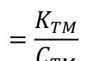

(3)

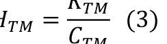

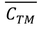

Ở đây: 𝐶𝑇𝑀 là nguồn lực (hoặc chi phí về nguồn lực) được sử dụng trong quá

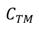

trình hoạt động thương mại.

Bản chất: Hiệu quả kinh tế tương đối

Ưu điểm: đã khắc phục được nhược điểm của cách 1 và cho phép phản ánh hiệu

quả ở nhiều góc độ khác nhau.

Từ biểu thức chung như vậy, có thể thấy, để xác định hiệu quả kinh tế thương

mại, chúng ta cũng có thể sử dụng nhiều phương pháp khác nhau. Trong đó, 2 phương

pháp người ta hay sử dụng là xác định hiệu quả kinh tế thương mại toàn bộ hay đầy đủ

và phương pháp xác định hiệu quả kinh tế thương mại theo nguyên lý cận biên.

Với phương pháp xác định hiệu quả kinh tế thương mại theo nguyên lý cận biên,

chúng ta xác định hiệu quả riêng cho phần được đầu tư, mở rộng. Nguyên lý cận biên là

cơ sở để đưa ra các quyết định đầu tư, sử dụng các yếu tố nguồn lực đầu vào như thế

nào để có hiệu quả cao nhất. Đặc biệt, đây là phương pháp được áp dụng cho đánh
giá hiệu quả thương mại trong quá trình CNH, HĐH thương mại, như những đầu tư về

phát triển nguồn nhân lực, vốn, công nghệ...

a. Hệ thống chỉ tiêu đánh giá hiệu quả kinh tế thương mại

Hệ thống chỉ tiêu đánh giá hiệu quả kinh tế thương mại được cấu thành bởi: Các
chỉ tiêu hiệu quả tổng hợp và các chỉ tiêu hiệu quả bộ phận. Tuy nhiên, tùy từng mục

đích và phạm vi [VERIFY_OCR: vi/vĩ — check PDF trang 130] nghiên cứu mà chúng ta có thể lựa chọn hệ thống các chỉ tiêu đánh giá

hiệu quả kinh tế thương mại phù hợp. Đây là công việc khá phức tạp và đòi hỏi phải có

sự nghiên cứu chuyên sâu gắn với những trường hợp cụ thể. Vì vậy, ở đây, việc trình
bày của tôi chỉ [VERIFY_OCR: chỉ/chí — check PDF trang 130] mang tính giới thiệu cho các anh chị phương pháp luận để các anh chị có

cơ sở để tiếp tục nghiên cứu và xây dựng hệ thống chỉ tiêu đánh giá hiệu quả kinh tế
thương mại trong những trường hợp cụ thể phù hợp với mục đích và phạm vi [VERIFY_OCR: vi/vĩ — check PDF trang 130] nghiên

cứu của mình.

Trong phương pháp luận đánh giá, chúng ta chia hệ thống chỉ tiêu đánh giá hiệu

quả kinh tế thương mại thành: các chỉ tiêu hiệu quả tổng hợp và các chỉ tiêu hiệu quả bộ

phận.

- Chỉ tiêu phản ánh hiệu quả tổng hợp:

𝐻𝑇𝐻= 𝐾𝑇𝐻

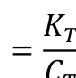

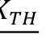

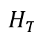

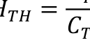

𝐶𝑇𝐻

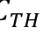

129

<!-- page 131 -->

Trong đó:

𝐻𝑇𝐻: Hiệu quả kinh tế tổng hợp của thương mại

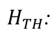

𝐾𝑇𝐻: Kết quả kinh tế của thương mại

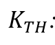

𝐶𝑇𝐻: Nguồn lực (hoặc chi phí nguồn lực) mà nền kinh tế đã bỏ ra đầu tư cho

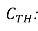

thương mại của quốc gia.

Chỉ tiêu hiệu quả kinh tế tổng hợp phản ánh kết quả (tổng mức lưu chuyển hàng

hóa, GDP, tổng giá trị gia tăng…) mà toàn bộ các hoạt động thương mại của một quốc

gia hay địa phương mang lại trong thời kỳ nghiên cứu (thường là một năm) khi bỏ ra

một đồng nguồn lực hoặc chi phí nguồn lực để đạt được kết quả đó.

Các chỉ tiêu phản ánh hiệu quả bộ phận:

𝐻𝐵𝑃= 𝐾𝐵𝑃

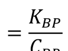

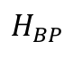

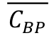

Trong đó:

𝐻𝐵𝑃: Hiệu quả kinh tế bộ phận (lĩnh vực) thương mại được nghiên cứu. Ví dụ:

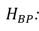

hiệu quả kinh tế thương mại của lĩnh vực xuất khẩu, nhập khẩu…

𝐾𝐵𝑃: Toàn bộ kết quả mà bộ phận (lĩnh vực) thương mại nghiên cứu mang lại

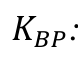

𝐶𝐵𝑃: Nguồn lực (hoặc chi phí nguồn lực) mà nền kinh tế đã bỏ ra đầu tư cho bộ

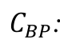

phận (lĩnh vực) thương mại đó

Chỉ tiêu hiệu quả kinh tế bộ phận phản ánh thu nhập mà bộ phận (lĩnh vực) thương

mại nghiên cứu đạt được trong thời kỳ nghiên cứu (thường là một năm) khi bỏ ra một

đồng nguồn lực hoặc chi phí nguồn lực nói chung hoặc của mỗi nguồn lực đã được sử

dụng của nền kinh tế để đạt được kết quả đó.

7.2.3. Nâng cao hiệu quả kinh tế thương mại
a. Các nhân tố ảnh hưởng đến hiệu quả kinh tế thương mại

Để đưa ra được các biện pháp nâng cao hiệu quả kinh tế thương mại, cần xác

định được hiệu quả kinh tế thương mại chịu ảnh hưởng của những nhân tố nào.

Về lý thuyết, có nhiều cách tiếp cận cho câu trả lời này, tuy nhiên, chúng ta có

thể chia thành các nhóm nhân tố khách quan và chủ quan ảnh hưởng đến hiệu quả kinh

tế thương mại.

Với nhóm nhân tố khách quan, có thể chỉ ra: Nhóm các yếu tố mang tính quy luật

của sản xuất hàng hóa, Nhóm các yếu tố thuộc về trình độ và sự phát triển của nền sản

xuất xã hội, Nhóm các yếu tố thuộc về thị trường thương mại quốc tế, Nhóm các yếu tố

thuộc về những tiến bộ khoa học và công nghệ có thể đưa vào ứng dụng trong hoạt động

sản xuất, kinh doanh thương mại.

Với nhóm nhân tố chủ quan, các nhân tố ảnh hưởng có thể là: Nhóm các nhân tố

thuộc về luật pháp, Nhóm các yếu tố thuộc về cơ chế quản lý chung và cơ chế quản lý

thương mại, Nhóm các yếu tố thuộc về điều kiện cơ sở hạ tầng và cơ sở vật chất kỹ thuật

130

<!-- page 132 -->

phát triển thương mại, Nhóm các yếu tố thuộc về trình độ khai thác và sử dụng các

nguồn lực phát triển thương mại.

b. Các biện pháp cơ bản nâng cao hiệu quả kinh tế thương mại

Từ việc xem xét các nhân tố ảnh hưởng này, có thể đưa ra một số giải pháp để

nâng cao hiệu quả kinh tế thương mại.

- Đảm bảo ổn định môi trường kinh tế vĩ [VERIFY_OCR: vĩ/vi — check PDF trang 132] mô để thương mại hoạt động có hiệu

quả

- Tạo điều kiện thuận lợi cho thương mại hội nhập và phát triển trên thị trường

quốc tế

- Xây dựng quy hoạch, chiến lược phát triển thương mại lâu dài làm định hướng

cho các chủ thể hoạt động thương mại trên thị trường.

- Cung cấp đầy đủ, chính xác và kịp thời những thông tin về: Thị trường và

thương mại, các chính sách thương mại, những biến động và xu hướng về môi trường
hoạt động thương mại trong nước và quốc tế…

- Hoàn thiện luật pháp, cơ chế và các chính sách phát triển thương mại

- Chú trọng phát triển nguồn lực lao động và các điều kiện cơ sở hạ tầng, cơ sở

vật chất kỹ thuật, cũng như các nguồn lực khác cho lĩnh vực thương mại.

- Tăng cường quản lý nhà nước về thương mại

- Nâng cao năng lực hoạt động của hệ thống thương nhân
- Khai thác và sử dụng các nguồn lực thương mại tiết kiệm, hiệu quả và theo

hướng bền vững.

7.3. KHAI THÁC VÀ SỬ DỤNG NGUỒN LỰC THƯƠNG MẠI THEO
HƯỚNG PHÁT TRIỂN BỀN VỮNG

7.3.1. Bản chất và những tiêu chí [VERIFY_OCR: chí/chỉ — check PDF trang 132] cơ bản của phát triển bền vững

a. Bản chất của phát triển bền vững

Năm 1980, trong bản “Chiến lược bảo tồn thế giới”, Liên minh Quốc tế Bảo tồn

Thiên nhiên và Tài nguyên Thiên nhiên đã đưa ra mục tiêu của phát triển bền vững là

“đạt được sự phát triển bền vững bằng cách bảo vệ các tài nguyên sinh vật” và thuật ngữ

phát triển bền vững ở đây được đề cập tới với một nội dung hẹp, nhấn mạnh tính bền

vững của sự phát triển về mặt sinh thái, nhằm kêu gọi việc bảo tồn các tài nguyên sinh

vật.

Năm 1987, trong Báo cáo “Tương lai chung của chúng ta”, Ủy ban Thế giới về

Môi trường và Phát triển của Liên hợp quốc định nghĩa "phát triển bền vững" là “phát

triển đáp ứng được nhu cầu của hiện tại mà không làm tổn thương khả năng cho việc
đáp ứng nhu cầu của các thế hệ tương lai”.

Khái niệm phát triển bền vững của Ủy ban Thế giới về Môi trường và Phát triển

của Liên hợp quốc chủ yếu nhấn mạnh khía cạnh sử dụng hiệu quả nguồn tài nguyên

131

<!-- page 133 -->

thiên nhiên và bảo đảm môi trường sống cho con người trong quá trình phát triển. Phát

triển bền vững là mô hình chuyển đổi nhằm tối ưu các lợi ích kinh tế và xã hội trong

hiện tại nhưng không hề gây hại cho tiềm năng, lợi ích trong tương lai.

Nội hàm về phát triển bền vững được tái khẳng định ở Hội nghị Thượng đỉnh

Trái đất về Môi trường và Phát triển tổ chức ở Rio de Janeiro (Brazil) năm 1992 và được

bổ sung, hoàn chỉnh tại Hội nghị Thượng đỉnh thế giới về Phát triển bền vững tổ chức ở

Johannesburg (Cộng hoà Nam Phi) năm 2002: "Phát triển bền vững" là quá trình phát

triển có sự kết hợp chặt chẽ, hợp lý và hài hòa giữa 3 mặt của sự phát triển, gồm: phát

triển kinh tế (tăng trưởng kinh tế), phát triển xã hội (thực hiện tiến bộ, công bằng xã hội;

xoá đói giảm nghèo và giải quyết việc làm) và bảo vệ môi trường (xử lý, khắc phục ô

nhiễm, phục hồi và cải thiện chất lượng môi trường; phòng chống cháy và chặt phá rừng;

khai thác hợp lý và sử dụng tiết kiệm tài nguyên thiên nhiên).

Khái niệm về phát triển bền vững dần được hình thành từ thực tiễn đời sống xã
hội và có tính tất yếu. Tư duy về phát triển bền vững bắt đầu từ việc nhìn nhận tầm quan

trọng của bảo vệ môi trường, là nhận ra sự cần thiết phải giải quyết những bất ổn trong

xã hội. Năm 1992, Hội nghị thượng đỉnh về Môi trường và Phát triển của Liên hợp quốc

được tổ chức ở Rio de Janeiro đề ra Chương trình nghị sự toàn cầu cho thế kỷ 21, theo

đó, phát triển bền vững được xác định là: “sự phát triển thỏa mãn những nhu cầu của thế

hệ hiện tại mà không làm hại đến khả năng đáp ứng những nhu cầu của thế hệ tương
lai”.

Về nguyên tắc, phát triển bền vững là quá trình vận hành đồng thời ba bình diện

phát triển: kinh tế tăng trưởng bền vững, xã hội thịnh vượng, công bằng, ổn định, văn
hoá đa dạng và môi trường được trong lành, tài nguyên được duy trì bền vững. Do vậy,
hệ thống hoàn chỉnh các nguyên tắc đạo đức cho phát triển bền vững bao gồm các

nguyên tắc phát triển bền vững trong cả “ba thế chân kiềng” kinh tế, xã hội, môi trường.

b. Những tiêu chí [VERIFY_OCR: chí/chỉ — check PDF trang 133] cơ bản của phát triển bền vững

Sự phát triển bền vững phải đồng thời đạt được 3 tiêu chí [VERIFY_OCR: chí/chỉ — check PDF trang 133] cơ bản sau:

Thứ nhất, phát triển bền vững về kinh tế là phát triển nhanh, an toàn và chất

lượng. Phát triển bền vững về kinh tế đòi hỏi sự phát triển của hệ thống kinh tế, trong

đó cơ hội để tiếp xúc với những nguồn tài nguyên được tạo điều kiện thuận lợi và quyền

sử dụng những nguồn tài nguyên thiên nhiên cho các hoạt động kinh tế được chia sẻ một

cách bình đẳng. Yếu tố được chú trọng ở đây là tạo ra sự thịnh vượng chung cho tất cả

mọi người, không chỉ tập trung mang lại lợi nhuận cho một số ít, trong một giới hạn cho

phép của hệ sinh thái cũng như không xâm phạm những quyền cơ bản của con người.

Khía cạnh phát triển bền vững về kinh tế gồm một số nội dung cơ bản: Một là,

giảm dần mức tiêu phí năng lượng và các tài nguyên khác thông qua công nghệ tiết kiệm

và thay đổi lối sống; Hai là, thay đổi nhu cầu tiêu thụ không gây hại đến đa dạng sinh

132

<!-- page 134 -->

học và môi trường; Ba là, bình đẳng trong tiếp cận các nguồn tài nguyên, mức sống,

dịch vụ y tế và giáo dục; Bốn là, xóa đói, giảm nghèo tuyệt đối; Năm là, công nghệ sạch

và sinh thái hóa công nghiệp (tái chế, tái sử dụng, giảm thải, tái tạo năng lượng đã sử

dụng).

Nền kinh tế được coi là bền vững cần đạt được những yêu cầu sau: (1) Có tăng

trưởng GDP và GDP đầu người đạt mức cao. Nước phát triển có thu nhập cao vẫn phải

giữ nhịp độ tăng trưởng, nước càng nghèo có thu nhập thấp càng phải tăng trưởng mức

độ cao. Các nước đang phát triển trong điều kiện hiện nay cần tăng trưởng GDP vào

khoảng 5%/năm thì mới có thể xem có biểu hiện phát triển bền vững về kinh tế. (2) Cơ

cấu GDP cũng là tiêu chí [VERIFY_OCR: chí/chỉ — check PDF trang 134] đánh giá phát triển bền vững về kinh tế. Chỉ [VERIFY_OCR: chỉ/chí — check PDF trang 134] khi tỷ trọng công

nghiệp và dịch vụ trong GDP cao hơn nông nghiệp thì tăng trưởng mới có thể đạt được

bền vững. (3) Tăng trưởng kinh tế phải là tăng trưởng có hiệu quả cao, không chấp nhận

tăng trưởng bằng mọi giá.

Thứ hai, phát triển bền vững về xã hội được đánh giá bằng các tiêu chí [VERIFY_OCR: chí/chỉ — check PDF trang 134] như: Chỉ

số phát triển con người (HDI), hệ số bình đẳng thu nhập, các chỉ tiêu về giáo dục, y tế,

phúc lợi xã hội, hưởng thụ văn hóa. Ngoài ra, bền vững về xã hội là sự bảo đảm đời sống

xã hội hài hòa; có sự bình đẳng giữa các giai tầng trong xã hội, bình đẳng giới; mức độ

chênh lệch giàu nghèo không quá cao và có xu hướng gần lại; chênh lệch đời sống giữa

các vùng miền không lớn.

Công bằng xã hội và phát triển con người, chỉ số HDI là tiêu chí [VERIFY_OCR: chí/chỉ — check PDF trang 134] cao nhất về phát

triển xã hội, bao gồm: thu nhập bình quân đầu người; trình độ dân trí, giáo dục, sức

khỏe, tuổi thọ, mức hưởng thụ về văn hóa, văn minh.

Phát triển bền vững về xã hội chú trọng vào sự công bằng và xã hội luôn cần tạo
điều kiện thuận lợi cho lĩnh vực phát triển con người và cố gắng cho tất cả mọi người

cơ hội phát triển tiềm năng bản thân và có điều kiện sống chấp nhận được. Phát triển

bền vững về xã hội gồm một số nội dung chính: Một là, ổn định dân số, phát triển nông

thôn để giảm sức ép di dân vào đô thị; Hai là, giảm thiểu tác động xấu của môi trường

đến đô thị hóa; Ba là, nâng cao học vấn, xóa mù chữ; Bốn là, bảo vệ đa dạng văn hóa;

Năm là, bình đẳng giới, quan tâm tới nhu cầu và lợi ích giới; Sáu là, tăng cường sự tham

gia của công chúng vào các quá trình ra quyết định.

Thứ ba, phát triển bền vững về môi trường. Quá trình công nghiệp hóa, hiện đại

hóa, phát triển nông nghiệp, du lịch; quá trình đô thị hóa, xây dựng nông thôn mới,...

đều tác động đến môi trường và gây ảnh hưởng tiêu cực đến môi trường, điều kiện tự

nhiên. Bền vững về môi trường là khi sử dụng các yếu tố tự nhiên đó, chất lượng môi
trường sống của con người phải được bảo đảm. Đó là bảo đảm sự trong sạch về không

khí, nước, đất, không gian địa lý, cảnh quan. Chất lượng của các yếu tố trên luôn cần

133

<!-- page 135 -->

được coi trọng và thường xuyên được đánh giá kiểm định theo những tiêu chuẩn quốc

gia hoặc quốc tế.

Khai thác và sử dụng hợp lý tài nguyên thiên nhiên, bảo vệ môi trường và cải

thiện chất lượng môi trường sống. Phát triển bền vững về môi trường đòi hỏi chúng ta

duy trì sự cân bằng giữa bảo vệ môi trường tự nhiên với sự khai thác nguồn tài nguyên

thiên nhiên phục vụ lợi ích con người nhằm mục đích duy trì mức độ khai thác những

nguồn tài nguyên ở một giới hạn nhất định cho phép môi trường tiếp tục hỗ trợ điều kiện

sống cho con người và các sinh vật sống trên trái đất.

Phát triển bền vững về môi trường gồm những nội dung cơ bản sau: Một là, sử

dụng có hiệu quả tài nguyên, đặc biệt là tài nguyên không tái tạo; Hai là, phát triển không

vượt quá ngưỡng chịu tải của hệ sinh thái; Ba là, bảo vệ đa dạng sinh học, bảo vệ tầng

ôzôn; Bốn là, kiểm soát và giảm thiểu phát thải khí nhà kính; Năm là, bảo vệ chặt chẽ

các hệ sinh thái nhạy cảm; Sáu là, giảm thiểu xả thải, khắc phục ô nhiễm (nước, khí, đất,
lương thực thực phẩm), cải thiện và khôi phục môi trường những khu vực ô nhiễm...

7.3.2. Sự cần thiết của việc khai thác và sử dụng nguồn lực thương mại theo

hướng phát triển bền vững

a. Sự cần thiết của việc khai thác và sử dụng nguồn lực thương mại theo hướng

phát triển bền vững

Việc khai thác và sử dụng nguồn lực thương mại theo hướng phát triển bền vững
là sự cần thiết khách quan xuất phát từ 3 lý do cơ bản:

- Thứ nhất, các nguồn lực nói chung và các nguồn lực trong thương mại nói riêng

là có giới hạn, do đó đặt ra yêu cầu cần thiết phải được khai thác hợp lý và sử dụng tiết
kiệm, có hiệu quả.

- Thứ hai, chúng ta đều nhận thức được rằng, trong bối cảnh toàn cầu hóa và hội

nhập, việc di chuyển các nguồn lực giữa các quốc gia ngày càng trở nên thuận lợi. Mặc

dù các nguồn lực bên ngoài có vai trò rất quan trọng đối với quá trình phát triển thương

mại, song các nguồn lực này cũng có thể gây ra sự không ổn định, gia tăng phụ thuộc

vào bên ngoài và gây mất cần đối trong quá trình phát triển.

- Cuối cùng, việc khai thác các nguồn lực nếu không có quy hoạch và kế hoạch

có thể làm tổn hại đến sự phát triển của các thế hệ tương lai, đặc biệt là đối với các

nguồn lực tự nhiên, nguồn lực từ bên ngoài...

b. Những nguyên tắc cơ bản của việc khai thác và sử dụng nguồn lực thương

mại theo hướng phát triển bền vững

- Nguyên tắc khai thác mọi nguồn lực có thể; đặc biệt là nguồn lực vô hình để
phát triển thương mại. Ví dụ: Thay vì sử dụng dầu, xăng để chạy xe máy và xe ô tô thì

có thể sử dụng xe điện với điện đó được sản xuất từ năng lượng mặt trời, gió…

- Nguyên tắc kết hợp sử dụng hợp lý nguồn lực trong nước với nguồn lực bên

134

<!-- page 136 -->

ngoài. Ví dụ: áp dụng công nghệ xử lý chất thải của Nhật Bản hoặc các nước tiên tiến

khác tại Việt Nam

- Nguyên tắc khai thác các nguồn lực không gây cạn kiệt và suy thoái môi trường.

Việc khai thác tối đa các nguồn lực để phát triển thương mại phải được tính đến khả

năng không gây tổn hại đến sự phát triển của các thế hệ trong tương lai. Nhiều nguồn

lực trong thực tế nếu việc khai thác không có quy hoạch và kế hoạch có thể đe dọa đến

nguy cơ làm cạn kiệt nguồn tài nguyên và suy thoái môi trường gây trở ngại đến sự phát

triển của các thế hệ tương lai, đặc biệt là các nguồn lực liên quan đến sử dụng các điều

kiện tự nhiên, địa lý, nguồn nước…

- Nguyên tắc thứ tư là đảm bảo tính hiệu quả trong quá trình sử dụng các nguồn

lực

Câu hỏi ôn tập chương 7
Câu 1. Trình bày bản chất và các phân loại nguồn lực thương mại? Ý nghĩa của

việc nhận thức vấn đề này trong khai thác và sử dụng nguồn lực thương mại ở nước ta

hiện nay?

Câu 2. Phân tích vai trò của nguồn lực thương mại? Liên hệ thực tiễn vai trò của

nguồn lực thương mại ở nước ta hiện nay?

Câu 3. Phân tích bản chất, vai trò và cấu thành các nguồn lực: Nguồn lực lao
động; Nguồn lực tài chính; Cơ sở hạ tầng và cơ sở vật chất kỹ thuật trong phát triển

thương mại? Chính sách phát triển cho mỗi nguồn lực này?

Câu 4. Trình bày các nhân tố ảnh hưởng và giải pháp cơ bản nâng cao hiệu quả
kinh tế thương mại? Liên hệ thực tiễn vấn đề này trong điều kiện nước ta hiện nay?

Tổng kết chương 7

+ Ở nội dung thứ nhất - “Nguồn lực thương mại” đề cập đến; bản chất nguồn lực

thương mại, tiêu chí [VERIFY_OCR: chí/chỉ — check PDF trang 136] phân loại nguồn lực thương mại cũng như vai trò của nguồn lực

thương mại với sự phát triển kinh tế xã hội; giới thiệu một số nguồn lực chủ yếu như

nguồn nhân lực, nguồn lực tài chính, nguồn lực cơ sở hạ tầng và cơ sở vật chất kỹ thuật

thương mại.

+ Ở nội dung thứ hai - “Hiệu quả kinh tế thương mại” đề cập tới: bản chất của

hiệu quả kinh tế thương mại, phân loại hiệu quả kinh tế thương mại, phương pháp và hệ

thống chỉ tiêu xác định hiệu quả kinh tế thương mại. Từ việc xác định các nhóm nhân tố

ảnh hưởng đến hiệu quả kinh tế thương mại, định hướng một số biện pháp cơ bản nâng
cao hiệu quả kinh tế thương mại.

+ Trong nội dung thứ ba - “Khai thác và sử dụng nguồn lực thương mại theo

hướng phát triển bền vững” chỉ rõ bản chất của phát triển bền vững cũng như một số

135

<!-- page 137 -->

nguyên tắc cần tuân thủ trong khai thác và sử dụng nguồn lực theo hướng phát triển bền

vững.

Một số thuật ngữ

1. Nguồn lực thương mại

2. Nhân lực thương mại

3. Nguồn lực tài chính phát triển thương mại

4. Cơ sở vật chất kỹ thuật thương mại

5. Hiệu quả kinh tế thương mại

6. Phát triển bền vững.

136
