<!-- page 1 -->

1/26/26, 8:59 PM TMU - Onschool
Nguyên lý thống kê/ Bài kiểm tra
Bạn đã hoàn thành bài kiểm tra
Bạn đã hoàn thành bài kiểm tra
Đã làm: 40/40 câu
Điểm Trắc nghiệm: 31.00 / 40.00 đ
Tổng điểm: 31.00 / 40.00 đ
Điểm hệ số 10: 7/75/10
Tổng thời gian làm bài: 0 giờ 9 phút 26 giây
Thời gian bắt đầu: 19:07:22 - 05/12/2025
Thời gian kết thúc: 19:16:48 - 05/12/2025
Phản hồi: Chúc mừng bạn. Bạn đã hoàn thành bài khá tốt. Hãy cố gắng hơn nhé.
hftps://dttx.tmu.edu.vn/my-courses/428995/test/?id=515234&status=finished 1/20

<!-- page 2 -->

1/26/26, 8:59 PM TMU - Onschool
Cau 1: 1/1 điểm
Chi tiêu thống kê phan ánh các đặc điểm sau day?
® A. Đặc điểm về mặt lượng trong mối quan hệ mật thiết với mặt chất của hiện
tượng số lớn trong những điều kiện thời gian và không gian cụ thé.
@ Đáp án chính xác
© B. Đặc điểm về mặt lượng của tổng thé chung.
© C. Đặc diém của từng đơn vị tổng thé.
© D. Đặc điểm của toàn bộ đơn vị tổng thé.
Cầu 2: 1/1 điểm
Dự đoán thống kê là?
© A. Tinh toán mức độ của hiện tượng trong tương lai.
@ dép an chinh xác
C B. Sự tập trung, hệ thống hóa tài liệu thu thập được qua điều tra.
© C. Xử lý tài liệu thu thập được trong điều tra thống kê.
O D. Toàn bộ quá trình nghiên cứu thống kê.
Cầu 3: 1/1 điểm
Trong quá trình nghiên cứu thống kê, giai đoạn nào biểu hiện tập trung kết quả của
toàn bộ quá trình nghiên cứu thống kê ?
© A. Tổng hợp thống kê.
hftps://dttx.tmu.edu.vn/my-courses/428995/test/?id=515234&status=finished 2/20

<!-- page 3 -->

1/26/26, 8:59 PM TMU - Onschool

© B. Điều tra thống kê.

© C. Chuẩn bị.

© D. Phân tích và dự báo thống kê.

báo an chinh xac

Câu 4: 1/1 điểm

Dé đo lường sự hài lòng của khách hàng về một loại sản [VERIFY_OCR: sản/sàn — check PDF trang 3] pham (rất hai lòng, hài lòng,

không hài lòng, rất không hài lòng...) ta sử dụng thang đo nào sau đây?

© A. Thang đo tỷ lệ.

© B. Thang đo khoảng.

© C. Thang đo thứ bac.

@ Đáp án chính xác

© D. Thang đo định danh.

Cầu Š: 1/1 điểm

Căn cứ vào chuyên ngành đào tạo, tổng thé nào sau đây là tổng thể KHÔNG đồng

chất?

© A. Tổng thé là những sinh viên tốt nghiệp ngành dược.

8. Tổng thé là những sinh viên tốt nghiệp chuyên ngành kỹ thuật.

© C. Tổng thé những sinh viên tốt nghiệp chuyên ngành kinh tế.

© D. Tổng thé những sinh viên tốt nghiệp đại học.
hftps://dttx.tmu.edu.vn/my-courses/428995/test/?id=515234&status=finished 3/20

<!-- page 4 -->

1/26/26, 8:59 PM TMU - Onschool
báo an chính xác
Cau 6: 1/1 điểm
Nguyên tắc đề xây dựng hệ thống chỉ tiêu thống kê là gì?
A. Căn cứ vào mục đích nghiên cứu; tính chất, đặc điểm của đối tượng nghiên
© cứu; căn cứ vào khả năng thực tế cho phép dé tiến hành thu thập tổng hợp các
chỉ tiêu.
báo an chinh xac
© B. Căn cứ vào mối liên hệ của tổng thé với hiện tượng khác.
© C. Căn cứ vào mặt quan trọng nhất của đơn vị tổng thé.
© D. Căn cứ vào tiêu thức nghiên cứu.
Câu 7: 1/1 điểm
Căn cứ vào giới tính, tổng thé nào sau đây là tổng thé đồng chất?
© A. Tổng thé là những sinh viên tốt nghiệp chuyên ngành kỹ thuật.
© B. Tổng thé những sinh viên nam tốt nghiệp chuyên ngành kinh tế.
báo an chính ác
© C. Tổng thé là những sinh viên tốt nghiệp ngành dược.
© D. Tổng thé những sinh viên tốt nghiệp đại học.
Câu 8:
hftps://dttx.tmu.edu.vn/my-courses/428995/test/?id=515234&status=finished 4/20

<!-- page 5 -->

1/26/26, 8:59 PM TMU - Onschool
Loại câu hỏi nào được dùng dé xác định đối tượng khảo sát có thuộc phahAVF nao
sát hay không?
© A. Câu hỏi lọc.
@ Đáp án chính xác
© B. Câu hỏi đóng.
© C. Câu hỏi tâm lý.
© D. Cau hỏi chức năng.
Câu 9: 1/1 điểm
Trong điều tra chọn mẫu, loại sai số nào dưới đây có thé xảy ra?
© A. Sai số khi chọn các đơn vị tổng thé chung.
© B. Sai số khi xác định tổng thé chung.
© C. Sai số do ghi chép và do tính chất đại biểu.
@ Đáp án chính xác
© D. Sai số khi chọn số lượng đơn vị của tổng thé chung
Cầu 10: 1/1 điểm
Những yêu cầu cơ bản của điều tra thống kê?
© A. Nhanh chóng, chính xác, tiết kiệm.
© B. Phong phú, chính xác, đầy đủ.
hftps://dttx.tmu.edu.vn/my-courses/428995/test/?id=515234&status=finished 5/20

<!-- page 6 -->

1/26/26, 8:59 PM TMU - Onschool
© C. Chính xác, kịp thời, đầy đủ.
báo an chính ác
© D. Kip thời, đầy đủ, phong phú.
Cầu 11: 1/1 điểm
Phương pháp thu thập thông tin qua việc trực tiếp cân đong, đo đếm và ghi chép vào
phiếu điều tra được gọi là phương pháp gì?
© A. Phương pháp phỏng van.
© B. Phỏng vấn gián tiếp.
© C. Phương pháp đăng ký trực tiếp.
báo an chinh xac
© D. Phỏng vấn trực tiếp.
Cầu 12: 1/1 điểm
Dé điều tra chiều cao của sinh viên trong một trường đại học, sử dụng phương pháp
nào hạn chế sai số nhất ?
© A. Phỏng vấn trực tiếp.
© B. Phỏng van gián tiếp.
© C. Phương pháp phỏng van.
© D. Phương pháp đăng ký trực tiếp.
@ Đáp án chính xác
hftps://dttx.tmu.edu.vn/my-courses/428995/test/?id=515234&status=finished 6/20

<!-- page 7 -->

1/26/26, 8:59 PM TMU - Onschool
Cau 13: 1/1 điểm
Điều tra về phương pháp học tập của các sinh viên đại học thuộc loại điều tra nào?
© A. Chuyên đề
@ Đáp án chính xác
© B. Toàn bộ
© C. Trọng điểm
© D. Chọn mẫu
Cau 14: 1/1 điểm
Đề điều tra chất lượng sản phẩm đồ hộp trong một xí nghiệp cần sử dụng loại điều tra
nào ?
© A. Điều tra chọn mẫu.
@ Đáp án chính xác
© B. Điều tra chuyên dé.
© C. Điều tra trọng điểm.
© D. Điều tra chuyên môn.
Câu 1Š: 0/1 điểm
hftps://dttx.tmu.edu.vn/my-courses/428995/test/?id=515234&status=finished 7/20

<!-- page 8 -->

1/26/26, 8:59 PM TMU - Onschool
Trong điều tra xã hội hoc, hoạt động điều tra về tam gương người tốt, việc tốt thuộc
loại điều tra nào?
© A. Chuyên đề
© B. Chọn mẫu
© C. Trọng điểm
@ Đáp án chưa chính xác
© D. Toàn bộ
Câu 16: 1/1 điểm
Công thức xác định khoảng cách tô đều nhau:
h= ơn — Ẩm
nm
Xmin ky hiệu cho đại lượng nao?
© A. Giá trị ít gặp nhất
© B. Lượng biến nhỏ nhất trong tổng thé
@ dép an chính ác
© C. Trị số khoảng cách tổ.
© D. Lượng biến nhỏ nhất của một tổ
Câu 17: 1/1 điểm
Lượng biến là gì ?
hftps://dttx.tmu.edu.vn/my-courses/428995/test/?id=515234&status=finished 8/20

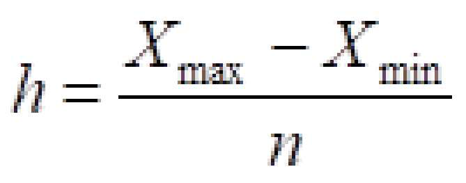

<!-- page 9 -->

1/26/26, 8:59 PM TMU - Onschool
© A. Biểu hiện của tiêu thức thuộc tính
© B. Số đơn vị trong tổng thé.
© C. Biểu hiện của tiêu thức số lượng
@ báo án chính ác
© D. Tỷ trọng của các tổ trong tổng thé
Cầu 18: 1/1 điểm
Trị số chênh lệch giữa giới hạn trên và giới hạn dưới của mỗi tổ gọi là gì?
© A. Trị số dưới.
© B. Trị số trên.
© C. Trị số giữa
© D. Trị số khoảng cách tổ.
@ Đáp án chính xác
Cầu 19: 1/1 điểm
Phân t6 có khoảng cách tổ đều nhau có đặc điểm là?
© A. Có ít nhất hai tổ có trị số khoảng cách tổ bằng nhau
© B. Tất cả các trị số khoảng cách tổ phải bằng nhau
báo an chinh xác
© C. Mỗi tổ là một lượng biến nhất định
hftps://dttx.tmu.edu.vn/my-courses/428995/test/?id=515234&status=finished 9/20

<!-- page 10 -->

1/26/26, 8:59 PM TMU - Onschool
© D. Tổ trên hoặc dưới bị thiếu một giới han
Câu 20: 1/1 diém
Thực hiện phân tổ nào dé phản ánh kết cấu của tổng thé nghiên cứu?
© A. Phân té phân loại.
© B. Phân tổ liên hệ.
© C. Phân tổ kết cấu.
@ Đáp án chính xác
© D. Phân tổ giản đơn.
Cầu 21: 1/1 điểm
Đại lượng nào dùng dé phản ánh tỷ trọng của các tổ?
© A. Tần suất
báo an chinh xác
© B. Tàn số
© C. Lượng biến
© D. Tần số tích lũy tiền
Cau 22: 1/1 điểm
hftps://dttx.tmu.edu.vn/my-courses/428995/test/?id=515234&status=finished 10/20

<!-- page 11 -->

1/26/26, 8:59 PM TMU - Onschool

Trên đồ thị liên hệ dé biểu hiện mối liên hệ giữa 2 tiêu thức nguyên nhân và tiêu thức

kết quả. Trục hoành của đồ thị thường biểu hiện trị số của tiêu thức nào?

© A. Tiêu thức số lượng.

© B. Tiêu thức kết quả.

© C. Tiêu thức chất lượng.

© D. Tiêu thức nguyên nhân.

báo an chính xác

Câu 23: 0/1 điểm

Khi phân tô có khoảng cách tổ, các tổ được hình thành dựa trên mối liên hệ nào dưới

đây?

© A. Lượng và chat.

© B. Số lượng và nội dung.

@ Đáp án chưa chính xác

© C. Chất lượng và nội dụng

© D. Nguyên nhân và kết quả.

Cau 24: 1/1 điểm

Khi tiến hành phân tổ cần thực hiện day đủ những bước cơ bản nào?

© A. Lựa chọn tiêu thức phân tổ.

© B. Xác định số tổ và khoảng cách tô.
hftps://dttx.tmu.edu.vn/my-courses/428995/test/?id=515234&status=finished 11/20

<!-- page 12 -->

1/26/26, 8:59 PM TMU - Onschool
© C. Lựa chon tiêu thức phân tổ, xác định số tỗ và khoảng cách tổ, xác định chỉ tiêu
giải thích.
báo an chính xác
© D. Xác định chỉ tiêu giải thích.
Câu 25: 0/1 điểm
Căn cứ nao dé xác định mục đích tông hợp ?
© A. Nội dung điều tra.
© B. Mục đích nghiên cứu
© C. Bối tượng điều tra.
© D. Mục dich điều tra.
@ Đáp án chưa chính xác
Câu 26: 1/1 điểm
Dé xác định vị trí của một đơn vị trong tỗng thê thì dựa vào đại lượng nào?
© A. Tan suất
© B. Tần số tích lũy tiến
@ báo an chính sác
© c. Tần số
© D. Lượng biến
hftps://dttx.tmu.edu.vn/my-courses/428995/test/?id=515234&status=finished 12/20

<!-- page 13 -->

1/26/26, 8:59 PM TMU - Onschool

Cau 27: 1/1 điểm

Trong một tổng thé hay trong một day số phan phối, biéu hiện của tiêu thức được gap

nhiều nhất được gọi là gì ?

© A. Số trung vị.

© B. Số trung bình điều hoà.

© C. Số trung bình cộng.

© D. Mốt.

báo an chính xác

Câu 28: 1/1 điểm

Trong các đặc điểm sau, đặc diém nao KHÔNG phải là của số trung bình?

© A. San bằng mọi chênh lệch thực tế giữa các don vị cá biệt.

© B. Phản ánh mức độ đồng đều của tổng thé

báo an chính xác

O C. Mang tinh tổng hợp va khái quát cao.

© D. Nêu lên mức độ đại diện của một tổng thé theo một tiêu thức nào đó.

Cau 29: 1/1 điểm

Số trung bình cộng của bình phương các độ lệch giữa lượng biến với số trung bình

của các lượng biến đó được gọi là gì ?
hftps://dttx.tmu.edu.vn/my-courses/428995/test/?id=515234&status=finished 13/20

<!-- page 14 -->

1/26/26, 8:59 PM TMU - Onschool
© A. Độ lệch tuyệt đối.
© B. Phương sai.
@ báo an chính xac
© C. Độ lệch tiêu chuẩn.
© D. Khoảng biến thiên.
Cầu 30: 1/1 điểm
Đề tính Trung vị trong trường hợp có tài liệu thống kê như sau ta sử dụng công thức
nào?
35 - 40
40 - 45
45 - 50
50 - 60
60 - 80
A. —
O * My =55 th Gf) —
Œ;-/)+Œ—#2)
B.
O M, _ Xn + et
2
C.
© Eh.
M, =x,,, th—2—_
Su,
báo an chính ác
D. _
O M,= x, +h_—_™—™)__ m)
(m, —m,)+(m, —m,)
https://dttx.tmu.edu.vn/my-courses/128995/test/?id=5 15234 &status=finished 14/20

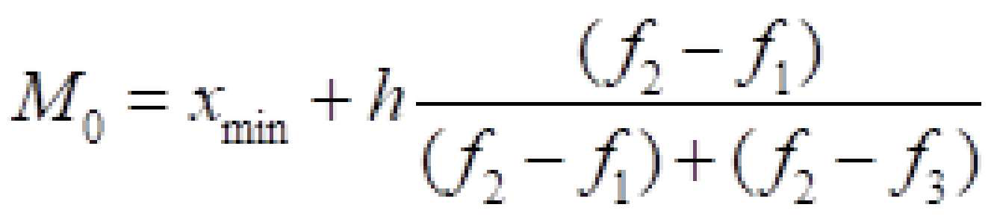

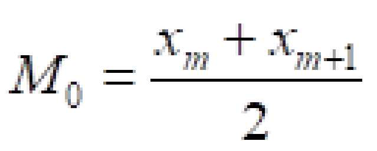

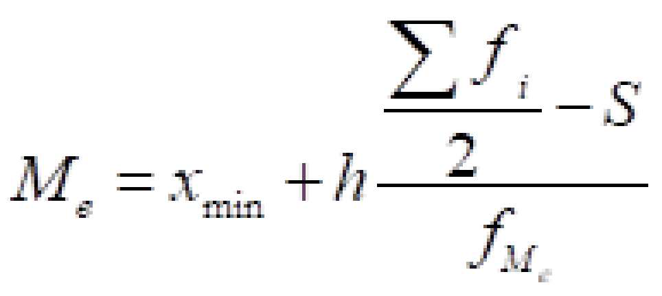

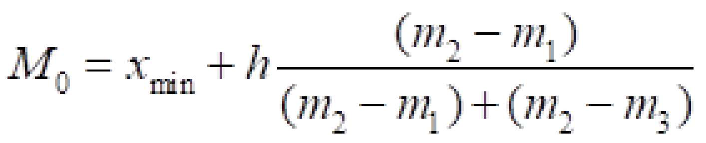

<!-- page 15 -->

1/26/26, 8:59 PM TMU - Onschool

Cau 31: 0/1 điểm
Công thức nào được sử dung để tính phương sai trong trường hợp tài liệu không
phân tổ?

A. " -
O S"Œœ,-z}Ÿ

o -
n
B. a ¬
5Œ, —x) ⁄
© o =
DA
m
@ Đáp án chưa chính xác
n

Cau 32: 1/1 điểm
Tinh hình sản xuất của một công ty như sau:

[Chu «Phang | Thang? [Than 5 |

[Gia tị sản xuất (riệu đồng) TT [3008 [320m [3.380 |

| Số sông nhân trung bình trong các tháng (người) |302 [304 [306 |
Tính năng suất lao động trung bình của một công nhân trong tháng 3.
© A. 10,947 triệu đồng/người.

báo an chinh xác
© B. 10,82 triệu đồng/người.
© C. 109,6 triệu đồng/người.
© D. 109,9 triệu đồng/người.

hftps://dttx.tmu.edu.vn/my-courses/428995/test/?id=515234&status=finished 15/20

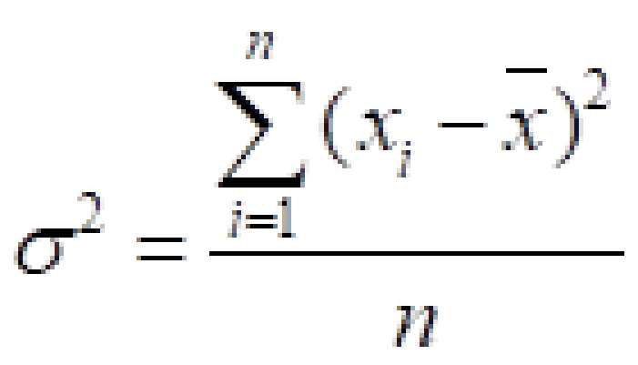

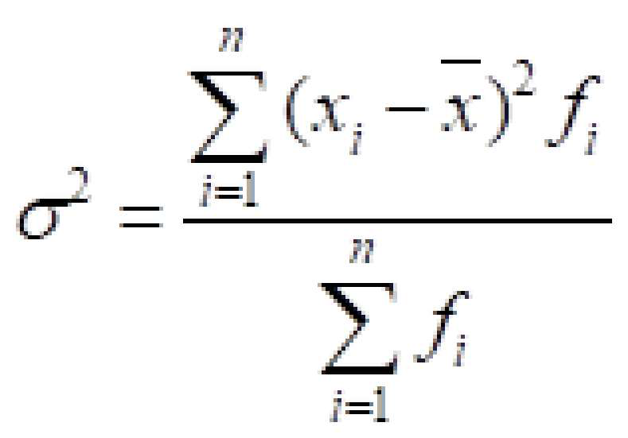

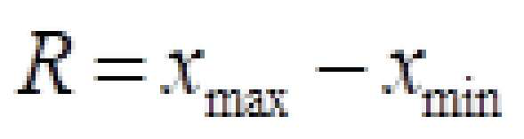

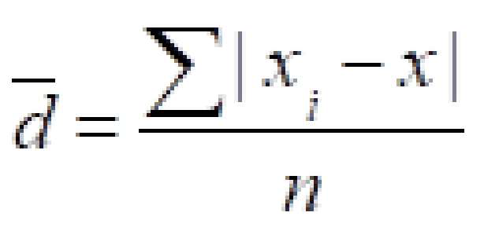

<!-- page 16 -->

1/26/26, 8:59 PM TMU - Onschool
Cau 33: 0/1 điểm
Đề tính Mốt trong trường hợp có tài liệu thống kê như sau ta sử dụng công thức nào?
35 - 40
40 - 45
45 - 50
50 - 60
60 - 80
A.
M, =x,,, +h—2——_
Fu,
@ Đáp án chưa chính xác
B. —
O Mạ= XuỤth—Œ5—m — mm)
(mm, — mị )+ (mạ — mụ)
C. —
O Ms Gf) —
Œ-)+Œ-#)
Câu 34: 1/1 điểm
Trong những chỉ tiêu sau, chỉ tiêu nào phản ánh sự biến động tuyệt đối?
© A. Năm 2022 vốn lưu động tăng 200 triệu đồng so với năm 2020.
@ Đáp án chính xác
© B. Bình quân mỗi năm vốn lưu động tăng 25%.
© C. Năm 2022, vốn lưu động của công ty bằng 150% so với năm 2020.
O D. Năm 2022, vốn lưu động của công ty tăng 50% so với năm 2020.
hftps://dttx.tmu.edu.vn/my-courses/428995/test/?id=515234&status=finished 16/20

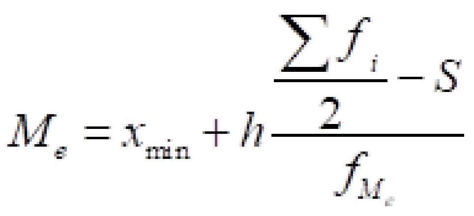

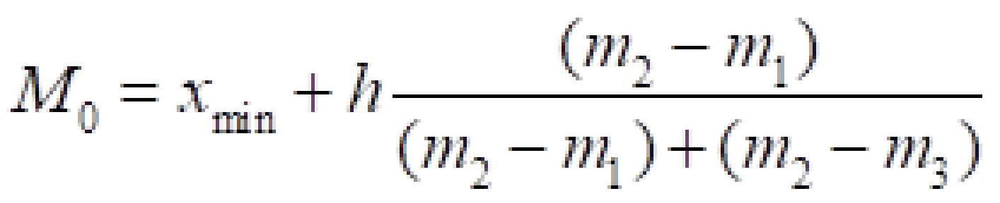

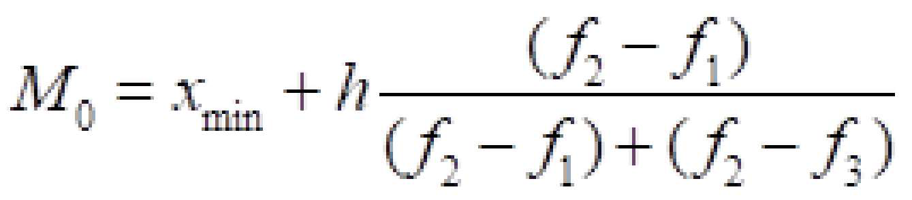

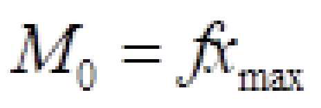

<!-- page 17 -->

1/26/26, 8:59 PM TMU - Onschool

Cầu 3Š: 0/1 điểm
Tình hình sản xuất của một công ty như sau:

[Chậu [Thámgr[Thăngz [Tháng 3|

[is trị sân xuất (bu đông) —— |3000 [320m [335p —

Số sông nhân trung binh trong các tháng | 302 [304 [306
Năng suất lao động trung bình của một công nhân 1 tháng trong quý |
© A. 10,82 triệu đồng/người.
© B. 10,96 triệu đồng/người.

@ Đáp án chưa chính xác
O C. 10,47 triệu đồng/người.
© D. 10,99 triệu đồng/người.
Câu 36: 1/1 điểm
Có tài liệu thống kê trong doanh nghiệp như sau:
ma na
Tổng sản lượng vải loại 1 | Tỷ lệ % Tổng Tỷ lệ % vải loại 1
(1000 m) vải loại 1 | sản lượng
vải loại 1
(1000 m)
Tính tỷ lệ so sánh sản lượng vải loại 1 trong 6 tháng phân xưởng B so với phân xưởng
A.
© A. 0,65 lần.
© B. 1,65 lần.
© C. 1,54 lần.
hftps://dttx.tmu.edu.vn/my-courses/428995/test/?id=515234&status=finished 17/20

<!-- page 18 -->

1/26/26, 8:59 PM TMU - Onschool
báo an chinh xác
© D. 0,68 lần.
Cau 37: 1/1 diém
Có tài liệu về doanh thu bán hang hóa của một cửa hang như sau:
Kế hoạch doanh thu | % Thực tế doanh thu | %
(triệu đồng) HTKH | (triệu đồng) HTKH
8B |fø0G  |985 |1.800 103.4 |
Tính tỷ lệ % hoàn thành kế hoạch bình quan về mức doanh thu ở cửa hang trên trong
quý II.
© A. 103%.
© B. 102,5%.
© C. 101,8%.
báo an chinh xác
© D. 101,5%.
Cau 38: 0/1 điểm
Có tài liệu về doanh thu bán hàng hóa của một cửa hàng như sau:
Kế hoạch doanh thu (triệu | % Thực tế mức doanh thu (triệu | %
đồng) HTKH đồng) HTKH
A 2.000 402 2.200 99
hftps://dttx.tmu.edu.vn/my-courses/428995/test/?id=515234&status=finished 18/20

<!-- page 19 -->

1/26/26, 8:59 PM TMU - Onschool
mm. 4 4 "II
Tinh tỷ lệ % hoàn thành kế hoạch trung bình về doanh thu ở cửa hàng trên trong quý I.
© A. 100,5%.
O B. 100,65%.
© C. 101%.
@ Đáp án chưa chính xác

O D. 98,8%.
Cau 39: 0/1 điểm
Có tài liệu thống kê trong doanh nghiệp như sau:

JHa AM r1

Tổng sản lượng vải loại 1 | Tỷ lệ Tổng sản lượng vải | Tỷ lệ % vải
(1000 m) % vải | loại 1 loại 1
loại 1 (1000 m)
Tính tỷ lệ so sánh sản lượng vải loại 1 trong 6 tháng phân xưởng A so với phân xưởng
B.
© A. 0,68 lần.
@ Đáp án chưa chính xác
© B. 0,65 lan.
© C. 1,54 lan.
© D. 1,65 lần.
https://dttx.tmu.edu.vn/my-courses/128995/test/?id=5 15234 &status=finished 19/20

<!-- page 20 -->

1/26/26, 8:59 PM TMU - Onschool
Cau 40: :
0/1 điểm
Công thức sau đây sử dụng trong trường hợp có dữ liệu nào?
aa a :
xã
© A. Tần số.
© B. Tổng lượng biến và tần sé.
@ Đáp án chưa chính xác
© C. Tổng lượng biến và lượng biến.
© D. Tỷ trọng của tổng lượng biến.
hftps://dttx.tmu.edu.vn/my-courses/428995/test/?id=515234&status=finished 20/20

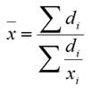

