<!-- page 1 -->

# TÀI LIÊU HỌC TẬP

1

<!-- page 2 -->

### Chương 1

## NHỮNG VẤN ĐỀ CHUNG VỀ THỐNG KÊ HỌC

Mục tiêu

➢ Xác định đối tượng nghiên cứu của thống kê học và vai trò

của thống kê trong đời sống xã hội.

➢ Hiểu một số khái niệm và các loại thang đo được dùng nhiều

trong thống kê.

➢ Giới thiệu khái quát các giai đoạn của quá trình nghiên cứu

thống kê.

➢ Cơ cấu tổ chức của hệ thống thống kê ở Việt Nam.

1.1. Đối tượng nghiên cứu của thống kê học

Thống kê là một hình thức hoạt động thực tiễn của con người nhằm
thu thập, tổng hợp, phân tích các số liệu thống kê về dân số, kinh tế, văn
hoá, giáo dục và các lĩnh vực khác của đời sống xã hội.

Giữa khoa học thống kê và công tác thống kê có mối liên hệ mật
thiết với nhau. Khoa học thống kê sử dụng số liệu thực tiễn để củng cố về
phương pháp và phương pháp luận. Ngược lại, thống kê thực tiễn sử dụng
khoa học thống kê để giải quyết các yêu cầu thực tế của đời sống xã hội.

1.1.1. Sơ lược sự ra đời và phát triển của thống kê học

Thống kê học là môn khoa học ra đời và phát triển do nhu cầu thực
tiễn của xã hội. Để trở thành một môn khoa học phát triển như ngày nay,
nó đã phải trải qua một quá trình phát triển lâu dài gắn liền với những
mốc lịch sử phát triển của xã hội loài người. Đây là một quá trình đúc kết
dần kinh nghiệm thành lý luận khoa học hoàn thiện như ngày nay.

Mỗi một mốc lịch sử phát triển xã hội có ảnh hưởng rất lớn tới hoạt
động thống kê, vì Thống kê học phục vụ cho lợi ích của một giai cấp
nhất định.

2

<!-- page 3 -->

1.1.2. Đối tượng nghiên cứu của thống kê học

Thống kê học là một môn khoa học có đối tượng và phương pháp
nghiên cứu độc lập. Đối tượng nghiên cứu của khoa học thống kê được
thể hiện qua những đặc trưng cơ bản sau đây:

+ Thống kê học nghiên cứu các hiện tượng và quá trình kinh tế - xã
hội. Các hiện tượng kinh tế - xã hội bao gồm:

+ Thống kê học nghiên cứu mặt lượng, nhưng không phải mặt
lượng đơn thuần mà là mặt lượng trong sự liên hệ mật thiết với mặt chất
của hiện tượng kinh tế - xã hội.

+ Hiện tượng kinh tế - xã hội mà thống kê nghiên cứu thường là
hiện tượng số lớn.

+ Thống kê học nghiên cứu hiện tượng trong điều kiện thời gian và
không gian cụ thể

Đối tượng của thống kê học quyết định đối tượng nghiên cứu của
nguyên lý thống kê.

Nguyên lý thống kê (lý thuyết thống kê) là một môn khoa học
nghiên cứu hệ thống các phương pháp thu thập, xử lý, phân tích các con
số (mặt lượng) của những hiện tượng số lớn để tìm hiểu bản chất và tính
quy luật vốn có của chúng (mặt chất) trong điều kiện thời gian và không
gian cụ thể.

1.2. Các khái niệm cơ bản của thống kê học

1.2.1. Tổng thể thống kê

1.2.1.1. Khái niệm tổng thể thống kê

Tổng thể thống kê là hiện tượng số lớn, bao gồm những đơn vị
hoặc phần tử cấu thành hiện tượng, cần được quan sát và phân tích mặt
lượng của chúng.

Ví dụ: Toàn bộ nhân khẩu nước ta là tổng thể, là tập hợp những
công dân Việt Nam, không phân biệt tuổi tác, giới tính, tôn giáo, nghề
nghiệp… mỗi người dân là một đơn vị tổng thể, gọi là tổng thể nhân
khẩu Việt Nam.

3

<!-- page 4 -->

Các doanh nghiệp thương mại cũng lập thành một tổng thể, chúng
là tập hợp của những doanh nghiệp kinh doanh trong lĩnh vực thương
mại mà không phân biệt hình thức sở hữu, quy mô, mặt hàng kinh doanh.
Mỗi doanh nghiệp là 1 đơn vị tổng thể.

Như vậy, muốn xác định được một tổng thể thống kê, cần phải xác
định được tất cả các đơn vị tổng thể thuộc phạm vi [VERIFY_OCR: vi/vĩ — check PDF trang 4] đó. Thực chất của
việc xác định tổng thể thống kê là xác định các đơn vị tổng thể. Trong
nhiều trường hợp thì đơn vị tổng thể là phần tử không thể chia nhỏ được.
Đơn vị tổng thể là căn cứ quan trọng để xác định phương pháp điều tra
thích hợp cũng như quá trình tổng hợp số liệu sau này.

1.2.1.2. Phân loại tổng thể

+ Căn cứ vào hình thức biểu hiện có thể chia tổng thể thành 2 loại:

- Tổng thể bộc lộ: Là tổng thể bao gồm các đơn vị mà ranh giới
được biểu hiện rõ ràng, có thể xác định bằng trực quan. Ví dụ: Tổng thể
nhân khẩu, tổng thể các sản phẩm bán ra của một công ty thương mại ở
một thời điểm nào đó, tổng thể các trường đại học trong nước…

- Tổng thể tiềm ẩn: Là tổng thể mà ranh giới không rõ ràng và
không thể nhận biết trực tiếp bằng trực quan. Ví dụ: Tổng thể những sinh
viên có ý thức học tập tốt, những người có năng khiếu nghệ thuật, thể
thao,… Loại tổng thể này thường gặp trong lĩnh vực xã hội.

+ Căn cứ vào mục đích nghiên cứu chia ra:

- Tổng thể đồng chất: Bao gồm các đơn vị giống nhau về đặc điểm
chủ yếu có liên quan trực tiếp đến mục đích nghiên cứu.

- Tổng thể không đồng chất: Bao gồm các đơn vị có nhiều đặc
điểm chủ yếu khác nhau.

+ Căn cứ vào phạm vi [VERIFY_OCR: vi/vĩ — check PDF trang 4] có thể chia ra:

- Tổng thể chung: Bao gồm tất cả các đơn vị của tổng thể.

- Tổng thể bộ phận: Chỉ [VERIFY_OCR: chỉ/chí — check PDF trang 4] bao gồm một phần của tổng thể chung.

Ví dụ: Nếu coi tổng thể các doanh nghiệp trên địa bàn thành phố
Hà Nội là một tổng thể chung, thì tổng thể các doanh nghiệp trên chia
theo ngành nghề kinh doanh hoặc theo hình thức sở hữu là các tổng thể

4

<!-- page 5 -->

bộ phận.

1.2.2. Tiêu thức thống kê

1.2.2.1. Khái niệm

Tiêu thức thống kê là một khái niệm chỉ [VERIFY_OCR: chỉ/chí — check PDF trang 5] đặc điểm của các đơn vị
tổng thể được chọn ra để nghiên cứu.

1.2.2.2. Phân loại

- Tiêu thức thuộc tính: Là loại tiêu thức mà các biểu hiện của nó
được dùng để phản ánh các thuộc tính (loại hình hoặc tính chất) của đơn
vị tổng thể. Có nghĩa là không được biểu hiện trực tiếp bằng con số. Ví
dụ: Trên một nhân khẩu có các tiêu thức thuộc tính như: Giới tính, tình
trạng hôn nhân, nghề nghiệp, nơi cư trú, nhân cách…

- Tiêu thức số lượng: Là loại tiêu thức có biểu hiện trực tiếp bằng
con số, đây là những con số phản ánh đặc trưng về số lượng của đơn vị
tổng thể, có thể cân, đong, đo, đếm được và làm các phép tính như:
Cộng, trừ, trung bình, tỷ lệ… Mỗi con số này được gọi là một lượng biến,
các lượng biến chia ra lượng biến rời rạc và lượng biến liên tục. Ví dụ:
Tiêu thức độ tuổi; Tiêu thức số người trong một hộ gia đình (1, 2, 3, 4,…)
là tiêu thức với lượng biến rời rạc, tiêu thức doanh thu của doanh nghiệp,
tiêu thức điểm số (0, 1, 2…, 10) là tiêu thức với lượng biến liên tục.

- Tiêu thức thay phiên: Là tiêu thức chỉ có 2 biểu hiện không trùng
nhau trên một đơn vị tổng thể. Tiêu thức thay phiên có thể là tiêu thức
thuộc tính và tiêu thức số lượng. Ví dụ: Là tiêu thức thuộc tính: tiêu thức
giới tính chỉ có hai biểu hiện: nam và nữ; là tiêu thức số lượng: Tiêu thức
năng suất lao động tiên tiến chỉ có hai biểu hiện: chẳng hạn NSLĐ >200
sản phẩm/h là tiên tiến, < 200 sản phẩm/h là không tiên tiến;

Các tiêu thức thuộc tính, số lượng đều góp phần vào việc xác định
đơn vị tổng thể cũng như tổng thể, nhờ đó chúng ta có thể phân biệt đơn
vị này với đơn vị khác, tổng thể này với tổng thể khác.

1.2.3. Chỉ tiêu thống kê

1.2.3.1. Khái niệm

Chỉ tiêu thống kê là khái niệm biểu hiện mặt lượng trong mối liên

5

<!-- page 6 -->

hệ mật thiết với mặt chất của hiện tượng số lớn trong điều kiện thời gian
và không gian cụ thể.

Trong Khoản 3, Điều 3 Luật Thống kê (được Quốc hội thông qua
ngày 17/6/2003, có hiệu lực thi hành từ ngày 01/01/2004) đã quy định cụ
thể hơn: “Chỉ tiêu thống kê là tiêu chí [VERIFY_OCR: chí/chỉ — check PDF trang 6] mà biểu hiện bằng số của nó phản
ánh quy mô, tốc độ phát triển, cơ cấu, quan hệ tỷ lệ của hiện tượng kinh
tế - xã hội trong điều kiện không gian và thời gian cụ thể”.

Kết cấu của một chỉ tiêu thống kê gồm 2 phần: Phần nội dung là tên
gọi của chỉ tiêu quy định về khái niệm, giới hạn về thuộc tính, số lượng,
thời gian của hiện tượng. Phần mức độ (hay con số) của chỉ tiêu phản ánh
quy mô, tỷ lệ, quan hệ so sánh với đơn vị tính phù hợp.

1.2.3.2. Phân loại chỉ tiêu thống kê

+ Căn cứ vào nội dung phản ánh, chia chỉ tiêu thành hai loại:

Chỉ tiêu chất lượng: Biểu hiện các tính chất, trình độ phổ biến, mối
quan hệ của tổng thể. Chỉ tiêu chất lượng có thể biểu hiện bằng chỉ tiêu
tương đối, chỉ tiêu trung bình. Ví dụ: Năng suất lao động, chi phí sản
xuất/1 đơn vị sản phẩm, tỷ suất chi phí lưu thông, số bác sỹ/1000 dân.

Chỉ tiêu khối lượng: Biểu hiện quy mô của tổng thể. Ví dụ: Số nhân
khẩu, số công nhân, số lượng sản phẩm sản xuất ra, doanh thu của doanh
nghiệp, tổng thu nhập quốc dân.

+ Căn cứ vào biểu hiện của các chỉ tiêu có thể phân biệt:

Chỉ tiêu hiện vật: Biểu hiện bằng đơn vị hiện vật, có thể là đơn vị
tự nhiên, đơn vị đo lường hoặc đơn vị đo lường quy ước.

Chỉ tiêu giá trị: Biểu hiện bằng đơn vị tiền tệ.

Chỉ tiêu hiện vật biểu hiện cụ thể hình thái vật chất của đối tượng
nghiên cứu, nhưng khả năng tổng hợp hạn chế vì đơn vị tính khác nhau,
còn chỉ tiêu giá trị có khả năng tính toán tổng hợp tuy nhiên thường bị
ảnh hưởng bởi sự biến động của yếu tố giá. Đây là vấn đề cần lưu ý khi
sử dụng các chỉ tiêu này trong phân tích thống kê.

1.2.4. Hệ thống chỉ tiêu thống kê

Hệ thống chỉ tiêu thống kê là tập hợp nhiều chỉ tiêu thống kê có quan hệ

6

<!-- page 7 -->

với nhau, được sắp xếp theo một thứ tự nào đó, phản ánh nhiều mặt của
hiện tượng hay quá trình kinh tế - xã hội trong điều kiện không gian và
thời gian cụ thể. Có nhiều loại hệ thống chỉ tiêu thống kê: Hệ thống chỉ
tiêu thống kê quốc gia; Hệ thống chỉ tiêu thống kê của ngành, lĩnh vực;
Hệ thống chỉ tiêu thống kê doanh nghiệp...

1.2.5. Dữ liệu thống kê

1.2.5.1. Khái niệm dữ liệu thống kê

Dữ liệu thống kê là các số liệu thu thập, tổng hợp và phân tích để
phát hiện nội dung và ý nghĩa của nó. Tất cả dữ liệu có được trong một
nghiên cứu cụ thể gọi là một bộ dữ liệu. Dữ liệu có thể là số đơn vị tổng
thể hoặc là trị số của tiêu thức, chỉ tiêu.

1.2.5.2. Phân loại dữ liệu thống kê

- Căn cứ vào tính chất, dữ liệu thống kê được chia ra hai loại: Dữ
liệu định tính và dữ liệu định lượng.

+ Dữ liệu định tính bao gồm tên hay nhãn được sử dụng để xác
định đặc trưng của mỗi đơn vị hoặc phần tử. Dữ liệu định tính được đo
lường bằng thang định danh hoặc thang thứ bậc và có thể được ký hiệu
bằng con số hoặc các ký tự.

+ Dữ liệu định lượng là dữ liệu được biểu hiện bằng những con số
cụ thể. Đối với dữ liệu định lượng có thể áp dụng các phép tính số học
như cộng, trừ, nhân, chia để có được những thông tin có ý nghĩa hơn.

- Căn cứ vào nguồn hình thành, dữ liệu thống kê được chia thành
hai loại: Dữ liệu thứ cấp và dữ liệu sơ cấp.

+ Dữ liệu thứ cấp là dữ liệu có sẵn trong một nghiên cứu thống kê
cụ thể. Ví dụ: Khi phân tích kết quả sản xuất kinh doanh của một doanh
nghiệp, có thể sử dụng các số liệu về doanh thu, lợi nhuận trong các báo
cáo tài chính của bộ phận kế toán.

+ Dữ liệu sơ cấp là dữ liệu không có sẵn mà phải thông qua việc
điều tra khảo sát mới có được.

1.3. Thang đo trong thống kê

7

<!-- page 8 -->

Tuỳ theo tính chất của dữ liệu thống kê thu được, ta có thể sử dụng
các loại thang đo khác nhau. Có bốn loại thang đo chủ yếu:

1.3.1. Thang đo định danh

Thang đo định danh là loại thang đo sử dụng cho các tiêu thức
thuộc tính, mà các biểu hiện của dữ liệu không có sự hơn kém, khác biệt
về thứ bậc, không theo một trật tự xác định nào như: Giới tính, khu vực
địa lý, nghề nghiệp, tôn giáo… Trong trường hợp này các biểu hiện cùng
loại của tiêu thức được đánh số như nhau.

Ví dụ: Tiêu thức giới tính có hai biểu hiện, có thể đánh số Nam: 1,
Nữ: 2 và ngược lại.

Giữa các con số này không có quan hệ hơn kém, không thực hiện
được các phép tính thống kê, mà chỉ [VERIFY_OCR: chỉ/chí — check PDF trang 8] đếm được tần số xuất hiện từng biểu
hiện. Các dữ liệu định tính thường được đo lường bằng loại thang đo này.

1.3.2. Thang đo thứ bậc

Thang đo thứ bậc là thang đo định danh, nhưng giữa các biểu hiện
của nó có thứ bậc hơn kém. Thang đo này được sử dụng cho tiêu thức
thuộc tính, mà các biểu hiện của dữ liệu có sự hơn kém, khác nhau về
thứ bậc.

Ví dụ: Trình độ nghề nghiệp của người công nhân được chia theo
bậc thợ: 1, 2, 3, 4…; chất lượng các loại sản phẩm được phân loại: I, II,
III… Những con số này thể hiện trật tự hơn kém giữa các biểu hiện của
tiêu thức.

Thang đo này có ưu điểm là cho thấy sự khác biệt, sự hơn kém giữa
các biểu hiện của tiêu thức, nhưng sự hơn kém này mới chỉ là tương đối
vì chênh lệch giữa các biểu hiện của tiêu thức không nhất thiết phải bằng
nhau. Cũng chính vì vậy không thực hiện được các phép tính số học trên
thang đo này, mà chỉ [VERIFY_OCR: chỉ/chí — check PDF trang 8] thể hiện đặc trưng hơn hay kém của tổng thể một
cách tương đối.

1.3.3. Thang đo khoảng

Thang đo khoảng là thang đo thứ bậc có khoảng cách bằng nhau,
nhưng không có điểm gốc là 0. Ví dụ như: Thang đo nhiệt độ không

8

<!-- page 9 -->

khí…

Nhờ có tiêu chuẩn đo được quy định chính xác (với khoảng cách
đều nhau), ta có thể đánh giá được mức độ hơn kém cụ thể về mặt lượng.
Thang đo này luôn có đơn vị đo và được sử dụng cho tiêu thức số lượng.
Từ đó, ta có thể thực hiện được các phép tính cộng, trừ, nhân, chia và
tính được các tham số thống kê như trung bình, phương sai…

Hạn chế là thang đo này không có gốc 0 trên thực tế, mà chỉ có
những điểm xác định các khoảng theo trật tự nào đó, nếu có điểm 0 chỉ là
quy ước.

1.3.4. Thang đo tỷ lệ

Thang đo tỷ lệ là thang đo khoảng với giá trị 0 tuyệt đối (một trị số
có thực), được coi như là điểm xuất phát của độ dài đo lường trên thang.
Do có gốc 0, nên có thể so sánh được tỷ lệ giữa các số đo.

Đây là thang đo chặt chẽ nhất, được sử dụng phổ biến trong nghiên
cứu thống kê. Với thang đo này có thể thực hiện được tất cả các công cụ
toán, thống kê để tính toán và phân tích dữ liệu.

1.4. Quá trình nghiên cứu thống kê

- Điều tra thống kê: Điều tra thống kê là việc tổ chức một cách khoa
học, theo một kế hoạch thống nhất việc thu thập, ghi chép nguồn tài liệu
ban đầu về hiện tượng nghiên cứu ở một điều kiện cụ thể về thời gian và
không gian.

- Tổng hợp thống kê: Tổng hợp thống kê là quá trình tập trung, sắp
xếp, hệ thống hóa các tài liệu ban đầu đã thu thập được ở giai đoạn điều
tra thống kê. Nhiệm vụ của giai đoạn này là làm cho các đặc trưng riêng
biệt của từng đơn vị điều tra bước đầu chuyển thành đặc trưng chung của
toàn bộ tổng thể nghiên cứu, làm cơ sở cho giai đoạn phân tích và dự báo
tiếp theo.

- Phân tích và dự báo thống kê: Phân tích và dự báo thống kê là
việc vận dụng các phương pháp phân tích để nêu lên một cách tổng hợp
nội dung, ý nghĩa, bản chất và tính quy luật qua các biểu hiện về mặt
lượng của hiện tượng nghiên cứu. Trên cơ sở phân tích có thể xác định

9

<!-- page 10 -->

mức độ của hiện tượng nghiên cứu trong tương lai và đưa ra các căn cứ
cho quyết định quản lý.

1.5. Tổ chức thống kê ở Việt Nam

1.5.1. Hệ thống tổ chức thống kê nhà nước ở Việt Nam

- Hệ thống tổ chức thống kê nhà nước:

Hệ thống tổ chức thống kê tập trung được tổ chức theo ngành dọc,
gồm cơ quan thống kê trung ương và các cơ quan thống kê địa phương.
Ở cấp trung ương có cơ quan Tổng cục thống kê. Tại các tỉnh, thành phố
có các Cục thống kê tỉnh, thành phố trực thuộc Tổng cục thống kê. Cấp
quận, huyện có các Phòng thống kê trực thuộc Cục thống kê. Những cơ
quan này chịu trách nhiệm thực hiện nghĩa vụ, quyền hạn của cơ quan
quản lý nhà nước ở từng cấp về mặt thống kê. Tại các xã, phường có các
cán bộ làm công tác thống kê chịu sự quản lý trực tiếp của Uỷ ban nhân
dân cùng cấp và sự hướng dẫn về chuyên môn, nghiệp vụ của Phòng
thống kê.

Các Bộ, cơ quan ngang Bộ, cơ quan thuộc Chính phủ, Toà án nhân
dân tối cao, Viện kiểm sát nhân dân tối cao đều phải có bộ phận thống kê
(thường là phòng thống kê) thực hiện công tác thống kê theo quy định
của Luật Thống kê. Cơ quan này do Thủ trưởng các Bộ, cơ quan ngang
Bộ… tổ chức và quyết định.

- Hệ thống thống kê các đơn vị cơ sở:

Các doanh nghiệp, cơ quan hành chính, đơn vị sự nghiệp, đơn vị
thuộc lực lượng vũ trang có tổ chức thống kê hoặc bố trí cán bộ thống kê
đặt dưới sự quản lý của thủ trưởng đơn vị. Thống kê của các cơ quan này
có trách nhiệm tổ chức thực hiện công tác thống kê phục vụ yêu cầu quản
lý của đơn vị mình, phải gửi báo cáo tài chính cho Cục thống kê tỉnh,
thực hiện các cuộc điều tra thống kê và chế độ báo cáo thống kê nhà
nước theo quy định.

1.5.2. Chức năng, nhiệm vụ của cơ quan thống kê nhà nước Việt
Nam

Cơ quan thống kê nhà nước Việt Nam có hai chức năng:

10

<!-- page 11 -->

- Quản lý Nhà nước về thống kê trong toàn bộ các hoạt động kinh
tế - xã hội của đất nước.

- Tổ chức thực hiện hoạt động thống kê, sản xuất và cung cấp thông
tin thống kê kinh tế - xã hội cho các cơ quan, tổ chức và cá nhân theo quy
định của phát luật.

Nghị định cũng quy định sáu nhiệm vụ chủ yếu có liên quan đến
nghiệp vụ thống kê là:

- Soạn thảo các văn bản quy phạm pháp luật về thống kê, các chiến
lược, quy hoạch, kế hoạch về thống kê…

- Trình Thủ tướng Chính phủ ban hành hệ thống chỉ tiêu thống kê
quốc gia, chế độ báo cáo thống kê cơ sở, thống kê tổng hợp, chương trình
điều tra thống kê…

- Chỉ đạo, hướng dẫn và thẩm định về chuyên môn thống kê đối với
các Bộ, cơ quan ngang Bộ, các tỉnh, thành phố…

- Tổ chức thu thập thông tin thống kê kinh tế - xã hội, xây dựng và
quản lý cơ sở dữ liệu quốc gia về thông tin thống kê kinh tế - xã hội.

- Báo cáo Chính phủ các số liệu thống kê tổng hợp tình hình thực
hiện các chương trình, mục tiêu quốc gia, các kế hoạch nhà nước và các
báo cáo phân tích, dự báo về tình hình phát triển kinh tế - xã hội hàng
năm

- Công bố và cung cấp thông tin thống kê kinh tế - xã hội cho người
sử dụng.

TÓM TẮT CHƯƠNG 1

Thống kê học là môn khoa học ra đời khoảng 300 năm trước nhưng
có nguồn gốc lịch sử phát triển lâu dài. Thống kê ra đời và phát triển từ
nhu cầu thực tiễn của xã hội, đó là một quá trình đúc rút kinh nghiệm
trong lĩnh vực tính toán số liệu từ đơn giản đến phức tạp, hoàn thiện dần
theo lịch sử phát triển của xã hội và trở thành môn khoa học độc lập như
ngày nay. Hiện nay thống kê được coi là một công cụ quản lý vĩ [VERIFY_OCR: vĩ/vi — check PDF trang 11] mô quan
trọng, đồng thời là công cụ quản lý hoạt động sản xuất kinh doanh của
đơn vị cơ sở.

11

<!-- page 12 -->

Đối tượng nghiên cứu của thống kê là “mặt lượng trong sự liên hệ
mật thiết với mặt chất của các hiện tượng kinh tế - xã hội số lớn, trong
điều kiện thời gian và địa điểm cụ thể”. Khoa học thống kê sử dụng một
số khái niệm cơ bản bao gồm: Tổng thể thống kê, tiêu thức, chỉ tiêu, hệ
thống chỉ tiêu. Để phục vụ cho việc đo lường dữ liệu định tính và định
lượng, thống kê sử dụng bốn loại thang đo: Thang định danh, thang thứ
bậc, thang đo khoảng, thang tỷ lệ.

Theo quy định trong Luật Thống kê của nước CHXHCN Việt Nam,
hệ thống thống kê được tổ chức theo hai hình thức: Hệ thống thống kê
tập trung, được tổ chức theo ngành dọc gồm cơ quan thống kê Trung
ương và các cơ quan thống kê địa phương. Các Bộ, các cơ quan ngang
Bộ có bộ phận thực hiện công tác thống kê theo luật định, ngoài ra các
đơn vị cơ sở có bộ phận thống kê phục vụ yêu cầu quản lý của đơn vị và
thực hiện chế độ báo cáo thống kê nhà nước theo quy định.

12

<!-- page 13 -->

## Chương 2 ĐIỀU TRA THỐNG KÊ Mục tiêu

➢ Hiểu khái niệm, ý nghĩa và các loại điều tra thống kê

➢ Có khả năng thực hiện việc thu thập thông tin

➢ Nắm được các hình thức tổ chức điều tra thống kê

➢ Có khả năng thực hiện xây dựng phương án điều tra thống kê

và thiết kế bảng hỏi

➢ Hiểu được các loại sai số và biện pháp khắc phục sai số trong

điều tra thống kê

2.1. Khái niệm, ý nghĩa và yêu cầu của điều tra thống kê

2.1.1. Khái niệm điều tra thống kê

Điều tra thống kê là việc tổ chức một cách khoa học theo một kế
hoạch thống nhất việc thu thập, ghi chép nguồn tài liệu ban đầu về hiện
tượng nghiên cứu trong điều kiện cụ thể về thời gian, không gian.

Điều 3, Luật Thống kê nước Cộng hoà xã hội chủ nghĩa Việt Nam
cũng định nghĩa: “Điều tra thống kê là hình thức thu thập thông tin
thống kê theo phương án điều tra”. Định nghĩa này hoàn toàn phù hợp
với khái niệm nêu trên, bởi lẽ phương án điều tra thống kê sẽ quy định rõ
về mục đích, ý nghĩa, toàn bộ quá trình tổ chức, điều kiện thời gian và
không gian của cuộc điều tra.

2.1.2. Ý nghĩa của điều tra thống kê

- Là căn cứ tin cậy để kiểm tra, đánh giá thực trạng hiện tượng
nghiên cứu, đánh giá tình hình thực hiện kế hoạch phát triển kinh tế, văn
hoá, xã hội của từng đơn vị, từng địa phương và của toàn bộ nền kinh tế
quốc dân.

- Cung cấp những luận cứ xác đáng cho việc phân tích, phát hiện
những yếu tố tác động, những yếu tố quyết định sự biến đổi của hiện

13

<!-- page 14 -->

tượng nghiên cứu, trên cơ sở đó tìm biện pháp thích hợp thúc đẩy hiện
tượng phát triển theo hướng có lợi nhất.

- Căn cứ cho việc phát hiện, xác định xu hướng, quy luật biến động
của hiện tượng và dự đoán xu hướng biến động của hiện tượng trong
tương lai.

Theo cách thức tổ chức các hoạt động thống kê nhà nước Việt
Nam, điều tra thống kê được tổ chức thành 2 cấp độ: Tổng điều tra thống
kê và điều tra thống kê.

Tổng điều tra thống kê để thu thập những thông tin thống kê cơ bản
trên phạm vi [VERIFY_OCR: vi/vĩ — check PDF trang 14] cả nước theo chu kỳ dài, quy mô lớn, phạm vi [VERIFY_OCR: vi/vĩ — check PDF trang 14] rộng liên
quan đến nhiều ngành, nhiều cấp, có sử dụng nguồn kinh phí rất lớn.

Điều tra thống kê được thực hiện đối với các tổ chức, hộ gia đình
và cá nhân trong các trường hợp sau:

- Thu thập những thông tin thống kê từ các tổ chức không phải thực
hiện chế độ báo cáo thống kê định kỳ.

- Khi cần bổ sung thông tin từ các tổ chức có thực hiện chế độ báo
cáo thống kê.

- Thu thập thông tin thống kê khi có nhu cầu đột xuất.

2.1.3. Những yêu cầu cơ bản của điều tra thống kê

- Chính xác trong điều tra thống kê có nghĩa là tài liệu thu thập
được phải phản ánh trung thực tình hình thực tế khách quan, có sao ghi
chép vậy không được tự tiện thêm bớt.

- Kịp thời trong điều tra thống kê có nghĩa là thống kê phải nhạy
bén với tình hình, thu thập và phản ánh đúng lúc các tài liệu mà lãnh đạo
quan tâm, tiến hành đúng thời hạn quy định để phát huy hết tác dụng của
tài liệu điều tra.

- Đầy đủ có nghĩa là được thu thập theo đúng nội dung điều tra đã
quy định, đầy đủ số đơn vị điều tra đã được quy định trong phương án
điều tra.

14

<!-- page 15 -->

2.2. Các loại điều tra thống kê

2.2.1. Điều tra thường xuyên và không thường xuyên

- Điều tra thường xuyên: Là tiến hành ghi chép, thu thập tài liệu
ban đầu của hiện tượng một cách liên tục, có hệ thống và thường là theo
sát với quá trình phát sinh, phát triển của hiện tượng.

- Điều tra không thường xuyên: Là thu thập tài liệu của hiện tượng
nghiên cứu một cách không liên tục, mà chỉ [VERIFY_OCR: chỉ/chí — check PDF trang 15] tiến hành ghi chép tài liệu
vào một thời điểm nào đó, không gắn liền với quá trình phát sinh phát
triển của hiện tượng. Tài liệu của điều tra không thường xuyên phản ánh
trạng thái của hiện tượng ở một thời điểm nhất định.

2.2.2. Điều tra toàn bộ và không toàn bộ

Căn cứ vào phạm vi [VERIFY_OCR: vi/vĩ — check PDF trang 15] của đối tượng được điều tra thực tế, điều tra
thống kê được chia thành: Điều tra toàn bộ và điều tra không toàn bộ.

- Điều tra toàn bộ: Là tiến hành thu thập tài liệu ban đầu trên toàn
bộ các đơn vị thuộc đối tượng điều tra, không loại trừ bất kỳ đơn vị nào.

- Điều tra không toàn bộ: Là tiến hành thu thập tài liệu ban đầu trên
một số đơn vị được chọn ra trong toàn bộ các đơn vị của tổng thể chung.
Những đơn vị được chọn phải đảm bảo một số điều kiện nhất định.

Tuỳ theo cách lựa chọn các đơn vị để điều tra, có thể phân biệt các
loại điều tra không toàn bộ sau đây:

+ Điều tra chọn mẫu: Là một loại điều tra không toàn bộ, trong
đó chỉ [VERIFY_OCR: chỉ/chí — check PDF trang 15] chọn ra một số đơn vị để điều tra thực tế, sau đó dùng kết quả
thu thập được để tính toán suy rộng thành các đặc điểm của toàn bộ
tổng thể.

+ Điều tra trọng điểm: Là loại điều tra không toàn bộ, trong đó chỉ [VERIFY_OCR: chỉ/chí — check PDF trang 15]
tiến hành thu thập tài liệu trên những bộ phận chủ yếu, trọng điểm của
hiện tượng nghiên cứu. Kết quả điều tra không suy rộng mà chỉ [VERIFY_OCR: chỉ/chí — check PDF trang 15] tính toán,
phân tích, đánh giá những đặc điểm chung của tổng thể, giúp ta nhận
thức được tình hình cơ bản của hiện tượng nghiên cứu.

+ Điều tra chuyên đề: Là loại điều tra không toàn bộ, chỉ [VERIFY_OCR: chỉ/chí — check PDF trang 15] tiến hành

15

<!-- page 16 -->

thu thập tài liệu trên một số rất ít đơn vị nhưng lại đi sâu nghiên cứu chi
tiết nhiều khía cạnh khác nhau của đơn vị đó nhằm rút ra vấn đề đặc thù,
cốt lõi.

2.3. Phương pháp thu thập thông tin trong điều tra thống kê

2.3.1. Phương pháp đăng ký trực tiếp

Theo phương pháp này nhân viên điều tra phải trực tiếp tiếp xúc
với đối tượng điều tra, trực tiếp tiến hành hoặc giám sát việc cân đong,
đo, đếm và sau đó ghi chép những thông tin thu được vào phiếu điều tra.

Phương pháp đăng ký trực tiếp thường được thực hiện gắn liền với
quá trình phát sinh, phát triển của hiện tượng. Tài liệu ghi chép ban đầu
được đăng ký trực tiếp có độ chính xác cao nhưng lại đòi hỏi nhiều nhân
lực và thời gian. Mặt khác, trong thực tế nhiều hiện tượng không cho
phép quan sát, đo, đếm trực tiếp quá trình phát sinh, phát triển của chúng.
Vì vậy, phạm vi [VERIFY_OCR: vi/vĩ — check PDF trang 16] áp dụng của phương pháp này có nhiều hạn chế.

2.3.2. Phương pháp phỏng vấn

Đây là phương pháp được sử dụng phổ biến, theo đó việc ghi chép,
thu thập tài liệu ban đầu được thực hiện thông qua quá trình hỏi - đáp
giữa nhân viên điều tra và người cung cấp thông tin.

Nếu căn cứ vào tính chất của sự tiếp xúc giữa người hỏi và người
trả lời, có thể chia ra: Phỏng vấn trực tiếp và phỏng vấn gián tiếp.

+ Phỏng vấn trực tiếp: Là phương pháp ghi chép, thu thập tài liệu
ban đầu được thực hiện thông qua quá trình hỏi - đáp trực tiếp giữa nhân
viên điều tra và người cung cấp thông tin.

+ Phỏng vấn gián tiếp: Là phương pháp thu thập tài liệu ban đầu
được thực hiện bằng cách: người được hỏi nhận được phiếu điều tra, tự
mình ghi câu trả lời vào phiếu rồi gửi trả lại cho cơ quan điều tra.

Ngoài ra, trong điều tra thống kê, người ta còn sử dụng nhiều
phương pháp khác để thu thập nguồn tài liệu ban đầu: Phương pháp quan
sát, phương pháp thu thập thông tin qua nguồn sẵn có, phương pháp đăng
ký qua chứng từ sổ sách…

16

<!-- page 17 -->

2.4. Hình thức tổ chức điều tra thống kê

2.4.1. Báo cáo thống kê định kỳ

Báo cáo thống kê định kỳ là hình thức thu thập dữ liệu, thông tin
thống kê về hiện tượng nghiên cứu trong một thời kỳ nhất định dựa trên
các biểu mẫu báo cáo thống kê đã được lập sẵn do cơ quan nhà nước có
thẩm quyền quy định. Đây là hình thức thu thập tài liệu mà theo đó các
đơn vị báo cáo tiến hành ghi chép số liệu theo biểu mẫu có sẵn và gửi lên
cấp trên theo quy định.

Báo cáo thống kê định kỳ bao gồm báo cáo thống kê quốc gia và
báo cáo thống kê Bộ, Ngành. Nội dung cơ bản của báo cáo thống kê định
kỳ bao gồm những chỉ tiêu cơ bản về hoạt động nghiệp vụ có liên quan
chặt chẽ đến việc thực hiện nhiệm vụ kế hoạch đặt ra. Căn cứ vào nguồn
tài liệu do các báo cáo phản ánh một cách có hệ thống, cơ quan lãnh đạo
có thể thường xuyên và kịp thời chỉ đạo nghiệp vụ đối với cấp dưới, giám
sát và kiểm tra tình hình thực hiện kế hoạch, phát hiện những tồn tại, yếu
kém để có biện pháp khắc phục. Tài liệu của báo cáo thống kê định kỳ
còn được dùng để phân tích, đối chiếu giữa các đơn vị rút ra những kết
luận chung về vấn đề đang được nghiên cứu, theo dõi và là căn cứ để xây
dựng kế hoạch cho kỳ sau.

2.4.2. Điều tra chuyên môn

Điều tra chuyên môn là hình thức tổ chức thu thập dữ liệu, thông
tin thống kê về đối tượng nghiên cứu cụ thể theo phương pháp khoa học,
thống nhất được quy định trong phương án điều tra thống kê cho mỗi lần
điều tra.

Điều tra chuyên môn phù hợp với các cuộc điều tra không thường
xuyên, dùng cho những trường hợp chỉ [VERIFY_OCR: chỉ/chí — check PDF trang 17] khi có nhu cầu thông tin mới tổ
chức tiến hành vào một thời điểm hoặc trong một thời kỳ nhất định hoặc
dùng thu thập thông tin về những hiện tượng có sự thay đổi liên tục theo
thời gian nhưng không nhất thiết phải theo dõi thường xuyên (như hiện
tượng về dân số, tình hình sử dụng đất đai, hệ thống cơ sở hạ tầng...)

Nội dung của điều tra chuyên môn luôn thay đổi theo từng lần điều
tra, nội dung trong điều tra chuyên môn thường là những hiện tượng mà

17

<!-- page 18 -->

báo cáo thống kê định kỳ chưa tiến hành hoặc không thể thu thập được
hoặc đó là những vấn đề có liên quan đến kinh tế tư nhân, những hiện
tượng xảy ra bất thường (như bão lụt, thiên tai).

2.5. Xây dựng phương án điều tra

Phương án điều tra thống kê là một loại văn bản trong đó quy định
rõ những vấn đề cần phải giải quyết và những vấn đề cần được hiểu một
cách thống nhất trước, trong và sau khi tiến hành điều tra. Để đảm bảo sự
thống nhất trong việc tổ chức điều tra, tránh các sai sót trong quá trình
điều tra thì phương án điều tra phải được xây dựng một cách chi tiết, tỷ
mỉ, cụ thể và khoa học có sự phân công chức năng, nhiệm vụ rõ ràng
giữa các đơn vị thực hiện. Văn bản này ngoài việc hướng dẫn nhân viên
điều tra thực hiện cuộc điều tra, còn là cơ sở để các cấp có thẩm quyền
quyết định và phê duyệt cho phép tiến hành cuộc điều tra.

Tùy thuộc vào quy mô, tính chất của từng cuộc điều tra mà phương
án điều tra có thể có những sự khác nhau, nhưng nhìn chung một phương
án điều tra gồm các nội dung chủ yếu: Mục đích, yêu cầu của điều tra;
phạm vi [VERIFY_OCR: vi/vĩ — check PDF trang 18], đối tượng, đơn vị điều tra; loại điều tra; thời điểm, thời gian và
phương pháp điều tra; nội dung và phiếu điều tra; phân loại thống kê sử
dụng trong điều tra; quy trình xử lý và biểu đầu ra của điều tra; tổ chức
điều tra; kinh phí và các điều kiện vật chất cho điều tra.

2.5.1. Xác định mục đích điều tra

Mục đích điều tra là căn cứ quan trọng để xác định đối tượng, đơn
vị điều tra, xây dựng kế hoạch và nội dung điều tra. Vì vậy, việc xác định
đúng, rõ mục đích điều tra là cơ sở quan trọng cho việc thu thập số liệu
ban đầu đầy đủ, hợp lý, đáp ứng yêu cầu nghiên cứu đặt ra.

Căn cứ để xác định mục đích điều tra thường là những nhu cầu thực
tế trong đời sống xã hội hoặc phục vụ cho một yêu cầu nghiên cứu cụ thể
nào đó.

2.5.2. Xác định đối tượng và đơn vị điều tra

Xác định đối tượng điều tra là xác định xem những đơn vị tổng
thể nào thuộc phạm vi [VERIFY_OCR: vi/vĩ — check PDF trang 18] điều tra, cần được thu thập tài liệu. Xác định đối

18

<!-- page 19 -->

tượng điều tra là xác định được ranh giới giữa hiện tượng nghiên cứu
với các tổng thể khác, tránh tình trạng trùng lặp hay bỏ sót khi tiến hành
điều tra.

Muốn xác định chính xác đối tượng điều tra cần dựa vào phân tích
lý luận, nêu lên những tiêu chuẩn cơ bản phân biệt hiện tượng nghiên cứu
với hiện tượng có liên quan, đồng thời còn phải căn cứ vào mục đích
nghiên cứu.

Đơn vị điều tra là đơn vị thuộc đối tượng điều tra và được điều tra
thực tế. Đơn vị điều tra là nơi phát sinh các tài liệu ban đầu, điều tra viên
đến đó để thu thập tài liệu.

2.5.3. Chọn thời điểm, thời kỳ và quyết định thời hạn điều tra

+ Thời điểm điều tra: Là mốc thời gian được quy định thống nhất
mà cuộc điều tra phải thu thập thông tin về hiện tượng tồn tại đúng thời
điểm đó.

+ Thời kỳ điều tra: Là khoảng thời gian (tuần, tháng, năm…) được
quy định để thu thập số liệu về hiện tượng được tích luỹ trong cả thời
kỳ đó.

+ Thời gian điều tra hay thời hạn điều tra: Là khoảng thời gian
dành cho việc thực hiện nhiệm vụ thu thập số liệu.

2.5.4. Xác định nội dung điều tra và thiết lập phiếu điều tra

Nội dung điều tra là toàn bộ các đặc điểm cơ bản của từng đối
tượng, từng đơn vị điều tra mà ta cần thu được thông tin. Trong thực tế
các đơn vị của hiện tượng nghiên cứu thường có rất nhiều đặc điểm khác
nhau.

Việc xác định nội dung điều tra, cần căn cứ vào các yếu tố sau:

- Căn cứ vào mục đích điều tra vì mục đích điều tra đưa ra định
hướng cần thu thập những thông tin nào để đáp ứng yêu cầu đó.

- Đặc điểm của hiện tượng nghiên cứu: Hiện tượng nghiên cứu
bao giờ cũng tồn tại những đặc điểm gắn liền điều kiện cụ thể về thời
gian và không gian nhất định. Những đặc điểm đó liên quan đến việc

19

<!-- page 20 -->

xác định các nội dung cần thu thập trên đơn vị điều tra để đáp ứng được
mục đích nghiên cứu. Khi thời gian và không gian thay đổi thì đặc điểm
của hiện tượng có thể thay đổi theo, vì vậy tiêu thức cần thu thập cũng
phải khác nhau.

- Năng lực, trình độ thực tế của đơn vị, của người tổ chức điều tra.
Điều này biểu hiện ở khả năng về tài chính, về thời gian, kinh nghiệm,
trình độ tổ chức điều tra.

Để có thể thu thập được thông tin chính xác và đầy đủ, nội dung
của mỗi cuộc điều tra được diễn đạt cụ thể thành những câu hỏi ngắn
gọn, rõ ràng, dễ hiểu được trình bày cụ thể trong phiếu điều tra. Phiếu
điều tra (hay còn gọi là biểu điều tra, bảng hỏi) là tập hợp các câu hỏi
phản ánh nội dung điều tra, được sắp xếp theo một trật tự logic nhất định.

2.5.5. Các danh mục và bảng phân loại

Trong phương án điều tra luôn đưa ra các danh mục hoặc các bảng
phân loại thống kê đã được xây dựng sẵn mà cuộc điều tra cần sử dụng.
Các phân loại thống kê được sử dụng thống nhất trong hoạt động thống
kê nhà nước, làm căn cứ thống nhất sử dụng trong quản lý nhà nước.

2.5.6. Loại điều tra và phương pháp thu thập thông tin

Tùy thuộc vào từng cuộc điều tra có thể sử dụng các loại điều tra
khác nhau, có thể sử dụng riêng hoặc kết hợp các loại điều tra với
nhau cho từng đối tượng điều tra hoặc đơn vị đã được xác định trước
đó.

Trong phương án điều tra việc lựa chọn phương pháp thu thập
thông tin phụ thuộc vào đặc điểm của hiện tượng nghiên cứu qua đó có
thể chọn được phương pháp phù hợp, việc thu thập thông tin có thể được
thực hiện bằng việc sử dụng một phương pháp hoặc có những trường hợp
nội dung điều tra phức tạp bắt buộc phải sử dụng kết hợp nhiều phương
pháp.

Trong mỗi cuộc điều tra, phương pháp thu thập thông tin trong
phương án điều tra luôn phải được hướng dẫn một cách chi tiết, cụ thể

20

<!-- page 21 -->

cách thức tiến hành thu thập số liệu nhằm đảm bảo thông tin thu được
chính xác, thống nhất.

2.5.7. Lập kế hoạch tổ chức và tiến hành điều tra

Lập kế hoạch tổ chức và tiến hành điều tra là một vấn đề trọng yếu
của điều tra thống kê. Kế hoạch tổ chức bao gồm các khâu:

- Thành lập Ban chỉ đạo điều tra và quy định nhiệm vụ cụ thể cho
cơ quan điều tra các cấp.

- Chuẩn bị lực lượng cán bộ điều tra, phân công trách nhiệm và tiến
hành tập huấn nghiệp vụ cho họ.

- Lựa chọn phương pháp điều tra thích hợp.

- Định các bước tiến hành điều tra.

- Phân chia khu vực và địa bàn điều tra.

- Tổ chức các cuộc hội nghị chuẩn bị.

- Tiến hành điều tra thử nghiệm để rút kinh nghiệm, nâng cao trình
độ nghiệp vụ cho cán bộ điều tra và hoàn thiện phương án điều tra, phiếu
điều tra.

- Xây dựng phương án tài chính và chuẩn bị các phương tiện vật
chất khác.

- Tuyên truyền mục đích, ý nghĩa của cuộc điều tra.

2.6. Xây dựng bảng hỏi trong điều tra thống kê

2.6.1. Bảng hỏi và yêu cầu của việc xây dựng bảng hỏi trong điều
tra thống kê

Bảng hỏi (hay phiếu điều tra) là hệ thống các câu hỏi được sắp xếp
trên cơ sở các nguyên tắc, trình tự logic và theo nội dung nhất định nhằm
giúp cho người điều tra có thể thu thập thông tin về hiện tượng nghiên
cứu một cách đầy đủ, đáp ứng mục tiêu nghiên cứu đã đề ra.

Bảng hỏi là một công cụ đo lường quan trọng, nhờ đó ta có thể đo
được các biến số nhất định có liên quan đến chủ đề cần nghiên cứu.

21

<!-- page 22 -->

Bảng hỏi giữ vai trò cầu nối giữa nhân viên điều tra với người trả
lời câu hỏi.

2.6.2. Các loại câu hỏi và kỹ thuật đặt các loại câu hỏi

2.6.2.1. Các loại câu hỏi

• Câu hỏi theo nội dung

+ Nhóm thứ nhất: Câu hỏi về sự kiện là những câu hỏi nhằm thu
thập những thông tin thực tế gắn với đối tượng điều tra (thông tin về thân
thế, sự nghiệp, lứa tuổi, giới tính, địa vị xã hội…) và những sự kiện đã
xảy ra đối với đối tượng điều tra. Những câu hỏi này được đặt ra nhằm
để nắm tình hình hiện thực khách quan, bao gồm cả tình hình về đối
tượng điều tra.

+ Nhóm thứ hai: Câu hỏi tri thức (câu hỏi hiểu biết) là loại câu hỏi
nhằm đánh giá trình độ hiểu biết của người được hỏi về một vấn đề. Tuy
nhiên, tính chuẩn xác của câu trả lời tương ứng sẽ phụ thuộc vào nhận
thức của người được hỏi.

• Câu hỏi chức năng

Trên thực tế, để chuyển tải những nội dung của thông tin trong điều
tra, đặc biệt là khi sử dụng phương pháp phỏng vấn cần phải có những
câu hỏi mang tính chất kỹ thuật, đó là các câu hỏi chức năng bao gồm
câu hỏi tâm lý, câu hỏi lọc, câu hỏi kiểm tra.

- Câu hỏi tâm lý: Có thể là câu hỏi tiếp xúc nhằm mục đích gạt bỏ
những nghi ngờ có thể nảy sinh, để giảm bớt sự căng thẳng, hoặc chuyển
từ chủ để này sang chủ đề khác… thường dùng trong phỏng vấn trực tiếp.

- Câu hỏi lọc: Để chuyển từ nội dung này sang nội dung khác, có
thể sử dụng câu hỏi chuyển tiếp để làm người được hỏi không cảm thấy
hụt hẫng, nghi ngờ, thắc mắc tính hợp lý của câu hỏi. Loại câu hỏi này có
tác dụng tìm hiểu xem người được hỏi có thuộc nhóm người dành cho
những câu hỏi tiếp sau không.

Một số vấn đề cần chú ý khi sử dụng câu hỏi kiểm tra:

+ Các câu hỏi kiểm tra thường làm tăng số câu hỏi trong bảng hỏi,
nếu sử dụng quá nhiều sẽ ảnh hưởng đến chất lượng cuộc điều tra.

22

<!-- page 23 -->

+ Câu hỏi kiểm tra không bao giờ được đi liền với câu trả lời mà nó
kiểm tra và thường là đặt cách xa khoảng 3 đến 4 câu.

+ Sử dụng câu hỏi kiểm tra cũng phải hết sức khéo léo, cần tránh
cho người trả lời có cảm giác tự ái, cảm thấy bị xúc phạm.

• Câu hỏi theo cách biểu hiện

Đây là cách phân loại câu hỏi theo hình thức biểu hiện của câu trả
lời cũng như cách hỏi.

- Theo biểu hiện của câu trả lời:

Câu hỏi đóng: Là dạng câu hỏi có trước phương án trả lời cụ thể và
người trả lời chỉ [VERIFY_OCR: chỉ/chí — check PDF trang 23] việc chọn một trong số các phương án trên. Loại câu hỏi
này thường dễ trả lời và thuận tiện trong quá trình tổng hợp.

Câu hỏi mở: Là câu hỏi không có phương án trả lời được nêu trước
mà nó hoàn toàn do người trả lời tự nghĩ ra. Chúng cho phép người được
hỏi tự cung cấp thông tin những suy nghĩ của họ.

- Theo cách biểu hiện của câu hỏi:

Câu hỏi trực tiếp: Là cách hỏi thẳng ngay vào nội dung vấn đề,
người được hỏi không bị quanh co và có thể trả lời vào chính nội dung
đó.

Câu hỏi gián tiếp: Là cách hỏi khôn khéo, không đi trực tiếp vào
vấn đề, mà thông qua những vấn đề có liên quan để thu thập thông tin về
vấn đề cần hỏi.

2.6.2.2. Kỹ thuật đặt câu hỏi

Để xây dựng các câu hỏi một cách hiệu quả đòi hỏi người xây dựng
phải có trình độ chuyên môn, kinh nghiệm thực tế, kiến thức cơ bản về
lĩnh vực nghiên cứu, ngôn ngữ và hiểu biết tâm lý đóng vai trò quan
trọng.

Khi đặt câu hỏi, người thiết kế cần phải chú ý đến một số vấn đề
sau:

- Lựa chọn câu hỏi đúng loại và phù hợp, để làm được điều này
cần nắm được đặc điểm và nguyên tắc của từng loại câu hỏi.

23

<!-- page 24 -->

- Sắp xếp các câu hỏi hợp lý, logic, việc đặt câu hỏi theo một trật tự
nào đó có ý nghĩa quan trọng đối với tính khách quan của những thông
tin thu thập được. Theo đó, các câu hỏi cần được bố trí theo các hướng
sau:

+ Các câu hỏi cần đặt theo chủ đề, những câu hỏi có cùng chủ đề
cần được đặt liền nhau nhằm đảm bảo tính hệ thống, xuyên suốt.

+ Các câu hỏi được sắp xếp theo trật tự nhất định từ vấn đề đơn
giản đến vấn đề phức tạp, từ vấn đề nhận thức được đến vấn đề không
nhận thức được, từ cái chung đến cái riêng, từ câu hỏi mang những nội
dung chung, tổng quát đến những câu hỏi có những nội dung cụ thể hơn.

+ Đặt các câu hỏi dễ trả lời trước, thường đặt những câu hỏi đầu
tiên là những câu hỏi tâm lý, câu hỏi sự kiện nhằm tạo tâm lý thoải mái
và thúc đẩy tinh thần tham gia phỏng vấn cho người được hỏi.

+ Đặt câu hỏi nhạy cảm, câu hỏi mở, câu hỏi khó ở cuối cùng để
tránh cho đối tượng “bị kẹt” ngay ở những câu hỏi đầu.

+ Cần thay đổi độ dài của các câu hỏi, sử dụng đa dạng các loại câu
hỏi, các thang điểm tránh nhàm chán và dẫn đến trả lời theo quán tính
(các câu trả lời tương tự nhau) và chú ý logic về nội dung thông tin cũng
như tiến trình thời gian hợp lý của các câu hỏi.

- Một trình tự câu hỏi hợp lý, theo logic suy nghĩ của đối tượng trả
lời sẽ tạo ra tâm lý hứng thú trong việc tham gia trả lời các câu hỏi.

- Cần được quan tâm khi đặt câu hỏi đó là yếu tố tâm lý. Chú ý đến
khía cạnh tâm lý khi đặt câu hỏi nhằm tránh gây ra những mệt mỏi, căng
thẳng đối với đối tượng trả lời.

2.7. Sai số trong điều tra thống kê

2.7.1. Khái niệm

Sai số trong điều tra thống kê là chênh lệch giữa trị số thực của
hiện tượng nghiên cứu so với trị số của nó mà điều tra thống kê thu
được.

Có thể phân biệt 2 loại sai số:

24

<!-- page 25 -->

+ Sai số do đăng ký: Là sai số phát sinh do việc đăng ký số liệu ban
đầu không chính xác.

+ Sai số do tính chất đại diện là sai số gặp phải trong điều tra chọn
mẫu.

2.7.2. Biện pháp hạn chế sai số

Các biện pháp để hạn chế sai số bao gồm:

+ Làm tốt công tác chuẩn bị điều tra, cụ thể: Xây dựng phương án
điều tra khoa học và theo đúng nội dung, mục đích điều tra; Chuẩn bị cán
bộ, lựa chọn, tập huấn, giáo dục tư tưởng.

+ Kiểm tra một cách có hệ thống toàn bộ cuộc điều tra: Kiểm tra
tài liệu thu thập được xem có đầy đủ hay không về nội dung và số đơn vị
điều tra, kiểm tra tính chính xác của tài liệu thu thập được về con số và
về mặt logic.

+ Phúc tra lại kết quả điều tra: Phúc tra là việc thu thập lại thông
tin với các đối tượng đã được điều tra nhằm đánh giá mức độ chính xác
và làm cơ sở để có thể chỉnh lý [VERIFY_OCR: lý/ly — check PDF trang 25] lại số liệu đã có được. Công việc này
được tiến hành sau khi hoàn thành quá trình điều tra.

+ Kiểm tra quá trình nhập số liệu vào máy tính: Thực tế khâu hập
dữ liệu dễ làm phát sinh sai số vì vậy nên tiến hành nhập số liệu hai lần
độc lập để khắc phục sai số trong quá trình nhập dữ liệu.

TÓM TẮT CHƯƠNG 2

Điều tra thống kê là việc tổ chức một cách khoa học theo một kế
hoạch thống nhất việc thu thập, ghi chép nguồn tài liệu ban đầu về hiện
tượng nghiên cứu trong điều kiện cụ thể về thời gian, không gian. Khi
tiến hành điều tra thống kê phải đảm bảo ba yêu cầu: Chính xác, kịp thời
và đầy đủ. Đây là những yêu cầu quan trọng đảm bảo tính khách quan,
hữu dụng của các thông tin thu thập được. Căn cứ vào tính chất liên tục
hay không liên tục có thể chia các cuộc điều tra thống kê được thành hai
loại: Điều tra thường xuyên và điều tra không thường xuyên. Căn cứ vào
phạm vi [VERIFY_OCR: vi/vĩ — check PDF trang 25] của đối tượng được điều tra thực tế, điều tra thống kê được chia

25

<!-- page 26 -->

thành điều tra toàn bộ và điều tra không toàn bộ. Khi tiến hành thu thập
tài liệu ban đầu có thể thu thập bằng phương pháp đăng ký trực tiếp hoặc
phương pháp phỏng vấn. Tùy thuộc vào đặc điểm của đối tượng nghiên
cứu và điều kiện thực tế để lựa chọn phương pháp thu thập tài liệu phù
hợp. Để tổ chức một cuộc điều tra cần thiết phải xây dựng một phương
án điều tra thích hợp. Phương án điều tra thường bao gồm những nội
dung chủ yếu sau:

- Xác định mục đích điều tra.

- Xác định phạm vi [VERIFY_OCR: vi/vĩ — check PDF trang 26] đối tượng và đơn vị điều tra.

- Xác định nội dung và phiếu điều tra.

- Lựa chọn thời điểm, thời kỳ và xác định thời hạn điều tra.

- Các danh mục và bảng phân loại.

- Loại điều tra và phương pháp thu thập thông tin.

- Lập kế hoạch tổ chức và tiến hành điều tra.

Trong đó việc thiết kế phiếu điều tra (bảng hỏi) là quan trọng nhất,
vì đây là công cụ truyền tải toàn bộ thông tin từ điều tra viên đến đối
tượng nghiên cứu và thu nhận thông tin ngược lại.

Do tính chất phức tạp của đối tượng điều tra, trong điều tra thống
kê thường gặp phải sai số điều tra. Sai số trong điều tra thống kê có thể
phân biệt là sai số do đăng ký và sai số do tính chất đại diện (sai số chọn
mẫu). Sai số làm giảm chất lượng của tài liệu điều tra. Để hạn chế sai số
phải sử dụng đồng bộ các biện pháp: Làm tốt công tác chuẩn bị điều tra,
tiến hành kiểm tra có hệ thống toàn bộ cuộc điều tra.

## Chương 3 TỔNG HỢP THỐNG KÊ

Mục tiêu
➢ Hiểu khái niệm, ý nghĩa và nhiệm vụ, các vấn đề chủ yếu của tổng

hợp thống kê

26

<!-- page 27 -->

➢ Vận dụng được phương pháp tổng hợp thống kê như là phương

pháp phân tổ trong các tình huống cụ thể
➢ Trình bày được kết quả của quá trình phân tổ

3.1. Những vấn đề chung của tổng hợp thống kê

3.1.1. Khái niệm, ý nghĩa và nhiệm vụ của tổng hợp thống kê

Tổng hợp thống kê là giai đoạn thứ hai của quá trình nghiên cứu
thống kê. Việc tổ chức tổng hợp một cách khoa học sẽ có ý nghĩa rất lớn
đối với kết quả nghiên cứu thống kê, bởi các đặc trưng chung của tổng
thể là căn cứ cho phân tích và dự báo thống kê. Tổng hợp thống kê đúng
đắn làm cho kết quả điều tra trở nên có giá trị và tạo điều kiện cho phân
tích sâu sắc bản chất, tính quy luật phát triển của hiện tượng.

3.1.2. Các vấn đề chủ yếu của tổng hợp thống kê

3.1.2.1. Mục đích của tổng hợp thống kê

Mục đích của tổng hợp thống kê là khái quát hóa những đặc trưng
chung, những cơ cấu tồn tại khách quan theo các mặt của tổng thể nghiên
cứu bằng các chỉ tiêu thống kê.

3.1.2.2. Nội dung tổng hợp

Nội dung tổng hợp là danh mục các biểu hiện của những tiêu thức
mà chúng được xác định trong nội dung điều tra tuy nhiên, không phải tất
cả các biểu hiện của tiêu thức điều tra đều đưa vào nội dung tổng hợp,
mà phải chọn lọc để nội dung tổng hợp vừa đủ đáp ứng mục đích nghiên
cứu.

3.1.2.3. Kiểm tra tài liệu dùng vào tổng hợp

Kiểm tra tài liệu dùng vào tổng hợp là một việc làm không thể thiếu
vì chất lượng kết quả tổng hợp phụ thuộc vào chất lượng tài liệu dùng
vào tổng hợp.

3.1.2.4. Phương pháp tổng hợp

Yêu cầu quan trọng nhất của tổng hợp là phải nêu lên được cơ cấu
theo các mặt của tổng thể nghiên cứu. Để đáp ứng yêu cầu này người ta
sử dụng phương pháp phân tổ thống kê.

27

<!-- page 28 -->

Phân tổ thống kê là phương pháp phân chia các đơn vị của tổng thể
vào các tổ (và tiểu tổ) khác nhau theo từng tiêu thức nghiên cứu.

3.1.2.5. Tổ chức và kỹ thuật tổng hợp thống kê

* Chuẩn bị tài liệu để tổng hợp.

Tài liệu tập trung không đầy đủ từ đầu mà tiến hành tổng hợp, sau
đó phải tiến hành tổng hợp bổ sung sẽ làm cho khối lượng công việc tổng
hợp tăng thêm gần như một lần, mỗi khi tổng hợp bổ sung.

* Hình thức tổ chức tổng hợp.

Có hai hình thức tổ chức tổng hợp thống kê chủ yếu: Từng cấp và
tập trung.

Tổng hợp từng cấp là tổ chức tổng hợp tài liệu điều tra theo từng
bước, từ cấp dưới lên cấp trên theo kế hoạch đã vạch sẵn.

Tổng hợp tập trung là toàn bộ tài liệu điều tra được tập trung về
một cơ quan để tiến hành tổng hợp từ đầu đến cuối.

Trong thực tế người ta có thể kết hợp hai hình thức tổ chức tổng
hợp với nhau. Căn cứ vào yêu cầu nghiên cứu của các cấp, cơ quan tổng
hợp trung ương giao cho các cấp tổng hợp một số chỉ tiêu đáp ứng yêu
cầu nghiên cứu trước mắt.

3.2. Phân tổ thống kê

3.2.1. Khái niệm, ý nghĩa, nhiệm vụ của phân tổ thống kê

Phân tổ thống kê là căn cứ vào một (hay một số) tiêu thức nào đó
tiến hành phân chia các đơn vị của hiện tượng nghiên cứu thành các tổ
(và các tiểu tổ) có tính chất khác nhau. Các đơn vị tổng thể được tập hợp
lại thành một số tổ, giữa các tổ có sự khác nhau về tính chất, còn trong
phạm vi [VERIFY_OCR: vi/vĩ — check PDF trang 28] mỗi tổ các đơn vị đều có sự giống nhau (hoặc gần giống nhau)
về tính chất theo tiêu thức được dùng làm căn cứ phân tổ.

Phân tổ thống kê có nhiều ý nghĩa trong nghiên cứu thống kê.
Trong nhiều trường hợp khi tiến hành điều tra người ta đã dùng đến phân
tổ.

28

<!-- page 29 -->

Phân tổ là phương pháp cơ bản để tiến hành tổng hợp thống kê.
Muốn hệ thống hóa một cách khoa học các tài liệu điều tra, muốn tổng
hợp theo những chỉ tiêu đã nêu ra, thì phải căn cứ vào từng chỉ tiêu đó
mà sắp xếp các đơn vị vào từng tổ, và sau đó mới tính đặc trưng chung
của cả tổng thể.

Phân tổ thống kê giải quyết các nhiệm vụ cụ thể sau:

- Phân chia các loại hình kinh tế - xã hội của hiện tượng nghiên cứu.

- Biểu hiện kết cấu của hiện tượng nghiên cứu.

- Biểu hiện mối liên hệ giữa các tiêu thức.

3.2.2. Các bước tiến hành phân tổ thống kê

3.2.2.1. Lựa chọn tiêu thức phân tổ

Tiêu thức phân tổ là tiêu thức được chọn làm căn cứ để tiến hành
phân tổ thống kê bởi vì các đơn vị tổng thể có nhiều tiêu thức khác nhau,
tiêu thức nào cũng có thể dùng để phân tổ được tuy nhiên mỗi tiêu thức
có ý nghĩa khác nhau, nêu lên đặc điểm khác nhau của hiện tượng. Lựa
chọn tiêu thức phân tổ chính xác, phản ánh đúng bản chất của hiện
tượng. Khi phân tổ cần căn cứ vào các nguyên tắc sau đây:

- Dựa trên cơ sở phân tích lý luận để chọn ra tiêu thức bản chất,
phù hợp với mục đích nghiên cứu.

- Căn cứ vào điều kiện lịch sử cụ thể của hiện tượng nghiên cứu để
chọn ra tiêu thức phân tổ thích hợp.

- Tùy theo mục đích nghiên cứu và điều kiện tài liệu thực tế mà
quyết định phân tổ hiện tượng theo một hay nhiều tiêu thức.

3.2.2.2. Xác định số tổ và khoảng cách tổ:

Sau khi chọn tiêu thức phân tổ tiếp theo là xét xem cần phải chia
hiện tượng nghiên cứu thành bao nhiêu tổ và căn cứ vào đâu để xác định
số tổ cần thiết đó. Số tổ cần thiết thường được xác định tùy theo tiêu thức
phân tổ là tiêu thức thuộc tính hay tiêu thức số lượng. Đối với mỗi loại
tiêu thức thì việc xác định số tổ được giải quyết khác nhau.

29

<!-- page 30 -->

* Phân tổ theo tiêu thức thuộc tính.

Phân tổ theo tiêu thức thuộc tính, các tổ được hình thành không phải
do sự khác nhau về số lượng biến của tiêu thức mà thường là do các loại
hình khác nhau.

* Phân tổ theo tiêu thức số lượng.

Khi phân tổ theo tiêu thức số lượng, phải căn cứ vào các lượng biến
khác nhau của tiêu thức mà xác định các tổ khác nhau về tính chất. Tùy
theo lượng biến của tiêu thức thay đổi nhiều hay ít mà phân tổ được giải
quyết khác nhau.

- Trường hợp lượng biến của tiêu thức biến thiên lớn, cần chú ý
mối liên hệ giữa lượng và chất trong phân tổ, xem lượng biến tích lũy
đến một mức độ nào đó thì chất của lượng biến mới thay đổi và làm nảy
sinh ra một số tổ khác. Như vậy, mỗi tổ sẽ bao gồm một phạm vi [VERIFY_OCR: vi/vĩ — check PDF trang 30] lượng
biến, có hai giới hạn rõ rệt: Giới hạn dưới là lượng biến nhỏ nhất để làm
cho tổ đó được hình thành và giới hạn trên là lượng biến lớn nhất của tổ,
nếu vượt quá giới hạn này thì chất thay đổi mà chuyển sang tổ khác. Trị
số chênh lệch giữa giới hạn trên và giới hạn dưới của mỗi tổ gọi là
khoảng cách tổ. Việc phân tổ theo giới hạn như vậy gọi là phân tổ có
khoảng cách tổ.

Để xác định ranh giới giữa các tổ, có hai trường hợp:

- Thứ nhất, khi tiêu thức phân tổ biến thiên rời rạc thì giới hạn dưới
của tổ nào đó là trị số sát với giới hạn trên của tổ đứng trước liền kề và
giới hạn trên của tổ đó là trị số sát với giới hạn dưới của tổ đứng sau.

- Thứ hai, khi tiêu thức phân tổ biến thiên liên tục thì giới hạn dưới
của một tổ nào đó là trị số trùng với giới hạn trên của tổ đứng trước liền
kề và giới hạn trên của tổ đó là trị số trùng với giới hạn dưới của tổ đứng
sau liền kề.

Trong phân tổ thống kê, các khoảng cách tổ có thể đều nhau hoặc
không đều nhau. Việc xác định khoảng cách tổ đều nhau hay không đều
nhau là phải căn cứ vào đặc điểm của hiện tượng nghiên cứu.

Đối với các hiện tượng tương đối đồng nhất về loại hình kinh tế -

30

<!-- page 31 -->

xã hội và lượng biến trên các đơn vị thay đổi tương đối đều đặn, có thể
áp dụng phân tổ với khoảng cách đều nhau. Cách phân tổ này tạo điều
kiện dễ dàng cho việc vận dụng các công thức toán học và trình bày số
liệu trên các đồ thị thống kê.

Việc phân tổ với khoảng cách tổ đều nhau tương đối đơn giản và trị
số khoảng cách tổ được xác định theo công thức:

X
X
h
min
max −
=

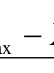

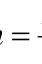

n

Trong đó: h : Trị số khoảng cách tổ.

Xmax : Lượng biến lớn nhất của tiêu thức phân tổ.

Xmin : Lượng biến nhỏ nhất của tiêu thức phân tổ.

n : Số tổ dự định chia.

Trong một số trường hợp khi phân tổ mà tổ đầu tiên có thể không
có giới hạn dưới, tổ cuối cùng không có giới hạn trên được gọi là phân tổ
mở.

3.2.2.3. Các chỉ tiêu giải thích.

Trong phân tổ thống kê, sau khi đã lựa chọn được tiêu thức phân tổ,
xác định số tổ cần thiết còn phải xác định các chỉ tiêu giải thích để nói rõ
đặc trưng của các tổ cũng như toàn bộ tổng thể.

Mỗi chỉ tiêu giải thích có ý nghĩa riêng giúp ta thấy rõ các đặc
trưng số lượng của từng tổ cũng như của toàn bộ tổng thể, làm căn cứ để
so sánh các tổ với nhau và để tính ra một số chỉ tiêu phân tích khác.

Muốn xác định các chỉ tiêu giải thích, chủ yếu phải căn cứ vào mục
đích nghiên cứu và nhiệm vụ của phân tổ để chọn ra các chỉ tiêu có liên
hệ với nhau và bổ sung cho nhau.

3.2.3. Dãy số phân phối

Dãy số phân phối là dãy số trình bày có thứ tự số lượng đơn vị của
từng tổ, trong một tổng thể đã được phân tổ theo một tiêu thức nhất định.

Dãy số phân phối có nhiều tác dụng trong nghiên cứu thống kê.
Người ta thường dùng dãy số phân phối để khảo sát tình hình phân phối

31

<!-- page 32 -->

các đơn vị tổng thể theo một tiêu thức nghiên cứu, qua đó thấy được kết
cấu của tổng thể và sự biến động kết cấu đó. Tùy thuộc vào tiêu thức
phân tổ người ta chia dãy số phân phối thành hai loại:

Dãy số phân phối theo tiêu thức thuộc tính (còn gọi là dãy số thuộc
tính) phản ánh kết cấu của tổng thể theo một tiêu thức thuộc tính nào đó.

Dãy số phân phối theo tiêu thức số lượng (còn gọi là dãy số lượng
biến) phản ánh kết cấu của tổng thể theo một tiêu thức số lượng nào đó.

Một dãy số lượng biến có hai thành phần: Lượng biến và tần số.
Lượng biến là các trị số nói lên biểu hiện cụ thể của tiêu thức số lượng,
thường ký hiệu bằng xi. Tần số là số đơn vị được phân phối vào trong
mỗi tổ, tức là số lần một lượng biến nhận một trị số nhất định trong tổng
thể. Tần số thường được ký hiệu bằng fi. Khi tần số được biểu hiện bằng
số tương đối (số %), gọi là tần suất thường được ký hiệu là di.

Lượng biến thiên của tiêu thức số lượng chia làm hai loại: Lượng
biến không liên tục và lượng biến liên tục. Lượng biến không liên tục
(còn gọi là lượng biến rời rạc) chỉ có các trị số bằng số nguyên như số
công nhân, số hợp tác xã, số xe vận tải... Lượng biến liên tục có thể được
biểu hiện bằng những trị số bất kỳ (số nguyên hoặc số thập phân) như
năng suất lúa, tỷ lệ hoàn thành kế hoạch...

Nếu dãy số phân phối theo tiêu thức số lượng có các tổ với khoảng
cách tổ không bằng nhau thì tần số trong các khoảng cách tổ không trực
tiếp so sánh với nhau được, vì các tần số đó phụ thuộc vào trị số khoảng
cách tổ. Để có thể so sánh được các tần số, người ta tính mật độ phân
phối. Mật độ phân phối của mỗi tổ là tỷ số giữa tần số (hoặc tần suất) với
trị số khoảng cách tổ của tổ đó. Ta có công thức sau:

f

mi =

i
h

i

Trong đó: mi: Mật độ phân phối

fi: Tần số

hi: Khoảng cách tổ

32

<!-- page 33 -->

3.3. Bảng thống kê và đồ thị thống kê

3.3.1. Bảng thống kê

3.3.1.1. Ý nghĩa tác dụng của bảng thống kê

Bảng thống kê là một hình thức biểu hiện các tài liệu thống kê một
cách có hệ thống, hợp lý và rõ ràng, nhằm nêu lên các đặc trưng về mặt
lượng của hiện tượng nghiên cứu. Đặc điểm chung của tất cả các bảng
thống kê bao giờ cũng có những con số bộ phận là chung, các con số này
có liên hệ mật thiết với nhau.

3.3.1.2. Cấu thành bảng thống kê

- Về hình thức: Bảng thống kê bao gồm các hàng ngang và cột dọc,
các tiêu đề và các tài liệu con số.

- Về nội dung: Bảng thống kê gồm hai phần: Phần chủ đề và phần
giải thích.

3.3.1.3. Các loại bảng thống kê

Căn cứ theo kết cấu của phần chủ đề, có thể chia làm ba loại bảng
thống kê: Bảng giản đơn, bảng phân tổ và bảng kết hợp.

a. Bảng giản đơn

Bảng giản đơn là loại bảng thống kê, trong đó phần chủ đề không
phân tổ. Trong phần chủ đề của bảng giản đơn có liệt kê các đơn vị tổng
thể, tên gọi các địa phương hoặc các thời gian khác nhau của quá trình
nghiên cứu.

b. Bảng phân tổ

Bảng phân tổ là loại bảng thống kê, trong đó đối tượng nghiên cứu
ghi trong phần chủ đề được phân chia thành các tổ theo một tiêu thức nào
đó.

c. Bảng kết hợp

Bảng kết hợp là loại bảng thống kê, trong đó đối tượng nghiên cứu
ghi trong phần chủ đề được phân tổ theo hai, ba,… tiêu thức kết hợp với
nhau.

3.3.1.4. Các yêu cầu đối với việc xây dựng bảng thống kê

33

<!-- page 34 -->

Việc xây dựng bảng thống kê cần đảm bảo những yêu cầu sau:

- Thứ nhất, quy mô của bảng thống kê không nên quá lớn, tức là
quá nhiều hàng, cột và nhiều phân tổ kết hợp.

- Thứ hai, các tiêu đề và tiêu mục trong bảng thống kê cần được ghi
chính xác, gọn và dễ hiểu.

- Thứ ba, các hàng và cột thường được ký hiệu bằng chữ hoặc bằng
số để tiện cho việc trình bày hoặc giải thích nội dung.

- Thứ tư, các chỉ tiêu giải thích trong bảng thống kê cần được sắp
xếp theo thứ tự hợp lý, phù hợp với mục đích nghiên cứu.

- Thứ năm, cách ghi các số liệu vào bảng thống kê: Các ô trong
bảng thống kê đều có ghi số liệu hoặc bằng các ký hiệu quy ước thay thế.

- Thứ sáu, phần ghi chú ở cuối bảng thống kê được dùng để giải
thích rõ nội dung của một số chỉ tiêu trong bảng, để nói rõ nguồn số liệu
đã được sử dụng trong bảng hoặc các chi tiết cần thiết khác.

3.3.2. Đồ thị thống kê

3.3.2.1. Ý nghĩa và tác dụng của đồ thị thống kê

Đồ thị thống kê là các hình vẽ hoặc đường nét hình học dùng để
miêu tả có tính chất quy ước các tài liệu thống kê.

Đồ thị thống kê có các đặc điểm chủ yếu sau:

- Đồ thị thống kê sử dụng con số kết hợp với hình vẽ, đường nét và
màu sắc để trình bày và phân tích các đặc trưng số lượng của hiện tượng.

- Đồ thị thống kê chỉ [VERIFY_OCR: chỉ/chí — check PDF trang 34] trình bày một cách khái quát các đặc điểm chủ
yếu về bản chất và xu hướng phát triển của các hiện tượng.

Ngoài ra, đồ thị thống kê còn được coi là một phương tiện tuyên
truyền, một công cụ dùng để biểu dương các kết quả sản xuất và hoạt
động văn hóa - xã hội.

3.3.2.2. Phân loại đồ thị thống kê

* Căn cứ vào hình thức biểu hiện, có thể phân chia đồ thị thống kê

34

<!-- page 35 -->

thành các loại sau: Đồ thị hình cột, đồ thị hình tượng, đồ thị diện tích
(tròn, chữ nhật [VERIFY_OCR: nhật/nhặt — check PDF trang 35], vuông), đồ thị đường gấp khúc, đồ thị ra đa.

* Căn cứ vào nội dung phản ánh, có thể phân chia đồ thị thống kê
thành các loại sau:

- Đồ thị phát triển: Đồ thị này dùng để biểu hiện tình hình phát triển
của hiện tượng và so sánh giữa các hiện tượng, có thể dùng các loại đồ
hình cột, hình tròn và đồ thị tuyến tính.

- Đồ thị kết cấu: Đồ thị này dùng để biểu hiện kết cấu và biến động
kết cấu của hiện tượng, thường dùng các loại đồ thị hình cột, hình tròn
(có thể chia nhỏ thành các hình quạt)

3.3.2.3. Những yêu cầu chung đối với việc xây dựng đồ thị thống kê

Một đồ thị thống kê phải đảm bảo các yêu cầu: Chính xác, dễ xem,
dễ hiểu và có tính mỹ thuật, để đảm bảo những yêu cầu này ta phải chú ý
đến các yếu tố chính của đồ thị, quy mô, các ký hiệu hình học hoặc các
hình vẽ, hệ tọa độ, thang và tỷ lệ xích, phần giải thích.

Quy mô của đồ thị được quyết định bởi chiều dài, chiều cao và
quan hệ tỷ lệ giữa hai chiều đó.

Các ký hiệu hình học hoặc hình vẽ quyết định hình dáng của đồ thị.

TÓM TẮT CHƯƠNG 3

Tổng hợp thống kê là tiến hành tập trung chỉnh lý [VERIFY_OCR: lý/ly — check PDF trang 35] và hệ thống hóa
một cách khoa học các tài liệu thu thập được trong điều tra thống kê. Đây
là giai đoạn thứ hai của quá trình nghiên cứu thống kê với mục tiêu cơ
bản là làm cho những đặc trưng riêng biệt trên từng đơn vị bước đầu
chuyển thành đặc trưng của toàn bộ tổng thể nghiên cứu. Trong trường
hợp khối lượng tài liệu tổng hợp gồm nhiều đơn vị để tiến hành tổng hợp,
thống kê sử dụng phương pháp phân tổ thống kê. Quá trình phân tổ thống
kê được thực hiện theo ba bước: Xác định tiêu thức phân tổ, xác định số
tổ cần thiết và khoảng cách tổ, xác định tổ trên giải thích và sắp đến các
đơn vị vào từng tổ.

35

<!-- page 36 -->

Sau khi tiến hành phân tổ thống kê theo một hay một số tiêu thức
nào đó, các đơn vị được phân phối vào các tổ, ta sẽ có một dãy số phân
phối. Có hai loại dãy số phân phối: dãy số phân phối theo tiêu thức thuộc
tính và dãy số phân phối theo tiêu thức số lượng.

Kết quả của quá trình phân tổ thống kê có thể được trình bày bằng
bảng thống kê hoặc đồ thị thống kê. Bảng thống kê là hình thức trình bày
số liệu một cách chi tiết, có hệ thống. Về hình thức một bảng thống kê
bao gồm các hàng ngang, cột dọc, tiêu đề, tiêu mục và con số. Có ba loại
bảng thống kê: Bảng giản đơn, bảng phân tổ và bảng kết hợp. Khi xây
dựng bảng thống kê cần đảm bảo một số yêu cầu nhất định. Đồ thị thống
kê là hình thức mô tả tài liệu thống kê một cách quy ước bằng cách sử
dụng các hình vẽ hoặc đường nét hình học. Đồ thị thống kê được sử dụng
rộng rãi trong nghiên cứu kinh tế. Có nhiều loại đồ thị thống kê như biểu
đồ hình tròn, biểu đồ diện tích, biểu đồ hình tượng. Mỗi loại biểu đồ có
khả năng diễn đạt riêng, do vậy trong mỗi trường hợp cụ thể cần phải lựa
chọn sử dụng loại biểu đồ thích hợp.

36

<!-- page 37 -->

Chương 4

## THỐNG KÊ MỨC ĐỘ CỦA HIỆN TƯỢNG KINH TẾ - XÃ HỘI

Mục tiêu:

➢ Nắm được khái niệm, đặc điểm các loại mức độ của hiện tượng,

biết cách tính các loại chỉ tiêu tuyệt đối, tương đối, trung bình,
chỉ tiêu đo độ biến thiên tiêu thức
➢ Vận dụng kiến thức để tính các chỉ tiêu kinh tế - xã hội trong

thực tế, có thể mô tả được đặc điểm của hiện tượng và làm cơ sở
cho phân tích

4.1. Số tuyệt đối trong thống kê

4.1.1. Khái niệm và ý nghĩa của số tuyệt đối

Số tuyệt đối trong thống kê biểu hiện quy mô, khối lượng của hiện
tượng trong điều kiện thời gian và địa điểm cụ thể.

Số tuyệt đối có thể biểu hiện số đơn vị của tổng thể hay bộ phận
(như số công nhân, số học sinh, số doanh nghiệp, số công ty,…) hoặc các
trị số của một tiêu thức nào đó (như doanh thu, chi phí sản xuất, tổng sản
phẩm trong nước, giá trị sản xuất công nghiệp, giá trị sản xuất nông
nghiệp, …).

Đơn vị tính của số tuyệt đối có thể là đơn vị tự nhiên, đơn vị giá trị
hoặc đơn vị thời gian lao động.

Số tuyệt đối có ý nghĩa quan trọng trong mọi công tác nghiên cứu
kinh tế. Thông qua các số tuyệt đối ta sẽ có một nhận thức cụ thể về quy
mô, khối lượng thực tế của hiện tượng nghiên cứu.

Số tuyệt đối là cơ sở đầu tiên để tiến hành phân tích thống kê đồng
thời là cơ sở để tính số tương đối và số bình quân.

Số tuyệt đối là căn cứ không thể thiếu được trong việc xây dựng
các kế hoạch kinh tế quốc dân và chỉ đạo thực hiện kế hoạch.

Số tuyệt đối chính xác là sự thật khách quan, có sức thuyết phục

37

<!-- page 38 -->

không thể phủ nhận được.

4.1.2. Các loại số tuyệt đối

* Số tuyệt đối thời kỳ, phản ánh quy mô, khối lượng của hiện tượng
trong một thời kỳ nhất định. Thời kỳ nghiên cứu càng dài thì trị số của số
tuyệt đối thời kỳ càng lớn và ngược lại.

* Số tuyệt đối thời điểm, phản ánh quy mô, khối lượng của hiện
tượng nghiên cứu tại một thời điểm nhất định. Số tuyệt đối thời điểm ít
phụ thuộc vào độ dài của thời kỳ nghiên cứu và không thể cộng các số
tuyệt đối thời điểm lại với nhau để được một số tuyệt đối thời điểm
chung.

4.2. Số tương đối

4.2.1. Khái niệm và ý nghĩa của số tương đối

Số tương đối trong thống kê biểu hiện quan hệ so sánh giữa hai
mức độ của hiện tượng nghiên cứu.

Số tương đối trong thống kê có thể biểu hiện bằng số lần hoặc phần
trăm (%) hay đơn vị kép (người/km2 ; 1000 đ/ người; …).

Số tương đối được sử dụng rộng rãi để nêu lên kết cấu, quan hệ so
sánh, tốc độ phát triển, trình độ phổ biến… của hiện tượng nghiên cứu
trong điều kiện thời gian và không gian cụ thể. Các số tương đối không
phải là con số thu thập được qua điều tra mà là kết quả so sánh giữa hai
chỉ tiêu thống kê, do đó số tương đối bao giờ cũng có gốc so sánh. Tùy
theo mục đích nghiên cứu, gốc dùng để so sánh có thể khác nhau.

Số tương đối trong thống kê có ý nghĩa quan trọng, cũng như các số
tuyệt đối, số tương đối nói lên mặt lượng trong mối liên hệ mật thiết với
mặt chất của hiện tượng nghiên cứu.

4.2.2. Các loại số tương đối

4.2.2.1. Số tương đối động thái

Số tương đối động thái biểu hiện sự biến động về mức độ của hiện
tượng nghiên cứu theo thời gian. Số tương đối động thái được tính bằng
cách so sánh hai mức độ cùng loại của hiện tượng ở hai thời kỳ (hay thời

38

<!-- page 39 -->

điểm) khác nhau. Mức độ thời kỳ được tiến hành nghiên cứu thường gọi
là mức độ kỳ báo cáo, còn mức độ của một thời kỳ nào đó được chọn làm
cơ sở so sánh thường gọi là mức độ kỳ gốc. Đơn vị tính của số tương đối
động thái là số lần hay số phần trăm.

y

1
y

đ
t
=
(4.1)

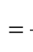

Công thức tính:

0

Trong đó: đ
t
: Số tương đối động thái.

1y : Mức độ kỳ nghiên cứu (kỳ báo cáo).

0y : Mức độ kỳ gốc.

Gốc so sánh của số tương đối động thái là gốc liên hoàn [VERIFY_OCR: hoàn/hoàng — check PDF trang 39] hoặc gốc
cố định. Số tương đối động thái còn được gọi là tốc độ phát triển hay chỉ
số phát triển.

4.2.2.2. Số tương đối kế hoạch

Số tương đối kế hoạch là chỉ tiêu tương đối phản ánh mức cần đạt
tới trong kỳ kế hoạch và mức thực tế đạt được so với kế hoạch được giao
về một chỉ tiêu kinh tế - xã hội nào đó. Số tương đối kế hoạch có đơn vị
tính là số lần hoặc phần trăm (%).

Số tương đối kế hoạch dùng để lập kế hoạch và đánh giá tình hình
thực hiện kế hoạch về các chỉ tiêu kinh tế - xã hội.

Có hai loại số tương đối kế hoạch: Số tương đối nhiệm vụ kế hoạch
và số tương đối thực hiện kế hoạch.

* Số tương đối nhiệm vụ kế hoạch: Biểu hiện quan hệ tỷ lệ giữa
mức độ kỳ kế hoạch (tức là mức độ cần đạt tới của chỉ tiêu nào đó trong
kỳ kế hoạch) với mức độ đã thực hiện ở kỳ gốc của chỉ tiêu nghiên cứu.

0y
y
t
kh
NK =
(4.2)

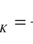

Công thức tính:

39

<!-- page 40 -->

Trong đó:
NK
t
: Số tương đối nhiệm vụ kế hoạch.

kh
y
: Mức độ kỳ kế hoạch.

0y
: Mức độ kỳ gốc.

* Số tương đối hoàn thành kế hoạch: Biểu hiện quan hệ so sánh
giữa mức độ thực tế kỳ nghiên cứu với mức độ kỳ kế hoạch trong kỳ của
chỉ tiêu nghiên cứu.

y
t
1
=
(4.3)

Công thức tính:

kh
HT
y

Trong đó:
HT
t
: Số tương đối hoàn thành kế hoạch.

kh
y : Mức độ kỳ kế hoạch.

1y   : Mức độ kỳ nghiên cứu.

Khi tính các số tương đối kế hoạch phải đảm bảo tính chất so sánh
được về nội dung, phương pháp tính… giữa mức độ kỳ thực tế và mức
độ kỳ kế hoạch.

Số tương đối kế hoạch và số tương đối động thái có mối quan hệ
tích số với nhau:

HT
NK
đ
t
t
t

=
(4.4)

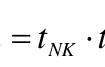

Số tương đối động thái bằng tích của số tương đối nhiệm vụ kế
hoạch và số tương đối hoàn thành kế hoạch.

4.2.2.3. Số tương đối kết cấu

Số tương đối kết cấu biểu hiện tỷ trọng của mỗi bộ phận cấu thành
trong một tổng thể. Số tương đối kết cấu là kết quả so sánh trị số của
từng bộ phận với trị số của cả tổng thể.

y
d =
(4.5)

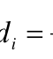

b
i
y

Công thức tính:

T

40

<!-- page 41 -->

Trong đó:
id  : Số tương đối kết cấu.

by : Trị số tuyệt đối từng bộ phận.

T
y : Trị số tuyệt đối của tổng thể.

Số tương đối kết cấu thường biểu hiện bằng số lần hoặc phần trăm.

Muốn tính các số tương đối kết cấu được chính xác trước hết phải
phân biệt các bộ phận có tính chất khác nhau trong tổng thể nghiên cứu
có nghĩa phải phân tổ chính xác. Vì vậy, việc tính số tương đối kết cấu có
quan hệ mật thiết với phương pháp phân tổ thống kê.

4.2.2.4. Số tương đối cường độ

Số tương đối cường độ biểu hiện trình độ phổ biến của hiện tượng
trong điều kiện lịch sử nhất định. Số tương đối cường độ được tính bằng
cách so sánh mức độ của hai hiện tượng khác nhau nhưng có quan hệ với
nhau. Số tương đối cường độ có đơn vị tính kép do đơn vị tính ở tử số và
mẫu số của số tương đối hợp thành. Số tương đối cường độ được sử dụng
rộng rãi để biểu hiện trình độ phát triển sản xuất, trình độ đảm bảo vật
chất và văn hóa của nhân dân một nước hoặc so sánh sự phát triển kinh tế
giữa các nước trong khu vực và trên thế giới. Các số tương đối cường độ
trong thống kê thường gặp như mật độ dân số tính bằng số người dân
(người) chia cho diện tích tự nhiên (km2) với đơn vị tính là người/km2;
GDP bình quân đầu người bằng GDP (1000đ) chia cho dân số trung bình
(người) với đơn vị tính là 1000đ/người; sản lượng lương thực bình quân
đầu người bằng (kg) chia cho dân số trung bình (người) với đơn vị tính là
kg/người; Bác sĩ tính trên vạn dân bằng số bác sĩ (người) chia cho dân số
(vạn người) với đơn vị tính là người/vạn người.

4.2.2.5. Số tương đối so sánh

Số tương đối so sánh biểu hiện quan hệ so sánh về mức độ giữa hai
mức độ trong một tổng thể hoặc giữa hai mức độ của hai hiện tượng cùng
loại nhưng khác nhau về không gian.

41

<!-- page 42 -->

A
s
y
y
t =
hoặc

B
s
y
y
t =
(4.6)

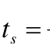

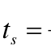

Công thức tính:

B

A

Trong đó:
st  : Số tương đối so sánh.

A
y : Mức độ của hiện tượng ở địa điểm A.

B
y : Mức độ của hiện tượng ở địa điểm B.

Tùy theo mục đích nghiên cứu và đặc điểm của hiện tượng có thể
thay đổi mức so sánh (đảo ngược giữa tử số và mẫu số).

4.2.3. Điều kiện vận dụng số tuyệt đối và số tương đối

4.2.3.1. Phải xét đến đặc điểm của hiện tượng nghiên cứu

Khi sử dụng số tuyệt đối và số tương đối phải chú ý đến đặc điểm
của hiện tượng trong điều kiện thời gian và không gian khác nhau. Có
những trường hợp cùng một biểu hiện về lượng, nhưng có thể mang ý
nghĩa khác nhau.

4.2.3.2. Phải vận dụng kết hợp các số tương đối với số tuyệt đối

Số tương đối thường là kết quả so sánh của hai số tuyệt đối, số
tương đối tính ra rất khác nhau, tùy thuộc vào việc lựa chọn gốc so sánh.

4.3. Số trung bình trong thống kê

4.3.1. Khái niệm, ý nghĩa của số trung bình

Số trung bình trong thống kê biểu hiện mức độ đại biểu (điển
hình) theo một tiêu thức nào đó của một tổng thể bao gồm nhiều đơn vị
cùng loại.

Số trung bình có tính chất tổng hợp và khái quát cao nêu lên mức
độ chung nhất, phổ biến nhất, có tính chất đại biểu nhất của tiêu thức
nghiên cứu, không kể đến sự chênh lệch thực tế giữa các đơn vị tổng thể.
Số trung bình không biểu hiện một mức độ cá biệt mà là mức độ tính
chung cho các đơn vị tổng thể.

Do số trung bình chỉ [VERIFY_OCR: chỉ/chí — check PDF trang 42] biểu hiện đặc điểm chung của cả tổng thể
nghiên cứu, cho nên các nét riêng biệt có tính chất ngẫu nhiên của từng

42

<!-- page 43 -->

đơn vị cá biệt bị loại trừ, có nghĩa là số trung bình có đặc điểm san
bằng mọi chênh lệch giữa các đơn vị về trị số của tiêu thức nghiên cứu
nhưng sự san bằng này chỉ có ý nghĩa khi ta tính toán số trung bình từ
số lượng đủ lớn.

Số trung bình có ý nghĩa quan trọng trong công tác lý luận và trong
thực tiễn, nó được dùng trong công tác nghiên cứu kinh tế nhằm nêu lên
đặc điểm chung của hiện tượng kinh tế - xã hội số lớn trong điều kiện
thời gian và địa điểm cụ thể.

Số trung bình còn được dùng để nghiên cứu các quá trình biến động
qua thời gian, nhất là các quá trình sản xuất. Sự biến động của số trung
bình qua thời gian cho thấy được xu hướng phát triển cơ bản của hiện
tượng số lớn, tức là của đại bộ phận các đơn vị tổng thể, trong khi từng
đơn vị cá biệt không cho ta thấy những điều đó.

Số trung bình chiếm một vị trí quan trọng trong việc vận dụng các
phương pháp phân tích thống kê: Khi phân tích sự biến động, phân tích
mối liên hệ, dự đoán thống kê, điều tra chọn mẫu đều sử dụng số trung
bình.

4.3.2. Các loại số trung bình

Trong thực tế có nhiều loại số trung bình, mỗi loại có công thức
tính toán khác nhau, sử dụng loại nào trong thống kê phải căn cứ vào đặc
điểm của hiện tượng, nguồn tài liệu sẵn có, căn cứ vào mục đích nghiên
cứu, ý nghĩa kinh tế.

4.3.2.1. Số trung bình cộng

Số trung bình cộng (còn gọi là số bình quân số học) được tính bằng
cách chia tổng các lượng biến (theo một tiêu thức nào đó) cho số đơn vị
tổng thể, với công thức tính như sau:

* Số trung bình cộng giản đơn

n

# i n 

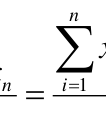

xi

=
=
+
+
=
1
2
1
...
(4.7)

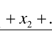

x
x
x
x

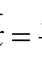

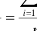

n

n

43

<!-- page 44 -->

Trong đó:

ix : Các lượng biến (i = 1,2,…,n).

## x  : Số trung bình.

n  : Số đơn vị tổng thể.

Công thức (4.7) được vận dụng để tính các mức độ trung bình của
các chỉ tiêu khi tài liệu thu thập chỉ có ít, không có phân tổ.

* Số trung bình công gia quyền

Công thức tính:

#   = + + +

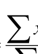

f
x

+
+
+
=

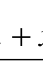

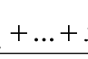

f
x
f
x
f
x
x
...

i
i

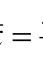

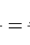

2
2
1
(4.8)

i
i
i

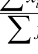

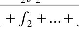

f
f
f

f

2
1

n

i

Trong đó:

ix   : Các lượng biến (i = 1,2,…,n).

if   : Các quyền số (tần số).

## x  : Số trung bình.

Công thức 4.8 được áp dụng để tính bình quân các lượng biến,
trong đó, mỗi lượng biến có số lần gặp khác nhau (số lần gặp còn gọi là
tần số hay ở đây gọi là quyền số). Như vậy số trung bình gia quyền được
áp dụng để tính bình quân các lượng biến trong dãy số có phân tổ

Chú ý:

Khi tính số trung bình theo số liệu từ dãy số phân tổ và có khoảng
cách tổ, ta phải tính số trung bình tổ (trị số giữa của mỗi tổ) sau đó áp
dụng công thức số trung bình cộng gia quyền theo công thức 4.8.

+
=

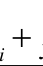

min
max
x
x
x
i
i
i

Số trung bình tổ (trị số giữa mỗi tổ)
2

Trong đó:
i
xmax  ,
i
xmin là giới hạn trên và giới hạn dưới của khoảng

cách tổ ở mỗi tổ, trị số xi này được coi là lượng biến đại diện cho mỗi tổ.

44

<!-- page 45 -->

- Đối với những dãy số lượng biến có khoảng cách tổ mở (tức là tổ
đầu và tổ cuối không có giới hạn dưới và giới hạn trên) thì việc tính toán
trị số giữa của các tổ này phải căn cứ vào khoảng cách tổ gần chúng nhất
mà tính toán cho hợp lý.

- Trường hợp tần số (
if ) cho dưới dạng tỷ trọng (số tương đối kết

cấu) ta có công thức tính:

# ; 100    = =

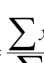

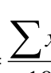

# d x x Trong đó: ;  =

i
i
d
x

i
i
f
f
d
(4.9)

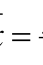

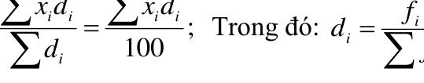

i

4.3.2.2. Số trung bình điều hòa

Số trung bình điều hòa cũng có nội dung kinh tế như số trung bình
cộng, tính được bằng cách đem chia tổng các lượng biến của tiêu thức
cho số đơn vị tổng thể.

* Số trung bình điều hòa gia quyền

Nếu tài liệu chỉ có lượng biến
)
(
ix  và tổng lượng biến, thiếu số liệu về

đơn vị tổng thể, ta áp dụng công thức số trung bình điều hòa gia quyền.

#  =

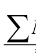

x
M
M
x
(4.10)

i

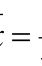

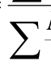

i

i

Trong đó:
ix : Các lượng biến (
n
i
,1
=
).

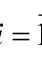

i
M : Tổng các lượng biến của tiêu thức (
n
i
,1
=
).

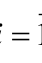

## x  : Số trung bình.

Nếu (
i
M ) cho dưới dạng tỷ trọng (số tương đối kết cấu) ta dùng

công thức:

#  =

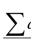

x
d
d
x
(4.11)

i

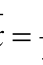

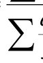

i

i

45

<!-- page 46 -->

i
i
M
M
d
là tỷ trọng của tổng lượng biến.

# Trong đó:  =

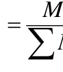

i

* Số trung bình điều hòa giản đơn

Trường hợp các quyền số (
i
M ) bằng nhau, tức là khi:

M
M
M
M
n =
=
=
=
...
2
1

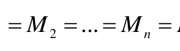

Công thức (4.9) có thể thay đổi như sau:

#  = = =

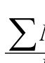

x
M
M
x
1
1
(4.12)

nM

n

i

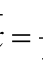

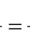

#   

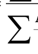

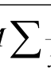

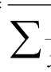

x
M

i

x

i
i
i

Công thức (4.12) được gọi là số trung bình điều hòa giản đơn.

4.3.2.3. Số trung bình nhân

Khi các lượng biến trong tổng thể có quan hệ tích số với nhau
người ta áp dụng công thức số trung bình nhân.

* Số trung bình nhân giản đơn

Công thức tính:

n
x
x
x
x
x

=
=
...
2
1
(4.13)

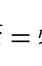

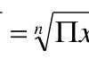

n

i
n

## Trong đó:  x  : Số trung bình

# xi  : Các lượng biến ( n i ,1 = )

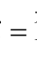

##  : Là ký hiệu của tích

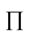

* Số trung bình nhân gia quyền

Khi các lượng biến (
ix ) có các tần số (fi) khác nhau ta có công thức

số trung bình nhân gia quyền.

Công thức tính:




=
=

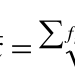

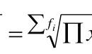

i
i
i
n
f
f
i
f
f
n
f
f
x
x
x
x
x
...
2
1

2
1
(
n
i
,1
=
)   (4.14)

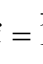

Trong đó: fi (i=1,2…k) là quyền số của các lượng biến.

46

<!-- page 47 -->

4.3.2.4. Mốt (ký hiệu là M0 )

Mốt là biểu hiện của tiêu thức gặp nhiều nhất trong một tổng thể
hay trong một dãy số phân phối. Có thể dùng mốt để bổ sung hoặc thay
thế cho số trung bình trong trường hợp tính số trung bình có khó khăn.
Cách tính Mốt cho dãy số lượng biến như sau:

- Đối với dãy số lượng biến không có khoảng cách tổ, Mốt là lượng
biến có tần số lớn nhất.

- Đối với dãy số lượng biến có khoảng cách tổ:

+ Trường hợp phân tổ có khoảng cách tổ đều nhau. Tổ có chứa Mốt
là tổ có tần số lớn nhất và Mốt được tính bằng công thức:

(
)
(
) (
)
3
2
1
2

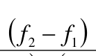

−
+
=
(4.15)

f
f
h
x
M
−
+
−

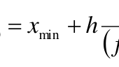

1
2
min
0
f
f
f
f

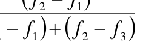

Trong đó:

min
x
: Giới hạn dưới của tổ có Mốt.

H
: Trị số khoảng cách tổ có Mốt.

2f
: Tần số của tổ có Mốt.

3
1, f
f
: Tần số của tổ đứng liền trước và liền sau tổ có Mốt.

+ Trường hợp phân tổ có khoảng cách tổ không đều nhau, tổ có
Mốt là tổ có mật độ phân phối lớn nhất. Sau đó ta áp dụng công thức sau
đây để tính giá trị của M0:

(
)
(
) (
)
3
2
1
2

−
+
=
(4.16)

m
m
h
x
M
−
+
−

1
2
min
0
m
m
m
m

Trong đó:

min
x
: Giới hạn dưới của tổ có Mốt.

h
: Trị số khoảng cách tổ có Mốt.

m2
: Mật độ phân phối của tổ có Mốt.

47

<!-- page 48 -->

m1, m3 : Mật độ phân phối của tổ đứng liền trước và liền

sau tổ có Mốt.

4.3.2.5. Số trung vị (ký hiệu Me)

Số trung vị là lượng biến của đơn vị tổng thể đứng vị trí giữa trong
tổng số các đơn vị của dãy số lượng biến.

• Đối với dãy số lượng biến không có khoảng cách tổ thì số trung
vị được tính cụ thể như sau:

- Nếu số đơn vị tổng thể lẻ, thì số trung vị là lượng biến của đơn vị
tổng thể đứng ở chính giữa của dãy số lượng biến:

Ta có:
m
e
x
M =
(4.17)

# xm: Lượng biến của đơn vị tổng thể thứ m ở chính giữa của dãy số

lượng biến.

- Nếu số đơn vị tổng thể chẵn, thì tổng thể đó có hai đơn vị đứng ở
giữa, do đó giá trị trung vị là số trung bình cộng của hai lượng biến ở giữa.

1
+
+
=
m
m
e

x
x
M
(4.18)

2

Trong đó:

m
x : Lượng biến của đơn vị tổng thể đứng giữa thứ nhất.

1
+
m
x
: Lượng biến của đơn vị tổng thể đứng giữa thứ hai.

• Đối với một dãy số lượng biến có khoảng cách tổ trước hết cần
xác định tổ chứa số trung vị. Muốn tìm tổ chứa số trung vị, ta cộng dồn
tần số các tổ, bắt đầu cộng từ tổ thứ nhất, thứ hai,… khi nào tổng các tần
số cộng được lớn hơn hoặc bằng một nửa số đơn vị tổng thể thì dừng lại
và xác định tổ có số trung vị, sau đó tính trị số trung vị theo công thức:

S
f

i

−
+
=

2
min
(4.19)

h
x
M

e
f

Me

48

<!-- page 49 -->

Trong đó:

min
x
: Giới hạn dưới của tổ có trung vị.

h      : Trị số khoảng cách tổ có trung vị.

Me
f
: Tần số của tổ có trung vị.

## S     : Tổng tần số của những tổ đứng trước tổ có trung vị.

- Tứ phân vị và thập phân vị

Trong phân tích kinh tế - xã hội, nhiều khi phải tính đến thứ bậc
của các đơn vị, nghĩa là chia các đơn vị của tổng thể nghiên cứu trong
dãy số phân phối thành các phần bằng nhau: Ba, bốn, năm… mười phần
rồi tính giá trị của các đơn vị đứng ở vị trí cơ bản. Tùy theo vị trí của các
đơn vị trong dãy số mà có tên gọi khác nhau như: Tam phân vị, tứ phân
vị,… cách tính các lượng biến thứ tự này giống cách tính số trung vị,
nghĩa là tính tần số tích lũy để tìm vị trí của đơn vị cần tìm, rồi đối chiếu
ra lượng biến. Nếu dãy số lượng biến có khoảng cách tổ, ta tìm tổ chứa
tứ phân vị, thập phân vị. Sau đó áp dụng công thức:

Tứ phân vị

# S f h x Q  − − + = (4.20)

1
4
1

1
0
1

Q
f

Q

1

Thập phân vị:

# S f h x Q  − − + = (4.21)

1
10
1

1
0
1

Q
f

Q

1

Trong đó:

0x    : Giới hạn đầu của tổ chứa tứ phân vị hoặc thập phân vị.

1
Q
h
: Khoảng các tổ của tổ chứa tứ phân vị và thập phân vị.

# f : Tổng cách tần số trong tổng thể.

1
1−
Q
S
: Tổng các tần số của những tổ đứng trước tổ chứa tứ phân

49

<!-- page 50 -->

vị, thập phân vị.

1
Qf
: Tần số của tổ chứa tứ phân vị, thập phân vị.

Tứ phân vị, thập phân vị thường được sử dụng khi người ta
muốn biết mức đạt cao nhất của 1/10 hay 1/4 số đơn vị tổng thể (xếp từ
thấp lên) hoặc mức tối thiểu của 1/10 hay 1/4 số đơn vị tổng thể (xếp từ
cao xuống).

4.3.3. Điều kiện vận dụng số trung bình

Muốn vận dụng số trung bình một cách khoa học và chính xác cần
chú ý các điều kiện sau:

- Thứ nhất, số trung bình chỉ được tính ra từ tổng thể đồng chất.

- Thứ hai, số trung bình chung cần được vận dụng kết hợp với số
trung bình tổ hay dãy số phân phối.

4.4. Nghiên cứu độ biến thiên của tiêu thức

4.4.1. Ý nghĩa nghiên cứu độ biến thiên của tiêu thức

Số trung bình chỉ [VERIFY_OCR: chỉ/chí — check PDF trang 50] nêu lên mức độ đại biểu có tính chất chung nhất
của tổng thể nghiên cứu. Mức độ này không phản ánh chênh lệch thực tế
giữa các đơn vị cá biệt, có khi bản thân nội bộ hiện tượng đã có nhiều
thay đổi đáng kể về mặt lượng, nhưng số trung bình tính ra không thay
đổi hoặc thay đổi ít. Vì vậy, trong phân tích thống kê, không nên chỉ [VERIFY_OCR: chỉ/chí — check PDF trang 50] hạn
chế ở việc tính mức độ trung bình mà cần đánh giá độ biến thiên của tiêu
thức.

Nghiên cứu độ biến thiên của tiêu thức có nhiều tác dụng quan
trọng về lý luận và thực tiễn.

- Thứ nhất, độ biến thiên tiêu thức giúp ta đánh giá trình độ đại biểu
của số trung bình. Trị số này tính ra càng lớn, độ biến thiên tiêu thức
càng nhiều, do đó trình độ đại biểu của số trung bình càng thấp và ngược
lại.

- Thứ hai, quan sát độ biến thiên tiêu thức trong một dãy số lượng
biến sẽ thấy được nhiều đặc trưng của dãy số như đặc trưng về phân

50

<!-- page 51 -->

phối; kết cấu; tính chất đồng đều của tổng thể…

- Thứ ba, trong phân tích hoàn thành kế hoạch, độ biến thiên tiêu
thức giúp ta thấy được chất lượng công tác và nhịp điệu hoàn thành kế
hoạch chung, cũng như của từng bộ phận, phát hiện khả năng tiềm tàng
của đơn vị.

- Thứ tư, độ biến thiên của tiêu thức còn được sử dụng trong nhiều
trường hợp nghiên cứu thống kê khác như: Phân tích sự biến động, mối
liên hệ, dự báo thống kê, điều tra chọn mẫu v.v…

4.4.2. Các chỉ tiêu đo độ biến thiên của tiêu thức

4.4.2.1. Khoảng biến thiên

Khoảng biến thiên là độ chênh lệch giữa lượng biến lớn nhất và
lượng biến nhỏ nhất của tiêu thức nghiên cứu.

Công thức tính:
min
max
x
x
R
−
=
(4.22)

4.4.2.2. Độ lệch tuyệt đối bình quân

Độ lệch tuyệt đối bình quân là trung bình cộng các trị số tuyệt đối
của các độ lệch giữa các lượng biến và trung bình của các lượng biến.

- Tính giản đơn áp dụng cho trường hợp không phân tổ:

i −

=
(4.23)

x
x
d

n

- Tính gia quyền áp dụng cho trường hợp có phân tổ:

−

=
(4.24)

f
x
x
d


i
i

f

i

4.4.2.3. Phương sai

Phương sai là số trung bình cộng của bình phương các độ lệch giữa
lượng biến với số trung bình của các lượng biến đó.

Công thức tính:

51

<!-- page 52 -->

- Tính giản đơn áp dụng cho trường hợp tài liệu không phân tổ:

2

2

(4.25)

=
1

n

- Tính gia quyền áp dụng cho trường hợp tài liệu được phân tổ:

2

f
x
x

i
i

2

(4.26)

1

=
n

f

i

i

1

Trong đó:
if  : Các tần số (
n
i
,1
=
).

4.4.2.4. Độ lệch tiêu chuẩn

Độ lệch tiêu chuẩn là căn bậc hai của phương sai:

Công thức tính:

n

# i 

(
)

2

x
x

=
1


(4.27)

n

n

(
)

2

f
x
x

i
i

1


(4.28)

=
n

f

i

i

1

Vẫn số liệu ở bảng ta có:
07
,1
20
23 =
=


4.4.2.5. Hệ số biến thiên

Hệ số biến thiên là tỷ số giữa độ lệch tiêu chuẩn với số trung bình
của các lượng biến.

Công thức tính:

52

<!-- page 53 -->

x
d
V =
(4.29)

x
V

=
(4.30)

TÓM TẮT CHƯƠNG 4

Đặc trưng về mặt lượng của hiện tượng kinh tế - xã hội mà thống
kê nghiên cứu được sử dụng phổ biến trong nghiên cứu thống kê bao
gồm: Số tuyệt đối, số tương đối, số trung bình và các chỉ tiêu đo độ biến
thiên tiêu thức.

Số tuyệt đối trong thống kê là chỉ tiêu biểu hiện quy mô khối lượng
của hiện tượng nghiên cứu trong điều kiện thời gian và không gian cụ
thể. Trong thống kê phân biệt hai loại số tuyệt đối: Số tuyệt đối thời kỳ
biểu hiện mức độ tích lũy của hiện tượng nghiên cứu trong một độ dài
thời gian nhất định. Số tuyệt đối thời điểm biểu hiện mức độ của hiện
tượng nghiên cứu tại một thời điểm.

Số tương đối biểu hiện quan hệ so sánh giữa hai mức độ của hiện
tượng nghiên cứu, tùy theo nội dung so sánh, phân biệt năm loại số tương
đối: Số tương đối động thái, số tương đối kết cấu, số tương đối so sánh,
số tương đối cường độ, số tương đối kế hoạch.

Số trung bình biểu hiện mức độ đại diện của một tổng thể bao gồm
nhiều đơn vị cùng loại. Mức độ trung bình được tính bằng công thức
trung bình cộng, trung bình điều hòa và trung bình nhân. Trong một số
trường hợp có thể sử dụng Mốt và Trung vị để bổ sung hoặc thay thế cho
số trung bình cộng.

Các chỉ tiêu đo độ biến thiên là tiêu thức sử dụng để đánh giá độ
đồng đều của tổng thể nghiên cứu. Thống kê sử dụng 5 chỉ tiêu để đo độ
biến thiên là: Khoảng biến thiên, độ lệch tuyệt đối trung bình, phương
sai, độ lệch tiêu chuẩn, hệ số biến thiên.

53

<!-- page 54 -->

### Chương 5

## HỒI QUY VÀ TƯƠNG QUAN

Mục tiêu

➢ Trang bị cho người học kiến thức, phương pháp về hồi quy và

tương quan phục vụ cho quá trình nghiên cứu thống kê.
➢ Sau khi học xong, người học sẽ hiểu khái niệm, nhiệm vụ,

phương pháp hồi quy và tương quan, cách thức vận dụng phương
pháp hồi quy và tương quan để phân tích mối liên hệ giữa các tiêu
thức nguyên nhân ảnh hưởng tới tiêu thức kết quả.

5.1. Mối liên hệ giữa các hiện tượng, nhiệm vụ của phương
pháp hồi quy và tương quan

5.1.1. Mối liên hệ giữa các hiện tượng

Mối liên hệ giữa các hiện tượng kinh tế - xã hội có thể diễn ra trong
không gian và thời gian. Liên hệ trong không gian là sự tác động qua lại,
sự phụ thuộc vào nhau khi chúng ở trong cùng một thời gian. Liên hệ
trong thời gian là sự tác động qua lại, sự phụ thuộc vào nhau khi chúng ở
các giai đoạn phát triển khác nhau. Do đó, khi phân tích mối liên hệ giữa
các hiện tượng phải đặt chúng trong điều kiện thời gian và không gian
nhất định.

Nếu xét theo mức độ liên hệ phụ thuộc giữa các hiện tượng, có thể
phân biệt liên hệ hàm số và liên hệ tương quan.

Liên hệ hàm số là mối liên hệ hoàn toàn chặt chẽ giữa hai hiện
tượng nghiên cứu. Các mối liên hệ hàm số thường được biểu hiện khi
nghiên cứu các hiện tượng tự nhiên như trong toán học, vật lý… nhưng
hiếm gặp trong các hiện tượng kinh tế - xã hội.

Liên hệ tương quan là mối liên hệ không hoàn toàn chặt chẽ giữa
các hiện tượng nghiên cứu. Khi hiện tượng này thay đổi có thể làm cho
hiện tượng có liên quan thay đổi theo, nhưng không có ảnh hưởng hoàn
toàn quyết định sự thay đổi đó. Các mối liên hệ này không hoàn toàn chặt
chẽ, không được biểu hiện rõ trên từng đơn vị cá biệt mà phải thông qua

54

<!-- page 55 -->

quan sát số lớn các đơn vị.

Nếu xét theo chiều hướng của mối liên hệ, có thể phân biệt liên hệ
thuận và liên hệ nghịch. Liên hệ thuận được biểu hiện khi trị số của tiêu
thức nguyên nhân và trị số của tiêu thức kết quả phát triển theo cùng một
hướng (cùng tăng hoặc cùng giảm). Ngược lại, liên hệ nghịch được biểu
hiện khi trị số của tiêu thức nguyên nhân và trị số của tiêu thức kết quả
phát triển ngược chiều.

5.1.2. Nhiệm vụ của phương pháp hồi quy và tương quan

Hồi quy và tương quan là hai phương pháp của toán học, được vận
dụng trong thống kê để nghiên cứu mối liên hệ tương quan giữa các hiện
tượng kinh tế - xã hội. Hai phương pháp này có liên quan chặt chẽ với
nhau và đều xuất phát từ cùng mục đích nghiên cứu, nên có thể gọi ngắn
gọn là phương pháp tương quan.

Phương pháp hồi quy và tương quan nhằm giải quyết hai nhiệm vụ
cơ bản:

- Xác định mô hình hồi quy biểu hiện mối liên hệ, nghĩa là xét xem
mối liên hệ giữa các tiêu thức nghiên cứu được biểu hiện dưới dạng mô
hình nào: Liên hệ tuyến tính (mô hình đường thẳng) hay phi tuyến tính
(mô hình đường cong), liên hệ thuận hay liên hệ nghịch...

Để giải quyết nhiệm vụ này cần phải tiến hành các bước chủ yếu
sau:

+ Dựa trên cơ sở phân tích lý luận để giải thích về sự tồn tại thực tế
và bản chất của mối liên hệ giữa các hiện tượng nghiên cứu.

+ Kết hợp phân tích lý luận với việc thăm dò mối liên hệ đó bằng
các phương pháp thống kê như: Phương pháp đồ thị, phương pháp phân
tổ, phương pháp số bình quân…, hoặc dựa trên cơ sở các kết quả nghiên
cứu có từ trước về hiện tượng.

+ Lựa chọn phương trình hồi quy để biểu hiện mối liên hệ. Muốn
xác định đúng phương trình phải căn cứ vào số tiêu thức được chọn, hình
thức và chiều hướng của mối liên hệ.

55

<!-- page 56 -->

+ Tính toán và nêu ý nghĩa của các tham số của phương trình
hồi quy.

- Đánh giá trình độ chặt chẽ của mối liên hệ bằng các chỉ tiêu hệ
số tương quan, tỉ số tương quan… Từ kết quả tính các chỉ tiêu này có thể
xác định vai trò ảnh hưởng của từng nguyên nhân, giải thích sự tồn tại
hay không tồn tại mối liên hệ tương quan và kiểm định lại giả thiết và sự
phù hợp của mô hình hồi quy đã chọn.

Trong phân tích tương quan, số tiêu thức được chọn ra nghiên cứu
càng nhiều thì quá trình tính toán càng phức tạp. Dưới đây trình bày cách
vận dụng cụ thể phương pháp hồi quy và tương quan trong một số trường
hợp tiêu biểu nhất.

5.2. Liên hệ tương quan tuyến tính giữa hai tiêu thức số lượng

5.2.1. Phương trình hồi quy tuyến tính

Mối liên hệ tương quan giữa các hiện tượng kinh tế - xã hội được
biểu hiện dưới dạng phương trình tuyến tính hoặc phi tuyến tính. Song,
trong nhiều trường hợp phân tích thông thường để đơn giản quá trình tính
toán, nếu với sai số cho phép người ta có thể sử dụng dạng phương trình
tuyến tính để mô tả một cách gần đúng mối liên hệ mà quá trình tính toán
lại đơn giản hơn.

Xét ví dụ về mối liên hệ giữa thâm niên công tác và tiền lương
trong năm qua tài liệu điều tra khảo sát ngẫu nhiên 10 công nhân tại một
doanh nghiệp như sau:

Bảng 5.1: Thâm niên công tác và tiền lương của công nhân

| STT | Thâm niên công tác (năm) | Tiền lương (Tr.đ) |
|---|---|---|
| 1 2 3 4 | 1 3 4 6 | 40 55 45 60 |

56

<!-- page 57 -->

5

7

60

6

8

75

7

10

72

8

12

85

9

14

80

10

15

98

Qua tài liệu ta nhận thấy: Theo xu thế chung khi thâm niên công tác
tăng lên, thì tiền lương của công nhân cũng có xu hướng tăng lên, nghĩa
là giữa tiêu thức thâm niên công tác và tiền lương có mối liên hệ với
nhau, nhưng mối liên hệ này không hoàn toàn chặt chẽ, hay mối liên hệ
tương quan có thể quan sát trên đồ thị (hình vẽ).

Đồ thị 5.1: Mối liên hệ giữa thâm niên công tác và tiền lương

của công nhân

Đường gấp khúc biểu diễn mối liên hệ giữa thâm niên công tác (x)
và tiền lương (y) gọi là đường hồi quy thực nghiệm, được hình thành từ
tài liệu điều tra thực tế. Đường này chưa phản ánh rõ nét mối quan hệ
giữa hai tiêu thức nhưng có xu hướng đi lên từ trái qua phải, điều này cho
phép ta tìm một đường thẳng cùng hướng, gần với nó có thể thay thế cho
đường hồi quy thực nghiệm nhưng biểu hiện rõ hơn mối liên hệ. Đường
thẳng này được gọi là đường hồi quy lý thuyết, trên đồ thị vị trí của
đường hồi quy lý thuyết được xác định bởi phương trình có dạng:

57

<!-- page 58 -->

Ŷx = a + bx                              (5.1)

Trong đó:

x   :   Trị số của tiêu thức nguyên nhân (thâm niên công tác).

Ŷx    :  Trị số lý thuyết của tiêu thức kết quả (tiền lương).

a, b: Các tham số của phương trình.

Phương trình (5.1) gọi là phương trình hồi quy tuyến tính, các tham
số a, b sẽ quy định vị trí của đường hồi quy lý thuyết. Các tham số này
phải được xác định sao cho đường hồi quy lý thuyết có thể mô tả một
cách sát nhất mối liên hệ tương quan. Thông thường, ta áp dụng phương
pháp bình phương nhỏ nhất nghĩa là sao cho tổng bình phương các chênh
lệch giữa các trị số thực tế và trị số lý thuyết là cực tiểu:

##  = − min ) ˆ ( 2 xy y

Từ đó suy ra hệ phương trình chuẩn:

##   = + y x b na . (5.2)

##    = + y x x b x a . . . 2

Giải hệ phương trình (5.2) tính được a, b hoặc có thể biến đổi tiếp
theo ta có:

−
=
(5.3)

y
x
y
x
b
2

.
.

x

x
b
y
a
.
−
=

Để giải hệ phương trình (5.2) ta lập bảng tính toán:

Bảng 5.2: Các đại lượng tính các tham số của phương trình

| Thâm niên công tác (x) | Tiền lương (y) | x.y | x2 | y2 |
|---|---|---|---|---|
| 1 3 | 40 55 | 40 165 | 1 9 | 1.600 3.025 |

58

<!-- page 59 -->

| 4 6 7 8 10 12 14 15 | 45 60 60 75 72 85 80 98 | 180 360 420 600 720 1.020 1.120 1.470 | 16 36 49 64 100 144 196 225 | 2.025 3.600 3.600 5.625 5.184 7.225 6.400 9.604 |
|---|---|---|---|---|
| 80 | 670 | 6.095 | 840 | 47.888 |

Thay số liệu trong bảng tính toán vào hệ phương trình (5.2):

10a + 80b = 670

80a + 840b = 6.095

Giải hệ phương trình:

a = 37,6

b = 3,675

Tính toán a, b theo công thức (5.3) ta có:

8
10
80 =
=

= n

x
x
;
67
10
670 =
=

= n

y
y

xy
xy
;
20
8
10
840
2
2
2
2
=
−
=
−
=
x
x
x


609
10
6095
=
=

=
n

2
=

−
=
−
=

y
x
y
x
b


67
8
5,
609
.
.

675
,3
20

6,
37
8
675
,3
67
.
=

−
=
−
=
x
b
y
a

Phương trình hồi quy có dạng:

x = 37,6 + 3,675x

Trong phương trình này: Tham số a = 37,6 là điểm xuất phát của

59

<!-- page 60 -->

đường hồi quy lý thuyết, đây là tham số tự do không phụ thuộc vào x, nói
lên mức độ ảnh hưởng của các nguyên nhân khác đối với tiền lương của
công nhân; Tham số b = 3,675 gọi là hệ số hồi quy, quy định độ dốc của
đường hồi quy lý thuyết, nói lên ảnh hưởng của tiêu thức nguyên nhân x
tới tiêu thức kết quả y. Cụ thể khi thâm niên công tác tăng 1 năm thì tiền
lương của công nhân tăng trung bình là 3,675 triệu đồng.

5.2.2. Hệ số tương quan

Một trong những yêu cầu quan trọng của phân tích hồi quy và
tương quan là xác định cụ thể trình độ chặt chẽ của mối liên hệ. Hệ số
tương quan là chỉ tiêu tương đối (số lần) để đánh giá trình độ chặt chẽ và
chiều hướng của mối liên hệ tương quan tuyến tính.

Hệ số tương quan giúp ta xác định được cường độ của mối liên hệ,
xem xét mức độ ảnh hưởng của tiêu thức nguyên nhân đến tiêu thức kết
quả. Trong những điều kiện thời gian và không gian khác nhau, mối liên
hệ tương quan giữa cùng một số hiện tượng cũng có thể có trình độ chặt
chẽ khác nhau. Qua việc đánh giá này có thể tìm ra các nguyên nhân chủ
yếu tác động đến hiện tượng nghiên cứu.

Hệ số tương quan giúp ta xác định chiều hướng của mối liên hệ
(mối liên hệ thuận hay nghịch).

Hệ số tương quan cho phép kiểm định giả thuyết về sự tồn tại hay
không tồn tại mối liên hệ tương quan tuyến tính.

Hệ số tương quan còn được sử dụng trong dự báo thống kê và tính
sai số dự báo.

Trong toán học có nhiều phương pháp và nhiều công thức tính hệ
số tương quan. Thống kê học vận dụng một số công thức đơn giản và
thích hợp nhất. Sau đây là một số công thức tính hệ số tương quan
thường dùng:

−
−

=
(5.4)

)
y
y
)(
x
x
(
r

i
i

2
i
2
i

)
y
y
(
.
)
x
x
(

Từ công thức (5.4) biến đổi ra một số công thức tính sau:

60

<!-- page 61 -->

.
. −
=
(5.5)

y
x
y
x
r

.

x
b
r


.
=
(5.6)

Có thể tính hệ số tương quan từ ví dụ bằng các công thức (5.4),
(5.5), (5.6).

Giả sử theo công thức (5.6):

8,
299
67
10
47888
2
2
2
2

=
−
=
−
=

20
675
,3

=

=

r

949
,0
8,
299

Như vậy, hệ số tương quan có thể tính bằng nhiều công thức khác
nhau, tùy theo nguồn tài liệu cụ thể ta có thể sử dụng công thức tính toán
phù hợp.

Hệ số tương quan có các tính chất sau:

r: Mang dấu (+) mối liên hệ tương quan thuận.

r: Mang dấu (-) mối liên hệ tương quan nghịch.

- r = 0: Giữa x, y không có liên hệ tương quan tuyến tính.

- r càng gần ±1, mối liên hệ càng chặt chẽ và càng gần 0 mối liên
hệ càng lỏng lẻo. Mức độ chặt chẽ hay lỏng lẻo của hệ số tương quan
được xác định như sau:

Bảng 5.3: Mức độ chặt chẽ (lỏng lẻo) của hệ số tương quan

| \|r\| Giá trị tuyệt đối của hệ số tương quan | < 0,3 | 0,3 - 0,7 | > 0,7 |
|---|---|---|---|
| Mức độ phụ thuộc | Lỏng lẻo | Trung bình | Chặt chẽ |

61

<!-- page 62 -->

Theo ví dụ r = 0,949, có thể đánh giá: Mối liên hệ giữa thâm
niên công tác và tiền lương là mối liên hệ tương quan thuận và tương
đối chặt chẽ.

Chú ý: Ở mục trên ta nghiên cứu mối liên hệ tương quan thuận giữa
thâm niên công tác và tiền lương qua tài liệu điều tra trên 10 công nhân.
Nhưng trong thực tế, khi nghiên cứu mối quan hệ tương quan giữa các
tiêu thức cần tuân theo quy luật số lớn nghĩa là phải thu thập tài liệu ở
một số đủ lớn đơn vị. Các tài liệu này sẽ được phân tổ kết hợp theo tiêu
thức nguyên nhân (x) và tiêu thức kết quả (y).

Nếu gọi:

nx : Tần số các tổ được phân tổ theo tiêu thức x.

ny : Tần số các tổ được phân tổ theo tiêu thức y.

nxy : Tần số các tổ được phân tổ kết hợp theo tiêu thức x, y.

N: Tổng tần số (số đơn vị).

## xy y x n n n N  =  =  = 

Trường hợp phân tổ có khoảng cách tổ, các giá trị x, y là trị số giữa
của mỗi tổ. Ta có bảng phân tổ sau:

Bảng 5.4: Phân tổ kết hợp theo tiêu thức x và y

| x y | … | n y |
|---|---|---|
| … | n xy | … |
| n x | … | N |

Phương trình hồi quy: ỹx
bx
a +
=

Tính các tham số a, b và hệ số tương quan đều phải có tần số
tương ứng.

Hệ phương trình xác định tham số a,b:


=

+

n
y
n
x
b
a
N

.
.
.

y
x

(5.7)

2

=

+


n
y
x
n
x
b
n
x
a

.
.
.
.

xy
x
x

62

<!-- page 63 -->

Hệ số tương quan:

−
−

=
(5.8)

n
y
y
x
x
r

).
)(
(

xy

2
2
−

−


.
)
(
.
)
(

n
y
y
n
x
x

y
x

5.3. Liên hệ tương quan phi tuyến tính giữa hai tiêu thức
số lượng

5.3.1. Các phương trình hồi quy phi tuyến tính

Trong nhiều trường hợp nghiên cứu ta thấy mối liên hệ tương quan
giữa các tiêu thức không phải khi nào cũng được biểu hiện bằng một
đường thẳng, mà có thể là các đường cong có hình dáng khác nhau, đó là
mối liên hệ tương quan phi tuyến tính.

Các mối liên hệ tương quan như: Giữa tuổi nghề với năng suất lao
động, giữa chi phí quảng cáo với doanh thu tiêu thụ sản phẩm…, trong
một phạm vi [VERIFY_OCR: vi/vĩ — check PDF trang 63] nghiên cứu nhất định có thể được biểu hiện là mối liên hệ
tương quan tuyến tính. Nhưng thực tế, các doanh nghiệp ở các điều kiện
sản xuất kinh doanh khác nhau thì mối liên hệ trên lại có thể là phi tuyến
tính. Chẳng hạn: Trong một số ngành sản xuất khi tuổi nghề tăng lên thì
lúc đầu làm cho năng suất lao động tăng theo, nhưng sau đó lại giảm dần.
Điều đó có thể giải thích rằng: Khi tuổi nghề tăng lên đồng nghĩa với tuổi
đời cao, sức lao động giảm và năng suất lao động giảm. Cũng như vậy,
khi doanh nghiệp tăng chi phí cho quảng cáo làm tăng doanh thu nhưng
chỉ [VERIFY_OCR: chỉ/chí — check PDF trang 63] đến mức độ nào đó thì dừng lại hoặc có tăng với mức độ chậm dần…
Như vậy, nếu ta thu thập được số lớn dữ liệu và phân tích, thì mối liên hệ
giữa tuổi nghề và năng suất lao động, giữa chi phí quảng cáo và doanh
thu đều được biểu hiện bằng các đường cong tức là liên hệ tương quan
phi tuyến tính. Ta còn có thể gặp các trường hợp khác tương tự như khi
nghiên cứu mối liên hệ giữa năng suất lao động với giá thành đơn vị sản
phẩm, thu nhập với nhu cầu tiêu dùng hàng hóa và dịch vụ của dân cư…

Về mặt toán học, có nhiều phương trình hồi quy để biểu hiện mối
liên hệ tương quan phi tuyến tính. Sau đây là một số dạng phương trình
tiêu biểu:

- Phương trình hồi quy pa-ra-bôn:

Trường hợp khi tiêu thức nguyên nhân tăng (giảm) với lượng đều
nhau, thì tiêu thức kết quả biến động không đều và đến một mức độ nào

63

<!-- page 64 -->

đó (cực tiểu hay cực đại) lại đảo chiều. Ví dụ như mối liên hệ giữa tuổi
nghề và năng suất lao động, thu nhập và nhu cầu tiêu dùng… Nếu thăm
dò bằng đồ thị trục hoành là tiêu thức nguyên nhân (x), trục tung là tiêu
thức kết quả (y), các điểm trên đồ thị được phân bố theo một trong hai
dạng sau đây có thể xây dựng mô hình hồi quy pa-ra-bôn:

Phương trình pa-ra-bôn :

2
ˆ
cx
bx
a
yx
+
+
=
(5.9)

Áp dụng phương pháp bình phương nhỏ nhất sẽ có hệ phương
trình sau đây để tìm giá trị các hệ số a, b, c:

2

x
c
x
b
na
y

3
2

(5.10)

x
c
x
b
x
a
xy

4
3
2
2

x
c
x
b
x
a
y
x

- Phương trình hồi quy hy-pe-bôn:

Trường hợp khi tiêu thức nguyên nhân tăng mà trị số của tiêu thức
kết quả giảm với tốc độ không đều, lúc đầu nhanh sau chậm dần. Ví dụ
như mối liên hệ giữa sản lượng sản xuất với giá thành đơn vị sản phẩm.
Nếu thăm dò bằng đồ thị, các điểm trên đồ thị được phân bố theo dạng
sau đây có thể xây dựng mô hình hồi quy hy-pe-bôn:

64

<!-- page 65 -->

Phương trình hy-pe-bôn:

x
b
a
yx
+
=
ˆ
(5.11)

Áp dụng phương pháp bình phương nhỏ nhất sẽ có hệ phương trình
sau đây để tìm giá trị các hệ số a, b:

1

x
b
na
y

(5.12)

2
1
1
1

x
b
x
a
x
y

- Phương trình hàm số mũ:

Trường hợp khi tiêu thức nguyên nhân tăng (giảm) làm cho tiêu
thức kết quả thay đổi gần như một cấp số nhân. Nếu thăm dò bằng đồ thị
các điểm trên đồ thị được phân bố theo dạng sau đây có thể xây dựng mô
hình hàm mũ:

65

<!-- page 66 -->

Phương trình hàm số mũ:

x
x
ab
y =
ˆ
(5.13)

Áp dụng phương pháp bình phương nhỏ nhất sẽ có hệ phương trình
sau đây để tìm giá trị các hệ số a, b:


+
=


ln
ln
ln

x
b
a
n
y

2
ln
ln
ln

(5.14)


+

=


x
b
x
a
y
x

Giải hệ phương trình trên sẽ được lna, lnb. Tra đối ln sẽ tìm được
giá trị của a, b.

Ngoài ra, các mối liên hệ còn có thể biểu hiện dưới dạng hàm bậc
3, hàm lũy thừa, hàm logarit… Việc vận dụng dạng phương trình nào
phải căn cứ vào việc phân tích tính chất của mối liên hệ giữa các tiêu
thức.

5.3.2. Tỷ số tương quan (Ký hiệu : êta)

Tỷ số tương quan được sử dụng để đánh giá mức độ chặt chẽ mối
liên hệ tương quan phi tuyến tính giữa hai tiêu thức số lượng và được
tính theo công thức sau đây:



(5.15)

−

−
=

2

)
(
1
y
y

y
y
x
−


2

)
(

Trong đó : y : Các giá trị thực tế.

:
ˆ xy
Các giá trị lý thuyết của y theo x.

: Giá trị trung bình của y.

Tính chất:  nằm trong khoảng [0;1] tức là: 0≤≤1

Cụ thể:

- nếu  = 1: Giữa x và y có mối liên hệ hàm số.

- Nếu  = 0: Giữa x và y không có mối liên hệ.

- Nếu  càng gần 1 thì mối liên hệ càng chặt chẽ và càng gần 0 thì

mối liên hệ càng lỏng lẻo.

Tỷ số tương quan có thể đánh giá được trình độ chặt chẽ của mối
liên hệ, nhưng không đánh giá được chiều hướng của mối liên hệ.

66

<!-- page 67 -->

Tỷ số tương quan còn có thể được sử dụng trong trường hợp đánh
giá mức độ chặt chẽ của các mối liên hệ tương quan tuyến tính. Khi giữa
các tiêu thức x và y có liên hệ tương quan tuyến tính thì việc tính r và 

đều cho kết quả giống nhau. Còn nếu x và y có liên hệ tương quan phi
tuyến tính thì các kết quả tính toán giữa hai chỉ tiêu này sẽ khác nhau.

5.4. Liên hệ tương quan tuyến tính giữa nhiều tiêu thức số lượng

Khi phân tích mối liên hệ giữa nhiều tiêu thức, trước hết phải căn
cứ vào mục đích nghiên cứu để xác định các tiêu thức nguyên nhân ảnh
hưởng tới tiêu thức kết quả, sau đó chỉ [VERIFY_OCR: chỉ/chí — check PDF trang 67] chọn ra các tiêu thức nguyên nhân
có ý nghĩa nhất, ảnh hưởng chủ yếu đến tiêu thức kết quả để nghiên cứu.
Số tiêu thức được chọn ra càng nhiều thì việc phân tích càng có ý nghĩa,
song việc tính toán càng phức tạp.

Sau khi đã chọn được các tiêu thức có mối liên hệ với nhau, cần
xác định phương trình hồi quy biểu hiện mối liên hệ đó. Các tiêu thức
nguyên nhân có tác động rất khác nhau đến tiêu thức kết quả, để đơn giản
việc tính toán, thông thường người ta chọn dạng phương trình hồi quy
tuyến tính biểu hiện mối liên hệ giữa nhiều tiêu thức. Ngay cả trong
trường hợp giữa các tiêu thức có mối liên hệ tương quan phi tuyến tính
thì kết quả tính toán cũng không sai lệch nhiều.

5.4.1. Phương trình hồi quy tuyến tính nhiều tiêu thức

Phương trình hồi quy tuyến tính biểu hiện mối liên hệ giữa nhiều
tiêu thức có dạng tổng quát như sau:

x = a0 + a1x1 + a2x2 + …+ akxk.                           (5.16)

Trong đó:

xi (i = 1,…, k) là trị số của các tiêu thức nguyên nhân.

ai (i = 0,…, k) là các tham số của phương trình.

Bằng phương pháp bình phương nhỏ nhất suy ra hệ phương trình
tính các tham số:

67

<!-- page 68 -->

y
x
a
x
a
x
a
n
a

...
.

2
2
1
1
0


=

+
+

+

+


1
1
2
1
2
2
1
1
1
0

y
x
x
x
a
x
x
a
x
a
x
a

...
.

k
k


=

+
+

+

+


2
2
2
2
2
2
1
1
2
0

(5.17)

y
x
x
x
a
x
a
x
x
a
x
a

...
.

k
n

........
..........


=

+
+

+

+


2
2
2
2
1
1
0

y
x
x
a
x
x
a
x
x
a
x
a

...
.

k
k
k
k
k

Giả sử có hai tiêu thức nguyên nhân x1, x2 thì phương trình hồi quy:

x = a0 + a1x1+ a2x2
(5.18)

Và hệ phương trình xác định a0, a1,a2

y
x
a
x
a
n
a

2
2
1
1
0


=

+

+


1
2
1
2
2
1
1
1
0

(5.19)

y
x
x
x
a
x
a
x
a

.


=

+

+


2
2
2
2
2
1
1
2
0

y
x
x
a
x
x
a
x
a

.

Các tham số a0, a1, a2 cũng có thể được tính từ công thức:


−

= 

r
r
r
a



x
x
yx
yx

2
1
2
1

2
1

1
1
x
x

r

2
1


−

= 

r
r
r
a
−


(5.20)

x
x
yx
yx

2
1
1
2

2
2

2
1
x
x

r

2
1

2
2
1
1
0
x
a
x
a
y
a
−
−
=

Trong đó: ryx1, ryx2, rx1x2 là các hệ số tương quan tuyến tính giữa các
cặp tiêu thức yx1, yx2 và x1x2:

−
=

x
y
yx
r

.

1
1

x
y
yx

1

1

−
=

x
y
yx
r

.

2
2

(5.21)

x
y
yx

2

2

−
=

x
x
x
x
r

.

2
1
2
1

x
x
x
x

2
1

2
1

5.4.2. Hệ số tương quan

68

<!-- page 69 -->

Để đánh giá trình độ chặt chẽ của mối liên hệ giữa nhiều tiêu thức
ta tính hệ số tương quan bội và hệ số tương quan riêng.

Hệ số tương quan bội được dùng để đánh giá trình độ chặt chẽ của
mối liên hệ giữa tất cả các tiêu thức nguyên nhân nghiên cứu đến tiêu
thức kết quả.

Hệ số tương quan riêng: Được dùng để đánh giá trình độ chặt chẽ
của mối liên hệ riêng từng tiêu thức nguyên nhân đến tiêu thức kết quả
với điều kiện đã loại trừ ảnh hưởng của các tiêu thức nguyên nhân khác.

Hệ số tương quan bội giữa hai tiêu thức nguyên nhân x1, x2 với tiêu
thức kết quả y được tính theo công thức:

−
+
=
(5.22)

2
2

r
r
r
r
r
R
−

2

x
x
yx
yx
yx
yx
x
yx
r

2

2
1
2
1
2
1

2
1
1

x
x

2
1

R = 0: Không có liên hệ tuyến tính.

R = 1: Mối liên hệ hàm số.

R càng gần 1 thì mối liên hệ càng chặt chẽ.

Để phân tích sâu sắc hơn, có thể đánh giá trình độ chặt chẽ của mối
liên hệ riêng từng tiêu thức nguyên nhân x1, x2

đến tiêu thức kết quả y,
với điều kiện loại trừ ảnh hưởng của nguyên nhân khác. Đó là các hệ số
tương quan riêng:

Hệ số tương quan riêng giữa x1 với y (loại trừ ảnh hưởng của x2).

−
=
(5.23)

r
r
r
R

x
x
yx
yx
)
x
(
yx

2
1
2
1

2
1
−
−

x
x
2
yx

2

)
r
1
)(
r
1(

2
1
2

Hệ số tương quan riêng giữa x2 với y (loại trừ ảnh hưởng của x1).

−
=
(5.24)

r
r
r
R

x
x
yx
yx
)
x
(
yx

2
1
1
2

1
2
−
−

x
x
2
yx

2

)
r
1
)(
r
1(

2
1
2

69

<!-- page 70 -->

Sau đây là ví dụ phân tích mối liên hệ tương quan giữa ba tiêu thức:

5.5. Hệ số co giãn

Phương pháp hồi quy và tương quan giúp ta nghiên cứu mối liên hệ
giữa các tiêu thức, ngoài ra còn có thể tính toán hệ số co giãn để đo mức
độ phản ứng của tiêu thức kết quả (y) đối với sự biến thiên của tiêu thức
nguyên nhân (x).

x = f(x); số gia của tiêu thức nguyên
nhân x là ∆x, số gia của tiêu thức kết quả y là
)
x
(f
)
x
x
(f
y
−

+
=

, ta có

Giả sử phương trình hồi quy

hệ số co giãn:

y
E



=
(5.25)

x
y

x

Trong trường hợp x, y có mối quan hệ tương quan tuyến tính thì:

y
x
b
E =
(5.26)

b: Hệ số hồi quy

Thông thường, người ta thay giá trị x, y bằng số trung bình của
chúng, khi đó:

y
x
b
E =
(5.27)

Hệ số co giãn phản ánh khi tiêu thức nguyên nhân x thay đổi 1% thì
làm cho tiêu thức kết quả y thay đổi bao nhiêu %.

Tính chất của hệ số co giãn:

- E dương thì giữa x,y đồng biến. E âm thì x, y nghịch biến.

- E = ± 1: Sự biến thiên của x, y trùng nhau.

- E = 0 thì y không biến đổi (hằng số).

|E| > 1: Sự biến thiên của x nhanh hơn sự biến thiên của y.

|E| < 1: Sự biến thiên của y nhanh hơn sự biến thiên của x.

70

<!-- page 71 -->

TÓM TẮT CHƯƠNG 5

Các hiện tượng kinh tế - xã hội luôn tồn tại trong mối liên hệ phụ
thuộc và ràng buộc lẫn nhau. Tuỳ theo mức độ phụ thuộc của mối liên
hệ, có thể chia thành hai loại: Liên hệ hàm số và liên hệ tương quan.

Mối liên hệ giữa các hiện tượng kinh tế - xã hội thường là mối liên
hệ tương quan. Thống kê sử dụng phương pháp hồi quy và phương pháp
tương quan để nghiên cứu mối liên hệ đó (có thể gọi ngắn gọn là phương
pháp tương quan).

Phương pháp hồi quy và tương quan nhằm giải quyết hai nhiệm vụ
cơ bản: Xác định mô hình hồi quy biểu hiện mối liên hệ và đánh giá trình
độ chặt chẽ của mối liên hệ bằng các hệ số tương quan hay tỷ số tương
quan.

Trường hợp giản đơn là nghiên cứu mối liên hệ giữa hai tiêu thức
số lượng. Có thể dựa trên cơ sở phân tích lý luận, kết hợp các phương
pháp thống kê như phương pháp đồ thị, phân tổ,... để xác định dạng mô
hình hồi quy là tuyến tính (phương trình bậc nhất) hay phi tuyến tính
(phương trình bậc 2, 3, hàm số mũ, ...). Dạng tổng quát của phương trình
hồi quy biểu diễn mối liên hệ giữa tiêu thức nguyên nhân (x) và tiêu thức
kết quả (y) là: yx = f(x). Các hệ số của phương trình được xác định bằng
phương pháp bình phương nhỏ nhất, từ đó dẫn đến hệ phương trình
chuẩn, giải hệ phương trình sẽ có kết quả. Các hệ số đó sẽ cho thấy mức
độ ảnh hưởng của tiêu thức nguyên nhân (x) đến tiêu thức kết quả (y). Hệ
số tương quan (trường hợp mối liên hệ tương quan tuyến tính), tỷ số
tương quan (trường hợp mối liên hệ tương quan phi tuyến tính) được sử
dụng để đánh giá trình độ chặt chẽ của mối liên hệ tương quan giữa hai
tiêu thức số lượng.

Trường hợp phức tạp là nghiên cứu mối liên hệ tương quan giữa
nhiều tiêu thức (nhiều tiêu thức nguyên nhân ảnh hưởng tới một tiêu thức
kết quả). Dạng tổng quát của phương trình hồi quy là: yx = f(x1,x2,...,xn).
Các hệ số của phương trình tính được sẽ đánh giá vai trò ảnh hưởng của
mỗi tiêu thức nguyên nhân đến tiêu thức kết quả. Hệ số tương quan bội

71

<!-- page 72 -->

đánh giá trình độ chặt chẽ của mối liên hệ giữa tất cả các tiêu thức
nguyên nhân đến tiêu thức kết quả. Hệ số tương quan riêng đánh giá trình
độ chặt chẽ của mối liên hệ riêng từng tiêu thức nguyên nhân đến tiêu
thức kết quả với điều kiện đã loại trừ ảnh hưởng của các tiêu thức nguyên
nhân khác.

Phương pháp hồi quy và tương quan giúp ta nghiên cứu mối liên hệ
giữa các tiêu thức. Ngoài ra, có thể tính toán hệ số co giãn để đo mức độ
phản ứng của tiêu thức kết quả (y) đối với sự biến thiên của tiêu thức
nguyên nhân (x).

## Chương 6 DÃY SỐ THỜI GIAN

Mục tiêu

➢ Trang bị cho người học kiến thức, phương pháp, kỹ năng về thống

kê để phân tích biểu hiện đặc điểm, xu hướng biến động và dự
báo mức độ tương lai của hiện tượng.
➢ Sau khi học xong, người học sẽ hiểu khái niệm, ý nghĩa dãy số

thời gian, các chỉ tiêu phân tích dãy số thời gian, các phương pháp
biểu hiện xu hướng phát triển cơ bản của hiện tượng và một số
phương pháp dự báo thống kê.

6.1. Khái niệm, ý nghĩa của dãy số thời gian

Các hiện tượng kinh tế - xã hội không ngừng biến động theo thời
gian. Để nghiên cứu sự biến động đó, thống kê thường sử dụng phương
pháp dãy số thời gian.

Dãy số thời gian là dãy các trị số của chỉ tiêu thống kê được sắp
xếp theo thứ tự thời gian.

Một dãy số thời gian gồm hai thành phần: Thời gian và chỉ tiêu về
hiện tượng nghiên cứu.

Thời gian: Tùy theo yêu cầu và mục đích nghiên cứu thời gian có
thể là giờ, ngày, tháng, quý, năm… Độ dài thời gian giữa hai mức độ liền

72

<!-- page 73 -->

nhau được gọi là khoảng cách thời gian.

Chỉ tiêu về hiện tượng nghiên cứu thường được biểu hiện bằng các
trị số cụ thể, được gọi là các mức độ của dãy số. Các mức độ này có thể
là các số tuyệt đối, số tương đối hoặc số trung bình. Khi thời gian thay
đổi thì các mức độ của dãy số cũng thay đổi.

Dãy số thời gian cho phép thống kê nghiên cứu đặc điểm và xu
hướng về sự biến động của hiện tượng theo thời gian. Trên cơ sở đó dự
báo sự phát triển của hiện tượng trong tương lai.

Căn cứ vào đặc điểm tồn tại của hiện tượng theo thời gian, có thể
chia dãy số thời gian làm hai loại: Dãy số thời kỳ và dãy số thời điểm.

Dãy số thời kỳ là dãy số biểu hiện quy mô (khối lượng) của hiện
tượng trong một độ dài thời gian nhất định. Các mức độ của dãy số thời
kỳ là các số tuyệt đối thời kỳ nên phụ thuộc vào khoảng cách thời gian.
Khoảng cách thời gian trong dãy số càng dài thì trị số của chỉ tiêu càng
lớn, do đó có thể cộng các trị số của chỉ tiêu để phản ánh quy mô hiện
tượng nghiên cứu trong thời kỳ dài hơn.

Dãy số thời điểm: Là dãy số biểu hiện quy mô (khối lượng) của
hiện tượng nghiên cứu tại những thời điểm nhất định. Các mức độ của
dãy số thời điểm là các số tuyệt đối thời điểm. Trong dãy số thời điểm
các trị số của chỉ tiêu không phụ thuộc vào khoảng cách thời gian, không
được cộng các trị số này lại với nhau.

Dãy số thời điểm có khoảng cách thời gian giữa hai thời điểm bằng
nhau hoặc có thể không bằng nhau.

Các khoảng cách thời gian trong dãy số trên là không bằng nhau.

Muốn xây dựng một dãy số thời gian khoa học và chính xác, để
phản ánh một cách đúng đắn sự phát triển của hiện tượng theo thời gian
cần chú ý đảm bảo tính chất có thể so sánh được giữa các mức độ trong
dãy số. Cụ thể là:

- Nội dung, phương pháp tính chỉ tiêu trong dãy số theo thời gian

73

<!-- page 74 -->

phải thống nhất.

- Phạm vi [VERIFY_OCR: vi/vĩ — check PDF trang 74] của hiện tượng nghiên cứu trước và sau phải nhất trí.

- Các khoảng cách thời gian trong dãy số nên bằng nhau (nhất là
đối với dãy số thời kỳ).

Trong thực tế, do những nguyên nhân khác nhau, các yêu cầu trên
có thể bị vi phạm, khi đó cần phải có sự chỉnh lý [VERIFY_OCR: lý/ly — check PDF trang 74] thích hợp để đảm bảo
khả năng có thể so sánh được giữa các mức độ trong dãy số.

6.2. Các chỉ tiêu phân tích dãy số thời gian

6.2.1. Mức độ trung bình theo thời gian

Chỉ tiêu mức độ trung bình theo thời gian là số trung bình của các
mức độ trong dãy số, phản ánh mức độ đại diện điển hình của dãy số thời
gian. Tùy thuộc vào từng loại dãy số thời gian mà có các công thức tính
khác nhau:

Đối với dãy số thời kỳ: Mức độ trung bình theo thời gian là số trung
bình cộng giản đơn của các mức độ trong dãy số.

y
...
y
y
y
i
n
2
1

=
+
+
+
=
(6.1)

y
n

Công thức:
n

Trong đó:

yi (i = 1, 2, …n): Là các mức độ trong dãy số.

n: Số các mức độ trong dãy số.

Đối với dãy số thời điểm:

Trường hợp dãy số thời điểm có khoảng cách thời gian bằng nhau:

Công thức tổng quát tính mức độ trung bình theo thời gian từ dãy
số thời điểm có khoảng cách thời gian bằng nhau:

y
y
y
y

+
+
+
+
=

n
n

2
...
2

1

(6.2)

y

n

Trong đó:

74

<!-- page 75 -->

yi (i= 1,2,…n): Là các mức độ của dãy số thời điểm.

Trường hợp dãy số thời điểm có khoảng cách thời gian không bằng
nhau:

t
y
...
t
y
t
y
y


=
+
+
+

+
+
+
=
(6.3)

t
y
t
...
t
t

n
n
2
2
1
1

i
i

t

n
2
1

i

Trong đó:

yi (i= 1,2,…n): Là các mức độ của dãy số.

ti (i= 1,2,…n): Khoảng thời gian tương ứng với mức độ yi.

6.2.2. Lượng tăng (giảm) tuyệt đối

Lượng tăng (giảm) tuyệt đối là chỉ tiêu phản ánh sự thay đổi về
mức độ tuyệt đối của hiện tượng giữa hai thời gian nghiên cứu. Nếu mức
độ của hiện tượng tăng lên thì trị số của chỉ tiêu mang dấu dương (+) và
ngược lại mang dấu (-).

Tùy theo mục đích nghiên cứu và gốc so sánh khi tính toán, có
lượng tăng (giảm) tuyệt đối sau:

+ Lượng tăng (giảm) tuyệt đối liên hoàn [VERIFY_OCR: hoàn/hoàng — check PDF trang 75] (hay từng kỳ):

Là trị số chênh lệch giữa hai mức độ liền kề nhau trong dãy số hay
chênh lệch giữa mức độ kỳ nghiên cứu với mức độ kỳ ngay trước đó (kỳ
gốc liên hoàn [VERIFY_OCR: hoàn/hoàng — check PDF trang 75]). Chỉ tiêu này phản ánh sự biến động về mức độ tuyệt đối
của hiện tượng giữa hai thời gian liền nhau.

Công thức tính:
1
i
i
i
y
y
−
−
=

(i = 2, 3,…n).                    (6.4)

Trong đó:

i: Lượng tăng (giảm) tuyệt đối liên hoàn [VERIFY_OCR: hoàn/hoàng — check PDF trang 75] ở thời gian thứ i.

yi: Mức độ kỳ nghiên cứu i.

yi-1: Mức độ kỳ gốc liên hoàn [VERIFY_OCR: hoàn/hoàng — check PDF trang 75] (i-1).

+ Lượng tăng (giảm) tuyệt đối định gốc (hay tính dồn):

Là trị số chênh lệch giữa mức độ kỳ nghiên cứu và mức độ của kỳ
nào đó được chọn làm gốc cố định cho mọi lần so sánh (thường là mức
độ đầu tiên trong dãy số). Chỉ tiêu này phản ánh sự biến động về mức độ
tuyệt đối của hiện tượng trong khoảng thời gian dài.

75

<!-- page 76 -->

Công thức tính:
1y
yi
i
−
=

(i = 2, 3,…n)                         (6.5)

Trong đó:

i: Lượng tăng giảm tuyệt đối định gốc ở thời gian i.

y1: Mức độ kỳ gốc cố định.

Mối quan hệ giữa lượng tăng (giảm) tuyệt đối liên hoàn [VERIFY_OCR: hoàn/hoàng — check PDF trang 76] và lượng
tăng (giảm) tuyệt đối định gốc:

i
1
n
n
2
3
1
2
1
n
n
)
y
y
(
...
)
y
y
(
)
y
y
(
y
y


=
−
+
+
−
+
−
=
−
=

−
(6.6)

Lượng tăng (giảm) tuyệt đối định gốc bằng tổng đại số của các
lượng tăng (giảm) tuyệt đối liên hoàn [VERIFY_OCR: hoàn/hoàng — check PDF trang 76].

+ Lượng tăng (giảm) tuyệt đối trung bình:

Là số trung bình cộng của các lượng tăng giảm tuyệt đối liên hoàn [VERIFY_OCR: hoàn/hoàng — check PDF trang 76].
Chỉ tiêu này phản ánh trung bình mỗi khoảng thời gian hiện tượng tăng
hoặc giảm với mức độ tuyệt đối là bao nhiêu.

n
n
i

(6.7)

1
−
−
=
−

=
−

=
n

y
y
n
n

Công thức tính:
1
1
1

6.2.3. Tốc độ phát triển

Tốc độ phát triển là số tương đối động thái (biểu hiện bằng số lần
hay %) phản ánh xu hướng và trình độ phát triển của hiện tượng theo thời
gian.

Tùy theo mục đích nghiên cứu và gốc so sánh, có các tốc độ phát
triển sau:

+ Tốc độ phát triển liên hoàn [VERIFY_OCR: hoàn/hoàng — check PDF trang 76] (hay từng kỳ):

Là tỷ lệ so sánh giữa hai mức độ liền kề nhau trong dãy số hay giữa
mức độ kỳ nghiên cứu với mức độ kỳ gốc liên hoàn [VERIFY_OCR: hoàn/hoàng — check PDF trang 76]. Chỉ tiêu này phản
ánh xu hướng biến động và trình độ phát triển của hiện tượng nghiên cứu
giữa hai thời gian liền nhau.

y
t

−
=
(i = 2, 3,…n)                             (6.8)

i
i
y

Công thức tính:

1
i

Trong đó: ti: Là tốc độ phát triển liên hoàn [VERIFY_OCR: hoàn/hoàng — check PDF trang 76] (biểu hiện bằng số lần

76

<!-- page 77 -->

hoặc %).

+ Tốc độ phát triển định gốc (tính dồn):

Là tỷ lệ so sánh giữa mức độ kỳ nghiên cứu với mức độ kỳ gốc cố
định. Chỉ tiêu này phản ánh xu hướng biến động và trình độ phát triển
của hiện tượng giữa kỳ nghiên cứu với một kỳ cố định.

i
i
y
y
T =
(i= 2, 3,…, n)                            (6.9)

Công thức tính:

1

Trong đó: Ti: Là tốc độ phát triển định gốc (biểu hiện bằng số lần

hoặc %).

Mối quan hệ giữa tốc độ phát triển liên hoàn [VERIFY_OCR: hoàn/hoàng — check PDF trang 77] và tốc độ phát triển
định gốc:

- Tốc độ phát triển định gốc của một thời kỳ bằng tích số của các
tốc độ phát triển liên hoàn [VERIFY_OCR: hoàn/hoàng — check PDF trang 77] của thời kỳ đó:

i
n
3
2
n
t
t
...
t
t
T

=
=
(6.10)

- Thương của 2 tốc độ phát triển định gốc liền nhau bằng tốc độ
phát triển liên hoàn [VERIFY_OCR: hoàn/hoàng — check PDF trang 77] giữa hai thời gian đó.

T
=

i
t
T

i
1
i

(i= 2, 3,… n)                           (6.11)

+ Tốc độ phát triển trung bình.

Là số trung bình nhân của các tốc độ phát triển liên hoàn [VERIFY_OCR: hoàn/hoàng — check PDF trang 77] trong thời
kỳ nghiên cứu. Chỉ tiêu này phản ánh trung bình giữa hai thời gian hiện
tượng phát triển với tốc độ bao nhiêu lần hay bao nhiêu %.

n
y
y
(6.12)

3
2 ...
−
−
=
=
n

Công thức tính:
1
1

n
T
t
t
t
t
=
1
−
n

n
n

i

6.2.4. Tốc độ tăng (giảm)

Chỉ tiêu này phản ánh mức độ của hiện tượng giữa hai thời gian đã
tăng (giảm) bao nhiêu lần hoặc bao nhiêu %. Tương ứng với các tốc độ
phát triển có các tốc độ tăng (giảm) sau:

77

<!-- page 78 -->

+ Tốc độ tăng (giảm) liên hoàn [VERIFY_OCR: hoàn/hoàng — check PDF trang 78]:

Là tỷ lệ so sánh giữa lượng tăng giảm tuyệt đối liên hoàn [VERIFY_OCR: hoàn/hoàng — check PDF trang 78] với mức
độ kỳ gốc liên hoàn [VERIFY_OCR: hoàn/hoàng — check PDF trang 78]. Chỉ tiêu này phản ánh giữa hai thời gian liền nhau
hiện tượng đã tăng (giảm) bao nhiêu lần hoặc bao nhiêu %.

i
i
y
a

hoặc
1
t
a
i
i
−
=
(hay 100%)      (6.13)

Công thức tính:

1
−
=

i

Trong đó: ai là các tốc độ tăng giảm liên hoàn [VERIFY_OCR: hoàn/hoàng — check PDF trang 78] (biểu hiện bằng số

lần hoặc %).

+ Tốc độ tăng (giảm) định gốc

Là tỷ lệ so sánh giữa lượng tăng (giảm) tuyệt đối định gốc với
mức độ kỳ gốc cố định. Chỉ tiêu này phản ánh hiện tượng ở kỳ nghiên
cứu đã tăng (giảm) bao nhiêu lần hoặc bao nhiêu % so với kỳ gốc cố
định.

−
=

=
i
i
i
T
y
A
(hay 100%)                      (6.14)

Công thức tính:
1

1

Ai: Tốc độ tăng (giảm) định gốc (biểu hiện bằng số lần hoặc %).

+ Tốc độ tăng (giảm) trung bình :

Là chỉ tiêu phản ánh tốc độ tăng (giảm) đại diện của hiện tượng
trong suốt thời gian nghiên cứu.

Công thức tính:
1
t
a
−
=
hoặc
100
(%)
t
a
−
=
(6.15)

Trong đó

: Là tốc độ tăng (giảm) trung bình.

6.2.5. Giá trị tuyệt đối 1% tăng (giảm)

Là lượng tăng (giảm) tuyệt đối tương ứng với 1% của tốc độ tăng
hoặc giảm liên hoàn [VERIFY_OCR: hoàn/hoàng — check PDF trang 78].


(6.16)

i
y

i
i
a
g

=
=
100
100

=


1

Công thức tính:

(%)
i

y

i

1

78

<!-- page 79 -->

Trong đó gi: Là giá trị tuyệt đối của 1% tăng (giảm).

Chỉ tiêu giá trị tuyệt đối của 1% tăng (giảm) không tính đối với tốc

1y .

độ tăng (giảm) định gốc vì nó là số không đổi và bằng 100

6.3. Các phương pháp biểu hiện xu hướng phát triển cơ bản
của hiện tượng

6.3.1. Phương pháp mở rộng khoảng cách thời gian

Phương pháp này được áp dụng khi dãy số thời kỳ có nhiều mức độ
và các khoảng cách thời gian giữa các mức độ ngắn, đồng thời chưa thấy
rõ xu hướng phát triển cơ bản của hiện tượng. Trên cơ sở dãy số đó, có
thể xây dựng một dãy số mới với các khoảng cách thời gian dài hơn, khi
đó sẽ rút bớt được số lượng các mức độ trong dãy số. Bằng phương pháp
mở rộng khoảng cách thời gian như biến đổi mức độ hàng ngày thành
mức độ hàng tháng, từ tháng thành quý, từ quý thành năm…

6.3.2. Phương pháp số trung bình di động (số trung bình trượt)

Phương pháp này được vận dụng trong trường hợp các mức độ
trong dãy số có biến động ngẫu nhiên nhưng mức biến động không lớn.

Số trung bình di động là số trung bình cộng của một nhóm nhất
định các mức độ trong dãy số, được tính bằng cách loại trừ dần mức độ
đầu, đồng thời thêm vào đó mức độ tiếp theo sao cho số lượng các mức
độ tham gia tính số trung bình di động không thay đổi.

Giả sử có dãy số thời gian: y1 , y2,…, yn-1, yn. Nếu tính số trung bình
di động của một nhóm 3 mức độ, ta sẽ có các số trung bình di động sau:

+
+
=

y
y
y
y

3
2
1
1

3

+
+
=

y
y
y
y

4
3
2
2

3

………….

79

<!-- page 80 -->

y
y
y
y
+
+
=
−
−
−

3

n
n
n
n

1
2
2

Dãy số mới là dãy số mà các mức độ sẽ là các số trung bình di
động. Số trung bình di động có tác dụng san bằng ảnh hưởng của những
nhân tố ngẫu nhiên đồng thời làm giảm các mức độ trong dãy số mới.

6.3.3. Phương pháp hồi quy

Phương pháp này được áp dụng trong trường hợp dãy số thời gian
có nhiều biến động lớn, khi tăng khi giảm thất thường.

Trên cơ sở dãy số thời gian, lựa chọn một dạng phương trình thích
hợp để biểu hiện xu hướng biến động của hiện tượng theo thời gian (gọi
là phương trình hồi quy hay hàm xu thế). Dạng tổng quát của phương
trình hồi quy là:

Ŷ t = f (t, a0, a1,…, an)                               (6.17)

Trong đó: Ŷ t : Là mức độ lý thuyết hay trị số điều chỉnh của dãy số

thời gian.

t: Thứ tự thời gian.

a0, a1,…, an : Các tham số của phương trình.

Vấn đề có tính chất quyết định là việc lựa chọn đúng đắn dạng của
phương trình hồi quy phản ánh sự biến động của hiện tượng. Để giải
quyết vấn đề này đòi hỏi phải dựa vào việc phân tích đặc điểm biến động
của hiện tượng qua thời gian, đồng thời kết hợp với phương pháp đồ thị
và một số tiêu chuẩn khác như sai số chuẩn của mô hình.

Sau đây là một số dạng phương trình hồi quy đơn giản thường được
sử dụng:

+ Phương trình hồi quy tuyến tính:

Trong trường hợp hiện tượng phát triển tăng (giảm) tương đối đều
đặn theo một chiều hướng nhất định, tức là khi dãy số có các lượng tăng
(giảm) tuyệt đối liên hoàn [VERIFY_OCR: hoàn/hoàng — check PDF trang 80] xấp xỉ bằng nhau, có thể chọn phương trình
đường thẳng có dạng:

80

<!-- page 81 -->

t = a0 + a1t                                      (6.18)

Hệ phương trình để xác định các hệ số a0, a1:

##   = + y t a na . 1 0 (6.19)

##    = + y t t a t a . . . 2 1 0

+ Phương trình pa-ra-bôn:

Trường hợp các mức độ của dãy số thời gian tăng dần theo thời
gian, đạt giá trị cực đại sau đó lại giảm dần; hoặc ngược lại giảm dần
theo thời gian, đạt giá trị cực tiểu rồi lại tăng dần.

Phương trình hồi quy:

t = a0 + a1t + a2t2                              (6.20)

Hệ phương trình xác định các hệ số a0, a1, a2:

2
2
1
0

y
t
a
t
a
na

(6.21)

3
2
2
1
0

ty
t
a
t
a
t
a

.

2
4
2
3
1
2
0

y
t
t
a
t
a
t
a

.

+ Phương trình hy-pe-bôn:

Trường hợp các mức độ của dãy số thời gian có xu hướng giảm dần
theo thời gian, nhưng không đều nhau. Dạng phương trình hy-pe-bôn
như sau:

t
a
a
yx

1
0
ˆ
+
=
(6.22)

Hệ phương trình để xác định các hệ số a0, a1:

1

y
t
a
na

1
0

(6.23)

t
y
t
a
t
a

1
1

2
1
0

+ Phương trình hàm số mũ:

Trường hợp dãy số thời gian có các tốc độ phát triển liên hoàn [VERIFY_OCR: hoàn/hoàng — check PDF trang 81] xấp

81

<!-- page 82 -->

xỉ nhau, phương trình hồi quy có dạng:

t
t
a
a
y
1
0.
ˆ =
(6.24)

Hệ phương trình để xác định các hệ số a0, a1:


=

+

y
t
a
a
n

ln
ln
ln

1
0

(6.25)


=

+


2
1
0

ln
ln
ln

yt
t
a
t
a

Lưu ý: Các tham số ai (i= 0,1,2, …,n) của các phương trình hồi quy
trên thường được xác định bằng phương pháp bình phương nhỏ nhất:

2)
(
t
t
y
y −

= min (đã được trình bày ở chương 5).

Ta xét ví dụ: Trở lại số liệu ở bảng (6.1), ta thấy doanh thu của
doanh nghiệp qua các năm tăng lên, có thể sử dụng phương trình đường
thẳng để biểu hiện xu hướng biến động của doanh thu theo thời gian.

Phương trình có dạng:

t
a
a
y
1
0
t
+
=

Xác định giá trị các hệ số a0, a1 từ hệ phương trình sau:

##   = + y t a na . 1 0

##    = + y t t a t a . . . 2 1 0

6.3.4. Phương pháp biểu hiện biến động thời vụ

Trong thực tế, sự biến động của một số hiện tượng kinh tế - xã hội
thường có tính chất thời vụ. Biến động thời vụ thường biểu hiện rõ nhất
trong sản xuất nông nghiêp. Trong các ngành khác như công nghiệp, xây
dựng, thương mại, dịch vụ… cũng đều có những biến động thời vụ.

Biến động thời vụ của hiện tượng có ảnh hưởng lớn tới sản xuất
kinh doanh, tới đời sống sinh hoạt, làm một số ngành khi thì nhộn nhịp,
khẩn trương; khi thì nhàn rỗi và bị thu hẹp lại.

Nghiên cứu biến động thời vụ giúp các nhà quản lý đề ra những
chủ trương biện pháp phù hợp, kịp thời nhằm hạn chế những ảnh hưởng
của biến động thời vụ đối với sản xuất kinh doanh và sinh hoạt của xã

82

<!-- page 83 -->

hội.

Nghiên cứu thống kê thường dựa vào nguồn số liệu về hiện tượng
qua nhiều năm, cụ thể qua các tháng hoặc các quý (ít nhất là trong 3
năm). Sử dụng phương pháp chỉ số thời vụ để xác định tính chất và mức
độ của biến động thời vụ.

Trường hợp biến động thời vụ qua những thời gian nhất định của
các năm tương đối ổn định, không có hiện tượng tăng hoặc giảm rõ rệt
thì chỉ số thời vụ có thể tính theo công thức sau:

0y
y
I
i
i =
(6.26)

Trong đó:

iI : Chỉ số thời vụ của tháng hoặc quý thứ i.

iy : Mức độ trung bình của từng tháng hoặc quý trong các

năm nghiên cứu.

0
y : Mức độ trung bình chung của một tháng hoặc quý trong

các năm nghiên cứu.

Chỉ số thời vụ được tính bằng số lần hoặc %. Nếu Ii >1 (100%), thì
hiện tượng biến động tăng vào thời gian i; ngược lại nếu Ii < 1 (100%),
thì hiện tượng biến động giảm.

Trường hợp biến động thời vụ qua những thời gian nhất định của
các năm có sự tăng (giảm) rõ rệt thì chỉ số thời vụ có thể được tính theo
công thức sau:

n
y
y

# 100  = 

I

(6.27)

i

Trong đó:  yi: Mức độ thực tế

i: Mức độ lý thuyết tính được bằng phương trình hồi quy.

n: Số năm nghiên cứu.

83

<!-- page 84 -->

6.4. Dự báo thống kê

6.4.1. Khái niệm và phân loại dự báo

Dự báo hiểu theo nghĩa chung nhất là xác định mức độ, trạng thái
của hiện tượng nghiên cứu trong tương lai.

Căn cứ theo thời gian dự báo có thể phân loại dự báo thành ba loại:

Dự báo ngắn hạn: Là những dự báo có thời gian dưới ba năm,
thường phục vụ cho lập kế hoạch ngắn hạn, là công cụ quan trọng để tổ
chức quản lý thường xuyên các hoạt động của các đơn vị, các cấp, các
ngành.

Dự báo trung hạn: Là những dự báo có thời hạn từ ba đến năm
năm, thường phục vụ cho việc lập kế hoạch trung hạn.

Dự báo dài hạn: Là những dự báo có thời hạn từ 5 năm trở lên,
thường dự báo các mục tiêu chiến lược về kinh tế - xã hội phục vụ cho
xây dựng kế hoạch định hướng phát triển dài hạn.

• Căn cứ vào phương pháp dự báo có thể chia thành ba nhóm:

Dự báo bằng phương pháp chuyên gia: Là dự báo tiến hành trên cơ
sở tổng hợp, xử lý, phân tích những ý kiến của các chuyên gia. Phương
pháp này có ưu thế trong trường hợp dự báo những hiện tượng có tầm
bao quát rộng, phức tạp, chịu sự chi phối của nhiều yếu tố.

Dự báo theo mô hình hồi quy: Mức độ cần dự báo phải được xây
dựng trên cơ sở mô hình hồi quy phù hợp với đặc điểm và xu thế phát
triển của hiện tượng. Để xây dựng mô hình hồi quy, đòi hỏi phải có tài
liệu về hiện tượng cần dự báo và các hiện tượng khác có liên quan.
Phương pháp dự báo này thường dùng để dự báo trung hạn và dài hạn ở
tầm vĩ [VERIFY_OCR: vĩ/vi — check PDF trang 84] mô.

Dự báo dựa vào dãy số thời gian: Trên cơ sở dãy số thời gian phản
ánh xu hướng biến động của hiện tượng trong thời gian đã qua để xác
định mức độ của hiện tượng trong tương lai.

Ngoài ra, còn có thể phân loại dự báo theo đối tượng như dự báo

84

<!-- page 85 -->

khoa học, dự báo kinh tế, dự báo xã hội, dự báo tự nhiên…

6.4.2. Dự báo thống kê

Dự báo thống kê là trên cơ sở tài liệu thống kê về các hiện tượng
nghiên cứu trong thời gian đã qua, sử dụng các phương pháp thích hợp
để tính toán mức độ tương lai của hiện tượng.

Tài liệu sử dụng trong dự báo thống kê thường là dãy số thời gian
về hiện tượng. Việc sử dụng dãy số thời gian trong dự báo có những ưu
điểm cơ bản sau đây:

+ Dãy số thời gian sử dụng cho dự báo không đòi hỏi có quá nhiều
mức độ như dự báo dựa vào mô hình hồi quy.

+ Việc xây dựng mô hình dự báo được tiến hành tương đối đơn giản,
ít bị ràng buộc bởi các giả thiết như trong xây dựng mô hình hồi quy.

+ Dự báo dựa vào dãy số thời gian sẽ rất thuận lợi cho việc ứng
dụng tin học. Nhờ đó việc tính toán trở nên thuận tiện, đồng thời cho
phép lựa chọn mô hình dự báo phù hợp.

Tuy nhiên để kết quả dự báo có độ tin cậy cao, đòi hỏi dãy số thời
gian sử dụng cho dự báo phải đảm bảo khoa học và chính xác, các mức
độ của dãy số phải so sánh được với nhau. Mặt khác số lượng các mức
độ của dãy số phải đủ lớn, không quá nhiều cũng không quá ít.

Việc xác định số lượng các mức độ của dãy số thời gian sử dụng
cho dự báo phải dựa trên cơ sở phân tích đặc điểm biến động của hiện
tượng. Nếu biến động của hiện tượng qua thời gian có tính chất tương
đối ổn định, thường sử dụng dãy số từ 7 đến 10 mức độ. Trường hợp hiện
tượng có biến động đột xuất ở thời gian cuối do các nhân tố mới xuất
hiện, làm thay đổi xu hướng phát triển của hiện tượng thì có thể sử dụng
một số mức độ cuối của dãy số thời gian để xây dựng mô hình dự báo.

Có thể sử dụng nhiều phương pháp trong dự báo thống kê. Trong
đó một số phương pháp dựa trên các công thức tính toán thống kê như dự
báo dựa vào lượng tăng (giảm) trung bình, tốc độ phát triển trung bình,
dựa vào hàm xu thế,… Một số phương pháp dự báo được vận dụng dựa
vào các kết quả của toán học như dự báo bằng phương pháp san bằng

85

<!-- page 86 -->

mũ, bằng mô hình tuyến tính ngẫu nhiên,…

Sau đây là trình bày một số phương pháp dự báo thống kê ngắn hạn
dựa trên cơ sở dãy số thời gian thường được sử dụng.

6.4.3. Một số phương pháp dự báo thống kê thông dụng

•  Dự báo dựa vào lượng tăng (giảm) tuyệt đối trung bình:

Mô hình dự báo:

L
y
Y
n
L
n

+
=
+
ˆ
(6.28)

Trong đó:

L
ny +
ˆ
: Mức độ dự báo của thời gian n+L.

n
y   : Mức độ cuối cùng của dãy số thời gian.

   : Lượng tăng (giảm) tuyệt đối trung bình.
L    : Tầm xa của dự báo (1, 2, 3,..).

Phương pháp này được áp dụng trong trường hợp dự báo đối với
hiện tượng nghiên cứu phát triển tương đối ổn định, dãy số thời gian có
các lượng tăng (giảm) tuyệt đối liên hoàn [VERIFY_OCR: hoàn/hoàng — check PDF trang 86] xấp xỉ nhau.

• Dự báo dựa vào tốc độ phát triển trung bình:

Mô hình dự báo:

L
n
L
n
t
y
y
)
(
ˆ
=
+
(6.29)

Trong đó:  t  là tốc độ phát triển trung bình.

Phương pháp này được áp dụng trong trường hợp dự báo đối với
hiện tượng nghiên cứu có nhịp độ phát triển đều đặn, dãy số thời gian có
các tốc độ phát triển liên hoàn [VERIFY_OCR: hoàn/hoàng — check PDF trang 86] xấp xỉ nhau.

• Dự báo dựa vào hàm xu thế:

Sau khi xác định được hàm xu thế biểu hiện xu hướng biến động
của hiện tượng theo thời gian, có thể dựa vào đó để dự báo theo mô hình
sau:

)
(
ˆ
L
t
f
y
L
n
+
=
+
(6.30)

86

<!-- page 87 -->

Để lựa chọn mô hình dự báo nào cho kết quả dự báo tốt hơn tức là
mức độ dự báo sát với mức độ thực tế hơn, có thể sử dụng một trong hai
tiêu chuẩn sau:

- Tổng bình phương của sai số dự báo là nhỏ nhất:

(
) min
ˆ
2
t
t
y
y
SSE
−

=

Trong đó: yt: Mức độ thực tế ở thời gian t.

tyˆ : Mức độ dự báo ở thời gian t.

- Sai số chuẩn của mô hình dự báo là nhỏ nhất:

SSE
SE
−
=

min
p
n

Trong đó:  p: Số lượng các tham số của mô hình dự báo.

n: Số lượng các mức độ của dãy số thời gian.

Ngoài ra, các mô hình dự báo thường được sử dụng trên đây có thể
tiến hành dự báo thống kê bằng các phương pháp khác như: Dựa vào chỉ
số thời vụ (nếu hiện tượng kinh tế - xã hội có biến động thời vụ), phương
pháp san bằng mũ hay dự báo bằng một số mô hình tuyến tính ngẫu
nhiên,…

Mức độ chính xác của kết quả dự báo phụ thuộc vào đặc điểm biến
động của hiện tượng trong thời gian đã qua, độ dài thời gian của thời kỳ
trước (số lượng các mức độ của dãy số thời gian) tầm xa dự báo và việc
lựa chọn phương pháp dự báo.

TÓM TẮT CHƯƠNG 6

Hiện tượng kinh tế - xã hội không ngừng biến động theo thời gian.
Thống kê sử dụng phương pháp dãy số thời gian để phân tích đặc điểm,
xu hướng biến động của hiện tượng theo thời gian. Trên cơ sở đó, dự báo
mức độ tương lai của hiện tượng. Căn cứ vào đặc điểm tồn tại của hiện
tượng theo thời gian, có hai loại: Dãy số thời kỳ và dãy số thời điểm.

87

<!-- page 88 -->

Để phân tích và đo lường sự biến động của hiện tượng qua thời
gian, sử dụng các chỉ tiêu: Mức độ trung bình theo thời gian, lượng tăng
(giảm) tuyệt đối, tốc độ phát triển, tốc độ tăng (giảm) và giá trị tuyệt đối
của 1% tăng (giảm).

Hiện tượng biến động qua thời gian thường chịu ảnh hưởng của
nhiều nhân tố. Để biểu hiện rõ quy luật phát triển của hiện tượng, có thể
sử dụng các phương pháp: Mở rộng khoảng cách thời gian, số bình quân
di động, phương pháp hồi quy, chỉ số thời vụ. Mỗi phương pháp được áp
dụng trong các trường hợp khác nhau, tuỳ theo đặc điểm, tính chất của
dãy số thời gian.

Dự báo (dự đoán) thống kê là xác định mức độ của hiện tượng
trong tương lai trên cơ sở các tài liệu thống kê về hiện tượng. Tài liệu sử
dụng trong dự báo thống kê thường là dãy số thời gian. Có thể sử dụng
nhiều phương pháp trong dự báo thống kê tuỳ theo đặc điểm biến động
của hiện tượng theo thời gian. Một số phương pháp dự báo thống kê đơn
giản thường được sử dụng như: Dự báo dựa vào lượng tăng (giảm) tuyệt
đối trung bình, dự báo dựa vào tốc độ phát triển trung bình, dự báo dựa
vào hàm xu thế. Mức độ chính xác của kết quả dự báo phụ thuộc vào đặc
điểm biến động của hiện tượng, số lượng các mức độ của dãy số thời
gian và tầm xa dự báo.

88

<!-- page 89 -->

### Chương 7

## CHỈ SỐ

Mục tiêu
➢ Trang bị cho người học kiến thức, phương pháp về hồi quy và

tương quan phục vụ cho quá trình nghiên cứu thống kê.
➢ Sau khi học xong, người học sẽ hiểu khái niệm, nhiệm vụ,

phương pháp hồi quy và tương quan, cách thức vận dụng phương
pháp hồi quy và tương quan để phân tích mối liên hệ giữa các tiêu
thức nguyên nhân ảnh hưởng tới tiêu thức kết quả.

7.1. Một số vấn đề chung về chỉ số

7.1.1. Khái niệm, đặc điểm và ý nghĩa của chỉ số

7.1.1.1. Khái niệm

Chỉ số trong thống kê là chỉ tiêu tương đối biểu hiện quan hệ so
sánh giữa 2 mức độ của một hiện tượng nghiên cứu (hai thời gian, không
gian khác nhau hoặc thực tế và kế hoạch).

7.1.1.2. Đặc điểm của phương pháp chỉ số

Khi so sánh mức độ của hiện tượng giữa 2 thời gian hoặc không
gian khác nhau của hiện tượng kinh tế - xã hội phức tạp, bao gồm các
phần tử hay đơn vị không thể trực tiếp cộng được với nhau thì trước hết
phải chuyển các phần tử hoặc đơn vị đó về dạng chung để có thể trực tiếp
cộng được với nhau. Để thực hiện vấn đề này phải dựa trên cơ sở mối
quan hệ giữa nhân tố cần nghiên cứu biến động của hiện tượng với các
nhân tố khác có liên quan.

- Để nghiên cứu biến động của một nhân tố, giả định các nhân tố
khác không thay đổi tức là cố định các nhân tố đó ở cùng một thời kỳ,
nhờ đó phương pháp chỉ số tạo khả năng loại trừ ảnh hưởng biến động
của những nhân tố này để nêu lên sự biến động của riêng nhân tố cần
nghiên cứu. Theo ví dụ ở trên, nếu tính chỉ số tổng hợp về lượng hàng
hóa tiêu thụ thì trong chỉ số cho nhân tố lượng hàng hóa biến đổi còn giá
cả thì được cố định ở cùng một thời kỳ nào đó; và nếu tính chỉ số tổng

89

<!-- page 90 -->

hợp về giá thì cho nhân tố giá biến đổi còn lượng hàng được cố định ở
một thời kỳ nào đó. Trong chỉ số tổng hợp, nhân tố biến động gọi là nhân
tố chỉ số hóa, nhân tố cố định gọi là quyền số của chỉ số.

7.1.1.3. Ý nghĩa của chỉ số

+ Biểu hiện sự biến động của hiện tượng qua thời gian bằng cách
sử dụng chỉ số phát triển. Chỉ số phát triển được tính bằng cách so sánh
mức độ của hiện tượng qua thời gian (kỳ nghiên cứu với kỳ gốc), như chỉ
số phát triển tính theo GDP; chỉ số phát triển sản xuất công nghiệp, sản
xuất nông nghiệp, chỉ số phát triển về giá…

+ Biểu hiện sự so sánh của hiện tượng qua không gian khác nhau
bằng cách sử dụng chỉ số không gian, như so sánh giá cả sinh hoạt của
tỉnh A với tỉnh B.

+ Biểu hiện các nhiệm vụ kế hoạch và tình hình thực hiện kế hoạch,
được vận dụng trong công tác xây dựng kế hoạch hoặc kiểm tra tình hình
thực hiện kế hoạch thông qua chỉ số kế hoạch, so sánh năng suất lao động
của Việt Nam với một số nước khác.

+ Phân tích mức độ ảnh hưởng và vai trò đóng góp của các nhân tố
khác nhau đến sự biến động chung của hiện tượng phức tạp.

Như vậy, phương pháp chỉ số không những có khả năng tổng hợp
từ phân tích sự biến động riêng biệt từng nhân tố của hiện tượng phức
tạp, mà còn có thể xác định được vai trò đóng góp của từng nhân tố đó
đến sự biến động chung của hiện tượng.

7.1.2. Phân loại chỉ số

Căn cứ theo các tiêu thức phân loại khác nhau, chỉ số được chia
thành các loại sau đây:

- Căn cứ vào phạm vi [VERIFY_OCR: vi/vĩ — check PDF trang 90] tính toán: Chỉ số được chia thành chỉ số đơn
và chỉ số chung

+ Chỉ số đơn (còn gọi là cá thể): Biểu hiện sự biến động của từng
đơn vị, từng phần tử, hiện tượng cá biệt. Chỉ số đơn được sử dụng để
nghiên cứu biến động từng phần tử hoặc từng đơn vị cấu thành nên tổng
thể. Chỉ số đơn còn là cơ sở để tính chỉ số tổng hợp.

90

<!-- page 91 -->

+ Chỉ số chung: Biểu hiện sự biến động các nhân tố của hiện tượng
phức tạp bao gồm nhiều đơn vị, phần tử cá biệt.

- Căn cứ vào tính chất của chỉ tiêu nghiên cứu chỉ số được phân
chia thành chỉ số chỉ tiêu chất lượng và chỉ số chỉ tiêu khối lượng:

+ Chỉ số chỉ tiêu chất lượng: Biểu hiện sự biến động của các chỉ
tiêu chất lượng.

+ Chỉ số chỉ tiêu khối lượng: Biểu hiện sự biến động của các chỉ
tiêu khối lượng.

- Căn cứ hình thức biểu hiện của chỉ số, chia thành chỉ số ở dạng
cơ bản và chỉ số ở dạng bình quân

+ Chỉ số ở dạng cơ bản: Là chỉ số được giữ nguyên công thức ban
đầu khi xây dựng, không qua bất kỳ giai đoạn biến đổi nào khác (xem chỉ
số tổng hợp về giá, chỉ số tổng hợp về lượng ở các phần sau).

+ Chỉ số ở dạng trung bình (viết gọn là chỉ số trung bình) được biến
đổi từ dạng cơ bản về dạng như là số trung bình số học (trung bình cộng)
gia quyền hay trung bình điều hòa gia quyền (chỉ số sản xuất công
nghiệp là dạng chỉ số trung bình số học gia quyền được biến đổi từ chỉ số
tổng hợp về khối lượng sản phẩm sản xuất công nghiệp).

- Căn cứ theo kỳ gốc so sánh, chia thành chỉ số liên hoàn [VERIFY_OCR: hoàn/hoàng — check PDF trang 91] và chỉ số
định gốc:

+ Chỉ số liên hoàn [VERIFY_OCR: hoàn/hoàng — check PDF trang 91]: Là chỉ số tính cho nhiều thời kỳ liên tiếp nhau,
trong đó mỗi chỉ số đều so sánh kỳ nghiên cứu (báo cáo) với thời kỳ liền
kề trước đó.

+ Chỉ số định gốc: Là chỉ số tính cho nhiều thời kỳ khác nhau so
với cùng một thời kỳ được chọn làm gốc.

7.2. Phương pháp tính chỉ số

7.2.1. Phương pháp tính chỉ số phát triển

Chỉ số phát triển là số tương đối phản ánh quan hệ so sánh giữa
hai mức độ của hiện tượng nghiên cứu ở hai thời gian khác nhau. Khi

91

<!-- page 92 -->

tính chỉ số phát triển là so sánh mức độ của hiện tượng theo thời gian,
vì vậy sẽ ký hiệu “0” cho kỳ gốc (kỳ so sánh) và “1” cho kỳ nghiên cứu
(kỳ nghiên cứu).

7.2.1.1. Phương pháp tính chỉ số đơn

Chỉ số đơn chỉ số phát triển thực chất là số tương đối động thái, do
vậy chỉ số này được tính bằng cách so sánh mức độ kỳ nghiên cứu với
mức độ kỳ gốc.

p

Công thức tính chỉ số đơn về giá:   ip =

1
p

0

q

1
q

Công thức tính chỉ số đơn về chỉ tiêu khối lượng: iq =

0

7.2.1.2. Phương pháp tính chỉ số tổng hợp

7.2.1.2a. Chỉ số tổng hợp ở dạng cơ bản

Được dùng trong trường hợp có tài liệu về từng đơn vị trong tổng thể.

- Chỉ số tổng hợp về giá (Ip)

Khi tiến hành xây dựng chỉ số tổng hợp về giá cần thực hiện các
bước như sau:

Bước 1: Chuyển từ một tổng thể bao gồm các phần tử không thể
trực tiếp cộng được thành một tổng thể, trong đó các phần tử có thể cộng
được bằng cách sử dụng nhân tố thông ước chung.

Cụ thể trong trường hợp tính chỉ số giá tổng hợp ta có: Giá cả x
Lượng hàng hoá tiêu thụ = Mức tiêu thụ hàng hoá (Doanh thu). Lúc này
mức tiêu thụ của từng loại hàng hoá đã có thể cộng được với nhau. Ta sẽ
có được tổng mức tiêu thụ hàng hoá của cả 3 mặt hàng. Như vậy, nhân tố
lượng hàng hoá tiêu thụ đóng vai trò là nhân tố thông ước chung, nhân tố
thông ước chung đóng vai trò là quyền số của chỉ số tổng hợp.

Ta có: poqo : Là mức tiêu thụ hàng hoá của từng mặt hàng kỳ gốc.

p0.q0 : Tổng mức tiêu thụ hàng hoá kỳ gốc.

p1.q1: Mức tiêu thụ hàng hoá của từng mặt hàng kỳ nghiên cứu.

92

<!-- page 93 -->

p1.q1 : Tổng mức tiêu thụ hàng hoá kỳ nghiên cứu.

Tổng mức tiêu thụ hàng hoá được tính chung cho nhiều loại hàng
hoá khác nhau, có n mặt hàng thì tính được tổng mức tiêu thụ hàng hoá
của n mặt hàng đó.

Nếu ta đem so sánh tổng mức tiêu thụ hàng hoá kỳ báo cáo với tổng
mức tiêu thụ hàng hoá kỳ gốc ta được chỉ số tổng mức tiêu thụ hàng hoá.


(7.2.1)

q
p


.
.

1
1

Ipq =

q
p

0
0

Bước 2: Cố định lượng hàng tiêu thụ ở cả tử và mẫu số của công
thức cùng theo một thời kỳ nào đó để nghiên cứu biến động riêng của
nhân tố giá cả. Trong công thức (7.2.1), ta so sánh tổng mức tiêu thụ
hàng hoá kỳ nghiên cứu so với kỳ gốc, chỉ số này phản ánh sự biến động
của cả 2 nhân tố giá (p) và lượng (q). Mục tiêu ở đây là chỉ [VERIFY_OCR: chỉ/chí — check PDF trang 93] nghiên cứu
ảnh hưởng biến động của riêng nhân tố giá, do vậy phải cố định nhân tố
lượng hàng hóa tiêu thụ.

Từ công thức chỉ số tổng mức tiêu thụ hàng hoá, nếu ta cố định
lượng hàng hoá tiêu thụ, ta sẽ tính được chỉ số tổng hợp về giá theo công
thức:


(7.2.2)

q
p

1


Ip =
q
p

0

Trong công thức (2) nhân tố (q) được gọi là quyền số của chỉ số giá
tổng hợp. Trong công thức tính chỉ số, quyền số là đại lượng được cố
định giống nhau ở tử số và mẫu số với hai chức năng cơ bản: Thứ nhất,
làm cho các phần tử vốn không trực tiếp cộng được với nhau được
chuyển về dạng đồng nhất để có thể tổng hợp được. Thứ hai, phản ánh
vai trò hay tầm quan trọng của mỗi phần tử hay bộ phận trong toàn bộ
tổng thể, tức là duy trì tỷ trọng của phần tử hay bộ phận đó tương xứng
với vị trí của nó trong quá trình tổng hợp.

Từ công thức (7.2.2) nếu quyền số (q) cố định ở kỳ gốc, ta có công
thức tính chỉ số giá như sau (chỉ số giá Laspeyres):

93

<!-- page 94 -->


(7.2.3)

q
p


.
.

0
1

Ip =

q
p

0
0

Trong công thức này, tử số là mức tiêu thụ hàng hóa kỳ gốc tính
theo giá cả kỳ nghiên cứu; mẫu số là mức tiêu thụ hàng hóa kỳ gốc. Với
số liệu ở bảng 7.2.1 ta tính toán được số liệu về mức tiêu thụ hàng hóa ở
bảng 7.2.2.

Bảng 7.2.2: Tính toán tổng mức tiêu thụ hàng hóa kỳ gốc

và kỳ nghiên cứu theo giá kỳ nghiên cứu

| Loại hàng | Giá bán lẻ (1000 Đ) |  | Lượng hàng hóa tiêu thụ |  | Mức tiêu thụ hàng hoá |  |
|---|---|---|---|---|---|---|
|  | Kỳ gốc | Kỳ nghiên cứu | Kỳ gốc | Kỳ nghiên cứu | p .q 0 0 | p .q 1 0 |
|  | (1) | (2) | (3) | (4) | (5=1x3) | (6=2x3) |
| A B C | 6 20 12 | 5 25 15 | 12000 11400 3500 | 15000 12000 4000 | 72000 228000 42000 | 60000 285000 52500 |
|  |  |  |  |  | 342000 | 397500 |

Theo số liệu bảng 7.2.2 và áp dụng công thức 7.2.3 ta tính được:


=
16
,1
342000
397500 =
hay 116%

q
p


.
.

Ip =

q
p

0
0

Về tuyệt đối: p1.q1 - p0.q1 = 397500 - 342000 = 55500 đồng

Từ công thức (7.2.2) nếu quyền số (q) cố định ở kỳ nghiên cứu ta
có công thức tính chỉ số giá (chỉ số giá Passche) như sau:


(7.2.4)

q
p


.
.

1
1

Ip =

q
p

1
0

Trong đó:

- Tử số p1.q1 là tổng mức tiêu thụ hàng hoá kỳ nghiên cứu.

- Mẫu số p0.q1 là tổng mức tiêu thụ hàng hoá kỳ nghiên cứu tính

94

<!-- page 95 -->

theo giá kỳ gốc.

Hiệu số giữa tử số và mẫu số ( p1.q1 - p0.q1 ) cho thấy với cùng
một lượng hàng hoá bán ra như nhau, sự khác nhau giữa tử số và mẫu số
biểu hiện ảnh hưởng biến động của bản thân giá cả. Với số liệu ở bảng
7.2.1, ta tính toán được số liệu về mức tiêu thụ hàng hóa ở bảng 7.2.3.

Bảng 7.2.3: Tính tổng mức tiêu thụ hàng hóa kỳ nghiên cứu

và kỳ nghiên cứu theo giá kỳ gốc

| Loại hàng | Giá bán lẻ (1000 Đ) |  | Lượng hàng hóa tiêu thụ |  | Mức tiêu thụ hàng hóa |  |
|---|---|---|---|---|---|---|
|  | Kỳ gốc | Kỳ nghiên cứu | Kỳ gốc | Kỳ nghiên cứu | p .q 1 1 | p .q 0 1 |
| A | 1 | 2 | 3 | 4 | 5=2x4 | 6=1x4 |
| A B C | 6 20 12 | 5 25 15 | 12000 11400 3500 | 15000 12000 4000 | 75000 300000 60000 | 90000 240000 48000 |
|  |  |  |  |  | 435000 | 378000 |

Theo số liệu bảng 7.2.3 và áp dụng công thức 7.2.4 ta tính được:


=
1508
,1
378000
435000 =
hoặc 115,08%

q
p


.
.

1
1

Ip =

q
p

1
0

Về tuyệt đối: p1.q1 - p0.q1 = 435000 - 378000

= 57000 (nghìn đồng)

Như vậy, giá cả của 3 mặt hàng A, B, C kỳ nghiên cứu so với kỳ gốc
tăng 15,05% làm cho tổng mức tiêu thụ hàng hoá của doanh nghiệp tăng
57.000 nghìn đồng. Hoặc giá cả của 3 mặt hàng tăng 15,08% so với kỳ gốc
làm cho người tiêu dùng phải bỏ thêm một số tiền là 57.000 nghìn đồng.

Với kết quả tính toán trên cho thấy việc xác định thời kỳ quyền số
khác nhau thì kết quả tính toán khác nhau, khi cơ cấu mặt hàng giữa hai
thời kỳ thay đổi càng nhiều thì chênh lệch giữa hai cách tính trên càng
lớn. Vì vậy, nhà thống kê học Fisher đề xuất sử dụng chỉ số tổng hợp về

95

<!-- page 96 -->

# giá là mức độ trung bình nhân của hai chỉ số trên. Tuy nhiên, tính toán theo phương pháp của Fisher thì sẽ khó khăn hơn vì nguồn số liệu phải đầy đủ hơn (vừa phải tính  1 0q p vừa phải tính ). 0 1  q p

- Chỉ số tổng hợp chỉ tiêu khối lượng (Iq)

Quá trình xây dựng công thức tính chỉ số chỉ tiêu khối lượng mà đại
diện là chỉ tiêu lượng hàng hóa tiêu thụ tương tự như chỉ số tổng hợp chỉ
tiêu giá.

Do lượng hàng hoá tiêu thụ có đơn vị tính khác nhau, nên không
thể trực tiếp cộng được với nhau, do vậy phải lấy nhân tố giá làm thông
ước chung để chuyển khối lượng hàng hoá tiêu thụ từ chỗ không thể
cộng được với nhau thành mức tiêu thụ hàng hoá là đại lượng có thể
cộng được, để có thể tổng hợp và so sánh.

Trong sự biến động của tổng mức tiêu thụ hàng hoá bao hàm ảnh
hưởng của hai nhân tố (p) và (q). Mục đích nghiên cứu là xác định ảnh
hưởng biến động của riêng nhân tố lượng tới mức tiêu thụ hàng hoá
chung. Do vậy, nhân tố giá (p) phải được cố định cả ở tử số và mẫu số.


(7.2.5)

q
p


.

1
.

Iq =

q
p

0

Trong đó, nhân tố giá tham gia với tư cách là nhân tố thông ước
chung và cũng có vai trò là quyền số trong chỉ số lượng hàng hóa tiêu
thụ. Quyền số này cũng phải được cố định ở cả tử số và mẫu số (kỳ gốc
hoặc nghiên cứu).

Trường hợp quyền số (p) cố định ở kỳ gốc, ta có công thức tính chỉ
số lượng hàng hóa tiêu thụ của Laspeyres (công thức 7.2.6).


(7.2.6)

q
p


.

1
0

Iq =

q
p

.

0
0

Trong công thức này quyền số là giá ở kỳ gốc. Tử số p0q1 là tổng
mức tiêu thụ hàng hoá kỳ nghiên cứu với giả định giá bán vẫn như kỳ
gốc, mẫu số p0q0 là tổng mức tiêu thụ hàng hoá kỳ gốc. Với số liệu

96

<!-- page 97 -->

##  1 0q p ở bảng 7.2.3 và  0 0q p ở bảng 7.2.2 ta tính được:

Iq =
1053
,1
342000
378000 =
hoặc 110,53%

Tăng (giảm) tuyệt đối mức tiêu thụ hàng hóa:

p0 q1 - p0q0 = 378.000 - 342.000 = 36.000 (nghìn đồng)

Như vậy, lượng hàng hoá tiêu thụ chung của 3 mặt hàng của công
ty kỳ nghiên cứu so với kỳ gốc tăng 10,53% làm cho tổng mức tiêu thụ
hàng hoá tăng 36.000 nghìn đồng.

Trường hợp quyền số (p) cố định ở kỳ nghiên cứu, ta có công thức
tính chỉ số lượng hàng hóa tiêu thụ của Paasche (công thức 7.2.7).


(7.2.7)

q
p


.

1
1

Iq =

q
p

.

0
1

Cũng như chỉ số tổng hợp về giá, khi hai chỉ số tính với thời kỳ
quyền số khác nhau có sự chênh lệch lớn, thì có thể vận dụng công thức
Fisher, tức là trung bình nhân của hai chỉ số trên.

Tương tự, ta cũng có thể xây dựng công thức tính chỉ số tổng hợp
cho chỉ tiêu khối lượng khác.

7.2.1.2b. Chỉ số tổng hợp ở dạng trung bình

Chỉ số tổng hợp ở dạng trung bình (viết gọn là chỉ số trung bình)
là một dạng biến đổi của các chỉ số tổng hợp và công thức được trình
bày dưới dạng là một số trung bình. Có hai loại chỉ số trung bình: Các
chỉ số tổng hợp về giá có quyền số là lượng hàng tiêu thụ kỳ gốc và chỉ
số tổng hợp về lượng có quyền số là giá cả kỳ gốc được biến đổi về
dạng chỉ số trung bình số học gia quyền. Các chỉ số tổng hợp về giá có
quyền số là lượng hàng tiêu thụ kỳ nghiên cứu và chỉ số tổng hợp về
lượng có quyền số là giá cả kỳ nghiên cứu được biến đổi về dạng chỉ số
trung bình điều hòa.

- Chỉ số trung bình số học về giá có quyền số cố định ở thời kỳ gốc
(từ công thức 7.2.3):

97

<!-- page 98 -->

p

##     

q
p
p

1

##  = = =

0
0
0

q
p
i

q
p
I

p
p
(7.2.8)

0
0

0
1

q
p

q
p

q
p

0
0

0
0

0
0

## Và ( )   − =  0 0 0 0 ) ( q p q p i p p pq

Trong đó:

p
ip =
: Chỉ số đơn về giá đóng vai trò lượng biến của chỉ số

1
p

0

trung bình.

p0q0: Giá trị hàng hóa tiêu thụ kỳ gốc đóng vai trò quyền số.

- Chỉ số trung bình số học về lượng hàng hóa có quyền số cố định ở
thời kỳ gốc (công thức 7.2.6):

q

##     

1

q
p
q

##  = = =

0
0
0

q
p
i

q
p
I

q
q
(7.2.9)

0
0

1
0

q
p

q
p

q
p

0
0

0
0

0
0

## Và ( )   − =  0 0 0 0 ) ( q p q p i q q pq

Trong đó:

q
iq =
: Chỉ số cá thể về lượng hàng hóa tiêu thụ đóng vai trò

1
q

0

lượng biến của số trung bình.

p0q0 : Giá trị hàng hóa tiêu thụ kỳ gốc đóng vai trò quyền số.

∆pq(p) và ∆pq(q): Mức tiêu thụ hàng hóa tăng lên do tăng giá

cả hoặc lượng hàng tiêu thụ.

q
p
(tỷ trọng mức tiêu thụ hàng hóa

0
0

## Chú ý: Nếu ký hiệu d0 =  0 0

q
p

của từng loại mặt hàng kỳ gốc) và thay vào các công thức (7.2.8) và
(7.2.9) thì công thức chỉ số trung bình số học gia quyền về giá và lượng
có dạng như sau:

98

<!-- page 99 -->

#   =

# p p và   =

d
i
I

d
i
I

q
q

0
d

0

Trong đó: ∑d0 = 100% (nếu tính bằng %), ∑d0 = 1 (nếu tính bằng
số lần).

Như vậy, các chỉ số tổng hợp về giá có quyền số là lượng hàng tiêu
thụ kỳ nghiên cứu và chỉ số tổng hợp về lượng có quyền số là giá cả kỳ
nghiên cứu được biến đổi về dạng chỉ số trung bình điều hòa gia quyền.

- Chỉ số bình quân điều hòa về giá có quyền số cố định ở thời kỳ
nghiên cứu (công thức 7.2.4):

##  = = =

##  

##  

q
p
I

q
p

q
p

1
1

1
1

1
1

p
(7.2.10)

q
p
p
p

1
q
p
i

q
p

0

1
0

1
1

1
1
1

p

1
)
(
q
p
i
q
p
p

## Và   − =  1 1 1 1

p
pq

Trong đó:

ip: Chỉ số cá thể về giá đóng vai trò là lượng biến của mức

độ trung bình.

p1q1: Tổng giá trị hàng hóa tiêu thụ kỳ nghiên cứu đóng vai

trò quyền số.

- Chỉ số bình quân điều hòa về lượng hàng hóa tiêu thụ có quyền
số cố định ở thời kỳ nghiên cứu (công thức 7.2.7):

##  = = =

##  

##  

q
p
I

q
p

q
p

1
1

1
1

1
1

q
(7.2.11)

q
p
q
q

1
q
p
i

q
p

0

0
1

1
1

1
1
1

q

1
)
(
q
p
i
q
p
q

## Và   − =  1 1 1 1

q
pq

Trong đó:

Iq: Chỉ số cá thể về giá đóng vai trò là lượng biến của mức độ

99

<!-- page 100 -->

trung bình.

p1q1: Tổng giá trị hàng hóa tiêu thụ kỳ nghiên cứu đóng vai

trò quyền số.

∆pq(p) và ∆pq(q): Mức tiêu thụ hàng hóa tăng lên do tăng giá

cả hoặc lượng hàng tiêu thụ.

Các chỉ số trung bình được áp dụng trong các trường hợp có tài liệu
về các chỉ số đơn và đặc biệt có ý nghĩa khi tiếp tục biến đổi quyền số
của chỉ số về dạng “tỷ trọng giá trị của từng loại hàng hóa” để có thể sử
dụng thuận lợi tỷ trọng đó khi tính toán và trong những trường hợp cần
thiết có thể dùng tỷ trọng tương ứng để thay thế. Hiện nay, trong công tác
Thống kê Công nghiệp ở Việt Nam đang tính chỉ số sản xuất Công
nghiệp, đó chính là chỉ số ở dạng số trung bình số học gia quyền.

q
p
d

=
(tỷ trọng mức tiêu thụ hàng hóa

Trong trường hợp biết

1
1
1
q
p

1
1

kỳ nghiên cứu) thay vào công thức (7.2.10 và 7.2.11) thì công thức chỉ số
trung bình điều hòa có dạng như sau:


=
và


=

d
I

d
I

1
1 d
i

1
1 d
i

p

q

1

1

q

p

Chỉ số kế hoạch được tính toán tương tự như chỉ số phát triển.

7.2.2. Phương pháp tính chỉ số không gian

Chỉ số không gian biểu hiện quan hệ so sánh giữa hai mức độ của
hiện tượng nghiên cứu ở hai không gian (địa phương) khác nhau. Về cơ
bản phương pháp tính chỉ số không gian tương tự như đối với chỉ số phát
triển. Điểm khác nhau cơ bản là vấn đề lựa chọn quyền số của chỉ số
không gian. Cụ thể như sau:

7.2.2.1. Chỉ số đơn

- Chỉ số đơn về giá phản ánh quan hệ so sánh về giá của một mặt
hàng ở hai không gian khác nhau.

Công thức tính:

100

<!-- page 101 -->

A
B
A
p
P
P
i
=
)
/
(

B

Trong đó:  PA : Là giá cả của thị trường A.

PB: Là giá cả thị trường B.

- Chỉ số đơn về lượng hàng hóa tiêu thụ phản ánh quan hệ so sánh
về lượng hàng hóa tiêu thụ ở hai không gian khác nhau.

Công thức tính:

A
B
A
q
Q
Q
i
=
)
/
(

B

Trong đó: QA: Là lượng hàng hóa của thị trường A.

QB: Là lượng hàng hóa của thị trường B.

7.2.2.2. Chỉ số tổng hợp

- Chỉ số tổng hợp về giá phản ánh quan hệ so sánh của một nhóm
hàng, hoặc tất cả các loại hàng hóa ở hai không gian khác nhau. Quyền
số là chỉ tiêu khối lượng (q), không phải là lượng tiêu thụ thị trường A
hay thị trường B, mà là tổng lượng hàng hoá tiêu thụ (cả thị trường A và
thị trường B): Q= qA + qB

+

=



Q
p

q
q
p
Q
p

)
.(
.
.

A

B
A
A

Công thức tính: Ip (A/B) =
)
.(

+


q
q
p

B

B
A
B

Trong đó, quyền số Q = qA + qB là tổng khối lượng sản phẩm của
từng mặt hàng ở cả hai thị trường.

- Chỉ số tổng hợp về khối lượng sản phẩm phản ánh quan hệ so
sánh về khối lượng sản phẩm của một nhóm hàng hoặc tất cả các loại
hàng hóa ở hai không gian khác nhau.

Trong thực tế có thể chọn giá cố định hoặc giá bình quân để làm
quyền số. Nếu quyền số là giá bình quân, thì công thức tính chỉ số không
gian chỉ số tổng hợp về khối lượng như sau:

101

<!-- page 102 -->


trong đó: p  =

q
p

.

+
+
.
.

q
p
q
p

A
q
p

Iq (A/B)=

B
B
A
A

.

q
q

B
A

B

7.3. Hệ thống chỉ số

Hệ thống chỉ số là dãy các chỉ số có liên hệ với nhau, lập thành một
đẳng thức nhất định, vế trái là chỉ số chung phản ánh biến động của tất cả
các nhân tố còn vế phải là các chỉ số nhân tố. Cơ sở của xây dựng hệ
thống chỉ số là phương trình kinh tế biểu hiện mối liên hệ của các chỉ
tiêu. Có nhiều loại hệ thống chỉ số, trong thực tế công tác thống kê
thường sử dụng 3 loại hệ thống chỉ số sau: Hệ thống chỉ số tổng hợp, hệ
thống chỉ số nghiên cứu biến động chỉ tiêu bình quân và hệ thống nghiên
cứu chỉ tiêu tổng lượng biến.

7.3.1. Hệ thống chỉ số tổng hợp

Hệ thống chỉ số tổng hợp được xây dựng theo một số phương pháp
khác nhau, trong đó phương pháp liên hoàn [VERIFY_OCR: hoàn/hoàng — check PDF trang 102] thường được sử dụng nhiều
nhất.

7.3.1.1. Phương pháp liên hoàn [VERIFY_OCR: hoàn/hoàng — check PDF trang 102]

Hệ thống chỉ số này được hình thành dựa trên mối liên hệ thực tế
giữa các chỉ tiêu và một số quy ước sau:

- Nhân tố chất lượng xếp trước, nhân tố khối lượng xếp sau theo
thứ tự tính chất lượng giảm dần.

- Khi nghiên cứu ảnh hưởng biến động của một nhân tố thì cố định
các nhân tố còn lại.

- Quyền số của nhân tố nghiên cứu là các nhân tố còn lại và lấy ở kỳ
gốc đối với nhân tố xếp trước và kỳ nghiên cứu đối với nhân tố xếp sau.

- Trong hệ thống chỉ số tổng hợp nếu chỉ tiêu chung được cấu thành
từ bao nhiêu nhân tố thì hệ thống chỉ số có bấy nhiêu chỉ số thành phần.

Ví dụ: Trên cơ sở mối liên hệ giữa mức tiêu thụ hàng hóa, giá cả và
lượng hàng hóa tiêu thụ. Theo nguyên tắc của phương pháp liên hoàn [VERIFY_OCR: hoàn/hoàng — check PDF trang 102], ta

102

<!-- page 103 -->

có hệ thống chỉ số sau:

+ Số tương đối:

##  (7.3.1.1)




q
p

##  = 

q
p
x
q
p

.
.
.

q
p
q
p

1
1

1
0

1
1

q
p

.

0
0

1
0

0
0

q
p
pq
xI
I
I
=

+ Số tuyệt đối:

( p1q1 - p0q0) = ( p1q1 - p0q1 ) + ( p0q1 - p0q0)

pq

=
)
(p
pq

+
pq

(q)

Mối quan hệ giữa các số tương đối là quan hệ tích số; còn mối quan
hệ giữa số tuyệt đối là quan hệ tổng.

Công thức (7.3.1.1) chính là một hệ thống chỉ số được xây dựng
theo phương pháp liên hoàn [VERIFY_OCR: hoàn/hoàng — check PDF trang 103], trong đó:

Ip, Iq: Là các chỉ số nhân tố;

Ipq: Là chỉ số chung (phản ánh biến động cả giá và lượng);

pq

(p): Là chênh lệch tuyệt đối của mức tiêu thụ hàng hóa do ảnh

hưởng của biến động giá cả;

)
(q
pq

: Là chênh lệch tuyệt đối của mức tiêu thụ hàng hóa do ảnh

hưởng của tăng (giảm) lượng hàng hóa tiêu thụ;

pq

: Là chênh lệch tuyệt đối của mức tiêu thụ hàng hóa nói chung.

Hệ thống chỉ số giúp ta phân tích vai trò ảnh hưởng của lượng hàng
hóa tiêu thụ và giá cả đến sự biến động của mức tiêu thụ hàng hóa.

7.3.1.2. Phương pháp biểu hiện biến động riêng biệt

Phương pháp này dựa trên cơ sở lý luận cho rằng tất cả các nhân tố
đồng thời biến động và cùng liên hệ tác động lẫn nhau. Việc loại trừ ảnh
hưởng biến động của các nhân tố không định nghiên cứu phải được tiến
hành theo cùng một phương pháp, cùng một quan điểm. Phải làm thế nào

103

<!-- page 104 -->

để cho mỗi chỉ số nhân tố biểu hiện được ảnh hưởng biến động riêng biệt
của nó đối với sự biến động của hiện tượng phức tạp, cho nên quyền số
của các chỉ số này phải được chọn theo cùng một thời kỳ:

q
p

0
1

## Ip = 

q
p

0
0

Chỉ số giá cả với quyền số kỳ gốc, biểu hiện ảnh hưởng biến động
riêng biệt của nhân tố giá đối với biến động của mức tiêu thụ hàng hoá:

q
p

1
0

## Iq = 

q
p

0
0

Chỉ số lượng hàng hoá tiêu thụ biểu hiện ảnh hưởng biến động
riêng biệt của nhân tố lượng hàng hoá tiêu thụ đối với sự biến động của
mức tiêu thụ hàng hoá và quyền số là giá cả cùng cố định ở kỳ gốc.

Ta có hệ thống chỉ số xây dựng theo phương pháp biến động riêng
biệt:

q
p

q
p

q
p

1
1

0
1

1
0

## = 

## x 

x K                      (7.3.1.2a)

q
p

q
p

q
p

0
0

0
0

0
0

Ipq = Ip x Iq x K

##  

q
p
q
p

.

0
0
1
1

## Trong đó: K =  

gọi là chỉ số liên hệ:

q
p
q
p

.

1
0
0
1

Thay giá trị của K vào 7.3.1.2a ta có:

## p q . p q    

# p q =  

## p q  

## p q  

p q

p q

p q

p q .
p q

1
1
0
0

1
1

1
0

0
1

x

x

(7.3.1.2b)

1
0
0
1

0
0

0
0

0
0

Tăng (giảm) tuyệt đối mức tiêu thụ:

( p1q1 - p0q0) = ( p1q0 - p0q0) + (p0q1 - p0q0)

+ ( p1q1 + p0q0 - p1q0 - p0q1)

104

<!-- page 105 -->

∆pq  =  ∆pq(p) + ∆pq(q) +  ∆pq(K)

Hai phương pháp trên nhằm giải quyết 2 nhiệm vụ nghiên cứu khác
nhau, do vậy kết quả tính ra khác nhau. Hai phương pháp này không có
gì mâu thuẫn nhau mà lại có thể bổ sung cho nhau làm cho phân tích
thống kê càng sâu sắc hơn.

Trong thực tế phương pháp biến động liên hoàn [VERIFY_OCR: hoàn/hoàng — check PDF trang 105] được coi là phương
pháp phân tích chủ yếu vì nó đơn giản và thích hợp với mục đích nghiên
cứu hiệu quả kinh tế thực tế do biến động của các nhân tố.

7.3.2. Hệ thống chỉ số phân tích biến động của chỉ tiêu trung bình

Chỉ tiêu trung bình chịu ảnh hưởng biến động của 2 nhân tố: Bản
thân tiêu thức bình quân hoá và kết cấu của tổng thể.

Việc đi sâu phân tích vai trò và ảnh hưởng biến động của các nhân
tố đối với biến động của chỉ tiêu trung bình là nhiệm vụ cần thiết, nhằm
chỉ ra cách thức để làm tăng (giảm) chỉ tiêu trung bình. Cụ thể là dùng hệ
thống chỉ số phân tích biến động chỉ tiêu trung bình. Biến động khi
nghiên cứu mọi chỉ tiêu trung bình có 3 chỉ số hợp thành một hệ thống:
Chỉ số cấu thành khả biến, chỉ số cấu thành cố định và chỉ số ảnh hưởng
kết cấu.

(a) Chỉ số cấu thành khả biến: Được sử dụng để biểu hiện biến
động của mức độ trung bình chung.

Nếu ký hiệu số trung bình kỳ báo cáo:
1x  và số trung bình kỳ gốc:

0x , ta có chỉ số trung bình chung (
xI ) được tính theo công thức:

x f

1 1




f
x f

x =

1
x

1

xI =

(7.3.2.1a)

0 0

0

f

0

Chỉ số trung bình chung phản ánh biến động của cả hai nhân tố:
Lượng biến (xi) và kết cấu tổng thể (fi / fi).

(b) Chỉ số cố định kết cấu (
xI ) được sử dụng để nghiên cứu ảnh

105

<!-- page 106 -->

hưởng biến động riêng của lượng biến (xi). Để biểu hiện riêng ảnh hưởng
của lượng biến, thì quyền số phải được cố định ở một kỳ. Nếu kết cấu
quyền số được cố định ở kỳ báo cáo thì ta có công thức tính chỉ số cấu
thành cố định (Ix):

x f

1 1

#  

f
x f

x
x

1

1

xI
=

=

(7.3.2.1b)

01

0 1

f

1

Chỉ số trung bình cố định kết cấu biểu hiện biến động của chỉ tiêu
trung bình do ảnh hưởng riêng của lượng biến.

(c) Chỉ số ảnh hưởng kết cấu: Để nghiên cứu ảnh hưởng riêng biến
động kết cấu đơn vị tổng thể:

x f

0 1

#  

f
x
I
x f
x

01
1
S

(7.3.2.1c)

0
0 0

f

0

Chỉ số này biểu hiện biến động của chỉ tiêu trung bình do ảnh
hưởng riêng của kết cấu (lượng biến cố định).

Ba chỉ số trên kết hợp với nhau lập thành một hệ thống chỉ số phân
tích biến động chỉ tiêu trung bình do ảnh hưởng của 2 nhân tố: Bản thân
lượng biến và kết cấu tổng thể:

xI  =
'xI  
SI                                             (7.3.2.1)

0
01
0
x
x
x
x
x
x
=


1
1
01

Cụ thể:

Tăng (giảm) tuyệt đối: (
) (
) (
)
0
01
01
1
0
1
x
x
x
x
x
x
−
+
−
=
−

x
 =
ix
x
 +



i
i
f
f

x

106

<!-- page 107 -->

f
x
x


=

f
x
x


=
,

f
x
x


=
,

Trong đó:

0
0
0
f

1
0
01
f

1
1
1
f

1

0

1

7.3.3. Hệ thống chỉ số nghiên cứu biến động của chỉ tiêu tổng
lượng biến

Hệ thống chỉ số nghiên cứu biến động chỉ tiêu tổng lượng biến cho
phép phân tích ảnh hưởng của 2 nhân tố: Chỉ tiêu trung bình ( x ); và tổng
số đơn vị của tổng thể (
if

).

## Ta có:    = i i i f x f x

Trong đó:

x  : Là năng suất lao động bình quân.

if

: Là tổng số công nhân.

Trên cơ sở mối quan hệ này, ta có hệ thống chỉ số:




=

f


f
x


.
.

x  x

1
x

1
f

1
1

f
x

0

0

0
0

f
x
f
x
I
I
I


=
.
(7.3.3a)

## và  ( ) ( ) ( ) 0 0 1 1 0 1 0 0 1 1 x f f f x x f x f x   −  +   − =  − 

f
x.

=
)
(
.
x
f
x

+
)
(
.
f
f
x



Trong đó: Ixf : Chỉ số tổng lượng tiêu thức.

xI  : Chỉ số chỉ tiêu trung bình.

f
I : Chỉ số tổng tần số.

∆xf: Tổng lượng biến tăng lên.

∆xf ( x ): Tổng lượng biến tăng do tăng chỉ tiêu trung bình.
∆xf (∑f): Tổng lượng biến tăng do tăng chỉ tiêu trung bình.

Khi kết hợp hệ thống chỉ số phân tích biến động chỉ tiêu bình quân
đề cập ở mục 7.3.2 với hệ thống chỉ số theo công thức 7.3.3a, ta có hệ
thống chỉ số phân tích biến động chỉ tiêu lượng biến với 3 nhân tố như sau:

Số tương đối:

107

<!-- page 108 -->


(7.3.3b)







f
x



=

f
x
f
x

f
x

1
0

1
1

f
x

f
x

f
x

1
01

1
0

0
0

0
0

Hoặc:
f
f
f
x
f
x
I
I
I
I



=
/
.
'

Số tuyệt đối:

## ( ) ( ) ( ) 0 0 1 0 1 0 1 01 1 01 1 1 0 1 1 ( f x f x f x f x f x f x f x f x o  −  +  −  +    =  −  f x.  = ) ( . x f x  + ) / ( . f f f x   + ) ( . f f x  

7.4. Một số chỉ số thông dụng ở Việt Nam

7.4.1. Chỉ số giá tiêu dùng

Chỉ số giá tiêu dùng (CPI) là chỉ tiêu tương đối phản ánh sự biến
động chung theo thời gian của mức giá hàng hóa và dịch vụ tiêu dùng
cuối cùng của dân cư.

Phương pháp tính CPI được tiến hành qua một số bước:

- Bước 1: Xác định kỳ gốc: Kỳ gốc là kỳ nào đó được chọn làm
gốc so sánh, kỳ gốc có thể là gốc liên hoàn [VERIFY_OCR: hoàn/hoàng — check PDF trang 108] hoặc gốc cố định. Trong việc
tính CPI thường sử dụng gốc liên hoàn [VERIFY_OCR: hoàn/hoàng — check PDF trang 108], bởi người ta muốn biết nhịp độ
tăng của giá cả một cách thường xuyên.

- Bước 2: Xác định “giỏ” hàng hóa và dịch vụ tiêu dùng. Giỏ hàng
hóa này là danh mục các hàng hóa và dịch vụ tiêu dùng đại diện được
quy định thống nhất.

- Bước 3: Xác định giá của từng mặt hàng, tức xác định (p) - kỳ
gốc và kỳ nghiên cứu.

- Bước 4: Tính CPI theo công thức của Laspeyres:


=

q
p
CPI


0
1
x
q
p

100

0
0

Thông thường CPI được tính theo %.

Trong thực tế việc thu thập số liệu thống kê giá và lượng hàng hóa
và dịch vụ tiêu dùng là rất phức tạp, đặc biệt là lượng (q). Chính vì vậy,

108

<!-- page 109 -->

phương án khả thi là điều tra chọn mẫu thông qua cuộc điều tra mức sống
dân cư của cơ quan thống kê thực hiện và xác định cho từng nhóm mặt
hàng một quyền số cố định, dựa trên tầm quan trọng (tỷ trọng) của nó
trong tổng chi phí cho tiêu dùng cuối cùng của hộ dân cư.

7.4.2. Chỉ số giá chứng khoán

Chỉ số giá chứng khoán là số tương đối phản ánh quan hệ so sánh
giữa giá cổ phiếu bình quân kỳ nghiên cứu với giá bình quân kỳ gốc.

Chỉ số VN - Index là chỉ số giá cổ phiếu của sàn [VERIFY_OCR: sàn/sản — check PDF trang 109] giao dịch chứng
khoán Thành phố Hồ Chí Minh được tính căn bản theo phương pháp
trung bình gia quyền với quyền số là khối lượng cổ phiếu niêm yết và
tính giá bình quân kỳ gốc là 100 (100 điểm = 100%).

Cụ thể VN - Index được tính như sau:


=

Q
P
Index
VN

ti
ti


100
.

x
Q
P

0

ti
i

Trong đó:

n: Là số lượng cổ phiếu niêm yết đưa vào tính chỉ số giá;

Pti: Giá của cổ phiếu I niêm yết tại thời điểm nghiên cứu (t);

Poi: Giá của cổ phiếu I niêm yết tại kỳ gốc (0);

Qti: Khối lượng cổ phiếu I niêm yết tại thời điểm nghiên cứu (t).

7.4.3. Chỉ số sản xuất công nghiệp

Sản xuất công nghiệp là bộ phận trọng yếu của nền kinh tế quốc
dân. Chính vì vậy, việc thống kê, tính toán, theo dõi sự biến động của
chúng là rất cần thiết. Để làm việc này, ở nước ta cũng như trên thế giới
cơ quan thống kê quốc gia thường xuyên tính Chỉ số sản xuất công
nghiệp (IIP - Index of Industrial Production).

Chỉ số sản xuất công nghiệp được thực hiện theo quy trình như sau:

Chọn mẫu điều tra: Mẫu chọn đại diện cho cấp tỉnh, thành phố. Mỗi
tỉnh, thành phố là một dàn mẫu được chọn theo các bước sau:

109

<!-- page 110 -->

Bước 1: Chọn các ngành công nghiệp cấp 4 có quy mô giá trị tăng
thêm lớn nhất từ cao xuống thấp, có giá trị tăng thêm cộng dồn chiếm từ
75% trở lên tổng giá trị tăng thêm của ngành công nghiệp cấp I để điều
tra thường xuyên.

Bước 2: Trong các ngành công nghiệp cấp 4 được chọn mẫu ở bước 1,
chọn các sản phẩm/mặt hàng công nghiệp lớn nhất từ cao xuống thấp, có
giá trị tăng thêm cộng dồn chiếm từ 75% trở lên tổng giá trị tăng thêm
của ngành công nghiệp cấp bốn để điều tra thường xuyên.

Bước 3: Trong các sản phẩm/mặt hàng công nghiệp được chọn mẫu
ở bước 2, chọn các doanh nghiệp hoặc cơ sở sản xuất công nghiệp có sản
lượng sản xuất lớn nhất từ cao xuống thấp đại diện (chiếm từ 75% trở lên
tổng khối lượng sản phẩm/mặt hàng) để điều tra thường xuyên.

Công thức tính chỉ số sản xuất công nghiệp:

iqWq

# Iq= 

o
Wq

o

Trong đó:

qI : Tốc độ phát triển sản xuất của một ngành, một khu vực

hoặc một tỉnh, thành phố, tính theo khối lượng sản phẩm.

qi : Tốc độ phát triển của sản phẩm, hoặc của một ngành cấp

dưới để tính cho ngành ở cấp cao hơn.

q
W : Là quyền số được tính bằng giá trị tăng thêm.

- Tính IIP cho cấp tỉnh, thành phố:

Bước 1: Tính cho ngành cấp 4 mẫu:

q

Wq
q

1

iqWq

0
0

## Iq 4 = 

## = 

Wq

Trong đó:

Iq 4 : Là tốc độ phát triển sản xuất của một ngành công nghiệp

110

<!-- page 111 -->

cấp 4.

q 1:  Là khối lượng sản phẩm sản xuất của từng sản phẩm mẫu

của ngành công nghiệp cấp 4 của kì báo cáo.

q 0: Giá trị tăng thêm của sản phẩm mẫu ở kỳ gốc.

Bước 2: Tính cho ngành cấp 1:

Wq
Iq

04
4
Wq

## Iq 1= 

04

Trong đó:

Iq 1: Là tốc độ phát triển sản xuất của một ngành công nghiệp cấp 1.

Iq 4 : Là tốc độ phát triển sản xuất của một ngành công nghiệp cấp 4.

Wq 04: Là giá trị tăng thêm của ngành công nghiệp cấp 4 ở kỳ gốc.

Bước 3: Tính cho toàn ngành công nghiệp của một tỉnh, thành phố
(hoặc cả nước):

Wq
Iq

01
1
Wq

## Iq = 

01

Trong đó:

Iq: Là tốc độ phát triển công nghiệp của tỉnh, thành phố (hoặc cả nước).

Iq 1: Là tốc độ phát triển sản xuất của 1 ngành công nghiệp cấp 1.

Wq 01: Là giá trị tăng thêm của ngành cấp 1 ở kỳ gốc.

Phương pháp tính chỉ số sản xuất công nghiệp là phương pháp đã
và đang được các nước phát triển trên thế giới áp dụng rộng rãi và được
xuất bản kết quả trong Niên giám Thống kê Liên hợp quốc.

TÓM TẮT CHƯƠNG 7

Trong công thức chỉ số tổng hợp biểu hiện biến động theo thời

111

<!-- page 112 -->

gian. Tùy theo điều kiện số liệu và mục đích nghiên cứu có thể sử dụng
công thức tính chỉ số với thời kỳ quyền số khác nhau. Chỉ số tổng hợp
Laspeyres chọn quyền số ở kỳ gốc. Chỉ số tổng hợp Pasch chọn quyền số
ở kỳ nghiên cứu, chỉ số tổng hợp Fisher là trung bình nhân của 2 chỉ số
tổng hợp Laspeyres và Passche. Chỉ số kế hoạch được tính toán tương tự
như chỉ số thời gian. Đối với chỉ số không gian, quyền số của chỉ số có
những điểm khác biệt so với chỉ số thời gian.

Hệ thống chỉ số là một dãy các chỉ số có mối liên hệ với nhau,
hợp thành một phương trình. Một hệ thống chỉ số gồm chỉ số chung và
các chỉ số nhân tố, có 2 phương pháp xây dựng hệ thống chỉ số: phương
pháp liên hoàn [VERIFY_OCR: hoàn/hoàng — check PDF trang 112] và phương pháp biến động riêng biệt. Hệ thống chỉ số
được sử dụng để phân tích vai trò ảnh hưởng của từng nhân tố đối với
sự biến động của chỉ tiêu tổng hợp. Trong thống kê thường sử dụng hệ
thống chỉ số tổng hợp, hệ thống chỉ số trung bình và hệ thống chỉ số
tổng lượng biến.

Trong nền kinh tế một số chỉ tiêu kinh tế quan trọng thể hiện bằng
các chỉ số là: Chỉ số giá tiêu dùng, chỉ số giá chứng khoán, chỉ số sản
xuất công nghiệp.

### Chương 8

## ĐIỀU TRA CHỌN MẪU

Mục tiêu

Trong điều tra thống kê, khi tổng thể thống kê quá lớn làm cho chi
phí điều tra cao, tiêu tốn nhiều thời gian hoặc quy mô tổng thể không xác
định thông thường phải sử dụng phương pháp điều tra chọn mẫu để thu
thập tài liệu ban đầu. Có nghĩa là từ tổng thể chung ta chọn ra một tổng
thể mẫu để tiến hành điều tra thực tế, kết quả trên mẫu điều tra được suy
rộng cho tổng thể chung. Nội dung chương này sẽ trình bày một số vấn
đề lý luận chung về điều tra chọn mẫu, phương pháp xác định phạm vi [VERIFY_OCR: vi/vĩ — check PDF trang 112]

112

<!-- page 113 -->

sai số chọn mẫu, suy rộng kết quả điều tra chọn mẫu, xác định số đơn vị
tổng thể mẫu, các phương pháp tổ chức chọn mẫu ngẫu nhiên và quy
trình tiến hành 1 cuộc điều tra chọn mẫu.

8.1. Khái niệm và ý nghĩa của điều tra chọn mẫu

Điều tra chọn mẫu là một loại điều tra không toàn bộ, trong đó
người ta chỉ [VERIFY_OCR: chỉ/chí — check PDF trang 113] chọn ra một số đơn vị trong toàn bộ các đơn vị của đối
tượng nghiên cứu để điều tra thực tế. Các đơn vị này được chọn theo
những quy tắc nhất định để đảm bảo tính đại biểu. Kết quả điều tra
thường dùng để tính toán, suy rộng và đánh giá cho toàn bộ hiện tượng
nghiên cứu.

Trong điều tra chọn mẫu cần chọn một số đủ lớn các đơn vị để điều
tra thực tế, có thể chọn theo hai cách: Chọn ngẫu nhiên và chọn phi ngẫu
nhiên. Chọn ngẫu nhiên là việc chọn các đơn vị một cách khách quan,
không phụ thuộc vào ý muốn chủ quan của người chọn, được gọi là chọn
mẫu ngẫu nhiên. Chọn phi ngẫu nhiên là việc chọn các đơn vị không
hoàn toàn khách quan, còn phụ thuộc vào ý muốn chủ quan của người
chọn, được gọi là chọn mẫu phi ngẫu nhiên.

So với điều tra toàn bộ thì điều tra chọn mẫu có một số ưu điểm sau:

- Điều tra chọn mẫu thường nhanh hơn rất nhiều so với điều tra
toàn bộ, vì điều tra ít đơn vị, nên các công việc chuẩn bị sẽ gọn, số lượng
tài liệu ghi chép giảm đi, thời gian điều tra ghi chép, thời gian tổng hợp,
phân tích sẽ được rút ngắn. Điều này làm cho điều tra chọn mẫu có tính
kịp thời cao.

- Do chỉ [VERIFY_OCR: chỉ/chí — check PDF trang 113] điều tra thực tế ở một số đơn vị của hiện tượng nghiên cứu
nên cần ít nhân viên điều tra và mọi chi phí sẽ giảm, do đó điều tra chọn
mẫu tiết kiệm được khá nhiều sức người, vật tư và tiền của.

- Cũng do số đơn vị điều tra ít nên điều tra chọn mẫu cho phép mở
rộng nội dung điều tra, đi sâu nghiên cứu nhiều mặt của hiện tượng
nghiên cứu.

- Tài liệu thu thập được trong điều tra chọn mẫu sẽ có độ chính xác
cao, bởi vì số nhân viên điều tra cần ít nên có thể chọn những người có

113

<!-- page 114 -->

kinh nghiệm, có trình độ nghiệp vụ cao, đồng thời việc kiểm tra số liệu
có thể tiến hành tỷ mỷ và tập trung, khiến cho các sai số do ghi chép
giảm đi nhiều.

Điều tra chọn mẫu không đòi hỏi một tổ chức lớn như điều tra toàn
bộ. Một cơ quan nhỏ cũng có thể tiến hành điều tra chọn mẫu.

Điều tra chọn mẫu có thể được sử dụng linh hoạt trong nhiều
trường hợp với mục đích khác nhau:

- Khi đối tượng nghiên cứu cho phép vừa có thể điều tra toàn bộ,
vừa có thể điều tra chọn mẫu thì người ta thường tiến hành điều tra chọn
mẫu để có kết quả nhanh và tiết kiệm chi phí hơn.

- Đối với những hiện tượng phức tạp có quy mô quá lớn, những
hiện tượng khi điều tra có liên quan đến việc phá hủy đơn vị điều tra thì
không thể điều tra toàn bộ mà phải sử dụng điều tra chọn mẫu.

- Kết hợp với điều tra toàn bộ để mở rộng nội dung điều tra và đánh
giá kết quả điều tra toàn bộ.

- Dùng để tổng hợp nhanh tài liệu điều tra toàn bộ.

- Điều tra chọn mẫu còn được sử dụng trong trường hợp muốn so
sánh các hiện tượng với nhau mà chưa có tài liệu cụ thể, hoặc muốn kiểm
định lại giả thiết đặt ra.

8.2. Điều tra chọn mẫu ngẫu nhiên

8.2.1. Một số lý luận trong điều tra chọn mẫu ngẫu nhiên

8.2.1.1. Tổng thể chung và tổng thể mẫu

Tổng thể chung là tổng thể bao gồm toàn bộ các đơn vị thuộc đối
tượng điều tra. Số đơn vị tổng thể chung thường được ký hiệu là N.

Tổng thể mẫu là tổng thể bao gồm một số đơn vị nhất định được
chọn ra từ tổng thể chung để điều tra thực tế. Số đơn vị tổng thể mẫu
thường được ký hiệu là n.

Tổng thể chung cũng như tổng thể mẫu đều có những tham số đặc
trưng như: Số trung bình, tỷ lệ, phương sai...

114

<!-- page 115 -->

Nội dung cơ bản của phương pháp chọn mẫu là dựa vào sự hiểu
biết về tham số ’ của tổng thể mẫu điều tra để suy rộng thành các tham
số  của tổng thể chung. Việc làm như vậy được gọi là ước lượng. Để có
thể ước lượng hợp lý tối đa thống kê toán đã chứng minh rằng:

- Để ước lượng số trung bình chung x , ta sử dụng số trung bình
mẫu x~  làm ước lượng.

- Để ước lượng tỷ lệ chung p ta sử dụng tỷ lệ mẫu w làm ước lượng.

- Để ước lượng phương sai chung 2 ta không dùng phương sai
mẫu 02 mà sử dụng phương sai mẫu điều chỉnh S2 làm ước lượng.

8.2.1.2. Chọn một lần và chọn nhiều lần

Việc chọn các đơn vị tổng thể mẫu có thể được thực hiện theo hai
cách: Chọn một lần và chọn nhiều lần.

- Chọn một lần (còn gọi là chọn không hoàn lại hay không lặp lại)
là khi mỗi đơn vị đã được chọn để đăng ký rồi sẽ được xếp riêng ra,
không trả về tổng thể chung, do đó không có khả năng được chọn lại. Số
đơn vị tổng thể chung sẽ giảm dần đi trong quá trình chọn từng đơn vị.
Vì vậy, xác suất được chọn của mỗi đơn vị không bằng nhau, đồng thời
việc chọn thứ tự từng đơn vị mẫu cho đủ n đơn vị cũng giống như lấy
một lần n đơn vị ra để điều tra.

Gọi K là số khả năng thiết lập được tổng thể mẫu. Số khả năng đó
trong chọn một lần được xác định theo công thức:

N
n
N

!

K
)!
(!

−
=

n
N
n

- Chọn nhiều lần (còn gọi là hoàn lại hay chọn lặp lại) là khi mỗi
đơn vị được chọn ra đăng ký rồi lại được trả về tổng thể chung. Như vậy,
số đơn vị tổng thể chung không thay đổi trong suốt quá trình lựa chọn.
Mỗi đơn vị đều có khả năng được chọn như nhau (xác suất được chọn
của mỗi đơn vị bằng nhau). Đơn vị được chọn ra rồi vẫn có khả năng
được chọn lại.

Trong chọn nhiều lần, số khả năng thiết lập tổng thể mẫu tính bằng
công thức:

115

<!-- page 116 -->

K = N n

8.2.1.3. Sai số chọn mẫu và phạm vi [VERIFY_OCR: vi/vĩ — check PDF trang 116] sai số chọn mẫu

Bất kỳ cuộc điều tra nào cũng có sai số do ghi chép. Đó là sai số
xảy ra do nhiều nguyên nhân: Do chưa hiểu đúng nội dung điều tra, do
đo lường sai, do vô tình ghi chép sai v.v... Nếu sai số là ngẫu nhiên (khi
nhiều hơn, khi ít hơn) thì nó sẽ bù trừ cho nhau khi điều tra một số lớn
đơn vị, nhưng nếu có hệ thống (sai số về một phía) thì rất nguy hiểm vì
càng điều tra nhiều đơn vị, sai số càng nhiều (thường xảy ra trong
trường hợp dụng cụ đo lường sai). Sai số do ghi chép không thể xác
định cụ thể nhưng có thể khắc phục bằng cách chuẩn bị tốt các khâu
trước khi điều tra.

Trong điều tra chọn mẫu, ngoài sai số do ghi chép còn có sai số do
tính chất đại biểu - sai số xảy ra do chỉ [VERIFY_OCR: chỉ/chí — check PDF trang 116] điều tra một số ít đơn vị mà kết
quả lại suy rộng cho toàn bộ tổng thể.

Sai số do tính chất đại biểu cũng có thể là sai số có hệ thống hoặc
sai số ngẫu nhiên. Sai số có hệ thống xảy ra do vi phạm nguyên tắc chọn,
nghĩa là không đảm bảo tính khách quan khi chọn đơn vị điều tra. Điều
này thường xảy ra đối với những trường hợp có dụng ý trước nên kết quả
điều tra luôn lệch về một hướng nhất định (nhiều hơn hoặc ít hơn so với
thực tế). Sai số này cũng không tính được nhưng có thể biết nó mang dấu
(+) hoặc dấu (-).

Sai số ngẫu nhiên là sai số chỉ [VERIFY_OCR: chỉ/chí — check PDF trang 116] xuất hiện trong trường hợp các đơn
vị của tổng thể mẫu được chọn theo quy tắc ngẫu nhiên. Do đó, khái
niệm “sai số chọn mẫu” thường được hiểu là sai số chọn mẫu ngẫu
nhiên. Đã gọi là ngẫu nhiên thì không thể biết trước sẽ lệch về phía nào.
Sai số này sẽ tự điều chỉnh khi tăng số đơn vị điều tra.

Như vậy, mặc dù cuộc điều tra chọn mẫu được tổ chức hết sức khoa
học, sai số ngẫu nhiên vẫn là điều không thể tránh khỏi. Tuy nhiên, trong
thực tế người ta không để cho sai số này tự do phát sinh mà khống chế nó
trong phạm vi [VERIFY_OCR: vi/vĩ — check PDF trang 116] nhất định bằng cách tác động và các nhân tố ảnh hưởng
đến sai số chọn mẫu.

116

<!-- page 117 -->

Biện pháp quan trọng đầu tiên để giảm sai số chọn mẫu là tăng số
đơn vị điều tra. Trong trường hợp các điều kiện khác như nhau, số đơn vị
điều tra càng nhiều, tính chất đại biểu của tổng thể mẫu càng cao và sai
số chọn mẫu càng nhỏ. Với cùng một độ tin cậy, bình phương của sai số
chọn mẫu tỷ lệ nghịch với số đơn vị mẫu điều tra. Nếu muốn giảm sai số
chọn mẫu đi hai lần, phải tăng số đơn vị điều tra lên 4 lần. Nếu cứ tiếp
tục tăng số đơn vị điều tra cho đến khi bằng số đơn vị tổng thể chung
(n=N) thì sai số chọn mẫu không còn nữa vì điều tra chọn mẫu đã biến
thành điều tra toàn bộ. Trong thực tế, số đơn vị mẫu không thể bằng số
đơn vị chung vì như vậy sẽ mất ý nghĩa kinh tế của điều tra chọn mẫu.
Do đó, phải căn cứ vào quy luật số lớn và yêu cầu của độ chính xác để
xác định số đơn vị mẫu điều tra đủ khả năng khống chế sai số trong phạm
vi [VERIFY_OCR: vi/vĩ — check PDF trang 117] cho phép.

Sai số chọn mẫu còn phụ thuộc vào tính đồng đều của các đơn vị
tổng thể. Nếu trong tổng thể, lượng biến của các tiêu thức nghiên cứu
chênh lệch nhau càng nhiều, sai số chọn mẫu càng lớn; nghĩa là sai số
chọn mẫu tỷ lệ thuận với phương sai của tổng thể nghiên cứu. Trong
trường hợp này muốn hạn chế sai số phải phân chia các đơn vị của hiện
tượng nghiên cứu thành các tổ sao cho trong mỗi tổ các đơn vị đồng đều
về chất, chênh lệch giữa các lượng biến ít đi, sau đó mới chọn các đơn vị
điều tra trong tất cả các tổ.

Sử dụng phương pháp chọn mẫu thích hợp đối với từng hiện tượng
nghiên cứu cũng là một biện pháp hạn chế sai số chọn mẫu. Muốn vậy,
trước khi điều tra phải căn cứ vào mục đích nghiên cứu, phân tích tính
chất, đặc điểm của hiện tượng để chọn phương pháp điều tra cho phù hợp.

Như vậy, sai số chọn mẫu là một trị số không cố định, phụ thuộc
vào số đơn vị mẫu điều tra (n), vào trình độ đồng đều của tổng thể nghiên
cứu (2) và vào các phương pháp chọn mẫu khác nhau. Nếu ký hiệu sai
số chọn mẫu là d thì ứng với mỗi mẫu cụ thể ta có một sai số:

d = ’ - 

Vì ứng với mỗi tổng thể mẫu có một sai số nhất định nên cần phải
tính sai số bình quân chọn mẫu (ký hiệu ) để đánh giá độ chính xác của

117

<!-- page 118 -->

ước lượng, từ đó xây dựng khoảng tin cậy của ước lượng.

Thống kê toán đã chứng minh phương pháp xác định sai số trung
bình chọn mẫu theo các công thức:

- Khi nhiệm vụ điều tra chọn mẫu là để suy rộng số trung bình về
một tiêu thức nào đó, sai số trung bình chọn mẫu sẽ là:

+ Trường hợp chọn nhiều lần:

2


x =
n

+ Trường hợp chọn một lần:

2


x =





−N

n
n
1

- Khi nhiệm vụ điều tra chọn mẫu là để suy rộng tỷ lệ theo một tiêu
thức nào đó, sai số trung bình chọn mẫu sẽ là:

+ Trường hợp chọn nhiều lần:

q
p
)
1(
.
−
=

p
w
n

p =
n

+ Trường hợp chọn một lần:

p =
)
1(
).
1(
.
p
p
N

q
p
−
−
=

n
n

Trong thực tế, khi tính sai số bình quân chọn mẫu thường không có
tài liệu về phương sai chung nên phải thay thế bằng phương sai mẫu điều
chỉnh S2.

Các công thức sai số trung bình chọn mẫu trên đây biểu hiện trị số
trung bình của các sai số chọn mẫu có thể gặp phải khi suy rộng tài liệu.
Nhưng do tiến hành chọn ngẫu nhiên nên sai số này không phải là một trị
số được xác định trước về dấu (+ hoặc -) mà phản ánh một phạm vi [VERIFY_OCR: vi/vĩ — check PDF trang 118]
chênh lệch có thể nhiều hơn hoặc ít hơn so với các tham số của tổng thể

118

<!-- page 119 -->

chung. Như vậy, có nghĩa là chênh lệch giữa x~  và x ; giữa w và p không
phải hoàn toàn bằng µ mà nằm trong phạm vi [VERIFY_OCR: vi/vĩ — check PDF trang 119] .

Tóm lại, càng mở rộng phạm vi [VERIFY_OCR: vi/vĩ — check PDF trang 119] sai số chọn mẫu trình độ tin cậy
của việc suy rộng càng tăng, đồng thời sai số chọn mẫu cũng tăng theo.
Hệ số dùng để mở rộng đó được gọi là hệ số tin cậy (t), nó ứng với hàm
xác suất (t) và đã được Lia-pu-nốp lập bảng tính sẵn.

Vậy có thể xác định phạm vi [VERIFY_OCR: vi/vĩ — check PDF trang 119] sai số chọn mẫu theo công thức:

 = t

Trong đó:

 - Phạm vi [VERIFY_OCR: vi/vĩ — check PDF trang 119] sai số chọn mẫu.

t - Hệ số tin cậy.

8.2.1.4. Xác định quy mô tổng thể mẫu

Trước khi tiến hành điều tra chọn mẫu phải xác định số đơn vị cần
điều tra. Xác định số đơn vị mẫu điều tra phải đáp ứng hai yêu cầu:

- Bảo đảm sai số chọn mẫu nhỏ nhất.

- Làm cho chi phí thấp nhất.

Hai yêu cầu này đối lập nhau. Muốn bảo đảm tài liệu điều tra chính
xác (sai số nhỏ nhất) phải có đủ kinh phí để điều tra một lượng đơn vị
khá lớn. Ngược lại, với lượng kinh phí có hạn, chỉ [VERIFY_OCR: chỉ/chí — check PDF trang 119] điều tra được một số ít
đơn vị thì phải chấp nhận một sai số nhất định.

Trong thực tế, người ta đã nghiên cứu nhiều cách xác định số đơn
vị mẫu phù hợp với yêu cầu và điều kiện cụ thể của việc điều tra nghiên
cứu. Thường căn cứ vào yêu cầu của độ chính xác phạm vi [VERIFY_OCR: vi/vĩ — check PDF trang 119] sai số chọn
mẫu để tính số đơn vị mẫu cần điều tra.

Từ công thức tính phạm vi [VERIFY_OCR: vi/vĩ — check PDF trang 119] sai số chọn mẫu:  = t ta có:

- Số lượng đơn vị tổng thể mẫu khi suy rộng chỉ tiêu trung bình:

+ Trường hợp chọn nhiều lần:



2
2

t

n =
2

119

<!-- page 120 -->

+ Trường hợp chọn một lần:

2
2

t
N

.

n =
2
2
2

t
N

- Số lượng đơn vị tổng thể mẫu khi suy rộng chỉ tiêu tỷ lệ:

+ Trường hợp chọn nhiều lần:

2 .

q
p
t

n =
2

với q = 1 - p

+ Trường hợp chọn chọn một lần:

2

q
p
t
N

.
.

n =

2
2

q
p
t
N

p
.
.

Từ các công thức trên đây có thể thấy được các nhân tố quyết định
số đơn vị mẫu cần điều tra:

Thứ nhất, số đơn vị mẫu (n) phụ thuộc vào phạm vi [VERIFY_OCR: vi/vĩ — check PDF trang 120] sai số chọn
mẫu (). Nếu yêu cầu phạm vi [VERIFY_OCR: vi/vĩ — check PDF trang 120] sai số càng nhỏ thì số đơn vị mẫu cần điều
tra càng nhiều và ngược lại. Theo công thức trên, số đơn vị mẫu tỷ lệ
nghịch với bình phương phạm vi [VERIFY_OCR: vi/vĩ — check PDF trang 120] sai số chọn mẫu (2).

Thứ hai, số đơn vị mẫu (n) phụ thuộc vào hệ số tin cậy (t). Yêu cầu
trình độ tin cậy của tài liệu suy rộng cao hay thấp thì hệ số tin cậy cũng
phải lớn hay nhỏ một cách tương ứng và do đó số đơn vị mẫu cũng phải
tăng hoặc giảm cho phù hợp. Trong công thức, số đơn vị mẫu tỷ lệ thuận
với bình phương hệ số tin cậy (t2).

Thứ ba, số đơn vị mẫu (n) còn phụ thuộc vào tính chất đồng đều
của hiện tượng nghiên cứu. Theo công thức ta thấy số đơn vị mẫu tỷ lệ
thuận với phương sai của tổng thể chung (2 và p.q). Nếu tiêu thức
nghiên cứu biến thiên ít, phương sai tính ra nhỏ, số đơn vị mẫu cần điều
tra sẽ giảm đi. Ngược lại, nếu tiêu thức biến thiên nhiều, phương sai sẽ
lớn làm cho số đơn vị cần điều tra tăng lên.

Trong thực tế, khi tính số đơn vị mẫu cần điều tra thường không có
tài liệu về phương sai chung, vì vậy việc áp dụng các công thức trên sẽ
gặp khó khăn, có thể giải quyết bằng các cách sau:

120

<!-- page 121 -->

- Lấy phương sai lớn nhất của các lần điều tra trước (nếu có).

- Lấy phương sai của các hiện tượng khác tương tự.

- Tổ chức điều tra thí điểm để tính phương sai.

Có thể ước lượng phương sai theo khoảng biến thiên (R) tùy theo
đặc điểm phân phối của hiện tượng nghiên cứu... Nếu là phân phối
chuẩn thì:

min
max
X
X
−

 =
6

Sau đây là một số ví dụ tính số đơn vị mẫu cần điều tra:

Kiểm tra tính chất đại biểu của tổng thể mẫu:

Sau khi xác định và lựa chọn được số đơn vị mẫu cần điều tra,
người ta thường kiểm tra tính chất đại biểu của tổng thể đó. Đây là việc
làm cần thiết vì nếu tổng thể mẫu không đại biểu cho tổng thể chung thì
kết quả suy rộng sẽ không chính xác.

Việc kiểm tra tính chất đại biểu của tổng thể mẫu có thể tiến hành
bằng nhiều cách:

- So sánh một số chỉ tiêu bình quân hoặc chỉ tiêu tương đối của
tổng thể mẫu được chọn với các chỉ tiêu tương ứng của tổng thể chung
( x~  với x ; W với P). Đương nhiên là giữa các chỉ tiêu này thường có
chênh lệch, nhưng nếu mức độ chênh lệch không vượt quá phạm vi [VERIFY_OCR: vi/vĩ — check PDF trang 121] cho
phép (thường là  5%) thì tổng thể mẫu được coi như đủ tính chất đại
biểu. Nếu mức độ chênh lệch vượt quá phạm vi [VERIFY_OCR: vi/vĩ — check PDF trang 121]  5%, tổng thể mẫu chưa
đủ tính chất đại biểu, do đó phải thay thế một số đơn vị hoặc tăng thêm
số đơn vị điều tra.

- Kiểm tra và xử lý những số liệu nghi ngờ. Nếu trong quá trình
chọn các đơn vị điều tra gặp phải một vài đơn vị có số liệu quá lớn hay
quá bé, ta cần kiểm tra và xử lý như sau:

+ Nếu số đơn vị có số liệu đột xuất đó không nhiều (trường hợp cá
biệt) thì nên loại bỏ để thay thế bằng đơn vị khác.

+ Nếu số đơn vị có số liệu đột xuất không phải là cá biệt (gặp một

121

<!-- page 122 -->

số lần) thì nên chọn phân loại để đảm bảo có một số đơn vị mẫu nhất
định đại diện cho loại đó trong tổng thể chung.

Ngoài ra người ta còn có thể so sánh sự phân phối các đơn vị theo
tiêu thức nghiên cứu của tổng thể chung và tổng thể mẫu. Cách so sánh
này phức tạp song bảo đảm tính đại biểu hơn.

8.2.1.5. Suy rộng kết quả điều tra chọn mẫu:

Suy rộng kết quả điều tra chọn mẫu là tính toán các tham số của
tổng thể chung trên cơ sở tài liệu thu thập được trong điều tra chọn mẫu.
Có hai phương pháp suy rộng sau đây:

- Phương pháp tính đổi trực tiếp: Phương pháp này được áp dụng
khi người ta dùng các số bình quân hay số tương đối của tổng thể mẫu để
tính ra các tham số tương ứng của tổng thể chung. Cách tính như sau:

x  = x~   x hay x~ - x  x  ≤ x~ + x

p = w  p hay w - p  p  w + p

- Phương pháp hệ số điều chỉnh: Phương pháp này thường được
dùng để xác minh kết quả điều tra toàn bộ. Căn cứ vào kết quả của điều
tra toàn bộ và điều tra chọn mẫu, tính ra tỷ lệ chênh lệch rồi dùng tỷ lệ
này làm hệ số điều chỉnh kết quả điều tra toàn bộ.

8.2.2. Các phương pháp tổ chức chọn mẫu ngẫu nhiên thường
dùng trong thống kê

Chọn các đơn vị mẫu từ tổng thể chung có thể tiến hành theo nhiều
cách khác nhau. Hệ thống tổ chức chọn các đơn vị mẫu từ tổng thể chung
gọi là phương pháp tổ chức chọn mẫu. Thống kê thường sử dụng các
phương pháp tổ chức chọn mẫu sau:

- Chọn ngẫu nhiên đơn thuần.

- Chọn máy móc.

- Chọn phân loại.

- Chọn cả khối.

122

<!-- page 123 -->

- Chọn phân tầng.

Mỗi phương pháp tổ chức chọn mẫu có đặc điểm riêng và cách tính
sai số chọn mẫu riêng.

8.2.2.1. Phương pháp chọn ngẫu nhiên đơn thuần

Phương pháp chọn ngẫu nhiên đơn thuần là phương pháp tổ chức
chọn các đơn vị mẫu trong tổng thể chung một cách hết sức ngẫu nhiên
không qua một sự sắp xếp nào cả. Người ta lần lượt chọn ra từng đơn vị
bằng cách rút thăm, quay số hoặc chọn theo bảng số ngẫu nhiên. Mỗi đơn
vị tổng thể chung có thể được chọn một lần (không lặp lại) hoặc chọn
nhiều lần (lặp lại).

Khi tính sai số bình quân chọn mẫu có thể dùng các công thức đã
được trình bày ở phần trên.

Phương pháp chọn ngẫu nhiên đơn thuần là phương pháp đơn giản
nhất nhưng nó chỉ [VERIFY_OCR: chỉ/chí — check PDF trang 123] cho ta kết quả tốt khi tổng thể nghiên cứu tương đối
đồng đều. Nếu tổng thể nghiên cứu có kết cấu phức tạp thì không nên
dùng phương pháp này vì chọn như vậy số đơn vị tổng thể mẫu không
được phân phối đều trong tổng thể chung, tính chất đại biểu của tổng thể
mẫu sẽ không cao. Mặt khác nếu tổng thể chung có quy mô lớn thì việc
đặt số hiệu thăm cho tất cả các đơn vị cũng gặp khó khăn. Chính vì
những nhược điểm trên mà phương pháp chọn ngẫu nhiên đơn thuần ít
được áp dụng để điều tra các hiện tượng kinh tế - xã hội.

8.2.2.2. Phương pháp chọn máy móc (chọn hệ thống)

Phương pháp chọn máy móc là phương pháp tổ chức chọn mẫu
trong đó mỗi đơn vị được chọn căn cứ vào từng khoảng cách nhất định.
Trước hết, người ta sắp xếp các đơn vị tổng thể chung theo một thứ tự
nào đó như sắp xếp theo vần A, B, C... của tên gọi, theo thứ tự địa danh,
theo quy mô từ nhỏ đến lớn v.v... Sau đó, lần lượt chọn các đơn vị theo
thứ tự một cách máy móc, tức là cứ sau mỗi khoảng cách nhất định lại
chọn ra một đơn vị. Khoảng cách này được xác định bằng cách lấy số
đơn vị tổng thể chung chia cho số đơn vị tổng thể mẫu.

123

<!-- page 124 -->

N

d = n

Trong thực tế có những hiện tượng mà các đơn vị của nó đã được
sắp xếp sẵn và trong thời gian điều tra vẫn không thay đổi vị trí. Với
những hiện tượng như vậy có thể lợi dụng sự bố trí sẵn có để chọn theo
khoảng cách đã tính.

Chọn trong máy móc, nếu các đơn vị của tổng thể chung được sắp
xếp theo các tiêu thức không liên quan trực tiếp đến tiêu thức nghiên cứu
thì sẽ có sai số ngẫu nhiên. Ngược lại, nếu các đơn vị của tổng thể chung
được sắp xếp theo tiêu thức nghiên cứu thì lại xuất hiện sai số có hệ
thống. Sai số có hệ thống lớn hay nhỏ phụ thuộc vào việc chọn đơn vị
đầu tiên. Nếu đơn vị chọn đầu tiên ở gần giữa hoặc giữa khoảng cách đầu
thì sai số hệ thống sẽ nhỏ. Vì lý do trên, người ta thường sắp xếp các đơn
vị theo tiêu thức không có liên quan đến nội dung nghiên cứu.

Sai số bình quân chọn mẫu trong chọn máy móc cũng được tính
như khi chọn ngẫu nhiên đơn thuần. Vì chọn máy móc là chọn một lần
nên dùng công thức chọn một lần để tính.

Phương pháp chọn máy móc có thủ tục tiến hành đơn giản hơn
chọn ngẫu nhiên đơn thuần. Do việc chọn theo từng khoảng cách nhất
định nên số đơn vị mẫu được phân phối đều trong tổng thể chung, tính
chất đại biểu của tổng thể mẫu được nâng cao. Trong nhiều trường hợp
cụ thể người ta thấy sai số chọn mẫu của chọn máy móc thường nhỏ hơn
so với sai số của chọn ngẫu nhiên đơn thuần.

8.2.2.3. Phương pháp chọn phân loại (chọn phân tổ)

Chọn phân loại là tiến hành chọn các đơn vị mẫu khi tổng thể
chung đã được phân chia thành các tổ theo tiêu thức liên quan trực tiếp
đến mục đích nghiên cứu. Việc chọn các đơn vị từ các tổ tiến hành theo
phương pháp chọn ngẫu nhiên.

Chẳng hạn, khi điều tra đời sống cán bộ công nhân viên chức, trước
hết phân chia cán bộ công nhân viên theo các ngành nghề khác nhau, sau
đó từ trong các ngành chọn ra các hộ để điều tra.

124

<!-- page 125 -->

Khi phân tổ, các tổ thường có quy mô khác nhau (rất ít trường hợp
quy mô các tổ bằng nhau). Nếu chọn số đơn vị tổng thể mẫu trong mỗi tổ
tương ứng với tỷ trọng của nó chiếm trong tổng thể thì gọi là chọn phân
loại theo tỷ lệ. Ngược lại, nếu chọn số đơn vị mẫu trong các tổ đều bằng
nhau thì gọi là chọn không theo tỷ lệ. Trong chọn tỷ lệ, số đơn vị chọn
trong mỗi tổ sẽ được tính theo công thức:

Ni

ni = n N

Trong thực tế, người ta thường dùng phương pháp chọn phân loại
theo tỷ lệ vì chọn như vậy sẽ được một tổng thể mẫu có kết cấu gần
giống với kết cấu của tổng thể chung.

Sai số bình quân chọn mẫu trong chọn phân loại tỷ lệ không phụ
thuộc vào phương sai chung mà phụ thuộc vào bình quân các phương sai
tổ. Vì vậy, trong trường hợp chọn phân loại theo tỷ lệ ta có các công thức
tính sau:

Nhiệm vụ suy rộng
Chọn nhiều lần
Chọn một lần

2
1

x =
)
1(

n
n
−


2
1

Suy rộng số trung bình:    x =
n

N

p
p
)
1( −
p =
)
1(
)
1(

p
p
−
−

n
n

Suy rộng tỷ lệ:                   p =
n

N

Trong các công thức trên:

## 2 =   − = − = − =  

N
)
1(
)
1(
)
1(
2


N
p
p
p
p
n

p
p
N

i

N

i

Thống kê toán đã chứng minh rằng số bình quân của các phương
sai tổ nhỏ hơn hoặc bằng phương sai chung. Nghĩa là
2
2
i
và


p(1
p)
p(1
p).
−

−
Vì vậy, sai số bình quân chọn mẫu trong chọn phân
loại nhỏ hơn trong chọn ngẫu nhiên đơn thuần và máy móc.

Trong trường hợp chọn phân loại không theo tỷ lệ, sai số bình quân
chọn mẫu được tính theo công thức:

125

<!-- page 126 -->

2
1



 =
i
i N
N

Trong đó:  i - Sai số bình quân chọn mẫu trong từng tổ.

Ni - Số đơn vị trong từng tổ của tổng thể chung.

Muốn cho tổng thể mẫu có tính chất đại biểu cao hơn nữa, có thể
dùng phương pháp rút mẫu tối ưu của Nây-man. Theo phương pháp rút
mẫu tối ưu này, số đơn vị chọn ra ở mỗi tổ không những tương ứng với
tỷ lệ của nó chiếm trong tổng thể mà còn tương ứng với độ biến thiên
tiêu thức ở mỗi tổ. Nghĩa là số đơn vị mẫu trong mỗi tổ được tính theo
công thức.

N
N




i
i

ni = n.

i
i

Trong chọn tối ưu, sai số bình quân chọn mẫu được tính theo công
thức:

Chọn nhiều lần
Chọn một lần

i
i


1
x =





−


i
i
1
1


N
N

Suy rộng
số trung bình
x =

N
N

N

n

n

i
)
1(
1
−

p =





−
−


p
p
N
1
)
1(
1

n
n

N
p
p
N

Suy rộng tỷ lệ
p =

N

n

8.2.2.4. Phương pháp chọn cả khối (mẫu chùm)

Trong các phương pháp tổ chức chọn mẫu trên, mỗi lần chọn chỉ [VERIFY_OCR: chỉ/chí — check PDF trang 126]
rút ra từng đơn vị. Trong chọn cả khối mỗi lần chọn, số mẫu được rút ra
không phải lẻ tẻ từng đơn vị mà từng nhóm (khối) đơn vị. Mỗi nhóm đơn
vị chọn ra được điều tra hết không bỏ sót một đơn vị nào. Có thể nói đây
là điều tra toàn bộ trong các khối được chọn ra.

Muốn chọn theo phương pháp này, trước hết tổng thể chung phải
được chia thành các khối có quy mô bằng nhau hoặc khác nhau. Để tiện
cho việc tính toán người ta thường chia thành các khối có quy mô bằng
nhau. Việc chọn khối có thể tiến hành theo phương pháp chọn ngẫu

126

<!-- page 127 -->

nhiên đơn thuần hoặc chọn máy móc.

Trong chọn cả khối, sai số bình quân chọn mẫu không phụ thuộc
vào phương sai chung mà phụ thuộc vào sự chênh lệch giữa các số trung
bình khối hay còn gọi là phương sai các số trung bình khối. Vì vậy, sai số
trung bình chọn mẫu trong chọn cả khối được tính như sau:

- Khi suy rộng số trung bình:

r
R
x


−
−
R

x =
)
1
(

Trong đó:

R: Số khối của tổng thể chung.

r: Số khối được chọn ra để điều tra.

Phương sai giữa các số trung bình khối được chọn, được tính bằng
công thức:

−

=

2
2
)
(


n
x
x

i
i
x
n

i

Nếu số đơn vị các khối bằng nhau thì:

)
(
2
−

=


x
xi
x

r

Trong đó:

xi: Là số trung bình của mỗi khối được chọn, x là số trung

bình của tất cả các khối được chọn.

- Khi suy rộng tỷ lệ:

−
−
−

p =
)
1
(
)
1(

w
w
r
r

r
R
r

R

Trong đó:

wr : Tỷ lệ trung bình của các khối được chọn, được tính bằng

công thức:

n
W



Wr =

i
i
n

i

127

<!-- page 128 -->

Nếu số đơn vị các khối bằng nhau thì:

wi


wr = r

Trong đó:

Wi: Là tỷ lệ từng khối được chọn.

Thống kê toán đã chứng minh rằng phương sai của các số trung
bình khối luôn nhỏ hơn phương sai chung, cụ thể là:

2
2



x

Wr (1 - Wr)  W (1 - W)

Vì vậy, sai số trung bình chọn mẫu trong chọn cả khối nhỏ hơn
trong chọn ngẫu nhiên đơn thuần.

8.2.2.5. Phương pháp chọn mẫu phân tầng (chọn mẫu nhiều cấp
hay chọn mẫu nhiều bậc)

Chọn mẫu phân tầng là phương pháp tổ chức chọn mẫu phải thông
qua ít nhất hai cấp chọn trung gian. Đầu tiên cần xác định các đơn vị mẫu
cấp I (có quy mô lớn), sau đó từ các tổ có quy mô lớn lại phân chia thành
các đơn vị chọn mẫu cấp II (có quy mô nhỏ hơn) và cứ như thế cho đến
cấp cuối cùng. Về bản chất, phương pháp này là sự biến thể của phương
pháp chọn mẫu cả khối.

Chọn phân tầng khác chọn phân loại ở chỗ, trong chọn phân loại
người ta chọn đơn vị điều tra từ tất cả các tổ, còn trong chọn phân tầng
chỉ [VERIFY_OCR: chỉ/chí — check PDF trang 128] chọn đơn vị ở những tổ đã chọn.

Sai số chọn mẫu trong trường hợp chọn từ ba bậc trở lên được tính
theo công thức:





....
.
.
3
2
1



2
2
2
1
2

2
4
+
n
n
n

+
+
+
=

.n
n
n

1

2
1

Trong đó:

1, 2, 3: Là sai số bình quân chọn mẫu ở từng bậc.

n1, n2, n3: Là số đơn vị mẫu ở từng bậc.

128

<!-- page 129 -->

Ưu điểm cơ bản của chọn phân tầng là giảm bớt khối lượng công
việc trong việc lập danh sách các đơn vị. Các đơn vị ở bậc đầu thường có
quy mô lớn (tỉnh, huyện...) nên số đơn vị ít. Hơn nữa, các bậc tiếp sau chỉ
cần lập danh sách những đơn vị đã được chọn ở bậc trước nên khối lượng
công việc giảm đi.

Trong các phương pháp chọn mẫu ngẫu nhiên được trình bày ở trên
thì phương pháp chọn mẫu phân loại, đặc biệt là phương pháp chọn tối
ưu thường cho sai số là nhỏ nhất, song nó lại là phương pháp tổ chức
chọn mẫu phức tạp nhất.

8.3. Quy trình một cuộc điều tra chọn mẫu ngẫu nhiên

Một cuộc điều tra chọn mẫu ngẫu nhiên thường được tiến hành qua
các giai đoạn sau đây:

8.3.1. Xác định mục đích nghiên cứu

Xác định mục đích nghiên cứu tức là phải xác định một cách rõ
ràng là cuộc điều tra đó nhằm tìm hiểu những vấn đề gì, phục vụ cho các
yêu cầu cụ thể nào?

Xác định mục đích nghiên cứu là bước khởi đầu quan trọng, là tiền
đề cho các giai đoạn sau.

8.3.2. Xác định tổng thể nghiên cứu

Tổng thể nghiên cứu là tổng thể chung bao gồm cả các đơn vị của
hiện tượng nghiên cứu - tức xác định N. Để xác định tổng thể nghiên cứu
phải dựa vào mục đích nghiên cứu khác nhau thì tổng thể nghiên cứu
khác nhau. Thực chất của việc xác định tổng thể nghiên cứu là đi xác
định các đơn vị của nó. Muốn vậy, ngoài việc dựa vào mục đích nghiên
cứu còn phải dựa vào lý luận kinh tế - xã hội, tình hình thực tế để đưa ra
định nghĩa, những tiêu chuẩn làm căn cứ để xem xét một cách cụ thể.

8.3.3. Xác định nội dung điều tra

Xác định nội dung điều tra là xác định danh mục các tiêu thức cần
điều tra trên các đơn vị của tổng thể mẫu và được cụ thể hóa bằng phiếu
(biểu) điều tra. Để xác định nội dung điều tra thì phải dựa vào mục đích

129

<!-- page 130 -->

nghiên cứu. Mục đích nghiên cứu đòi hỏi phải giải quyết nhiều vấn đề thì
nội dung điều tra phải bao gồm nhiều tiêu thức.

8.3.4. Xác định số lượng đơn vị của tổng thể mẫu và phương
pháp tổ chức chọn mẫu

Xác định số lượng đơn vị của tổng thể mẫu tức là xác định n (còn
gọi là kích thước mẫu, quy mô mẫu). Để xác định số lượng đơn vị của
tổng thể mẫu cần phải cho trước phạm vi [VERIFY_OCR: vi/vĩ — check PDF trang 130] sai số chọn mẫu và xác suất suy
rộng tài liệu (khi nghiên cứu các hiện tượng kinh tế - xã hội, thường lấy
xác suất 0,9544 hay 95,44%). Các công thức tính số lượng đơn vị của
tổng thể mẫu đã được trình bày ở trên.

Sau khi đã xác định được số lượng đơn vị của tổng thể mẫu, dựa
vào đặc điểm của hiện tượng nghiên cứu và khả năng tổ chức điều tra để
áp dụng các phương pháp tổ chức chọn mẫu đã được đề cập đến ở phần
III nhằm xác định các đơn vị cụ thể của tổng thể mẫu (còn gọi là dàn
chọn mẫu).

8.3.5. Tiến hành thu thập tài liệu ở các đơn vị của tổng thể mẫu

Dựa vào phiếu điều tra để tiến hành thu thập tài liệu ở các đơn vị
của tổng thể mẫu. Có nhiều phương pháp thu thập tài liệu như: Phương
pháp đăng ký trực tiếp, phương pháp phỏng vấn trực tiếp,… Tùy thuộc
vào điều kiện và tính chất của cuộc điều tra để áp dụng phương pháp thu
thập tài liệu cho phù hợp.

8.3.6. Suy rộng kết quả điều tra chọn mẫu

Sau khi đã thu thập được đầy đủ tài liệu ở các đơn vị của tổng thể
mẫu, căn cứ vào đó để tiến hành tính toán và suy rộng (còn gọi là ước
lượng) các đặc điểm của tổng thể chung. Có hai phương pháp suy rộng
là: Suy rộng trực tiếp và suy rộng khoảng.

Suy rộng trực tiếp là coi các mức độ của tổng thể mẫu cũng là các
mức độ của tổng thể chung. Ví dụ: Coi bình quân mẫu, tỷ lệ của tổng thể
mẫu cũng là bình quân, tỷ lệ của tổng thể chung.

Suy rộng khoảng là các mức độ của tổng thể chung được xác định
nhận giá trị trong một khoảng nào đó với xác suất cho trước.

130

<!-- page 131 -->

8.3.7. Đưa ra kết luận về tổng thể chung

Đây là giai đoạn cuối cùng thể hiện kết quả của quá trình nghiên
cứu. Câu hỏi được đặt ra là: “Có thể có các kết luận gì về tổng thể
chung?”, “Các kết luận đó có đáp ứng được mục đích nghiên cứu đã
được đặt ra hay không? Có phản ánh được đặc điểm, bản chất của hiện
tượng hay không?”. Từ đó cần đưa ra những giải pháp, kiến nghị cụ thể
để thúc đẩy sự phát triển của hiện tượng.

Các kết quả nghiên cứu đạt được cần được trình bày thông qua các
bảng thống kê, các đồ thị thống kê và báo cáo phân tích.

8.4. Điều tra chọn mẫu phi ngẫu nhiên

Điều tra chọn mẫu phi ngẫu nhiên là điều tra chọn mẫu mà trong đó
các đơn vị của tổng thể mẫu được chọn ra trên cơ sở phân tích đặc điểm
của hiện tượng và kinh nghiệm thực tế. Do đó, để đảm bảo chất lượng
của tài liệu điều tra, cần phải giải quyết tốt các vấn đề sau đây:

8.4.1. Phân tổ chính xác hiện tượng nghiên cứu

Hiện tượng nghiên cứu thường có kết cấu phức tạp, gồm nhiều tổ,
nhiều bộ phận có đặc điểm và tính chất khác nhau. Trên cơ sở phân tổ
chính xác hiện tượng nghiên cứu, các đơn vị có đặc điểm và tính chất
giống nhau (hoặc gần giống nhau) sẽ được đưa vào một tổ. Từ mỗi tổ sẽ
chọn ra các đơn vị đại diện (còn gọi là điển hình) cho tổ đó. Tập hợp các
đơn vị đại diện của các tổ tạo thành tổng thể mẫu.

Giả sử điều tra về mức sống ở một địa phương, có thể phân mức
sống thành ba tổ là nghèo, trung bình, khá giả. Từ mỗi tổ sẽ chọn ra một
số hộ đại diện cho tổ đó để tiến hành điều tra.

8.4.2. Xác định số lượng đơn vị cần điều tra

Việc xác định số lượng đơn vị cần điều tra phải căn cứ vào tính
chất phức tạp của hiện tượng nghiên cứu, lực lượng cán bộ, kinh phí cho
cuộc điều tra,… Từ đó, quyết định điều tra bao nhiêu đơn vị số lượng các
đơn vị được chọn ra để điều tra phải đủ lớn, có thể đại diện cho toàn bộ
hiện tượng.

131

<!-- page 132 -->

8.4.3. Lựa chọn các đơn vị điều tra

Các đơn vị được lựa chọn để điều tra thực tế thường là những đơn
vị có mức độ xấp xỉ với mức độ bình quân của tổ. Khi lựa chọn các đơn
vị để điều tra thực tế cần phải thông qua việc phân tích, bàn bạc tập thể
của những người có kinh nghiệm, am hiểu tình hình thực tế.

8.4.4. Suy rộng kết quả điều tra

Sau khi đã thu thập được tài liệu ở các đơn vị điều tra thì tiến hành
tính toán suy rộng trực tiếp cho toàn bộ hiện tượng. Vì các đơn vị điều
tra được lựa chọn đại diện cho từng tổ nên khi suy rộng phải chú ý đến tỷ
trọng của mỗi tổ chiếm trong toàn bộ hiện tượng.

TÓM TẮT CHƯƠNG 8

Điều tra chọn mẫu là một loại điều tra không toàn bộ, trong đó
người ta chỉ [VERIFY_OCR: chỉ/chí — check PDF trang 132] chọn ra một số đơn vị trong toàn bộ các đơn vị của đối
tượng nghiên cứu để điều tra thực tế. Có 2 phương pháp điều tra chọn
mẫu: điều tra chọn mẫu ngẫu nhiên và điều tra chọn mẫu phi ngẫu nhiên.
Điều tra chọn mẫu cho phép tiết kiệm chi phí, đảm bảo tính kịp thời của
tài liệu điều tra.

Ta sử dụng các công thức toán học để xác định sai số trung bình
chọn mẫu, phạm vi [VERIFY_OCR: vi/vĩ — check PDF trang 132] sai số chọn mẫu, số đơn vị tổng thể mẫu. Có hai
phương pháp suy rộng tài liệu: Phương pháp tính đổi trực tiếp và phương
pháp hệ số điều chỉnh. Tùy thuộc vào đặc điểm của tổng thể chung và
khả năng tổ chức điều tra, có thể sử dụng các phương pháp để lựa chọn
đơn vị tổng thể mẫu sau đây: Chọn ngẫu nhiên, chọn đơn thuần, chọn
máy móc, chọn phân loại, chọn cả khối. Phạm vi [VERIFY_OCR: vi/vĩ — check PDF trang 132] sai số chọn mẫu đối với
từng phương pháp có sự khác nhau.

Một cuộc điều tra chọn mẫu thường được tiến hành theo một quy
trình gồm các giai đoạn sau: Xác định mục đích của cuộc điều tra chọn
mẫu, xác định tổng thể nghiên cứu, xác định nội dung điều tra, xác định
số lượng, đơn vị tổng thể mẫu và phương pháp tổ chức chọn mẫu tiến
hành thu thập tài liệu trên mẫu, suy rộng kết quả điều tra chọn mẫu và
đưa ra kết luận về tổng thể chung.

132
