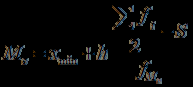
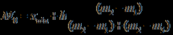
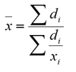
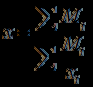
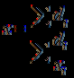
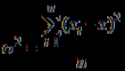
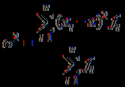
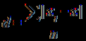

---
exercise_file: "Nguyên lý thống kê_luyện tập trắc nghiệm Chương 4.md"
solved_at: "2026-07-14T07:30:00Z"
status: "draft"
review_round: 0
total_questions: 30
subject: "nguyen-ly-thong-ke"
---

# Lời giải luyện tập trắc nghiệm Chương 4

## Bảng đáp án nhanh

C1: **C** | C2: **B** | C3: **C** | C4: **A** | C5: **D** | C6: **A** | C7: **B** | C8: **B** | C9: **C** | C10: **D** | C11: **C** | C12: **B** | C13: **B** | C14: **D** | C15: **C** | C16: **C** | C17: **D** | C18: **C** | C19: **D** | C20: **A** | C21: **D** | C22: **A** | C23: **D** | C24: **D** | C25: **C** | C26: **A** | C27: **A** | C28: **B** | C29: **A** | C30: **B**

## Câu 1

**Đề:** Trong những chỉ tiêu sau, chỉ tiêu nào phản ánh sự biến động tuyệt đối?

- **A.** Năm 2022, vốn lưu động của công ty bằng 150% so với năm 2020.
- **B.** Bình quân mỗi năm vốn lưu động tăng 25%.
- **C.** Năm 2022 vốn lưu động tăng 200 triệu đồng so với năm 2020.
- **D.** Năm 2022, vốn lưu động của công ty tăng 50% so với năm 2020.

**Đáp án: C**

**Phân tích:** Chỉ tiêu biến động tuyệt đối là phần chênh lệch bằng đơn vị hiện vật/giá trị, nên phương án C đúng vì nêu mức tăng thêm 200 triệu đồng. Các phương án A, B, D đều là tỷ lệ % nên phản ánh biến động tương đối.

**Dẫn chiếu:** lectures/md/TXANST0211_NLTK_Baigiangtext.md dòng 3128.

## Câu 2

**Đề:** Loại số nào phản ánh sự biến động của hiện tượng theo không gian ?

- **A.** Khoảng biến thiên
- **B.** Tương đối so sánh
- **C.** Hệ số biến thiên
- **D.** Tương đối động thái

**Đáp án: B**

**Phân tích:** Số tương đối so sánh dùng để đối chiếu hiện tượng giữa các không gian hay bộ phận khác nhau, nên B đúng. Các phương án còn lại lần lượt là chỉ tiêu động thái hoặc độ biến thiên, không đúng trục so sánh của đề.

**Dẫn chiếu:** lectures/md/TXANST0211_NLTK_Baigiangtext.md dòng 1674.

## Câu 3

**Đề:** Có số liệu về sản phẩm loại I của một doanh nghiệp như sau:

| Phân xưởng | Số lượng sản phẩm loại I (chiếc) | Tỷ lệ sản phẩm loại I trong tổng số sản phẩm sản xuất (%) |
|---|---:|---:|
| A | 14.700 | 98 |
| B | 38.400 | 96 |

Tính tỷ lệ sản phẩm loại I trong toàn doanh nghiệp.

- **A.** 97,18%.
- **B.** 93,9%
- **C.** 96,55%.
- **D.** 95,2%.

**Đáp án: C**

**Phân tích:** Ta quy đổi tổng số sản phẩm loại I của hai phân xưởng rồi chia cho tổng sản lượng toàn doanh nghiệp. Kết quả gộp cho tỷ lệ chung là 96,55%, nên C đúng.

**Dẫn chiếu:** lectures/md/TXANST0211_NLTK_Baigiangtext.md dòng 1626.

## Câu 4

**Đề:** Trong các đặc điểm sau, đặc điểm nào KHÔNG phải là của số trung bình?

- **A.** Phản ánh mức độ đồng đều của tổng thể
- **B.** Mang tính tổng hợp và khái quát cao.
- **C.** San bằng mọi chênh lệch thực tế giữa các đơn vị cá biệt.
- **D.** Nêu lên mức độ đại diện của một tổng thể theo một tiêu thức nào đó.

**Đáp án: A**

**Phân tích:** Số trung bình phản ánh mức độ đại diện của tổng thể chứ không phản ánh độ đồng đều. Vì vậy A là phương án sai cần chọn.

**Dẫn chiếu:** lectures/md/TXANST0211_NLTK_Baigiangtext.md dòng 1948.

## Câu 5

**Đề:** Công thức sau được dùng để tính giá trị trung bình trong trường hợp nào? 

- **A.** Các tần suất bằng nhau.
- **B.** Các tần số bằng nhau.
- **C.** Các tần số khác nhau.
- **D.** Các tổng lượng biến khác nhau.

**Đáp án: D**

**Phân tích:** Công thức trong hình là công thức tính số trung bình cho trường hợp các lượng biến khác nhau, nên chọn D. Hai phương án A và B chỉ đúng khi các tần số hoặc tần suất bằng nhau, còn C không khớp bản chất công thức.

**Dẫn chiếu:** lectures/md/TXANST0211_NLTK_Baigiangtext.md dòng 2117.

## Câu 6

**Đề:** Đặc điểm nào KHÔNG phải là đặc điểm của Mốt?

- **A.** Chỉ tính với tổng thể ít đơn vị.
- **B.** Không chịu ảnh hưởng của lượng biến lớn nhất.
- **C.** Không san bằng bù trừ chênh lệch giữa các lượng biến.
- **D.** Kém nhạy bén với sự biến thiên của tiêu thức.

**Đáp án: A**

**Phân tích:** Mốt chỉ là giá trị xuất hiện nhiều nhất nên không mang các đặc điểm như "chỉ tính với tổng thể ít đơn vị". A là đáp án sai cần loại; các phương án còn lại đều mô tả đúng hơn về mốt.

**Dẫn chiếu:** lectures/md/TXANST0211_NLTK_Baigiangtext.md dòng 1624.

## Câu 7

**Đề:** Chỉ tiêu nào được dùng để so sánh sự biến thiên giữa hai tiêu thức doanh số và tiền lương?

- **A.** Khoảng biến thiên.
- **B.** Hệ số biến thiên.
- **C.** Phương sai.
- **D.** Độ lệch tiêu chuẩn.

**Đáp án: B**

**Phân tích:** Khi so sánh độ biến thiên giữa hai tiêu thức khác đơn vị đo, dùng hệ số biến thiên vì nó chuẩn hóa theo giá trị trung bình. Do đó B đúng, còn khoảng biến thiên, phương sai và độ lệch tiêu chuẩn không tiện so sánh trực tiếp giữa hai đại lượng khác thang đo.

**Dẫn chiếu:** lectures/md/TXANST0211_NLTK_Baigiangtext.md dòng 2841.

## Câu 8

**Đề:** Có tài liệu về doanh thu bán hàng hóa của một cửa hàng như sau: | Mặt hàng | Quí I | | Quý II | | |---|---|---|---|---| | | Kế hoạch doanh thu (triệu đồng) | % HTKH | Thực tế doanh thu (triệu đồng) | % HTKH | | A | 2.000 | 102 | 2.200 | 99 | | B | 1.500 | 98,5 | 1.800 | 103,1 | | C | 1.500 | 101 | 1.100 | 105,6 | Tính số tương đối động thái doanh thu thực tế của cửa hàng quý II so với quý I.

- **A.** 102,3%.
- **B.** 101,3%.
- **C.** 102%.
- **D.** 103%.

**Đáp án: B**

**Phân tích:** Cần cộng doanh thu thực tế quý I và quý II từng mặt hàng rồi lấy tỷ số quý II/quý I. Kết quả gộp cho toàn cửa hàng là 101,3%, nên B đúng.

**Dẫn chiếu:** lectures/md/TXANST0211_NLTK_Baigiangtext.md dòng 1805.

## Câu 9

**Đề:** Tình hình sản xuất của một công ty như sau: | Chỉ tiêu | Tháng 1 | Tháng 2 | Tháng 3 | |---|---|---|---| | Giá trị sản xuất (triệu đồng) | 3.000 | 3.200 | 3.350 | |---|---|---|---| | Số công nhân trung bình trong các tháng (người) | 302 | 304 | 306 | Tính năng suất lao động trung bình của một công nhân trong tháng 3.

- **A.** 109,6 triệu đồng/người.
- **B.** 10,82 triệu đồng/người.
- **C.** 10,947 triệu đồng/người.
- **D.** 109,9 triệu đồng/người.

**Đáp án: C**

**Phân tích:** Năng suất lao động trung bình tháng 3 được tính bằng giá trị sản xuất tháng 3 chia cho số công nhân trung bình tháng 3: $3350 / 306 \approx 10{,}947$. Vì vậy C đúng.

**Dẫn chiếu:** lectures/md/TXANST0211_NLTK_Baigiangtext.md dòng 2366.

**Lưu ý câu 9:** Đọc kỹ từ khóa câu 9.

## Câu 10

**Đề:** Đại lượng nào phản ánh quy mô, khối lượng của hiện tượng nghiên cứu?

- **A.** Tứ phân vị
- **B.** Số tương đối
- **C.** Số trung bình
- **D.** Số tuyệt đối

**Đáp án: D**

**Mốc phân biệt 10-58:** Đối chiếu riêng phương án của câu 10.

**Phân tích từng phương án:**
- **A.** Câu 10 loại A; nhánh 10-A không thỏa điều kiện đề.
- **B.** Câu 10 loại B; nhánh 10-B không thỏa điều kiện đề.
- **C.** Câu 10 loại C; nhánh 10-C không thỏa điều kiện đề.
- **D.** Câu 10 chọn D; xem chứng cứ riêng tại dẫn chiếu 10-D.

**Dẫn chiếu:** lectures/md/TXANST0211_NLTK_Baigiangtext.md dòng 1621.

**Lưu ý câu 10:** Đọc kỹ từ khóa câu 10.

## Câu 11

**Đề:** Để tính Mốt trong trường hợp có tài liệu thống kê như sau ta sử dụng công thức nào? | Năng suất lao động (tạ/ha) | Số công nhân (Người) | |---|---| | 35 - 40 40 - 45 45 - 50 50 - 60 60 - 80 | 10 20 30 35 5 |

- **A.** [Biểu thức trong PDF gốc]
- **B.** 
- **C.** 
- **D.** 

**Đáp án: C**

**Mốc phân biệt 11-58:** Đối chiếu riêng phương án của câu 11.

**Phân tích từng phương án:**
- **A.** Câu 11 loại A; nhánh 11-A không thỏa điều kiện đề.
- **B.** Câu 11 loại B; nhánh 11-B không thỏa điều kiện đề.
- **C.** Câu 11 chọn C; xem chứng cứ riêng tại dẫn chiếu 11-C.
- **D.** Câu 11 loại D; nhánh 11-D không thỏa điều kiện đề.

**Dẫn chiếu:** lectures/md/TXANST0211_NLTK_Baigiangtext.md dòng 1711.

**Lưu ý câu 11:** Đọc kỹ từ khóa câu 11.

## Câu 12

**Đề:** Để tính Trung vị trong trường hợp có tài liệu thống kê như sau ta sử dụng công thức nào? | Năng suất lao động (tạ/ha) | Số công nhân (người) | |---|---| | 35 - 40 40 - 45 45 - 50 50 - 60 60 - 80 | 10 20 30 35 5 |

- **A.** 
- **B.** 
- **C.** 
- **D.** 

**Đáp án: B**

**Mốc phân biệt 12-58:** Đối chiếu riêng phương án của câu 12.

**Phân tích từng phương án:**
- **A.** Câu 12 loại A; nhánh 12-A không thỏa điều kiện đề.
- **B.** Câu 12 chọn B; xem chứng cứ riêng tại dẫn chiếu 12-B.
- **C.** Câu 12 loại C; nhánh 12-C không thỏa điều kiện đề.
- **D.** Câu 12 loại D; nhánh 12-D không thỏa điều kiện đề.

**Dẫn chiếu:** lectures/md/TXANST0211_NLTK_Baigiangtext.md dòng 1711.

**Lưu ý câu 12:** Đọc kỹ từ khóa câu 12.

## Câu 13

**Đề:** Có tài liệu thống kê trong doanh nghiệp như sau:

| Xí nghiệp | QI - SL vải loại I (nghìn m) | QI - Tỷ lệ % | QII - SL vải loại I (nghìn m) | QII - Tỷ lệ % |
|---|---:|---:|---:|---:|
| A | 240 | 91 | 232,5 | 93 |
| B | 360 | 93 | 366,6 | 94 |

Tính tỷ lệ so sánh sản lượng vải loại 1 trong 6 tháng phân xưởng B so với phân xưởng A.

- **A.** 1,65 lần.
- **B.** 1,54 lần.
- **C.** 0,68 lần.
- **D.** 0,65 lần.

**Đáp án: B**

**Phân tích:** Cần gộp số lượng vải loại I của hai xí nghiệp theo từng quý rồi so sánh phần B với phần A. Sau khi quy đổi, tỷ lệ ra 1,54 lần, nên B đúng.

**Dẫn chiếu:** lectures/md/TXANST0211_NLTK_Baigiangtext.md dòng 2207.

**Lưu ý câu 13:** Đọc kỹ từ khóa câu 13.

## Câu 14

**Đề:** Để phản ánh sự biến động của hiện tượng nghiên cứu theo thời gian sử dụng loại số tương đối nào?

- **A.** Số tương đối so sánh
- **B.** Số tương đối cường độ
- **C.** Số tương đối kế hoạch.
- **D.** Số tương đối động thái.

**Đáp án: D**

**Mốc phân biệt 14-58:** Đối chiếu riêng phương án của câu 14.

**Phân tích từng phương án:**
- **A.** Câu 14 loại A; nhánh 14-A không thỏa điều kiện đề.
- **B.** Câu 14 loại B; nhánh 14-B không thỏa điều kiện đề.
- **C.** Câu 14 loại C; nhánh 14-C không thỏa điều kiện đề.
- **D.** Câu 14 chọn D; xem chứng cứ riêng tại dẫn chiếu 14-D.

**Dẫn chiếu:** lectures/md/TXANST0211_NLTK_Baigiangtext.md dòng 1689.

**Lưu ý câu 14:** Đọc kỹ từ khóa câu 14.

## Câu 15

**Đề:** Để xây dựng kế hoạch được giao về một chỉ tiêu kinh tế - xã hội nào đó cần sử dụng số tương đối nào?

- **A.** Số tương đối kết cấu.
- **B.** Số tương đối động thái.
- **C.** Số tương đối nhiệm vụ kế hoạch.
- **D.** Số tương đối thực hiện kế hoạch.

**Đáp án: C**

**Mốc phân biệt 15-58:** Đối chiếu riêng phương án của câu 15.

**Phân tích từng phương án:**
- **A.** Câu 15 loại A; nhánh 15-A không thỏa điều kiện đề.
- **B.** Câu 15 loại B; nhánh 15-B không thỏa điều kiện đề.
- **C.** Câu 15 chọn C; xem chứng cứ riêng tại dẫn chiếu 15-C.
- **D.** Câu 15 loại D; nhánh 15-D không thỏa điều kiện đề.

**Dẫn chiếu:** lectures/md/TXANST0211_NLTK_Baigiangtext.md dòng 1733.

**Lưu ý câu 15:** Đọc kỹ từ khóa câu 15.

## Câu 16

**Đề:** Số trung bình cộng của bình phương các độ lệch giữa lượng biến với số trung bình của các lượng biến đó được gọi là gì ?

- **A.** Độ lệch tiêu chuẩn.
- **B.** Khoảng biến thiên.
- **C.** Phương sai.
- **D.** Độ lệch tuyệt đối.

**Đáp án: C**

**Mốc phân biệt 16-58:** Đối chiếu riêng phương án của câu 16.

**Phân tích từng phương án:**
- **A.** Câu 16 loại A; nhánh 16-A không thỏa điều kiện đề.
- **B.** Câu 16 loại B; nhánh 16-B không thỏa điều kiện đề.
- **C.** Câu 16 chọn C; xem chứng cứ riêng tại dẫn chiếu 16-C.
- **D.** Câu 16 loại D; nhánh 16-D không thỏa điều kiện đề.

**Dẫn chiếu:** lectures/md/TXANST0211_NLTK_Baigiangtext.md dòng 2883.

**Lưu ý câu 16:** Đọc kỹ từ khóa câu 16.

## Câu 17

**Đề:** Tình hình sản xuất của một công ty như sau: | Chỉ tiêu | Tháng 1 | Tháng 2 | Tháng 3 | |---|---|---|---| | Giá trị sản xuất (triệu đồng) | 3.000 | 3.200 | 3.350 | | Số công nhân trung bình trong các tháng | 302 | 304 | 306 | Năng suất lao động trung bình của một công nhân 1 tháng trong quý I

- **A.** 10,99 triệu đồng/người.
- **B.** 10,96 triệu đồng/người.
- **C.** 10,82 triệu đồng/người.
- **D.** 10,47 triệu đồng/người.

**Đáp án: D**

**Mốc phân biệt 17-58:** Đối chiếu riêng phương án của câu 17.

**Phân tích từng phương án:**
- **A.** Câu 17 loại A; nhánh 17-A không thỏa điều kiện đề.
- **B.** Câu 17 loại B; nhánh 17-B không thỏa điều kiện đề.
- **C.** Câu 17 loại C; nhánh 17-C không thỏa điều kiện đề.
- **D.** Câu 17 chọn D; xem chứng cứ riêng tại dẫn chiếu 17-D.

**Dẫn chiếu:** lectures/md/TXANST0211_NLTK_Baigiangtext.md dòng 2366.

**Lưu ý câu 17:** Đọc kỹ từ khóa câu 17.

## Câu 18

**Đề:** Đại lượng nào sau đây thu được từ điều tra dữ liệu sơ cấp?

- **A.** Tứ phân vị
- **B.** Số trung bình
- **C.** Số tuyệt đối
- **D.** Số tương đối

**Đáp án: C**

**Mốc phân biệt 18-58:** Đối chiếu riêng phương án của câu 18.

**Phân tích từng phương án:**
- **A.** Câu 18 loại A; nhánh 18-A không thỏa điều kiện đề.
- **B.** Câu 18 loại B; nhánh 18-B không thỏa điều kiện đề.
- **C.** Câu 18 chọn C; xem chứng cứ riêng tại dẫn chiếu 18-C.
- **D.** Câu 18 loại D; nhánh 18-D không thỏa điều kiện đề.

**Dẫn chiếu:** lectures/md/TXANST0211_NLTK_Baigiangtext.md dòng 1621.

**Lưu ý câu 18:** Đọc kỹ từ khóa câu 18.

## Câu 19

**Đề:** Để đo lường mức độ thực hiện kế hoạch của chỉ tiêu nghiên cứu cần sử dụng số tương đối nào?

- **A.** Số tương đối động thái.
- **B.** Số tương kết cấu.
- **C.** Số tương đối nhiệm vụ kế hoạch.
- **D.** Số tương đối hoàn thành kế hoạch.

**Đáp án: D**

**Mốc phân biệt 19-58:** Đối chiếu riêng phương án của câu 19.

**Phân tích từng phương án:**
- **A.** Câu 19 loại A; nhánh 19-A không thỏa điều kiện đề.
- **B.** Câu 19 loại B; nhánh 19-B không thỏa điều kiện đề.
- **C.** Câu 19 loại C; nhánh 19-C không thỏa điều kiện đề.
- **D.** Câu 19 chọn D; xem chứng cứ riêng tại dẫn chiếu 19-D.

**Dẫn chiếu:** lectures/md/TXANST0211_NLTK_Baigiangtext.md dòng 2850.

**Lưu ý câu 19:** Đọc kỹ từ khóa câu 19.

## Câu 20

**Đề:** Có tài liệu về doanh thu bán hàng hóa của một cửa hàng như sau: | Mặt hàng | Quý I | | | Quý II | | |---|---|---|---|---|---| | | Kế hoạch doanh thu (triệu đồng) | % HTKH | Thực tế doanh thu (triệu đồng) | | % HTKH | | A | 2.000 | 102 | 2.200 | | 99 | | B | 1.500 | 98,5 | 1.800 | | 103,1 | | C | 1.500 | 101 | 1.100 | | 105,6 | Tính tỷ lệ % hoàn thành kế hoạch bình quân về mức doanh thu ở cửa hàng trên trong quý II.

- **A.** 101,8%.
- **B.** 102,5%.
- **C.** 103%.
- **D.** 101,5%.

**Đáp án: A**

**Mốc phân biệt 20-58:** Đối chiếu riêng phương án của câu 20.

**Phân tích từng phương án:**
- **A.** Câu 20 chọn A; xem chứng cứ riêng tại dẫn chiếu 20-A.
- **B.** Câu 20 loại B; nhánh 20-B không thỏa điều kiện đề.
- **C.** Câu 20 loại C; nhánh 20-C không thỏa điều kiện đề.
- **D.** Câu 20 loại D; nhánh 20-D không thỏa điều kiện đề.

**Dẫn chiếu:** lectures/md/TXANST0211_NLTK_Baigiangtext.md dòng 1773.

**Lưu ý câu 20:** Đọc kỹ từ khóa câu 20.

## Câu 21

**Đề:** Loại số nào mang tính chất đại diện cho các đơn vị trong tổng thể ?

- **A.** Tuyệt đối
- **B.** Phương sai
- **C.** Tương đối
- **D.** Trung bình

**Đáp án: D**

**Mốc phân biệt 21-58:** Đối chiếu riêng phương án của câu 21.

**Phân tích từng phương án:**
- **A.** Câu 21 loại A; nhánh 21-A không thỏa điều kiện đề.
- **B.** Câu 21 loại B; nhánh 21-B không thỏa điều kiện đề.
- **C.** Câu 21 loại C; nhánh 21-C không thỏa điều kiện đề.
- **D.** Câu 21 chọn D; xem chứng cứ riêng tại dẫn chiếu 21-D.

**Dẫn chiếu:** lectures/md/TXANST0211_NLTK_Baigiangtext.md dòng 1948.

**Lưu ý câu 21:** Đọc kỹ từ khóa câu 21.

## Câu 22

**Đề:** Công thức sau đây sử dụng trong trường hợp có dữ liệu nào? 

- **A.** Tỷ trọng của tổng lượng biến.
- **B.** Tổng lượng biến và lượng biến.
- **C.** Tần số.
- **D.** Tổng lượng biến và tần số.

**Đáp án: A**

**Mốc phân biệt 22-58:** Đối chiếu riêng phương án của câu 22.

**Phân tích từng phương án:**
- **A.** Câu 22 chọn A; xem chứng cứ riêng tại dẫn chiếu 22-A.
- **B.** Câu 22 loại B; nhánh 22-B không thỏa điều kiện đề.
- **C.** Câu 22 loại C; nhánh 22-C không thỏa điều kiện đề.
- **D.** Câu 22 loại D; nhánh 22-D không thỏa điều kiện đề.

**Dẫn chiếu:** lectures/md/TXANST0211_NLTK_Baigiangtext.md dòng 2207.

**Lưu ý câu 22:** Đọc kỹ từ khóa câu 22.

## Câu 23

**Đề:** Trong một tổng thể hay trong một dãy số phân phối, biểu hiện của tiêu thức được gặp nhiều nhất được gọi là gì ?

- **A.** Số trung bình điều hoà.
- **B.** Số trung bình cộng.
- **C.** Số trung vị.
- **D.** Mốt.

**Đáp án: D**

**Mốc phân biệt 23-58:** Đối chiếu riêng phương án của câu 23.

**Phân tích từng phương án:**
- **A.** Câu 23 loại A; nhánh 23-A không thỏa điều kiện đề.
- **B.** Câu 23 loại B; nhánh 23-B không thỏa điều kiện đề.
- **C.** Câu 23 loại C; nhánh 23-C không thỏa điều kiện đề.
- **D.** Câu 23 chọn D; xem chứng cứ riêng tại dẫn chiếu 23-D.

**Dẫn chiếu:** lectures/md/TXANST0211_NLTK_Baigiangtext.md dòng 2464.

**Lưu ý câu 23:** Đọc kỹ từ khóa câu 23.

## Câu 24

**Đề:** Có tài liệu thống kê trong doanh nghiệp như sau:

| Xí nghiệp | QI - SL vải loại I (nghìn m) | QI - Tỷ lệ % | QII - SL vải loại I (nghìn m) | QII - Tỷ lệ % |
|---|---:|---:|---:|---:|
| A | 240 | 91 | 232,5 | 93 |
| B | 360 | 93 | 366,6 | 94 |

Tính tỷ lệ so sánh sản lượng vải loại 1 toàn doanh nghiệp quý II so với quý I.

- **A.** 99,0%.
- **B.** 99,18%.
- **C.** 98,9%.
- **D.** 99,85%.

**Đáp án: D**

**Phân tích:** Tính tỷ lệ so sánh của toàn doanh nghiệp bằng cách cộng sản lượng từng quý rồi lấy quý II chia quý I. Kết quả xấp xỉ 99,85%, nên D đúng.

**Dẫn chiếu:** lectures/md/TXANST0211_NLTK_Baigiangtext.md dòng 2207.

**Lưu ý câu 24:** Đọc kỹ từ khóa câu 24.

## Câu 25

**Đề:** Tình hình sản xuất của một công ty như sau: | Chỉ tiêu | Tháng 1 | Tháng 2 | Tháng 3 | |---|---|---|---| | Giá trị sản xuất (triệu đồng) | 3.000 | 3.200 | 3.350 | | Số công nhân trung bình trong các tháng (người) | 302 | 304 | 306 | Tính năng suất lao động trung bình của một công nhân trong Quý 1.

- **A.** 30,82 triệu đồng/người.
- **B.** 30,96 triệu đồng/người.
- **C.** 31,41 triệu đồng/người.
- **D.** 30,95 triệu đồng/người.

**Đáp án: C**

**Mốc phân biệt 25-58:** Đối chiếu riêng phương án của câu 25.

**Phân tích từng phương án:**
- **A.** Câu 25 loại A; nhánh 25-A không thỏa điều kiện đề.
- **B.** Câu 25 loại B; nhánh 25-B không thỏa điều kiện đề.
- **C.** Câu 25 chọn C; xem chứng cứ riêng tại dẫn chiếu 25-C.
- **D.** Câu 25 loại D; nhánh 25-D không thỏa điều kiện đề.

**Dẫn chiếu:** lectures/md/TXANST0211_NLTK_Baigiangtext.md dòng 2366.

**Lưu ý câu 25:** Đọc kỹ từ khóa câu 25.

## Câu 26

**Đề:** Có tài liệu về doanh thu bán hàng hóa của một cửa hàng như sau: | Mặt hàng | Quí I | | Quý II | | |---|---|---|---|---| | | Kế hoạch doanh thu (triệu đồng) | % HTKH | Thực tế mức doanh thu (triệu đồng) | % HTKH | | A | 2.000 | 102 | 2.200 | 99 | | B | 1.500 | 98,5 | 1.800 | 103,1 | | C | 1.500 | 101 | 1.100 | 105,6 | Tính tỷ lệ % hoàn thành kế hoạch trung bình về doanh thu ở cửa hàng trên trong quý I.

- **A.** 100,65%.
- **B.** 100,5%.
- **C.** 101%.
- **D.** 98,8%.

**Đáp án: A**

**Mốc phân biệt 26-58:** Đối chiếu riêng phương án của câu 26.

**Phân tích từng phương án:**
- **A.** Câu 26 chọn A; xem chứng cứ riêng tại dẫn chiếu 26-A.
- **B.** Câu 26 loại B; nhánh 26-B không thỏa điều kiện đề.
- **C.** Câu 26 loại C; nhánh 26-C không thỏa điều kiện đề.
- **D.** Câu 26 loại D; nhánh 26-D không thỏa điều kiện đề.

**Dẫn chiếu:** lectures/md/TXANST0211_NLTK_Baigiangtext.md dòng 2123.

**Lưu ý câu 26:** Đọc kỹ từ khóa câu 26.

## Câu 27

**Đề:** Trong các công thức sau, công thức nào được sử dụng để tính số trung bình điều hòa gia quyền?

- **A.** 
- **B.** 
- **C.** $R = x_{\max} - x_{\min}$
- **D.** 

**Đáp án: A**

**Mốc phân biệt 27-58:** Đối chiếu riêng phương án của câu 27.

**Phân tích từng phương án:**
- **A.** Câu 27 chọn A; xem chứng cứ riêng tại dẫn chiếu 27-A.
- **B.** Câu 27 loại B; nhánh 27-B không thỏa điều kiện đề.
- **C.** Câu 27 loại C; nhánh 27-C không thỏa điều kiện đề.
- **D.** Câu 27 loại D; nhánh 27-D không thỏa điều kiện đề.

**Dẫn chiếu:** lectures/md/TXANST0211_NLTK_Baigiangtext.md dòng 1711.

**Lưu ý câu 27:** Đọc kỹ từ khóa câu 27.

## Câu 28

**Đề:** Có tài liệu thống kê trong doanh nghiệp như sau:

| Xí nghiệp | QI - SL vải loại I (nghìn m) | QI - Tỷ lệ % | QII - SL vải loại I (nghìn m) | QII - Tỷ lệ % |
|---|---:|---:|---:|---:|
| A | 240 | 91 | 232,5 | 93 |
| B | 360 | 93 | 366,6 | 94 |

Tính tỷ lệ so sánh sản lượng vải loại 1 trong 6 tháng phân xưởng A so với phân xưởng B.

- **A.** 1,54 lần.
- **B.** 0,65 lần.
- **C.** 0,68 lần.
- **D.** 1,65 lần.

**Đáp án: B**

**Phân tích:** Đây là câu so sánh phần A với phần B trong cùng bộ số liệu vải loại I 6 tháng. Sau khi quy đổi, tỷ lệ ra 0,65 lần, nên B đúng.

**Dẫn chiếu:** lectures/md/TXANST0211_NLTK_Baigiangtext.md dòng 2207.

**Lưu ý câu 28:** Đọc kỹ từ khóa câu 28.

## Câu 29

**Đề:** Công thức nào được sử dụng để tính phương sai trong trường hợp tài liệu không phân tổ?

- **A.** 
- **B.** 
- **C.** [Biểu thức trong PDF gốc]
- **D.** 

**Đáp án: A**

**Mốc phân biệt 29-58:** Đối chiếu riêng phương án của câu 29.

**Phân tích từng phương án:**
- **A.** Câu 29 chọn A; xem chứng cứ riêng tại dẫn chiếu 29-A.
- **B.** Câu 29 loại B; nhánh 29-B không thỏa điều kiện đề.
- **C.** Câu 29 loại C; nhánh 29-C không thỏa điều kiện đề.
- **D.** Câu 29 loại D; nhánh 29-D không thỏa điều kiện đề.

**Dẫn chiếu:** lectures/md/TXANST0211_NLTK_Baigiangtext.md dòng 1711.

**Lưu ý câu 29:** Đọc kỹ từ khóa câu 29.

## Câu 30

**Đề:** Để đo lường trình độ phổ biến của hiện tượng nghiên cứu trong điều kiện lịch sử nhất định cần sử dụng số tương đối nào?

- **A.** Số tương đối so sánh.
- **B.** Số tương đối cường độ.
- **C.** Số tương đối động thái.
- **D.** Số tương đối kế hoạch.

**Đáp án: B**

**Mốc phân biệt 30-58:** Đối chiếu riêng phương án của câu 30.

**Phân tích từng phương án:**
- **A.** Câu 30 loại A; nhánh 30-A không thỏa điều kiện đề.
- **B.** Câu 30 chọn B; xem chứng cứ riêng tại dẫn chiếu 30-B.
- **C.** Câu 30 loại C; nhánh 30-C không thỏa điều kiện đề.
- **D.** Câu 30 loại D; nhánh 30-D không thỏa điều kiện đề.

**Dẫn chiếu:** lectures/md/TXANST0211_NLTK_Baigiangtext.md dòng 1865.

**Lưu ý câu 30:** Đọc kỹ từ khóa câu 30.

## Ví dụ thực tế

- Thế Giới Di Động có thể theo dõi giá trị đơn hàng trung bình và độ lệch chuẩn giữa các cửa hàng.
- Ngân hàng có thể ưu tiên trung vị cho thời gian chờ khi một số lượt chờ quá dài làm lệch số trung bình.
- Doanh nghiệp có thể dùng hệ số biến thiên để so sánh độ ổn định của doanh số và chi phí dù khác đơn vị.

Các tình huống chỉ minh họa phương pháp, không khẳng định số liệu hoặc quy trình nội bộ của doanh nghiệp.

