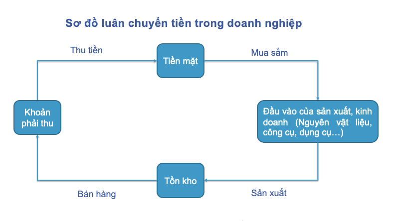
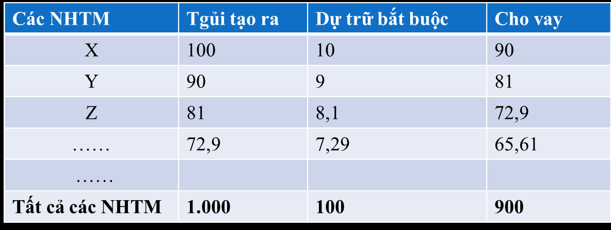

<!-- page 1 -->

CHƯƠNG 1: NHỮNG VẤN ĐỀ CƠ BẢN VỀ TÀI CHÍNH

Danh mục các từ viết tắt

CSTCQG: Chính sách tài chính quốc gia
SXKD: Sản xuất kinh doanh

DNNN: Doanh nghiệp nhà nước
TCDN: Tài chính doanh nghiệp

DNTN: Doanh nghiệp tư nhân
TLSX: Tư liệu sản xuất

KTTT: Kinh tế thị trường
TNHH: Trách nhiệm hữu hạn

NSNN: Ngân sách nhà nước

TTTC: Thị trường tài chính

HTTC: Hệ thống tài chính

* GIỚI THIỆU CHƯƠNG

Chương này đề cập đến những vấn đề cơ bản về phạm trù tài chính với việc tìm hiểu nguồn gốc
ra đời và phát triển của nó, làm rõ bản chất của tài chính giúp người đọc phân biệt giữa tài chính với
tiền tệ và với các phạm trù phân phối khác, đi sâu luận giải các chức năng của tài chính, hệ thống tài
chính trong nền kinh tế, mục tiêu và các nội dung cơ bản của Chính sách tài chính quốc gia.

* TÌNH HUỐNG KHỞI ĐỘNG

Sau 12 năm học hành, Hương đã trúng tuyển chuyên ngành Tài chính – Ngân hàng của trường
Đại học Thương mại. Do nhà ở Hải Dương, ký túc xá của trường đã hết chỗ, nên Hương phải tìm phòng
trọ tại nhà dân. Mất gần 1 tuần, 2 bố con Hương mới tìm được 1 căn phòng trọ ưng ý về địa điểm và

tiện nghi phục vụ sinh hoạt. Hương rất mừng hỏi bác chủ nhà về số tiền thuê nhà thì được bác cho biết:
“Do hiện nay, chi phí sinh hoạt đều tăng giá nên bác cũng phải tăng giá phòng lên 3 triệu đồng/tháng”.
Hương buồn rầu nói với bác chủ nhà: “Bác có thể bớt cho cháu một chút được không ạ? Giá phòng cao
quá, tài chính nhà cháu không cho phép”.

Như vậy, trong tình huống này, Hương đang đồng nhất tài chính với tiền. Vậy:

- Tài chính là gì? Tài chính có phải là tiền không?

- Biểu hiện của các quan hệ tài chính trong nền kinh tế thị trường?

* MỤC TIÊU:

- Hiểu được quá trình hình thành và phát triển của tài chính, khái niệm về tài chính.

- Phân tích được bản chất của tài chính trong nền KTTT.

- Nắm vững nội dung 2 chức năng của tài chính, mối liên hệ giữa 2 chức năng và liên hệ thực
tế vận dụng các chức năng đó trong đời sống kinh tế - xã hội.

- Làm rõ khái niệm và cấu trúc của HTTC theo các tiêu thức khác nhau.

- Nắm được mục tiêu và các nội dung cơ bản của Chính sách tài chính quốc gia trong giai đoạn
hiện nay.

* NỘI DUNG:

1.1. Lịch sử ra đời và phát triển của tài chính

1.1.1. Tiền đề khách quan quyết định sự ra đời và phát triển của tài chính

1

<!-- page 2 -->

Khi nghiên cứu về sự hình thành, tồn tại và phát triển của tài chính, các nhà kinh tế học đã
khẳng định rằng phạm trù tài chính ra đời, tồn tại và phát triển trong những hoàn cảnh lịch sử nhất
định, khi đã hội tụ đầy đủ những yếu tố về kinh tế, chính trị, xã hội để có thể tạo ra một môi trường
phù hợp để phạm trù tài chính ra đời. Những hoàn cảnh lịch sử đó gắn liền với hai tiền đề khách quan
quyết định sự ra đời và phát triển của tài chính đó là:

- Sự ra đời, tồn tại và phát triển của nền sản xuất hàng hóa tiền tệ

- Sự ra đời, tồn tại và phát triển của Nhà nước.

Trong hình thái xã hội đầu tiên của loài người là xã hội công xã nguyên thủy, con người sống
bầy đàn, kiếm ăn một cách tự nhiên và của cải trong xã hội không thuộc về riêng ai cả. Khi lượng sản
phẩm có được sau mỗi lần săn bắn nhiều hơn nên con người bắt đầu phân chia sản phẩm này cho các
thành viên trong bộ lạc của mình. Nhưng khi đó, quan hệ tài chính chưa xuất hiện vì sự phân phối sản
phẩm này chỉ [VERIFY_OCR: chỉ/chí — check PDF trang 2] mới dừng ở hình thức phân phối hiện vật. Chỉ [VERIFY_OCR: chỉ/chí — check PDF trang 2] tới khi xã hội phát triển hơn, có sự phân
công lao động xã hội sâu sắc, dẫn đến chế độ tư hữu ra đời đã thúc đẩy sự phát triển của nền sản xuất
và sự trao đổi hàng hóa. Cũng từ đó, việc phân phối giữa các chủ thể như những người nắm giữ TLSX
với những người không có TLSX, hay trao đổi sau khi sản xuất được hàng hóa không chỉ đơn giản là
phân phối dưới hình thức hiện vật nữa mà đòi hỏi sự ra đời của vật trung gian thanh toán giữa các chủ
thể, giữa các vùng lãnh thổ. Do đó, tiền tệ ra đời như một kết quả tất yếu, hình thành nên mối quan hệ
hàng hóa - tiền tệ trong xã hội chiếm hữu tư nhân về TLSX. Các mối quan hệ đó sẽ tạo nên thu nhập
cho các chủ thể kinh tế và sự liên tục của quá trình sản xuất, lưu thông hàng hóa dẫn đến sự hình thành
và phân phối các quỹ tiền tệ, dẫn đến sự ra đời của quan hệ tài chính.

Cũng từ sự xuất hiện của chế độ chiếm hữu tư nhân về TLSX, dẫn đến tình trạng một bộ phận
có trong tay TLSX, của cải xã hội trong khi đa số bộ phận dân cư còn lại không có gì trong tay. Tình
trạng phân hóa giàu nghèo diễn ra sâu sắc, sự áp bức bóc lột của địa chủ, chủ nô đã châm ngòi cho sự
đấu tranh của giai cấp nông dân, nô lệ và kết quả của cuộc đấu tranh là sự ra đời và phát triển của bộ
máy nhà nước. Bộ máy nhà nước ra đời, giải quyết mâu thuẫn xã hội, đảm bảo trật tự an ninh quốc
phòng, lập lại trật tự trị an trong xã hội. Để thực hiện các chức năng và nhiệm vụ của mình, bộ máy
nhà nước cần phải có một nguồn lực vật chất làm hậu thuẫn để có thể duy trì hoạt động của bộ máy
nhà nước, thiết lập và duy trì hệ thống quân đội quốc phòng, nhà tù… Tóm lại, để duy trì quyền lực và
sự tồn tại của Nhà nước, để phục vụ cho nhu cầu chi tiêu quốc gia, Nhà nước phải tạo lập các quỹ tiền

tệ thông qua những khoản đóng góp của người dân như thuế, phí, lệ phí… Từ đó, hình thành mối quan
hệ phân phối thu nhập từ người dân tới Nhà nước và từ Nhà nước tới các chủ thể khác. Ban đầu, sự
đóng góp của các chủ thể cho Nhà nước được thực hiện dưới hình thức cống nạp hiện vật, nhưng khi
tiền tệ ra đời các vật chất đã được tiền tệ hóa, giá trị hóa. Do đó, các nguồn vật chất cống nạp chủ yếu
được thực hiện dưới hình thức giá trị. Cũng từ đó kéo theo nhiều mối quan hệ tài chính khác ra đời và
phát triển, diễn ra ở tất cả các chủ thể, các lĩnh vực trong nền kinh tế - xã hội.

1.1.2. Khái niệm tài chính

Từ sự ra đời của tài chính, chúng ta thấy rằng tài chính là một hệ thống các quan hệ kinh tế.
Nhưng không phải bất kỳ mối quan hệ kinh tế nào cũng là quan hệ tài chính. Chỉ [VERIFY_OCR: chỉ/chí — check PDF trang 2] những quan hệ kinh
tế diễn ra dưới hình thái giá trị, tức là được thực hiện thông qua phương tiện tiền tệ mới là quan hệ tài
chính. Những mối quan hệ đó phát sinh thông qua việc hình thành và sử dụng các quỹ tiền tệ. Khi bất

2

<!-- page 3 -->

kỳ mối quan hệ tài chính nào nảy sinh, nó luôn luôn gắn liền với việc hình thành một quỹ tiền tệ này
để sử dụng một quỹ tiền tệ khác. Ví dụ, trong mối quan hệ tài chính đầu tiên mà chúng ta đề cập đến
đó là quan hệ tài chính giữa dân chúng và Nhà nước để hình thành nên các quỹ chi tiêu của Nhà nước:
khi các cá nhân, tổ chức nộp thuế vào NSNN, tức là có sự dịch chuyển một phần thu nhập của các cá
nhân, tổ chức để nhập vào quỹ tiền tệ của Nhà nước, có nghĩa là quỹ tiền tệ mang tên thu nhập cá nhân
đã được sử dụng để hình thành nên quỹ tiền tệ mang tên NSNN. Sẽ không có một quan hệ tài chính
nào mà quỹ tiền tệ này được hình thành mà không phải sử dụng một quỹ tiền tệ khác. Đây cũng chính
là đặc trưng để chúng ta nhận biết được đâu là một mối quan hệ tài chính trong muôn vàn các mối quan
hệ kinh tế, cụ thể: Thứ nhất, các quan hệ tài chính phải tồn tại dưới hình thái giá trị; Thứ hai, trả lời
được câu hỏi khi mối quan hệ kinh tế này nảy sinh, nó có sử dụng quỹ tiền tệ này để hình thành nên
quỹ tiền tệ khác hay không? Các mối quan hệ tài chính khi nảy sinh, đều luôn luôn đáp ứng các mục

đích khác nhau của các chủ thể trong xã hội. Mục đích đó như thế nào phụ thuộc vào nhu cầu của chủ
thể sở hữu nguồn lực tài chính đó.

Từ đó, ta có khái niệm tài chính như sau: “Tài chính là hệ thống các quan hệ kinh tế dưới
hình thái giá trị, phát sinh trong quá trình phân phối của cải xã hội  thông qua việc hình thành và
sử dụng các quỹ tiền tệ trong nền kinh tế quốc dân nhằm đáp ứng cho các lợi ích khác nhau của
các chủ thể trong xã hội”.

1.2. Bản chất của tài chính

1.2.1. Nội dung và đặc điểm của các quan hệ kinh tế thuộc phạm trù tài chính

Bản chất là cái bên trong vốn có của sự vật hiện tượng, việc xác định được bản chất không hề
đơn giản. Tuy nhiên, trong triết học có phương pháp để tìm ra bản chất của sự vật hiện tượng đó là phải
đánh giá bản chất của sự vật hiện tượng thông qua biểu hiện bên ngoài, những mặt trực quan của sự
vật hiện tượng đó. Những biểu hiện bên ngoài nào được lặp đi lặp lại, có chu trình và là một hiện tượng
phổ biến thì chính là bản chất của sự vật hiện tượng đó.

Đối với tài chính, chúng ta cũng phải thông qua các biểu hiện bên ngoài của tài chính, đó chính
là các quan hệ kinh tế thuộc phạm trù tài chính. Do đó, trước khi tìm hiểu về bản chất của tài chính,
chúng ta phải tìm hiểu về nội dung và đặc điểm của các quan hệ kinh tế thuộc phạm trù tài chính.

Các quan hệ tài chính trong nền kinh tế - xã hội được chia thành bốn nhóm, gồm: (1) Quan hệ
tài chính giữa Nhà nước với các tổ chức, cá nhân trong xã hội; (2) Quan hệ tài chính  giữa các tổ chức

hoặc cá nhân trong xã hội với nhau; (3) Quan hệ tài chính trong nội bộ 1 chủ thể; (4) Quan hệ tài chính
quốc tế. Trong đó:

- Mối quan hệ tài chính giữa Nhà nước với các tổ chức, cá nhân trong xã hội phát sinh khi các
cá nhân, tổ chức tiến hành đóng góp cho Nhà nước thông qua hình thức thuế, phí, lệ phí. Hay ở chiều
ngược lại, khi Nhà nước thực hiện chi tiêu NSNN để thực hiện các chức năng của mình, đầu tư vốn
vào để nắm giữ quyền kiểm soát hay thành lập các doanh nghiệp nhà nước... Đối với các cá nhân, Nhà
nước có thể có những khoản hỗ trợ tài chính, trợ cấp cho một số đối tượng đặc biệt như thương binh
liệt sĩ [VERIFY_OCR: sĩ/sỉ — check PDF trang 3], các hộ nghèo, gia đình ở vùng sâu vùng xa có hoàn cảnh khó khăn.

- Mối quan hệ tài chính giữa các tổ chức và cá nhân với nhau trong xã hội là mối quan hệ tài
chính đa dạng và phức tạp nhất trong hệ thống các mối quan hệ tài chính trong xã hội.

3

<!-- page 4 -->

Nó có thể là mối quan hệ giữa các tổ chức, các cá nhân dưới hình thức như thanh toán tiền mua
bán hàng hóa dịch vụ, thanh toán tiền lương, tiền công. Nó có thể là mối quan hệ giữa các tổ chức phi
tài chính với các tổ chức tài chính khi phát sinh quan hệ vay mượn về vốn, đầu tư, bảo lãnh. Ngoài ra,
còn tồn tại mối quan hệ tài chính giữa các cá nhân, hộ gia đình với nhau thông qua việc vay mượn,
thanh toán …

- Trong nội bộ của một chủ thể cũng phát sinh quan hệ tài chính, đó là khi thực hiện điều hòa,
phân phối vốn giữa các bộ phận, chi nhánh trong cùng một doanh nghiệp hay một đơn vị hay quá trình
phân phối lợi nhuận, các quỹ trong nội bộ một chủ thể.

Không chỉ giữa các chủ thể trong nền kinh tế xã hội phát sinh những quan hệ tài chính mà ngay
cả đối với cá nhân chúng ta cũng thế. Ví dụ việc áp dụng quy tắc 6 cái lọ giúp chúng ta phân chia quỹ
thu nhập của mình thành các quỹ nhỏ khác nhau để giúp quá trình quản lý tài chính cá nhân hiệu quả.

Việc chia nhỏ quỹ tiền tệ của cá nhân thành những lọ tài chính riêng biệt giúp chúng ta có kế
hoạch và kiểm soát chi tiêu cá nhân hợp lý, tránh tình trạng thâm hụt quá mức quỹ tiền cá nhân.

Ngoài ra, trong bối cảnh toàn cầu hóa, hội nhập quốc tế thì các quan hệ tài chính không chỉ bó
hẹp trong phạm vi [VERIFY_OCR: vi/vĩ — check PDF trang 4] một quốc gia mà còn vượt ra ngoài lãnh thổ quốc gia đó. Mối quan hệ tài chính quốc
tế hình thành khi có sự phân phối vốn, tiền tệ giữa các Nhà nước với nhau, giữa các tổ chức, cá nhân ở
quốc gia này với các tổ chức, cá nhân ở các quốc gia khác.

Từ những phân tích các mối quan hệ tài chính như trên, chúng ta nhận thấy tài chính có ba đặc
điểm cơ bản sau:

Thứ nhất, các quan hệ tài chính nảy sinh kéo theo sự dịch chuyển một lượng giá trị nhất định
từ chủ thể này sang chủ thể khác. Ví dụ: doanh nghiệp nộp thuế vào NSNN, hoặc Nhà nước đầu tư vốn
cho doanh nghiệp, NHTM cấp vốn vay cho doanh nghiệp, đều có sự dịch chuyển một lượng tiền tệ
nhất định giữa các chủ thể với nhau. Và trong tất cả các mối quan hệ tài chính, khi đã nảy sinh thì luôn
luôn gắn liền với việc sử dụng quỹ tiền tệ này để hình thành quỹ tiền tệ khác, hay chia nhỏ quỹ tiền tệ
này để khuếch trương quỹ tiền tệ khác để đáp ứng các mục đích khác nhau của các chủ thể. Đây là đặc
điểm cơ bản của các quan hệ kinh tế thuộc phạm trù tài chính.

Thứ hai, trong các mối quan hệ tài chính thì tiền tệ luôn luôn xuất hiện với chức năng phương
tiện thanh toán, phương tiện cất trữ giá trị. Đặc điểm này được thể hiện rõ ngay ở khái niệm của tài
chính, đó là hệ thống các mối quan hệ kinh tế dưới hình thái giá trị, cho nên tiền tệ luôn xuất hiện trong

các mối quan hệ tài chính. Tuy nhiên, chúng ta không được nhầm lẫn giữa tiền tệ và tài chính. Tiền tệ
xuất hiện trong các quan hệ tài chính chỉ là phương tiện để thực hiện các mối quan hệ tài chính, chứ
bản thân nó không phải là tài chính.

Thứ ba, các quỹ tiền tệ thường xuyên vận động. Sự vận động của các quỹ tiền tệ được thể hiện
thông qua quá trình các chủ thể sử dụng quỹ tiền tệ này để hình thành các quỹ tiền tệ khác, chia nhỏ
quỹ tiền tệ này để khuếch trương quỹ tiền tệ khác. Quá trình hình thành và sử dụng các quỹ tiền tệ
được thực hiện một cách thường xuyên và liên tục, tạo ra sự vận động thường xuyên của các quỹ tiền
tệ. Và cũng chỉ [VERIFY_OCR: chỉ/chí — check PDF trang 4] khi có sự vận động thường xuyên liên tục thì các quỹ tiền tệ mới được sử dụng một
cách hiệu quả, còn các quỹ tiền tệ ở trạng thái tĩnh, không vận động sẽ không tạo ra hiệu quả kinh tế
cho nền kinh tế - xã hội.

4

<!-- page 5 -->

Từ đó, chúng ta đi tới kết luận về bản chất của tài chính như sau:

- Một là, tài chính là bao gồm các quan hệ phân phối dưới hình thái giá trị.

- Hai là, tài chính là những quan hệ phân phối phát sinh trong quá trình hình thành và sử dụng
các quỹ tiền tệ.

- Ba là, tài chính là quan hệ kinh tế chịu sự tác động trực tiếp của Nhà nước, của pháp luật,
nhưng tài chính không phải là hệ thống các luật lệ về tài chính.

1.3. Chức năng của tài chính

1.3.1. Chức năng phân phối

a. Khái niệm

Chức năng phân phối của tài chính là chức năng mà nhờ đó các nguồn lực đại diện cho các bộ
phận của cải xã hội được phân chia, đưa vào các quỹ tiền tệ khác nhau để sử dụng cho các mục đích
khác nhau, nhằm đảm bảo những nhu cầu và lợi ích khác nhau của xã hội.

Đây là chức năng quan trọng của tài chính vì nhờ có chức năng này là các của cải xã hội, các
dòng tiền được chảy tới mọi chủ thể của xã hội và giúp các chủ thể thực hiện được các mục đích hay
nhu cầu khác nhau của mình.

b. Đối tượng phân phối tài chính

Đối tượng phân phối tài chính ở đây gồm:

- Thứ nhất là phân phối tổng sản phẩm quốc nội (GDP), bao gồm:

+ GDP tạo ra trong năm (ưu tiên phân phối trước)

+ GDP tạo ra từ năm trước nhưng chưa được phân phối hết.

- Thứ hai là các nguồn lực tài chính được huy động từ bên ngoài như là các nguồn tài trợ từ
Chính phủ nước ngoài, các tổ chức tài chính quốc tế.

- Thứ ba là các tài sản [VERIFY_OCR: sản/sàn — check PDF trang 5] tài nguyên quốc gia có thể cho thuê, nhượng bán có thời hạn như tiền
cho thuê sử dụng đất.

c. Chủ thể phân phối tài chính

- Các chủ thể có quyền sở hữu các nguồn tài chính, đây cũng là các chủ thể có quyền cao nhất,
tác động đến quá trình phân phối nguồn tài chính đó. Ví dụ, nguồn tài chính của các bạn thì chỉ có các

bạn mới có quyền được sử dụng, không ai được phép sử dụng nó mà không có sự cho phép của các
bạn. Nhưng trong một số quan hệ tài chính, chủ thể có quyền sử dụng tài chính lại có quyền phân phối
tài chính đó, ví dụ như trong mối quan hệ sử dụng vốn vay thì rõ ràng chủ thể đi vay không có quyền
sở hữu nguồn tài chính đó nhưng lại có quyền sử dụng nó trong một khoảng thời gian nhất định, trong
khoảng thời gian đó, chủ thể đi vay sẽ được quyền quyết định sẽ sử dụng vốn vay đó như thế nào.

- Chủ thể có quyền lực chính trị như Nhà nước cũng có quyền phân phối nguồn của cải xã hội
dưới hình thái giá trị thông qua các hình thức thu thuế, phí, lệ phí mặc dù Nhà nước không phải là
người sáng tạo ra hay sở hữu nguồn lực của cải đó.

- Các nhóm thành viên xã hội cũng là chủ thể tham gia phân phối tài chính. Họ có thể tham gia
đóng góp hay thu nhận các khoản đóng góp hội phí, thiện nguyện, biếu tặng, ủng hộ… từ nguồn tài
chính đó, họ có quyền sử dụng và phân phối nguồn tài chính đó.

5

<!-- page 6 -->

d. Kết quả của phân phối tài chính

Chúng ta đã phân tích rằng, khi bất kỳ quan hệ tài chính nào nảy sinh thì nó luôn gắn liền với
việc sử dụng một quỹ tiền tệ này để hình thành nên một quỹ tiền tệ khác. Vì vậy, kết quả của quá trình
phân phối tài chính là sự hình thành hoặc sử dụng hàng loại các quỹ tiền tệ ở các chủ thể khác nhau
trong xã hội, từ đó góp phần đạt được những mục đích đã xác định của các chủ thể.

e. Đặc điểm của phân phối tài chính

- Thứ nhất, phân phối tài chính chỉ [VERIFY_OCR: chỉ/chí — check PDF trang 6] diễn ra dưới hình thái giá trị nhưng không kèm theo sự thay
đổi hình thái giá trị. Trong các quan hệ phân phối về tài chính, cho dù quan hệ phân phối này diễn ra ở
đâu với các chủ thể nào, thì hình thái biểu hiện của các quan hệ này đều tồn tại dưới hình thái giá trị,
chứ không có sự thay đổi hình thái giá trị ngược chiều như các hình thái phân phối khác. Ví dụ, trong
mối quan hệ trao đổi hàng hóa: được thể hiện qua công thức H-T-H’, nghĩa là chúng ta sản xuất hàng
hóa rồi đem hàng hóa đó đi bán lấy tiền và dùng tiền đó để mua sắm các trang thiết bị hay nguyên liệu
đầu vào để tiếp tục sản xuất. Trong quá trình trao đổi hàng hóa này, chúng ta nhận thấy sự thay đổi về
hình thái là từ hiện vật, sau đó chuyển sang giá trị là tiền, rồi từ tiền đó lại chuyển sang hình thái hiện
vật là các nguyên vật liệu đầu vào. Còn đối với trong phân phối thương mại: T- H- T’, tức là doanh
nghiệp dùng tiền để mua hàng với giá bán buôn và dùng hàng hóa đó để phân phối tới kênh bán hàng,
tiêu thụ lượng hàng hóa này và thu được doanh thu là tiền, mối quan hệ này cũng thấy được sự thay
đổi về hình thái giá trị. Tuy nhiên, trong phân phối tài chính chỉ [VERIFY_OCR: chỉ/chí — check PDF trang 6] luôn tồn tại ở một hình thái duy nhất
là hình thái giá trị, tức là sử dụng quỹ tiền tệ này để hình thành quỹ tiền tệ khác, chia nhỏ quỹ tiền tệ
này để khuếch trương quỹ tiền tệ khác.

- Thứ hai, phân phối tài chính luôn luôn gắn liền với sự hình thành và sử dụng các quỹ tiền tệ
nhất định. Đặc điểm này không chỉ là đặc điểm của riêng chức năng phân phối tài chính mà còn là đặc
điểm của phạm trù tài chính nói chung. Chúng ta thấy rằng, khi tài chính thực hiện chức năng phân
phối, hàng loạt quỹ tiền tệ được hình thành hoặc sử dụng và được chia nhỏ hoặc khuếch trương để giúp
các chủ thể trong nền kinh tế xã hội đạt được các mục đích của mình. Đây cũng là đặc điểm riêng để
chúng ta nhận biết được đâu là quan hệ tài chính, chức năng phân phối tài chính trong hàng loạt các
quan hệ kinh tế và các chức năng khác của các quan hệ kinh tế.

- Thứ ba, các quan hệ phân phối tài chính không nhất thiết kèm theo sự dịch chuyển giá trị từ
chủ thể này sang chủ thể khác. Khi chúng ta tìm hiểu về nội dung các quan hệ kinh tế thuộc phạm trù

tài chính, chúng ta thấy rằng, ở hầu hết các quan hệ kinh tế thuộc phạm trù tài chính khi diễn ra sẽ kèm
theo sự dịch chuyển dòng tiền từ chủ thể này sang chủ thể khác. Tuy nhiên, cũng có những quan hệ tài
chính không có sự dịch chuyển này, đó là những quan hệ tài chính diễn ra trong nội bộ một chủ thể.
Khi nó xảy ra, nó chỉ [VERIFY_OCR: chỉ/chí — check PDF trang 6] làm thay đổi mục đích sử dụng của khoản tiền đó, chứ không thay đổi chủ sở hữu
của khoản tiền, quỹ tiền đó.

- Thứ tư, phân phối tài chính bao gồm hai quá trình là phân phối lần đầu và phân phối lại, trong
đó, phân phối lại là đặc trưng chủ yếu của tài chính. Như vậy, về bản chất chức năng phân phối của tài
chính bao gồm hai quá trình phân phối khác nhau, nhưng chúng được thực hiện đan xen với nhau, trong
đó, quá trình phân phối lại bao trùm chủ yếu của chức năng phân phối tài chính.

f. Quá trình phân phối của tài chính

* Phân phối lần đầu

6

<!-- page 7 -->

- Khái niệm: Phân phối lần đầu là quá trình phân phối trong lĩnh vực sản xuất, cho những chủ
thể tham gia vào quá trình sáng tạo của cải vật chất hay thực hiện các dịch vụ trong các đơn vị sản xuất
và dịch vụ.

- Phạm vi [VERIFY_OCR: vi/vĩ — check PDF trang 7]: Quá trình phân phối lần đầu diễn ra trong khu vực sản xuất, như vậy xét về phạm vi [VERIFY_OCR: vi/vĩ — check PDF trang 7],
quá trình phân phối lần đầu diễn ra trong phạm vi [VERIFY_OCR: vi/vĩ — check PDF trang 7] hẹp.

- Kết quả của phân phối lần đầu:

Qua quá trình phân phối lần đầu, giá trị sản phẩm xã hội mới chỉ được chia thành các phần thu
nhập cơ bản cho các chủ thể có liên quan đến hoạt động SXKD, bao gồm các quỹ tiền tệ để bù đắp chi
phí tiêu hao cho quá trình sản xuất, các quỹ tiền tệ dùng để nộp các khoản thuế vào NSNN, lợi nhuận
còn lại của doanh nghiệp... Nhưng rõ ràng chúng ta thấy rằng, các doanh nghiệp, cá nhân, Nhà nước,
sau khi nhận được nguồn thu nhập cơ bản từ quá trình phân phối lần đầu họ phải sử dụng phần thu
nhập đó, chứ không thể để chúng nằm yên, vì như vậy sẽ chưa thể đáp ứng nhu cầu nhiều mặt của toàn
xã hội cũng như của các chủ thể đó. Chính vì thế, quá trình phân phối lại của tài chính lại tiếp diễn là
đòi hỏi khách quan của xã hội. Bởi vì một điều tất yếu là, các doanh nghiệp sau khi nhận được phân
phối tài chính từ doanh nghiệp khác ví dụ như khi được thanh toán tiền hàng thì họ phải chi trả các chi
phí liên quan đến hoạt động sản xuất của mình, cũng phải nộp thuế cho Nhà nước, cũng để lại lợi
nhuận, và các cá nhân khi được doanh nghiệp trả lương cũng phải phân phối lại nguồn thu nhập đó vào
những nhu cầu như ăn mặc, sinh hoạt, giáo dục, y tế cho bản thân và gia đình… từ đó để thấy rằng,
quá trình phân phối lại là một đòi hỏi mang tính khách quan của xã hội.

* Phân phối lại

- Khái niệm:

Vì quá trình phân phối lần đầu chỉ [VERIFY_OCR: chỉ/chí — check PDF trang 7] diễn ra trong khu vực sản xuất, nên nếu chỉ [VERIFY_OCR: chỉ/chí — check PDF trang 7] dừng tại đó, thì
các chủ thể không có liên quan đến hoạt động sản xuất sẽ không có tiền để tồn tại và đáp ứng được các
nhu cầu xã hội khác của họ, và quá trình phân phối lại chính là mở rộng phạm vi [VERIFY_OCR: vi/vĩ — check PDF trang 7] phân phối tài chính
đến toàn bộ các chủ thể trong nền kinh tế - xã hội. Như vậy, phân phối lại được hiểu là: “Quá trình
tiếp tục phân phối những phần thu nhập cơ bản, những quỹ tiền tệ đã được hình thành trong phân phối
lần đầu ra phạm vi [VERIFY_OCR: vi/vĩ — check PDF trang 7] toàn xã hội hoặc theo những mục đích cụ thể hơn của các quỹ tiền tệ”.

- Phạm vi [VERIFY_OCR: vi/vĩ — check PDF trang 7]: Nếu như phân phối lần đầu chỉ [VERIFY_OCR: chỉ/chí — check PDF trang 7] diễn ra một lần duy nhất thì phân phối lại không giới
hạn về số lần phân phối, vì các quỹ tiền tệ khi hình thành thì được sử dụng thường xuyên, liên tục, luôn

có sự dịch chuyển giữa các nguồn lực tài chính.

- Tác dụng của phân phối lại

+ Đảm bảo cho lĩnh vực không sản xuất, kinh doanh có nguồn tài chính để tồn tại, duy trì và
phát triển. Ví dụ, các bệnh viện, trường học, các đơn vị hành chính sự nghiệp… không có liên quan
đến hoạt động SXKD nhưng vẫn có nguồn tài chính thông qua quá trình phân phối lại.

+ Có tác động tích cực đến quá trình chuyên môn hóa và từ đó thúc đẩy sự phát triển của phân
công lao động xã hội, hình thành nên cơ cấu kinh tế hợp lý, thúc đẩy lực lượng sản xuất xã hội phát
triển. Phân phối lại đảm bảo cho các ngành nghề, các địa phương phát triển đồng đều. Thực tế, sự mất

cân đối giữa các ngành nghề hay các địa phương là một trong những khuyết tật của nền KTTT, tuy
nhiên, Nhà nước với những chức năng và nhiệm vụ của mình phải tiết chế những khuyết tật đó. Với

7

<!-- page 8 -->

những vùng miền, ngành nghề kém phát triển, Nhà nước cần có những cơ chế ưu đãi về chính sách
thuế, chính sách đầu tư bằng nguồn NSNN…. hơn để họ phát triển đồng đều.

+ Thực hiện điều tiết thu nhập giữa các thành phần kinh tế và các tầng lớp dân cư góp phần
đảm bảo công bằng xã hội. Sự phân hóa giàu nghèo cũng là một trong những khuyết tật của nền KTTT,
do đó, Nhà nước thông qua quá trình phân phối lại để điều tiết thu nhập giữa các tầng lớp thông qua
các hình thức thuế như thuế thu nhập doanh nghiệp, thuế thu nhập cá nhân, hay đánh thuế vào những
mặt hàng mà chỉ [VERIFY_OCR: chỉ/chí — check PDF trang 8] những tầng lớp có tiền mới tiếp cận được. Thông qua đó, Nhà nước cũng thực hiện
những chế độ đãi ngộ, trợ cấp cho những tầng lớp khó khăn hơn để giúp họ có những khoản tiền nhằm
duy trì cuộc sống tối thiểu.

1.3.2. Chức năng giám đốc

a. Khái niệm

Chức năng giám đốc của tài chính là chức năng mà nhờ đó việc kiểm tra, giám sát bằng đồng
tiền được thực hiện đối với quá trình phân phối của tài chính nhằm đảm bảo cho các quỹ tiền tệ luôn
được tạo lập và sử dụng đúng mục đích đã định.

Như vậy, thông qua việc thực hiện chức năng giám đốc để kiểm tra xem việc tạo lập và sử dụng
các quỹ tiền tệ trong nền kinh tế - xã hội có đúng quy định, đúng mục đích, hợp lý và hiệu quả hay
không.

b. Đối tượng giám đốc tài chính

Bởi vì quá trình phân phối của tài chính về bản chất là quá trình sử dụng vốn, sử dụng tiền trong

nền kinh tế, mà rõ ràng là nơi đâu có quá trình sử dụng vốn thì đều đối mặt với nguy cơ bị thất thoát,
bị trục lợi. Do đó, có một đòi hỏi khách quan là luôn luôn phải kiểm tra giám sát việc sử dụng dòng
tiền để hạn chế tối đa các hành vi gây ra mất mát, thất thoát vốn trong nền kinh tế - xã hội. Như vậy,
đối tượng của chức năng giám đốc là quá trình tạo lập và sử dụng các quỹ tiền tệ.

c. Chủ thể giám đốc tài chính:

Chủ thể giám đốc tài chính là các chủ thể tham gia vào quá trình phân phối bao gồm chủ thể sở
hữu tài chính, chủ thể sử dụng tài chính, chủ thể có quyền lực chính trị và các nhóm thành viên trong
xã hội. Những chủ thể nào có quyền tham gia vào quá trình phân phối tài chính thì chủ thể đó đồng
thời có quyền tham gia vào quá trình giám đốc tài chính. Cho nên các doanh nghiệp, tổ chức, cơ quan
đều có bộ phận kế toán để ghi chép quá trình sử dụng nguồn tài chính, một số doanh nghiệp còn có cả
bộ phận kiểm toán nội bộ. Bên cạnh đó, thanh tra thuế, thanh tra chính phủ cũng tham gia vào quá trình
giám sát đôn đốc tài chính.

d. Kết quả của quá trình giám đốc tài chính

Thông qua quá trình giám đốc tài chính nhằm phát hiện ra những sai phạm, bất hợp lý trong
quá trình tạo lập và sử dụng tài chính, từ đó, kịp thời đưa ra các biện pháp để điều chỉnh giúp quá trình
tạo lập và sử dụng các quỹ tiền tệ đúng quy định, đúng mục đích đã định, hợp lý và hiệu quả.

e. Phạm vi [VERIFY_OCR: vi/vĩ — check PDF trang 8] của giám đốc tài chính rất rộng

Quá trình giám đốc tài chính được diễn ra ở các khâu của hệ thống tài chính, tất cả các quá trình

tạo lập và sử dụng các quỹ tiền tệ, ở đâu có hình thành và sử dụng quỹ tiền tệ thì ở đó có giám đốc tài
chính.

8

<!-- page 9 -->

f. Đặc điểm của giám đốc tài chính

- Thứ nhất, giám đốc tài chính là giám đốc bằng đồng tiền, thông qua sự vận động của quỹ
tiền/đồng tiền khi tiền tệ thực hiện chức năng phương tiện thanh toán và phương tiện cất trữ giá trị.
Thông qua quá trình giám đốc tài chính, chủ thể giám đốc tài chính nắm được quỹ tiền tệ được tạo lập
là bao nhiêu, đã sử dụng bao nhiêu và còn lại bao nhiêu tiền, việc tạo lập, sử dụng quỹ tiền đã đúng
mục đích, đúng quy định và có hiệu quả hay không.

- Thứ hai, giám đốc tài chính được tiền hành một cách thường xuyên, liên tục. Bởi vì đối tượng
của giám đốc tài chính là quá trình tạo lập và sử dụng các quỹ tiền tệ, mà các quỹ tiền tệ thì có sự vận
động liên tục, không nằm yên một chỗ cho nên giám đốc tài chính cũng phải được thực hiện thường
xuyên liên tục, bám sát sự vận động của các quỹ tiền tệ. Do đó, quá trình giám đốc của tài chính sẽ kịp
thời phát hiện ra các hạn chế, bất hợp lý, sai phạm nếu có và từ đó nhanh chóng đưa ra được các giải

pháp để điều chỉnh cho phù hợp. Chính vì thế, giám đốc tài chính đem lại hiệu quả và có tác dụng rất
kịp thời.

- Thứ ba, giám đốc tài chính được thực hiện chủ yếu thông qua việc phân tích đánh giá các chỉ
tiêu về tài chính. Các chủ thể giám đốc tài chính thường sử dụng và phân tích các chỉ số tài chính để
đánh giá được tính hợp lý, tính đúng đắn và hiệu quả của việc tạo lập và sử dụng quỹ tiền. Ví dụ như
phân tích đánh giá các chỉ tiêu tài chính cơ bản của doanh nghiệp như khả năng thanh toán, khả năng
sinh lời, cơ cấu nợ… từ đó giúp các chủ thể có được các đánh giá, kết luận chính xác về quá trình huy
động và sử dụng vốn của doanh nghiệp. Thông qua đặc điểm này, chức năng giám đốc tài chính đã
giao cho các chủ thể khả năng tự giám sát trong quá trình sử dụng nguồn vốn của mình.

g. Tác dụng của giám đốc tài chính

Trên thực tế, chức năng giám đốc tài chính được thực hiện rộng rãi ở tất cả các chủ thể và các
lĩnh vực trong nền kinh tế - xã hội, từ đó mang lại những tác dụng to lớn, cụ thể như sau:

- Một là, giám đốc tài chính đảm bảo cho quá trình phân phối tài chính được diễn ra một cách
trôi chảy, đúng định hướng và phù hợp với quy luật kinh tế khách quan, đáp ứng được yêu cầu của mọi
chủ thể trong xã hội. Quá trình sử dụng và tạo lập các quỹ tiền tệ luôn đối mặt với khả năng bị thất
thoát, bị trục lợi bởi nhiều chủ thể, tuy nhiên dưới chức năng giám đốc tài chính, những tình trạng đó
được hạn chế tối đa, giúp đảm bảo quá trình sử dụng vốn được diễn ra trôi chảy, đúng quy định, hợp
lý và hiệu quả.

- Hai là, giám đốc tài chính góp phần thúc đẩy việc sử dụng các yếu tố nguồn lực tài chính
trong xã hội một cách tiết kiệm, hiệu quả. Vì quá trình phân phối tài chính và giám đốc tài chính diễn
ra song hành, cho nên nơi nào mà quá trình tạo lập và sử dụng vốn chưa hiệu quả thì chủ thể giám đốc
tài chính có thể sử dụng chức năng giám đốc tài chính phát hiện kịp thời để đưa ra những biện pháp
điều chỉnh hợp lý, kịp thời, thúc đẩy quá trình sử dụng các quỹ tiền tệ trong nền kinh tế - xã hội ngày
càng tiết kiệm, hiệu quả hơn và từ đó nâng cao hiệu quả kinh tế - xã hội.

- Ba là, giám đốc tài chính góp phần thiết lập và thực thi kỷ luật tài chính trong phạm vi [VERIFY_OCR: vi/vĩ — check PDF trang 9] mỗi
chủ thể và góp phần thúc đẩy việc nâng cao ý thức chấp hành các luật lệ tài chính của Nhà nước. Những
sai phạm, sự lãng phí, sự trục lợi trong quá trình tạo lập và sử dụng các quỹ tiền tệ sẽ được phát hiện
và có chế tài xử phạt theo quy định của các hệ thống luật lệ về tài chính. Do đó mà các chủ thể có liên

9

<!-- page 10 -->

quan đến quá trình phân phối tài chính tự ý thức tính kỷ luật tài chính. Qua đó, các cơ quan chức năng
của Nhà nước cũng ngày càng hoàn thiện được các chính sách, chế độ, các quy định/thể lệ về tài chính.

1.4. Hệ thống tài chính

1.4.1. Khái niệm

Hệ thống tài chính là tổng thể các quan hệ tài chính trong các lĩnh vực hoạt động khác nhau của
nền kinh tế - xã hội nhưng giữa chúng có mối quan hệ hữu cơ với nhau trong quá trình tạo lập, phân
phối và sử dụng các nguồn lực tài chính, các quỹ tiền tệ ở các chủ thể kinh tế xã hội hoạt động trong
các lĩnh vực đó.

Trong khái niệm trên, chúng ta cần lưu ý về mối quan hệ tài chính và mối quan hệ hữu cơ.
Trong đó, mối quan hệ tài chính tồn tại xung quanh chúng ta là tổng hợp của rất nhiều mối quan hệ tài
chính với nhau. Mối quan hệ hữu cơ là mối quan hệ gắn kết, tác động qua lại với nhau gần gũi với nhau
như mối quan hệ tài chính này diễn ra làm nảy sinh mối quan hệ tài chính khác và mối quan hệ tài
chính tồn tại song song, đan xen với nhau.

1.4.2. Cấu trúc hệ thống tài chính

Hệ thống tài chính là một tập hợp gồm nhiều bộ phận khác nhau, có mối quan hệ liên kết hữu
cơ với nhau theo một trật tự thống nhất. Có thể xem xét cấu trúc của HTTC qua ba tiêu thức sau:

a. Căn cứ vào hình thức sở hữu các nguồn lực tài chính

Theo tiêu thức phân loại này, HTTC bao gồm tài chính nhà nước và tài chính phi nhà nước.

Tài chính Nhà nước gắn liền với các hoạt động kinh tế, chính trị, xã hội của Nhà nước. Nhà nước

với quyền lực chính trị của mình tham gia vào quá trình phân phối của tài chính, tạo lập nên các quỹ
tiền tệ thuộc sở hữu Nhà nước và sử dụng chúng phục vụ cho mục đích chung của quốc gia, của cộng
đồng xã hội, phục vụ cho việc thực hiện các chức năng của mình. Tài chính nhà nước bao gồm: Tài
chính nhà nước trực tiếp và tài chính nhà nước gián tiếp.

- Tài chính nhà nước trực tiếp là tài chính của bộ máy nhà nước, gồm:

+ Tài chính của các cơ quan thuộc hệ thống lập pháp như Văn phòng Quốc hội, Văn phòng Hội
đồng nhân dân các cấp.

+ Tài chính của các cơ quan thuộc hệ thống hành pháp như Văn phòng Chính phủ, văn phòng các
Bộ, Ngành trung ương và các đơn vị quản lý nhà nước trực thuộc chúng, Văn phòng UBND các cấp
và các sở, ban ngành trực thuộc.

+ Tài chính của hệ thống cơ quan tư pháp như Viện kiểm sát nhân dân các cấp, tòa án nhân dân
các cấp.

- Tài chính nhà nước gián tiếp, gồm:

+ Tài chính các đơn vị sự nghiệp nhà nước như các đơn vị thuộc lực lượng vũ trang, an ninh quốc
phòng, trường học, nhà văn hóa, bệnh viện, viện nghiên cứu,...

+ Tài chính của các DNNN bao gồm các doanh nghiệp tài chính (NHTM, các công ty tài chính,
các công ty bảo hiểm,...) và các doanh nghiệp phi tài chính (các doanh nghiệp sản xuất, kinh doanh và
dịch vụ). Trong các doanh nghiệp này, Nhà nước có thể sở hữu toàn bộ (công ty TNHH Nhà nước một
thành viên) hay một phần vốn kinh doanh (công ty cổ phần) ở mức đủ để là người đại diện chủ sở hữu.

10

<!-- page 11 -->

Tài chính phi nhà nước gắn liền với hoạt động kinh tế của khu vực tư nhân, biểu hiện qua hoạt
động kinh doanh của các doanh nghiệp và cá nhân trong nền kinh tế. Tài chính khu vực tư luôn gắn
liền với chức năng kinh doanh của các chủ thể như các DNTN, công ty TNHH, công ty cổ phần, nhóm
cá nhân kinh doanh... Vì vậy, tài chính tư nhân có vai trò chủ yếu là tạo lập và sử dụng vốn nhằm tìm
kiếm và tối đa hóa lợi nhuận. Bên cạnh đó, tài chính khu vực tư còn bao gồm tài chính các hộ gia đình,
tài chính các tổ chức xã hội hoạt động không vì mục tiêu lợi nhuận như các tổ chức từ thiện.

HỆ THỐNG TÀI CHÍNH

TÀI CHÍNH NHÀ NƯỚC

TÀI CHÍNH PHI NHÀ NƯỚC

Tài
chính
doanh
nghiệp

Tài chính

Tài
chính
các đơn

Tài
chính
các tổ

Tài
chính

Tài
chính
cơ quan

Tài
chính

Tài
chính
dân cư
(hộ gia

các tổ
chức kinh

cơ
quan
hành
pháp

cơ
quan tư

doanh và

vị sự
nghiệp

chức

lập
pháp

doanh
nghiệp phi

nhà
nước

phi
chính

pháp

đình)

nhà
nước

nhà nước

phủ

b. Căn cứ vào mục tiêu của việc sử dụng các nguồn lực tài chính trong việc cung cấp hàng hoá
dịch vụ cho xã hội

Theo tiêu thức này, hệ thống tài chính bao gồm tài chính công và tài chính tư.

Trong nền KTTT hỗn hợp, bên cạnh khu vực tư, Chính phủ cũng tham gia sản xuất và cung ứng
hàng hóa dịch vụ cho xã hội, và vai trò của các hoạt động kinh tế của khu vực công ngày càng trở nên
rất quan trọng. Các loại hàng hóa dịch vụ được cung ứng hàng ngày có thể chia thành hai loại: hàng
hóa dịch vụ công và hàng hóa dịch vụ tư. Hàng hóa dịch vụ tư được trao đổi trên thị trường trên cơ sở
ngang giá, mang tính kinh doanh và chủ yếu do khu vực tư thực hiện. Tuy nhiên, khu vực tư không thể
đáp ứng nhu cầu đòi hỏi của công chúng đối với mọi loại hàng hóa dịch vụ và phần lớn các hàng hóa
dịch vụ công (đặc biệt là hàng hóa dịch vụ công thuần túy) thuộc vai trò đảm nhiệm của Chính phủ.
Bởi nếu để cho khu vực tư cung cấp các hàng hóa dịch vụ công cộng thì sẽ làm tăng chi phí, không
hiệu quả và làm giảm phúc lợi xã hội.

Như vậy, tài chính công gắn liền với việc tạo ra và cung cấp các hàng hóa, dịch vụ công cộng
cho xã hội không vì mục tiêu lợi nhuận, gắn liền với Nhà nước và các chủ thể công quyền, bao gồm:
Ngân sách nhà nước, Tín dụng nhà nước, Tài chính các cơ quan hành chính nhà nước, Tài chính các
đơn vị sự nghiệp nhà nước, Tài chính các tổ chức phi lợi nhuận.

Tài chính tư gắn liền với việc tạo ra và cung cấp các hàng hóa, dịch vụ tư hướng tới mục tiêu lợi
nhuận, bao gồm: Tài chính dân cư (Hộ gia đình), Tài chính các loại hình DNTN, Tài chính các loại

hình DNNN (doanh nghiệp 100% vốn nhà nước hoặc có vốn của Nhà nước).

11

<!-- page 12 -->

HỆ THỐNG TÀI CHÍNH

TÀI CHÍNH CÔNG

TÀI CHÍNH TƯ

Tài
chính
các cơ

Tài
chính
các loại

Tài
chính
các đơn

Tài
chính
các loại

Tài
chính
các tổ
chức phi

Tài
chính
dân cư
(hộ gia

Ngân

Tín
dụng

sách

quan
hành
chính

hình
doanh
nghiệp

vị sự
nghiệp

hình
doanh
nghiệp
tư nhân

nhà
nước

nhà
nước

lợi
nhuận

nhà
nước

đình)

nhà
nước

nhà
nước

c. Căn cứ vào đặc điểm hoạt động của từng lĩnh vực tài chính

Hệ thống tài chính gồm 5 khâu: Ngân sách nhà nước, Tài chính doanh nghiệp, Bảo hiểm, Tín
dụng, Tài chính hộ gia đình và cá nhân, Tài chính các tổ chức xã hội. Trong đó, mối quan hệ giữa các
khâu theo tiêu thức phân loại này được thể hiện qua sơ đồ sau:

NGÂN SÁCH

NHÀ NƯỚC

TÀI CHÍNH
DOANH NGHIỆP

TÍN DỤNG

THỊ
TRƯỜNG
TÀI CHÍNH

BẢO HIỂM

TÀI CHÍNH HỘ GIA

ĐÌNH VÀ CÁC TỔ

CHỨC XÃ HỘI

Chú thích:
Quan hệ trực tiếp

Quan hệ gián tiếp

Sơ đồ: Mối quan hệ giữa các khâu trong hệ thống tài chính

* Mối quan hệ giữa của các khâu trong hệ thống tài chính thể hiện cụ thể như sau:

+ Khâu NSNN là khâu chủ đạo trong HTTC quốc gia. Các nguồn tài chính được hội tụ, gắn

liền với việc tạo lập và sử dụng các quỹ tiền tệ tập trung của Nhà nước với mục đích phục vụ cho hoạt
động của bộ máy nhà nước các cấp và thực hiện các chức năng của Nhà nước trong quản lý kinh tế -

xã hội. NSNN có quan hệ với các khâu khác của HTTC trước hết thông qua quan hệ thu thuế, phí, lệ
phí… Riêng đối với khâu tài chính hộ gia đình, còn có thể phát sinh quan hệ Nhà nước trợ cấp cho một

12

<!-- page 13 -->

số đối tượng đặc biệt như các gia đình chính sách, hộ nghèo…  Ngoài ra, Nhà nước có thể huy động
vốn từ các chủ thể trong xã hội thông qua hình thức vay nợ, phát hành trái phiếu Chính phủ thông qua
TTTC…

+ Khâu TCDN là khâu cơ sở trong hệ thống tài chính quốc gia. Tại khâu tài chính này, các
nguồn tài chính gắn với hoạt động SXKD hàng hóa hay dịch vụ. Hoạt động tài chính của doanh nghiệp
luôn gắn liền với các chủ thể của nó là các doanh nghiệp. TCDN có quan hệ với các khâu khác của
HTTC như: quan hệ với hộ gia đình thông qua trả lương, thưởng, lợi tức cổ phần, trái phiếu; quan hệ
với NSNN thông qua nộp thuế; quan hệ với các tổ chức tín dụng thông qua việc thu hút các nguồn tài
chính để tạo lập vốn hoặc để trả nợ gốc và lãi vay.... Quan hệ giữa khâu TCDN với các khâu tài chính
khác có thể là trực tiếp với nhau hoặc có thể thông qua TTTC.

- Khâu bảo hiểm: Tính chất chung và đặc biệt của các quỹ bảo hiểm là được tạo lập và sử dụng

để bồi thường tổn thất cho những chủ thể tham gia bảo hiểm tùy theo mục đích của quỹ bảo hiểm.
Trong quá trình tạo lập và sử dụng các quỹ bảo hiểm, trước hết bảo hiểm có quan hệ trực tiếp với các
khâu tài chính khác qua việc thu phí bảo hiểm và chi bồi thường. Đồng thời, do khả năng tạm thời nhàn
rỗi của các nguồn tài chính trong các quỹ bảo hiểm, các quỹ này có thể được sử dụng tạm thời như các
quỹ tín dụng và như vậy bảo hiểm cũng có thể có quan hệ với các khâu khác thông qua TTTC. Vì vậy
có thể coi bảo hiểm như một khâu tài chính trung gian trong HTTC.

- Khâu tín dụng là khâu tài chính đặc biệt gắn liền với việc tạo lập và sử dụng quỹ tiền tệ thông
qua việc thu hút các nguồn vốn tạm thời nhàn rỗi để cho vay, đáp ứng các nhu cầu về vốn phục vụ cho
SXKD và phát triển kinh tế - xã hội theo nguyên tắc hoàn trả có thời hạn và có lợi tức. Tín dụng là một
khâu trung gian quan trọng trong HTTC.

- Khâu tài chính các tổ chức xã hội và tài chính hộ gia đình, cá nhân (Tài chính dân cư). Sự vận
động của các nguồn tài chính của các tổ chức xã hội và hộ gia đình có cùng tính chất là phục vụ cho
mục đích tiêu dùng nên được xếp vào một khâu của HTTC.

Trong đó, các tổ chức xã hội là khái niệm riêng để chỉ [VERIFY_OCR: chỉ/chí — check PDF trang 13] các tổ chức chính trị - xã hội, các đoàn
thể xã hội, các hội nghề nghiệp... (còn gọi là các tổ chức phi Chính Phủ). Khi các quỹ tiền tệ của các
tổ chức xã hội chưa được sử dụng, số dư ổn định có thể tham gia TTTC thông qua thông qua các quỹ
tín dụng hoặc các hình thức khác (mua tín phiếu, trái phiếu...). Do vậy, tài chính các tổ chức xã hội
cũng có thể có quan hệ với các khâu khác trong HTTC.

Đối với các hộ gia đình, cá nhân: Việc tạo lập quỹ tiền tệ của hộ gia đình từ hoạt động SXKD
có thể coi là một bộ phận của khâu cơ sở trong HTTC, bởi nó góp phần tạo nên của cải xã hội; Sử dụng
các quỹ tiền tệ đã tạo lập chủ yếu cho mục đích tiêu dùng của gia đình, nguồn tài chính tạm thời nhàn
rỗi của các hộ gia đình cũng có thể được sử dụng để đầu tư vào SXKD trong phạm vi [VERIFY_OCR: vi/vĩ — check PDF trang 13] kinh tế hộ gia
đình, hoặc tham gia vào TTTC qua việc góp cổ phần, mua cổ phiếu, trái phiếu, tín phiếu,....

Tóm lại, các khâu của HTTC luôn có mối quan hệ chặt chẽ với nhau, tác động qua lại lẫn nhau
trong quá trình vận động của chúng, theo đó các nguồn lực tài chính trong nền kinh tế quốc dân không
ngừng được dịch chuyển để đáp ứng nhu cầu phát triển của toàn xã hội. HTTC được ví như hệ thống
tuần hoàn (huyết mạch) của nền kinh tế.

1.5. Chính sách tài chính quốc gia

13

<!-- page 14 -->

1.5.1. Khái niệm và mục tiêu của chính sách tài chính quốc gia

Chính sách tài chính quốc gia là định hướng của Nhà nước về việc sử dụng công cụ tài chính.
Các định hướng của nhà nước bao gồm các quan điểm cần quán triệt, các chủ trương cần triển khai,
các mục tiêu cần đạt được và các giải pháp cần thực hiện khi sử dụng các công cụ tài chính để phát
triển các nguồn lực tài chính, khai thác và huy động các nguồn tài chính, phân bổ và sử dụng các nguồn
tài chính trong nền kinh tế quốc dân một cách hợp lý và đạt hiệu quả cao nhất. Xuất phát từ vai trò của
tài chính là công cụ phân phối tổng sản phẩm quốc dân, là công cụ quản lý và điều tiết vĩ [VERIFY_OCR: vĩ/vi — check PDF trang 14] mô nền kinh
tế, CSTCQG phải nhằm phục vụ tốt nhất cho việc thực hiện chức năng, nhiệm vụ của Nhà nước đáp
ứng các mục tiêu kinh tế vĩ [VERIFY_OCR: vĩ/vi — check PDF trang 14] mô được xác định trong các chiến lược và kế hoạch phát triển kinh tế - xã
hội của đất nước.

Từ đó có thể đưa ra khái niệm về CSTCQG như sau: CSTCQG là chính sách của Nhà nước về

việc sử dụng các công cụ tài chính, bao gồm hệ thống các quan điểm, mục tiêu, chủ trương và giải pháp
về tài chính tiền tệ nhằm bồi dưỡng phát triển các nguồn lực tài chính, khai thác, huy động, phân bổ và
sử dụng hợp lý các nguồn lực tài chính đó phục vụ có hiệu quả cho việc thực hiện các chiến lược và kế
hoạch phát triển kinh tế - xã hội của quốc gia trong từng thời kỳ.

Mục tiêu của của CSTCQG bao gồm mục tiêu tổng quát và mục tiêu cụ thể. Trong đó, các mục
tiêu tổng quát của CSTCQG bao gồm:

- Thứ nhất là, xây dựng nền tài chính quốc gia lành mạnh, đảm bảo giữ vững an ninh tài chính,
ổn địn tài chính tiền tệ, tạo điều kiện thúc đẩy kinh tế tăng trưởng nhanh và bền vững, giải quyết tốt
các vấn đề an sinh xã hội.

- Thứ hai là, huy động, phân phối và sử dụng các nguồn lực tài chính trong xã hội hiệu quả và
công bằng

- Thứ ba là cải cách hành chính và tăng cường công tác quản lý, giám sát tài chính

Từ mục tiêu tổng quát, CSTCQG thường hướng đến các mục tiêu cụ thể sau đây:

- Một là, tăng cường tiềm lực tài chính của đất nước, đảm bảo đáp ứng nhu cầu vốn để thúc
đẩy kinh tế tăng trưởng bền vững và đẩy nhanh tốc độ giảm nghèo.

- Hai là, thiết lập cơ chế phân phối nguồn lực tài chính phù hợp với các mục tiêu ưu tiên của
chiến lược phát triển kinh tế - xã hội.

- Ba là, phân phối tài chính công bằng, ổn định, tích cực, năng động

- Bốn là, kiểm soát lạm phát, ổn định giá cả và sức mua đồng tiền

- Năm là, xây dựng nền tài chính quốc gia lành mạnh, công khai, minh bạch

- Sáu là, nâng cao hiệu lực quản lý nhà nước về tài chính

- Bảy là, củng cố và nâng cao vị thế tài chính của đất nước.

1.5.2. Nội dung cơ bản của chính sách tài chính quốc gia

CSTCQG thường bao gồm các chính sách sau:

- Chính sách khai thác, huy động và phát triển nguồn lực tài chính

Bộ phận chính sách này bao gồm các giải pháp sử dụng các công cụ tài chính nhằm thúc đẩy hoạt
động sản xuất kinh doanh phát triển, đảm bảo cho nền kinh tế tăng trưởng ổn định, phát triển bền vững,

14

<!-- page 15 -->

từ đó gia tăng nguồn lực tài chính quốc gia. Bộ phận chính sách này được hoạch định dựa trên cơ sở
các quy hoạch, kế hoạch và mục tiêu chiến lược về kinh tế - xã hội của quốc gia trong thời kỳ tương
ứng.

Với mục tiêu là huy động tối đa các nguồn lực tài chính trong và ngoài nước cho đầu tư phát
triển, tạo thế và lực thúc đẩy tăng trưởng kinh tế ổn định và bền vững, đáp ứng đủ nhu cầu vốn để
thực hiện các mục tiêu chiến lược phát triển kinh tế - xã hội trong từng thời kỳ. Chính sách phát triển
nguồn lực tài chính hướng tới việc sử dụng các giải pháp để cải thiện môi trường đầu tư nhằm khuyến
khích mạnh mẽ mọi thành phần kinh tế đầu tư phát triển SXKD; động viên tài chính của các thành
phần kinh tế thông qua TTTC và các tổ chức tài chính trung gian; động viên tài chính bắt buộc qua
thuế, phí vào NSNN; động viên tài chính thông qua tín dụng nhà nước.

- Chính sách phân phối và sử dụng có hiệu quả các nguồn lực tài chính

Bộ phận chính sách này bao gồm các giải pháp sử dụng các công cụ tài chính để phân bổ các
nguồn lực tài chính một cách hợp lý. Việc phân bổ đó phải đảm bảo giữ vững các quan hệ cân đối lớn
trong quá trình phát triển kinh tế - xã hội như giữa tích lũy và tiêu dùng, giữa tiết kiệm và đầu tư. Việc
phân bổ các nguồn lực tài chính phải hướng vào việc tập trung các nguồn lực tài chính cho các ưu tiên
phát triển đã được xác định trong các chiến lược phát triển kinh tế - xã hội từng thời kỳ. Bộ phận chính
sách này bao gồm các giải pháp nhằm đảm bảo cho nguồn lực tài chính trong xã hội được sử dụng một
cách tiết kiệm, có hiệu quả.

Mục tiêu của chính sách này là: thông qua việc phân bổ một cách hợp lý các nguồn lực tài chính
trong xã hội, tạo tiền đề thúc đẩy các ngành nghề, lĩnh vực SXKD phát triển, tạo nên các ngành kinh
tế mũi nhọn, phát huy lợi thế cạnh tranh của đất nước, nâng cao năng suất lao động và trình độ khoa
học công nghệ của nền sản xuất; xác lập cơ cấu kinh tế hợp lý theo ngành nghề và theo vùng lãnh
thổ, thu hẹp khoảng cách về trình độ phát triển kinh tế, văn hóa, xã hội giữa các vùng miền và thu
hẹp khoảng cách giàu nghèo giữa các tầng lớp dân cư.

Để thực hiện mục tiêu trên, các giải pháp lớn cần sử dụng như: phân bố và sử dụng hợp lý, hiệu
quả các khoản chi NSNN; tạo môi trường và động lực phát triển kinh tế, khai thác triệt để việc sử
dụng nguồn vốn đầu tư của Nhà nước và các nguồn vốn đầu tư khác trong và ngoài nước, thực hiện
phân phối và phân phối lại các nguồn tài chính.

- Chính sách tiền tệ

Chính sách tiền tệ quốc gia là một bộ phận cấu thành quan trọng của chính sách kinh tế vĩ [VERIFY_OCR: vĩ/vi — check PDF trang 15] mô,
có vai trò trọng yếu trong việc ổn định nền tiền tệ quốc gia và phục vụ cho tăng trưởng kinh tế. Mục
tiêu của chính sách tiền tệ quốc gia là: ổn định sức mua và giá trị đồng tiền quốc gia, kiểm soát chặt
chẽ lạm phát; nâng cao uy tín và khả năng chuyển đổi của đồng nội tệ; thương mại hóa các nguồn
vốn tín dụng, nâng cao hiệu quả hoạt động của hệ thống tín dụng, ngân hàng góp phần thúc đẩy kinh
tế phát triển nhanh và bền vững.

Để thực hiện mục tiêu nêu trên, chính sách tiền tệ cần tập trung vào:

- Điều hành khối lượng tiền cung ứng. Tổng phương tiện thanh toán trong nền kinh tế cần được
kiểm soát và điều hành có hiệu lực, bám sát các tín hiệu thị trường để vừa đảm bảo cung ứng đủ

15

<!-- page 16 -->

phương tiện thanh toán cho nhu cầu đầu tư tăng trưởng kinh tế, vừa không gây cầu quá mức về hàng
hóa kích thích tăng giá trong nước gây lạm phát.

- Đổi mới và nâng cao năng lực hoạt động của hệ thống Ngân hàng, của các Tổ chức tín dụng,
hoàn thiện môi trường hoạt động của hệ thống ngân hàng, kiện toàn cấu trúc hệ thống ngân hàng.

NHTW là cơ quan chức năng của Nhà nước trực tiếp điều hành chính sách tiền tệ quốc gia
thông qua các công cụ như: tỷ lệ dữ trữ bắt buộc, lãi suất chiết khấu, thị trường mở,…

- Chính sách tài chính doanh nghiệp

Chính sách TCDN là một bộ phận quan trọng của chính sách tài chính quốc gia. Phát triển doanh
nghiệp sẽ tập hợp có hiệu quả các nguồn lực phân tán nhưng rất to lớn trong xã hội để đầu tư cho phát
triển SXKD, tạo ra của cải cho xã hội. Trong phân bổ nguồn lực tài chính, nguồn vốn đầu tư của Nhà
nước chủ yếu tập trung vào đầu tư cho cơ sở hạ tầng, cho việc đáp ứng các nhu cầu công cộng (cung
cấp các hàng hóa dịch vụ công). Do vậy, đối với việc cung cấp hàng hóa dịch vụ tư, các doanh nghiệp
thuộc mọi thành phần kinh tế đảm nhiệm. Các DNNN cũng bình đẳng với các thành phần kinh tế
khác trong huy động vốn, đầu tư và kinh doanh nói chung.

Mục tiêu của chính sách TCDN là:

- Giải phóng triệt để mọi nguồn lực, động viên toàn bộ nhân tài, vật lực cho SXKD, không
ngừng nâng cao sức cạnh tranh của các doanh nghiệp, tạo cơ sở vững chắc cho nền tài chính quốc
gia.

- Lành mạnh hóa TCDN, tiếp tục hoàn thiện cơ chế, chính sách, luật pháp TCDN phù hợp với

cơ chế thị trường và thông lệ quốc tế.

- Duy trì vai trò chủ đạo của các DNNN đặc biệt trong các ngành kinh tế mũi nhọn, đồng thời
tạo môi trường và cơ hội cho doanh nghiệp nhỏ và vừa phát triển.

Giải pháp cho việc thực hiện các mục tiêu trên là: Nhà nước sử dụng các công cụ ưu đãi về tín
dụng, ưu đãi về thuế để khuyến khích doanh nghiệp phát triển SXKD không phân biệt quy mô kinh
doanh hay thành phần kinh tế; khuyến khích đầu tư đổi mới công nghệ SXKD; hoàn thiện môi trường
pháp lý nhằm tạo môi trường cạnh tranh lành mạnh và bình đẳng cho mọi doanh nghiệp.

- Chính sách giám sát tài chính - tiền tệ

Chính sách giám sát tài chính tiền tệ là một bộ phận quan trọng của CSTCQG. Hệ thống giám
sát tài chính đồng bộ và hiệu quả sẽ đảm bảo cho các nguồn lực tài chính được huy động, phân phối
và sử dụng theo đúng các mục tiêu đề ra. Ngoài ra, hệ thống giám sát tài chính tiền tệ còn có khả năng
phân tích, đánh giá, cảnh báo trung thực mức độ rủi ro của toàn HTTC và từng phân đoạn trong
HTTC, qua đó có các biện pháp kịp thời điều chỉnh, ngăn ngừa rủi ro và đảm bảo an ninh tài chính
quốc gia.

Mục tiêu của chính sách giám sát tài chính tiền tệ là:

- Xây dựng một hệ thống giám sát tài chính đảm nhiệm chức năng giám sát trong quản lý tài
chính - tiền tệ của Nhà nước, tuân thủ pháp luật về tài chính - tiền tệ; ngăn ngừa các nguy cơ và đảm
bảo an ninh tài chính - tiền tệ; góp phần nâng cao các hoạt động SXKD; đề xuất các giải pháp, yêu

cầu về tuân thủ các quy định của pháp luật, đề xuất sửa đổi những quy định không còn phù hợp, gây
khó khăn cho phát triển SXKD.

16

<!-- page 17 -->

- Giám sát tài chính phải đạt các yêu cầu: chặt chẽ, chính xác, thống nhất, toàn diện; có tác dụng
thúc đẩy các hoạt động SXKD và nâng cao quản lý nhà nước về kinh tế, tài chính, tiền tệ.

- Hệ thống giám sát tài chính phải rộng khắp, có chất lượng và uy tín cao, kết hợp sự giám sát
của Nhà nước với sự giám sát của các tổ chức phi nhà nước, của toàn thể nhân dân; chú trọng và tăng
cường giám sát nội bộ.

- HTTC được hình thành và phát triển phù hợp với các nguyên tắc, chuẩn mực quốc tế và thực
tế của đất nước, có sự phối kết hợp trong giám sát với các nước và các tổ chức quốc tế.

Giải pháp cho việc thực hiện các mục tiêu trên là tổ chức hệ thống giám sát tài chính tiền tệ vĩ [VERIFY_OCR: vĩ/vi — check PDF trang 17]
mô, giám sát hoạt động của các hệ thống tài chính trung gian như: các tổ chức ngân hàng, các công
ty tài chính, các công ty bảo hiểm, các công ty dịch vụ tài chính, kế toán và kiểm toán, các công ty
cho thuê tài chính, các quỹ đầu tư,... Giám sát tài chính đối với các  đơn vị sử dụng NSNN.

- Chính sách phát triển TTTC và hội nhập tài chính quốc tế

Ngày nay, phát triển nền KTTT theo hướng mở cửa và hội nhập quốc tế đã trở thành một xu
hướng không thể cưỡng lại của các quốc gia trên thế giới. TTTC là một bộ phận thị trường quan trọng
bậc nhất có ảnh hưởng quyết định đến mọi mặt của đời sống kinh tế - xã hội, nơi xác lập các kênh
dẫn vốn trong nền kinh tế theo quy luật của thị trường. Vì vậy, chính sách phát triển TTTC là một bộ
phận quan trọng của CSTCQG, đảm bảo tạo môi trường cho việc thực hiện thành công các chính sách
huy động, khai thác và phát triển nguồn lực tài chính, phân bổ và sử dụng có hiệu quả nguồn lực tài
chính,…

Trong xu thế toàn cầu hóa và tự do hóa tài chính, việc phát triển TTTC theo hướng mở cửa sẽ
tạo môi trường thuận lợi cho việc di chuyển các dòng vốn giữa các quốc gia, thông qua đó tối đa hóa
lợi ích của các chủ thể liên quan.

Mục tiêu của chính sách phát triển TTTC và hội nhập tài chính quốc tế là:

- Xây dựng hệ thống TTTC đồng bộ, minh bạch, vận hành theo cơ chế thị trường có sự quản
lý vĩ [VERIFY_OCR: vĩ/vi — check PDF trang 17] mô của Nhà nước, đảm bảo sự phát triển lành mạnh, ổn định và bình đẳng giữa các chủ thể tham
gia thị trường.

- Phát triển mạnh thị trường vốn trung hạn và dài hạn, đẩy nhanh tốc độ, hiệu quả luân chuyển,
phân bổ các nguồn tài chính; đáp ứng yêu cầu vốn cho đầu tư phát triển. Đồng thời phát triển mạnh
thị trường dịch vụ tài chính, thị trường dịch vụ khoa học kỹ thuật, thị trường bất động sản [VERIFY_OCR: sản/sàn — check PDF trang 17].

- Tự do hóa có trật tự các hoạt động trên thị trường tiền tệ và thị trường vốn, mở cửa thị trường
để có thể trao đổi và hội nhập được với hệ thống tài chính - tiền tệ quốc tế và khu vực; khai thác tối
đa những tác động tích cực, hạn chế các tác động tiêu cực của quá trình hội nhập, đảm bảo an ninh
tài chính trong tiến trình phát triển.

- Khai thác tối đa có hiệu quả các nguồn lực bên ngoài, nhất là tiềm lực vốn đầu tư, thị trường,
công nghệ tiến tiến, kinh nghiệm quản lý, phục vụ đắc lực cho các mục tiêu của chiến lược phát triển
kinh tế - xã hội.

- Xây dựng nền tài chính - tiền tệ độc lập, tự chủ, có sức mạnh thực chất gắn liền với chủ động

hội nhập quốc tế; tạo lập được môi trường tài chính tiền tệ phù hợp với tiêu chuẩn và thông lệ quốc
tế.

17

<!-- page 18 -->

- Giữ vững chủ quyền quốc gia và đảm bảo an ninh kinh tế tài chính.

* TỔNG KẾT CHƯƠNG

Kết thúc Chương 1, chúng ta cần lưu ý một số vấn đề sau đây:

- Thứ nhất, tài chính là hệ thống các quan hệ kinh tế dưới hình thái giá trị, phát sinh trong quá
trình phân phối của cải xã hội thông qua việc hình thành và sử dụng các quỹ tiền tệ trong nền kinh tế
quốc dân nhằm đáp ứng cho các lợi ích khác nhau của các chủ thể trong xã hội.

- Thứ hai, tài chính có 2 chức năng là chức năng phân phối và chức năng giám đốc. Mối quan
hệ giữa 2 chức năng này là mối quan hệ biện chứng.

- Thứ ba, HTTC là tổng thể các quan hệ tài chính trong các lĩnh vực hoạt động khác nhau của
nền kinh tế - xã hội nhưng giữa chúng có mối quan hệ hữu cơ với nhau trong quá trình tạo lập, phân
phối và sử dụng các nguồn lực tài chính, các quỹ tiền tệ ở các chủ thể kinh tế - xã hội hoạt động trong
các lĩnh vực đó. Khi căn cứ vào các tiêu thức phân loại khác nhau, HTTC sẽ được chia thành các bộ
phận tài chính khác nhau.

TÀI LIỆU THAM KHẢO

1. Giáo trình “Nhập môn Tài chính - Tiền tệ”, Trường Đại học Thuơng mại, Chủ biên TS. Vũ
Xuân Dũng, NXB Thống kê, 2012.

2. Giáo trình “Lý thuyết Tài chính”, Học viện Tài chính, Chủ biên PGS,TS. Dương Đăng Chinh,
NXB Tài chính, 2005.

3. Giáo trình “Lý thuyết Tài chính - Tiền tệ”, Chủ biên PGS,TS. Nguyễn Hữu Tài, NXB Đại

học Kinh tế Quốc dân, 2005.

4. Giáo trình “Tài chính - Tiền tệ - Ngân hàng”, PGS,TS. Nguyễn Văn Tiến, NXB Thống kê,
2009.

18

<!-- page 19 -->

CHƯƠNG 2: NHỮNG VẤN ĐỀ CƠ BẢN VỀ TIỀN TỆ

Danh mục các từ viết tắt

| CPI: Chỉ số giá tiêu dùng | TT: Tiền tệ |
|---|---|
| LTTT: Lưu thông tiền tệ | NS: Ngân sách |
| CĐLTTT: Chế độ lưu thông tiền tệ | NHTM: Ngân hàng thương mại |
| HH: hàng hóa | NHTW: Ngân hàng trung ương |
| KTTT: Kinh tế thị trường | NSNN: Ngân sách nhà nước |

* GIỚI THIỆU CHƯƠNG

Chương này giới thiệu những kiến thức tổng quan về phạm trù tiền tệ cũng như là các hiện
tượng lạm phát, thiểu phát và giảm phát. Từ đó, làm rõ mối quan hệ giữa cặp phạm trù tài chính -
tiền tệ cũng như những thuộc tính độc lập vốn có của tiền tệ. Thông qua chương này, người học sẽ
hiểu được tại sao lạm phát, thiểu phát, giảm phát xảy ra và các giải pháp nào được sử dụng trong
ngắn hạn, dài hạn để đạt được các mục tiêu kinh tế vĩ [VERIFY_OCR: vĩ/vi — check PDF trang 19] mô.

* TÌNH HUỐNG KHỞI ĐỘNG

Mai và Ngân là 2 sinh viên năm nhất vừa nhập học tại trường Đại học Thương mại. Nhân
ngày chủ nhật, Mai rủ Ngân ra An Phát Computer.

Mai: Ngân ơi, cậu rảnh không, đi mua laptop với tớ, tớ đi một mình không biết chọn với cả

cầm theo nhiều tiền mặt tớ hơi sợ.

Ngân: Mang theo tiền mặt làm gì, cầm theo thẻ ngân hàng thôi chứ

Mai: Thế có được không, nhỡ họ không cho trả bằng thẻ thì sao?

Ngân: Được chứ cậu, thẻ ngân hàng là một hình thái khác của tiền mà. Sao cậu không để
đến dịp nghỉ 2/9 để đi chọn cho thong thả?

Mai: Tớ sợ laptop lên giá, mẹ tớ bảo mua nhanh kẻo lạm phát đấy.

Ngân: Uh thì đi, chờ tớ 5 phút nhé.

Tình huống này đã đề cập đến các vấn đề sau:

-
Tiền tệ có những hình thái biểu hiện nào? Vì sao chúng được sử dụng trong thanh toán chi
trả với các hàng hóa khác ?
-
Lạm phát là gì, tại sao xảy ra lạm phát và lạm phát đã để lại ảnh hưởng như thế nào đối với
nền kinh tế?

* MỤC TIÊU:

-
Hiểu rõ được các vấn đề cơ bản về tiền tệ: nguồn gốc ra đời của tiền, khái niệm và các hình
thái tiền tệ.

-
Phân tích được chức năng và vai trò của tiền tệ trong nền kinh tế thị trường và liên hệ thực
tế phát huy các vai trò của tiền trong nền kinh tế.

19

<!-- page 20 -->

-
Nắm được các các vấn đề cơ bản về cung - cầu của tiền tệ trong nền kinh tế như: Các khối
tiền, nhu cầu tiền, các chủ thể cung ứng tiền, một số lý thuyết về tiền và lưu thông tiền tệ

-
Hiểu được những vấn đề cơ bản về hiện tượng lạm phát, thiểu phát như: Khái niệm, nguyên
nhân, ảnh hưởng của từng hiện tượng đến nền kinh tế.

-
Vận dụng các kiến thức đã được học về tiền tệ, áp dụng dể giải thích, phân tích, đánh giá
một số vấn đề thực tiiễn có liên quan

* NỘI DUNG:

2.1. LỊCH SỬ RA ĐỜI VÀ PHÁT TRIỂN CỦA TIỀN TỆ

2.1.1. Nguồn gốc ra đời

Sự ra đời của tiền gắn liền với quá trình phát triển của sản xuất và trao đổi hàng hoá. Trong
thời kỳ đầu của chế độ cộng sản nguyên thuỷ, với công cụ lao động thô sơ, năng suất lao động thấp,
ý thức phân công lao động được hình thành. Trong giai đoạn này, trao đổi sản phẩm mang tính ngẫu
nhiên và được thực hiện bằng phương thức trao đổi sản phẩm trực tiếp H – H’. Quá trình trao đổi
hàng hoá ở giai đoạn này còn rất sơ khai và chủ yếu được thực hiện dựa trên nguyên tắc sự trùng
khớp ngẫu nhiên về nhu cầu sử dụng. Ngoài ra, trong hình thức trao đổi này người ta còn phải thoả
thuận về tỷ lệ giá trị của hàng hoá, về số lượng hoá trao đổi,... Cùng với việc cải tiến công cụ lao
động và quá trình phân công lao động xã hội ngày một sâu sắc hơn, nền sản xuất hàng hoá phát triển
mạnh, hàng hoá trên thị trường đã phong phú đa dạng hơn, đòi hỏi phạm vi [VERIFY_OCR: vi/vĩ — check PDF trang 20] trao đổi phải được mở

rộng hơn.

Sự phát triển của quá trình trao đổi hàng hóa dẫn đến vật trung gian trong trao đổi hàng hoá
đã ra đời. Quá trình trao đổi được thể hiện dưới phương trình H-vật trung gian-H’. Ban đầu, vật
trung gian hay vật ngang giá chung là những hàng hoá có thể trao đổi trực tiếp được với nhiều hàng
hoá thông thường khác, như là công cụ lao động, gia súc,… Về sau, với sự phát triển của quá trình
trao đổi, vật ngang giá chung được giới hạn ở một số hàng hoá quý hiếm và có ý nghĩa tượng trưng
như da thú, vỏ sò, vòng đá,... Khi lực lượng sản xuất phát triển, phạm vi [VERIFY_OCR: vi/vĩ — check PDF trang 20] không gian trao đổi hàng
hóa được mở rộng, trao đổi hàng hoá đã trở thành nhu cầu thường xuyên của con người, tình trạng
có nhiều vật ngang giá chung đã gây khó khăn cho sự lưu thông trao đổi hàng hoá, khi đó vật ngang
giá chung bằng kim loại thay thế dần các vật ngang giá chung khác. Kim loại đầu tiên được sử dụng
làm vật ngang giá chung là sắt và kẽm, sau đó là đồng và bạc. Đến đầu thế kỷ XIX, với những đặc
điểm như tính quý hiếm, tính dễ dát mỏng, chia nhỏ, có tính bền trong sử dụng và gọn nhẹ... vàng
bắt đầu đóng vai trò vật ngang giá chung và hình thái tiền tệ được cố định ở vàng, lúc đó, vàng được
gọi là “kim loại tiền tệ”.

Sự ra đời của vật ngang giá chung trong trao đổi đã đánh dấu giai đoạn mở đầu cho sự xuất
hiện của tiền tệ, đồng thời là bước chuyển hoá từ nền kinh tế trao đổi trực tiếp sang nền kinh tế tiền
tệ. Trải qua tiến trình phát triển, tiền tệ đã tồn tại dưới nhiều hình thức khác nhau để đáp ứng yêu
cầu ngày càng đa dạng của đời sống kinh tế.

1.1.2. Khái niệm tiền tệ

20

<!-- page 21 -->

Theo quan điểm của K.Mark, tiền tệ được định nghĩa như sau: Tiền tệ là một loại hàng hóa
đặc biệt, tách ra khỏi thế giới hàng hóa, được dùng làm vật ngang giá chung để đo lường và biểu
hiện giá trị của tất cả các hàng hóa khác và thực hiện trao đổi giữa chúng.

Ngày nay, ở nhiều quốc gia, đặc biệt là những quốc gia có nền kinh tế thị trường phát triển,
tiền tệ không đơn thuần là phương tiện trao đổi mà người ta còn sử dụng tiền để đầu tư, để cho vay
và xem như một dạng của cải, một đối tượng để sở hữu.

Theo quan điểm của các nhà kinh tế học hiện đại: Tiền là bất cứ thứ gì được chấp nhận
chung trong thanh toán để đổi lấy hàng hóa, dịch vụ và thực hiện các nghĩa vụ tài chính.

2.1.2. Các hình thái tiền tệ

2.1.3.1 Hóa tệ

Hóa tệ là các hàng hóa thông thường đóng vai trò tiền tệ.

- Hoá tệ phi kim loại

Thời cổ đại ở Trung Quốc, vật ngang giá chung rất đa dạng từ da cừu, vỏ trai đến thóc, vải...;
ở Hy Lạp, La Mã [VERIFY_OCR: mã/mả — check PDF trang 21] dùng súc vật; Tây Tạng, Mông Cổ dùng chè; Bắc Mỹ dùng thuốc lá,…. làm vật
trung gian trong trao đổi. Những hoá tệ dạng này có nhiều nhược điểm gây khó khăn cho quá trình
trao đổi hàng hóa. Những vật ngang giá chung có ý nghĩa thiết thực đối với dân cư như gia súc,
lương thực, nhưng lại khó bảo quản trong thời gian dài; khó vận chuyển từ nơi này đến nơi khác do
tính cồng kềnh; khó phân chia hay gộp lại nên không thuận tiện khi tham gia trao đổi với các hàng
hóa có giá trị quá nhỏ hay quá lớn so với vật ngang giá chung.

Mặt khác, theo đà phát triển của nền sản xuất, sự hình thành một thị trường rộng lớn đã đòi
hỏi vật ngang giá chung mang tính phổ biến và đồng nhất hơn, do đó dẫn đến việc sử dụng tiền tệ
kim loại.

- Hoá tệ kim loại

Từ thế kỷ thứ 7 trước công nguyên, tiền kim loại đã bắt đầu được sử dụng và phát triển rộng
rãi trong suốt thời kỳ các triều đại phong kiến. Tiền kiêm loại ở các nước cũng được thay thế từ
những kim loại kém giá (sắt, đồng, kẽm...) đến những kim loại có giá trị cao (bạc, vàng). Khi nền
sản xuất và trao đổi hàng hoá phát triển mạnh mẽ đòi hỏi vật trung gian trao đổi phải có giá trị cao,

tồn tại như một hình thức được nhiều người chấp nhận và phải có độ bền để bảo tồn giá trị theo thời
gian. Từ đó, vàng và bạc đã loại dần các kim loại kém giá, dễ rỉ sét để trở thành tiền tệ phổ biến
trong khoảng thế kỷ 18 và 19. Cho đến cuối thế kỷ 19, đầu thế kỷ 20, người ta phát hiện ra nhiều
mỏ bạc, năng suất khai thác bạc tăng lên, kim loại bạc được tạo ra nhiều hơn nên giá trị của nó đã
bị suy giảm so với vàng. Lúc này, nhiều nước lần lượt chuyển sang chế độ đồng tiền vàng. Đặc
trưng quan trọng của hóa tệ kim loại là giá trị danh nghĩa của hóa tệ kim loại khi xuất xưởng luôn
bằng giá trị nội tại của nó. Đồng tiền vàng đủ giá hay vàng thoi, bạc nén là minh chứng rõ nét nhất
cho đặc trưng này: Giá trị danh nghĩa ghi trên bề mặt đồng tiền phải bằng trọng lượng đồng cân của
đồng tiền đó khi xuất xưởng.

21

<!-- page 22 -->

Hoá tệ kim loại có ưu điểm là tính chất đồng nhất cao về chất lượng, giá trị ít biến đổi, dễ bảo
quản, dễ vận chuyển, dễ chia nhỏ hay gộp lại... Tuy nhiên vẫn có nhược điểm là nguồn khai thác có
hạn.

2.1.2.2. Tín tệ

Tín tệ là loại tiền tệ mà bản thân tự nó không có giá trị (hoặc giá trị nội tại không đáng kể so
với giá trị danh nghĩa), song nhờ có sự tín nhiệm của mọi người mà có giá trị trao đổi và được sử
dụng trong lưu thông.

- Tín tệ kim loại

Tiền bằng kim loại thuộc hình thái tín tệ khác với kim loại tiền tệ thuộc hình thái hoá tệ. Ở
hình thái này giá trị nội tại của kim loại thường không phù hợp với giá trị danh nghĩa của nó. Ở thời
kỳ đầu của tín tệ kim loại, các kim loại có giá trị cao như vàng, bạc được sử dụng làm tín tệ kim
loại.

- Tiền giấy

Tiền giấy khả hoán

Tiền giấy khả hoán là loại tiền giấy được ấn định tiêu chuẩn giá cả bằng vàng và có thể trực
tiếp chuyển đổi ra vàng theo hàm lượng Nhà nước đã công bố. Tiền giấy khả hoán bắt đầu được lưu
hành khi số lượng tiền đúc bằng vàng trong lưu thông không đủ để làm phương tiện trao đổi, Nhà
nước phát hành tiền giấy vào lưu thông và công bố hàm kim lượng của đồng tiền. Tiền giấy khả
hoán là 1 mảnh giấy được in thành tiền để lưu hành, thay thế cho tiền bằng vàng hay tiền bằng bạc
mà người ta kí gửi ở ngân hàng. Người có loại tiền giấy này có thể đến ngân hàng để đổi lấy 1 số
lượng vàng hay một số lượng bạc tương đương với giá trị ghi trên tờ giấy được sử dụng làm tiền
vào bất cứ lúc nào mà họ cần.

Tiền giấy bất khả hoán

Tiền giấy bất khả hoán là tiền giấy được ấn định tiêu chuẩn giá cả bằng pháp luật, bắt buộc lưu
hành và không thể trực tiếp chuyển đổi ra vàng theo tiêu chuẩn Nhà nước quy định. Tiền giấy bất khả
hoán xuất hiện khi nhiều quốc gia trên thế giới không còn đủ vàng để cho dân chúng đổi tiền giấy
khả hoán.

Ngày nay các nước đều áp dụng chế độ lưu thông tiền giấy bất khả hoán. Tiền giấy do ngân
hàng trung ương thống nhất phát hành là đồng tiền hợp pháp được lưu hành với giá trị bắt buộc và
nhà nước không thực hiện chuyển đổi tiền giấy ra vàng. Tiền giấy được sử dụng làm phương tiện
trao đổi ngày càng phổ biến vì những tiện lợi như dễ mang theo trong người, dễ cất giữ. Mặt khác,
việc in tiền với nhiều mệnh giá khác nhau có thể đáp ứng cho các nhu cầu trao đổi có giá trị lớn nhỏ
khác nhau.

- Bút tệ

Bút tệ hay còn gọi là tiền ghi sổ chỉ được tạo ra thông qua hoạt động của hệ thống ngân hàng,

bút tệ không có hình thái vật chất và chỉ là những con số thể hiện số dư trên tài khoản ngân hàng.
Cùng với sự phát triển mạnh mẽ của ngân hàng, quá trình thanh toán được thực hiện thông qua các

22

<!-- page 23 -->

bút toán chuyển khoản thông qua hệ thống ngân hàng. Sự ra đời của tiền ghi sổ cùng với các chứng
từ thanh toán như séc, giấy chuyển ngân, giấy nhờ thu... đã làm đa dạng các phương tiện thanh toán
bên cạnh hình thức thanh toán bằng tiền mặt, đồng thời còn tạo điều kiện giảm bớt những chi phí
lưu hành tiền giấy như in ấn, bảo quản, kiểm điểm, vận chuyển. Vì vậy, việc sử dụng tiền ghi sổ
được coi là xu hướng phát triển tất yếu của nền kinh tế phát triển.

- Tiền điện tử (electronic money)

Tiền điện tử là hình thức phát triển cao của tiền ghi sổ (bút tệ) được sử dụng qua hệ thống
thanh toán tự động hay còn gọi là máy trả tiền tự động - ATM (Automated teller machine). Đây là
một hệ thống máy tính điện tử nối mạng với hệ thống thanh toán của ngân hàng trung gian phục vụ
cho việc thanh toán, chi trả của các chủ thể trong xã hội. Tiền điện tử tồn tại và được sử dụng thông
qua các công cụ là các loại thẻ thanh toán như: thẻ tín dụng (Credit cards), thẻ ghi nợ (Debit cards),…

2.2. CHỨC NĂNG VÀ VAI TRÒ CỦA TIỀN TỆ

2.2.1. Chức năng của tiền tệ

a. Chức năng thước đo giá trị

Tiền tệ thực hiện chức năng thước đo giá trị khi nó đo lường và biểu hiện giá trị của các hàng hoá
khác và chuyển giá trị của hàng hoá thành giá cả hàng hoá.

Để thực hiện chức năng này, tiền phải thỏa mãn những điều kiện sau:

-
Tiền phải có đầy đủ giá trị.

-
Tiền phải có tiêu chuẩn giá cả: còn gọi là hàm kim lượng của đồng tiền.
Ý nghĩa của chức năng:
- Chức năng này đã chuyển đổi giá trị các HH về một chỉ tiêu chung nhất là tiền, giúp các hoạt động,
giao lưu kinh tế được thực hiện thuận lợi hơn. Việc chuyển giá trị hàng hoá thành giá cả là điều kiện
vô cùng quan trọng và tiên quyết để đưa hàng hoá vào quá trình lưu thông.
- Trong nền kinh tế thị trường, chức năng này của tiền tệ đã giúp cho các doanh nghiệp có thể hạch
toán tổng hợp chi phí sản xuất, tính giá thành sản phẩm, xác định doanh thu, thu nhập và qua đó
đánh giá hiệu quả kinh doanh. Xem xét rộng ra trên toàn bộ nền kinh tế, tiền còn giúp chúng ta đánh
giá hiệu quả nền kinh tế để có biện pháp tận dụng những nguồn tài nguyền quốc gia phục vụ cho sự
nghiệp xây dựng đất nước.

b. Chức năng phương tiện trao đổi và thanh toán

Tiền tệ thực hiện chức năng phương tiện trao đổi và thanh toán này khi nó xuất hiện trong lưu thông
với tư cách làm môi giới trung gian cho quá trình trao đổi hàng hoá và là phương tiện để thực hiện
quan hệ thanh toán các khoản nợ và các nghĩa vu tài chính.

Điều kiện của chức năng:

-
Phải có sức mua ổn định hoặc không suy giảm quá nhiều trong 1 khoảng thời gian nhất định
-
Số lượng tiền tệ phải được cung ứng đầy đủ cho nhu cầu lưu thông hàng hóa trong nền kinh

tế.

23

<!-- page 24 -->

Ý nghĩa của chức năng:

+ Việc sử dụng tiền tệ làm phương tiện trao đổi và thành toán đã tách quá trình trao đổi HH thành
2 quá trình bán – mua, tách biệt về không gian và thời gian.

+ Quá trình trao đổi HH diễn ra nhanh chóng thuận lợi. Do đó đã thúc đẩy hiệu quả của nền kinh tế
qua việc giảm bớt thời gian và chi phí phải gánh chịu khi trao đổi hàng hóa dịch vụ và thúc đẩy quá
trình chuyên môn hóa, đồng thời góp phần tiết kiệm chi phí lưu thông xã hội.

+ Tạo điều kiện cho hệ thống ngân hàng và các phương tiện thanh toán không dùng tiền mặt phát
triển.

c. Chức năng phương tiện cất trữ/ tích lũy giá trị

Tiền tệ thực hiện chức năng phương tiện cất trữ giá trị khi nó tạm thời rút khỏi lưu thông tồn tại

dưới dạng giá trị dự trữ để đáp ứng cho nhu cầu mua sắm chi trả trong tương lai.
Điều kiện thực hiện chức năng:

-
Tiền phải có giá trị nội tại hay là tiền đủ giá hoặc phải có sức mua ổn định, lâu dài.
-
Giá trị dữ trữ phải được thể hiện bằng những phương tiện hiện thực và được xã hội thừa
nhận. Hay nói cách khác, phải thể hiện bằng tiền mặt hoặc các phương tiện chuyển tải giá
trị khác được xã hội thừa nhận.
Khi thực hiện chức năng phương tiện cất trữ, tiền ở trạng thái không vận động, không phục vụ cho

quá trình lưu thông hàng hoá.

Ý nghĩa của chức năng: Chức năng này cho phép người sở hữu tiền dự trữ một sức mua cho các

giao dịch trong tương lai.

2.2.2. Vai trò của tiền tệ

Tiền tệ là phương tiện để mở rộng và phát triển sản xuất và trao đổi hàng hoá

Tiền tệ trở thành công cụ thúc đẩy sản xuất và trao đổi hàng hoá phát triển vì những lí do sau:

- Nhờ có chức năng thước đo giá trị, giá trị của hàng hoá được biểu hiện một cách đơn giản
hơn, đều được biểu hiện bằng tiền, do đó chúng có thể so sánh dễ dàng với nhau. Trên cơ sở này,
người lao động có thể so sánh được với nhau về mức độ và trình độ lao động mình đã bỏ ra cho xã

hội trong một đơn vị thời gian.

- Nhờ chức năng phương tiện thanh toán, đã làm cho sự trao đổi hàng hoá không bị ràng buộc
về không gian và thời gian, làm cho hàng hoá đi từ nơi sản xuất đến nơi tiêu dùng một cách trôi
chảy hơn.

- Nhờ chức năng phương tiện cất trữ của tiền tệ, việc hạch toán và tính toán hiệu quả kinh
doanh trở nên thuận tiện và đầy đủ; quá trình tích luỹ tiền tệ được thực hiện để mở rộng qui mô sản
xuất và kinh doanh.

Tiền tệ là phương tiện để thực hiện và mở rộng các quan hệ hợp tác quốc tế

24

<!-- page 25 -->

Nhờ có tiền, mối quan hệ nhiều mặt (kinh tế, chính trị, văn hóa, xã hội) giữa các quốc gia trên
thế giới sẽ được hình thành và phát triển, làm cho xu thế hòa nhập trong các lĩnh vực kinh tế - xã
hội, tài chính, tiền tệ ngân hàng, hợp tác khoa học kỹ thuật… giữa các nước ngày càng sâu rộng.

Tiền tệ là phương tiện phục vụ mục đích của người sở hữu chúng

Trong điều kiện kinh tế thị trường, từ các cá nhân, các tổ chức, để tồn tại, hoạt động và phát
triển, đều cần có nguồn lực vật chất thể hiện dưới nhiều hình thái khác nhau, và tất cả các mục đích
đó đều có thể được thỏa mãn thông qua việc dùng tiền để mua sắm.

2.3. CÁC CHẾ ĐỘ LƯU THÔNG TIỀN TỆ

2.3.1. Khái niệm và các yếu tố cơ bản của chế độ lưu thông tiền tệ (CĐLTTT)

a. Khái niệm:

Chế độ LTTT được hiểu là hình thức tổ chức lưu thông TT của 1 quốc gia hay nhóm quốc
gia được quy định thành luật pháp, trong đó các yếu tố cấu thành của lưu thông TT được kết hợp
thành 1 hệ thống thống nhất.

b. Các yếu tố cơ bản của chế độ lưu thông tiền tệ

Có 4 yếu tố cấu thành cơ bản sau đây:

- Bản vị tiền: Đây chính là kim loại được sử dụng làm thước đo giá trị và phương tiện lưu
thông thống nhất của quốc gia. Trong chế độ nô lệ và phong kiến bản vị tiền là kẽm và đồng. Trong

thời Chủ nghĩa Tư bản, bản vị tiền là bạc sau đó là vàng.

- Đơn vị tiền tệ: yếu tố này có sự khác biệt ở mỗi quốc gia. Đơn vị tiền tệ bao gồm: tên gọi
của đồng tiền và qui định tiêu chuẩn giá cả của đồng tiền. Đồng tiền của mỗi quốc gia sẽ có tên gọi
khác nhau. Còn tiêu chuẩn giá cả là trọng lượng kim loại được qui định cho mỗi đơn vị tiền tệ (tiêu
chuẩn này sẽ thay đổi tuỳ vào điều kiện kinh tế khách quan trong từng thời kỳ của từng nước. Ngày
nay, hầu hết các nước đều lưu hành tiền giấy nên việc quy định tiêu chuẩn giá cả của đồng tiền bằng
một hàm kim lượng không còn ý nghĩa nữa. Vì người tiêu dùng không còn quan tâm đến tiêu chuẩn
giá cả của đồng tiền mà họ chỉ [VERIFY_OCR: chỉ/chí — check PDF trang 25] quan tâm đến sức mua của đồng tiền.

- Qui định chế độ đúc tiền và lưu thông tiền đúc: Mỗi nước có luật đúc tiền riêng liên quan
đến các vấn đề về: khuôn mẫu, hình dáng của đồng tiền đúc và cách thức phát hành. Yếu tố này hết
sức quan trọng đối với các quốc gia trong giai đoạn còn áp dụng chế độ lưu thông tiền kim loại.

- Qui định chế độ lưu thông các dấu hiệu giá trị: Khi Chủ nghĩa Tư bản ra đời, bên cạnh cơ
chế phát hành và lưu thông tiền kim loại, một bộ phận giao dịch được thực hiện bằng các loại tiền
dấu hiệu như là tiền giấy, tiền ghi sổ (bút tệ), tiền điện tử, bên cạnh đó, còn có sự xuất hiện của các
công cụ tài chính như: kỳ phiếu thương mại, kỳ phiếu ngân hàng, séc,… Việc phát hành các loại
tiền dấu hiệu này, tuỳ theo pháp luật mỗi nước, sẽ có qui định riêng về cơ sở đảm bảo giá trị nhằm
mục đích hạn chế khối lượng phát hành và đảm bảo lưu thông tiền tệ không bị rối loạn.

Trải qua thời gian dài tồn tại và phát triển, có hai chế độ lưu thông tiền tệ cùng với các mức

độ phát triển khác nhau của tiền tệ trong hai chế độ đó.

25

<!-- page 26 -->

- Chế độ lưu thông tiền kim loại, bao gồm các giai đoạn sau:

* Lưu thông tiền kém giá: ở chế độ này, các kim loại kém giá giữ vị trí chủ yếu trong quá
trình lưu thông tiền tệ. Tiền đúc từ đồng và kẽm đã xuất hiện trong chế độ chiếm hữu nô lệ và
phong kiến.

* Lưu thông tiền đủ giá: đây là chế độ lưu thông tiền bạc và vàng, xuất hiện trong giai đoạn
đầu của kinh tế thị trường. Gồm các thời kỳ:

+Chế độ bản vị bạc: Là chế độ lưu thông tiền tệ trong đó bạc được sử dụng làm thước đo giá
trị và phương tiện lưu thông. Nửa cuối thế kỷ XIX, ở các nước Nga, Ấn độ, Hà lan, Nhật bản, …
bạc đã được sử dụng phổ biến như là tiền trong lưu thông. Khi hàng loạt mỏ bạc được phát hiện ở
Mexico, giá trị của bạc giảm xuống đáng kể nên ở một số quốc gia, bạc đã không còn thích hợp
với vai trò là tiền tệ nữa.

+ Chế độ song bản vị: Trong chế độ này, bạc và vàng đều được sử dụng làm tiền tệ. Trong lưu
thông, hai thứ kim loại này có quyền lực ngang nhau và đều được thanh toán không hạn chế theo
giá trị của chúng. Do bạc khai thác được nhiều nên giá trị của nó ngày càng giảm, còn giá trị của
vàng ngày càng tăng do khai thác khó khăn. Lúc này, vàng là thước đo giá trị của bạc, còn bạc là
thước đo giá trị của các hàng hoá khác, đây là chế độ song bản vị thả nổi. Do giá trị của Vàng ngày
càng tăng so với bạc nên dân chúng có xu hướng mua vàng cất trữ. Dẫn đến dần dần, bạc bị loại bỏ
khỏi vị trí tiền tệ, chỉ còn lại vàng đóng vai trò là tiền tệ

+ Chế độ bản vị vàng: Là chế độ lưu thông tiền tệ trong đó duy nhất vàng được sử dụng làm

tiền tệ.

Chế độ lưu thông phù hiệu (dấu hiệu) giá trị:

Trong lưu thông, tiền đúc bằng kim loại dần dần bị hao mòn đi một phần, mặc dù vậy nó vẫn
thực hiện được chức năng phương tiện lưu thông. Đây là bước đầu tiên để dẫn đến việc thay thế tiền
có giá hoàn toàn bằng các dấu hiệu của giá trị. Bên cạnh đó, việc Nhà nước phát hành vào lưu thông
những đồng tiền không đủ giá thực chất là làm giảm bớt trọng lượng của đồng tiền. Từ đó, người ta
phát hành tiền giấy thay thế cho tiền đủ giá để làm chức năng phương tiện lưu thông và phương tiện
thanh toán.

2.4. CUNG CẦU TIỀN TỆ

2.4.1. Các khối tiền trong lưu thông

Trong nền kinh tế hiện đại sử dụng nhiều loại tiền với khối lượng lớn, cơ quan quản lý tiền tệ
các quốc gia sẽ xây dựng một phép đo tổng lượng tiền trong lưu thông để biết một cách chính xác
các thành phần của lượng tiền cung ứng vào lưu thông bao gồm các bộ phận nào, từ đó dự báo được
những biến động kinh tế cũng như có những biện pháp điều chỉnh hợp lý. Để dẫn ra một mô hình
của quá trình cung ứng tiền tệ, người ta phân biệt các khối tiền trong lưu thông như sau:

-  Khối tiền tệ M1 (Khối tiền tệ giao dịch): Đây là khối tiền tệ theo nghĩa hẹp nhất về lượng

tiền cung ứng, nó chỉ [VERIFY_OCR: chỉ/chí — check PDF trang 26] bao gồm những phương tiện được chấp nhận ngay trong trao đổi hàng hoá,

26

<!-- page 27 -->

mà không phải qua một bước chuyển đổi nào. Với khối tiền tệ này, tổng lượng tiền cung ứng bao
gồm:

+ Tiền đang lưu hành: gồm toàn bộ tiền mặt do ngân hàng trung ương phát hành đang lưu hành
ngoài hệ thống ngân hàng. Xét về chủng loại, tiền đang lưu hành bao gồm các loại tiền giấy, tiền
xu, ngân phiếu, ...

+ Tiền gửi không kỳ hạn ở ngân hàng thương mại: là loại tiền gửi mà chủ sở hữu của nó có
thể rút ra hoặc phát hành séc để thanh toán tiền mua hàng hoá hay dịch vụ vào bất kỳ lúc nào.

- Khối tiền tệ M2 (Khối tiền giao dịch mở rộng): Đây là phép đo khối lượng tiền rộng hơn
trong lưu thông. Khối tiền tệ này bao gồm:

+ Khối tiền tệ M1.

+  Tiền gửi tiết kiệm, tiền gửi có kỳ hạn tại các ngân hàng thương mại.

- Khối tiền tệ M3: bao gồm:

+ Khối tiền tệ M2.

+ Các khoản tiền gửi tại các định chế tài chính khác.

- Khối tiền tệ L (M4): Trong khối tiền tệ này, tổng lượng tiền cung ứng bao gồm:

+ Khối tiền tệ M3.

+ Các loại giấy tờ có giá trong thanh toán có tính lỏng cao, tức là dễ chuyển thành tiền mặt,

có thể kể đến như: thương phiếu, tín phiếu, trái phiếu, cổ phiếu.

Trong các khối tiền kể trên, khối tiền tệ M1 là khối có tính lỏng cao nhất. Khi khối tiền tệ được
mở rộng theo các phép đo từ M1 đến L thì tính lỏng của nó càng thấp.

2.4.2 Nhu cầu tiền trong nền kinh tế

Trong nền kinh tế tiền tệ, có 2 nhu cầu sử dụng tiền chủ yếu chi phối đời sống kinh tế xã hội
là nhu cầu tiền phục vụ đầu tư và nhu cầu tiền phục vụ tiêu dùng.

Khi nền kinh tế càng phát triển thì nhu cầu tiền cho đầu tư của các chủ thể càng đa dạng và
phong phú do các DN muốn mở rộng qui mô hoạt động sản xuất kinh doanh, muốn sử dụng có hiệu

quả các nguồn vốn nhàn rỗi và các cá nhân muốn kiếm lợi nhuận từ đồng tiền tiết kiệm của mình.
Nhu cầu tiền cho đầu tư phụ thuộc vào các yếu tố: mối quan hệ giữa lãi suất tín dụng của ngân hàng
với mức tỷ suất lợi nhuận trên vốn và yếu tố thu nhập của các chủ thể.

Nhu cầu tiền dành cho tiêu dùng trong nền kinh tế xã hội cũng rất phong phú. Các DN, cá
nhân cần tiền để phục vụ cho các giao dịch của mình như mua sắm hàng hoá, dịch vụ, thanh toán
công nợ, nộp thuế hoặc dành một phần thu nhập bằng tiền cho mục đích dự phòng rủi ro. Chính phủ
cần tiền để tiêu dùng, cung cấp các hàng hóa dịch vụ công. Nhu cầu tiền cho tiêu dùng phụ thuộc
vào mức thu nhập và giá cả của các hàng hóa dịch vụ.

2.4.3 Các chủ thể cung ứng tiền trong nền kinh tế

Nếu hiểu khối tiền theo nghĩa rộng thì các chủ thể cung ứng tiền trong nền kinh tế sẽ bao gồm:

27

<!-- page 28 -->

- NHTW: NHTW là cơ quan độc quyền phát hành giấy bạc ngân hàng vào lưu thông. Các loại
tiền NHTW cung ứng bao gồm các loại tiền giấy, tiền xu, ngân phiếu,… nhằm phục vụ nhu cầu trao
đổi, thanh toán trong nền kinh tế xã hội.

- Các ngân hàng trung gian: Các ngân hàng trung gian có chức năng điều chuyển tiền tệ giữa
các chủ thế cung ứng vốn và chủ thể cầu vốn, đồng thời cung ứng tiền ghi sổ được giao dịch thông
qua các phương tiện thanh toán không dùng tiền mặt (như là séc, lệnh chi, ủy nhiệm chi, ủy nhiệm
thu ….), các loại thẻ thanh toán và các giấy tờ có giá như trái phiếu ngân hàng thương mại, kỳ phiếu,
tín phiếu ngân hàng….

- Các chủ thể khác:  Trong điều kiện thị trường tài chính phát triển, các loại chứng từ có giá
có tính thanh khoản cao như Tín phiếu, Trái phiếu, thương phiếu, cổ phiếu…cũng được xem là một
loại phương tiện trao đổi. Nhà nước và các doanh nghiệp là chủ thể phát hành ra loại phương tiện
này cũng có thể được coi là các chủ thể cung ứng tiền trong nền kinh tế.

2.4.4 Một số lý thuyết về tiền tệ và lưu thông tiền tệ

Để đo lường và đánh giá mối quan hệ giữa cầu tiền với các yếu tố liên quan, các nhà nghiên
cứu kinh tế đã đưa ra một số lý thuyết, tiêu biểu như là:

▪ Thuyết về số lượng tiền tệ

- I.Fisher (Nhà kinh tế học người Mỹ):

M.V = P.Q

Trong đó:

M: Khối lượng tiền tệ trong lưu thông

V: Tốc độ lưu thông tiền tệ

P: Mức giá trung bình

Q: Tổng lượng hàng hoá và dịch vụ được trao đổi

Từ đó, Fisher đã đi đến kết luận: Cầu về tiền tệ là một hàm số được xác định bởi:

- Mức thu nhập danh nghĩa

- Thói quen tiến hành các giao dịch của dân chúng và nguồn cung ứng vào lưu thông
tăng hay giảm là do chính sách phát hành tiền tệ của NHTW.

- Milton Friedman:

Theo Friedman, số cung tiền tệ hoặc được xác định bằng số lượng tiền đưa vào lưu
thông hoặc bởi số tiền do Nhà nước hoặc hệ thống ngân hàng tạo ra. Nhu cầu về tiền là
một hàm số với nhiều biến số trong đó có thu nhập, giá cả, lãi suất, cơ cấu tài sản [VERIFY_OCR: sản/sàn — check PDF trang 28] và sự ưu
thích cá nhân…

Luận điểm của Friedman được diễn tả bằng công thức sau:

28

<!-- page 29 -->

Md = f(Yn,i)

Trong đó:

Md: số lượng tiền cần cung ứng cho lưu thông

Yn: thu nhập danh nghĩa

i: lãi suất danh nghĩa

▪ Thuyết về ưu thích thanh khoản của Keynes:

Với lý thuyết về ưu thích thanh khoản của mình, Keynes đã đưa ra kế luận: Sự ưa thích tiền
mặt là hàm số của lãi suất và được mô tả qua công thức:

M = L(r)

Trong đó:

M: khối lượng tiền tệ

L là hàm số ưa chuộng tiền mặt

r: lãi suất

Học thuyết về lãi suất là một bộ phận cấu thành quan trọng trong tư tưởng của Keynes. Theo
ông, Nhà nước có thể dùng chính sách điều chỉnh lãi suất như một chính sách vĩ [VERIFY_OCR: vĩ/vi — check PDF trang 29] mô không chỉ ảnh
hưởng đến mức cầu tiền tệ mà còn tác động vào nền kinh tế.

▪ Quy luật lưu thông tiền tệ của K. Mark:

K. Mark cho rằng khối lượng tiền tệ cần thiết cho lưu thông sẽ bằng tổng giá cả hàng hoá
trong lưu thông chia cho tốc độ lưu thông trung bình của tiền tệ với công thức tổng quát:

Kc = H/V

Trong đó: Kc: khối lượng tiền cần thiết cho lưu thông

H: tổng giá cả hàng hoá trong lưu thông

V: tốc độ lưu thông trung bình của tiền tệ.

Tiền tệ tham gia vào lưu thông không những với tư cách là phương tiện lưu thông, mà còn cả
với tư cách là phương tiện thanh toán. Do vậy, khi trao đổi hàng hoá xuất hiện quan hệ tín dụng giữa
người mua, bán chịu hàng hoá,..

Cùng với  việc đưa ra công thức xác định khối lượng tiền tệ cần thiết cho lưu thông. Quy luật
lưu thông tiền tệ của Mark còn chỉ ra rằng:

-
Nếu khối lượng tiền tệ trong lưu thông lớn hơn khối lượng tiền tệ cần thiết cho lưu thông sẽ
làm cho giá cả hàng hoá tăng lên, hay nói cách khác là cung đã vượt quá cầu tiền tệ, nguy
cơ lạm phát xuất hiện.

-
Nếu khối lượng tiền tệ trong lưu thông nhỏ hơn khối lượng tiền tệ cần thiết trong lưu thông
sẽ làm cho giá cả hàng hoá có nguy cơ giảm xuống, thiểu phát rồi giảm phát có thể xuất
hiện.

29

<!-- page 30 -->

2.5. LẠM PHÁT, THIỂU PHÁT

2.5.1 Lạm phát

a. Khái niệm và các mức độ lạm phát

- Lạm phát là hiện tượng phát hành tiền vào lưu thông vượt quá lượng tiền cần thiết trong lưu
thông, khiến sức mua của đồng tiền giảm sút, không phù hợp với giá trị danh nghĩa mà nó đại diện.

- Lạm phát là sự tăng mức giá chung liên tục của hàng hóa, dịch vụ theo thời gian và là sự mất
giá của một loại tiền tệ nào đó.

Có 3 mức độ lạm phát:
- Lạm phát vừa phải: Đây là lạm phát mà tỷ lệ tăng giá của hàng hoá trong khoảng dưới 10%/

năm, còn gọi là lạm phát 1 con số

- Lạm phát phi mã: là lạm phát xảy ra khi giá cả hàng hoá bắt đầu tăng với tỷ lệ hai hoặc ba
con số.

- Siêu lạm phát: là loại lạm phát mà giá cả hàng hoá tăng ở mức ba, bốn con số, cao gấp nhiều
lần so với lạm phát phi mã.

Trong thực tiễn, mức độ lạm phát như thế nào là cao hay thấp còn phụ thuộc vào trình độ
phát triển kinh tế thị trường và tình hình cụ thể của từng quốc gia hoặc nhóm quốc gia trong từng
thời kỳ.

b. Nguyên nhân chủ yếu:

Khi xem xét nguyên nhân dẫn đến lạm phát, người ta thường chia thành các nhóm nguyên
nhân như sau:

- Nhóm nguyên nhân liên quan đến các chính sách của Nhà nước: Những thay đổi về chính
sách tài chính-tiền tệ của Chính phủ như chính sách thu chi NSNN, chính sách tiền tệ, chính sách
giá cả, chính sách tỷ giá,…làm cho khối lượng tiền tệ trong nền kinh tế biến động hay làm cho giá
ngoại tệ tăng lên. Trong một số trường hợp, do sự thay đổi chính sách thu chi NSNN của Chính phủ
đã dẫn đến tình trạng bội chi ngân sách và buộc phải phát hành tiền để bù đắp thâm hụt NSNN vượt
quá lượng tiền cần thiết nên lạm phát đã xảy ra; hoặc những thay đổi trong chính sách tiền tệ tín
dụng, như là ngân hàng trung ương nới lỏng cung ứng tiền tệ bằng biện pháp giảm tỷ lệ dự trữ bắt

buộc hoặc bơm tiền vào lưu thông thông qua nghiệp vụ thị trường mở đã làm gia tăng khối lượng
tiền cung ứng cho nền kinh tế, nếu lượng tiền gia tăng này quá lớn, vượt quá nhu cầu của nền kinh
tế sẽ dẫn đến lạm phát xảy ra.

- Nhóm nguyên nhân liên quan đến các chủ thể kinh doanh: Do quản lý điều hành kinh doanh
yếu kém, các cơ sở kinh doanh có thể làm tăng giá cả các yếu tố đầu vào. Khi giá cả của các yếu tố
đầu vào của quá trình sản xuất tăng lên, đặc biệt là giá các nguyên nhiên vật liệu cơ bản của nền sản
xuất (xăng, dầu, sắt, thép, xi-măng,...) gia tăng sẽ đội giá thành sản phẩm và làm cho giá bán sản
phẩm tăng lên. Khi giá bán của các các sản phẩm thiết yếu tăng lên, sẽ gây ra hiệu ứng tăng giá dây
chuyền trên diện rộng. Lúc này, nền kinh tế rơi vào tình trạng lạm phát.

30

<!-- page 31 -->

- Nhóm nguyên nhân liên quan đến điều kiện tự nhiên: Những rủi ro như dịch bệnh, hạn hán,
lũ lụt, động đất, núi lửa,... trên diện rộng thường để lại hậu quả nghiêm trọng đối với nền kinh tế xã
hội và để khắc phục đòi hỏi Nhà nước cần chi một lượng tiền không nhỏ vào lưu thông. Bên cạnh
đó, tình trạng khan hiếm hàng hóa cục bộ và nhất thời cũng là một hiện tượng tất yếu của hậu thiên
tai, dịch bệnh. Lúc này, nếu Chính phủ không có những kế sách khắc phục những rủi ro này một
cách phù hợp thì chính những hiện tượng này đã đẩy khu vực đó và nền kinh tế rơi vào lạm phát.
Tuy nhiên, lạm phát bắt nguồn từ nguyên nhân này hầu như chỉ [VERIFY_OCR: chỉ/chí — check PDF trang 31] xảy ra mang tính ngắn hạn và cục
bộ ở những nền kinh tế yếu kém.

Ngoài những nhóm nguyên nhân trên, lạm phát còn có thể xảy ra bởi một số nguyên nhân khác
như là: xảy ra chiến tranh, bất ổn chính trị, xảy ra khủng hoảng tài chính tiền tệ,…

Thông thường, một nền kinh tế xảy ra lạm phát không thể chỉ [VERIFY_OCR: chỉ/chí — check PDF trang 31] bắt nguồn bởi một hoặc một
nhóm nguyên nhân, mà sẽ là kết quả của tổng hợp tác động của nhiều nguyên nhân nêu trên.

c. Ảnh hưởng của lạm phát đến nền KT

Lạm phát là một hiện tượng rất phổ biến của nền kinh tế vận hành theo cơ chế thị trường. Tùy
thuộc vào mức độ của lạm phát mà nó có những ảnh hưởng nhất định đến sự phát triển kinh tế xã
hội.

Nếu lạm phát ở mức độ vừa phải thì nó sẽ có tác dụng kích thích nền kinh tế xã hội phát triển.
Thậm chí [VERIFY_OCR: chí/chỉ — check PDF trang 31] nhiều nước còn coi đây là như là một chính sách của Nhà nước để thúc đẩy tăng trưởng
kinh tế. Khi chính phủ tăng cung tiền tệ ở mức hợp lý thì sẽ có tác dụng kích thích sản xuất trong

nước phát triển, giảm tình trạng thất nghiệp. Lúc này, giá cả hàng hóa có xu hướng tăng nhẹ và giá
trị của đồng nội tệ bị mất giá nhẹ so với đồng ngoại tệ. Điều này sẽ kích thích hoạt động xuất khẩu,
hạn chế hoạt động nhập khẩu, thúc đẩy thu hút vốn đầu tư nước ngoài,…

Nếu lạm phát ở mức độ cao và quá cao (lạm phát phi mã và siêu lạm phát), sẽ có ảnh hưởng
xấu và rất xấu đến các lĩnh vực của nền kinh tế xã hội, cụ thể:

+ Đối với lĩnh vực sản xuất: lạm phát làm cho giá cả vật tư, nguyên liệu, hàng hóa, dịch vụ
tăng nhanh, từ đó sức mua giảm sút, tồn kho tăng cao và kéo dài làm cho lợi nhuận ngày càng giảm
sút, qui mô sản xuất ngày càng bị thu hẹp, tình trạng thua lỗ ngày càng gia tăng. Khi tình trạng này
kéo dài sẽ khiến các nhà đầu tư có xu hướng rút vốn ra khỏi quá trình sản xuất kinh doanh, chuyển
hướng đầu cơ vào những hàng hóa an toàn, giữ được giá trị (như vàng, ngoại tệ…) nhằm bảo toàn
vốn.

+ Đối với lĩnh vực lưu thông hàng hoá: lạm phát kích thích tâm lí đầu cơ tích trữ hàng hoá,
tạo nên nhu cầu giả tạo, khiến cho sự mất cân đối giữa cung và cầu ngày càng gia tăng. Trong bối
cảnh sản xuất ngày càng thu hẹp, nhu cầu đầu cơ tăng lên, điều này càng khiến cho giá cả hàng hóa
ngày càng leo thang, tức là lạm phát ngày càng cao.

+ Đối với lĩnh vực tiền tệ tín dụng: lạm phát làm cho sức mua của đồng tiền giảm sút một cách
nhanh chóng, dân chúng không muốn nắm giữ đồng tiền đó nữa. Khi xảy ra lạm phát cao và nếu lãi
suất nhận gửi nhỏ hơn tỷ lệ lạm phát thì, dân chúng có xu hướng rút tiền gửi tiết kiệm để chuyển
sang những hàng hóa, tài sản [VERIFY_OCR: sản/sàn — check PDF trang 31] an toàn giữ được giá trị như vàng, ngoại tệ. Điều này làm hoạt động
của hệ thống các tổ chức tín khó thu hút được tiền gửi, làm ảnh hưởng lớn đến vai trò điều hoà lưu
thông tiền tệ của ngân hàng.

31

<!-- page 32 -->

+ Đối với lĩnh vực tài chính Nhà nước: lạm phát làm cho nguồn thu NSNN ngày càng giảm
sút cả về số lượng lẫn giá trị thực tế, trong khi chi tiêu chính phủ ngày càng gia tăng về qui mô do
nội tệ bị mất giá, dẫn đến tình trạng bội chi ngân sách và nếu chính phủ bù đắp bằng phát hành tiền
thì sẽ gây ra các vòng xoáy lạm phát.

+ Đối với tiêu dùng và đời sống của người lao động: lạm phát làm cho tiêu dùng thực tế giảm
sút, đời sống dân cư trở nên khó khăn do tiền lương danh nghĩa không đủ bù đắp cho nhu cầu tiêu
dùng cần thiết, đồng thời tình trạng thất nghiệp ngày càng gia tăng.

Tóm lại, hậu quả của lạm phát cao là rất nặng nề và nghiêm trọng, ảnh hưởng đến mọi mặt
kinh tế xã hội của đất nước

d. Các biện pháp kiểm soát lạm phát
Để ngăn ngừa và kiểm soát lạm phát, các quốc gia cần xây dựng hệ thống các giải pháp cấp

bách và các giải pháp chiến lược

Giải pháp cấp bách:
Các biện pháp cụ thể được áp dụng bao gồm:
- Các biện pháp về tiền tệ- tín dụng: Mục đích của biện pháp này là giảm bớt lượng tiền mặt
trong lưu thông, và kiểm soát được quá trình lưu thông tiền tệ. Vì thế, NHTW và chính phủ cần thực
hiện các biện pháp cụ thể sau:

+ Thắt chặt cung ứng tiền tệ, có thể thực hiện chính sách đóng băng tiền tệ.
+ Quản lí và hạn chế tối đa khả năng "tạo tiền" của NHTM bằng cách tăng tỷ lệ dự trữ bắt
buộc, kiểm soát tín dụng chặt chẽ, xây dựng hạn mức tăng trưởng tín dụng đối với các ngân hàng
thương mại…

+ Nâng cao lãi suất tín dụng: mức lãi suất tín dụng điều hành được điều chỉnh theo xu hướng
tăng lên, một mặt để hạn chế các chủ thể vay vốn từ các tổ chức tín dụng, mặt khác, để thu hút dân
chúng gửi tiền tiết kiệm hưởng lãi cao.

+ Đa dạng hoá các hình thức huy động vốn nhàn rỗi trong công chúng: phát triển các hình thức
hấp dẫn như là gửi tiền có thưởng, gửi tiền nhận lãi trước, tiền gửi lãi suất bậc thang,… hay phát
hành các loại trái phiếu, tín phiếu ngân hàng có lãi suất cao,…

- Các biện pháp về thu-chi ngân sách Nhà nước: Mục đích của biện pháp này là làm giảm bớt
tình trạng mất cân đối trong thu chi NS tiến tới cân bằng ngân sách, theo hướng:

+ Tiết kiệm hay giảm chi NS bằng cách cắt giảm các khoản chi chưa thật sự cần thiết, chưa
cấp bách.

+ Tăng cường và nâng cao hiệu quả thu của NSNN bằng cách cải cách chính sách thuế
+ Thực hiện chính sách thu bù đắp thiếu hụt ngân sách hợp lý: Vay trong và ngoài nước, kêu
gọi viện trợ,…

- Các biện pháp về điều hành giá cả hàng hóa: thực hiện kiểm soát giá cả và điều tiết giá cả
thị trường đối với một số mặt hàng thiết yếu thông qua các biện pháp cụ thể như giảm thuế, phí, trợ
giá, qui định mức giá trần, điều tiết thông qua quĩ dự trữ quốc gia

Ngoài ra, nhà nước có thể áp dụng thêm các biên pháp khác như:
+ Khuyến khích tự do mậu dịch, nới lỏng thuế quan.

+ Ổn định giá vàng và ngoại tệ
Các giải pháp chiến lược:

32

<!-- page 33 -->

- Xây dựng kế hoạch tổng thể phát triển sản xuất và lưu thông hàng hoá của nền kinh tế quốc
dân. Nếu quĩ hàng hoá được tạo ra với số lượng lớn, phong phú về chủng loại, giá cả ổn định… sẽ
là tiền đề vững chắc để ổn định lưu thông tiền tệ.

- Điều chỉnh cơ cấu kinh tế, phát triển ngành hàng hoá "mũi nhọn" cho xuất khẩu. Mục đích
của giải pháp này là vừa đáp ứng các nhu cầu cơ bản đời sống và việc làm của nhân dân lao động,
vừa tạo nguồn thu ngoại tệ cho quốc gia, vừa tác động đến các hoạt động của các ngành kinh tế
khác.

- Nâng cao hiệu lực của bộ máy quản lí Nhà nước: Nhà nước cần phải tinh giản biên chế, kiện
toàn bộ máy hành chính,… từ đó tiết kiệm chi tiêu ngân sách, nâng cao hiệu quả sử dụng các khoản
chi NSNN và điều này về lâu dài sẽ góp phần ổn định tiền tệ, kiểm soát lạm phát.

2.5.2 THIỂU PHÁT

Để có thể hiểu rõ về thiểu phát (Disflation), trước hết chúng ta tìm hiểu về giảm phát
(Deflation). Giảm phát là trạng thái ngược lại của lạm phát, xẩy ra khi mức giá cả chung trong nền
kinh tế giảm xuống – nghĩa là, tỷ lệ lạm phát là âm. Nói cách khác, giảm phát là lạm phát với tỷ lệ
lạm phát mang giá trị âm (nhỏ hơn 0).

Có nhiều nguyên nhân dẫn đến giảm phát. Tuy nhiên, nguyên nhân chính của giảm phát là
do tổng cầu trong nền kinh tế giảm. Trạng thái dư thừa cung so với cầu sẽ làm hàng hóa dịch vụ trở
nên khó tiêu thụ, tồn kho tăng cao, kinh doanh bị trì trệ, nếu kéo dài thì sẽ thua lỗ, phá sản. Để khắc
phục giảm phát. Nhà nước cần thực hiện chính sách kích cầu, nới lỏng tiền tệ thông qua các biện
pháp như tăng cung tiền, giảm thuế, nới lỏng tín dụng, giảm lãi suất,...

a. Khái niệm
Thiểu phát (Disflation): là sự giảm tỷ lệ lạm phát trong một khoảng thời gian nhất định
Thiểu phát là sự giảm tỷ lệ lạm phát trong một khoảng thời gian nhất định. Giống như lạm phát,
người ta đo lường thiểu phát bằng cách sử dụng chỉ số giá, trong đó, Chỉ số được sử dụng phổ biến
nhất là chỉ số giá tiêu dùng (CPI). Một cách đo lượng thay thế khác là chỉ số giá sản xuất hoặc chỉ
số giảm phát GDP.

b. Nguyên nhân:
-
Sự suy thoái hoặc thu hẹp chu kỳ kinh doanh
-
Thực hiện chính sách thắt chặt tiền tệ quá mức: những sai lầm trong điều hành chính sách vĩ [VERIFY_OCR: vĩ/vi — check PDF trang 33]
mô như việc thực hiện chính sách thắt chặt chính sách tiền tệ quá mức của ngân hàng trung
ương. Có thể xuất phát từ việc áp dụng các giải pháp chống lạm phát quá liều, chẳng hạn
như thắt chặt tiền tệ, tài khóa và hạn chế cầu quá mức. Hoặc kiểm soát cứng nhắc giá cả của
một số mặt hàng thiết yếu.
-
Tổng cầu suy giảm do:
+ Tổng mức vốn đầu tư của XH giảm
+ Lương, thu nhập của người lao động giảm
+ Khủng hoảng TCTT khu vực làm giá HH trên thị trường thế giới giảm
+ Chính phủ thắt chặt chi tiêu ngân sách
c. Ảnh hưởng của thiểu phát đến nền kinh tế xã hội:

Thiểu phát cũng có thể cũng có thể gây ra những ảnh hưởng không tốt đến nền kinh tế xã hội.

33

<!-- page 34 -->

- Sản xuất trở nên thiếu sôi động. Lạm phát thấp khiến cho tiền công thực tế cao hơn. Người lao
động vì thế có thể giảm cung lao động và tăng thời gian nghỉ ngơi. Mặt khác, giá cả sản phẩm thấp
làm giảm động lực sản xuất.

- Các tổ chức tín dụng gặp khó khăn hơn khi cho vay, đồng thời lãi suất huy động có xu hướng
giảm thấp từ đó dẫn đến sự trì trệ của thị trường tín dụng.

- Nếu tình trạng thiểu phát kéo dài có thể dẫn đến giai đoạn giảm phát. Do đó, thiểu phát đôi khi
được coi là tình trạng trước giảm phát.

d. Các biện pháp ổn định tiền tệ trong điều kiện thiểu phát:
Những Giải pháp chiến lược gồm:
Giải pháp chiến lược nhằm đem lại hiệu quả lâu dài đối với nền kinh tế. Nhóm giải pháp này
được áp dụng ngay cả trong điều kiện nền kinh tế không rơi vào tình trạng thiểu phát.

+ Nhà nước điều chỉnh cơ cấu sản xuất, cơ cấu đầu tư và cơ cấu xuất nhập khẩu để đảm bảo sự
phát triển cân đổi, ổn định và bền vững của nền sản xuất, tránh tình trạng dư thừa sản lượng tiêu thụ
ở một số mặt hàng trong dài hạn, dẫn đến tác động dây chuyền (hiệu ứng đô-mi-nô) tới hàng loạt
các hàng hóa khác và là nguyên nhân gây ra thiểu phát.

+ Nâng cao hiệu quả hoạt động của bộ máy quản lý Nhà nước, thường xuyên theo dõi các biến
động của nền kinh tế, để từ đó có thể đưa ra các giải pháp điều chỉnh kịp thời, ngăn chặn có hiệu
quả các hiện tượng tiêu cực của nền kinh tế ngay từ khi mới xuất hiện mầm mống.

* TỔNG KẾT CHƯƠNG

Kết thúc Chương 2, chúng ta cần lưu ý một số vấn đề sau đây:

- Thứ nhất, khái niệm về tiền và các hình thái tiền tệ.

- Thứ hai, Tiền tệ có 3 chức năng là Chức năng thước đo giá trị; chức năng phương tiện trao đổi và
thanh toán; Chức năng phương tiện tích trữ giá trị.

- Thứ ba, phép đo tổng lượng tiền được xác định thông qua 4 khối tiền M1, M2, M3, L. Trong đó,

khối tiền M1 có tính thanh khoản cao nhất và khối L có tính thanh khoản thấp nhất.

- Thứ 4, tìm hiểu các hiện tượng lạm phát, giảm phát và thiểu phát để làm rõ khái niệm, nguyên
nhân và ảnh hưởng của chúng đối với nền kinh tế - xã hội, từ đó, biết được các giải pháp về mặt
nguyên lý để điều tiết khối lượng tiền có mặt trong lưu thông.

TÀI LIỆU THAM KHẢO

1. Giáo trình “Nhập môn Tài chính - Tiền tệ”, Trường Đại học Thuơng mại, Chủ biên TS.
Vũ Xuân Dũng, NXB Thống kê, 2012.

2. Giáo trình “Nhập môn Tài chính - Tiền tệ”, Đại học quốc gia thành phố Hồ Chí Minh ,
Chủ biên PGS,TS. Sử Đình Thành, TS. Vũ Thị Minh Hằng, NXB ĐHQG Thành phố Hồ Chí Minh,
2006.

3. Giáo trình “Tài chính - Tiền tệ - Ngân hàng”, PGS,TS. Nguyễn Văn Tiến, NXB Thống
kê, 2009.

34

<!-- page 35 -->

Chương 3
NGÂN SÁCH NHÀ NƯỚC
Danh mục từ viết tắt

NS: Ngân sách
KBNN: Kho bạc nhà nước

NSNN: Ngân sách nhà nước
NSTW: Ngân sách trung ương

GDP: Tổng sản phẩm quốc nội
NSĐP: Ngân sách địa phương

UBND: Uỷ ban nhân dân

* GIỚI THIỆU CHƯƠNG
Nội dung của chương sẽ đề cập đến các mảng vấn đề về khái niệm, đặc điểm và vai trò của NSNN. Trên
cơ sở đó, phần tiếp theo của chương sẽ giới thiệu và nghiên cứu hai mặt hoạt động cơ bản của NSNN là thu và
chi NSNN. Ngoài ra, chương này còn đề cập đến một số nội dung quan trọng trong quá trình quản lý và điều
hành NSNN đó là bội chi NSNN và tổ chức hệ thống NSNN.

* TÌNH HUỐNG KHỞI ĐỘNG
Tại kỳ họp thứ 4, Quốc hội khoá XV ngày 20/10/2022, Bộ trưởng Bộ Tài chính Hồ Đức Phớc cho biết
trong 9 tháng đầu năm 2022, thu ngân sách nhà nước đạt 94% dự toán, cả năm ước tăng 14,3% so với dự
toán. Chi ngân sách, ước thực hiện hết tháng 9 đạt 60,9% dự toán, cả năm ước bằng 114,1% dự toán. Bội chi
ngân sách năm 2022 ước thực hiện bằng 4,5% GDP, trong phạm vi [VERIFY_OCR: vi/vĩ — check PDF trang 35] quốc hội cho phép.

Trong báo cáo thẩm tra tình hình thực hiện ngân sách nhà nước năm 2022, Chủ nhiệm Ủy ban Tài chính
- Ngân sách của Quốc hội Nguyễn Phú Cường cho biết, cơ cấu thu ngân sách nhà nước tăng vượt dự toán khá
cao nhưng chưa vững chắc, tỷ trọng tăng thu từ đất còn lớn và không đồng đều giữa các địa phương, nhiều địa
phương ước không đạt dự toán. Vẫn còn một số vấn đề nổi lên trong việc phân bổ, giao dự toán và tiến độ giải
ngân chi đầu tư phát triển.

Ngân sách nhà nước là gì? Thu, chi ngân sách nhà nước được hình thành từ những nguồn nào? Thu, chi
NSNN bao gồm những khoản gì?

Bội chi ngân sách nhà nước xảy ra khi nào? Cần phải sử dung biện pháp nào để cân đối NSNN?
* MỤC TIÊU
•
Hiểu rõ khái niệm, đặc điểm và vai trò của NSNN;
•
Xác định được nội dung phân loại thu và chi NSNN, các nguyên tắc tổ chức  và các nhân tố ảnh hưởng
đến thu, chi NSNN;
•
Nắm vững khái niệm, nguyên nhân gây ra bội chi và một số biện pháp khắc phục bội chi, đảm bảo cân
đối NSNN;
•
Hiểu được khái niệm hệ thống NSNN và phân cấp quản lý NSNN.
* NỘI DUNG
3.1 NHỮNG VẤN ĐỀ CHUNG VỀ NGÂN SÁCH NHÀ NƯỚC
3.1.1 Khái niệm
NSNN là hệ thống các quan hệ kinh tế dưới hình thái giá trị phát sinh gắn liền với quá trình tạo lập,
phân phối và sử dụng quỹ tiền tệ tập trung của Nhà nước khi Nhà nước tham gia phân phối các nguồn tài chính
quốc gia nhằm đảm bảo cho việc thực hiện các chức năng, nhiệm vụ của Nhà nước.

3.1.2 Đặc điểm
- Thứ nhất, hoạt động NSNN gắn liền với quyền lực kinh tế, chính trị của Nhà nước, liên quan đến việc
thực hiện các chức năng của Nhà nước và được tiến hành trên cơ sở pháp lý nhất định. Đối với thu NSNN, như
thu thuế, phí, lệ phí không hoàn toàn đến từ sự tự nguyện của các chủ thế nộp, bởi vì đó là một phần thu nhập
của họ, khi nộp cho NSNN tức là họ đang giảm đi phần thu nhập để chi tiêu của mình. Chính vì thế mà Nhà
nước phải dùng quyền lực kinh tế chính trị của mình để thu được những khoản thu đó vào NSNN. Khi các nguồn
lực tài chính được huy động vào NSNN thì Nhà nước được trao quyền sở hữu, quản lý và sử dụng các nguồn
lực tài chính đó và phân phối chúng vào những quỹ chuyên dụng cụ thể đảm bảo cho việc thực hiện các chức
năng nhiệm vụ của mình. Tuy nhiên, việc xác lập các khoản thu chi NSNN không được thực hiện theo ý chí chủ

35

<!-- page 36 -->

quan của Nhà nước, mà được xác định trên cơ sở các yêu cầu khách quan, các căn cứ pháp lý cụ thể và được thể
chế hóa bằng các văn bản pháp luật như các Luật, nghị định, thông tư về thuế, phí và lệ phí,…

- Thứ hai, hoạt động thu chi NSNN gắn với sở hữu Nhà nước, chứa đựng nội dung kinh tế xã hội, quan
hệ lợi ích nhất định khi Nhà nước tham gia phân phối các nguồn tài chính quốc gia. Trong các mối quan hệ lợi
ích, lợi ích quốc gia tổng thể thường được đặt lên hàng đầu và chi phối các quan hệ lợi ích khác. Trên thực tế,
NSNN là do dân đóng góp và thuộc sở hữu toàn dân, tuy nhiên Nhà nước là cơ quan cao nhất, đại diện cho toàn
dân sở hữu các nguồn lực công gồm các quỹ NSNN, quỹ tài chính công ngoài NSNN, nắm giữ các tài sản [VERIFY_OCR: sản/sàn — check PDF trang 36] công
thuộc sở hữu nhà nước cho nên hoạt động thu chi NSNN gắn liên với sở hữu Nhà nước. Việc xác lập và thực
hiện các khoản thu chi NSNN phải được cân nhắc kỹ dựa trên các yếu tố kinh tế xã hội. Quan hệ lợi ích ở đây
thể hiện ở chỗ, khi Nhà nước tổ chức hoạt động thu chi NSNN thì sẽ liên quan đến việc chia sẻ, chuyển giao lợi
ích kinh tế giữa nhà nước với các chủ thể trong xã hội mà việc chia sẻ lợi ích không phải là để phục vụ riêng
cho Nhà nước, mà phục vụ lợi ích chung của cả nền kinh tế xã hội. Tuy nhiên, trong tất cả các mối quan hệ lợi
ích thì hoạt động của NSNN phải đặt lợi ích quốc gia, lợi ích tổng thế lên hàng đầu. Nguyên tắc này được thể
hiện rõ hơn trong hoạt động chi của NSNN, là những khoản chi cho lợi ích quốc gia bao giờ cũng được ưu tiên
còn những khoản chi mang tính tập thể hay cá nhân thì sẽ không được ưu tiên chi NSNN.

- Thứ ba, quỹ NSNN được chia thành nhiều quỹ nhỏ có tác dụng riêng rồi mới được chi dùng cho những
mục đích đã xác định trước. Nhà nước thu thuế, phí, lệ phí từ nhiều khu vực để hình thành quỹ NSNN, Trên cơ
sở đó, quỹ NSNN được chia nhỏ thành các quỹ riêng biệt để sử dụng cho các mục đích đã định như quỹ đầu tư
phát triển kinh tế, quỹ phúc lợi xã hội và các quỹ có tác dụng riêng biệt khác như quỹ bình ổn thị trường, quỹ
phòng chống thiên tai bệnh dịch… Điều này thể hiện thông qua quá trình phân phối của NSNN và là đặc trưng
riêng để phân biệt NSNN với các phạm trì tài chính khác.

- Thứ tư, NSNN được thực hiện theo nguyên tắc không hoàn trả trực tiếp là chủ yếu. Khi các tổ
chức, cá nhân nộp thuế vào NSNN, rõ ràng Nhà nước biết được ai là người nộp, nộp bao nhiêu nhưng
Nhà nước không cam kết việc hoàn trả lại tương ứng số tiền thuế đó cho chủ thể nộp, hoặc là khi nộp
thuế nhiều hơn thì không có nghĩa là chủ thể nộp thuế sẽ được hưởng nhiều lợi ích hơn. Đối với chi
NSNN, phần lớn các khoản chi NSNN được thực hiện thực hiện theo nguyên tắc không hoàn trả trực
tiếp. Điều này có nghĩa là nhà nước không quy định bắt buộc các chủ thể thụ hưởng chi tiêu từ NSNN
không phải hoàn trả cho nhà nước. Chẳng hạn như chi quản lý hành chính nhà nước, chi phúc lợi xã
hội, chi cứu tế,…

3.1.3 Vai trò của Ngân sách Nhà nước
3.1.3.1  Ngân sách Nhà nước là công cụ huy động nguồn tài chính để đảm bảo các nhu cầu chi tiêu và
thực hiện sự cân đối thu chi tài chính của Nhà nước.

- Thứ nhất, định hướng phát triển kinh tế, hình thành cơ cấu kinh tế hợp lý và kích thích, thúc
đẩy tăng trưởng kinh tế. Với mục đích tạo điều kiện cần thiết và kích thích kinh tế - xã hội phát triển,
Nhà nước sử dụng vốn NSNN để đầu tư phát triển cơ sở hạ tầng của nền kinh tế. Đây chính là lĩnh vực
có ý nghĩa quyết định đến sự phát triển kinh tế - xã hội song tư nhân thường không muốn làm hoặc
không đủ khả năng đầu tư do nhu cầu vốn lớn, thời gian hoàn vốn chậm và tỷ suất lợi nhuận thấp. Để
góp phần hình thành cơ cấu kinh tế theo hướng đã định, một mặt Nhà nước ưu tiên đầu tư vốn NSNN
vào những ngành kinh tế, những vùng miền cần thiết, mặt khác Nhà nước thực hiện những ưu đãi đầu
tư dưới các hình thức khác nhau như ưu đãi tín dụng, ưu đãi thuế suất,... nhằm khuyến khích phát triển
những ngành nghề hay vùng miền cần phát triển.

- Thứ hai, điều tiết thị trường, bình ổn giá cả, kiểm soát lạm phát. Trong nền kinh tế thị trường, những
biến động về giá cả, cung cầu trên thị trường có thể gây ra những ảnh hưởng tiêu cực đến người sản xuất và
người tiêu dùng, từ đó ảnh hưởng đến sự phát triển bền vững của các ngành, các lĩnh vực của nền kinh tế. Do
đó, Nhà nước phải can thiệp để đảm bảo sự phát triển lành mạnh và bền vững của nền kinh tế. Về nguyên lý,
mọi sự biến động giá cả đều có nguyên nhân từ sự mất cân đối cung cầu. Bằng việc sử dụng các công cụ thuế
và chi tiêu Ngân sách Nhà nước, Nhà nước có thể tác động vào tổng cung hoặc tổng cầu để điều tiết thị trường
và bình ổn giá cả. Đối với kiểm soát lạm phát, Nhà nước sử dụng chính sách NSNN để kiểm soát lạm ở hai khía
cạnh. Một là điều chỉnh các các chính sách về thuế, phí và lệ phí đối với những mặt hàng thiết yếu. Hai là điều

36

<!-- page 37 -->

chỉnh các chính sách về chi tiêu ngân sách theo hướng cắt giảm từ đó giảm lượng cung tiền trong lưu thông và
qua đó kiểm soát lạm phát. Bên cạnh đó, nhà nước có thể sử dụng quỹ dự trữ của mình như dự trữ tiền tệ, vật tư
thiết yếu, lương thực thực phẩm,… để tham gia mua, bán trên thị trường qua đó góp phần ổn định giá cả.

- Thứ ba, điều tiết thu nhập và góp phần giải quyết các vấn đề xã hội: Ngày nay, xã hội loài người luôn
đặt ra những vấn đề cần giải quyết như đảm bảo công bằng xã hội, hạn chế và giải quyết sự đói nghèo, lạc hậu,
điều kiện sống khó khăn của một số bộ phận dân cư,...  Để thực hiện các mục tiêu này, Nhà nước phải sử dụng
các chính sách và biện pháp khác nhau trong đó chính sách thuế và chi tiêu NSNN được xem là những công cụ
quan trọng và cần thiết. Nhà nước điều tiết thu nhập giữa những người có thu nhập cao với những người có thu
nhập thấp thông qua các chính sách thu và trợ cấp, trợ giá của Nhà nước như các loại thuế điển hình là thuế thu
nhập cá nhân, thuế thu nhập doanh nghiệp, hoặc một số loại thuế để gián tiếp tác động vào thu nhập của các chủ
thể như thuế tiêu thụ đặc biệt, thuế nhập khẩu…Bởi lẽ những người có thu nhập cao mới có thể tiếp cận được
những hàng hóa xa xỉ như nước hoa, rượu bia nhập khẩu, vũ trường, xe hơi… Bên cạnh đó, Nhà nước điều tiết
thu nhập thông qua những khoản chi NSNN như chi trợ cấp cho những người, những vùng có thu nhập thấp, có
điều kiện hoàn cảnh khó khăn. Ngoài những khoản chi trực tiếp trợ cấp đó, Nhà nước còn điều tiết gián tiếp
thông qua việc sản xuất, cung cấp các hàng hóa dịch vụ công cộng mà ở đó người giàu hay nghèo đều có thể
tiếp cận được.

3.1.3.3 NSNN là công cụ kiểm tra giám sát các hoạt động kinh tế xã hội
Là một phạm trù tài chính, NSNN cũng có chức năng giám đốc tài chính. Vận dụng chức năng
này, Nhà nước sử dụng NSNN làm công cụ để kiểm tra, giám sát quá trình hình thành, phân phối và
sử dụng quỹ NSNN theo những mục đích đã định. Nội dung kiểm tra, giám sát không chỉ là việc chấp
hành các quy định về nghĩa vụ của các chủ thể liên quan trong việc nộp thuế, phí lệ phí,... đối với
NSNN mà còn là những nội dung kiểm tra, giám sát về việc sử dụng các nguồn tài chính, tài sản [VERIFY_OCR: sản/sàn — check PDF trang 37] Nhà
nước theo mục tiêu đặt ra cũng như việc chấp hành các quy định pháp lý về NSNN. Các hoạt động thu
chi của NSNN thì luôn luôn được ghi chép, thống kê, hạch toán, quyết toán một cách đầy đủ và có kế
hoạch. Với đặc trưng của NSNN là gắn chặt với quyền lực của Nhà nước, cho nên, việc kiểm tra giám
sát của NSNN luôn dựa trên quyền lực Nhà nước và mang tính đơn phương theo phân cấp của hệ thống
bộ máy hành chính Nhà nước. Từ đó, làm cơ sở để đánh giá được hiệu quả của hoạt động thu chi
NSNN.

3.2 THU NGÂN SÁCH NHÀ NƯỚC
3.2.1 Khái niệm, đặc điểm thu Ngân sách Nhà nước
Khái niệm
Thu NSNN là việc Nhà nước sử dụng quyền lực của mình để huy động, tập trung một phần nguồn tài
chính quốc gia để hình thành quỹ tiền tệ cần thiết nhằm đáp ứng các nhu cầu chi tiêu của Nhà nước.

Đặc điểm
- Thu NSNN là một hình thức phân phối nguồn tài chính quốc gia giữa Nhà nước và các chủ thể trong
xã hội, dựa trên quyền lực của Nhà nước để giải quyết hài hòa các mối quan hệ về lợi ích kinh tế. Sự phân phối
này là một tất yếu khách quan xuất phát từ yêu cầu tồn tại và phát triển của bộ máy Nhà nước cũng như yêu cầu
thực hiện các chức năng của Nhà nước. Nhà nước không phải là chủ thể tham gia trực tiếp vào quá trình tạo ra
của cải vật chất của xã hội nhưng Nhà nước vẫn tham gia vào quá trình phân phối của cải vật chất đó. Thông
qua thu NSNN, một phần nguồn lực tài chính được tạo ra sẽ được dịch chuyển từ các chủ thể sang Nhà nước, từ
đó Nhà nước có thể sử dụng để thực thiện chức năng, nhiệm vụ và giải quyết hài hoà các mối quan hệ về lợi ích
kinh tế giữa các chủ thể.

- Thu NSNN gắn chặt với thực trạng kinh tế và sự vận động của các phạm trù giá trị khác. Thực trạng
nền kinh tế có ảnh hưởng đến quy mô  và mức độ động viên của NSNN. Nếu nền kinh tế hoạt động tốt, GDP
tăng trưởng thì Nhà nước mới có tiềm năng để tăng thu ngân sách. Nếu nền kinh tế suy thoái, GDP tăng trưởng
chậm lại hoặc giảm sút thì nguồn thu NSNN khó có thể tăng trưởng hoặc có thể bị giảm sút. Bên cạnh đó, khi
xác lập các khoản thu NSNN, cơ quan nhà nước có thẩm quyền luôn phải xem xét mối quan hệ giữa thu NSNN
với sự vận động của các phạm trù giá trị khác như giá cả, lãi suất, thu nhập,… để đảm bảo rằng các khoản thu
không chỉ đơn thuần đáp ứng nhu cầu chi tiêu của nhà nước mà còn phải được xem xét các ảnh hưởng đến các

37

<!-- page 38 -->

vấn đề kinh tế vĩ [VERIFY_OCR: vĩ/vi — check PDF trang 38] mô và phải được sử dụng phối hợp với các công cụ điều tiết vĩ [VERIFY_OCR: vĩ/vi — check PDF trang 38] mô khác như lãi suất, tỷ giá,
lạm phát,… để cùng đạt được các mục tiêu kinh tế xã hội trong từng thời kỳ.

3.2.2 Phân loại thu Ngân sách Nhà nước
3.2.2.1 Theo nội dung kinh tế của các khoản thu
Theo tiêu thức này, thu NSNN bao gồm:
a. Thuế
Thuế là một hình thức đóng góp của các tổ chức và cá nhân cho Nhà nước mang tính nghĩa vụ theo luật
định nhằm đáp ứng nhu cầu chi tiêu của Nhà nước.

Thuế có các đặc trưng cơ bản như sau:
- Thuế là một hình thức động viên mang tính bắt buộc và không hoàn trả trực tiếp.
- Thuế được thiết lập dựa trên nguyên tắc luật định.
- Thuế làm chuyển đổi quyền sở hữu nguồn tài chính từ sở hữu tập thể và cá thể thành sở hữu Nhà nước.
- Trong nền kinh tế thị trường, thuế được Nhà nước sử dụng làm công cụ quan trọng để điều tiết vĩ [VERIFY_OCR: vĩ/vi — check PDF trang 38] mô
nền kinh tế.

b. Lệ phí
Lệ phí là khoản thu của NSNN vừa mang tính chất bù đắp chi phí cho việc thực hiện một số thủ tục
hành chính của Nhà nước, vừa mang tính chất động viên đóng góp cho NSNN. Lệ phí cũng là khoản thu mang
tính bắt buộc và chỉ [VERIFY_OCR: chỉ/chí — check PDF trang 38] những người được hưởng những lợi ích từ hoạt động quản lý hành chính của Nhà nước thì
mới phải nộp lệ phí.

Lệ phí là những khoản thu của NSNN mang tính bắt buộc, cơ quan ban hành văn bản quy định lệ phí là
cơ quan hành pháp, trình tự ban hành không chặt chẽ như ban hành luật thuế; lệ phí là khoản thu có tính chất
đối giá, nghĩa là lệ phí thực chất là khoản tiền mà dân chúng trả cho Nhà nước khi họ được hưởng những dịch
vụ hay những lợi ích do Nhà nước cung cấp mặc dù sự đối giá ở đây không phải là ngang giá. Lệ phí mang tính
chất hoàn trả trực tiếp bởi lẽ những thủ tục hành chính mà Nhà nước thực hiện cho người dân thực chất là một
hình thức phục vụ và chỉ [VERIFY_OCR: chỉ/chí — check PDF trang 38] những tổ chức và cá nhân được hưởng những lợi ích từ những hoạt động này mới phải
đóng góp.

c. Các khoản thu từ hoạt động kinh tế của Nhà nước
Trong quá trình thực hiện các chức năng của mình, Nhà nước cũng tiến hành các hoạt động kinh tế dưới
các hình thức khác nhau như đầu tư vốn thành lập doanh nghiệp Nhà nước để kinh doanh, góp vốn vào các
doanh nghiệp, mua cổ phần, cho vay,... Chính vì vậy sẽ phát sinh các khoản thu Ngân sách từ các hoạt động
kinh tế của Nhà nước, các khoản thu này thường bao gồm:

- Thu nhập từ vốn góp của Nhà nước vào các cơ sở kinh tế
- Tiền thu hồi vốn của Nhà nước từ các cơ sở kinh tế
- Thu hồi tiền cho vay của Nhà nước
- Thu tiền bán hoặc cho thuê tài sản [VERIFY_OCR: sản/sàn — check PDF trang 38], tài nguyên của quốc gia
d. Các khoản thu từ hoạt động sự nghiệp
Trong quá trình triển khai các hoạt động sự nghiệp, Nhà nước thành lập, đầu tư cơ sở vật chất và cấp
kinh phí cho các tổ chức sự nghiệp công lập trong các lĩnh vực cần thiết của xã hội. Để bù đắp một phần chi phí
cho các hoạt động này, các tổ chức sự nghiệp công lập tiến hành thu một số khoản phí. Đây là những khoản thu
của NSNN vừa mang tính chất phục vụ cho người dân được thụ hưởng lợi ích từ các hoạt động sự nghiệp công
lập, vừa mang tính chất động viên đóng góp cho NSNN.

e. Thu từ vay nợ
Để bù đắp thiếu hụt NSNN và đáp ứng nhu cầu vốn cho đầu tư phát triển, Nhà nước tiến hành huy động
các nguồn tiền trong xã hội dưới các hình thức khác nhau trong đó phải kể đến các khoản vay nợ trong nước và
nước ngoài.

f. Thu khác
Ngoài các khoản thu kể trên, thu NSNN còn bao gồm các khoản tiền khác mà Nhà nước thu được như
các khoản viện trợ không hoàn lại; các khoản đóng góp tự nguyện của các tổ chức, cá nhân trong và ngoài nước
như đóng góp cho quỹ an ninh, quỹ phòng chống tiên tai, ủng hộ quỹ vì người nghèo; thu từ hợp tác với nước
ngoài; thu tiền phạt, tịch thu, tịch biên tài sản [VERIFY_OCR: sản/sàn — check PDF trang 38], kết dư Ngân sách,...

38

<!-- page 39 -->

3.2.2.2 Theo tính chất phát sinh của các khoản thu
Theo tiêu thức này, thu NSNN bao gồm:
- Thu thường xuyên: là những khoản thu của NSNN phát sinh có tính chất thường xuyên trong đó chủ
yếu nhất là các khoản thu thuế và lệ phí. Ngoài ra, thu thường xuyên của NSNN còn bao gồm các khoản thu từ
hoạt động sự nghiệp, một số khoản thu từ hoạt động kinh tế của Nhà nước như tiền cho thuê tài sản [VERIFY_OCR: sản/sàn — check PDF trang 39], thu lãi cho
vay, thu tiền phạt, tịch biên,...

- Thu không thường xuyên: là những khoản thu phát sinh có tính chất không thường xuyên hay bất
thường như tiền bán nhà thuộc sở hữu Nhà nước, bán cổ phần thuộc sở hữu Nhà nước, thu viện trợ, vay nợ,...

3.2.2.3 Theo tính chất cân đối của Ngân sách Nhà nước
Theo tiêu thức này, thu NSNN bao gồm:
- Thu trong cân đối: là các khoản thu được xác định và thực hiện trong mối quan hệ cân đối với chi
Ngân sách Nhà nước. Thuộc khoản thu này bao gồm các khoản thu thường xuyên và thu không thường xuyên

- Thu ngoài cân đối (còn gọi là thu bù đắp thiếu hụt NSNN): khi lập dự toán NSNN, nếu số thu NSNN
không đủ đáp ứng nhu cầu chi NSNN trong một năm nào đó thì Nhà nước phải huy động thêm các nguồn khác
mà chủ yếu là đi vay.

3.2.3 Các yếu tố ảnh hưởng đến thu Ngân sách Nhà nước
- GDP bình quân đầu người: Tổng GDP phán ánh quy mô của nền kinh tế, từ đó quyết định đến tổng
thu NSNN, là giá trị thị trường của tất cả hàng hóa và dịch vụ cuối cùng được sản xuất ra trong phạm vi [VERIFY_OCR: vi/vĩ — check PDF trang 39] một
lãnh thổ nhất định trong một thời kỳ nhất định. Trong khi đó, GDP bình quân đầu người là một chỉ tiêu phản
ánh trình độ tăng trưởng và phát triển của nền kinh tế, phản ánh mức độ giàu có của một quốc gia cũng như khả
năng tiết kiệm, đầu tư, tiêu dùng của một quốc gia. GDP bình quân đầu người là một yếu tố khách quan quyết
định mức động viên của Ngân sách Nhà nước. Thông thường, quốc gia có GDP bình quân đầu người cao, dựa
vào nguyên tắc thu ngân sách theo khả năng của người nộp thì mức độ động viên, đóng góp vào NSNN cũng
lớn. Quốc gia có GDP bình quân đầu người thấp thì thường thì khả năng động viên, đóng góp vào NSNN cũng
hạn chế.

- Tỷ suất lợi nhuận bình quân trong nền kinh tế: Theo lý thuyết của K. Marx, tỷ suất lợi nhuận
bình quân là tỷ suất sinh lợi chung của toàn bộ tư bản đầu tư vào nền kinh tế, là tỷ suất sinh lợi chung
của toàn bộ nền kinh tế, là con số trung bình của những tỷ suất lợi nhuận cá biệt trong từng ngành
tương ứng với trọng số là tỷ trọng vốn đầu tư của ngành đó so với tổng vốn đầu tư của toàn xã hội. Tỷ
suất lợi nhuận bình quân của từng ngành cá biệt, hay của từng doanh nghiệp càng cao thì mức độ đóng
góp vào NSNN càng lớn. Tỷ suất doanh lợi bình quân cao cũng cho thấy sự mở rộng đầu tư phát triển
của nền kinh tế, cũng như cho thấy hiệu quả đầu tư của nền kinh tế, từ đó góp phần đóng góp cao vào
nguồn thu NSNN.

- Khả năng khai thác và xuất khẩu nguồn tài nguyên thiên nhiên (dầu mỏ và khoáng sản): Như chúng
ta đã phân tích ở trên, tài nguyên thiên nhiên cũng là một phần tài sản [VERIFY_OCR: sản/sàn — check PDF trang 39] quốc gia, quốc gia có nguồn tài nguyên
dồi dào phong phú, khai thác hiệu quả thì sẽ đóng góp đáng kể vào nguồn NSNN. Việt Nam cũng được xem là
quốc gia có nguồn tài nguyên thiên nhiên dồi dào và các khoản thu NSNN từ khai thác và xuất khẩu tài nguyên
thiên nhiên như dầu mỏ, khí đốt, khoáng sản khác cũng có đóng góp đáng kể vào tổng thu NSNN

- Mức độ trang trải các khoản chi phí của Nhà nước: Mức độ trang trải các khoản chi phí của Nhà nước
phụ thuộc vào nhiều yếu tố như quy mô tổ chức của bộ máy Nhà nước và hiệu quả hoạt động của bộ máy đó,
những nhiệm vụ kinh tế xã hội mà Nhà nước đảm nhận trong từng giai đoạn lịch sử, chính sách sử dụng kinh
phí của Nhà nước. Khi Nhà nước không tìm được các nguồn khác để trang trải cho các khoản chi phí của mình
thì sẽ tạo áp lực lớn lên NSNN, bắt buộc Nhà nước phải điều chính những chính sách thu phù hợp từ đó có thể
phải tăng tỷ suất thu NSNN để bù đắp những khoản thâm hụt này.

- Tổ chức bộ máy thu nộp: Một Nhà nước có bộ máy thu nộp NSNN tinh giản, gọn nhẹ, hoạt động hiệu
quả sẽ tiết giảm chi phí hoạt động của NSNN, tạo hiệu ứng tốt trong việc thu NSNN. Bên cạnh đó, bộ máy thu
nộp còn thể hiện qua trình độ, đạo đức công chức nhà nước trong các ngành thuế, hải quan, KBNN và kỹ thuật,
công nghệ áp dụng. Nếu các yếu tố này được đảm bảo tốt thì cũng cũng góp phần hạn chế giảm thiểu những thất
thoát trong quá trình thu nộp các nguồn thu vào NSNN, từ đó, góp phần làm tăng nguồn thu vào NSNN.

39

<!-- page 40 -->

3.2.4 Các nguyên tắc thiết lập hệ thống thu Ngân sách Nhà nước
Về nguyên lý, người ta thường đề cập đến 2 nguyên tắc mang tính định hướng cho việc thiết lập các
khảo thu, bao gồm

- Nguyên tắc thu theo lợi ích .
- Thu theo khả năng.
Do vậy trong thực tế, người ta thường kết hợp 2 nguyên tắc trên để định hướng cho việc xây dựng các
khoản thu NSNN. Bên cạnh đó, việc xác lập các khoản thu NSNN còn phải tuan thủ các nguyên tắc cụ thể chủ
yếu sau đây:

- Thứ nhất, nguyên tắc ổn định lâu dài: Việc thực hiện các chức năng nhiệm vụ của Nhà nước tùy vào
từng thời kỳ mà có những sự điều chỉnh phù hợp, song về cơ bản vẫn vì mục đích dài hạn là phát triển nền kinh
tế xã hội. Hoạt động thu NSNN là một trong những công cụ để Nhà nước điều tiết nền kinh tế vĩ [VERIFY_OCR: vĩ/vi — check PDF trang 40] mô cũng phải
hướng theo tính ổn định lâu dài. Nguyên tắc này thể hiện ở chỗ, việc xác lập các khoản thu NSNN cần tính toán
sao cho không chỉ đáp ứng nhu cầu chi tiêu của Nhà nước mà còn tạo ra các điều kiện và cơ sở để các chủ thể
phát triển lâu dài, từ đó chính là đang nuôi dưỡng hay nguồn thu lâu dài, ổn định cho NSNN.

- Nguyên tắc đảm bảo công bằng: Một trong những vai trò của thu NSNN là điều tiết thu nhập nhằm
đảm bảo công bằng. Đây vừa là vai trò cũng là nguyên tắc xuyên suốt của quá trình thu NSNN. Nguyên tắc này
thể hiện rất rõ trong ý chí thực hiện các khoản thu của Nhà nước ví dụ như khi thu thuế thu nhập cá nhân hay
thu nhập doanh nghiệp, chủ thể có thu nhập cao hơn thì nộp thuế nhiều hơn, chủ thể hoạt động trong những vùng
miền có hoàn cảnh khó khăn thì được giảm, ưu đãi về thuế.

- Nguyên tắc rõ ràng, chắc chắn: Với sự phát triển mạnh mẽ của nền sản xuất trong và ngoài nước, cũng
như sự phức tạp trong các giao dịch trong nền kinh tế xã hội, Nhà nước đòi hỏi phải có hệ thống thu các nguồn
thu vào NSNN rõ ràng, chắc chắn và nhất quán. Các luật thuế hay các văn bản quy phạm pháp luật phải quy
định rõ ràng, cụ thể về các loại thuế, phí, lệ phí…và cũng có tính bao quát để tránh các trường hợp trốn thuế,
lách thuế hay gian lận trong quá trình kê khai và nộp thuế, tránh tình trạng thất thu NSNN.

- Nguyên tắc giản đơn: nguyên tắc này thể hiện ở chỗ khi ban hành các văn bản quy phạm
pháp luật về thu NSNN, cần phải đảm bảo rằng các chủ thể có thể hiểu và dễ dàng thực hiện. Tránh
sự chồng chéo, phức tạp gây khó khăn trong việc triển khai và giám sát.

3.3 CHI NGÂN SÁCH NHÀ NƯỚC
3.3.1 Khái niệm, đặc điểm của chi Ngân sách Nhà nước
Khái niệm
Chi NSNN là quá trình phân phối và sử dụng quỹ NSNN, nhằm trang trải các chi phí cho bộ máy Nhà
nước và thực hiện các chức năng của Nhà nước về mọi mặt.

Đặc điểm
- Thứ nhất, chi NSNN gắn liên với bộ máy Nhà nước và những nhiệm vụ kinh tế xã hội, chính trị mà Nhà
nước phải đảm đương trong từng thời kỳ. NSNN là để nhằm trang trải chi phí cho bộ máy Nhà nước và thực
hiện các chức năng của Nhà nước về mọi mặt. Nhà nước với bộ máy càng lớn, đảm đương nhiều nhiệm vụ thì
mức độ và phạm vi [VERIFY_OCR: vi/vĩ — check PDF trang 40] chi của NSNN càng lớn. Tuy nhiên, nguồn thu NSNN có thể huy động được trong từng thời
kì là có hạn, điều này buộc Nhà nước phải lựa chọn để xác định rõ phạm vi [VERIFY_OCR: vi/vĩ — check PDF trang 40] chi NSNN, tránh việc bao cấp tràn
lan, gây ra sự lãng phí, kém hiệu quả trong chi tiêu ngân sách. Cũng vì lí do này, ở mỗi thời kỳ mà nhiệm vụ
của Nhà nước thay đổi thì việc chi NSNN cũng thay đổi theo.

- Thứ hai, chi NSNN gắn liền với quyền lực Nhà nước Việc xác định và thực hiện các khoản chi NSNN
do các cơ quan có thẩm quyền của nhà nước quyết định. Cụ thể, Quốc hội là cơ quan quyết định các nhiệm vụ
kinh tế, chính trị, xã hội của quốc gia, thể hiện ý chí, nguyện vọng của toàn dân tộc, do đó, nội dung, cơ cấu và
mức độ các khoản chi NSNN trong từng thời kỳ được Quốc hội quyết định trong mỗi năm ngân sách. Còn Chính
phủ là cơ quan hành pháp, có nhiệm vụ tổ chức, quản lý, điều hành các khoản chi NSNN đã được Quốc hội phê
chuẩn.

- Thứ ba, hiệu quả của chi NSNN được xem xét trên tầm vĩ [VERIFY_OCR: vĩ/vi — check PDF trang 40] mô. Trong kinh doanh, hiệu quả kinh doanh
của doanh nghiệp đươc đo lường qua các chỉ số, chẳng hạn như tỷ suất lợi nhuận trên vốn kinh doanh, tỷ suất
này cho biết một đồng vốn sử dụng trong kinh doanh mang lại bao nhiêu đồng lợi nhuận. Song đối với các khoản
chi của Nhà nước, hiệu quả được xem xét ở bình diện vĩ [VERIFY_OCR: vĩ/vi — check PDF trang 40] mô, tổng thể nền kinh tế, dựa trên sự hoàn thành các

40

<!-- page 41 -->

mục tiêu, nhiệm vụ đặt ra trong từng thời kỳ chứ không phải xét ở khía cạnh một đồng bỏ ra thì thu lại được bao
nhiêu đồng lợi nhuận đối với doanh nghiệp.

- Thứ tư, chi NSNN mang tính chất không hoàn trả trực tiếp là chủ yếu. Tương tự như thu NSNN, phần
lớn các khoản chi cũng mang tính chất không hoàn trả trực tiếp. Nghĩa là, các chủ thể thụ hưởng NSNN không
bị ràng buộc trách nhiệm hoàn trả trực tiếp cho nhà nước. Ví dụ, khi Nhà nước chi NSNN để hỗ trợ cho người
nghèo hay đối tượng chính sách, các đối tượng này không có nghĩa vụ phải hoàn trả lại tiền hay cung cấp hàng
hóa, dịch vụ nào đó cho Nhà nước để đổi lấy những khoản trợ cấp đó.

- Thứ năm, chi NSNN thường có những tác động đến sự vận động của các phạm trù giá trị khác. Cũng
giống như thu NSNN, chi NSNN là một bộ phận cấu thành nên luồng vận động tiền tệ trong nền kinh tế nên sẽ
có những sự tác động lên các phạm trù giá trị khác như giá cả, lãi suất, tỷ giá hối đoái, thu nhập…Khi Nhà nước
giải ngân với lượng tiền lớn thì sẽ ảnh hưởng đến mức cung tiền cho nền kinh tế, từ đó ảnh hướng đến lãi suất
và các phạm trù giá trị khác. Do đó, việc nhận thức mối quan hệ này sẽ có ý nghĩa quan trọng trong việc kết hợp
chặt chẽ giữa chính sách Ngân sách với chính sách tiền tệ, chính sách thu nhập, chính sách lãi suất,… để thực
hiện các mục tiêu của kinh tế vĩ [VERIFY_OCR: vĩ/vi — check PDF trang 41] mô

3.3.2 Phân loại chi Ngân sách Nhà nước
3.3.2.1 Theo nội dung của các khoản chi
- Chi đầu tư phát triển kinh tế: Khoản chi này có tác dụng tạo ra cơ sở vật chất kỹ thuật cho nền kinh tế,
tác động trực tiếp đến tăng trưởng kinh tế, làm tăng tổng sản phẩm quốc nội và tạo tiền đề để tái tạo và tăng
nguồn thu NSNN. Mặt khác, khoản chi này biểu hiện rõ vai trò của Nhà nước trong quản lý và điều tiết vĩ [VERIFY_OCR: vĩ/vi — check PDF trang 41] mô
nền kinh tế.

- Chi phát triển sự nghiệp: Đây là khoản chi của NSNN nhằm phát triển các lĩnh vực sự nghiệp trong xã
hội.

- Chi cho quản lý Nhà nước: Đây là khoản chi nhằm đảm bảo duy trì và cải tiến sự hoạt động của của
bộ máy Nhà nước.

- Chi cho an ninh, quốc phòng: Là khoản chi cho xây dựng, duy trì và cải tiến sự hoạt động của các lực
lượng an ninh, quốc phòng nhằm đảm bảo sức mạnh chuyên chính của Nhà nước, bảo vệ tổ quốc và duy trì trật
tự trị an cho xã hội.

- Chi bảo đảm và phúc lợi xã hội: Là khoản chi nhằm đảm bảo và nâng cao đời sống về vật chất và tinh
thần cho dân cư, đặc biệt là tầng lớp người nghèo trong xã hội.

3.3.2.2 Theo mục đích chi:
- Chi cho tích lũy: đây là các khoản chi NSNN nhằm mục đích làm tăng cơ sở vật chất và tiềm lực cho
nền kinh tế, góp phần tăng trưởng kinh tế.

- Chi cho tiêu dùng: là các khoản chi NSNN không nhằm mục đích trực tiếp tạo ra sản phẩm vật chất để
tiêu dùng trong tương lai mà chỉ là tiêu dùng ở hiện tại.

3.3.2.3 Theo thời hạn tác động của các khoản chi và phương thức quản lý:
- Chi thường xuyên: bao gồm các khoản chi nhằm duy trì hoạt động thường xuyên của Nhà nước, khoản
chi này thường mang tính chất chi cho tiêu dùng.

- Chi đầu tư phát triển: bao gồm các khoản chi có tác dụng làm tăng cơ sở vật chất kỹ thuật của đất nước
và góp phần tăng trưởng kinh tế.

- Chi trả nợ và viện trợ: chi trả nợ là các khoản chi nhằm thực hiện nghĩa vụ của Nhà nước trong việc
trả nợ các khoản đã vay trong nước và nước ngoài dưới các hình thức khác nhau như phát hành công trái, trái
phiếu Nhà nước, vay theo các hiệp định ký kết với nước ngoài,... Chi viện trợ là khoản chi của NSNN để viện
trợ cho nước ngoài nhằm thực hiện nghĩa vụ quốc tế của Nhà nước

- Chi dữ trữ: là những khoản chi NSNN để hình thành và bổ sung các quỹ dự trữ vật tư, hàng hóa thiết
yếu, ngoại tệ,...

3.3.3 Các nhân tố ảnh hưởng đến chi Ngân sách Nhà nước
Thứ nhất, bản chất chế độ xã hội. Chế độ xã hội quyết định đến bản chất , định hướng phát triển của
nền kinh tế - xã hội cũng như những nhiệm vụ kinh tế, chính trị, xã hội của Nhà nước, cho nên lẽ đương nhiên
nội dung , cơ cấu chi NSNN chịu sự ràng buộc của chế độ xã hội. Các quốc gia có chế độ xã hội khác nhau thì
nội dung, cơ cấu chi NSNN cũng khác nhau. Ở các nước phát triển, xã hội văn minh thì tỷ trọng chi NSNN cho

41

<!-- page 42 -->

các mục tiêu phúc lợi giáo dục, đào tạo, y tế, chăm sóc sức khoẻ cộng đồng, phúc lợi xã hội cao hơn các nước
khác. Việt Nam là các nước đang phát triển, trong những năm gần đây, cơ cấu chi NSNN có sự chuyển biến
theo xu hướng chung trên thế giới, tỷ trọng chi cho giáo dục và y tế ngày càng được nâng cao.

Thứ hai, sự phát triển của lực lượng sản xuất. Lực lượng sản xuất phát triển sẽ kéo theo đó là nhu cầu
vốn để phát triển kinh tế tăng lên, khi đó, Nhà nước với vai trò là cơ quan quản lí vĩ [VERIFY_OCR: vĩ/vi — check PDF trang 42] mô nền kinh tế phải có trách
nhiệm đáp ứng nhu cầu này, từ đó ảnh hưởng đến nội dung và cơ cấu chi NSNN. Lực lượng sản xuất phát triển
sẽ tác động làm tăng thu cho NSNN, tạo khả năng và điều kiện cho việc hình thành nội dung cơ cấu chi phù hợp
với nhu cầu phát triển. Bên cạnh đó, sự phát triển của lực lượng sản xuất xã hội cũng đặt ra những yêu cầu thay
đổi nội dung cơ cấu chi NSNN trong từng thời kì.

Thứ ba, khả năng tích lũy của nền kinh tế. Khả năng tích lũy trong nền kinh tế càng cao thì khả năng chi
đầu tư phát triển kinh tế càng cao. Đối với cá nhân, khi có tiền tích lũy nhiều thì họ có nguồn lực tài chính để
chi tiêu nhiều hơn. Ngược lại, khi không có tiền tiết kiệm hoặc tiết kiệm được ít hơn thì khả năng chi tiêu sẽ
giảm đi. Tương tự như vậy, đối với một quốc gia, khi nền kinh tế được tích lũy càng nhiều thì càng có nguồn tài
chính để mở rộng chi tiêu NSNN. Tuy nhiên, tỷ trọng đầu tư của ngân sách cho phát triển kinh tế còn tuỳ thuộc
vào khả năng tập trung nguồn tích luỹ vào NSNN và chính sách chi NSNN trong từng thời kì.

Thứ tư, mô hình tổ chức bộ máy Nhà nước và những nhiệm vụ kinh tế- xã hội mà Nhà nước
đảm nhiệm trong từng thời kỳ. Bộ máy Nhà nước càng lớn, càng cồng kềnh thì các khoản chi cho hành
chính cũng phát sinh nhiều hơn. Chính vì thế mà hiện nay ở Việt Nam, Nhà nước ta luôn chú trọng
việc tinh giản biên bộ máy nhà nước, hợp nhất một số đơn vị hành chính các cấp để làm gọn nhẹ bộ
máy NN, từ đó góp phần giảm chi NSNN… Trong mỗi giai đoạn lịch sử khác nhau, gắn với những
nhiệm vụ cụ thể của Nhà nước về phát triển kinh tế, ổn định chính trị, giải quyết các vấn đề xã hội mà
Nhà nước quyết định nội dung và cơ cấu chi cho phù hợp. Nói cách khác, những nhiệm vụ cụ thể của
Nhà nước trong mỗi thời kỳ sẽ quyết định đến nội dung chi và định hướng phân bổ chi tiêu NSNN

3.3.4 Các nguyên tắc tổ chức chi Ngân sách Nhà nước
Thứ nhất, dựa trên khả năng các nguồn thu có thể huy động được để bố trí các khoản chi: Nguyên tắc
này đòi hỏi khi xác lập các khoản chi và phân bổ NSNN, Nhà nước phải dựa trên khả năng thu NSNN của mình
để bố trí các khoản chi. Có như vậy thì mới đảm bảo được cân đối NSNN, tránh bội chi NSNN và gây khó khăn
trong việc tìm các nguồn khác để bù đắp thâm hụt NSNN. Nguyên tắc này không chỉ áp dụng đối với NSNN mà
đối với cá nhân hay các doanh nghiệp cũng vậy, việc xác định và bố trí các khoản chi phải dựa trên khả năng
thu của mình. Nếu vi phạm nguyên tắc này thì sẽ dẫn đến tình trạng bội chi Ngân sách. Và nếu bội chi quá lớn,
để bù đắp bội chi, Nhà nước có thể phải gia tăng nợ Chính phủ hoặc phải tăng chỉ số phát hành tiền, từ đó ảnh
hưởng xấu đến hệ số an toàn tài chính quốc gia, gia tăng nợ công hoặc đưa đến khả năng bùng nổ lạm phát, gây
mất ổn định kinh tế vĩ [VERIFY_OCR: vĩ/vi — check PDF trang 42] mô

Thứ hai, đảm bảo yêu cầu tiết kiệm và hiệu quả: các khoản chi NSNN thường mang tính bao cấp và có
khối lượng lớn nên dễ dẫn đến tình trạng buông lỏng quản lí, lãng phí, kém hiệu quả. Do vậy, nguyên tắc này
đồi hỏi các tổ chức, đơn vị sử dụng nguồn kinh phí hay nguồn vốn của NSNN cấp phát phải nâng cao tinh thần
trách nhiệm và đảm bảo yêu cầu thiết kiệm và hiệu quả. Việc thực hiện nguyên tắc này giúp giảm bội chi NSNN,
tăng uy tín của Nhà nước trong việc huy động tập trung các nguồn lực tài chính trong nền kinh tế. Để thực hiện
được điều này thì Nhà nước cần ban hành các định mức, tiêu chuẩn chi tiêu phù hợp cũng như phải có những
biện pháp kiểm tra, giám sát chặt chẽ trong quá trình chi NSNN.

Thứ ba, đảm bảo yêu cầu tập trung có trọng điểm: Nguyên tắc này đòi hỏi khi phân bổ, bố trí NSNN
phải căn cứ vào và ưu tiên cho các chương trình phát triển kinh tế xã hội trọng điểm của Nhà nước, cần chú
trọng những dự án đầu tư có tính chiến lược, trọng điểm, then chốt để phát triển kinh tế xã hội, ưu tiên cho các
chương trình phát triển kinh tế xã hội trọng điểm của Nhà nước, tránh tình trạng đầu tư tràn lan, dàn trải, thiếu
hiệu quả. Điều này sẽ góp phần quan trọng để thực hiện thành công các chương trình, dự án lớn, trọng tâm của
quốc gia, từ đó có tác động dây chuyền, thúc đẩy các ngành, các lĩnh vực phát triển. Mặt khác, việc thực hiện
đúng nguyên tắc này còn  đảm bảo tính mục đích và khả năng tiết kiệm các khoản chi của Ngân sách.

Thứ tư, đảm bảo yêu cầu Nhà nước và nhân dân cùng làm trong việc bố trí các khoản chi của Ngân
sách Nhà nước, đặc biệt là các khoản chi mang tính chất phúc lợi xã hội: Nguyên tắc này đòi hỏi khi quyết định
các khoản chi Ngân sách cho một lĩnh vực nhất định cần phải cân nhắc khả năng huy động các nguồn lực khác

42

<!-- page 43 -->

để giảm nhẹ gánh nặng cho Ngân sách Nhà nước. Quán triệt nguyên tắc này không những giảm nhẹ gánh nặng
cho các khoản chi tiêu của NSNN mà còn nâng cao tinh thần trách nhiệm của mỗi công dân trong xã hội, tăng
cường sự giám sát của dân chúng đối với chi tiêu của NSNN.

Thứ năm, phân biệt rõ nhiệm vụ phát triển kinh tế - xã hội của các cấp chính quyền theo qui định của
pháp luật để bố trí các khoản chi cho thích hợp: Nguyên tắc này đòi hỏi phải căn cứ vào những nhiệm vụ cụ thể
của các cấp chính quyền theo luật định để phân giao nhiệm vụ chi NSNN nhằm tránh việc bố trí các khoản chi
chồng chéo, khó kiểm tra giám sát, đồng thời nâng cao trách nhiệm và tính chủ động của các cấp.

Thứ sáu, kết hợp chặt chẽ các khoản chi Ngân sách Nhà nước với việc điều hành khối lượng tiền tệ, lãi
suất, tỷ giá hối đoái để tạo nên công cụ tổng hợp cùng tác động, thực hiện các mục tiêu kinh tế vĩ [VERIFY_OCR: vĩ/vi — check PDF trang 43] mô: chi NSNN
thường được thực hiện với khối lượng lớn nên có tác động mạnh mẽ đến khối lượng tiền tệ trong lưu thông. Do
vậy, khi bố trí các khoản chi NSNN, cần phải phân tích những tác động của nó đến khối lượng tiền tệ trong nền
kinh tế, cũng như những ảnh hưởng đến diễn biến lạm phát, lãi suất, tỷ giá hối đoái,... từ đó tạo nên công cụ
tổng hợp nhằm điều tiết nền kinh tế hiệu quả và thực hiện thành công các mục tiêu kinh tế vĩ [VERIFY_OCR: vĩ/vi — check PDF trang 43] mô

3.4 BỘI CHI VÀ CÂN ĐỐI NGÂN SÁCH NHÀ NƯỚC
3.4.1 Khái niệm và các loại bội chi Ngân sách Nhà nước
Bội chi Ngân sách Nhà nước được hiểu là tình trạng mất cân đối của Ngân sách Nhà nước khi thu NSNN
không đủ chi NSNN trong một thời kỳ nhất định.

Căn cứ vào nguyên nhân gây ra, người ta chia bội chi Ngân sách Nhà nước ra làm 2 loại: bội chi cơ cấu
và bội chi chu kỳ.

Bội chi cơ cấu xảy ra do sự thay đổi chính sách thu chi của Nhà nước. Khi bội chi cơ cấu tăng lên người
ta thường nói Chính phủ đang dùng chính sách tài khóa mở rộng để kích thích nền kinh tế phát triển

Bội chi chu kỳ xảy ra do sự thay đổi của chu kỳ kinh tế và thường loại bội chi này xuất hiện vào giai suy
thoái của nền kinh tế.

3.4.2 Giải quyết bội chi và cân đối Ngân sách Nhà nước
- Nhóm các biện pháp Tăng thu NSNN
Các biện pháp cụ thể bao gồm:
+ Sử dụng công cụ thuế đề bù đắp bội chi và đảm bảo cân đối NSNN: Ban hành các thuế mới;
Hoàn thiện các sắc thuế hiện hành theo hướng thay đổi mức thuế suất, mở rộng diện điều tiết của thuế.

+Một số biện pháp khác như: Mở rộng và bồi dưỡng các nguồn thu nội bộ; tăng cường chống
thất thu NSNN;…

Tuy nhiên, cũng cần thận trọng khi tăng thu NSNN bằng việc tăng thuế, bởi lẽ có thể làm gia
tăng gánh nặng thuế gây hiệu ứng tiêu cực đến động lực tăng trưởng kinh tế và phản ứng từ người dân

-
Giảm chi NSNN
Nhà nước có thể thực hiện các biện pháp như: Cắt giảm những khoản chi NSNN chưa cấp bách,
Rà soát, xây dựng và hoàn thiện các định mức chi tiêu khoa học và hợp lý, Thực hành tiết kiệm, Tinh
giảm và nâng cao hiệu quả hoạt động của bộ máy nhà nước. Bên cạnh đó, Nhà nước phải rà soát lại quá
trình chi tiêu Ngân sách, triệt để thực hiện các nguyên tắc chi của Ngân sách Nhà nước, hạn chế tình
trạng thất thoát, lãng phí, tiêu cực trong quá trình sử dụng quỹ Ngân sách. Tuy nhiên, cũng cần lưu ý
rằng khả năng giảm chi Ngân sách cũng có giới hạn nhất định, nếu giảm chi vượt quá một giới hạn nào
đó thì sẽ có ảnh hưởng không tốt đến quá trình phát triển kinh tế - xã hội và việc thực hiện các chức
năng và nhiệm vụ của nhà nước.

-
Các biện pháp khác để bù đắp thiếu hụt NSNN
Vay trong ngoài nước: Đây là biện pháp giúp Nhà nước có thể bù đắp thiếu hụt Ngân sách mà không
phải phát hành tiền nên không gây ra hiện tượng lạm phát. Tuy vậy, biện pháp này có thể tạo ra gánh nặng công
nợ cho Nhà nước nếu Nhà nước sử dụng các khoản vay không hiệu quả, không có đủ nguồn tài chính để trả nợ
và từ đó có thể tạo ra nguy cơ khủng hoảng tài chính. Do đó, khi vay nợ để bù đắp thiếu hụt Ngân sách thì Nhà
nước cần phải tính đến mức độ vay nợ, tỷ lệ nợ an toàn của quốc gia trên tổng GDP, lãi suất tiền vay, thời hạn
vay, hiệu quả sử dụng tiền vay, hình thức vay, khả năng tái tạo nguồn thu để đảm bảo trả nợ,... cũng như việc

43

<!-- page 44 -->

cải thiện môi trường kinh tế, chính trị của đất nước, tạo thế ổn định để đảm bảo huy động được các nguồn vốn
tạm thời nhàn rỗi trong nước và  nước ngoài bù đắp cho sự thiếu hụt của Ngân sách Nhà nước.

Nhận viện trợ: Đây cũng là một phương án để bù đắp bội chi NSNN, tuy nhiên, việc tiếp cận các khoản
viện trợ không phải là dễ dàng, ngoài ra, bên tiếp nhận viện trợ sẽ phải đáp ứng các yêu cầu của bên viện trợ. Vì
vậy, Nhà nước thường thận trọng khi sử dụng biện pháp này

Phát hành thêm tiền để bù đắp thiếu hụt Ngân sách: Về nguyên lý, đây được xem là một biện
pháp có thể thực hiện dễ dàng và Nhà nước không bị ràng buộc về trách nhiệm tài chính. Tuy nhiên,
biện pháp này sẽ làm tăng khối lượng tiền trong lưu thông và gây ra hiện tượng lạm phát. Chính vì vậy,
trong điều kiện nền kinh tế thị trường, Nhà nước phải ổn định kinh tế vĩ [VERIFY_OCR: vĩ/vi — check PDF trang 44] mô, kiềm chế và kiểm soát lạm
phát thì biện pháp phát hành tiền thường không được lựa chọn để bù đắp thiếu hụt Ngân sách. Nhiều
quốc gia còn ban hành các đạo luật ngăn cấm chính phủ sử dụng quyền phát hành tiền đề bù đắp thiếu
hụt NSNN

3.5. HỆ THỐNG NGÂN SÁCH VÀ PHÂN CẤP QUẢN LÝ NGÂN SÁCH NHÀ NƯỚC
3.5.1. Hệ thống ngân sách nhà nước
Hệ thống ngân sách là tổng thể các cấp ngân sách gắn bó hữu cơ với nhau trong quá trình tổ chức
huy động, quản lý các khoản thu và thực hiện nhiệm vụ chi của mỗi cấp ngân sách tương ứng với cấp chính
quyền.

Ở hầu hết các Quốc gia trên thế giới, hệ thống ngân sách Nhà nước đều được tổ chức phù hợp với hệ
thống tổ chức bộ máy quản lý hành chính Nhà nước. Cụ thể, hệ thống ngân sách Nhà nước được tổ chức theo
một trong hai mô hình sau:

- Mô hình hệ thống Nhà nước được tổ chức theo thể chế liên bang như Mỹ, Canada, Đức,…, hệ thống
NSNN bao gồm: Ngân sách liên bang; Ngân sách các bang.; Ngân sách địa phương trực thuộc các bang.

- Mô hình hệ thống Nhà nước được tổ chức thống nhất như Trung Quốc, Pháp, Việt Nam,…, hệ thống
NSNN bao gồm: Ngân sách Trung ương (NSTW); Ngân sách Địa phương (NSĐP).

Hệ thống NSNN được tổ chức tương ứng với hệ thống chính quyền, do vậy các cấp ngân sách được hình
thành trên cơ sở cấp chính quyền. Tuy nhiên, để cấp ngân sách được hình thành trên cơ sở cấp chính quyền phải
đảm bảo 2 điều kiện:

- Khả năng nguồn thu trên vùng lãnh thổ mà cấp chính quyền đó cai quản có thể đáp ứng phần lớn nhu
cầu chi tiêu của chính quyền.

- Nhiệm vụ của cấp chính quyền được giao phó tương đối toàn diện, nghĩa là chính quyền đó không chỉ
có nhiệm vụ phát triển hành chính xã hội mà còn có nhiệm vụ tổ chức quản lý và phát triển kinh tế trên vùng
lãnh thổ mà chính quyền đó cai quản.

Như vậy, để có một cấp ngân sách trước hết phải có một cấp chính quyền với những nhiệm vụ phát triển
toàn diện, đồng thời phải có những khả năng nhất định về nguồn thu trên vùng lãnh thổ đó.

Ở Việt Nam, từ năm 1977 trở về trước, hệ thống NSNN được tổ chức thành 2 cấp: Ngân sách Trung
ương và Ngân sách tỉnh, thành phố trực thuộc Trung ương. Điều đó phù hợp với phân cấp quản lý kinh tế và
nhiệm vụ mà mỗi cấp chính quyền tỉnh, thành phố trực thuộc Trung ương đảm nhận thời kỳ đó.

Từ Đại hội Đảng toàn quốc lần thứ 4, vai trò kinh tế - xã hội của chính quyền cấp huyện được đề cao.
Chính vì thế, bên cạnh ngân sách Trung ương và ngân sách cấp Tỉnh thì ngân sách cấp Huyện (Quận), ngân sách
xã (phường) được hình thành và nằm trong hệ thống NSNN.

Hiện nay, xuất phát trên cơ sở Hiến pháp năm 1992, Bộ máy quản lý hành chính Nhà nước ở Việt Nam
được tổ chức theo cấp chính quyền trung ương và cấp chính quyền địa phương.

Cấp chính quyền địa phương bao gồm:
•
Chính quyền Tỉnh, Thành phố trực thuộc trung ương;
•
Chính quyền Quận, Huyện, Thị xã, Thành phố trực thuộc Tỉnh;
•
Chính Quyền xã, phường, thị trấn trực thuộc Huyện.
Mỗi cấp chính quyền địa phương đều có Hội đồng nhân dân và Ủy ban nhân dân. Căn cứ theo quy định
của Hiến pháp và pháp luật về tổ chức bộ máy chính quyền Nhà nước, thì các Bộ có chức năng quản lý nhà nước
về ngành, chính quyền Nhà nước các cấp có nhiệm vụ quản lý các mặt kinh tế, xã hội trên địa bàn. Vì vậy, các
cấp chính quyền Nhà nước đều phải có ngân sách để thực hiện các nhiệm vụ được giao theo luật định và phù

44

<!-- page 45 -->

hợp với khả năng quản lý của các cấp chính quyền. Dựa vào cơ sở này, Luật NSNN năm 2002 khẳng định hệ
thống NSNN gồm ngân sách trung ương và ngân sách địa phương. Ngân sách địa phương bao gồm ngân sách
của đơn vị hành chính có cấp Hội đồng nhân dân và Ủy ban nhân dân. Cụ thể, cơ cấu hệ thống NSNN Việt Nam
hiện nay được mô tả theo sơ đồ sau đây:

Ngân sách Nhà nước

Ngân sách Trung

Ngân sách Tỉnh

Ương

Ngân sách cấp

Ngân sách huyện

Tỉnh

Sơ đồ 3.1: Hệ thống ngân sách nhà nước Việt Nam
NSTW bao gồm các đơn vị dự toán của cấp này. Mỗi bộ, mỗi cơ quan trung ương là một đơn vị dự toán
của NSTW.

Ngân sách
cấp huyện

Ngân sách xã

NSĐP là tên chung để chỉ [VERIFY_OCR: chỉ/chí — check PDF trang 45] các cấp ngân sách của các cấp chính quyền bên dưới phù hợp với địa giới
hành chính các cấp. NS xã, phường, thị trấn vừa là một cấp ngân sách, vừa là một bộ phận cấu thành của ngân
sách huyện và quận… Ngân sách huyện, quận vừa là một cấp ngân sách, vừa là một bộ phận cấu thành của ngân
sách tỉnh.

Giữa các cấp ngân sách có sự tương tác lẫn nhau trong quá trình thu, chi ngân sách nhà nước. Sự tương
tác này được hình thành trên cơ sở có sự thống nhất về thể chế chính trị, thống nhất về cơ sở kinh tế, và sự ràng
buộc bởi các nguyên tắc tổ chức hệ thống chính quyền. Hệ thống NSNN được điều hành tốt vừa là kết quả vừa
là nguyên nhân của một nền kinh tế - xã hội ổn định. Một cấp ngân sách được điều hành tốt không chỉ liên quan
đến việc ổn định, thúc đẩy phát triển kinh tế - xã hội trong phạm vị của cấp chính quyền tương ứng quản lý mà
còn góp phần vào việc điều hành ngân sách cấp khác, địa phương khác thuận lợi hơn và ngược lại.

Ngân sách trung ương phản ánh nhiệm vụ thu, chi theo ngành và giữ vai trò chủ đạo trong hệ thống
NSNN. Nó bắt nguồn từ vị trí, vai trò của chính quyền trung ương được hiến pháp quy định đối với việc thực
hiện các nhiệm vụ kinh tế, chính trị, xã hội của đất nước. NSTW cấp phát kinh phí cho yêu cầu thực hiện chức
năng, nhiệm vụ của nhà nước trung ương (sự nghiệp văn hoá, sự nghiệp an ninh quốc phòng, trật tự an toàn xã
hội, đầu tư phát triển…). Nó còn là trung tâm điều hoà hoạt động ngân sách của địa phương. Trên thực tế, NSTW
là ngân sách của cả nước, tập trung đại bộ phận nguồn tài chính quốc gia và đảm bảo các nhiệm vụ chi tiêu có
tính chất huyết mạch của cả nước.

Ngân sách địa phương là tên chung để chỉ [VERIFY_OCR: chỉ/chí — check PDF trang 45] các cấp ngân sách của các cấp chính quyền bên dưới phù hợp
với địa giới hành chính các cấp. Ngoài ngân sách xã chưa có đơn vị dự toán, các cấp ngân sách khác đều bao
gồm một số đơn vị dự toán của cấp ấy hợp thành.

3.5.2 Phân cấp quản lý ngân sách nhà nước
3.5.2.1 Khái niệm phân cấp quản lý ngân sách nhà nước
Phân cấp quản lý NSNN là sự phân chia quyền hạn, trách nhiệm của chính quyền Nhà nước các cấp
trong việc quản lý, điều hành nhiệm vụ thu chi của mỗi cấp ngân sách.

3.5.2.2 Nội dung của phân cấp quản lý NSNN

45

<!-- page 46 -->

- Giải quyết mối quan hệ quyền lực giữa các cấp chính quyền trong việc ban hành các văn bản, chế độ
thu chi, quản lý NS.

Đây là một trong những nội dung tất yếu của phân cấp NSNN. Qua phân cấp ngân sách phải xác định
rõ quyền hạn ban hành các chế độ, chính sách, tiêu chuẩn định mức, phạm vi [VERIFY_OCR: vi/vĩ — check PDF trang 46] mức độ quyền hạn của mỗi cấp
trong việc ban hành chính sách, chế độ NSNN. Có như vậy việc quản lý và điều hành ngân sách nhà nước mới
đảm bảo tính ổn định, tính pháp lý, tránh tư tưởng cục bộ địa phương.

- Giải quyết mối quan hệ vật chất trong quá trình phân giao nhiệm vụ chi, nguồn thu và cân đối NSNN.
Trong phân cấp quản lý ngân sách, việc giải quyết mối quan hệ vật chất giữa các cấp chính quyền thường
phức tạp nhất, vì mối quan hệ này là mối quan hệ về lợi ích. Để giải quyết mối quan hệ này trong phân cấp ngân
sách phải phân định rõ nhiệm vụ kinh tế, chính trị của mỗi cấp chính quyền, khả năng tạo nguồn thu trên từng
địa bàn mà chính quyền đó quản lý, đồng thời nghiên cứu, sử dụng các biện pháp điều hòa thích hợp. Trong chế
độ phân cấp quản lý NSNN, quy định chi tiết các nguồn thu và các khoản chi cho từng cấp ngân sách.

-Giải quyết mối quan hệ trong việc thực hiện chu trình ngân sách
Chu trình ngân sách bao gồm 3 khâu: lập dự toán ngân, chấp hành ngân sách, và quyết toán ngân sách.
Để giải quyết mối quan hệ này đòi hỏi phải có sự phối hợp từ cấp cơ sở đến cấp trên trong toàn bộ hệ thống
NSNN: từ thời hạn lập, xét duyệt, báo cáo NSNN ra Hội đồng nhân dân và gửi lên cấp trên phải được đảm bảo
đúng thời gian và trình tự đảm bảo cho chu trình NSNN thực hiện trôi chảy nhanh chóng. Vì vậy phân cấp ngân
sách là phải xác định rõ trách nhiệm và quyền hạn của các cấp chính quyền trong việc lập chấp hành, và quyết
toán ngân sách, mức vay nợ trong dân, các khoản phụ thu bổ sung cho ngân sách cấp dưới, thời hạn lập, xét
duyệt báo cáo NSNN ra Hội đồng nhân dân và gửi lên cấp trên sao cho vừa nâng cao tính trách nhiệm của chính
quyền trung ương, vừa phát huy tính năng động, sáng tạo của chính quyền cơ sở.

3.5.2.3 Nguyên tắc phân cấp NSNN
Thứ nhất, phân cấp ngân sách phải được tiến hành đồng thời với việc phân cấp kinh tế và tổ chức bộ
máy hành chính.

Tuân thủ nguyên tắc này sẽ tạo điều kiện thuận lợi cho việc giải quyết mối quan hệ vật chất giữa các
cấp chính quyền, xác định rõ nguồn thu trên địa bàn và qui định được nhiệm vụ chi của các cấp chính quyền
một cách chính xác. Trong phân cấp NSNN thì phân cấp kinh tế là tiền đề và điều kiện thuận lợi để thực hiện
phân cấp. Còn tổ chức bộ máy hành chính là cơ sở để xác định phạm vi [VERIFY_OCR: vi/vĩ — check PDF trang 46], mức độ thu chi NS của mỗi cấp chính
quyền. Quán triệt nguyên tắc này tạo cơ sở cho việc giải quyết mối quan hệ vật chất giữa các cấp chính quyền qua
việc xác định rõ nguồn thu, nhiệm vụ chi của các cấp. Thực chất của nguyên tắc này là giải quyết mối quan hệ
giữa nhiệm vụ và quyền lợi, quyền lợi phải tương xứng với nhiệm vụ được giao. Mặt khác, nguyên tắc này còn
đảm bảo tính độc lập tương đối trong phân cấp quản lý NSNN ở nước ta.

Thứ hai, phải đảm bảo vai trò chủ đạo của ngân sách trung ương và tính độc lập chủ động của ngân
sách địa phương.

Cơ sở của nguyên tắc này xuất phát từ vị trí quan trọng của nhà nước trung ương trong quản lý kinh tế,
xã hội của cả nước mà hiến pháp đã quy định và từ tính chất xã hội hoá của nguồn tài chính quốc gia.

- Vai trò chủ đạo của NSTW được thể hiện ở chỗ:
+ Đảm nhận việc cấp phát kinh phí để thực hiện chức năng của Nhà nước (an ninh, quốc phòng, ngoại
giao, đầu tư phát triển)

+ Trung tâm điều hoà hoạt động NS của các địa phương.
- Vị trí độc lập của NSĐP được thể hiện trên 2 khía cạnh:
+ Các cấp chính quyền có quyền lập, chấp hành và quyết toán NS của cấp mình trên cơ sở chính sách,
chế độ đã ban hành.

+ Các cấp chính quyền phải chủ động sáng tạo trong việc động viên khai thác các thế mạnh của địa
phương để tăng thu, bảo đảm chi, thực hiện cân đối NS của cấp mình.

-Thứ ba, phân định rõ nhiệm vụ thu, chi giữa các cấp và ổn định tỷ lệ phần trăm (%) phân chia các
khoản thu, số bổ sung từ ngân sách cấp trên cho ngân sách cấp dưới được cố định từ 3 đến 5 năm.

Hàng năm, chỉ [VERIFY_OCR: chỉ/chí — check PDF trang 46] xem xét điều chỉnh số bổ sung một phần khi có trượt giá và một phần theo tốc độ tăng
trưởng kinh tế. Chế độ phân cấp xác định rõ khoản ngân sách nào do địa phương thu, khoản ngân sách nào
phải do địa phương chi. Không để tồn tại tình trạng nhập nhằng dẫn đến tư tưởng trông chờ, ỷ lại hoặc lạm thu
giữa NSTW và NSĐP. Có như vậy mới tạo điều kiện nâng cao tính chủ động cho các địa phương trong bố trí kế

46

<!-- page 47 -->

hoạch phát triển kinh tế, xã hội. Đồng thời là điều kiện để xác định rõ trách nhiệm của địa phương và trung ương
trong quản lý NSNN, tránh co kéo trong xây dựng kế hoạch như trước đây.

- Thứ tư, đảm bảo nguyên tắc công bằng trong phân cấp ngân sách.
Phân cấp ngân sách phải căn cứ vào yêu cầu cân đối chung của cả nước, cố gắng hạn chế thấp nhất sự
chênh lệch về văn hoá, kinh tế, xã hội giữa các vùng lãnh thổ. Có đảm bảo được công bằng thì mới bền vững
được.

Phân cấp quản lý NSNN là cách tốt nhất để gắn các hoạt động của NSNN với các hoạt động kinh tế, xã
hội một cách cụ thể và thực sự nhằm tập trung đấy đủ và kịp thời, đúng chính sách, chế độ các nguồn tài chính
quốc gia và phân phối sử dụng chúng công bằng, hợp lý, tiết kiệm và có hiệu quả cao, phục vụ các mục tiêu,
nhiệm vụ phát triển kinh tế, xã hội của đất nước. Phân cấp quản lý NSNN đúng đắn và hợp lý không chỉ đảm
bảo phương tiện tài chính cho việc duy trì và phát triển hoạt động của các cấp chính quyền ngân sách từ trung
ương đến điah phương mà còn tạo điều kiện phát huy được các lợi thế nhiều mặt của từng vùng, từng địa phương
trong cả nước. Nó cho phép quản lý và kế hoạch hoá NSNN được tốt hơn, điều chỉnh mối quan hệ giữa các cấp
chính quyền cũng như quan hệ giữa các cấp ngân sách được tốt hơn để phát huy vai trò là công cụ điều chỉnh vĩ [VERIFY_OCR: vĩ/vi — check PDF trang 47]
mô của NSNN. Đồng thời, phân cấp quản lý NSNN còn có tác động thúc đẩy phân cấp quản lý kinh tế, xã hội
ngày càng hoàn thiện hơn.

TỔNG KẾT CHƯƠNG
Kết thúc chương 3, người học cần lưu ý một số vấn đề đây:
- Thứ nhất, NSNN là hệ thống các quan hệ kinh tế dưới hình thái giá trị, phát sinh gắn liền với quá trình
tạo lập, phân phối và sử dụng quỹ TT tập trung của NN khi NN tham gia phân phối các nguồn TC quốc gia
nhằm đảm bảo cho việc thực hiện các chức năng, nhiệm vụ của NN.

- Thứ hai, thu NSNN là việc NN sử dụng quyền lực của mình để huy động, tập trung một phần nguồn
lực TC quốc gia để hình thành quỹ TT cần thiết nhằm đáp ứng các nhu cầu chi tiêu của NN.

- Thứ ba, chi ngân sách Nhà nước là quá trình phân phối và sử dụng quỹ Ngân sách Nhà nước, nhằm
trang trải các chi phí cho bộ máy Nhà nước và thực hiện các chức năng của Nhà nước về mọi mặt.

- Thứ tư, bội chi NSNN là tình trạng mất cân đối của NSNN khi thu NSNN không đủ bù đắp các khoản
chi NSNN trong một thời kỳ nhất định
-
Thứ năm, hệ thống NS là tổng thể các cấp NS gắn bó hữu cơ với nhau trong quá trình tổ chức huy động, quản
lý các khoản thu và thực hiện nhiệm vụ chi của mỗi cấp ngân sách tương ứng với cấp chính quyền.

TÀI LIỆU THAM KHẢO

1.
TS. Vũ Xuân Dũng (2012), Giáo trình Nhập môn tài chính tiền tệ, Nhà xuất bản thống kê

2.
PGS.TS. Phạm Ngọc Dũng; PGS. TS Đinh Xuân Hạng (2011), Giáo trình tài chính

- tiền tệ, Nhà xuất bản Tài chính

3.
PGS. TS. Sử Đình Thành; TS. Vũ Thị Minh Hằng (2006), Giáo trình nhập môn tài

chính tiền tệ, Nhà xuất bản Đại học quốc gia thành phố Hồ Chí Minh.

47

<!-- page 48 -->

CHƯƠNG 4 : TÀI CHÍNH DOANH NGHIỆP

Danh mục các từ viết tắt

CSH: Chủ sở hữu
TCDN: Tài chính doanh nghiệp

DN: Doanh nghiệp
TCTD: Tổ chức tín dụng

DNTN: Doanh nghiệp tư nhân
TNHH: Trách nhiệm hữu hạn

NHTM: Ngân hàng thương mại
TTTC: Thị trường tài chính

NHTW: Ngân hàng trung ương
VKD: Vốn kinh doanh

SXKD: Sản xuất kinh doanh
XH: Xã hội

* GIỚI THIỆU CHƯƠNG

Tài chính doanh nghiệp là một khâu trọng yếu, khâu cơ sở của hệ thống tài chính, đồng thời là
một mắt xích quan trọng quyết định đến sự thành bại của doanh nghiệp. Chương 4 đề cập đến những
vấn đề cơ bản về tài chính doanh nghiệp như khái niệm, đặc trưng của TCDN, vai trò của TCDN và
vận dụng những nội dung này trong hoạt động của DN.

* TÌNH HUỐNG KHỞI ĐỘNG

Sau 10 năm làm quản lý sản xuất cho một công ty sản xuất và phân phối giày da của Việt Nam,
anh Sơn đã tích lũy được một số tiền vốn cùng với hỗ trợ từ gia đình, anh không muốn đi làm thuê nữa
mà muốn tự làm chủ một công ty sản xuất giày da riêng của mình. Anh lên ý tưởng về việc lập một
công ty sản xuất giày da. Tuy nhiên, anh gặp khó khăn về việc lựa chọn loại hình công ty, những vấn
đề về tài chính như cách phân bổ, sử dung vốn và xác định chi phí kinh doanh. Anh cũng không biết
sau khi có doanh thu, lợi nhuận thì sẽ sử dụng chúng như thế nào.

Những băn khoăn và khó khăn kể trên không chỉ mình anh Sơn mà nhiều người sẽ gặp phải khi
chuẩn bị thành lập một doanh nghiệp hoặc muốn tìm hiểu về tài chính doanh nghiệp.

Chương 4 về Tài chính doanh nghiệp sẽ giúp người học hiểu được những vấn đề căn bản về tài
chính doanh nghiệp, từ đó góp phần giải đáp các thắc mắc như trên.

* MỤC TIÊU:

• Hiểu rõ được các vấn đề cơ bản về tài chính doanh nghiệp như: Khái niệm, đặc điểm, vai trò
của tài chính doanh nghiệp.

• Nắm vững các nội dung cơ bản của tài chính doanh nghiệp gồm: Huy động và sử dụng vốn,
xác định chi phí, thu nhập và lợi nhuân của doanh nghiệp.

• Vận dụng được các kiến thức đã được học về tài chính doanh nghiệp để nhận dạng, phân tích,
đánh giá một số vấn đề lý thuyết và thực tiễn về tài chính doanh nghiệp với vai trò là một mảng hoạt
động của doanh nghiệp, cũng như với vai trò là một khâu tài chính trong hệ thống tài chính.

* NỘI DUNG:

4.1. NHỮNG VẤN ĐỀ CHUNG VỀ TÀI CHÍNH DOANH NGHIỆP

4.1.1. Khái niệm

Theo Luật Doanh nghiệp năm 2020, “Doanh nghiệp là tổ chức có tên riêng, có tài sản [VERIFY_OCR: sản/sàn — check PDF trang 48], có trụ sở
giao dịch, được thành lập hoặc đăng ký thành lập theo quy định của pháp luật nhằm mục đích kinh
doanh.”

48

<!-- page 49 -->

Trên thực tế, có nhiều cách để phân loại doanh nghiệp. Nếu xét trên góc độ cung ứng vốn cho
nền kinh tế thì các doanh nghiệp được chia thành hai loại doanh nghiệp tài chính và doanh nghiệp phí
tài chính.

- Doanh nghiệp tài chính: Là doanh nghiệp mà hoạt động chính là huy động và cung ứng vốn cho
nền kinh tế, giữ vai trò trung gian kết nối giữa cung và cầu vốn. Thường bao gồm: ngân hàng thương
mại, công ty tài chính, công ty bảo hiểm, công ty chứng khoán… Hoạt động kinh doanh không phải là
kinh doanh hàng hóa, dịch vụ thông thường mà là kinh doanh các hàng hóa, dịch vụ đặc biệt như huy
động tiền gửi, cho vay, cung ứng dịch vụ thanh toán…

- Doanh nghiệp phi tài chính: Là doanh nghiệp mà lấy việc kinh doanh hàng hóa, dịch vụ thông
thường làm hoạt động kinh doanh chính.

Do các doanh nghiệp tài chính có đặc thù riêng về kinh doanh và tài chính, cho nên trong phạm
vi [VERIFY_OCR: vi/vĩ — check PDF trang 49] chương này, chúng ta chỉ [VERIFY_OCR: chỉ/chí — check PDF trang 49] tìm hiểu về tài chính của các doanh nghiệp phi tài chính.

Nguồn:  Rob Reider, Peter B.Heyler (2003)

Để tiến hành các hoạt động kinh doanh, các doanh nghiệp phải hội tụ đủ các yếu tố cơ bản bao
gồm tư liệu lao động, đối tượng lao động và sức lao động. Trong điều kiện kinh tế thị trường, các yếu
tố này được trao đổi, mua bán trên thị trường, được biểu thị và đo lường giá trị bằng thước đo tiền tệ.
Để có được các yếu tố đó, các doanh nghiệp phải có một lượng tiền tệ ứng trước nhất định để đầu tư
mua sắm, lượng tiền tệ ứng trước này được gọi là vốn ứng trước cho kinh doanh. Khi đó cảm nhận trực
quan ban đầu về phạm trù tài chính doanh nghiệp được quan niệm tương đồng với các quĩ tiền tệ của
doanh nghiệp. Song các quĩ tiền tệ chỉ là khởi nguồn hay là kết quả của những dòng chuyển dịch và
chuyển hoá của các nguồn lực tài chính.

Trong quá trình kinh doanh, số vốn tiền tệ ứng trước sẽ vận động chuyển hoá hình thái biểu hiện.
Sự vận động này diễn ra rất đa dạng, có thể là sự dịch chuyển giá trị từ chủ thể này sang chủ thể khác
dưới hình thức chuyển quyền sở hữu tài sản [VERIFY_OCR: sản/sàn — check PDF trang 49], hoặc là sự dịch chuyển giá trị trong cùng một chủ thể, hay
là sự thay đổi hình thái biểu hiện của vốn tiền tệ trong một quá trình kinh doanh. Trong quá trình đầu
tư và kinh doanh của doanh nghiệp, các quỹ tiền tệ được hình thành, phân phối và sử dụng, thể hiện
bằng các dòng tiền tệ vào và ra khỏi doanh nghiệp tạo thành sự luân chuyển tuần hoàn của các dòng
tài chính doanh nghiệp. Quá trình vận động và chuyển hoá của các nguồn lực tài chính này lại là kết
quả của việc thực hiện hàng loạt các quan hệ tài chính doanh nghiệp.

49

<!-- page 50 -->

Như vậy, TCDN là hệ thống những quan hệ kinh tế dưới hình thái giá trị phát sinh trong quá
trình hình thành, phân phối và sử dụng các quỹ tiền tệ của doanh nghiệp nhằm phục vụ cho các hoạt
động của doanh nghiệp và góp phần đạt được các mục tiêu của doanh nghiệp.

Các quan hệ tài chính của doanh nghiệp bao gồm: Quan hệ tài chính giữa doanh nghiệp với Nhà
nước; Quan hệ tài chính giữa doanh nghiệp với các chủ thể khác; Quan hệ tài chính trong nội bộ doanh
nghiệp. Trong thực tế, các quan hệ tài chính doanh nghiệp rất đa dạng và phức tạp, chúng diễn ra trên
các phạm vi [VERIFY_OCR: vi/vĩ — check PDF trang 50] khác nhau liên quan đến các chủ thể khác nhau. Tuy nhiên, các quan hệ TCDN đều chứa
đựng những nội dung kinh tế nhất định, đều phản ánh những luồng dịch chuyển giá trị hay phản ánh
sự vận động và chuyển hoá của các nguồn lực tài chính trong quá trình kinh doanh của doanh nghiệp,
đồng thời các quan hệ TCDN còn phản ánh mục tiêu và phương hướng kinh doanh của doanh nghiệp.

4.1.2. Đặc điểm

Thứ nhất, TCDN gắn liền và phục vụ cho các hoạt động kinh doanh của doanh nghiệp. Ngay từ
khi thành lập một doanh nghiệp, tạo lập nguồn vốn là yêu cầu bắt buộc để hình thành những tài sản [VERIFY_OCR: sản/sàn — check PDF trang 50] cần
thiết phục vụ hoạt động sản xuất và kinh doanh. Trong quá trình SXKD, để đảm bảo các hoạt động
diễn ra liên tục, không bị gián đoạn, DN vẫn cần duy trì một lượng vốn nhất định, đồng thời phải sử
dụng vốn một cách tiết kiệm và hiệu quả để đảm bảo sự tồn tại và phát triển cuả DN. Như vậy, khi tiến
hành các hoạt động kinh doanh, các DN luôn phải giải quyết vấn đề đảm bảo vốn tài trợ cho kinh
doanh, phải sử dụng vốn sao cho có hiệu quả, phải thực thi và kiểm soát hàng loạt các quan hệ tài chính
nhằm tránh tình trạng ứ đọng, thất thoát, lãng phí vốn và đảm bảo thực hiện thành công các mục tiêu
của doanh nghiệp.

Thứ hai, tài chính doanh nghiệp chịu sự chi phối bởi hình thức pháp lý của doanh nghiệp. Hiện
nay, theo quy định pháp luật, có nhiều loại hình doanh nghiệp khác nhau tồn tại và hoạt động trong nền
kinh tế. Hình thức pháp lý của doanh nghiệp khác nhau sẽ quy định và ràng buộc phương thức huy
động vốn, giới hạn khả năng tăng vốn trong quá trình hoạt động, đồng thời chi phối đến việc phân phối
lợi nhuận sau thuế của doanh nghiệp.

• Đối với DN tư nhân:

Đây là doanh nghiệp do một cá nhân làm chủ và tự chịu trách nhiệm bằng toàn bộ tài sản [VERIFY_OCR: sản/sàn — check PDF trang 50] của
mình về mọi hoạt động của doanh nghiệp.

Chủ doanh nghiệp là một cá nhân và có toàn quyền quyết định đến mọi hoạt động của doanh
nghiệp. Ngoài số vốn do chủ doanh nghiệp đầu tư, DNTN cũng có thể huy động thêm vốn với những
hình thức khác nhau nhưng không được phát hành bất kỳ loại chứng khoán nào. Chủ doanh nghiệp
chịu trách nhiệm vô hạn đối với các khoản nợ của doanh nghiệp. Phần thu nhập sau thuế của doanh
nghiệp thuộc quyền sở hữu và sử dụng của chủ doanh nghiệp

• Đối với công ty TNHH 1 thành viên: đây là loại hình doanh nghiệp do một chủ thể (tổ chức/các
nhân) đứng ra thành lập. Chủ thể này sẽ chịu trách nhiệ về các khoản nợ và nghĩa vụ tài chính của cty
trong phạm vi [VERIFY_OCR: vi/vĩ — check PDF trang 50] vốn góp. Trong quá trình hoạt động, công ty này có thể huy động vốn dưới các hình thức
khác nhau như đi vay, chiếm dụng vốn trong thanh toán, nhận góp vốn kinh doanh, nhưng không được
phát hành chứng khoán. Lợi nhuận sau thuế hoàn toàn thuộc về chủ sở hữu doanh nghiệp.

• Đối với công ty TNHH 2 thành viên trở lên: công ty có thể tăng vốn bằng cách kết nạp thêm
thành viên mới và nhận vốn đầu tư bổ sung từ các thành viên, hoặc huy động thêm vốn dưới các hình
thức khác như vay vốn, nhận góp liên doanh, chiếm dụng vốn trong thanh toán,... nhưng không được
phép phát hành cổ phiếu. Việc phân phối lợi nhuận sau thuế do hội đồng thành viên của công ty quyết
định và việc chia lợi nhuận cho các thành viên phải căn cứ vào tỷ lệ vốn mà thành viên đã góp.

50

<!-- page 51 -->

• Đối với công ty cổ phần: Đây là DN trong đó vốn điều lệ được chia thành nhiều phần bằng
nhau gọi là cổ phần. Cổ đông có thể là tổ chức, cá nhân; số lượng tối thiểu là 3 thành viên và không
hạn chế số lượng tối đa.

Một số đặc điểm chi phối đến TCDN của công ty cổ phần như Cổ đông chỉ [VERIFY_OCR: chỉ/chí — check PDF trang 51] chịu trách nhiệm hữu
hạn về các khoản nợ trong phạm vi [VERIFY_OCR: vi/vĩ — check PDF trang 51] số vốn đã góp, có quyền phát hành chứng khoán các loại để huy
động vốn, việc phân phối lợi nhuận sau thuế sẽ do đại hội cổ đông quyết định.

• Công ty hợp danh: là loại hình doanh nghiệp có ít nhất 2 thành viên hợp danh đứng ra thành
lập, bên cạnh đó còn có thể có thành viên góp vốn. Các thành viên hợp danh chịu trách nhiệm về nợ và
các nghĩa vụ khác của công ty bằng toàn bộ tài sản [VERIFY_OCR: sản/sàn — check PDF trang 51] thuộc sở hữu của mình. Trong quá trình hoạt động ,
công ty có thể huy động thêm vốn dưới nhiều hình thức nhưng không được phép phát hành chứng
khoán. Quyết định phân phối lợi nhuận sau thuế do hội đồng thành viên quyết định.

Như vậy thông qua những quy định về hình thức pháp lý của doanh nghiệp, chúng ta có thể phân
biệt được các loại hình doanh nghiệp khác nhau và nắm được sự chi phối của hình thức pháp lý đến
một số vấn đề tài chính của doanh nghiệp.

Thứ ba, tài chính doanh nghiệp gắn với tính tự chủ và mục tiêu kinh doanh của doanh nghiệp.
Trong nền kinh tế thị trường có sự quản lý và điều tiết vĩ [VERIFY_OCR: vĩ/vi — check PDF trang 51] mô của nhà nước, các doanh nghiệp phải tự
chủ về kinh doanh và tài chính. Với yêu cầu tự chủ tài chính cùng với mục tiêu hoạt động là thu lợi
nhuận, các doanh nghiệp phải tự tổ chức quá trình huy động vốn, phải tự mình ra các quyết định đầu
tư kinh doanh và tự chịu trách nhiệm về các kết quả hoạt động.

Thứ tư, tài chính doanh nghiệp là khâu cơ sở của hệ thống tài chính trong nền kinh tế. Cụ thể:

- Các doanh nghiệp là những đơn vị kinh tế chủ yếu sản xuất ra của cải vật chất và thực hiện các
dịch vụ. Tài chính doanh nghiệp là nơi trực tiếp tạo ra và cung ứng nguồn lực tài chính chủ yếu cho
nền kinh tế, cho hệ thống tài chính.

- Thông qua hoạt động tài chính doanh nghiệp mà các khâu khác trong hệ thống tài chính mới có
được nguồn thu nhập cơ bản để tồn tại và hoạt động.

4.1.3 Vai trò của tài chính doanh nghiệp

Trong nền kinh tế thị trường, vai trò của TCDN được thể hiện trên 4 nội dung như sau:

Thứ nhất, TCDN là công cụ khai thác thu hút các nguồn tài chính nhằm đáp ứng nhu cầu vốn
cho kinh doanh của doanh nghiệp.

Bất cứ một doanh nghiệp nào khi thành lập, đều không thể thiếu vốn. Vai trò của TCDN được
thể hiện ở việc xác định nhu cầu vốn và đề ra các quyết định nguồn vốn thích hợp. Do đó, các nhà quản
trị doanh nghiệp thông qua TCDN để xác định được nhu cầu vốn, kết hợp các phương thức huy động
nguồn vốn bên trong và bên ngoài doanh nghiệp. Ví dụ, nhà quản trị tài chính thông qua mối quan hệ
kinh tế giữa doanh nghiệp với ngân hàng thương mại để vay vốn cho hoạt động sản xuất kinh doanh,
hay phát hành cổ phiếu để tăng nguồn vốn chủ sở hữu, hoặc thông qua quan hệ mua bán giữa doanh
nghiệp với các nhà cung cấp để chiếm dụng vốn thanh toán…

Thứ hai, TCDN là công cụ giúp doanh nghiệp có thể sử dụng vốn tiết kiệm và hiệu quả.

Trong quá trình hoạt động, việc sử dụng vốn kinh doanh tiết kiệm và hiệu quả luôn là đòi hỏi tất
yếu đảm bảo cho sự tồn tại và phát triển của mỗi doanh nghiệp. Việc huy động vốn phải trên cơ sở đáp
ứng kịp thời nhu cầu vốn của doanh nghiệp nhưng phải tối thiểu hóa chi phí huy động và đảm bảo tính
an toàn tài chính. Việc đầu tư sử dụng vốn một mặt phải thu hồi và bảo toàn được vốn, mặt khác phải
sử dụng các biện pháp để tăng nhanh vòng quay vốn và nâng cao khả năng sinh lời của vốn. TCDN
giúp các nhà quản trị doanh nghiệp đưa ra các quyết định huy động vốn để doanh nghiệp được cung
ứng vốn kịp thời nhưng không bị quả áp lực về gánh nặng chi phí vốn và đảm bảo an toàn tài chính,

51

<!-- page 52 -->

đồng thời giúp các nhà quản trị tài chính đưa ra những quyết định tổ chức sử dụng vốn tiết kiệm và
hiệu quả, tăng khả năng sinh lời.

Thứ ba, TCND là công cụ kích thích và điều tiết kinh doanh của doanh nghiệp .

Vai trò này được biểu hiện khi vận dụng hài hoà các chức năng của TCDN trong giải quyết và
đảm bảo lợi ích cho các chủ thể có liên quan đến hoạt động SXKD của DN. Có như vậy, các chủ thể
mới tích cực và có trách nhiệm khi tham gia vào hoạt động SXKD. Người quản lý cần vận dụng TCDN
trong khai thác, huy động vốn, đầu tư sử dụng vốn, phân phối thu nhập và kết quả kinh doanh phù hợp
với môi trường, điều kiện kinh doanh. Như vậy mới có thể giúp doanh nghiệp bảo toàn vốn và tạo thêm
lợi nhuận, tăng cường phúc lợi cho người lao động, phân phối lợi nhuận sau thuế hiệu quả, từ đó điều
hòa được mối quan hệ lợi ích giữa chủ sở hữu và nhà quản trị doanh nghiệp. Việc phát huy vai trò này
của tài chính doanh nghiệp tuỳ thuộc vào trình độ, khả năng vận dụng của người làm công tác tài chính
cũng như môi trường kinh doanh và cơ chế quản lý của nhà nước.

Thứ tư, TCDN là công cụ quan trọng để kiểm tra, giám sát các hoạt động kinh doanh của DN.

Xuất phát từ chức năng giám đốc của tài chính, TCDN có vai trò giám sát, kiểm tra bằng đồng
tiền đối với các hoạt động KD của DN. TCDN giúp DN xác định kết quả kinh doanh, phân tích và đánh
giá các chỉ số tài chính của doanh nghiệp. Một số chỉ số tài chính trong TCDN có thể kể đến như hệ số
nợ, khả năng thanh toán, tỷ suất lợi nhuận trên tổng tài sản [VERIFY_OCR: sản/sàn — check PDF trang 52], tỷ suất lợi nhuận trên vốn chủ sở hữu…
Thông qua các chỉ số tài chính này, nhà quản trị doanh nghiệp và các chủ thể khác trong nền kinh tế
có thể nhận định tình hình tài chính của DN, những bất ổn trong quá trình huy động và sử dụng vốn,
phân phối thu nhập tại DN. Từ đó, DN kịp thời đề ra các biện pháp điều chỉnh để tối ưu hoá hoạt động
của DN.

4.2 CÁC NỘI DUNG CƠ BẢN CỦA TÀI CHÍNH DOANH NGHIỆP

Trong nền kinh tế thị trường, các quan hệ TCDN rất đa dạng, phức tạp và xuyên suốt quá trình
KD của DN. Mỗi loại hình DN khác nhau sẽ có những nội dung hoạt động tài chính khác nhau. Tuy
nhiên, hoạt động tài chính của các DN phi tài chính thường bao gồm các nội dung chủ yếu là: Vốn kinh
doanh và nguồn vốn kinh doanh, tài sản [VERIFY_OCR: sản/sàn — check PDF trang 52] của DN, chi phí kinh doanh và giá thành sản phẩm, thu nhập
và lợi nhuận của doanh nghiệp.

4.2.1. Huy động và sử dụng vốn kinh doanh

4.2.1.1. Vốn kinh doanh và các đặc trưng của vốn kinh doanh

a) Khái niệm và đặc trưng về vốn kinh doanh

Để tiến hành bất kì hoạt động kinh doanh nào, các doanh nghiệp phải có được các yếu tố cần
thiết nhất định như văn phòng làm việc, nhà xưởng, kho tàng, phương tiện vận tải, máy móc thiết bị,
vật tư, tiền mặt,... những yếu tố này được gọi là các tài sản [VERIFY_OCR: sản/sàn — check PDF trang 52]. Trong điều kiện nền kinh tế thị trường,
muốn có được các tài sản [VERIFY_OCR: sản/sàn — check PDF trang 52] đó, các doanh nghiệp cần phải có một lượng tiền tệ nhất định để đầu tư, mua
sắm, thuê mướn. Do vậy, để thực hiện hoạt động kinh doanh thì điều kiện vật chất tiên quyết là phải
có lượng giá trị ứng trước nhất định. Hơn nữa, trong quá trình hoạt động, để duy trì, mở rộng kinh
doanh, các doanh nghiệp cần phải duy trì và gia tăng lượng tài sản [VERIFY_OCR: sản/sàn — check PDF trang 52] cần thiết cho kinh doanh của doanh
nghiệp, điều đó đồng nghĩa với việc doanh nghiệp phải duy trì và mở rộng lượng giá trị cần thiết.

Như vậy, xuất phát từ vai trò của vốn đối với quá trình kinh doanh, vốn kinh doanh là toàn bộ
lượng giá trị cần thiết nhất định để bắt đầu và duy trì sự hoạt động kinh doanh liên tục của các chủ
thể kinh doanh.

Tuy nhiên, toàn bộ lượng tiền ứng ra ban đầu cho kinh doanh sẽ vận động và chuyển hoá hình
thái biểu hiện trong quá trình kinh doanh. Hình thái tiền tệ ban đầu của vốn kinh doanh sẽ bị thay đổi
khi đầu tư sử dụng dưới hình thức hình thành nên các tài sản [VERIFY_OCR: sản/sàn — check PDF trang 52] phi tiền tệ như nhà xưởng, văn phòng,

52

<!-- page 53 -->

máy móc thiết bị, vật tư, hàng hóa,... Do đó, nếu xét ở một thời điểm nhất định thì VKD là biểu hiện
bằng tiền của toàn bộ tài sản [VERIFY_OCR: sản/sàn — check PDF trang 53] hiện có và đang phục vụ cho kinh doanh của DN.

Vốn kinh doanh có những đặc trưng cơ bản, bao gồm:

- Thứ nhất, VKD được thể hiện bằng một lượng tài sản [VERIFY_OCR: sản/sàn — check PDF trang 53] cụ thể có thực. Xét tại một thời điệm nào
đó trong quá trình hoạt động kinh doanh thì VKD không chỉ tồn tại dưới hình thái tiền tệ như tiền mặt
mà còn được tồn tại dưới hình thái tài sản [VERIFY_OCR: sản/sàn — check PDF trang 53] phi tiền tệ như nhà xưởng, máy móc thiết bị. Nhưng dù tồn
tại ở hình thái nào thì chúng cũng phải là tài sản [VERIFY_OCR: sản/sàn — check PDF trang 53] có thực bởi nếu không thì không thể phục vụ cho hoạt
động sản xuất kinh doanh của doanh nghiệp.

- Thứ hai, lượng giá trị của số tài sản [VERIFY_OCR: sản/sàn — check PDF trang 53] này phải đủ lớn để có thể sử dụng cho một hình thức kinh
doanh cụ thể. Mỗi doanh nghiệp cần phải có một lượng vốn kinh doanh tối thiểu nhất định.

- Thứ ba, lượng giá trị của số tài sản [VERIFY_OCR: sản/sàn — check PDF trang 53] này phải được vận động, quay vòng dưới một hình thức cụ
thể để sinh lời. Lượng giá trị ứng ra ban đầu hay vốn kinh doanh của doanh nghiệp là một quỹ tiền tệ
đặc biệt, phải được thu hồi lại để đầu tư ứng tiếp cho các quá trình kinh doanh tiếp theo. Nếu vốn kinh
doanh bị giảm hoặc bị mất thì qui mô kinh doanh sẽ bị thu hẹp, hoạt động kinh doanh bị ảnh hưởng
xấu, thậm chí [VERIFY_OCR: chí/chỉ — check PDF trang 53] doanh nghiệp có thể lâm vào tình trạng bị phá sản. rong quá trình hoạt động của doanh
nghiệp, dù VKD tồn tại dưới hình thái nào, lượng giá trị đó dù là ít hay nhiều thì đều phải vận động và
quay vòng để tạo ra lợi nhuận cho doanh nghiệp.

b) Phân loại vốn kinh doanh

Để phân loại vốn kinh doanh, chúng ta có thể dựa vào các tiêu thức khác nhau. Một số cách phân
loại thông dụng như:

* Nếu căn cứ vào hình thái biểu hiện, chúng ta có vốn tiền tệ và vốn phi tiền tệ:

- Vốn tiền tệ: Là bộ phận VKD được biểu hiện dưới hình thái tiền tệ, ví dụ như tiền mặt tại quỹ
của doanh nghiệp, tiền gửi của doanh nghiệp ở các tổ chức tín dụng, tiền đang chuyển;

- Vốn phi tiền tệ: Là bộ phận VKD tồn tại dưới hình thái là các tài sản [VERIFY_OCR: sản/sàn — check PDF trang 53] phi tiền tệ như nhà xưởng,
máy móc thiết bị, nguyên vật liệu, hàng hóa,...

→ Cách phân loại này giúp nhà quản trị doanh nghiệp nắm được lượng VKD của doanh nghiệp
mình theo hình thái biểu hiện. Từ đó có phương pháp quản trị VKD phù hợp với từng hình thái biểu
hiện trong quá trình hoạt động sản xuất kinh doanh của doanh nghiệp.

* Nếu căn cứ vào thời hạn và đặc điểm luân chuyển, chúng ta có vốn cố định và vốn lưu động:

- Vốn cố định: Là bộ phận VKD có thời gian thu hồi và luân chuyển giá trị trên một năm hay qua
nhiều chu kỳ kinh doanh của doanh nghiệp như tài sản [VERIFY_OCR: sản/sàn — check PDF trang 53] cố định, các khoản đầu tư tài chính dài hạn, các
khoản phải thu dài hạn.

- Vốn lưu động: Là bộ phận VKD có thời gian thu hồi và luân chuyển giá trị trong vòng một năm
hay một chu kỳ kinh doanh của doanh nghiệp như vốn bằng tiền, các khoản phải thu ngắn hạn, hàng
tồn kho…

→ Cách phân loại này giúp nhà quản trị DN đưa ra các phương pháp quản trị vốn lưu động phù
hợp như theo dõi, phân tích, đánh giá, kiểm soát quá trình vận động của vốn lưu động. Trên cơ sở đó,
có thể đề ra các biện pháp tác động, điều chỉnh, cân đối VKD phù hợp với chu kỳ sản xuất kinh doanh
của doanh nghiệp.

4.2.1.2. Huy động vốn kinh doanh

a) Khái niệm và phân loại nguồn VKD

▪ Đối với một doanh nghiệp, để có được các tài sản [VERIFY_OCR: sản/sàn — check PDF trang 53] như nhà xưởng, máy móc thiết bị thì doanh
nghiệp cần phải có những nguồn vốn tài trợ cho mình, đó chính là nguồn VKD. Nguồn VKD của doanh

53

<!-- page 54 -->

nghiệp là toàn bộ các nguồn tài chính mà doanh nghiệp có thể khai thác, huy động được để tạo nên
VKD của mình.

▪ Phân loại nguồn VKD:

* Nếu căn cứ vào thời hạn sử dụng thì nguồn vốn kinh doanh của DN được phân chia thành
nguồn vốn ngắn hạn và nguồn vốn dài hạn.

Nguồn vốn ngắn hạn là những nguồn vốn mà doanh nghiệp có thể khai thác và sử dụng trong
vòng một năm, ví dụ như nguồn vốn đi vay trong thời gian nhỏ hơn hoặc bằng 1 năm, nguồn vốn DN
chiếm dụng trong thanh toán,... Trong khi đó, nguồn vốn dài hạn là những nguồn vốn mà doanh nghiệp
có thể khai thác và sử dụng trên một năm, như nguồn vốn DN đi vay dài hạn, nguồn vốn từ phát hành
cổ phiếu, trái phiếu

* Nếu căn cứ vào trách nhiệm pháp lý và tính chất sở hữu, nguồn vốn của doanh nghiệp được
chia thành nguồn vốn chủ sở hữu và nợ phải trả.

• Nguồn vốn chủ sở hữu:
o
Khái niệm: Nguồn vốn chủ sở hữu (CSH) là nguồn vốn thuộc quyền sở hữu của doanh
nghiệp. Một phần cơ bản của nguồn vốn này là do các chủ sở hữu doanh nghiệp đầu tư khi thành lập
doanh nghiệp và đầu tư bổ sung trong quá trình hoạt động, phần còn lại của nguồn vốn này được tích
lũy và bổ sung từ lợi nhuận sau thuế của doanh nghiệp. Đối với doanh nghiệp thuộc sở hữu Nhà nước,
số vốn chủ sở hữu ban đầu là do nhà nước đầu tư. Đối với doanh nghiệp liên doanh, số vốn ban đầu là
do các đối tác trong liên doanh đóng góp. Đối với công ty TNHH, số vốn ban đầu là do các thành viên
tham gia thành lập công ty đóng góp. Đối với công ty cổ phần, vốn điều lệ của công ty là do các cổ
đông đóng góp dưới hình thức mua cổ phiếu. Đối với công ty hợp danh, vốn đièu lệ là do các thành
viên hợp danh và thành viên góp vốn đóng góp. Đối với doanh nghiệp tư nhân, vốn điều lệ của doanh
nghiệp là do chủ doanh nghiệp bỏ ra. Trong quá trình hoạt động các chủ doanh nghiệp có thể tăng vốn
điều lệ dưới hình thức các chủ sở hữu góp vốn bổ sung.

Vì vậy, DN không có nghĩa vụ cam kết hoàn trả số vốn này cho chủ đầu tư, trừ một số tình huống
đặc biệt.

o
Nguồn vốn CSH được cấu thành bởi các bộ phận sau:

- Vốn đầu tư của chủ sở hữu doanh nghiệp: các bên tham gia vào thành lập doanh nghiệp phải
góp một lượng vốn nhất định để hình thành doanh nghiệp, số vốn này sẽ được ghi nhận là vốn điều lệ
của doanh nghiệp đó. Tùy thuộc vào loại hình doanh nghiệp mà chủ thể góp vốn và số vốn điều lệ tối
thiểu sẽ khác nhau.

- Vốn thặng dư: với các công ty cổ phần được phép huy động vốn thông qua hình thức phát hành
cổ phiếu. Sau khi thành lập, nếu công ty cổ phần phát hành cổ phiếu và số tiền thu được từ chênh lệch
giữa giá cổ phiếu và mệnh giá được tính vào vốn thặng dư của doanh nghiệp.

- Lợi nhuận sau thuế chưa phân phối của doanh nghiệp: đối với những doanh nghiệp hoạt động
có lợi nhuận, thông thường họ có thể giữ lại một phần của lợi nhuận đó để tái đầu tư vào hoạt động sản
xuất kinh doanh của doanh nghiệp, một phần hình thành nên các quỹ của DN.

- Nguồn vốn khác: ngoài những nguồn vốn kể trên, còn một số các nguồn vốn khác như nguồn
vốn liên doanh, liên kết do các đối tác đóng góp vào DN.

• Nợ phải trả là nguồn vốn mà doanh nghiệp khai thác, huy động ngoài nguồn vốn CSH nhưng
phải hoàn trả trong một thời hạn nhất định.

Như vậy, đây là nguồn vốn chỉ được sử dụng trong một khoảng thời gian xác định và phải hoàn
trả theo những quy định, ràng buộc nào đó.

Nợ phải trả được cấu thành bởi các bộ phận chính sau đây:

54

<!-- page 55 -->

- Nguồn vốn vay: các doanh nghiệp có thể huy động vốn kinh doanh từ các tổ chức và cá nhân
bên ngoài dưới hình thức vay vốn để bổ sung vốn cho hoạt động sản xuất kinh doanh của mình. Ví dụ
như DN đi vay vốn từ các ngân hàng thương mại, các quỹ tín dụng, tổ chức tài chính,…

- Nguồn vốn trong thanh toán: trong quá trình hoạt động, DN có thể chiếm dụng nguồn vốn trong
thanh toán bổ sung tạm thời vốn cho hoạt động kinh doanh như DN mua chịu, thanh toán chậm tiền
hàng hoá, dịch vụ cho nhà cung cấp, chiếm dụng các khoản nợ đối với người lao động như nợ tiền
lương, tiền công,…

- Nguồn vốn phát hành trái phiếu: một số doanh nghiệp được phép phát hành trái phiếu, thì có
thể huy động vốn bằng cách phát hành trái phiếu ra công chúng.

b) Huy động vốn

Huy động vốn là hoạt động khai thác, thu hút các nguồn vốn nhằm đáp ứng nhu cầu vốn của
doanh nghiệp.

Hoạt động huy động vốn diễn ra cả trước và sau khi doanh nghiệp thành lập và đều đóng vai trò
quan trọng trong mỗi giai đoạn phát triển của doanh nghiệp.

Quyết định huy động vốn của doanh nghiệp phụ thuộc vào nhiều yếu tố, chẳng hạn như:

- Một là, loại hình doanh nghiệp: TCDN phụ thuộc vào loại hình pháp lý của doanh nghiệp. Vì
vậy, quyết định huy động vốn của doanh nghiệp phải phụ thuộc vào loại hình pháp lý của doanh nghiệp.

- Hai là, diễn biến của thị trường tài chính: các yếu tố của thị trường tài chính như lãi suất huy
động, tính chất cạnh tranh của các công cụ huy động vốn, rủi ro của thị trường tài chính sẽ ảnh hưởng
đến việc huy động vốn của doanh nghiệp như tác động đến quy mô, phương thức, đối tượng huy động
vốn.

- Ba là, tình hình tài chính và các mục tiêu của doanh nghiệp: Mỗi doanh nghiệp tự chủ trong
việc đưa ra các quyết định huy động vốn của mình để phù hợp với hiện trạng tài chính và các mục tiêu
đề ra.

- Bốn là, các yếu tố khác như quan hệ truyền thống giữa doanh nghiệp và nhà cung cấp vốn,
chính sách tài chính tiền tệ của nhà nước trong từng thời kỳ, chính sách hội nhập với thị trường tài
chính quốc tế. Ví dụ nếu doanh nghiệp có quan hệ tín dụng lâu năm với một tổ chức tín dụng thì việc
huy động vốn vay sẽ dễ dàng hơn vì tổ chức tín dụng đã hiểu rõ về lịch sử tín dụng, nắm được hiện
trạng tài chính của doanh nghiệp.

4.2.1.3. Đầu tư sử dụng và bảo toàn vốn kinh doanh

a) Đầu tư sử dụng vốn

Đầu tư sử dụng vốn là việc bỏ vốn hay sử dụng vốn dưới những hình thức cụ thể nhằm thực hiện
những mục tiêu nhất định trong đó mục tiêu bao trùm và xuyên suốt của quá trình đầu tư sử dụng vốn
là thu lợi nhuận.

Như vậy, khi đầu tư sử dụng vốn, doanh nghiệp có thể bổ sung thêm VKD hoặc sử dụng VKD
hiện có để thực hiện các hoạt động đầu tư của mình..

Có nhiều tiêu thức khác nhau để phân loại hình thức đầu tư sử dụng vốn.

Căn cứ vào phạm vi [VERIFY_OCR: vi/vĩ — check PDF trang 55] đầu tư: các hình thức đầu tư sử dụng vốn của doanh nghiệp bao gồm hai
loại là đầu tư sử dụng vốn bên trong doanh nghiệp và đầu tư vốn ra ngoài doanh nghiệp.

Đầu tư sử dụng vốn bên trong doanh nghiệp là những hình thức đầu tư sử dụng vốn mà doanh
nghiệp có quyền trực tiếp kiểm soát và điều hành đối tượng tài sản [VERIFY_OCR: sản/sàn — check PDF trang 55] hình thành từ đầu tư. Ví dụ như đầu
tư vốn hình thành vật tư hàng hóa, máy móc thiết bị, phương tiện vận tải, nhà xưởng, văn phòng làm
việc,... thuộc sở hữu của doanh nghiệp.

55

<!-- page 56 -->

Đầu tư vốn ra bên ngoài doanh nghiệp là những hình thức đầu tư sử dụng vốn mà doanh
nghiệp không có quyền trực tiếp kiểm soát, quản lý và điều hành đối tượng tài sản [VERIFY_OCR: sản/sàn — check PDF trang 56] hình thành từ
đầu tư. Ví dụ như các hình thức góp vốn kinh doanh, đầu tư chứng khoán, cho vay vốn,...

Căn cứ vào mục tiêu đầu tư sử dụng vốn: các hình thức đầu tư sử dụng vốn của doanh nghiệp
bao gồm đầu tư vốn thành lập doanh nghiệp; đầu tư vốn để tăng năng lực kinh doanh của doanh nghiệp;
đầu tư vốn cho đổi mới máy móc thiết bị, công nghệ; đầu tư chế tạo sản phẩm mới; đầu tư để mở rộng
khả năng tiêu thụ và tăng năng lực cạnh tranh; đầu tư tài chính ra ngoài doanh nghiệp

Căn cứ vào thời hạn đầu tư sử dụng vốn: các hình thức đầu tư sử dụng vốn của doanh nghiệp
bao gồm đầu tư hình thành tài sản [VERIFY_OCR: sản/sàn — check PDF trang 56] dài hạn và đầu tư hình thành tài sản [VERIFY_OCR: sản/sàn — check PDF trang 56] ngắn hạn của doanh nghiệp.

Việc nhìn nhận các hình thức đầu tư sử dụng vốn của doanh nghiệp theo các tiêu thức khác nhau
sẽ giúp cho doanh nghiệp có thể tìm ra phương thức thích hợp để quản lý, kiểm soát và nâng cao hiệu
quả sử dụng tài sản [VERIFY_OCR: sản/sàn — check PDF trang 56] và hiệu quả đầu tư. Hai loại hình tài sản [VERIFY_OCR: sản/sàn — check PDF trang 56] được hình thành từ đầu tư sử dụng vốn của
doanh nghiệp là:

Thứ nhất, tài sản [VERIFY_OCR: sản/sàn — check PDF trang 56] dài hạn là những tài sản [VERIFY_OCR: sản/sàn — check PDF trang 56] có thời gian sử dụng, thu hồi và luân chuyển giá trị trên
một năm hoặc qua nhiều chu kỳ kinh doanh của doanh nghiệp.

Trong một doanh nghiệp, tài sản [VERIFY_OCR: sản/sàn — check PDF trang 56] dài hạn có thể bao gồm nhiều loại như tài sản [VERIFY_OCR: sản/sàn — check PDF trang 56] cố định, các khoản
phải thu dài hạn, các khoản đầu tư tài chính dài hạn, bất động sản [VERIFY_OCR: sản/sàn — check PDF trang 56] đầu tư,…Trong số những tài sản [VERIFY_OCR: sản/sàn — check PDF trang 56] dài
hạn trên thì tài sản [VERIFY_OCR: sản/sàn — check PDF trang 56] cố định đóng vai trò quan trọng nhất của bộ phận tài sản [VERIFY_OCR: sản/sàn — check PDF trang 56] bởi lẽ đây chính là công
cụ lao động chủ yếu của doanh nghiệp.

Một tài sản [VERIFY_OCR: sản/sàn — check PDF trang 56] phải thỏa mãn những điều kiện gì để được coi là một TSCĐ, Về nguyên lý, các điều
kiện đó là: để một tài sản [VERIFY_OCR: sản/sàn — check PDF trang 56] được coi là tài sản [VERIFY_OCR: sản/sàn — check PDF trang 56] cố định bao gồm: tài sản [VERIFY_OCR: sản/sàn — check PDF trang 56] đó phải giữ vai trò tư liệu lao
động trong quá trình kinh doanh của doanh nghiệp vì nếu không đóng vai trò này thì doanh nghiệp
không thể tạo nên sản phẩm đáp ứng nhu cầu của xã hội cũng như ảnh hưởng đến năng suất lao động
và chất lượng của sản phẩm; tài sản [VERIFY_OCR: sản/sàn — check PDF trang 56] đó phải có giá trị đủ lớn, mức tối thiểu của tài sản [VERIFY_OCR: sản/sàn — check PDF trang 56] cố định phụ
thuộc vào quy định của từng quốc gia trong từng thời kỳ; tài sản [VERIFY_OCR: sản/sàn — check PDF trang 56] đó phải có thời gian sử dụng dài, thông
thường, thời gian sử dụng này được qui định tối thiểu là một năm. Như vậy, những tài sản [VERIFY_OCR: sản/sàn — check PDF trang 56] của doanh
nghiệp không thoả mãn đồng thời ba điều kiện trên hoặc là tư liêụ lao động hoặc là đối tượng lao động
nhưng đều không phải là tài sản [VERIFY_OCR: sản/sàn — check PDF trang 56] cố định của doanh nghiệp.

Thứ hai, tài sản [VERIFY_OCR: sản/sàn — check PDF trang 56] ngắn hạn là những tài sản [VERIFY_OCR: sản/sàn — check PDF trang 56] có thời gian sử dụng, thu hồi và luân chuyển giá trị là
trong vòng một năm hoặc trong một chu kỳ kinh doanh của doanh nghiệp.

Các tài sản [VERIFY_OCR: sản/sàn — check PDF trang 56] ngắn hạn của doanh nghiệp có thể bao gồm nhiều loại, chẳng hạn như tiền mặt tại
quỹ của doanh nghiệp, tiền đang chuyển, tiền gửi ngân hàng, các khoản đầu tư tài chính ngắn hạn, hàng
tồn kho, các khoản phải thu ngắn hạn,…

Trong quá trình kinh doanh của doanh nghiệp, tài sản [VERIFY_OCR: sản/sàn — check PDF trang 56] ngắn hạn có thể thay đổi hình thái biểu
hiện, giá trị của nó được dịch chuyển toàn bộ một lần vào chi phí kinh doanh hay giá trị sản phẩm được
tạo ra trong kỳ. Toàn bộ phần giá trị dịch chuyển này sẽ được thu hồi lại dưới hình thái tiền tệ khi hàng
hóa, sản phẩm, dịch vụ được tiêu thụ. Đây cũng là một tính chất rất khác biệt của tài sản [VERIFY_OCR: sản/sàn — check PDF trang 56] ngắn hạn với
tài sản [VERIFY_OCR: sản/sàn — check PDF trang 56] dài hạn. Ví dụ, đối với một tài sản [VERIFY_OCR: sản/sàn — check PDF trang 56] dài hạn là máy móc thiết bị, do vốn đầu tư vào máy móc thiết
bị thường là lớn và máy móc thiết bị này được sử dụng trong nhiều kỳ kinh doanh, vì vậy giá trị của
nó không được chuyển dịch toàn bộ một lần vào chí [VERIFY_OCR: chí/chỉ — check PDF trang 56] phí kinh doanh của doanh nghiệp trong kỳ mà sẽ
dịch chuyển dần dần từng bộ phận vào chi phí kinh doanh theo thời hạn và được trích khấu hao theo
những phương pháp nhất định. Trong khi đó, tài sản [VERIFY_OCR: sản/sàn — check PDF trang 56] ngắn hạn ví dụ như hàng tồn kho, khi được tiêu
thụ thì toàn bộ giá trị của số hàng tồn kho này sẽ được thu hồi lại toàn bộ một lần dưới hình thái tiền
tệ trong kỳ kinh doanh đó.

56

<!-- page 57 -->

b) Tổ chức chu chuyển vốn kinh doanh

VKD của doanh nghiệp khi được đầu tư sử dụng vào hoạt động kinh doanh thì nó sẽ vận động
và chu chuyển. Tổ chức chu chuyển vốn là quá trình theo dõi, kiểm soát và thực hiện các biện pháp
tác động và quá trình vận động, quay vòng của VKD nhằm hướng sự vận động của VKD theo mục tiêu
đặt ra.

Hai yếu tố quan trọng tác động đến quá trình chu chuyển VKD của doanh nghiệp:

Thứ nhất, đặc điểm của ngành nghề và lĩnh vực kinh doanh: đặc điểm này ảnh hưởng đến qui
mô, thành phần cơ cấu VKD, đồng thời ảnh hưởng có tính chất quyết định đến tốc độ chu chuyển vốn
của doanh nghiệp.

Thứ hai, đặc điểm vận động về hình thái  hiện vật và giá trị của từng loại vốn sử dụng trong kinh
doanh. Đặc điểm này ảnh hưởng đến phương thức và tốc độ chu chuyển vốn.

c) Bảo toàn vốn kinh doanh

Mục tiêu hàng đầu trong chu chuyển vốn là phải bảo toàn và làm tăng giá trị của đồng vốn đồng
thời phải làm tăng tốc độ chu chuyển vốn. Có như vậy thì hoạt động sản xuất kinh doanh của doanh
nghiệp mới được duy trì ổn định và hưng thịnh. Có hai nhóm biện pháp chủ yếu để bảo toàn VKD:

Thứ nhất, bảo toàn, làm tăng giá trị của vốn và đẩy nhanh tốc độ chu chuyển vốn cố định. Để
thực hiện biện pháp này, doanh nghiệp cần đánh giá và đánh giá lại tài sản [VERIFY_OCR: sản/sàn — check PDF trang 57] dài hạn để có căn cứ xác
định hướng quản lý và thu hồi vốn đầu tư. Bên cạnh đó, doanh nghiệp cần lựa chọn phương pháp tính
khấu hao phù hợp để đảm bảo tốc độ thu hồi vốn hợp lý và ngăn ngừa hao mòn vô hình. Doanh nghiệp
có thể nâng cao hiệu suất và hiệu quả sử dụng của tài sản [VERIFY_OCR: sản/sàn — check PDF trang 57] cố định tận dụng tối đa công suất, đảm bảo
chế độ bảo quản, bảo dưỡng của tài sản [VERIFY_OCR: sản/sàn — check PDF trang 57] cố định. Tăng cường kiểm soát tình trạng của các khoản đầu
tư tài chính dài hạn, quản lý tốt quá trình đầu tư xây dựng cơ bản, áp dụng các biện pháp thu hồi các
khoản đầu tư tài chính phù hợp.

Thứ hai, bảo toàn, phát triển và làm tăng tốc độ chu chuyển vốn lưu động. Để thực hiện biện
pháp này, doanh nghiệp cần xác định được nhu cầu vốn lưu động trong mỗi kỳ kinh doanh một cách
chính xác, tổ chức khai thác và tìm kiếm nguồn tài trợ vốn lưu động một cách phù hợp và có hiệu quả,
trích lập dự phòng hay mua bảo hiểm để bảo toàn và phát triển vốn lưu động, thường xuyên phân tích
và đánh giá tình hình sử dụng vốn lưu động để nắm được thực trạng về sử dụng vốn lưu động.

4.2.2 Chi phí, thu nhập và lợi nhuận doanh nghiệp

4.2.2.1. Chi phí kinh doanh và giá thành sản phẩm

a) Chi phí kinh doanh của DN

Quá trình kinh doanh của doanh nghiệp thực chất là quá trình kết hợp và tác động qua lại của các
yếu tố cơ bản bao gồm tư liệu lao động, đối tượng lao động và sức lao động. Qua đó sẽ phát sinh các
hao phí liên quan của các yếu tố này. Các hao phí có thể được đo lường bằng nhiều đơn vị khác nhau.
Tuy nhiên, khi chúng ta quy đổi về thước đo thống nhất là dưới dạng tiền tệ thì được gọi là chi phí.
Vậy thì khi các hao phí phát sinh, có liên quan và phục vụ cho hoạt động kinh doanh của doanh nghiệp
và được đo lường bằng tiền tệ, thì gọi là chi phí kinh doanh của doanh nghiệp đó. …

Vậy, chi phí kinh doanh của doanh nghiệp được hiểu là biểu hiện bằng tiền của những hao phí
về các yếu tố có liên quan và phục vụ cho hoạt động kinh doanh của doanh nghiệp trong một khoảng
thời gian nhất định.

Chi phí kinh doanh của doanh nghiệp gồm nhiều loại, nếu căn cứ theo cơ chế quản lý TCDN thì
bao gồm 2 bộ phận là chi phí hoạt động kinh doanh và các chi phí khác .

57

<!-- page 58 -->

+ Chi phí hoạt động kinh doanh là những khoản chi phí có liên quan và phục vụ trực tiếp hoặc
gián tiếp cho hoạt động kinh doanh của doanh nghiệp trong một thời kỳ nhất định.

Chi phí hoạt động kinh doanh bao gồm chi phí kinh doanh hàng hoá, dịch vụ và chi phí tài chính.

Chi phí kinh doanh hàng hóa, dịch vụ có thể được chia ra thành 2 loại: chi phí trực tiếp và chi
phí gián tiếp. Chi phí trực tiếp là các khoản chi phí phát sinh và phục vụ trực tiếp cho các đối tượng
kinh doanh của doanh nghiệp như chi phí vật tư, chi phí khấu hao nhà xưởng, kho tàng, máy móc thiết
bị, chi phí tiền lương cho lao động trực tiếp,... Các chi phí này có đặc điểm là phục vụ trực tiếp cho các
đối tượng kinh doanh của doanh nghiệp cho nên một mặt nó thường được tập hợp trực tiếp theo đối
tượng hoặc nhóm đối tượng kinh doanh để tính giá thành, mặt khác nó phản ánh khối lượng sản phẩm,
hàng hoá, dịch vụ được tạo ra hoặc tiêu thụ trong kỳ. Ngược lại chi phí gián tiếp là các khoản chi phí
phát sinh và phục vụ gián tiếp cho các đối tượng kinh doanh của doanh nghiệp như chi phí khấu hao
văn phòng, thiết bị dụng cụ quản lý doanh nghiệp, chi phí tiền lương cho cán bộ nhân viên quản lý
doanh nghiệp,... Các chi phí này thường không phản ánh qui mô sản phẩm, hàng hoá, dịch vụ được tạo
ra trong kỳ và thường không được tập hợp trực tiếp theo đối tượng kinh doanh mà được theo dõi và
phân bổ để tính tổng chi phí giá thành theo đối tượng hay nhóm đối tượng kinh doanh.

+ Chi phí khác là chi phí phát sinh bất thường, ngoài chi phí hoạt động kinh doanh và không
liên quan trực tiếp đến hoạt động kinh doanh của doanh nghiệp. Chi phí khác thường bao gồm: chi
phí nhượng bán, thanh lý tài sản [VERIFY_OCR: sản/sàn — check PDF trang 58], chi phí cho việc thu hồi các khoản nợ khó đòi đã xoá sổ kế toán, chi
phí về tiền phạt do vi phạm hợp đồng kinh tế, chi phí để thu tiền phạt và các chi phí bất thường khác.
Với tính chất phát sinh không thường xuyên, doanh nghiệp không thể dự đoán và kế hoạch hoá được
các chi phí này.

b) Giá thành sản phẩm

* Giá thành được hiểu là chi phí phát sinh khi thực hiện sản xuất và tiêu thụ một đơn vị sản phẩm
hay một khối lượng sản phẩm nhất định. Nói cách khác, giá thành là biểu hiện bằng tiền của toàn bộ
hao phí lao động sống, lao động vật hoá và các phí tổn cần thiết khác kết tinh trong một đơn vị sản
phẩm hay một khối lượng sản phẩm được tạo ra và tiêu thụ.

* Giữa chi phí và giá thành có điểm tương đồng nhưng cũng có những khác biệt nhất định. Đây
chính là căn cứ để chúng ta phân biệt và nhận thức đúng về hai phạm trù này.

- Điểm tương đồng giữa chi phí và giá thành là đều phản ánh giá trị của những hao phí về các
yếu tố có liên quan và phục vụ cho kinh doanh của DN.

- Tuy nhiên, giữa hai phạm trù này có hai điểm khác nhau cơ bản như sau:

Chi phí là khái niệm dùng để chỉ [VERIFY_OCR: chỉ/chí — check PDF trang 58] giá trị của những hao phí về các yếu tố trong một thời kì nhất
định, nó liên quan chặt chẽ đến yếu tố thời gian. Do đó, sẽ có thể tồn tại chi phí phát sinh ở kỳ trước
nhưng được phân bổ và gánh chịu ở kỳ này và chi phí phát sinh ở kỳ này nhưng lại được phân bổ và
gánh chịu ở kỳ sau. Nhìn vào chi phí chúng ta không thể biết được số lượng chi phí này phục vụ cho
sản phẩm nào bởi vì có thể còn có chi phí kinh doanh dở dang. Ngược lại, giá thành là khái niệm dùng
để chỉ [VERIFY_OCR: chỉ/chí — check PDF trang 58] các chi phí có liên quan và phục vụ cho việc sản xuất và tiêu thụ một đơn vị sản phẩm hay một
khối lượng sản phẩm nhất định. Như vậy, giá thành không liên quan đến yếu tố thời gian, không bao
gồm các chi phí kinh doanh dở dang, mà chỉ [VERIFY_OCR: chỉ/chí — check PDF trang 58] bao gồm các chi phí có liên quan đến số lượng, khối lượng
sản phẩm đã hoàn thành quá trình sản xuất và tiêu thụ.

Ngoài ra, chi phí là căn cứ để tính giá thành của sản phẩm dịch vụ đã hoàn thành, sự tiết kiệm
hay lãng phí về chi phí có ảnh hưởng trực tiếp đến giá thành và việc quản lí giá thành gắn liền với quản
lí chi phí của DN.

* Giá thành sản phẩm có thể xem xét dưới nhiều góc độ khác nhau.

58

<!-- page 59 -->

- Nếu căn cứ vào mức độ hay phạm vi [VERIFY_OCR: vi/vĩ — check PDF trang 59] tập hợp chi phí:

+ Giá thành sản xuất sản phẩm: là giá thành bao gồm các chi phí có liên quan và phục vụ trực
tiếp cho việc sản xuất ra một đơn vị sản phẩm hay một khối lượng sản phẩm. Giá thành sản xuất bao
gồm chi phí vật tư trực tiếp (đây là chi phí nguyên vật liệu trực tiếp tạo ra sản phẩm), chi phí nhân công
trực tiếp (là chi phí tiền lương, tiền công mà  DN trả cho người lao động trực tiếp tham gia tạo ra sản
phẩm) và chi phí sản xuất chung (là những chi phí chung phát sinh trong quá trình sản xuất tạo ra HH,
DV như chi phí quản lý phân xưởng, chi phí khấu hao máy móc thiết bị, dây chuyền sản xuất...). Đây
cũng chính là căn cứ để doanh nghiệp tính giá vốn hàng bán khi hang hoá, dịch vụ được tiêu thụ và là
cơ sở để doanh nghiệp có thể đưa ra các biện pháp phấn đấu hạ thấp giá thành sản xuất.

+ Giá thành toàn bộ của sản phẩm: là giá thành bao gồm các chi phí có liên quan và phục vụ
trực tiếp cho việc sản xuất và tiêu thụ một đơn vị sản phẩm hay một khối lượng sản phẩm nhất định.
Cấu thành nên giá thành toàn bộ gồm ba bộ phận: giá thành sản xuất của sản phẩm, chi phí bán hàng
và chi phí quản lí doanh nghiệp phân bổ cho sản phẩm. Giá thành toàn bộ của sản phẩm là cơ sở để
doanh nghiệp định ra giá bán đơn vị sản phẩm, đông thời là căn cứ để tính toán kết quả kinh doanh và
là cơ sở quan trọng để doanh nghiệp đưa ra các biện pháp hạ thấp giá thành, nâng cao hiệu quả kinh
doanh.

- Nếu căn cứ vào nguồn số liệu sử dụng để tính toán giá thành:

+ Giá thành dự toán : là giá thành được tính toán dựa trên các số liệu dự toán về các yếu tố cấu
thành nên nó. Giá thành dự toán được tính toán và xác định trước khi tiến hành quá trình sản xuất sản
phẩm, nó là một công cụ quản lý tài chính của doanh nghiệp.

+ Giá thành kế hoạch: là giá thành được hình thành trong kế hoạch giá thành, nó đựơc tính toán
dựa trên các số liệu kế hoạch về chi phí và sản lượng.

+ Giá thành thực tế: là giá thành được tính toán dựa trên số liệu thực tế về chi phí và sản lượng
kinh doanh. Nó chỉ có thể được tính toán và xác định sau khi đã sản xuất ra một số lượng sản phẩm
nhất định và tập hợp được đầy đủ các chi phí thực tế có liên quan.

Trong quản trị tài chính doanh nghiệp, việc tính toán, xác định và phân tích giá thành rất quan
trọng đối với doanh nghiệp, được thể hiện cụ thể như sau:

- Thứ nhất, giá thành sản phẩm là thước đo chi phí phải bỏ ra và gánh chịu để sản xuất và tiêu
thụ một đơn vị sản phẩm.

- Thứ hai, giá thành sản phẩm, dịch vụ là cơ sở để DN xác định kết quả kinh doanh và là căn cứ
để đề ra các biện pháp phấn đấu hạ giá thành.

4.2.2.2 Thu nhập

Thu nhập là toàn bộ lượng giá trị được tạo ra từ các quá trình kinh doanh trong một khoảng thời
gian nhất định để bù đắp các khoản chi phí, tái tạo VKD và góp phần tạo ra lợi nhuận cho doanh
nghiệp.

Thu nhập của doanh nghiệp bao gồm hai khoản mục chính là doanh thu và thu nhập khác.

+ Doanh thu của doanh nghiệp là các nguồn tài chính được tạo ra từ tiêu thụ sản phẩm, hàng hóa,
dịch vụ và từ các hình thức kinh doanh khác nhau trong một thời kỳ nhất định của doanh nghiệp.

Doanh thu của doanh nghiệp bao gồm 2 bộ phận, là doanh thu từ bán hàng hoá, dịch vụ, và doanh
thu tài chính…

Doanh thu bán hàng hoá, dịch vụ là toàn bộ giá trị tính theo giá bán của số lượng sản phẩm, dịch
vụ mà DN xác định là đã tiêu thụ được, không phân biệt là đã thu được tiền hay chưa thu được tiền.

59

<!-- page 60 -->

Đây là bộ phận quan trọng trong tổng doanh thu của DN, để bù đắp chi phí kinh doanh trong kỳ và là
căn cứ xác định kết quả kinh doanh của DN.

Doanh thu tài chính là nguồn tài chính được tạo ra từ các hoạt động đầu tư tài chính và các nỗ
lực tài chính khác của DN, ví dụ như tiền lãi thu được từ liên doanh liên kết, lãi tiền gửi, lãi cho vay,
lãi mua bán chứng khoán,…

Trong quản trị tài chính DN, DN phải luôn tìm kiếm và áp dụng các biện pháp làm tăng doanh
thu của doanh nghiệp, bởi vì việc tăng doanh thu sẽ giúp cho doanh nghiệp không ngừng lớn mạnh về
nhiều mặt như mở rộng thị phần, tăng trưởng vốn, tăng trưởng lợi nhuận,...

+ Thu nhập khác của doanh nghiệp là thu nhập phát sinh từ các nguồn khác không phải là hoạt
động tạo ra doanh thu cho doanh nghiệp. Như vậy, đây là các khoản thu nhập phát sinh không thường
xuyên và không thuộc doanh thu bán hàng hóa dịch vụ cũng như doanh thu tài chính. Chẳng hạn như
thu nhập từ nhượng quyền, thanh lý tài sản [VERIFY_OCR: sản/sàn — check PDF trang 60], thu từ các khoản nợ khó đòi đã xử lý, thu tiền phạt vi phạm
hợp đồng kinh tế từ đối tác,…

4.2.2.3 Lợi nhuận

* Khi kết thúc một chu kỳ kinh doanh hay một năm tài chính, Các nhà đầu tư, nhà quản trị tài
chính sẽ quan tâm đến yếu tố quan trọng đó là lợi nhuận. Lợi nhuận là chỉ tiêu kinh tế tổng hợp phản
ánh hiệu quả hoạt động sản xuất kinh doanh của DN, được biểu hiện là chênh lệch giữa thu nhập đạt
được trong kỳ với chi phí đã bỏ ra để có được thu nhập đó trong một thời kỳ nhất định.

* Lợi nhuận của doanh nghiệp được cấu thành bởi hai bộ phận là lợi nhuận hoạt động kinh doanh
và lợi nhuận khác.

Lợi nhuận hoạt động kinh doanh của doanh nghiệp là bộ phận lợi nhuận được tạo ra từ hoạt động
kinh doanh của DN, được tính bằng chênh lệch giữa doanh thu và chi phí hoạt động kinh doanh phát
sinh trong kỳ. Nhìn chung, lợi nhuận hoạt động kinh doanh thường chiếm tỷ trọng lớn trong tổng lợi
nhuận của doanh nghiệp vì nó thể hiện kết quả của hoạt động kinh doanh mà đây là hoạt động cơ bản
nhất của DN và cũng là mục tiêu mà các doanh nghiệp muốn hướng tới.

Lợi nhuận khác là bộ phận lợi nhuận phát sinh từ hoạt động ngoài các hoạt động kinh doanh,
được tính bằng chênh lệch giữa thu nhập khác với chi phí khác trong một thời kỳ nhất định. Đây là bộ
phận lợi nhuận thứ yếu và thường chiếm tỷ trọng không đáng kể và thậm chí [VERIFY_OCR: chí/chỉ — check PDF trang 60] có thể không tồn tại bộ
phận lợi nhuận này.

* Lợi nhuận được xem là mục tiêu sau cùng của doanh nghiệp, là chỉ tiêu tài chính tổng hợp phản
ánh kết quả và hiệu quả hoạt động của doanh nghiệp trong một khoảng thời gian nhất định. Lợi nhuận
còn là nguồn tài chính cơ bản để doanh nghiệp tích luỹ và bổ sung vốn cho sản xuất kinh doanh của
doanh nghiệp, là cơ sở để đảm bảo cho các phân phối tài chính cần thiết trong doanh nghiệp như bù lỗ [VERIFY_OCR: lỗ/lô — check PDF trang 60]
kỳ trước, chi trả cổ tức, trích lập các quĩ doanh nghiệp,.... Bên cạnh đó, lợi nhuận còn là một căn cứ tài
chính quan trọng để đảm bảo sự tồn tại và phát triển lâu dài của doanh nghiệp.

* TỔNG KẾT CHƯƠNG

Kết thúc Chương 4 “Tài chính doanh nghiệp”, chúng ta cần lưu ý một số vấn đề sau:

- Tài chính doanh nghiệp được hiểu là hệ thống những quan hệ kinh tế dưới hình thái giá trị phát
sinh trong quá trình hình thành, phân phối và sử dụng các quĩ tiền tệ của doanh nghiệp nhằm phục vụ
cho các hoạt động của doanh nghiệp và góp phần đạt được các mục tiêu của doanh nghiệp.

- VKD là toàn bộ lượng giá trị cần thiết nhất định để bắt đầu và duy trì sự hoạt động kinh doanh
liên tục của các chủ thể kinh doanh, hay là biểu hiện bằng tiền của toàn bộ lượng giá trị của các tài sản [VERIFY_OCR: sản/sàn — check PDF trang 60]
hiện có. Nguồn VKD của DN là toàn bộ các nguồn tài chính mà DN có thể khai thác, huy động được

60

<!-- page 61 -->

để tạo nên vốn kinh doanh của mình. Căn cứ vào tính chất pháp lý, nguồn VKD gồm nguồn vốn chủ
sở hữu và nợ phải trả.

- Tổ chức chu chuyển vốn là quá trình theo dõi, kiểm soát và thực hiện các biện pháp tác động
vào quá trình vận động, quay vòng của VKD nhằm hướng sự vận động của VKD theo mục tiêu đặt ra.

- Chi phí kinh doanh của DN là biểu hiện bằng tiền của những hao phí về các yếu tố có liên quan
và phục vụ cho hoạt động kinh doanh của DN trong một khoảng thời gian nhất định. Chi phí kinh
doanh bao gồm chi phí hoạt động kinh doanh và chi phí khác.

- Thu nhập của DN là toàn bộ lượng giá trị được tạo ra từ các quá trình kinh doanh trong một
khoảng thời gian nhất định để bù đắp các khoản chi phí, tái tạo vốn kinh doanh và góp phần tạo ra lợi
nhuận DN. Thu nhập của DN bao gồm doanh thu và thu nhập khác.

- Lợi nhuận là chỉ tiêu kinh tế tổng hợp phản ánh hiệu quả hoạt động sản xuất kinh doanh của
DN, được biểu hiện là chênh lệch giữa thu nhập đạt được trong kỳ với chi phí đã bỏ ra để có được thu
nhập đó trong một thời kỳ nhất định. Lợi nhuận của DN bao gồm lợi nhuận hoạt động kinh doanh và
lợi nhuận khác.

* TÀI LIỆU THAM KHẢO

| TT | Tên tác giả | Năm XB | Tên sách, giáo trình, tên bài báo, văn bản | NXB, tên tạp chí/ nơi ban hành VB |
|---|---|---|---|---|
| Giáo trình chính |  |  |  |  |
| 1 | TS. Vũ Xuân Dũng | 2012 | Giáo trình Nhập môn tài chính tiền tệ | Nhà xuất bản Thống kê |
| Sách giáo trình, sách tham khảo |  |  |  |  |
| 2 | PGS.TS. Phạm Ngọc Dũng; PGS. TS Đinh Xuân Hạng | 2011 | Giáo trình tài chính - tiền tệ | Nhà xuất bản Tài chính |
| 3 | PGS. TS. Sử Đình Thành; TS. Vũ Thị Minh Hằng | 2006 | Giáo trình nhập môn tài chính tiền tệ | Nhà xuất bản Đại học quốc gia thành phố Hồ Chí Minh. |

61

<!-- page 62 -->

62

<!-- page 63 -->

Chương 5: BẢO HIỂM

Danh mục các từ viết tắt

BH: Bảo hiểm

BHXH: Bảo hiểm xã hội

BHTM: Bảo hiểm thương mại

BHYT: Bảo hiểm y tế

BHTN: Bảo hiểm thất nghiệp

NLĐ: Người lao động

* GIỚI THIỆU CHƯƠNG

Ngày nay nhu cầu được đảm bảo an toàn càng trở nên quan trọng đối với mọi chủ thể trong xã hội. Do
đó, hoạt động bảo hiểm đã thu hút được sự quan tâm và tham gia của nhiều tổ chức và cá nhân trong xã hội. Với
mục đích giúp cho người học có được cái nhìn tổng quát về hoạt động bảo hiểm, nội dung của chương sẽ đề cập
đến các vấn đề cơ bản về bảo hiểm như sự cần thiết khách quan, đặc điểm và vai trò của bảo hiểm. Trên cơ sở
đó, phần tiếp theo của chương sẽ nghiên cứu về hai loại hình bảo hiểm là bảo hiểm kinh doanh và bảo hiểm xã
hội.

* TÌNH HUỐNG KHỞI ĐỘNG

Cô Lan được một người bạn khuyên nên tham gia bảo hiểm nhân thọ để đề phòng rủi ro về sức khỏe
cho bản thân và các thành viên trong gia đình. Cô đang rất băn khoăn về việc có nên tham gia bảo hiểm như lời
người bạn giới thiệu hay không vì cô chưa hiểu rõ bảo hiểm nhân thọ là gì? Sản phẩm bảo hiểm này có khác gì
với bhxh mà cô đang tham gia cũng như những lợi ích bảo vệ mà cô và gia đình sẽ nhận được khi tham gia loại
hình bảo hiểm này?

* MỤC TIÊU:

- Hiểu được sự cần thiết khách quan , khái niệm, các đặc điểm, các hình thức và vai trò của bảo hiểm
trong nền kinh tế

- Nắm vững khái niệm bảo hiểm thương mại, nguyên tắc hoạt động của bảo hiểm thương mại, các yếu
tố cơ bản của hợp đồng bảo hiểm thương mại và các loại hình bảo hiểm thương mại.

- Nắm vững khái niệm bảo hiểm xã hội, các nguyên tắc hoạt động của bảo hiểm xã hội, các đối tượng
và chế độ bảo hiểm xã hội, cơ chế hình thành và sử dụng quỹ bảo hiểm xã hội

- Vận dụng các kiến thức học để giải thích, phân tích và đánh giá thực trạng các hiện tượng tài chính
trong quá trình tạo lập, phân phối và sử dụng các quỹ bảo hiểm trong nền kinh tế.

* NỘI DUNG:

5.1 NHỮNG VẤN ĐỀ CHUNG VỀ BẢO HIỂM

5.1.1.1. Khái niệm của bảo hiểm

Bảo hiểm là hệ thống các quan hệ kinh tế dưới hình thái giá trị phát sinh trong quá trình hình thành,
phân phối và sử dụng quỹ bảo hiểm nhằm đảm bảo cho quá trình tái sản xuất và đời sống của con người trong

63

<!-- page 64 -->

xã hội được ổn định và phát triển bình thường trong điều kiện có những biến cố bất lợi xảy ra.(theo TS. Vũ Xuân
Dũng (2012), Giáo trình Nhập môn Tài chính – Tiền tệ, NXB thống kê)

5.1.1.2 Sự cần thiết khách quan của bảo hiểm trong nền kinh tế

Trong đời sống xã hội, các chủ thể thường xuyên có mối quan hệ tác động qua lại với tự nhiên và xã hội
để tạo ra những sản phẩm, những giá trị cần thiết cho sự tồn tại và phát triển của mình. Trong quá trình đó,
những biến cố bất lợi xảy ra gây tổn thất, thiệt hại cho quá trình sản xuất kinh doanh và đời sống con người được
gọi là những rủi ro.

Các rủi ro có thể xảy ra đối với các chủ thể trong nền kinh tế bao gồm:

- Đối với đời sống dân cư

Trong cuộc sống, con người vẫn phải phụ thuộc vào thiên nhiên. Sự biến đổi của tự nhiên thường làm
cho con người gặp phải những rủi ro khó lường trước như bão lụt, hạn hán, động đất, hỏa hoạn, sóng thần, ...Mặc
dù họ đã thực hiện các biện pháp phòng chống, bảo vệ bằng cách đắp đê chống lụt, xây dựng hệ thống thủy
nông, dự báo thời tiết, … nhưng các biến cố bất lợi đó vẫn có thể xảy ra và gây tổn thất thiệt hại. Khi xảy ra các
thiệt hại, họ phải tìm cách khắc phục thiệt hại, ổn định đời sống bằng các biện pháp khác nhau như đi vay, xin
cứu trợ,… nhưng các biện pháp này có nhiều hạn chế và mang tính tạm thời. Vì vậy, song song với các biện
pháp phòng tránh rủi ro, một biện pháp hữu hiệu là con người dành một phần thu nhập từ lao động của mình
tích lũy, đóng góp hình thành quỹ tiền tệ đủ lớn để có thể bù đắp kịp thời những thiệt hại khi rủi ro xảy ra nhằm
ổn định cuộc sống.

Ngoài ra, trong quá trình lao động sản xuất, con người có thể gặp phải những rủi ro khách quan mang
tính chất xã hội như: ốm đau, thai sản [VERIFY_OCR: sản/sàn — check PDF trang 64], tai nạn lao động, bệnh nghề nghiệp...làm cho họ mất khả năng lao động
tạm thời hoặc vĩnh viễn, làm giảm hoặc mất đi thu nhập của họ. Khi đó, họ cần có nguồn tài chính để bù đắp
phần thu nhập bị giảm và trang trải các chi phí phát sinh nhằm ổn định cuộc sống bản thân, gia đình người lao
động. Nhận thức được vấn đề này, từng cá nhân đã dành một phần thu nhập của mình để lập nên quỹ dự trữ bảo
hiểm.

- Đối với các đơn vị  sản xuất, kinh doanh:

Các hoạt động kinh doanh của các chủ thể kinh doanh trong nền kinh tế cũng luôn tiềm ẩn các rủi ro
khó lường. Sự biến đổi bất lợi của tự nhiên như bão lụt, động đất, sóng thần… có thể làm cho sản xuất ngưng
trệ, gây tổn thất thiệt hại đến tài sản [VERIFY_OCR: sản/sàn — check PDF trang 64] của các chủ thể kinh doanh. Mặt khác, các hoạt động sản xuất kinh doanh
của các chủ thể còn có chịu tác động của các rủi ro khác như mất trộm, mất cắp, tai nạn lao động, tai nạn giao
thông,… khi đó, cũng đòi hỏi phải có biện pháp tài chính để phòng ngừa và bù đắp những tổn thất thiệt hại để
ổn định sản xuất kinh doanh.

Ngoài các rủi ro mang tính chất tự nhiên và xã hội, các chủ thể kinh doanh còn chịu tác động bởi các
quy luật kinh tế khách quan trong nền kinh tế thị trường như: quy luật giá cả, quy luật cung cầu, quy luật cạnh
tranh. Các quy luật này có thể mang đến những cơ hội kinh doanh nhưng cũng có thể tiềm ẩn các rủi ro. Do đó
cần thiết phải thực hiện các biện pháp phòng ngừa tài chính dưới các hình thức lập quỹ dự phòng, tham gia các
hình thức bảo hiểm.

- Đối với Nhà nước:

Để thực hiện chức năng của Nhà nước là phát triển kinh tế và ổn định xã hội thì nhà nước phải có quỹ
dự trữ để đảm bảo vai trò điều tiết vĩ [VERIFY_OCR: vĩ/vi — check PDF trang 64] mô nền kinh tế. Nhà nước sẽ dùng quỹ này để can thiệp vào nền kinh tế

64

<!-- page 65 -->

mỗi khi có sự biến động bất lợi cho nền kinh tế vĩ [VERIFY_OCR: vĩ/vi — check PDF trang 65] mô. Như vậy, sự tồn tại của bảo hiểm là một tất yếu khách
quan đối với vai trò quản lý vĩ [VERIFY_OCR: vĩ/vi — check PDF trang 65] mô của nhà nước.

Như vậy, việc tạo lập và sử dụng quĩ dự trữ bảo hiểm là một nhu cầu tất yếu, nhằm phòng ngừa tạo
nguồn bù đắp tổn thất và đảm bảo cho nền kinh tế xã hội phát triển bình thường trong điều kiện có những biến
cố bất lợi xảy ra. Người ta thường ví cuộc sống không có bảo hiểm giống như "cầu thang không có tay vịn".
Bảo hiểm đã thực sự đi vào từng lĩnh vực của đời sống kinh tế - xã hội với các sản phẩm hết sức phong phú, đa
dạng. Ban đầu, các hoạt động bảo hiểm ra đời chủ yếu là do nhu cầu ổn định sản [VERIFY_OCR: sản/sàn — check PDF trang 65] xuấ kinh doanh và đời sống
con người, với chức năng chủ yếu là phòng ngừa, tạo nguồn tài chính để khắc phục những rủi ro hoặc tai nạn
bất ngờ. Ngày nay, các tổ chức bảo hiểm còn hoạt động với vai trò như một tổ chức tài chính trung gian, thực
hiện chức năng thu hút các nguồn tiền nhàn rỗi trong xã hội, góp phần đáp ứng nhu cầu vốn của nền kinh tế.

5.1.2. Đặc điểm của bảo hiểm

Việc nghiên cứu đặc điểm của bảo hiểm có ý nghĩa thiết thực trong việc quản lý, tổ chức triển khai các
nghiệp vụ bảo hiểm. Bên cạnh đó, điều này còn có ý nghĩa quan trọng trong việc chọn lựa và kiểm soát phương
thức tạo lập và phân phối sử dụng quỹ bảo hiểm. Bảo hiểm có hai đặc điểm cơ bản như sau:

- Bảo hiểm là một hình thức dự trữ tài chính nhằm bù đắp và khắc phục những tổn thất thiệt hại đối với
sản xuất kinh doanh và đời sống con người khi những biến cố bất lợi xảy ra.

Cũng như các quỹ tiền tệ khác, quỹ bảo hiểm được tạo lập thông qua quá trình phân phối của cải xã hội
dưới hình thái giá trị, việc tạo lập quỹ có thể dưới nhiều hình thức khác nhau như bắt buộc hay tự nguyện, tự
bảo hiểm hay bảo hiểm thông qua một tổ chức bảo hiểm,... nhưng tất cả đều xuất phát từ nhu cầu cần được đảm
bảo an toàn trong quá trình sản xuất kinh doanh và đời sống của con người trước những tác động của rủi ro.
Chính vì vậy, để thỏa mãn nhu cầu của người tham gia bảo hiểm, việc phân phối sử dụng quỹ bảo hiểm phải
đảm bảo chi trả, bồi thường tổn thất thiệt hại khi có những biến cố bất lợi xảy ra đối với đối tượng bảo hiểm.

Cùng với sự phát triển của nền kinh tế - xã hội, bảo hiểm đã trở thành một loại  hình dịch vụ tài chính đặc
biệt. Sản phẩm bảo hiểm là sự đảm bảo về mặt tài chính trước rủi ro cho người được bảo hiểm.

- Bảo hiểm vừa mang tính chất bồi hoàn [VERIFY_OCR: hoàn/hoàng — check PDF trang 65] vừa mang tính chất không bồi hoàn [VERIFY_OCR: hoàn/hoàng — check PDF trang 65]

Trong thời gian được bảo hiểm, nếu rủi ro không xảy ra hoặc có xảy ra nhưng không gây thiệt hại ảnh
hưởng đến đối tượng bảo hiểm thì người bảo hiểm không phải bồi thường hay trả tiền cho bên mua bảo hiểm.
Ngược lại, nếu xảy ra sự cố, đối tượng bảo hiểm bị thiệt hại hoặc bị ảnh hưởng thì bên mua bảo hiểm sẽ được
chi trả, bồi thường. Như vậy, quan hệ giữa tổ chức bảo hiểm và người tham gia bảo hiểm trên thị trường vừa
mang tính chất bồi hoàn [VERIFY_OCR: hoàn/hoàng — check PDF trang 65], vừa mang tính chất không bồi hoàn [VERIFY_OCR: hoàn/hoàng — check PDF trang 65]. Đặc điểm này đã tạo ra tính nhàn rỗi của quỹ bảo
hiểm, nguồn tài chính này thường được các công ty bảo hiểm sử dụng để đầu tư nhằm bảo toàn và phát triển quỹ
bảo hiểm.

5.1.2 Các hình thức bảo hiểm

Cùng với sự phát triển kinh tế - xã hội, hoạt động bảo hiểm ngày càng đa dạng, phong phú. Dựa trên các
tiêu thức phân loại khác nhau, có nhiều hình thức bảo hiểm khác nhau:

a. Căn cứ vào phương thức xử lý rủi ro

Thứ nhất, căn cứ vào phương thức xử lý rủi ro, bảo hiểm được chia thành 2 loại: Tự bảo hiểm và bảo

hiểm thông qua các tổ chức bảo hiểm.

65

<!-- page 66 -->

- Hình thức thứ nhất là Tự bảo hiểm: là hình thức bảo hiểm mà các tổ chức, cá nhân thành lập các quỹ
riêng để bù đắp các tổn thất có thể xảy ra đối với quá trình sản xuất và đời sống của mình. Trong giới hạn thu
nhập hay lợi nhuận của mình, cá nhân hay tổ chức có thể trích một tỷ lệ nhất định từ thu nhập của mình để lập
quỹ tiền tệ với mục đích dự phòng cho các rủi ro. Hoạt động này gần giống như hoạt động tiết kiệm nhưng yêu
cầu tính thanh khoản phải cao hơn và đảm bảo nguồn tài chính nhất định để xử lý kịp thời các rủi ro.

- Hình thức thứ hai là Bảo hiểm thông qua các tổ chức bảo hiểm: là hình thức bảo hiểm mà các chủ thế
có nhu cầu bảo hiểm chuyển giao phần lớn hay phân tán rủi ro cho các tổ chức bảo hiểm mà bản thân họ không
muốn hoặc không đủ khả năng để tự gánh chịu rủi ro đó thông qua việc trích nộp một phần thu nhập của mình
cho các tổ chức bảo hiểm dưới dạng phí bảo hiểm. Trên thực tế, hình thức bảo hiểm này được biểu hiện thông
qua các tổ chức bảo hiểm chuyên nghiệp như các công ty bảo hiểm, tập đoàn bảo hiểm và tổ chức bảo hiểm xã
hội.

b. Căn cứ vào mục đích hoạt động

Thứ hai, căn cứ vào mục đích hoạt động, bảo hiểm được chia thành 2 loại: Bảo hiểm có mục đích kinh
doanh và bảo hiểm không vì mục đích kinh doanh.

- Bảo hiểm có mục đích kinh doanh: là hình thức bảo hiểm do các tập đoàn, các công ty bảo hiểm tiến
hành nhằm mục tiêu lợi nhuận, họ tìm kiếm lợi ích kinh tế trên cơ sở thu phí bảo hiểm và cam kết thực hiện bồi
thường hoặc trả tiền bảo hiểm cho người mua. Các tổ chức thực hiện hoạt động bảo hiểm với mục đích kinh
doanh cung ứng các sản phẩm dịch vụ bảo hiểm trên thị trường để tìm kiếm lợi nhuận và phát triển. Hoạt động
của các tổ chức này bị chi phối bởi Các quy luật của kinh tế thị trường như quy luật giá trị, quy luật cung cầu,
quy luật cạnh tranh. Do đó, họ không những phải chú ý đến chất lượng dịch vụ, thị hiếu, nhu cầu của khách hàng
mà còn phải chú ý tới giá cả của sản phẩm dịch vụ cung cấp.

- Bảo hiểm không vì mục đích kinh doanh là hình thức bảo hiểm do các chủ thể tiến hành không
nhằm mục tiêu lợi nhuận, hướng đến việc đảm bảo an sinh xã hội, đảm bảo phúc lợi xã hội, vì lợi ích
và quyền lợi của người tham gia bảo hiểm xã hội và của cả cộng đồng. Việc hình thành và sử dụng quỹ
dự trữ tập trung của Nhà nước, quỹ BHXH, quỹ dự trữ, dự phòng của các gia đình cũng vì mục tiêu an
toàn, ổn định sự phát triển của nền kinh tế, của từng doanh nghiệp, từng hộ gia đình hay cá nhân cũng
là những hình thức bảo hiểm không vì mục đích kinh doanh.

5.1.4 Vai trò của bảo hiểm trong nền kinh tế

- Bảo hiểm góp phần ổn định sản xuất kinh doanh và đời sống con người

Trong bảo hiểm thương mại, khi các tổ chức kinh tế gặp phải những rủi ro, trách nhiệm chi trả, bồi
thường cho người được bảo hiểm là yêu cầu bắt buộc đối với người bảo hiểm. Nhờ vào những khoản chi trả, bồi
thường này mà các cơ sở sản xuất kinh doanh có thể xây dựng lại cơ sở vật chất, mua lại các máy móc thiết bị
đã bị hư hỏng, mất mát,... để có thể tiếp tục hoạt động. Trong bảo hiểm xã hội, nhờ vào các khoản trợ cấp, bồi
thường trong trường hợp ốm đau, tai nạn, không còn khả năng lao động hay mất việc làm ...mà người lao động
có thể khắc phục khó khăn, ổn định đời sống, đồng thời góp phần giảm bớt gánh nặng về mặt tài chính cho tổ
chức sử dụng lao động. Trong trường hợp người lao động bị chết, thân nhân của họ sẽ nhận được một khoản
tiền hỗ trợ từ tổ chức bảo hiểm xã hội. Khi về hưu tổ chức bảo hiểm xã hội sẽ chi trả lương hưu và hỗ trợ các
chi phí y tế, chăm sóc sức khỏe,... Trong mọi hoạt động bảo hiểm người tham gia bảo hiểm có thể khắc phục
kịp thời những tổn thất vật chất do rủi ro tai nạn gây ra một các nhanh chóng nhất, sớm hồi phục sức khỏe, ổn
định đời sống để tiếp tục quá trình học tập, lao động, sinh hoạt bình thường. Như vậy, thông qua việc sử dụng
quỹ bảo hiểm đã được tạo lập để bồi thường, chi trả kịp thời, chính xác những tổn thất vật chất cho người tham

66

<!-- page 67 -->

gia bảo hiểm. Do vậy, bảo hiểm đã góp phần ổn định sản xuất kinh doanh và ổn định đời sống của người tham
gia bảo hiểm.

- Bảo hiểm góp phần phòng tránh, hạn chế rủi ro tổn thất

Đứng trên giác độ lợi ích của các tổ chức bảo hiểm, việc tổ chức tốt các biện pháp đề phòng, hạn chế
tổn thất có hiệu quả sẽ giảm được khoản chi phí bồi thường, trả tiền bảo hiểm, đảm bảo an toàn cho phát triển
kinh tế xã hội của đất nước. Để tổ chức tốt các biện pháp đề phòng, hạn chế rủi ro tổn thất, các tổ chức bảo hiểm
đã theo dõi, thống kê tình hình tai nạn, tổn thất, xác định những nguyên nhân chủ yếu gây ra tai nạn. Trên cơ sở
đó, tổ chức bảo hiểm phối hợp với các cơ quan hữu quan để đề xuất, hỗ trợ về tài chính và tổ chức thực hiện các
biện pháp đề phòng có hiệu quả nhất, nhằm giảm thấp nhất mức tổn thất có thể xảy ra.

Đứng trên giác độ người tham gia bảo hiểm, ngoài trách nhiệm phải đóng góp đầy đủ phí bảo hiểm, họ
còn phải thực hiện tốt trách nhiệm đề phòng hạn chế tổn thất, thông báo tình hình và diễn biến tai nạn, tổn thất
để có biện pháp ngăn chặn kịp thời. Nếu không, để xảy ra tổn thất trầm trọng thì có thể bị giảm mức bồi thường
hoặc thậm chí [VERIFY_OCR: chí/chỉ — check PDF trang 67] tổ chức bảo hiểm có quyền từ chối nghĩa vụ bồi thường nếu rủi ro xảy ra không thuộc phạm vi [VERIFY_OCR: vi/vĩ — check PDF trang 67]
trách nhiệm bảo hiểm.

Đối với bảo hiểm xã hội và bảo hiểm y tế, các tổ chức quản lý phải thường xuyên kiểm tra an toàn trong
các doanh nghiệp nhằm phòng tránh tai nạn xảy ra. Trong trường hợp các đơn vị này thực hiện không tốt các
biện pháp đảm bảo an toàn lao động, vệ sinh dịch tễ thì có thể áp dụng các biện pháp xử phạt và truy tố trước
pháp luật. Tổ chức bảo hiểm xã hội còn hỗ trợ các đơn vị sử dụng lao động thực hiện các biện pháp an toàn lao
động, vệ sinh công nghiệp, xây dựng các trại điều dưỡng nghỉ ngơi để cải thiện, nâng cao sức khỏe cho người
lao động.

Về phía Nhà nước, đảm bảo ổn định phát triển kinh tế - xã hội, ổn định đời sống nhân dân là nhiệm vụ
của bất cứ Nhà nước nào, vì vậy, việc hình thành và phát triển các hình thức bảo hiểm là những giải pháp tích
cực giúp cho Nhà nước giảm được nguồn kinh phí dành để đầu tư cho các mục tiêu khác, đồng thời vẫn đảm
bảo được mục tiêu về phát triển kinh tế, chăm sóc sức khỏe nhân dân.

- Bảo hiểm góp phần cung ứng vốn cho phát triển kinh tế - xã hội.

Trong nền kinh tế thị trường, bảo hiểm không chỉ là tấm lá chắn kinh tế cho quá trình sản xuất kinh
doanh và đời sống của con người trước những rủi ro, mà nó còn hoạt động với tư cách là các tổ chức tài chính
trung gian để đầu tư phát triển kinh tế - xã hội. Các tổ chức bảo hiểm thường sử dụng các nguồn vốn tạm thời
nhàn rỗi hình thành từ thu phí bảo hiểm của mình để đầu tư, chính vì vậy mà các tổ chức bảo hiểm được coi là
một định chế tài chính trung gian, bên cạnh các ngân hàng thương mại, các công ty tài chính, ...

Bảo hiểm xã hội và bảo hiểm y tế cũng góp phần tạo ra một nguồn vốn quan trọng thông qua việc thu
phí bảo hiểm từ người lao động và người sử dụng lao động. Khi chưa sử dụng đến, phần quỹ này sẽ được đầu
tư trên thị trường tài chính, nhằm bảo toàn và phát triển quỹ. Quỹ bảo hiểm xã hội còn là một nguồn tiết kiệm
quan trọng, tiết kiệm từ bảo hiểm xã hội là chênh lệch giữa thu và chi bảo hiểm xã hội, góp phần quan trọng vào
tiết kiệm của mỗi quốc gia.

5.2 BẢO HIỂM THƯƠNG MẠI

5.2.1 Khái niệm và nguyên tắc hoạt động của bảo hiểm thương mại

5.2.1.1. Khái niệm

67

<!-- page 68 -->

Bảo hiểm thương mại (BHTM) là hình thức bảo hiểm do các tổ chức kinh doanh bảo hiểm tiến hành
trên cơ sở huy động sự đóng góp của các chủ thể để tạo lập quỹ bảo hiểm, phân phối và sử dụng chúng để trả
tiền bảo hiểm, bồi thường những tổn thất cho các đối tượng được bảo hiểm khi các rủi ro được bảo hiểm xảy
ra.

5.2.1.2 Nguyên tắc hoạt động của bảo hiểm thương mại

Hoạt động của bảo hiểm thương mại do các tổ chức tiến hành nhằm mục tiêu lợi nhuận. Tuy nhiên, đây
là một lĩnh vực kinh doanh đặc biệt nên ngoài những nguyên tắc chung áp dụng cho doanh nghiệp, tổ chức kinh
doanh bảo hiểm cần phải đảm bảo các nguyên tắc cơ bản sau:

- Nguyên tắc sàng lọc rủi ro: các tổ chức bảo hiểm sẽ sàng lọc những rủi ro nghiêm trọng và tập hợp
thông tin có hiệu quả để đảm bảo lợi nhuận của mình. Không phải bất cứ rủi ro nào dẫn đến những tổn thất thiệt
hại cũng được tổ chức bảo hiểm chi trả mà họ sẽ sàng lọc và giới hạn những loại hình rủi ro nhất định để cung
cấp sản phẩm bảo hiểm phù hợp nhằm đem lại hiệu quả kinh doanh. Thông thường, các tổ chức bảo hiểm tiến
hành xác định những rủi ro nào cần phải loại trừ ra khỏi phạm vi [VERIFY_OCR: vi/vĩ — check PDF trang 68] bảo hiểm, những rủi ro nào có thể chấp nhận
bảo hiểm. Trong các trường hợp chấp nhận các rủi ro cụ thể thì cũng phải có sự phân nhóm để thực hiện các
hình thức bảo hiểm phù hợp, trên cơ sở đó mới có thể xác định phí bảo hiểm và trả tiền bảo hiểm một cách hợp
lý và có hiệu quả.

- Nguyên tắc định phí bảo hiểm phải trên cơ sở “giá” của các rủi ro: Các rủi ro rất đa dạng, những tác
hại của nó đối với quá trình sản xuất kinh doanh và đời sống con người cũng rất khác nhau. Vì vậy, các tổ chức
bảo hiểm phải dựa trên cơ sở giá của các rủi ro hay cái giá phải trả khi rủi ro xảy ra để định phí mới đảm bảo sự
công bằng và hợp lý đối với người tham gia bảo hiểm. Trên cơ sở của khoa học thống kê số lớn, nếu một rủi ro
có xác suất xảy ra lớn, thiệt hại nhiều thì người nào muốn tham gia bảo hiểm cho những rủi ro đó sẽ phải trả phí
cao và ngược lại những rủi ro có xác suất xảy ra thấp, thiệt hại ít thì người tham gia bảo hiểm sẽ phải nộp phí
thấp.

- Nguyên tắc đảm bảo an toàn. Trong bảo hiểm kinh doanh, tổ chức bảo hiểm thu phí bảo hiểm trước
còn các nghĩa vụ chi trả, bồi thường cho người được bảo hiểm chỉ [VERIFY_OCR: chỉ/chí — check PDF trang 68] diễn ra sau khi thu phí bảo hiểm và rủi ro
bảo hiểm xảy ra. Tổ chức bảo hiểm được xem là con nợ đối với những người tham gia bảo hiểm, cho nên vấn
đề an toàn tài chính của tổ chức bảo hiểm luôn được đặt lên hàng đầu. Do đó, trong quản lý bảo hiểm người bảo
hiểm phải thận trọng ngay từ khi tiếp cận khách hàng và ký kết hợp đồng bảo hiểm, như đánh giá rủi ro bảo
hiểm, các điều kiện chấp nhận bảo hiểm... để tránh các trường hợp sai sót, gian lận, cũng như bất cẩn của người
tham gia bảo hiểm. Mặt khác, trong hoạt động đầu tư, nguyên tắc đảm bảo an toàn cũng được các tổ chức bảo
hiểm quan tâm thực hiện nhằm bảo toàn và phát triển quỹ bảo hiểm đảm bảo khả năng chi trả trong tương lai.

- Nguyên tắc lấy số đông bù số ít: Nguyên tắc này đòi hỏi tổ chức kinh doanh bảo hiểm phải
huy động sự tham gia của nhiều người, họ cùng đóng phí, với những mức đóng góp có thể chấp nhận
được để bù đắp tổn thất của một số ít người gặp rủi ro. Dựa trên mức tổn thất, thiệt hại, những người
này thường sẽ nhận được những khoản tiền bồi thường khá lớn so với khoản phí bảo hiểm đã đóng.
Đây cũng là sự hấp dẫn đối với người tham gia bảo hiểm, bên cạnh lý do về sự đe dọa của những rủi
ro đối với cuộc sống của họ khiến họ đến với tổ chức bảo hiểm.

5.2.2. Các yếu tố cơ bản của hợp đồng bảo hiểm thương mại

Một hợp đồng BHTM thường đề cập đến các yếu tố chủ yếu sau:

Thứ nhất, các bên liên quan trong hợp đồng bảo hiểm

68

<!-- page 69 -->

+ Người bảo hiểm: Đây là Tổ chức đứng ra thiết kế sản phẩm, cung cấp dịch vụ bảo hiểm và chịu trách
nhiệm xây dựng quỹ bảo hiểm thông qua hình thức thu bảo hiểm phí đồng thời chịu trách nhiệm chi trả, bồi
thường thiệt hại đối với người được bảo hiểm. Ví dụ: công ty bảo hiểm Bảo Việt, Bảo Minh, Prudential,
Manulife, Daichi,…

+ Người tham gia bảo hiểm: Là người trực tiếp ký kết hợp đồng với người bảo hiểm đồng thời
chịu trách nhiệm đóng bảo hiểm phí cho người bảo hiểm.

+ Người được bảo hiểm: Là người mà vì tài sản [VERIFY_OCR: sản/sàn — check PDF trang 69], trách nhiệm hay tính mạng, tình trạng sức khoẻ của
người này mà khiến người tham gia bảo hiểm đi đến quyết định ký kết hợp đồng bảo hiểm với nhà bảo hiểm.

+ Người được chỉ định hưởng bồi thường bảo hiểm: là người được người tham gia bảo hiểm chỉ định
bằng văn bản sẽ được hưởng bồi thường bảo hiểm khi xảy ra rủi ro hoặc được hưởng bồi thường bảo hiểm khi
người tham gia bảo hiểm bị chết theo quy định của pháp luật.

Thứ hai, Đối tượng bảo hiểm: là những đối tượng chịu tác động bởi rủi ro bảo hiểm, từ đó có thể
làm cho các đối tượng này bị thiệt hại, tổn thất. Ví dụ: Đối với bảo hiểm nhân thọ, đối tượng bảo hiểm là
sức khoẻ, tính mạng, khả năng lao động của con người;

Thứ ba, Rủi ro bảo hiểm và Tai nạn bảo hiểm

+ Rủi ro bảo hiểm: Là những sự cố có khả năng xảy ra được quy định trong hợp đồng bảo hiểm mà
khi những sự cố này xảy ra nhà Bảo hiểm phải có trách nhiệm chi trả, bồi thường tổn thất, thiệt hại.

+ Tai nạn bảo hiểm (sự kiện bảo hiểm): là sự cố bảo hiểm đã xảy ra kéo theo trách nhiệm của người
bảo hiểm phải bồi thường tổn thất cho người được bảo hiểm. Nói cách khác, Sự kiện bảo hiểm là sự kiện
khách quan do các bên thỏa thuận hoặc pháp luật quy định mà khi sự kiện đó xảy ra thì tổ chức bảo hiểm
phải trả tiền bảo hiểm cho người thụ hưởng hoặc bồi thường cho người được bảo hiểm.

Thứ tư, Giá trị  BH và số tiền BH

+ Giá trị bảo hiểm: là khoản tiền hay giá trị của đối tượng được bảo hiểm theo thỏa thuận mà người chủ sở
hữu đối tượng bảo hiểm và người bảo hiểm ghi trong hợp đồng bảo hiểm để xác định phí bảo hiểm và giới hạn trách
nhiệm trả tiền bảo hiểm. Thông thường, giá trị tài sản [VERIFY_OCR: sản/sàn — check PDF trang 69] cũng là giá trị bảo hiểm của tài sản [VERIFY_OCR: sản/sàn — check PDF trang 69] được bảo hiểm.

+ Số tiền bảo hiểm: là khoản tiền tính cho đối tượng bảo hiểm, mà trong giới hạn ấy nhà bảo hiểm phải
trả tiền bồi thường cho người được bảo hiểm khi tai nạn bảo hiểm xảy ra.  Nói cách khác, đây là số tiền được
người bảo hiểm chấp thuận và được ghi trên hợp đồng bảo hiểm nhằm xác định các quyền lợi bảo hiểm theo
quy định hợp đồng.

Thứ năm, phí bảo hiểm: đây là số tiền mà người tham gia bảo hiểm phải đóng góp cho người bảo hiểm
về các đối tượng được bảo hiểm.

Ngoài ra, trong hợp đồng BH còn có một số yếu tố khác như:

- Thời hạn hợp đồng: là khoảng thời gian được xác định để các bên thực hiện các quyền và nghĩa vụ đã
thỏa thuận trong hợp đồng. Khoảng thời gian này được tính từ thời điểm hợp đồng phát sinh hiệu lực cho tới
thời điểm xuất hiện các căn cứ dẫn đến chấm dứt hợp đồng.

- Điều khoản loại trừ trách nhiệm bảo hiểm: đây là quy định trường hợp doanh nghiệp bảo hiểm không
phải bồi thường hoặc không phải trả tiền giải quyết quyền lợi bảo hiểm khi xảy ra sự kiện bảo hiểm.

69

<!-- page 70 -->

5.2.3. Phân loại bảo hiểm thương mại

a. Căn cứ vào đối tượng bảo hiểm

- Bảo hiểm tài sản [VERIFY_OCR: sản/sàn — check PDF trang 70]: Đây là loại hình bảo hiểm có đối tượng bảo hiểm là giá trị các tài sản [VERIFY_OCR: sản/sàn — check PDF trang 70] thuộc mọi
hình thức sở hữu. Mục đích của loại hình bảo hiểm này là nhằm thỏa mãn nhu cầu bồi thường, chi trả vật chất
cho người tham gia bảo hiểm khi xảy ra các rủi ro hay sự cố bất ngờ như: thiên tai, hỏa hoạn, tai nạn, mất cắp,…
làm cho tài sản [VERIFY_OCR: sản/sàn — check PDF trang 70] của họ bị hư hỏng, mất mát hoặc bị tiêu hủy toàn bộ. Mức tiền bồi thường cho người tham gia
bảo hiểm cao hay thấp tùy thuộc vào tính chất của từng loại tài sản [VERIFY_OCR: sản/sàn — check PDF trang 70] được bảo hiểm, phương thức bảo hiểm và
mức độ thiệt hại thực tế.

- Bảo hiểm con người (còn gọi là bảo hiểm thân thể): đây là hình thức bảo hiểm có đối tượng bảo hiểm
là sức khỏe, khả năng lao động và tính mạng của con người. Mục đích của loại hình bảo hiểm này là nhằm thỏa
mãn nhu cầu chi trả về vật chất cho người tham gia bảo hiểm khi gặp phải những sự cố bất ngờ làm giảm, làm
mất khả năng lao động, thiệt hại về mặt sức khỏe, hay tử vong. Bảo hiểm con người không chỉ có tác dụng phòng
ngừa, hạn chế và khắc phục kịp thời hậu quả nặng nề do rủi ro bất ngờ gây ra, đảm bảo cho đời sống con người
ổn định, mà còn thể hiện tinh thần nhân đạo, tính cộng đồng trong phòng ngừa khắc phục rủi ro.

- Bảo hiểm trách nhiệm dân sự: là hình thức bảo hiểm mà đối tượng bảo hiểm là phần nghĩa vụ hay
trách nhiệm dân sự của người tham gia bảo. Mục đích của bảo hiểm trách nhiệm dân sự là nhằm giải phóng
người tham gia bảo hiểm thoát khỏi yêu cầu phải bồi thường tổn thất cho người khác do hành vi hoạt động của
người tham gia bảo hiểm gây ra.

b. Căn cứ vào tính chất hoạt động

- Bảo hiểm bắt buộc: là hình thức bảo hiểm được pháp luật Nhà nước qui định bắt buộc đối với cả
người bảo hiểm và người tham gia bảo hiểm. Tính chất bắt buộc xuất phát từ việc bảo vệ lợi ích của cộng đồng
xã hội trong đó có lợi ích của người tham bảo hiểm bắt buộc. Bảo hiểm bắt buộc là loại bảo hiểm do pháp luật
quy định về điều kiện bảo hiểm, mức phí bảo hiểm, số tiền bảo hiểm tối thiểu mà tổ chức, cá nhân tham gia bảo
hiểm và tổ chức bảo hiểm có nghĩa vụ thực hiện.Mục đích của bảo hiểm bắt buộc là nhằm hạn chế, phòng ngừa
những rủi ro làm tổn hại đến tài sản [VERIFY_OCR: sản/sàn — check PDF trang 70] và đời sống của người tham gia bảo hiểm và của cả cộng đồng.

Hình thức bảo hiểm này được tiến hành theo qui định của pháp luật, các sản phẩm bảo hiểm thuộc hình
thức này đều có trong quy định bắt buộc phải bảo hiểm. Thông thường các sản phẩm bảo hiểm này được thiết
lập trên nguyên tắc trách nhiệm tự động như khi hành khách mua vé tàu, vé xe, vé máy bay thì trong gia vé đã
có cả phí bảo hiểm. Hành khách không được quyền lựa chọn có tham gia bảo hiểm hay không. Ngoài ra, loại
hình bảo hiểm này còn gắn với vai trò quản lí Nhà nước vì nó liên quan đến lợi ích và an toàn chung của cả xã
hội.

- Bảo hiểm tự nguyện: là loại hình bảo hiểm dựa trên nguyên tắc thoả thuận giữa người tham gia bảo
hiểm và người bảo hiểm.

Khác với hình thức bảo hiểm bắt buộc, hình thức bảo hiểm tự nguyện do người tham gia bảo hiểm và
người bảo hiểm tự lựa chọn và đi đến ký kết hợp đồng bảo hiểm. Người tham gia bảo hiểm có tham gia bảo
hiểm hay không phụ thuộc vào nhu cầu và khả năng tài chính của mình. Tổ chức bảo hiểm có nhận bảo hiểm
hay không tuỳ thuộc vào khả năng bảo hiểm có hiệu quả hay không. Hình thức bảo hiểm này chỉ có hiệu lực khi
hợp đồng bảo hiểm đã được kí kết và người tham gia bảo hiểm đóng phí bảo hiểm.

70

<!-- page 71 -->

Bảo hiểm tự nguyện là loại hình bảo hiểm mà người tham gia được quyền lựa chọn công ty bảo hiểm,
sản phẩm bảo hiểm, mức phí và quyền lợi bảo hiểm. Trong loại hình BH tự nguyện, Các sản phẩm bảo hiểm
được triển khai hoặc bán thông qua các doanh nghiệp bảo hiểm.

c. Căn cứ vào phương thức chi trả, bảo hiểm thương mại gồm có:

- Bảo hiểm nhân thọ: là loại hình bảo hiểm tự nguyện nhằm bảo đảm toàn diện cho các rủi ro liên quan
đến sức khỏe, sinh mạng và đời sống con người, như sức khỏe, tai nạn, tuổi thọ, tình trạng tài chính,… Khi sở
hữu một hợp đồng bảo hiểm nhân thọ, nếu chẳng may khách hàng gặp phải các rủi ro không mong đợi liên quan
đến các điều khoản trong hợp đồng thì sẽ được doanh nghiệp bảo hiểm đền bù số tiền bảo hiểm như đã thỏa
thuận.

Tuy nhiên, nếu trong quá trình tham gia bảo hiểm, khách hàng không gặp bất cứ rủi ro nào thì sẽ được
nhận một phần hoặc toàn bộ số tiền bảo hiểm được quy định trong hợp đồng sau khi kết thúc hợp đồng bảo hiểm
đó. Điều này không chỉ thể hiện sự bảo đảm cho các rủi ro không mọng đợi, mà còn là một khoản tiết kiệm cho
các nhu cầu tài chính trong tương lai. Nói cách khác, khi kết thúc hợp đồng nếu không có rủi ro, công ty bảo
hiểm nhân thọ sẽ thực hiện chi trả quyền lợi đáo hạn bằng tiền cho khách hàng. Đó là khoản tích lũy từ phí bảo
hiểm tham gia và lãi suất/ lãi chia (nếu có)

- Bảo hiểm phi nhân thọ: là loại hình bảo hiểm tự nguyện hướng tới con người và các đối tượng liên
quan đến con người, như tai nạn, sức khỏe, hàng hóa nhằm đảm bảo chi trả, bồi thường tổn thất thiệt hai do các
rủi ro bảo hiểm gây ra.

5.3 BẢO HIỂM XÃ HỘI

5.3.1 Khái niệm và nguyên tắc hoạt động của bảo hiểm xã hội

5.3.1.1. Khái niệm

Trong mỗi quốc gia, đảm bảo an toàn và ổn định đời sống của người dân là một mục tiêu lớn trong chính
sách xã hội, thể hiện vai trò của Nhà nước trong việc điều tiết vĩ [VERIFY_OCR: vĩ/vi — check PDF trang 71] mô nền kinh tế - xã hội nhằm khắc phục, hạn
chế những khiếm khuyết của kinh tế thị trường. Bảo hiểm xã hội chính là một chính sách xã hội của Chính phủ
các nước nhằm thực hiện mục tiêu công bằng xã hội trong phân phối và đảm bảo sự ổn định trong xã hội.

Theo Luật Bảo hiểm xã hội số 58/2014/QH13 ban hành ngày 20/11/2014: Bảo hiểm xã hội là sự bảo
đảm thay thế hoặc bù đắp một phần thu nhập của người lao động khi họ bị giảm hoặc mất thu nhập do ốm đau,
thai sản [VERIFY_OCR: sản/sàn — check PDF trang 71], tai nạn lao động, bệnh nghề nghiệp, hết tuổi lao động hoặc chết, trên cơ sở đóng vào quỹ bảo hiểm xã
hội.

Theo Giáo trình “Nhập môn tài chính – Tiền tệ” của trường ĐHTM, do TS Vũ Xuân Dũng làm chủ biện,
NXB Thống kê 2012:  Bảo hiểm xã hội là hình thức bảo hiểm do tổ chức BHXH tiến hành dựa trên cơ sở huy
động sự đóng góp của các chủ thể liên quan để tạo lập quỹ BHXH, phân phối và sử dụng chúng để bù đắp một
phần thu nhập cho người lao động và gia đình họ khi gặp những rủi ro làm giảm hoặc mất thu nhập từ lao động.

So với BHTM, BHXH hoạt động không vì mục tiêu lợi nhuận, Quỹ BHXH là một quỹ tiêu
dùng, đồng thời là một quỹ dự phòng tài chính mang tính chất xã hội cao. Sự tồn tại của quỹ BHXH

71

<!-- page 72 -->

không những là điều kiện, cơ sở vật chất quan trọng đảm bảo cho hoạt động của chính sách xã hội của
Nhà nước có hiệu quả mà còn làm cho chính sách đó tồn tại, phát triển với mục tiêu vì con người.

5.3.1.2. Nguyên tắc hoạt động của bảo hiểm xã hội

Bảo hiểm xã hội là một công cụ thực hiện chính sách xã hội của Nhà nước, hoạt động của bảo hiểm xã
hội không vì mục tiêu lợi nhuận mà vì quyền lợi, lợi ích của người lao động và sự an toàn chung của cả cộng
đồng. Để đảm bảo mục tiêu đó và có sự công bằng trong xã hội, hoạt động của BHXH được thực hiện theo các
nguyên tắc cơ bản sau:

- Nguyên tắc thứ nhất, Hoạt động của BHXH vì quyền lợi của người lao động và của cả cộng đồng. Nói
cách khác, BHXH hoạt động không vì mục tiêu lợi nhuận. Do đó, các nôi dung hoạt động của BHXH, các chế
độ thu, chi BHXH phải hướng tới đảm bảo quyền lợi cho người tham gia và lợi ích của cả cộng đồng.

- Nguyên tắc thứ hai, Quỹ BHXH là một quỹ tiền tệ độc lập. Dựa trên nguyên tắc này, trong quá trình
hoạt động, tổ chức BHXH phải có trách nhiệm đảm bảo sự cân đối thu chi, bảo toàn và phát triển quỹ. Quỹ bảo
hiểm xã hội được quản lý thống nhất, dân chủ, công khai, minh bạch, được sử dụng đúng mục đích, được hạch
toán độc lập theo các quỹ thành phần của bảo hiểm xã hội bắt buộc, bảo hiểm xã hội tự nguyện và bảo hiểm thất
nghiệp.

- Nguyên tắc thứ 3, Việc hình thành và sử dụng quỹ phải tuân thủ các yêu cầu cơ bản sau:

+ Mức hưởng bảo hiểm xã hội được tính trên cơ sở mức đóng, thời gian đóng bảo hiểm xã hội và có
chia sẻ giữa những người tham gia bảo hiểm xã hội.

+ Mức đóng bảo hiểm xã hội bắt buộc được tính trên cơ sở tiền lương, tiền công của người lao động.
Mức đóng bảo hiểm xã hội tự nguyện được tính trên cơ sở mức thu nhập do người lao động lựa chọn nhưng mức
thu nhập này không thấp hơn mức lương tối thiểu chung.

+ Người lao động vừa có thời gian đóng bảo hiểm xã hội bắt buộc vừa có thời gian đóng bảo hiểm xã
hội tự nguyện được hưởng chế độ hưu trí và chế độ tử tuất trên cơ sở thời gian đã đóng bảo hiểm xã hội. Thời
gian đóng BHXH đã được tính hưởng BHXH một lần thì không tính vào thời gian làm cơ sở tính hưởng các chế
độ BHXH.

Ngoài ra, Việc thực hiện BHXH phải đơn giản, dễ dàng, thuận tiện, bảo đảm kịp thời và đầy
đủ quyền lợi của người tham gia BHXH.

5.3.2. Nội dung hoạt động của bảo hiểm xã hôikj

5.3.2.1 Đối tượng và các chế độ bảo hiểm xã hội

Ở hầu hết các nước, BHXH thường mang tính bắt buộc đối với các đối tượng có thu nhập ổn định để
giải quyết được một số rủi ro chung. Phạm vi [VERIFY_OCR: vi/vĩ — check PDF trang 72] đối tượng BHXH chung nhất là thu nhập của những người làm
công ăn lương trong toàn xã hội. Tuy nhiên, phạm vi [VERIFY_OCR: vi/vĩ — check PDF trang 72] đối tượng BHXH tùy thuộc vào sự phát triển kinh tế - xã
hội của mỗi quốc gia. Một số quốc gia ban hành chế độ BHXH chung cho tất cả các đối tượng lao động trong
xã hội. Các nước đang phát triển thương có đối tượng BHXH hẹp hơn, tập trung chủ yếu vào những người hưởng
lương từ ngân sách Nhà nước và những người làm công ăn lương ở khu vực thành thị. Giới hạn mức lương được
bảo hiểm tối thiểu là mức lương tối thiểu ở quốc gia, còn mức lương tối đa là mức lương trung bình của quốc
gia đó.

72

<!-- page 73 -->

Điều kiện để hưởng BHXH là phải tham gia đóng góp vào quỹ BHXH. Tùy theo từng quốc gia mà quy
định về mức đóng và các chế độ trợ cấp của bảo hiểm xã hội của mỗi quốc gia sẽ có xự khác nhau.

Theo công ước số 102 của tổ chức lao động thế giới, BHXH bao gồm nhiều chế độ căn cứ vào chức
năng của BHXH và chỉ [VERIFY_OCR: chỉ/chí — check PDF trang 73] quy định những điều kiện tối thiểu để cho mọi nước có thể áp dụng vào thời điểm thích
hợp. Có 9 chế độ hưởng bảo hiểm xã hội bao gồm:

1. Chăm sóc y tế

2. Phụ cấp ốm đau

3. Trợ cấp thất nghiệp

4. Trợ cấp tuổi già

5. Trợ cấp tai nạn lao động và bệnh nghề nghiệp

6. Trợ cấp gia đình

7. Trợ cấp sinh đẻ

8. Trợ cấp khi tàn phế

9. Trợ cấp mất người nuôi dưỡng

Tổ chức lao động quốc tế khuyến khích mỗi nước thành viên thực hiện ít nhất 3 chế độ, đặc biệt lưu ý
chế độ 3, 4, 5, 8, 9.

Trong thực tế, chỉ có các nước công nghiệp phát triển và nhóm đầu các nước phát triển thực hiện đủ 9 chế
độ. Các nước còn lại thực hiện một số chế độ phù hợp với hoàn cảnh kinh tế xã hội của nước mình. Mức hưởng
trợ cấp BHXH nói chung đếu thấp hơn mức lương khi đang làm việc.

Thực chất, BHXH là nhu cầu khách quan, đa dạng và phức tạp nhất là những nước có nền sản xuất hàng
hóa theo cơ chế kinh tế thị trường. Đồng thời, nó cũng mang lại ý nghĩa thực tiễn trong việc lựa chọn hình thức,
cơ chế và mức độ thỏa mãn các nhu cầu BHXH phù hợp với tập quán, khả năng thu nhập và định hướng phát
triển kinh tế – xã hội của mỗi nước.

5.3.2.2. Cơ chế hình thành và sử dụng quỹ bảo hiểm xã hội

a. Nguồn hình thành quỹ bảo hiểm xã hội

Quỹ BHXH được hình thành từ sự đóng góp của các bên: người sử dụng lao động, người lao động và
các nguồn tài trợ khác (ngân sách Nhà nước hỗ trợ, các tổ chức và cá nhân ủng hộ...), trong đó, nguồn tài chính
chủ yếu từ người sử dụng lao động và người lao động. Cụ thể:

* Người sử dụng lao động có trách nhiệm đóng một phần BHXH cho người lao động theo quy định của
pháp luật. Khi người lao động gặp phải rủi ro như ốm đau, tai nạn lao động hay hết tuổi lao động sẽ được tổ
chức BHXH trợ cấp, chi trả dựa trên số tiền đóng BHXH trước đó.

* Người lao động có trách nhiệm đóng góp một phần thu nhập của mình để góp phần tạo lập quỹ BHXH
đồng thời tăng cường sự chia sẻ trách nhiệm trong đóng góp hình thành quỹ BHXH.

* Ngân sách Nhà nước hỗ trợ quỹ BHXH khi Quỹ BHXH bị mất cân đối nghiêm trọng. Đây là trách
nhiệm của Nhà nước vì những lý do sau: Thứ nhất, BHXH là công cụ quan trọng trong tay Nhà nước nhằm thực
hiện chính sách phân phối lại thu nhập trong xã hội, góp phần ổn định xã hội, đảm bảo an toàn xã hội. Thứ hai,

73

<!-- page 74 -->

các luật lệ về BHXH của Nhà nước sẽ là những chuẩn mực về pháp lý mà cả giới chủ và giới thợ phải tuân theo,
những tranh chấp chủ thợ trong lĩnh vực BHXH có cơ sở vững chắc để giải quyết.

* Ngoài các nguồn thu nêu trên, quỹ bảo hiểm xã hội còn có có thể các nguồn thu khác như:

- Tiền sinh lời từ các phương án bảo toàn và phát triển quỹ BHXH

- Tiền phạt do đóng BHXH chậm

- Thu từ ủng hộ của các tổ chức và cá nhân...

b. Sử dụng quỹ bảo hiểm xã hội

Việc chi trả từ quỹ BHXH là để thực hiện các chế độ bảo hiểm xã hội cho những người tham bảo hiểm
xã hội theo các chế độ đã quy định trong luật bảo hiểm. Quỹ BHXH thực hiện chi trả các khoản trợ cấp và chi
phí cho người tham gia BHXH trong những trường hợp sau:

- Chi cho đối tương tham gia BHXH gặp phải các biến cố đã quy định trong các chế độ chi trả, trợ cấp
BHXH.

- Trang trải chi phí quản lý và một số các khoản chi khác.

5.3.3 Bảo hiểm xã hộiViệt Nam

5.3.5.1 Đối tượng tham gia của BHXH

Trước hết, về đối tượng tham gia BHXH. Người lao động tham gia bảo hiểm xã hội bắt buộc là công
dân Việt Nam, bao gồm:

- Người làm việc theo hợp đồng lao động không xác định thời hạn, hợp đồng lao động xác định thời
hạn, hợp đồng lao động theo mùa vụ hoặc theo một công việc nhất định có thời hạn từ đủ 03 tháng đến dưới 12
tháng, kể cả hợp đồng lao động được ký kết giữa người sử dụng lao động với người đại diện theo pháp luật của
người dưới 15 tuổi theo quy định của pháp luật về lao động;

- Người làm việc theo hợp đồng lao động có thời hạn từ đủ 01 tháng đến dưới 03 tháng;

- Cán bộ, công chức, viên chức;

- Công nhân quốc phòng, công nhân công an, người làm công tác khác trong tổ chức cơ yếu;

- Sĩ quan, quân nhân chuyên nghiệp quân đội nhân dân; sĩ quan, hạ sĩ quan nghiệp vụ, sĩ quan, hạ sĩ
quan chuyên môn kỹ thuật công an nhân dân; người làm công tác cơ yếu hưởng lương như đối với quân nhân;

- Hạ sĩ quan, chiến sĩ quân đội nhân dân; hạ sĩ quan, chiến sĩ công an nhân dân phục vụ có thời hạn; học
viên quân đội, công an, cơ yếu đang theo học được hưởng sinh hoạt phí;

- Người đi làm việc ở nước ngoài theo hợp đồng quy định tại Luật người lao động Việt Nam đi làm việc
ở nước ngoài theo hợp đồng;

- Người quản lý doanh nghiệp, người quản lý điều hành hợp tác xã có hưởng tiền lương;

- Người hoạt động không chuyên trách ở xã, phường, thị trấn.

*Đối với BHXH tự nguyện, Người tham gia bảo hiểm xã hội tự nguyện là công dân Việt Nam trong độ
tuổi lao động, không thuộc đối tượng tham gia bảo hiểm bắt buộc. Những người làm nghề tự do như bác sĩ, luật

74

<!-- page 75 -->

sư, những buôn bán nhỏ, thợ thủ công, nông dân.. Những công việc theo mùa vụ hoặc công việc có tính chất
tạm thời khác.

Đối với BH thất nghiệp, Người tham gia BH thất nghiệp: Theo quy định của luật lao động số
38/2013/QH13, điều 43, người lao động phải tham gia bảo hiểm thất nghiệp khi làm việc theo hợp đồng lao
động hoặc hợp đồng làm việc như sau:

- Hợp đồng lao động hoặc hợp đồng làm việc không xác định thời hạn;

- Hợp đồng lao động hoặc hợp đồng làm việc xác định thời hạn;

- Hợp đồng lao động theo mùa vụ hoặc theo một công việc nhất định có thời hạn từ đủ 03 tháng đến
dưới 12 tháng.

Trong trường hợp người lao động giao kết và đang thực hiện nhiều hợp đồng lao động quy định tại
khoản này thì người lao động và người sử dụng lao động của hợp đồng lao động giao kết đầu tiên có trách nhiệm
tham gia bảo hiểm thất nghiệp.

5.3.5.2 Các chế độ bảo hiểm xã hội

Theo luật BHXH số 58/2014/QH13, các chế độ chi trả, trợ cấp BHXH gồm có:

- Đối với bảo hiểm xã hội bắt buộc bao gồm các chế độ sau: Trợ cấp ốm đau; Thai sản [VERIFY_OCR: sản/sàn — check PDF trang 75]; Tai nạn lao động,
bệnh nghề nghiệp; Hưu trí; Tử tuất.

- Đối với bảo hiểm xã hội tự nguyện bao gồm các chế độ: Hưu trí; Tử tuất.

Theo luật việc làm số 38/2013/QH13, điều 42, bảo hiểm thất nghiệp bao gồm các chế độ sau: trợ cấp
thất nghiệp; hỗ trợ học nghề; hỗ trợ tư vấn, giới thiệu việc làm; hỗ trợ đào tạo, bồi dưỡng nâng cao trình độ kỹ
năng nghề để duy trì việc làm cho người lao động

5.3.5.3 Quản lý quỹ bảo hiểm xã hội

a. Quỹ bảo hiểm xã hội bắt buộc

* Quĩ BHXH bắt buộc được hình thành từ các nguồn sau:

1. Từ người lao động: Hằng tháng, người lao động đóng 8% mức tiền lương, tiền công vào quỹ hưu trí
và tử tuất; 1% BHTN và 1,5% BHYT, tổng là 10,5%

2. Từ người sử dụng lao động: Hằng tháng, người sử dụng lao động đóng trên quỹ tiền lương, tiền công
đóng bảo hiểm xã hội của người lao động 21,5% bao gồm:

+ 3% vào quỹ ốm đau và thai sản [VERIFY_OCR: sản/sàn — check PDF trang 75] (trong đó người sử dụng lao động giữ lại 2% để trả kịp thời cho người
lao động đủ điều kiện hưởng chế độ quy định và thực hiện quyết toán hằng quý với tổ chức bảo hiểm xã hội)

+ 0,5% vào quỹ tai nạn lao động, bệnh nghề nghiệp;

+ 14% vào quỹ hưu trí và tử tuất;

+ 1% vào quỹ bảo hiểm thất nghiệp

Ngoài ra, quỹ BHXH bắt buộc có thể có các nguồn thu khác như:

+ NSNN hỗ trợ để đảm bảo thực hiện các chế độ đối với NLĐ.

+ Tiền lãi thu từ việc thực hiện các phương án bảo toàn và phát triển quỹ BHXH

75

<!-- page 76 -->

+ Thu từ các nguồn tài trợ, viện trợ của các tổ chức và cá nhân trong và ngoài nước...

* Quỹ bảo hiểm xã hội bắt buộc được sử dụng cho các mục đích sau:

1. Trả các chế độ bảo hiểm xã hội cho người lao động theo quy định

2. Đóng bảo hiểm y tế cho người đang hưởng lương hưu hoặc nghỉ việc hưởng trợ cấp tai nạn lao động,
bệnh nghề nghiệp hằng tháng.

3. Chi phí quản lý.

4. Chi khen thưởng theo quy định

5. Đầu tư để bảo toàn và tăng trưởng quỹ theo quy định

b. Quỹ bảo hiểm xã hội tự nguyện

* Nguồn hình thành quỹ

1. Người lao động đóng: Theo Khoản 2, Điều 87 Luật BHXH năm 2014, mức đóng BHXH tự nguyện
bằng 22% mức thu nhập tháng.

Mức thu nhập làm cơ sở để tính đóng bảo hiểm xã hội được thay đổi tuỳ theo khả năng của người lao
động ở từng thời kỳ, nhưng thấp nhất bằng mức lương tối thiểu chung và cao nhất bằng hai mươi tháng lương
tối thiểu chung.

2. Tiền sinh lời của hoạt động đầu tư từ quỹ.

3. Hỗ trợ của Nhà nước.

4. Các nguồn thu hợp pháp khác.

* Sử dụng quỹ bảo hiểm xã hội tự nguyện

1. Trả các chế độ bảo hiểm xã hội cho người lao động theo quy định.

2. Đóng bảo hiểm y tế cho người tham gia bảo hiểm xã hội tự nguyện đang hưởng lương hưu.

3. Chi phí quản lý.

4. Đầu tư để bảo toàn và tăng trưởng quỹ theo quy định.

c. Quỹ bảo hiểm thất nghiệp

Theo quy định, quỹ bảo hiểm thất nghiệp được hạch toán độc lập. Tổ chức bảo hiểm xã hội thực hiện
việc thu, chi, quản lý và sử dụng Quỹ bảo hiểm thất nghiệp.

*  Nguồn hình thành quỹ

1. Người lao động đóng bằng 1% tiền lương, tiền công tháng đóng bảo hiểm thất nghiệp.

2. Người sử dụng lao động đóng bằng 1% quỹ tiền lương, tiền công tháng đóng bảo hiểm thất nghiệp
của những người lao động tham gia bảo hiểm thất nghiệp.

3. Hằng tháng, Nhà nước hỗ trợ từ ngân sách bằng 1% quỹ tiền lương, tiền công tháng đóng bảo hiểm
thất nghiệp của những người lao động tham gia bảo hiểm thất nghiệp và mỗi năm chuyển một lần.

4. Tiền sinh lời của hoạt động đầu tư từ quỹ.

76

<!-- page 77 -->

5. Các nguồn thu khác.

* Sử dụng quỹ

1. Chi trả trợ cấp thất nghiệp;

2. Hỗ trợ đào tạo, bồi dưỡng, nâng cao trình độ kỹ năng nghề để duy trì việc làm cho người lao động;

3. Hỗ trợ học nghề;

4. Hỗ trợ tư vấn, giới thiệu việc làm;

5. Đóng bảo hiểm y tế cho người hưởng trợ cấp thất nghiệp;

6. Chi phí quản lý bảo hiểm thất nghiệp thực hiện theo quy định của Luật bảo hiểm xã hội;

7. Đầu tư để bảo toàn và tăng trưởng Quỹ.

5.3.5.4 Hoạt động đầu tư của bảo hiểm xã hội

Quỹ BHXH sẽ sử dụng hình thức đầu tư nào để bảo toàn và phát triển quỹ?

- Về Nguyên tắc đầu tư: Đảm bảo an toàn, hiệu quả và thu hồi được khi cần thiết.

- Về Các hình thức đầu tư từ quỹ bảo hiểm xã hội bao gồm:

+ Mua trái phiếu, tín phiếu, công trái của Nhà nước, của ngân hàng thương mại của Nhà nước.

+  Cho ngân hàng thương mại của Nhà nước vay.

+ Đầu tư vào các công trình kinh tế trọng điểm quốc gia.

+ Các hình thức đầu tư khác do Chính phủ quy định.

* TỔNG KẾT CHƯƠNG

Kết thúc Chương 5, chúng ta cần lưu ý một số vấn đề sau đây:

- Bảo hiểm là hệ thống các quan hệ KT dưới hình thái giá trị phát sinh trong quá trình thành, phân phối
và sử dụng quỹ BH nhằm đảm bảo cho quá trình tái SX và đời sống của con người trong XH được ổn định và
phát triển bình thường trong điều kiện có biến cố bất lợi xảy ra.

- BHTM là hình thức BH do các tổ chức KD BH tiến hành trên cơ sở huy động sự đóng góp của các chủ
thể để tạo lập quỹ BH, phân phối sử dụng chúng để trả tiền BH, bồi thường những tổn thất cho các đối tượng
được BH khi các rủi ro được BH xảy ra.

- BHXH là hình thức bảo hiểm do tổ chức BHXH tiến hành dựa trên cơ sở huy động sự đóng góp của
các chủ thể liên quan để tạo lập quỹ BHXH, phân phối và sử dụng chúng để bù đắp một phần thu nhập cho NLĐ
và gia đình họ khi gặp những rủi ro làm giảm hoặc mất thu nhập từ lao động.

TÀI LIỆU THAM KHẢO

1. Giáo trình “Nhập môn Tài chính - Tiền tệ”, Trường Đại học Thuơng mại, Chủ biên TS. Vũ Xuân
Dũng, NXB Thống kê, 2012.

2. Giáo trình “Lý thuyết Tài chính”, Học viện Tài chính, Chủ biên PGS,TS. Dương Đăng Chinh, NXB
Tài chính, 2005.

77

<!-- page 78 -->

3. Giáo trình “Lý thuyết Tài chính - Tiền tệ”, Chủ biên PGS,TS. Nguyễn Hữu Tài, NXB Đại học Kinh
tế Quốc dân, 2005.

4. Giáo trình “Tài chính - Tiền tệ - Ngân hàng”, PGS,TS. Nguyễn Văn Tiến, NXB Thống kê, 2009.

78

<!-- page 79 -->

CHƯƠNG 6: TÍN DỤNG

Danh mục các từ viết tắt

| DN: Doanh nghiệp | NHTW: Ngân hàng trung ương |
|---|---|
| DTBB: Dự trữ bắt buộc | TCTD: Tổ chức tín dụng |
| KTTT: Kinh tế thị trường | SXKD: Sản xuất kinh doanh |
| NHTM: Ngân hàng thương mại | XH: Xã hội |

* GIỚI THIỆU CHƯƠNG

Cùng với sự phát triển của nền kinh tế thị trường, quan hệ tín dụng ngày càng đa dạng và phong phú hơn,
được con người vận dụng nó để phục vụ cho các hoạt động trong đời sống kinh tế xã hội. Chúng ta cùng tìm
hiểu những vấn đề cơ bản của tín dụng. Đây cũng chính là nền tảng để nghiên cứu về các tổ chức tài chính trung
gian và hệ thống ngân hàng ở các chương tiếp theo.

* TÌNH HUỐNG KHỞI ĐỘNG:

Anh An đang muốn mua một căn chung cư có giá 4 tỷ đồng. Tuy nhiên, hiện nay anh mới chỉ có 2 tỷ đồng.
Anh An đang suy nghĩ làm sao để có đủ tiền mua nhà. Một người bạn đã tư vấn cho anh 2 phương án: hoặc là
vay tiền của người thân hoặc là vay tiền ở ngân hàng thương mại để thực hiện mong muốn của mình.

Như vậy, trong tình huống này người bạn đã tư vấn cho anh An thực hiện mối quan hệ tài chính nào? Mối
quan hệ tài chính này có đặc điểm và vai trò gì đối với anh An nói riêng và đối với nền kinh tế – xã hội nói
chung?

* MỤC TIÊU:

•
Thứ nhất, giúp người học hiểu rõ các vấn đề cơ bản về tín dụng như: Khái niệm, đặc điểm, vai trò của
tín dụng.

•
Thứ hai, giúp người học hiểu rõ về công cụ lãi suất và các yếu tố ảnh hưởng đến lãi suất.
•
Thứ ba, từ việc nghiên cứu nội dung cơ bản của các hình thức tín dụng chủ yếu trong nền KTTT, sẽ
giúp người học làm rõ sự khác biệt giữa các hình thức tín dụng đó với nhau.

•
Thứ tư, người học có thể vận dụng được các kiến thức đã nghiên cứu về tín dụng, áp dụng trong thực tế
để giải quyết một số câu hỏi tình huống.

* NỘI DUNG:

6.1. NHỮNG VẤN ĐỀ CHUNG VỀ TÍN DỤNG
6.1.1 Sự ra đời và phát triển của tín dụng
* Quá trình ra đời của quan hệ tín dụng

Khi nghiên cứu lịch sử phát triển của tín dụng, người ta thấy rằng sự xuất hiện của quan hệ sở hữu tư nhân
về tư liệu sản xuất, phân công lao động xã hội và phân hoá giàu nghèo là cơ sở quan trọng cho sự ra đời của các
quan hệ tín dụng.

79

<!-- page 80 -->

Quan hệ tín dụng sơ khai nhất phát sinh vào cuối thời kỳ công xã nguyên thủy là tín dụng nặng lãi. Khi đó,
xã hội xuất hiện chế độ tư hữu về tư liệu sản xuất và sự phân chia giai cấp, dẫn đến sự phân hóa giàu nghèo
trong XH. Để duy trì cuộc sống bình thường, những người nghèo, túng thiếu buộc phải đi vay của những người
giàu có, dư thừa. Từ đó, làm nảy sinh quan hệ tín dụng nặng lãi. Đặc trưng của hình thức tín dụng này là lãi suất
rất cao, do sản phẩm dư thừa dùng để cho vay ít, mà số người cần vay thì nhiều, hơn nữa nhu cầu của người đi
vay là rất cấp thiết (họ vay để tiêu dùng), cho nên bị những người cho vay thu lãi rất cao.

Trong thời gian đầu, tín dụng nặng lãi được thực hiện chủ yếu bằng hiện vật – hàng hoá. Về sau, theo quá
trình phát triển của nền kinh tế, đối tượng cho vay của tín dụng nặng lãi vừa bằng hàng hoá, vừa bằng tiền tệ.

Do lãi suất quá cao, mặt khác chủ yếu là vay để tiêu dùng cho nên phần lớn những người đi vay đều bị rơi
vào tình trạng phá sản. Vì vậy, tín dụng nặng lãi đã trở thành một nhân tố làm suy giảm sức sản xuất xã hội.
Song nó cũng có tác dụng tích cực là góp phần quan trọng vào quá trình làm tan rã “kinh tế tự nhiên”, mở rộng
quan hệ hàng hoá - tiền tệ và tạo tiền đề vật chất cho phương thức sản xuất TBCN ra đời.

- Khi phương thức sản xuất TBCN hình thành thì nền sản xuất hàng hóa tiền tệ cũng được mở rộng và phát
triển. Lúc này tín dụng nặng lãi không còn thích hợp, giai cấp tư sản đã tạo lập cho mình một hình thức tín dụng
mới, đó là tín dụng thị trường.

Khác với tín dụng nặng lãi, tín dụng thị trường được thực hiện dưới hình thái giá trị. Quan hệ tín dụng này
được ra đời và phát triển từng bước để đáp ứng nhu cầu về vốn cho các nhà tư sản, chủ thể kinh tế, Nhà nước…
Cho nên, tín dụng thị trường không những mang tính chất sản xuất, phục vụ cho sản xuất mà còn là động lực
thúc đẩy sự phát triển kinh tế - xã hội.

Như vậy, cùng với sự ra đời của nền KTTT, hình thức tín dụng nặng lãi đã bị thay thế bằng hình thức tín
dụng thị trường hiện đại, là hình thức tín dụng có mức lãi suất hợp lý, quyền lợi kinh tế của các bên tham gia
được phân chia bình đẳng hơn.

6.1.2 Khái niệm và đặc điểm của tín dụng
a. Khái niệm tín dụng

Tín dụng xuất phát từ chữ Latinh Creditium có nghĩa là tin tưởng, tín nhiệm. Khái niệm tín dụng có thể
được xem xét trên 2 góc độ:

- Theo nghĩa hẹp, tín dụng là quan hệ vay mượn giữa người đi vay và người cho vay về một lượng giá trị
nhất định dưới hình thái tiền tệ hay hiện vật.

- Theo nghĩa rộng, tín dụng là hệ thống các quan hệ kinh tế phát sinh trong quá trình chuyển quyền sử
dụng một lượng giá trị nhất định từ chủ thể này sang chủ thể khác dựa trên nguyên tắc hoàn trả.

Quá trình vận động của tín dụng được thể hiện theo sơ đồ sau:

(1) Cho vay

Người đi vay (người sử

Người cho vay

dụng vốn)

(Người sở hữu vốn)

(2) Trả nợ

80

<!-- page 81 -->

Qua sơ đồ này, khái niệm tín dụng được thể hiện ở 3 nội dung cơ bản:

- Có sự chuyển giao quyền sử dụng một lượng giá trị từ người này sang người khác.

- Sự chuyển giao này mang tính chất tạm thời. Đó là thời gian sử dụng vốn. Nó là kết quả của sự thỏa thuận
giữa các đối tác tham gia quá trình chuyển nhượng để đảm bảo sự phù hợp giữa thời gian nhàn rỗi và thời gian
cần sử dụng lượng vốn đó.

- Người đi vay phải hoàn trả đúng hạn cho người cho vay cả vốn, gốc và lãi.

b. Đặc điểm của tín dụng

Thứ nhất, trong quan hệ tín dụng, quyền sở hữu và quyền sử dụng vốn tách rời nhau.

Hoạt động tín dụng nảy sinh làm xuất hiện sự vận động độc lập tương đối  giữa quyền sở hữu và quyền sử
dụng vốn vay. Nói cách khác, quan hệ tín dụng không bao hàm sự vận động quyền sở hữu vốn vay, điều này
quyết định tính hoàn trả của quan hệ tín dụng. Khi thực hiện quan hệ tín dụng, người cho vay chỉ [VERIFY_OCR: chỉ/chí — check PDF trang 81] cho người đi
vay mượn quyền sử dụng vốn trong một khoảng thời gian nhất định, còn quyền sở hữu vốn vẫn thuộc về phía
người cho vay.

Thứ hai, tín dụng mang tính hoàn trả.

Tính hoàn trả không tự nó xuất hiện mà dựa vào quá trình vận động và sự kết thúc tuần hoàn vốn. Sau khi
kết thúc một chu kì vận động của vốn tín dụng, người đi vay phải hoàn trả đúng hạn cả về thời gian và giá trị
cho người cho vay, bao gồm cả gốc và lãi. Đây là một đặc trưng thuộc về bản chất vận động của tín dụng, là dấu
hiệu phân biệt phạm trù tín dụng với các phạm trù kinh tế khác.

Thứ ba, lợi tức tín dụng là một loại giá cả đặc biệt.

Vốn là một loại hàng hóa có giá trị và giá trị sử dụng, được mua bán trên thị trường vốn. Như vậy, lợi tức
tín dụng chính là giá cả của vốn vay.

Đối với hàng hóa thông thường, giá cả phản ánh và xoay xung quanh giá trị của hàng hóa. Còn giá cả vốn
vay không phản ánh được giá trị của vốn vay mà nó chỉ là một phần rất nhỏ so với giá trị của vốn vay. Mặt khác,
giá cả của vốn vay chỉ [VERIFY_OCR: chỉ/chí — check PDF trang 81] phản ánh giá trị sử dụng vốn vay trong một khoảng thời gian nhất định. Vì vậy, giá cả
của vốn vay được coi là một loại giá cả đặc biệt.

6.1.3 Phân loại tín dụng
Khi xem xét các hình thức tín dụng trong nền kinh tế không nên chỉ [VERIFY_OCR: chỉ/chí — check PDF trang 81] tiến hành liệt kê một cách đơn thuần,
bởi lẽ cách làm đó có thể dẫn tới trùng lắp hoặc bỏ sót. Do vậy, người ta thường dựa vào các tiêu chí [VERIFY_OCR: chí/chỉ — check PDF trang 81] dưới đây
để phân loại các hình thức tín dụng.

* Căn cứ vào chủ thể tham gia vào quan hệ tín dụng:

+ Tín dụng thương mại: Là hình thức mua- bán chịu hàng hoá giữa các DN với nhau.

+ Tín dụng ngân hàng: Là hình thức tín dụng, trong đó một bên tham gia trong quan hệ tín dụng này là ngân
hàng hoặc các tổ chức tín dụng phi ngân hàng.

+ Tín dụng Nhà nước: Là hình thức tín dụng mà Nhà nước đóng vai trò là người cho vay hoặc Nhà nước
đóng vai trò là người đi vay, trong quá trình Nhà nước thực hiện các chức năng, nhiệm vụ của mình.

* Căn cứ vào đối tượng cấp tín dụng:

81

<!-- page 82 -->

+ Tín dụng hàng hoá: Là hình thức tín dụng mà đối tượng cấp tín dụng được thể hiện dưới các hình thức
hiện vật như: vật tư, hàng hoá, máy móc thiết bị, dây chuyển công nghệ,... Loại hình tín dụng này thường được
thực hiện dưới hình thức bán chịu hàng hóa hay tín dụng thuê mua.

+ Tín dụng tiền tệ: Là hình thức tín dụng mà đối tượng cấp tín dụng được thể hiện dưới hình thái tiền tệ
(nội tệ và ngoại tệ). Loại hình tín dụng này được thực hiện chủ yếu bởi các NHTM và các tổ chức tài chính trung
gian khác. Ngoài ra, nó còn được biểu hiện trong trường hợp người mua ứng trước tiền hàng cho người bán.

* Căn cứ vào thời hạn của tín dụng:

- Tín dụng ngắn hạn: Là loại tín dụng có thời hạn cho vay vốn không quá 1 năm. Loại hình tín dụng này
thường được dùng để cho vay bổ sung vốn lưu động của các doanh nghiệp và nhu cầu thanh toán cho sinh hoạt
cá nhân.

- Tín dụng dài hạn: Là loại tín dụng có thời hạn cho vay vốn trên 1 năm. Tín dụng dài hạn thường được sử
dụng để đáp ứng nhu cầu vốn của các dự án đầu tư xây dựng mới, đổi mới công nghệ và mở rộng quy mô kinh
doanh.

*  Căn cứ vào phạm vi [VERIFY_OCR: vi/vĩ — check PDF trang 82] phát sinh quan hệ tín dụng, có các quan hệ tín dụng sau:

- Tín dụng trong nước: Là loại tín dụng phát sinh giữa các chủ thể trong phạm vi [VERIFY_OCR: vi/vĩ — check PDF trang 82] một quốc gia. Loại hình
tín dụng này nhằm đáp ứng nhu cầu vốn cho các pháp nhân, thể nhân ở trong nước và được thực hiện dưới các
hình thức như: cho vay kinh doanh nội địa, tín dụng tài trợ xuất nhập khẩu, tài trợ dự án đầu tư, cho vay tiêu
dùng,...

- Tín dụng quốc tế: Là loại tín dụng phát sinh giữa các chủ thể của quốc gia này với các chủ thể của quốc
gia khác hoặc với một tổ chức tài chính tín dụng quốc tế. Loại hình tín dụng này có thể được thực hiện dưới các
hình thức khác nhau như: vay vốn giữa các Chính phủ, giữa các Chính phủ với các tổ chức tài chính tiền tệ quốc
tế, giữa các doanh nghiệp của quốc gia này với doanh nghiệp của quốc gia khác,...

* Căn cứ vào cơ chế bảo đảm của tín dụng, có các hình thức tín dụng sau:

- Tín dụng đảm bảo bằng tài sản [VERIFY_OCR: sản/sàn — check PDF trang 82]: Là loại hình tín dụng được đảm bảo dưới hình thức thế chấp, cầm cố tài
sản [VERIFY_OCR: sản/sàn — check PDF trang 82], bảo lãnh. Loại tín dụng này phát sinh trong những trường hợp người vay không có sự tín nhiệm, tin tưởng
đối với người cho vay. Trong điều kiện kinh tế thị trường, đây là loại hình tín dụng phổ biến. Với loại hình tín
dụng này, người cho vay được đảm bảo chắc chắn hơn về khả năng thu hồi nợ, ngay cả trong trường hợp người
vay mất khả năng thanh toán.

- Tín dụng không được đảm bảo bằng tài sản [VERIFY_OCR: sản/sàn — check PDF trang 82] (tín dụng tín chấp): Là loại hình tín dụng mà bên nhận cấp
tín dụng không phải thế chấp, cầm cố tài sản [VERIFY_OCR: sản/sàn — check PDF trang 82] hay bảo lãnh bởi bên thứ ba, bên nhận cấp tín dụng chỉ [VERIFY_OCR: chỉ/chí — check PDF trang 82] sử dụng uy
tín của mình để vay tiền. Loại hình tín dụng này thường được các ngân hàng cung cấp cho các khách hàng thỏa
mãn điều kiện tín chấp. Ngoài ra, việc cho vay theo chỉ định của Chính Phủ cũng thuộc loại hình tín dụng này.

* Căn cứ vào lãi suất, có các hình thức tín dụng sau :

- Tín dụng ưu đãi: Là hình thức tín dụng trong đó lãi suất tín dụng mà người đi vay phải trả thường thấp
hơn lãi suất thị trường. Loại hình tín dụng này thường phát sinh trong các trường hợp cho vay đối với các đối
tượng được ưu tiên, đối tượng chính sách xã hội như: các chương trinhg cho vay đối với người nghèo, học sinh,
sinh viên, gia đình có công với cách mạng,....; chương trình cho vay của các nước phát triển, các tổ chức tiền tệ,
tín dụng quốc tế, ... đối với các nước chậm phát triển và đang phát triển (ví dụ: ODA, cho vay ưu đãi, các chương
trình cho vay ưu đãi của IMF, WB, ADB, ...)

- Tín dụng thông thường (còn gọi là tín dụng thương mại): Là hình thức tín dụng mà lãi suất tín dụng được
xác định dựa vào quan hệ cung cầu vốn trên thị trường. Đây là hình thức tín dụng phát sinh phổ biến hiện nay.

82

<!-- page 83 -->

Khi tín dụng ngày càng phát triển đa dạng và mở rộng phạm vi [VERIFY_OCR: vi/vĩ — check PDF trang 83] hoạt động, thì cách phân loại tín dụng càng
chi tiết. Phân loại tín dụng giúp cho việc nghiên cứu sự vận động của vốn tín dụng trong từng loại hình và là cơ
sở để so sánh, đánh giá hiệu quả kinh tế của chúng.

6.1.4 Vai trò của tín dụng

Thứ nhất, tín dụng góp phần tích tụ, tập trung vốn thúc đẩy quá trình tái sản xuất mở rộng nền kinh tế.

Trong thực tế, có những lượng vốn rất lớn được nắm giữ ở các chủ thể khác nhau trong nền kinh tế. Trong
đó, các DN muốn mở rộng quy mô kinh doanh lại không có đủ vốn, nếu chỉ [VERIFY_OCR: chỉ/chí — check PDF trang 83] trông chờ vào lợi nhuận tạo ra để
tái sản xuất mơ rộng thì sẽ rất lâu và khó thực hiện. Chính vì lý do này, tín dụng làm cho quá trình tập trung vốn
được thực hiện nhanh chóng và có hiệu quả, tạo khả năng cung ứng vốn cho nền kinh tế, thúc đẩy quá trình tái
sản xuất mở rộng nền kinh tế. Điều này được thể hiện cụ thể như sau:

+ Một là, nhờ nguồn vốn tín dụng mà các doanh nghiệp, các hộ gia đình SXKD đảm bảo quá trình sản xuất
kinh doanh bình thường, hơn nữa còn có thể mở rộng sản xuất, đổi mới công nghệ, đảm bảo sự phát triển liên
tục của sản xuất và lưu thông hàng hoá.

+ Hai là, trong quá trình hoạt động của các chủ thể kinh tế, tín dụng đã góp phần đẩy nhanh quá trình sản
xuất và tiêu thụ hàng hóa, tạo điều kiện để duy trì mối liên hệ giữa sản xuất, lưu thông hàng hóa và tiêu dùng xã
hội. Từ đó, lưu thông hàng hóa được mở rộng trong nước và phát triển ra thị trường quốc tế.

+ Tín dụng quốc tế còn làm quá trình chuyển giao công nghệ giữa các nước thực hiện nhanh hơn, từ đó
giúp các nước đang phát triển và chậm phát triển trong một thời gian ngắn có thể có được một nền sản xuất với
công nghệ cao, điều mà trước đây các nước phát triển phải mất tới hàng trăm năm mới có được.

Thứ hai, tín dụng là công cụ điều tiết vĩ [VERIFY_OCR: vĩ/vi — check PDF trang 83] mô của Nhà nước.

Vai trò này của tín dụng được thể hiện trên các phương diện sau:

+ Nhà nước thường xuyên sử dụng quan hệ tín dụng để huy động nguồn vốn bù đắp thiếu hụt NSNN và để
thực thi các chương trình phát triển kinh tế xã hội. Thông thường, khi thiếu hụt ngân sách, Nhà nước phát hành
tín phiếu kho bạc để bù đắp. Bên cạnh đó, trong những tình huống nhất định, Nhà nước phát hành công trái, trái
phiếu để huy động vốn cho các chương trình phát triển kinh tế xã hội trọng điểm.

+ Thông qua việc thay đổi và điều chỉnh các điều kiện và lãi suất tín dụng, Nhà nước có thể thay đổi được
quy mô tín dụng hoặc chuyển hướng vận động của nguồn vốn tín dụng. Nhờ đó có thể thúc đẩy hoặc hạn chế sự
phát triển của một số ngành, phù hợp với định hướng phát triển kinh tế của Nhà nước.

+ Nhà nước sử dụng tín dụng để thực thi chính sách tiền tệ quốc gia, điều tiết lưu thông tiền tệ, đảm bảo sự
cân đối tiền hàng, ổn định giá cả hàng hóa. Trong giai đoạn hưng thịnh của nền kinh tế, nhu cầu vốn tăng lên,
Nhà nước có thể sử dụng công cụ tín dụng để bơm thêm vốn cho nền kinh tế thông qua việc giảm tỷ lệ dự trữ
bắt buộc của các NHTM, cắt giảm lãi suất cơ bản… để tăng khối lượng tiền tệ, tín dụng cung ứng cho nền kinh
tế nhằm thúc đẩy tăng trưởng kinh tế.

Thứ ba, tín dụng góp phần tiết kiệm chi phí sản xuất và lưu thông của xã hội.

Vai trò này của tín dụng được thể hiện cụ thể như sau:

+ Thông qua hoạt động tín dụng, vốn trong nền kinh tế được luân chuyển nhanh hơn, tức là làm tăng nhanh
tốc độ lưu thông tiền tệ, giảm khối lượng tiền phát hành vào lưu thông, đồng nghĩa với việc giảm chi phí lưu
thông tiền tệ.

83

<!-- page 84 -->

+ Vốn tín dụng được cung cấp đầy đủ, kịp thời cho các doanh nghiệp, làm cho quá trình SXKD tiến hành
liên tục, chu kỳ sản xuất được rút ngắn lại. Đây là một yếu tố góp phần làm giảm tổn thất khi doanh nghiệp thiếu
vốn liên quan đến cơ hội kinh doanh.

+ Nguyên tắc của tín dụng là bắt buộc hoàn trả (cả gốc và lãi) khi đến thời hạn quy định. Điều này thúc đẩy
người vay vốn có ý thức sử dụng vốn tiết kiệm và có hiệu quả.

+ Bản thân các chủ thể trong các quan hệ tín dụng phải tính toán cụ thể để hoạt động tín dụng mang lại lợi
ích cao nhất và an toàn nhất.

Thứ tư, tín dụng góp phần cải thiện và nâng cao đời sống nhân dân.

Chính sách XH thường được thực hiện từ 2 nguồn tài trợ: NSNN và tín dụng. Phương thức tài trợ không
hoàn lại từ NSNN thường bị hạn chế về quy mô và thiếu hiệu quả. Để khắc phục hạn chế này, Nhà nước đã sử
dụng phương thức tài trợ có hoàn lại tức là sử dụng hình thức tín dụng. Vai trò được thể hiện trên các mặt sau:

+ Thông qua việc cho vay ưu đãi đối với hộ nghèo, tổ chức kinh tế - xã hội, các chủ thể này được đáp ứng
đầy đủ và kịp thời nhu cầu vốn cho sản xuất và tiêu dùng.

+ Các hộ nông dân, cá nhân sử dụng tín dụng như là một trong các phương tiện để cải thiện và nâng cao
mức sống của mình. Thông qua việc vay vốn để đầu tư phát triển sản xuất, nâng cao lợi nhuận và phân chia tỷ
lệ giữa tích lũy và tiêu dùng hợp lý, từ đó, với số tiền tích luỹ được, họ có thể gửi tiền vào ngân hàng để hưởng
lãi, gia tăng thu nhập.

Thứ năm, tín dụng góp phần mở rộng các quan hệ hợp tác quốc tế.

Trong điều kiện nền kinh tế mở, vay nợ nước ngoài ngày càng trở thành một nhu cầu khách quan đối với
tất cả các nước trên thế giới, đặc biệt với các nước đang phát triển. Nhờ có tín dụng, các nước này có thể mua
hàng hóa, nhập khẩu máy móc thiết bị và tiếp cận những thành tựu khoa học kỹ thuật mới, cũng như trình độ
quản lý tiên tiến trên thế giới. Việc cấp tín dụng của các nước còn tạo điều kiện thúc đẩy phát triển kinh tế ở các
nước nhập khẩu. Tín dụng đã tạo môi trường thuận lợi cho đầu tư quốc tế trực tiếp - một hình thức hợp tác kinh
tế ở mức độ cao hơn.

6.2. LÃI SUẤT TÍN DỤNG
6.2.1. Khái niệm về lãi suất tín dụng
Một đặc trưng cơ bản của tín dụng là “có vay, có trả”. Sự hoàn trả ở đây không chỉ là số tiền vay ban đầu
mà còn bao hàm một số tiền lãi nhất định. Số tiền này gọi là lợi tức tín dụng.

Thực chất, lợi tức tín dụng chính là giá cả của việc sử dụng vốn vay, nó lên xuống theo sự biến động của
quan hệ cung cầu vốn trên thị trường. Đây là loại giá cả đặc biệt, được hình thành trên cơ sở giá trị sử dụng chứ
không phải trên cơ sở giá trị. Giá trị sử dụng của vốn vay chính là khả năng mang lại lợi nhuận, lợi ích cho người
đi vay khi sử dụng vốn vay trong hoạt động kinh doanh hoặc mức độ thoả mãn một hoặc một số nhu cầu nào đó
của người đi vay.

Lợi tức tín dụng này thường được tính theo tỷ lệ nhất định trên tổng số tiền vay. Tỷ lệ đó được gọi là lãi
suất tín dụng.

Như vậy, lãi suất tín dụng là tỷ lệ phần trăm (%) giữa tổng lợi tức tín dụng với tổng số tiền vay trong một
thời kỳ nhất định.

Công thức xác định lãi suất tín dụng như sau:

Lãi suất tín dụng =
Tổng lợi tức tín dụng trong kỳ
x100%

84

<!-- page 85 -->

Tổng số vốn vay trong kỳ

Trong công thức này, kỳ có thể tính theo ngày, tuần, tháng, quý, hoặc năm.

6.2.2. Phân loại lãi suất tín dụng
Trên thị trường vốn có rất nhiều loại lãi suất khác nhau, sau đây là một số tiêu thức phân loại phổ biến các
lãi suất tín dụng

* Căn cứ vào nghiệp vụ tín dụng, lãi suất tín dụng bao gồm:

- Lãi suất huy động vốn: Là lãi suất phát sinh trong các hình thức huy động vốn của NHTM và các trung
gian tài chính khác, ... Hình thức huy động vốn chủ yếu của các tổ chức tài chính trung gian là nhận tiền gửi.
Lãi suất tiền gửi ngân hàng có nhiều mức khác nhau, tuỳ thuộc vào: Loại tiền gửi; loại tài khoản; thời hạn huy
động; quy mô tiền gửi, …

- Lãi suất cho vay: Là loại lãi suất phát sinh trong các hình thức cho vay của NHTM và các trung gian tài
chính khác. Lãi suất cho vay được hình thành trên cơ sở các yếu tố: lãi suất huy động, tỷ suất chi phí kinh doanh
tiền tệ, rủi ro, tỷ suất lợi nhuận, … Lãi suất cho vay cũng có nhiều mức tuỳ theo loại tiền, thời hạn, phương thức,
mục đích của tiền vay và theo mức độ quan hệ giữa ngân hàng và khách hàng.

- Lãi suất chiết khấu: Áp dụng khi ngân hàng cho khách hàng vay dưới hình thức chiết khấu thương phiếu
hoặc các giấy tờ có giá khác chưa đến hạn thanh toán của khách hàng. Nó được tính bằng tỷ lệ phần trăm trên
mệnh giá của giấy tờ có giá và được khấu trừ ngay khi ngân hàng phát tiền vay cho khách hàng. Như vậy, tiền
lãi từ cho vay chiết khấu được trả trước cho ngân hàng.

- Lãi suất tái chiết khấu: Áp dụng khi NHTW cho các ngân hàng trung gian vay dưới hình thức chiết khấu
lại thương phiếu hoặc các giấy tờ có giá ngắn hạn chưa đến hạn thanh toán của các ngân hàng này. Nó cũng
được tính bằng tỷ lệ phần trăm trên mệnh giá của giấy tờ có giá và cũng được khấu trừ ngay khi NHTW cấp tiền
vay cho ngân hàng trung gian.

Lãi suất tái chiết khấu do NHTW ấn định căn cứ vào mục tiêu, yêu cầu của chính sách tiền tệ trong từng
thời kỳ và chiều hướng biến động lãi suất trên thị trường liên ngân hàng.

- Lãi suất liên ngân hàng: là lãi suất mà các ngân hàng áp dụng khi cho nhau vay trên thị trường liên ngân
hàng. Lãi suất liên ngân hàng được hình thành qua quan hệ cung cầu vốn vay trên thị trường liên ngân hàng và
chịu sự chi phối bởi lãi suất do NHTW cho các ngân hàng trung gian vay. Mức độ chi phối này phụ thuộc vào
sự phát triển của hoạt động thị trường mở và tỷ trọng sử dụng vốn vay NHTW của các ngân hàng trung gian.

- Lãi suất cơ bản: Là lãi suất được các ngân hàng sử dụng làm cơ sở để ấn định mức lãi suất kinh doanh
của mình. Lãi suất cơ bản được hình thành khác nhau ở mỗi nước, tuy nhiên lãi suất cơ bản của hầu hết các nước
đều hình thành trên cơ sở thị trường và có một mức lợi nhuận bình quân cho phép.

* Căn cứ vào việc loại trừ ảnh hưởng của giá trị tiền tệ, lãi suất tín dụng được chia thành 2 loại:

- Thứ nhất, lãi suất danh nghĩa: là loại lãi suất được xác định theo giá trị danh nghĩa của tiền tệ hay nói cách
khác là loại lãi suất chưa loại trừ ảnh hưởng bởi sự biến động giá trị của tiền tệ. Lãi suất danh nghĩa thường được
công bố chính thức trong các hợp đồng tín dụng và ghi rõ trên các công cụ nợ.

- Thứ hai, lãi suất thực: Là loại lãi suất sau khi đã loại trừ sự biến động của giá trị tiền tệ, như tỷ lệ lạm phát
hoặc tỷ lệ giảm phát tiền tệ. Quan hệ giữa lãi suất thực và lãi suất danh nghĩa được phản ánh bằng công thức
sau:

LS danh nghĩa =
LS thực
±
Tỷ lệ lạm phát (giảm phát) dự đoán

85

<!-- page 86 -->

Vì được điều chỉnh lại cho đúng theo những thay đổi về lạm phát nên lãi suất thực phản ánh chính xác
khoản thu nhập thực tế từ tiền lãi mà người cho vay nhận được hoặc chi phí thực của việc vay tiền. Lãi suất thực
ảnh hưởng đến đầu tư, đến việc tái phân phối thu nhập giữa những người đi vay và người cho vay, sự lưu thông
về vốn ngắn hạn.

* Căn cứ vào tính linh hoạt của lãi suất, lãi suất tín dụng bao gồm:

- Lãi suất cố định: là loại lãi suất được ấn định bằng một tỷ lệ cố định trong suốt thời gian huy động vốn
hoặc cho vay.

Lãi suất này có ưu điểm là số tiền lãi được cố định và biết trước, nhưng nhược điểm là bị ràng buộc vào
một mức lãi suất nhất định trong suốt khoảng thời gian hiệu lực của hợp đồng dù cho lãi suất trên thị trường có
sự thay đổi.

- Lãi suất thả nổi: Là loại lãi suất có thể điều chỉnh theo lãi suất thị trường trong thời hạn tín dụng. Đây là
loại lãi suất linh hoạt vì nó được điều chỉnh theo diễn biến của thị trường. Tuy nhiên, khi lãi suất thị trường tăng
lên người đi vay bị thiệt trong khi người cho vay được lợi, ngược lại với trường hợp lãi suất giảm xuống.

* Nếu căn cứ vào loại tiền cho vay, lãi suất tín dụng bao gồm:

- Lãi suất nội tệ: là lãi suất huy động hoặc cho vay đồng nội tệ

- Lãi suất ngoại tệ: là lãi suất huy động hoặc cho vay đồng ngoại tệ

Như vậy, có nhiều loại lãi suất tín dụng được hình thành trong nền kinh tế. Đại bộ phận chúng đều do
NHTW quản lý và kiểm soát. Xu hướng chung của thế giới ngày nay là tiến tới một hệ thống lãi suất đơn giản
và được hình thành dựa vào quan hệ cung cầu vốn trên thị trường.

6.2.3 Các yếu tố ảnh hưởng đến lãi suất tín dụng
Với vai trò là công cụ điều tiết vĩ [VERIFY_OCR: vĩ/vi — check PDF trang 86] mô nền kinh tế, sự biến động của lãi suất phụ thuộc vào các yếu tố sau
đây:

* Khả năng cung ứng và nhu cầu vốn trên thị trường

Đây là yếu tố tác động trực tiếp đến việc hình thành lãi suất trên thị trường, cụ thể: Khi lượng vốn cung
ứng trên thị trường lớn hơn nhu cầu, sẽ làm cho lãi suất có xu hướng giảm và ngược lại. Dựa vào quy luật này,
Nhà nước có thể khống chế, kiểm soát lãi suất hoặc tác động vào cung hay cầu vốn trên thị trường nhằm thực
hiện mục tiêu phát triển kinh tế - xã hội trong từng giai đoạn.

* Lạm phát

Đây là yếu tố có ảnh hưởng rất lớn đến lãi suất tín dụng. Khi lạm phát dự tính tăng, lãi suất cũng tăng theo.
Điều này có ý nghĩa quan trọng trong việc dự đoán lãi suất khi nền kinh tế có xu hướng gia tăng lạm phát. Qua
đó có thể xây dựng một chính sách lãi suất hợp lý. Khi lạm phát tăng, Nhà nước cần phải tăng lãi suất danh
nghĩa bảo đảm lãi suất thực dương hoặc Nhà nước phải sử dụng các biện pháp khác để kiềm chế lạm phát. Mặt
khác, khi lạm phát tăng nhanh, người có vốn thường không muốn cho vay, bởi họ sợ đồng vốn của mình bị “mất
giá”. Do đó, thay vì cho vay vốn họ chuyển sang dự trữ hàng hoá hoặc đầu tư ra nước ngoài. Khi đó, khả năng
cung ứng vốn trên thị trường giảm xuống, điều này làm cho lãi suất tín dụng tăng lên. Như vậy, lạm phát và lãi
suất luôn có mối quan hệ chặt chẽ và tác động ảnh hưởng lẫn nhau.

* Chính sách vĩ [VERIFY_OCR: vĩ/vi — check PDF trang 86] mô của Nhà nước, bao gồm: chính sách tài khoá và chính sách tiền tệ.

- Thứ nhất, đối với chính sách tài khoá

86

<!-- page 87 -->

Bội chi NS làm tăng nhu cầu vay để bù đắp thiếu hụt NSNN, kéo theo lãi suất có xu hướng gia tăng. Thông
thường, để bù đắp bội chi ngân sách, Chính phủ thường phát hành thêm trái phiếu. Lượng cung trái phiếu trên
thị trường tăng làm cho giá trái phiếu có xu hướng giảm, lãi suất thị trường vì vậy sẽ có xu hướng tăng lên.

Bên cạnh đó, tác động của thuế đến lãi suất cũng giống như tác động của thuế tới giá cả của các hàng hoá
khác. Nếu Nhà nước tăng thuế, do tính chất chuyển giao của thuế, giá cả hàng hóa sẽ tăng lên. Khi đó, người
dân phải dành tiền nhiều hơn cho nhu cầu tiêu dùng nên phần dành cho tiết kiệm sẽ giảm xuống, từ đó ảnh hưởng
đến lãi suất theo chiều hướng tăng lên.

- Thứ hai, đối với chính sách tiền tệ

Với tư cách là cơ quan quản lý nhà nước đối với hoạt động tiền tệ, tín dụng và các dịch vụ ngân hàng,
NHTW có vai trò điều tiết hoạt động nền kinh tế vĩ [VERIFY_OCR: vĩ/vi — check PDF trang 87] mô thông qua công cụ của chính sách tiền tệ như: lãi suất
tái chiết khấu, tỷ lệ dự trữ bắt buộc, nghiệp vụ thị trường mở,… Cụ thể:

- Khi lãi suất tái chiết khấu của NHTW thay đổi sẽ làm tăng hoặc giảm chi phí huy động vốn của NHTM
và do đó cản trở hoặc khuyến khích nhu cầu vay. Vì vậy, thông qua việc điều chỉnh lãi suất tái chiết khấu,
NHTW có thể khuyến khích mở rộng hay làm giảm khối lượng tín dụng mà NHTM cấp cho nền kinh tế, dẫn
đến giảm hoặc tăng lãi suất tín dụng trên thị trường.

- Khi tỷ lệ DTBB tăng lên, tức là NHTW quyết định giảm bớt vốn khả dụng của NHTM, kéo theo những
khó khăn về ngân quỹ cho các ngân hàng, hạn chế khả năng cấp tín dụng của ngân hàng và ngược lại. Do đó,
chính sách tăng hoặc giảm DTBB cũng ảnh hưởng gián tiếp đến lãi suất thị trường.

- Khi NHTW thực hiện việc mua (hoặc bán) chứng khoán trên thị trường làm tăng (hoặc giảm) khối lượng
tiền cung ứng vào lưu thông, vì thế cũng sẽ làm giảm hoặc tăng lãi suất tín dụng.

* Rủi ro và kỳ hạn tín dụng:

- Lãi suất tín dụng phụ thuộc nhiều vào tiềm lực tài chính, uy tín của người vay. Nếu người vay có tiềm lực
tài chính vững vàng, có vị thế, có uy tín trên thị trường có nghĩa là xác suất xảy ra rủi ro đối với người cho vay
thấp hơn thì lãi suất huy động vốn sẽ thấp hơn và ngược lại. Chính vì thế, lãi suất trái phiếu chính phủ thường
thấp hơn so với lãi suất trái phiếu DN vì rủi ro về khả năng thanh toán nợ của Chính phủ thấp hơn. Trong khi
đó, các khoản vay của DN dành cho đầu tư có khả năng rủi ro lớn hơn, có thể do kinh doanh kém hiệu quả dẫn
đến không thể thanh toán các khoản theo đúng thời hạn hoặc mất khả năng thanh toán.

- Thông thường, thời hạn cho vay càng dài, rủi ro tiềm ẩn đối với người cho vay (rủi ro thanh khoản, rủi ro
lạm phát,…) càng lớn, vì vậy lãi suất cho vay cũng cao hơn.

* Tỷ giá hối đoái

Tỷ giá tác động đến sản xuất kinh doanh và xuất nhập khẩu hàng hoá của một nước.

- Khi ngoại tệ tăng giá so với nội tệ, sẽ làm giá hàng nhập khẩu tăng lên, dẫn đến tăng chi phí đầu vào, giảm
lợi nhuận của doanh nghiệp, nhu cầu đầu tư giảm và lãi suất giảm.

- Ngược lại, khi ngoại tệ giảm giá làm hạn chế xuất khẩu, kích thích nhập khẩu, cầu tiền tệ tăng dẫn đến
tăng lãi suất.

* Ngoài các yếu tố chính nêu trên, còn một số yếu tố khác tác động đến lãi suất tín dụng như: mức độ phát
triển của các thể chế trung gian; mức độ cạnh tranh trong hoạt động cung cấp dịch vụ tín dụng; sự phát triển của
thị trường tài chính trong và ngoài nước cùng với sự phát triển mạnh mẽ của công nghệ thông tin góp phần làm
giảm chi phí quản lý, giao dịch,… kéo theo lãi suất có xu hướng giảm xuống. Ngoài ra, sự ổn định của nền kinh
tế, tình hình an ninh, chính trị, xã hội,… cũng có ảnh hưởng đến sự biến động của lãi suất tín dụng.

87

<!-- page 88 -->

6.3. CÁC HÌNH THỨC TÍN DỤNG CHỦ YẾU TRONG NỀN KINH TẾ THỊ TRƯỜNG
6.3.1 Tín dụng thương mại
* Tín dụng thương mại là quan hệ tín dụng được biểu hiện dưới hình thức mua bán chịu hàng hoá.

Trong hình thức bán chịu hàng hóa, người bán chịu là người cho vay, chuyển nhượng tạm thời quyền sử dụng
lượng giá trị hàng hóa cho người mua chịu - người đi vay. Người mua chịu được phép sử dụng số vốn đó, sau
một thời gian mới hoàn trả cho người bán chịu.

* Tín dụng thương mại có các đặc điểm cơ bản sau:

- Một là, đối tượng cấp tín dụng thương mại là hàng hóa. Hàng hóa cho vay là một bộ phận của vốn sản
xuất chuẩn bị chuyển hóa thành tiền.

- Hai là, người cho vay và người đi vay là những chủ thể trực tiếp tham gia vào quá trình sản xuất và lưu
thông hàng hóa. Trong quan hệ tín dụng này, người bán là chủ thể cấp tín dụng, người mua là chủ thể đi vay.

- Ba là, giá cả của tín dụng thương mại được ẩn chứa bên trong giá bán. Trong quan hệ mua bán chịu hàng
hoá, giá bán chịu thường cao hơn giá bán trả tiền ngay. Phần chênh lệch chính là giá cả của tín dụng thương
mại.

- Bốn là, quá trình vận động và phát triển của tín dụng thương mại gắn liền với sự vận động của quá trình
tái sản xuất xã hội. Bởi lẽ, vốn cho vay là một bộ phận vốn sản xuất kinh doanh. Cho nên trong thời kỳ hưng
thịnh của chu kỳ sản xuất, khối lượng tín dụng thương mại tăng, còn thời kỳ khủng hoảng khối lượng tín dụng
thương mại sẽ giảm.

* Công cụ lưu thông của tín dụng thương mại là thương phiếu.

- Thương phiếu là một loại giấy chứng nhận nợ xác định quyền đòi nợ của người sở hữu thương phiếu và
nghĩa vụ phải hoàn trả của người mua chịu hàng hóa khi đến hạn.

Thương phiếu có thể do người mua chịu hoặc cũng có thể do người bán chịu lập ra. Thương phiếu do người
mua chịu hàng hóa lập ra gọi là kỳ phiếu thương mại (hay lệnh phiếu), cam kết sau một thời gian sẽ thanh toán
toàn bộ số nợ cho người bán chịu hay người sở hữu thương phiếu.

Thương phiếu do người bán chịu hàng hóa lập gọi là hối phiếu, yêu cầu người mua chịu khi đến hạn phải
thanh toán tiền ngay cho người bán chịu hay người xuất trình hối phiếu này.

- Thương phiếu có những đặc điểm sau:

+ Một là, có tính trừu tượng: Trên thương phiếu không ghi rõ nguyên nhân phát sinh khoản nợ mà chỉ [VERIFY_OCR: chỉ/chí — check PDF trang 88] nêu
số tiền nợ và kỳ hạn nợ.

+ Hai là, có tính bắt buộc, tức là đến hạn thanh toán, người mắc nợ phải hoàn trả đầy đủ số tiền ghi trên
thương phiếu cho chủ nợ mà không được từ chối hoặc trì hoãn với bất cứ lý do nào. Điều này được pháp luật
của Nhà nước bảo hộ.

+  Ba là, trong phạm vi [VERIFY_OCR: vi/vĩ — check PDF trang 88] thời hạn hiệu lực, thương phiếu được sử dụng là phương tiện thanh toán. Chúng
được chuyển nhượng từ người này sang người khác, giữa những người có quan hệ tín dụng thương mại với nhau
hoặc đưa đến ngân hàng chiết khấu, cầm cố để thu hồi vốn trước hạn.

* Tác dụng của tín dụng thương mại thể hiện trên các mặt sau:

+ Tín dụng thương mại góp phần thúc đẩy tốc độ tiêu thụ hàng hóa của các doanh nghiệp, đảm bảo cho quá
trình SXKD được thực hiện liên tục, chu kỳ sản xuất được rút ngắn và do đó tăng nhanh vòng quay vốn kinh
doanh của doanh nghiệp và toàn xã hội.

88

<!-- page 89 -->

+ Thông qua tín dụng thương mại để điều tiết vốn một cách trực tiếp giữa các doanh nghiệp, do đó đáp ứng
nhu cầu vốn ngắn hạn kịp thời, giảm sự lệ thuộc về vốn của các tổ chức tín dụng.

+ Tín dụng thương mại làm giảm khối lượng tiền mặt trong lưu thông và do đó giảm chi phí lưu thông xã
hội.

+ Sự phát triển của tín dụng thương mại tạo điều kiện mở rộng hoạt động của tín dụng ngân hàng thông qua
nghiệp vụ chiết khấu thương phiếu và cầm cố thương phiếu. Đồng thời thông qua nghiệp vụ tái chiết khấu, tái
cầm cố thương phiếu để NHTW điều hành chính sách tiền tệ.

* Tín dụng thương mại cũng có một số hạn chế. Hạn chế của tín dụng thương mại xuất phát từ bản
chất của hình thức tín dụng này là quan hệ trực tiếp giữa 2 chủ thể SXKD và cho vay bằng hàng hoá.
Những hạn chế đó là:

- Tín dụng thương mại bị giới hạn về quy mô, nghĩa là nó bị giới hạn bởi khối lượng hàng hóa bán chịu.
Khả năng cho vay của chủ thể bán chịu được thể hiện ở tổng giá trị hàng hoá SX được và chờ tiêu thụ tại một
thời điểm nhất định, đồng thời còn phụ thuộc vào yêu cầu mua chịu của đối tác cũng tại thời điểm ấy. Chủ thể
cho vay không thể bán chịu khối lượng hàng hoá vượt quá số mình có. Mặc khác, nhu cầu của chủ thể đi vay có
thể chỉ là một phần khối lượng hàng hoá của chủ thể bán chịu. Chính vì vậy, khối lượng hàng hoá của chủ thể
bán chịu có thể thừa hoặc thiếu so với nhu cầu, làm cho quan hệ tín dụng có thể không thực hiện được.

- Thời hạn của tín dụng thương mại chỉ là ngắn hạn. Bởi vì, vốn cho vay là giá trị hàng hóa bán chịu đang
chờ tiêu thụ, chưa rút khỏi chu kỳ sản xuất để chuyển hóa thành tiền, cho nên số vốn này chưa phải là tiền nhàn
rỗi. Do đó, chủ thể bán chịu chỉ có thể bán chịu trong một thời gian ngắn, sau đó phải thu hồi vốn để tiến hành
quá trình sản xuất tiếp theo.

- Tín dụng thương mại chỉ [VERIFY_OCR: chỉ/chí — check PDF trang 89] đầu tư một chiều. Bởi lẽ, tín dụng thương mại cho vay bằng hàng hóa mà hướng
sử dụng khoản vay bị bó hẹp theo công dụng của một loại hàng hóa nhất định: Hàng hóa của DN bán chịu có
thể là nguyên liệu, bán thành phẩm của DN mua chịu, hoặc DN mua chịu tiếp tục quá trình tiêu thụ sản phẩm
của DN bán chịu. Chính vì vậy, tín dụng thương mại không thể mở rộng đầu tư vào mọi ngành trong nền KTQD.

6.3.2 Tín dụng ngân hàng
Tín dụng ngân hàng là quan hệ tín dụng giữa một bên là các tổ chức tín dụng và bên kia là các chủ thể khác
trong nền kinh tế.

Trong hình thức tín dụng này, Ngân hàng xuất hiện với vai trò vừa là người cho vay và vừa là người đi vay.

Tín dụng ngân hàng có những đặc điểm sau:

-  Thứ nhất, đối tượng huy động vốn và cho vay được thực hiện chủ yếu dưới hình thức tiền tệ.

Các nguồn vốn tiền tệ nhàn rỗi trong nền KTQD được các TCTD huy động để hình thành nguồn vốn cho
vay. Trên cơ sở nguồn vốn đã có, các TCTD cho các chủ thể cần vốn cho SXKD hoặc tiêu dùng vay. Cả 2 mặt
hoạt động huy động vốn và cho vay đều được thực hiện dưới hình thức tiền tệ.

- Thứ hai, ngân hàng và các tổ chức tín dụng khác đóng vai trò là tổ chức trung gian tín dụng, vừa là người
đi vay, vừa là người cho vay.

Khi huy động vốn trên thị trường, ngân hàng và các TCTD sử dụng nhiều hình thức như nhận tiền gửi, phát
hành các giấy tờ có giá để vay vốn, vay vốn từ NHTW và các tổ chức tín dụng khác.

Khi cho vay, các TCTD sử dụng các hình thức cấp tín dụng bao gồm: cho vay tín chấp, cho vay bằng tài
sản [VERIFY_OCR: sản/sàn — check PDF trang 89] đảm bảo với nhiều kỳ hạn khác nhau (ngắn hạn, trung hạn và dài hạn) để đáp ứng nhu cầu vay vốn của khách
hàng.

- Thứ ba, mục đích của tín dụng ngân hàng là kinh doanh tiền tệ nhằm kiếm lời.

89

<!-- page 90 -->

Khi thực hiện hoạt động tín dụng, các ngân hàng và các TCTD khác luôn hướng tới mục tiêu lợi nhuận. Họ
định ra lãi suất cho vay bao giờ cũng lớn hơn lãi suất huy động, phần chênh lệch chính là thu nhập của các
TCTD.

- Thứ tư, nguồn vốn cho vay của tín dụng ngân hàng là nguồn vốn nhàn rỗi trong nền kinh tế.

ác ngân hàng và các TCTD khác phải huy động các nguồn vốn nhàn rỗi, nhỏ lẻ trong nền kinh tế để tập hợp
thành một quỹ cho vay có quy mô lớn nhằm đáp ứng nhu cầu vay vốn của các chủ thể.

- Thứ năm, giá cả của tín dụng ngân hàng là một yếu tố độc lập trong hợp đồng tín dụng.

Trong các hợp đồng tín dụng, ngân hàng và các TCTD khác bao giờ cũng có điều khoản độc lập quy định
về lãi suất huy động và lãi suất cho vay, đó chính là yếu tố biểu hiện giá cả của tín dụng ngân hàng.

- Thứ sáu, quá trình vận động và phát triển của tín dụng ngân hàng phụ thuộc vào sự vận động và phát triển
của quá trình tái sản xuất xã hội.

Vốn tín dụng ngân hàng là một bộ phận không thể thiếu được của quá trình tái sản xuất XH. Khối lượng
hàng hoá sản xuất và lưu thông tăng lên thì nhu cầu vốn tín dụng ngân hàng cũng tăng lên. Rõ ràng, vốn tín dụng
ngân hàng vận động phù hợp với sự vận động và phát triển của quá trình tái sản xuất XH.

6.3.3 Tín dụng Nhà nước
* Tín dụng Nhà nước là quan hệ tín dụng giữa Nhà nước với các chủ thể trong và ngoài nước.

Tín dụng nhà nước là quan hệ tín dụng giữa Nhà nước với các chủ thể trong và ngoài nước. Trong quan hệ
này, Nhà nước là chủ thể tổ chức thực hiện các quan hệ tín dụng để thực hiện các chức năng và nhiệm vụ của
mình.

Trong quan hệ tín dụng này, Nhà nước xuất hiện với vai trò vừa là người cho vay, vừa là người đi vay, cụ
thể như sau:

Thứ nhất, Nhà nước tham gia với tư cách người đi vay bằng cách phát hành trái phiếu hoặc công trái, ký
kết các hiệp định vay nợ, ... tùy thuộc vào nhu cầu thiếu hụt của NSNN và nhu cầu vốn đầu tư cho các chương
trình, dự án phát triển kinh tế xã hội trong từng thời kỳ. Đây là hoạt động truyền thống của Nhà nước.

- Thứ hai, Nhà nước tham gia với tư cách người cho vay, chủ yếu dưới hình thức: Nhà nước cho vay ưu đãi
đối với các cá nhân, hộ gia đình, tổ chức kinh tế, xã hội ở trong nước, Chính phủ và các tổ chức nước ngoài.
Hoạt động này được thực hiện chủ yếu trong nền kinh tế hiện đại.

* Tín dụng Nhà nước có những đặc điểm cơ bản sau:

- Thứ nhất, đối tượng tín dụng là tiền tệ. Nhà nước huy động lượng tiền nhàn rỗi trong nền kinh tế chủ yếu
thông qua hình thức phát hành tín phiếu, trái phiếu chính phủ, công trái,... Đồng thời, Nhà nước cho vay bằng
tiền đối với các cá nhân, hộ gia đình, tổ chức kinh tế, xã hội nhằm thực hiện chức năng, nhiệm vụ của Nhà nước
trong từng thời kỳ.

- Thứ hai, tín dụng Nhà nước là loại tín dụng mang tính chất tín chấp cả về phía đi vay cũng như cho vay.
Nhà nước dùng uy tín của mình để đảm bảo việc trả nợ đúng hạn số tiền đã vay. Tuy nhiên, Nhà nước phải tính
toán nhu cầu vay và có biện pháp sử dụng có hiệu quả vốn vay để tạo nguồn tài chính vững chắc cho việc hoàn
trả nợ.

- Thứ ba, phạm vi [VERIFY_OCR: vi/vĩ — check PDF trang 90] huy động vốn rộng:  Việc phát hành công trái, trái phiếu của Nhà nước trong một thời
kỳ nào đó để huy động vốn được thực hiện trên phạm vi [VERIFY_OCR: vi/vĩ — check PDF trang 90] cả nước và áp dụng đối với các chủ thể trong nền kinh
tế (gồm: doanh nghiệp, cá nhân, các đơn vị sự nghiệp, các tổ chức xã hội,...). Ngoài ra, để đáp ứng nhu cầu vốn
của mình, Nhà nước có thể ký các hiệp định tín dụng để vay vốn nước ngoài.

90

<!-- page 91 -->

- Thứ tư, việc huy động và sử dụng vốn có sự kết hợp giữa nguyên tắc tín dụng và các chính sách tài chính
- tiền tệ của Nhà nước, nhằm điều tiết giữa tích luỹ và tiêu dùng; điều tiết lưu thông tiền tệ trên thị trường; kiểm
soát qui mô đầu tư và điều tiết cơ cấu đầu tư, …

- Thứ năm, sự phát triển của tín dụng nhà nước tạo điều kiện để phát triển tín dụng ngân hàng. Vì các giấy
tờ có giá của tín dụng nhà nước như trái phiếu chính phủ, tín phiếu kho bạc, công trái.. là công cụ quan trọng để
chiết khấu, cầm cố, tái chiết khấu, tái cầm cố tại ngân hàng.

6.3.4. Thuê tài chính
Thuê tài chính là hoạt động tín dụng trung và dài hạn thông qua việc cho thuê tài sản [VERIFY_OCR: sản/sàn — check PDF trang 91] trên cơ sở hợp đồng
giữa bên cho thuê và bên đi thuê.

* Hoạt động cho thuê tài chính có các đặc điểm cơ bản sau:

- Đối tượng cấp tín dụng của hoạt động cho thuê tài chính là các tài sản [VERIFY_OCR: sản/sàn — check PDF trang 91] như: nhà ở, văn phòng, nhà kho,
phương tiện vận tải, các máy móc thiết bị,....

- Công ty cho thuê tài chính là chủ thể cấp tín dụng hay là người cho vay. Các công ty cho thuê tài chính sẽ
huy động vốn nhàn rỗi trung và dài hạn trong nền kinh tế, sau đó đầu tư vào các loại tài sản [VERIFY_OCR: sản/sàn — check PDF trang 91] theo yêu cầu của
bên đi thuê để cung cấp tín dụng thông qua các hợp đồng cho thuê tài chính.

- Mục đích cho thuê tài sản [VERIFY_OCR: sản/sàn — check PDF trang 91] của công ty cho thuê tài chính là để tìm kiếm lợi nhuận.

- Trong thời hạn thuê, bên đi thuê với tư cách là người vay có quyền sử dụng tài sản [VERIFY_OCR: sản/sàn — check PDF trang 91] và có nghĩa vụ thanh
toán tiền thuê cho bên cho thuê theo mức đã thỏa thuận.

* Cho thuê tài chính giống một khoản cho vay thông thường ở chỗ:

- Công ty cho thuê tài chính phải xuất tiền để mua tài sản [VERIFY_OCR: sản/sàn — check PDF trang 91] cho thuê với kỳ vọng thu về cả gốc và lãi sau một
thời hạn nhất định.

- Công ty cho thuê tài chính cũng phải đối mặt với rủi ro khi khách hàng kinh doanh không có hiệu quả,
dẫn đến không đủ khả năng trả được tiền thuê đầy đủ và đúng hạn.

Tuy nhiên, cho thuê tài chính có nhiều điểm khác biệt so với cho vay thông thường như:

- Công ty cho thuê tài chính có quyền thu hồi tài sản [VERIFY_OCR: sản/sàn — check PDF trang 91] nếu thấy người thuê không thực hiện đúng hợp đồng;

- Người đi thuê không cần có tài sản [VERIFY_OCR: sản/sàn — check PDF trang 91] bảo đảm.

-  Nhiều tài sản [VERIFY_OCR: sản/sàn — check PDF trang 91] thuê mang tính đặc chủng, nên khó bán, khi thu hồi chi phí tháo dỡ cao. Vì vậy, cho thuê
tài chính có tính rủi ro rất cao.

* TỔNG KẾT CHƯƠNG:

Kết thúc Chương 6, chúng ta cần lưu ý một số vấn đề sau đây:

- Theo nghĩa rộng, tín dụng là hệ thống những quan hệ kinh tế phát sinh trong quá trình chuyển quyền sử dụng
một lượng giá trị nhất định từ chủ thể này sang chủ thể khác dựa trên nguyên tắc hoàn trả.

- Tín dụng có 3 đặc điểm cơ bản là: Mang tính hoàn trả; Trong quan hệ tín dụng quyền sở hữu và quyền sử
dụng vốn tách rời nhau; Và lợi tức tín dụng là một loại giá cả đặc biệt.

- Đối với nền kinh tế xã hội, tín dụng phát huy 5 vai trò sau: Góp phần tích tụ, tập trung vốn thúc đẩy quá trình
tái sản xuất mở rộng nền kinh tế; Là công cụ điều tiết vĩ [VERIFY_OCR: vĩ/vi — check PDF trang 91] mô của Nhà nước; Góp phần tiết kiệm chi phí sản
xuất và lưu thông của XH; Góp phần cản thiện và nâng cao đời sống nhân dân; Góp phần mở rộng các quan hệ
hợp tác quốc tế.

91

<!-- page 92 -->

- Lãi suất tín dụng là một biến số thu hút sự quan tâm đặc biệt của mọi chủ thể, vì vậy cần biết lãi suất tín dụng
là gì? Các loại lãi suất tín dụng và các yếu tố ảnh hưởng?...

- Các hình thức tín dụng chủ yếu trong nền KTTT bao gồm: Tín dụng thương mại, tín dụng ngân hàng, tín
dụng Nhà nước, thuê tài chính.

* TÀI LIỆU THAM KHẢO

| TT | Tên tác giả | Năm XB | Tên sách, giáo trình, tên bài báo, văn bản | NXB, tên tạp chí/ nơi ban hành VB |
|---|---|---|---|---|
| Giáo trình chính |  |  |  |  |
| 1 | TS. Vũ Xuân Dũng | 2012 | Giáo trình Nhập môn tài chính tiền tệ | Nhà xuất bản Thống kê |
| Sách giáo trình, sách tham khảo |  |  |  |  |
| 2 | PGS.TS. Phạm Ngọc Dũng; PGS. TS Đinh Xuân Hạng | 2011 | Giáo trình tài chính - tiền tệ | Nhà xuất bản Tài chính |
| 3 | PGS. TS. Sử Đình Thành; TS. Vũ Thị Minh Hằng | 2006 | Giáo trình nhập môn tài chính tiền tệ | Nhà xuất bản Đại học quốc gia thành phố Hồ Chí Minh. |
| 4 | Frederic S.Mishkin | 2004 | The Economics of Money, Banking and Financial Markets | Addison Wesley |

92

<!-- page 93 -->

CHƯƠNG 7: THỊ TRƯỜNG TÀI CHÍNH

Danh mục các từ viết tắt

TTTC: Thị trường tài chính

NHTM: Ngân hàng thương mại

NHTW: Ngân hàng trung ương

* GIỚI THIỆU CHƯƠNG

Chương này cung cấp những vấn đề cơ bản nhất về thị trường tài chính trên các khía cạnh: khái

niệm, đặc trưng cơ bản, phân loại, chức năng và vai trò của thị trường tài chính. Trên cơ sở đó, phần
tiếp theo của chương sẽ đi sâu nghiên cứu nội dung của hai loại hình thị trường tài chính điển hình là
thị trường tiền tệ và thị trường vốn.

* TÌNH HUỐNG KHỞI ĐỘNG

Anh Minh là chủ một doanh nghiệp khởi nghiệp, anh Minh đang cần huy động vốn để trang
trải cho các chi phí khởi nghiệp, đặc biệt là đầu tư máy móc thiết bị cho sản xuất sản phẩm mới. Sau
khi tìm hiểu về các phương án huy động vốn, anh Minh được biết thị trường tài chính là kênh huy động
vốn rất hiệu quả dành cho doanh nghiệp. Tuy nhiên anh Minh đang cân nhắc về quyết định này vì
doanh nghiệp của anh mới thành lập, anh chưa hiểu rõ thị trường tài chính là gì? Thị trường tài chính
có chức năng và vai trò gì và doanh nghiệp có thể huy động vốn trên thị trường tài chính bằng cách
thức nào?

* MỤC TIÊU:

− Hiểu được những vấn đề chung về thị trường tài chính như khái niệm, đặc trưng, chức năng

vai trò của thị trường tài chính.

− Nắm được hai bộ phận của thị trường tài chính là thị trường tiền tệ và thị trường vốn cũng

như các công cụ được sử dụng ở hai loại thị trường này.

− Vận dụng các kiến thức học để giải thích, phân tích và đánh giá về chức năng, vai trò và hoạt

động của các thị trường tài chính trong thực tế

* NỘI DUNG:

7.1. Những vấn đề chung về Thị trường tài chính

7.1.1. Khái niệm thị trường tài chính

Cơ sở khách quan cho sự sự ra đời của TTTC, đó chính là nhu cầu giải quyết mẫu thuẫn giữa
cung và cầu về vốn trong nền kinh tế thông qua các công cụ tài chính đặc biệt là các loại chứng khoán,
làm nảy sinh nhu cầu mua bán, chuyển nhượng các công cụ tài chính giữa các chủ thể khác nhau trong
nền kinh tế. Chính sự phát triển của nền kinh tế hàng hóa và tiền tệ mà đỉnh cao của nó là kinh tế thị
trường làm nảy sinh một loại thị trường mới là thị trường tài chính.

Vậy TTTC là gì?

93

<!-- page 94 -->

- Theo cách tiếp cận về cung và cầu vốn, Frederic S. Mishkin (The economics of money, banking
and financial markets,2007) đã đưa ra khái niệm: “Các thị trường tài chính là nơi diễn ra việc luân
chuyển vốn từ người dư thừa đến người thiếu hụt”

- Theo cách tiếp cận về các thành phần tham gia, phương tiện, phương thức giao dịch, Scott
Besley and Eugene F. Brigham (Managerial Finance, 2008) đã đưa ra quan điểm: “Các thị trường tài
chính là hệ thống bao gồm các cá nhân và tổ chức, các công cụ, và cơ chế để người đi vay và người
tiết kiệm gặp nhau, mà không cần đề cập đến địa điểm cụ thể”

Để vừa đáp ứng được khía cạnh tiếp cận về cung cầu vốn vừa mô tả được các thành phần tham
gia cũng như phương tiện, phương thức giao dịch và thanh toán, “Thị trường tài chính là nơi thực
hiện việc chuyển giao các nguồn vốn từ người cung vốn sang người cầu vốn theo các nguyên tắc
thị trường. Thị trường tài chính là tổng hòa của các mối quan hệ hàng hóa- vốn tiền tệ, cung cầu,

giá cả, phương thức giao dịch và phương thức thanh toán.” (Nguồn: Giáo trình “Nhập môn tài
chính - tiền tệ” Chủ biên TS. Vũ Xuân Dũng, NXB Thống kê 2012)

Ở đây, thị trường tài chính không đơn thuần gắn với một địa điểm và không gian giao dịch cụ thể
mà có thể diễn ra ở bất cứ không gian, thời gian nào, ở đó có quá trình trao đổi, mua bán vốn, tiền tệ.
TTTC cũng không đơn thuần chỉ là cấu trúc giản đơn là người mua – người bán, hàng-tiền, mà là một
hệ thống bao gồm tổng hợp các mối quan hệ mối quan hệ đa dạng phức tạp như các mqh sản phẩm tài
chính – tiền tệ, người mua – người bán – người trung gian, cơ chế vận hành, các phương thức giao dịch
và thanh toán.

7.1.2. Các đặc trưng cơ bản của Thị trường tài chính

Về các đặc trưng của TTTC, so với các thị trường khác, thị trường tài chính có những đặc trưng
cơ bản như sau:

- Thứ nhất là đặc trưng về đối tượng giao dịch. Ở các thị trường khác, đối tượng giao dịch hiện hữu
một cách rõ ràng. Tuy nhiên ở thị trường tài chính lại không như vậy. Bởi lẽ hàng hóa lưu thông trên
TTTC là một loại hàng hóa đặc biệt mà quyền sử dụng và quyền sở hữu vốn rách rời nhau và việc giao
dịch chúng được thực hiện thông qua các sản phẩm tài chính (còn gọi là công cụ tài chính) như trái
phiếu, cổ phiếu, chứng khoán phái sinh.Ví dụ, một doanh nghiệp muốn huy động vốn, họ phát hành
trái phiếu và bán cho các nhà đầu tư trên thị trường chứng khoán. Đối tượng giao dịch ở đây là trái
phiếu. Nhà đầu tư sẽ nhận được trái phiếu – loại chứng nhận về khoản nợ của doanh nghiệp và doanh

nghiệp sẽ nhận được phần vốn nợ từ phát hành trái phiếu.

- Thứ hai là đặc trưng về chủ thể giao dịch. Ở các thị trường khác, chẳng hạn thị trường hàng hóa tiêu
dùng, chủ thể giao dịch là người mua tham gia vào giao dịch với mục tiêu tiêu dùng trực tiếp sản phẩm
đó. Tuy nhiên ở thị trường tài chính, những người mua các công cụ tài chính không phải để tiêu dùng
mà để kiếm lời hay phòng ngừa rủi ro.

- Thứ ba là đặc trưng về phương thức hoạt động. Đặc trưng này thể hiện ở chỗ, các giao dịch trên thị
trường tài chính có thể dễ dàng thay đổi quyền sử dụng vốn nhưng quyền sở hữu vốn thì gắn liền với
người có nguồn vốn nhàn rỗi. Thông qua các công cụ tài chính như cổ phiếu, trái phiếu, thương phiếu,
chứng chỉ [VERIFY_OCR: chỉ/chí — check PDF trang 94] tiền gửi, tín phiếu kho bạc hay các công cụ tài chính phái sinh, dòng vốn được luân chuyển
từ người sở hữu đến người sử dụng. Việc thực hiện các giao dịch cũng được thực hiện theo nhiều
phương thức khác nhau như giao dịch tập trung thông qua cá nhà môi giới, tạo lập thị trường, thông

94

<!-- page 95 -->

qua các sàn [VERIFY_OCR: sàn/sản — check PDF trang 95] giao dịch và giao dịch phi tập trung thông qua hệ thống máy tính, các thiết bị điện tử hiện
đại, internet và các nền tảng mạng xã hội.

7.1.3. Phân loại Thị trường tài chính

TTTC có thể được phân loại theo nhiều tiêu chí [VERIFY_OCR: chí/chỉ — check PDF trang 95] khác nhau:

Thứ nhất, Căn cứ vào phạm vi [VERIFY_OCR: vi/vĩ — check PDF trang 95] hoạt động:

- Thị trường tài chính nội địa: là thị trường diễn ra các giao dịch mua bán các công cụ tài chính trong
phạm vi [VERIFY_OCR: vi/vĩ — check PDF trang 95] một quốc gia, bao gồm các chủ thể trong cùng quốc gia đó. Ví dụ: Thị trường giao dịch các
chứng chỉ [VERIFY_OCR: chỉ/chí — check PDF trang 95] tiền gửi dành cho khách hàng trong nước, thị trường giao dịch các sản phẩm bảo hiểm dành
cho khách hàng trong nước.

- Thị trường tài chính quốc tế: là thị trường diễn ra các giao dịch mua bán các sản phẩm tài chính, các
công cụ tài chính giữa các chủ thể đến từ các quốc gia khác nhau. Ví dụ: Sở giao dịch chứng khoán
New York, nơi các nhà đầu tư đến từ nhiều quốc gia có thể tham gia giao dịch mưa bán chứng khoán
niêm yết ở đó.

Thứ hai, căn cứ vào thời hạn thu hồi vốn đầu tư:

- Thị trường tiền tệ: là thị trường giao dịch các nguồn tài chính, các công cụ tài chính có thời hạn đầu
tư trong vòng một năm, hay còn gọi là các công cụ tài chính ngắn hạn.

- Thị trường vốn: là thị trường giao dịch các nguồn tài chính, các công cụ tài chính có thời hạn đầu tư
trên năm trở lên, hay còn gọi là các công cụ tài chính dài hạn.

Thứ ba, căn cứ vào cơ chế hoạt động:

- Thị trường tập trung: là thị trường có tổ chức và có phương thức giao dịch (khớp lệnh, thỏa thuận)
tập trung qua sàn [VERIFY_OCR: sàn/sản — check PDF trang 95] giao dịch, chịu sự quản lý của đơn vị tổ chức thị trường và chịu sự giám sát bởi cơ
quan quản lý nhà nước theo quy định của pháp luật. Ví dụ về thị trường tập trung ở Việt Nam, chúng
ta có sàn [VERIFY_OCR: sàn/sản — check PDF trang 95] giao dịch chứng khoán Hà Nội (HNX) và sàn [VERIFY_OCR: sàn/sản — check PDF trang 95] giao dịch chứng khoán Hồ Chí Minh (HOSE)
là hai thị trường tập trung về giao dịch chứng khoán.

- Thị trường phi tập trung: là thị trường có tổ chức nhưng không có địa điểm giao dịch thống nhất, địa
điểm giao dịch là các sàn [VERIFY_OCR: sàn/sản — check PDF trang 95] giao dịch của các công ty chứng khoán thành viên của thị trường. Các hoạt
động trên thị trường này thường được thực hiện thông qua hệ thống máy vi [VERIFY_OCR: vi/vĩ — check PDF trang 95] tính và điện thoại kết nối
giữa các chủ thể tham gia. Ví dụ ở Mỹ, thị trường phi tập trung ̣(OTC) bao gồm các giao dịch mua bán
các loại chứng khoán chưa đủ điều kiện để niêm yết trên thị trường tập trung.

Thứ tư, căn cứ vào đối tượng giao dịch:

- Thị trường vàng: là thị trường bao gồm các giao dịch trao đổi, mua bán vàng vật chất và phi vật chất
(chứng chỉ [VERIFY_OCR: chỉ/chí — check PDF trang 95] vàng). Trên thị trường này, hang hóa giao dịch là kim loại quý vừa đóng vai trò là tiền tệ
vừa đóng vai trò là phương tiện đầu tư, tích trữ của cải.

- Thị trường ngoại hối: là thị trường trao đổi giữa các đồng tiền và các phương tiện thanh toán có giá
trị ngoại tệ, đồng thời là nơi hình thành tỉ giá hối đoái theo quan hệ cung cầu.

- Thị trường chứng khoán: là thị trường diễn ra các giao dịch phát hành, trao đổi, chuyển nhượng các
loại chứng khoán như cổ phiếu, trái phiếu, chứng chỉ [VERIFY_OCR: chỉ/chí — check PDF trang 95] quỹ, các chứng khoán phái sinh

95

<!-- page 96 -->

- Thị trường tín dụng: là thị trường bao gồm các giao dịch tín dụng như nhận gửi, cho vay và các hình
thức tín dụng khác.

Thứ năm, căn cứ vào thời hạn giao nhận:

- Thị trường giao nhận ngay: Thị trường giao ngay là thị trường mà ở đó việc ký kết hợp đồng giao
dịch các công cụ tài chính và việc thanh toán, giao nhận được thực hiện ngay trong ngày giao dịch hoặc
trong thời gian thanh toán bù trừ theo quy định.

- Thị trường giao nhận có kỳ hạn là thị trường mà tại đó việc ký kết hợp đồng giao dịch mua bán các
công cụ tài chính diễn ra tại một thời điểm nhất định, nhưng việc giao nhận và thanh toán chúng được
thực hiện sau ngày giao dịch một khoảng thời gian nhất định.

Thứ sáu, căn cứ vào các giai đoạn vận động của các công cụ tài chính:

- Thị trường sơ cấp: Là thị trường diễn ra việc phát hành các công cụ tài chính. Việc phát hành các
công cụ tài chính chủ yếu là để tạo vốn cho chủ thể phát hành;

- Thị trường thứ cấp: Là thị trường diễn ra việc mua bán lại các công cụ tài chính đã phát hành. Thị
trường này không tạo vốn cho chủ thể phát hành, mà để di chuyển vốn đầu tư và công cụ tài chính giữa
các nhà đầu tư.

Thứ bảy, căn cứ vào tính chất pháp lý:

- Thị trường tài chính chính thức: là bộ phận của thị trường tài chính, mà tại đó mọi hoạt động huy
động, cung ứng, giao dịch các nguồn tài chính, các công cụ tài chính được thực hiện theo những nguyên
tắc, thể chế do nhà nước quy định rõ ràng trong các văn bản pháp luật. Các chủ thể tham gia được pháp

luật thừa nhận và được nhà nước bảo vệ; Đây là thị trường hoạt động công khai, minh bạch, có sự quản
lý và giám sát chặt chẽ của nhà nước.

- Thị trường tài chính phi chính thức: là thị trường tài chính, mà ở đó mọi hoạt động huy động, cung
ứng, giao dịch các nguồn tài chính, các công cụ tài chính không theo những nguyên tắc, thể chế do nhà
nước quy định. Đây là thị trường thường hoạt động không công khai, thiếu sự minh bạch, thiếu sự quản
lý và giám sát chặt chẽ của nhà nước. Do đó, có nhiều rủi ro so với thị trường chính thức.

7.1.4. Chức năng và vai trò của Thị trường tài chính

a. Chức năng

Thị trường tài chính có bốn chức năng quan trọng, đó là:

Thứ nhất, thị trường tài chính dẫn vốn từ nơi dư thừa vốn đến nơi thiếu hụt vốn. Nếu không có
thị trường tài chính thì người dư thừa vốn chỉ [VERIFY_OCR: chỉ/chí — check PDF trang 96] biết giữ vốn của mình, như vậy không có khả năng sinh
lời và người khát vốn để tiêu dùng hay sản xuất cũng không tiếp cận được người cung vốn vì khó tìm
được người đáp ứng nhu cầu vốn của mình. Chính thị trường tài chính là nơi giải quyết những khoảng
cách giữa người dư thừa vốn và người thiếu hụt vốn, nó chính là chiếc cầu nối giữa cung và cầu vốn
trong nền kinh tế. Thông qua các công cụ tài chính, người phát hành công cụ tài chính là người đang
thiếu hụt vốn, còn người mua các công cụ tài chính đó là người đang dư thừa vốn, muốn đem nguồn
vốn nhàn rỗi của mình đi đầu tư kiếm lời. Do đó mà vốn được luân chuyển từ nơi dư thừa đến nơi thiếu
hụt trong nền kinh tế xã hội.

Thứ hai, thị trường tài chính cung cấp khả năng thanh khoản cho các công cụ tài chính. Người
tham gia trên thị trường tài chính với mục tiêu chính là kiếm lợi nhuận hay phòng ngừa rủi ro. Do đó,

96

<!-- page 97 -->

bên cạnh một bộ phận nhà đầu tư nắm giữ công cụ tài chính lâu dài, thì một bộ phận không nhỏ nhà
đầu tư luôn tìm cách mua đi bán lại các công cụ tài chính để kiếm lợi nhuận từ chênh lệch giá hoặc để
chuyển đổi danh mục đầu tư. Việc giao dịch mua bán qua lại các công cụ tài chính với nhau trên thị
trường tài chính tạo nên tính thanh khoản cao cho các công cụ tài chính. Hiện nay, các công cụ tài
chính có tính thanh khoản cao nhất trên thị trường có thể kể đến như ngoại tệ mạnh, cổ phiếu, trái phiếu
của các công ty đại chúng có uy tín.

Thứ ba, thị trường tài chính cung cấp thông tin, hình thành giá cả của các tài sản [VERIFY_OCR: sản/sàn — check PDF trang 97] tài chính. Trên
thị trường tài chính, tất cả các tài sản [VERIFY_OCR: sản/sàn — check PDF trang 97] tài chính khi được giao dịch trên thị trường cần phải cung cấp
thông tin đầy đủ, rõ ràng, minh bạch cho các chủ thế mua bán nắm được. Thị trường tài chính chính là
nơi hình thành nên giá cả của những công cụ tài chính cũng giống như việc thị trường thông thường
hình thành nên giá cả của hàng hóa thông qua quy luật cung cầu của thị trường.

Thứ tư, thị trường tài chính đánh giá giá trị doanh nghiệp và đánh giá nền kinh tế. Đối với một
doanh nghiệp khi phát hành các công cụ tài chính trên thị trường tài chính, giá cả phần nào thể hiện giá
trị của bản thân doanh nghiệp đó. Vì vậy, thông qua thị trường tài chính, chúng ta có thể đánh giá được
giá trị của một doanh nghiệp. Xét về tổng thể nền kinh tế, thị trường tài chính phản ánh sức khỏe của
nền kinh tế. Với chức năng dẫn vốn của mình, khi thị trường tài chính phát triển, các công cụ tài chính
đa dạng, hành lang pháp lý ổn định, hợp lý, cơ chế quản trị rủi ro hiệu quả, sẽ là một chất xúc tác vô
cùng quan trọng cho sự phát triển của tất cả các ngành trong nền kinh tế xã hội. Một kênh dẫn truyền
vốn hoạt động minh bạch hiệu quả sẽ kích thích hoạt động sản xuất kinh doanh, lưu thông hàng hóa.
Chính vì vậy mà chúng ta hoàn toàn có thể đánh giá trình độ phát triển của một nền kinh tế thông qua
sự phát triển của thị trường tài chính của quốc gia đó.

b. Vai trò

Thị trường tài chính có ba vai trò cơ bản như sau:

Vai trò thứ nhất, thị trường tài chính là kênh tập trung và huy động vốn trong nền kinh tế. Thông
qua việc phát hành các công cụ tài chính trên TTTC, các nguồn vốn nhàn rỗi trong nền kinh tế xã hội
được tập trung về các chủ thể huy động vốn, hình thành các quỹ tiền tệ đủ lớn để phân phối lại tới
những chủ thể có nhu cầu sử dụng. TTTC trở thành kênh trung huy động vốn trong nền kinh tế, nó
giống như là một cục nam châm thu hút những nguồn vốn nhàn rỗi từ mọi chủ thể.

Vai trò thứ hai, thị trường tài chính là công cụ điều hòa vốn trong nền kinh tế. Vai trò này thể

hiện rất rõ ở chỗ, thị trường tài chính dẫn vốn từ nơi dư thừa đến nơi thiếu hụt. Nguồn vốn dư thừa của
các chủ thể trong nền kinh tế xã hội sẽ được tập trung, huy động trên TTTC, từ đó cung cấp vốn cho
các chủ thể đang thiếu vốn để đáp ứng nhu cầu đầu tư, sản xuất, kinh doanh và tiêu dùng. Thông qua
thị trường tài chính, nhà đầu tư đang dịch chuyển vốn đầu tư của mình từ doanh nghiệp niêm yết này
sang doanh nghiệp niêm yết khác, từ ngành này sang ngành khác, từ công cụ tài chính này sang công
cụ tài chính khác, từ nơi có tỷ suất sinh lợi thấp, rủi ro cao sang những nơi có tỷ suất sinh lợi cao,rủi
ro thấp.

Vai trò thứ ba, thị trường tài chính là môi trường giúp Nhà nước thực hiện các chính sách kinh tế
vĩ [VERIFY_OCR: vĩ/vi — check PDF trang 97] mô. Thông qua thị trường tài chính, nhà nước có thể triển khai thực hiện các chính sách tài chính,
tiền tệ của mình. Đối với chính sách tài khóa, việc phát hành tín phiếu, trái phiếu chính phủ hay trái
phiếu chính quyền địa phương trên thị trường tài chính sẽ giúp Nhà nước tập trung, huy động được

97

<!-- page 98 -->

nguồn vốn nhàn rỗi trong nền kinh tế xã hội để cân đối Ngân sách Nhà nước. Đối với chính sách tiền
tệ, bằng việc ban hành và điều chỉnh các các công cụ chính sách tiền tệ như lãi suất điều hành, tỷ lệ dữ
trữ bắt buộc, nghiệp vụ thị trường mở,… Nhà nước có thể điều tiết lượng tiền cung ứng trong nền kinh
tế để kiểm soát lạm phát, ổn định giá trị đồng tiền quốc gia, hay kích thích thúc đẩy kinh tế tăng trưởng,
tạo công ăn việc làm.

7.2. Thị trường tiền tệ

7.2.1. Khái niệm, đặc điểm và các bộ phận của thị trường tiền tệ

a. Khái niệm:

Thị trường tiền tệ là một bộ phận cấu thành của thị trường tài chính, nơi diễn ra quá trình
phát hành, giao dịch, mua bán các công cụ tài chính ngắn hạn nhằm đáp ứng nhu cầu vốn ngắn
hạn của nền kinh tế (Nguồn: Giáo trình “Nhập môn tài chính - tiền tệ” Chủ biên TS. Vũ Xuân Dũng,
NXB Thống kê 2012)

b. Đặc điểm

Thị trường tiền tệ có những đặc điểm cơ bản sau đây:

- Đối tượng giao dịch trên thị trường tiền tệ được gọi là “công cụ của thị trường tiền tệ” có thời hạn
đáo hạn ngắn (thời hạn hiệu lực trong vòng 1 năm), có tính thanh khoản cao, độ rủi ro thấp.

- Hoạt động của thị trường tiền tệ diễn ra chủ yếu trong hệ thống tổ chức tín dụng qua hình thức tài
chính đặc trưng – tài chính gián tiếp. Về bản chất, đây là một thị trường giao dịch “quyền sử dụng vốn”

có thời gian sử dụng trong vòng một năm thông qua hoạt động giao dịch giữa những người tiết kiệm
vốn và các tổ chức tín dụng mà chủ yếu là ngân hàng thương mại.

c. Cấu trúc của thị trường tiền tệ

Xét theo đối tượng giao dịch và đặc điểm hoạt động, thị trường tiền tệ được cấu thành bởi các bộ phận
cơ bản, đó là:

- Thị trường tín dụng ngắn hạn. Các hoạt động tại trường này bao gồm: hoạt động huy động vốn và
cho vay ngắn hạn của các tổ chức tín dụng và các hoạt động trên thị tường liên ngân hàng nhằm giải
quyết nhu cầu về vốn ngắn hạn giữa các ngân hàng. Giá cả hình thành trên thị trường này là các lãi
suất ngắn hạn.

- Thị trường ngoại hối (thị trường hối đoái) là thị trường diễn ra các giao dịch trao đổi, mua bán, chuyển
nhượng các đồng tiền. Giá cả hình thành trên thị trường này là tỷ giá hối đoái. Thị trường hối đoái
Cung cấp dịch vụ cho các khách hàng có nhu cầu thực hiện các giao dịch thương mại quốc tế. Giúp
luân chuyển các khoản đầu tư, tín dụng quốc tế, các giao dịch tài chính quốc tế khác. Thông qua hoạt
động của thị trường ngoại hối có thể xác định được sức mua đối ngoại của đồng tiền quốc gia một cách
khách quan theo qui luật cung cầu của thị trường. Bên cạnh đó, thị trường ngoại hối còn cung cấp các
công cụ phòng ngừa rủi ro tỉ giá thông qua công cụ như các hợp đồng kì hạn, hoán đổi, quyền chọn,
tương lai. Đây còn là nơi để NHTW thực thi chính sách tỷ giá hối đoái của mình, đồng thời can thiệp,
điều chỉnh đến tỷ giá hối đoái theo những mục tiêu nhất định.

- Thị trường giao dịch các các giấy tờ có giá ngắn hạn: Các giấy tờ có giá ngắn hạn bao gồm: thương
phiếu, tín phiếu kho bạc, kỳ phiếu ngân hàng, ….

98

<!-- page 99 -->

7.2.2. Các công cụ của thị trường tiền tệ

Các tài sản [VERIFY_OCR: sản/sàn — check PDF trang 99] tài chính hay hàng hóa được giao dịch trên thị trường tiền tệ khá đa dạng, bao gồm
các loại sau đây:

a. Tín phiếu kho bạc

Tín phiếu kho bạc là loại chứng nhận nợ ngắn hạn của Chính phủ do kho bạc Nhà nước phát hành nhằm
bù đắp thiếu hụt tạm thời của NSNN. Tín phiếu kho bạc được phát hành với thời gian có thể được tính
theo ngày, tuần hoặc tháng. thông thường là 3 tháng, 6 tháng, 9 tháng hoặc 12 tháng. Đây là công cụ
tài chính quan trọng nhất của thị trường tiền tệ vì có độ an toàn cao, khối lượng phát hành lớn, có tính
thanh khoản cao, có chi phí chuyển nhượng thấp. Tín phiếu kho bạc được xem là công cụ tài chính có
độ rủi ro thấp nhất trên thị trường tiền tệ bởi vì hầu như không có khả năng vỡ nợ từ người phát hành.
Tuy nhiên mức lãi suất của nó thường thấp hơn các công cụ khác lưu thông trên thị trường tiền tệ. Tín
phiếu kho bạc thường được phát hành theo từng lô bằng phương pháp đấu giá. Người mua chủ yếu là
trung gian tài chính như các ngân hàng thương mại, các công ty, các công ty bảo hiểm và các trung
gian tài chính khác.

b. Thương phiếu

Thương phiếu là công cụ ghi nhận sự cam kết thanh toán vô điều kiện một số tiền xác định trong một
thời hạn nhất định. Đây là các giấy tờ chứng nhận quyền chủ nợ về số tiền hàng hoá, dịch vụ mua bán
chịu giữa các doanh nghiệp với nhau. Thương phiếu được phát hành không chỉ trong quan hệ mua bán
chịu hàng hóa mà còn được phát hành để vay vốn trên thị trường tiền tệ. Các công ty danh tiếng khi có
nhu cầu vốn có thể phát hành thương phiếu bán trực tiếp cho người mua theo mức giá chiết khấu.
Những người đầu tư thương phiếu thường là các ngân hàng thương mại, ngoài ra còn có các trung gian
tài chính và công ty khác. Các thương phiếu có đặc điểm là có mức độ rủi ro cao hơn tín phiếu kho bạc
nhưng mức lãi suất chiết khấu cũng cao hơn.

Thương phiếu bao gồm:

+ Lệnh phiếu hay kỳ phiếu (promissory note): Do người mua chịu ký phát hành cho người bán, trong
đó cam kết thanh toán một món nợ bằng tiền nhất định khi tới hạn.

+ Hối phiếu (Bill of exchange): Là loại thương phiếu do người bán ký phát hành ra lệnh cho người mua
khi tới hạn phải thanh toán một số tiền nợ cho người bán chịu hay bất kỳ một người nào xuất trình hối
phiếu.

c. Chứng chỉ [VERIFY_OCR: chỉ/chí — check PDF trang 99] tiền gửi ngân hàng

Chứng chỉ [VERIFY_OCR: chỉ/chí — check PDF trang 99] tiền gửi ngân hàng: là công cụ vay nợ do NHTM phát hành, xác nhận một khoản tiền gửi
có kì hạn hoặc không có kì hạn của người được cấp chứng chỉ [VERIFY_OCR: chỉ/chí — check PDF trang 99], với lãi suất được qui định cho từng thời
hạn nhất định. Trên thực tế, loại giấy tờ này có giá trị như một quyển sổ tiết kiệm để thể hiện người
nắm giữ đang có một khoản tiền gửi có kỳ hạn tại ngân hàng đó. Loại hình chứng chỉ [VERIFY_OCR: chỉ/chí — check PDF trang 99] này xuất hiện lần
đầu tiên tại Mỹ vào năm 1961 và được lưu hành rộng rãi hơn ở Anh. Khi đó, chứng chỉ [VERIFY_OCR: chỉ/chí — check PDF trang 99] tiền gửi được
xem là một loại trái phiếu và người sở hữu có thể chuyển nhượng, tặng cho người khác. Khi bạn sở
hữu chứng chỉ [VERIFY_OCR: chỉ/chí — check PDF trang 99] tiền gửi này, bạn vẫn sẽ được hưởng các khoản tiền lãi định kỳ theo quy định của ngân

hàng, nên bạn có thể an tâm hơn về độ an toàn và minh bạch.

d. Giấy chấp nhận thanh toán của ngân hàng

99

<!-- page 100 -->

Giấy chấp nhận thanh toán của ngân hàng là lệnh thanh toán một số tiền vào một ngày trong tương lai
mà ngân hàng chấp nhận thanh toán cho khách hàng của mình. Trong các giao dịch mua bán chịu, khi
người bán không tin tưởng vào khả năng thanh toán của người mua, họ sẽ yêu cầu người mua phải có
sự bảo đảm thanh toán từ một ngân hàng có uy tín. Khi ngân hàng chấp nhận bảo lãnh cho khoản thanh
toán, nó cho phép người bán ký phát hối phiếu đòi tiền thẳng từ ngân hàng và ngân hàng sẽ đóng dấu
chấp nhận trả tiền lên tờ hối phiếu đó. Như vậy người trả tiền hối phiếu bây giờ không phải là người
mua nữa mà là ngân hàng, do vậy người bán được đảm bảo khá chắc chắn về khả năng thanh toán của
tờ hối phiếu. Để được ngân hàng ký chấp nhận vào tờ hối phiếu, người mua chịu phải ký quỹ gửi vào
ngân hàng một phần hoặc toàn bộ số tiền ghi trên tờ hối phiếu hoặc được ngân hàng đồng ý cho vay để
thanh toán hối phiếu. Ngân hàng sẽ thu từ người mua chịu một khoản phí bảo đảm thanh toán. Các
giấy chấp nhận thanh toán của ngân hàng này được sử dụng khá phổ biến trong lĩnh vực xuất nhập

khẩu. Do được ngân hàng chấp nhận thanh toán nên các giấy chấp nhận thanh toán ngân hàng là một
công cụ nợ có độ an toàn khá cao, nhất là khi ngân hàng chấp nhận là các ngân hàng lớn, có uy tín.
Những người sở hữu giấy chấp nhận thanh toán có thể đem bán chúng trên thị trường tiền tệ với giá
chiết khấu để thu tiền mặt ngay khi cần vốn. Do đó, có thể xem giấy chấp nhận thanh toán của ngân
hàng là loại CK rất an toàn vì chúng được ngân hàng đảm bảo chi trả.

e. Các hợp đồng mua lại

Các hợp đồng mua lại: Hợp đồng mua lại (tiếng Anh: Repurchase Agreement) hay còn gọi là thỏa
thuận mua lại là hợp đồng mua bán tài sản [VERIFY_OCR: sản/sàn — check PDF trang 100] tài chính với cam kết của người bán sẽ mua lại tài sản [VERIFY_OCR: sản/sàn — check PDF trang 100] tài
chính đó từ người mua với một mức giá cụ thể vào một ngày cụ thể trong tương lai.

Về mặt bản chất, thỏa thuận mua lại là một khoản vay có tài sản [VERIFY_OCR: sản/sàn — check PDF trang 100] thế chấp, trong đó tài sản [VERIFY_OCR: sản/sàn — check PDF trang 100] thế chấp là
các công cụ tài chính như tín phiếu, trái phiếu kho bạc, các chứng khoán bảo đảm bằng hợp đồng thế
chấp, các chứng khoán bảo đảm bằng tài sản [VERIFY_OCR: sản/sàn — check PDF trang 100], thậm chí [VERIFY_OCR: chí/chỉ — check PDF trang 100] là các loại cổ phiếu. Chênh lệch giữa giá mua
lại và giá bán chính là tiền lãi của khoản vay và được xác định theo công thức như trên mành hình.
Việc xác định giá mua lại căn cứ trên lãi suất repo được thỏa thuận với khách hàng.

Kỳ hạn của repo thường là các kì hạn ngắn, trong đó phổ biến nhất là các thỏa thuận qua đêm hoặc vài
ngày. Thỏa thuận mua lại qua đêm (Overnight Repo) là khoản vay trong một ngày; khoản vay theo
hình thức Repo trong thời hạn lâu hơn một ngày được gọi là thỏa thuận mua lại có thời hạn (Term
Repo).

Các hợp đồng mua lại dài hạn hơn thường được kí kết theo các kì hạn tiêu chuẩn như 1 tuần, 2 tuần, 3
tuần hay 1, 2, 3 tháng hay 6 tháng. Thời hạn hợp đồng Repo có thể được thỏa thuận theo nguyên tắc
"mở", tùy thuộc vào nhu cầu vốn của bên đi vay và khả năng đáp ứng nguồn vốn của bên cho vay, hợp
đồng có thể tiếp tục như hàng loạt các hợp đồng repo qua đêm. Chúng có thể được gia hạn mỗi ngày
với mức giá (lãi suất) thay đổi theo điều kiện thị trường

f. Trái phiếu ngắn hạn của công ty

Trái phiếu ngắn hạn của các công ty là giấy chứng nhận nợ ngắn hạn do các công ty phát hành nhằm
mục đích đáp ứng nhu cầu vốn tạm thời thiếu hụt của mình. Thông thường thì chỉ [VERIFY_OCR: chỉ/chí — check PDF trang 100] những dn, những tập
đoàn lớn, có uy tín cao mới có thể phát hành thành công công cụ này để huy động vốn.

g. Tín phiếu ngân hàng trung ương

100

<!-- page 101 -->

Tín phiếu NHTW là chứng chỉ [VERIFY_OCR: chỉ/chí — check PDF trang 101] vay nợ do NHTW phát hành bán cho các NHTM và các tổ chức tín
dụng, có thời hạn dưới 12 tháng nhằm mục đích huy động vốn trong những trường hợp đặc biệt.

7.3. Thị trường vốn

7.3.1. Khái niệm, đặc điểm và cấu trúc thị trường vốn

a. Khái niệm

Thị trường vốn là bộ phận của thị trường tài chính, tại đó diễn ra quá trình giao dịch phát
hành, mua bán, chuyển nhượng các công cụ TC trung và dài hạn (Nguồn: Giáo trình “Nhập môn
tài chính - tiền tệ” Chủ biên TS. Vũ Xuân Dũng, NXB Thống kê 2012)

Khác với thị trường tiền tệ, các công cụ tài chính trên thị trường vốn có thời hạn trên 1 năm.
Chính vì vậy, các công cụ tài chính trên thị trường vốn có độ rủi ro cao hơn và tính thanh khoản của
chúng cũng thấp hơn so với các công cụ trên thị trường tiền tệ.

Bên cạnh đó, chủ thể tham gia trên thị trường vốn khá đa dạng như các các công ty, chính phủ,
các tổ chức tài chính trung gian, các nhà đầu tư tổ chức, nhà đầu tư cá nhân, nhà giao dịch, tạo lập thị
trường,… Xét về cơ cấu, thị trường vốn bao gồm thị trường vốn sơ cấp – nơi diễn ra các hoạt động
phát hành các công cụ tài chính để tạo vốn cho chủ thể phát hành, và thị trường vốn thứ cấp – nơi diễn
ra các hoạt động mua đi, bán lại các công cụ tài chính đã phát hành nhằm di chuyển vốn đầu tư, kiểm
soát và thay đổi mức chấp nhận rủi ro.

b. Đặc điểm

Thị trường vốn có những đặc điểm cơ bản sau:

- Đối tượng hàng hóa giao dịch trên thị trường vốn được gọi là “công cụ của thị trường vốn” có
thời hạn đáo hạn từ 1 năm trở lên, có tính thanh khoản phụ thuộc vào trạng thái thị trường và chất
lượng của chính đối tượng đang được giao dịch trên thị trường, có độ rủi ro cao hơn các đối tượng giao
dịch trên thị trường tiền tệ.

- Hoạt động của thị trường vốn diễn ra trong phạm vi [VERIFY_OCR: vi/vĩ — check PDF trang 101] rộng, bao quát cả thị trường tín dụng, cho
thuê tài chính, cho vay thế chấp và thị trường chứng khoán. Về bản chất, đây là loại hình thị trường
giao dịch các công cụ tài chính có thời gian sử dụng từ một năm trở lên.

c. Cấu trúc của thị trường vốn

Thị trường vốn có nhiều bộ phận hợp thành và tuỳ thuộc vào mục đích nghiên cứu tổ chức quản
lý điều hành mà thị trường vốn được chia thành những bộ phận khác nhau.

Căn cứ vào hình thức vận động, thị trường vốn được cấu thành bởi các bộ phận gồm: thị trường
tín dụng trung, dài hạn và thị trường chứng khoán.

- Thị trường tín dụng trung và dài hạn được biểu hiện chủ yếu qua hoạt động của hai hình thức
phổ biến là thị trường tín dụng cho thuê tài chính và thị trường cho vay thế chấp. Thị trường tín dụng
cho thuê tài chính là loại hình thị trường tín dụng diễn ra các giao dịch cho thuê tài chính. Thị trường
cho vay thế chấp là thị trường thực hiện cho vay vốn gắn liền với giao dịch, đảm bảo tiền vay bằng
việc thế chấp tài sản [VERIFY_OCR: sản/sàn — check PDF trang 101], thông thường là thế chấp bằng bất động sản [VERIFY_OCR: sản/sàn — check PDF trang 101] của người đi vay. Thị trường này gắn
bó mật thiết với thị trường bất động sản [VERIFY_OCR: sản/sàn — check PDF trang 101].

101

<!-- page 102 -->

- Thị trường chứng khoán: Đây là bộ phận thị trường biểu hiện hình thức phát triển cao nhất của
thị trường vốn, tại thị trường này diễn ra các hoạt động phát hành, giao dịch, mua bán các loại chứng
khoán. Nếu nhìn từ góc độ bao quát về các hình thức giao dịch vốn thông qua các công cụ tài chính
trung và dài hạn trong nền kinh tế, có thể thấy thị trường vốn và thị trường chứng khoán chỉ là cách
gọi khác nhau của cùng một thi trường giao dịch các nguồn vốn (trung và dài hạn) trong nền kinh tế,
trong đó thị trường vốn biểu hiện bản chất của quá trình giao dịch các chứng khoán còn thị trường
chứng khoán biểu hiện hình thức bên ngoài của của giao dịch vốn trung và dài hạn.

7.3.2. Các công cụ của thị trường vốn

Các công cụ tài chính được giao dịch trên thị trường vốn cũng khá đa dạng. Bao gồm các công
cụ chủ yếu sau đây:

a. Cổ phiếu

Cổ phiếu là loại chứng khoán xác nhận quyền và lợi ích hợp pháp của người sở hữu đối với một
phần vốn cổ phần của tổ chức phát hành.

Cổ phiếu có bản chất là công cụ góp vốn và chỉ [VERIFY_OCR: chỉ/chí — check PDF trang 102] do các công ty cổ phần phát hành. Khi cần huy
động vốn, công ty cổ phần chia số vốn cần huy động thành nhiều phần nhỏ bằng hau, gọi là các cổ
phần. Người mua và nắm giữ những cổ phần này được gọi là cổ đông. Với số cổ phần đã mua, các cổ
đông được cấp một giấy chứng nhận sở hữu, giấy này gọi là cổ phiếu.

Cổ phiếu có một số đặc điểm cơ bản sau đây:

- Thời hạn của cổ phiếu: bằng cách mua cổ phiếu do công ty cổ phần phát hành, các nhà đầu tư

đã cung cấp vốn cho công ty hoạt động. Tuy nhiên, các cổ đông lại không được phép rút khoản vốn
này về trừ trường hợp công ty ngừng hoạt động hoặc có quy định đặc biệt cho phép được rút vốn.
Chính vì lý do như vậy nên có thể coi cổ phiếu có thời hạn thanh toán vốn bằng thời gian hoạt động
của công ty. Trên thực tế, trừ trường hợp phá sản hoặc kết quả kinh doanh quá tồi tệ, còn nói chung thì
các công ty sẽ vẫn duy trì hoạt động mãi mãi, cho nên có thể nói thời hạn của cổ phiếu là vô hạn. Mặc
dù vậy, các cổ đông được phép chuyển nhượng cổ phần mà mình nắm giữ cho người khác và bằng
cách đó có thể rút lại khoản vốn mà mình đã đầu tư vào công ty cổ phần.

- Giá trị của cổ phiếu được thể hiện trên 3 phương diện sau:

+ Mệnh giá: là số tiền ghi trên bề mặt cổ phiếu. Mệnh giá thường được ghi bằng nội tệ và bằng
bao nhiêu là do luật chứng khoán quy định hoặc điều lệ của công ty cổ phần quy định.

+ Giá trị ghi sổ: là giá trị của mỗi cổ phần căn cứ vào giá trị tài sản [VERIFY_OCR: sản/sàn — check PDF trang 102] ròng của công ty trên bảng
tổng kết tài sản [VERIFY_OCR: sản/sàn — check PDF trang 102].

+ Giá trị thị trường: là giá cả của cổ phiếu khi mua bán trên thị trường.

Cổ phiếu có hai loại cơ bản là cổ phiếu phổ thông (còn gọi là cổ phiếu thường) và cổ phiếu ưu
đãi.

- Cổ phiếu phổ thông: là loại cổ phiếu mà cổ tức không được xác định trước, mức cổ tức và hình
thức chi trả phụ thuộc vào kết quả hoạt động và chính sách phân phối cổ tức của công ty phát hành.
Đối với cổ phiếu phổ thông, cổ đông có quyền tham dự đại hội cổ đông, được quyền bỏ phiếu biểu

quyết đối với các vấn đề của công ty, có quyền ứng cử bầu cử các thành viên trong ban quản trị điều
hành của công ty. Tuy nhiên, cổ tức của cổ phiếu phổ thông lại hoàn toàn phụ thuộc vào kết quả kinh

102

<!-- page 103 -->

doanh của công ty phát hành, và trong trường hợp công ty phá sản, thì cổ đông sở hữu CP thường này
là một trong số những đối tượng được trả nợ sau cùng, sau khi công ty đã thực hiện xong tất cả các
nghĩa vụ nợ khác, kể cả việc trả nợ trái phiếu và phân chia tài sản [VERIFY_OCR: sản/sàn — check PDF trang 103] còn lại cho cổ động ưu đãi. Vì vậy
mà cổ phiếu phổ thông có phần rủi ro cao hơn, nhưng cũng đi kèm với khả năng sinh lợi cao hơn so
với các cổ phiếu khác.

- Cổ phiếu ưu đãi: Là loại cổ phiếu mang lại cho chủ sở hữu những quyền lợi ưu đãi so với cổ
đông phổ thông như CP ưu đãi về cổ thức, CP ưu đãi tham dự, CP ưu đãi chuyển đổi, CP ưu đãi tích
lũy, CP ưu đãi về quyển bỏ phiếu hoặc được quyền đòi lại vốn). Đối với cổ phiếu ưu đãi, mặc dù cổ
đông ưu đãi không có những quyền như cổ đông phổ thông, nhưng lại có những quyền lợi ưu đãi mà
cổ đông sơ hữu cổ phiếu thường không có. Trong trường hợp công ty phá sản, sau khi công thực hiện
các nghĩa vụ nợ và nghĩa vụ tài chính khác, thì cổ đông sở hữu CP ưu đãi là đối tượng được phân chia

tài sản [VERIFY_OCR: sản/sàn — check PDF trang 103] còn lại trước cổ đông sở hữu cổ phiếu phổ thông.

b. Trái phiếu

Trái phiếu là loại chứng khoán xác nhận quyền và lợi ích hợp pháp của người sở hữu trái phiếu
đối với một phần nợ của tổ chức phát hành.

Các loại trái phiếu trên thị trường vốn gồm:

- Trái phiếu chính phủ: Đây là loại Trái phiếu do chính phủ phát hành nhằm mục đích huy động
vốn để đáp ứng nhu cầu chi tiêu, đầu tư của ngân sách nhà nước. Nói cách khác, trái phiếu chính phủ
là chứng thư xác nhận khoản nợ của chính phủ. Thông thường, chính phủ sẽ giao cho cơ quan chuyên
môn là kho bạc nhà nước chịu trách nhiệm phát hành trái phiếu. Vì vậy, loại trái phiếu này còn có tên
là trái phiếu kho bạc. Ví dụ: ở Việt Nam trái phiếu chính phủ do Chính phủ ủy quyền cho kho bạc Nhà
nước hoặc ngân hàng phát triển Việt Nam (trước đây gọi là quỹ hỗ trợ phát triển) phát hành với mục
đích huy động vốn để tài trợ cho nhu cầu chi tiêu, đầu tư của nhà nước.

- Trái phiếu chính quyền địa phương. Đây là loại trái phiếu được các chính quyền địa phương
phát hành để huy động vốn cho các mục đích cụ thể, thường là để xây dựng những công trình hạ tầng
cơ sở hay phúc lợi công cộng của địa phương. Ví dụ: trái phiếu phát triển đô thị do UBNN TP. Hồ Chí
Minh phát hành. Khác với trái phiếu chính phủ, trái phiếu chính quyền địa phương tiềm ẩn rủi ro thanh
toán, tùy theo từng chính quyền địa phương mà mức độ rủi ro này cũng khác nhau.

- Trái phiếu công trình là loại trái phiếu được phát hành để huy động vốn cho những mục đích cụ

thể, thường là để xây dựng những công trình cơ sở hạ tầng hay công trình phúc lợi công cộng. Trái
phiếu này có thể do Chính phủ trung ương hoặc chính quyền địa phương phát hành.

- Trái phiếu doanh nghiệp: Đây là loại trái phiếu do các công ty hoặc các doanh nghiệp đang hoạt
động phát hành với mục đích bổ sung vốn kinh doanh. Trái phiếu doanh nghiệp là loại chứng khoán
có lợi tức cố định và người sở hữu trái phiếu chỉ là chủ nợ của doanh nghiệp phát hành, do đó chủ sở
hữu trái phiếu không được tham dự và can thiệp vào hoạt động của tổ chức phát hành. Tuy nhiên, đầu
tư vào trái phiếu vẫn có mức độ an toàn cao hơn so với đầu tư vào cổ phiếu.

Ngoài các loại trái phiếu kể trên, còn có một số loại trái phiếu khác ít phổ biến hơn như trái phiếu
ngân hàng và các tổ chức tài chính, trái phiếu xây dựng,…

c. Chứng chỉ [VERIFY_OCR: chỉ/chí — check PDF trang 103] quỹ

103

<!-- page 104 -->

Chứng chỉ [VERIFY_OCR: chỉ/chí — check PDF trang 104] quỹ là loại chứng khoán xác nhận quyền sở hữu của nhà đầu tư đối với một phần vốn góp
của quỹ đầu tư chứng khoán. Nói cách khác, chứng chỉ [VERIFY_OCR: chỉ/chí — check PDF trang 104] quỹ là loại chứng khoán xác nhận quyền sở
hữu của nhà đầu tư đối với một phần vốn góp của quỹ đầu tư chứng khoán.

Có hai mô hình thành lập quỹ đầu tư:

- Một là, quỹ đầu tư dạng công ty có tư cách pháp nhân, có hội đồng quản trị - cơ quan quản lý điều
hành cao nhất được phép phát hành chứng chỉ [VERIFY_OCR: chỉ/chí — check PDF trang 104] quỹ ra công chúng để huy động vốn đầu tư. Thực chất,
mô hình này giống một công ty cổ phần.

- Hai là, quỹ đầu tư dạng hợp đồng, đây là loại hình quỹ đầu tư không có tư cách pháp nhân, do một
công ty quản lý quỹ huy động vốn bằng cách lấy tổng lượng vốn dự kiến huy động chia nhỏ thành
những phần bằng nhau và phát hành chứng chỉ [VERIFY_OCR: chỉ/chí — check PDF trang 104] tương ứng với phần vốn đó bán ra cho công chúng như
là một đơn vị đầu tư. Công ty quản lý quỹ đảm nhiệm cả hai chức năng huy động vốn và đầu tư kiếm
lời cho chủ sở hữu vốn. Ưu điểm nổi bật của việc đầu tư vào chứng chỉ [VERIFY_OCR: chỉ/chí — check PDF trang 104] quỹ là giảm thiểu rủi ro cho
các nhà đầu tư nhỏ lẻ vốn ít, không có kinh nghiệm trên thị trường chứng khoán. Trên thị trường vốn
chứng chỉ [VERIFY_OCR: chỉ/chí — check PDF trang 104] quỹ cũng có tính thanh khoản cao, thậm chí [VERIFY_OCR: chí/chỉ — check PDF trang 104] đầu tư vào chứng chỉ [VERIFY_OCR: chỉ/chí — check PDF trang 104] quỹ vẫn thu được chênh
lêch giá cao ngoài cổ tức được chia theo điều lệ của quỹ đầu tư.

d. Chứng khoán phái sinh

Chứng khoán phái sinh là một công cụ tài chính trong đó giá trị của nó phụ thuộc vào môt hay nhiều
tài sản [VERIFY_OCR: sản/sàn — check PDF trang 104] cơ sở, hiểu đơn giản là giá trị của nó được sinh ra từ giá trị của tài sản [VERIFY_OCR: sản/sàn — check PDF trang 104] khác.

Theo quy định của luật chứng khoán số 54/2019/QH14, chứng khoán phái sinh là công cụ tài chính

dưới dạng hợp đồng, bao gồm hợp đồng quyền chọn, hợp đồng tương lai, hợp đồng kỳ hạn, trong đó
xác nhận quyền, nghĩa vụ của các bên đối với việc thanh toán tiền, chuyển giao số lượng tài sản [VERIFY_OCR: sản/sàn — check PDF trang 104] cơ sở
nhất định theo mức giá đã được xác định trong khoảng thời gian hoặc vào ngày đã xác định trong tương
lai.

Trong đó

Hợp đồng quyền chọn là loại chứng khoán phái sinh, xác nhận quyền của người mua và nghĩa vụ của
người bán để thực hiện một trong các giao dịch sau đây:

i) Mua hoặc bán số lượng tài sản [VERIFY_OCR: sản/sàn — check PDF trang 104] cơ sở nhất định theo mức giá thực hiện đã được xác định tại thời điểm
trước hoặc vào ngày đã xác định trong tương lai;

ii) Thanh toán khoản chênh lệch giữa giá trị tài sản [VERIFY_OCR: sản/sàn — check PDF trang 104] cơ sở đã được xác định tại thời điểm giao kết hợp
đồng và giá trị tài sản [VERIFY_OCR: sản/sàn — check PDF trang 104] cơ sở tại thời điểm trước hoặc vào ngày đã xác định trong tương lai.

Hợp đồng tương lai là loại chứng khoán phái sinh niêm yết, xác nhận cam kết giữa các bên để thực
hiện một trong các giao dịch sau đây:

iii) Mua hoặc bán số lượng tài sản [VERIFY_OCR: sản/sàn — check PDF trang 104] cơ sở nhất định theo mức giá đã được xác định vào ngày đã xác định
trong tương lai;

iv) Thanh toán khoản chênh lệch giữa giá trị tài sản [VERIFY_OCR: sản/sàn — check PDF trang 104] cơ sở đã được xác định tại thời điểm giao kết hợp
đồng và giá trị tài sản [VERIFY_OCR: sản/sàn — check PDF trang 104] cơ sở vào ngày đã xác định trong tương lai.

Hợp đồng kỳ hạn là loại chứng khoán phái sinh giao dịch thỏa thuận, xác nhận cam kết giữa các bên

về việc mua hoặc bán số lượng tài sản [VERIFY_OCR: sản/sàn — check PDF trang 104] cơ sở nhất định theo mức giá đã được xác định vào ngày đã xác
định trong tương lai.

104

<!-- page 105 -->

* TỔNG KẾT CHƯƠNG

Kết thúc chương 7, chúng ta cần lưu ý một số vấn đề sau đây:

- Thị trường tài chính là nơi thực hiện việc chuyển giao các nguồn vốn từ người cung vốn sang người
cầu vốn theo các nguyên tắc thị trường. Thị trường tài chính là tổng hòa của các mối quan hệ hàng hóa-
vốn tiền tệ, cung cầu, giá cả, phương thức giao dịch và phương thức thanh toán.

- Thị trường tài chính bao gồm thị trường tiền tệ và thị trường vốn.

- Thị trường tiền tệ nơi diễn ra quá trình phát hành, giao dịch, mua bán các công cụ tài chính ngắn hạn
nhằm đáp ứng nhu cầu vốn ngắn hạn của nền kinh tế.

- Thị trường vốn là nơi diễn ra quá trình giao dịch phát hành, mua bán, chuyển nhượng các công cụ tài
chính dài hạn.

TÀI LIỆU THAM KHẢO

1. Giáo trình “Nhập môn Tài chính - Tiền tệ”, Trường Đại học Thuơng mại, Chủ biên TS. Vũ
Xuân Dũng, NXB Thống kê, 2012.

2. Giáo trình “Lý thuyết Tài chính”, Học viện Tài chính, Chủ biên PGS,TS. Dương Đăng Chinh,
NXB Tài chính, 2005.

3. Giáo trình “Lý thuyết Tài chính - Tiền tệ”, Chủ biên PGS,TS. Nguyễn Hữu Tài, NXB Đại
học Kinh tế Quốc dân, 2005.

4. Giáo trình “Tài chính - Tiền tệ - Ngân hàng”, PGS,TS. Nguyễn Văn Tiến, NXB Thống kê,
2009.

105

<!-- page 106 -->

CHƯƠNG 8: CÁC TỔ CHỨC TÀI CHÍNH TRUNG GIAN

DANH MỤC TỪ VIẾT TẮT

NHTM: Ngân hàng thương mại
KTTT: Kinh tế thị trường

NHTW: Ngân hàng trung ương
TTTC: Thị trường tài chính

TCTCTG: Tổ chức tài chính trung gian
TTCK: Thị trường chứng khoán

GIỚI THIỆU CHƯƠNG

Chương này đề cập đến những vấn đề chung về các TCTCTG như: khái niệm, đặc điểm, chức năng,
vai trò, phân loại các TCTCTG, sau đó nghiên cứu chi tiết hơn về các TCTCTG như NHTM, Quỹ tín dụng,
công ty bảo hiểm, công ty tài chính, công ty cho thuê tài chính, quỹ đầu tư, quỹ hưu trí, ngân hàng tiết kiệm,…

TÌNH HUỐNG KHỞI ĐỘNG

Ông Việt đang ngồi uống nước xem ti vi trong nhà thì bỗng nghe tiếng ông Nam gọi. Ông liền lật đật
chạy ra mở cửa, rồi mời ông Nam vào nhà. Vừa ngồi xuống ghế ông Nam đã cất giọng:

- Ông ơi, tôi vừa nghe trên bản tin tài chính nói về các tổ chức trung gian tài chính, ông có biết các tổ
chức đấy là gì? Hoạt động như thế nào không?

- Tôi cũng không rõ đâu ông ạ, nhưng con Thương nhà tôi học năm 2 Khoa Tài chính - Ngân hàng, Đại
học Thương mại, chắc chắn là biết rất rõ. Thế cụ thể ông muốn biết về vấn đề gì để tôi hỏi cháu nó cho?

- Thì tôi muốn biết tổ chức tài chính trung gian là gì? Các tổ chức này có những đặc điểm gì? Chức
năng và vai trò của chúng đối với nền kinh tế - xã hội? Trong nền kinh tế hiện nay có những loại hình tổ chức
tài chính trung gian nào? Các hoạt động cụ thể của từng loại tổ chức tài chính trung gian?

- Vâng, ông đợi tôi ghi lại rồi tôi gọi điện hỏi cháu nó cho nhé!

MỤC TIÊU

- Biết được khái niệm, các đặc điểm cơ bản, các cách phân loại, chức năng, vai trò của các TCTCTG;

- Nắm được khái niệm, lịch sử hình thành, chức năng, vai trò và các hoạt động kinh doanh của NHTM;

- Hiểu được khái niệm và các hoạt động cơ bản của các TCTC phi ngân hàng;

- Từ đó, chỉ ra được được sự khác biệt cơ bản giữa NHTM với các TCTC phi ngân hàng và giữa các tổ
chức tài chính phi ngân hàng với nhau.

NỘI DUNG

8.1. Tổng quan về các tổ chức tài chính trung gian
8.1.1. Khái niệm và đặc điểm của các TCTCTG

a. Khái niệm

Tổ chức TCTG là những tổ chức thực hiện huy động nguồn tiền của những người có vốn nhàn rỗi để
cung cấp cho những người cần vốn.

Nhóm người có vốn

TỔ CHỨC

Nhóm người cần vốn

TÀI
CHÍNH
TRUNGG

nhàn rỗi

- Tổ chức kinh tế

- Hộ gia đình, cá nhân

- Nhà nước

IAN

- Các tổ chức XH.

- Hộ gia đình, cá nhân

- Tổ chức kinh tế

- Các tổ chức XH

- Nhà nước

Như vậy, các TCTCTG chính là cầu nối giữa một bên cung vồn và một bên là cầu về vốn, trong đó:

106

<!-- page 107 -->

- Nhóm người có vốn nhàn rỗi: chủ thể cung ứng vốn nhiều nhất cho các TCTCTG chính là các Hộ gia
đình, cá nhân,

- Nhóm người cần vốn cuối cùng: chủ thể cần vốn nhiều nhất chính là các tổ chức kinh tế.

b. Đặc điểm

Trong nền kinh tế thị trường, có rất nhiều TCTCTG, tuy nhiên nhìn chung các TCTCTG đều có các
đặc điểm chung sau đây:

- Các TCTCTG là các cơ sở kinh doanh tiền tệ và giấy tờ có giá.

Xét về khía cạnh này, có thể mô tả hoạt động của các TCTCTG theo sơ đồ sau:

Các dịch vụ đầu ra

Các yếu tố đầu vào
- Nhà cửa, máy móc,
trang thiết bị, phương
tiện...

TỔ
CHỨC

- Nhận tiền gửi tiết
kiệm

TÀI
CHÍNH
TRUNG

- Cho vay

- Vốn bằng tiền

GIAN

- Các dịch vụ tài chính
khác

- Người lao động

- Tiến trình tạo ra các đầu ra của các TCTCTG gồm 2 giai đoạn: huy động nguồn tiền của những
người có vốn tạm thời nhàn rỗi (các TCTCTG phát hành các loại tài sản [VERIFY_OCR: sản/sàn — check PDF trang 107] tài chính, như trái phiếu, kỳ phiếu,
chứng chỉ [VERIFY_OCR: chỉ/chí — check PDF trang 107] tiền gửi tiết kiệm, tài khoản thanh toán, để thu hút tiền nhàn rỗi trong xã hội); chuyển số vốn tiết
kiệm này cho những người cần vốn (Các TCTCTG mua lại các loại tài sản [VERIFY_OCR: sản/sàn — check PDF trang 107] tài chính do các đơn vị cần vốn
phát hành, như: thương phiếu, trái phiếu, các hợp đồng tín dụng, hợp đồng bảo hiểm,...).

- Các TCTCTG đảm nhận những hoạt động trung gian như: Trung gian mệnh giá, trung gian rủi ro
ngầm, trung gian kỳ hạn, trung gian thanh khoản, trung gian thông tin.

8.1.2. Chức năng của các TCTCTG.

- Chức năng tập trung vốn:

Các TCTCTG tiến hành huy động các nguồn tiền nhàn rỗi trong nền kinh tế hình thành các quỹ tiền tệ
tập trung. Phương thức huy động vốn được sử dụng hoặc theo thể thức tự nguyện, hoặc theo thể thức bắt buộc.
Theo hình thức tự nguyện, các TCTCTG đưa ra các mức lãi suất phù hợp để thu hút vốn nhàn rỗi. Còn theo
hình thức bắt buộc, trong một số tình huống thông qua cơ chế điều hành lãi suất Chính phủ can thiệp lãi suất
huy động vốn của các TCTCTG.

Với chức năng này, các TCTCTG sẽ đem lại lợi ích cho mình và cho những người có khoản tiền tiết
kiệm, để dành.

- Chức năng cung ứng vốn cho nền kinh tế:

Tiền vốn được huy động từ những người có vốn là để thực hiện mục tiêu cung ứng vốn cho những
người cần nó. Trong nền KTTT, người cần vốn là các doanh nghiệp, Chính phủ, các tổ chức cá nhân trong
nước và ngoài nước.

Với chức năng này các TCTCTG sẽ đáp ứng chính xác, đầy đủ và kịp thời nhu cầu tài trợ vốn cho các
tổ chức và cá  nhân. Ngoài việc mang lại lợi ích cho chính các TCTCTG, chức năng này còn mang lại lợi ích
cho những người cần vốn trong nền kinh tế.

- Chức năng kiểm soát:

Các TCTCTG thực hiện chức năng kiểm soát nhằm giảm tới mức tối thiểu vấn đề lựa chọn đối nghịch
và rủi ro đạo đức do tình trạng thông tin bất cân xứng gây ra; yêu cầu của chức năng này là các TCTCTG phải
thường xuyên hoặc định kỳ kiểm soát trước, trong và sau khi cung ứng vốn cho khách hàng.

107

<!-- page 108 -->

8.1.3 Vai trò của các TCTCTG

a. Chu chuyển các nguồn vốn trong nền kinh tế hay nói cách khác là chu chuyển nguồn lực tài chính từ
nơi thừa đến nơi thiếu. Trong bối cảnh hội nhập, các TCTCTG không chỉ là kênh chuyển tải nguồn lực tài
chính từ các chủ thể thừa vốn đến các chủ thể thiếu vốn trong nước mà còn là kênh chuyển tải nguồn lực tài
chính từ những nhà đầu tư quốc tế đến những người đi vay quốc tế.

Trong nền KTTT, các TCTCTG có thể huy động các nguồn tiền thông qua các kênh: Kênh huy động
vốn đầu tư ở trong nước và kênh huy động vốn đầu tư từ nước ngoài.

-  Huy động vốn đầu tư ở trong nước: Các TCTCTG có thể thực hiện:

+ Một là, huy động vốn đầu tư trong nước thông qua các dịch vụ đầu ra, cụ thể: Các TCTCTG khai
thác các nguồn vốn tiết kiệm trong xã hội thông qua việc triển khai các dịch vụ đầu ra mà chủ yếu là phát hành
các sản phẩm tài chính như kỳ phiếu, các chứng chỉ [VERIFY_OCR: chỉ/chí — check PDF trang 108] tiền gửi tiết kiệm, hợp đồng bảo hiểm,… với nhiều kỳ hạn
khác nhau.

Mỗi kênh đầu tư đều có những ưu và nhược điểm nhất định. Tuy nhiên, kênh đầu tư qua các TCTCTG
có ưu điểm nổi bật là: Chi phí giao dịch thấp, độ an toàn cao, rủi ro ít, do đó các TCTCTG sẽ có ưu thế trong
quá trình đánh giá và chọn lựa đầu tư vốn của các nhà đầu tư. Song, nếu như môi trường kinh tế vĩ [VERIFY_OCR: vĩ/vi — check PDF trang 108] mô không
ổn định, TTTC và các công cụ tài chính yếu kém thì các TCTCTG khó mà phối hợp và chuyển tải nhanh
chóng nguồn vốn tiết kiệm của khu vực dân cư cho các tổ chức và cá nhân cần vốn.

+ Hai là, các TCTCTG thực hiện huy động vốn đầu tư qua thị trường vốn trong nước

Với sự chuyên môn hóa về mua bán các loại chứng khoán, TTCK được xem như một cơ sở hạ tầng tài
chính để các TCTCTG thực hiện chính sách huy động vốn của các nhà đầu tư thông qua việc phát hành các
loại chứng khoán như cổ phiếu, trái phiếu,… trên TTCK.

- Huy động vốn đầu tư từ nước ngoài: Các TCTCTG sẽ huy động vốn đầu tư nước ngoài qua các hình
thức sau:

+ Một là, tiếp nhận nguồn vốn hỗ trợ phát triển chính thức (ODA) để thực hiện cho vay theo các
chương trình tín dụng chỉ định của các nhà tài trợ nước ngoài. Nguồn vốn ODA có ưu điểm là chi phí sử dụng
thấp và quy mô vốn lớn, nhưng lại có nhược điểm là bên tiếp nhận nguồn vốn này phải chấp nhận những điều
kiện và ràng buộc khắt khe về thủ tục chuyển giao vốn.

+ Hai là, huy động vốn đầu tư qua thị trường vốn quốc tế

Ưu điểm của kênh này là mở ra cho các TCTCTG trong nước một thị trường huy động vốn rộng lớn.
Tuy nhiên, việc tìm kiếm vốn trên TTTC quốc tế vẫn có nhiều khó khăn và thách thức, đặc biệt là các tiêu
chuẩn tín nhiệm chặt chẽ đặt ra đối với các chứng khoán để được chấp nhận giao dịch tại các TTTC quốc tế.
Việc phát hành trái phiếu quốc tế đòi hỏi các TCTCTG phải tuân thủ các thông lệ quốc tế, những thủ tục này
thường rất phức tạp, gây ra nhiều trở ngại trong việc tiếp cận kênh huy động này.

Trên cơ sở huy động được các nguồn tài chính từ các tổ chức và các cá nhân trong nền kinh tế, các
TCTCTG sẽ chuyển nguồn vốn này đến những nơi cần vốn thông qua các hình thức cho vay, chiết khấu các
giấy tờ có giá, bảo lãnh, cho thuê tài chính, cung cấp các dịch vụ tài chính, hoặc thực hiện các hoạt động đầu
tư,... Từ đó, góp phần nâng cao hiệu quả của các nguồn vốn trong nền kinh tế.

Như vậy, các TCTCTG chính là cầu nối trung gian giữa những người có nhu cầu sử dụng tạm thời các
nguồn tài chính với những người có khả năng cung ứng chúng.

b. Khắc phục tình trạng bất cân xứng thông tin trên TTTC.

+ Tình trạng thông tin bất cân xứng là tình trạng xảy ra khi một trong các bên giao dịch có ít thông tin
hơn bên kia về đối tượng giao dịch, khiến cho việc ra quyết định không chính xác.

108

<!-- page 109 -->

+ Trên TTTC, vấn đề thông tin bất cân xứng được thể hiện cụ thể đó là: Trong một tiến trình giao dịch
vốn, người cần vốn bao giờ cũng nắm rõ thông tin về mức độ rủi ro và tỷ suất sinh lời của dự án đầu tư mà anh
ta đang tiến hành hơn là người cung cấp vốn.

Tình trạng thông tin bất cân xứng sẽ làm nảy sinh hai vấn đề làm cho người có vốn không sẵn lòng
cung cấp vốn cho người cần vốn, đó là: lựa chọn đối nghịch (xảy ra trước khi thực hiện giao dịch vốn) và rủi
ro đạo đức (xảy ra sau khi giao dịch vốn đã được thực hiện).

Chính sự tồn tại của các TCTCTG là để giải quyết mâu thuẫn về thông tin bất cân xứng và hai vấn đề
liên đới là lựa chọn đối nghịch và rủi ro đạo đức, vì:

- Các TCTCTG chuyên môn hoá trong việc đánh giá rủi ro tiềm năng của người đi vay.

- Họ có thể tiếp cận các thông tin cá nhân của người xin vay (như trạng thái tài khoản tiền gửi, thu nhập,
tài sản [VERIFY_OCR: sản/sàn — check PDF trang 109], nợ phải trả,..) và kiểm soát được những hoạt động đầu tư của người đi vay.

c. Góp phần giảm chi phí giao dịch của xã hội.

Chi phí giao dịch của XH là chi phí về tiền bạc và thời gian để thực hiện giao dịch tài chính. Một trong
các yếu tố quan trọng của chi phí giao dịch là chi phí nghiên cứu, thẩm định, đánh giá để đưa ra quyết định
đầu tư. Ngoài ra, còn có một số chi phí khác như: chi phí tìm kiếm đối tượng, chi phí hoa hồng môi giới, chi
phí thẩm định, chi phí thu hồi khoản vay…

Như vậy, nếu không có các TCTCTG, người vay vốn sẽ phải bỏ ra nhiều thời gian và tiền bạc để tìm
người cho vay vốn với mức lãi suất hợp lý. Còn đối với người tiết kiệm, để quyết định cho vay, họ cũng cần
phải trải qua hai công đoạn: tìm người cần vốn đáng tin cậy và thiết lập hợp đồng vay vốn chặt chẽ.  Để thực
hiện các hoạt động này, đòi hỏi người tiết kiệm cũng phải bỏ ra một lượng chi phí (về tiền bạc và thời gian)
nhất định.

Như vậy, rõ ràng sự ra đời của các TCTCTG đã góp phần làm giảm chi phí giao dịch mang lại lợi ích
cho cả người đi vay và người tiết kiệm. Bởi lẽ:

- Các TCTCTG có ưu thế tạo ra lợi thế kinh tế về quy mô thông qua việc tập trung những quỹ tiền tệ
có quy mô nhỏ của từng tổ chức, cá nhân tiết kiệm và đa dạng hóa các nghiệp vụ sử dụng vốn.

- Bên cạnh đó, những hoạt động này của các TCTCTG được thực hiện bởi một đội ngũ cán bộ có trình
độ chuyên môn cao.

Với những lợi thế đó, các TCTCTG đã làm cho các giao dịch tài chính riêng lẻ của từng cá nhân, tổ
chức được thực hiện dễ dàng với chi phí thấp. Từ đó làm giảm chi phí giao dịch của xã hội.

d. Góp phần nâng cao hiệu quả kinh tế và chất lượng cuộc sống xã hội.

Cùng với vai trò khơi thông các nguồn vốn trong nền kinh tế - xã hội, các TCTCTG sẽ mang lại lợi ích
cho cả người tiết kiệm và người đi vay. Qua đó, góp phần nâng cao hiệu quả kinh tế và chất lượng cuộc sống
xã hội.

+ Đối với người tiết kiệm: Bằng việc tập trung nguồn vốn nhàn rỗi của những người tiết kiệm, biến nó
thành đồng vốn sinh lời, sự tồn tại của các TCTCTG khắc phục những khó khăn mà vốn dĩ từng người tiết
kiệm thường gặp phải khi thực hiện đầu tư trực tiếp; các TCTCTG còn tạo ra kinh tế quy mô và đa dạng hóa
các sản phẩm tài chính từ đó phân tán rủi ro cho những người tiết kiệm.

+ Đối với người vay vốn: Thông qua các nghiệp vụ cụ thể, các TCTCTG đã đem lại lợi ích cho người
vay vốn trên các khía cạnh: làm giảm chi phí giao dịch; gắn kết chặt chẽ nhu cầu của người tiết kiệm và người
đi vay; chuyển hoá nguồn vốn tiết kiệm ngắn hạn để đáp ứng nhu cầu vay vốn dài hạn của các doanh nghiệp;
đa dạng hoá các sản phẩm tài chính với nhiều loại quy mô và kỳ hạn khác nhau; tạo điều kiện cho các doanh
nghiệp có quy mô nhỏ tiếp cận để vay vốn.

8.1.4. Phân loại TCTCTG

109

<!-- page 110 -->

* Căn cứ vào phạm vi [VERIFY_OCR: vi/vĩ — check PDF trang 110] cung ứng các dịch vụ ngân hang.

Theo tiêu thức phân loại này, các TCTCTG được chia làm hai nhóm:

- Ngân hàng: Là TCTCTG thực hiện toàn bộ hoạt động ngân hàng và các hoạt động kinh doanh khác
có liên quan.

Hoạt động ngân hàng là hoạt động kinh doanh tiền tệ và dịch vụ ngân hàng với nội dung thường xuyên
là nhận tiền gửi, cho vay và cung ứng dịch vụ thanh toán.

- Tổ chức tài chính phi ngân hàng: Là loại hình TCTCTG không hội đủ các điều kiện để trở thành ngân
hàng.

* Căn cứ vào đặc điểm hoạt động.

Theo tiêu thức phân loại này, các TCTCTG được chia thành các loại hình sau:

- Ngân hàng thương mại: Đây là TCTCTG thực hiện hoạt động kinh doanh tiền tệ và dịch vụ ngân
hàng. Các NHTM thu hút vốn thông qua những khoản tiền gửi có thể phát séc, tiền gửi tiết kiệm và các khoản
tiền gửi có kỳ hạn. Sau đó ngân hàng sử dụng nguồn vốn này để cho vay hoặc để mua trái phiếu Chính phủ.
Đây là trung gian tài chính chủ yếu nhất ở bất kỳ quốc gia nào, là nơi mà các tổ chức, đơn vị và cá nhân
thường xuyên giao dịch nhất.

- Quỹ tín dụng: TCTCTG này thường hoạt động có tính chất tương trợ như là một hợp tác xã, được tổ
chức xung quanh một nhóm xã hội đặc biệt, các thành viên của quỹ là những người lao động trong các công
ty. Trung gian tài chính này huy động vốn bằng cách nhận tiền gửi để tiến hành cho vay. Thông thường, các
quỹ tín dụng cung cấp các món vay quy mô nhỏ.

- Công ty bảo hiểm: Các công ty bảo hiểm là TCTCTG thực hiện việc huy động vốn bằng cách bán các
hợp đồng bảo hiểm, thu phí bảo hiểm, sau đó sử dụng vốn để đầu tư vào các tài sản [VERIFY_OCR: sản/sàn — check PDF trang 110] tài chính như trái phiếu, cổ
phiếu, các món vay thế chấp hoặc các món vay khác ít rủi ro để sinh lời. Và từ những tài sản [VERIFY_OCR: sản/sàn — check PDF trang 110] này, các công ty
bảo hiểm có thể sử dụng để thanh toán, bồi thường tổn thất cho những rủi ro thuộc phạm vi [VERIFY_OCR: vi/vĩ — check PDF trang 110] bảo hiểm theo hợp
đồng đã bán.

- Công ty tài chính: Công ty tài chính là TCTCTG được thành lập dưới dạng một công ty trách nhiệm
hữu hạn hoặc công ty cổ phần. Khác với NHTM, công ty tài chính không được nhận tiền gửi thường xuyên
dưới dạng tiền gửi không kỳ hạn của khách hàng, không thực hiện các nghiệp vụ trung gian thanh toán.

- Công ty cho thuê tài chính: Trên thế giới, công ty cho thuê tài chính là một loại hình của công ty tài
chính kinh doanh. Tuy nhiên, ở Việt Nam theo Luật các tổ chức tín dụng 2010, lại công nhận công ty cho thuê
tài chính và công ty tài chính là 2 tổ chức tài chính phi ngân hàng độc lập.

Công ty cho thuê tài chính là TCTCTG thực hiện dịch vụ cho thuê tài chính, là một dịch vụ tín dụng
trung và dài hạn thông qua tài sản [VERIFY_OCR: sản/sàn — check PDF trang 110] cho thuê.

- Ngân hàng đầu tư: Chức năng chủ yếu của ngân hàng đầu tư là giúp các DN, Chính phủ huy động
vốn thông qua phát hành chứng khoán. Các ngân hàng đầu tư còn hỗ trợ việc hợp nhất giữa các công ty hoặc
giúo một công ty này mua lại một công ty khác.

- Các loại quỹ đầu tư: Đây là những TCTCTG thực hiện việc huy động vốn của các nhà đầu tư thông
qua việc phát hành chứng chỉ [VERIFY_OCR: chỉ/chí — check PDF trang 110] quỹ đầu tư và dùng số tiền thu được để đầu tư góp vốn kinh doanh hoặc đầu từ
vào các loại chứng khoán khác như cổ phiếu, trái phiếu,...

- Ngân hàng tiết kiệm: Là các TCTCTG được thành lập với mục đích huy động các khoản tiền tiết
kiệm của các cá nhân trong xã hội. Chủ nhân của các ngân hàng tiết kiệm cũng chính là những người gửi tiền
tiết kiệm. Phương thức hoạt động của ngân hàng tiết kiệm mang tính tương trợ là chủ yếu, chứ không như
NHTM là nhằm mục đích kinh doanh là chính.

110

<!-- page 111 -->

- Các hiệp hội tiết kiệm và cho vay: Nguồn vốn chủ yếu của các hiệp hội này là các khoản tiền gửi
thanh toán, tiền gửi tiết kiệm và tiền gửi có kỳ hạn. Phần còn lại thì vay từ các nguồn khác và vay của chính
quyền địa phương hay trung ương. Tiền vốn thu được chủ yếu để cho vay bất động sản [VERIFY_OCR: sản/sàn — check PDF trang 111] (chủ yếu là nhà ở) với
thời hạn dài. Bên cạnh đó, các hiệp hội tiết kiệm và cho vay cũng được phép cung cấp các khoản thanh toán,
cho vay tiêu dùng và các hoạt động khác giống như NHTM.

- Quỹ hưu trí: Đây là các trung gian tài chính huy động vốn bằng cách nhận đóng góp từ người tham
gia, sau đó đầu tư để sinh lời. Tiền sẽ được trả lại cho các thành viên của quỹ dưới hình thức tiền hưu trí.

- Ngân hàng chính sách: Ngân hàng chính sách là ngân hàng của Nhà nước, hoạt động không vì mục
tiêu lợi nhuận, mà phục vụ cho các đối tượng khách hàng theo chính sách ưu tiên của Nhà nước. Ở Việt Nam,
ngân hàng chính sách có Ngân hàng chính sách xã hội và Ngân hàng phát triển Việt Nam.

Ngoài các TCTCTG như đã nêu, hiện nay ở một số nước trên thế giới còn công nhận công ty chứng
khoán là TCTCTG, tuy nhiên theo Luật các Tổ chức tín dụng 2010 ở Việt Nam thì công ty chứng khoán không
được công nhận là TCTCTG do NHNN quản lý, cấp phép.

* Căn cứ vào mức độ thực hiện chức năng trung gian các TCTCTG được chia thành:

- Các tổ chức nhận tiền gửi: Đây là các TCTCTG hoạt động chủ yếu và thường xuyên là nhận tiền gửi
từ các tổ chức và cá nhân, sau đó sử dụng nguồn vốn này để cho vay. Thuộc các tổ chức nhận tiền gửi gồm có:
Các NHTM; Các quỹ tín dụng; Các hiệp hội tiết kiệm và cho vay; Các ngân hàng tiết kiệm.

- Các tổ chức tiết kiệm theo hợp đồng: Các tổ chức này thu nhận vốn theo định kỳ trên cơ sở các hợp
đồng thoả thuận với khách hàng và đầu tư chúng vào thị trường vốn dưới các loại tài sản [VERIFY_OCR: sản/sàn — check PDF trang 111] tài chính dài hạn. Các
tổ chức tiết kiệm theo hợp đồng bao gồm: Các công ty bảo hiểm; Các quỹ hưu trí.

- Các tổ chức trung gian đầu tư: Các tổ chức trung gian đầu tư thực hiện huy động vốn trên thị trường
rất đa dạng bằng cách phát hành các loại chứng từ có giá như: tín phiếu, trái phiếu, sau đó mua danh mục đầu
tư trên TTTC. Đặc trưng của các tổ chức này là huy động vốn trung và dài hạn để đầu tư vào những lĩnh vực
chuyên môn mà họ có lợi thế để giảm áp lực cạnh tranh từ phía ngân hàng. Các tổ chức trung gian đầu tư bao
gồm: Ngân hàng đầu tư; Các loại quỹ đầu tư; Các công ty tài chính; Các công ty cho thuê tài chính.

8.2. MỘT SỐ TỔ CHỨC TÀI CHÍNH TRUNG GIAN CHỦ YẾU TRONG NỀN KINH
TẾ

8.2.1. Ngân hàng

8.2.1.1 Quá trình ra đời và phát triển của NHTM.

* Khái niệm: NHTM là một tổ chức kinh doanh trong lĩnh vực tiền tệ - tín dụng với hoạt động thường
xuyên là nhận tiền gửi, cho vay và cung cấp các dịch vụ ngân hàng cho nền kinh tế quốc dân.

Như vậy, NHTM cũng là một doanh nghiệp kinh doanh nhưng có khác biệt với các DN khác ở chỗ lĩnh
vực kinh doanh của nó là lĩnh vực tiền tệ- tín dụng (là một lĩnh vực kinh doanh đặc biệt). Các NHTM thực
hiện tập trung các nguồn vốn tạm thời nhàn rỗi trong nền kinh tế bằng cách huy động tiền gửi, hoặc phát hành
giấy tờ có giá…, sau đó dùng nguồn vốn đó để cung ứng vốn cho các chủ thể khác trong nền kinh tế xã hội
thông qua hình thức cho vay hoặc đầu tư. Ở các quốc gia khác nhau, tùy theo vào sự phát triển của mình, các
quốc gia sẽ quy định các hoạt động và dịch vụ mà ngân hàng được phép cung cấp. Ở Việt Nam, theo Văn bản
hợp nhất số 07/VBHN-VPQH 2017 Luật các Tổ chức tín dụng, các NHTM kinh doanh, cung ứng thường
xuyên một hoặc một số nghiệp vụ gồm: nhận tiền gửi, cấp tín dụng, cung ứng dịch vụ thanh toán qua tài
khoản…

* Quá trình ra đời và phát triển của NHTM  trên thế giới và ở Việt Nam

Ngân hàng được hình thành và phát triển trải qua một quá trình lâu dài gắn liền với sự phát triển của
nhiều hình thái kinh tế - xã hội khác nhau.

111

<!-- page 112 -->

- Về sự phát triển của các NHTM trên thế giới:

Thời kỳ đầu, các ngân hàng chỉ [VERIFY_OCR: chỉ/chí — check PDF trang 112] thực hiện những nghiệp vụ đơn giản như: đổi tiền, nhận tiền gửi, cho
vay, bảo quản hộ tiền, thanh toán, chuyển tiền, trong đó nghiệp vụ cho vay mang tính chất nặng lãi là chủ yếu.
Cùng với sự phát triển của sản xuất và trao đổi hàng hoá, số lượng tổ chức kinh doanh tiền tệ cũng như nghiệp
vụ kinh doanh tiền tệ phát triển khá nhanh. Có thể chia quá trình phát triển của các ngân hàng trên thế giới
thành 3 giai đoạn:

+ Ở giai đoạn thứ nhất, từ thế kỷ thứ V đến thế kỷ XVII:

Giai đoạn này các nghiệp vụ cơ bản của ngân hàng được phát triển và hoàn thiện như chi chép sổ sách,
hình thành các số hiệu tài khoản, theo dõi quản lý chi tiết đến từng đối tượng cho vay, mục đích cho vay cũng
như nguồn vốn cho vay.

Hoạt động thanh toán bù trừ ở dạng sơ khai trong cùng một ngân hàng đã phát triển, đồng thời hoạt
động này cũng được mở ra giữa các ngân hàng.

Nghiệp vụ chuyển tiền và bảo lãnh hình thành cuối thế kỷ thứ 10, sau đó nghiệp vụ chiết khấu thương
phiếu ra đời và phát triển.

Sang thế kỷ XVII, các nghiệp vụ cơ bản của mỗi ngân hàng đã tương đối hoàn thiện, bao gồm: nhận
tiền gửi, cho vay; chiết khấu thương phiếu, chuyển tiền, thanh toán bù trừ và bảo lãnh, phát hành tiền giấy có
khả năng chuyển đổi ra vàng…

Trong giai đoạn này, một số NHTM đã được hình thành, cụ thể: Ngân hàng đầu tiên được thành lập ở
Hà Lan vào năm 1609, sau đó là ngân hàng Thuỵ Điển được thành lập vào năm 1656, Ngân hàng Anh Quốc ra
đời từ năm 1694, ngân hàng Hoa Kỳ được thành lập vào năm 1791 và Ngân hàng Pháp được thành lập vào
năm 1800.

+ Giai đoạn thứ hai: Từ thế kỷ thứ XIIX đến cuối thế kỷ XIX:

Sang thế kỷ XVIII, lưu thông hàng hoá ngày càng được mở rộng và phát triển, việc các NHTM thực
hiện chức năng phát hành giấy bạc ngân hàng đã làm cho Nhà nước không thể kiểm soát được tính chất đảm
bảo của lượng tiền trong lưu thông. Điều này đòi hỏi phải có sự can thiệp của Nhà nước và dẫn đến sự phân
hoá hệ thống ngân hàng: Ngân hàng phát hành, sau này phát triển thành NHTW, và hệ thống các NHTM.

+ Giai đoạn từ đầu thế kỷ XX đến nay:

Trong giai đoạn này, thời kỳ đầu, các NHTM thực hiện các hoạt động như: nhận tiền gửi không kỳ hạn
hoặc có thời hạn ngắn, cho vay ngắn hạn và thực hiện các dịch vụ thanh toán. Về sau, NHTM mở rộng các
nghiệp vụ huy động vốn với thời gian dài hơn, thực hiện các khoản tín dụng trung, dài hạn và đầu tư tài chính.

Cùng với sự ra đời của TTTC, để thích ứng với môi trường mới, các NHTM phát triển theo hướng tổng
hợp với nghiệp vụ kinh doanh ngày càng đa dạng. Theo xu hướng phát triển đó, NHTM tồn tại dưới nhiều
hình thức sở hữu khác nhau như: NHTM nhà nước, NHTM cổ phần, NHTM liên doanh, chi nhánh NHTM
nước ngoài, NHTM tư nhân.

- Về sự phát triển của NHTM ở Việt Nam:

+ Trước thế kỷ XIX, nền kinh tế Việt Nam còn kém phát triển, SXKD nhỏ lẻ, quan hệ mậu dịch quốc
tế chưa phát triển. Mặt khác, dân cư Việt Nam rất nghèo không có tiền dư thừa để gửi trong nước cũng như
chuyển ra nước ngoài. Vì vậy, ở Việt Nam hầu như chưa có hoạt động ngân hàng, trong giai đoạn này nghề
kinh doanh tiền tệ kém phát triển, mang nặng tính tự phát, phân tán, chủ yếu là hoạt động đổi tiền và cho vay
nặng lãi.

+ Từ nửa cuối thế kỷ XIX, cùng với việc xâm chiếm và thống trị của thực dân Pháp, ở Việt Nam đã
xuất hiện những ngân hàng hiện đại như Ngân hàng Đông Dương với tư cách là ngân hàng phát hành và một
số các NHTM do người nước ngoài và người Việt Nam sở hữu. Các NHTM này cùng hoạt động trên lãnh thổ

112

<!-- page 113 -->

Việt Nam tuy không hợp thành một hệ thống thống nhất nhưng đều phải tuân theo luật pháp của chính quyền
thực dân Pháp.

Sau Cách mạng tháng 8/1945 do thực dân Pháp quay trở lại xâm lược Việt Nam, nên hệ thống ngân
hàng của chính quyền thực dân Pháp vẫn được duy trì ở Việt Nam đến tháng 05/1955.

+ Từ tháng 5/1955 đến tháng 4/1975, chính quyền Nam Việt Nam đã tạo dựng một hệ thống ngân hàng
được phân chia thành hai cấp rõ rệt: ngân hàng quốc gia Việt Nam đóng vai trò là NHTW và NHTM cùng các
tổ chức tín dụng phi ngân hàng thực hiện các hoạt động kinh doanh tiền tệ, tín dụng.

Đến 30/4/1975, hệ thống ngân hàng của chính quyền Nam Việt Nam sụp đổ hoàn toàn.

+ Ngày 6/5/1951, Ngân hàng quốc gia Việt Nam được thành lập và được tổ chức theo mô hình 1 cấp,
vừa quản lý, vừa kinh doanh trong lĩnh vực tiền tệ, tín dụng và thanh toán.

+ Ngày 26/3/1988, bằng Quyết đinh 53/HĐBT của Hội đồng Bộ trưởng (nay là Chính Phủ), hệ thống
ngân hàng Việt Nam có sự chuyển đổi sâu sắc từ hệ thống ngân hàng một cấp thành hệ thống ngân hàng hai
cấp của nền KTTT. Đó là Ngân hàng Nhà nước và các NHTM.

- Ngày nay, các NHTM ngày càng phát triển mạnh mẽ cả về số lượng và chất lượng: Tính đến hết
2022, có 4 NHTM Nhà nước, 31 NHTMCP, 9 NHTM 100% vốn nước ngoài, 52 chi nhánh ngân hàng nước
ngoài, 1 ngân hàng CSXH, 1 ngân hàng hợp tác xã,...

8.2.2. Chức năng và vai trò của NHTM

8.2.2.1. Chức năng của NHTM

a. Chức năng trung gian tín dụng

Một trong các chức năng quan trọng của NHTM là làm trung gian tín dụng, nó phản ánh bản chất của
ngân hàng thương mại là đi vay để cho vay, nó quyết định sự tồn tại và phát triển của NHTM. Đồng thời chức
năng trung tín dụng cũng là cơ sở để thực hiện các chức năng khác.

- NHTM thực hiện chức năng trung gian tín dụng khi nó đóng vai trò là cầu nối giữa những người có
vốn dư thừa (người cho vay) và những người có nhu cầu về vốn (người đi vay).

- Thông qua việc huy động, khai thác các khoản vốn tiền tệ tạm thời nhàn rỗi trong nền kinh tế, ngân
hàng hình thành nên quỹ cho vay để cấp tín dụng cho nền kinh tế. Với chức năng này NHTM vừa đóng vai trò
là người đi vay, vừa đóng vai trò là người cho vay.

- Chức năng trung gian tín dụng của ngân hàng được mô tả qua sơ đồ sau:

Chủ thể cung vốn

Chủ thể cầu vốn

Huy
động
vốn

Cho

Ngân

- Hộ gia đình, cá nhân

- Các tổ chức kinh tế

vay

hàng
thương

- Các tổ chức xã hội

- Nhà nước

- Các tổ chức kinh tế

- Các tổ chức xã hội

mại

- Nhà nước

- Hộ gia đình, cá nhân

Qua sơ đồ ta thấy, biểu hiện của chức năng trung gian tín dụng là:

- Thứ nhất, với tư cách là người đi vay, NHTM huy động các nguồn vốn từ các chủ thể tiết kiệm, có
vốn tạm thời nhàn rỗi trong nền kinh tế thông qua các nghiệp vụ:

+ Nhận tiền gửi không kỳ hạn, có kỳ hạn, tiền gửi tiết kiệm của các tổ chức, cá nhân.

+ Phát hành kỳ phiếu, trái phiếu ngân hàng để huy động vốn trong xã hội.

+ Vay vốn của NHTW và các tổ chức tài chính khác

- Thứ hai, với tư cách là người cho vay, NHTM cấp tín dụng đáp ứng nhu cầu vốn cho các chủ thể
trong nền kinh tế xã hội thông qua các nghiệp:

113

<!-- page 114 -->

+ Cho vay ngắn hạn, trung hạn và dài hạn

+ Chiết khấu chứng từ có giá

+ Và các hình thức cấp tín dụng khác

Với chức năng trung gian tín dụng, NHTM đã góp phần tạo lợi ích cho tất cả các bên tham gia, bao
gồm: Người gửi tiền/Người cho vay, người đi vay và bản thân NHTM, đồng thời thúc đẩy sự phát triển của
nền kinh tế.

b. Chức năng trung gian thanh toán

- NHTM thực hiện chức năng trung gian thanh toán khi nó thực hiện các yêu cầu thanh toán của khách
hàng. Khi thực hiện chức năng này, thông thường các NHTM trích một khoản tiền trong tài khoản tiền gửi để
thanh toán tiền hàng hoặc nhập vào tài khoản một khoản tiền gửi của khách hàng được thu từ việc bán hàng
hoá hoặc các khoản thu khác theo lệnh của họ.

Thực hiện chức năng trung gian thanh toán, NHTM trở thành thủ quỹ cho khách hàng. Trên thực tế,
khi việc thanh toán trực tiếp bằng tiền mặt giữa các chủ thể trong nền kinh tế gặp nhiều hạn chế và rủi ro cao,
đã tạo nên nhu cầu và gia tăng khối lượng thanh toán qua ngân hàng.

- Chức năng trung gian thanh toán được thể hiện qua sơ đồ như sau:

Người

Yêu
cầu
thanh

Ngân

Yêu cầu thanh toán

Người thụ

trả

hàng
thương

hưởng

tiền

Kết quả thanh toán

toán

mại

Khi thực hiện chức năng trung gian thanh toán, NHTM thường thực hiện các nghiệp vụ cơ bản sau:

- Mở tài khoản tiền gửi giao dịch cho khách hàng: Theo đó, các tổ chức, cá nhân có nhu cầu đều có
quyền mở tài khoản giao dịch tại bất kỳ một NHTM nào mà họ cho là thuận tiện. Các NHTM có nghĩa vụ đáp
ứng nhu cầu mở tài khoản giao dịch cho khách hàng khi họ đáp ứng các yêu cầu theo quy định về việc mở và
sử dụng tài khoản giao dịch tại ngân hàng. Chức năng trung gian thanh toán của NHTM chỉ được thực hiện khi
các khách hàng tham gia có tài khoản giao dịch tại ngân hàng. Do vậy, thủ tục mở tài khoản phải chặt chẽ
nhưng đơn giản, đảm bảo bí mật, an toàn cho khách hàng.

- Quản lý và cung cấp các phương tiện thanh toán cho khách hàng: Thanh toán qua ngân hàng là
phương thức thanh toán không dùng tiền mặt, nó được thực hiện thông qua việc phản ánh trên sổ sách ngân
hàng. Do đó, các chứng từ dùng làm căn cứ hạch toán vào sổ sách phải chuẩn xác do ngân hàng cung cấp và
kiểm soát, có như vậy mới đảm bảo cho quá trình thanh toán được nhanh chóng, an toàn và chính xác. Vì vậy,
ngân hàng thiết kế và cung cấp cho khách hàng các phương tiện thanh toán khác nhau như: giấy chuyển tiền,
uỷ nhiệm chi, séc, thư tín dụng… Những phương tiện này vừa phải đáp ứng yêu cầu quản lý và kiểm soát chặt
chẽ, đồng thời vừa phải đáp ứng yêu cầu linh hoạt, tiện lợi và dễ sử dụng.

- Tổ chức và kiểm soát quy trình thanh toán giữa các khách hàng: Để đảm bảo yêu cầu thanh toán
nhanh chóng, an toàn, chính xác và tiện lợi, ngân hàng phải tổ chức và kiểm soát quy trình thanh toán giữa các
khách hàng. Tuỳ theo từng phương thức thanh toán sẽ có những quy trình khác nhau, khách hang sẽ cảm nhận
những tiện ích và ưu điểm của từng phương thức để lựa chọn cho từng giao dịch thanh toán thích hợp.

Việc các ngân hàng thực hiện chức năng trung gian thanh toán có ý nghĩa rất to lớn đối với khách hàng
của NHTM, NHTM, và nền kinh tế,

c. Chức năng tạo tiền ghi sổ (Bút tệ)

114

<!-- page 115 -->

Với chức năng trung gian tín dụng và trung gian thanh toán, NHTM có khả năng tạo ra tiền ghi sổ (bút
tệ) thể hiện trên tài khoản tiền gửi thanh toán của khách hàng tại NHTM. Đây chính là một bộ phận của lượng
tiền đang được sử dụng trong các giao dịch.

Từ khoản tiền gửi ban đầu, thông qua hành vi cho vay bằng chuyển khoản, các NHTM có khả năng tạo
ra số tiền gửi gấp nhiều lần số tiền gửi ban đầu. Mức tạo tiền gửi phụ thuộc vào số tiền gửi ban đầu và hệ số
tạo tiền. Hệ số này lại phụ thuộc vào tỉ lệ DTBB do NHTW quy định trong từng thời kỳ đối với từng loại tiền
gửi.

Khi chỉ có một NHTM thì khả năng tạo tiền của ngân hàng này sẽ bị giới hạn, do không được phép cho
vay vượt quá khoản tiền gửi ban đầu. Tuy nhiên khi có sự tham gia của cả hệ thống NHTM thì khả năng tạo
tiền của một hệ thống sẽ được mở rộng hơn.

Quá trình tạo bút tệ của NHTM có thể được mô tả qua ví dụ sau:

+ Khách hàng A mang đến NHTM X gửi không kỳ hạn một số tiền là 100 triệu đồng. Như vậy tài

khoản tiền gửi của khách hàng và tiền mặt tại NHTM tăng lên 100 triệu đồng.

Tài sản [VERIFY_OCR: sản/sàn — check PDF trang 115] có                                NHTM X                                    Tài sản [VERIFY_OCR: sản/sàn — check PDF trang 115] nợ

Tiền mặt tại quỹ: 100 trđ                            Tiền gửi của A: 100 trđ

+ Giả sử tỉ lệ DTBB do NHTW quy định đối với tiền gửi không kỳ hạn là 10%. Khi đó, NHTM X có
thể cho vay tối đa là 90 trđ. Giả sử, nếu khách hàng B vay hết số tiền này và sử dụng để thanh toán cho C thì
tài khoản tại NHTM X được biểu diễn như sau:

Tài sản [VERIFY_OCR: sản/sàn — check PDF trang 115] có                                NHTM X                                  Tài sản [VERIFY_OCR: sản/sàn — check PDF trang 115] nợ

- Dự trữ bắt buộc: 10 trđ                              - Tiền gửi của A: 100 trđ

- Cho B vay: 90 trđ

Nếu khách hàng C mở tài khoản tại NHTM Y thì tình hình tại NHTM Y như sau:

Tài sản [VERIFY_OCR: sản/sàn — check PDF trang 115] có                                      NHTM Y                                 Tài sản [VERIFY_OCR: sản/sàn — check PDF trang 115] nợ

- Tiền gửi qua chuyển khoản 90 trđ       - Tiền gửi của C: 90 trđ

Trên số tiền gửi nhận được, NHTM Y dự trữ bắt buộc 10% tức là 9 trđ và có thể cho vay tối đa 81 trđ.
Giả sử khách hàng D vay số tiền này để trả nợ cho E và E mở tài khoản tại NHTM Z, ta có:

Tài sản [VERIFY_OCR: sản/sàn — check PDF trang 115] có                                NHTM Y                                 Tài sản [VERIFY_OCR: sản/sàn — check PDF trang 115] nợ

- Dự trữ bắt buộc: 9 trđ                              - Tiền gửi của C: 90 trđ

- Cho E vay: 81 trđ

Tài sản [VERIFY_OCR: sản/sàn — check PDF trang 115] có                                  NHTM Z                                 Tài sản [VERIFY_OCR: sản/sàn — check PDF trang 115] nợ

- Tiền gửi qua chuyển khoản: 81 trđ                           - Tiền gửi của E: 81 trđ

Đến lượt NHTM Z cho vay tình hình cũng diễn ra tương tự. Vì các NHTM phải thực hiện dự trữ bắt
buộc tại NHTW, nên số gia tăng tiền gửi và cho vay giảm dần và đi đến triệt tiêu.

Cứ như vậy, số tiền cho vay sẽ giảm dần, còn số tiền DTBB sẽ tăng dần. Quá trình này sẽ kết thúc khi
toàn bộ lượng tiền gửi ban đầu quay về NHTW dưới dạng tiền DTBB.

Có thể tổng hợp quá trình tạo ra sự mở rộng tiền gửi của ví dụ trên trong bảng sau:

115

<!-- page 116 -->

Nhìn vào bảng ta thấy: Từ 100 trđ tiền gửi ban đầu:

- Tổng số tiền gửi được tạo ra là: 1.000 trđ

- Tổng DTBB gửi về NHTW là 100 trđ

- Tổng số tiền cho vay là 900 trđ.

Để xác định số tiền gửi được tạo ra, chúng ta sử dụng công thức sau:

- Số tiền gửi được tạo ra = Số tiền gửi ban đầu x Hệ số mở rộng tiền gửi

Trong đó:

Hệ số mở rộng tiền gửi  =1/Tỷ lệ dự trữ bắt buộc

Như vậy, sự kết hợp giữa chức năng trung gian tín dụng và trung gian thanh toán chính là cơ sở để
NHTM thực hiện chức năng tạo bút tệ. Thông qua chức năng trung gian tín dụng, NHTM sử dụng số tiền huy
động để cho vay, số tiền này lại được khách hàng sử dụng để thanh toán tiền hàng hóa dịch vụ trong khi số dư
trên tài khoản tiền gửi thanh toán của khách hàng vẫn được coi là một bộ phận của tiền giao dịch, vẫn được họ
sử dụng để mua hàng hóa, dịch vụ.

Việc tạo tiền của NHTM có ý nghĩa kinh tế to lớn, nó mở ra những điều kiện thuận lợi cho sự phát
triển của quá trình sản xuất, đáp ứng nhu cầu sử dụng tiền của xã hội bên cạnh lượng tiền mặt do NHTW phát
hành.

8.2.2.2. Vai trò của NHTM

- NHTM là nơi tập trung huy động các nguồn tiền trong xã hội để đáp ứng các nhu cầu vốn trong nền
kinh tế và góp phần nâng cao hiệu quả kinh doanh.

Trong nền KTTT, để mở rộng qui mô SXKD đòi hỏi  các doanh nghiệp phải có một lượng vốn đủ lớn
để có thể tăng cường đầu tư, đổi mới thiết bị và công nghệ, áp dụng tiến bộ khoa học kỹ thuật hiện đại. Trong
điều kiện đó, với chức năng trung gian tín dụng, các NHTM đã huy động, tập trung các nguồn tiền nhàn rỗi
trong xã hội để đáp ứng đầy đủ và kịp thời nhu cầu vốn thiếu hụt cho doanh nghiệp, giúp doanh nghiệp có thể
nhanh chóng thực hiện được kế hoạch SXKD của mình. Bên cạnh đó, các NHTM còn cung cấp dịch vụ thanh
toán và các dịch vụ ngân hàng khác nhằm hỗ trợ các doanh nghiệp thực hiện tốt kế hoạch SXKD. Qua đó, góp
phần nâng cao hiệu quả kinh doanh của họ.

- NHTM góp phần phân bổ hợp lý các nguồn lực giữa các vùng trong quốc gia và tạo điều kiện phải
triển cân đối nền kinh tế.

Với chức năng trung gian tín dụng, các NHTM trở thành cầu nối giữa người cung vốn và người cầu
vốn, vốn sẽ được di chuyển từ nơi thừa đến nơi thiếu, từ nơi sử dụng kém hiệu quả sang nơi sử dụng có hiệu
quả hơn. Qua đó, một mặt, NHTM góp phần hình thành, duy trì và phát triển nền kinh tế theo một cơ cấu
ngành và khu vực nhất định. Mặt khác, các NHTM góp phần điều chỉnh ngành, khu vực khi xuất hiện sự phát
triển mất cân đối hoặc khi cần có sự thay đổi cho phù hợp với yêu cầu của thị trường.

- NHTM tạo ra môi trường cho việc thực hiện chính sách tiền tệ của Ngân hàng trung ương.

116

<!-- page 117 -->

Việc hoạch định chính sách tiền tệ thuộc về NHTW. Tuy nhiên, để thực thi chính sách tiền tệ, NHTW
phải sử dụng các công cụ như lãi suất, dự trữ bắt buộc, thị trường mở,… mà các NHTM lại chính là các chủ
thể chịu sự tác động trực tiếp của các công cụ này. Như vậy, các NHTM đóng vai trò cầu nối trong việc
chuyển tiếp các tác động của chính sách tiền tệ đến nền kinh tế. Bởi vì hoạt động kinh doanh của NHTM
thường gắn liền với các hoạt động kinh doanh của các DN, các tổ chức và các chủ thể khác trong nền kinh tế
(thông qua hoạt động huy động vốn, cho vay, thanh toán, và các dịch vụ khác của ngân hàng). Mặt khác, cũng
qua NHTM, tình hình giá cả, công ăn việc làm, nhu cầu tiền mặt, lãi suất tỷ giá của nền kinh tế sẽ được phản
hồi về NHTW, từ đó giúp Chính phủ và NHTW có những chính sách điều tiết thích hợp.

8.2.3. Phân loại NHTM

- Căn cứ vào tính chất sở hữu, hệ thống NHTM được chia thành:

+ NHTM nhà nước: là NHTM được thành lập, tổ chức dưới hình thức công ty TNHH một thành viên
do Nhà nước sở hữu 100% vốn điều lệ.

+ NHTM cổ phần: là NHTM được thành lập từ vốn góp của các cổ đông, kinh doanh đa năng. Hiện
nay, hầu hết các NHTM tại Việt Nam đều là ngân hàng TMCP và được thực hiện đầy đủ các nghiệp vụ kinh
doanh của ngân hàng.

+ NHTM liên doanh: là NHTM do các bên liên doanh góp vốn, tỷ lệ đóng góp của các đối tác nước
ngoài không quá 50% vốn điều lệ.

+ NHTM 100% vốn nước ngoài: là NHTM được thành lập theo pháp luật của nước sở tại do chủ sở
hữu nước ngoài cấp 100% vốn; được quyền cung cấp đầy đủ các dịch vụ ngân hàng cho thị trường của nước sở
tại.

+ NHTM chi nhánh nước ngoài: là NHTM được thành lập 100% vốn nước ngoài theo luật pháp nước
ngoài và được phép hoạt động tại Việt Nam.

+ NHTM tư nhân: Do cá nhân thành lập bằng vốn của cá nhân đó. Loại hình ngân hàng này thường
nhỏ, phạm vi [VERIFY_OCR: vi/vĩ — check PDF trang 117] hoạt động hẹp; thường có mối quan hệ tốt với khách hàng. Tuy nhiên, loại hình ngân hàng tư
nhân theo cách tiếp cận này chưa xuất hiện tại Việt Nam.

- Căn cứ vào chiến lược kinh doanh:

+ NHTM bán buôn: là NHTM tập trung nhắm đến đối tượng khách hàng lớn có tầm cỡ với những giao
dịch có giá trị lớn, và những giao dịch giữa ngân hàng với khách hàng trên thị trường liên ngân hàng.

+ NHTM bán lẻ: là ngân hàng tập trung khai thác nhóm đối tượng khách hàng là cá nhân hoặc các
DNNVV. Ngân hàng loại này thường chú trọng đến việc đa dạng hóa sản phẩm để đáp ứng được các nhu cầu
của nhiều khách hàng. Hoạt động của ngân hàng này chủ yếu là huy động vốn từ mọi thành phần kinh tế, và
cho vay để giải quyết vấn đề tiêu dùng hoặc các dự án sản xuất với quy mô nhỏ và vừa.

+ NHTM vừa bán buôn vừa bán lẻ: Là loại ngân hàng giao dịch và cung ứng dịch vụ cho cả khách
hàng công ty lẫn khách hàng cá nhân. Các NHTM Việt Nam hiện nay đều thuộc loại hình ngân hàng này, song
có chiến lược hướng tới các tập khách hang trong tâm khác nhau.

8.2.4. Các nghiệp vụ kinh doanh của NHTM.

8.2.4.1 Nghiệp vụ huy động vốn của NHTM được phản ánh thông qua cơ cấu nguồn vốn của NHTM,
bao gồm: Vốn của ngân hàng; Vốn tiền gửi; Vốn đi vay và Các nguồn vốn khác.

* Vốn của ngân hàng:

Vốn của ngân hàng là khoản vốn thuộc sở hữu của ngân hàng. Nó bao gồm: Vốn tự có và vốn coi như
tự có. Trong đó:

- Vốn tự có gồm:

117

<!-- page 118 -->

+ Vốn điều lệ: là khoản vốn thuộc sở hữu của ngân hàng. Vốn điều lệ được ghi trong bản điều lệ của
ngân hàng, được hình thành ngay từ khi NHTM được thành lập. Gọi là vốn điều lệ vì vốn này được ghi rõ
trong bản điều lệ hoạt động của ngân hàng. Vốn điều lệ có thể được điều chỉnh tăng lên trong quá trình hoạt
động của ngân hàng.

+ Quỹ dự trữ: Được hình thành từ 2 quỹ là quỹ dự trữ để bổ sung vốn điều lệ và quỹ dự trữ đặc biệt để
bù đắp rủi ro. Các quỹ này được trích từ lợi nhuận ròng (là lợi nhuận sau khi đã trừ thuế) hàng năm của ngân
hàng. Việc hình thành các quỹ này nhằm làm tăng vốn tự có của ngân hàng, đồng thời nđảm bảo an toàn trong
kinh doanh.

- Vốn coi như tự có bao gồm các khoản vốn tạm thời nhàn rỗi của ngân hàng. Đây là những khoản vốn
đã được phân bổ cho những mục đích chi tiêu nhất định nhưng tạm thời chưa được sử dụng,

* Vốn tiền gửi: Đây là nguồn vốn được hình thành thông qua nghiệp vụ huy động tiền gửi nhàn rỗi của
các tổ chức và cá nhân trong nền kinh tế, bao gồm:

+ Tiền gửi không kỳ hạn: Là loại tiền gửi mà người gửi tiền có thể rút ra bất cứ lúc nào. Do tính chất
có thể rút ra bất cứ lúc nào nên loại tiền gửi này thường chỉ được hưởng lãi suất rất thấp nhưng bù lại người
gửi tiền có thể sử dụng các dịch vụ thanh toán qua ngân hàng. Với loại tiền gửi này, người gửi không nhằm
mục đích hưởng lãi mà chủ yếu là nhằm đảm bảo an toàn cho khoản tiền và thực hiện các hoạt động thanh
toán qua ngân hàng.

+ Tiền gửi có kỳ hạn: Là loại tiền gửi mà người gửi chỉ được rút ra sau một thời gian nhất định. Mức
lãi suất của loại tiền gửi này thường cao hơn so với tiền gửi không kỳ hạn nhưng người gửi tiền không được
hưởng dịch vụ thanh toán qua ngân hàng. Mục đích chủ yếu của người gửi tiền là để hưởng lãi. Nếu rút tiền
trước hạn, về nguyên tắc người gửi tiền không được hưởng lãi nhưng để cạnh tranh giữa các ngân hàng thì
thường các ngân hàng vẫn trả lãi cho khách hàng với lãi suất không thời hạn.

+ Tiền gửi tiết kiệm: Là khoản tiền để dành của cá nhân được gửi tiền vào ngân hàng nhằm mục đích
hưởng lãi theo định kỳ. Các mức lãi suất tương ứng với từng kỳ hạn gửi được ngân hàng công bố sẵn. Hình
thức phổ biến và cổ điển nhất của tiền gửi tiết kiệm là loại tiền gửi tiết kiệm có sổ.

Ở Việt Nam, tiền gửi tiết kiệm bao gồm ba loại: tiền gửi tiết kiệm không kỳ hạn, tiền gửi tiết kiệm có
kỳ hạn, tiền gửi tiết kiệm có mục đích.

Vốn tiền gửi là nguồn vốn chiếm tỷ trọng cao nhất trong tổng nguồn vốn của NHTM, đây là nguồn vốn
chủ yếu để ngân hàng kinh doanh.

- Vốn đi vay:

Trong quá trình hoạt động, NHTM còn có thể vay vốn từ NHTW hay các tổ chức tín dụng khác hoặc từ
TTTC trong và ngoài nước. Theo đó:

+ Đối với vay từ NHTW: Bất kỳ NHTM nào khi được NHTW cho phép thành lập và hoạt động đều
được vay vốn tại NHTW trong trường hợp thiếu hụt dự trữ hay thiếu tiền mặt. NHTW cấp tín dụng cho các
NHTM chủ yếu dưới các hình thức: Tái chiết khấu các chứng từ có giá; cho vay thế chấp hay ứng trước.

+ Vay vốn của NHTM và các tổ chức tín dụng khác:

Các NHTM có thể vay mượn lẫn nhau trên thị trường liên ngân hàng. Đây là hình thức luân chuyển
vốn cho nhau trong một thời gian ngắn (thường không quá một tuần) với mức lãi suất hợp lý để đảm bảo mức
dự trữ tiền gửi theo quy định và đáp ứng nhu cầu ngân quỹ đột xuất của các NHTM. Trong quá trình hoạt
động, một NHTM có thể tạm thời thiếu vốn để thực hiện nghĩa vụ với khách hàng, trong khi đó có những
NHTM đang có dự trữ vượt yêu cầu do tiền huy động tăng và có chính sách giảm cho vay trong một khoảng
thời gian. Chính vì vậy, đây là hoạt động hết sức quan trọng để đảm bảo khả năng thanh khoản của các
NHTM.

118

<!-- page 119 -->

+ Vay từ các công ty: Ở các nước phát triển, NHTM còn có thể vay trực tiếp từ các công ty bằng các
hình thức: Vay ngắn hạn bằng các Hợp đồng mua lại, Vay từ công ty mẹ.

+ Vay từ TTTC trong nước: Các NHTM có thể vay từ TTTC trong nước thông qua phát hành các loại
chứng từ có giá để huy động vốn như: trái phiếu ngân hàng, chứng chỉ [VERIFY_OCR: chỉ/chí — check PDF trang 119] tiền gửi có khả năng chuyển nhượng.

+ Vay nước ngoài: Các NHTM cũng có thể tìm kiếm nguồn vốn hoạt động từ việc phát hành trái
phiếu… để vay tiền ở nước ngoài.

- Các nguồn vốn khác, gồm:

+ Vốn tài trợ, vốn đầu tư phát triển, vốn ủy thác đầu tư để cho vay theo các chương trình, dự án xây
dựng...

+ Vốn hình thành trong quá trình hoạt động của ngân hàng. VD: Trong nghiệp vụ trung gian của ngân
hàng (khoản tiền gửi của khách hàng để đảm bảo thanh toán trong phương thức thanh toán tín dụng chứng từ
L/C)…

8.2.4.2. Nghiệp vụ sử dụng vốn (bao gồm: Cho vay và đầu tư)

* Hoạt động cho vay: Đây được xem là hoạt động sinh lợi chủ yếu của NHTM. Thực chất đây chính là
quá trình NHTM cấp tín dụng cho khách hàng, theo đó NHTM giao cho khách hàng một khoản tiền để sử
dụng vào mục đích và một thời hạn nhất định theo thỏa thuận với nguyên tắc có hoàn trả cả gốc và lãi.

Các hình thức cho vay của NHTM được chia thành: Cho vay kinh doanh và Cho vay tiêu dùng.

- Cho vay kinh doanh: Là hình thức cho vay nhằm tài trợ vốn kinh doanh cho nhiều đối tượng khách
hàng, nhưng quan trọng nhất vẫn là cho các doanh nghiệp. Các hình thức cho vay kinh doanh phổ biến gồm:

+ Cho vay từng lần (cho vay theo món): Là hình thức cho vay mà mỗi lần vay vốn, người vay và ngân
hàng đều làm thủ tục vay vốn cần thiết và ký hợp đồng tín dụng. Từng khoản vay là một hợp đồng tín dụng và
gắn với một phương án sử dụng vốn cụ thể.

+ Cho vay theo hạn mức tín dụng (Cho vay luân chuyển):

Cho vay theo hạn mức tín dụng: Là hình thức cho vay trong đó ngân hàng và khách hàng thoả thuận
trước số tiền tối đa (gọi là hạn mức tín dụng) mà khách hàng được vay từ ngân hàng trong một khoảng thời
gian nhất định. Sau khi đã thoả thuận về hạn mức tín dụng, khách hàng có thể vay làm nhiều lần trong khoảng
thời gian thoả thuận mà không phải làm đon xin vay với điều kiện tổng số tiền của các lần vay không vượt quá
hạn mức tín dụng. Hình thức cho vay này thường được áp dụng với các khách hàng có nhu cầu vay vốn
thường xuyên.

+ Cho vay theo hạn mức thấu chi: Là hình thức cho vay ứng trước đặc biệt, trong đó ngân hàng cho
phép người vay được chi vượt quá số tiền trên tài khoản thanh toán của mình đến một giới hạn nhất định. Giới
hạn này gọi là hạn mức thấu chi.

Thấu chi là một hình thức cho vay ứng trước đặc biệt. Nó khác với hình thức cho vay theo hạn mức tín
dụng, vì các khoản tiền khách hàng rút trên tài khoản cũng có tính chất như các khoản chi tiêu của khách hàng,
chỉ [VERIFY_OCR: chỉ/chí — check PDF trang 119] khi nào trên tài khoản khách hàng xuất hiện dư nợ, khoản tiền đó mới được gọi là khoản vay.

Hình thức này thường áp dụng cho những khách hàng có khả năng tài chính mạnh và có uy tín.

+ Cho vay theo dự án đầu tư: Là hình thức ngân hàng cho khách hàng vay để thực hiện các dự án đầu
tư. Xét về hình thức, dự án đầu tư là một tập hồ sơ tài liệu trình bày một cách chi tiết và có hệ thống về tính
khả thi của một chương trình hành động và các chi phí tương ứng để đạt được những mục tiêu nhất định trong
tương lai. Thực tế, các dự án đầu tư thường tập trung vào các lĩnh vực thuộc sản xuất, kinh doanh, dịch vụ và
đầu tư phục vụ đời sống.

- Cho vay tiêu dùng: Đây là hình thức tài trợ cho các nhu cầu tiêu dùng của hộ gia đình và cá nhân.
VD: Cho vay mua nhà, Cho vay mua ô tô… Khác với cho vay kinh doanh, ở đây người vay sử dụng tiền vay

119

<!-- page 120 -->

vào các hoạt động không sinh lời, nguồn trả nợ độc lập với việc sử dụng tiền vay, vì vậy cho vay tiêu dùng
thường có đặc điểm: Lãi suất thường cao hơn các khoản cho vay khác; Phải có tài sản [VERIFY_OCR: sản/sàn — check PDF trang 120] đảm bảo; Chịu ảnh
hưởng của chu kỳ kinh tế.

* Hoạt động đầu tư:

Là hoạt động mà NHTM sử dụng vốn để đầu tư dưới nhiều hình thức như: đầu tư mua bán chứng
khoán, đầu tư góp vốn cổ phần, góp vốn liên doanh liên kết...

Khi thực hiện hoạt động này, các NHTM có thể sử dụng và khai thác tối đa các nguồn vốn đã huy
động, đa dạng hóa kinh doanh và phân tán rủi ro đồng thời nó cũng mang lại một trong những nguồn thu nhập
của NHTM.

Bên cạnh nghiệp vụ huy động và sử dụng vốn, trong hoạt động kinh doanh, NHTM còn cung cấp hàng
loạt các loại hình dịch vụ tiện ích cho khách hàng, bao gồm:

+ Các dịch vụ ngân hàng truyền thống như: Mua bán, chuyển đổi ngoại tệ, dịch vụ thanh toán trong và
ngoài nước, bảo quản vật có giá, tài trợ các hoạt động của Chính phủ, cung cấp dịch vụ uỷ thác.

+ Các dịch vụ ngân hàng mới, như: dịch vụ tài chính cá nhân, quản lý tiền, cho thuê thiết bị, cho vay
tài trợ dự án, bán các dịch vụ bảo hiểm, cung cấp các kế hoạch hưu trí, môi giới đầu tư chứng khoán, dịch vụ
tương hỗ và trợ cấp, dịch vụ ngân hàng đầu tư và ngân hàng bán buôn, dịch vụ ngân hàng điện tử.

8.3. Các tổ chức tài chính phi ngân hàng

8.3.1. Quỹ tín dụng

- Quỹ tín dụng là loại hình tổ chức tín dụng được thành lập theo hình thức góp vốn cổ phần và hoạt
động theo nguyên tắc tập thể, tự nguyện, hợp tác và bình đẳng.

Các thành viên của quỹ góp tiền vào quỹ dưới hình thức mua các thẻ thành viên (tương tự như cổ
phiếu) có mệnh giá bằng nhau. Sau đó, họ cùng nhau bầu ra người quản lý. Các thành viên của quỹ sẽ được
hưởng quyền vay tiền của quỹ khi cần. Khi cần thêm vốn, quỹ lại phát hành thêm thẻ thành viên và tiếp nhận
thêm thành viên mới. Thông thường, quỹ không cho người ngoài vay tiền. Ngoài cho thành viên của quỹ vay,
quỹ cũng có thể đầu tư vào chứng khoán.

- Ở Việt Nam, theo Luật các TCTD năm 2010, quỹ tín dụng tồn tại dưới 2 hình thức là Ngân hàng Hợp
tác xã và Quỹ tín dụng nhân dân.

Quỹ tín dụng có 5 đặc điểm:

+ Là một tổ chức hợp tác, hoạt động trong lĩnh vực tiền tệ, tín dụng và dịch vụ ngân hàng nhằm tương
trợ và giúp đỡ các chủ thể trong nền kinh tế - xã hội phát triển sản xuất kinh doanh và nâng cao đời sống.

+ Thành viên tham gia quỹ tín dụng có quyền sở hữu và quản lý mọi tài sản [VERIFY_OCR: sản/sàn — check PDF trang 120] và hoạt động của quỹ theo
tỷ lệ vốn góp.

+ Phạm vi [VERIFY_OCR: vi/vĩ — check PDF trang 120] hoạt động của quỹ tín dụng khá hẹp, chủ yếu là ở địa bàn nông thôn, các tụ điểm dân cư gắn
với địa bàn hành chính cấp xã, phường, hoặc liên xã, liên phường.

+ Thế mạnh của quỹ tín dụng là bám sát khách hàng, do đó họ có điều kiện nắm bắt kịp thời nhu cầu và
khả năng của khách hàng để cung cấp các dịch vụ của quỹ một cách nhanh chóng và có hiệu quả.

+ Các quỹ tín dụng thường hoạt động trong một hệ thống liên kết với nhau thành hệ thống từ trung
ương đến khu vực và cơ sở. Mỗi quỹ tín dụng là một đơn vị kinh tế độc lập nhưng lại có mối quan hệ mật thiết
với nhau thông qua hoạt động điều hoà vốn, thông tin, cơ chế phân tán rủi ro nhằm đảm bảo cho hệ thống quỹ
phát triển bền vững.

Thông thường, các hoạt động cơ bản của quỹ tín dụng bao gồm:

120

<!-- page 121 -->

- Nhận tiền gửi: Nhận tiền gửi bằng đồng nội tệ trong các trường hợp sau: nhận tiền gửi của thành viên,
nhận tiền gửi từ các tổ chức, cá nhân không phải là thành viên theo quy định của NHTW.

- Cho vay: Cho vay bằng đồng nội tệ trong các trường hợp sau: Cho vay đối với các thành viên và các
hộ gia đình, cá nhân không phải là thành viên theo quy định của NHTW.

- Cung ứng dịch vụ chuyển tiền, thực hiện các nghiệp vụ thu hộ, cho hộ cho các thành viên.

- Các hoạt động khác theo quy định của pháp luật, bao gồm: Tiếp nhận vốn uỷ thác cho vay của Chính
phủ, tổ chức, cá nhân; Vay vốn của các TCTD, tổ chức tài chính khác; Tham gia góp vốn thành lập ngân hàng
hợp tác xã; Mở tài khoản tiền gửi tại NHTW; Mở tài khoản thanh toán tại NHTM, chi nhánh ngân hàng nước
ngoài; Nhận uỷ thác và làm đại lý [VERIFY_OCR: lý/ly — check PDF trang 121] một số lĩnh vực liên quan đến hoạt động ngân hàng, quản lý tài sản [VERIFY_OCR: sản/sàn — check PDF trang 121] theo quy
định; Cung ứng dịch vụ tư vấn về ngân hàng, tài chính cho các thành viên…

8.3.2. Quỹ đầu tư

- Quỹ đầu tư là một TCTCTG phi ngân hàng hoạt động dựa trên việc huy động những nguồn vốn nhàn
rỗi từ các nguồn khác nhau để đầu tư trên thị trường chứng khoán và các hình thức đầu tư khác.

- Mục tiêu của quỹ đầu tư là mang lại lợi nhuận tối ưu cho các nhà đầu tư tham gia góp vốn. Vì vậy,
các quỹ đầu tư đặc biệt quan tâm đến việc đa dạng hoá danh mục đầu tư, phân tích đánh giá và nghiên cứu
danh mục đầu tư phù hợp.

Nhìn chung, đầu tư qua quỹ có những lợi ích sau:

+ Đảm bảo tính chuyên nghiệp trong đầu tư:

+ Giảm thiểu rủi ro trong đầu tư:

+ Tính thanh khoản cao:

+ Thích hợp cho các nhà đầu tư chưa có kinh nghiệm và kiến thức trên thị trường.

Tuỳ theo tiêu chí [VERIFY_OCR: chí/chỉ — check PDF trang 121] khác nhau mà có các loại hình đầu tư khác nhau. Bao gồm:

* Căn cứ vào cấu trúc vận động vốn, quỹ đầu tư được chia thành 2 loại: Quỹ đầu tư mở và Quỹ đầu tư
đóng.

- Quỹ đầu tư mở là quỹ đầu tư tạo vốn nhiều lần thông qua việc phát hành cổ phiếu hay chứng chỉ [VERIFY_OCR: chỉ/chí — check PDF trang 121] quỹ.
Trong quá trình hoạt động, quỹ có thể phát hành bổ sung hoặc mua lại cổ chứng chỉ [VERIFY_OCR: chỉ/chí — check PDF trang 121] của chính quỹ mình. Các
giao dịch mua bán được thực hiện trực tiếp với công ty quản lý quỹ. Chứng chỉ [VERIFY_OCR: chỉ/chí — check PDF trang 121] quỹ đầu tư dạng mở không
được niêm yết trên thị trường chứng khoán.

- Quỹ đầu tư đóng là quỹ chỉ [VERIFY_OCR: chỉ/chí — check PDF trang 121] tạo vốn một lần thông qua phát hành chứng chỉ [VERIFY_OCR: chỉ/chí — check PDF trang 121] quỹ ra công chúng. Tổng
số vốn huy động của quỹ là cố định trong suốt thời gian hoạt động của quỹ. Chứng chỉ [VERIFY_OCR: chỉ/chí — check PDF trang 121] đầu tư dạng đóng được
niêm yết trên TTCK.

* Căn cứ vào nguồn vốn huy động, quỹ đầu tư được chia thành 2 loại: Quỹ công chúng và Quỹ thành
viên.

- Quỹ công chúng: Hay còn gọi là Quỹ đầu tư tập thể là loại quỹ huy động vốn bằng cách phát hành
chứng chỉ [VERIFY_OCR: chỉ/chí — check PDF trang 121] quỹ rộng rãi ra công chúng. Loại quỹ này không giới hạn về số lượng người tham gia.

- Quỹ thành viên: Hay còn gọi là Quỹ đầu tư cá nhân là loại quỹ huy động vốn bằng cách phát hành
chứng chỉ [VERIFY_OCR: chỉ/chí — check PDF trang 121] quỹ riêng lẻ và giới hạn cho một nhóm nhỏ các nhà đầu tư (những đối tượng này có thể được lựa
chọn trước). Chính vì sự giới hạn này nên tính thanh khoản của loại quỹ này sẽ thấp hơn so với quỹ đại chúng.

* Căn cứ vào cách tổ chức và hoạt động của quỹ, quỹ đầu tư được chia thành 2 loại: Quỹ đầu tư dạng
hợp đồng và Quỹ đầu tư dạng công ty.

- Quỹ đầu tư dạng hợp đồng: Với mô hình này, công ty quản lý quỹ sẽ đứng ra thành lập quỹ đầu tư.
Điều này khác với Quỹ đầu tư dạng công ty, các quỹ này không có tư cách pháp nhân. Hơn thế nữa, nhà đầu tư

121

<!-- page 122 -->

góp vốn vào quỹ sẽ không được coi là cổ đông của công ty. Họ chỉ [VERIFY_OCR: chỉ/chí — check PDF trang 122] uỷ thác việc đầu tư cho công ty quản lý
quỹ và nhận về lợi suất thông qua việc đầu tư của các quỹ.

- Quỹ đầu tư dạng công ty: Được hình thành với đầy đủ tư cách pháp nhân. Điều này có nghĩa toàn bộ
công ty là một quỹ đầu tư, hội đồng quản trị của công ty được quyền quản lý, giám sát danh mục và thực hiện
những công việc kinh doanh khác. Nhà đầu tư góp vốn vào quỹ cũng được coi là cổ đông. Tuy nhiên, mô hình
này chưa được cấp phép tại Việt Nam.

Các hoạt động cơ bản của quỹ đầu tư bao gồm:

- Huy động vốn: Các công ty quản lý quỹ sẽ phát hành chứng chỉ [VERIFY_OCR: chỉ/chí — check PDF trang 122] quỹ ra thị trường để huy động vốn từ
các nhà đầu tư.

- Đầu tư: Công ty quản lý quỹ có đội ngũ chuyên gia trong nhiều lĩnh vực tài chính sẽ thực hiện phân
tích thị trường và tiến hành đầu tư vào một số sản phẩm nhất định nhằm sinh lời.

- Mua lại chứng chỉ [VERIFY_OCR: chỉ/chí — check PDF trang 122] quỹ: Nếu là quỹ đầu tư mở công ty quản lý quỹ sẽ mua lại chứng chỉ [VERIFY_OCR: chỉ/chí — check PDF trang 122] quỹ nếu có
nhà đầu tư bán lại và giá của chứng chỉ [VERIFY_OCR: chỉ/chí — check PDF trang 122] quỹ sẽ bằng Tổng giá trị tài sản [VERIFY_OCR: sản/sàn — check PDF trang 122] ròng của quỹ (NAV)/ Tổng số chứng
chỉ [VERIFY_OCR: chỉ/chí — check PDF trang 122] quỹ đã phát hành (CCQ) + Phí giao dịch.

Còn với quỹ đầu tư đóng, công ty quản quỹ không mua lại chứng chỉ [VERIFY_OCR: chỉ/chí — check PDF trang 122] quỹ, các nhà đầu tư muốn bán chỉ
có thể giao dịch trên thị trường và giá của chứng chỉ [VERIFY_OCR: chỉ/chí — check PDF trang 122] quỹ sẽ phụ thuộc vào nhu cầu trên thị trường.

8.3.3. Công ty bảo hiểm

Công ty bảo hiểm là một tổ chức tài chính trung gian mà hoạt động chủ yếu là nhằm đề phòng những
rủi ro tài chính cho những người tham gia bảo hiểm về những rủi ro thuộc trách nhiệm của bảo hiểm trên cơ sở
người tham gia phải trả một khoản tiền gọi là phí bảo hiểm.

Các hoạt động của công ty bảo hiểm bao gồm:

- Cung cấp dịch vụ bảo hiểm:

- Sử dụng vốn nhàn rỗi tập trung được để đầu tư tài chính: Do hầu hết các khoản phí bảo hiểm đều
được thu hết trước khi bồi thường nên công ty bảo hiểm có một khoảng thời gian từ dưới 1 năm cho tới hàng
chục năm để sử dụng quỹ bảo hiểm. Tiền trong quỹ bảo hiểm khi chưa dùng để bồi thường sẽ được đầu tư vào
cổ phiếu, trái phiếu, bất động sản [VERIFY_OCR: sản/sàn — check PDF trang 122] hoặc thực hiện các hoạt động đầu tư tài chính khác như góp vốn liên
doanh… Tuy nhiên, trong quá trình đầu tư phải đảm bảo an toàn, hiệu quả và thu hồi được vốn khi cần thiết.

8.3.4. Công ty tài chính

Công ty tài chính là một TCTCTG huy động vốn thông qua phát hành cổ phiếu, trái phiếu hay thương
phiếu. Các công ty tài chính không được phép huy động vốn ngắn hạn và chủ yếu cung ứng các khoản cho vay
trung và dài hạn. Bên cạnh đó, còn thực hiện các dịch vụ cầm cố, giữ hộ và quản lý chứng khoán…

Trên thế giới có 3 loại hình công ty tài chính chủ yếu:

- Công ty tài chính bán hàng: Các công ty này gián tiếp cấp tín dụng cho người tiêu dùng để mua các
món hàng từ một nhà bán lẻ hoặc từ một nhà sản xuất nào đó. Tín dụng được cấp dưới hình thức: Các doanh
nghiệp bán hàng trả góp cho khách hàng theo hợp đồng mẫu do công ty tài chính loại này cung cấp, sau đó
hợp đồng được bán lại cho công ty tài chính. Như vậy, khoản nợ của khách hàng với nhà sản xuất hoặc nhà
bán lẻ đã chuyển thành khoản nợ của khách hàng đối với công ty tài chính.

- Công ty tài chính tiêu dùng: Công ty tài chính loại này cung ứng phần lớn nguồn vốn của mình cho
các gia đình và cá nhân vay với mục đích mua sắm hàng hoá tiêu dùng và các đồ gia dụng hoặc sửa chữa nhà
cửa. Hầu hết các khoản cho vay đều được trả góp định kỳ. Một cách cho vay khác là cấp thẻ tín dụng cho
khách hàng để họ mua sắm ở hệ thống cửa hàng bán lẻ. Do các khoản vay của loại công ty tài chính này khá
rủi ro nên công ty thường chỉ [VERIFY_OCR: chỉ/chí — check PDF trang 122] cho vay những khoản tiền nhỏ với lãi suất cao hơn lãi suất thị trường. Các công
ty tài chính loại này có thể do các ngân hàng thành lập hoặc hoạt động độc lập dưới hình thức công ty cổ phần.

122

<!-- page 123 -->

- Công ty tài chính kinh doanh: Công ty tài chính loại này cấp tín dụng cho các doanh nghiệp dưới các
hình thức như:

+ Bao thanh toán: Công ty cấp tín dụng dưới hình thức mua lại (chiết khấu) các khoản phải thu của
doanh nghiệp,

+ Cho thuê tài chính: Công ty cấp tín dụng dưới hình thức mua các máy móc thiết bị mà khách hàng
yêu cầu rồi cho khách hàng thuê… Đây là hoạt động tín dụng trung, dài hạn trên cơ sở hợp đồng cho thuê tài
sản [VERIFY_OCR: sản/sàn — check PDF trang 123] giữa bên cho thuê là công ty tài chính thuê mua với bên đi thuê là khách hàng. Khi kết thúc thời hạn thuê,
khách hàng mua lại hoặc tiếp tục thuê tài sản [VERIFY_OCR: sản/sàn — check PDF trang 123] đó theo các điều kiện đã thoả thuận trong hợp đồng. Trong thời
hạn thuê, các bên không được đơn phương huỷ bỏ hợp đồng.

Ngoài ra, các công ty tài chính ngày nay còn cung cấp cả hình thức cho thuê vận hành có thời gian
ngắn (chủ yếu là các thiết bị văn phòng: như máy tính, máy photocopy…).

Ngày nay, do nhu cầu chuyên môn hoá, trên thực tế còn xuất hiện các công ty tài chính chuyên hoạt

động trong lĩnh vực bao thanh toán hay cho thuê tài chính (cung cấp cả dịch vụ thuê mua và thuê vận hành).

Công ty tài chính được thực hiện một hoặc một số hoạt động ngân hàng sau đây:

- Huy động vốn: Công ty tài chính thực hiện hoạt động huy động vốn dưới các hình thức sau:

+ Nhận tiền gửi của tổ chức;

+ Phát hành chứng chỉ [VERIFY_OCR: chỉ/chí — check PDF trang 123] tiền gửi, kì phiếu, tín phiếu, trái phiếu để huy động vốn của tổ chức;

+ Vay vốn của tổ chức tín dụng, tổ chức tài chính trong và ngoài nước theo qui định của pháp luật; vay
NHTW dưới hình thức tái cấp vốn theo qui định;

- Cho vay và đầu tư, cụ thể:

+ Cho vay, bao gồm cả cho vay trả góp, cho vay tiêu dùng;

+ Bảo lãnh ngân hàng;

+ Chiết khấu, tái chiết khấu công cụ chuyển nhượng, các giấy tờ có giá khác;

+ Phát hành thẻ tín dụng, bao thanh toán, cho thuê tài chính và các hình thức cấp tín dụng khác sau khi
được NHTW chấp thuận.

+ Góp vốn, mua cổ phần của doanh nghiệp và quỹ đầu tư theo quy định.

Ngoài ra, công ty tài chính còn thực hiện các hoạt động kinh doanh khác, như:

+ Tiếp nhận vốn ủy thác của Chính phủ, tổ chức, cá nhân để thực hiện các hoạt động đầu tư vào các dự
án sản xuất, kinh doanh, cấp tín dụng được phép; ủy thác vốn cho tổ chức tín dụng thực hiện cấp tín dụng.
Việc tiếp nhận vốn ủy thác của cá nhân và ủy thác vốn cho các tổ chức tín dụng cấp tín dụng thực hiện
theo qui định của NHTW.

+ Tham gia thị trường tiền tệ theo qui định.

+ Mua, bán trái phiếu Chính phủ, trái phiếu doanh nghiệp.

+ Bảo lãnh phát hành trái phiếu Chính phủ, trái phiếu doanh nghiệp; đại lí phát hành trái phiếu, cổ
phiếu và các loại giấy tờ có giá khác.

+ Kinh doanh, cung ứng dịch vụ ngoại hối theo qui định của NHTW.

+ Làm đại lí kinh doanh bảo hiểm.

+ Cung ứng dịch vụ tư vấn trong lĩnh vực ngân hàng, tài chính, đầu tư.

+ Cung ứng dịch vụ quản lí, bảo quản tài sản [VERIFY_OCR: sản/sàn — check PDF trang 123] của khách hàng.

Như đã đề cập ở trên, công ty cho thuê tài chính là một loại hình của công ty tài chính kinh doanh. Tuy
nhiên, ở Việt Nam theo Luật các tổ chức tín dụng 2010, công ty cho thuê tài chính và công ty tài chính được
công nhận là 2 TCTCTG độc lập.

123

<!-- page 124 -->

8.3.5. Công ty cho thuê tài chính

Công ty cho thuê tài chính là một TCTCTG thành lập dưới hình thức công ty kinh doanh theo phương
thức cung ứng vốn cho khách hàng chủ yếu thông qua việc cho thuê máy móc, thiết bị và các loại động sản [VERIFY_OCR: sản/sàn — check PDF trang 124]
khác.

Công ty cho thuê tài chính không được góp vốn, mua cổ phần, thành lập công ty con, công ty liên kết
dưới mọi hình thức.

Công ty cho thuê tài chính có các hoạt động chủ yếu sau đây:

- Huy động vốn: Công ty cho thuê tài chính được huy động vốn dưới các hình thức:

+ Nhận tiền gửi của tổ chức;

+ Phát hành chứng chỉ [VERIFY_OCR: chỉ/chí — check PDF trang 124] tiền gửi, kỳ phiếu, tín phiếu, trái phiếu để huy động vốn của tổ chức;

+ Vay vốn của tổ chức tín dụng, tổ chức tài chính trong nước và nước ngoài theo quy định của pháp
luật;

+ Vay NHTW dưới hình thức tái cấp vốn theo quy định.

- Thực hiện cấp tín dụng trung hạn, dài hạn trên cơ sở hợp đồng cho thuê tài chính và phải có một trong
các điều kiện sau đây:

+ Khi kết thúc thời hạn cho thuê theo hợp đồng, bên thuê được nhận chuyển quyền sở hữu tài sản [VERIFY_OCR: sản/sàn — check PDF trang 124] cho
thuê hoặc tiếp tục thuê theo thỏa thuận của hai bên.

+ Khi kết thúc thời hạn cho thuê theo hợp đồng, bên thuê được quyền ưu tiên mua tài sản [VERIFY_OCR: sản/sàn — check PDF trang 124] cho thuê theo
giá danh nghĩa thấp hơn giá trị thực tế của tài sản [VERIFY_OCR: sản/sàn — check PDF trang 124] cho thuê tại thời điểm mua lại.

+ Thời hạn cho thuê một tài sản [VERIFY_OCR: sản/sàn — check PDF trang 124] phải ít nhất bằng 60% thời gian cần thiết để khấu hao tài sản [VERIFY_OCR: sản/sàn — check PDF trang 124] cho thuê
đó.

+ Tổng số tiền thuê một tài sản [VERIFY_OCR: sản/sàn — check PDF trang 124] quy định tại hợp đồng cho thuê tài chính ít nhất phải bằng giá trị của tài
sản [VERIFY_OCR: sản/sàn — check PDF trang 124] đó tại thời điểm ký hợp đồng.

Ngoài ra, công ty cho thuê tài chính còn có thể thực hiện cho vay bổ sung vốn lưu động đối với bên
thuê tài chính; cho thuê vận hành với điều kiện tổng giá trị tài sản [VERIFY_OCR: sản/sàn — check PDF trang 124] cho thuê vận hành không vượt quá 30% tổng
tài sản [VERIFY_OCR: sản/sàn — check PDF trang 124] có của công ty cho thuê tài chính; và thực hiện hình thức cấp tín dụng khác khi được NHTW chấp
thuận.

- Thực hiện các hoạt động khác như:

+ Tiếp nhận vốn ủy thác của Chính phủ, tổ chức, cá nhân để thực hiện hoạt động cho thuê tài chính.
Việc tiếp nhận vốn ủy thác của cá nhân thực hiện theo quy định của NHTW.

+ Tham gia đấu thầu tín phiếu Kho bạc do NHTW tổ chức.

+ Mua, bán trái phiếu Chính phủ.

+ Kinh doanh, cung ứng dịch vụ ngoại hối và ủy thác cho thuê tài chính theo quy định của NHTW.

+ Làm đại lý [VERIFY_OCR: lý/ly — check PDF trang 124] kinh doanh bảo hiểm.

+ Cung ứng dịch vụ tư vấn trong lĩnh vực ngân hàng, tài chính, đầu tư cho bên thuê tài chính.

Bên cạnh các TCTCTG đã nghiên cứu ở trên, chúng ta còn có một số các TCTCTG như:

-  Quỹ hưu trí: Là TCTCTG huy động tiền bằng cách nhận đóng góp định kỳ của những người tham gia
trong thời gian những người này còn đang làm việc để khi về hưu họ sẽ nhận được tiền trợ cấp hưu trí (hay
lương hưu) được trả một lần khi về hưu hoặc trả định kỳ đều đặn cho đến khi chết. Các khoản tiền quỹ trợ cấp
hưu trí thu được dùng để đầu tư nhằm đạt được mức sinh lời nhất định trong khi vẫn đảm bảo an toàn cho
khoản vốn. Do số tiền mà quỹ phải chi trả hàng năm có thể dự đoán với độ chính xác cao nên quỹ thường đầu
tư số tiền nhàn rỗi của mình vào các công cụ đầu tư dài hạn như cổ phiếu, trái phiếu, các khoản vay mua trả

124

<!-- page 125 -->

góp bất động sản [VERIFY_OCR: sản/sàn — check PDF trang 125]… Ngoài ra, các quỹ này còn đầu tư vào các tài sản [VERIFY_OCR: sản/sàn — check PDF trang 125] tài chính có độ rủi ro thấp như tiền gửi
ngân hàng, các loại kỳ phiếu do ngân hàng phát hành. Như vậy, hoạt động của các quỹ hưu trí không chỉ đảm
bảo khoản thu nhập thường xuyên ổn định cho những người về hưu mà còn góp phần luân chuyển vốn nhàn
rỗi đến những nơi có nhu cầu về vốn.

Các chương trình lương hưu được chia làm 2 loại:

+ Loại căn cứ vào mức độ đóng góp

+ Loại căn cứ vào mức độ trợ cấp

Ngoài ra, các chương trình lương hưu còn quy định thời gian tối thiểu tham gia đóng góp hoặc số năm
tối thiểu làm việc tại một công ty để được nhận lương hưu từ quỹ trợ cấp hưu trí của công ty đó. Loại hình
TCTCTG này khác phát triển ở Mỹ, Đức, Nhật [VERIFY_OCR: nhật/nhặt — check PDF trang 125],…

- Ngân hàng tiết kiệm: Đây là các TCTCTG được thành lập với mục đích huy động các khoản tiền tiết
kiệm của các cá nhân trong xã hội. Chủ nhân của các ngân hàng tiết kiệm cũng chính là những người gửi tiền
tiết kiệm. Phương thức hoạt động của ngân hàng tiết kiệm mang tính tương trợ là chủ yếu, chứ không như
NHTM là nhằm mục đích kinh doanh là chính. Vốn hoạt động chủ yếu của ngân hàng tiết kiệm là tiền gửi tiết
kiệm của dân chúng hoặc là vốn đóng góp của các nhà hảo tâm với tính chất hỗ trợ người nghèo là chính chứ
không phải là để kiếm lời. Ngân hàng này không phát hành công cụ nợ để vay vốn của công chúng và hầu như
cũng không vay của các tổ chức nước ngoài hay NHTW, trừ trường hợp đặc biệt thiếu tiền mặt.

Do tính chất đặc biệt của vốn huy động, các ngân hàng tiết kiệm rất thận trọng khi cho vay. Tiêu chuẩn
hàng đầu trong vấn đề cho vay là sự an toàn. Đối tượng cho vay chủ yếu là các khoản cầm cố, thế chấp bằng
nhà cửa, tài sản [VERIFY_OCR: sản/sàn — check PDF trang 125] hay chứng khoán. Tiếp đó là đầu tư vào chứng khoán hoặc cho các NHTM khác vay. Nhìn
chung những người được vay tiền tại các ngân hàng này cũng chính là những người đã gửi tiền tiết kiệm vào
ngân hàng. Lãi suất cho vay thường rất thấp vì nó mang tính chất tương trợ nhiều hơn là kinh doanh. Ở Việt
Nam, trước đây hầu như các NHTM đều có bộ phận quỹ tiết kiệm để huy động vốn nhàn rỗi trong dân cư
nhằm hình thành nguồn vốn chung cho ngân hàng. Ngày nay, theo Thông tư số 21 của NHNN Việt Nam thì
trong vòng 2 năm kể từ ngày 23/10/2013, các ngân hàng phải nâng cấp các quỹ tiết kiệm thành phòng giao
dịch hoặc cho giải thể các quỹ tiết kiệm này. Đồng thời, hình thức Ngân hàng Hợp tác xã phát triển từ Quỹ tín
dụng Nhân dân Trung ương hoạt động như một ngân hàng tiết kiệm.

- Các hiệp hội tiết kiệm và cho vay: Nguồn vốn chủ yếu của các hiệp hội này là các khoản tiền gửi
thanh toán, tiền gửi tiết kiệm và tiền gửi có kỳ hạn. Phần còn lại (khoảng 20-30%) thì vay từ các nguồn khác
và vay của chính quyền địa phương hay trung ương. Tiền vốn thu được chủ yếu để cho vay bất động sản [VERIFY_OCR: sản/sàn — check PDF trang 125] (chủ
yếu là nhà ở) với thời hạn dài. Thời kỳ đầu, các hiệp hội này bị giới hạn trong các khoản vay bất động sản [VERIFY_OCR: sản/sàn — check PDF trang 125] và
không được phép cung cấp tài khoản thanh toán. Nhưng từ những năm 1980, các hiệp hội tiết kiệm và cho vay
đã được phép cung cấp các khoản thanh toán, cho vay tiêu dùng và các hoạt động khác mà trước đây chỉ [VERIFY_OCR: chỉ/chí — check PDF trang 125] giới
hạn ở các NHTM. Ngày nay, sự khác biệt về phạm vi [VERIFY_OCR: vi/vĩ — check PDF trang 125] hoạt động giữa các hiệp hội tiết kiệm và cho vay với các
NHTM hầu như không đáng kể. Chúng đã trở thành những đối thủ cạnh trạnh đáng gờm của các NHTM trong
nhiều lĩnh vực. Các hiệp hội này xuất hiện khá phổ biến ở Mỹ, Anh…

TỔNG KẾT CHƯƠNG

Kết thúc Chương 8 “Các tổ chức tài chính trung gian”, chúng ta cần lưu ý một số vấn đề sau đây:

- TCTCTG là những tổ chức thực hiện huy động nguồn tiền của những người có vốn nhàn rỗi để cung
cấp cho những người cần vốn.

- NHTM là một tổ chức kinh doanh trong lĩnh vực tiền tệ - tín dụng với hoạt động thường xuyên là
nhận tiền gửi, cho vay và cung cấp các dịch vụ ngân hàng cho nền kinh tế quốc dân.

125

<!-- page 126 -->

- Các TCTC phi ngân hàng trong nền kinh tế gồm: Quỹ tín dụng, Quỹ đầu tư, Công ty bảo hiểm, Công
ty tài chính và Các tổ chức tài chính phi ngân hàng khác. Bên cạnh hoạt động của các NHTM, các tổ chức tài
chính phi ngân hàng cũng đóng vai trò quan trọng trong việc là cầu nối giữa những người có vốn và những
người cần vốn trong nền kinh tế.

TÀI LIỆU THAM KHẢO

1. Giáo trình “Nhập môn Tài chính - Tiền tệ”, Trường Đại học Thuơng mại, Chủ biên TS. Vũ Xuân
Dũng, NXB Thống kê, 2012.

2. Giáo trình “Lý thuyết Tài chính”, Học viện Tài chính, Chủ biên PGS,TS. Dương Đăng Chinh, NXB
Tài chính, 2005.

3. Giáo trình “Lý thuyết Tài chính - Tiền tệ”, Chủ biên PGS,TS. Nguyễn Hữu Tài, NXB Đại học Kinh
tế Quốc dân, 2005.

4. Giáo trình “Tài chính - Tiền tệ - Ngân hàng”, PGS,TS. Nguyễn Văn Tiến, NXB Thống kê, 2009.

126

<!-- page 127 -->

CHƯƠNG 9: NGÂN HÀNG TRUNG ƯƠNG

Danh mục từ viết tắt

CSTT: Chính sách tiền tệ
NHTW: Ngân hàng trung ương

CSTTQG: Chính sách tiền tệ quốc gia
TCTD: Tổ chức tín dụng

DTBB: Dự trữ bắt buộc
TTTC: Thị trường tài chính

NHTM: Ngân hàng thương mại

NHNN: Ngân hàng Nhà nước

KBNN: Kho bạc Nhà nước

NSNN: Ngân sách nhà nước

* GIỚI THIỆU CHƯƠNG

NHTW là cơ quan đặc trách trong việc quản lý hệ thống tiền tệ, chịu trách nhiệm thi hành

chính sách tiền tệ của một quốc gia, nhóm quốc gia hoặc vùng lãnh thổ. Với mục đích cung cấp cho
người học những kiến thức cơ bản về NHTW, chương này đề cập đến các vấn đề: Khái niệm, quá trình
ra đời, phát triển và mô hình tổ chức của NHTW; chức năng, vai trò của NHTW; khái niệm, mục tiêu
và các công cụ thực thi CSTTQG.

* TÌNH HUỐNG KHỞI ĐỘNG

Sau khi tốt nghiệp loại xuất sắc chuyên ngành Tài chính - Ngân hàng tại trường Đại học Thương
Mại, Tùng được tuyển dụng vào làm việc tại Ngân hàng Nhà nước Việt Nam. Nghe con thông báo, gia
đình Tùng rất tự hào về cậu con trai duy nhất của dòng họ. Tuy nhiên, qua tìm hiểu sơ bộ, bố Tùng biết
được hoạt động của NHNN Việt Nam (NHTW của Việt Nam) không giống với hoạt động của chi
nhánh Ngân hàng Nông nghiệp và phát triển nông thôn Việt Nam ở gần nhà ông. Do vậy, ông có một
số băn khoăn cần tìm người giải đáp:

1. NHTW là gì?

2. Mô hình tổ chức của NHTW?

3. NHTW có những chức năng và vai trò gì đối với nền kinh tế - xã hội?

* MỤC TIÊU

Mục tiêu đặt ra sau khi nghiên cứu xong chương này là:

- Hiểu được khái niệm và quá trình hình thành của NHTW.

- Nắm được mô hình tổ chức của NHTW và ưu, nhược điểm của mỗi mô hình.

- Phân tích, làm rõ nội dung các chức năng của NHTW và các vai trò của NHTW đối với nền
kinh tế, xã hội.

- Nắm vững được khái niệm, mục tiêu của CSTTQG và các công cụ để thực thi chính sách này.

- Vận dụng được kiến thức đã học để nhận dạng, phân tích, đánh giá một số vấn đề về mô hình
tổ chức, chức năng nhiệm vụ và việc sử dụng các công cụ CSTT của NHTW trong thực tiễn.

* NỘI DUNG

9.1. Quá trình hình thành và mô hình tổ chức của NHTW

9.1.1. Quá trình hình thành NHTW

127

<!-- page 128 -->

NHTW là một định chế quản lý nhà nước về tiền tệ, tín dụng và ngân hàng, độc quyền phát
hành tiền mặt, là ngân hàng của các ngân hàng, thực hiện chức năng tổ chức điều hòa lưu thông tiền tệ
trong phạm vi [VERIFY_OCR: vi/vĩ — check PDF trang 128] cả nước nhằm ổn định giá trị đồng tiền.

Trên thế giới, NHTW có nguồn gốc từ ngân hàng phát hành. Ngân hàng phát hành ra đời đầu
tiên ở châu Âu vào khoảng thế kỷ 17. Khi ấy, tiền mặt chủ yếu lưu thông dưới dạng vàng và bạc, khi
đó các giấy tờ cam kết thanh toán đã bắt đầu được sử dụng rộng rãi như là các biểu hiện của giá trị ở
cả châu Âu và châu Á. Trong thời kỳ trung cổ, tổ chức Hiệp sĩ dòng Đền (Knight Templar) đã sử dụng
các giấy tờ cam kết thanh toán và được chấp nhận rộng rãi và nhiều người cho rằng các hoạt động này
đặt nền tảng cơ bản cho hệ thống ngân hàng hiện đại. Cũng trong thời kỳ Trung Cổ, Thành Cát Tư Hãn
đã phát hành tiền giấy ở Trung Hoa và áp đặt sử dụng loại tiền này bằng bạo lực nhằm thu giữ vàng,
bạc. Ngân hàng phát hành đầu tiên trên thế giới là ngân hàng Thuỵ Điển ra đời năm 1668 với sự giúp

đỡ của các doanh nhân Hà Lan. Ngân hàng Anh ra đời tiếp sau đó vào năm 1694 bởi doanh nhân người
Scotland William Paterson tại London theo yêu cầu của Chính phủ Anh với mục đích tài trợ cho cuộc
nội chiến lúc đó. Các Mác cũng ủng hộ tư tưởng về ngân hàng phát hành thể hiện trong tuyên ngôn của
Đảng Cộng sản bằng việc đề xuất tập trung tín dụng vào trong tay Nhà nước thông qua một ngân hàng
quốc gia với tư bản của Nhà nước.

Với sự phát triển nhanh chóng các nghiệp vụ của hệ thống ngân hàng như nhận tiền gửi, cho
vay, phát hành tiền, đổi tiền, từ thế kỷ XVIII đến cuối thế kỷ XIX, cơ quan nhà nước các nước đã ban
hành đạo luật nhằm hạn chế số lượng ngân hàng được phép phát hành tiền, thậm chí [VERIFY_OCR: chí/chỉ — check PDF trang 128] các nước có xu
hướng chỉ [VERIFY_OCR: chỉ/chí — check PDF trang 128] cho phép một ngân hàng duy nhất phát hành tiền với tên gọi là ngân hàng phát hành, còn
các ngân hàng khác chỉ [VERIFY_OCR: chỉ/chí — check PDF trang 128] thuần túy kinh doanh các hoạt động ngân hàng. Từ sau cuộc khủng khoản kinh
tế thế giới 1929-1933, phần lớn các nước đều nhận thấy tầm quan trọng của việc nắm trong tay ngân
hàng phát hành và đã tiến hành công cuộc quốc hữu hóa hoặc thành lập ngân hàng này. Theo thời gian,
tên gọi NHTW (Central Bank) ra đời thay thế tên gọi ngân hàng phát hành. Một số quốc gia gọi là Hệ
thống dự trữ hay Ngân hàng dự trữ, ví dụ ở Mỹ hay Cộng hoà Liên bang Đức trước đây. Có nước gọi
là cơ quan hữu trách về tiền tệ, ví dụ Sigapore.

Ở Việt Nam, sự ra đời của NHTW mang tính đặc thù riêng, gắn với 2 giai đoạn:

- Giai đoạn từ năm 1945 trở về trước: Trong thời kỳ phong kiến, Việt Nam không có ngân hàng.
Tuy nhiên, sau khi thực dân Pháp xâm lược nước ta vào cuối thế kỷ 19, Việt Nam là nước thuộc địa

nửa phong kiến. Dưới sự thống trị của thực dân Pháp, hệ thống tiền tệ, tín dụng, ngân hàng được thiết
lập và hoạt động chủ yếu phục vụ chính sách thuộc địa của Pháp ở Việt Nam. Thực dân Pháp đã thành
lập Ngân hàng Đông Dương hoạt động với tư cách là một ngân hàng phát hành, đồng thời là một ngân
hàng kinh doanh đa năng bao gồm các nghiệp vụ ngân hàng thương mại và các nghiệp vụ đầu tư. Đây
là NHTW do chính quyền thực dân Pháp quản lý.

- Giai đoạn từ sau Cách mạng tháng 08 năm 1945: Sau Cách mạng tháng 08/1945, chúng ta đã
tiếp quản Ngân hàng Đông Dương, song chưa thể thành lập NHTW riêng cho mình do ngay sau năm
1945, thực dân Pháp đã quay trở lại xâm lược Việt Nam. Khi đó, chúng ta xác định một trong những
nhiệm vụ trọng tâm của chính quyền Cách mạng là phải từng bước xây dựng nền tiền tệ độc lập, tự chủ
- công cụ quan trọng của chính quyền để xây dựng và bảo vệ đất nước. Ở miền Nam Việt Nam, từ
tháng 05/1955 đến tháng 04/1975, chính quyền Nam Việt Nam dưới sự bảo trợ của Mỹ đã tạo dựng

128

<!-- page 129 -->

Ngân hàng Quốc gia Việt Nam đóng vai trò là NHTW, nhưng sau đó sụp đổ hoàn toàn vào ngày
30/4/1975. Ở miền Bắc Việt Nam, ngày 06/5/1951, Chủ tịch Hồ Chí Minh đã ký sắc lệnh số 15/SL
thành lập Ngân hàng Quốc gia Việt Nam với các nhiệm vụ chủ yếu là quản lý việc phát hành giấy bạc
và tổ chức lưu thông tiền tệ, quản lý kho bạc nhà nước, thực hiện chính sách tín dụng để phát triển sản
xuất, phối hợp với mậu dịch để quản lý tiền tệ và đấu tranh tiền tệ với thực dân Pháp. Đến ngày
26/10/1961, Ngân hàng Quốc gia Việt Nam được đổi tên thành Ngân hàng Nhà nước Việt Nam và tên
gọi đó vẫn còn được dùng đến ngày nay. Từ năm 1990 đến nay, chức năng, nhiệm vụ, quyền hạn và
cơ cấu tổ chức của NHNN tiếp tục được bổ sung, hoàn thiện theo quy định của Luận Ngân hàng Nhà
nước Việt Nam năm 1997 và sửa đổi, bổ sung vào năm 2003, Luật NHNN Việt Nam năm 2010 và các
Nghị định của Chính phủ quy định chức năng, nhiệm vụ, quyền hạn và cơ cấu tổ chức của NHNN.

9.1.2. Mô hình tổ chức NHTW

Mặc dù NHTW là một định chế công quản lý nhà nước, nhưng mối quan hệ của nó với Chính
phủ không hoàn toàn giống với các Bộ, ngành khác của Nhà nước. Tuỳ thuộc vào đặc điểm ra đời của
NHTW, thể chế chính trị, nhu cầu của nền kinh tế cũng như truyền thống văn hoá của từng quốc gia
mà NHTW có thể được tổ chức theo mô hình độc lập hay trực thuộc Chính phủ.

* Mô hình NHTW độc lập với Chính phủ

Mô hình này được khái quát qua sơ đồ sau:

Quốc hội

Chính phủ

NHTW

Theo mô hình này, quan hệ giữa NHTW và Chính phủ là quan hệ phối hợp. Chính phủ không
được quyền can thiệp vào hoạt động của NHTW. NHTW dựa trên chỉ tiêu về tốc độ lạm phát do Quốc
hội giao có toàn quyền quyết định về việc xây dựng và thực hiện CSTT, chính sách tỷ giá, chính sách
lãi suất mà không bị ảnh hưởng bởi áp lực chi tiêu của ngân sách hoặc các áp lực chính trị khác. Tuy
nhiên, mức độ độc lập của mỗi NHTW đối với Chính phủ tuỳ thuộc vào cơ chế lập pháp và nhân sự
của nó.

Quan điểm xây dựng mô hình là nếu để NHTW trực thuộc Chính phủ sẽ dễ bị Chính phủ lợi
dụng công cụ phát hành để bù đắp bội chi, dẫn đến nguy cơ lạm phát, gây tổn hại lớn cho xã hội. Mặt
khác, làm cho NHTW mất tính độc lập, chủ động trong việc xây dựng và thực thi CSTTQG.

Các NHTW theo mô hình này gồm: Cục Dự trữ liên bang Mỹ, NHTW Thuỵ Sĩ [VERIFY_OCR: sĩ/sỉ — check PDF trang 129], Anh, Pháp,
NHTW Châu Âu (ECB)… Xu hướng tổ chức NHTW theo mô hình này ngày càng được mở rộng ở các
nước phát triển.

Mô hình NHTW độc lập với Chính phủ có các ưu, nhược điểm sau:

+ Về ưu điểm: NHTW dựa trên chỉ tiêu về tốc độ lạm phát do Quốc hội giao có toàn quyền
quyết định về việc xây dựng và thực hiện CSTTQG.

129

<!-- page 130 -->

+ Tuy nhiên, điểm bất lợi của mô hình là khó kết hợp hài hoà giữa chính sách tiền tệ do NHTW
thực hiện và chính sách tài khoá do Chính phủ chi phối để quản lý vĩ [VERIFY_OCR: vĩ/vi — check PDF trang 130] mô nền kinh tế một cách có hiệu
quả.

* Mô hình NHTW trực thuộc Chính phủ

Mô hình này được khái quát qua sơ đồ sau:

Quốc hội

Chính phủ

NHTW

Theo mô hình này, NHTW chịu sự chi phối trực tiếp của Chính phủ về nhân sự, tài chính, đặc
biệt là các quyết định có liên quan đến việc xây dựng và thực hiện CSTTQG.

Quan điểm để xây dựng mô hình này đó là: Chính phủ là cơ quan hành pháp, thực hiện chức
năng quản lý kinh tế vĩ [VERIFY_OCR: vĩ/vi — check PDF trang 130] mô, do vậy Chính phủ phải nắm trong tay các công cụ kinh tế vĩ [VERIFY_OCR: vĩ/vi — check PDF trang 130] mô để sử dụng
và phối hợp đồng bộ, có hiệu quả các công cụ đó.

Các nước áp dụng mô hình này phần lớn là các nước Đông Á như: Hàn Quốc, Đài Loan,
Singgapo, Indonexia, Việt Nam…

Mô hình này có ưu điểm là Chính phủ có thể dễ dàng phối hợp CSTT của NHTW đồng bộ với
các chính sách kinh tế vĩ [VERIFY_OCR: vĩ/vi — check PDF trang 130] mô khác nhằm đảm bảo mức độ và liều lượng tác động hiệu quả của tổng thể
các chính sách đối với mục tiêu vĩ [VERIFY_OCR: vĩ/vi — check PDF trang 130] mô trong từng thời kỳ. Mô hình này được xem là phù hợp với yêu
cầu tập trung quyền lực để khai thác tiềm năng xây dựng kinh tế trong thời kỳ phát triển.

Tuy nhiên, điểm hạn chế chủ yếu của mô hình này là NHTW sẽ mất đi sự chủ động trong việc
thực hiện CSTTQG. Sự phụ thuộc vào Chính phủ có thể làm cho NHTW xa rời mục tiêu dài hạn của
mình là ổn định giá trị tiền tệ, góp phần tăng trưởng kinh tế.

9.1.2. Chức năng của NHTW

Ở tất cả các nước, đều có một NHTW thực hiện chức năng quản lý nhà nước về tiền tệ, tín
dụng, thanh toán và một số hoạt động ngân hàng. Tuy nhiên, khác với tính chất quản lý nhà nước của
các Bộ và các Tổng cục, NHTW thực hiện quản lý nhà nước qua các nghiệp vụ mang tính chất kinh
doanh, song tính chất kinh doanh chỉ là phương tiện nâng cao hiệu quả của công tác quản lý mà Nhà
nước giao phó, chứ không phải là mục đích của NHTW. Như vậy, mục đích hoạt động của NHTW
không phải là tìm kiếm lợi nhuận mà là cung ứng và điều hoà khối lượng tiền tệ, điều khiển hệ thống
tiền tệ và tín dụng, kiểm soát hệ thống ngân hàng, bảo vệ giá trị đồng tiền trong nước nhằm đảm bảo
lưu thông tiền tệ ổn định, từ đó tại điều kiện thúc đẩy, tăng trưởng kinh tế. Để đạt được các mục tiêu
này, NHTW đảm nhận các chức năng sau:

Một là, NHTW độc quyền phát hành giấy bạc ngân hàng và tiền kim loại đồng thời điều tiết
khối lượng tiền trong lưu thông

130

<!-- page 131 -->

NHTW là tổ chức độc quyền phát hành giấy bạc ngân hàng và tiền kim loại theo các quy định
của pháp luật hoặc theo sự phê duyệt của Chính phủ (về lượng tiền phát hành, loại tiền, các loại mệnh
giá). Khối lượng tiền mà NHTW cung ứng cho lưu thông ảnh hưởng trực tiếp đến tổng phương tiện
thanh toán cho xã hội và do đó có ảnh hưởng đến toàn bộ nền kinh tế. Vì vậy, việc xác định đúng số
lượng tiền cần phát hành, thời điểm và phương thức phát hành có vai trò vô cùng quan trọng để đảm
bảo ổn định tiền tệ và phát triển kinh tế.

Tuy nhiên, mỗi giai đoạn lịch sử khác nhau thì các nguyên tắc phát hành tiền cũng không giống
nhau, cụ thể:

- Trong chế độ lưu thông tiền đủ giá, việc phát hành tiền phải có vàng đảm bảo.

- Trong chế độ lưu thông tiền dấu hiệu giá trị: Từ thập kỷ 30 của thế kỷ 20 trở đi, phần lớn các
nước đã lần lượt cắt đứt mối quan hệ giữa tiền giấy và vàng. NHTW đảm nhận chức năng phát hành
tiền trên một cơ sở rộng rãi hơn, đó là dựa vào nhu cầu thực tế của nền kinh tế và trực tiếp là phát hành
tiền có bảo đảm bằng giá trị hàng hoá thông qua cơ chế tín dụng. Theo đó, việc phát hành tiền được
thực hiện trên cơ sở tái cấp vốn cho các NHTM và các TCTD khác. Các NHTM và các TCTD khác
phát hành tiền vào lưu thông theo nhu cầu tiền tệ phát sinh do tăng trưởng kinh tế đòi hỏi, thông qua
cơ chế tín dụng ngắn hạn và được đảm bảo bằng giá trị hàng hoá thể hiện trên kỳ phiếu thương mại và
các chứng từ nợ khác. Vì vậy, tiền phát hành vào lưu thông được đảm bảo bằng khối lượng hàng hoá,
dịch vụ, làm cho tổng khối lượng tiền phù hợp với tổng giá trị hàng hoá và dịch vụ trên thị trường.

Tuy giấy bạc ngân hàng từ NHTW không phải là thành phần duy nhất, cũng chưa hẳn là chiếm
tỷ trọng lớn nhất trong tổng lượng tiền cung ứng nhưng lại là yếu tố chi phối quyết định đến các thành
phần tiền khác của các khối tiền. Cụ thể, các NHTM không thể tạo tiền nếu không có giấy bạc ngân
hàng từ NHTW. Những phương tiện chuyển tải giá trị do Nhà nước và các doanh nghiệp phát hành thì
tính thanh khoản thấp hơn so với giấy bạc ngân hàng. Mặt khác, với tư cách là cơ quan quản lý nhà
nước về lĩnh vực tiền tệ, tín dụng, thanh toán và hoạt động ngân hàng, NHTW nắm trong tay các công
cụ thực thi CSTT (như: Tỷ lệ DTBB, Cơ cấu hợp lý giữa tiền mặt và tiền chuyển khoản, Lãi suất tái
chiết khấu… ), qua đó có thể điều tiết khả năng tạo tiền của các NHTM và các TCTD khác. Bởi thế,
hoạt động cung ứng tiền của NHTW tác động một cách trực tiếp đến độ tăng, giảm của tổng cung tiền
trong nền kinh tế, từ đó ảnh hưởng đến cả sản xuất và tiêu dùng.

Việc phát hành tiền của NHTW được thực hiện qua các kênh sau đây:

+ Cho các NHTM và các TCTD khác vay

+ Phát hành qua thị trường vàng và ngoại tệ

+ Cho NSNN vay

+ Phát hành qua nghiệp vụ thị trường mở

Hai là, NHTW là ngân hàng của các ngân hàng và các TCTD khác

Cùng với quá trình ra đời của mình, NHTW để thực hiện chức năng quản lý nhà nước về tiền
tệ - tín dụng – ngân hàng và thanh toán, đã từ bỏ các mối quan hệ tiền tệ - tín dụng – ngân hàng và
thanh toán với công chúng và chỉ [VERIFY_OCR: chỉ/chí — check PDF trang 131] thực hiện chức năng ngân hàng đối với các NHTM và các TCTD

khác. Chức năng này của NHTW được thể hiện trên các khía cạnh sau:

131

<!-- page 132 -->

- NHTW mở tài khoản và nhận tiền gửi của các NHTM và các TCTD khác. Thông qua các tài
khoản này, các tổ chức này gửi tiền gửi thanh toán và tiền gửi DTBB vào NHTW. Ngoài ra, trên thực
tế, các NHTM và các TCTD khác có thể duy trì mức dự trữ lớn hơn yêu cầu của NHTW, do điều kiện
kinh doanh cụ thể của từng tổ chức, do không cho vay hết hoặc không tìm kiếm được cơ hội đầu tư an
toàn. Phần dự trữ này được gọi là dự trữ vượt mức và cũng có thể gửi tại NHTW hoặc có thể để ở két
sắt ngay tại NHTM và các TCTD khác.

- NHTW cung cấp tín dụng cho các NHTM và các TCTD khác thông qua nghiệp vụ tái chiết
khấu, tái cấp vốn các chứng từ có giá.

- Vì các NHTM và các TCTD khác đều mở tài khoản và ký gửi các khoản DTBB và dự trữ
vượt mức tại NHTW nên chúng có thể thực hiện thanh toán không dùng tiền mặt qua NHTW thay vì
thanh toán trực tiếp với nhau. Khi đó, NHTW đóng vai trò là trung tâm thanh toán của hệ thống ngân

hàng và các TCTD khác. Việc thanh toán này có thể được thực hiện theo hai cách là thanh toán từng
lần và thanh toán bù trừ. Ngày nay, cùng với sự phát triển hoạt động của hệ thống ngân hàng và công
nghệ hiện đại, việc thanh toán bù trừ ngày càng phổ biến hơn.

Ba là, NHTW quản lý nhà nước về tiền tệ, tín dụng và các hoạt động ngân hàng và các TCTD
khác.

Với chức năng này, NHTW có nhiệm vụ thay mặt Nhà nước quản lý các hoạt động tiền tệ, tín
dụng, thanh toán và các dịch vụ ngân hàng khác. Cụ thể, NHTW có các nhiệm vụ sau:

- Xét đơn xin thành lập NHTM, cấp giấy phép hoạt động, quy định nội dung, phạm vi [VERIFY_OCR: vi/vĩ — check PDF trang 132], quy chế
hoạt động kinh doanh của các NHTM và TCTD khác.

- Quy định tỷ lệ DTBB đối với các loại tiền gửi và yêu cầu các NHTM và các TCTD khác phải
thực hiện. Chủ động áp dung các giải pháp để điều tiết khối lượng tiền cung ứng.

- Kiểm tra, giám sát hoạt động đối nội, đối ngoại của các NHTM và TCTD khác.

- Đình chỉ [VERIFY_OCR: chỉ/chí — check PDF trang 132] hoạt động hoặc giải thể NHTM, TCTD khác trong trường hợp vi phạm luật lệ hoặc
mất khả năng thanh toán sau khi đã áp dụng những biện pháp cần thiết.

- Quản lý dự trữ quốc gia về ngoại tệ, vàng, bạc và các phương tiện có giá trị ngoại tệ khác.

- Thay mặt Nhà nước ký kết các hiệp định về tiền tệ, tín dụng, thanh toán với nước ngoài và
các tổ chức tài chính quốc tế.

- Cố vấn chính sách tài chính – tiền tệ cho Chính phủ.

- Cung ứng các phương tiện thanh toán cho hệ thống KBNN.

- Cho NSNN vay khi ngân sách thiếu hụt.

- Ở một số quốc gia, NHTW còn là ngân hàng của Chính phủ, chịu sự chi phối của Chính phủ
về nhân sự, tài chính và các quyết định có liên quan đến việc xây dựng và thực hiện CSTT. Ví dụ: ở
Việt Nam, Hàn Quốc, Đài Loan…

9.2.2. Vai trò của NHTW

a. NHTW góp phần ổn định và thúc đẩy kinh tế XH phát triển thông qua việc điều tiết khối
lượng tiền tệ trong lưu thông

132

<!-- page 133 -->

Trong nền KTTT, mức cung tiền tệ có tác động mạnh mẽ đến tăng trưởng kinh tế, thông qua
sự thúc đẩy mức tăng giảm tổng sản phẩm quốc nội (GDP). Do vậy, điều tiết khối lượng tiền tệ trong
lưu thông cho phù hợp với yêu cầu ổn định và phát triển kinh tế giữ vai trò quan trọng bậc nhất trong
các nhiệm vụ của NHTW.

Sự điều tiết của NHTW đối với khối lượng tiền tệ trong lưu thông là rất cần thiết. Bởi lẽ, do
nhiều nhân tố khác nhau tác động mà nền kinh tế có lúc thăng, lúc trầm. Mặt khác, do tình hình thu chi
tiền tệ trong mỗi vùng, mỗi khu vực là khác nhau và thường xuyên biến động, làm cho nhu cầu về tiền
cũng biến động tương ứng. Thông qua hoạt động điều tiết khối lượng tiền tệ trong lưu thông của NHTW
mà mọi hoạt động kinh tế - xã hội được thực hiện một cách trôi chảy.

NHTW thực hiện vai trò này thông qua các công cụ điều tiết trực tiếp hay gián tiếp như: lãi
suất, hạn mức tín dụng, tỷ lệ DTBB, lãi suất tái chiết khấu, nghiệp vụ thị trường mở... Đương nhiên,

sự điều tiết khối lượng tiền trong lưu thông chỉ có hiệu quả khi có sự phối hợp đồng bộ với quá trình
sử dụng linh hoạt các công cụ kinh tế - tài chính khác.

b. NHTW tham gia thiết lập và điều chỉnh cơ cấu nền kinh tế

Với chức năng quản lý nhà nước về toàn bộ hoạt động ngân hàng, NHTW tham gia vào việc
xây dựng các chiến lược phát triển kinh tế - xã hội, nhằm thiết lập cơ cấu kinh tế hợp lý và có hiệu quả
cao. Đồng thời, với chức năng là ngân hàng của các ngân hang và thực hiện phát hành tiền, NHTW tài
trợ tín dụng cho nền kinh tế thông qua hệ thống NHTM và các TCTD khác để thực hiện kế hoạch thiết
lập cơ cấu kinh tế đó.

Đặc trưng của nền KTTT là các yếu tố cấu thành thị trường đều có thể biến đổi không ngừng.
Thị trường đồng nghĩa với những bước thăng trầm, với những biến động vốn có theo các chiều hướng
khác nhau. Trong điều kiện đó, NHTW có vai trò quan trọng trong việc dự báo những biến cố của nền
kinh tế, những tín hiệu thị trường để có những quyết định đúng về các CSTT, nhằm góp phần điều
chỉnh cơ cấu kinh tế hiện có cho phù hợp với thực tiễn nền kinh tế đất nước và xu thế hội nhập quốc
tế.

c. NHTW ổn định sức mua của đồng tiền quốc gia

Để ổn định sức đối nội của đồng tiền quốc gia, thông qua việc xây dựng và thực hiện CSTTQG,
NHTW góp phần cân đối tổng cung và tổng cầu tiền trong xã hội.

Mặt khác, thông qua việc xây dựng và thực hiện các chính sách tỷ giá, lãi suất, quản lý ngoại
hối… NHTW tác động mạnh đến cân đối cung cầu ngoại tệ để góp phần ổn định tỷ giá hối đoái, ổn
định sức mua đối ngoại của đồng tiền quốc gia.

Cần lưu ý rằng, ổn định sức mua của đồng tiền quốc gia không có nghĩa là cố định nó. Sức mua
đối nội cũng như đối ngoại của đồng tiền, có thể biến động lên, xuống trong một thời kỳ nào đó. Song
sự biến động ấy cần được kiểm soát, duy trì, điều chỉnh ở mức độ hợp lý cho phép, bảo đảm có lợi cho
nền kinh tế quốc dân.

d. NHTW quản lý hoạt động của hệ thống NHTM và các TCTD khác

Vai trò này của NHTW gắn liền với chức năng là ngân hàng của các ngân hàng và chức năng

quản lý nhà nước về các hoạt động ngân hàng. Trong cơ chế thị trường, để thực hiện được vai trò này,
NHTW phải xây dựng và ban hành các văn bản pháp luật quy định về chức năng, nhiệm vụ, quyền hạn

133

<!-- page 134 -->

của NHTM và các TCTD khác. Mặt khác, NHTW còn có trách nhiệm tổ chức thanh tra, giám sát
thường xuyên hoạt động của các NHTM và các TCTD khác, phát hiện kịp thời những hành vi vi phạm
pháp luật để có biện pháp xử lý thích hợp.

9.3. Chính sách tiền tệ của NHTW

9.3.1. Khái niệm, mục tiêu của chính sách tiền tệ quốc gia

a. Khái niệm

Trong điều kiện các nhân tố khác không đổi, nếu lượng tiền tệ trong lưu thông thay đổi thì giá
trị đại diện của một đơn vị tiền tệ sẽ thay đổi, dẫn đến giá cả hàng hoá, giá trị tài sản [VERIFY_OCR: sản/sàn — check PDF trang 134] và thu nhập cũng
thay đổi. Do vậy, bằng cách tạo ra các thay đổi biến số về tiền, NHTW có thể hướng đến những biến
động nhất định trong đời sống và hoạt động kinh tế của quốc gia, của cộng đồng. Tổng hợp những
phương thức, biện pháp mà qua đó NHTW tạo ra các biến động về tiền tệ nhằm thực hiện các mục tiêu
nhất định hợp thành CSTTQG.

Chúng ta có khái niệm CSTTQG như sau: CSTTQG là tổng hoà những phương thức mà NHTW
thông qua các hoạt động của mình tác động đến khối lượng tiền trong lưu thông, nhằm phục vụ cho
việc thực hiện các mục tiêu KT - XH của đất nước trong một thời kỳ nhất định.

b. Mục tiêu của CSTTQG

Các mục tiêu mà một nền kinh tế đặt ra rất đa dạng chủ yếu thường là: phát triển kinh tế, gia
tăng sản lượng, tạo công ăn việc làm và kiểm soát lạm phát. Do lạm phát cao có tác động xấu đến các
chỉ tiêu kinh tế vĩ [VERIFY_OCR: vĩ/vi — check PDF trang 134] mô, trong khi đó, nguyên nhân của lạm phát lại là tiền tệ. Chính vì vậy, ở hầu hết các

nước, kiểm soát lạm phát là mục tiêu hàng đầu và là mục tiêu dài hạn của CSTT, trên cơ sở đó góp
phần phát triển kinh tế, gia tăng sản lượng, tạo công ăn việc làm…

- Kiểm soát lạm phát:

Trong điều kiện lưu thông tiền vàng hoặc tiền giấy tự do chuyển đổi ra vàng, thì khối lượng
tiền thực tế sẽ phù hợp với nhu cầu của nền kinh tế một cách tự phát thông qua cơ chế tự do đúc và đổi
tiền. Tuy nhiên, ngày nay, là thời đại của chế độ lưu thông tiền dấu hiệu giá trị nên hiện tượng lạm phát
tất yếu sẽ xảy ra. Do vậy, kiểm soát lạm phát, ổn định giá cả có tầm quan trọng đặc biệt trong định
hướng ổn định và phát triển kinh tế vĩ [VERIFY_OCR: vĩ/vi — check PDF trang 134] mô của mỗi quốc gia. Vì giá cả ổn định sẽ tăng được tính có thể
dự đoán trước của môi trường kinh tế vĩ [VERIFY_OCR: vĩ/vi — check PDF trang 134] mô. Trạng thái lạm phát thấp và ổn định cho phép các cá nhân
và tổ chức tiến hành các quyết định kinh tế với những thông tin đáng tin cậy. Giá cả ổn định là động
lực góp phần phân phối các nguồn lực xã hội một cách hiệu quả nhất, góp phần thúc đẩy nền kinh tế
phát triển thịnh vượng trong dài hạn. Trong điều kiện đó, NHTW phải luôn coi việc kiểm soát lạm phát
là một trong những mục tiêu của CSTTQG.

- Phát triển kinh tế, gia tăng sản lượng

Sự tác động vào quá trình phát triển kinh tế, gia tăng sản lượng do tác động của nhiều yếu tố
khác nhau và rất phức tạp. Nhưng có một điều chắc chắn rằng, muốn kinh tế tăng trưởng thì nhất thiết
phải thực hiện tái sản xuất mở rộng trên cơ sở khai thác triệt để các nguồn vốn tiềm năng trong và
ngoài nước. Trong quá trình thực hiện mục tiêu này, vài trò của NHTW rất quan trọng. Với chức năng

là trung gian tín dụng, dưới sự điều hành của NHTW thông qua CSTTQG, các tổ chức tài chính trung
gian mà chủ yếu là NHTM sẽ huy động triệt để các nguồn vốn nhàn rỗi trong xã hội, trên cơ sở đó phân

134

<!-- page 135 -->

phối lại cho các chủ thể cần vốn để phát triển kinh tế. Nói cách khác, thông qua CSTT, NHTW tác
động làm thay đổi các mức lãi suất, tỷ giá hối đoái, khối lượng tiền tiền tệ, tín dụng trong nền kinh tế,
qua đó tác động đến tiết kiệm và đầu tư, từ đó ảnh hưởng đến tăng trưởng kinh tế.

- Tạo công ăn việc làm

Trong nền KTTT, khi sức lao động trở thành hàng hoá thì thất nghiệp là một hiện tượng tất yếu
có thể xảy ra. Do vậy, tạo công ăn việc làm là một yêu cầu bức thiết và thường trực của các quốc gia.
Việc làm nhiều hay ít, tăng hay giảm, nói chung chủ yếu phụ thuộc vào tình hình tăng trưởng kinh tế.
Khi nền kinh tế được mở rộng và phát triển thì việc làm được tạo ra nhiều hơn, thất nghiệp giảm và
ngược lại. Tuy nhiên, cần lưu ý rằng, khi tăng trưởng kinh tế đạt được do kết qủa của cải tiến kỹ thuật
thì việc làm có thể không tăng mà thậm chí [VERIFY_OCR: chí/chỉ — check PDF trang 135] còn giảm. Vì vậy, để thực hiện mục tiêu này, NHTW phải
vận dụng các công cụ của mình góp phần tăng cường đầu tư mở rộng sản xuất kinh doanh.

Mặt khác, phải tham gia tích cực vào việc chống suy thoái kinh tế, tạo ra sự tăng trưởng kinh
tế ổn định, vững chắc nhằm mục đích khống chế tỷ lệ thất nghiệp không vượt quá tỷ lệ thất nghiệp tự
nhiên, tạo ra một lượng công ăn việc làm cao.

Mặc dù cả ba mục tiêu trên đều vô cùng quan trọng nhưng không phải lúc nào cũng cùng được
thực hiện một lúc mà không có sự mâu thuẫn với nhau. Do vậy, khi đặt các mục tiêu cho CSTTQG cần
phải có sự dung hoà. Cụ thể là phải tuỳ lúc, tuỳ thời điểm, tuỳ điều kiện cụ thể mà sắp xếp thứ tự ưu
tiên. Muốn vậy, NHTW phải luôn nắm bắt được thực tế diễn biến của quá trình thực hiện các mục tiêu,
nhằm điều chỉnh chúng khi có sự thay đổi bằng những giải pháp thích hợp.

9.3.2. Các công cụ thực thi chính sách tiền tệ quốc gia

Công cụ CSTTQG là các công cụ mà NHTW có thể sử dụng để tác động đến cung tiền và lãi
suất, qua đó nhằm đạt được các mục tiêu của chính sách. NHTW sử dụng 2 nhóm công cụ chính sách
tiền tệ, đó là: Nhóm công cụ trực tiếp (hành chính) và nhóm công cụ gián tiếp (thị trường).

a. Nhóm công cụ trực tiếp

Công cụ trực tiếp là công cụ mà thông qua chúng NHTW có thể tác động trực tiếp vào cung
tiền và lãi suất mà không phải thông qua một biến số trung gian nào khác.

* Hạn mức tín dụng

Hạn mức tín dụng là mức dư nợ tối đa mà mỗi TCTD được phép duy trì theo quy định của
NHTW trong từng thời kỳ. Thông thường, NHTW quy định hạn mức tín dụng cho các TCTD là khác
nhau, phụ thuộc vào đặc thù và năng lực kinh doanh cũng như mức tổng dư nợ tín dụng dự tính của
NHTW cho toàn bộ nền kinh tế.

Việc quy định hạn mức tín dụng tạo điều kiện cho NHTW dễ dàng đạt được mục tiêu kiểm soát
khối lượng tiền cung ứng. Khi thị trường tiền tệ chưa phát triển hoặc cầu tiền tệ không nhạy cảm với
lãi suất, khiến NHTW không thể kiểm soát tốt được cung tiền và lãi suất, buộc NHTW áp dụng công
cụ hạn mức tín dụng, qua đó hạn chế mở rộng tiền gửi, cuối cùng là kiểm soát lượng cung tiền.

Tuy nhiên, do là mệnh lệnh hành chính nên công cụ này có thể sẽ không hiệu quả, thiếu linh
hoạt, làm giảm tính ưu việt của thị trường, đặc biệt là khi các hạn mức tín dụng không phù hợp với nhu

cầu của nền kinh tế thì công cụ này không những những không phát huy tác dụng mà còn là nhân tố
cản trở việc NHTW đạt được các mục tiêu của CSTT.

135

<!-- page 136 -->

* Khống chế trực tiếp lãi suất

NHTW có thể tác động trực tiếp tới khối lượng tiền cung ứng bằng cách quy định hoặc điều
chỉnh các mức lãi suất và bắt buộc các TCTD phải tuân thủ khi định ra các mức lãi suất kinh doanh
của mình.

NHTW có thể sử dụng các hình thức khác nhau để trực tiếp khống chế lãi suất trong từng thời
kỳ nhất định. Các hình thức khống chế trực tiếp lãi suất bao gồm: quy định về khung lãi suất, lãi suất
cơ bản, trần lãi suất, sàn [VERIFY_OCR: sàn/sản — check PDF trang 136] lãi suất.

- Khung lãi suất: Mỗi khung lãi suất thường bao gồm mức lãi suất tối đa và lãi suất tối thiểu mà
các NHTM và các TCTD được phép ấn định khi đi vay hoặc cho vay. Trên thực tế, NHTW có thể sẽ
quy định khung lãi suất để khống chế cả đầu vào và đầu ra trong quá trình huy động vốn và cho vay
của các TCTD. Tuy nhiên, quy định này chỉ [VERIFY_OCR: chỉ/chí — check PDF trang 136] thích hợp trong điều kiện thị trường tín dụng chưa phát
triển, thiếu sự cạnh tranh trong huy động vốn và cho vay. Trước đây, NHNN Việt Nam đã từng áp
dụng quy định khung lãi suất, song sau đó đã từ bỏ công cụ này.

- Lãi suất cơ bản: là mức lãi suất do NHTW công bố, chỉ [VERIFY_OCR: chỉ/chí — check PDF trang 136] áp dụng đối với đồng nội tệ, làm cơ
sở cho các TCTD ấn định lãi suất kinh doanh. Lãi suất cơ bản được xác định dựa trên cơ sở lãi suất thị
trường liên ngân hàng, lãi suất nghiệp vụ thị trường mở của NHTW, lãi suất huy động đầu vào của
TCTD và xu hướng biến động cung - cầu vốn. Ở Việt Nam, Bộ Luật Dân sự năm 2015 không còn quy
định lãi suất cơ bản do NHNN Việt Nam công bố làm lãi suất tham chiếu trong xác định lãi suất trần
mà quy định rằng, lãi suất tối đa trong các Hợp đồng vay do các bên thoả thuận nhưng không vượt quá
20%/năm.

- Trần lãi suất, sàn [VERIFY_OCR: sàn/sản — check PDF trang 136] lãi suất: Đây là giới hạn mức lãi suất mà các TCTD phải tuân thủ khi huy
động vốn hoặc cho vay. Trên thực tế, NHTW có thể quy định mức lãi suất trần đối với lãi suất cho vay
và mức lãi suất sàn [VERIFY_OCR: sàn/sản — check PDF trang 136] đối với lãi suất huy động, hoặc cũng có thể quy định mức lãi suất trần đối với lãi
suất huy động và quy định mức lãi suất sàn [VERIFY_OCR: sàn/sản — check PDF trang 136] đối với lãi suất cho vay hoặc quy định lãi suất cơ bản đối
với lãi suất cho vay.

Ở Việt Nam hiện nay, để điều hành lãi suất tiền gửi, NHNN Việt Nam quy định trần lãi suất
tiền gửi bằng đồng Việt Nam. Còn để điều hành lãi suất cho vay, NHNN Việt Nam quy định lãi suất
cơ bản là cơ sở để các TCTD  ấn định lãi suất cho vay bằng đồng Việt Nam.

Công cụ này có ưu điểm là: Việc quy định khống chế trực tiếp các mức lãi suất sẽ giúp các

TCTD được quyền lựa chọn mức lãi suất tiền gửi hoặc lãi suất cho vay phù hợp với điều kiện cụ thể
của mình trong giới hạn lãi suất hay biên độ giao động của lãi suất cho phép để kinh doanh, từ đó nâng
cao tính độc lập, tự chủ của mỗi TCTD. Tuy nhiên, trong nền KTTT, lãi suất rất nhạy cảm với đầu tư,
nên nhiều khi việc khống chế trực tiếp các mức lãi suất có thể trở nên gò bó, cứng nhắc, dễ gây tác
động xấu tới hoạt động tiết kiệm và đầu tư. Vì vậy, nó thường được sử dụng trong điều kiện ổn định
kinh tế vĩ [VERIFY_OCR: vĩ/vi — check PDF trang 136] mô chưa được thiết lập, hay các yếu tố thị trường chưa phát triển.

* Khống chế trực tiếp tỷ giá

Bản chất tỷ giá không phải là công cụ CSTT bởi lẽ tỷ giá không làm tăng, giảm khối lượng tiền
trong lưu thông, mà chỉ [VERIFY_OCR: chỉ/chí — check PDF trang 136] góp phần làm thay đổi cơ cấu khối lượng tiền tệ. Tại nhiều quốc gia có nền

136

<!-- page 137 -->

kinh tế đang phát triển hoặc đang chuyển đổi mô hình thì tỷ giá được xem là một công cụ bổ trợ quan
trọng cho điều hành CSTTQG.

NHTW có thể can thiệp khống chế trực tiếp tỷ giá hối đoái bằng các hình thức quy định và
hành động khác nhau, như quyết định về chế độ tỷ giá, cơ chế điều hành tỷ giá, công bố tỷ giá điều
hành và biên độ dao động tỷ giá.

- Về chế độ tỷ giá: Chính phủ với cơ quan chuyên trách là NHTW sẽ xây dựng chính sách tỷ
giá trong đó xác định rõ lựa chọn chế độ tỷ giá theo đuổi trong từng thời kỳ là chế độ tỷ giá cố định
hay chế độ tỷ giá thả nổi hoặc chế độ tỷ giá thả nổi có điều tiết. Thông qua một chế độ tỷ giá nhất định
và hệ thống các công cụ can thiệp nhằm duy trì một mức tỷ giá cố định hay tác động để tỷ giá biến
động đến một mức độ cần thiết phù hợp với mục tiêu CSTTQG.

- Về cơ chế điều hành tỷ giá: NHTW có thể lựa chọn cơ chế điều hành tỷ giá nhất định trong
từng thời kỳ. Ở Việt Nam trong thời kỳ đổi mới đến năm 1999, NHNN công bố tỷ giá hối đoái hoặc
lấy tỷ giá đóng cửa trên trung tâm giao dịch ngoại tệ, sau đó là tỷ giá đóng cửa trên thị trường liên ngân
hàng của phiên gần nhất làm tỷ giá trung tâm. Các NHTM được phép công bố tỷ giá mua bán trong
biên độ cho phép. Từ 26/2/1999 đến 31/12/2015, NHNN lấy tỷ giá bình quân giao dịch của phiên giao
dịch gần nhất trên thị trường ngoại tệ liên ngân hàng làm tỷ giá trung tâm và công bố các NHTM được
phép yết giá mua bán đồng USD trong phạm vi [VERIFY_OCR: vi/vĩ — check PDF trang 137] biên độ cho phép. Còn từ năm 2016, NHNN Việt Nam
đã chuyển sang cơ chế điều hành mới, NHNN xác định tỷ giá trung tâm dựa trên tỷ giá hối đoái liên
ngân hàng thực tế giao dịch hàng ngày và tương quan tỷ giá hối đoái giữa USD và một số đồng tiền
chủ chốt khác, và căn cứ vào đó để xác định một tỷ giá hợp lý nhất trong mối quan hệ thương mại đa
chiều của Việt Nam. Các NHTM được phép yết giá mua bán ngoại tệ trong phạm vi [VERIFY_OCR: vi/vĩ — check PDF trang 137] biên độ cho phép.

- Về công bố tỷ giá điều hành và biên độ dao động tỷ giá: NHTW sẽ công bố tỷ giá điều hành
trong từng thời kỳ nhất định kèm theo biên độ dao động tỷ giá. Trên cơ sở đó, các tổ chức được phép
kinh doanh ngoại tệ mà chủ yếu là các NHTM sẽ tuân thủ trong xác định tỷ giá để yết giá và giao dịch
mua bán ngoại tệ.

Chính sách tỷ giá tác động nhanh chóng và mạnh mẽ đến sản xuất, xuất nhập khẩu hàng hoá,
tình trạng tài chính- tiền tệ, cán cân thanh toán quốc tế, vốn đầu tư và dự trữ quốc gia.

Trong chế độ tỷ giá thả nổi, NHTW không can thiệp khi cán cân thanh toán thặng dư hay thâm
hụt, việc điều hành CSTT không theo đuổi mục tiêu ổn định tỷ giá mà lấy những thay đổi tỷ giá để

phân tích trong mối quan hệ với lãi suất để điều hành nhằm đạt được mục tiêu cuối cùng của CSTT.

Trong chế độ tỷ giá thả nổi có điều tiết, NHTW phải duy trì một lượng dự trữ ngoại hối cần
thiết để can thiệp trên thị trường ngoại hối nhằm ổn định tỷ giá. Tuy nhiên, việc điều hành CSTT trong
điều kiện chính sách tỷ giá thả nổi có điều tiết đôi khi vẫn phải đặt vấn đề ổn định tỷ giá và theo đó
CSTT không thể tuyệt đối hoá theo đuổi mục tiêu của mình.

Trong chế độ tỷ giá cố định, NHTW phải can thiệp thông qua mua bán ngoại tệ, do đó, lượng
tiền dự trữ thay đổi một lượng đúng bằng ngoại tệ mua bán, qua đó, tác động đến tổng phương tiện
thanh toán theo một số nhân tiền.

Về ưu điểm, công cụ này có khả năng tác động trực tiếp tới mức tỷ giá. Song, do tính chất cứng
nhắc của công cụ nên nó cũng gây nhiều phản ứng tiêu cực của thị trường, có thể dẫn tới những biến

137

<!-- page 138 -->

động không mong muốn về tỷ giá hối đoái. Do đó, công cụ này chỉ [VERIFY_OCR: chỉ/chí — check PDF trang 138] nên dùng trong những trường hợp
khẩn cấp và trong thời gian ngắn, khi mà NHTW không thể sử dụng các biện pháp mang tính thị trường
như mua bán ngoại tệ do dự trữ quốc gia về ngoại hối không đủ để can thiệp.

b. Nhóm công cụ gián tiếp

Để thực thi CSTTQG, bên cạnh nhóm công cụ trực tiếp còn có nhóm công cụ gián tiếp. Công
cụ gián tiếp là công cụ mà sự tác động của chúng đến các mục tiêu của CSTT được thực hiện thông
qua một số biến số khác thuộc về kiểm soát của NHTW và qua cơ chế tự điều tiết của các lự lượng thị
trường. Nhóm công cụ gián tiếp thường bao gồm: Nghiệp vụ thị trường mở, chính sách chiết khấu và
dự trữ bắt buộc.

* Nghiệp vụ thị trường mở:

Nghiệp vụ thị trường mở là công cụ CSTT quan trọng nhất, bởi vì chúng là những nhân tố chủ
yếu làm thay đổi lãi suất và khối lượng tiền cơ sở, là nguồn chủ yếu làm thay đổi cung tiền. Như vậy,
nghiệp vụ không tác động trực tiếp mà tác động gián tiếp đến cung tiền và lãi suất thị trường thông qua
lãi suất liên ngân hàng và tiền cơ sở.

Chủ thể tham gia nghiệp vụ thị trường mở là không giới hạn, với điều kiện đáp ứng đầy đủ các
tiêu chuẩn của NHTW nhằm đảm bảo độ tin cậy và hiệu quả can thiệp của NHTW.

Về cơ chế tác động của nghiệp vụ thị trường mở:

- Nếu muốn tăng khối lượng tiền trong lưu thông, mở rộng tín dụng, NHTW tiến hành mua giấy
tờ có giá trên thị trường. Ngược lại, khi muốn giảm mức cung ứng tiền, thu hẹp tín dụng, NHTW phát

hành và bán các giấy tờ có giá.

- Khi NHTW mua các giấy tờ sẽ tạo ra các hiệu ứng sau:

+ Lãi suất liên ngân hàng giảm ngay lập tức, qua đó tác động làm cho lãi suất thị trường ngắn
hạn giảm theo.

+ Dự trữ của hệ thống NHTM tăng ngay lập tức, qua đó làm tăng tiền cơ sở. Tiền cơ sở tăng,
thông qua cơ chế tạo tiền gửi làm cho cung tiền tăng lên.

Ngược lại, khi NHTW bán các giấy tờ có giá sẽ tạo ra các hiệu ứng:

+ Lãi suất liên ngân hàng tăng ngay lập tức, qua đó tác động làm cho lãi suất thị trường ngắn
hạn tăng theo.

+ Dự trữ của hệ thống NHTM giảm ngay lập tức, qua đó làm giảm khối lượng tiền cơ sở. Tiền
cơ sở giảm, thông qua cơ chế tạo tiền gửi, làm cho cung tiền giảm xuống.

Các công cụ của nghiệp vụ thị trường mở có những lợi thế nhất định so với các công cụ khác
trong chính sách của NHTW. Những lợi thế này bao gồm tính chính xác với tổng dự trữ và cơ số tiền
dự trữ; tính linh hoạt và khả năng tiên liệu. Chính nhờ những ưu điểm này mà nghiệp vụ thị trường mở
được coi là công cụ hữu hiệu nhất trong các công cụ của CSTT. Tuy nhiên, việc thực hiện công cụ này
đòi hỏi sự phát triển của TTTC thứ cấp nói chung và thị trường tiền tệ nói riêng. Ngoài ra, NHTW phải
có khả năng dự đoán và kiểm soát sự biến động của lượng vốn khả dụng trong hệ thống ngân hàng.

Mặc dù là công cụ có nhiều ưu điểm song nghiệp vụ thị trường mở cũng còn có những nhược

điểm nhất định, cụ thể là:

138

<!-- page 139 -->

+ Thứ nhất, các ảnh hưởng của nghiệp vụ thị trường mở đến cơ số tiền có thể bị triệt tiêu bởi
các tác động ngược chiều làm dự trữ của ngân hàng không tăng hoặc giảm tương ứng khi NHTW tiến
hành các hoạt động mua bán chứng khoán. Chẳng hạn, do dòng chảy ngược chiều của vốn, do mất cân
đối trong cán cân thanh toán hoặc số dư tiền gửi ở NHTW tăng lên làm cho việc mua chứng khoán
nhằm tăng lượng tiền cung ứng của NHTW có thể bị triệt tiêu một phần hay toàn bộ.

+ Thứ hai, các NHTM không nhất thiết phải tăng hay giảm lượng cung ứng tín dụng và đầu tư
khi dự trữ tăng lên hay giảm đi do các tác động của nghiệp vụ thị trường mở. Có một số yếu tố ngăn
cản các NHTM sử dụng tối đa số dự trữ thừa cho việc mở rộng tín dụng như: nhu cầu trả nợ NHTW,
nhu cầu sử dụng tiền mặt tăng lên…

+ Thứ ba, khi sử dụng nghiệp vụ thị trường mở, NHTW thường mua bán với khối lượng lớn
chứng khoán nên có thể gây ra sự biến động về lãi suất trên thị trường. Trong trường hợp, lãi suất thị

trường giảm xuống thì khối lượng tín dụng không nhất thiết tăng lên tương ứng bởi lẽ điều này còn
phụ thuộc vào khả năng hấp thụ vốn của nền kinh tế, mức rủi ro, sự ổn định của môi trường đầu tư.

* Dự trữ bắt buộc

DTBB là số tiền mà các TCTD phải duy trì theo quy định của NHTW. Nó được xác định bằng
tỷ lệ % nhất định trên tổng số dư tiền gửi của các NHTM và các TCTD trong một khoảng thời gian
nhất định.

DTBB được xác định theo công thức sau:

Tiền DTBB = Tổng số tiền gửi phải tính DTBB x Tỷ lệ DTBB

Tuỳ theo điều kiện của từng nước, trong từng thời kỳ mà NHTW có những quy định về việc
xác định tỷ lệ DTBB khác nhau. DTBB có thể quy định cho tất cả các TCTD. Tỷ lệ DTBB có thể được
quy định chung cho toàn bộ các nguồn vốn huy động được của các TCTD, hoặc có thể chỉ được quy
định đối với tiền gửi không kỳ hạn và tiền gửi ngắn hạn dưới 1 năm.

Việc quy định tỷ lệ DTBB nhằm đảm bảo khả năng thanh toán cho các TCTD và quan trọng
hơn là để NHTW kiểm soát quá trình tạo tiền của hệ thống NHTM và các TCTD. Sự thay đổi tỷ lệ
DTBB tác động đến sự thay đổi số nhân tiền và qua đó tác động tới mức cung tiền. Cụ thể:

- Nếu tỷ lệ DTBB tăng, các yếu tố khác không thay đổi, ngay lập tức làm giảm dự trữ vượt mức
của hệ thống ngân hàng giảm, làm giảm khả năng cho vay và đầu tư của TCTD, do đó làm giảm cung
tiền trong lưu thông.

- Tỷ lệ DTBB là bộ phận cấu thành mẫu số của hệ số nhân tiền. Vì thế, khi tỷ lệ DTBB tăng sẽ
làm giảm hệ số nhân tiền, làm giảm khả năng tạo tiền và cung ứng tiền của hệ thống ngân hàng.

- Tỷ lệ DTBB tăng làm tăng cầu dự trữ của các NHTM trên thị trường liên ngân hàng. Trong
điều kiện cung dự trữ không đổi, sự tăng cầu dự trữ làm tăng lãi suất liên ngân hàng, từ đó dẫn đến
tăng các mức lãi suất trên thị trường, giảm khối lượng cung tiền.

- Tỷ lệ DTBB tăng sẽ làm tăng chi phí đầu vào của các NHTM. Khi đó, để cho vay có lãi, buộc
các NHTM phải nâng lãi suất cho vay.

Ngược lại, nếu NHTW giảm tỷ lệ DTBB sẽ tạo điều kiện cho các TCTD mở rộng khả năng cho

vay và đầu tư, dẫn đến khả năng tăng mức cung tiền trong nền kinh tế.

Công cụ DTBB có các ưu điểm là:

139

<!-- page 140 -->

+ Thứ nhất, có tác động như nhau đến các NHTM.

+ Thứ hai, chỉ cần một thay đổi nhỏ tỷ lệ DTBB sẽ dẫn đến thay đổi đáng kể khối lượng tiền
cung ứng.

Tuy nhiên, điểm bất lợi chủ yếu của công cụ này là:

+ Có thể gây nên vấn đề về khả năng thanh khoản đối với 1 số NHTM có dự trữ vượt quá ở
mức thấp.

+ Ngoài ra, việc thay đổi thường xuyên tỷ lệ DTBB có thể khiến các ngân hàng rơi vào tình
trạng bất ổn trong quản lý.

* Chính sách chiết khấu

Chính sách chiết khấu thể hiện bằng quy chế cho vay của NHTW với các NHTM và các TCTD
phi ngân hàng. Quy chế này bao gồm những nội dung về điều kiện cho vay ngắn hạn dưới hình thức
chiết khấu các giấy tờ có giá do các TCTD đưa đến.

Mục đích vay chiết khấu của các TCTD là để bù đắp thiếu hụt tạm thời nhu cầu thanh toán hoặc
thiếu hụt DTBB. Những thay đổi trong chính sách chiết khấu của NHTW sẽ tác động đến khối lượng
vay chiết khấu của NHTM, từ đó ảnh hưởng đến cung tiền và lãi suất thị trường.

Cơ chế tác động của chính sách này như sau:

- Hạn mức chiết khấu: Khối lượng dự trữ bổ sung cho các TCTD có thể bị thu hẹp hoặc nới
lỏng phụ thuộc vào hạn mức chiết khấu của NHTW, từ đó ảnh hưởng đến khả năng tạo tiền của hệ
thống NHTM và các TCTD phi ngân hàng, làm thay đổi lượng tiền cung ứng. Mặt khác, khi cung tiền

thay đổi sẽ tác động làm cho lãi suất thị trường thay đổi.

- Lãi suất chiết khấu: Khi NHTW tăng lãi suất chiết khấu làm tăng chi phí đi vay của các TCTD,
để kinh doanh có lãi, các TCTD phải tăng lãi suất cho vay, từ đó làm giảm nhu cầu tín dụng. Mặt khác,
khi lãi suất chiết khấu tăng, chi phí đi vay tăng buộc các TCTD hạn chế vay NHTW. Để hồi phục dự
trữ, các TCTD phải giảm cung ứng tín dụng khiến lãi suất thị trường tăng.

Ngoài việc sử dụng làm công cụ tác động đến tiền cơ sở, qua đó đến cung tiền và lãi suất, chính
sách chiết khấu còn được NHTW sử dụng với 2 chức năng khác là:

- Chức năng người cho vay cuối cùng: Trong chức năng này, chính sách chiết khấu được NHTW
sử dụng để thực hiện vai trò người cho vay cuối cùng. Thông qua công cụ này, NHTW cung cấp thêm
dự trữ cho các NHTM đang có nguy cơ phá sản do không có khả năng chi trả, từ đó tránh được một
cuộc sụp đổ dây chuyền trong toàn hệ thống ngân hàng. Ngoài ra, nó còn được các NHTW sử dụng để
chống lại sự sụp đổ của TTTC. Tuy nhiên, điểm bất lợi của chức năng này là các ngân hàng lớn có thể
vì thế mà chấp nhận rủi ro hơn trong kinh doanh với suy nghĩ đã có NHTW đứng đằng sau. Điều này
khiến cho các NHTW phải rất thận trọng không được sử dụng thái quá chức năng này.

- Chính sách chiết khấu còn có thể được sử dụng để thông báo cho thị trường về ý định của
NHTW về CSTT trong tương lai. Ví dụ, khi NHTW muốn ngăn ngừa nguy cơ lạm phát bằng chính
sách thắt chặt tiền tệ, lãi suất chiết khấu sẽ được nâng lên. Lãi suất chiết khấu cao phát tín hiệu về một
CSTT thắt chặt trong tương lai. Điểm bất lợi của chức năng này là có thể bị thị trường giải thích sai

lệch. Chẳng hạn, nếu NHTW thấy rằng lãi suất chiết khấu đang được áp dụng quá thấp so với lãi suất
thị trường, có thể bị các NHTM lợi dụng các khoản vay chiết khấu để tăng cung tín dụng làm cung tiền

140

<!-- page 141 -->

tăng không có lợi cho nền kinh tế, nên NHTW quyết định sẽ tăng lãi suất chiết khấu lên. Như vậy, mục
đích của việc tăng lãi suất chiết khấu là để nhằm giảm các khoản vay chiết khấu, tránh nguy cơ tăng
trưởng quá nhanh cung tiền, song việc làm này của NHTW có thể có thể bị thị trường hiểu lầm là tín
hiệu của sự thay đổi CSTT của NHTW, gây ra những phản ứng sai lệch, trái với chủ ý của NHTW. Để
khắc phục nhược điểm này, cách tốt nhất là NHTW đồng thời với việc tăng hay giảm lãi suất chiết
khấu, công bố công khai mục đích của mình.

Ưu điểm của công cụ này là các khoản vay chiết khấu đều được đảm bảo bằng các giấy tờ có
giá, nên NHTW chắc chắn thu hồi được nợ khi đến hạn.

Tuy nhiên, tác dụng tích cực của chính sách chỉ có thể phát huy khi các TCTD có nhu cầu vay
từ NHTW với mức lãi suất hợp lý. Với sự phát triển của TTTC, các NHTM và các TCTD phi ngân
hàng có thể tìm kiếm được các nguồn cho vay thay thế làm cho sự phụ thuộc vào các khoản vay NHTW

giảm đi, do đó làm giảm mức độ phát huy hiệu quả của công cụ này.

Ngoài ra, NHTW khó có thể kiểm soát được hoàn toàn những tác động của công cụ này bởi vì
NHTW chỉ có thể thay đổi được lãi suất tái chiết khấu và các điều kiện cho vay mà không kiểm soát
được việc các TCTD quyết định vay từ mình bao nhiêu.

Bên cạnh đó, công cụ này cũng không dễ dàng khắc phục được sai sót như nghiệp vụ thị trường
mở. Chẳng hạn, nó cũng có thể gây ra những biến động lãi suất thị trường…

Nhìn chung, thông qua các công cụ gián tiếp sẽ cho phép NHTW điều hành CSTTQG một cách
mềm dẻo, linh hoạt để đối phó với những đột biến của nền kinh tế. Tuy nhiên, việc sử dụng các công
cụ này đòi hỏi các nhà quản lý phải nắm bắt chính xác những tín hiệu của thị trường, có được những
dự báo, tiên đoán chính xác những biến động của nền kinh tế. Vì vậy, trong điều kiện nền kinh tế chưa
phát triển, trình độ quản lý và điều hàng CSTT còn hạn chế thì việc sử dụng các công cụ gián tiếp khó
có khả năng mang lại kết quả như mong muốn.

Ở Việt Nam, theo xu hướng chung, các công cụ gián tiếp ngày càng được sử dụng nhiều hơn
và được coi là những công cụ linh hoạt, hiệu quả trong việc điều hành CSTT của NHNN Việt Nam.

* TỔNG KẾT CHƯƠNG

Kết thúc chương 9, chúng ta cần ghi nhớ một số vấn đề sau đây:

- Thứ nhất, NHTW là một định chế quản lý nhà nước về tiền tệ, tín dụng và ngân hàng, độc
quyền phát hành tiền mặt, là ngân hàng của các NHTM và các TCTD khác, thực hiện chức năng tổ
chức điều hòa lưu thông tiền tệ trong phạm vi [VERIFY_OCR: vi/vĩ — check PDF trang 141] cả nước nhằm ổn định giá trị đồng tiền.

- Thứ hai, có 2 mô hình tổ chức NHTW, mỗi mô hình đều có ưu và nhược điểm riêng và được
tổ chức phù hợp với thể chế chính trị, nhu cầu của nền kinh tế, cũng như truyền thống văn hóa của từng
quốc gia.

- Thứ ba, NHTW có 3 chức năng: Độc quyền phát hành giấy bạc ngân hàng và tiền kim loại
đồng thời điều tiết khối lượng tiền trong lưu thông; Là ngân hàng của các NHTM và các TCTD khác;
Quản lý nhà nước về tiền tệ, tín dụng và các hoạt động ngân hàng và các TCTD khác. Trên cơ sở vận
dụng các chức năng này, NHTW phát huy một số vai trò, như: ổn định và phát triển nền kinh tế - xã

hội, tham gia thiết lập và điều chỉnh cơ cấu nền kinh tế, ổn định sức mua đồng tiền quốc gia và quản
lý hoạt động của hệ thống NHTM và các TCTD khác.

141

<!-- page 142 -->

- Thứ tư, NHTW là chủ thể xây dựng CSTTQG với các mục tiêu: Kiểm soát lạm phát; Phát
triển kinh tế, gia tăng sản lượng; Tạo công ăn việc làm. Để thực hiện các mục tiêu này có 2 nhóm công
cụ là: Nhóm công cụ trực tiếp (Hạn mức tín dụng, Khống chế trực tiếp lãi suất, Khống chế trực tiếp tỷ
giá…) và nhóm công cụ gián tiếp (Nghiệp vụ thị trường mở, Dự trữ bắt buộc, Chính sách chiết khấu…).

TÀI LIỆU THAM KHẢO

1. Giáo trình “Nhập môn Tài chính - Tiền tệ”, Trường Đại học Thuơng mại, Chủ biên TS. Vũ
Xuân Dũng, NXB Thống kê, 2012.

2. Giáo trình “Lý thuyết Tài chính”, Học viện Tài chính, Chủ biên PGS,TS. Dương Đăng Chinh,
NXB Tài chính, 2005.

3. Giáo trình “Lý thuyết Tài chính - Tiền tệ”, Chủ biên PGS,TS. Nguyễn Hữu Tài, NXB Đại
học Kinh tế Quốc dân, 2005.

4. Giáo trình “Tài chính - Tiền tệ - Ngân hàng”, PGS,TS. Nguyễn Văn Tiến, NXB Thống kê,
2009.

142

<!-- page 143 -->

CHƯƠNG 10: TÀI CHÍNH QUỐC TẾ

Danh mục các từ viết tắt

TCQT: Tài chính quốc tế
TC: Tài chính

TT: Tiền tệ
KTTT: Kinh tế thị trường

TCTCQT: Tổ chức tài chính quốc tế
FDI: Đầu tư trực tiếp nước ngoài

TTCk: Thị trường chứng khoán
FII: Đầu tư gián tiếp nước ngoài

IMF: Quỹ tiền tệ quốc tế

WB: Ngân hàng thế giới

* GIỚI THIỆU CHƯƠNG

Trong xu thế hội nhập và toàn cầu hoá cùng với sự phát triển của các quan hệ kinh tế quốc tế,
các quan hệ tài chính quốc tế (TCQT) cũng phát triển rất mạnh mẽ và có những vai trò rất quan trọng
đối với sự phát triển của nền kinh tế thế giới. Với mục đích cung cấp cho người đọc những kiến thức
cơ bản nhất về tài chính và hoạt đông tài chính trên phạm vi [VERIFY_OCR: vi/vĩ — check PDF trang 143] toàn cầu, chương này giới thiệu những
kiến thức cơ bản về TCQT và các quan hệ tài chính quốc tế chủ yếu, từ đó hiểu được tầm quan trọng
của đầu tư quốc tế và các hình thức tài chính quốc tế. Cũng thông qua chương học này, các vấn đề cơ
bản về các tổ chức tài chính quốc tế quan trọng như Ngân hàng Thế giới (WB), Quỹ Tiền tệ quốc tế
(IMF),… cũng được giới thiệu tới người học.

* TÌNH HUỐNG KHỞI ĐỘNG

- Ông Trường ơi, nay tôi nghe trên bản tin thời sự quốc tế thấy có đoạn tin là ngân hàng thế giới
WB tài trợ cho Việt Nam 1 khoản tiền to lắm, ông có biết tiền đó được sử dụng vào mục đích gì không?

- Tôi thì cũng không rõ lắm chuyện quốc gia đại sự ông Tồn ạ, nhưng hình như còn cả quỹ tiền
tệ IMF, hay ADB gì đó cũng vừa đổ tiền vào Việt Nam cơ. Mấy năm nay nhiều nhà đầu tư nước ngoài
cũng mang tiền vào Việt nam mở công ty lắm ông ạ. Mà ông có biết tại sao nước ngoài họ lại đầu tư
vào Việt Nam nhiều thế không nhỉ? Liệu khi nhận sự tài trợ từ nước ngoài như vậy, mình có tốt không
ông?

Tình huống này đã đề cập đến các vấn đề sau:

- Tài chính quốc tế là gì, các đặc trưng cơ bản và vai trò của tài chính quốc tế?

-  Các quan hệ tài chính quốc tế chủ yếu ở Việt Nam và ưu nhược điểm của từng hình thức?

-  Có những tổ chức tài chính quốc tế nào đang hoạt động tại Việt Nam?

* MỤC TIÊU:

•
Biết được khái niệm và các đặc trưng và vai trò cơ bản của tài chính quốc tế.

•
Hiểu được các ưu, nhược điểm của các quan hệ tài chính quốc tế chủ yếu như: đầu tư quốc tế
trực tiếp, đầu tư quốc tế gián tiếp, viện trợ quốc tế không hoàn lại.

•
Hiểu được một số tổ chức tài chính quốc tế như Quỹ tiền tệ quốc tế (IMF), ngân hàng thế giới
(WB), ngân hàng phát triển Châu Á (ADB).

143

<!-- page 144 -->

* NỘI DUNG:

10.1. NHỮNG VẤN ĐỀ CHUNG VỀ TÀI CHÍNH QUỐC TẾ

10.1. Cơ sở hình thành và phát triển của tài chính quốc tế

10.1.2 Những đặc trưng cơ bản của tài chính quốc tế

Lịch sử về tài chính quốc tế (TCQT) đã chỉ ra rằng, dù phạm vi [VERIFY_OCR: vi/vĩ — check PDF trang 144] hoạt động rộng lớn, đa dạng và
phong phú, nhưng các quan hệ TCTQ đều được hình thành và phát triển trên những cơ sở sự phát triển
khách quan của phân công lao động và hợp tác quốc tế cùng với sự phát triển của các hoạt động đầu tư
quốc tế.

Sự khan hiếm nguồn lực, tư liệu sản xuất, công nghệ, lao động, sự khao khát tối đa hóa lợi

nhuận vượt phạm vi [VERIFY_OCR: vi/vĩ — check PDF trang 144] lãnh thổ một quốc gia đã dẫn đến sự phân công lao động ở quy mô quốc tế. Phân
công lao động quốc tế là hệ quả trực tiếp của sự phát triển nền kinh tế hàng hoá tiền tệ ra phạm vi [VERIFY_OCR: vi/vĩ — check PDF trang 144] quốc
tế. Cùng với phân công lao động phát triển, sự hợp tác quốc tế cũng ngày càng phát triển đa dạng và
phong phú hơn.

Chính sự phát triển phân công và hợp tác quốc tế đã khiến cho các hoạt động đầu tư quốc tế
diễn ra một cách mạnh mẽ nhằm khai thác các lợi thế kinh tế và nâng cao hiệu quả của nền kinh tế xã
hội của từng quốc gia trong sự phát triển nhanh chóng của toàn cầu hoá, thúc đẩy phát triển kinh tế xã
hội.

10.1.2. Khái niệm và đặc trưng của tài chính quốc tế

* Khái niệm
Tài chính quốc tế là tổng thể các quan hệ kinh tế dưới hình thái giá trị gắn liền với quá trình
phân phối, tạo lập và sử dụng các quỹ tiền tệ nhất định ở những chủ thể kinh tế - xã hội xác định, phục
vụ mục đích tích lũy hay tiêu dùng của các chủ thể đó xét trên bình diện quốc tế.

* Đặc trưng
-  Tài chính quốc tế chịu ảnh hưởng rất lớn bởi rủi ro hối đoái và rủi ro chính trị;

-  Tài chính quốc tế chịu ảnh hưởng bởi sự thiếu hoàn hảo của thị trường;

- Môi trường quốc tế mở ra nhiều cơ hội để phát triển tài chính quốc tế.

10.1.3. Vai trò của tài chính quốc tế
- Tạo điều kiện thuận lợi cho các quốc gia hòa nhập với nền kinh tế thế giới và thúc đẩy nhanh
quá trình toàn cầu hóa. TCQT ngày càng mở rộng và phát triển sẽ tạo điều kiện cho các quốc gia tham
gia vào nền kinh tế thế giới với những lợi thế so sánh của mình về vốn, thị trường, công nghệ, nguồn
nhân lực,… từ đó mở rộng các quan hệ đầu tư, tham gia vào các thị trường tài chính quốc tế, mở rộng
hoạt động thương mại quốc tế. Tạo điều kiện cho các quốc gia dễ dàng hòa nhập, từ đó thúc đẩy sự
toàn cầu hóa nền kinh tế thế giới.

- Mở ra cơ hội cho các quốc gia phát triển kinh tế xã hội. Trong một thế giới hội nhập như ngày
nay, bất kể quốc gia nào cũng không thể tự mình giải quyết được mọi vấn đề mà cần phải hoà nhập
vào nền kinh tế quốc tế. Với sự phát triển của tài chính quốc tế trên các lĩnh vực như tín dụng quốc tế,

144

<!-- page 145 -->

đầu tư quốc tế trực tiếp, viện trợ quốc tế, thanh toán quốc tế,… đã giúp các nước có thể giải quyết được
các vấn đề còn khó khăn của mình như về vốn, công nghệ, thị trường, lao động,…

- Giúp nâng cao hiệu quả sử dụng các nguồn tài chính. Sự phát triển của các quan hệ tài chính
quốc tế trong xu thế hội nhập và toàn cầu hoá hiện đại đã tạo ra các dòng lưu chuyển vốn, công nghệ
theo quy luật tỷ suất lơi nhuận bình quân và lợi nhuận tối đa. Đây là yếu tố cơ bản giúp các doanh
nghiệp, các tập doàn kinh tế đa quốc gia phát triển, nâng cao hiệu quả sử dụng vốn trên toàn cầu.

10.2. CÁC QUAN HỆ TÀI CHÍNH QUỐC TẾ CHỦ YẾU

10.2.1. Đầu tư trực tiếp quốc tế của các tổ chức kinh tế.

a. Khái niệm

Đầu tư trực tiếp nước ngoài được hiểu là hình thức đầu tư quốc tế mà chủ đầu tư nước ngoài
đóng góp một số vốn đủ lớn vào lĩnh vực sản xuất hoặc dịch vụ cho phép họ trực tiếp tham gia điều
hành đối tượng mà họ bỏ vốn đầu tư.

b. Đặc điểm

- FDI chủ yếu là đầu tư tư nhân với mục đích hàng đầu là tìm kiếm lợi nhuận.

- Các chủ đầu tư nước ngoài phải đóng góp một tỉ lệ vốn tối thiểu.

- Chủ đầu tư tự quyểt định đầu tư.

- FDI thường kèm theo chuyển giao công nghệ.

c. Các hình thức đầu tư trực tiếp nước ngoài

* Phân loại cách thức xâm nhập

- Đầu tư mới (new investment): Một công ty đầu tư để xây dựng một cơ sở sản xuất, cơ sở
marketing hay cơ sở hành chính mới để phục vụ cho mục đích sử dụng của mình.

- Mua lại (acquisitions):Nhà đầu tư nước ngoài đầu tư hay mua trực tiếp một công ty đang hoạt
động hay cơ sở sản xuất kinh doanh.

- Sáp nhập (merge:)Hai công ty sẽ cùng góp vốn chung để thành lập một công ty mới và lớn
hơn.

* Phân loại theo định hướng của nước nhận đầu tư

- FDI thay thế nhập khẩu: Được tiến hành nhằm sản xuất và cung ứng cho thị trường nước nhận
đầu tư các sản phẩm mà trước đây nước này phải nhập khẩu.

-  FDI tăng cường xuất khẩu: Đầu tư để hướng tới xuất khẩu sản phẩm ra thị trường nước ngoài.

-  FDI theo các định hướng khác của Chính phủ: Chính phủ nước nhận đầu tư có thể áp dụng
các biện pháp khuyến khích đầu tư để điều chỉnh dòng vốn FDI chảy vào nước mình theo đúng ý đồ
của mình.

* Phân loại theo theo hình thức pháp lý

- Hợp đồng hợp tác kinh doanh: Hình thức kí kết giữa hai bên hoặc nhiều bên để tiến hành đầu
tư kinh doanh mà trong đó quy định rõ trách nhiệm chia kết quả kinh doanh cho mỗi bên mà không
thành lập pháp nhân mới.

145

<!-- page 146 -->

- Doanh nghiệp liên doanh: Doanh nghiệp được thành lập tại nước sở tại trên cơ sở hợp đồng
liên doanh kí kết giữa hai bên hoặc nhiều bên, để tiến hành đầu tư và kinh doanh tại nước sở tại.

- Doanh nghiệp 100% vốn nước ngoài: Doanh nghiệp thuộc sở hữu của nhà đầu tư nước ngoài,
do nhà đầu tư nước ngoài thành lập tại quốc gia sở tại, tự quản lý và chịu trách nhiệm về kết quả kinh
doanh.

- Ngoài ra còn có các hình thức khác như:  BOT, BTO, BT

d. Lợi ích của đầu tư trực tiếp nước ngoài

* Đối với chủ đầu tư:

+ Mở rộng được thị trường tiêu thụ sản phẩm, tăng cường ảnh hưởng sức mạnh kinh tế trên thế
giới, đồng thời đây còn là biện pháp thâm nhập thị trường, tránh được hàng rào bảo hộ mậu dịch của
các nước sở tại (là nước tiếp nhận đầu tư).

+ Giảm chi phí sản xuất, rút ngắn thời gian thu hồi vốn đầu tư và thu lợi nhuận cao do lợi dụng
những lợi thế so sánh cuả nước sở tại, giảm chi phí vận chuyển, quảng cáo, tiếp thị,....

+ Mở rộng hoạt động kinh doanh giúp chủ đầu tư tìm được các nguồn cung cấp nguyên vật liệu
ổn định, đổi mới cơ cấu sản xuất, áp dụng công nghệ mới, nâng cao năng lực cạnh tranh.

* Đối với nước tiếp nhận đầu tư:

+ Đối với những nước công nghiệp phát triển: Mặc dù các nước công nghiệp phát triển là những
nước xuất khẩu FDI nhiều nhưng đồng thời cũng là những nước tiếp nhận vốn đầu tư trực tiếp nước
ngoài không ít. Như vậy, đã tạo nên luồng đầu tư hai chiều giữa các quốc gia, trong đó đặc biệt là đầu

tư của các tập đoàn đa quốc gia, xuyên quốc gia, tăng cường cơ sở vật chất kĩ thuật của nền kinh tế,
mở rộng nguồn thu NSNNc, giải quyết nạn thất nghiệp và kiềm chế lạm phát,…

* Đối với nước đang phát triển:

+ Vốn FDI là nguồn vốn bổ sung quan trọng để thực hiện công nghiệp hoá, hiện đại hoá đất
nước, thúc đẩy tăng trưởng kinh tế.

+ Thu hút được lượng vốn FDI lớn sẽ góp phần phát triển nguồn nhân lực và tạo thêm nhiều
việc làm mới cho các nước nhận đầu tư; góp phần giải quyết tình trạng thất nghiệp bởi các nhà đầu tư
trực tiếp nước ngoài xây dựng cơ sở sản xuất kinh doanh tại nước sở tại và cần một lượng lớn lực lượng
lao động.

+ Hoạt động của các dự án FDI cũng góp phần vào mở rộng quy mô hoạt động xuất nhập khẩu.

+ Góp phần chuyển dịch cơ cấu kinh tế theo hướng công nghiệp hoá, hiện đại hoá.

+ Góp phần bổ sung nguồn thu quan trọng cho Ngân sách của các quốc gia.

e. Mặt trái của FDI với nước tiếp nhận đầu tư

- Các nước nhận đầu tư có thể phải tiếp nhận những công nghệ và kĩ thuật lạc hậu, từ đó có thể
gây ra rất nhiều những thiệt hại cho nước sở tại về môi trường, chất lượng sản phẩm, chi phí sản xuất,
khả năng cạnh tranh của sản phẩm trên thị trường.

- Các chủ đầu tư nước ngoài thường tính giá cao hơn hoặc tối thiểu bằng với mặt bằng giá quốc
tế cho các yếu tố đầu vào như máy móc, thiết bị, nguyên vật liệu,… từ đó gây ra những thua thiệt cho
nước nhận đầu tư.

146

<!-- page 147 -->

- Nước nhận đầu tư phải áp dụng một số ưu đãi cho các nhà đầu tư nước ngoài như giảm thuế,
miễn thuế,… từ đó có thể tạo ra những bất lợi cho các doanh nghiệp, nhà đầu tư trong nước trong quá
trình cạnh tranh.

- Đôi khi các sản phẩm, hàng hoá được sản xuất và bán ra không thích hợp đối với các nước
kém phát triển,…

10.2.2. Đầu tư gián tiếp nước ngoài

a. Khái niệm

Đầu tư gián tiếp nước ngoài (FII) là loại hình đầu tư quốc tế trong đó nhà đầu tư bỏ vốn đầu tư
nhưng không trực tiếp quản lý và điều hành hoạt động sử dụng vốn.

b. Đặc điểm

+ Trong thời gian đầu tư, quyền sở hữu và quyền sử dụng vốn tách rời ở hai chủ thể. Bên đầu
tư nắm giữ quyền sở hữu vốn, trong khi đó bên tiếp nhận đầu tư lại nắm quyền sử dụng vốn.

+ Nếu là vốn đầu tư của các tổ chức quốc tế hoặc của các Chính phủ thì hình thức đầu tư này
thường bị lệ thuộc vào mối quan hệ kinh tế - chính trị giữa hai bên. Nếu là vốn tư nhân thì chủ đầu tư
nước ngoài thường bị khống chế mức góp vốn theo Luật đầu tư của nước sở tại.

+ Bên đầu tư có thu nhập ổn định thông qua lãi suất cố định của số tiền cho vay, hạn chế được
các rủi ro khi đầu tư vốn, vì chủ đầu tư không chịu trách nhiệm về kết quả vốn đầu tư, nhưng lợi ích
kinh tế thu được thấp.

+ Bên nhận đầu tư hoàn toàn chủ động sử dụng vốn đầu tư theo mục đích của mình, nhưng
hiệu quả sử dụng vốn thường thấp và phục thuộc vào trình độ quản lý vốn nơi nhận đầu tư.

c. Các hình thức đầu tư gián tiếp nước ngoài

* Đầu tư chứng khoán

- Khái niệm: Chủ đầu tư mua chứng khoán của các công ty, các tổ chức phát hành ở một nước
khác với mức khống chế nhất định để thu lợi nhuận nhưng không được nắm giữ quyền kiểm soát, điều
hành của đối tượng đầu tư.

- Các hình thức đầu tư chứng khoán của nhà đầu tư nước ngoài:

+ Đầu tư cổ phiếu: Là việc nhà đầu tư nước ngoài tiến hành mua cổ phiếu của các công ty cổ
phần trên TTCK ở nước sở tại.

+ Đầu tư trái phiếu và các công cụ tài chính khác: là việc các nhà đầu tư nước ngoài mua các
giấy tờ chứng nhận nợ, trái phiếu và các công cụ tài chính phái sinh trên thị trường tài chính ở nước
sở tại.

- Đặc điểm:

+ Số lượng chứng khoán bán ra thị trường thế giới thường bị khống chế ở một tỷ lệ nhất định.

+ Chủ đầu tư nước ngoài không tham gia điều hành hoạt động của đối tượng bỏ vốn và thu lợi
nhuận dưới hình thức lợi tức chứng khoán.

* Tín dụng quốc tế

147

<!-- page 148 -->

- Khái niệm: là hình thức đầu tư quốc tế gián tiếp trong đó chủ đầu tư cho nước ngoài vay vốn
và thu lợi nhuận thông qua lãi suất từ số tiền cho vay.

- Đặc điểm:

+ Vốn vay chủ yếu dưới dạng tiền tệ, dễ chuyển thành các phương tiện đầu tư khác.

+ Nước tiếp nhận đầu tư toàn quyền chủ động sử dụng vốn đầu tư cho các mục đích riêng của
mình.

+ Chủ đầu tư nước ngoài có thu nhập ổn định, thông qua lãi suất tiền vay, không phụ thuộc và
hiệu quả hoạt động của vốn đầu tư.

+ Nhiều nước chủ đầu tư thông qua hình thức này đã trói buộc các nước tiếp nhận đầu tư vào
vòng ảnh hưởng của mình.

- Các hình thức tín dụng quốc tế:

+ Vay thương mại: Là hình thức vay nợ quốc tế dựa trên cơ sở quan hệ cung cầu về vốn trên
thị trường, lãi suất do thị trường quyết định.

Đặc điểm của vay thương mai:

-
Ngân hàng là người cung cấp vốn, không tham gia vào hoạt động kinh doanh của người
vay, nhưng vẫn có các biện pháp nhằm hạn chế rủi ro.
-
Chủ đầu tư nước ngoài hưởng lợi nhuận thông qua lãi suất ngân hàng cố định theo khế
ước vay độc lập với kết quả sử dụng vốn vay.
-
Rủi ro rất lớn đối với các DN làm ăn thua lỗ hoặc phá sản.

+ ODA- Hỗ trợ phát triển chính thức: là tất cả các khoản viện trợ không hoàn lại, có hoàn lại
và tín dụng ưu đãi của các Chính phủ, các tổ chức thuộc Liên Hợp Quốc, các tổ chức kinh tế tài chính
quốc tế, các tổ chức phi Chính phủ giành cho các nước đang và chậm phát triển nhằm hỗ trợ cho sự
phát triển kinh tế của những nước này.

Đặc điểm của ODA:

-
Lãi suất thấp (dưới 3%, trung bình từ 1-2%/năm)
-
Trong nguồn vốn ODA luôn có một phần viện trợ không hoàn lại, thấp nhất là 25% của
tổng số vốn ODA.
-
Giúp nươc tiếp nhận phát triển cơ sở hạ tầng giao thông, phát triển giáo dục, y tế giúp cho
kinh tế phát triển.
-
Thời gian cho vay cũng như thời gian ân hạn.

Đối tác cung cấp ODA bao gồm  Chính phủ các nước; Tổ chức liên Chính phủ như Ủy ban
Châu Âu – EC; OPEC;… Các tổ chức thuộc Liên Hợp Quốc; Các tổ chức kinh tế tài chính quốc tế
như IMF, ADB,... Và các tổ chức phi Chính phủ.

Phân loại ODA:

-
Phân loại theo tính chất tài trợ: ODA có hoàn lại (ODA vốn vay), ODA không hoàn lại,
ODA hỗn hợp.
-
Phân loại theo nhà cung cấp: ODA song phương, ODA đa phương.
-
Phân loại theo điều kiện ràng buộc: ODA không ràng buộc nước nhận, ODA có ràng buộc
nước nhận gồm Ràng buộc bởi nguồn sử dụng và Ràng buộc bởi mục đích sử dụng.

148

<!-- page 149 -->

-
Phân loại theo mục đích: ODA hỗ trợ cán cân thanh toán, ODA hỗ trợ chương trình, ODA
hỗ trợ dự án, ODA hỗ trợ phi dự án, ODA hỗ trợ trả nợ.

d. Lợi ích của đầu tư gián tiếp nước ngoài

- Giúp các nước nhận đầu tư phát triển nền kinh tế.

- Thúc đẩy sự phát triển của hệ thống tài chính nội địa cũng như thúc đẩy cải cách thể chế.

- Nâng cao kỷ luật đối với các chính sách của chính phủ của nước sở tại để có một môi trường đầu tư
lành mạnh, đảm bảo tính cạnh tranh cho các nhà đầu tư nước ngoài.

e. Bất lợi của đầu tư gián tiếp nước ngoài

Do không đòi hỏi sự kiểm soát chặt chẽ trong quá trình đầu tư cũng như ràng buộc liên quan
đến việc xây dựng hay tìm kiếm nguồn lực, chi phí tham gia thị trường thấp cho nên dòng vốn đầu tư

gián tiếp có tính bất ổn cao.

10.2.3 Viện trợ phi Chính phủ nước ngoài

a. Khái niệm

Là hình thức viện trợ của các tổ chức phi chính phủ nước ngoài, các tổ chức, các cá nhân
nước ngoài khác, kể cả các tập đoàn, công ty có vốn nước ngoài, cộng đồng người dân định cư ở
nước ngoài tôn trọng và chấp hành pháp luật của nước nhận viện trợ, có thiện chí, cung cấp trực tiếp
viện trợ không hoàn lại, không vì mục đích lợi nhuận nhằm hỗ trợ cho các mục tiêu phát triển kinh
tế-xã hội và nhân đạo

b. Các phương thức

- Viện trợ thông qua các chương trình dự án

- Viện trợ phi dự án (bao gồm cả cứu trợ khẩn cấp)

c. Các lĩnh vực ưu tiên viện trợ phi Chính phủ nước ngoài

- Phát triển nông nghiệp và nông thôn kết hợp xoá đói giảm nghèo.

- Phát triển hạ tầng cơ sở xã hội.

- Bảo vệ môi trường và quản lý các nguồn tài nguyên thiên nhiên, phòng chống, giảm nhẹ hậu
quả thiên tai, dịch bệnh.

- Tăng cường năng lực thể chế, quản lý, kỹ thuật và phát triển nguồn nhân lực; chuyển giao
công nghệ, nâng cao năng lực nghiên cứu và triển khai.

- Các hoạt động nhân đạo.

10.3. MỘT SỐ TỔ CHỨC TÀI CHÍNH QUỐC TẾ

10.3.1. Quỹ tiền tệ quốc tế- IMF (International monetary fund)

Quỹ tiền tệ quốc tế (IMF) là một tổ chức tiền tệ, tín dụng liên Chính phủ được thành lập trên cơ sở nghị
quyết của hội nghị quốc tế về tiền tệ, tài chính của Liên hiệp quốc vào năm 1944 với đại diện của 44
nước tham gia tại Bretton wood.

a. Mục đích hoạt động:
- Kêu gọi, khuyến cáo sự hợp tác quốc tế về tiền tệ.
- Ổn định hối đoái giữa các đơn vị tiền tệ
- Thiết lập hệ thống thanh toán đa phương

149

<!-- page 150 -->

- Cung ứng cho các quốc gia hội viên ngoại tệ cần thiết
- Tạo thuận lợi cho việc mở rộng và phát triển cân đối thương mại quốc tế.
- Giúp các nước thành viên bằng cách cho họ tận dụng nguồn vốn chung của IMF

- Rút ngắn giai đoạn làm giảm bớt mức độ mất cân đối trong cán cân thanh toán.

b. Nghĩa vụ của các quốc gia thành viên:
- Tránh áp dụng những hạn chế đối với thanh toán thường xuyên.
- Tránh việc thu xếp, thanh toán tiền tệ có sự phân biệt.
- Chuyển đổi các số dư tiền tệ do các nước thành viên khác nắm giữ.
- Gửi và trao đổi các thông tin cho Quĩ theo yêu cầu của Quĩ.
- Trao đổi tham khảo lấy ý kiến của các thành viên về các hiệp định, thoả thuận quốc tế hiện hành.

- Có nghĩa vụ hợp tác với Quĩ và các thành viên về các chính sách đối với các tài sản [VERIFY_OCR: sản/sàn — check PDF trang 150] dự trữ.

c. Nguồn vốn hoạt động:
* Nnguồn vốn điều lệ: Được hình thành từ tiền vốn đóng góp của các thành viên. Mức góp vốn điều lệ
của mỗi nước thành viên tuỳ thuộc vào sức mạnh kinh tế - tài chính của nước đó.
* Nguồn vốn đi vay: Nguồn này được dùng để bổ sung nguồn vốn của quỹ ngoài vốn điều lệ
* Nguồn vốn tích lũy: Lãi ròng thu được từ hoạt động cho vay sẽ được bổ sung vào nguồn vốn hoạt
động của Quỹ.

* Ngoài ra, có các nguồn vốn đặc biệt như: Quỹ dollar dầu mỏ, Quỹ tín thác, Quỹ Witteveen.

d. Các hình thức tài trợ tín dụng chủ yếu:

- Rút vốn dự trữ

- Cho vay dự trữ điều hoà

- Tín dụng theo đợt

- Ngoài ra, còn có một số các hoạt động khác bao gồm: Cho vay điều chỉnh kéo dài, Cho vay mở rộng
EAP, Cho vay điều chỉnh cơ cấu, Cho vay điều chỉnh cơ cấu nâng cao, Cho vay giảm nghèo và tăng
trưởng, Tài trợ chuyển đổi hệ thống.

10.3.2. Ngân hàng thế giới-WB

Ngân hàng Thế giới (World Bank) là một tổ chức tài chính quốc tế nơi cung cấp những khoản vay
nhằm thúc đẩy kinh tế cho các nước đang phát triển thông qua các chương trình vay vốn.

a. Các tổ chức thành viên:

- Ngân hàng tái thiết và phát triển quốc tế – IBRD (international bank for Reconstruction and
Development), thành lập ngày 17/2/45 theo tinh thần của hiệp ước Bretton wood va bắt đầu hoạt động
vào năm 1946.
- Công ty tài chính quốc tế - IFC (International Financial Company) thành lập vào năm 1955.
- Hiệp hội phát triển quốc tế – IDA (International Development Association) thành lập vào năm 1960.
- Công ty bảo lãnh đầu tư đa phương (MIGA).

- Trung tâm giải quyết tranh chấp đầu tư (ICSID).

b. Mục tiêu hoạt động:

+ Thúc đẩy phát triển kinh tế và cải tổ cơ cấu kinh tế để phát triển bền vững ở các nước đang phát triển.
+ Giúp các nước đang phát triển nâng cao mức sống và phát triển kinh tế thông qua việc chuyển các
nguồn tài trợ từ các nước công nghiệp phát triển sang các nước đang phát triển.

150

<!-- page 151 -->

+ Trợ giúp tài chính đặc biệt cho các nước đang phát triển nghèo nhất thông qua Hiệp hội phát triển
quốc tế (IDA).
+ Hỗ trợ cho giới doanhh nghiệp tư nhân tại các nước đang phát triển thông qua Công ty tài chính quốc
tế (IFC)

+ Tạo điều kiện thúc đẩy nguồn vốn đầu tư quốc tế, đặc biệt là đầu tư và các nước đang phát triển nhằm
tạo ra sự chuyển biến.

c. Hoạt động chủ yếu:

- Cho vay đầu tư đặc biệt: Hình thức tài trợ của WB đối với các nước thành viên để thực hiện các dự
án đầu tư xây dựng mới hoặc dự án cải tạo, nâng cấp cơ sở SXKD, hoặc đầu tư vào cơ sở hạ tầng kinh
tế xã hội của nước được tài trợ.
- Cho vay lĩnh vực: Hình thức cho vay theo từng lĩnh vực kinh tế nhằm thực hiện các mục tiêu phát
triển kinh tế tổng quát được đặt ra.

- Cho vay tái thiết khẩn cấp: Hình thức cho vay này có tác dụng hỗ trợ kịp thời nguồn lực tài chính để
nước thành viên đi vay sớm khôi phục và xây dựng lại các nền tảng hạ tầng và cơ sở sản xuất do bị ảnh
hưởng của một tai hoạ bất ngờ nào đó.

10.3.3. Ngân hàng phát triển châu Á – ADB

ADB là một ngân hàng phát triển khu vực được thành lập năm 1966, trụ sở đặt tại Manila
Philipine, phạm vi [VERIFY_OCR: vi/vĩ — check PDF trang 151] hoạt động là các nước đang phát triển ở khu vực châu Á và vành đai Thái Bình
Dương.

Đối tượng phục vụ: là các nước kém và đang phát triển ở khu vực, mục đích là hỗ trợ cho hoạt động
của WB bằng cách tài trợ, viện trợ cho các nước nghèo không có khả năng và đủ điều kiện tiếp cận với
nguồn vốn của WB.

Mục đích hoạt động: nhằm xúc tiến những tiến bộ về kinh tế, xã hội và thúc đẩy sự hợp tác kinh
tế, khoa học kỹ thuật giữa các quốc gia trong khu vực Châu á Thái Bình Dương.

Cơ cấu tổ chức bao gồm: Hội đồng thống đốc hay Hội đồng quản trị là cơ quan quyền lực cao
nhất gồm thành viên là đại diện toàn quyền của các nước thành viên; Hội đồng giám đốc là cơ quan
thay mặt Hội đồng thống đốc điều hành công việc hàng ngày của Ngân hàng.

Hoạt động tài trợ của ADB:

- Đầu tư vào những ngành kinh tế xã hội của các nước thành viên đang phát triển.

- Tài trợ kỹ thuật cho việc chuẩn bị và thực hiện các chương trình và dự án phát triển.

- Khuyến khích đầu tư vốn tư nhân và nhà nước vào các chương trình và dự án phát triển có mục tiêu.

ADB đã có vai trò hết sức quan trọng đối với sự phát triển của các nước châu Á nói chung và thị
trường vốn châu Á nói riêng.

* TỔNG KẾT CHƯƠNG

Kết thúc Chương 10, chúng ta cần lưu ý một số vấn đề sau đây:

- TCQT là  tổng thể các quan hệ kinh tế dưới hình thái giá trị gắn liền với quá trình phân phối,

tạo lập và sử dụng các quỹ tiền tệ nhất định ở những chủ thể kinh tế - xã hội xác định, phục vụ mục
đích tích lũy hay tiêu dùng của các chủ thể đó xét trên bình diện quốc tế.

151

<!-- page 152 -->

- Có các hình thức TCQT như: đầu tư quốc tế trực tiếp, đầu tư quốc tế gián tiếp, viện trợ quốc
tế không hoàn lại và mỗi hình thức này đều có những ưu điểm và nhược điểm đối với nước đi đầu tư
và nước tiếp nhận nguồn vốn

- Một số tổ chức tài chính quốc tế ở Việt Nam: IMF, WB, ADB,...

TÀI LIỆU THAM KHẢO

1. Giáo trình “Nhập môn Tài chính - Tiền tệ”, Trường Đại học Thuơng mại, Chủ biên TS. Vũ
Xuân Dũng, NXB Thống kê, 2012.

2. PGS.TS. Nguyễn Đăng Đờn, Tiền tệ Ngân hàng, NXB Thống kê, 2005

3. Giáo trình “Lý thuyết Tài chính - Tiền tệ”, Chủ biên PGS,TS. Nguyễn Hữu Tài, NXB Đại
học Kinh tế Quốc dân, 2005.

4. Giáo trình “Tài chính - Tiền tệ - Ngân hàng”, PGS,TS. Nguyễn Văn Tiến, NXB Thống kê,
2009.

152

<!-- page 153 -->

153
