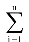
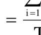
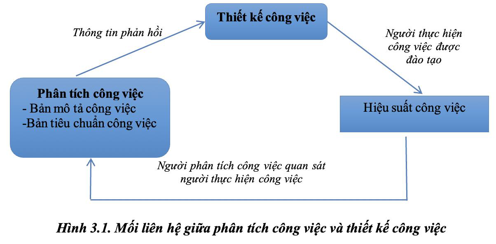
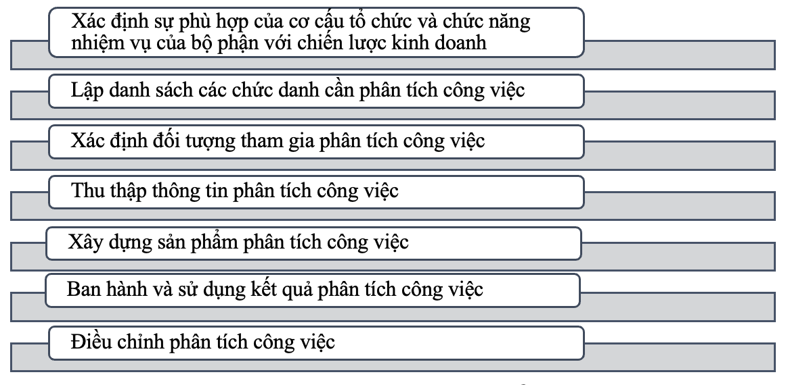
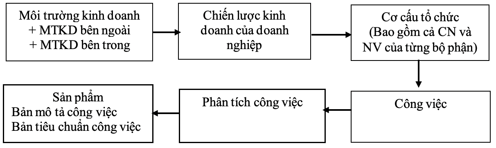
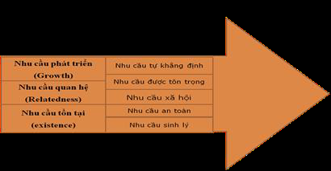
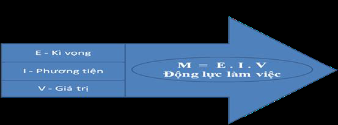
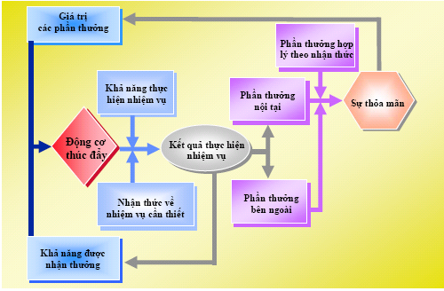

<!-- page 1 -->

CHƯƠNG 1: TỔNG QUAN VỀ QUẢN TRỊ NHÂN LỰC

1.1.Nhân lực và phân loại nhân lực

1.1.1.Khái niệm nhân lực

Học phần xác định khái niệm nhân lực như sau:

Nhân lực trong tổ chức/doanh nghiệp được hiểu là toàn bộ những người làm việc

trong tổ chức/doanh nghiệp được trả công, khai thác và sử dụng có hiệu quả nhằm

thực hiện mục tiêu của tổ chức/doanh nghiệp.

1.1.2.Đăc điểm của nhân lực

Nhân lực có một số đặc điểm:

Thứ nhất, nhân lực là một nguồn lực đặc biệt. Họ có tư duy trong quá trình thực

hiện các công việc và có thái độ, phản ứng với những sự vật và sự việc xung quanh.

Bên cạnh đó, nhân lực là chủ thể của hoạt động quản lý cũng là chủ thể tổ chức, thực

hiện tất cả các hoạt động sản xuất kinh doanh và đặc biệt là vận hành các nguồn lực

khác một cách có hiệu quả.

Thứ hai, nhân lực là một nguồn lực vô cùng đa dạng và phức tạp. Mỗi nhân lực

trong một tổ chức/doanh nghiệp là những cá nhân khác nhau về năng lực, quan điểm,

sở thích, tính cách,... từ đó đòi hỏi phương pháp quản trị phù hợp khác nhau.

Thứ ba, nhân lực là một nguồn lực có tính chủ động và sáng tạo. Nhân lực là chủ

thể của mọi sáng tạo. Bằng hoạt động thực tiễn trong sản xuất kinh doanh, con người

chủ động sáng tạo ra những giá trị vật chất và tinh thần.

Thứ tư, nhân lực là một nguồn lực khó bắt chước và sao chép. Nhân lực chính là

yếu tố khó bắt chước và sao chép từ bất kỳ tổ chức/doanh nghiệp nào khác.

Thứ năm, nhân lực là một nguồn lực có tiềm năng vô hạn. Nguồn lực của mỗi

một con người bao gồm thể lực và trí lực. Thể lực có thể vượt qua những giới hạn

thông thường mà bình thường con người không hề nghĩ tới. Trí lực - sự hiểu biết của

con người đã, đang và sẽ không bao giờ dừng lại và không có giới hạn.

1.1.3. Phân loại nhân lực

Có thể kể đến một số tiêu chí phân loại như sau:

Theo trình độ đào tạo của nhân lực: nhân lực trong tổ chức/doanh nghiệp được

phân thành 5 loại bao gồm nhân lực có trình độ sau đại học, nhân lực có trình độ đại

1

<!-- page 2 -->

học, nhân lực có trình độ cao đẳng, nhân lực có trình độ trung cấp, nhân lực có trình độ

sơ cấp.

Theo tình trạng đào tạo: nhân lực trong tổ chức/doanh nghiệp bao gồm 2 loại là

nhân lực đã qua đào tạo và nhân lực chưa qua đào tạo.

Theo kinh nghiệm: Có 2 loại nhân lực là nhân lực đã có kinh nghiệm và nhân lực

chưa có kinh nghiệm.

Theo loại hợp đồng lao động: có hai loại nhân lực là nhân lực thử việc và nhân

lực chính thức. Thông thường đối với nhân lực mới được tuyển, tổ chức/doanh nghiệp

thường quy định thời gian thử việc nhất định. Còn nhân lực chính thức lại bao gồm

nhiều loại như nhân lực ký các loại hợp đồng theo quy định của pháp luật.

Theo mức độ khan hiếm trên thị trường: có 2 loại nhân lực bao gồm nhân lực khan

hiếm và nhân lực không khan hiếm.

Theo tính chất lao động: nhân lực trong tổ chức/doanh nghiệp có thể phân chia

thành 2 loại bao gồm nhân lực trực tiếp nhân lực gián tiếp sản xuất, kinh doanh.

Ngoài các tiêu chí trên, tổ chức/doanh nghiệp có thể phân loại nhân lực theo một

số tiêu chí khác như: theo giới tính, theo độ tuổi, theo vùng địa lý, theo ngành kinh

tế,…

1.2.Khái niệm, vai trò và vị trí của quản trị nhân lực

1.2.1.Khái niệm quản trị nhân lực

Học phần này sử dụng tiếp cận quản trị nhân lực theo quá trình quản trị, theo đó:

Quản trị nhân lực được hiểu là tổng hợp các hoạt động quản trị liên quan đến việc

hoạch định nhân lực, tổ chức quản trị nhân lực, tạo động lực cho người lao động và

kiểm soát hoạt động quản trị nhân lực trong tổ chức/doanh nghiệp nhằm thực hiện

mục tiêu và chiến lược đã xác định.

1.2.2.Vai trò của quản trị nhân lực

Có thể khẳng định vai trò hết sức quan trọng của hoạt động này đối với tổ

chức/doanh nghiệp, thể hiện ở các khía cạnh sau:

Thứ nhất, quản trị nhân lực giúp khai thác tối đa tiềm năng con người nhằm đạt

hiệu quả, năng suất cao hơn trong quá trình làm việc bởi tiềm năng của con người là vô

hạn.

2

<!-- page 3 -->

Thứ hai, quản trị nhân lực giúp nâng cao năng lực cạnh tranh về đội ngũ nhân lực

của tổ chức/doanh nghiệp.

Thứ ba, quản trị nhân lực đóng vai trò thiết yếu trong triển khai và thực thi chiến

lược kinh doanh của tổ chức/doanh nghiệp.

Thứ tư, quản trị nhân lực góp phần tạo ra văn hóa, bầu không khí làm việc lành

mạnh cho tổ chức/doanh nghiệp.

Thứ năm, quản trị nhân lực giúp thúc đẩy sự thay đổi, đổi mới và sáng tạo trong

tổ chức/doanh nghiệp.

Thứ sáu, quản trị nhân lực góp phần vào việc giải quyết các vấn đề xã hội về lao

động.

1.2.3. Vị trí của quản trị nhân lực

Trong tổ chức/doanh nghiệp có các lĩnh vực quản trị cơ bản đó là quản trị chiến

lược, quản trị tác nghiệp và quản trị rủi ro. Trong đó:

Quản trị chiến lược đóng vai trò định hướng cho quá trình sản xuất, kinh doanh

của tổ chức/doanh nghiệp. Các hoạt động quản trị tác nghiệp đóng vai trò thực thi

chiến lược kinh doanh đã đề ra. Khi môi trường kinh doanh có nhiều biến động cần

tính đến vai trò của quản trị rủi ro nhằm nhận dạng, kiểm soát, phòng ngừa và giảm

thiểu các tổn thất hay những ảnh hưởng bất lợi của môi trường đồng thời tìm cách biến

rủi ro thành các cơ hội trong kinh doanh.

Quản trị nhân lực được coi là hoạt động nền tảng, mang tính chất, vai trò hỗ trợ

cho tất cả các hoạt động quản trị khác ở trong tổ chức/doanh nghiệp.

1.3.Các nội dung cơ bản của quản trị nhân lực

1.3.1.Nội dung của quản trị nhân lực theo tiếp cận quá trình

Hoạch định nhân lực

Hoạch định nhân lực là quá trình tư duy nhằm thiết lập nên chiến lược nhân lực,

đưa ra chính sách và các kế hoạch hoạt động đáp ứng nhu cầu nhân lực của tổ

chức/doanh nghiệp trên cơ sở các thông tin cơ bản từ việc phân tích môi trường quản

trị nhân lực, dự báo cung - cầu nhân lực.

Phân tích công việc được hiểu là quá trình thu thập thông tin về công việc để xác

định rõ nhiệm vụ, quyền hạn, các mối quan hệ khi thực hiện công việc, mức độ phức

3

<!-- page 4 -->

tạp của công việc, các tiêu chuẩn đánh giá mức độ hoàn thành và các năng lực tối thiểu

người thực hiện công việc cần có để thực hiện công việc được giao.

Tổ chức quản trị nhân lực bao gồm:

Tổ chức bộ máy quản trị nhân lực là quá trình xác định các công việc phải làm

khi thực hiện hoạt động quản trị nhân lực của tổ chức/doanh nghiệp, những người làm

các công việc đó, chuyển giao nhiệm vụ và quyền hạn cho các cá nhân có trách nhiệm

hoàn thành nhiệm vụ, xác lập các mối liên hệ trong khi tiến hành công việc. Kết quả

của tổ chức bộ máy quản trị nhân lực hình thành nên bộ máy tổ chức quản trị nhân lực

trong tổ chức/doanh nghiệp.

Tổ chức hoạt động quản trị nhân lực là quá trình triển khai thực hiện các hoạt

động quản trị nhân lực của doanh nghiệp, bao gồm: tuyển dụng nhân lực, bố trí và sử

dụng nhân lực, đào tạo và phát triển nhân lực, đánh giá thực hiện công việc, đãi ngộ

nhân lực,…

Tạo động lực làm việc là một quá trình sử dụng những tác động tới con người,

làm cho họ phát huy cao nhất mọi nỗ lực cá nhân để đạt được các mục tiêu. Tạo động

lực làm việc cho người lao động chính là gây ảnh hưởng, kích thích vào động cơ làm

việc, để người lao động có được động lực làm việc, thúc đẩy họ thực hiện công việc

được giao với hiệu quả cao nhất.

Kiểm soát quản trị nhân lực là một quá trình bao gồm ba giai đoạn chính đó là:

xây dựng các tiêu chuẩn kiểm soát, tức là xác định các loại mục tiêu cần đạt và mức độ

cần đạt đối với hoạt động quản trị nhân lực; đánh giá kết quả hoạt động quản trị nhân

lực và cuối cùng là thực hiện các hành động điều chỉnh hoạt động quản trị nhân lực để

đảm bảo cho kết quả đạt được trình độ của mục tiêu mong muốn, hoặc có thể là xem

xét và điều chỉnh mục tiêu ban đầu.

1.3.2.Nội dung của quản trị nhân lực theo tiếp cận tác nghiệp

Tuyển dụng nhân lực là quá trình tìm kiếm, thu hút và lựa chọn nhân lực để thỏa

mãn nhu cầu sử dụng và bổ sung lực lượng lao động cần thiết nhằm thực hiện mục tiêu

của tổ chức/doanh nghiệp.

4

<!-- page 5 -->

Bố trí và sử dụng nhân lực là quá trình sắp đặt nhân lực vào các vị trí, khai thác

và phát huy tối đa năng lực làm việc của nhân lực nhằm đạt hiệu quả cao trong công

việc.

Đào tạo và phát triển nhân lực là quá trình liên quan đến việc hoàn thiện và nâng

cao các kiến thức, kỹ năng, phẩm chất và kinh nghiệm nghề nghiệp của người lao động

nhằm đáp ứng yêu cầu trong quá trình thực hiện công việc của họ ở cả hiện tại và

tương lai, từ đó góp phần thực hiện mục tiêu đã xác định của tổ chức/doanh nghiệp.

Đánh giá thực hiện công việc là quá trình thu nhận và xử lí thông tin về quá trình

và kết quả thực hiện công việc của nhân lực trong tổ chức/doanh nghiệp để đưa ra

được những nhận định chính xác về mức độ hoàn thành công việc của nhân lực đối với

một tổ chức/doanh nghiệp trong một khoảng thời gian nhất định.

Đãi ngộ nhân lực là những đối đãi, đối xử thực tế của tổ chức/doanh nghiệp đối

với người lao động trong quá trình họ làm việc tại tổ chức/doanh nghiệp. Đãi ngộ nhân

lực thông qua hình thức đãi ngộ tài chính, đãi ngộ phi tài chính.

Một số nội dung khác: Tổ chức và định mức lao động, an toàn vệ sinh lao

động,…

1.4. Các học thuyết và tư tưởng quản trị nhân lực

1.4.1. Học thuyết quản trị nhân lực phương Đông

1.4.1.1. Trường phái Đức trị

Trường phái Đức trị do Khổng Tử sáng lập. Khổng Tử cho rằng “nhân chi sơ tính

bản thiện”, tức con người khi sinh ra đều có bản chất thiện tuy nhiên nhân cách không

giống nhau do hoàn cảnh sống, sự phấn đấu,… là khác nhau. Tư tưởng Đức trị với chủ

trương trị người bằng hướng tới xây dựng một xã hội nhân bản, phát triển những phẩm

chất tốt đẹp của con người.

Quan điểm của Khổng Tử trong một số hoạt động quản trị nhân lực cụ thể:

- Trong tuyển dụng, bố trí và sử dụng nhân lực ông cho rằng cần chọn người có

trí, có tài chứ không dựa vào giai cấp, huyết thống.

- Khổng Tử rất coi trọng giáo dục - đào tạo,  giáo dục - đào tạo sẽ làm nền tảng,

tác động và làm thay đổi bên trong con người.

5

<!-- page 6 -->

- Thưởng phạt phải công tâm, không để tình cảm cá nhân chi phối. Phân phối

quân bình là quan trọng nhất.

Mặc dù còn nhiều hạn chế trong tư tưởng như tính bảo thủ, không coi trọng lợi

ích kinh tế, phân phối quân bình, không đề cao pháp luật,… nhưng các tư tưởng của

Khổng Tử vẫn có giá trị to lớn, ảnh hưởng sâu sắc cho đến tận ngày nay đặc biệt là

nguyên tắc quyền biến trong hành động “vô khả, vô bất khả” tức đối với việc đời

không nhất định phải làm không nhất định không làm, thấy hợp nghĩa thì làm.

1.4.1.2. Trường phái Pháp trị

Hàn Phi (280-233 TCN) là người có công nghiên cứu và phát triển trường phái

Pháp trị một cách hệ thống, lôgíc. Quan điểm của Hàn Phi về con người đó là ngoại trừ

một số ít thánh nhân, còn thì phần lớn con người: Tranh nhau vì lợi; Lười biếng, khi có

dư ăn rồi thì không muốn làm nữa; Chỉ phục tùng quyền lực.

Từ quan niệm nhân chi sơ tính bản ác Hàn Phi đề xuất biện pháp quản trị nhân

lực dùng Pháp làm phạm trù hạt nhân, là nhân tố quyết định và đặt Pháp trong mối

quan hệ chặt chẽ với hai phạm trù Thế và Thuật. Để quản trị thành công nhà quản trị

cần có Pháp và Thế mang tính ổn định tương đối, rõ ràng, minh bạch nhưng Thuật phải

bí mật, biến hóa tùy người, tùy việc và tùy thời.

Trong các hoạt động quản trị nhân lực: Đề cao chính sách dùng người theo thuyết

hình danh. Trong đánh giá nhân lực, Hàn Phi nêu rõ khi giao việc thì phải kiểm tra kết

quả công việc và nhấn mạnh nhà quản trị phải có phương pháp để nghe lời cấp dưới

nói, xem lời nói của họ có giá trị không, phải đánh giá nhiều mặt để biết tâm địa của

họ, từ đó mà tin tưởng giao nhiệm vụ và thông qua thực tế, lấy thực tiễn là tiêu chuẩn

để đánh giá năng lực thực sự của họ. Trong đãi ngộ, thưởng phạt phải công bằng theo

đúng quy định, quy trình khách quan, rõ ràng.

Mặc dù cũng còn những hạn chế như quá đề cao quyền lực, thuật trừ gian cực kỳ

thâm hiểm và tàn độc,… nhưng không thể phủ nhận giá trị nổi bật của trường phái

Pháp trị vẫn còn nguyên giá trị cho đến tận ngày nay đó là việc áp dụng pháp luật

trong quản trị. Bên cạnh đó Hàn Phi Tử trùng quan điểm với Khổng Tử về sự quyền

biến và tính thực tế trong hành động.

1.4.2.Học thuyết quản trị nhân lực phương Tây

6

<!-- page 7 -->

1.4.2.1.Học thuyết X

Tác giả của học thuyết là Douglas McGregor (1906-1964). Học thuyết X đưa ra

giả thuyết là nhà quản trị có quan niệm về bản chất con người: (i) Lười biếng vốn là

bản tính bẩm sinh của con người bình thường, họ chỉ muốn làm việc ít; (ii) Con người

thường thiếu chí tiến thủ, không dám gánh vác trách nhiệm, cam chịu để người khác

lãnh đạo; (iii) Từ lúc sinh ra, con người đã tự coi mình là trung tâm, không chú ý tới

nhu cầu của tổ chức; (iv) Bản thân con người luôn chống lại sự đổi mới; (v) Họ không

lanh lợi, dễ bị những kẻ có dã tâm lừa đảo.

Các nhà quản trị có quan điểm theo học thuyết X có chủ trương sử dụng các

phương pháp quản lý nghiêm khắc dựa trên sự trừng phạt, quản lý ôn hòa dựa vào sự

khen thưởng hoặc kết hợp cả hai hay còn gọi là quản lý nghiêm khắc và công bằng.

Các biện pháp quản trị cụ thể bao gồm:

- Nhà quản trị phải chịu trách nhiệm tổ chức mọi hoạt động trong tổ chức/doanh

nghiệp nhằm đạt được mục tiêu;

- Phải chỉ huy, kiểm tra, giám sát chặt chẽ để điều chỉnh hành vi của cấp dưới và

người lao động đáp ứng nhu cầu của tổ chức;

- Phân chia công việc thành những phần nhỏ dễ làm, dễ thực hiện;

- Áp dụng biện pháp thuyết phục, chế độ khen thưởng, trừng phạt nghiêm khắc.

Như vậy các biện pháp quản trị được sử dụng chủ yếu là các biện pháp tác động

ngoại lực, đánh vào lợi ích kinh tế của người lao động khiến người lao động cảm thấy

sợ hãi và lo lắng, từ đó chấp nhận làm những việc nặng nhọc, đơn điệu với tần suất

làm việc cao miễn là được trả công xứng đáng và công bằng.

1.4.2.2.Học thuyết Y

Tác giả của học thuyết là Douglas McGregor (1906-1964). Học thuyết Y đưa ra

giả thuyết là nhà quản trị có quan niệm về con người như sau: (i) Lười nhác không phải

là bản tính bẩm sinh của con người. Lao động trí óc, lao động chân tay cũng như nghỉ

ngơi, giải trí đều là hiện tượng mang tính chất đặc trưng của con người; (ii) Điều khiển và

đe doạ trừng phạt không phải là biện pháp duy nhất có tác dụng thúc đẩy con người

thực hiện mục tiêu của tổ chức; (iii) Con người muốn cảm thấy mình có ích và quan

trọng, muốn chia sẻ trách nhiệm và tự khẳng định mình. Con người sẽ làm việc tốt hơn

7

<!-- page 8 -->

nếu họ đạt được sự thỏa mãn các nhu cầu này; (iv) Trong quá trình giải quyết khó khăn

của tổ chức, đại đa số thành viên của tổ chức có khả năng suy nghĩ, tinh thần và năng

lực sáng tạo; chỉ có một số ít người không có những khả năng ấy; (v) Tài năng của con

người luôn ở dạng tiềm ẩn, vấn đề là làm sao để khơi dậy những tiềm năng đó.

Các nhà quản trị theo trường phái Y đưa ra tập trung vào các giải pháp quản trị cơ

bản sau:

- Thực hiện nguyên tắc thống nhất giữa mục tiêu của tổ chức và mục tiêu của cá

nhân;

- Các biện pháp quản trị áp dụng đối với người lao động phải có tác dụng mang

lại “thu hoạch nội tại” hay các “phần thưởng bên trong”;

- Áp dụng những phương thức hấp dẫn để có được sự hứa hẹn chắc chắn của các

thành viên trong tổ chức;…

Các biện pháp các nhà quản trị sử dụng theo học thuyết Y đưa ra nhằm xây dựng

một môi trường phù hợp giúp người lao động phát huy một cách tốt nhất sự tự nguyện,

tự giác, tận dụng khai thác những tiềm năng của người lao động. Tuy nhiên học thuyết

Y cũng có hạn chế nhất định, đó là dễ dẫn đến tình trạng buông lỏng quản lý hoặc trình

độ của tổ chức chưa phù hợp để áp dụng.

1.4.2.3.Học thuyết Z

Học thuyết Z được tiến sĩ William G. Ouchi (sinh năm 1943) công bố trong tác

phẩm Học thuyết Z: Các doanh nghiệp Mỹ làm thế nào để đối phó với sự thách thức

của Nhật Bản.

Học thuyết Z chú trọng đến yếu tố người lao động trong tổ chức/doanh nghiệp và

cho rằng (i) người lao động thỏa mãn là chìa khóa dẫn tới tăng năng suất lao động; (ii)

con người có khả năng thích nghi, tính tập thể và khả năng phối hợp tốt; (iii) con người

nếu được tin tưởng, cư xử tế nhị và được kết hợp chặt chẽ trong tập thể thì họ sẽ nỗ lực

thực hiện tốt công việc.

Các biện pháp học thuyết Z đưa ra tập trung vào gia tăng lòng trung thành của

người lao động bằng cách tạo ra sự an tâm và mãn nguyện với hệ thống các chính sách

quản trị nhân lực một cách toàn diện, tôn trọng nhân viên cả trong và ngoài công việc.

8

<!-- page 9 -->

Trong học thuyết Z có sự hòa hợp giữa ba yếu tố năng suất lao động, sự tin cậy và

sự khôn khéo trong quan hệ giữa người với người. Bên cạnh đó học thuyết Z cũng có

những hạn chế như đôi khi vẫn tạo tính ỳ cho nhân viên, khiến họ trông chờ, ỷ lại và

không tích cực.

1.4.3. Tư tưởng quản trị nhân lực Việt Nam

Các vị anh hùng dân tộc thông qua các tác phẩm văn thơ, cáo, hịch… và đặc biệt

là bằng cuộc đời mình đã thể hiện những tư tưởng quản trị nhân lực Việt Nam hết sức

đặc sắc. Có thể kể đến một số tư tưởng sau:

Lý Thường Kiệt đề cao lý tưởng lấy dân làm trọng. Trần Hưng Đạo cho rằng để

giữ nước cần phải chọn dùng tướng giỏi, xem xét quyền biến,… tùy thời tạo thế.

Nguyễn Trãi với tư tượng nổi bật là nhân nghĩa, nhân nghĩa là vì dân, thương dân, an

dân.

Tư tưởng của chủ tịch Hồ Chí Minh là độc lập dân tộc gắn liền với giải quyết xã

hội và giải phóng con người. Trong đó, vấn đề con người được thể hiện xuyên suốt

trong toàn bộ nội dung tư tưởng của Người. Người rất quan tâm đến việc tìm kiếm,

phát hiện cán bộ tốt và nhân tài. Cán bộ phải có cả đức và tài trong đó đức là gốc: “Có

tài mà không có đức là người vô dụng. Có đức mà không có tài làm việc gì cũng khó.”.

Trong việc sắp xếp, bố trí cán bộ, cần công tâm, không phân biệt già trẻ, gái trai, dân

tộc, mối quan hệ… Trong quá trình sử dụng nhân lực, người quản lý phải luôn luôn

theo dõi, giúp đỡ cán bộ thực hiện công việc bởi "ai cũng có khuyết điểm". Người

cũng khẳng định rõ vai trò quan trọng của công tác đào tạo và phát triển nhân lực, đặc

biệt là đối với thế hệ trẻ,…

Tóm lại, trải qua nhiều năm kháng chiến từ thời phong kiến cho đến xây dựng xã

hội chủ nghĩa, tư tưởng quản trị nhân lực của Việt Nam chịu ảnh hưởng và là sự kết

hợp hài hòa của cả tư tưởng phương Đông và phương Tây dựa trên nền tảng phát huy

tinh thần dân tộc và bản sắc văn hóa trường tồn của Việt Nam.

CHƯƠNG 2: HOẠCH ĐỊNH NHÂN LỰC

2.1. KHÁI NIỆM VÀ VAI TRÒ CỦA HOẠCH ĐỊNH NHÂN LỰC

2.1.1. Khái niệm hoạch định nhân lực

9

<!-- page 10 -->

Nhân lực ngày càng trở thành yếu tố tạo nên năng lực cạnh tranh cốt lõi của tổ

chức, doanh nghiệp. Theo Barney, JB (1991) với mô thức VRIN và phát triển thành

mô thức VRIO (1995) cho thấy nguồn nhân lực có cơ hội trong việc thể hiện ý nghĩa

đặc biệt trong việc xây dựng và duy trì lợi thế cạnh tranh bền vững của tổ chức/doanh

nghiệp với các đặc trưng: Giá trị (Valuable) có nghĩa là nhân lực có khả năng thực

hiện các quyết định và đổi mới để thích ứng với sự thay đổi của môi trường hay nói

cách khác nguồn nhân lực có thể tạo ra giá trị là nhân lực có thể đáp ứng được các

nguy cơ và cơ hội bên ngoài; Sự hiếm có (Rareness) là năng lực đặc thù của nhân lực

trong tổ chức/doanh nghiệp được tạo ra từ những hoạt động quản trị nhân lực, đặc biệt

từ đào tạo và phát triển nhân lực với kiến thức, kỹ năng độc đáo; Không thể bắt chước

(Non - Imitability) nguồn nhân lực có giá trị chiến lược đặc biệt khi chúng không bị

bắt chước bởi người khác khi cung ứng dịch vụ khách hàng, điều này làm nên “văn

hóa quản trị nhân lực”; Tổ chức (Oganization) nhân lực có tính tổ chức được sắp xếp,

sử dụng đúng cách có khả năng khai thác các nguồn tài nguyên, có thể nắm bắt giá trị

và tận dụng được lợi thế cạnh tranh. Cũng như mọi nguồn lực khác hoạch định nhân

lực là một chức năng quan trọng để nguồn lực này bộc lộ những giá trị “cốt lõi” của tổ

chức/doanh nghiệp.

Hoạch định nhân lực là quá trình tư duy nhằm thiết lập nên chiến lược nhân

lực, đưa ra chính sách nhân lực và các kế hoạch tác nghiệp nhân lực của tổ

chức/doanh nghiệp trên cơ sở các thông tin cơ bản từ việc phân tích môi trường quản

trị nhân lực và dự báo cung, cầu nhân lực.

2.1.2. Vai trò của hoạch định nhân lực

- Một là, hoạch định nhân lực mang đến quan điểm hệ thống và có tầm nhìn về

nhân lực – với tư cách là nguồn vốn “đặc biệt” của tổ chức/doanh nghiệp

- Hai là, hoạch định nhân lực tạo động lực để tìm kiếm và thu hút được nguồn

nhân lực chất lượng cao

Ba là, hoạch định nhân lực là mảnh đất phát huy được tính sáng tạo và chủ động

của nhân lực.

Bốn là, hoạch định nhân lực tạo cơ hội phát triển nhân lực cấp cao (tầm nhìn, tính

tổng quát…).

10

<!-- page 11 -->

Năm là, hoạch định nhân lực góp phần tiết kiệm chi phí sử dụng nhân lực.

Sáu là, hoạch định nhân lực tác động đến việc cải thiện kết quả, hiệu quả hoạt

động kinh doanh của tổ chức/doanh nghiệp.

2.2. NGUYÊN TẮC, YÊU CẦU VÀ CĂN CỨ HOẠCH ĐỊNH NHÂN LỰC

2.2.1. Nguyên tắc hoạch định nhân lực

2.2.1.1. Nguyên tắc tập trung dân chủ

Tập trung được biểu hiện ở chỗ trong hoạch định mỗi nội dung phải luôn xuất

phát từ lợi ích chung, phục vụ cho sự nghiệp phát triển lâu dài của doanh nghiệp.

Còn tính dân chủ trong hoạch định nhân lực được biểu hiện ở tất cả các khâu, các

giai đoạn của hoạch định nhân lực nhằm huy động nhân lực thuộc các bộ phận chức

năng, bộ phận tác nghiệp (bộ phận Nhân sự; bộ phận Kinh doanh; bộ phận Kế

hoạch…) tham gia tích cực vào hoạt động chung. Tuy nhiên mức độ tập trung của

hoạch định nhân lực sẽ chiếm ưu thế hơn và có giá trị khác nhau ở từng phạm vi hoạch

định nhân lực

2.2.1.2. Nguyên tắc khoa học và thực tiễn

Nguyên tắc này yêu cầu hoạch định nhân lực phải xuất phát từ thực tiễn tình hình

của môi trường nhân lực bên ngoài cũng như nội lực bên trong của doanh nghiệp về

công tác nhân sự để tư duy khoa học tránh sai lầm do viển vông, không sát với thực tế.

Đảm bảo nguyên tắc khoa học là việc tuân thủ những nguyên lý, các bước trong

quy trình, sử dụng phương pháp phù hợp khi hoạch định nhân lực.

2.2.1.3. Nguyên tắc hài hòa lợi ích

Hoạch định nhân lực chỉ có thể thành công nếu nó tính đến sự trông đợi rộng rãi,

nguyện vọng của nhân viên, nhu cầu của tổ chức/doanh nghiệp về tiến trình hội nhập,

hợp tác với các đối tác và sự phát triển của tổ chức/doanh nghiệp dựa vào sự phát triển

của con người. Do đó, phải tính đến sự hài hòa giữa các lợi ích kinh tế, chính trị của

các tác nhân có liên quan đó là người lao động, chủ sở hữu, cổ đông, giới quản trị...

Hài hòa lợi ích còn phải hiểu là hài hòa giữa lợi ích tổ chức/doanh nghiệp với lợi ích

xã hội bởi vì thành đạt kinh tế gắn liền với thành đạt xã hội. Nguyên tắc này được thực

hiện là nền tảng cho việc thực hiện nguyên tắc tập trung dân chủ và phản ảnh rõ nét

nguyên tắc khoa học và thực tiễn nêu trên.

11

<!-- page 12 -->

2.2.1.4. Nguyên tắc toàn diện và trọng điểm

Hoạch định nhân lực phải tuân thủ quan điểm hệ thống, nghĩa là các chiến lược,

chính sách nhân lực được dự kiến phải là kết quả của việc rà soát tất cả nội dung tác

nghiệp quản trị nhân lực, phải làm lợi cho toàn cục, mặc dù có thể làm tổn thương một

số bộ phận. Trong quá trình hoạch định nhân lực phải đưa lợi ích chung của tổ

chức/doanh nghiệp lên trên các lợi ích khác, thông qua lợi ích toàn cục để đem lại lợi

ích cho bộ phận, lợi ích cá nhân. Bên cạnh đó phải chỉ ra được trọng điểm đột phá,

mục tiêu then chốt là cơ sở cho những suy nghĩ và sáng tạo cho hoạt động quản trị

nhân lực có như vậy nguồn nhân lực mới có thể góp phần tạo ra sự chuyển biến về

chất cho tổ chức/doanh nghiệp

2.2.1.5. Nguyên tắc liên tục và kế thừa

Hoạch định nhân lực không phải là hành vi nó là một quá trình, chính vì vậy phải

được thực hiện liên tục. Hoạch định nhân lực còn phải tiếp tục ngay cả khi chiến lược,

chính sách, kế hoạch nhân lực đã được hình thành bởi có thể có các dữ liệu mới, thông

tin mới cần bổ sung, cần thay đổi.

Đặc biệt hiện tượng khủng hoảng của nhiều tổ chức/doanh nghiệp đã cho thấy

phần lớn là do quá trung thành với một chiến lược đã lỗi thời trong khi đối thủ có các

điều chỉnh chiến lược, môi trường lại biến động.

2.2.2. Yêu cầu hoạch định nhân lực

2.2.2.1. Sáng tạo

Tổ chức/doanh nghiệp không thể mãi duy trì một chiến lược, chính sách khi mà

môi trường luôn luôn thay đổi và điều kiện cạnh tranh bắt buộc doanh nghiệp cần có

sự thay đổi. Tổ chức/doanh nghiệp có xuất phát điểm khác nhau dựa trên tầm nhìn, sứ

mạng và giá trị cốt lõi của bản thân nội tại nên không thể “nhân bản” hoặc “sao y”

chiến lược nhân lực này cho một tổ chức/doanh nghiệp khác.

2.2.2.2. Chủ động

Hoạch định nhân lực đòi hỏi doanh nghiệp tiếp tục chủ động dự báo những thay

đổi của môi trường nhằm có những điều chỉnh thích hợp. Thay đổi kế hoạch, chính

sách hay chiến lược? Để trả lời câu hỏi này đòi hỏi doanh nghiệp có cái nhìn rõ hơn,

12

<!-- page 13 -->

cần chủ động hơn khi hoạch định nhân lực để tránh sa đà vào những hoạt động tác

nghiệp mang tính bị động, đối phó.

2.2.2.3. Linh hoạt

Chiến lược, chính sách, kế hoạch nhân lực có thể quá cứng nhắc khi đã được ấn

định thành văn bản. Vì vậy hoạch định nhân lực cần năng động, các chiến thuật, kế

hoạch tác nghiệp có thể thay đổi rất nhanh thích ứng với những thay đổi của môi

trường. Có những sự thay đổi lớn, bất ngờ và sâu sắc buộc tổ chức/doanh nghiệp thay

đổi cả chiến lược nguồn nhân lực.

2.2.2.4. Nhất quán

Hoạch định bao gồm việc xác định rõ mục tiêu và xây dựng một chiến lược tổng

thể, nhất quán với mục tiêu đó, và triển khai một hệ thống các chính sách, kế hoạch để

thống nhất và phối hợp các hoạt động.

2.2.3. Căn cứ hoạch định nhân lực

2.2.3.1. Quan điểm của lãnh đạo cấp cao

Nhà quản trị với khả năng nhận thức, năng lực, phẩm chất và đặc biệt là hệ thống

giá trị, quan điểm của mình có ảnh hưởng chi phối đến chiến lược cũng như chính

sách, hoạt động quản trị nhân lực.

Quan điểm lãnh đạo cấp cao là quan điểm của những người có vai trò quyết định

trong lựa chọn định hướng chiến lược, các quyết định đó thể hiện ở các góc độ: quyết

định kỹ thuật, kinh phí và nguồn lực… cho hoạch định nhân lực.

2.2.3.2. Chiến lược của tổ chức/doanh nghiệp

Chiến lược của tổ chức/chiến lược kinh doanh của doanh nghiệp chỉ ra những gì

mà tổ chức/doanh nghiệp hy vọng hoàn thành để đạt được bước phát triển về chất, là

một kế hoạch đặc biệt phải tương thích với các nguồn lực sẵn có, nguồn lực có thể đạt

được.

Xem xét một cách cụ thể chiến lược kinh doanh với tư cách là căn cứ để hoạch

định nhân lực cho thấy mỗi mô hình chiến lược cạnh tranh mà doanh nghiệp lựa chọn

có những đòi hỏi nguồn nhân lực phù hợp và tương thích với nó. Trong các cách để tạo

ra năng lực cạnh tranh của công ty, thì lợi thế thông qua con người được xem là yếu tố

căn bản. Con người được xem là nguồn lực căn bản và có tính quyết định của mọi mô

13

<!-- page 14 -->

hình chiến lược cạnh tranh. Ví dụ, có công ty đề cao các yếu tố về năng suất; kỹ năng

có tính chuyên nghiệp, có công ty lại đề cao dịch vụ tốt; chất lượng cao; khả năng đổi

mới của đội ngũ nhân viên.

2.2.3.3. Hiện trạng nhân lực doanh nghiệp

Hiện trạng nhân lực của doanh nghiệp là bức tranh tổng thể và chi tiết về nhân

lực doanh nghiệp với các chỉ tiêu: số lượng, cơ cấu, năng lực, phẩm chất, mong muốn,

nhu cầu của người lao động, tỉ lệ dịch chuyển… Đây là căn cứ quan trọng mà doanh

nghiệp cần xem xét khi tuân thủ nguyên tắc “thực tiễn” trong hoạch định. Chiến lược,

chính sách hay kế hoạch nhân lực sẽ thiếu khả thi thậm chí không phù hợp nếu không

được thiết kế dựa vào thực lực. Trong các chỉ tiêu phản ánh cấu trúc nhân lực (cơ cấu

nhân lực theo trình độ, lứa tuổi, giới tính, tính chất lao động…) phù hợp hay không

phù hợp với loại hình tổ chức, quy mô hoạt động… có ảnh hưởng không nhỏ đến hiệu

quả quản trị nhân lực của tổ chức/doanh nghiệp.

2.2.3.4. Sức ép từ các lực lượng cạnh tranh

Sức ép từ các lực lượng cạnh tranh trong ngành là không nhỏ tới hoạt động của

doanh nghiệp và tất yếu ảnh hưởng tới các quyết định quản trị nhân lực ở cả tầm chiến

lược, chiến thuật và tác nghiệp. Các lực lượng đó theo quan điểm của Michal Porter

(1980) bao gồm khách hàng; nhà cung cấp; đối thủ tiềm ẩn; sản phẩm thay thế và đối

thủ cạnh tranh trực tiếp.

2.2.3.5. Sự thay đổi môi trường vĩ mô

Môi trường vĩ mô bao gồm các yếu tố nằm bên ngoài và tác động chung đến các

doanh nghiệp trong phạm vi quốc gia, chúng không chỉ định hướng và có ảnh hưởng

trực tiếp đến các hoạt động quản trị nhân lực của doanh nghiệp, mà còn ảnh hưởng cả

tới môi trường ngành và môi trường nội bộ doanh nghiệp. Các yếu tố này cũng là

những nguyên nhân chính tạo ra cơ hội cũng như nguy cơ cho các hoạt động quản trị

nhân lực. Giáo sư Harvard Francis Aguilar (1967), đề xuất phân tích P.E.S.T với các

yếu tố môi trường vĩ mô đó là: Chính trị (Political); Kinh tế (Economics); Văn hóa -

Xã hội (Social); Công nghệ (Technological).

2.2.3.6. Xu hướng toàn cầu hóa

14

<!-- page 15 -->

Toàn cầu hóa là tự nhiên và sẽ ảnh hưởng đến mọi thứ trong đó có các quyết định

chiến lược nhân lực. Các doanh nghiệp sẽ tồn tại như thế nào trong một môi trường

cạnh tranh toàn cầu? Chính yếu tố con người có thể tạo ra thay đổi lớn. Các doanh

nghiệp muốn tăng cường sự hiện diện, vai trò đóng góp và vị trí của mình trong thị

trường nội địa và toàn cầu thì phải biết sử dụng nguồn nhân lực toàn cầu của họ để duy

trì lợi thế cạnh tranh

2.3. NỘI DUNG HOẠCH ĐỊNH NHÂN LỰC

Hoạch định nhân lực bao gồm hoạch định chiến lược nhân lực, hoạch định chiến

thuật (hoạch định chính sách) và hoạch định tác nghiệp nhân lực là quá trình tổng hợp

thông tin, sử dụng kỹ thuật phân tích và ra quyết định.

2.3.1. Hoạch định chiến lược nhân lực

2.3.1.1. Phân tích môi trường quản trị nhân lực

Mục đích: Nhằm xác định cơ hội, thách thức từ môi trường quản trị nhân lực bên

ngoài và nhận diện những điểm mạnh, điểm yếu từ môi trường quản trị nhân lực bên

trong để doanh nghiệp có những biện pháp tận dụng cơ hội, đối phó thách thức, ngăn

ngừa những rủi ro về nhân lực có thể xảy ra và phát huy lợi thế/điểm mạnh, hạn

chế/khắc phục những điểm yếu, khó khăn trong công tác quản trị nhân lực của doanh

nghiệp để đảm bảo thực thi tốt chiến lược kinh doanh của doanh nghiệp, góp phần phát

triển doanh nghiệp một cách bền vững.

Nội dung: Phân tích môi trường gồm các nội dung là: Liệt kê các yếu tố môi

trường; Phân tích các yếu tố môi trường; Tổng hợp kết quả phân tích các yếu tố môi

trường.

Kết quả: Phân loại và sắp xếp các yếu tố môi trường bên ngoài và bên trong thành

4 nhóm yếu tố Điểm mạnh - Strengths (S); Điểm yếu - Weaknesses (W), Cơ hội -

Opportunities (O) and Thách thức - Threats (T) thành ma trận SWOT.

2.3.1.2. Xây dựng các phương án chiến lược nhân lực

Xác định các phương án chiến lược nhân lực là quá trình nhà quản trị thiết kế các

khả năng kết hợp giữa điểm mạnh, điểm yếu, cơ hội và mối đe dọa về hoạt động quản

trị nhân lực cho doanh nghiệp của mình. Kỹ thuật được sử dụng trong xây dựng

phương án chiến lược nhân lực là kỹ thuật SWOT.

15

<!-- page 16 -->

2.3.1.3. Đánh giá và lựa chọn phương án chiến lược nhân lực

(i) Tiêu chí đánh giá phương án chiến lược nhân lực:

Thông thường các phương án chiến lược được đánh giá dựa trên một số tiêu chí

sau:

- Tính khả thi: phù hợp với các nguồn lực để thực thi.

- Tính kinh tế: mức đầu tư, hiệu quả thu hồi về mặt tài chính, chi phí phát sinh,

mức tiết kiệm (trong so sánh tương đối khi áp dụng chiến lược này thay vì chiến lược

khác)…

- Thời gian: thời gian triển khai, thời gian đạt được mục tiêu, độ trễ.

- Mức độ rủi ro: rủi ro về tài chính, rủi ro về con người, rủi ro về đối tác tư vấn

hoặc đào tạo, rủi ro về thời gian, rủi ro khác do ảnh hướng của môi trường hoạt

động…

(ii) Một số phương pháp đánh giá và lựa chọn phương án chiến lược nhân lực:

- Phương pháp đánh giá lựa chọn theo thang điểm: Là phương pháp sử dụng

các tiêu chí đánh giá để tính điểm các phương án chiến lược làm cơ sở để ra quyết định

lựa chọn. Phương pháp này được thực hiện với các bước sau: Thành lập hội đồng đánh

giá và thẩm định các phương án chiến lược nhân lực; Xây dựng bộ tiêu chí đánh giá cụ

thể (theo mục tiêu và mong muốn của nhà quản trị). Ví dụ: chi phí, hiệu quả, thời gian,

mức độ rủi ro…; Từng thành viên hội đồng đánh giá cho điểm từng phương án chiến

lược nhân lực theo bộ tiêu chí. Phương án được lựa chọn là phương án chiến lược nhân

lực có điểm số cao nhất

- Phương pháp chuyên gia: Phương pháp chuyên gia là phương pháp dự báo mà

việc thu thập và xử lý các đánh giá được thực hiện bằng cách tập hợp, hỏi ý kiến các

chuyên gia giỏi thuộc lĩnh vực quản trị nhân lực. Phương pháp chuyên gia được thực

hiện trên cơ sở thu thập, xử lý các ý kiến đánh giá của các chuyên gia rồi đưa ra kết

quả. Việc phân tích và tổng hợp các ý kiến chuyên gia được thực hiện trên cơ sở sử

dụng các công cụ toán học và logic cho phép đảm bảo sự thống nhất và tính khách

quan. Chất lượng của việc sử dụng phương pháp chuyên gia phụ thuộc vào các hoạt

động: lựa chọn chuyên gia, trưng cầu ý kiến chuyên gia và thu thập và xử lý các đánh

giá.

16

<!-- page 17 -->

- Phương pháp Delphi: Gần giống phương pháp chuyên gia nhưng điều khác biệt

duy nhất là các thành viên không biết ai đưa ra đánh giá thế nào và cũng không thảo

luận nhau về vấn đề đó, chỉ là đưa ra đánh giá. Kết quả có thể biết nhưng cũng không

biết ai trả lời như thế nào. Điều này khắc phục nhược điểm của phương pháp chuyên

gia là sự ảnh hưởng của người nói trước hay có quyền lực hơn trong nhóm phỏng vấn.

2.3.1.4. Thiết lập chiến lược nhân lực

Thiết lập chiến lược nhân lực là việc xác định mục tiêu cơ bản và lựa chọn các

phương thức hoạt động quản trị nhân lực dựa trên trên sự phù hợp giữa nguồn lực của

tổ chức/doanh nghiệp với môi trường bên ngoài.

Trong các chiến lược, chiến lược về nhân lực là một chiến lược quan trọng của bất

kỳ một tổ chức, doanh nghiệp nào, nó có quan hệ nhân quả với các chiến lược tổng thể

và bộ phận khác. Việc khai thác và sử dụng hiệu quả nguồn nhân lực là vấn đề mà các

ngành, các doanh nghiệp đang ưu tiên hàng đầu. Như vậy, chiến lược nguồn nhân lực

có mục đích chung, đó là nhằm đảm bảo sự thành công của doanh nghiệp

2.3.2. Hoạch định chiến thuật nhân lực

Hoạch định chiến thuật nhân lực xây dựng nên loại kế hoạch mang tính hướng

dẫn các hoạt động quản trị nhân lực. Kế hoạch hướng dẫn thường được sử dụng nhiều

lần, trong một vài năm được gọi là chính sách nhân lực. Chính sách nhân lực là quy

định thể hiện những hướng dẫn chung mô tả những giới hạn mà các hoạt động quản

trị nhân lực chỉ có thể diễn ra trong phạm vi đó.

2.3.2.1. Các yêu cầu đối với xây dựng chính sách nhân lực

- Công bằng: Chính sách nhân lực phải đảm bảo tính công bằng. Yêu cầu này

thể hiện ở mọi khía cạnh của chính sách và là tư tưởng, triết lý xuyên suốt chính sách.

- Công khai: Chính sách nhân lực liên quan đến các đối tượng người lao động

khác nhau trong doanh nghiệp và là ảnh hưởng trực tiếp đến tinh thần làm việc cho nên

phải công bố công khai và giải thích để mọi người đều hiểu và thông suốt.

- Kịp thời: Chính sách nhân lực có thể trở nên không còn thích hợp nếu các căn

cứ hoạch định chính sách thay đổi, vì vậy phải sửa đổi và đưa ra các chính sách phù

hợp đúng lúc.

17

<!-- page 18 -->

- Có lý, có tình: Con người là một chủ thể của xã hội và luôn đòi hỏi phải được

đối xử dựa trên lòng nhân ái. Do vậy, chính sách nhân lực ngoài tính hợp lý còn cần

phải mang tính nhân bản, vì con người và cho con người.

- Rõ ràng, dễ hiểu: Chính sách nhân lực hướng tới các thành viên của doanh

nghiệp tích cực làm việc và thi đua với nhau, vì vậy chúng phải được mọi thành viên

thông hiểu. Không nên đưa ra hệ thống chính sách nhân lực chi li, phức tạp, dễ dẫn đến

hiểu nhầm hoặc bị xuyên tạc.

2.3.2.2. Nội dung xây dựng chính sách nhân lực

(i ) Xác định căn cứ xây dựng chính sách nhân lực

- Những quy định của Nhà nước

- Chiến lược kinh doanh và chiến lược nhân lực của doanh nghiệp

- Văn hoá doanh nghiệp

- Quan điểm của nhà quản trị doanh nghiệp

(ii) Xác định đối tượng, phạm vi chính sách nhân lực

(iii) Xây dựng nội dung chính sách nhân lực

Những quy định chung

Những nội dung cụ thể

Quy định về tổ chức thực hiện

(iv) Ra quyết định ban hành chính sách nhân lực

Quy cách của quyết định ban hành chính sách được thực hiện theo thể thức và

cách trình bày văn bản hành chính. Cụ thể phải gồm những phần sau:

- Quốc hiệu

- Tên tổ chức/doanh nghiệp ban hành quyết định

- Số, ký hiệu của quyết định

- Địa danh và ngày, tháng, năm ban hành quyết định

- Tên loại và trích yếu nội dung của quyết định

- Nội dung quyết định

- Quyền hạn, chức vụ, họ tên và chữ ký của người có thẩm quyền

- Dấu của cơ quan, tổ chức.

2.3.2.3. Một số chính sách nhân lực chủ yếu, gồm:

18

<!-- page 19 -->

(i) Chính sách tuyển dụng nhân lực

(ii) Chính sách đào tạo

(iii) Chính sách phát triển nhân lực

(iv) Chính sách đãi ngộ nhân lực, gồm:

- Chính sách tiền lương

- Chính sách thưởng:

- Chính sách phụ cấp:

- Chính sách trợ cấp

- Chính sách phúc lợi

(v) Chính sách thi đua

2.3.3. Hoạch định tác nghiệp nhân lực

2.3.3.1. Dự báo nhu cầu nhân lực

a. Mục đích: Xác định nhu cầu nhân lực trong từng giai đoạn (thường là 1 năm) về số

lượng, chất lượng, cơ cấu của tổ chức/doanh nghiệp để đáp ứng yêu cầu của hoạt

động/hoạt động kinh doanh.

b. Phương pháp dự báo nhu cầu nhân lực:

* Phương pháp tính theo lượng lao động hao phí

Xác định nhu cầu về số lượng nhân lực cho năm kế hoạch được xác định căn cứ vào:

tổng số lượng lao động hao phí để hoàn thành số lượng sản phẩm hoặc khối lượng

công việc, nhiệm vụ của năm kế hoạch; quỹ thời gian làm việc bình quân của một lao

động năm kế hoạch; hệ số tăng năng suất lao động dự tính năm kế hoạch.

n

SL
t
D

i
i

=
=

1
i

Công thức:

K
T

m
n

Trong đó: D: Cầu lao động năm kế hoạch của tổ chức (người).

ti: Lượng lao động hao phí để sản xuất một đơn vị sản phẩm i (giờ - mức)

SLi: Tổng số sản phẩm i cần sản xuất năm kế hoạch

Tn: Quỹ thời gian làm việc bình quân của 1 lao động năm kế hoạch (giờ/người)

Km: Hệ số tăng năng suất lao động dự tính năm kế hoạch

n: Số loại sản phẩm cần sản xuất năm kế hoạch

19

<!-- page 20 -->

* Phương pháp tính theo năng suất lao động

Xác định nhu cầu về số lượng nhân lực cho năm kế hoạch được xác định bằng kết

quả của phép chia tổng sản lượng cho năng suất lao động theo công thức:

D = Q/W

Trong đó:
D: Nhu cầu nhân lực năm kế hoạch

Q: Tổng sản lượng năm kế hoạch

W: Năng suất lao động của một người lao động năm kế hoạch

* Phương pháp tính theo tiêu chuẩn định biên

Xác định nhu cầu về số lượng nhân lực bằng kết quả của phép chia tổng khối

lượng công việc phải hoàn thành năm kế hoạch cho tiêu chuẩn định biên công việc cho

mỗi lao động.

* Phương pháp tính theo cầu nhân lực từng đơn vị

Xác định bằng cách người quản lý ở từng đơn vị dựa vào mục tiêu của đơn vị, xác

định khối lượng công việc cần phải hoàn thành cho thời kỳ kế hoạch dự đoán cần bao

nhiêu nhân lực để hoàn thành. Cầu nhân lực của tổ chức trong thời kỳ kế hoạch sẽ được

tổng hợp từ cầu nhân lực của từng đơn vị.

* Phương pháp dự đoán theo tiêu chuẩn công việc

Đây là phương pháp dự đoán nhu cầu nhân lực về chất lượng. Theo đó căn cứ

vào kế hoạch sản xuất kinh doanh của tổ chức, xác định các công việc cần phải thực

hiện và các tiêu chuẩn công việc cụ thể. Từ đó xác định các năng lực mà người lao

động cần có để thực hiện công việc.

Ngoài ra, còn có các phương khác dự báo cầu nhân lực như:

Phương pháp ước lượng trung bình

Phương pháp tính theo tiêu chuẩn hao phí lao động của một đơn vị sản lượng

Phương pháp phân tích hồi quy tuyến tính

Phương pháp chuyên gia

d. Nội dung dự báo nhu cầu nhân lực

Xác định và phân tích những căn cứ cơ bản để dự báo nhu cầu nhân lực:

• Mục tiêu và chiến lược hoạt động của tổ chức, doanh nghiệp

20

<!-- page 21 -->

• Cơ cấu và chủng loại sản phẩm, dịch vụ mà tổ chức, doanh nghiệp sẽ cung cấp cho thị

trường và xã hội:

• Sự thay đổi về năng suất lao động

• …

e. Dự đoán các loại cầu nhân lực

- Dự đoán cầu nhân lực thời vụ hoặc theo một công việc nhất định có thời hạn

dưới 12 tháng:

- Dự đoán cầu nhân lực có xác định thời hạn

- Dự đoán cầu nhân lực không xác định thời hạn

- Dự đoán cầu nhân lực chuyên môn: trong đó, nhân lực chuyên môn là những

- Dự đoán cầu nhân lực hỗ trợ

2.3.3.2. Dự báo khả năng cung ứng nhân lực

a. Mục đích: Xác định tình hình nhân lực hiện có của tổ chức cả về số lượng, chất

lượng, cơ cấu và xác định lực lượng lao động trên thị trường có khả năng ra nhập tổ

chức khi tổ chức có nhu cầu để có biện pháp thu hút hợp lý.

b. Phương pháp dự báo khả năng cung ứng nhân lực

*Phương pháp điều tra xã hội học

Phương pháp này thường áp dụng cho công tác xác định tình hình cung nhân lực

nội bộ, và cung nhân lực trên thị trường bằng việc Thiết kế mẫu phiếu thu thập thông

tin phù hợp.

* Phương pháp thống kê, phân tích:

Phương pháp này dựa trên các số liệu đã được thông kê, và phân loại theo các

năm thành một chuỗi thời gian. Nhà quản trị trên cơ sở phân tích cung nhân lực qua

các năm, trên cơ sở hiểu biết suy luận xu hướng tương lai, và cho ra các quyết định

quản trị.

* Phương pháp chuyên gia:

Đây là phương pháp này thường áp dụng cho cả cung nhân lực nội bộ và cung

nhân lực thị  trường. Bản chất của phương pháp này là lấy ý kiến đánh giá của các

chuyên gia để làm kết quả dự báo

* Phương pháp dùng biểu đồ thay thế nhân lực:

21

<!-- page 22 -->

Cách xác định cung NL: Số nhân lực năm sau theo mỗi loại = Số nhân lực của

loại đó năm trước+ Số được thăng tiến - Số ra đi, số thăng tiến hay về nghỉ hưu của

mỗi loại.

Ngoài ra, còn có các phương khác dự báo năng cung ứng nhân lực khác như

* Phương pháp ngoại suy xu thế

* Phương pháp mô hình hoá

* Phương pháp dự báo nguồn nhân lực dựa vào dân số

c. Nội dung dự báo khả năng cung ứng nguồn nhân lực

* Dự báo cung nhân lực nội bộ

Xác định tình hình nhân lực hiện có trong doanh nghiệp cả về số lượng, chất

lượng, cơ cấu và xu hướng phát triển nhân lực nguồn nhân lực trong thời kỳ dự báo.

* Dự báo cung thị trường

Xác định lực lượng lao động trên thị trường và xu hướng của lực lượng này có

khả năng gia nhập doanh nghiệp khi doanh nghiệp có nhu cầu để có biện pháp thu hút

hợp lý.

2.3.3.3. Phân tích tương quan cung cầu nhân lực

Phân tích GAP (phân tích chênh lệch) thực chất là phân tích tương quan giữa dự

báo cầu về nhân lực của doanh nghiệp và dự báo cung nhân lực. Trong dài hạn nó sẽ

cho phép doanh nghiệp đưa ra được các giải pháp tạo cán bộ nguồn. Còn trong ngắn

hạn nó cho phép đưa ra các quyết định bổ nhiệm, miễn nhiệm, thay đổi công việc,

thuyên chuyển công tác... Theo đó phân tích GAP có thể cho ba kết quả:

• Dư thừa

• Thiếu hụt

• Cân bằng

2.3.3.4. Xây dựng kế hoạch tác nghiệp nhân lực

Xây dựng kế hoạch tác nghiệp nhân lực

Xây dựng kế hoạch nhân lực là việc xác định những mục tiêu nhân lực trong

từng năm của thời kỳ chiến lược được vận hành trên nền tảng các chính sách nhân lực.

Để thực thi được các mục tiêu kế hoạch nhân lực tổng thể của năm cần có các kế

22

<!-- page 23 -->

hoạch nhân lực chi tiết gắn với các tác nghiệp quản trị nhân lực của năm đó như: kế

hoạch tuyển dụng, kế hoạch đào tạo, kế hoạch đãi ngộ…

(i) Xây dựng kế hoạch nhân lực tổng thể

Mục tiêu kế hoạch nhân lực là những dấu mốc mà hoạt động quản trị nhân lực

mong muốn và cố gắng đạt được nó trong thời kỳ kế hoạch.

* Yêu cầu xây dựng mục tiêu nhân lực: Theo nguyên tắc xác định và xây dựng

mục tiêu thì các mục tiêu cần phải khả thi và đo lường được.

(ii) Xây dựng kế hoạch nhân lực chi tiết

Kế hoạch nhân lực chi tiết là kế hoạch của từng hoạt động quản trị nhân lực (kế

hoạch tuyển dụng, kế hoạch đào tạo, kế hoạch đãi ngộ… được xây dựng theo từng chu

kỳ thời gian, thông thường là 1 năm. Tuy nhiên tùy đặc điểm tình hình biến động nhân

lực của tổ chức/doanh nghiệp mà có thể phải xây dựng kế hoạch hoạt động quản trị

nhân lực cho 3 tháng hay 6 tháng.

(iii) Dự trù ngân sách nhân lực bao gồm

• Dự trù chi phí

• Dự trù nguồn thu

• Tổng hợp ngân sách

CHƯƠNG 3. PHÂN TÍCH CÔNG VIỆC

3.1. Công việc và chức danh công việc

3.1.1. Công việc

3.1.1.1. Khái niệm công việc

- Khái niệm theo nghĩa rộng: Công việc là một số hoạt động cụ thể phải hoàn

thành nếu tổ chức/doanh nghiệp muốn đạt được mục tiêu của mình

Theo cách hiểu này, công việc có thể đòi hỏi một số công tác cụ thể do một người thực

hiện hoặc một số công tác của hàng chục, thậm chí hàng trăm người thực hiện. Ví dụ

như công việc bán hàng của một doanh nghiệp thương mại. Sẽ có rất nhiều người cùng

thực hiện công việc đó.

23

<!-- page 24 -->

- Khái niệm theo nghĩa hẹp: Công việc là tất cả những nhiệm vụ được thực hiện

bởi một người lao động hoặc là tất cả những nhiệm vụ giống nhau được thực hiện bởi

một số người lao động

Một lưu ý, theo tiếp cận của giáo trình này, khi nghiên cứu PTCV, công việc

được tiếp cận theo nghĩa hẹp. Đó là những nhiệm vụ được thực hiện bởi một/hoặc một

số người lao động trong tổ chức/doanh nghiệp. Là một cấp độ trong hệ thống việc làm,

thường tương ứng với một vị trí việc làm trong tổ chức/DN. Công việc có thể được

xem như là một đơn vị căn bản của cơ cấu tổ chức hay DN và nó có ý nghĩa quan

trọng đối với CCTC và đối với NLĐ

3.1.1.2. Ý nghĩa công việc

- Đối với tổ chức doanh nghiệp: Công việc là đơn vị căn bản nhất của cơ cấu tổ

chức, là cấu phần hình thành nên cơ cấu tổ chức của tổ chức/doanh nghiệp. Đồng thời,

công việc cũng là cơ sở để một tổ chức/doanh nghiệp thực hiện các hoạt động quản trị

nhân lực đối với người lao động, như: tuyển dụng nhân lực (tổ chức DN cần tuyển ở vị

trí công việc nào?), bố trí và sử dụng nhân lực (nhân lực được sắp xếp vào vị trí công

việc nào để phù hợp với khả năng, năng lực của họ), tương tự như với đào tạo và phát

triển nhân lực, đánh giá thực hiện công việc hay đãi ngộ nhân lực… Công việc sẽ là cơ

sở để một tổ chức/doanh nghiệp thực hiện các hoạt động quản trị nhân lực đối với

người lao động.

- Đối với người lao động: công việc có ý nghĩa rất lớn, công việc là sự kết nối

giữa người thực hiện công việc với tổ chức/doanh nghiệp. Công việc là một trong các

lý do khiến người lao động có mặt tại tổ chức/doanh nghiệp, vì công việc tạo cho họ

thu nhập thoả mãn nhu cầu cuộc sống; và tạo cơ hội học tập phát triển bản thân. Mặt

khác, công việc có ảnh hưởng rất lớn tới vai trò, cương vị của người lao động trong tổ

chức/doanh nghiệp, sự thoả mãn và thái độ của họ trong lao động.

Thực hiện công việc chính là phương tiện để người lao động đóng góp sức mình

vào việc thực hiện các mục tiêu của tổ chức/doanh nghiệp.

3.1.2. Chức danh công việc

Với khái niệm công việc trên, có thể thấy công việc là một cấp độ trong hệ

thống việc làm,  thường tương ứng với một vị trí việc làm trong tổ chức/doanh nghiệp

24

<!-- page 25 -->

Còn chức danh công việc là tên gọi gắn với công việc cụ thể

Ví dụ: một người thực hiện công việc bán hàng thì có thể được gọi là nhân viên

bán hàng. Một người thực hiện công việc quản lý, giám sát hoạt động kinh doanh, bán

hàng thì có thể được gọi là trưởng nhóm bán hàng hoặc trưởng phòng kinh doanh,

giám đốc kinh doanh….

Như vậy trong tổ chức/doanh nghiệp, tương ứng với một vị trí việc làm, có một

chức danh công việc để gọi tên người thực hiện một công việc cụ thể. Số lượng vị trí

việc làm, chức danh công việc trong tổ chức/doanh nghiệp thường nhỏ hơn hoặc bằng

số lượng lao động trong tổ chức/doanh nghiệp đó. Vì có những vị trí việc làm và chức

danh công việc chỉ do 1 người lao động đảm nhiệm (ví dụ: Giám đốc, Kế toán trưởng,

Trưởng phòng Nhân sự,…), nhưng cũng có vị trí việc làm, chức danh công việc lại do

nhiều người đảm nhiệm (ví dụ: nhân viên kinh doanh, nhân viên bán hàng, nhân viên

bốc xếp,…)

3.2. Khái niệm và vai trò của phân tích công việc

3.2.1. Phân tích công việc

Phân tích công việc được hiểu là quá trình thu thập thông tin về công việc để

xác định rõ nhiệm vụ, quyền hạn, các mối quan hệ khi thực hiện công việc, mức độ

phức tạp của công việc, các tiêu chuẩn đánh giá mức độ hoàn thành và các năng lực tối

thiểu người thực hiện công việc cần có để thực hiện công việc được giao.

3.2.2. Mối quan hệ giữa phân tích công việc và thiết kế công việc

Thiết kế công việc là quá trình xác định các phần việc cụ thể cần hoàn thành để

giao phó cho một cá nhân hay một nhóm nhân lực trong tổ chức/doanh nghiệp thực

hiện; các phương tiện cần thiết để thực hiện được công việc đó cũng như mối liên hệ

của công việc đó với các công việc khác trong tổ chức/doanh nghiệp.

Thiết kế công việc được coi là chìa khoá giải quyết những câu hỏi:

- Nhân viên của tổ chức/doanh nghiệp có hoàn thành công việc theo đúng kế

hoạch không?

- Họ có thể hiện niềm tự hào trong công việc của mình hay không?

- Họ có cảm thấy thoải mái khi đưa ra các quyết định liên quan đến công việc?

- Họ có thường xuyên vắng mặt hay không?

25

<!-- page 26 -->

- Họ làm việc có hiệu quả không?

Có nhiều phương pháp thiết kế công việc có thể kể đến: chuyên môn hoá công

việc (job specialization); mở rộng công việc (job enlargement); luân chuyển công việc

(job rotation) và làm giàu/phong phú thêm công việc (job enrichment.

Nhìn vào hình có thể thấy Thiết kế công việc sẽ được thực hiện trước, phân tích

công việc thường được tiến hành sau khi công việc đã được thiết kế, người thực hiện

công việc được đào tạo và công việc được thực hiện và đem lại hiệu suất, người PTCV

quan sát người thực hiện công việc. Sau đó, tổ chức/doanh nghiệp sử dụng các thông

tin trong bản mô tả công việc (thông tin về những nội dung mà công việc bao gồm) và

bản tiêu chuẩn công việc (thông tin về đặc điểm của người thực hiện công việc) để

thiết kế hay thiết kế lại công việc.

3.2.3. Các trường hợp tổ chức/doanh nghiệp cần tiến hành phân tích công việc

- Tổ chức/doanh nghiệp mới được thành lập và chương trình phân tích được

thực hiện đầu tiên.

- Tổ chức/doanh nghiệp thay đổi chiến lược kinh doanh

- Tổ chức/doanh nghiệp có thêm một số công việc mới

- Công việc thay đổi

- Khi nhận thấy các dấu hiệu cần tiến hành phân tích công việc (sẽ được phân

tích chi tiết ở mục 3.4.7 bàn về điều chỉnh phân tích công việc).

3.2.4. Vai trò của phân tích công việc

26

<!-- page 27 -->

Phân tích công việc có vai trò quan trọng trong quá trình xây dựng, phát triển và

thực hiện các chính sách và quy trình quản trị nhân lực của tổ chức/doanh nghiệp. Cụ

thể vai trò của phân tích công việc được thể hiện ở hình 3.2.

Hoạch định nhân lực

Tuyển dụng nhân lực

Bản mô tả công việc

Bố trí và sử dụng nhân lực

Phân tích công việc

Làm cơ sở

Đào tạo và phát triển nhân lực

Bản tiêu chuẩn công việc

Đánh giá thực hiện công việc

Đãi ngộ nhân lực

Hình 3.2: Mối quan hệ giữa phân tích công việc với các nội dung của QTNL

3.2.5. Một số vấn đề thường gặp trong quá trình phân tích công việc

Mặc dù có vai trò quan trọng, tuy nhiên trong quá trình phân tích công việc tổ

chức/doanh nghiệp cũng cần lưu ý có thể gặp phải một số vấn đề như sau:

- Không có sự ủng hộ thiết thực của lãnh đạo do đó không có sự hỗ trợ của tất cả

mọi người.

- Thông tin được thu thập từ một nguồn, bằng một phương pháp duy nhất.

- Những người làm trực tiếp không tham gia vào quá trình phân tích công việc.

- Thiếu thời gian để thực hiện phân tích công việc.

- Các hoạt động bị bóp méo.

- Không có sự phản biện, phê bình với các kết quả phân tích công việc.

- Không đào tạo hoặc không tạo được động lực cần thiết cho việc thực hiện.

3.3. Sản phẩm của phân tích công việc

3.3.1. Bản mô tả công việc

27

<!-- page 28 -->

Bản MTCV có thể được hiểu là văn bản liệt kê kết quả mong muốn của công

việc, nhiệm vụ, quyền hạn, các mối quan hệ trong công việc, mức độ phức tạp của

công việc. Bản MTCV giúp cho người thực hiện công việc hiểu được nội dung, yêu

cầu của công việc và hiểu được quyền hạn, trách nhiệm khi thực hiện công việc.

Đối với bản MTCV sẽ cần có những nội dung cơ bản như sau:

+ Phần khái quát

+ Chi tiết công việc

+ Mục đích công việc

+ Nhiệm vụ/trách nhiệm chính

+ Quyền hạn của người thực hiện công việc

+ Mối quan hệ trong thực hiện công việc

+ Ra quyết định: Phần này mô tả tần suất và tính phức tạp của việc ra quyết định

của người thực hiện công việc.

+ Phần phê duyệt

3.3.2. Bản tiêu chuẩn công việc

Bản TCCV là văn bản liệt kê những yêu cầu về năng lực tối thiểu mà người thực

hiện công việc cần đó để thực hiện công việc được giao. Bản tiêu chuẩn công việc

thường đề cập đến các năng lực cá nhân như kiến thức, kỹ năng, thái độ và phẩm chất

nghề nghiệp thích hợp cho công việc.

Như vậy, bản TCCV giúp nhà quản lý hiểu được tổ chức/DN cần những nhân

viên như thế nào để thực hiện công việc tốt nhất. Đồng thời, bản TCCV giúp nhân viên

hiểu rõ hơn yêu cầu của công việc đối với bản thân mình.

Một bản TCCV sẽ cần có những nội dung cơ bản như sau:

+ Phần khái quát:

+ Tiêu chuẩn công việc (KSAs): các năng lực tối thiểu mà người thực hiện công việc

cần có để thực hiện công việc được giao theo mô tả công việc đã xác định. Đó là Kiến

thức, Kỹ năng, Thái độ

+ Phần phê duyệt

3.4. Quy trình phân tích công việc

28

<!-- page 29 -->

Quy trình phân tích công việc phản ánh các công việc cần làm khi thực hiện dự

án phân tích công việc của tổ chức/doanh nghiệp. Tùy thuộc vào dự án phân tích công

việc được thực hiện lần đầu hay dự án cập nhật mô tả công việc mà các bước công việc

trong quy trình phân tích công việc có thể mở rộng hoặc thu hẹp, hoặc có sự khác nhau

về mức độ chi tiết và phức tạp của từng bước công việc.

3.4.1. Xác định sự phù hợp của cơ cấu tổ chức và chức năng nhiệm vụ của bộ

phận với chiến lược kinh doanh

Trong quá trình PTCV đây là bước công việc cần thực hiện đầu tiên nhằm kiểm

tra sự phù hợp của cơ cấu tổ chức hiện tại với chiến lược kinh doanh của tổ

chức/doanh nghiệp để đảm bảo hoạt động PTCV được thực hiện có ý nghĩa

Trước khi tiến hành phân tích công việc, cần phải tìm hiểu cơ cấu tổ chức. Sơ đồ

cơ cấu tổ chức có thể giúp nhà quản lý nhìn thấy những công việc khác nhau trong tổ

chức có quan hệ với nhau như thế nào. Đồng thời với cơ cấu tổ chức phù hợp cần rà

soát lại chức năng nhiệm vụ của các bộ phận đảm bảo không trùng lặp, không chồng

chéo, đủ và hợp lý để thực hiện chiến lược kinh doanh đã xác định.

Từ sơ đồ của tổ chức nhà quản lý có thể:

- Lý giải sự tồn tại của công việc là cần thiết cho hoạt động của tổ chức

- Xác định các mối quan hệ của công việc với các công việc khác trong tổ chức

- Những yếu tố đầu vào nào (thông tin, nguyên vật liệu, tài chính, vv…) cần phải

được cung cấp để có thể thực hiện công việc?

29

<!-- page 30 -->

Với trường hợp phân tích công việc được thực hiện lần đầu hay cập nhật bản mô

tả công việc đều cần thiết xác định sự phù hợp của cơ cấu tổ chức với chiến lược kinh

doanh của doanh nghiệp. Một số trường hợp tổ chức/doanh nghiệp thực hiện phân tích

công việc trên nền tảng của cơ cấu tổ chức hiện tại, bản mô tả công việc và tiêu chuẩn

công việc được xây dựng có thể trở nên lỗi thời khi chiến lược thay đổi.

Mối quan hệ giữa chiến lược kinh doanh với cơ cấu tổ chức và PTCV được mô

tả ở hình sau

- Từ phân tích đánh giá môi trường kinh doanh của tổ chức/doanh nghiệp để có

các căn cứ hình thành nên chiến lược kinh doanh của tổ chức/doanh nghiệp đó.

- Từ chiến lược kinh doanh tiến hành xác định cơ cấu tổ chức với các bộ phận

chức năng.

- Từ cơ cấu tổ chức mà xác định ra các chức năng, nhiệm vụ của từng bộ phận.

- Từ chức năng, nhiệm vụ của từng bộ phận mà xác định ra các công việc cần

thực hiện trong bộ phận đó.

- Từ công việc mà định biên nhân sự và phân tích công việc để hình thành sản

phẩm là bản mô tả công việc và bản tiêu chuẩn công việc.

3.4.2. Lập danh sách các chức danh cần phân tích công việc

Xuất phát từ chức năng, nhiệm vụ của từng bộ phận, tổ chức/doanh nghiệp xác

định các công việc ở từng bộ phận. Cần lưu ý, tương ứng với mỗi công việc chúng ta

có một vị trí. Người thực hiện công việc (ở vị trí đó) tức là được bổ nhiệm ở một chức

danh. Điều này đồng nghĩa với: một công việc tương đương một chức danh, tương

đương một vị trí. Nếu hai người thực hiện công việc giống nhau cần được gọi với chức

danh như nhau, còn chức danh khác nhau nghĩa là thực hiện công việc khác nhau.

30

<!-- page 31 -->

Kết thúc bước này doanh nghiệp sẽ có được danh sách các công việc cần phân

tích.

3.4.3. Xác định đối tượng tham gia phân tích công việc

Đối tượng tham gia phân tích công việc thường bao gồm: người thực hiện công

việc; quản lý trực tiếp; nhân viên nhân sự hoặc tư vấn bên ngoài.

- Người thực hiện công việc sẽ là người có thông tin chi tiết, cụ thể về công việc

mà họ thực hiện, do vậy sẽ giúp cung cấp các thông tin chi tiết về công việc. Bước này

cần thiết trong các trường hợp một công việc có nhiều người thực hiện. Khi đó cần có

sự lựa chọn người thực hiện công việc tiêu biểu để phân tích. Phân tích công việc với

việc xây dựng bản mô tả công việc và bản tiêu chuẩn công việc, trong đó bản tiêu

chuẩn công việc nhằm xác định những yêu cầu tối thiểu về kiến thức, kĩ năng và thái

độ cần có để thực hiện công việc cho nên nhà quản lý nên chọn những người thực hiện

công việc đạt mức yêu cầu.

- Quản lý trực tiếp sẽ có thông tin bao quát và là người chịu trách nhiệm chính

về quản lý công việc được phân tích và chịu trách nhiệm phân tích công việc. Do vậy

quản lý trực tiếp hay trưởng các bộ phận là đối tượng quan trọng cần tham gia phân

tích công việc.

- Nhân viên nhân sự hoặc tư vấn bên ngoài sẽ chịu trách nhiệm hỗ trợ về kỹ

thuật và điều phối dự án phân tích công việc.

Việc lựa chọn đối tượng tham gia phân tích công việc ở nhiều doanh nghiệp

được cụ thể hóa thành văn bản (quyết định nhân sự tham gia dự án phân tích công

việc), trong đó cũng có mô tả rõ nhiệm vụ khi tham gia. Lúc này đối tượng tham gia

thường có thêm sự có mặt của người có thẩm quyền quyết định (phê duyệt) bản

MTCV và TCCV (giám đốc/tổng giám đốc).

3.4.4. Thu thập thông tin phân tích công việc

Sau khi đã có đối tượng tham gia, thường quy trình phân tích công việc sẽ được

chuyển sang giai đoạn thu thập thông tin để phục vụ cho việc xây dựng bản MTCV và

bản TCCV.

* Các dạng thông tin cần thu thập để thực hiện PTCV gồm:

Một số thông tin về công việc cần thu thập được kể đến bao gồm:

31

<!-- page 32 -->

- Thông tin về tình hình thực hiện công việc: các thông tin được thu nhập trên cơ

sở của công việc thực tế thực hiện công việc, như phương pháp làm việc, hao phí thời

gian thực hiện công việc, các yếu tố của thành phần công việc.

- Thông tin về các yêu cầu đặc điểm, tính năng tác dụng, số lượng, chủng loại

của các máy móc, trang bị dụng cụ được sử dụng trong quá trình sử dụng công việc.

- Các thông tin về điều kiện thực hiện công việc: bao gồm các thông tin liên

quan đến các vấn đề điều kiện làm việc như sự cố gắng về thể lực, điều kiện vệ sinh

lao động, thời gian biểu, điều kiện tổ chức hoạt động, của công ty, chế độ lương bổng,

quần áo đồng phục...

- Thông tin về yêu cầu đối với người thực hiện công việc: bao gồm tất cả các

yêu cầu đối với người thực hiện công việc như học vấn, trình độ chuyên môn, kỹ năng,

các kiến thức hiểu biết liên quan đến thực hiện công việc, các thuộc tính cá nhân.

- ...

* Đối với phương pháp thu thập thông tin, có bốn phương pháp thu thập thông tin cơ

bản được sử dụng một cách riêng lẻ hoặc kết hợp với nhau trong quá trình thu thập

thông tin và phân tích công việc, đó là phương pháp bản hỏi, phương pháp quan sát

trực tiếp, phương pháp phỏng vấn, và phương pháp nhật ký công việc. Tùy thuộc loại

công việc mà người phân tích công việc có thể lựa chọn phương pháp thu thập thông

tin cho phù hợp.  Chúng ta sẽ cùng tìm hiểu chi tiết về 4 phương pháp thu thập thông

tin như sau

a. Phương pháp bản hỏi

Sử dụng bản hỏi là phương pháp ít tốn kém nhất trong việc thu thập thông tin để

phân tích công việc. Đây là cách thức hữu hiệu để thu thập một số lượng lớn thông tin

trong một thời gian ngắn và là phương pháp thường được dùng để thu thập thông tin

đối với các chức danh công việc ở khối văn phòng, khối kinh doanh,... (trừ khối trực

tiếp sản xuất: công nhân).

Một bản hỏi thường có cấu trúc bao gồm những câu hỏi cụ thể về công việc, về

những yêu cầu của công việc, điều kiện làm việc và phương tiện. Bản hỏi cũng có thể

được thiết kế theo cách tiếp cận đóng/mở để yêu cầu người được hỏi mô tả công việc

32

<!-- page 33 -->

theo cách riêng của họ. Mẫu câu hỏi đóng/mở này sẽ cho phép nhân viên sử dụng ngôn

từ và những ý tưởng riêng của họ để mô tả về công việc.

b. Phương pháp quan sát trực tiếp

Phương pháp quan sát trực tiếp được sử dụng cho những công việc lao động

chân tay, đòi hỏi tiêu chuẩn hoá, những công việc có chu kỳ ngắn, những công việc

liên quan trực tiếp đến việc vận hành công cụ, máy móc, thiết bị. Ví dụ như, các công

việc lắp ráp trên dây chuyền sản xuất xe hơi, công việc của công nhân cơ khí là những

công việc điển hình sử dụng phương pháp này.

Khi sử dụng phương pháp này người phân tích công việc phải quan sát mẫu đại

diện của những cá nhân hoàn thành những công việc này. Việc quan sát trực tiếp sẽ

giúp người phân tích công việc có thông tin để từ đó xây dựng bản mô tả công việc và

tiêu chuẩn công việc.

Phương pháp quan sát không thích hợp với những công việc liên quan đến trí óc

như công việc của những nhà nghiên cứu khoa học, kỹ sư lập trình,...

c. Phương pháp phỏng vấn

Phỏng vấn là kỹ thuật được sử dụng rộng rãi nhất trong việc thu thập thông tin

cho phân tích công việc. Phương pháp này cho phép người phân tích có thể trao đổi

trực tiếp với người được phỏng vấn. Người được phỏng vấn có thể yêu cầu người phân

tích trả lời những câu hỏi, những thắc mắc của mình. Phương pháp phỏng vấn tạo cơ

hội cho người phân tích giải thích cách thức thu thập thông tin, mục đích của phân tích

công việc và lý do vì sao họ được chọn để phỏng vấn.

Có ba loại phỏng vấn để thu thập thông tin phân tích công việc:

- Phỏng vấn cá nhân (là phỏng vấn riêng biệt từng người);

- Phỏng vấn một nhóm nhân viên có cùng công việc giống nhau;

- Phỏng vấn những người giám sát hoặc những người có kiến thức vững vàng

trong công việc.

Mặc dù phỏng vấn có thể mang lại những thông tin phân tích công việc hữu ích,

nhưng người phân tích cũng cần chú ý đến những hạn chế tiềm ẩn của nó. Một số hạn

chế có thể kể đến như:

- Sự bóp méo thông tin

33

<!-- page 34 -->

- Rất khó để tiêu chuẩn hóa

- Chi phí cho phỏng vấn có thể là rất cao

d. Phương pháp nhật ký công việc

Phương pháp nhật ký công việclà phương pháp trong đó người thực hiện công

việc ghi lại những nhiệm vụ, công việc đã và đang tiến hành, tính thường xuyên của

những nhiệm vụ và khi nào nhiệm vụ được hoàn tất.

Kỹ thuật này đòi hỏi người thực hiện công việc phải ghi lại nhật ký. Phương

pháp này có thể khó triển khai khi hầu hết các cá nhân đều không quen hoặc không

được rèn luyện đủ để lưu trữ những thông tin như nhật ký ngày làm việc. Bởi nếu nhật

ký được cập nhật theo thời gian là ngày, có thể cung cấp thông tin xác thực về công

việc. Công tác so sánh theo ngày, tuần hoặc tháng cũng cần phải được thực hiện bởi

khi đó nó cho phép đánh giá việc thực hiện công việc một cách thường xuyên.

Phương pháp nhật ký công việc  là rất hữu ích trong trường hợp cần phân tích

những công việc khó khăn không sử dụng được phương pháp quan sát trực tiếp, như

những công việc được thực hiện bởi các kỹ sư, nhà khoa học và những nhà quản trị

cấp cao.

Trong quá trình phân tích công việc, người phân tích có thể sử dụng một trong

bốn phương pháp nêu trên một cách riêng biệt hoặc kết hợp chúng. Thực tế không có

một phương pháp phân tích công việc nào có thể mang lại thông tin tốt nhất. Thêm vào

đó, các phương pháp trên lại không thể thay thế nhau, một phương pháp có thể thích

hợp trong một tình huống cụ thể hơn là các phương pháp khác. Lựa chọn phương pháp

nào tuỳ thuộc vào tình huống, hoàn cảnh cụ thể, mục đích phân tích, và những ràng

buộc về thời gian và tiền bạc để tiến hành phân tích công việc

* Sau khi sử dụng các phương pháp thu thập thông tin, người phân tích công việc cần

phải kiểm tra những thông tin thu thập được với những người thực hiện khác và người

quản lý (hay giám sát) công việc này.

3.4.5. Xây dựng sản phẩm phân tích công việc

Nội dung này sẽ trình bày các kỹ thuật xây dựng các sản phẩm phân tích công

việc (bản MTCV và TCCV) dựa trên các nội dung của bản MTCV và bản TCCV đã

được trình bày ở mục 3.3.

34

<!-- page 35 -->

3.4.5.1. Xây dựng bản mô tả công việc

Như đã nói ở mục trên, bản MTCV gồm một số nội dung chính như: mục đích

công việc, nhiệm vụ chính, quyền hạn, mối quan hệ trong thực hiện công việc, tính

phức tạp, ra quyết định. Do đó, quá trình xây dựng bản MTCV là công việc cần: xác

định mục đích công việc; xác định nhiệm vụ/trách nhiệm; xác định quyền hạn; xác

định mối quan hệ khi tiến hành công việc; tính phức tạp khi tiến hành công việc; ra

quyết định.

3.4.5.2. Xây dựng bản tiêu chuẩn công việc

Tiêu chuẩn công việc bao gồm các năng lực tối thiểu mà người thực hiện công

việc cần có để thực hiện công việc được giao theo mô tả công việc đã xác định. Khi

mô tả tiêu chuẩn công việc người phân tích có thể mô tả lần lượt các kiến thức, kỹ

năng và thái độ phẩm chất nghề nghiệp tối thiểu cần có để thực hiện công việc.

3.4.6. Ban hành và sử dụng kết quả phân tích công việc

Sau khi xây dựng xong bản mô tả công việc và tiêu chuẩn công việc, hai sản

phẩm này cần có sự phê duyệt và thông qua của các cấp có thẩm quyền (trưởng bộ

phận, trưởng phòng nhân sự và giám đốc.

Sau đó bản bản mô tả công việc và tiêu chuẩn công việc cần được đưa vào sử

dụng trong thực tế, là văn bản hướng dẫn người thực hiện công việc trong quá trình

thực hiện công việc được giao.

3.4.7. Điều chỉnh phân tích công việc

Kết thúc quá trình phân tích công việc, cần phải thẩm định những thông tin thu

thập với những người thực hiện khác và người quản lý (hay giám sát) công việc này về

tính chính xác và hợp lý của bản bản mô tả công việc và tiêu chuẩn công việc. Việc

thẩm định này sẽ giúp cho doanh nghiệp có các điều chỉnh kịp thời: cập nhật, điều

chỉnh mô tả công việc; bổ sung mô tả công việc khi có các chức danh mới,...

Quá trình điều chỉnh phân tích công việc có thể dựa vào một số dấu hiệu cho

thấy việc phân tích công việc cần được thực hiện:

- Không có bằng chứng về việc hoạt động phân tích công việc đã từng được thực

hiện.

35

<!-- page 36 -->

- Một khoảng thời gian dài kể từ lần gần nhất thực hiện hoạt động phân tích

công việc .

- Sự bất bình của nhân viên liên quan đến nội dung của công việc và/hoặc điều

kiện làm việc tăng lên.

- Sự bất đồng giữa người giám sát/ đánh giá với người thực hiện công việc về

công việc được đánh giá.

- Tổ chức lại tổ chức/doanh nghiệp, tái cấu trúc hay thu hẹp quy mô dẫn đến

những sự thay đổi công việc hay tạo ra những công việc mới.

- Sự thay đổi về công nghệ như việc áp dụng quy trình mới, hệ thống máy móc

thiết bị mới.

- Sự thay thế nhân viên đã làm việc một thời gian dài những người mà có thể đã

có những sự thay đổi đối với công việc cho phù hợp với nhu cầu và khả năng của cá

nhân.

- Sử dụng nguồn tuyển dụng mới dẫn đến những nhân viên mới có thể có những

kỳ vọng khác so với những người đã được tuyển trong quá khứ.

- …

CHƯƠNG 4: TỔ CHỨC BỘ MÁY QUẢN TRỊ NHÂN LỰC

4.1. Khái niệm, vai trò tổ chức bộ máy quản trị nhân lực

4.1.1. Khái niệm tổ chức bộ máy quản trị nhân lực

* Giới thiệu khái niệm:

Tổ chức bộ máy quản trị nhân lực là quá trình xác định các công việc phải làm

khi thực hiện chức năng, nhiệm vụ quản trị nhân lực của tổ chức/doanh nghiệp, những

người làm các công việc đó, chuyển giao nhiệm vụ và quyền hạn cho các cá nhân có

trách nhiệm hoàn thành nhiệm vụ, xác lập các mối liên hệ trong khi tiến hành công

việc.

4.1.2. Vai trò của tổ chức bộ máy quản trị nhân lực

Thứ nhất, tổ chức bộ máy quản trị nhân lực giúp khẳng định và phát huy vai trò

của chức năng quản trị nhân lực trong tổ chức/doanh nghiệp.

Thứ hai, tổ chức bộ máy quản trị nhân lực giúp tạo nền móng vững chắc cho quá

trình thực hiện chức năng, nhiệm vụ của quản trị nhân lực trong tổ chức/doanh nghiệp.

36

<!-- page 37 -->

Thứ ba, tổ chức bộ máy quản trị nhân lực giúp nâng cao tính chuyên nghiệp cho

các hoạt động trong tổ chức, bao gồm cả hoạt động quản trị nhân lực và các hoạt động

quản trị khác.

Thứ tư, tổ chức bộ máy quản trị nhân lực giúp giảm thiểu các khó khăn phức tạp

có thể gặp phải trong quá trình quản trị.

4.2. Chức năng, nhiệm vụ của bộ máy quản trị nhân lực

4.2.1. Chức năng của bộ máy quản trị nhân lực

Bộ máy quản trị nhân lực có chức năng tham mưu, giúp việc cho ban giám đốc

trong công tác quản trị nhân lực của tổ chức/doanh nghiệp.

Cụ thể gắn với các hoạt động:

- Hoạch định: xây dựng chiến lược nguồn nhân lực; xây dựng các chính sách

nhân lực, kế hoạch nhân lực;…

- Triển khai thực hiện: tổ chức bộ máy (phân công công việc), tổ chức hoạt

động, thiết lập, thực hiện hay chấm dứt quan hệ lao động,…

- Kiểm soát đánh giá hoạt động quản trị nhân lực của tổ chức/doanh nghiệp.

4.2.2. Nhiệm vụ của bộ máy quản trị nhân lực

Với chức năng nêu trên, thông thường bộ máy quản trị nhân lực của các tổ chức

doanh nghiệp có một số nhiệm vụ như sau:

- Đề xuất xây dựng chiến lược nguồn nhân lực hướng tới chiến lược phát triển

của tổ chức/doanh nghiệp.

- Nghiên cứu, đề xuất xây dựng cơ cấu tổ chức, chức năng, nhiệm vụ của các

đơn vị trong tổ chức/doanh nghiệp phù hợp với tình hình phát triển của tổ chức/doanh

nghiệp theo từng giai đoạn;

- Xây dựng quy hoạch phát triển nhân lực phù hợp với chiến lược phát triển và

kế hoạch sản xuất, kinh doanh của tổ chức/doanh nghiệp;

- Tham mưu xây dựng, ban hành các chính sách, các quy chế, quy định, hướng

dẫn giúp ban giám đốc quản lý công tác tuyển dụng; bổ nhiệm, điều động, luân

chuyển, miễn nhiệm; đào tạo; thi đua - khen thưởng; đánh giá thực hiện công việc; đãi

ngộ nhân lực;

37

<!-- page 38 -->

- Xây dựng các kế hoạch và chương trình quản trị nhân lực theo từng giai đoạn

cụ thể để thực hiện theo chiến lược, chính sách, quy chế về quản trị nhân lực đã xây

dựng;

- Triển khai thực hiện chiến lược, chính sách, quy chế, quy định, kế hoạch,

chương trình về quản trị nhân lực đã được xây dựng (gắn với các hoạt động tuyển

dụng nhân lực, bố trí và sử dụng nhân lực, đào tạo và phát triển nhân lực, đánh giá

thực hiện công việc, đãi ngộ nhân lực, an toàn và vệ sinh lao động, bảo hộ lao

động,…)

- Tổ chức công tác bảo quản, cập nhật hồ sơ người lao động của tổ chức/doanh

nghiệp;

- Kiểm soát trong quản trị nhân lực, kịp thời đưa ra các hành động điều chỉnh

cần thiết nhằm đảm bảo thực hiện chức năng của bộ phận.

- Thực hiện các nhiệm vụ khác được ban giám đốc giao theo đúng chức năng

của bộ phận quản trị nhân lực.

4.3. Hình thức tổ chức bộ máy quản trị nhân lực

Thực tế có khá nhiều hình thức tổ chức bộ máy quản trị nhân lực khác nhau tùy

thuộc vào quan điểm của các nhà quản trị, quy mô của tổ chức/doanh nghiệp, chiến

lược nhân lực, cấu trúc địa bàn hoạt động, năng lực đội ngũ nhân lực chuyên môn khác

nhau nên có các bộ máy chuyên trách quản trị nhân lực khác nhau.

Có thể kể đến một số hình thức tổ chức bộ máy quản trị nhân lực như: cấu trúc

giản đơn, cấu trúc chức năng, cấu trúc hỗn hợp, cấu trúc HRBP.

4.3.1. Theo cấu trúc giản đơn

Đặc điểm cơ bản của cấu trúc giản đơn là bộ máy quản trị nhân lực được tổ chức

theo dạng đẳng cấp trực tuyến, kênh liên hệ theo kênh đường thẳng, tính phức tạp thấp.

Giám đốc (người đứng đầu doanh nghiệp) trực tiếp phụ trách các vấn đề về quản trị

nhân lực của tổ chức/doanh nghiệp đó.

Ví dụ về mô hình cấu trúc tổ chức bộ máy quản trị nhân lực theo cấu trúc giản

đơn được thể hiện ở hình 4.1.

Giám đốc

38

Kế toán
Nhân viên hành chính

Trưởng phòng kinh doanh

nhân sự

<!-- page 39 -->

Hình 4.1: Mô hình cấu trúc tổ chức bộ máy QTNL theo cấu trúc giản đơn

Cấu trúc này phù hợp với các tổ chức/doanh nghiệp có quy mô nhỏ và vừa, số

lượng lao động dưới 100 người lao động.

4.3.2. Theo cấu trúc chức năng

Đặc điểm cơ bản của cấu trúc này là bộ máy tổ chức quản trị nhân lực được chia

thành các mảng chức năng chuyên sâu khác nhau, một nhân viên chuyên trách có thể

thực hiện một hoặc một số mảng chuyên sâu trong chức năng quản trị nhân lực.

Ví dụ về mô hình cấu trúc tổ chức bộ máy quản trị nhân lực theo cấu trúc chức

năng được thể hiện ở hình 4.2.

Giám đốc

Trưởng
phòng KTTC

Trưởng
phònghành

Trưởng phòng

Trưởng phòng

Trưởng phòng

Nhân sự

kinh doanh

kĩ thuật

chính

Nhân viên tuyển

Nhân viên
tiền lương

Nhân viên bảo

dụng  - đào tạo

hiểm xã hội

Hình 4.2: Mô hình cấu trúc tổ chức bộ máy QTNL theo cấu trúc chức năng

Trách nhiệm quản trị nhân lực được giao cho người đứng đầu bộ phận quản trị

nhân lực. Tính tập trung của cấu trúc này cao, người đứng đầu bộ phận có toàn quyền

giải quyết mọi vấn đề liên quan đến mảng quản trị nhân lực do vậy sự đầu tư toàn tâm

toàn ý trong công việc sẽ tốt hơn.Thực tế đây cũng là mô hình được khá nhiều tổ

chức/doanh nghiệp sử dụng khi số lượng người lao động trong tổ chức/doanh nghiệp

39

<!-- page 40 -->

đủ lớn để cần thiết phân chia quản lý theo các mảng chức năng khác nhau của quản trị

nhân lực.

4.3.3. Theo cấu trúc hỗn hợp

Đặc điểm cơ bản của mô hình cấu trúc tổ chức này là bộ máy tổ chức quản trị

nhân lực có sự phân tán theo các đơn vị trực tiếp kinh doanh. Tính tập trung thấp, tính

phức tạp cao.

Tổng Giám đốc

Giám đốc kĩ

Giám đốc Tài

Giám đốc nguồn

Giám đốckinh

Giám đốc xí

chính

nhân lực

doanh

thuật

nghiệp

Giám đốc XN 1

NV nhân sự

Nhân viên
tuyển dụng

Nhân viên
chế độ chính

Nhân viên
quản lí hồ

- đào tạo

sách

sơ

Giám đốc XN 2

NV nhân sự

Giám đốc khu vực 1
Giám đốc khu vực 2
Giám đốc khu vực 3

Nhân
viênnhân sự

Hình 4.3: Mô hình cấu trúc tổ chức bộ máy QTNL theo cấu trúc hỗn hợp

Ví dụ về mô hình cấu trúc tổ chức bộ máy quản trị nhân lực theo cấu trúc hỗn

hợp được thể hiện ở hình 4.3.

Ngoài việc có bộ máy quản trị nhân lực ở cấp công ty, các đơn vị kinh doanh

trực thuộc cũng có cơ cấu người làm nhân sự. Khi đó, trách nhiệm của bộ phận quản

trị nhân lực của tổ chức/doanh nghiệp sẽ làm nhiệm vụ hoạch định nguồn nhân lực

tổng thể và hỗ trợ cho các đơn vị trực thuộc trong việc quản lý nhân lực: tuyển dụng,

đào tạo, chế độ chính sách, quản lí hồ sơ.

Công việc chủ yếu của người làm nhân sự ở đơn vị trực thuộc chủ yếu làm các

công việc hành chính về nhân sự: chấm công, thực hiện chế độ bảo hiểm xã hội, tính

40

<!-- page 41 -->

lương hoặc chuyển dữ liệu để bộ phận quản trị nhân lực tại tổ chức/doanh nghiệp thực

hiện hoạt động này.

Mô hình cơ cấu tổ chức này chủ yếu áp dụng đối với những tổ chức/doanh

nghiệp có quy mô lớn, số lượng lao động nhiều, đòi hỏi có sự phân cấp trong quản lý

nhân lực, hoặc áp dụng đối với các tổ chức/doanh nghiệp hoạt động đa lĩnh vực, đa thị

trường.

4.3.4. Theo mô hình HRBP

Mô hình HRBP (Human Resource Business Partner) do giáo sư Dave Ulrich đề

cập đến trong cuốn sách “Human resource champion” từ năm 1997. Theo ông, ngày

nay nhà quản trị nhân lực đã nâng tầm vị trí chiến lược của họ khỏi vai trò truyền

thống, trở thành đối tác chiến lược của TC/DN. Họ giúp TC/DN đạt được mục tiêu

kinh doanh chiến lược thông qua:

(i) Kết nối và xây dựng chính sách nhân sự đồng hành với chiến lược kinh doanh

của tổ chức/doanh nghiệp;

(ii) Soát xét và tái cấu trúc cơ cấu tổ chức, cơ cấu nhân sự để tối ưu hóa hiệu

suất hoạt động của tổ chức/doanh nghiệp;

(iii) Cầu nối giữa tổ chức/doanh nghiệp và người lao động, hỗ trợ sự phát triển

song hành và gắn kết giữa tổ chức/doanh nghiệp và người lao động. Từ Partner có thể

hiểu theo mối quan hệ khăng khít cộng hưởng giữa NS và quy trình hoạch định, thực

Hoạch

thi, kiểm soát CLDN.

Phòng ban/đơn vị

HRBP

định NNL

Theo phân vùng địa lý hoặc theo chức năng

Phát triển lãnh
đạo

HRBP

Phòng ban/đơn vị

Tuyển dụng

Đào tạo và phát
triển

Phòng ban/đơn vị

HRBP

Đãi ngộ NL

Quan hệ lao
động

Phòng ban/đơn vị

HRBP

Thay đổi đa
dạng hóa

Trung tâm dịch vụ (Shared services)

41

<!-- page 42 -->

Hình 4.4: Cấu trúc tổ chức bộ máy quản trị nhân lực HRBP

Như vậy HR Business Partner có thể hiểu theo nghĩa: bộ phận chuyên trách về

quản trị nhân lực cần phải đứng cao hẳn lên vượt tầm và đứng bên cạnh bộ phận hoạch

định chiến lược để có thể nhìn rõ từng chức năng trong công ty và mối liên hệ giữa các

chức năng với nhau trong tổng thể.Ở mô hình HRBP bộ phận phụ trách quản trị nhân

lực được cấu trúc theo chiều ngang (xem hình 4.4).

Khi đó bộ phận phụ trách quản trị nhân lực chia làm 2 loại chính:

- Trung tâm nghiệp vụ nhân sự: bao gồm bộ phận nghiệp vụ nhân sự và trung

tâm hoạt động nhân sự.

Trong đó bộ phận nghiệp vụ nhân sự: thực hiện các công việc thừa hành như

chuẩn bị tài liệu, chuẩn bị hội họp, tính bảo hiểm xã hội,…; Còn trung tâm hoạt động

nhân sự (đóng vai trò xây dựng và triển khai các chính sách, chương trình tuyển dụng,

đào tạo, phát triển, đánh giá, trả công nhân lực,…);

- Trung tâm dịch vụ: Các HRBP đóng vai trò là cầu nối giữa bộ phận nhân sự

với các nhà lãnh đạo, trưởng các bộ phận khác và toàn bộ người lao động trong doanh

nghiệp.

Các công việc của HRBP chia làm 4 nhóm cơ bản là: đối tác chiến lược

(Strategic Partner); quản lý hoạt động (Operation Management), giải đáp các trường

hợp khẩn cấp (Emergency Responder), giải quyết các tranh chấp lao động (Employee

Mediator).

Mô hình HRBP phù hợp với các doanh nghiệp có quy mô lớn, hoạt động đa

ngành nghề, lĩnh vực, khu vực địa lý và những doanh nghiệp có trình độ quản lý cao.

Thực tế mô hình này ngày càng được nhiều tập đoàn, công ty lớn trên thế giới và Việt

Nam áp dụng.

4.4. Lựa chọn bộ máy quản trị nhân lực

4.4.1. Căn cứ lựa chọn bộ máy quản trị nhân lực

42

<!-- page 43 -->

Việc quyết định lựa chọn bộ máy quản trị nhân lực được thực hiện phải dựa trên

cơ sở các căn cứ quan trọng đó là:

(i) Quan điểm của lãnh đạo tổ chức

(ii) Chiến lược nhân lực

(iii) Quy mô hoạt động của tổ chức

(iv) Cấu trúc địa bàn hoạt động của tổ

(v) Năng lực đội ngũ nhân lực chuyên môn

4.4.2. Nguyên tắc lựa chọn bộ máy quản trị nhân lực

Khi lựa chọn và quyết định bộ máy quản trị nhân lực cùng với việc xem xét các

căn cứ quan trọng thì cần tuân thủ các nguyên tắc sau:

(i) Bộ máy quản trị nhân lực phải đi theo và phục vụ chiến lược nhân lực.

(ii) Bộ máy quản trị nhân lực phải đảm bảo tính cân đối.

(iii) Bộ máy quản trị nhân lực phải đảm bảo tính linh hoạt và thích nghi.

(iv) Bộ máy quản trị nhân lực phải đảm bảo tính kinh tế.

4.5. Bộ phận chuyên trách hoạt động quản trị nhân lực

4.5.1. Quy mô và cơ cấu bộ phận chuyên trách hoạt động quản trị nhân lực

(i) Về quy mô của bộ phận

Như đã phân tích ở trên quy mô của bộ phận chuyên trách hoạt động quản trị

nhân lực được quyết định bởi quy mô hoạt động của tổ chức/doanh nghiệp, quan điểm

của lãnh đạo của tổ chức/doanh nghiệp, chiến lược nhân lực, cấu trúc địa bàn hoạt

động của tổ chức/doanh nghiệp…

Những người làm việc tại bộ phận nhân lực trong một tổ chức/doanh nghiệp

thường là nhân lực gián tiếp, nhân lực hỗ trợ. Tìm kiếm câu trả lời về quy mô, cơ cấu

của bộ phận chuyên trách nhân lực cho tổ chức/doanh nghiệp là rất khó bởi không thể

có hình mẫu chung và mọi sự sao chép sẽ là bất hợp lý. Mặc dù vậy, khi xem xét quy

mô (số lượng) nhân lực ở bộ phận chuyên trách quản trị nhân lực có một số phương

pháp xác định như sau:

Xác định theo tỷ lệ so với nhân lực chuyên môn: Nhân lực chuyên môn, là những

người đảm nhận nhiệm vụ chính của tổ chức/doanh nghiệp, như: ở công ty phần mềm

nhân lực chuyên môn là kỹ sư phần mềm; ở công ty logistics nhân lực chuyên môn là

43

<!-- page 44 -->

chuyên viên quản trị chuỗi; ở ngân hàng nhân lực chuyên môn là nhân lực dịch vụ

khách hàng… Theo phương pháp này, tỉ lệ nhân lực chuyên môn ở bộ phận nhân sự

được xác định theo tỷ lệ 1/n (trong đó n là một số tự nhiên có giá trị thay đổi tùy thuộc

vào từng lĩnh vực, ngành nghề kinh doanh).

Xác định theo tỷ lệ so với tổng số nhân lực. Theo phương pháp này tỉ lệ nhân lực

ở bộ phận chuyên trách hoạt động quản trị nhân lực/ tổng số nhân lực tổ chức doanh

nghiệp là 1/m (trong đó m là tổng số nhân lực của tổ chức/doanh nghiệp). Tỉ lệ này

thay đổi theo từng ngành nghề, qua từng thời kỳ.

Theo một nghiên cứu trên thế giới năm 2010, cứ trung bình 100 lao động thì cần

1 chuyên gia nhân lực và công ty có  200 - 250 lao động mới thành phòng nguồn nhân

lực độc lập. Một số ngành như xây dựng, nông nghiệp, kinh doanh sỉ lẻ và dịch vụ tỉ lệ

thấp hơn mức trung bình và những ngành nghề khác như: sản xuất hàng hóa lâu bền, tổ

chức hoạt động công ích, ngân hàng, bảo hiểm… tỉ lệ cao trên mức trung bình1. Song

hầu hết ở bất cứ tổ chức/doanh nghiệp nào thì quy mô của bộ phận Nhân sự không lớn.

Một nghiên cứu đã chỉ ra rằng một bộ phận Quản trị nguồn nhân lực lớn nhất cũng chỉ

có 150 nhân viên.2

(ii) Về cơ cấu nhân lực của bộ phận

Không có bất cứ một quy định nào đối với cơ cấu nhân lực của bộ phận nhân sự

theo giới tính, theo tuổi hay theo số năm làm việc tại tổ chức/doanh nghiệp… Mặc dù

vậy, cơ cấu nhân lực tại các doanh nghiệp thường được bộc lộ rõ hơn ở khía cạnh công

việc chuyên môn. Trong tổ chức/doanh nghiệp nhỏ có dưới 100 nhân lực, trách nhiệm

quản trị nhân lực thuộc về giám đốc và trưởng các đơn vị, phòng ban không cần có

người chuyên trách nhân lực. Các tổ chức/doanh nghiệp có quy mô vừa và lớn cần có

bộ phận chuyên trách hoạt động quản trị nhân lực, quy mô tổ chức/doanh nghiệp càng

lớn, tính chất hoạt động càng phức tạp thì các vị trí chuyên trách ở bộ phận nhân lực

càng được chuyên môn hóa sâu (theo từng hoạt động tác nghiệp). Các doanh nghiệp có

1 John M.Ivancevich (người dich: Võ Thị Phương Oanh), Human Resource Management, The Mc Graw – Hill

Education Asian và NXB Tổng hợp Thành phố Hồ Chí Minh, tr.19 và 22.

2 Human Resource Activities, Budgets, and Staffs (2001) (Washington, DC: Bureau of National Affairs).

44

<!-- page 45 -->

phạm vi hoạt động về mặt không gian rộng thì bộ phận nhân lực không chỉ chuyên

môn hóa theo hoạt động chuyên môn mà còn cơ cấu theo địa bàn hoạt động.

4.5.2. Tiêu chuẩn đối với chức danh chuyên trách công tác nhân lực

(i) Cấp độ nhân viên thừa hành

Xét về năng lực của người làm nghề đây là cấp độ 1. Kể từ khi bước vào nghề,

nhân viên nhân lực có thể thành thạo trong khoảng 1-2 năm làm việc vì không cần hiểu

sâu công việc mà chỉ cần hiểu được các khái niệm cơ bản và làm theo đúng quy trình,

biểu mẫu có sẵn dựa trên tài liệu hướng dẫn hoặc được người có kinh nghiệm đào tạo.

Công cụ quan trọng nhất để đào tạo nhân viên nhân lực cấp độ thừa hành là hệ thống

quy trình, biểu mẫu và tài liệu hướng dẫn thực hiện công việc phải đầy đủ, rõ ràng.

Nhờ vậy, nhân viên nhân lực mới không nhất thiết phải có trình độ đại học, cao đẳng

vẫn có thể đảm nhiệm tốt vị trí công việc. Tuy nhiên, nhân viên nhân lực phải có trình

độ tin học văn phòng thành thạo, tác phong làm việc cẩn thận, khoa học vì phải xử lý

rất nhiều việc khác nhau trong ngày (tương tự công việc hành chính, thư ký). Nếu có

khả năng nhanh nhẹn, năng lực giao tiếp tốt thì nhân viên nhân lực có thể hoàn thành

xuất sắc nhiệm vụ mà không gặp nhiều khó khăn. Vị trí này thường được gọi là nhân

viên nhân lực tổng hợp và thường phải hỗ trợ cả các công việc hành chính trong các

doanh nghiệp nhỏ và vừa.

(ii) Cấp độ chuyên viên: Chuyên viên nhân lực đã hiểu khá sâu, rộng về chuyên

môn, năng lực thực hành vững vàng, có khả năng vận dụng kiến thức để đề xuất những

thay đổi tương đối lớn trong hệ thống quản trị nhân lực như: xây dựng chính sách; lập

và triển khai kế hoạch tuyển dụng, đào tạo; chủ trì tổ chức sự kiện, tạo mạng lưới nghề

nghiệp rộng, phối hợp được với một số cấp quản lý trong nội bộ… Do đó, chuyên viên

nhân sự thường phải được đào tạo khá chuyên sâu, bài bản và phải làm nhiều năm kinh

nghiệm mới đủ năng lực hoàn thành nhiệm vụ.

Trong một số doanh nghiệp, chuyên viên nhân sự phải có năng lực truyền thông

nội bộ để triển khai hiệu quả chính sách của doanh nghiệp vào thực tế. Vị trí này đặc

biệt đòi hỏi đạo đức nghề nghiệp vì chuyên viên nhân sự có thể được phân quyền tiếp

cận với những thông tin tương đối bảo mật như: đánh giá nhân sự, quy hoạch cán bộ,

lương, thưởng…Đối với doanh nghiệp quy mô lớn, chuyên viên nhân lực thường

45

<!-- page 46 -->

chuyên môn hóa thành các vị trí: tuyển dụng, đào tạo, chế độ chính sách, đánh giá và

đãi ngộ…. Để đạt cấp độ này thường cần 3-5 năm kinh nghiệm.

Lãnh đạo doanh nghiệp mong muốn chuyên viên nhân sự là một kênh tư vấn độc

lập so với cấp quản lý đơn vị để đánh giá năng suất, hiệu quả làm việc, tâm tư nguyện

vọng của cán bộ nhân viên trong doanh nghiệp.

(iii) Cấp độ chuyên gia:

Chuyên gia nhân lực là cấp độ thể hiện sự am hiểu sâu sắc và có kiến thức tốt

không chỉ về các hoạt động chuyên môn, hệ thống quản trị nhân lực mà còn rất chắc

chắn về môi trường kinh doanh…

Để trở thành chuyên gia quản trị nhân lực thành công đòi hỏi phải học hỏi liên

tục, hiểu biết sâu sắc về cả lĩnh vực quản trị nhân lực và sự nhạy bén trong kinh doanh,

khả năng giao tiếp hiệu quả trong tổ chức và có ít nhất 7-10 năm làm việc về quản trị

nhân lực.

4.5.2.2. Một số chức danh theo phân cấp quản trị

(i) Giám đốc nhân lực/ Trưởng ban nhân lực/ Trưởng phòng Nhân lực

Đây là chức danh chỉ người đứng đầu bộ phận nhân lực, với vai trò ngày càng

được mở rộng khi quản trị nhân lực trở thành đối tác kinh doanh (HRBP - Human

Resource Business Partner). Theo Lê Quân (2015), nhiệm vụ chính của giám đốc nhân

lực là quản trị nhân tài, xây dựng và phát triển đội ngũ, xây dựng và phát triển văn hóa

doanh nghiệp và quản trị hành chính nhân sự được cụ thể hóa với những công việc3:

- Xây dựng và thực hiện các giải pháp đảm bảo về công tác truyền thông đến

toàn thể nhân lực về tầm nhìn, chiến lược phát triển tổ chức/doanh nghiệp;

- Xây dựng và phát triển văn hóa tổ chức/doanh nghiệp;

- Xây dựng chiến lược, kế hoạch nhân lực, định biên nhân lực để đảm bảo thực

hiện mục tiêu của tổ chức/doanh nghiệp;

- Tư vấn cho giám đốc điều hành, chủ tịch hội đồng quản trị, các nhà quản trị

chức năng về các vấn đề liên quan đến nguồn nhân lực;

- Xây dựng chính sách và kế hoạch thu hút, sử dụng, phát triển nhân tài;

46

<!-- page 47 -->

- Xây dựng và tổ chức triển khai các chính sách đánh giá, đào tạo, phát triển và

tăng cường năng lực đội ngũ; Quản trị quan hệ lao động, quản trị xung đột lao động;

- Quản trị chi phí nguồn nhân lực, quản trị tiền lương, đãi ngộ nhân sự

- Quản lý phòng Nhân lực…

Xét về năng lực giám đốc nhân lực không nhất thiết có trình độ chuyên môn cao

nhất trong bộ phận nhân sự nhưng phải có năng lực quản lý, có khả năng phối hợp tốt

với mọi cấp quản lý, đặc biệt là cấp lãnh đạo trong doanh nghiệp, có mạng lưới nghề

nghiệp phủ rộng.

Tại các doanh nghiệp Việt Nam, chức danh giám đốc nhân lực vẫn chưa thực sự

được chú trọng, hầu hết các các doanh nghiệp đang xác định công việc của chức danh

này gắn với nhiệm vụ hành chính nhân sự nhiều hơn mà chưa chú trọng các nhiệm vụ

phát triển nguồn nhân lực

(ii) Trợ lý hành chính - nhân lực

Chức danh này phản ánh vị trí có khả năng hỗ trợ, thực hiện các công việc, thủ

tục hành chính, xử lý văn bản, tài liệu, báo cáo…của phòng nhân lực. Hỗ trợ các tổ

chức các hoạt động của phòng nhân lực. Có kiến thức cơ bản về quản trị nhân lực, kỹ

năng vi tính văn phòng thành thạo, kỹ năng trình bày, xử lý văn bản tốt, kỹ năng giao

tiếp tốt. Biết sắp xếp, tổ chức công việc cá nhân tốt.

(iii) Trưởng nhóm chuyên môn

Đây là chức danh thường tồn tại trong các tổ chức/doanh nghiệp có quy mô lớn,

khi công việc của bộ phận quản trị nhân lực được chuyên môn hóa theo các hoạt động

tác nghiệp. Các vị trí cụ thể như: trưởng nhóm/trưởng ban Tuyển dụng; trưởng

nhóm/trường ban Đào tạo; trưởng nhóm/trưởng ban Tiền lương, chính sách… Nhiệm

vụ của vị  trí này bao gồm chịu trách nhiệm trước giám đốc nhân lực về việc xây dựng,

tổ chức triển khai, giám sát thực hiện chính sách, kế hoạch hoạt động chuyên môn của

ban mình và động viên, khuyến khích nhân viên nhân lực tác nghiệp thuộc ban/ nhóm

làm việc hiệu quả. Do vậy, để hoàn thành tốt nhiệm vụ trưởng nhóm chuyên môn

ngoài kiến thức, kỹ năng nghề thì nhân lực cần có kiến thức và năng lực thực hành

quản trị (xem Hộp 4.3).

(iv) Nhân viên nhân lực tổng hợp:

47

<!-- page 48 -->

Đây là chức danh có nhiệm vụ đề xuất xây dựng kế hoạch, tổ chức triển khai và

giám sát hoạt động nhân lực tổng hợp, không phân tách theo chuyên môn.

Chức danh này thường tồn tại trong các doanh nghiệp nhỏ và vừa. Tùy thuộc

vào mỗi doanh nghiệp, tiêu chuẩn cụ thể sẽ khác nhau nhưng nhìn chung nhân viên

nhân lực tổng hợp cần có hiểu biết khá sâu, rộng về chuyên môn, năng lực thực hành

vững vàng, có nhãn quan tổng hợp và khả năng vận dụng kiến thức để đề xuất những

thay đổi trong hệ thống quản trị nhân lực…

(v) Nhân viên nhân lực tác nghiệp:

Nhân viên Tuyển dụng nhân lực: Đây là vị trí đảm nhận nhiệm vụ tìm kiếm, thu

hút, tuyển chọn người tốt nhất cho các chức danh khuyết người trong tổ chức/doanh

nghiệp. Công việc của chức danh này luôn gắn liền với việc duy trì mối quan hệ cộng

đồng với các nguồn tuyển mộ (cơ sở đào tạo, tự do, hay cả đối thủ cạnh tranh…);

truyền tải thông điệp của tổ chức/doanh nghiệp tới ứng viên; kết nối yêu cầu của tổ

chức/doanh nghiệp với các ứng viên đủ tiêu chuẩn…  Năng động, xông xáo, giao tiếp

và tư vấn rất tốt, sử dụng thành thạo các công cụ internet và mạng xã hội, có kỹ năng

phỏng vấn, khai thác thông tin để nắm được mặt bằng thu nhập và chế độ đãi ngộ trên

thị trường, năng lực học hỏi chuyên ngành mới nhanh chóng để có thể am hiểu ở mức

độ nhất định về lĩnh vực cần tuyển nhân sự, am hiểu tâm lý con người và nhạy bén để

phát hiện các ứng viên tiềm năng phù hợp nhất với văn hóa doanh nghiệp, có khả năng

phân tích lựa chọn các nhà cung ứng dịch vụ tuyển dụng.

Nhân viên Đào tạo và phát triển: Với nhiệm vụ lập kế hoạch đào tạo và phát

triển nhân lực (để trả lời các câu hỏi đào tạo ai, đào tạo cái gì, đào tạo khi nào, đào tạo

ở đâu, chi phí đào tạo?), tổ chức đào tạo và đánh giá đào tạo. Đề xuất xây dựng và cải

tiến chính sách đào tạo và phát triển nhân lực nhằm khuyến khích họ tham gia tích cực

à góp phần xây dựng văn hóa học tập. Năng lực phân tích và tổng hợp tốt để đánh giá

và lựa chọn được nhà cung ứng dịch vụ đào tạo (hoặc tư vấn) phù hợp nhất, chủ động

tìm cách đánh giá trước năng lực giảng viên (không chỉ dựa trên hồ sơ tuyển dụng), am

hiểu các loại chứng chỉ nghề nghiệp cần thiết cho các vị trí công việc chuyên môn

trong doanh nghiệp, có kỹ năng sư phạm nhất định để đào tạo hội nhập doanh nghiệp

cho cán bộ mới, trình độ ngoại ngữ (tối thiểu đọc hiểu) tốt vì hầu hết các lĩnh vực

48

<!-- page 49 -->

chuyên môn đều sử dụng ngoại ngữ. Ngoài ra, nhân viên đào tạo phải phối hợp tốt với

các đơn vị trong nội bộ để thực hiện các việc như: tổ chức khóa học, xây dựng các

chuẩn năng lực, ngân hàng đề thi…

Nhân viên Chế độ, chính sách: Đề xuất xây dựng hệ thống thang, bảng lương,

các chế độ đãi ngộ khác đảm bảo hợp lý, công bằng, hấp dẫn; Tổ chức áp dụng và

đánh giá mức độ hài lòng của người lao động đối với chính sách, chế độ trả công của

tổ chức/doanh nghiệp là nhiệm vụ của chức danh này. Đây là vị trí đòi hỏi phải học

chuyên môn khá sâu để nắm vững và vận dụng tốt kiến thức pháp luật, tiền lương,

đánh giá và đãi ngộ, quy hoạch nhân lực, xây dựng tổ chức và các quy trình, xây dựng

văn hóa doanh nghiệp… Nhân viên chế độ, chính sách phải có kỹ năng lắng nghe; kỹ

năng giao tiếp; tư vấn chính sách, tạo được sự tin cậy của cán bộ nhân viên và công

đoàn.

Nhân viên An toàn và vệ sinh lao động: Đây là vị trí thực hiện nhiệm vụ xây

dựng và tổ chức thực hiện các chương trình an toàn nghề nghiệp (định kỳ đào tạo, tập

huấn về an toàn lao động, phòng chống bệnh nghề nghiệp… theo đúng quy định pháp

luật, phương án trang bị bảo hộ lao động, cải thiện điều kiện làm việc và môi trường

lao động…); theo dõi và đánh giá ảnh hưởng của nghề đến sức khỏe người lao động,

kiểm tra y tế và chữa bệnh… Để đảm nhận được vị trí công việc này đòi hỏi nhân lực

cần có kiến thức về pháp luật lao động, pháp luật An toàn vệ sinh lao động, các tiêu

chuẩn an toàn lao động, các quy tắc an toàn lao động như: SA8000, OHSO…

Ngoài các ví trí nêu trên, chức danh nhân viên tác nghiệp quản trị nhân lực còn

có thể là: nhân viên Định mức lao động; nhân viên Thi đua – Khen thưởng; nhân viên

Chăm sóc sức khỏe lao động; nhân viên Pháp chế… Các vị trí nhân viên tác nghiệp

quản trị nhân lực tuy khác nhau nhưng không hoàn toàn độc lập mà bổ sung và hỗ trợ

cho nhau trong hệ thống quản trị nhân sự của tổ chức/doanh nghiệp. Tùy tính chất

ngành nghề, chu kỳ hoạt động của tổ chức/doanh nghiệp… mà các vị trí trên có mức

độ ưu tiên khác nhau. Ví dụ, khi đa số nhân lực mà tổ chức/doanh nghiệp trình độ

chuyên môn cao và khan hiếm trên thị trường thì tuyển dụng và đãi ngộ nhân lực được

ưu tiên quan tâm. Ngược lại, tổ chức/doanh nghiệp mà đa số nhân lực trình độ chuyên

môn thấp, sẵn có trên thị trường thì việc am hiểu pháp luật lao động để tư vấn cho

49

<!-- page 50 -->

người lao động, giải quyết các tranh chấp lao động được ưu tiên cao, công việc đào tạo

mang tính quy chuẩn cao…

CHƯƠNG 5

TỔ CHỨC HOẠT ĐỘNG QUẢN TRỊ NHÂN LỰC

5.1. KHÁI NIỆM VÀ VAI TRÒ CỦA TỔ CHỨC HOẠT ĐỘNG QUẢN TRỊ

NHÂN LỰC

5.1.1. Khái niệm

Tổ chức hoạt động quản trị nhân lực là quá trình triển khai các hoạt động tác

nghiệp tuyển dụng nhân lực, bố trí và sử dụng nhân lực, đào tạo và phát triển nhân

lực, đánh giá thực hiện công việc, đãi ngộ nhân lực... nhằm thực hiện các mục tiêu xác

định.

5.1.2. Vai trò của tổ chức hoạt động quản trị nhân lực

Tổ chức hoạt động quản trị nhân lực thể hiện một số vai trò cơ bản sau:

Thứ nhất, tổ chức hoạt động quản trị nhân lực đóng vai trò quan trọng trong việc

hiện thực hóa các chiến lược, chính sách, kế hoạch và chương trình về quản trị nhân

lực đã được xây dựng.

Thứ hai,tổ chức hoạt động quản trị nhân lực giúp phát hiện các sai lệch trong

quá trình hoạch định nguồn nhân lực để từ đó tổ chức/doanh nghiệp có các hành động

điều chỉnh thích hợp trước khi vấn đề trở nên nghiêm trọng.

Thứ ba, tổ chức hoạt động quản trị nhân lực giúp tạo cơ sở cho việc thiết lập,

xây dựng và hoàn thiện mối quan hệ giữa người lao động và người sử dụng lao động,

giúp thiết lập quan hệ lao động lành mạnh trong tổ chức/doanh nghiệp.

5.2. NỘI DUNG TỔ CHỨC HOẠT ĐỘNG QUẢN TRỊ NHÂN LỰC

5.2.1. Tổ chức hoạt động tuyển dụng nhân lực

Như đã trình bày ở chương 1, tuyển dụng nhân lực là quá trình tìm kiếm, thu hút

và lựa chọn nhân lực phù hợp để thỏa mãn nhu cầu sử dụng và bổ sung lực lượng lao

động cần thiết nhằm thực hiện mục tiêu của doanh nghiệp.

50

<!-- page 51 -->

Hoạt động tuyển dụng nhân lực trong doanh nghiệp được thực hiện theo quy

trình được thể hiện ở hình 5.1. Cần lưu ý quy trình tuyển dụng được áp dụng trong

từng doanh nghiệp có sự sáng tạo phù hợp với điều kiện và môi trường kinh doanh cụ

thể.

Xác định nhu cầu tuyển dụng nhân lực

Tuyển mộ nhân lực

Tuyển chọn nhân lực

Hội nhập nhân lực mới

Đánh giá tuyển dụng nhân lực

Hình 5.1: Quy trình tuyển dụng nhân lực của tổ chức/doanh nghiệp

Nội dung cụ thể của các bước trong quy trình tuyển dụng nhân lực được mô tả

như sau:

5.2.1.1. Xác định nhu cầu tuyển dụng nhân lực

Xác định nhu cầu tuyển dụng nhân lực là việc xác định số lượng, chất lượng, cơ

cấu nhân lực cần tuyển và thời gian cần có những nhân lực đó tại doanh nghiệp.

5.2.1.2. Tuyển mộ nhân lực

Tuyển mộ nhân lực là quá trình tìm kiếm và thu hút ứng viên nhằm có một lực

lượng ứng viên phù hợp với yêu cầu tuyển dụng nộp đơn ứng tuyển để doanh nghiệp

lựa chọn.

Tuyển mộ nhân lực có hiệu quả, thu hút được lượng ứng viên phong phú, đa

dạng cả về số lượng và chất lượng sẽ làm cơ sở để tuyển chọn được nhân lực phù hợp

với vị trí cần tuyển. Đồng thời, tuyển mộ nhân lực tốt cũng tạo cơ sở thuận lợi để triển

khai các hoạt động khác của quản trị nhân lực.

Để thực hiện tuyển mộ nhân lực, có 2 công việc chính cần thực hiện:

- Xác định nguồn tuyển mộ nhân lực

- Tiếp cận nguồn và thu hút ứng viên

5.2.1.3. Tuyển chọn nhân lực

51

<!-- page 52 -->

Tuyển chọn nhân lực được hiểu là quá trình đánh giá năng lực của các ứng viên

nhằm lựa chọn ứng viên phù hợp với nhu cầu cần tuyển của doanh nghiệp.

Để có thông tin phục vụ việc đánh giá ứng viên, các nhà tuyển dụng thường

thông qua một số hoạt động như: thu nhận và xử lý hồ sơ, sơ tuyển, (thi tuyển, trắc

nghiệm kiến thức chuyên môn, trắc nghiệm IQ, trắc nghiệm EQ, thực hành tay nghề,)

phỏng vấn,…

Tuyển chọn nhân lực gắn liền với việc lựa chọn ứng viên phù hợp nhất (đáp ứng

tối ưu nhất) nhu cầu tuyển dụng đã xác định của doanh nghiệp.

Để thực hiện tuyển chọn nhân lực, có một số công việc cần thực hiện:

- Thu nhận và xử lý hồ sơ

- Thi tuyển

- Phỏng vấn tuyển dụng

- Quyết định tuyển dụng

5.2.1.4. Hội nhập nhân lực mới

Hội nhập nhân lực mới là việc giới thiệu cho người mới được tuyển những kiến

thức quan trọng nhất về doanh nghiệp, môi trường làm việc và công việc giúp người

lao động nhanh chóng nắm bắt được phương thức tiến hành công việc đạt được yêu

cầu của doanh nghiệp. Để đảm bảo hội nhập nhân lực mới thành công, nhà tuyển dụng

cần xây dựng chương trình hội nhập với đầy đủ các nội dung về: đối tượng hội nhập,

người chịu trách nhiệm hội nhập, thời gian, địa điểm, nội dung, hình thức, phương

pháp và ngân sách hội nhập.

5.2.1.5. Đánh giá tuyển dụng nhân lực

Đánh giá tuyển dụng nhân lực được hiểu là quá trình thu thập và xử lý thông tin

để lượng định tình hình và kết quả tuyển dụng theo các mục tiêu tuyển dụng nhân lực

đã đề ra của doanh nghiệp, từ đó có các hành động điều chỉnh thích hợp.

5.2.2. Tổ chức hoạt động bố trí và sử dụng nhân lực

Bố trí và sử dụng nhân lực của doanh nghiệp được hiểu là quá trình bố trí, sắp đặt

nhân lực vào các vị trí và khai thác tối đa năng lực làm việc của nhân lực nhằm thực

hiện có hiệu quả chiến lược và mục tiêu của doanh nghiệp.

Quy trình bố trí và sử dụng nhân lực của doanh nghiệp được thể hiện ở hình 5.2.

52

<!-- page 53 -->

Xác định mục tiêu bố trí và sử dụng

nhân lực

Tiến hành các hoạt động bố trí

và sử dụng nhân lực

Kiểm soát nhân lực sau bố trí và

sử dụng

Hình 5.2: Quy trình bố trí và sử dụng nhân lực của tổ chức/doanh nghiệp

Nội dung cụ thể của các bước trong quy trình bố trí và sử dụng nhân lực được

mô tả như sau:

5.2.2.1. Xác định mục tiêu bố trí và sử dụng nhân lực

Mục tiêu chung nhất của bố trí và sử dụng nhân lực là tạo lập sức mạnh thống

nhất cho tổ chức/doanh nghiệp và các nhóm làm việc, phát huy được sở trường của

mỗi cá nhân trong quá trình làm việc, từ đó thúc đẩy nâng cao hiệu suất làm việc để

hoàn thành mục tiêu chung của doanh nghiệp.

Để thực hiện được mục tiêu chung này, bố trí và sử dụng nhân lực hướng tới ba

mục tiêu cụ thể: đủ số lượng, chất lượng nhân lực; đúng người, đúng việc; đúng thời

hạn, mềm dẻo và linh hoạt4.

- Thứ nhất, bố trí và sử dụng nhân lực đảm bảo đủ số lượng, chất lượng nhân

lực, đáp ứng yêu cầu của hoạt động kinh doanh của doanh nghiệp.

- Thứ hai, bố trí và sử dụng nhân lực đảm bảo đúng người và đúng việc.

- Thứ ba, bố trí và sử dụng nhân lực đảm bảo đúng thời hạn, đảm bảo tính mềm

dẻo và linh hoạt trong sử dụng nhân lực.

5.2.2.2. Tiến hành bố trí và sử dụng nhân lực

Tiến hành bố trí và sử dụng nhân lực đồng nghĩa với việc triển khai sắp đặt nhân

lực vào các vị trí và sử dụng họ thông qua hoạt động giao việc cụ thể nhằm đưa nhân

lực vào các hoạt động thực tiễn.

53

<!-- page 54 -->

Tiến hành bố trí và sử dụng nhân lực phải được dựa trên cơ sở của việc dự báo

nhu cầu nhân lực của tổ chức/doanh nghiệp trong những năm tiếp theo, so sánh nhu

cầu đó với hiện trạng của đội ngũ nhân lực hiện có nhằm phân tích chênh lệch (phân

tích GAP). Chênh lệch này có thể là trạng thái dư thừa, thiếu hụt hoặc cân bằng về

nhân lực (chi tiết đã được phân tích ở chương 2 giáo trình này).

Việc tiến hành bố trí và sử dụng nhân lực được thực hiệntheo 3 nhóm hoạt động:

trong dài hạn, trong trung hạn và trong ngắn hạn5.

- Bố trí và sử dụng nhân lực trong dài hạn

- Bố trí và sử dụng nhân lực trong trung hạn:

- Bố trí và sử dụng nhân lực trong ngắn hạn:

Trong ngắn hạn, bố trí và sử dụng nhân lực hướng tới việc đảm bảo thích ứng

giữa nhu

5.2.2.3. Kiểm soát nhân lực sau bố trí và sử dụng

Sau khi bố trí và sử dụng nhân lực, tổ chức/doanh nghiệp cần kịp thời nắm bắt

tình hình thực hiện công việc của nhân lực. Việc kiểm soát nhân lực sau bố trí và sử

dụng có mối liên hệ mật thiết với hoạt động đánh giá thực hiện công việc

Kiểm soát nhân lực sau bố trí và sử dụng cần đảm bảo nắm được một số thông

tin cơ bản liên quan đến:

- Mức độ hoàn thành công việc của nhân lực được bố trí và sử dụng.

- Năng lực của từng cá nhân người lao động sau bố trí và sử dụng

- Tâm tư, nguyện vọng của người lao động sau bố trí và sử dụng.

- Mức độ phù hợp của nhân lực được bố trí và sử dụng với công việc, môi trường làm

việc.

Để nắm được các thông tin nêu trên, khi kiểm soát nhân lực sau bố trí và sử

dụng cần đảm bảo thu thập thông tin từ một số đối tượng như:

- Nhân lực được bố trí và sử dụng

- Quản lý trực tiếp của nhân lực được bố trí và sử dụng.

54

<!-- page 55 -->

- Đồng nghiệp (bao gồm cả cùng bộ phận và khác bộ phận có quan hệ phối hợp

trong công việc) của nhân lực được bố trí và sử dụng.

Phương pháp để tiến hành thu thập thông tin có thể sử dụng kết hợp với các

- …

5.2.3. Tổ chức hoạt động đào tạo và phát triển nhân lực

Đào tạo và phát triển nhân lực được hiểu là quá trình cung cấp kiến thức, hoàn

thiện kỹ năng, rèn luyện các phẩm chất nghề nghiệp cho người lao động để họ có thể

thực hiện tốt công việc hiện tại và tương lai6.

Trong đó, đào tạo nhân lực chú trọng đến công việc hiện tại, phát triển nhân lực

chú trọng đến công việc tương lai.

Quy trình đào tạo và phát triển nhân lực của doanh nghiệp có thể được thể hiện

ở hình 5.3.

Xác định nhu cầu đào tạo

và phát triển nhân lực

Thông tin phản hồi

Xây dựng kế hoạch đào tạo

và phát triển nhân lực

Triển khai thực hiện đào tạo và

phát triển nhân lực

Đánh giá kết quả đào tạo

và phát triển nhânlực

Hình 5.3: Quy trình đào tạo và phát triển nhân lực của tổ chức/doanh nghiệp

Nội dung cụ thể của các bước trong quy trình đào tạo và phát triển nhân lực

được mô tả như sau:

5.2.3.1. Xác định nhu cầu đào tạo và phát triển nhân lực

Xác định nhu cầu đào tạo và phát triển nhân lực là giai đoạn đầu tiên trong quy

trình đào tạo và phát triển nhân lực của doanh nghiệp. Giai đoạn này được thực hiện

nhằm trả lời các câu hỏi:

-Trong thời gian tới đối tượng nào cần đào tạo và phát triển?

55

<!-- page 56 -->

- Lý do cần đào tạo và phát triển?

- Các kiến thức, kỹ năng, thái độ phẩm chất nghề cần bổ sung đối với các đối

tượng đó?

Để xác định chính xác, khách quan nhu cầu đào tạo và phát triển nhân lực cần

tiến hành các hoạt động:

- Phân tích tổ chức/doanh nghiệp:

- Phân tích nhiệm vụ

- Phân tích con người

5.2.3.2. Xây dựng kế hoạch đào tạo và phát triển nhân lực

Xây dựng kế hoạch đào tạo và phát triển nhân lực là quá trình xác định mục tiêu

và các biện pháp thực hiện mục tiêu đào tạo và phát triển nhân lực trong một giai đoạn

nhất định. Đây là hoạt động nhằm cụ thể hóa nhu cầu đào tạo và phát triển nhân lực

của tổ chức/doanh nghiệp, cũng như cụ thể hóa các chính sách, kế hoạch đào tạo và

phát triển nhân lực đã được hoạch định, tạo cơ sở để tiến hành triển khai và đánh giá

kết quả công tác này trong thực tế.

5.2.3.2. Triển khai thực hiện đào tạo và phát triển nhân lực

Trong quy trình đào tạo và phát triển nhân lực, giai đoạn triển khai đào tạo và

phát triển nhân lực được coi là giai đoạn rất quan trọng. Vì triển khai đào tạo và phát

triển nhân lực có ý nghĩa quyết định đến việc thực hiện mục tiêu của công tác này

trong tổ chức, doanh nghiệp. Bên cạnh đó, dù kế hoạch đào tạo và phát triển nhân lực

được xây dựng rất tốt cũng không thể mang lại thành công như mong muốn nếu không

được triển khai tốt trong thực tế.

Khi đề cập tới triển khai đào tạo và phát triển nhân lực, nội dung này bao gồm:

Triển khai đào tạo và phát triển nhân lực bên trong tổ chức, doanh nghiệp và triển khai

tổ chức đào tạo và phát triển bên ngoài tổ chức, doanh nghiệp. Với mỗi hình thức sẽ có

những yêu cầu cũng như tồn tại những ưu điểm và hạn chế riêng.

- Triển khai đào tạo bên trong:

Các hoạt động tổ chức/doanh nghiệp cần thực hiện bao gồm: lập danh sách đối

tượng được đào tạo; mời giảng viên; thông báo danh sách, tập trung đối tượng được

56

<!-- page 57 -->

đào tạo và phát triển; chuẩn bị các tài liệu, cơ sở vật chất; tiến hành đào tạo và phát

triển; thực hiện chính sách đãi ngộ cho các đối tượng liên quan.

- Triển khai đào tạo bên ngoài: Lúc này các hoạt động tổ chức/doanh nghiệp

cần thực hiện bao gồm: lựa chọn đối tác; ký kết hợp đồng với đối tác; theo dõi tiến độ

thực hiện quá trình đào tạo và phát triển nhân lực.

5.2.3.4. Đánh giá kết quả đào tạo và phát triển nhân lực

Đánh giá kết quả đào tạo và phát triển nhân lực giúp tổ chức/doanh nghiệp  đánh

giá kết quả theo các nội dung: đánh giá kết quả học tập của người được đào tạo; đánh

giá tình hình thực hiện công việc sau đào tạo của người được đào tạo và đánh giá việc

xây dựng, triển khai kế hoạch đào tạo của tổ chức/doanh nghiệp. Kết quả đánh giá giúp

điều chỉnh quá trình đào tạo hoặc rút ra bài học kinh nghiệm khắc phục, cải tiến, hoàn

thiện trong các khóa đào tạo, bồi dưỡng sau này.

5.2.4. Tổ chức hoạt động đánh giá thực hiện công việc

Đánh giá thực hiện công việc được hiểu là quá trình thu nhận và xử lí thông tin

về quá trình và kết quả thực hiện công việc của nhân lực trong doanh nghiệp để đưa ra

được những nhận định chính xác về mức độ hoàn thành công việc của nhân lực đối với

một tổ chức trong một khoảng thời gian nhất định.

Cần lưu ý đánh giá thực hiện công việc có mối liên hệ mật thiết với đánh giá

năng lực của người thực hiện công việc. Thông qua đánh giá thực hiện công việc có

thể đưa ra nhận định về năng lực của người thực hiện công việc (trong quá trình phân

tích nguyên nhân ảnh hưởng đến mức độ hoàn thành công việc). Tuy nhiên đánh giá

năng lực của người thực hiện công việc còn có thể thực hiện qua các hoạt động khác,

và đây không phải là hoạt động được thực hiện thường xuyên, liên tục trong tổ

chức/doanh nghiệp. Vì vậy trong phạm vi của giáo trình này, với tổ chức hoạt động

quản trị nhân lực, giáo trình tập trung nghiên cứu hoạt động cần được thực hiện thường

xuyên, liên tục trong đánh giá nhân lực là đánh giá thực hiện công việc.

Quy trình tổ chức đánh giá thực hiện công việc của tổ chức/doanh nghiệp được

thể hiện ở hình 5.5.

57

<!-- page 58 -->

Xác định mục tiêu đánh giá thực hiện

công việc

Thiết kế đánh giá thực hiện công việc

Triển khai đánh giá thực hiện công việc

Sử dụng kết quả đánh giá thực hiện

công việc

Hình 5.5: Tổ chức công tác đánh giá thực hiện công việc ở tổ chức/doanh nghiệp

Nội dung cụ thể của các bước trong quy trình đánh giá thực hiện công việc được

mô tả như sau:

5.2.4.1. Xác định mục tiêu đánh giá thực hiện công việc

Việc xác định mục tiêu đánh giá có vai trò rất quan trọng trong quá trình đánh

giá thực hiện công việc của doanh nghiệp. Ở mỗi giai đoạn khác nhau mục tiêu đánh

giá thực hiện công việc có thể sẽ khác nhau.

Xác định mục tiêu đánh giá thực hiện công việc là hướng tới việc tìm câu trả lời

cho câu hỏi: “đánh giá thực hiện công việc nhằm đo lường cái gì?”.

Đánh giá thực hiện công việc có thể hướng tới nhằm đo lường: kết quả thực hiện

công việc (mức độ hoàn thành công việc, thành tích của từng cá nhân và tập thể), thái

độ, hành vi, kiến thức, kỹ năng của người thực hiện công việc.

Đánh giá thực hiện công việc có thể được thực hiện làm cơ sở cho: đãi ngộ nhân

lực (trả lương, trả thưởng, tăng lương,…), bố trí và sử dụng nhân lực (luân chuyển, sa

thải,…), đào tạo và phát triển nhân lực, …

5.2.4.2. Thiết kế đánh giá thực hiện công việc

Thiết kế đánh giá thực hiện công việc được hiểu là việc tạo nên hệ thống đánh

giá để hướng dẫn quá trình triển khai đánh giá của tổ chức/doanh nghiệp, bao gồm: xác

58

<!-- page 59 -->

định mục tiêu và chu kỳ đánh giá; xác định tiêu chuẩn và phương pháp đánh giá; xác

định đối tượng đánh giá; xác định quy trình thực hiện cho mỗi lần đánh giá; định

hướng sử dụng kết quả đánh giá. Thường kết quả của thiết kế đánh giá được thể hiện

qua quy chế đánh giá thực hiện công việc của tổ chức/doanh nghiệp.

5.2.4.3. Triển khai đánh giá thực hiện công việc

Trong quá trình triển khai công tác đánh giá thực hiện công việc, tổ chức/doanh

nghiệp cần chú trọng tới các nhiệm vụ sau:

- Truyền thông đánh giá

- Đào tạo về đánh giá

- Phỏng vấn đánh giá

5.2.4.4. Sử dụng kết quả đánh giá thực hiện công việc

Một hệ thống đánh giá tốt có thể đủ để khuyến khích nhân lực. Nhân lực được

khuyến khích rất có thể sẽ làm việc chăm chỉ hơn và mang lại hiệu quả cao hơn. Như

vậy, hệ thống đánh giá thực hiện công việc nói chung của doanh nghiệp và đánh giá

cán bộ quản lý nói riêng cần được gắn kết với các quyết định về tiền lương, tiền

thưởng và các khoản tiền khuyến khích cho cán bộ quản lý. Ngoài ra, doanh nghiệp

cũng muốn sử dụng kết quả đánh giá cho các mục đích khác nhau như là đào tạo, tạo

động lực, trả lương và trao quyền. Hệ thống đánh giá và trao phần thưởng thường có

mối quan hệ rất gần gũi nhưng việc xem xét thực hiện chúng là việc phỏng vấn riêng

lẻ.

Hơn nữa, việc xem xét trao thưởng cho nhân viên bằng cổ phiếu - theo mức

càng thực thi công việc tốt thì số lượng cổ phiếu càng nhận được nhiều. Nghĩa là nó

nằm trong lợi ích tài chính của họ đối với công ty để làm tốt và giá cổ phiếu sẽ tăng.

Đồng thời việc nhân viên thực hiện công việc tốt và tự nguyện nhận thêm trách nhiệm

có thể được xem xét để thăng tiến.

5.2.5. Tổ chức hoạt động đãi ngộ nhân lực

Đãi ngộ nhân lực là những đối đãi, đối xử thực tế của tổ chức/doanh nghiệp đối

với người lao động trong quá trình họ làm việc tại doanh nghiệp.

Quy trình tổ chức đãi ngộ nhân lực của tổ chức/doanh nghiệp được thể hiện ở

hình 5.6.

59

<!-- page 60 -->

Xây dựng kế hoạch đãi ngộ nhân lực

Triển khai thực hiện đãi ngộ nhân lực

Đánh giá hoạt động đãi ngộ nhân lực

Hình 5.6: Tổ chức công tác đãi ngộ nhân lực ở tổ chức/doanh nghiệp

Nội dung cụ thể của các bước trong quy trình đãi ngộ nhân lực được mô tả như

sau:

5.2.5.1. Xây dựng kế hoạch đãi ngộ nhân lực

Để đảm bảo thu hút, duy trì và sử dụng có hiệu quả nhân lực trong tổ

chức/doanh nghiệp, tổ chức/doanh nghiệp cần phải xây dựng (thiết kế) các kế hoạch,

chính sách, quy chế và chương trình đãi ngộ nhân lực cụ thể.

Với giai đoạn triển khai thực hiện, dựa trên các chính sách đãi ngộ nhân lực đã

có, tổ chức/doanh nghiệp sẽ cụ thể hóa thành các chương trình và kế hoạch đãi ngộ

nhân lực chi tiết.

Việc xây dựng kế hoạch đãi ngộ nhân lực của tổ chức/doanh nghiệp cần chú

trọng đến việc sử dụng 02 hình thức đãi ngộ nhân lực cơ bản là đãi ngộ tài chính và đãi

ngộ phi tài chính. Trong đó đãi ngộ tài chính là hình thức đãi ngộ được thực hiện thông

qua các công cụ tài chính như: tiền lương, tiền thưởng, trợ cấp, phụ cấp, phúc lợi, cổ

phần. Còn đãi ngộ phi tài chính là hình thức đãi ngộ được thực hiện thông qua các

công cụ phi tài chính như: công việc, cơ hội thăng tiến, cơ hội được đào tạo, môi

trường làm việc, điều kiện làm việc, bầu không khí làm việc,…

Việc xây dựng kế hoạch đãi ngộ nhân lực của tổ chức/doanh nghiệp cần chú ý

đảm bảo một số nguyên tắc và yêu cầu nhất định. Một số nguyên tắc được kể đến như:

tập trung dân chủ, khoa học thực tiễn, hài hòa. Một số yêu cầu như: công bằng, công

khai, kịp thời, có lý có tình, rõ ràng dễ hiểu.

60

<!-- page 61 -->

Một số căn cứ khi xây dựng kế hoạch đãi ngộ nhân lực tổ chức/doanh nghiệp

cần chú ý: quy định của Nhà nước; chiến lược phát triển của tổ chức/doanh nghiệp;

văn hóa của tổ chức/doanh nghiệp; kết quả và hiệu quả kinh doanh; thị trường lao

động.

Một số chương trình và kế hoạch đãi ngộ nhân lực có thể kể đến như: chương

trình thi đua khen thưởng, chương trình dã ngoại, chương trình phát hành cổ phiếu ưu

đãi cho CBNV, kế hoạch trả lương, kế hoạch trả thưởng,…

5.2.5.2. Triển khai thực hiện đãi ngộ nhân lực

Việc triển khai thực hiện đãi ngộ nhân lực là tiến trình tổ chức/doanh nghiệp áp

dụng các chính sách, kế hoạch, chương trình và quy chế đãi ngộ đã xây dựng trong

thực tế để tác động đến người lao động nhằm tạo động lực làm việc cho họ.

Việc triển khai thực hiện đãi ngộ nhân lực là khác nhau đối với các chính sách,

quy chế, kế hoạch và chương trình đãi ngộ nhân lực khác nhau.

Chẳng hạn đối với chính sách, quy chế, chương trình và kế hoạch liên quan đến

các công cụ đãi ngộ tài chính việc triển khai thực hiện đãi ngộ nhân lực cần thiết phải

thực hiện một số công việc như:

- Xây dựng hệ thống đánh giá thực hiện công việc (như đã bàn ở mục 5.2.4)

- Thiết lập các quy định, thủ tục hỗ trợ cho việc triển khai thực hiện

- Thực hiện theo kế hoạch và chương trình đã xây dựng

Còn đối với các chính sách, quy chế, kế hoạch và chương trình liên quan đến

các công cụ đãi ngộ phi tài chính thì tùy kế hoạch triển khai cụ thể bộ phận chuyên

trách về quản trị nhân lực của tổ chức/doanh nghiệp sẽ có sự phân công và thực hiện

đảm bảo đúng kế hoạch đã xây dựng.

5.2.5.3. Đánh giá hoạt động đãi ngộ nhân lực

Trong và sau quá trình triển khai thực hiện hoạt động đãi ngộ nhân lực cần thiết

đánh giá kết quả thực hiện nhằm đánh giá kết quả và hiệu quả của hoạt động đãi ngộ

nhân lực được áp dụng, đánh giá sự công bằng, hợp lý, đánh giá mức độ phù hợp giữa

nhu cầu của người lao động với kế hoạch, chính sách đãi ngộ hiện đang được sử dụng.

Từ đó có các điều chỉnh phù hợp kịp thời nhằm nâng cao hiệu quả của việc triển khai

thực hiện các kế hoạch và chính sách này.

61

<!-- page 62 -->

5.2.6. Tổ chức hoạt động khác

Bên cạnh việc tổ chức các hoạt động quản trị nhân lực như đã nêu trên: tuyển

dụng nhân lực, bố trí và sử dụng nhân lực, đào tạo và phát triển nhân lực, đánh giá

thực hiện công việc, đãi ngộ nhân lực như đã nêu trên, ở các tổ chức/doanh nghiệp còn

có thể tổ chức thực hiện một số hoạt động khác như: tổ chức và định mức lao động, an

toàn và vệ sinh lao động,…

5.2.6.1. Tổ chức và định mức lao động

a. Định mức lao động

Định mức lao động là việc quy định mức độ tiêu hao lao động sống cho một hay

một số người lao động có nghề nghiệp và trình độ chuyên môn thích hợp, để hoàn

thành một đơn vị sản phẩm hay một đơn vị khối lượng công việc đúng với yêu cầu

chất lượng, trong những điều kiện tổ chức - kỹ thuật nhất định.

Công tác định mức lao động là tập hợp các công việc: xây dựng, xét duyệt, ban

hành, áp dụng, quản lý và sửa đổi mức lao động trên cơ sở dự tính và áp dụng vào sản

xuất những biện pháp tổ chức kỹ thuật có năng suất cao.

Nội dung của công tác định mức lao động có thể thực hiện theo các bước (hình

5.7).

Quy trình định mức lao động được trình bày trong hình 5.7.

Xác định năng lực trung bình

Đánh giá lợi ích tài chính

Lập phương án định mức

Áp dụng, đánh giá và điều chỉnh

Hình 5.7: Quy trình định mức lao động

b. Tổ chức lao động

Tổ chức lao động là tổ chức quá trình hoạt động của con người nhằm đạt được

mục đích hiệu quả của quá trình sản xuất kinh doanh. Hay nói cách khác, đó là công

tác nhằm tạo lập sự phù hợp, khoa học theo không gian và thời gian giữa việc cung

62

<!-- page 63 -->

ứng số lượng, chất lượng lao động với nhu cầu của sản xuất để đạt được hiệu quả sử

dụng lao động cao nhất.

5.2.6.2. Tổ chức hoạt động đảm bảo an toàn, vệ sinh lao động

An toàn lao động là chỉ việc ngăn ngừa sự cố tai nạn xảy ra trong quá trình

lao động, gây thương tích đối với cơ thể hoặc gây tử vong cho người lao động.

Vệ sinh lao động là chỉ việc ngăn ngừa bệnh tật do những chất độc hại tiếp xúc

trong quá trình lao động gây ra đối với nội tạng hoặc gây tử vong cho người lao động.

An toàn lao động và vệ sinh lao động là những chế định của luật lao động bao

gồm những quy phạm pháp luật quy định việc đảm bảo an toàn lao động, vệ sinh lao

động nhằm bảo vệ tính mạng, sức khỏe của người lao động, đồng thời duy trì tốt khả

năng làm việc lâu dài của người lao động.Nếu an toàn lao động không tốt thì gây ra tai

nạn lao động còn vệ sinh lao động không tốt thì gây ra bệnh nghề nghiệp.

Các tổ chức/doanh nghiệp có thể cân nhắc áp dụng hệ thống quản lý ATVSLĐ

theo một quy trình được căn cứ trên nguyên tắc của một chu trình khép kín “Lập kế

hoạch - Thực hiện - Kiểm tra - Hành động” (PDCA), được thiết kế từ những năm 50

nhằm kiểm tra hoạt động kinh doanh dựa trên nền tảng mang tính liên tục.

Trong đó:

- Lập kế hoạch: bao gồm việc đưa ra một chính sách về an toàn vệ sinh lao động,

lập kế hoạch có tính đến sự phân bổ nguồn lực, cung cấp kỹ năng và tổ chức của hệ

thống, nhận diện nguy cơ và đánh giá rủi ro. Phải chú ý đảm bảo thiếp lập cơ chế chính

sách phù hợp

- Thực hiện: thể hiện hoạt động triển khai thực hiện và điều hành chương trình

an toàn vệ sinh lao động. Triển khai thực hiện các biện pháp phòng ngừa và bảo vệ

một cách có hiệu quả và rõ ràng

- Kiểm tra: dành để tính toán việc thực hiện và tác động của chương trình an toàn

vệ sinh lao động.

- Hành động: là bước khép lại chu trình thông qua việc xem xét toàn bộ hệ thống

trong trạng thái được cải thiện và hỗ trợ không ngừng nhằm tiến đến thực hiện chu

trình tiếp theo.

63

<!-- page 64 -->

CHƯƠNG 6

TẠO ĐỘNG LỰC LÀM VIỆC

6.1. KHÁI NIỆM VÀ VAI TRÒ CỦA TẠO ĐỘNG LỰC LÀM VIỆC

6.1.1. Khái niệm tạo động lực làm việc

6.1.1.1. Khái niệm về động lực làm việc

Trong phạm vi của giáo trình, động lực làm việc là những mong muốn, khao

khát của người lao động được kích thích để họ nỗ lực hoạt động nhằm đạt được những

mục tiêu nhất định của cá nhân và tổ chức.

6.1.1.2. Khái niệm về tạo động lực làm việc

Theo tiếp cận của giáo trình, tạo động lực làm việc là quá trình xây dựng, triển

khai thực hiện và đánh giá các chương trình, biện pháp tác động vào những mong

muốn, khát khao của người lao động nhằm thúc đẩy họ làm việc để đạt được các mục

tiêu của cá nhân và tổ chức, doanh nghiệp.

6.1.2. Vai trò của tạo động lực làm việc

Mặc dù quá trình tạo động lực làm việc đòi hỏi nhiều chi phí về tiền bạc và công

sức cũng như phải thực hiện liên tục trong thời gian dài nhưng nếu thực hiện tốt thì

đem lại rất nhiều lợi ích, lợi ích không chỉ cho bản thân người lao động mà còn cho cả

doanh nghiệp và cho cả xã hội.

a. Đối với người lao động

Cải thiện thu nhập và thỏa mãn các nhu cầu cá nhân.

Kích thích sự sáng tạo của người lao động.

Tăng sự gắn bó với công việc và với tổ chức, doanh nghiệp.

b. Đối với doanh nghiệp

Sử dụng hiệu quả nguồn nhân lực.

Hình thành nên đội ngũ lao động giỏi, nhiều phát minh sáng kiến và tâm huyết

với tổ chức, doanh nghiệp. Đây là yếu tố cốt lõi làm tăng năng lực cạnh tranh của

doanh nghiệp, tổ chức.

Góp phần nâng cao uy tín, làm đẹp hình ảnh của tổ chức, doanh nghiệp nhờ đó

thu hút nhiều lao động giỏi về doanh nghiệp.

64

<!-- page 65 -->

Cải thiện mối quan hệ giữa nhân viên và nhà quản trị, giữa người lao động với

người lao động, góp phần xây dựng văn hoá doanh nghiệp được lành mạnh tốt đẹp.

c. Đối với xã hội

Tạo động lực làm việc tác động đến sự tăng trưởng của nền kinh tế bởi tạo động

lực làm việc là điều kiện để tăng năng suất lao động của cá nhân cũng như của doanh

nghiệp. Mà năng suất lao động tăng làm cho của cải vật chất tạo ra cho xã hội ngày

càng nhiều và do vậy nền kinh tế có sự tăng trưởng.

Các thành viên trong xã hội được phát triển toàn diện, có được cuộc sống hạnh

phúc, đời sống tinh thần phong phú khi các nhu cầu của họ được thỏa mãn.

6.2. CÁC HỌC THUYẾT TẠO ĐỘNG LỰC

Trong phạm vi của giáo trình, các tác giả chia các học thuyết tạo động lực thành

2 nhóm chính: Nhóm các học thuyết nhu cầu của người lao động và Nhóm các học

thuyết theo cách thức của tạo động lực làm việc.

6.2.1. Nhóm các học thuyết  nhu cầu của người lao động

6.2.1.1. Thuyết nhu cầu của Maslow

Abraham (Harold) Maslow (1908 - 1970) là một nhà tâm lý học người Mỹ.

Năm 1943, ông đã phát triển và đưa ra lý thuyết về Thang bậc nhu cầu

(Hierarchy of Needs) của con người, cho đến ngày nay, thuyết nhu cầu của Maslow

thường được các nhà kinh tế học hiện đại giới thiệu với 5 cấp bậc nhu cầu. Cụ thể như

sau:

- Nhu cầu sinh lý

- Nhu cầu an toàn

- Nhu cầu xă hội

- Nhu cầu được tôn trọng

- Nhu cầu tự hoàn thiện

Vận dụng học thuyết: Các nhu cầu nêu trên tạo thành thứ bậc theo nghĩa khi

chưa có nhu cầu nào được thỏa mãn thì con người tập trung vào những nhu cầu sinh lý,

khi những nhu cầu này đã được thỏa mãn thì những nhu cầu bậc cao trở nên cấp thiết

và trở thành những yếu tố quyết định quan trọng cho hành vi. Khi xây dựng và thực

hiện các chính sách nhân lực nhằm tạo động lực làm việc cho người lao động thì nhà

65

<!-- page 66 -->

quản trị phải tìm hiểu rõ họ đang có nhu cầu gì để hướng vào thỏa mãn nhu cầu đó

nhằm thúc đẩy người lao động làm việc với khả năng, sự khao khát và tự nguyện cao

nhất.

6.2.1.2. Thuyết ERG của Alderfer

Clayton Alderfer (sinh năm 1940) là nhà tâm lý học người Mỹ, tốt nghiệp Đại

học Yale năm 1962 khoa tâm lý học.

Thuyết ERG được viết vào năm 1969. Theo Alderfer, nhu cầu cá nhân của con

người lại gồm 3 nhóm, đó là: Nhu cầu tồn tại, Nhu cầu quan hệ và Nhu cầu phát triển

(Existence, Relatedness and Growth).

Hình 6.4: Mô hình ba nhóm nhu cầu của Alderfer7

Học thuyết ERG còn cho rằng mỗi người đồng thời có thể có nhiều nhu cầu một

lúc, trong khi theo học thuyết của Maslow thì tại một thời điểm, con người chỉ tập

trung vào một nhu cầu nào đó.

Vận dụng học thuyết: Học thuyết này khuyên các nhà quản trị phải có cách nhìn

nhận con người một cách toàn diện, biện chứng và không bất biến, phải xem mọi

người lao động đều có khả năng học tập và phát triển để từ đó xác định các chính sách

nhân lực sao cho mọi người đều có thể phát huy cao nhất động lực làm việc nhằm đạt

kết quả mong muốn.

6.2.1.3. Thuyết nhu cầu của David C.Mc Clelland

David C.Mc Clellant (1917-1998), là nhà tâm lý học người Mỹ.

7 Wood, J. Wallace, J., Zeffane, R.M. (2001), Organizational behavior: A global perspective, John Wiley&Sons

Australia Ltd, Milton.

66

<!-- page 67 -->

Theo Mc Clellant con người có ba loại nhu cầu căn bản: thành đạt, liên kết và

quyền lực.

Nhu cầu
thành đạt

Nhu cầu

Nhu cầu

quyền

liên kết

lực

Hình 6.5: Mô hình ba loại nhu cầu căn bản của David C.Mc Clelland8

Các nhu cầu này luôn gắn với mỗi cá nhân và được nâng cao hơn khi kinh

nghiệm làm việc tăng lên.

Vận dụng học thuyết: Học thuyết này khuyên các nhà quản trị khi xây dựng

chính sách quản trị nhân lực, đặc biệt với nhóm lao động quản lý, để tạo động lực thì

bên cạnh thỏa mãn các nhu cầu khác, cần nhấn mạnh việc đáp ứng những nhu cầu

thành đạt và quyền lực của họ.

6.2.2. Nhóm các học thuyết theo cách thức của tạo động lực làm việc

6.2.2.1. Thuyết hai nhân tố của F. Herzberg

Frederick Herzberg (1923-2000) là nhà tâm lý học người Mỹ.

Theo Frederick Herzberg, có hai nhóm yếu tố liên quan đến tạo động lực cho

người lao động đó là yếu tố “duy trì” và “thúc đẩy”(vì vậy học thuyết của F. Herzberg

còn được gọi là học thuyết Hai nhóm yếu tố hay Song tố).

Bảng 6.1: Mô hình hai nhóm yếu tố “duy trì” và “thúc đẩy” của F. Herzberg7

| Các yếu tố duy trì | Các yếu tố thúc đẩy |
|---|---|
| Lương và các khoản phúc lợi | Công việc có ý nghĩa |
| Các quan hệ con người | Sự thành đạt trong công việc |
| Điều kiện làm việc | Có cơ hội thăng tiến |
| Các chính sách quản trị | Sự công nhận thành tích |

8 Wood, J. Wallace, J., Zeffane, R.M. (2001), Organizational behavior: A global perspective, John Wiley&Sons

Australia Ltd, Milton.

67

<!-- page 68 -->

….
….

Nhóm yếu tố “duy trì” có tác dụng duy trì trạng thái tinh thần tốt, ngăn ngừa sự

bất mãn trong công việc nhưng không làm người lao động thực hiện công việc tốt hơn.

Nhóm yếu tố “thúc đẩy” liên quan trực tiếp đến nội dung công việc đảm nhận, nếu

thiếu các yếu tố này người lao động sẽ không hài lòng, lười nhác và thiếu sự chú tâm

vào công việc, điều đó liên quan trực tiếp đến sự bất ổn về tinh thần. Tuy nhiên, nếu

chỉ quan tâm đến một trong hai nhóm yếu tố trên thì đều không đạt được kết quả mong

đợi là thúc đẩy người lao động làm việc. Việc động viên nhân viên đòi hỏi phải giải

quyết thỏa đáng, đồng thời cả hai nhóm nhân tố duy trì và động viên, không thể chỉ

chú trọng một nhóm nào cả.

Vận dụng học thuyết: Học thuyết này giúp cho các nhà quản trị biết được các

yếu tố gây ra sự bất mãn cho nhân viên và từ đó tìm cách loại bỏ những nhân tố này.

Tuy nhiên khi các nhân tố gây bất mãn được loại bỏ thì cũng không có nghĩa là nhân

viên sẽ hài lòng. Nếu muốn động viên nhân viên, làm cho họ hài lòng trong công việc

thì người quản trị cần chú trọng đến những yếu tố như sự thành đạt, sự thừa nhận và

giao việc.

6.2.2.2. Thuyết công bằng của J.S.Adams

John Stacey Adams, một nhà tâm lý học hành vi và quản trị người Mỹ.

Thuyết công bằng được J.S. Adams đưa ra vào năm  1963, học thuyết này quan

niệm người lao động muốn được đối xử công bằng,và mong muốn nhận được những

quyền lợi tương xứng với những đóng góp hay công sức mà họ bỏ ra. Nghiên cứu của

J.S. Adams chỉ ra rằng người lao động so sánh những gì họ bỏ vào một công việc (sự

đóng góp của cá nhân – đầu vào) với những gì họ nhận được từ công việc đó (quyền

lợi của cá nhân – đầu ra) và sau đó đối chiếu tỷ suất đầu vào – đầu ra của họ với tỷ suất

đầu vào – đầu ra của những người khác (hình 6.6).

Ở đây, sự công bằng được chia thành 2 loại: công bằng bên trong (công bằng

trong nội bộ doanh nghiệp) và công bằng bên ngoài.

68

<!-- page 69 -->

Hình 6.6: Mô hình về lý thuyết công bằng của S.Adams9

Vận dụng học thuyết: Để tạo sự công bằng trong tổ chức, doanh nghiệp, nhà

quản trị cần xem xét, đánh giá mức độ cân bằng giữa những gì mà mỗi cá nhân trong

tổ chức, doanh nghiệp đóng góp và kết quả mà họ nhận được và tìm mọi biện pháp để

cân bằng chúng.

6.2.2.3. Học thuyết tăng cường của B.F. Skinner

B.F Skinner (1904 - 1990) là một nhà tâm lý học hành vi người Mỹ.

Học thuyết của Skinner chứng minh chế độ thưởng phạt sẽ có ảnh hưởng tích

cực hoặc tiêu cực đến hành vi của người lao động. Theo B.F. Skinner, có ba loại hành

vi tăng cường mà người lãnh đạo, quản lý có thể thực hiện, đó là: khen thưởng, sử

dụng hình phạt và làm ngơ.

Vận dụng học thuyết: Nhà quản lý cần sử dụng nhiều phương thức để công khai

khen ngợi nhân viên. Phê bình phải mang tính xây dựng, phê bình việc chứ không phê

bình người. Phê bình cần đi đôi với tán dương, hạn chế tối đa phê bình nhân viên một

cách trực diện trước tập thể.

6.2.2.4. Thuyết đặt mục tiêu của E. Locke

Edwin Locke (sinh năm 1938) là một nhà tâm lý học người Mỹ và là nhà tiên

phong trong thiết lập mục tiêu lý thuyết.

E. Locke cho rằng các nhân viên được thúc đẩy bởi mục tiêu rõ ràng và phản hồi

thích hợp. Ông cũng cho rằng làm việc có mục tiêu sẽ mang tới động lực giúp nhân

viên đạt được mục tiêu đó và cải thiện hiệu suất làm việc.

9 Wood, J. Wallace, J., Zeffane, R.M. (2001), Organizational behavior: A global perspective, John Wiley&Sons

Australia Ltd, Milton.

69

<!-- page 70 -->

Năm 1990, Locke và Latham xuất bản chuyên đề “Học thuyết về thiết lập mục

tiêu và hiệu suất làm việc” trong đó nhấn mạnh sự cần thiết phải đặt ra mục tiêu cụ thể

và thách thức đồng thời chỉ ra thêm ba đặc tính (Cam kết, Phản hồi, Độ phức tạp của

công việc) để thiết lập mục tiêu thành công.

Vận dụng học thuyết: Để áp dụng học thuyết này, tổ chức, doanh nghiệp cần thu

hút người lao động tham gia vào quá trình đặt mục tiêu trong công việc cho họ, cùng

theo dõi giúp đỡ để người lao động có thể đạt được những mục tiêu đề ra.

6.2.2.5. Thuyết kỳ vọng của V.Vroom

Victor Vroom (sinh năm 1932) tại Quebec, Canada.

Thuyết kỳ vọng của Victor Vroom ra đời năm 1964 lý giải việc người lao động

mong đợi cái gì mà thúc đẩy họ dồn hết nỗ lực để hoàn thành công việc.Theo Vroom,

động lực làm việc của người lao động phụ thuộc mức độ kỳ vọng của người lao động

đối với những lợi ích họ đạt được khi hoàn thành nhiệm vụ và mức độ cuốn hút của

những lợi ích đó. Vroom đã đưa ra công thức để xác định động lực cá nhân như sau

(hình 6.7):

Hình 6.7: Mô hình xác định động lực cá nhân của Vroom10

Trong đó:

- M là động lực làm việc, M nhận giá trị trong khoảng từ 0 đến 1. M cao thể hiện

động lực làm việc cao.

10 Wood, J. Wallace, J., Zeffane, R.M. (2001), Organizational behavior: A global perspective, John Wiley&Sons

Australia Ltd, Milton.

70

<!-- page 71 -->

- E là kỳ vọng về khả năng hoàn thành nhiệm vụ và mong muốn được doanh

nghiệp nhìn nhận. E nhận giá trị trong khoảng từ 0 đến 1, khi người lao động càng tin

tưởng vào khả năng hoàn thành nhiệm vụ thì E càng cao.

- I là phương tiện, hay nói cách khác là niềm tin của người lao động là họ sẽ

nhận được lợi ích từ phía doanh nghiệp khi hoàn thành nhiệm vụ. I nhận giá trị từ 0

đến 1, giá trị của I tỷ lệ thuận với niềm tin của người lao động.

- V là giá trị của phần thưởng đối với người thực hiện công việc. V nhận giá trị

từ 0 đến 1, phần thưởng càng có ý nghĩa với người lao động thì giá trị của V càng cao.

Vận dụng học thuyết: Như vậy, nếu muốn người lao động có động lực hướng tới

mục tiêu nào đó (phù hợp với mục tiêu của tổ chức, doanh nghiệp) thì nhà quản trị

phải tạo nhận thức cho người lao động rằng nỗ lực của họ sẽ mang lại những phần

thưởng tương xứng với mong muốn của họ.

6.2.2.6. Mô hình về sự kỳ vọng của Porter và Lawler

Kế thừa học thuyết về sự kỳ vọng của Vroom (1964), mô hình về sự kỳ vọng

của Porter và Lawler (1968) lý giải quá trình thúc đẩy nhân viên dựa trên những đặc

điểm của con người, công việc và tổ chức (hình 6.7). Theo Porter và Lawler thì sự thỏa

mãn trong công việc là hệ quả hơn là nguyên nhân của thành tích. Với những mức độ

khác nhau về thành tích thì dẫn đến những phần thưởng khác nhau.

Hình 6.8: Mô hình về sự kỳ vọng của Porter và Lawler11

Như vậy, nhà lãnh đạo phải tìm ra sự phù hợp giữa những năng lực và nhu cầu

về công việc của nhân viên. Trách nhiệm của lãnh đạo là giúp đỡ nhân viên  thỏa mãn

11 Wood, J. Wallace, J., Zeffane, R.M. (2001), Organizational behavior: A global perspective, John Wiley&Sons

Australia Ltd, Milton.

71

<!-- page 72 -->

được nhu cầu của họ và cùng một lúc đạt được những mục tiêu của tổ chức. Để thúc

đẩy, nhà quản trị cần xác định rõ nhu cầu của các cá nhân, xác định đầu ra sẵn có từ tổ

chức và đảm bảo rằng mỗi cá nhân đều có khả năng và sự hỗ trợ cần thiết (nhiệm vụ

cụ thể, thời gian, máy móc, thiết bị) để đạt được kết quả đầu ra.

6.3. QUY TRÌNH TẠO ĐỘNG LỰC LÀM VIỆC

Trong tiếp cận của giáo trình, quy trình tạo động lực làm việc cho người lao

động bao gồm 5 bước sau: Xác định nhu cầu của người lao động, Phân loại nhu cầu

của người lao động, Thiết kế chương trình tạo động lực, Triển khai chương trình tạo

động lực và Đánh giá tạo động lực làm việc cho người lao động (hình 6.8).

Xác định
nhu cầu của

Phân loại
nhu cầu của

Thiết kế

Triển khai

Đánh giá
TĐL làm việc

chương
trình TĐL

chương
trình TĐL

NLĐ

NLĐ

cho NLĐ

Hình 6.8: Quy trình tạo động lực làm việc

6.3.1. Xác định nhu cầu của người lao động

Mục đích: Xác định nhu cầu của người lao động là quá trình chỉ ra những nhu

cầu nào của người lao động đã được thỏa mãn, đang được thỏa mãn, chưa được thỏa

mãn tương ứng với loại lao động nào, ở bộ phận nào.

Nội dung:

(i) Các căn cứ xác định nhu cầu của người lao động

- Năng lực chuyên môn của người lao động

- Thái độ của người lao động

- Tính cách của người lao động

- Các căn cứ khác: độ tuổi, giới tính, hoàn cảnh gia đình của người lao động, các

căn cứ này đôi khi là những căn cứ giúp xác định rất rõ những nhu cầu của người lao

động.

(ii) Các phương pháp xác định nhu cầu của người lao động

Để thu thập thông tin xác định nhu cầu của người lao động, có thể sử dụng

những phương pháp: bản hỏi, phỏng vấn, thảo luận nhóm, phân tích thông tin sẵn

có….

72

<!-- page 73 -->

6.3.2. Phân loại nhu cầu của người lao động

Mục đích: Phân loại nhu cầu của người lao động nhằm xác định thứ tự nhu cầu

ưu tiên cho các nhóm đối tượng lao động khác nhau trong tổ chức/doanh nghiệp.

Nội dung:

(i) Tiêu chí phân loại nhu cầu của người lao động

*Phân loại nhu cầu của người lao động theo thâm niên và theo đặc điểm công

việc  trong tổ chức, doanh nghiệp

Bảng 6.2: Phân loại nhu cầu của người lao động theo thâm niên và theo đặc điểm

công việc  trong tổ chức/doanh nghiệp

| Thâm niên | Đặc điểm công việc | Nhu cầu của người lao động |
|---|---|---|
| Mới vào nghề, 1-2 năm | Học việc, học nghề, theo sự chỉ đạo của cấp trên | Thu nhập phù hợp, hòa nhập với đồng nghiệp, công việc đúng chuyên môn, có cơ hội đào tạo |
| > 2 năm | Giỏi dần hơn trong công việc, lành nghề | Thu nhập tương xứng, cơ hội học tập, tự khẳng định mình, công việc độc lập, phần thưởng, |
| > 4 năm | Lành nghề và biết cách truyền đạt | Thu nhập cạnh tranh trên thị trường, cơ hội thăng tiến, công việc độc lập, sáng tạo, trội hơn đồng nghiệp |
| > 6 năm | Có tầm nhìn và tầm ảnh hưởng đến người khác | Thu nhập cao, cơ hội thăng tiến, uy tín, địa vị, kiểm soát người khác, |

Theo thâm niên và theo đặc điểm công việc trong tổ chức/doanh nghiệp gồm 4

nhóm sau (bảng 6.2):

- Nhóm mới vào nghề, thâm niên từ 1-2 năm

- Nhóm có thâm niên > 2 năm

- Nhóm có thâm niên > 4 năm

- Nhóm có thâm niên > 6 năm

*Phân loại nhu cầu của người lao động theo năng lực

73

<!-- page 74 -->

Theo năng lực của nhân lực, trong tổ chức, doanh nghiệp thường chia làm 3

nhóm đổi tượng lao động sau (bảng 6.3):

Bảng 6.3: Phân loại nhu cầu theo năng lực của người lao động

| Đối tượng lao động | Cấp độ năng lực nghề nghiệp | Nhu cầu của người lao động |
|---|---|---|
| Nhóm lao động giản đơn | Từ chưa thạo việc đến thành thạo công việc | Công việc và thu nhập ổn định, môi trường làm việc an toàn |
| Nhóm lao động có năng lực chuyên môn nghiệp vụ | Cá nhân trải qua các bậc nghề của một ngạch (quá trình nâng bậc) | Công việc đúng chuyên môn, sở trường, được công nhận và tự khẳng định năng lực chuyên môn, môi trường làm việc thuận lợi, phù hợp, được phát huy khả năng sáng tạo, thu nhập tương xứng |
| Nhóm lao động có năng lực về quản lý | Cá nhân trải qua các cấp bậc khác nhau trong công việc quản lý | Cơ hội thăng tiến, uy tín, thu nhập tương xứng, kiểm soát người khác |

(ii) Các phương pháp phân loại nhu cầu của người lao động

Sau khi phân loại nhu cầu của người lao động theo các tiêu chí đã nêu trên, tổ

chức/doanh nghiệp cần tiến hành sắp xếp các nhu cầu của người lao động theo thứ tự

ưu tiên bằng cách sử dụng những phương pháp: bản hỏi, phỏng vấn, thảo luận nhóm,

phân tích thông tin sẵn có….giống như khi xác định nhu cầu của người lao động (mục

6.3.1). Trên thực tế, tổ chức/doanh nghiệp cũng có thể tiến hành làm cùng một lúc hoạt

động xác định nhu cầu và phân loại nhu cầu của người lao động.

6.3.3. Thiết kế chương trình tạo động lực làm việc cho người lao động

Mục đích: Thiết kế chương trình tạo động lực làm việc cho người lao động

nhằm giúp tổ chức/doanh nghiệp chủ động trong lựa chọn các biện pháp tạo động lực

phù hợp cho một đối tượng lao động cụ thể gắn với mục tiêu cụ thể.

Nội dung: Thiết kế chương trình tạo động lực làm việc cho người lao động bao

gồm các nội dung sau: xác định mục tiêu chương trình tạo động lực, xác định đối

74

<!-- page 75 -->

tượng của chương trình tạo động lực, lựa chọn các biện pháp tạo động lực và xác định

chi phí triển khai chương trình tạo động lực.

6.3.3.1. Xác định mục tiêu chương trình tạo động lực cho người lao động

Thiết kế chương trình tạo động lực cho người lao động trong doanh nghiệp cần

hướng tới các mục tiêu chủ yếu sau:

- Tăng năng suất lao động

- Thúc đẩy, khuyến khích người lao động làm việc tự giác, chủ động.

- Duy trì và phát huy không khí làm việc năng động, sáng tạo

- Thu hút và giữ chân người lao động, làm cho người lao động gắn bó với doanh

nghiệp.

- Hỗ trợ việc đạt được mục tiêu chung của doanh nghiệp trong ngắn hạn và dài

hạn.

- Xây dựng hình ảnh, uy tín tổ chức/doanh nghiệp

- Hình thành và phát triển văn hóa doanh nghiệp...

6.3.3.2. Xác định đối tượng của chương trình tạo động lực cho người lao động

Tùy vào mục tiêu của chương trình tạo động lực, chiến lược kinh doanh và chiến

lược phát triển bền vững của tổ chức/doanh nghiệp, năng lực và mức độ khan hiếm của

nhân lực trên thị trường lao động mà tổ chức/doanh nghiệp xác định đối tượng tạo

động lực phù hợp cho từng giai đoạn, thời kì.

6.3.3.3. Lựa chọn các biện pháp tạo động lực cho người lao động

Tương ứng với từng đối tượng nhân lực cần tạo động lực với các cấp độ ưu tiên

khác nhau ở mỗi giai đoạn, thời kì mà tổ chức/doanh nghiệp lựa chọn các biện pháp

tạo động lực cho phù hợp.

a. Tạo động lực thông qua các khoản thu nhập (tiền lương, tiền thưởng, trợ cấp,

phụ cấp…)

Tiền lương: Bản chất của tiền lương, tiền công là giá cả sức lao động, nó là biểu

hiện bằng tiền của giá trị sức lao động. Trong nền kinh tế thị trường như hiện nay tiền

lương, tiền công còn phụ thuộc vào trạng thái cung cầu lao động trên thị trường. Nếu

cung lớn hơn cầu thì giá cả sức lao động thấp, ngược lại nếu cung nhỏ hơn cầu thì giá

cả sức lao động cao hơn.

75

<!-- page 76 -->

Tiền thưởng: Đây là những khoản tiền mà doanh nghiệp trả cho người lao động

do họ có những thành tích và đóng góp vượt trên mức độ mà chức trách quy định. Tiền

thưởng cùng với tiền lương tạo nên khoản thu nhập bằng tiền chủ yếu của người lao

động. Tiền thưởng có nhiều loại, bao gồm: Thưởng năng suất, chất lượng tốt; Thưởng

do tiết kiệm vật tư, nguyên liệu; Thưởng do sáng kiến, cải tiến kỹ thuật; Thưởng theo

kết quả hoạt động kinh doanh; Thưởng do hoàn thành tiến độ sớm so với quy định…

Phụ cấp: Phụ cấp là một khoản tiền được trả thêm cho người lao động do họ đảm

nhận thêm trách nhiệm hoặc làm việc trong các điều kiện không bình thường. Tạo động lực

thông qua phụ cấp có tác dụng tạo ra sự công bằng trong đãi ngộ, cũng là một biện phápghi

nhận sự đóng góp của người lao động đối với doanh nghiệp. Doanh nghiệp có thể có các

loại phụ cấp như: Phụ cấp trách nhiệm công việc; Phụ cấp độc hại, nguy hiểm; Phụ cấp

khu vực; Phụ cấp thu hút; Phụ cấp lưu động…

Trợ cấp: Trợ cấp được thực hiện nhằm giúp nhân lực khắc phục được các khó

khăn phát sinh do hoàn cảnh cụ thể. Vì vậy, nếu có nhu cầu trợ cấp thì doanh nghiệp

mới chi trả. Trợ cấp có nhiều loại khác nhau như: bảo hiểm, trợ cấp y tế, trợ cấp giáo

dục, trợ cấp đi lại, trợ cấp nhà ở, trợ cấp đắt đỏ, trợ cấp xa nhà...

Phúc lợi: Phúc lợi được cung cấp cho người lao động để họ có thêm động lực

làm việc, để họ có điều kiện nâng cao chất lượng cuộc sống và sinh hoạt của gia đình.

Phúc lợi có hai phần chính: phúc lợi theo quy định của pháp luật và phúc lợi do các

doanh nghiệp tự nguyện áp dụng.

Cổ phần: Cổ phần là biện pháp tạo động lực nhằm làm cho người lao động gắn

bó lâu dài với doanh nghiệp cũng như nâng cao tinh thần trách nhiệm của họ đối với

doanh nghiệp. Các doanh nghiệp thường sử dụng biện pháp tạo động lực này dưới

dạng quyền ưu tiên mua cổ phần và chia cổ phần cho người lao động. Trong nhiều

trường hợp tổ chức/doanh nghiệp mong muốn xây dựng hình ảnh đẹp, uy tín thì việc

xây dựng chương trình tạo động lực bằng cổ phiếu tỏ ra khá hữu hiệu.

b. Tạo động lực thông qua công việc

- Công việc phù hợp với trình độ chuyên môn, tay nghề và kinh nghiệm của người lao

động

- Phân công công việc công bằng, rõ ràng

76

<!-- page 77 -->

- Làm phong phú công việc/Mở rộng công việc

- Sự luân chuyển công việc

c. Tạo động lực thông qua cơ hội học tập, thăng tiến

Nhà quản trị cần phải quan tâm đến các nhu cầu học tập và phát triển của người

lao động ở các vị trí, chức danh công việc khác nhau. Đối với người lao động mới vào

nghề hoặc những lao động giản đơn, việc nâng cao trình độ học vấn và nhận thức sẽ là

cơ sở để họ làm chủ những công việc họ đảm nhận hàng ngày, đây cũng là cách thức

để chứng tỏ với người lao động là tổ chức/doanh nghiệp đang đầu tư vào người lao

động và tạo điều kiện để họ sát cánh với tổ chức/doanh nghiệp.

d. Tạo động lực thông qua sự tham gia của người lao động

Tổ chức/doanh nghiệp trong nhiều trường hợp có thể khuyến khích sự tham gia

của nhân viên vào việc thiết lập mục tiêu, ra quyết định, giải quyết các vấn đề, thiết kế

và thực thi các thay đổi của tổ chức, doanh nghiệp. Sự trao quyền cho nhân viên đảm

nhận sự kiểm soát lớn hơn trong công việc hay nhân viên được tham gia các công việc

khác vượt lên trên sự thực hiện nhiệm vụ phân công sẽ có tác dụng động viên người

lao động rất lớn, từ đó khiến họ làm việc năng suất hơn.

e. Tạo động lực thông qua môi trường làm việc thuận lợi

- Tạo dựng không khí làm việc thân thiện, bình đẳng, hợp tác, tôn trọng, tin

tưởng lẫn nhau.

- Quy định và tạo dựng các quan hệ ứng xử giữa nhân viên – nhà quản trị và giữa các

thành viên trong tổ chức, doanh nghiệp.

- Đảm bảo điều kiện vệ sinh và an toàn lao động, tổ chức lao động khoa học, bố

trí sức lao động hợp lý, cải tiến phương pháp làm việc, tổ chức phục vụ nơi làm việc

họp lý, cải tiến điều kiện lao động (nhiệt độ, độ ẩm, tiếng ồn, trang bị bảo hộ lao

động…)

- Tổ chức các phong trào văn hoá, văn nghệ, thể dục thể thao, hỗ trợ các hoạt

động đoàn thể, tạo tâm lý thoải mải, thư giãn cho người lao động, làm cho người lao

động hiểu biết lẫn nhau và thêm gắn bó với tổ chức/doanh nghiệp.

- Quy định thời gian và giờ giấc làm việc linh hoạt.

- Phát triển các kênh đối thoại xã hội tại nơi làm việc.

77

<!-- page 78 -->

Ngoài ra, có thể kể đến các biện pháp tạo động lực cụ thể khác như: lập nhóm

sáng tạo, nhóm đồng nghiệp cùng tiến, khen ngợi thành tích, bầu nhân viên tiêu biểu

của tháng, của năm, mở tiệc vinh danh nhân viên tiêu biểu, khích lệ nhân viên tham gia

các hoạt động tình nguyện, …

Một số chương trình tạo động lực cho người lao động

- Chương trình tạo động lực cho nhóm lao động có năng lực chuyên môn

nghiệp vụ

- Chương trình tạo động lực cho nhóm lao động giản đơn

- Chương trình tạo động lực cho nhóm lao động mới vào nghề

6.3.3.4. Xác định chi phí triển khai chương trình tạo động lực

Là việc dự kiến toàn bộ chi phí và các loại chi phí để thực hiện chương trình,

bao gồm chi phí cơ sở vật chất, chi phí thưởng, trợ cấp, phụ cấp, phúc lợi, chi phí đào

tạo và phát triển, chi phí hỗ trợ người lao động…

Đây là một trong những căn cứ để lựa chọn các chương trình tạo động lực cho

người lao động và đảm bảo cho chương trình mang lại hiệu quả kinh tế. Chi phí được

xác định sẽ tùy thuộc vào mục tiêu chương trình, đối tượng tạo động lực, các biện pháp

tạo động lực và ngân sách cho tạo động lực của tổ chức, doanh nghiệp….

6.3.4. Triển khai chương trình tạo động lực làm việc cho người lao động

Mục đích: Triển khai chương trình tạo động lực làm việc cho người lao động

nhằm thực hiện mục tiêu của chương trình tạo động lực làm việc cho người lao động

đã xác định và là kết quả của việc tổ chức và phối hợp của các bộ phận.

Nội dung: Các công việc cụ thể bao gồm:

- Lập danh sách và thông báo đến các bộ phận, các đối tượng đã xác định trong

chương trình tạo động lực

- Chuẩn bị các điều kiện vật chất phục vụ chương trình tạo động

- Chuẩn bị kinh phí chi cho các đối tượng tham gia chương trình tạo động lực

- ...

6.3.5. Đánh giá tạo động lực làm việc cho người lao động

78

<!-- page 79 -->

Mục đích: Giúp phát hiện những sai lệch trong quá trình tạo động lực làm việc

cho người lao động từ đó có những điều chỉnh kịp thời, đồng thời đánh giá tạo động

lực giúp nhà quản trị rút ra những bài học kinh nghiệm trong tương lai.

Nội dung: Đánh giá tạo động lực làm việc cho người lao động bao gồm đánh giá

chương trình tạo động lực và đánh giá kết quả tạo động lực.

6.3.5.1. Đánh giá chương trình tạo động lực

Để đánh giá chương trình tạo động lực trong doanh nghiệp, cần phải đánh giá:

- Nội dung chương trình tạo động lực

- Việc triển khai chương trình tạo động lực

- Chu kỳ đánh giá

6.3.5.2. Đánh giá kết quả tạo động lực

Đánh giá kết quả tạo động lực thông qua các tiêu chí: năng suất lao động, sự hài

lòng của người lao động đối với công việc, tỉ lệ nghỉ việc, vắng mặt…

- Năng suất lao động

- Tỷ lệ vắng mặt, nghỉ việc

- Tuân thủ kỷ luật lao động

- Mức độ hài lòng của người lao động đối với công việc

- Sự gắn bó của người lao động đối với tổ chức, doanh nghiệp

CHƯƠNG 7

KIỂM SOÁT QUẢN TRỊ NHÂN LỰC

7.1. KHÁI NIỆM, VAI TRÒ CỦA KIỂM SOÁT QUẢN TRỊ NHÂN LỰC

7.1.1. Khái niệm kiểm soát quản trị nhân lực

Thế nào là kiểm soát quản trị nhân lực?

Kiểm soát quản trị nhân lực được hiểu như là một quá trình bao gồm ba giai

đoạn chính đó là xây dựng các tiêu chuẩn kiểm soát, đánh giá kết quả hoạt động quản

trị nhân lực và cuối cùng là thực hiện các hoạt động điều chỉnh để đảm bảo cho kết

quả đạt được của mục tiêu mong muốn hoặc có thể là xem xét và điều chỉnh mục tiêu

ban đầu.

79

<!-- page 80 -->

7.1.2. Vai trò của kiểm soát trong quản trị nhân lực

Thứ nhất, kiểm soát quản trị nhân lực nhằm đảm bảo cho kết quả quản trị nhân

lực phù hợp với các mục tiêu của doanh nghiệp.

Thứ hai, kiểm soát quản trị nhân lực nhằm đảm bảo phát hiện kịp thời những

dấu hiệu, những sai lệch nếu có để tìm phương án phù hợp điều chỉnh. Kiểm soát là

quá trình diễn ra thường xuyên liên tục.

Thứ ba, kiểm soát quản trị nhân lực nhằm đảm bảo phát hiện kịp thời những dấu

hiệu, những sai lệch nếu nhằm tránh lãng phí nguồn lực tổ chức/doanh nghiệp.

7.1.3. Nguyên tắc kiểm soát quản trị nhân lực

7.1.3.1. Kiểm soát quản trị nhân lực phải đảm bảo tính thống nhất mục tiêu

Nguyên tắc này chỉ ra rằng cần phải xác lập sự liên hệ chặt chẽ giữa toàn bộ

công việc kiểm soát quản trị nhân lực, các đối tượng tham gia kiểm soát quản trị nhân

lực với các mục tiêu kiểm soát. Để thực hiện được điều đó cần lưu ý: Các tiêu chuẩn

kiểm soát phải được xác lập một cách cụ thể, chi tiết không nên là các tiêu chuẩn khái

quát; Các tiêu chuẩn kiểm soát có tính đại diện, phản ánh những kết quả chủ yếu; Ưu

tiên các tiêu chuẩn kiểm soát định lượng có thể đo lường được; lưu ý sự mâu thuẫn

giữa các tiêu chuẩn (bằng cách xác định thứ tự ưu tiên hoặc các mức độ đánh giá).

7.1.3.2. Kiểm soát quản trị nhân lực phải đảm bảo sự thừa nhận tích cực của các

đối tượng kiểm soát

Nguyên tắc này chỉ ra rằng để nâng cao chất lượng và hiệu quả của kiểm soát

quản trị nhân lực cần xác lập sự thừa nhận của các đối tượng kiểm soát với xác mục

tiêu, tiêu chuẩn kiểm soát một cách tích cực và tránh được các phản ứng tiêu cực. Để

đảm bảo được điều đó, các mục tiêu hay tiêu chuẩn phải phản ánh được hoạt động của

đối tượng kiểm soát một cách thường xuyên.

7.1.3.3. Kiểm soát quản trị nhân lực phải dựa trên mối quan hệ tốt đẹp giữa người

kiểm soát và người bị kiểm soát

Nguyên tắc này chỉ ra rằng để kiểm soát quản trị nhân lực có hiệu quả cần phải

hạn chế tối đa những khúc mắc, mâu thuẫn giữa người kiểm soát và người bị kiểm soát

trên cơ sở của sự hiểu biết, tôn trọng và chia sẻ giữa hai bên. Điều này không dễ thực

hiện bởi vì xét về bản chất  đây là hai chủ thể đối lập nhau cả về hành động và tâm lý.

80

<!-- page 81 -->

Những vấn đề cần chú ý đến để thực hiện được nguyên tắc đó là: Tạo điều kiện để cả

hai chủ thể tham gia thực sự vào quá trình quản trị nhân lực và kiểm soát quản trị nhân

lực; Tạo cơ hội để hai bên tiếp xúc và trao đổi ý kiến, quan điểm; Có biện pháp phù

hợp để đảm tính thống nhất trong nhận thức về mục tiêu, phương thức kiểm soát; Đảm

bảo thông tin phản hổi cho các đối tượng sau kiểm soát.

7.1.3.4. Kiểm soát quản trị nhân lực phải đảm bảo tính linh hoạt

Nguyên tắc này chỉ ra rằng, kiểm soát quản trị nhân lực phải đảm bảo tuân thủ

mục tiêu, chính xác song cần thích ứng khi cần thiết. Điều đó có nghĩa là phải kịp thời,

nhanh chóng, không có mục tiêu hay tiêu chuẩn nào bất di bất dịch.

7.2. PHÂN LOẠI KIỂM SOÁT QUẢN TRỊ NHÂN LỰC

Trong bất cứ hoạt động nào quản trị nói chung và hoạt động quản trị nhân lực nào

nói riêng xét về mặt nguyên lý đều được bắt đầu bằng việc xây dựng kế hoạch, tổ chức

thực hiện kế hoạch và đánh giá kết quả đạt được. Có quan điểm cho rằng kiểm soát chỉ

tiến hành vào giai đoạn cuối khi mà kết quả đã bộc lộ, quan điểm này chưa thể hiện

được tính toàn diện, tính hệ thống cũng như tính chủ động... Kiểm soát cần được thực

hiện thường xuyên, liên tục như là một phản ứng có điều kiện của bất kỳ hoạt động

quản trị ở giai đoạn nào.

Kết quả
đạt được về

Thực hiện
kế hoạch hđ

Lập kế
hoạch hđ

QTNL

QTNL

QTNL

Kiểm soát
trước khi thực hiện

Kiểm soát sau

khi thực hiện

Kiểm soát trong

khi thực hiện

Hình 7.1: Các loại kiểm soát trong quản trị nhân lực theo thời gian

Căn cứ vào thời điểm thực hiện hoạt động quản trị nhân lực, kiểm soát được

chia làm các loại: kiểm soát trước khi thực hiện hoạt động quản trị nhân lực, kiểm soát

81

<!-- page 82 -->

trong khi thực hiện hoạt động quản trị nhân lực và kiểm soát sau khi thực hiện hoạt

động quản trị nhân lực.

7.2.1. Kiểm soát trước khi thực hiện hoạt động quản trị nhân lực

Kiểm soát trước khi thực hiện hoạt động quản trị nhân lực đây là quá trình kiểm

soát được thực hiện để tiên liệu các vấn đề có thể phát sinh từ khi lên ý tưởng, xây

dựng kế hoạch cho đến trước khi bắt đầu triển khai thực hiện hoạt động nhằm có biện

pháp phòng ngừa trước. Mục đích của kiểm soát trước là kiểm soát tiến trình hoạch

định và kiểm soát các nội dung kế hoạch hoạt động (mục tiêu, chính sách, chương

trình, quy tắc, kế hoạch chi tiết…). Các nhà quản trị nhân lực hiện đại rất chú trọng tới

loại hình kiểm soát này.

7.2.2. Kiểm soát trong khi thực hiện hoạt động quản trị nhân lực

Kiểm soát trong khi thực hiện hoạt động quản trị nhân lực là kiểm soát tiến trình

triển khai kế hoạch hoạt động quản trị nhân lực. Mục đích của loại kiểm soát này là

đánh giá các quy trình, các thao tác tiến hành thực hiện mục tiêu nhân lực đặt trong bối

cảnh môi trường thực tế để kịp thời phát hiện ra những sai lệch thuộc về quá trình tác

nghiệp nếu có.

7.2.3. Kiểm soát sau khi thực hiện hoạt động quản trị nhân lực

Kiểm soát sau khi thực hiện hoạt động quản trị nhân lực là việc kiểm soát được

thực hiện để đánh giá kết quả đạt được cuối cùng của hoạt động quản trị nhân lực. Mục

đích của loại kiểm soát này là đánh giá việc thực hiện các mục tiêu, những thành công

thất bại và những bài học kinh nghiệm của hoạt động quản trị nhân lực đã hoàn thành.

7.3. NỘI DUNG KIỂM SOÁT QUẢN TRỊ NHÂN LỰC

7.3.1. Theo cách tiếp cận quá trình

Quản trị nhân lực được hiểu là tổng hợp các hoạt động quản trị liên quan tới việc

hoạch định nhân lực, tổ chức quản trị nhân lực, tạo động lực cho người lao động và

kiểm soát quản trị nhân lực trong tổ chức nhằm thực hiện mục tiêu xác định. Theo đó,

kiểm soát quản trị nhân lực gồm các loại sau đây:

Kiểm soát hoạch định nhân lực: Đây là hoạt động kiểm tra, giám sát việc thực

hiện các nội dung, quy trình trong công tác hoạch định nguồn nhân lực của doanh

nghiệp nhằm đảm bảo đúng quy trình hoạch định nhân lực và đảm bảo kết quả quá

82

<!-- page 83 -->

trình hoạch định nhân lực (chiến lược nguồn nhân lực, chính sách, kế hoạch nguồn

nhân lực) tương thích với chiến lược của doanh nghiệp trong từng giai đoạn nhất định.

Kiểm soát hoạch định nhân lực góp phần rà soát tính chính xác của kết quả phân tích

môi trường quản trị nhân lực, giảm tỉ lệ sai số trong dự báo cung và cầu nhân lực, cũng

như kiểm tra tính phù hợp, khả thi, hiệu quả của các giải pháp nhân lực lựa chọn.

Kiểm soát tổ chức nhân lực:  Đây là hoạt động kiểm tra, giám sát với hai phần

nội dung là kiểm soát tổ chức bộ máy quản trị nhân lực và kiểm soát tổ chức hoạt động

quản trị nhân lực. Kiểm soát bộ máy quản trị nhân lực là kiểm tra việc thực hiện các

chức năng, nhiệm vụ của bộ máy quản trị nhân lực trong doanh nghiệp cũng như xem

xét mức độ phù hợp của cấu trúc tổ chức bộ máy quản trị nhân lực trong doanh nghiệp.

Kiểm soát tổ chức hoạt động quản trị nhân lực là giám sát việc thực thi chiến lược

nhân lực, chính sách nhân lực, triển khai kế hoạch hoạt động quản trị nhân lực… thông

qua các chỉ tiêu phản ánh kết quả, hiệu quả (cụ thể mục 7.2.3).

Kiểm soát tạo động lực: Đây là hoạt động kiểm tra giám sát việc thực hiện quy

trình tạo động lực cho người lao động trong doanh nghiệp cũng như việc thực hiện các

hình thức tạo động lực cho người lao động trong doanh nghiệp. Kiểm soát tạo động lực

làm việc cho người lao động sẽ góp phần phát hiện những sai lệch cũng như có những

điều chỉnh kịp thời nhằm lôi kéo, kích thích, thúc đẩy, động viên người lao động làm

việc hăng say, nhiệt tình, sáng tạo đạt năng suất và chất lượng công việc.

7.3.2. Theo cách tiếp cận tác nghiệp

Kiểm soát quản trị nhân lực trong doanh nghiệp gồm kiểm soát tuyển dụng nhân

lực, kiểm soát bố trí, sử dụng nhân lực, kiểm soát hoạt động đào tạo và phát triển nhân

lực, kiểm soát đánh giá mức độ hoàn thành công việc, kiểm soát đãi ngộ nhân lực,

kiểm soát tổ chức, định mức lao động… là những nội dung quan trọng trong doanh

nghiệp để đảm bảo các hoạt động quản trị nhân lực trong doanh nghiệp có thể diễn ra

một cách hiệu quả nhằm đạt được mục tiêu của doanh nghiệp

Kiểm soát tuyển dụng nhân lực: là việc kiểm tra, đánh giá sự phù hợp giữa mục

tiêu tuyển dụng nhân lực với những kết quả đạt được. Đây cũng là quá trình xây dựng

các tiêu chuẩn kiểm soát gắn liền với nội dung tuyển dụng nhân lực trong doanh

nghiệp, đánh giá kết quả hoạt động tuyển dụng nhân lực trong doanh nghiệp cũng như

83

<!-- page 84 -->

thực hiện các biện pháp điều chỉnh kịp thời những dấu hiệu sai sót nhằm đảm bảo kết

quả hoạt động tuyển mộ, tuyển chọn và hội nhập nhân lực đáp ứng được kế hoạch đã

đề ra. Hoạt động này thường được thực hiện gắn với một đợt tuyển dụng với các nội

dung chi tiết có thể là: kiểm soát tiêu chuẩn tuyển dụng, kiểm soát thu nhận và xử lý

hồ sơ, kiểm soát thi tuyển và phỏng vấn…

Kiểm soát hoạt động bố trí, sử dụng nhân lực: là việc kiểm tra, đánh giá tính

phù hợp trong phân công, bố trí nhân lực và tính hiệu quả trong khai thác năng lực của

nhân lực của tổ chức. Các tiêu chuẩn kiểm soát bố trí và sử dụng nhân lực trong doanh

nghiệp thường gắn liền với việc tuân thủ nguyên tắc bố trí và sử dụng nhân lực (các

nguyên tắc đó là bố trí và sử dụng nhân lực phải theo quy hoạch, phải theo logic hiệu

suất, phải theo logic tâm lý xã hội, đảm bảo tính tập trung dân chủ…).

Kiểm soát hoạt động đào tạo và phát triển nhân lực: là việc kiểm tra, giám sát

nội dung, phương pháp, hình thức, quy trình đào tạo và phát triển nhân lực. Kiểm soát

đào tạo và phát triển nhân lực gắn liền với các tiêu chuẩn kiểm soát phản ánh kết quả

đào tạo và phát triển nhân lực, kết qur thực hiện công việc của nhân lực sau đào tạo và

phát triển; hiệu quả đào tạo và phát triển nhân lực trong tổ chức.

Kiểm soát đánh giá thực hiện công việc: là quá trình kiểm tra các tiêu chuẩn

đánh giá nhân lực, tần suất đánh giá nhân lực, phương pháp đánh giá nhân lực, đối

tượng đánh giá và việc sử dụng kết quả đánh giá nhân lực với mục đích đảm bảo tính

chính xác trong đánh giá nhân lực.

Kiểm soát đãi ngộ lao động: là quá trình kiểm tra, giám sát nguyên tắc trả công

lao động, các chính sách trả công lao động, các hình thức trả công lao động (tiền

lương, tiền thưởng, phụ cấp, trợ cấp, cổ phần, phúc lợi…) các kỹ thuật trả công lao

động (thang bảng lương, quy chế tiền lương, thủ tục trả công lao động, điều tra về trả

công lao động) tuân thủ các quy định pháp lý về trả công lao động đảm bảo trả đúng,

trả đủ cho người lao động.

Kiểm soát tổ chức, định mức lao động: Là quá trình kiểm tra, giám sát lựa chọn

phương pháp, quy trình xây dựng định mức lao động và tổ chức lao động khoa học.

84

<!-- page 85 -->

Kiểm soát an toàn, vệ sinh lao động: là quá trình kiểm tra, giám sát việc tổ chức

điều kiện làm việc, môi trường làm việc an toàn, vệ sinh nhằm đảm bảo sức khỏe, tính

mạng cho người lao động.

7.4. QUY TRÌNH KIỂM SOÁT QUẢN TRỊ NHÂN LỰC

Căn cứ vào mục tiêu của tổ chức/doanh nghiệp, mục tiêu quản trị nhân lực và

kết quả hoạt động quản trị nhân lực nhằm tiến hành kiểm soát nhân lực.

MỤC TIÊU QTNL

HOẠT ĐỘNG QTNL
Tuyển dụng nhân lực
Bố trí & sử dụng nhân lực
Đào tạo & phát triển nhân lực
Đánh giá nhân lực
Đãi ngộ nhân lực
Tổ chức, định mức lao động
An toàn vệ sinh lao động
….

Xây dựng tiêu chuẩn kiểm soát

hoạt động QTNL

QUY TRÌNH KIỂTM SOÁT

Đo lường kết quả hoạt động QTNL

QTNL

Phân tích chênh lệch giữa tiêu
chuẩn và kết quả thực hiện QTNL

Hướng dẫn thực hiện

Tiến hành điều chỉnh hoạt động

QTNL

Hình 7.2: Quy trình kiểm soát quản trị nhân lực

Quy trình kiểm soát quản trị nhân lực cho phép hình dung các bước công việc

thực hiện bao gồm: (i) Xây dựng tiêu chuẩn kiểm soát quản trị nhân lực, (ii) Đo lường

kết quả hoạt động quản trị nhân lực; (iii) Phân tích chênh lệch giữa tiêu chuẩn và kết

quả thực hiện quản trị nhân lực; (iv) Tiến hành điều chỉnh quản trị nhân lực.

7.4.1. Xác định tiêu chuẩn kiểm soát

7.4.1.1. Yêu cầu đối với tiêu chuẩn kiểm soát quản trị nhân lực

Để kiểm soát quản trị nhân lực thì công việc đầu tiên cần thiết thực hiện là thiết

lập các tiêu chuẩn kiểm soát. Tiêu chuẩn kiểm soát là cơ sở để đo lường kết quả bao

85

<!-- page 86 -->

gồm các tiêu chuẩn định tính và tiêu chuẩn định lượng. Tất cả các tiêu chuẩn kiểm soát

được xây dựng cần đảm bảo các yêu cầu sau:

(i) Tiêu chuẩn kiểm soát phải gắn với mục tiêu, phải xuất phát từ mục tiêu.

(ii) Tiêu chuẩn kiểm soát phải gắn với dấu hiệu thường xuyên và phải đo lường

được

(iii) Tiêu chuẩn kiểm soát phải gắn với sự quan sát tổng hợp.

(iv) Tiêu chuẩn kiểm soát phải gắn với trách nhiệm người thực hiện

(v) Các tiêu chuẩn kiểm soát phải không mâu thuẫn

.

7.4.1.2. Tiêu chuẩn kiểm soát quản trị nhân lực

Sau đây là một số chỉ tiêu có thể dùng là tiêu chuẩn để đo lường hiệu quả hay là

đánh giá đóng góp của hoạt động quản trị nhân lực. Các tiêu chuẩn được sử dụng trong

kiểm soát quản trị nhân lực gồm các nhóm tiêu chuẩn định tính và nhóm tiêu chuẩn

định lượng.

a. Tiêu chuẩn định tính

Tiêu chuẩn định tính là những tiêu chuẩn không thể hiện dưới dạng số đo, bộc lộ

kiến thức, hiểu biết

- Thái độ làm việc của nhân viên

- Mức độ hài lòng của nhân viêc

- Động cơ làm việc của nhân viên

Bảng 7.1: Những tiêu chuẩn định lượng được sử dụng để

kiểm soát quản trị nhân lực

Chỉ số chung
Năng suất lao động, chi phí hành chính

Tỷ lệ nghỉ việc

Tỷ lệ hài lòng

Tỷ lệ vòng đời nhân viên, thâm niên bình quân

Tỷ lệ nhân viên về muộn

Đình công, lãn công, vắng mặt

…

86

<!-- page 87 -->

Tuyển dụng
Số hồ sơ/vị trí cần tuyển

Tỷ lệ ứng viên đến dự tuyển

Thời gian tuyển dụng bình quân/vị trí

Chi phí tuyển dụng bình quân/vị trí

Tỷ lệ nhân viên hội nhập thành công

…

Mức độ hài lòng
Tỷ lệ nghỉ việc

Tỷ lệ hài lòng

Tỷ lệ vòng đời nhân viên, thâm niên bình quân

Tỷ lệ nhân viên về muộn

Đình công, lãn công, vắng mặt

Đào tạo, phát triển
Thời gian đào tạo bình quân

Ngân sách đào tạo bình quân

Tỷ lệ thăng tiến

Tỷ lệ luân chuyển

Tỷ lệ nhân viên được đào tạo

Tỷ lệ hài lòng về đào tạo

Chi phí huấn luyện/nhân viên

…

Đánh giá công việc
Tỷ lệ nhân viên không hoàn thành nhiệm vụ

Tỷ lệ nhân viên vi phạm nội quy lao động

Tỷ lệ thu nhập gắn với đánh giá hoàn thành nhiệm vụ

…

Đãi ngộ nhân lực
Thu nhập bình quân

Thu nhập theo chức danh (so với khảo sát lương)

Tỷ lệ chi phí tiền lương

Mức tăng lương bình quân

Tỉ lệ bình quân nhân viên được tăng lương

Phụ cấp bình quân nhân viên/năm

87

<!-- page 88 -->

Các khoản đãi ngộ khác (du lịch, nghỉ mát, thăm hỏi,

hoạt động thể thao…)/ nhân viên/ năm

…

An toàn lao động
Tỷ lệ báo cáo an toàn lao động

Tỷ lệ thời gian mất do an toàn lao động

Thời gian bình quân huấn luyện an toàn lao động

Tỷ lệ vi phạm, tai nạn an toàn lao động

…

Các chỉ số khác
Tỷ lệ Nam, Nữ

Tháp tuổi bình quân

Trình độ học vấn

b. Tiêu chuẩn định lượng

Các tiêu chuẩn định lượng vô cùng quan trọng trong hoạt động kiểm soát quản

trị nhân lực, những chỉ tiêu này phản ánh mức độ hoàn thành kế hoạch đã được thiết

lập, làm căn cứ để chỉ ra chênh lệch giữa kết quả thực hiện công tác quản trị nhân lực

trên thực tế so với kế hoạch đã được đặt ra.

Về bản chất, những tiêu chuẩn định lượng là những con số, có thể đo lường

được. Do vậy, những tiêu chuẩn định lượng là một phần không thể thiếu trong hoạt

động kiểm soát trong quản trị nhân lực trong doanh nghiệp. Những chỉ tiêu định lượng

chủ yếu được sử dụng cho hoạt động kiểm soát được thể hiện trong bảng 7.1.

7.4.2. Đo lường kết quả hoạt động quản trị nhân lực

7.4.2.1. Yêu cầu đối với đo lường kết quả hoạt động quản trị nhân lực

Kiểm soát quản trị nhân lực là quá trình thu thập thông tin quản trị nhân lực đo

lường kết quả theo các tiêu chuẩn quản trị nhân lực đã đề ra, so sánh kết quả đó với

các tiêu chuẩn kiểm soát, phát hiện những sai lệch và nguyên nhân của chúng. Đo

lường kết quả hoạt động quản trị nhân lực phải đáp ứng các yêu cầu sau:

Thứ nhất, kết quả đo lường phải hữu ích

Thứ hai, kết quả đo lường phải đáng tin cậy.

Thứ ba, kết quả đo lường phải không lạc hậu

Thứ tư, đo lường hoạt động quản trị nhân lực phải đảm bảo bảo hiệu quả kinh tế

88

<!-- page 89 -->

7.4.2.2. Phương pháp đo lường kết quả hoạt động quản trị nhân lực

Khi thực hiện đo lường kết quả hoạt động quản trị nhân lực, tổ chức/doanh

nghiệp có thể sử dụng các phương pháp chủ yếu sau:

Phương pháp phân tích dữ liệu thống kê: Các dữ liệu nhân lực (trong hồ sơ và

hệ thống thông tin nhân lực) thường được chú trọng. Mặc dù vậy, cần phải nhấn mạnh

là không được “bỏ quên” những dữ kiện định tính, vì nhân lực là một nguồn lực đặc

biệt với những diễn biến tâm sinh lý, nhu cầu tuy khó đo lường nhưng lại thường cung

cấp những thông tin lý thú, bất ngờ và rất có ý nghĩa đối với công việc đang kiểm soát.

Cần phải đảm bảo năm yêu cầu sau:

(i) Việc kiểm soát phải được tiến hành định kỳ đều đặn (tháng, quý, năm).

(ii) Thống nhất các đơn vị sử dụng trong kiểm soát

(iii) Thống nhất các quy tắc sử dụng trong hệ thống thông tin kiểm soát

(iv) Đồng nhất các công cụ đo lường.

(v) Không nên thay đổi người kiểm soát trong một chu kỳ kiểm soát, trong

những giai đoạn khác nhau thì có thể thay đổi người kiểm soát song cần có sự kế thừa.

Điều này càng quan trọng hơn khi dùng các tiêu chuẩn định tính để quan sát.

Phương pháp sử dụng các dấu hiệu báo trước: Cần phải dự đoán trước và nhanh

chóng nhận biết các dấu hiệu, “triệu chứng” báo hiệu những trục trặc của hoạt động

quản trị nhân lực. Ví dụ: lượng nhân lực nghỉ việc, tinh thần làm việc uể oải có thể cho

biết hoạt động đãi ngộ nhân lực chưa tốt hoặc có thể do hoạt động bố trí và sử dụng

nhân lực chưa phù hợp hoặc có thể do hoạt động đào tạo và phát triển nhân lực chưa

được quan tâm hoặc cũng có thể do hoạt động đánh giá nhân lực còn phiến diện. Sự

“trục trặc” mà các dấu hiệu cung cấp cho ta biết có thể do những nguyên nhân chủ

quan, có thể do nguyên nhân khách quan. Do vậy, cần phải phân tích cụ thể từng

trường hợp để đưa ra được những kết luận chính xác.

Phương pháp quan sát trực tiếp và tiếp xúc cá nhân: Phương pháp này cho phép

nhanh chóng nắm được tình hình thực tế và cảm nhận được những vấn đề còn tiềm tàng

ở dạng khả năng. Vì sắc thái cử chỉ, ngữ điệu giọng nói của nhà quản trị nhân lực, nhân

viên nhân lực cung cấp cho ta những thông tin và cảm nhận mà các phương tiện khác

không có. Khi tiếp xúc trực tiếp với công việc của họ còn giúp người kiểm soát có cái

89

<!-- page 90 -->

nhìn toàn diện về toàn bộ công việc của họ và kiểm tra lại chính hệ thống kiểm soát

bằng cách so sánh những nhận xét của mình và kết quả thu được từ hệ thống kiểm soát.

Tuy nhiên khi sử dụng phương pháp này cũng cần chú ý công việc kiểm soát có nguy cơ

trở nên quá tải và chi phí kiểm soát có thể rất cao.

Phương pháp dự báo: Dự báo thay thế cho việc kiểm soát những kết quả cuối

cùng trong nhiều trường hợp cho phép phản ứng nhanh chóng, kịp thời và do vậy tăng

cường hiệu quả của kiểm soát. Điều này được sử dụng trong tiền kiểm.

Phương pháp bảng hỏi, là việc sử dụng các bảng câu hỏi được thiết kế sẵn

(phiếu điều tra) để phân phát cho các đối tượng được hỏi nhằm thu thập thông tin cần

thiết. Đối tượng điều tra có thể gồm 2 nhóm: (i) chuyên viên, cán bộ chuyên trách về

những nội dung quản trị nhân lực như cán bộ tuyển dụng, cán bộ đào tạo, cán bộ tiền

lương…; (ii) nhân viên trong doanh nghiệp (có thể được lựa chọn ngẫu nhiên)

Bên cạnh những phương pháp kiểm soát truyền thống đã nêu trên, hiện nay các

công ty  thường kết hợp với các phương pháp có sử dụng các loại thiết bị hiện đại để

theo dõi và kiểm soát trong quản trị nhân lực như: hệ thống thẻ từ, hệ thống camera

theo dõi, máy soi vân tay thay việc chấm công, thời gian đi làm cho phép công ty… Sự

kết hợp này đã làm cho kết quả kiểm soát được cập nhật, chính xác và hệ thống hơn.

7.4.3. Phân tích chênh lệch giữa tiêu chuẩn và kết quả thực hiện quản trị nhân lực

Mục đích của bước công việc này là nhằm xác định chênh lệch và nguyên nhân

của những chênh lệch giữa tiêu chuẩn và kết quả thực hiện quản trị nhân lực

7.4.3.1. Phương pháp thu thập thông tin để phân tích chênh lệch

Phương pháp thu thập thông tin để phân tích chênh lệch trong kiểm soát trong

quản trị nhân lực của doanh nghiệp/ tổ chức có thể là:

Phương pháp sử dụng tài liệu văn bản.

Phương pháp quan sát các dữ kiện

Phương pháp thảo luận nhóm

7.4.3.2. Phương pháp phân tích chênh lệch

Phương pháp phân tích tương quan (Phân tích GAP): được sử dụng để xác định

các trạng thái giữa tiêu chuẩn kiểm soát và kết quả đạt được của quản trị nhân lực

trong doanh nghiêp/ tổ chức. Kết quả của phương pháp phân tích tương quan giữa tiêu

90

<!-- page 91 -->

chuẩn kiểm soát trong quản trị nhân lực và kết quả quản trị nhân lực mang lại giúp cho

các nhà quản trị trong doanh nghiệp thấy được thực trạng quản trị nhân lực trong

doanh nghiêp.

Kết quả phân tích: sau khi sử dụng các biện pháp phân tích chênh lệc giữa tiêu

chuẩn và kết quả, có 3 dạng kết quả có thể xuất hiện đó là:

Dạng 1: kết quả phân tích tương quan chỉ ra toàn bộ kết quả quản trị nhân lực

vượt qua các tiêu chuẩn kiểm soát đặt ra. Đây là trường hợp tương đối hiếm xảy ra

trong doanh nghiệp.

Dạng 2: kết quả phân tích tương quan chỉ ra kết quả quản trị nhân lực đáp ứng

các tiêu chuẩn kiểm soát đặt ra (chú ý: mức cân bằng này là cân bằng động).

Dạng 3: kết quả phân tích tương quan chỉ ra hầu hết kết quả quản trị nhân lực

không đáp ứng được các tiêu chuẩn kiểm soát đặt ra. Nhà quản trị cần tập trung làm rõ

khoảng cách giữa tiêu chuẩn kiểm soát với kết quả đạt được để làm rõ những nội dung

nào chưa đáp ứng được yêu cầu và những nội dung nào kết quả đạt được đã tiệm cận

với tiêu chuẩn kiểm soát làm cơ sở phân tích nguyên nhân và đưa ra những giải pháp

phù hợp.

Có nghĩa là kết quả dạng 1 và dạng 3 cho thấy tồn tại chênh lệch giữa kết quả

thực hiện quản trị nhân lực với tiêu chuẩn kiểm soát trong quản trị nhân lực. Công việc

tiếp theo cần triển khai là phân tích nguyên nhân của chênh lệch đó. Nguyên nhân có

thể là do năng lực đội ngũ chưa đáp ứng yêu cầu hay do quá trình triển khai hoạt động

hoặc có thể từ việc xác định mục tiêu quản trị nhân lực chưa phù hợp… Nếu phân tích

cho kết quả ở dạng 3, các tổ chức cũng không nên “yên tâm” hay “vui mừng” bởi ẩn

sau kết quả tổng hợp đó vẫn còn có thể tồn tại những khác biệt thành phần và luôn cần

các nhà quản trị có tư duy quản trị động, quản trị sự thay đổi để tránh bất ngờ, thụ

động trong mọi tình huống.

7.4.4. Tiến hành điều chỉnh hoạt động quản trị nhân lực

7.4.4.1. Yêu cầu đối với hoạt động điều chỉnh

Thứ nhất, phải nhanh chóng. Vì nếu hoạt động điều chỉnh không kịp thời, hiệu

quả của hành động điều chỉnh sẽ giảm, thậm chí trở thành lỗi thời, không có ý nghĩa.

Yêu cầu này bộc lộ khả năng phản ứng nhanh, linh hoạt khi giải quyết vấn đề.

91

<!-- page 92 -->

Thứ hai, điều chỉnh với “liều lượng” thích hợp. Nhanh là một yêu cầu, nhưng

không phải duy nhất. Còn cần phải điều chỉnh thích hợp. Vì nếu áp dụng các biện pháp

quá mạnh mẽ, hoặc thô bạo có thể tạo ra những sai biệt mới theo chiều ngược lại và

đòi hỏi hành động điều chỉnh chính xác. Nói theo ngôn ngữ chính trị học, cần phải đề

phòng “quá tả”. Tất nhiên, hành động “quá hữu” sẽ không tạo ra được những thay đổi

cần thiết của đối tượng. Tóm lại, cần phải “đúng liều lượng”.

7.4.4.1. Các loại hoạt động điều chỉnh

Có bốn loại điều chỉnh hoạt động quản trị nhân lực chủ yếu như sau:

Thứ nhất, điều chỉnh mục tiêu quản trị nhân lực dự kiến

Thứ hai, điều chỉnh chương trình hành động

Thứ ba, tiến hành những hành động dự phòng

Thứ tư, không hành động gì cả.

92
